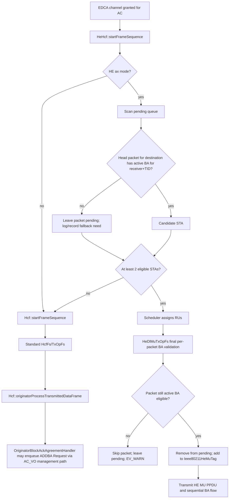

# Phase 01: ADDBA Validation & Handshake Correctness - Research

**Researched:** 2026-06-16
**Domain:** INET 802.11ax MAC coordination, Block Ack agreement state, ADDBA handshake, EDCA fallback
**Confidence:** MEDIUM

<user_constraints>
## User Constraints (from CONTEXT.md)

### Locked Decisions
## Implementation Decisions

### Single-user fallback strategy
- **D-01:** When a packet is destined for a STA lacking an active Block Ack agreement, the AP will transmit it via standard single-user EDCA transmission and initiate an ADDBA handshake sequence (ADDBA Request) in the background. This ensures immediate packet delivery and prepares the STA for future DL MU OFDMA transmissions.
- **D-02:** If the ADDBA handshake fails or times out, the AP will retry the ADDBA request up to a limit of 3 times, after which it will apply a cooldown period before retrying to prevent handshake floods.
- **D-03:** ADDBA Request frames will be scheduled and transmitted via standard single-user EDCA (keeping coordination logic clean and avoiding complex management scheduling in OFDMA).
- **D-04:** ADDBA Request frames will use the AC_VO Access Category to ensure fast delivery, matching the existing INET behavior.

### Packet-level agreement validation
- **D-05:** During DL MU OFDMA container assembly in `HeDlMuTxOpFs::buildMuContainerPacket`, the AP will strictly validate both the destination STA address and the Traffic Identifier (TID). Packets whose TID does not have an active Block Ack agreement will be skipped and left in the pending queue for subsequent single-user or multi-user transmission.
- **D-06:** During candidate station collection in `HeHcf::collectCandidateStations`, the AP will validate only the head-of-line (first) packet for each destination. If it lacks an active agreement for its TID, that destination is ineligible for DL MU scheduling this round, preserving strict FIFO queue order.
- **D-07:** When a packet is skipped during container assembly due to a missing Block Ack agreement, a detailed diagnostic warning (`EV_WARN`) will be logged indicating the skipped packet, the destination STA, the TID, and the reason.

### Dynamic agreement state changes
- **D-08:** When a Block Ack agreement is torn down mid-simulation (e.g. DELBA frame or inactivity timeout), the AP will immediately disable DL MU OFDMA scheduling for the affected STA and TID. Currently queued packets for that TID will fall back to single-user EDCA.
- **D-09:** `HeHcf` will continue to dynamically query the Block Ack agreement handler at the start of each TXOP rather than caching candidates, ensuring a robust, simple, and self-correcting candidates list.
- **D-10:** If a Block Ack agreement is torn down while a DL MU frame sequence is actively in progress, the active sequence will be allowed to complete normally. State changes will apply only to subsequent frame sequences.
- **D-11:** When a new Block Ack agreement is successfully established, if there are pending packets in the queue, the AP will immediately trigger channel contention/access checks to ensure prompt transmission.

### the agent's Discretion
- The exact value of the cooldown period after ADDBA handshake failures.
- The precise formatting of the warning logs.

### Deferred Ideas (OUT OF SCOPE)
None - discussion stayed within phase scope.
</user_constraints>

<phase_requirements>
## Phase Requirements

| ID | Description | Research Support |
|----|-------------|------------------|
| MAC-01 | AP MAC Coordination function checks if an active Block Ack agreement with a received ADDBA Response exists for all destination STAs before scheduling multi-user OFDMA transmissions. | Use `OriginatorBlockAckAgreementHandler::getAgreement(receiver, tid)` plus `OriginatorBlockAckAgreement::getIsAddbaResponseReceived()` as the active-agreement predicate in both candidate collection and container assembly. [VERIFIED: codebase grep `src/inet/linklayer/ieee80211/mac/blockack/OriginatorBlockAckAgreementHandler.cc:95`, `src/inet/linklayer/ieee80211/mac/blockack/OriginatorBlockAckAgreement.h:49`] |
| MAC-02 | AP MAC Coordination function falls back to standard single-user EDCA transmission for STAs that do not have an active Block Ack agreement. | Keep ineligible packets in the EDCA pending queue and route TXOPs that cannot form a valid MU set through `Hcf::startFrameSequence(ac)`; the SU path already triggers ADDBA via `OriginatorBlockAckAgreementHandler::processTransmittedDataFrame()`. [VERIFIED: codebase grep `src/inet/linklayer/ieee80211/mac/coordinationfunction/Hcf.cc:231`, `src/inet/linklayer/ieee80211/mac/blockack/OriginatorBlockAckAgreementHandler.cc:124`] |
</phase_requirements>

## Summary

Phase 1 should be implemented as a MAC-layer eligibility gate, not as a new Block Ack subsystem. The existing Block Ack state model already has the required active-agreement predicate: find the originator agreement by destination MAC and TID, then require `getIsAddbaResponseReceived()` before a packet may enter DL MU OFDMA. [VERIFIED: codebase grep `src/inet/linklayer/ieee80211/mac/blockack/OriginatorBlockAckAgreementHandler.cc:95`, `src/inet/linklayer/ieee80211/mac/blockack/OriginatorBlockAckAgreement.h:49`]

The current `HeHcf::collectCandidateStations()` already performs a partial per-destination/TID BA check, but `HeDlMuTxOpFs::buildMuContainerPacket()` still contains non-BA ACK-duration branches and removes packets into the MU container without a final strict BA guard in its second assembly pass. [VERIFIED: codebase grep `src/inet/linklayer/ieee80211/mac/coordinationfunction/HeHcf.cc:40`, `src/inet/linklayer/ieee80211/mac/framesequence/HeDlMuTxOpFs.cc:91`, `src/inet/linklayer/ieee80211/mac/framesequence/HeDlMuTxOpFs.cc:157`] The planner should treat container assembly as the final authority: no allocation should be added to `Ieee80211HeMuTag` unless that exact packet's receiver and TID still have an active BA agreement. [VERIFIED: codebase grep `src/inet/physicallayer/wireless/ieee80211/packetlevel/Ieee80211HeMuTag.h:42`]

**Primary recommendation:** Add one reusable active-BA predicate and use it in `HeHcf::collectCandidateStations()` and `HeDlMuTxOpFs::buildMuContainerPacket()`; if fewer than two packets remain MU-eligible, abort MU assembly and let `Hcf::startFrameSequence(ac)` transmit via SU EDCA. [VERIFIED: codebase grep `src/inet/linklayer/ieee80211/mac/coordinationfunction/HeHcf.cc:98`, `src/inet/linklayer/ieee80211/mac/coordinationfunction/Hcf.cc:231`]

## Project Constraints (from AGENTS.md)

No `AGENTS.md` file exists in the repository root. [VERIFIED: shell `test -f AGENTS.md`]

Additional project instructions are present in `GEMINI.md`: use C++17, NED, and MSG definitions; target OMNeT++ simulation code; prefer `check_and_cast<T *>()` for mandatory runtime casts; avoid `std::cout`/`printf`; use OMNeT++ `EV` logging. [VERIFIED: codebase grep `GEMINI.md:13`, `GEMINI.md:15`, `GEMINI.md:87`, `GEMINI.md:90`]

## Architectural Responsibility Map

| Capability | Primary Tier | Secondary Tier | Rationale |
|------------|--------------|----------------|-----------|
| MU candidate eligibility | MAC coordination function (`HeHcf`) | Block Ack agreement handler | `HeHcf` owns TXOP selection and already collects candidate STAs from EDCA queues; BA handler owns agreement state. [VERIFIED: codebase grep `src/inet/linklayer/ieee80211/mac/coordinationfunction/HeHcf.cc:78`, `src/inet/linklayer/ieee80211/mac/contract/IOriginatorBlockAckAgreementHandler.h:35`] |
| Packet-level MU admission | Frame sequence (`HeDlMuTxOpFs`) | Pending queue and scheduler | `HeDlMuTxOpFs` owns final packet selection, pending-queue removal, tag allocation, and in-progress registration. [VERIFIED: codebase grep `src/inet/linklayer/ieee80211/mac/framesequence/HeDlMuTxOpFs.cc:48`, `src/inet/linklayer/ieee80211/mac/framesequence/HeDlMuTxOpFs.cc:177`] |
| SU fallback transmission | Standard HCF/EDCA path | Originator Block Ack handler | `Hcf::startFrameSequence()` starts `HcfFs`; standard transmission calls the originator BA handler, which can create and queue ADDBA requests. [VERIFIED: codebase grep `src/inet/linklayer/ieee80211/mac/coordinationfunction/Hcf.cc:231`, `src/inet/linklayer/ieee80211/mac/coordinationfunction/Hcf.cc:557`, `src/inet/linklayer/ieee80211/mac/blockack/OriginatorBlockAckAgreementHandler.cc:124`] |
| ADDBA request creation | Originator Block Ack agreement handler | HCF management enqueue path | `processTransmittedDataFrame()` builds `AddbaReq` when policy says it is needed and sends it through `processMgmtFrame()`, which enqueues management frames through `processUpperFrame()`. [VERIFIED: codebase grep `src/inet/linklayer/ieee80211/mac/blockack/OriginatorBlockAckAgreementHandler.cc:124`, `src/inet/linklayer/ieee80211/mac/coordinationfunction/Hcf.cc:855`] |

## Standard Stack

### Core

| Library/Component | Version | Purpose | Why Standard |
|-------------------|---------|---------|--------------|
| INET MAC C++ classes | local workspace | Implement `HeHcf`, `HeDlMuTxOpFs`, BA handlers, EDCA/HCF flows | The phase modifies existing simulator behavior and should reuse local protocol classes. [VERIFIED: codebase grep `src/inet/linklayer/ieee80211/mac/coordinationfunction/HeHcf.cc:28`] |
| OMNeT++ | available 6.4.0; project doc says 6.3.0 | Build and run simulation modules/tests | `opp_run`, `opp_makemake`, and `opp_test` are installed; project docs specify OMNeT++ as the simulation engine. [VERIFIED: shell `opp_run --version`; VERIFIED: codebase grep `GEMINI.md:14`] |
| INET `.test` framework | local Python runner | Compile and run focused C++/simulation tests | `python/inet/test/opp.py` generates, builds, and runs `.test` files with `opp_test`, `opp_makemake`, and `make`. [VERIFIED: codebase grep `python/inet/test/opp.py:73`, `python/inet/test/opp.py:77`, `python/inet/test/opp.py:88`] |

### Supporting

| Library/Component | Version | Purpose | When to Use |
|-------------------|---------|---------|-------------|
| `Ieee80211HeMuTag` | local workspace | Stores per-RU packet allocations on the MU container | Use only after validating the selected packet has active BA for receiver+TID. [VERIFIED: codebase grep `src/inet/physicallayer/wireless/ieee80211/packetlevel/Ieee80211HeMuTag.h:42`] |
| `IIeee80211HeDlScheduler` | local workspace | Converts eligible candidate STAs into RU allocations | Feed it only validated candidate STA addresses; do not ask the scheduler to make BA decisions. [VERIFIED: codebase grep `src/inet/linklayer/ieee80211/mac/scheduler/IIeee80211HeDlScheduler.h:36`] |
| `OriginatorBlockAckAgreementHandler` | local workspace | Owns originator agreement creation, lookup, DELBA handling, ADDBA response updates | Use for agreement state; do not duplicate BA state in `HeHcf` or the scheduler. [VERIFIED: codebase grep `src/inet/linklayer/ieee80211/mac/blockack/OriginatorBlockAckAgreementHandler.cc:95`, `src/inet/linklayer/ieee80211/mac/blockack/OriginatorBlockAckAgreementHandler.cc:135`] |

### Alternatives Considered

| Instead of | Could Use | Tradeoff |
|------------|-----------|----------|
| BA validation in `HeHcf` + `HeDlMuTxOpFs` | BA validation inside `HeDlSchedulerEqualSizedRUs` | Scheduler only sees MAC addresses and RU geometry, not queued packet TIDs; moving TID validation there would widen scheduler responsibility incorrectly. [VERIFIED: codebase grep `src/inet/linklayer/ieee80211/mac/scheduler/IIeee80211HeDlScheduler.h:45`] |
| Reuse originator BA handler | New MU-specific agreement map | Duplicates DELBA, timeout, ADDBA response, and expiration state already tracked by the handler. [VERIFIED: codebase grep `src/inet/linklayer/ieee80211/mac/blockack/OriginatorBlockAckAgreementHandler.cc:36`, `src/inet/linklayer/ieee80211/mac/blockack/OriginatorBlockAckAgreementHandler.cc:169`] |

**Installation:** No external package installation is required. [VERIFIED: codebase grep `GEMINI.md:35`]

## Package Legitimacy Audit

No external packages are installed by this phase. [VERIFIED: roadmap/context review `.planning/ROADMAP.md`, `.planning/phases/01-addba-validation-handshake-correctness/01-CONTEXT.md`]

**Packages removed due to [SLOP] verdict:** none
**Packages flagged as suspicious [SUS]:** none

## Architecture Patterns

### System Architecture Diagram



### Recommended Project Structure

```text
src/inet/linklayer/ieee80211/mac/
|-- coordinationfunction/HeHcf.{h,cc}          # TXOP-level MU vs SU decision
|-- framesequence/HeDlMuTxOpFs.{h,cc}          # Final MU container packet admission
|-- blockack/OriginatorBlockAckAgreement*.{h,cc} # Existing BA state and ADDBA lifecycle
`-- scheduler/HeDlSchedulerEqualSizedRUs.{h,cc} # RU assignment only

tests/unit/
`-- Ieee80211HeMuAddbaValidation_1.test        # New focused eligibility/fallback coverage
```

### Pattern 1: One Active-Agreement Predicate

**What:** Centralize the receiver+TID active BA check so both candidate collection and container assembly use the same semantics. [VERIFIED: codebase grep `src/inet/linklayer/ieee80211/mac/coordinationfunction/HeHcf.cc:59`, `src/inet/linklayer/ieee80211/mac/framesequence/HeDlMuTxOpFs.cc:109`]

**When to use:** Every time a queued QoS data packet is considered for DL MU OFDMA. [VERIFIED: codebase grep `src/inet/linklayer/ieee80211/mac/Ieee80211Frame_m.h:634`]

**Example:**

```cpp
// Source: local code pattern from HeHcf.cc and HeDlMuTxOpFs.cc
static bool hasActiveOriginatorBlockAckAgreement(IOriginatorBlockAckAgreementHandler *handler,
        const MacAddress& receiverAddress, Tid tid)
{
    auto agreement = handler == nullptr ? nullptr : handler->getAgreement(receiverAddress, tid);
    return agreement != nullptr && agreement->getIsAddbaResponseReceived();
}
```

### Pattern 2: Final Guard Before Queue Removal

**What:** Validate the exact packet selected for an RU before `pendingQueue->removePacket(staPacket)` and before `muTag->addAllocation(...)`. [VERIFIED: codebase grep `src/inet/linklayer/ieee80211/mac/framesequence/HeDlMuTxOpFs.cc:177`, `src/inet/linklayer/ieee80211/mac/framesequence/HeDlMuTxOpFs.cc:195`]

**When to use:** In `HeDlMuTxOpFs::buildMuContainerPacket()`, because agreement state can change after `HeHcf` collected candidates and because the frame sequence is the component that mutates the queue. [VERIFIED: codebase grep `src/inet/linklayer/ieee80211/mac/coordinationfunction/Hcf.cc:460`, `src/inet/linklayer/ieee80211/mac/blockack/OriginatorBlockAckAgreementHandler.cc:169`]

### Pattern 3: SU Fallback Through Existing HCF

**What:** Fallback should call the standard `Hcf::startFrameSequence(ac)` path, not create a MU packet with normal ACK expectations. [VERIFIED: codebase grep `src/inet/linklayer/ieee80211/mac/coordinationfunction/HeHcf.cc:110`, `src/inet/linklayer/ieee80211/mac/coordinationfunction/Hcf.cc:231`]

**When to use:** When fewer than two eligible MU packets remain after active BA filtering, or when the head pending packet selected for fallback lacks an active BA agreement. [VERIFIED: codebase grep `src/inet/linklayer/ieee80211/mac/originator/OriginatorQosMacDataService.cc:81`]

### Anti-Patterns to Avoid

- **Normal-ACK packets inside HE MU container:** The current `HeDlMuTxOpFs` has ACK-duration fallback logic for non-BA packets; Phase 1 should remove or bypass this path for MU admission because MAC-01 requires active Block Ack before MU scheduling. [VERIFIED: codebase grep `src/inet/linklayer/ieee80211/mac/framesequence/HeDlMuTxOpFs.cc:136`]
- **Scheduler-owned BA policy:** `IIeee80211HeDlScheduler::schedule()` receives candidate MAC addresses, center frequency, and bandwidth, not packets or TIDs. [VERIFIED: codebase grep `src/inet/linklayer/ieee80211/mac/scheduler/IIeee80211HeDlScheduler.h:45`]
- **Cached eligibility:** CONTEXT D-09 requires dynamic querying at each TXOP. [VERIFIED: context `.planning/phases/01-addba-validation-handshake-correctness/01-CONTEXT.md`]

## Don't Hand-Roll

| Problem | Don't Build | Use Instead | Why |
|---------|-------------|-------------|-----|
| BA agreement state | MU-specific map keyed by STA/TID | `IOriginatorBlockAckAgreementHandler::getAgreement()` | Existing handler owns agreement lookup, ADDBA response update, DELBA teardown, and expiration. [VERIFIED: codebase grep `src/inet/linklayer/ieee80211/mac/contract/IOriginatorBlockAckAgreementHandler.h:27`] |
| ADDBA request frame construction | New ADDBA builder in `HeHcf` | `OriginatorBlockAckAgreementHandler::buildAddbaRequest()` via `processTransmittedDataFrame()` | Existing SU data path already creates ADDBA requests when policy says they are needed. [VERIFIED: codebase grep `src/inet/linklayer/ieee80211/mac/blockack/OriginatorBlockAckAgreementHandler.cc:56`, `src/inet/linklayer/ieee80211/mac/blockack/OriginatorBlockAckAgreementHandler.cc:124`] |
| Management-frame AC selection | Custom queueing for ADDBA | `Hcf::processMgmtFrame()` -> `processUpperFrame()` | Management frames are classified to `AC_VO` in existing HCF processing. [VERIFIED: codebase grep `src/inet/linklayer/ieee80211/mac/coordinationfunction/Hcf.cc:117`, `src/inet/linklayer/ieee80211/mac/coordinationfunction/Hcf.cc:130`] |
| Test harness | New C++ unit framework | Existing `.test` files under `tests/unit` | The local runner generates, builds, and runs `.test` files with OMNeT++ tools. [VERIFIED: codebase grep `python/inet/test/opp.py:73`] |

**Key insight:** MU OFDMA eligibility is a queue-admission decision layered on top of existing BA agreement lifecycle; duplicating lifecycle state is more risky than strictly consulting the handler at every admission point. [VERIFIED: codebase grep `src/inet/linklayer/ieee80211/mac/blockack/OriginatorBlockAckAgreementHandler.cc:15`, `src/inet/linklayer/ieee80211/mac/blockack/OriginatorBlockAckAgreementHandler.cc:147`]

## Common Pitfalls

### Pitfall 1: Candidate Filtering Without Final Packet Guard

**What goes wrong:** A STA is collected as eligible, but `HeDlMuTxOpFs` later removes a packet whose TID lacks active BA. [VERIFIED: codebase grep `src/inet/linklayer/ieee80211/mac/framesequence/HeDlMuTxOpFs.cc:157`]

**Why it happens:** `collectCandidateStations()` returns only MAC addresses; the scheduler and later assembly pass do not carry the validated TID. [VERIFIED: codebase grep `src/inet/linklayer/ieee80211/mac/coordinationfunction/HeHcf.cc:40`, `src/inet/linklayer/ieee80211/mac/scheduler/IIeee80211HeDlScheduler.h:39`]

**How to avoid:** Revalidate the exact selected `Ieee80211DataHeader` immediately before queue removal and tag allocation. [VERIFIED: codebase grep `src/inet/linklayer/ieee80211/mac/framesequence/HeDlMuTxOpFs.cc:177`]

**Warning signs:** `Ieee80211HeMuTag` contains a packet whose `getTid()` has no agreement or whose agreement has `getIsAddbaResponseReceived() == false`. [VERIFIED: codebase grep `src/inet/physicallayer/wireless/ieee80211/packetlevel/Ieee80211HeMuTag.h:42`]

### Pitfall 2: Starving SU Fallback Packets

**What goes wrong:** Ineligible packets remain pending while the AP keeps forming MU opportunities from other eligible STAs. [ASSUMED]

**Why it happens:** Current `HeHcf::startFrameSequence()` starts MU whenever `collectCandidateStations()` returns at least two candidates. [VERIFIED: codebase grep `src/inet/linklayer/ieee80211/mac/coordinationfunction/HeHcf.cc:98`]

**How to avoid:** The plan should define an explicit fallback trigger for missing-agreement packets, such as falling back to `Hcf::startFrameSequence(ac)` when the pending queue's next SU-transmittable packet is MU-ineligible, or adding a bounded fairness rule after MU skips. [ASSUMED]

**Warning signs:** Logs show repeated `EV_WARN` skips for the same receiver/TID while MU containers keep being assembled for other STAs. [ASSUMED]

### Pitfall 3: Treating "Agreement Exists" as "Agreement Active"

**What goes wrong:** A placeholder agreement created when ADDBA Request is sent is accepted as MU-eligible before ADDBA Response arrives. [VERIFIED: codebase grep `src/inet/linklayer/ieee80211/mac/blockack/OriginatorBlockAckAgreementHandler.cc:127`, `src/inet/linklayer/ieee80211/mac/blockack/OriginatorBlockAckAgreement.h:28`]

**Why it happens:** `processTransmittedDataFrame()` creates an agreement before `processReceivedAddbaResp()` sets `isAddbaResponseReceived`. [VERIFIED: codebase grep `src/inet/linklayer/ieee80211/mac/blockack/OriginatorBlockAckAgreementHandler.cc:129`, `src/inet/linklayer/ieee80211/mac/blockack/OriginatorBlockAckAgreementHandler.cc:147`]

**How to avoid:** Always require both non-null agreement and `getIsAddbaResponseReceived()`. [VERIFIED: codebase grep `src/inet/linklayer/ieee80211/mac/coordinationfunction/HeHcf.cc:64`, `src/inet/linklayer/ieee80211/mac/framesequence/HeDlMuTxOpFs.cc:118`]

## Code Examples

### Candidate Filtering by Head Packet Per Destination

```cpp
// Source: local pattern from HeHcf::collectCandidateStations()
std::vector<MacAddress> candidates;
std::vector<MacAddress> seenDestinations;
for (int i = 0; i < queue->getNumPackets(); ++i) {
    Packet *packet = queue->getPacket(i);
    const auto& header = packet->peekAtFront<Ieee80211MacHeader>();
    const auto receiver = header->getReceiverAddress();
    if (receiver.isMulticast() || receiver.isBroadcast())
        continue;
    if (std::find(seenDestinations.begin(), seenDestinations.end(), receiver) != seenDestinations.end())
        continue;
    seenDestinations.push_back(receiver);

    auto dataHeader = dynamicPtrCast<const Ieee80211DataHeader>(header);
    if (dataHeader != nullptr && dataHeader->getType() == ST_DATA_WITH_QOS &&
            hasActiveOriginatorBlockAckAgreement(baHandler, receiver, dataHeader->getTid()))
        candidates.push_back(receiver);
}
```

### Container Assembly Guard

```cpp
// Source: recommended guard before existing pendingQueue->removePacket(staPacket)
auto dataHeader = dynamicPtrCast<const Ieee80211DataHeader>(staPacket->peekAtFront<Ieee80211MacHeader>());
if (dataHeader == nullptr || dataHeader->getType() != ST_DATA_WITH_QOS ||
        !hasActiveOriginatorBlockAckAgreement(originatorBAHandler, alloc.staAddress, dataHeader->getTid())) {
    EV_WARN << "HeDlMuTxOpFs: skipping packet " << staPacket->getName()
            << " for STA " << alloc.staAddress
            << ", TID " << (dataHeader == nullptr ? -1 : (int)dataHeader->getTid())
            << ": missing active Block Ack agreement." << endl;
    continue;
}
```

## State of the Art

| Old Approach | Current Approach | When Changed | Impact |
|--------------|------------------|--------------|--------|
| Existing `HeDlMuTxOpFs` permits non-BA ACK-duration handling in MU assembly. | Phase 1 should make MU assembly BA-only and use SU EDCA fallback for non-eligible packets. | Phase 1, 2026-06-16 planning cycle | Satisfies MAC-01 and MAC-02 without inventing a second BA lifecycle. [VERIFIED: codebase grep `src/inet/linklayer/ieee80211/mac/framesequence/HeDlMuTxOpFs.cc:136`; VERIFIED: requirements `.planning/REQUIREMENTS.md`] |
| Candidate list is MAC-only. | Planner should preserve MAC-only scheduler input but revalidate packet/TID in frame sequence. | Phase 1, 2026-06-16 planning cycle | Keeps RU scheduling independent from BA state while preventing stale/changed agreement leakage. [VERIFIED: codebase grep `src/inet/linklayer/ieee80211/mac/scheduler/IIeee80211HeDlScheduler.h:45`] |

**Deprecated/outdated:**
- Normal ACK fallback inside MU container admission is incompatible with MAC-01 for this project. [VERIFIED: requirements `.planning/REQUIREMENTS.md`; VERIFIED: codebase grep `src/inet/linklayer/ieee80211/mac/framesequence/HeDlMuTxOpFs.cc:136`]

## Assumptions Log

| # | Claim | Section | Risk if Wrong |
|---|-------|---------|---------------|
| A1 | Ineligible packets can starve if MU opportunities continue for other eligible STAs. | Common Pitfalls | Planner may under-specify SU fallback triggering and satisfy packet skipping but not timely fallback. |
| A2 | A bounded fairness or head-packet fallback rule is acceptable to satisfy MAC-02. | Common Pitfalls | User may prefer fallback only when fewer than two eligible MU STAs exist. |

## Open Questions

1. **Fallback trigger when eligible MU traffic coexists with ineligible traffic**
   - What we know: `HeHcf` starts MU whenever at least two candidates are returned. [VERIFIED: codebase grep `src/inet/linklayer/ieee80211/mac/coordinationfunction/HeHcf.cc:98`]
   - What's unclear: Whether MAC-02 requires immediate SU service for the first ineligible pending packet even when a valid MU opportunity exists. [ASSUMED]
   - Recommendation: Planner should add an explicit task decision: either fallback when fewer than two eligible STAs remain, or fallback when the pending queue's earliest unicast QoS packet lacks active BA. [ASSUMED]

2. **ADDBA failure retry/cooldown implementation**
   - What we know: Context locks retry limit at 3 and says cooldown is discretionary; `computeAddbaFailureTimeout()` is currently unimplemented. [VERIFIED: context `.planning/phases/01-addba-validation-handshake-correctness/01-CONTEXT.md`; VERIFIED: codebase grep `src/inet/linklayer/ieee80211/mac/blockack/OriginatorBlockAckAgreementPolicy.cc:32`]
   - What's unclear: The exact cooldown duration. [VERIFIED: context `.planning/phases/01-addba-validation-handshake-correctness/01-CONTEXT.md`]
   - Recommendation: Use the smallest scoped implementation that prevents repeated ADDBA enqueue for the same receiver/TID after failure, with a documented default cooldown parameter if a NED parameter already exists or a local constant if not. [ASSUMED]

## Environment Availability

| Dependency | Required By | Available | Version | Fallback |
|------------|-------------|-----------|---------|----------|
| `opp_run` | Running simulations/tests | yes | OMNeT++ 6.4.0 binary present | none |
| `opp_test` | `.test` unit files | yes | command present | none |
| `opp_makemake` | Test Makefile generation | yes | command present | none |
| `opp_featuretool` | Feature configuration checks | yes | command present | none |
| `make` | Build/tests | yes | GNU Make 4.4.1 | none |
| `clang++` | C++ build | yes | Ubuntu clang 21.1.8 | `g++` 15.2.0 |
| `python3` | INET test runner scripts | yes | Python 3.14.4 | none |
| `ctx7` | Optional external docs lookup | no | - | Local code evidence; Context7 unavailable |

**Missing dependencies with no fallback:** none for local code research. [VERIFIED: shell command availability probes]

**Missing dependencies with fallback:**
- `ctx7` is missing; this research uses local code as the authoritative source for phase-specific classes. [VERIFIED: shell `command -v ctx7`]

## Validation Architecture

### Test Framework

| Property | Value |
|----------|-------|
| Framework | OMNeT++ `opp_test` plus INET Python runners. [VERIFIED: codebase grep `python/inet/test/opp.py:73`] |
| Config file | Per-test `%inifile` sections in `.test` files. [VERIFIED: codebase grep `tests/unit/Ieee80211HeMuSeqAck_1.test:39`] |
| Quick run command | `python3 - <<'PY'\nfrom inet.test.opp import run_opp_tests\nrun_opp_tests('tests/unit', filter='Ieee80211HeMuAddbaValidation_1.test', full_match=True)\nPY` [VERIFIED: codebase grep `python/inet/test/opp.py:150`] |
| Full suite command | `./bin/inet_run_unit_tests` [VERIFIED: codebase grep `bin/inet_run_unit_tests:1`, `python/inet/test/all.py:51`] |

### Phase Requirements -> Test Map

| Req ID | Behavior | Test Type | Automated Command | File Exists? |
|--------|----------|-----------|-------------------|--------------|
| MAC-01 | Packet without active BA for receiver+TID is not added to `Ieee80211HeMuTag`. | unit `.test` with mock scheduler/BA handler | Quick run command above | no - Wave 0 |
| MAC-01 | Agreement placeholder without ADDBA Response is not considered active. | unit `.test` | Quick run command above | no - Wave 0 |
| MAC-02 | With fewer than two active-BA eligible STAs, `HeHcf` delegates to standard `Hcf::startFrameSequence(ac)`. | unit/integration `.test` using subclass or log assertion | Quick run command above | no - Wave 0 |
| MAC-02 | SU transmission path triggers existing ADDBA request creation for missing agreement. | unit/integration `.test` around `OriginatorBlockAckAgreementHandler::processTransmittedDataFrame()` or HCF management enqueue | Quick run command above | partial - existing code, no focused test |

### Sampling Rate

- **Per task commit:** Run the new focused `.test` file once it exists. [VERIFIED: codebase grep `python/inet/test/opp.py:150`]
- **Per wave merge:** `./bin/inet_run_unit_tests`. [VERIFIED: codebase grep `bin/inet_run_unit_tests:3`]
- **Phase gate:** New focused test green plus no regression in `tests/unit/Ieee80211HeMuSeqAck_1.test`. [VERIFIED: codebase grep `tests/unit/Ieee80211HeMuSeqAck_1.test:1`]

### Wave 0 Gaps

- [ ] `tests/unit/Ieee80211HeMuAddbaValidation_1.test` - covers MAC-01/MAC-02 focused BA eligibility and SU fallback. [VERIFIED: current file absence via `rg`]
- [ ] Test doubles for `IOriginatorBlockAckAgreementHandler` and `OriginatorBlockAckAgreement` active/inactive states. [ASSUMED]
- [ ] Decide whether the quick command should be encoded in a helper script or documented in PLAN only. [ASSUMED]

## Security Domain

### Applicable ASVS Categories

| ASVS Category | Applies | Standard Control |
|---------------|---------|------------------|
| V2 Authentication | no | Simulator MAC protocol code; no user authentication surface. [VERIFIED: codebase scope grep `src/inet/linklayer/ieee80211/mac`] |
| V3 Session Management | no | No web/session lifecycle. [VERIFIED: codebase scope grep `src/inet/linklayer/ieee80211/mac`] |
| V4 Access Control | no | No application authorization boundary. [VERIFIED: codebase scope grep `src/inet/linklayer/ieee80211/mac`] |
| V5 Input Validation | yes | Validate packet header type, destination, TID range, and active BA state before scheduling. [VERIFIED: codebase grep `src/inet/linklayer/ieee80211/mac/channelaccess/Edca.cc:32`] |
| V6 Cryptography | no | No cryptographic implementation in this phase. [VERIFIED: phase scope `.planning/ROADMAP.md`] |

### Known Threat Patterns for INET MAC Simulation Code

| Pattern | STRIDE | Standard Mitigation |
|---------|--------|---------------------|
| Invalid TID or non-QoS packet routed into MU sequence | Tampering | Check `ST_DATA_WITH_QOS` and TID before BA lookup; leave non-eligible packets pending. [VERIFIED: codebase grep `src/inet/linklayer/ieee80211/mac/Ieee80211Frame_m.h:634`] |
| Null agreement handler in optional BA-disabled configuration | Denial of Service | Treat null handler as not eligible for MU; fallback to SU. [VERIFIED: codebase grep `src/inet/linklayer/ieee80211/mac/coordinationfunction/Hcf.cc:58`] |
| Stale agreement after DELBA | Tampering | Query handler dynamically at each TXOP and before packet removal. [VERIFIED: codebase grep `src/inet/linklayer/ieee80211/mac/blockack/OriginatorBlockAckAgreementHandler.cc:169`] |

## Sources

### Primary (HIGH confidence)
- `.planning/phases/01-addba-validation-handshake-correctness/01-CONTEXT.md` - locked implementation decisions and discretion areas. [VERIFIED: local file read]
- `.planning/REQUIREMENTS.md` - MAC-01 and MAC-02 requirement text. [VERIFIED: local file read]
- Local INET source files under `src/inet/linklayer/ieee80211/mac/` and `src/inet/physicallayer/wireless/ieee80211/packetlevel/` - implementation behavior. [VERIFIED: codebase grep]

### Secondary (MEDIUM confidence)
- `GEMINI.md` - project constraints and stack summary generated from project docs. [VERIFIED: local file read]
- `.planning/ROADMAP.md` and `.planning/STATE.md` - phase definition and project state. [VERIFIED: local file read]

### Tertiary (LOW confidence)
- Assumptions about fallback starvation and fairness policy; planner should lock these in PLAN or discuss if behavior needs stricter user confirmation. [ASSUMED]

## Metadata

**Confidence breakdown:**
- Standard stack: HIGH - verified from local project docs, tool probes, and test runner source.
- Architecture: HIGH - verified from local code paths and interfaces.
- Pitfalls: MEDIUM - code-level pitfalls verified; starvation/fairness pitfall is inferred and tagged assumed.

**Research date:** 2026-06-16
**Valid until:** 2026-07-16 for local code structure, or until the 802.11 MAC files change.
