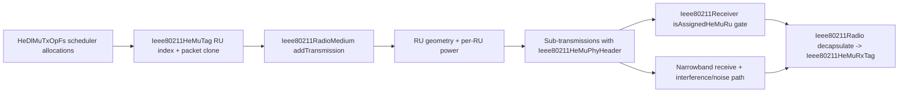

# Phase 03: PHY Layer RU Behavior & Attenuation Auditing - Research

**Researched:** 2026-06-17  
**Domain:** INET 802.11ax packet-level HE MU RU propagation, per-RU attenuation/noise correctness  
**Confidence:** HIGH

## User Constraints (from CONTEXT.md)

### Locked Decisions

### RU Frequency Mapping
- **D-01:** Scheduler-provided RU geometry is authoritative; do not treat medium-side reconstruction from count/channel as the source of truth.
- **D-02:** Invalid RU index or missing RU mapping is a hard failure condition.
- **D-03:** RU mapping metadata remains in both `Ieee80211HeMuTag` and HE MU PHY header allocations.
- **D-04:** Any scheduler-allocation versus packet-receiver mismatch is fail-fast and aborts MU assembly/transmission.

### Per-RU Power Split
- **D-05:** RU transmit power is proportional to each RU's bandwidth.
- **D-06:** Power normalization uses nominal transmission bandwidth (mode/channel bandwidth), not only active-allocation sum.
- **D-07:** Add power-conservation audit checks (sum of RU power versus expected mapped fraction) with logging for drift.
- **D-08:** For irregular future RU geometries, power derivation still follows each RU's actual bandwidth.

### Noise and Interference Isolation
- **D-09:** Sub-transmissions from the same MU PPDU are non-interfering with each other by default.
- **D-10:** Main MU transmission object is physically suppressed; only sub-transmissions propagate for PHY effects.
- **D-11:** Add explicit per-RU audit observability tied to center frequency and RU bandwidth.
- **D-12:** Isolated-RU behavior remains the default for v1 correctness; advanced coupling/leakage is opt-in future work.

### Allocation Validation and Failure Policy
- **D-13:** Allocation validation failures abort MU transmission (no tolerant partial-send default in this phase).
- **D-14:** Validation failures are signaled with `cRuntimeError` containing structured reason details.
- **D-15:** Ownership/memory-consistency errors in allocation handling are fatal.
- **D-16:** No tolerant fallback path is introduced in Phase 3 auditing logic.

### the agent's Discretion
- None. The discussion locked strict behavior for all selected areas.

### Deferred Ideas (OUT OF SCOPE)
- Optional RU leakage/coupling model as a future opt-in capability outside current phase scope.
- Configurable fatal/non-fatal fallback modes for allocation errors as future enhancement work.

## Phase Requirements

| ID | Description | Research Support |
|----|-------------|------------------|
| PHY-01 | Signals on separate RUs are attenuated and received based on frequency-selective path loss of their corresponding sub-channel band, rather than the main channel. | Confirms RU sub-transmissions are created with RU center frequency/bandwidth/power in medium; identifies mismatch risk where RU geometry is reconstructed from allocation count, not scheduler geometry. |
| PHY-02 | Channel noise is calculated independently per RU sub-channel band. | Confirms separate RU sub-transmissions feed narrowband reception path; isolates where per-RU listening/noise behavior is inherited and where explicit instrumentation tests are missing. |

## Project Constraints (from copilot-instructions.md)

- GSD command workflows must use corresponding `.github/skills/gsd-*` handling. [VERIFIED: repository instructions]
- Do not apply GSD workflows unless explicitly invoked by user command intent. [VERIFIED: repository instructions]
- Prefer matching custom agents in `.github/agents` when command requests subagent behavior. [VERIFIED: repository instructions]

Note: repository has `.github/copilot-instructions.md`; no root-level `./copilot-instructions.md` was found.

## Summary

Current implementation already establishes the core Phase 3 shape: MU payload is split into per-RU sub-transmissions in `Ieee80211RadioMedium`, each with RU-specific analog model center frequency and bandwidth, while the receiver filters by RU assignment using HE MU PHY header metadata. This provides the technical foundation for PHY-01/PHY-02 and aligns with D-09/D-10 isolation behavior. [VERIFIED: codebase inspection]

Primary risk is authoritative RU geometry drift: `HeDlMuTxOpFs` consumes scheduler RU indices, but `Ieee80211RadioMedium` currently reconstructs RU geometry as equal-width partitions via `calculateHeRus(center, totalBandwidth, numRUs)` based only on allocation count. That can violate D-01 and create incorrect path-loss/noise bands for non-uniform RU layouts (future and potentially current custom schedulers). [VERIFIED: codebase inspection]

Testing already covers RU assignment filtering and serializer fidelity, but not explicit assertions that path loss/noise are RU-band specific under divergent frequencies. Phase 3 planning should therefore prioritize observability and deterministic assertions around RU center frequency/bandwidth and effective per-RU receive/noise behavior. [VERIFIED: existing tests]

**Primary recommendation:** Keep fail-fast policy, preserve dual metadata path (tag + PHY header), and make medium-side RU band derivation explicitly scheduler-authored (or validated equivalent) before adding targeted RU-frequency/noise tests.

## Architectural Responsibility Map

| Capability | Primary Tier | Secondary Tier | Rationale |
|------------|-------------|----------------|-----------|
| RU allocation selection and validation | API / Backend (MAC sequencing layer) | Database / Storage (none) | `HeDlMuTxOpFs` decides admissible allocations and fail-fast behavior before PHY handoff. |
| RU metadata propagation TX->RX | API / Backend (PHY packet pipeline) | Browser / Client (none) | `Ieee80211HeMuTag` + `Ieee80211HeMuPhyHeader` carry RU identity across medium and decapsulation. |
| Frequency-selective attenuation path | API / Backend (radio medium analog modeling) | Database / Storage (none) | `Ieee80211RadioMedium` assigns RU center frequency/bandwidth/power into per-RU analog models. |
| Per-RU noise/isolation behavior | API / Backend (receiver/listening/interference path) | API / Backend (medium interference policy) | Narrowband receive feasibility + interference gating determine RU-local noise/interference effects. |
| Audit observability and verification | API / Backend (unit test harness + logging) | CDN / Static (none) | Existing `.test` harness should be extended with RU-frequency/noise assertions. |

## Standard Stack

### Core
| Library | Version | Purpose | Why Standard |
|---------|---------|---------|--------------|
| INET 802.11 packet-level PHY/MAC modules | in-tree | Implements HE MU scheduling, medium split, RX decapsulation | Existing project baseline; no external dependency required for phase scope. [VERIFIED: codebase inspection] |
| OMNeT++ unit test `.test` harness (`opp_test`) | toolchain | Deterministic unit/integration verification | Existing repository tests use this harness heavily for protocol/PHY behavior. [VERIFIED: codebase inspection] |

### Supporting
| Library | Version | Purpose | When to Use |
|---------|---------|---------|-------------|
| `bin/inet_run_unit_tests` wrapper | in-tree script | Batch execution of INET unit tests | Use when INET Python environment is initialized (`PYTHONPATH`/setenv). [VERIFIED: local execution] |

### Alternatives Considered
| Instead of | Could Use | Tradeoff |
|------------|-----------|----------|
| In-medium RU reconstruction from count | Scheduler-authored RU geometry in tag/header | Slightly more metadata handling, but prevents geometry drift and satisfies D-01 under irregular RU plans. |
| Silent skip on RU mismatch | `cRuntimeError` fail-fast | Hard stops in invalid scenarios, but matches D-02/D-13/D-14 correctness policy. |

**Installation:**
```bash
# No new external packages required for this phase.
```

## Package Legitimacy Audit

No external packages are introduced in this phase; package legitimacy gate is not applicable.

| Package | Registry | Age | Downloads | Source Repo | Verdict | Disposition |
|---------|----------|-----|-----------|-------------|---------|-------------|
| none | - | - | - | - | - | Not applicable |

**Packages removed due to [SLOP] verdict:** none  
**Packages flagged as suspicious [SUS]:** none

## Architecture Patterns

### System Architecture Diagram



### Recommended Project Structure
```text
src/inet/linklayer/ieee80211/mac/framesequence/
  HeDlMuTxOpFs.cc            # Scheduler output validation and MU tag population
src/inet/physicallayer/wireless/ieee80211/packetlevel/
  Ieee80211HeMuTag.h         # RU metadata ownership/lifecycle
  Ieee80211RadioMedium.cc    # RU split, power assignment, interference policy
  Ieee80211Radio.cc          # HE MU decapsulation to Rx tag
tests/unit/
  Ieee80211HeRu_1.test       # RU geometry baseline test
  Ieee80211HeMuRx_1.test     # RU assignment filtering baseline
  (new) Phase-3 RU pathloss/noise tests
```

### Pattern 1: Fail-fast allocation integrity before PHY propagation
**What:** Validate RU allocations and packet ownership at MAC assembly and medium split boundaries, throwing `cRuntimeError` on mismatch. [VERIFIED: codebase inspection]
**When to use:** Any point RU index drives physical behavior (frequency, bandwidth, power, receiver match).
**Example:**
```cpp
if (ruIndex < 0 || ruIndex >= (int)rus.size())
    throw cRuntimeError("Invalid RU index %d", ruIndex);
```

### Pattern 2: Dual-path RU metadata for observability and receive filtering
**What:** Keep RU allocation metadata in both tag (`Ieee80211HeMuTag`) and per-subframe PHY header (`Ieee80211HeMuPhyHeader`). [VERIFIED: codebase inspection]
**When to use:** Multi-stage pipelines where metadata must survive cloning/splitting/decapsulation.

### Anti-Patterns to Avoid
- **Reconstructing authoritative RU geometry from allocation count:** breaks D-01 under non-uniform RU plans and can misapply path-loss/noise bands.
- **Tolerant partial-send on validation failure:** contradicts locked D-13/D-16 and hides correctness defects.
- **Allowing main MU transmission to physically interfere:** violates D-10 and double-counts energy/interference.

## Don't Hand-Roll

| Problem | Don't Build | Use Instead | Why |
|---------|-------------|-------------|-----|
| HE MU PHY serialization | Custom byte packing | Existing `Ieee80211PhyHeader` msg + serializer path | Already tested by `Ieee80211HeMuPhyHeaderSerializer_1.test`; avoids protocol drift. |
| RU assignment filtering | Custom post-decapsulation mapping layer | `Ieee80211Receiver::isAssignedHeMuRu` + HE MU header allocations | Existing path already gates reception deterministically per RU. |
| Test harness orchestration | Ad-hoc shell loops | Existing OMNeT++ `.test` + INET test runners | Provides reproducible CI-friendly assertions and output matching. |

**Key insight:** Phase 3 should strengthen and instrument existing HE MU pipeline, not introduce parallel RU data paths.

## Common Pitfalls

### Pitfall 1: RU geometry mismatch between scheduler intent and medium reconstruction
**What goes wrong:** Path loss/noise are computed on reconstructed equal-width RUs rather than scheduler-defined RU bands.  
**Why it happens:** `calculateHeRus(center, bandwidth, numRUs)` is count-based only.  
**How to avoid:** Carry scheduler RU center/bandwidth metadata through tag/header, or validate reconstructed geometry equivalence before use.  
**Warning signs:** Correct RU index but incorrect center frequency/bandwidth in logs.

### Pitfall 2: Power budget drift across RU split
**What goes wrong:** Sum of assigned RU powers diverges from expected mapped fraction.  
**Why it happens:** Implicit assumptions on denominator or missing allocations.  
**How to avoid:** Add explicit conservation audit (`sum(ruPower)` vs expected) and hard-fail on significant drift in strict mode.  
**Warning signs:** Reproducible SNR shifts when RU count/layout changes.

### Pitfall 3: Hidden ownership bugs with cloned RU packets
**What goes wrong:** Double delete, leaks, or stale ownership tree references.  
**Why it happens:** Multiple duplication points (`HeMuTag`, medium split, remove paths).  
**How to avoid:** Preserve current ownership-drop pattern and keep one clear owner per clone lifecycle phase.  
**Warning signs:** Intermittent crashes during transmission cleanup/removal.

## Code Examples

### RU-specific analog model creation (existing pattern)
```cpp
W ruPower = totalPower * (ru.bandwidth.get() / totalBandwidth.get());
auto ruAnalogModel = flatTransmitter->getAnalogModel()->createAnalogModel(
    transmission->getPreambleDuration(),
    transmission->getHeaderDuration(),
    transmission->getDataDuration(),
    ru.centerFrequency,
    ru.bandwidth,
    ruPower
);
```

### Receiver RU assignment gate (existing pattern)
```cpp
int ruIndex = phyHeader->getRuIndex();
for (unsigned int i = 0; i < phyHeader->getAllocationsArraySize(); ++i) {
    const auto& alloc = phyHeader->getAllocations(i);
    if (alloc.staAddress == myMacAddress)
        return alloc.ruIndex == ruIndex;
}
```

## State of the Art

| Old Approach | Current Approach | When Changed | Impact |
|--------------|------------------|--------------|--------|
| Single aggregate MU transmission handling | Per-RU sub-transmission split with main-TX suppression/interference override | Recent HE MU integration in this branch | Enables RU-isolated physical effects and per-RU RX filtering. |
| Implicit validation | Explicit fail-fast with `cRuntimeError` in HE MU assembly/split paths | Phase 1+2 progression | Improves determinism and debugging of correctness regressions. |

**Deprecated/outdated:**
- Treating RU count-only reconstruction as equivalent to scheduler geometry in all cases.

## Assumptions Log

| # | Claim | Section | Risk if Wrong |
|---|-------|---------|---------------|
| A1 | Phase 3 can be completed without introducing third-party packages. [ASSUMED] | Standard Stack / Package Legitimacy | Low: if false, legitimacy and install planning must be added. |

## Open Questions

1. **Where should authoritative RU center-frequency/bandwidth live long-term?**
   - What we know: current split uses RU index + reconstructed geometry from channel bandwidth/count.
   - What's unclear: whether scheduler already has richer RU geometry that can be propagated directly.
   - Recommendation: decide in planning Wave 1 and enforce one canonical geometry source with explicit validation.

2. **What tolerance threshold defines power conservation drift failure?**
   - What we know: D-07 requires power-conservation audits.
   - What's unclear: exact numeric tolerance for floating-point comparisons in runtime checks.
   - Recommendation: lock a deterministic epsilon and test against stable expected values.

## Environment Availability

| Dependency | Required By | Available | Version | Fallback |
|------------|------------|-----------|---------|----------|
| `make` | Build/test prep | ✓ | GNU Make 4.4.1 | - |
| `python3` | INET test wrapper scripts | ✓ | Python 3.14.4 | Use direct `opp_test` if wrapper env missing |
| `bin/inet_run_unit_tests` | Unit-test orchestration | ✓ (file present) | in-tree script | Requires INET Python module env; otherwise fails |
| `opp_test` | Direct unit test execution | ✓ | OMNeT++ toolchain | Primary fallback |
| `opp_run` | Simulation-level validation | ✓ | OMNeT++ toolchain | - |

**Missing dependencies with no fallback:**
- None identified.

**Missing dependencies with fallback:**
- INET Python module import context for `bin/inet_run_unit_tests` in a plain shell; fallback is direct `opp_test` or running after project `setenv`.

## Validation Architecture

### Test Framework
| Property | Value |
|----------|-------|
| Framework | OMNeT++ unit `.test` harness (`opp_test`) + INET wrappers |
| Config file | test-local `.test` files (no single central config) |
| Quick run command | `opp_test tests/unit/Ieee80211HeRu_1.test tests/unit/Ieee80211HeMuRx_1.test` |
| Full suite command | `opp_test tests/unit/*.test` |

### Phase Requirements -> Test Map
| Req ID | Behavior | Test Type | Automated Command | File Exists? |
|--------|----------|-----------|-------------------|-------------|
| PHY-01 | RU-specific path-loss behavior follows RU sub-channel center/bandwidth | unit/integration | `opp_test tests/unit/Ieee80211HeRu_1.test` (baseline) + new Phase-3 RU attenuation test | ❌ Wave 0 |
| PHY-02 | Noise computed independently per RU sub-channel | unit/integration | Existing HE MU RX baseline + new Phase-3 RU noise isolation test | ❌ Wave 0 |

### Sampling Rate
- **Per task commit:** `opp_test tests/unit/Ieee80211HeRu_1.test tests/unit/Ieee80211HeMuRx_1.test`
- **Per wave merge:** `opp_test tests/unit/Ieee80211He*.test`
- **Phase gate:** `opp_test tests/unit/Ieee80211He*.test` plus new phase-specific RU attenuation/noise tests green

### Wave 0 Gaps
- [ ] `tests/unit/Ieee80211HeMuRuAttenuation_1.test` - explicit RU-frequency path-loss assertions for PHY-01
- [ ] `tests/unit/Ieee80211HeMuRuNoiseIsolation_1.test` - independent RU noise assertions for PHY-02
- [ ] Optional helper fixture in `tests/unit/lib/` for reusable HE MU medium setup

## Security Domain

### Applicable ASVS Categories

| ASVS Category | Applies | Standard Control |
|---------------|---------|-----------------|
| V2 Authentication | no | Not in phase scope |
| V3 Session Management | no | Not in phase scope |
| V4 Access Control | no | Not in phase scope |
| V5 Input Validation | yes | Fail-fast RU index and allocation consistency checks (`cRuntimeError`) |
| V6 Cryptography | no | Not in phase scope |

### Known Threat Patterns for INET C++ simulation stack

| Pattern | STRIDE | Standard Mitigation |
|---------|--------|---------------------|
| Invalid RU index injection via scheduler mismatch | Tampering | Strict bounds and allocation consistency validation, abort on violation |
| Metadata/packet ownership misuse | Denial of Service | Controlled ownership transfer and deterministic delete paths |
| Silent correctness drift (wrong RU band) | Tampering | Explicit RU center/bandwidth audit logging and deterministic tests |

## Sources

### Primary (HIGH confidence)
- Repository code inspection: `HeDlMuTxOpFs.cc`, `Ieee80211HeMuTag.h`, `Ieee80211RadioMedium.cc`, `Ieee80211Radio.cc`, `Ieee80211Receiver.cc`, `Ieee80211HeRu.h`, `Ieee80211PhyHeader.msg`, `Ieee80211Tag.msg`
- Repository tests inspection: `tests/unit/Ieee80211HeRu_1.test`, `tests/unit/Ieee80211HeMuRx_1.test`, `tests/unit/Ieee80211HeMuPhyHeaderSerializer_1.test`, `tests/unit/Ieee80211HeMuAddbaValidation_1.test`, `tests/unit/Ieee80211HeMuSeqAck_1.test`

### Secondary (MEDIUM confidence)
- Local environment probes for tool availability (`make`, `python3`, `opp_test`, `opp_run`, wrapper script behavior)

### Tertiary (LOW confidence)
- None

## Metadata

**Confidence breakdown:**
- Standard stack: HIGH - all elements are in-repo and directly inspected.
- Architecture: HIGH - control/data flow traced through concrete source files and tests.
- Pitfalls: HIGH - derived from concrete mismatch/ownership/interference code paths.

**Graph context:** unavailable (`graphify status` reported no graph built); no graph-derived claims used.

**Research date:** 2026-06-17  
**Valid until:** 2026-07-17