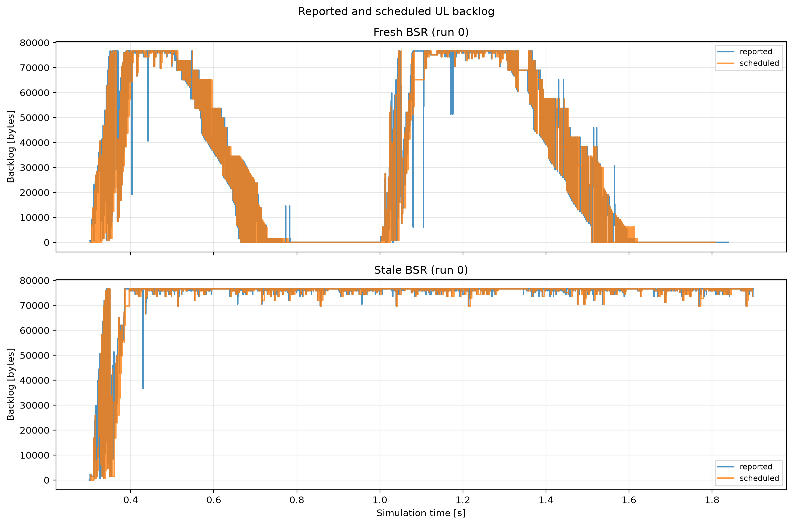

# HE buffer status reporting

IEEE Std 802.11-2024 Clause 26.5.5 specifies HE buffer-status reporting and conditions on BSR capability (`80211ax-2024:chunk:09817`). A BSR is the AP's scheduling input: it can become stale and is not itself proof that payload was delivered.

The fresh condition creates two explicit traffic bursts so backlog fills, drains, and refills. The stale condition uses a 10 ms report-validity horizon, short enough to force repeated refresh but long enough for an exchange to complete deterministically. The figure shows the AP's reported byte count and the bytes chosen by the UL scheduler as event-driven step observations for run 0.

Expected behavior is causal rather than monotonic: scheduled bytes should follow nonzero reports, quiet gaps should let backlog drain, and stale reports should stop driving allocations until refreshed. The plot does not equate reported bytes with actual queue occupancy between events; packet delivery and UORA are analyzed separately.

In the refreshed `0.3–1.9 s` window, the fresh condition has mean reported and
scheduled backlogs of `36,079 B` and `41,506 B`; the stale condition rises to
`73,410 B` and `73,565 B`. These are AP telemetry vectors, not delivered
payload counts, and the difference is interpreted only as changed scheduling
state under the 10 ms report-age policy.
