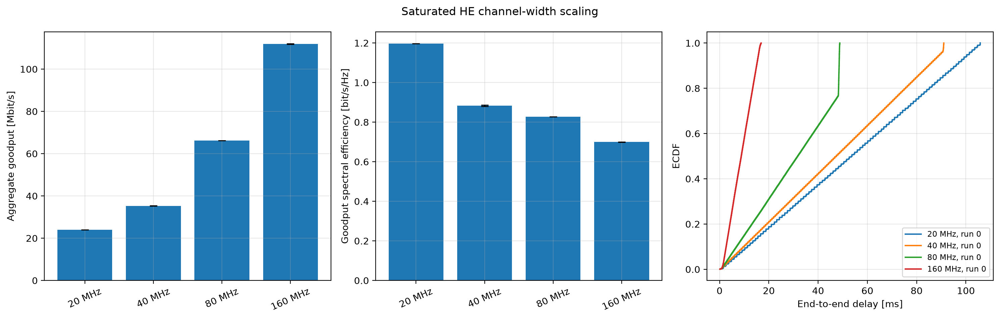

# HE channel width

IEEE Std 802.11-2024 represents full 20, 40, 80, and 160 MHz HE channel widths in the PHY TXVECTOR/RXVECTOR parameters (Table 27-1, `80211ax-2024:chunk:10001`) and advertises supported widths through HE PHY capabilities (Table 9-376, `80211ax-2024:chunk:03627`–`03633`). More bandwidth supplies more tones, but MAC/PHY overhead, RU partitioning, sensitivity, and traffic determine realized goodput.

The four configurations keep topology, MCS family, scheduler, packet size, offered load, seed mapping, and measurement interval fixed. A 1000-byte, 0.25 ms per-flow workload keeps all widths backlogged while reducing the tiny-packet overhead that previously hid width scaling. Each configuration uses the matching receiver bandwidth and nominal HE rate.

The expected result is monotonically increasing aggregate goodput, with sublinear scaling and declining or nonconstant spectral efficiency because fixed overhead does not scale with width. The ECDF is explicitly run 0; bars and confidence intervals use run-level observations. This is an idealized close-range capacity experiment, not evidence that 160 MHz is superior at a cell edge or in congested spectrum.

With the common warm-up and `0.3–0.43 s` measurement window, the refreshed
five-seed means are `23.94`, `35.31`, `66.15`, and `111.90 Mbps` for 20, 40,
80, and 160 MHz, respectively. The corresponding p95 delays are `100.88`,
`89.39`, `48.64`, and `15.81 ms`. The trend is monotonic here, but the scaling
is not linear and remains specific to this close-range saturated workload.
