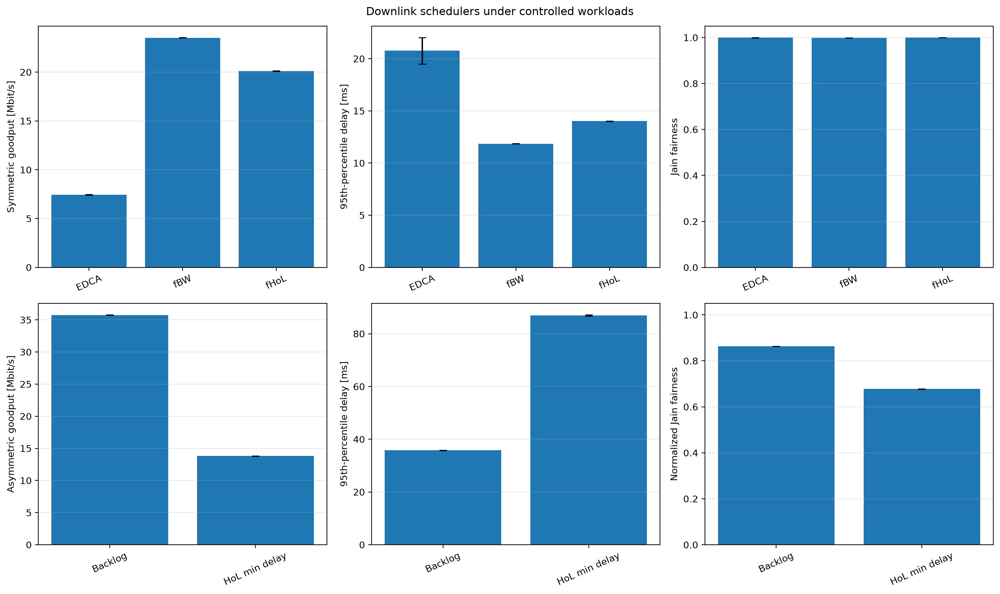

# Downlink OFDMA schedulers

IEEE 802.11ax defines HE MU resource signaling and transmission procedures, but it does not mandate a single AP scheduling objective. Scheduler behavior must therefore be evaluated against an explicit workload rather than labeled globally “better.”

The top row is a symmetric three-flow comparison of SU EDCA, equal-RU first-backlogged-work, and equal-RU first-head-of-line policies. The bottom row isolates backlog-based versus minimum-HoL-delay scheduling under 80, 8, and 0.8 Mbit/s offered flows. Goodput and packet-delay p95 are computed once per run. Symmetric fairness uses station goodputs directly; asymmetric fairness first divides each station's goodput by its offered rate so a scheduler is not penalized for respecting unequal demand.

Expected behavior is workload dependent: equal-RU policies should be similar under symmetric saturation, backlog scheduling may favor the heavy flow, and HoL scheduling may improve delay service for older packets. Confidence intervals, not the ordering of one run, determine whether the observed differences are stable. The common `0.2–0.25 s` warm-up precedes normal traffic at `0.3 s`; the `0.3–0.88 s` window therefore excludes the warm-up while retaining the normal operation period.

The refreshed symmetric results are `23.516 Mbps` for `fBW`, `20.096 Mbps`
for `fHoL`, and `7.432 Mbps` for SU EDCA. Their p95 delays are `11.86`,
`14.02`, and `20.76 ms`, respectively. In the asymmetric pair, BacklogBased
averages `35.758 Mbps` with p95 delay `35.80 ms`, while HoL min delay averages
`13.813 Mbps` with p95 delay `86.91 ms`; these values illustrate why the
workload metadata and normalized fairness are essential.
