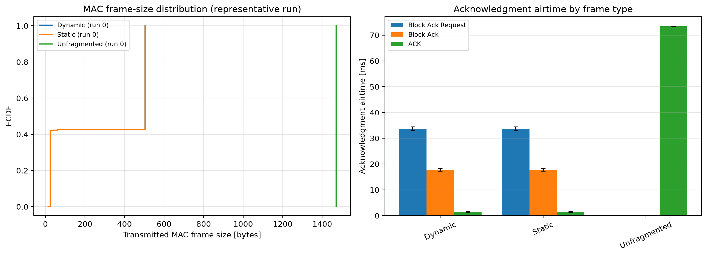

# HE dynamic fragmentation

IEEE Std 802.11-2024 Clause 26.3 makes dynamic fragmentation conditional on the fragmentation level advertised and negotiated by the peer (`80211ax-2024:chunk:09757`, `09759`, `09760`). It does not imply that a dynamic policy must produce smaller fragments than a static policy for the same configured threshold.

The experiment sends 1400-byte QoS MSDUs and compares negotiated HE level-1 dynamic fragmentation, legacy static fragmentation, and an unfragmented control. The left panel reads `packetSentToPeer:vector(packetBytes)` only at each host's HCF; values are already bytes and are not divided by eight. The right panel aligns acknowledgment type and airtime at identical timestamps and sums measured airtime per run.

Dynamic and static traces are expected to overlap in this implementation because both use the same 500-byte sizing policy after the dynamic policy passes its capability gate. The unfragmented control is the essential contrast: it establishes that the smaller transmitted frames and changed ACK work come from fragmentation. This plot demonstrates negotiation gating and fragmentation mechanics, not adaptive fragment sizing from channel conditions.
