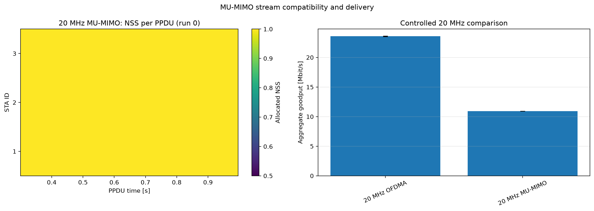

# Downlink MU-MIMO

IEEE Std 802.11-2024 Clause 27.3.2.5 signals user identification and each user's allocated spatial streams in an HE MU PPDU; Clause 27.3.3.1.2 constrains the maximum number of streams (`80211ax-2024:chunk:10062`, `10069`). Multiple users and compatible stream indices are therefore the primary evidence that MU-MIMO occurred.

The comparison holds bandwidth at 20 MHz and uses the same traffic for OFDMA and MU-MIMO. For every recorded MU PPDU, the analysis constructs each user's half-open stream interval and rejects any overlap. It also rejects a result set that never serves at least two users in one PPDU. The matrix plots NSS per STA and PPDU for run 0; the goodput bars use five independent runs.

MU-MIMO may improve aggregate delivery by reusing frequency resources in the spatial domain, but sounding, acknowledgments, channel quality, and offered load can offset that gain. The structural stream checks are stronger evidence of feature operation than expecting a fixed throughput multiplier.

For the refreshed five-seed comparison, the OFDMA control averages `23.568
Mbps` while the 20 MHz MU-MIMO condition averages `10.938 Mbps`. The lower
MU-MIMO goodput does not invalidate the feature result: the vector checks still
require multiple users and non-overlapping stream intervals in an HE MU PPDU,
which is the direct evidence that spatial multiplexing occurred.
