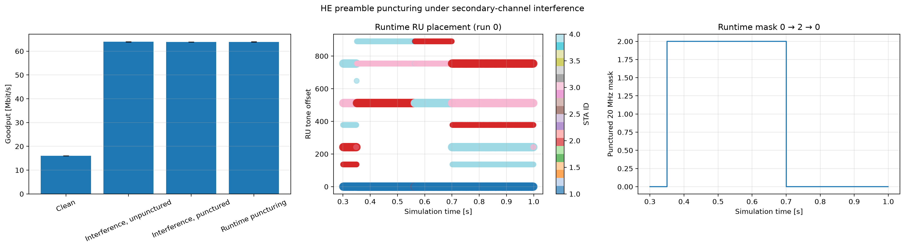

# HE preamble puncturing

IEEE Std 802.11-2024 Table 27-1 identifies the 80 MHz puncturing forms, including puncturing the secondary 20 MHz channel (`80211ax-2024:chunk:10001`). Puncturing is a response to unavailable spectrum: it preserves use of the remaining subchannels but cannot increase clean-channel capacity.

Four conditions compare a clean 80 MHz channel, secondary-channel interference without puncturing, the same interference with a static `0100` mask, and runtime adaptation. The runtime case now resolves the HCF mask at scheduling time: it is unpunctured before 0.35 s, uses mask value 2 while the secondary-channel interferer is active, and returns to zero after 0.7 s.

Figure generation requires both masks 0 and 2 and aligned AP-radio RU offset, RU size, STA ID, and mask telemetry. Thus the frequency panel represents scheduled HE PPDUs, not a configuration string. The expected tradeoff is resilience under secondary-channel interference versus the loss of one 20 MHz subchannel; exact goodput depends on whether the offered load reaches either capacity ceiling.

The refreshed `0.3–0.95 s` results use the 2 ms offered load for the clean
control (`16.000 Mbps`) and the 0.5 ms saturated load for the interference
pair. Their five-run means are `63.941 ± 0.051 Mbps` without puncturing,
`63.882 ± 0.033 Mbps` with static puncturing, and `63.931 ± 0.033 Mbps` with
runtime puncturing (95% Student-t confidence intervals). The near-equality
means this scalar-medium workload does not turn puncturing into a measured
goodput gain; the feature evidence is the allocation and mask telemetry.

The runtime AP vector observes mask values `{0, 2}`: mask `0` before about
`0.35 s`, mask `2` while the jammer is active, and mask `0` after about
`0.7 s`. A fresh AP PCAPng contains 5,028 strictly ordered IEEE 802.11 frames;
TShark identifies 834 non-IP MAC-data frames plus the surrounding UDP, Action,
and ACK exchanges. The native capture does not expose all HE PHY fields, so RU
placement and mask timing are taken from `.vec` telemetry.
