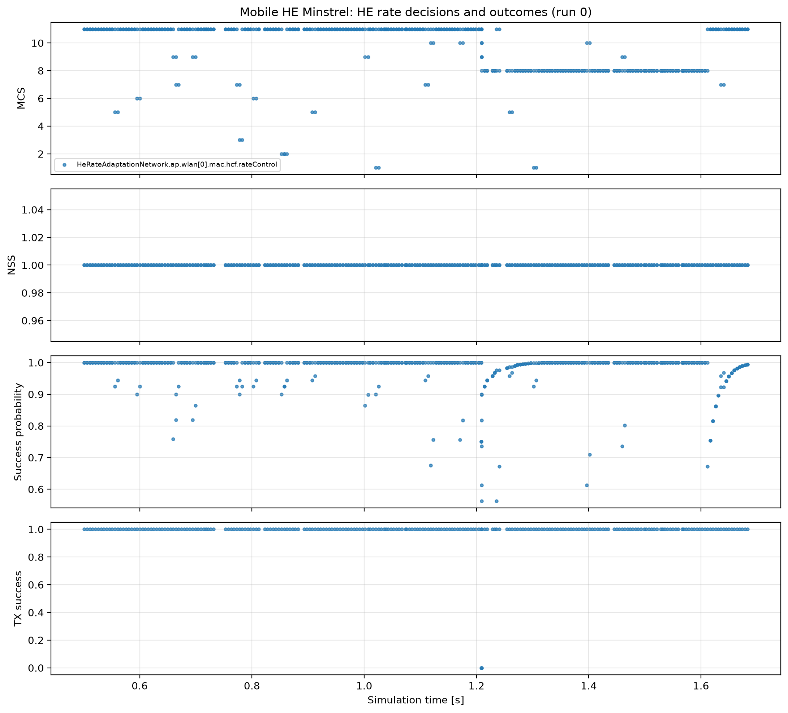

# HE rate adaptation

Rate adaptation is an implementation policy rather than a single mandatory IEEE algorithm. The relevant HE PHY choices are constrained by the negotiated HE capabilities, bandwidth, RU, MCS, NSS, coding, and PPDU format; the standard's HE PHY introduction and capability tables provide that envelope (`80211ax-2024:chunk:09983`, Table 9-376 chunks `03627`–`03633`).

The edge STA moves toward the AP at 40 m/s so link conditions change during the two-second run; offered traffic stops at 1.7 s to let in-flight exchanges drain cleanly. The four aligned views show the selected MCS, selected NSS, the controller's EWMA success estimate, and the actual reported transmission result. New result telemetry records success/failure and retry count at the point where the controller updates its state.

The plot should show decisions and outcomes evolving together; an MCS timeline alone would not establish useful adaptation. NSS remains one in this scenario because the configured controller and station path provide a single-stream comparison. The representative timeline is diagnostic; aggregate performance claims would require a separate fixed-rate baseline and more channel regimes.

The refreshed Mobile HE Minstrel vectors select MCS values from `0` through
`11`; the five-run mean transmission-success fraction is `0.980 ± 0.010` and
the measured goodput is `9.37 ± 3.83 Mbps` (95% intervals). The analysis still
starts at `0.5 s` to separate controller settling from the common `0.3 s`
traffic start.
