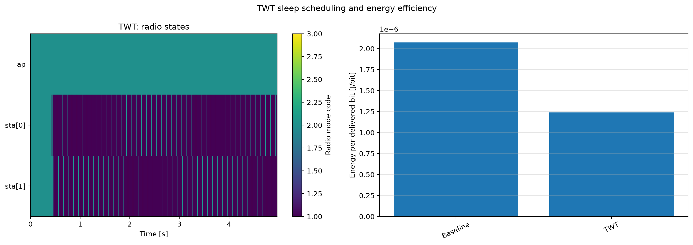

# Target wake time (TWT)

IEEE Std 802.11-2024 defines a TWT service period as a period during which a TWT STA is expected to be awake and describes TWT as a way for an AP to manage activity and reduce contention (`80211ax-2024:chunk:00351`, Clause 26.8.1 in `09855`). Sleep time is therefore expected, but delivery loss is not a valid proxy for energy efficiency.

The baseline and treatment have identical periodic uplink traffic, strong-link station geometry, run numbers, and seeds. Uplink traffic directly exercises each requester STA releasing queued traffic in its service periods; the strong link deliberately isolates scheduling and energy behavior from marginal-coverage loss. Traffic starts at 10 s, after TWT setup, and stops at 90 s so the final 10 s drains queued packets. Station radio power is integrated as a piecewise-constant vector over 10–100 s, then divided by application-delivered bits. The raster uses the actual radio-mode enumeration: off, sleep, receiver, transmitter, transceiver, and switching.

The analysis is a hard gate: every TWT run must deliver at least 95% of its same-number baseline run. Only after that condition passes are energy-per-bit values plotted. This makes the conclusion narrow and defensible: the configured unannounced TWT schedule reduces radio energy while preserving the periodic workload, rather than merely suppressing traffic.

Across five seeds, TWT delivered `16,000 B` versus `15,960 ± 111 B` for the
baseline, a delivery ratio of `1.003 ± 0.007`. Energy per bit was
`1.56e-6 J/bit` for TWT versus `2.85e-6 J/bit` for the baseline. The result is
therefore an energy reduction with the delivery gate satisfied, not a packet
loss trade-off.
