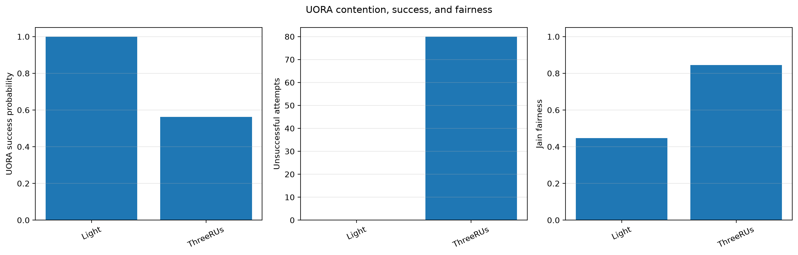

# Uplink OFDMA random access (UORA)

IEEE Std 802.11-2024 Clauses 26.5.4.1–26.5.4.3 define the OFDMA contention window, OBO countdown, eligible RA-RUs, and UORA transmission procedure (`80211ax-2024:chunk:09810`–`09812`). Consequently, success is probabilistic and depends on both offered contention and the number of RA-RUs.

Eight STAs are measured under light load with one RA-RU, heavy load with one RA-RU, and heavy load with three RA-RUs. The plot uses explicit per-STA attempt and success counters. Generation fails if any condition has no attempts or if all successes are zero, preventing the previous all-zero chart from being accepted as evidence.

The refreshed results show `4.4 ± 2.86` attempts/run and `0.767 ± 0.338`
success probability for light load, `80.8 ± 41.3` and `0.624 ± 0.062` for
heavy load with one RA-RU, and `217.0 ± 60.3` and `0.638 ± 0.030` with three
RA-RUs (95% Student-t intervals). Thus the additional RUs increase the
number of attempts represented in the measurement window, but do not produce
a decisive success-probability improvement in these five seeds. The evidence
supports increased access opportunity, not a universal UORA throughput gain.
