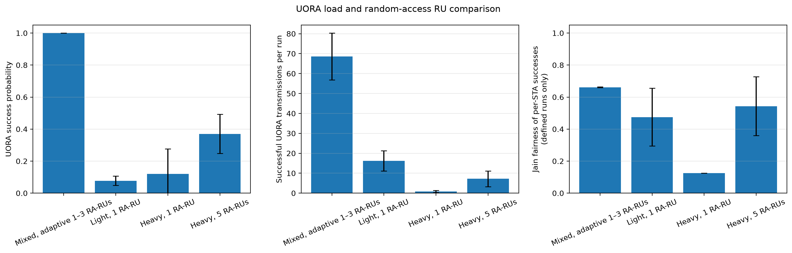

# Uplink OFDMA random access (UORA)

IEEE Std 802.11-2024 Clauses 26.5.4.1–26.5.4.3 define the OFDMA contention window, OBO countdown, eligible RA-RUs, and UORA transmission procedure (`80211ax-2024:chunk:09810`–`09812`). Consequently, success is probabilistic and depends on both offered contention and the number of RA-RUs.

The dashboard includes `MixedUora` as a three-STA, 1000-byte/5 ms mixed-access
reference with an adaptive 1–3 RA-RU range. The controlled contention
conditions use eight STAs and 100-byte packets: light and heavy load use `4 ms`
and `1 ms` intervals, respectively, while the matched heavy pair fixes either
one or five RA-RUs. Five RUs retain scheduled capacity in the mixed scheduler.
The plot uses explicit per-STA attempt and success counters. Generation fails
if any condition has no attempts or if all successes are zero.

Across five runs, `MixedUora` records `68.6 ± 11.7` successful UORA
transmissions with probability `1.000 ± 0.000`; it is not load-matched with the
eight-STA conditions. Light load records `16.2 ± 5.1` successes at
`0.078 ± 0.029`, heavy load with one RA-RU records `0.8 ± 0.6` at
`0.120 ± 0.157`, and the matched five-RA-RU treatment records `7.2 ± 4.0` at
`0.370 ± 0.123` (95% Student-t intervals). Jain fairness of per-STA successes
is `0.125` over the four defined heavy one-RU runs and `0.543 ± 0.184` with
five RUs. Thus the retained heavy-load sample records about nine times as many
successful UORA transmissions with five RUs; it does not imply that reserving
five RUs is optimal for every traffic mix.
