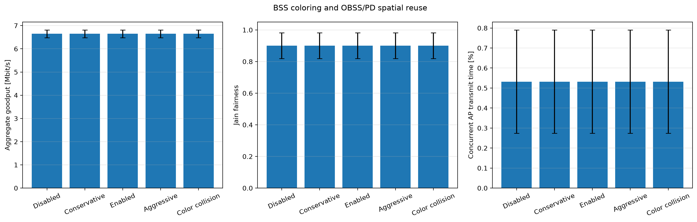
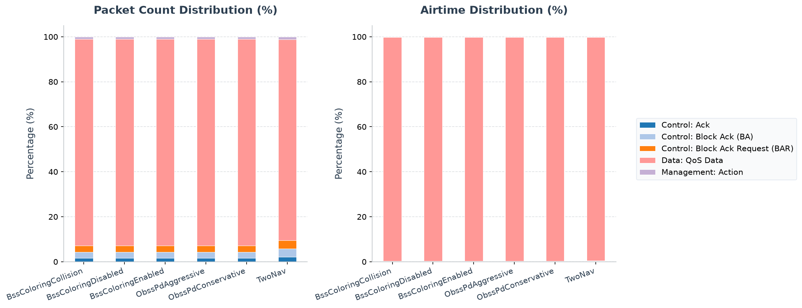

# Walkthrough - HE BSS Coloring & Spatial Reuse Simulation

This walkthrough explains how 802.11ax turns BSS identity into a spatial-reuse
decision. Earlier stations defer to any sufficiently strong same-channel
transmission. An HE station can identify an inter-BSS PPDU and apply a more
permissive OBSS/PD threshold, gaining airtime when the other BSS is far enough
away that simultaneous transmissions remain decodable.

## Background: BSS Coloring & Spatial Reuse

In legacy 802.11 standards, stations operating on the same channel share the channel capacity via CSMA/CA. When a station hears any transmission above its Clear Channel Assessment Carrier Sense (CCA-CS) threshold (e.g., -82 dBm for 20 MHz), it considers the medium busy and defers transmission. In dense deployments (such as apartment buildings or offices), overlapping BSSs (OBSS) operating on the same channel frequently suppress one another, causing severe throughput degradation even when a concurrent transmission would have been decodable.

802.11ax introduces **BSS Coloring** and **OBSS Packet Detect (OBSS/PD) Spatial Reuse**:
1. **BSS Color**: Every BSS is assigned a numerical identifier called a "color" (between 1 and 63), carried in the HE PHY preamble header.
2. **Frame Classification**: A receiver distinguishes between **Intra-BSS** frames (same color as its own BSS) and **Inter-BSS / OBSS** frames (different color).
3. **OBSS/PD Spatial Reuse**: If an incoming frame is Inter-BSS and its received power is below a configured **OBSS/PD threshold** (e.g., -62 dBm), the receiver can choose to ignore the frame and treat the physical medium as IDLE, enabling concurrent transmission.
4. **Dual NAV (Two NAV)**: In legacy 802.11, there is only one Network Allocation Vector (NAV) timer for virtual carrier sensing. 802.11ax introduces two separate NAV timers:
   - **Intra-BSS NAV**: Updated by virtual carrier sense fields in frames originating from the station's own BSS.
   - **Basic NAV**: Updated by virtual carrier sense fields in frames originating from an overlapping BSS (OBSS).
   - Separating these timers prevents an OBSS frame's virtual carrier sense reservation from blocking transmissions within the station's local BSS, protecting local transmissions while still allowing spatial reuse.

---

## Network Topology and Configuration

The network [BssColoringNetwork.ned](BssColoringNetwork.ned) consists of two overlapping BSSs:
- **BSS 1**: `ap1` at `(200, 250)` and associated `sta1[0..1]` at `(170, 240/260)`. Color 1 is set on the AP and both STAs.
- **BSS 2**: `ap2` starts at `(260, 250)` and `sta2[0..1]` start at `(290, 240/260)`. All three move in the positive x direction at `200mps`, preserving their 30 m cell geometry. Color 2 is set on the AP and both STAs.
- Wired servers generate downlink UDP traffic to the client hosts (1000B payloads with intervals uniformly distributed between `1ms` and `1.4ms`). All conditions use a `0.2–0.25s` warm-up trigger and start normal traffic at `0.3s`.
- The medium limit cache is set to `100ms` so the saturated aggregate transmissions are not rejected by the generic `10ms` limit.

During the `0.3–0.95s` measurement window, the AP separation increases from
`120m` to `250m`. The wanted AP-to-client distances remain fixed while the OBSS
signal becomes progressively weaker. It therefore crosses the three nearby
OBSS/PD thresholds at different times instead of creating the single binary
transition produced by a fixed symmetric geometry. MCS 0 and `20mW` power leave
link margin for concurrent transmission. The randomized high-rate streams keep
both BSSs backlogged while avoiding an artificial advantage from scheduling all
four application packets at exactly the same simulation times.

---

## Configurations in `omnetpp.ini`

The [omnetpp.ini](omnetpp.ini) file defines several configurations:

1. **`BssColoringDisabled`**:
   - Spatial reuse is disabled: `enableSpatialReuse = false`.
   - The nodes use ordinary CCA and defer to the other BSS while it remains detectable.
2. **`BssColoringEnabled`**:
   - Spatial reuse is enabled: `enableSpatialReuse = true` with `obssPdThreshold = -79dBm`.
   - Inter-BSS frames received below the threshold are ignored, enabling concurrent transmissions during the middle part of the movement.
3. **`ObssPdConservative` / `ObssPdAggressive`**:
   - Use `-81dBm` and `-78dBm`, respectively. The conservative condition begins reuse later than the balanced `-79dBm` condition; the aggressive condition begins earlier.
4. **`BssColoringCollision`**:
   - All radios in both BSSs use BSS Color 1. Spatial reuse fails because the other BSS is classified as same-color traffic.
5. **`TwoNav`**:
   - Enables separate NAV timers: `heTwoNav = true`.

---

## Running the Simulation

Run an individual configuration with Cmdenv from the repository root:

```sh
bin/inet -u Cmdenv -f examples/ieee80211ax/bss_coloring/omnetpp.ini -c BssColoringEnabled -r 0
```

Regenerate the five-seed comparison and its provenance-tracked figure with:

```sh
python3 examples/ieee80211ax/analysis/run_campaign.py bss -j$(nproc)
MPLCONFIGDIR=/tmp/matplotlib python3 examples/ieee80211ax/analysis/first_tranche.py bss
```

---

## Verifying Results

The analysis uses the client application
`packetReceived:vector(packetBytes)` vectors and AP-radio
`transmissionState:vector` vectors from runs 0 through 4. The measurement
window is `0.3–0.95s`, excluding the Block Ack warm-up traffic and the final
50 ms boundary. To inspect the delivery vectors directly:

```sh
opp_scavetool query -l \
  -f 'type =~ vector AND module =~ "**.sta*.app[0]" AND name =~ "packetReceived:vector(packetBytes)"' \
  examples/ieee80211ax/bss_coloring/results/*.vec
```



### Quantitative Summary:

| Configuration | Aggregate goodput | Jain fairness | Concurrent AP airtime |
|---|---:|---:|---:|
| **BssColoringDisabled** | 6.831 ± 0.276 Mbps | 0.939 ± 0.049 | 0.444 ± 0.178% |
| **ObssPdConservative** (`-81dBm`) | 7.151 ± 0.165 Mbps | 0.983 ± 0.026 | 2.206 ± 1.659% |
| **BssColoringEnabled** (`-79dBm`) | 7.303 ± 0.399 Mbps | 0.976 ± 0.060 | 5.334 ± 0.761% |
| **ObssPdAggressive** (`-78dBm`) | 7.606 ± 0.345 Mbps | 0.992 ± 0.005 | 8.248 ± 3.426% |
| **BssColoringCollision** | 6.831 ± 0.276 Mbps | 0.939 ± 0.049 | 0.444 ± 0.178% |

Values are means ± 95% Student-t confidence intervals over five seeded runs,
measured from `0.3–0.95s`. Reason-coded receiver vectors confirm that the
enabled treatments classify different-color PPDUs as inter-BSS and reset CCA
when they are below OBSS/PD. The three thresholds produce the intended strict
performance ordering: disabled < conservative < enabled < aggressive. Relative
to disabled, aggregate goodput rises by about 4.7%, 6.9%, and 11.4%,
respectively, while mean Jain fairness remains above 0.97 for every enabled
treatment.

The concurrent-airtime panel provides the mechanism check. As BSS 2 moves
away, its signal first falls below `-78dBm`, then `-79dBm`, and finally
`-81dBm`. Consequently, the aggressive receiver can reuse the channel for the
largest part of the measurement window and the conservative receiver for the
smallest. Giving both BSSs the same color reproduces the disabled trajectory,
showing that the gain depends on correct BSS classification rather than merely
enabling the receiver option.

---

## PCAP Tshark Packet Exchange Analysis

Regenerate the run-0 PCAPng captures, packet-type figure, and the generated
appendix below with:

```sh
MPLCONFIGDIR=/tmp/matplotlib python3 examples/ieee80211ax/analysis/analyze_pcap_types.py \
  --generate --subdir bss_coloring
```

Capture session `20260719T105417Z` records `mac` at every `wlan[0]`; the tables
below use the two AP observation points. Use TShark to print the beginning of
the enabled exchange at `ap1`:

```sh
tshark -n -r 'examples/ieee80211ax/bss_coloring/results/packet-statistics/20260719T105417Z/BssColoringEnabled/BssColoringEnabled-#0BssColoringNetwork.ap1.wlan[0].pcap' -c 20
```

The fresh run-0 PCAPng captures contain 1512 frames at `ap1` and 1496 frames at
`ap2`. TShark shows the same warm-up/data/action/ACK exchange pattern at both
observation points. The decoded output timeline shows:
1. **Downlink UDP Packets**: `ap1` sends UDP data frames to its stations (e.g. frame 1, 15).
2. **Action Frame Handshake**: Stations establish block acknowledgment session configurations with their AP (e.g. frames 3, 5, 7, 11).
3. **Evidence boundary**: MAC PCAPs show the exchanges but not the receiver's CCA decision. The result vectors directly record local/received color, intra/inter-BSS classification, eligibility, ignore decision, OBSS/PD threshold, reason code, and coupled transmit-power limit. The campaign refuses to plot an enabled condition unless eligible inter-BSS decisions are present and the threshold/power relation is valid.

The `-81dBm`, `-79dBm`, and `-78dBm` settings divide the moving geometry into
progressively longer spatial-reuse intervals. A broader
spatial-reuse study must inspect concurrency, goodput, PER, and fairness
together—raising the threshold is not beneficial if it merely converts
deferral into collisions.

---

## Two NAV (Dual NAV) Evidence Boundary

`TwoNav` enables `heTwoNav` and adds a local uplink flow intended to exercise
local reservations. In fresh run 0, all six MAC receivers record the Basic NAV
(`nav:vector`, with 943–1323 transitions per AP and 951–1461 per STA), but no
`intraBssNavChanged:vector` is emitted. The run therefore demonstrates that the
Dual-NAV feature gate and the altered frame exchange execute, but it does not
provide direct result-vector evidence of an Intra-BSS NAV transition. Do not
infer a separate Intra-BSS NAV update from the packet-type counts alone.

The exact query used for this check is:

```sh
opp_scavetool query -l \
  -f 'type =~ vector AND (name =~ "nav:vector" OR name =~ "intraBssNavChanged:vector")' \
  examples/ieee80211ax/bss_coloring/results/packet-statistics/20260719T105417Z/TwoNav/TwoNav-#0.vec \
  examples/ieee80211ax/bss_coloring/results/packet-statistics/20260719T105417Z/TwoNav/TwoNav-#0.sca
```

<!-- BEGIN GENERATED: ieee80211ax-pcap-statistics -->
## 802.11 Packet Type Statistics


This section provides a statistical overview of the 802.11 frames transmitted over the wireless medium during the simulation. The packet counts were gathered from AP wireless-interface observation points. With multiple AP captures, one medium transmission may be observed at more than one AP; counts and airtime therefore represent recorded transmission observations, not de-duplicated application packets.

Capture session `20260719T105417Z` was generated from fresh PCAPng input with `TShark (Wireshark) 4.6.4.`. HE PPDU format, MCS, coding, bandwidth/RU, GI, and NSTS are decoded directly from standards-compliant radiotap HE fields; values not marked known by the recorder are omitted.

Two estimated airtime occupancy percentages are provided. HE-SU and HE-ER-SU use the modeled 36/44 µs preambles; a dissector-expanded A-MPDU is charged one shared preamble. HE MU/TB user-dependent signaling not exposed by radiotap remains approximate.
- **Air Time %**: This frame type's share of the sum of all estimated frame airtimes.
- **Air Time (Sim Time) %**: The sum of this frame type's estimated airtimes divided by the simulation time limit. Concurrent transmissions from multiple capture points are counted separately, so this value can exceed 100%; it is not the union of busy channel time.

### Evidence checks

| Status | Requirement | Observed evidence |
|---|---|---|
| **PASS** | BssColoringCollision produced protocol-visible wireless observations | 2841 AP/global transmission observations |
| **PASS** | BssColoringDisabled produced protocol-visible wireless observations | 2841 AP/global transmission observations |
| **PASS** | BssColoringEnabled produced protocol-visible wireless observations | 3008 AP/global transmission observations |
| **PASS** | ObssPdAggressive produced protocol-visible wireless observations | 2905 AP/global transmission observations |
| **PASS** | ObssPdConservative produced protocol-visible wireless observations | 3009 AP/global transmission observations |
| **PASS** | TwoNav produced protocol-visible wireless observations | 2210 AP/global transmission observations |
| **PASS** | The bounded scenario exposes a coloring/OBSS-PD decision difference | At least two frame-distribution signatures differ |

### Configuration: `BssColoringCollision`
Total over-the-air frame/MPDU transmission observations (Global BSS/AP): **2841**

| Color | Frame Type & Subtype | Count | Percentage | Mean Size | Std Dev | Mean Duration | Std Dev Duration | Freq | Mean RX Sig | Mean TX Pwr | Air Time % | Air Time (Sim Time) % |
|:---:|---|---:|---:|---:|---:|---:|---:|---:|---:|---:|---:|---:|
| <svg width="16" height="16"><rect width="16" height="16" rx="3" fill="#24db3c" /></svg> | Data: QoS Data [HE-MU, HE, GI 3.2 us, LDPC] | 524 | 18.44% | 2194.0 B | 0.0 B | 2436.3 us | 0.0 us | 5050 MHz | -77.8 dBm | 13.0 dBm | 60.16% | 127.66% |
| <svg width="16" height="16"><rect width="16" height="16" rx="3" fill="#31b125" /></svg> | Data: QoS Data [HE-SU, HE-MCS 0, 20 MHz, GI 3.2 us, BCC, A-MPDU] | 258 | 9.08% | 1068.3 B | 177.0 B | 1170.6 us | 194.1 us | 5050 MHz | -79.0 dBm | 13.0 dBm | 14.23% | 30.20% |
| <svg width="16" height="16"><rect width="16" height="16" rx="3" fill="#28dc31" /></svg> | Data: QoS Data [HE-SU, HE-MCS 0, 20 MHz, GI 3.2 us, BCC] | 221 | 7.78% | 1068.9 B | 195.3 B | 1205.4 us | 213.7 us | 5050 MHz | -80.0 dBm | 13.0 dBm | 12.55% | 26.64% |
| <hr> | <hr> | <hr> | <hr> | <hr> | <hr> | <hr> | <hr> | <hr> | <hr> | <hr> | <hr> | <hr> |
| <svg width="16" height="16"><rect width="16" height="16" rx="3" fill="#fcac22" /></svg> | Control: Trigger [HE-SU, HE-MCS 0, 20 MHz, GI 3.2 us, BCC] | 524 | 18.44% | 46.0 B | 0.0 B | 86.3 us | 0.0 us | 5050 MHz | -77.8 dBm | 13.0 dBm | 2.13% | 4.52% |
| <svg width="16" height="16"><rect width="16" height="16" rx="3" fill="#a96c3d" /></svg> | Control: Block Ack Request (BAR) [HE-SU, HE-MCS 0, 20 MHz, GI 3.2 us, BCC] | 10 | 0.35% | 24.0 B | 0.0 B | 62.3 us | 0.0 us | 5050 MHz | -79.8 dBm | 13.0 dBm | 0.03% | 0.06% |
| <svg width="16" height="16"><rect width="16" height="16" rx="3" fill="#102ea8" /></svg> | Control: Block Ack (BA) [HE-SU, HE-MCS 0, 20 MHz, GI 3.2 us, BCC] | 10 | 0.35% | 128.0 B | 48.0 B | 176.0 us | 52.5 us | 5050 MHz | -72.5 dBm | - | 0.08% | 0.18% |
| <svg width="16" height="16"><rect width="16" height="16" rx="3" fill="#1037ad" /></svg> | Control: Block Ack (BA) [HE-TB, HE-MCS 0, 52-tone RU, GI 3.2 us, LDPC] | 1048 | 36.89% | 32.0 B | 0.0 B | 206.7 us | 0.0 us | 5043 MHz, 5047 MHz | -71.2 dBm | - | 10.21% | 21.66% |
| <svg width="16" height="16"><rect width="16" height="16" rx="3" fill="#61a1ef" /></svg> | Control: Ack [HE-SU, HE-MCS 0, 20 MHz, GI 3.2 us, BCC] | 232 | 8.17% | 14.0 B | 0.0 B | 51.3 us | 0.0 us | 5050 MHz | -72.4 dBm | 13.0 dBm | 0.56% | 1.19% |
| <hr> | <hr> | <hr> | <hr> | <hr> | <hr> | <hr> | <hr> | <hr> | <hr> | <hr> | <hr> | <hr> |
| <svg width="16" height="16"><rect width="16" height="16" rx="3" fill="#f0372d" /></svg> | Management: Action [HE-SU, HE-MCS 0, 20 MHz, GI 3.2 us, BCC] | 14 | 0.49% | 37.0 B | 0.0 B | 76.5 us | 0.0 us | 5050 MHz | -70.8 dBm | 13.0 dBm | 0.05% | 0.11% |

### Configuration: `BssColoringDisabled`
Total over-the-air frame/MPDU transmission observations (Global BSS/AP): **2841**

| Color | Frame Type & Subtype | Count | Percentage | Mean Size | Std Dev | Mean Duration | Std Dev Duration | Freq | Mean RX Sig | Mean TX Pwr | Air Time % | Air Time (Sim Time) % |
|:---:|---|---:|---:|---:|---:|---:|---:|---:|---:|---:|---:|---:|
| <svg width="16" height="16"><rect width="16" height="16" rx="3" fill="#24db3c" /></svg> | Data: QoS Data [HE-MU, HE, GI 3.2 us, LDPC] | 524 | 18.44% | 2194.0 B | 0.0 B | 2436.3 us | 0.0 us | 5050 MHz | -77.8 dBm | 13.0 dBm | 60.16% | 127.66% |
| <svg width="16" height="16"><rect width="16" height="16" rx="3" fill="#31b125" /></svg> | Data: QoS Data [HE-SU, HE-MCS 0, 20 MHz, GI 3.2 us, BCC, A-MPDU] | 258 | 9.08% | 1068.3 B | 177.0 B | 1170.6 us | 194.1 us | 5050 MHz | -79.0 dBm | 13.0 dBm | 14.23% | 30.20% |
| <svg width="16" height="16"><rect width="16" height="16" rx="3" fill="#28dc31" /></svg> | Data: QoS Data [HE-SU, HE-MCS 0, 20 MHz, GI 3.2 us, BCC] | 221 | 7.78% | 1068.9 B | 195.3 B | 1205.4 us | 213.7 us | 5050 MHz | -80.0 dBm | 13.0 dBm | 12.55% | 26.64% |
| <hr> | <hr> | <hr> | <hr> | <hr> | <hr> | <hr> | <hr> | <hr> | <hr> | <hr> | <hr> | <hr> |
| <svg width="16" height="16"><rect width="16" height="16" rx="3" fill="#fcac22" /></svg> | Control: Trigger [HE-SU, HE-MCS 0, 20 MHz, GI 3.2 us, BCC] | 524 | 18.44% | 46.0 B | 0.0 B | 86.3 us | 0.0 us | 5050 MHz | -77.8 dBm | 13.0 dBm | 2.13% | 4.52% |
| <svg width="16" height="16"><rect width="16" height="16" rx="3" fill="#a96c3d" /></svg> | Control: Block Ack Request (BAR) [HE-SU, HE-MCS 0, 20 MHz, GI 3.2 us, BCC] | 10 | 0.35% | 24.0 B | 0.0 B | 62.3 us | 0.0 us | 5050 MHz | -79.8 dBm | 13.0 dBm | 0.03% | 0.06% |
| <svg width="16" height="16"><rect width="16" height="16" rx="3" fill="#102ea8" /></svg> | Control: Block Ack (BA) [HE-SU, HE-MCS 0, 20 MHz, GI 3.2 us, BCC] | 10 | 0.35% | 128.0 B | 48.0 B | 176.0 us | 52.5 us | 5050 MHz | -72.5 dBm | - | 0.08% | 0.18% |
| <svg width="16" height="16"><rect width="16" height="16" rx="3" fill="#1037ad" /></svg> | Control: Block Ack (BA) [HE-TB, HE-MCS 0, 52-tone RU, GI 3.2 us, LDPC] | 1048 | 36.89% | 32.0 B | 0.0 B | 206.7 us | 0.0 us | 5043 MHz, 5047 MHz | -71.2 dBm | - | 10.21% | 21.66% |
| <svg width="16" height="16"><rect width="16" height="16" rx="3" fill="#61a1ef" /></svg> | Control: Ack [HE-SU, HE-MCS 0, 20 MHz, GI 3.2 us, BCC] | 232 | 8.17% | 14.0 B | 0.0 B | 51.3 us | 0.0 us | 5050 MHz | -72.4 dBm | 13.0 dBm | 0.56% | 1.19% |
| <hr> | <hr> | <hr> | <hr> | <hr> | <hr> | <hr> | <hr> | <hr> | <hr> | <hr> | <hr> | <hr> |
| <svg width="16" height="16"><rect width="16" height="16" rx="3" fill="#f0372d" /></svg> | Management: Action [HE-SU, HE-MCS 0, 20 MHz, GI 3.2 us, BCC] | 14 | 0.49% | 37.0 B | 0.0 B | 76.5 us | 0.0 us | 5050 MHz | -70.8 dBm | 13.0 dBm | 0.05% | 0.11% |

### Configuration: `BssColoringEnabled`
Total over-the-air frame/MPDU transmission observations (Global BSS/AP): **3008**

| Color | Frame Type & Subtype | Count | Percentage | Mean Size | Std Dev | Mean Duration | Std Dev Duration | Freq | Mean RX Sig | Mean TX Pwr | Air Time % | Air Time (Sim Time) % |
|:---:|---|---:|---:|---:|---:|---:|---:|---:|---:|---:|---:|---:|
| <svg width="16" height="16"><rect width="16" height="16" rx="3" fill="#24db3c" /></svg> | Data: QoS Data [HE-MU, HE, GI 3.2 us, LDPC] | 528 | 17.55% | 2194.0 B | 0.0 B | 2436.3 us | 0.0 us | 5050 MHz | -77.1 dBm | 13.0 dBm | 60.04% | 128.64% |
| <svg width="16" height="16"><rect width="16" height="16" rx="3" fill="#31b125" /></svg> | Data: QoS Data [HE-SU, HE-MCS 0, 20 MHz, GI 3.2 us, BCC, A-MPDU] | 240 | 7.98% | 1068.5 B | 183.5 B | 1170.8 us | 201.2 us | 5050 MHz | -78.9 dBm | 13.0 dBm | 13.11% | 28.10% |
| <svg width="16" height="16"><rect width="16" height="16" rx="3" fill="#28dc31" /></svg> | Data: QoS Data [HE-SU, HE-MCS 0, 20 MHz, GI 3.2 us, BCC] | 215 | 7.15% | 1071.1 B | 204.2 B | 1207.8 us | 223.4 us | 5050 MHz | -79.9 dBm | 13.0 dBm | 12.12% | 25.97% |
| <hr> | <hr> | <hr> | <hr> | <hr> | <hr> | <hr> | <hr> | <hr> | <hr> | <hr> | <hr> | <hr> |
| <svg width="16" height="16"><rect width="16" height="16" rx="3" fill="#fcac22" /></svg> | Control: Trigger [HE-SU, HE-MCS 0, 20 MHz, GI 3.2 us, BCC] | 528 | 17.55% | 46.0 B | 0.0 B | 86.3 us | 0.0 us | 5050 MHz | -77.1 dBm | 13.0 dBm | 2.13% | 4.56% |
| <svg width="16" height="16"><rect width="16" height="16" rx="3" fill="#a96c3d" /></svg> | Control: Block Ack Request (BAR) [HE-SU, HE-MCS 0, 20 MHz, GI 3.2 us, BCC] | 9 | 0.30% | 24.0 B | 0.0 B | 62.3 us | 0.0 us | 5050 MHz | -79.5 dBm | 13.0 dBm | 0.03% | 0.06% |
| <svg width="16" height="16"><rect width="16" height="16" rx="3" fill="#102ea8" /></svg> | Control: Block Ack (BA) [HE-SU, HE-MCS 0, 20 MHz, GI 3.2 us, BCC] | 9 | 0.30% | 125.3 B | 49.9 B | 173.1 us | 54.6 us | 5050 MHz | -71.4 dBm | - | 0.07% | 0.16% |
| <svg width="16" height="16"><rect width="16" height="16" rx="3" fill="#1037ad" /></svg> | Control: Block Ack (BA) [HE-TB, HE-MCS 0, 52-tone RU, GI 3.2 us, LDPC] | 1234 | 41.02% | 32.0 B | 0.0 B | 206.7 us | 0.0 us | 5043 MHz, 5047 MHz | -71.3 dBm | - | 11.90% | 25.50% |
| <svg width="16" height="16"><rect width="16" height="16" rx="3" fill="#61a1ef" /></svg> | Control: Ack [HE-SU, HE-MCS 0, 20 MHz, GI 3.2 us, BCC] | 231 | 7.68% | 14.0 B | 0.0 B | 51.3 us | 0.0 us | 5050 MHz | -72.4 dBm | 13.0 dBm | 0.55% | 1.19% |
| <hr> | <hr> | <hr> | <hr> | <hr> | <hr> | <hr> | <hr> | <hr> | <hr> | <hr> | <hr> | <hr> |
| <svg width="16" height="16"><rect width="16" height="16" rx="3" fill="#f0372d" /></svg> | Management: Action [HE-SU, HE-MCS 0, 20 MHz, GI 3.2 us, BCC] | 14 | 0.47% | 37.0 B | 0.0 B | 76.5 us | 0.0 us | 5050 MHz | -70.8 dBm | 13.0 dBm | 0.05% | 0.11% |

### Configuration: `ObssPdAggressive`
Total over-the-air frame/MPDU transmission observations (Global BSS/AP): **2905**

| Color | Frame Type & Subtype | Count | Percentage | Mean Size | Std Dev | Mean Duration | Std Dev Duration | Freq | Mean RX Sig | Mean TX Pwr | Air Time % | Air Time (Sim Time) % |
|:---:|---|---:|---:|---:|---:|---:|---:|---:|---:|---:|---:|---:|
| <svg width="16" height="16"><rect width="16" height="16" rx="3" fill="#24db3c" /></svg> | Data: QoS Data [HE-MU, HE, GI 3.2 us, LDPC] | 450 | 15.49% | 2194.0 B | 0.0 B | 2436.3 us | 0.0 us | 5050 MHz | -76.4 dBm | 13.0 dBm | 54.42% | 109.63% |
| <svg width="16" height="16"><rect width="16" height="16" rx="3" fill="#31b125" /></svg> | Data: QoS Data [HE-SU, HE-MCS 0, 20 MHz, GI 3.2 us, BCC, A-MPDU] | 289 | 9.95% | 1069.2 B | 203.3 B | 1171.5 us | 222.8 us | 5050 MHz | -79.0 dBm | 13.0 dBm | 16.81% | 33.86% |
| <svg width="16" height="16"><rect width="16" height="16" rx="3" fill="#28dc31" /></svg> | Data: QoS Data [HE-SU, HE-MCS 0, 20 MHz, GI 3.2 us, BCC] | 229 | 7.88% | 1067.0 B | 193.7 B | 1203.3 us | 212.0 us | 5050 MHz | -79.8 dBm | 13.0 dBm | 13.68% | 27.56% |
| <hr> | <hr> | <hr> | <hr> | <hr> | <hr> | <hr> | <hr> | <hr> | <hr> | <hr> | <hr> | <hr> |
| <svg width="16" height="16"><rect width="16" height="16" rx="3" fill="#fcac22" /></svg> | Control: Trigger [HE-SU, HE-MCS 0, 20 MHz, GI 3.2 us, BCC] | 450 | 15.49% | 46.0 B | 0.0 B | 86.3 us | 0.0 us | 5050 MHz | -76.4 dBm | 13.0 dBm | 1.93% | 3.88% |
| <svg width="16" height="16"><rect width="16" height="16" rx="3" fill="#a96c3d" /></svg> | Control: Block Ack Request (BAR) [HE-SU, HE-MCS 0, 20 MHz, GI 3.2 us, BCC] | 12 | 0.41% | 24.0 B | 0.0 B | 62.3 us | 0.0 us | 5050 MHz | -79.8 dBm | 13.0 dBm | 0.04% | 0.07% |
| <svg width="16" height="16"><rect width="16" height="16" rx="3" fill="#102ea8" /></svg> | Control: Block Ack (BA) [HE-SU, HE-MCS 0, 20 MHz, GI 3.2 us, BCC] | 12 | 0.41% | 152.0 B | 0.0 B | 202.3 us | 0.0 us | 5050 MHz | -72.7 dBm | - | 0.12% | 0.24% |
| <svg width="16" height="16"><rect width="16" height="16" rx="3" fill="#1037ad" /></svg> | Control: Block Ack (BA) [HE-TB, HE-MCS 0, 52-tone RU, GI 3.2 us, LDPC] | 1202 | 41.38% | 32.0 B | 0.0 B | 206.7 us | 0.0 us | 5043 MHz, 5047 MHz | -71.2 dBm | - | 12.33% | 24.84% |
| <svg width="16" height="16"><rect width="16" height="16" rx="3" fill="#61a1ef" /></svg> | Control: Ack [HE-SU, HE-MCS 0, 20 MHz, GI 3.2 us, BCC] | 247 | 8.50% | 14.0 B | 0.0 B | 51.3 us | 0.0 us | 5050 MHz | -72.3 dBm | 13.0 dBm | 0.63% | 1.27% |
| <hr> | <hr> | <hr> | <hr> | <hr> | <hr> | <hr> | <hr> | <hr> | <hr> | <hr> | <hr> | <hr> |
| <svg width="16" height="16"><rect width="16" height="16" rx="3" fill="#f0372d" /></svg> | Management: Action [HE-SU, HE-MCS 0, 20 MHz, GI 3.2 us, BCC] | 14 | 0.48% | 37.0 B | 0.0 B | 76.5 us | 0.0 us | 5050 MHz | -70.8 dBm | 13.0 dBm | 0.05% | 0.11% |

### Configuration: `ObssPdConservative`
Total over-the-air frame/MPDU transmission observations (Global BSS/AP): **3009**

| Color | Frame Type & Subtype | Count | Percentage | Mean Size | Std Dev | Mean Duration | Std Dev Duration | Freq | Mean RX Sig | Mean TX Pwr | Air Time % | Air Time (Sim Time) % |
|:---:|---|---:|---:|---:|---:|---:|---:|---:|---:|---:|---:|---:|
| <svg width="16" height="16"><rect width="16" height="16" rx="3" fill="#24db3c" /></svg> | Data: QoS Data [HE-MU, HE, GI 3.2 us, LDPC] | 525 | 17.45% | 2194.0 B | 0.0 B | 2436.3 us | 0.0 us | 5050 MHz | -77.1 dBm | 13.0 dBm | 59.37% | 127.90% |
| <svg width="16" height="16"><rect width="16" height="16" rx="3" fill="#31b125" /></svg> | Data: QoS Data [HE-SU, HE-MCS 0, 20 MHz, GI 3.2 us, BCC, A-MPDU] | 258 | 8.57% | 1068.3 B | 177.0 B | 1170.6 us | 194.1 us | 5050 MHz | -78.9 dBm | 13.0 dBm | 14.02% | 30.20% |
| <svg width="16" height="16"><rect width="16" height="16" rx="3" fill="#28dc31" /></svg> | Data: QoS Data [HE-SU, HE-MCS 0, 20 MHz, GI 3.2 us, BCC] | 216 | 7.18% | 1068.9 B | 197.6 B | 1205.4 us | 216.1 us | 5050 MHz | -80.0 dBm | 13.0 dBm | 12.09% | 26.04% |
| <hr> | <hr> | <hr> | <hr> | <hr> | <hr> | <hr> | <hr> | <hr> | <hr> | <hr> | <hr> | <hr> |
| <svg width="16" height="16"><rect width="16" height="16" rx="3" fill="#fcac22" /></svg> | Control: Trigger [HE-SU, HE-MCS 0, 20 MHz, GI 3.2 us, BCC] | 528 | 17.55% | 46.0 B | 0.0 B | 86.3 us | 0.0 us | 5050 MHz | -77.2 dBm | 13.0 dBm | 2.12% | 4.56% |
| <svg width="16" height="16"><rect width="16" height="16" rx="3" fill="#a96c3d" /></svg> | Control: Block Ack Request (BAR) [HE-SU, HE-MCS 0, 20 MHz, GI 3.2 us, BCC] | 10 | 0.33% | 24.0 B | 0.0 B | 62.3 us | 0.0 us | 5050 MHz | -80.0 dBm | 13.0 dBm | 0.03% | 0.06% |
| <svg width="16" height="16"><rect width="16" height="16" rx="3" fill="#102ea8" /></svg> | Control: Block Ack (BA) [HE-SU, HE-MCS 0, 20 MHz, GI 3.2 us, BCC] | 10 | 0.33% | 128.0 B | 48.0 B | 176.0 us | 52.5 us | 5050 MHz | -72.6 dBm | - | 0.08% | 0.18% |
| <svg width="16" height="16"><rect width="16" height="16" rx="3" fill="#1037ad" /></svg> | Control: Block Ack (BA) [HE-TB, HE-MCS 0, 52-tone RU, GI 3.2 us, LDPC] | 1220 | 40.55% | 32.0 B | 0.0 B | 206.7 us | 0.0 us | 5043 MHz, 5047 MHz | -71.3 dBm | - | 11.70% | 25.21% |
| <svg width="16" height="16"><rect width="16" height="16" rx="3" fill="#61a1ef" /></svg> | Control: Ack [HE-SU, HE-MCS 0, 20 MHz, GI 3.2 us, BCC] | 228 | 7.58% | 14.0 B | 0.0 B | 51.3 us | 0.0 us | 5050 MHz | -72.4 dBm | 13.0 dBm | 0.54% | 1.17% |
| <hr> | <hr> | <hr> | <hr> | <hr> | <hr> | <hr> | <hr> | <hr> | <hr> | <hr> | <hr> | <hr> |
| <svg width="16" height="16"><rect width="16" height="16" rx="3" fill="#f0372d" /></svg> | Management: Action [HE-SU, HE-MCS 0, 20 MHz, GI 3.2 us, BCC] | 14 | 0.47% | 37.0 B | 0.0 B | 76.5 us | 0.0 us | 5050 MHz | -70.8 dBm | 13.0 dBm | 0.05% | 0.11% |

### Configuration: `TwoNav`
Total over-the-air frame/MPDU transmission observations (Global BSS/AP): **2210**

| Color | Frame Type & Subtype | Count | Percentage | Mean Size | Std Dev | Mean Duration | Std Dev Duration | Freq | Mean RX Sig | Mean TX Pwr | Air Time % | Air Time (Sim Time) % |
|:---:|---|---:|---:|---:|---:|---:|---:|---:|---:|---:|---:|---:|
| <svg width="16" height="16"><rect width="16" height="16" rx="3" fill="#24db3c" /></svg> | Data: QoS Data [HE-MU, HE, GI 3.2 us, LDPC] | 279 | 12.62% | 2209.4 B | 180.9 B | 2453.1 us | 197.9 us | 5050 MHz | -76.3 dBm | 13.0 dBm | 43.58% | 68.44% |
| <svg width="16" height="16"><rect width="16" height="16" rx="3" fill="#31b125" /></svg> | Data: QoS Data [HE-SU, HE-MCS 0, 20 MHz, GI 3.2 us, BCC, A-MPDU] | 290 | 13.12% | 1068.7 B | 177.5 B | 1170.4 us | 194.3 us | 5050 MHz | -79.1 dBm | 13.0 dBm | 21.61% | 33.94% |
| <svg width="16" height="16"><rect width="16" height="16" rx="3" fill="#28dc31" /></svg> | Data: QoS Data [HE-SU, HE-MCS 0, 20 MHz, GI 3.2 us, BCC] | 301 | 13.62% | 1070.9 B | 313.8 B | 1207.6 us | 343.3 us | 5050 MHz | -74.7 dBm | 13.0 dBm | 23.14% | 36.35% |
| <hr> | <hr> | <hr> | <hr> | <hr> | <hr> | <hr> | <hr> | <hr> | <hr> | <hr> | <hr> | <hr> |
| <svg width="16" height="16"><rect width="16" height="16" rx="3" fill="#fcac22" /></svg> | Control: Trigger [HE-SU, HE-MCS 0, 20 MHz, GI 3.2 us, BCC] | 302 | 13.67% | 46.0 B | 0.0 B | 86.3 us | 0.0 us | 5050 MHz | -77.0 dBm | 13.0 dBm | 1.66% | 2.61% |
| <svg width="16" height="16"><rect width="16" height="16" rx="3" fill="#a96c3d" /></svg> | Control: Block Ack Request (BAR) [HE-SU, HE-MCS 0, 20 MHz, GI 3.2 us, BCC] | 10 | 0.45% | 24.0 B | 0.0 B | 62.3 us | 0.0 us | 5050 MHz | -79.0 dBm | 13.0 dBm | 0.04% | 0.06% |
| <svg width="16" height="16"><rect width="16" height="16" rx="3" fill="#102ea8" /></svg> | Control: Block Ack (BA) [HE-SU, HE-MCS 0, 20 MHz, GI 3.2 us, BCC] | 10 | 0.45% | 104.0 B | 58.8 B | 149.8 us | 64.3 us | 5050 MHz | -72.1 dBm | - | 0.10% | 0.15% |
| <svg width="16" height="16"><rect width="16" height="16" rx="3" fill="#0639bc" /></svg> | Control: Block Ack (BA) [HE-TB, HE-MCS 0, 106-tone RU, GI 3.2 us, LDPC] | 2 | 0.09% | 32.0 B | 0.0 B | 116.3 us | 0.0 us | 5045 MHz | -70.5 dBm | - | 0.01% | 0.02% |
| <svg width="16" height="16"><rect width="16" height="16" rx="3" fill="#1037ad" /></svg> | Control: Block Ack (BA) [HE-TB, HE-MCS 0, 52-tone RU, GI 3.2 us, LDPC] | 658 | 29.77% | 32.0 B | 0.0 B | 206.7 us | 0.0 us | 5043 MHz, 5047 MHz, 5053 MHz | -71.1 dBm | - | 8.66% | 13.60% |
| <svg width="16" height="16"><rect width="16" height="16" rx="3" fill="#61a1ef" /></svg> | Control: Ack [HE-SU, HE-MCS 0, 20 MHz, GI 3.2 us, BCC] | 342 | 15.48% | 14.0 B | 0.0 B | 51.3 us | 0.0 us | 5050 MHz | -73.3 dBm | 13.0 dBm | 1.12% | 1.76% |
| <hr> | <hr> | <hr> | <hr> | <hr> | <hr> | <hr> | <hr> | <hr> | <hr> | <hr> | <hr> | <hr> |
| <svg width="16" height="16"><rect width="16" height="16" rx="3" fill="#f0372d" /></svg> | Management: Action [HE-SU, HE-MCS 0, 20 MHz, GI 3.2 us, BCC] | 16 | 0.72% | 37.0 B | 0.0 B | 76.5 us | 0.0 us | 5050 MHz | -70.8 dBm | 13.0 dBm | 0.08% | 0.12% |

### Analysis of Packet Distribution
**PASS: BSS-coloring separation.** At least two frame-distribution signatures differ. IEEE Std 802.11-2024 Clause 26.10 permits eligible inter-BSS reuse after OBSS/PD classification; it does not guarantee a throughput improvement, and a more permissive threshold can increase interference. The differing distribution is only a screening signal; the separate five-seed result campaign validates direct OBSS classification, threshold, CCA, power-limit, and reuse-decision telemetry. The current model reports the standards-defined threshold/power coupling but does not dynamically adapt OBSS/PD or apply that limit to later transmissions.
<!-- END GENERATED: ieee80211ax-pcap-statistics -->
