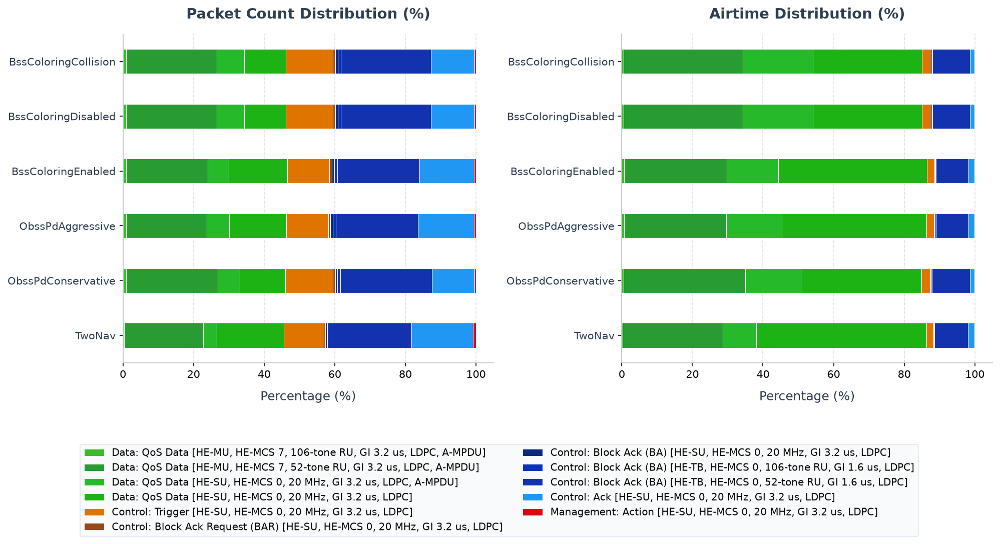

# Walkthrough: HE BSS coloring and spatial reuse

<!-- BEGIN SCRIPT RESULTS SESSIONS -->
`[script]` results sessions:

- Scalar/vector: `20260725T120411Z`
- PCAP: `20260725T230151Z`
<!-- END SCRIPT RESULTS SESSIONS -->

`[agent]` results sessions: `20260724T175025Z`, `20260725T120411Z`, `20260725T230151Z`.

This walkthrough compares disabled spatial reuse, three overlapping basic
service set packet-detect (OBSS/PD) thresholds, a same-color negative control,
and a dual-NAV case. Its strongest evidence is a five-run outcome campaign plus
feature-specific receiver-decision vectors; the retained MAC captures show the
exchange but do not expose the internal OBSS/PD decision.

## [agent] Learning objectives and feature primer

After completing this walkthrough, the reader can:

- explain how a BSS color distinguishes an intra-BSS physical layer protocol
  data unit (PPDU) from an overlapping-BSS PPDU;
- identify the OBSS/PD threshold as the gate for spatial reuse;
- distinguish receiver-decision telemetry from protocol-visible frames; and
- reproduce the representative run and first diagnostic queries.

An HE receiver can classify a received PPDU by its BSS color. For an
inter-BSS PPDU below the configured OBSS/PD level, spatial reuse may allow the
receiver to ignore that occupancy and its transmitter to contend. A higher
(less negative) threshold admits more reuse but can increase interference.
This is a receiver/carrier-sense decision, not something that frame counts
alone prove.

## [agent] Scenario description

[BssColoringNetwork.ned](BssColoringNetwork.ned) contains two APs, two
stations per AP, and a separate wired server per BSS. BSS 1 is stationary.
BSS 2 moves as a rigid group along the x axis; during the `0.3–0.95 s`
measurement window the AP separation grows, sweeping received OBSS power
through the configured thresholds. Both servers offer jittered downlink UDP
traffic after a Block Ack warm-up. All material assignments are in
[omnetpp.ini](omnetpp.ini).

More precisely, AP 1 stays at `(200,250)` m while AP 2 starts at
`(260,250)` m and moves at 200 m/s, increasing AP separation from 120 m to
250 m during the measurement window. The moving stations keep their wanted
AP-to-STA distances fixed. The radio-medium transmission-duration cache is
raised to 100 ms because this load can produce aggregates longer than the
generic 10 ms default.

```text
server1 -- AP1 ~~ sta1[0..1]     sta2[0..1] ~~ AP2 -- server2
                  stationary       moving BSS 2 →
```

The two stations per BSS allow HE multi-user scheduling, while the same-color
case is a negative control for inter-BSS classification.

## [agent] Standards and INET model boundary

IEEE Std 802.11-2024 Clause 26.10 describes HE spatial reuse; Clause 26.10.2
defines OBSS/PD-based operation, and Clause 26.2.3 defines spatial-reuse-group
PPDU identification. These references were verified in corpus chunks
`80211ax-2024:chunk:09886`, `09890`, and `09741`.

INET configures colors in the MIB and models the receiver decision through
`enableSpatialReuse` and `obssPdThreshold`. The moving topology, scalar radio
medium, traffic, and `sameTransmissionStartTimeCheck="ignore"` are experiment
choices. Observed receiver vectors establish modeled decisions; they are not a
standards-conformance certification.

## [agent] Evidence status

| Claim or check | Status | Authoritative evidence | Runs/seeds | Scope or gap |
|---|---|---|---|---|
| Threshold changes modeled OBSS/PD decisions | `PASS` | receiver decision vectors and figure provenance | runs/seeds `0–4` | Direct model telemetry, `0.3–0.95 s` |
| More permissive thresholds increase concurrent AP airtime | `PASS` | `transmissionState:vector` | runs/seeds `0–4` | Per-run integration and 95% t CI |
| Same-color control reproduces disabled outcome | `PASS` | goodput, fairness, and airtime vectors | runs/seeds `0–4` | Exact reported campaign means |
| MAC exchange is present | `PASS` | run-0 AP PCAPs | run/seed `0` | Capture observations, not decisions |
| Two independent NAV transitions occur | `INCONCLUSIVE` | `TwoNav-#0.vec` | run/seed `0` | `nav:vector` exists; `intraBssNavChanged:vector` has no match |

## [agent] Configuration matrix

| Configuration | Role | Feature gate/delta | Workload/channel | Runs/seeds | Expected invariant |
|---|---|---|---|---|---|
| `BssColoringDisabled` | Control | spatial reuse off, ED `-82 dBm` | matched two-BSS downlink | `0–4` | no OBSS/PD ignores |
| `ObssPdConservative` | Treatment | enabled, `-81 dBm` | matched | `0–4` | least treatment reuse |
| `BssColoringEnabled` | Treatment | enabled, `-79 dBm` | matched | `0–4` | intermediate reuse |
| `ObssPdAggressive` | Stress | enabled, `-78 dBm` | matched | `0–4` | greatest reuse |
| `BssColoringCollision` | Negative | enabled, both BSSs color 1 | matched | `0–4` | behaves like disabled |
| `TwoNav` | Diagnostic | enabled plus `heTwoNav=true` | adds one uplink | packet run `0` | basic and intra-BSS NAV observable |

`ObssPdConservative`, `ObssPdAggressive`, `BssColoringCollision`, and
`TwoNav` extend `BssColoringEnabled`; their later, configuration-specific
assignments win. All APs and stations receive their local color explicitly.

## [agent] Expected invariants and diagnostic map

| Invariant | Evidence and observation point | Failure symptom | Likely subsystem | Next diagnostic |
|---|---|---|---|---|
| Inter-BSS classification precedes ignore | receiver decision vectors | missing/wrong color or reason | HE receiver/MIB | query local/received color and reason vectors |
| Airtime order is disabled < conservative < enabled < aggressive | AP `transmissionState:vector` | non-strict order | receiver threshold or radio state | align decision and state timestamps |
| Same-color equals disabled | outcome vectors | collision case reuses medium | color classification | inspect effective colors at all six radios |
| Dual NAV changes separately | `nav` and `intraBssNavChanged` | second vector absent | HE MAC NAV | targeted MAC log or add recorder |

## [agent] Reproduction

Run from the repository root. This command is illustrative and was **NOT RUN**
during this rewrite; no historical exit status is inferred:

```sh
bin/inet -u Cmdenv -f examples/ieee80211ax/bss_coloring/omnetpp.ini \
  -c BssColoringEnabled -r 0 --seed-set=0 \
  --result-dir=examples/ieee80211ax/bss_coloring/results/manual/BssColoringEnabled
```

The retained campaign can be regenerated with:

```sh
python3 examples/ieee80211ax/analysis/run_campaign.py bss -j$(nproc)
MPLCONFIGDIR=/tmp/matplotlib \
  python3 examples/ieee80211ax/analysis/first_tranche.py bss
```

The suite-owned packet command was executed in this update with exit status 0
and created session `20260725T230151Z`:

```sh
MPLCONFIGDIR=/tmp/matplotlib \
  python3 examples/ieee80211/analysis/analyze_pcap.py \
  --suite examples/ieee80211/analysis/suites/ax.json \
  --generate --subdir bss_coloring --run 0 --allow-failed-evidence
```

## [agent] Scalar and vector analysis

Inputs are the `.sca`/`.vec` pairs under each configuration directory in
`results/20260725T120411Z/`. The provenance
[bss-coloring-comparison.png.json](../analysis/figures/bss_coloring/bss-coloring-comparison.png.json)
records hashes, run binding, filters, and the `0.3–0.95 s` window.

```sh
opp_scavetool query -l \
  -f 'type =~ vector AND (name =~ "packetReceived:vector(packetBytes)" OR name =~ "transmissionState:vector" OR name =~ "obssPd*:vector")' \
  examples/ieee80211ax/bss_coloring/results/20260725T120411Z/*/*.vec
```

| Configuration | Aggregate goodput | Jain fairness | Concurrent AP airtime |
|---|---:|---:|---:|
| `BssColoringDisabled` | 7.909 ± 3.398 Mbps | 0.887 ± 0.218 | 0.904 ± 0.419% |
| `ObssPdConservative` | 8.475 ± 3.352 Mbps | 0.922 ± 0.164 | 7.590 ± 1.365% |
| `BssColoringEnabled` | 9.669 ± 1.478 Mbps | 0.974 ± 0.067 | 24.068 ± 2.021% |
| `ObssPdAggressive` | 9.782 ± 1.103 Mbps | 0.982 ± 0.030 | 31.290 ± 1.843% |
| `BssColoringCollision` | 7.909 ± 3.398 Mbps | 0.887 ± 0.218 | 0.904 ± 0.419% |

Values are per-run means ± two-sided 95% Student-t CIs over five independent
seeds. Goodput is summed application bytes per window; fairness is calculated
per run before the CI; concurrent airtime is integrated per run. Overlapping
goodput intervals do not establish a strict goodput order.
Concurrent AP airtime selects `transmissionState == 2`, the recorded
`TRANSMITTING` enumeration value; it is not inferred from packet counts.

For the dual-NAV boundary:

```sh
opp_scavetool query -l \
  -f 'type =~ vector AND (name =~ "nav:vector" OR name =~ "intraBssNavChanged:vector")' \
  examples/ieee80211ax/bss_coloring/results/20260724T175025Z/TwoNav/TwoNav-#0.vec
```

The six `nav:vector` streams contain 524, 1380, 1169, 1240, 1452, and 1287
samples; the intra-BSS result is absent.

<!-- BEGIN GENERATED: ieee80211-scalar-vector-bss -->
### [script] Generated scalar/vector plot and table


Figure provenance: [`../analysis/figures/bss_coloring/bss-coloring-comparison.png.json`](../analysis/figures/bss_coloring/bss-coloring-comparison.png.json). Run-level metric source: [`../analysis/metrics.json`](../analysis/metrics.json).

Common table provenance:

- Source result filters / modules / units: vector / **.app[*] / packetReceived:vector(packetBytes) / unit=B<br>vector / **.ap*.wlan[0].radio / transmissionState:vector<br>vector / **.receiver / heSpatialReuseReason:vector<br>vector / **.receiver / heSpatialReuseBssType:vector<br>vector / **.receiver / heSpatialReuseEligible:vector<br>vector / **.receiver / heSpatialReuseObssPdThreshold:vector / unit=dBm<br>vector / **.receiver / heSpatialReuseTransmitPowerLimit:vector / unit=dBm
- Window / per-run aggregation / exclusions: [0.3, 0.95) s; observation=per-run measurement-window aggregate; uncertainty=95% Student-t CI; validation=requires inter-BSS OBSS/PD decisions and validates the 21 dBm/-82 dBm threshold-to-power relation
- Independent runs: run-level summaries: n=5

| Configuration / observation | Mean or direct value | 95% CI half-width |
|---|---:|---:|
| Aggressive / concurrent ap airtime percent | 31.374 | 1.85434 |
| Aggressive / goodput mbps | 9.78462 | 1.10803 |
| Aggressive / jain fairness | 0.982273 | 0.0295493 |
| Color collision / concurrent ap airtime percent | 0.904 | 0.418737 |
| Color collision / goodput mbps | 7.90892 | 3.39826 |
| Color collision / jain fairness | 0.887126 | 0.217623 |
| Conservative / concurrent ap airtime percent | 7.59 | 1.36464 |
| Conservative / goodput mbps | 8.47508 | 3.35181 |
| Conservative / jain fairness | 0.922209 | 0.163808 |
| Disabled / concurrent ap airtime percent | 0.904 | 0.418737 |
| Disabled / goodput mbps | 7.90892 | 3.39826 |
| Disabled / jain fairness | 0.887126 | 0.217623 |
| Enabled / concurrent ap airtime percent | 24.068 | 2.02114 |
| Enabled / goodput mbps | 9.66892 | 1.47765 |
| Enabled / jain fairness | 0.974458 | 0.0669148 |

The table is a presentation view of the session-bound run-level summary; the common provenance applies to every row.
<!-- END GENERATED: ieee80211-scalar-vector-bss -->

## [agent] PCAP statistics

Capture session:
`results/20260725T230151Z`; PCAPng, `mac` observation
at every `wlan[0]`, run/seed 0. TShark 4.6.4 decodes the retained files.

```sh
tshark -n -r 'examples/ieee80211ax/bss_coloring/results/20260725T230151Z/BssColoringEnabled/BssColoringEnabled-#0BssColoringNetwork.ap1.wlan[0].pcap' \
  -q -z io,stat,0,'wlan'
```

| Configuration | AP/global observations | Interpretation limit |
|---|---:|---|
| disabled / same-color | 2586 each | capture observations |
| conservative / enabled / aggressive | 2553 / 2347 / 2378 | not de-duplicated packets |
| `TwoNav` | 1805 | does not expose NAV state |

<!-- BEGIN GENERATED: ieee80211ax-pcap-statistics -->
### [script] Generated PCAP plots and tables


Figure provenance: [`packet_statistics.png.json`](../analysis/figures/bss_coloring/packet_statistics.png.json).

This section provides a statistical overview of the 802.11 frames transmitted over the wireless medium during the simulation. The packet counts were gathered from AP wireless-interface observation points. With multiple AP captures, one medium transmission may be observed at more than one AP; counts and airtime therefore represent recorded transmission observations, not de-duplicated application packets.

Capture session `20260725T230151Z` was generated from fresh PCAPng input with `TShark (Wireshark) 4.6.4.`. The selected manifest is `examples/ieee80211/analysis/generated/ax/pcapmanifests/20260725T230151Z.json` (SHA-256 `ecd8361db0d2008a1aa04484e869754bb290ae82d5354737bd8ef56168f3b10f`). HE PPDU format, MCS, coding, bandwidth/RU, GI, and NSTS are decoded directly from standards-compliant radiotap HE fields; values not marked known by the recorder are omitted.

Two estimated airtime occupancy percentages are provided. HE-SU and HE-ER-SU use the modeled 36/44 µs preambles; a dissector-expanded A-MPDU is charged one shared preamble. HE MU/TB user-dependent signaling not exposed by radiotap remains approximate.
- **Air Time %**: This frame type's share of the sum of all estimated frame airtimes.
- **Air Time (Sim Time) %**: The sum of this frame type's estimated airtimes divided by the simulation time limit. Concurrent transmissions from multiple capture points are counted separately, so this value can exceed 100%; it is not the union of busy channel time.

#### [script] Compact cross-configuration summary

| Configuration | Observation point / counting unit | Selection/filter | Observations | Dominant decoded frame/PHY evidence | Estimated airtime / sim time | Limits |
|---|---|---|---:|---|---:|---|
| `BssColoringCollision` | AP interface(s); capture observations<br>`examples/ieee80211ax/bss_coloring/results/20260725T230151Z/BssColoringCollision/BssColoringCollision-#0BssColoringNetwork.ap1.wlan[0].pcap`<br>`examples/ieee80211ax/bss_coloring/results/20260725T230151Z/BssColoringCollision/BssColoringCollision-#0BssColoringNetwork.ap2.wlan[0].pcap` | `none (all decoded frames)` | 2983 | Data: QoS Data [HE-MU, HE-MCS 7, 52-tone RU, GI 3.2 us, LDPC, A-MPDU] (766), Control: Block Ack (BA) [HE-TB, HE-MCS 0, 52-tone RU, GI 1.6 us, LDPC] (764), Control: Trigger [HE-SU, HE-MCS 0, 20 MHz, GI 3.2 us, LDPC] (395) | 137.47% | Not delivery or de-duplicated transmissions; unknown PHY fields stay unknown |
| `BssColoringDisabled` | AP interface(s); capture observations<br>`examples/ieee80211ax/bss_coloring/results/20260725T230151Z/BssColoringDisabled/BssColoringDisabled-#0BssColoringNetwork.ap1.wlan[0].pcap`<br>`examples/ieee80211ax/bss_coloring/results/20260725T230151Z/BssColoringDisabled/BssColoringDisabled-#0BssColoringNetwork.ap2.wlan[0].pcap` | `none (all decoded frames)` | 2983 | Data: QoS Data [HE-MU, HE-MCS 7, 52-tone RU, GI 3.2 us, LDPC, A-MPDU] (766), Control: Block Ack (BA) [HE-TB, HE-MCS 0, 52-tone RU, GI 1.6 us, LDPC] (764), Control: Trigger [HE-SU, HE-MCS 0, 20 MHz, GI 3.2 us, LDPC] (395) | 137.47% | Not delivery or de-duplicated transmissions; unknown PHY fields stay unknown |
| `BssColoringEnabled` | AP interface(s); capture observations<br>`examples/ieee80211ax/bss_coloring/results/20260725T230151Z/BssColoringEnabled/BssColoringEnabled-#0BssColoringNetwork.ap1.wlan[0].pcap`<br>`examples/ieee80211ax/bss_coloring/results/20260725T230151Z/BssColoringEnabled/BssColoringEnabled-#0BssColoringNetwork.ap2.wlan[0].pcap` | `none (all decoded frames)` | 2668 | Control: Block Ack (BA) [HE-TB, HE-MCS 0, 52-tone RU, GI 1.6 us, LDPC] (622), Data: QoS Data [HE-MU, HE-MCS 7, 52-tone RU, GI 3.2 us, LDPC, A-MPDU] (614), Data: QoS Data [HE-SU, HE-MCS 0, 20 MHz, GI 3.2 us, LDPC] (444) | 127.40% | Not delivery or de-duplicated transmissions; unknown PHY fields stay unknown |
| `ObssPdAggressive` | AP interface(s); capture observations<br>`examples/ieee80211ax/bss_coloring/results/20260725T230151Z/ObssPdAggressive/ObssPdAggressive-#0BssColoringNetwork.ap1.wlan[0].pcap`<br>`examples/ieee80211ax/bss_coloring/results/20260725T230151Z/ObssPdAggressive/ObssPdAggressive-#0BssColoringNetwork.ap2.wlan[0].pcap` | `none (all decoded frames)` | 2700 | Control: Block Ack (BA) [HE-TB, HE-MCS 0, 52-tone RU, GI 1.6 us, LDPC] (628), Data: QoS Data [HE-MU, HE-MCS 7, 52-tone RU, GI 3.2 us, LDPC, A-MPDU] (616), Data: QoS Data [HE-SU, HE-MCS 0, 20 MHz, GI 3.2 us, LDPC] (437) | 128.36% | Not delivery or de-duplicated transmissions; unknown PHY fields stay unknown |
| `ObssPdConservative` | AP interface(s); capture observations<br>`examples/ieee80211ax/bss_coloring/results/20260725T230151Z/ObssPdConservative/ObssPdConservative-#0BssColoringNetwork.ap1.wlan[0].pcap`<br>`examples/ieee80211ax/bss_coloring/results/20260725T230151Z/ObssPdConservative/ObssPdConservative-#0BssColoringNetwork.ap2.wlan[0].pcap` | `none (all decoded frames)` | 2951 | Data: QoS Data [HE-MU, HE-MCS 7, 52-tone RU, GI 3.2 us, LDPC, A-MPDU] (768), Control: Block Ack (BA) [HE-TB, HE-MCS 0, 52-tone RU, GI 1.6 us, LDPC] (766), Control: Trigger [HE-SU, HE-MCS 0, 20 MHz, GI 3.2 us, LDPC] (396) | 135.18% | Not delivery or de-duplicated transmissions; unknown PHY fields stay unknown |
| `TwoNav` | AP interface(s); capture observations<br>`examples/ieee80211ax/bss_coloring/results/20260725T230151Z/TwoNav/TwoNav-#0BssColoringNetwork.ap1.wlan[0].pcap`<br>`examples/ieee80211ax/bss_coloring/results/20260725T230151Z/TwoNav/TwoNav-#0BssColoringNetwork.ap2.wlan[0].pcap` | `none (all decoded frames)` | 2039 | Control: Block Ack (BA) [HE-TB, HE-MCS 0, 52-tone RU, GI 1.6 us, LDPC] (486), Data: QoS Data [HE-MU, HE-MCS 7, 52-tone RU, GI 3.2 us, LDPC, A-MPDU] (458), Data: QoS Data [HE-SU, HE-MCS 0, 20 MHz, GI 3.2 us, LDPC] (389) | 97.28% | Not delivery or de-duplicated transmissions; unknown PHY fields stay unknown |

### [script] Evidence checks

| Status | Requirement | Observed evidence |
|---|---|---|
| **PASS** | BssColoringCollision produced protocol-visible wireless observations | 2983 AP/global transmission observations |
| **PASS** | BssColoringDisabled produced protocol-visible wireless observations | 2983 AP/global transmission observations |
| **PASS** | BssColoringEnabled produced protocol-visible wireless observations | 2668 AP/global transmission observations |
| **PASS** | ObssPdAggressive produced protocol-visible wireless observations | 2700 AP/global transmission observations |
| **PASS** | ObssPdConservative produced protocol-visible wireless observations | 2951 AP/global transmission observations |
| **PASS** | TwoNav produced protocol-visible wireless observations | 2039 AP/global transmission observations |
| **PASS** | The bounded scenario exposes a coloring/OBSS-PD decision difference | At least two frame-distribution signatures differ |

### [script] Configuration: `BssColoringCollision`
Total over-the-air frame/MPDU transmission observations (Global BSS/AP): **2983**

| Color | Frame Type & Subtype | Count | Percentage | Mean Size | Std Dev | Mean Duration | Std Dev Duration | Freq | Mean RX Sig | Mean TX Pwr | Air Time % | Air Time (Sim Time) % |
|:---:|---|---:|---:|---:|---:|---:|---:|---:|---:|---:|---:|---:|
| <svg width="16" height="16"><rect width="16" height="16" rx="3" fill="#3bbb2a" /></svg> | Data: QoS Data [HE-MU, HE-MCS 7, 106-tone RU, GI 3.2 us, LDPC, A-MPDU] | 26 | 0.87% | 1066.0 B | 0.0 B | 300.8 us | 9.6 us | 5050 MHz | -75.3 dBm | 13.0 dBm | 0.57% | 0.78% |
| <svg width="16" height="16"><rect width="16" height="16" rx="3" fill="#269c32" /></svg> | Data: QoS Data [HE-MU, HE-MCS 7, 52-tone RU, GI 3.2 us, LDPC, A-MPDU] | 766 | 25.68% | 1066.0 B | 0.0 B | 604.5 us | 0.0 us | 5050 MHz | -77.0 dBm | 13.0 dBm | 33.69% | 46.31% |
| <svg width="16" height="16"><rect width="16" height="16" rx="3" fill="#26ba2b" /></svg> | Data: QoS Data [HE-SU, HE-MCS 0, 20 MHz, GI 3.2 us, LDPC, A-MPDU] | 232 | 7.78% | 1068.2 B | 160.5 B | 1178.1 us | 176.7 us | 5050 MHz | -79.6 dBm | 13.0 dBm | 19.88% | 27.33% |
| <svg width="16" height="16"><rect width="16" height="16" rx="3" fill="#1eb314" /></svg> | Data: QoS Data [HE-SU, HE-MCS 0, 20 MHz, GI 3.2 us, LDPC] | 353 | 11.83% | 1066.6 B | 201.8 B | 1202.9 us | 220.8 us | 5050 MHz | -79.6 dBm | 13.0 dBm | 30.89% | 42.46% |
| <hr> | <hr> | <hr> | <hr> | <hr> | <hr> | <hr> | <hr> | <hr> | <hr> | <hr> | <hr> | <hr> |
| <svg width="16" height="16"><rect width="16" height="16" rx="3" fill="#e07400" /></svg> | Control: Trigger [HE-SU, HE-MCS 0, 20 MHz, GI 3.2 us, LDPC] | 395 | 13.24% | 46.0 B | 0.0 B | 86.3 us | 0.0 us | 5050 MHz | -77.0 dBm | 13.0 dBm | 2.48% | 3.41% |
| <svg width="16" height="16"><rect width="16" height="16" rx="3" fill="#934a1f" /></svg> | Control: Block Ack Request (BAR) [HE-SU, HE-MCS 0, 20 MHz, GI 3.2 us, LDPC] | 23 | 0.77% | 24.0 B | 0.0 B | 62.3 us | 0.0 us | 5050 MHz | -79.4 dBm | 13.0 dBm | 0.10% | 0.14% |
| <svg width="16" height="16"><rect width="16" height="16" rx="3" fill="#0d2b7d" /></svg> | Control: Block Ack (BA) [HE-SU, HE-MCS 0, 20 MHz, GI 3.2 us, LDPC] | 21 | 0.70% | 100.6 B | 59.4 B | 146.0 us | 65.0 us | 5050 MHz | -71.2 dBm | - | 0.22% | 0.31% |
| <svg width="16" height="16"><rect width="16" height="16" rx="3" fill="#0933be" /></svg> | Control: Block Ack (BA) [HE-TB, HE-MCS 0, 106-tone RU, GI 1.6 us, LDPC] | 24 | 0.80% | 32.0 B | 0.0 B | 108.3 us | 0.0 us | 5045 MHz, 5055 MHz | -70.2 dBm | - | 0.19% | 0.26% |
| <svg width="16" height="16"><rect width="16" height="16" rx="3" fill="#1332ae" /></svg> | Control: Block Ack (BA) [HE-TB, HE-MCS 0, 52-tone RU, GI 1.6 us, LDPC] | 764 | 25.61% | 32.0 B | 0.0 B | 189.6 us | 0.0 us | 5043 MHz, 5047 MHz | -70.9 dBm | - | 10.54% | 14.49% |
| <svg width="16" height="16"><rect width="16" height="16" rx="3" fill="#2098f3" /></svg> | Control: Ack [HE-SU, HE-MCS 0, 20 MHz, GI 3.2 us, LDPC] | 365 | 12.24% | 14.0 B | 0.0 B | 51.3 us | 0.0 us | 5050 MHz | -72.2 dBm | 13.0 dBm | 1.36% | 1.87% |
| <hr> | <hr> | <hr> | <hr> | <hr> | <hr> | <hr> | <hr> | <hr> | <hr> | <hr> | <hr> | <hr> |
| <svg width="16" height="16"><rect width="16" height="16" rx="3" fill="#db0614" /></svg> | Management: Action [HE-SU, HE-MCS 0, 20 MHz, GI 3.2 us, LDPC] | 14 | 0.47% | 37.0 B | 0.0 B | 76.5 us | 0.0 us | 5050 MHz | -70.8 dBm | 13.0 dBm | 0.08% | 0.11% |

#### [script] Representative frame-exchange timeline

| Frame | Simulation time (s) | Transmitter → receiver | Type/PHY | Decisive fields | Role in exchange |
|---:|---:|---|---|---|---|
| 1 | 0.201236000 | 10:00:00:00:00:01 → 0a:aa:00:00:00:02 | Data: QoS Data / HE-SU, HE-MCS 0, 20 MHz, NSS 1, GI 3.2 us, LDPC | direction=from DS, retry=0, seq=0, frag=0, more-frag=0, TID=6 | Carries protocol-visible MAC payload in the representative exchange. |
| 1 | 0.201236000 | 10:00:00:00:00:02 → 0a:aa:00:00:00:05 | Data: QoS Data / HE-SU, HE-MCS 0, 20 MHz, NSS 1, GI 3.2 us, LDPC | direction=from DS, retry=0, seq=0, frag=0, more-frag=0, TID=6 | Carries protocol-visible MAC payload in the representative exchange. |
| 2 | 0.201336000 | ? → 10:00:00:00:00:01 | Control: Ack / HE-SU, HE-MCS 0, 20 MHz, NSS 1, GI 3.2 us, LDPC | direction=direct/IBSS, retry=0, seq=-, frag=-, more-frag=0, TID=- | Acknowledges the preceding unicast frame. |
| 2 | 0.201336000 | ? → 10:00:00:00:00:02 | Control: Ack / HE-SU, HE-MCS 0, 20 MHz, NSS 1, GI 3.2 us, LDPC | direction=direct/IBSS, retry=0, seq=-, frag=-, more-frag=0, TID=- | Acknowledges the preceding unicast frame. |
| 3 | 0.201452000 | 10:00:00:00:00:01 → 0a:aa:00:00:00:02 | Management: Action / HE-SU, HE-MCS 0, 20 MHz, NSS 1, GI 3.2 us, LDPC | direction=direct/IBSS, retry=0, seq=0, frag=0, more-frag=0, TID=- | Provides frame-order context for the representative exchange. |
| 3 | 0.201452000 | 10:00:00:00:00:02 → 0a:aa:00:00:00:05 | Management: Action / HE-SU, HE-MCS 0, 20 MHz, NSS 1, GI 3.2 us, LDPC | direction=direct/IBSS, retry=0, seq=0, frag=0, more-frag=0, TID=- | Provides frame-order context for the representative exchange. |
| 4 | 0.201552000 | ? → 10:00:00:00:00:01 | Control: Ack / HE-SU, HE-MCS 0, 20 MHz, NSS 1, GI 3.2 us, LDPC | direction=direct/IBSS, retry=0, seq=-, frag=-, more-frag=0, TID=- | Acknowledges the preceding unicast frame. |
| 4 | 0.201552000 | ? → 10:00:00:00:00:02 | Control: Ack / HE-SU, HE-MCS 0, 20 MHz, NSS 1, GI 3.2 us, LDPC | direction=direct/IBSS, retry=0, seq=-, frag=-, more-frag=0, TID=- | Acknowledges the preceding unicast frame. |
| 5 | 0.201705000 | 0a:aa:00:00:00:02 → 10:00:00:00:00:01 | Management: Action / HE-SU, HE-MCS 0, 20 MHz, NSS 1, GI 3.2 us, LDPC | direction=direct/IBSS, retry=0, seq=0, frag=0, more-frag=0, TID=- | Provides frame-order context for the representative exchange. |
| 6 | 0.201805000 | ? → 0a:aa:00:00:00:02 | Control: Ack / HE-SU, HE-MCS 0, 20 MHz, NSS 1, GI 3.2 us, LDPC | direction=direct/IBSS, retry=0, seq=-, frag=-, more-frag=0, TID=- | Acknowledges the preceding unicast frame. |
| 7 | 0.201948000 | 0a:aa:00:00:00:05 → 10:00:00:00:00:02 | Management: Action / HE-SU, HE-MCS 0, 20 MHz, NSS 1, GI 3.2 us, LDPC | direction=direct/IBSS, retry=0, seq=0, frag=0, more-frag=0, TID=- | Provides frame-order context for the representative exchange. |
| 8 | 0.202048000 | ? → 0a:aa:00:00:00:05 | Control: Ack / HE-SU, HE-MCS 0, 20 MHz, NSS 1, GI 3.2 us, LDPC | direction=direct/IBSS, retry=0, seq=-, frag=-, more-frag=0, TID=- | Acknowledges the preceding unicast frame. |
| 9 | 0.204126000 | 10:00:00:00:00:02 → 0a:aa:00:00:00:06 | Data: QoS Data / HE-SU, HE-MCS 0, 20 MHz, NSS 1, GI 3.2 us, LDPC | direction=from DS, retry=0, seq=0, frag=0, more-frag=0, TID=6 | Carries protocol-visible MAC payload in the representative exchange. |
| 10 | 0.204226000 | ? → 10:00:00:00:00:02 | Control: Ack / HE-SU, HE-MCS 0, 20 MHz, NSS 1, GI 3.2 us, LDPC | direction=direct/IBSS, retry=0, seq=-, frag=-, more-frag=0, TID=- | Acknowledges the preceding unicast frame. |
| 11 | 0.204342000 | 10:00:00:00:00:02 → 0a:aa:00:00:00:06 | Management: Action / HE-SU, HE-MCS 0, 20 MHz, NSS 1, GI 3.2 us, LDPC | direction=direct/IBSS, retry=0, seq=0, frag=0, more-frag=0, TID=- | Provides frame-order context for the representative exchange. |
| 12 | 0.204442000 | ? → 10:00:00:00:00:02 | Control: Ack / HE-SU, HE-MCS 0, 20 MHz, NSS 1, GI 3.2 us, LDPC | direction=direct/IBSS, retry=0, seq=-, frag=-, more-frag=0, TID=- | Acknowledges the preceding unicast frame. |

Frame numbers are local to capture `BssColoringCollision-#0BssColoringNetwork.ap1.wlan[0].pcap`, not OMNeT++ event numbers. For readability, the table collapses observations with the same timestamp and MAC identity across capture interfaces; aggregate PCAP statistics retain the original observation counts.

### [script] Configuration: `BssColoringDisabled`
Total over-the-air frame/MPDU transmission observations (Global BSS/AP): **2983**

| Color | Frame Type & Subtype | Count | Percentage | Mean Size | Std Dev | Mean Duration | Std Dev Duration | Freq | Mean RX Sig | Mean TX Pwr | Air Time % | Air Time (Sim Time) % |
|:---:|---|---:|---:|---:|---:|---:|---:|---:|---:|---:|---:|---:|
| <svg width="16" height="16"><rect width="16" height="16" rx="3" fill="#3bbb2a" /></svg> | Data: QoS Data [HE-MU, HE-MCS 7, 106-tone RU, GI 3.2 us, LDPC, A-MPDU] | 26 | 0.87% | 1066.0 B | 0.0 B | 300.8 us | 9.6 us | 5050 MHz | -75.3 dBm | 13.0 dBm | 0.57% | 0.78% |
| <svg width="16" height="16"><rect width="16" height="16" rx="3" fill="#269c32" /></svg> | Data: QoS Data [HE-MU, HE-MCS 7, 52-tone RU, GI 3.2 us, LDPC, A-MPDU] | 766 | 25.68% | 1066.0 B | 0.0 B | 604.5 us | 0.0 us | 5050 MHz | -77.0 dBm | 13.0 dBm | 33.69% | 46.31% |
| <svg width="16" height="16"><rect width="16" height="16" rx="3" fill="#26ba2b" /></svg> | Data: QoS Data [HE-SU, HE-MCS 0, 20 MHz, GI 3.2 us, LDPC, A-MPDU] | 232 | 7.78% | 1068.2 B | 160.5 B | 1178.1 us | 176.7 us | 5050 MHz | -79.6 dBm | 13.0 dBm | 19.88% | 27.33% |
| <svg width="16" height="16"><rect width="16" height="16" rx="3" fill="#1eb314" /></svg> | Data: QoS Data [HE-SU, HE-MCS 0, 20 MHz, GI 3.2 us, LDPC] | 353 | 11.83% | 1066.6 B | 201.8 B | 1202.9 us | 220.8 us | 5050 MHz | -79.6 dBm | 13.0 dBm | 30.89% | 42.46% |
| <hr> | <hr> | <hr> | <hr> | <hr> | <hr> | <hr> | <hr> | <hr> | <hr> | <hr> | <hr> | <hr> |
| <svg width="16" height="16"><rect width="16" height="16" rx="3" fill="#e07400" /></svg> | Control: Trigger [HE-SU, HE-MCS 0, 20 MHz, GI 3.2 us, LDPC] | 395 | 13.24% | 46.0 B | 0.0 B | 86.3 us | 0.0 us | 5050 MHz | -77.0 dBm | 13.0 dBm | 2.48% | 3.41% |
| <svg width="16" height="16"><rect width="16" height="16" rx="3" fill="#934a1f" /></svg> | Control: Block Ack Request (BAR) [HE-SU, HE-MCS 0, 20 MHz, GI 3.2 us, LDPC] | 23 | 0.77% | 24.0 B | 0.0 B | 62.3 us | 0.0 us | 5050 MHz | -79.4 dBm | 13.0 dBm | 0.10% | 0.14% |
| <svg width="16" height="16"><rect width="16" height="16" rx="3" fill="#0d2b7d" /></svg> | Control: Block Ack (BA) [HE-SU, HE-MCS 0, 20 MHz, GI 3.2 us, LDPC] | 21 | 0.70% | 100.6 B | 59.4 B | 146.0 us | 65.0 us | 5050 MHz | -71.2 dBm | - | 0.22% | 0.31% |
| <svg width="16" height="16"><rect width="16" height="16" rx="3" fill="#0933be" /></svg> | Control: Block Ack (BA) [HE-TB, HE-MCS 0, 106-tone RU, GI 1.6 us, LDPC] | 24 | 0.80% | 32.0 B | 0.0 B | 108.3 us | 0.0 us | 5045 MHz, 5055 MHz | -70.2 dBm | - | 0.19% | 0.26% |
| <svg width="16" height="16"><rect width="16" height="16" rx="3" fill="#1332ae" /></svg> | Control: Block Ack (BA) [HE-TB, HE-MCS 0, 52-tone RU, GI 1.6 us, LDPC] | 764 | 25.61% | 32.0 B | 0.0 B | 189.6 us | 0.0 us | 5043 MHz, 5047 MHz | -70.9 dBm | - | 10.54% | 14.49% |
| <svg width="16" height="16"><rect width="16" height="16" rx="3" fill="#2098f3" /></svg> | Control: Ack [HE-SU, HE-MCS 0, 20 MHz, GI 3.2 us, LDPC] | 365 | 12.24% | 14.0 B | 0.0 B | 51.3 us | 0.0 us | 5050 MHz | -72.2 dBm | 13.0 dBm | 1.36% | 1.87% |
| <hr> | <hr> | <hr> | <hr> | <hr> | <hr> | <hr> | <hr> | <hr> | <hr> | <hr> | <hr> | <hr> |
| <svg width="16" height="16"><rect width="16" height="16" rx="3" fill="#db0614" /></svg> | Management: Action [HE-SU, HE-MCS 0, 20 MHz, GI 3.2 us, LDPC] | 14 | 0.47% | 37.0 B | 0.0 B | 76.5 us | 0.0 us | 5050 MHz | -70.8 dBm | 13.0 dBm | 0.08% | 0.11% |

#### [script] Representative frame-exchange timeline

| Frame | Simulation time (s) | Transmitter → receiver | Type/PHY | Decisive fields | Role in exchange |
|---:|---:|---|---|---|---|
| 1 | 0.201236000 | 10:00:00:00:00:01 → 0a:aa:00:00:00:02 | Data: QoS Data / HE-SU, HE-MCS 0, 20 MHz, NSS 1, GI 3.2 us, LDPC | direction=from DS, retry=0, seq=0, frag=0, more-frag=0, TID=6 | Carries protocol-visible MAC payload in the representative exchange. |
| 1 | 0.201236000 | 10:00:00:00:00:02 → 0a:aa:00:00:00:05 | Data: QoS Data / HE-SU, HE-MCS 0, 20 MHz, NSS 1, GI 3.2 us, LDPC | direction=from DS, retry=0, seq=0, frag=0, more-frag=0, TID=6 | Carries protocol-visible MAC payload in the representative exchange. |
| 2 | 0.201336000 | ? → 10:00:00:00:00:01 | Control: Ack / HE-SU, HE-MCS 0, 20 MHz, NSS 1, GI 3.2 us, LDPC | direction=direct/IBSS, retry=0, seq=-, frag=-, more-frag=0, TID=- | Acknowledges the preceding unicast frame. |
| 2 | 0.201336000 | ? → 10:00:00:00:00:02 | Control: Ack / HE-SU, HE-MCS 0, 20 MHz, NSS 1, GI 3.2 us, LDPC | direction=direct/IBSS, retry=0, seq=-, frag=-, more-frag=0, TID=- | Acknowledges the preceding unicast frame. |
| 3 | 0.201452000 | 10:00:00:00:00:01 → 0a:aa:00:00:00:02 | Management: Action / HE-SU, HE-MCS 0, 20 MHz, NSS 1, GI 3.2 us, LDPC | direction=direct/IBSS, retry=0, seq=0, frag=0, more-frag=0, TID=- | Provides frame-order context for the representative exchange. |
| 3 | 0.201452000 | 10:00:00:00:00:02 → 0a:aa:00:00:00:05 | Management: Action / HE-SU, HE-MCS 0, 20 MHz, NSS 1, GI 3.2 us, LDPC | direction=direct/IBSS, retry=0, seq=0, frag=0, more-frag=0, TID=- | Provides frame-order context for the representative exchange. |
| 4 | 0.201552000 | ? → 10:00:00:00:00:01 | Control: Ack / HE-SU, HE-MCS 0, 20 MHz, NSS 1, GI 3.2 us, LDPC | direction=direct/IBSS, retry=0, seq=-, frag=-, more-frag=0, TID=- | Acknowledges the preceding unicast frame. |
| 4 | 0.201552000 | ? → 10:00:00:00:00:02 | Control: Ack / HE-SU, HE-MCS 0, 20 MHz, NSS 1, GI 3.2 us, LDPC | direction=direct/IBSS, retry=0, seq=-, frag=-, more-frag=0, TID=- | Acknowledges the preceding unicast frame. |
| 5 | 0.201705000 | 0a:aa:00:00:00:02 → 10:00:00:00:00:01 | Management: Action / HE-SU, HE-MCS 0, 20 MHz, NSS 1, GI 3.2 us, LDPC | direction=direct/IBSS, retry=0, seq=0, frag=0, more-frag=0, TID=- | Provides frame-order context for the representative exchange. |
| 6 | 0.201805000 | ? → 0a:aa:00:00:00:02 | Control: Ack / HE-SU, HE-MCS 0, 20 MHz, NSS 1, GI 3.2 us, LDPC | direction=direct/IBSS, retry=0, seq=-, frag=-, more-frag=0, TID=- | Acknowledges the preceding unicast frame. |
| 7 | 0.201948000 | 0a:aa:00:00:00:05 → 10:00:00:00:00:02 | Management: Action / HE-SU, HE-MCS 0, 20 MHz, NSS 1, GI 3.2 us, LDPC | direction=direct/IBSS, retry=0, seq=0, frag=0, more-frag=0, TID=- | Provides frame-order context for the representative exchange. |
| 8 | 0.202048000 | ? → 0a:aa:00:00:00:05 | Control: Ack / HE-SU, HE-MCS 0, 20 MHz, NSS 1, GI 3.2 us, LDPC | direction=direct/IBSS, retry=0, seq=-, frag=-, more-frag=0, TID=- | Acknowledges the preceding unicast frame. |
| 9 | 0.204126000 | 10:00:00:00:00:02 → 0a:aa:00:00:00:06 | Data: QoS Data / HE-SU, HE-MCS 0, 20 MHz, NSS 1, GI 3.2 us, LDPC | direction=from DS, retry=0, seq=0, frag=0, more-frag=0, TID=6 | Carries protocol-visible MAC payload in the representative exchange. |
| 10 | 0.204226000 | ? → 10:00:00:00:00:02 | Control: Ack / HE-SU, HE-MCS 0, 20 MHz, NSS 1, GI 3.2 us, LDPC | direction=direct/IBSS, retry=0, seq=-, frag=-, more-frag=0, TID=- | Acknowledges the preceding unicast frame. |
| 11 | 0.204342000 | 10:00:00:00:00:02 → 0a:aa:00:00:00:06 | Management: Action / HE-SU, HE-MCS 0, 20 MHz, NSS 1, GI 3.2 us, LDPC | direction=direct/IBSS, retry=0, seq=0, frag=0, more-frag=0, TID=- | Provides frame-order context for the representative exchange. |
| 12 | 0.204442000 | ? → 10:00:00:00:00:02 | Control: Ack / HE-SU, HE-MCS 0, 20 MHz, NSS 1, GI 3.2 us, LDPC | direction=direct/IBSS, retry=0, seq=-, frag=-, more-frag=0, TID=- | Acknowledges the preceding unicast frame. |

Frame numbers are local to capture `BssColoringDisabled-#0BssColoringNetwork.ap1.wlan[0].pcap`, not OMNeT++ event numbers. For readability, the table collapses observations with the same timestamp and MAC identity across capture interfaces; aggregate PCAP statistics retain the original observation counts.

### [script] Configuration: `BssColoringEnabled`
Total over-the-air frame/MPDU transmission observations (Global BSS/AP): **2668**

| Color | Frame Type & Subtype | Count | Percentage | Mean Size | Std Dev | Mean Duration | Std Dev Duration | Freq | Mean RX Sig | Mean TX Pwr | Air Time % | Air Time (Sim Time) % |
|:---:|---|---:|---:|---:|---:|---:|---:|---:|---:|---:|---:|---:|
| <svg width="16" height="16"><rect width="16" height="16" rx="3" fill="#3bbb2a" /></svg> | Data: QoS Data [HE-MU, HE-MCS 7, 106-tone RU, GI 3.2 us, LDPC, A-MPDU] | 26 | 0.97% | 1066.0 B | 0.0 B | 300.8 us | 9.6 us | 5050 MHz | -75.3 dBm | 13.0 dBm | 0.61% | 0.78% |
| <svg width="16" height="16"><rect width="16" height="16" rx="3" fill="#269c32" /></svg> | Data: QoS Data [HE-MU, HE-MCS 7, 52-tone RU, GI 3.2 us, LDPC, A-MPDU] | 614 | 23.01% | 1066.0 B | 0.0 B | 604.5 us | 0.0 us | 5050 MHz | -76.4 dBm | 13.0 dBm | 29.14% | 37.12% |
| <svg width="16" height="16"><rect width="16" height="16" rx="3" fill="#26ba2b" /></svg> | Data: QoS Data [HE-SU, HE-MCS 0, 20 MHz, GI 3.2 us, LDPC, A-MPDU] | 158 | 5.92% | 1068.5 B | 170.1 B | 1178.5 us | 188.4 us | 5050 MHz | -77.7 dBm | 13.0 dBm | 14.62% | 18.62% |
| <svg width="16" height="16"><rect width="16" height="16" rx="3" fill="#1eb314" /></svg> | Data: QoS Data [HE-SU, HE-MCS 0, 20 MHz, GI 3.2 us, LDPC] | 444 | 16.64% | 1069.0 B | 190.8 B | 1205.5 us | 208.8 us | 5050 MHz | -77.8 dBm | 13.0 dBm | 42.01% | 53.52% |
| <hr> | <hr> | <hr> | <hr> | <hr> | <hr> | <hr> | <hr> | <hr> | <hr> | <hr> | <hr> | <hr> |
| <svg width="16" height="16"><rect width="16" height="16" rx="3" fill="#e07400" /></svg> | Control: Trigger [HE-SU, HE-MCS 0, 20 MHz, GI 3.2 us, LDPC] | 319 | 11.96% | 46.0 B | 0.0 B | 86.3 us | 0.0 us | 5050 MHz | -76.3 dBm | 13.0 dBm | 2.16% | 2.75% |
| <svg width="16" height="16"><rect width="16" height="16" rx="3" fill="#934a1f" /></svg> | Control: Block Ack Request (BAR) [HE-SU, HE-MCS 0, 20 MHz, GI 3.2 us, LDPC] | 19 | 0.71% | 24.0 B | 0.0 B | 62.3 us | 0.0 us | 5050 MHz | -77.8 dBm | 13.0 dBm | 0.09% | 0.12% |
| <svg width="16" height="16"><rect width="16" height="16" rx="3" fill="#0d2b7d" /></svg> | Control: Block Ack (BA) [HE-SU, HE-MCS 0, 20 MHz, GI 3.2 us, LDPC] | 16 | 0.60% | 84.5 B | 59.5 B | 128.4 us | 65.1 us | 5050 MHz | -64.9 dBm | - | 0.16% | 0.21% |
| <svg width="16" height="16"><rect width="16" height="16" rx="3" fill="#0933be" /></svg> | Control: Block Ack (BA) [HE-TB, HE-MCS 0, 106-tone RU, GI 1.6 us, LDPC] | 24 | 0.90% | 32.0 B | 0.0 B | 108.3 us | 0.0 us | 5045 MHz, 5055 MHz | -70.2 dBm | - | 0.20% | 0.26% |
| <svg width="16" height="16"><rect width="16" height="16" rx="3" fill="#1332ae" /></svg> | Control: Block Ack (BA) [HE-TB, HE-MCS 0, 52-tone RU, GI 1.6 us, LDPC] | 622 | 23.31% | 32.0 B | 0.0 B | 189.6 us | 0.0 us | 5043 MHz, 5047 MHz | -70.5 dBm | - | 9.26% | 11.79% |
| <svg width="16" height="16"><rect width="16" height="16" rx="3" fill="#2098f3" /></svg> | Control: Ack [HE-SU, HE-MCS 0, 20 MHz, GI 3.2 us, LDPC] | 412 | 15.44% | 14.0 B | 0.0 B | 51.3 us | 0.0 us | 5050 MHz | -64.4 dBm | 13.0 dBm | 1.66% | 2.11% |
| <hr> | <hr> | <hr> | <hr> | <hr> | <hr> | <hr> | <hr> | <hr> | <hr> | <hr> | <hr> | <hr> |
| <svg width="16" height="16"><rect width="16" height="16" rx="3" fill="#db0614" /></svg> | Management: Action [HE-SU, HE-MCS 0, 20 MHz, GI 3.2 us, LDPC] | 14 | 0.52% | 37.0 B | 0.0 B | 76.5 us | 0.0 us | 5050 MHz | -70.8 dBm | 13.0 dBm | 0.08% | 0.11% |

#### [script] Representative frame-exchange timeline

| Frame | Simulation time (s) | Transmitter → receiver | Type/PHY | Decisive fields | Role in exchange |
|---:|---:|---|---|---|---|
| 1 | 0.201236000 | 10:00:00:00:00:01 → 0a:aa:00:00:00:02 | Data: QoS Data / HE-SU, HE-MCS 0, 20 MHz, NSS 1, GI 3.2 us, LDPC | direction=from DS, retry=0, seq=0, frag=0, more-frag=0, TID=6 | Carries protocol-visible MAC payload in the representative exchange. |
| 1 | 0.201236000 | 10:00:00:00:00:02 → 0a:aa:00:00:00:05 | Data: QoS Data / HE-SU, HE-MCS 0, 20 MHz, NSS 1, GI 3.2 us, LDPC | direction=from DS, retry=0, seq=0, frag=0, more-frag=0, TID=6 | Carries protocol-visible MAC payload in the representative exchange. |
| 2 | 0.201336000 | ? → 10:00:00:00:00:01 | Control: Ack / HE-SU, HE-MCS 0, 20 MHz, NSS 1, GI 3.2 us, LDPC | direction=direct/IBSS, retry=0, seq=-, frag=-, more-frag=0, TID=- | Acknowledges the preceding unicast frame. |
| 2 | 0.201336000 | ? → 10:00:00:00:00:02 | Control: Ack / HE-SU, HE-MCS 0, 20 MHz, NSS 1, GI 3.2 us, LDPC | direction=direct/IBSS, retry=0, seq=-, frag=-, more-frag=0, TID=- | Acknowledges the preceding unicast frame. |
| 3 | 0.201452000 | 10:00:00:00:00:01 → 0a:aa:00:00:00:02 | Management: Action / HE-SU, HE-MCS 0, 20 MHz, NSS 1, GI 3.2 us, LDPC | direction=direct/IBSS, retry=0, seq=0, frag=0, more-frag=0, TID=- | Provides frame-order context for the representative exchange. |
| 3 | 0.201452000 | 10:00:00:00:00:02 → 0a:aa:00:00:00:05 | Management: Action / HE-SU, HE-MCS 0, 20 MHz, NSS 1, GI 3.2 us, LDPC | direction=direct/IBSS, retry=0, seq=0, frag=0, more-frag=0, TID=- | Provides frame-order context for the representative exchange. |
| 4 | 0.201552000 | ? → 10:00:00:00:00:01 | Control: Ack / HE-SU, HE-MCS 0, 20 MHz, NSS 1, GI 3.2 us, LDPC | direction=direct/IBSS, retry=0, seq=-, frag=-, more-frag=0, TID=- | Acknowledges the preceding unicast frame. |
| 4 | 0.201552000 | ? → 10:00:00:00:00:02 | Control: Ack / HE-SU, HE-MCS 0, 20 MHz, NSS 1, GI 3.2 us, LDPC | direction=direct/IBSS, retry=0, seq=-, frag=-, more-frag=0, TID=- | Acknowledges the preceding unicast frame. |
| 5 | 0.201705000 | 0a:aa:00:00:00:02 → 10:00:00:00:00:01 | Management: Action / HE-SU, HE-MCS 0, 20 MHz, NSS 1, GI 3.2 us, LDPC | direction=direct/IBSS, retry=0, seq=0, frag=0, more-frag=0, TID=- | Provides frame-order context for the representative exchange. |
| 6 | 0.201805000 | ? → 0a:aa:00:00:00:02 | Control: Ack / HE-SU, HE-MCS 0, 20 MHz, NSS 1, GI 3.2 us, LDPC | direction=direct/IBSS, retry=0, seq=-, frag=-, more-frag=0, TID=- | Acknowledges the preceding unicast frame. |
| 7 | 0.201948000 | 0a:aa:00:00:00:05 → 10:00:00:00:00:02 | Management: Action / HE-SU, HE-MCS 0, 20 MHz, NSS 1, GI 3.2 us, LDPC | direction=direct/IBSS, retry=0, seq=0, frag=0, more-frag=0, TID=- | Provides frame-order context for the representative exchange. |
| 8 | 0.202048000 | ? → 0a:aa:00:00:00:05 | Control: Ack / HE-SU, HE-MCS 0, 20 MHz, NSS 1, GI 3.2 us, LDPC | direction=direct/IBSS, retry=0, seq=-, frag=-, more-frag=0, TID=- | Acknowledges the preceding unicast frame. |
| 9 | 0.204126000 | 10:00:00:00:00:02 → 0a:aa:00:00:00:06 | Data: QoS Data / HE-SU, HE-MCS 0, 20 MHz, NSS 1, GI 3.2 us, LDPC | direction=from DS, retry=0, seq=0, frag=0, more-frag=0, TID=6 | Carries protocol-visible MAC payload in the representative exchange. |
| 10 | 0.204226000 | ? → 10:00:00:00:00:02 | Control: Ack / HE-SU, HE-MCS 0, 20 MHz, NSS 1, GI 3.2 us, LDPC | direction=direct/IBSS, retry=0, seq=-, frag=-, more-frag=0, TID=- | Acknowledges the preceding unicast frame. |
| 11 | 0.204342000 | 10:00:00:00:00:02 → 0a:aa:00:00:00:06 | Management: Action / HE-SU, HE-MCS 0, 20 MHz, NSS 1, GI 3.2 us, LDPC | direction=direct/IBSS, retry=0, seq=0, frag=0, more-frag=0, TID=- | Provides frame-order context for the representative exchange. |
| 12 | 0.204442000 | ? → 10:00:00:00:00:02 | Control: Ack / HE-SU, HE-MCS 0, 20 MHz, NSS 1, GI 3.2 us, LDPC | direction=direct/IBSS, retry=0, seq=-, frag=-, more-frag=0, TID=- | Acknowledges the preceding unicast frame. |

Frame numbers are local to capture `BssColoringEnabled-#0BssColoringNetwork.ap1.wlan[0].pcap`, not OMNeT++ event numbers. For readability, the table collapses observations with the same timestamp and MAC identity across capture interfaces; aggregate PCAP statistics retain the original observation counts.

### [script] Configuration: `ObssPdAggressive`
Total over-the-air frame/MPDU transmission observations (Global BSS/AP): **2700**

| Color | Frame Type & Subtype | Count | Percentage | Mean Size | Std Dev | Mean Duration | Std Dev Duration | Freq | Mean RX Sig | Mean TX Pwr | Air Time % | Air Time (Sim Time) % |
|:---:|---|---:|---:|---:|---:|---:|---:|---:|---:|---:|---:|---:|
| <svg width="16" height="16"><rect width="16" height="16" rx="3" fill="#3bbb2a" /></svg> | Data: QoS Data [HE-MU, HE-MCS 7, 106-tone RU, GI 3.2 us, LDPC, A-MPDU] | 26 | 0.96% | 1066.0 B | 0.0 B | 300.8 us | 9.6 us | 5050 MHz | -75.3 dBm | 13.0 dBm | 0.61% | 0.78% |
| <svg width="16" height="16"><rect width="16" height="16" rx="3" fill="#269c32" /></svg> | Data: QoS Data [HE-MU, HE-MCS 7, 52-tone RU, GI 3.2 us, LDPC, A-MPDU] | 616 | 22.81% | 1066.0 B | 0.0 B | 604.5 us | 0.0 us | 5050 MHz | -76.4 dBm | 13.0 dBm | 29.01% | 37.24% |
| <svg width="16" height="16"><rect width="16" height="16" rx="3" fill="#26ba2b" /></svg> | Data: QoS Data [HE-SU, HE-MCS 0, 20 MHz, GI 3.2 us, LDPC, A-MPDU] | 171 | 6.33% | 1070.3 B | 147.1 B | 1180.4 us | 162.7 us | 5050 MHz | -77.3 dBm | 13.0 dBm | 15.73% | 20.18% |
| <svg width="16" height="16"><rect width="16" height="16" rx="3" fill="#1eb314" /></svg> | Data: QoS Data [HE-SU, HE-MCS 0, 20 MHz, GI 3.2 us, LDPC] | 437 | 16.19% | 1066.8 B | 187.9 B | 1203.1 us | 205.6 us | 5050 MHz | -77.0 dBm | 13.0 dBm | 40.96% | 52.58% |
| <hr> | <hr> | <hr> | <hr> | <hr> | <hr> | <hr> | <hr> | <hr> | <hr> | <hr> | <hr> | <hr> |
| <svg width="16" height="16"><rect width="16" height="16" rx="3" fill="#e07400" /></svg> | Control: Trigger [HE-SU, HE-MCS 0, 20 MHz, GI 3.2 us, LDPC] | 320 | 11.85% | 46.0 B | 0.0 B | 86.3 us | 0.0 us | 5050 MHz | -76.3 dBm | 13.0 dBm | 2.15% | 2.76% |
| <svg width="16" height="16"><rect width="16" height="16" rx="3" fill="#934a1f" /></svg> | Control: Block Ack Request (BAR) [HE-SU, HE-MCS 0, 20 MHz, GI 3.2 us, LDPC] | 18 | 0.67% | 24.0 B | 0.0 B | 62.3 us | 0.0 us | 5050 MHz | -77.0 dBm | 13.0 dBm | 0.09% | 0.11% |
| <svg width="16" height="16"><rect width="16" height="16" rx="3" fill="#0d2b7d" /></svg> | Control: Block Ack (BA) [HE-SU, HE-MCS 0, 20 MHz, GI 3.2 us, LDPC] | 17 | 0.63% | 88.5 B | 59.9 B | 132.8 us | 65.5 us | 5050 MHz | -64.0 dBm | - | 0.18% | 0.23% |
| <svg width="16" height="16"><rect width="16" height="16" rx="3" fill="#0933be" /></svg> | Control: Block Ack (BA) [HE-TB, HE-MCS 0, 106-tone RU, GI 1.6 us, LDPC] | 24 | 0.89% | 32.0 B | 0.0 B | 108.3 us | 0.0 us | 5045 MHz, 5055 MHz | -70.2 dBm | - | 0.20% | 0.26% |
| <svg width="16" height="16"><rect width="16" height="16" rx="3" fill="#1332ae" /></svg> | Control: Block Ack (BA) [HE-TB, HE-MCS 0, 52-tone RU, GI 1.6 us, LDPC] | 628 | 23.26% | 32.0 B | 0.0 B | 189.6 us | 0.0 us | 5043 MHz, 5047 MHz | -70.5 dBm | - | 9.28% | 11.91% |
| <svg width="16" height="16"><rect width="16" height="16" rx="3" fill="#2098f3" /></svg> | Control: Ack [HE-SU, HE-MCS 0, 20 MHz, GI 3.2 us, LDPC] | 429 | 15.89% | 14.0 B | 0.0 B | 51.3 us | 0.0 us | 5050 MHz | -64.3 dBm | 13.0 dBm | 1.72% | 2.20% |
| <hr> | <hr> | <hr> | <hr> | <hr> | <hr> | <hr> | <hr> | <hr> | <hr> | <hr> | <hr> | <hr> |
| <svg width="16" height="16"><rect width="16" height="16" rx="3" fill="#db0614" /></svg> | Management: Action [HE-SU, HE-MCS 0, 20 MHz, GI 3.2 us, LDPC] | 14 | 0.52% | 37.0 B | 0.0 B | 76.5 us | 0.0 us | 5050 MHz | -70.8 dBm | 13.0 dBm | 0.08% | 0.11% |

#### [script] Representative frame-exchange timeline

| Frame | Simulation time (s) | Transmitter → receiver | Type/PHY | Decisive fields | Role in exchange |
|---:|---:|---|---|---|---|
| 1 | 0.201236000 | 10:00:00:00:00:01 → 0a:aa:00:00:00:02 | Data: QoS Data / HE-SU, HE-MCS 0, 20 MHz, NSS 1, GI 3.2 us, LDPC | direction=from DS, retry=0, seq=0, frag=0, more-frag=0, TID=6 | Carries protocol-visible MAC payload in the representative exchange. |
| 1 | 0.201236000 | 10:00:00:00:00:02 → 0a:aa:00:00:00:05 | Data: QoS Data / HE-SU, HE-MCS 0, 20 MHz, NSS 1, GI 3.2 us, LDPC | direction=from DS, retry=0, seq=0, frag=0, more-frag=0, TID=6 | Carries protocol-visible MAC payload in the representative exchange. |
| 2 | 0.201336000 | ? → 10:00:00:00:00:01 | Control: Ack / HE-SU, HE-MCS 0, 20 MHz, NSS 1, GI 3.2 us, LDPC | direction=direct/IBSS, retry=0, seq=-, frag=-, more-frag=0, TID=- | Acknowledges the preceding unicast frame. |
| 2 | 0.201336000 | ? → 10:00:00:00:00:02 | Control: Ack / HE-SU, HE-MCS 0, 20 MHz, NSS 1, GI 3.2 us, LDPC | direction=direct/IBSS, retry=0, seq=-, frag=-, more-frag=0, TID=- | Acknowledges the preceding unicast frame. |
| 3 | 0.201452000 | 10:00:00:00:00:01 → 0a:aa:00:00:00:02 | Management: Action / HE-SU, HE-MCS 0, 20 MHz, NSS 1, GI 3.2 us, LDPC | direction=direct/IBSS, retry=0, seq=0, frag=0, more-frag=0, TID=- | Provides frame-order context for the representative exchange. |
| 3 | 0.201452000 | 10:00:00:00:00:02 → 0a:aa:00:00:00:05 | Management: Action / HE-SU, HE-MCS 0, 20 MHz, NSS 1, GI 3.2 us, LDPC | direction=direct/IBSS, retry=0, seq=0, frag=0, more-frag=0, TID=- | Provides frame-order context for the representative exchange. |
| 4 | 0.201552000 | ? → 10:00:00:00:00:01 | Control: Ack / HE-SU, HE-MCS 0, 20 MHz, NSS 1, GI 3.2 us, LDPC | direction=direct/IBSS, retry=0, seq=-, frag=-, more-frag=0, TID=- | Acknowledges the preceding unicast frame. |
| 4 | 0.201552000 | ? → 10:00:00:00:00:02 | Control: Ack / HE-SU, HE-MCS 0, 20 MHz, NSS 1, GI 3.2 us, LDPC | direction=direct/IBSS, retry=0, seq=-, frag=-, more-frag=0, TID=- | Acknowledges the preceding unicast frame. |
| 5 | 0.201705000 | 0a:aa:00:00:00:02 → 10:00:00:00:00:01 | Management: Action / HE-SU, HE-MCS 0, 20 MHz, NSS 1, GI 3.2 us, LDPC | direction=direct/IBSS, retry=0, seq=0, frag=0, more-frag=0, TID=- | Provides frame-order context for the representative exchange. |
| 6 | 0.201805000 | ? → 0a:aa:00:00:00:02 | Control: Ack / HE-SU, HE-MCS 0, 20 MHz, NSS 1, GI 3.2 us, LDPC | direction=direct/IBSS, retry=0, seq=-, frag=-, more-frag=0, TID=- | Acknowledges the preceding unicast frame. |
| 7 | 0.201948000 | 0a:aa:00:00:00:05 → 10:00:00:00:00:02 | Management: Action / HE-SU, HE-MCS 0, 20 MHz, NSS 1, GI 3.2 us, LDPC | direction=direct/IBSS, retry=0, seq=0, frag=0, more-frag=0, TID=- | Provides frame-order context for the representative exchange. |
| 8 | 0.202048000 | ? → 0a:aa:00:00:00:05 | Control: Ack / HE-SU, HE-MCS 0, 20 MHz, NSS 1, GI 3.2 us, LDPC | direction=direct/IBSS, retry=0, seq=-, frag=-, more-frag=0, TID=- | Acknowledges the preceding unicast frame. |
| 9 | 0.204126000 | 10:00:00:00:00:02 → 0a:aa:00:00:00:06 | Data: QoS Data / HE-SU, HE-MCS 0, 20 MHz, NSS 1, GI 3.2 us, LDPC | direction=from DS, retry=0, seq=0, frag=0, more-frag=0, TID=6 | Carries protocol-visible MAC payload in the representative exchange. |
| 10 | 0.204226000 | ? → 10:00:00:00:00:02 | Control: Ack / HE-SU, HE-MCS 0, 20 MHz, NSS 1, GI 3.2 us, LDPC | direction=direct/IBSS, retry=0, seq=-, frag=-, more-frag=0, TID=- | Acknowledges the preceding unicast frame. |
| 11 | 0.204342000 | 10:00:00:00:00:02 → 0a:aa:00:00:00:06 | Management: Action / HE-SU, HE-MCS 0, 20 MHz, NSS 1, GI 3.2 us, LDPC | direction=direct/IBSS, retry=0, seq=0, frag=0, more-frag=0, TID=- | Provides frame-order context for the representative exchange. |
| 12 | 0.204442000 | ? → 10:00:00:00:00:02 | Control: Ack / HE-SU, HE-MCS 0, 20 MHz, NSS 1, GI 3.2 us, LDPC | direction=direct/IBSS, retry=0, seq=-, frag=-, more-frag=0, TID=- | Acknowledges the preceding unicast frame. |

Frame numbers are local to capture `ObssPdAggressive-#0BssColoringNetwork.ap1.wlan[0].pcap`, not OMNeT++ event numbers. For readability, the table collapses observations with the same timestamp and MAC identity across capture interfaces; aggregate PCAP statistics retain the original observation counts.

### [script] Configuration: `ObssPdConservative`
Total over-the-air frame/MPDU transmission observations (Global BSS/AP): **2951**

| Color | Frame Type & Subtype | Count | Percentage | Mean Size | Std Dev | Mean Duration | Std Dev Duration | Freq | Mean RX Sig | Mean TX Pwr | Air Time % | Air Time (Sim Time) % |
|:---:|---|---:|---:|---:|---:|---:|---:|---:|---:|---:|---:|---:|
| <svg width="16" height="16"><rect width="16" height="16" rx="3" fill="#3bbb2a" /></svg> | Data: QoS Data [HE-MU, HE-MCS 7, 106-tone RU, GI 3.2 us, LDPC, A-MPDU] | 26 | 0.88% | 1066.0 B | 0.0 B | 300.8 us | 9.6 us | 5050 MHz | -75.3 dBm | 13.0 dBm | 0.58% | 0.78% |
| <svg width="16" height="16"><rect width="16" height="16" rx="3" fill="#269c32" /></svg> | Data: QoS Data [HE-MU, HE-MCS 7, 52-tone RU, GI 3.2 us, LDPC, A-MPDU] | 768 | 26.03% | 1066.0 B | 0.0 B | 604.5 us | 0.0 us | 5050 MHz | -77.0 dBm | 13.0 dBm | 34.35% | 46.43% |
| <svg width="16" height="16"><rect width="16" height="16" rx="3" fill="#26ba2b" /></svg> | Data: QoS Data [HE-SU, HE-MCS 0, 20 MHz, GI 3.2 us, LDPC, A-MPDU] | 181 | 6.13% | 1070.6 B | 162.1 B | 1180.7 us | 179.4 us | 5050 MHz | -79.2 dBm | 13.0 dBm | 15.81% | 21.37% |
| <svg width="16" height="16"><rect width="16" height="16" rx="3" fill="#1eb314" /></svg> | Data: QoS Data [HE-SU, HE-MCS 0, 20 MHz, GI 3.2 us, LDPC] | 383 | 12.98% | 1067.3 B | 177.8 B | 1203.6 us | 194.5 us | 5050 MHz | -79.0 dBm | 13.0 dBm | 34.10% | 46.10% |
| <hr> | <hr> | <hr> | <hr> | <hr> | <hr> | <hr> | <hr> | <hr> | <hr> | <hr> | <hr> | <hr> |
| <svg width="16" height="16"><rect width="16" height="16" rx="3" fill="#e07400" /></svg> | Control: Trigger [HE-SU, HE-MCS 0, 20 MHz, GI 3.2 us, LDPC] | 396 | 13.42% | 46.0 B | 0.0 B | 86.3 us | 0.0 us | 5050 MHz | -76.9 dBm | 13.0 dBm | 2.53% | 3.42% |
| <svg width="16" height="16"><rect width="16" height="16" rx="3" fill="#934a1f" /></svg> | Control: Block Ack Request (BAR) [HE-SU, HE-MCS 0, 20 MHz, GI 3.2 us, LDPC] | 22 | 0.75% | 24.0 B | 0.0 B | 62.3 us | 0.0 us | 5050 MHz | -79.3 dBm | 13.0 dBm | 0.10% | 0.14% |
| <svg width="16" height="16"><rect width="16" height="16" rx="3" fill="#0d2b7d" /></svg> | Control: Block Ack (BA) [HE-SU, HE-MCS 0, 20 MHz, GI 3.2 us, LDPC] | 17 | 0.58% | 95.5 B | 59.9 B | 140.5 us | 65.5 us | 5050 MHz | -67.7 dBm | - | 0.18% | 0.24% |
| <svg width="16" height="16"><rect width="16" height="16" rx="3" fill="#0933be" /></svg> | Control: Block Ack (BA) [HE-TB, HE-MCS 0, 106-tone RU, GI 1.6 us, LDPC] | 24 | 0.81% | 32.0 B | 0.0 B | 108.3 us | 0.0 us | 5045 MHz, 5055 MHz | -70.2 dBm | - | 0.19% | 0.26% |
| <svg width="16" height="16"><rect width="16" height="16" rx="3" fill="#1332ae" /></svg> | Control: Block Ack (BA) [HE-TB, HE-MCS 0, 52-tone RU, GI 1.6 us, LDPC] | 766 | 25.96% | 32.0 B | 0.0 B | 189.6 us | 0.0 us | 5043 MHz, 5047 MHz | -70.8 dBm | - | 10.74% | 14.52% |
| <svg width="16" height="16"><rect width="16" height="16" rx="3" fill="#2098f3" /></svg> | Control: Ack [HE-SU, HE-MCS 0, 20 MHz, GI 3.2 us, LDPC] | 354 | 12.00% | 14.0 B | 0.0 B | 51.3 us | 0.0 us | 5050 MHz | -68.0 dBm | 13.0 dBm | 1.34% | 1.82% |
| <hr> | <hr> | <hr> | <hr> | <hr> | <hr> | <hr> | <hr> | <hr> | <hr> | <hr> | <hr> | <hr> |
| <svg width="16" height="16"><rect width="16" height="16" rx="3" fill="#db0614" /></svg> | Management: Action [HE-SU, HE-MCS 0, 20 MHz, GI 3.2 us, LDPC] | 14 | 0.47% | 37.0 B | 0.0 B | 76.5 us | 0.0 us | 5050 MHz | -70.8 dBm | 13.0 dBm | 0.08% | 0.11% |

#### [script] Representative frame-exchange timeline

| Frame | Simulation time (s) | Transmitter → receiver | Type/PHY | Decisive fields | Role in exchange |
|---:|---:|---|---|---|---|
| 1 | 0.201236000 | 10:00:00:00:00:01 → 0a:aa:00:00:00:02 | Data: QoS Data / HE-SU, HE-MCS 0, 20 MHz, NSS 1, GI 3.2 us, LDPC | direction=from DS, retry=0, seq=0, frag=0, more-frag=0, TID=6 | Carries protocol-visible MAC payload in the representative exchange. |
| 1 | 0.201236000 | 10:00:00:00:00:02 → 0a:aa:00:00:00:05 | Data: QoS Data / HE-SU, HE-MCS 0, 20 MHz, NSS 1, GI 3.2 us, LDPC | direction=from DS, retry=0, seq=0, frag=0, more-frag=0, TID=6 | Carries protocol-visible MAC payload in the representative exchange. |
| 2 | 0.201336000 | ? → 10:00:00:00:00:01 | Control: Ack / HE-SU, HE-MCS 0, 20 MHz, NSS 1, GI 3.2 us, LDPC | direction=direct/IBSS, retry=0, seq=-, frag=-, more-frag=0, TID=- | Acknowledges the preceding unicast frame. |
| 2 | 0.201336000 | ? → 10:00:00:00:00:02 | Control: Ack / HE-SU, HE-MCS 0, 20 MHz, NSS 1, GI 3.2 us, LDPC | direction=direct/IBSS, retry=0, seq=-, frag=-, more-frag=0, TID=- | Acknowledges the preceding unicast frame. |
| 3 | 0.201452000 | 10:00:00:00:00:01 → 0a:aa:00:00:00:02 | Management: Action / HE-SU, HE-MCS 0, 20 MHz, NSS 1, GI 3.2 us, LDPC | direction=direct/IBSS, retry=0, seq=0, frag=0, more-frag=0, TID=- | Provides frame-order context for the representative exchange. |
| 3 | 0.201452000 | 10:00:00:00:00:02 → 0a:aa:00:00:00:05 | Management: Action / HE-SU, HE-MCS 0, 20 MHz, NSS 1, GI 3.2 us, LDPC | direction=direct/IBSS, retry=0, seq=0, frag=0, more-frag=0, TID=- | Provides frame-order context for the representative exchange. |
| 4 | 0.201552000 | ? → 10:00:00:00:00:01 | Control: Ack / HE-SU, HE-MCS 0, 20 MHz, NSS 1, GI 3.2 us, LDPC | direction=direct/IBSS, retry=0, seq=-, frag=-, more-frag=0, TID=- | Acknowledges the preceding unicast frame. |
| 4 | 0.201552000 | ? → 10:00:00:00:00:02 | Control: Ack / HE-SU, HE-MCS 0, 20 MHz, NSS 1, GI 3.2 us, LDPC | direction=direct/IBSS, retry=0, seq=-, frag=-, more-frag=0, TID=- | Acknowledges the preceding unicast frame. |
| 5 | 0.201705000 | 0a:aa:00:00:00:02 → 10:00:00:00:00:01 | Management: Action / HE-SU, HE-MCS 0, 20 MHz, NSS 1, GI 3.2 us, LDPC | direction=direct/IBSS, retry=0, seq=0, frag=0, more-frag=0, TID=- | Provides frame-order context for the representative exchange. |
| 6 | 0.201805000 | ? → 0a:aa:00:00:00:02 | Control: Ack / HE-SU, HE-MCS 0, 20 MHz, NSS 1, GI 3.2 us, LDPC | direction=direct/IBSS, retry=0, seq=-, frag=-, more-frag=0, TID=- | Acknowledges the preceding unicast frame. |
| 7 | 0.201948000 | 0a:aa:00:00:00:05 → 10:00:00:00:00:02 | Management: Action / HE-SU, HE-MCS 0, 20 MHz, NSS 1, GI 3.2 us, LDPC | direction=direct/IBSS, retry=0, seq=0, frag=0, more-frag=0, TID=- | Provides frame-order context for the representative exchange. |
| 8 | 0.202048000 | ? → 0a:aa:00:00:00:05 | Control: Ack / HE-SU, HE-MCS 0, 20 MHz, NSS 1, GI 3.2 us, LDPC | direction=direct/IBSS, retry=0, seq=-, frag=-, more-frag=0, TID=- | Acknowledges the preceding unicast frame. |
| 9 | 0.204126000 | 10:00:00:00:00:02 → 0a:aa:00:00:00:06 | Data: QoS Data / HE-SU, HE-MCS 0, 20 MHz, NSS 1, GI 3.2 us, LDPC | direction=from DS, retry=0, seq=0, frag=0, more-frag=0, TID=6 | Carries protocol-visible MAC payload in the representative exchange. |
| 10 | 0.204226000 | ? → 10:00:00:00:00:02 | Control: Ack / HE-SU, HE-MCS 0, 20 MHz, NSS 1, GI 3.2 us, LDPC | direction=direct/IBSS, retry=0, seq=-, frag=-, more-frag=0, TID=- | Acknowledges the preceding unicast frame. |
| 11 | 0.204342000 | 10:00:00:00:00:02 → 0a:aa:00:00:00:06 | Management: Action / HE-SU, HE-MCS 0, 20 MHz, NSS 1, GI 3.2 us, LDPC | direction=direct/IBSS, retry=0, seq=0, frag=0, more-frag=0, TID=- | Provides frame-order context for the representative exchange. |
| 12 | 0.204442000 | ? → 10:00:00:00:00:02 | Control: Ack / HE-SU, HE-MCS 0, 20 MHz, NSS 1, GI 3.2 us, LDPC | direction=direct/IBSS, retry=0, seq=-, frag=-, more-frag=0, TID=- | Acknowledges the preceding unicast frame. |

Frame numbers are local to capture `ObssPdConservative-#0BssColoringNetwork.ap1.wlan[0].pcap`, not OMNeT++ event numbers. For readability, the table collapses observations with the same timestamp and MAC identity across capture interfaces; aggregate PCAP statistics retain the original observation counts.

### [script] Configuration: `TwoNav`
Total over-the-air frame/MPDU transmission observations (Global BSS/AP): **2039**

| Color | Frame Type & Subtype | Count | Percentage | Mean Size | Std Dev | Mean Duration | Std Dev Duration | Freq | Mean RX Sig | Mean TX Pwr | Air Time % | Air Time (Sim Time) % |
|:---:|---|---:|---:|---:|---:|---:|---:|---:|---:|---:|---:|---:|
| <svg width="16" height="16"><rect width="16" height="16" rx="3" fill="#3bbb2a" /></svg> | Data: QoS Data [HE-MU, HE-MCS 7, 106-tone RU, GI 3.2 us, LDPC, A-MPDU] | 6 | 0.29% | 1066.0 B | 0.0 B | 279.5 us | 17.0 us | 5050 MHz | -76.0 dBm | 13.0 dBm | 0.17% | 0.17% |
| <svg width="16" height="16"><rect width="16" height="16" rx="3" fill="#269c32" /></svg> | Data: QoS Data [HE-MU, HE-MCS 7, 52-tone RU, GI 3.2 us, LDPC, A-MPDU] | 458 | 22.46% | 1066.0 B | 0.0 B | 604.5 us | 0.0 us | 5050 MHz | -76.2 dBm | 13.0 dBm | 28.46% | 27.69% |
| <svg width="16" height="16"><rect width="16" height="16" rx="3" fill="#26ba2b" /></svg> | Data: QoS Data [HE-SU, HE-MCS 0, 20 MHz, GI 3.2 us, LDPC, A-MPDU] | 77 | 3.78% | 1078.1 B | 117.8 B | 1188.3 us | 127.3 us | 5050 MHz | -76.8 dBm | 13.0 dBm | 9.41% | 9.15% |
| <svg width="16" height="16"><rect width="16" height="16" rx="3" fill="#1eb314" /></svg> | Data: QoS Data [HE-SU, HE-MCS 0, 20 MHz, GI 3.2 us, LDPC] | 389 | 19.08% | 1070.0 B | 212.5 B | 1206.6 us | 232.5 us | 5050 MHz | -71.4 dBm | 13.0 dBm | 48.25% | 46.94% |
| <hr> | <hr> | <hr> | <hr> | <hr> | <hr> | <hr> | <hr> | <hr> | <hr> | <hr> | <hr> | <hr> |
| <svg width="16" height="16"><rect width="16" height="16" rx="3" fill="#e07400" /></svg> | Control: Trigger [HE-SU, HE-MCS 0, 20 MHz, GI 3.2 us, LDPC] | 230 | 11.28% | 46.0 B | 0.0 B | 86.3 us | 0.0 us | 5050 MHz | -76.2 dBm | 13.0 dBm | 2.04% | 1.99% |
| <svg width="16" height="16"><rect width="16" height="16" rx="3" fill="#934a1f" /></svg> | Control: Block Ack Request (BAR) [HE-SU, HE-MCS 0, 20 MHz, GI 3.2 us, LDPC] | 9 | 0.44% | 24.0 B | 0.0 B | 62.3 us | 0.0 us | 5050 MHz | -76.5 dBm | 13.0 dBm | 0.06% | 0.06% |
| <svg width="16" height="16"><rect width="16" height="16" rx="3" fill="#0d2b7d" /></svg> | Control: Block Ack (BA) [HE-SU, HE-MCS 0, 20 MHz, GI 3.2 us, LDPC] | 9 | 0.44% | 72.0 B | 56.6 B | 114.8 us | 61.9 us | 5050 MHz | -67.1 dBm | - | 0.11% | 0.10% |
| <svg width="16" height="16"><rect width="16" height="16" rx="3" fill="#0933be" /></svg> | Control: Block Ack (BA) [HE-TB, HE-MCS 0, 106-tone RU, GI 1.6 us, LDPC] | 2 | 0.10% | 32.0 B | 0.0 B | 108.3 us | 0.0 us | 5045 MHz | -70.5 dBm | - | 0.02% | 0.02% |
| <svg width="16" height="16"><rect width="16" height="16" rx="3" fill="#1332ae" /></svg> | Control: Block Ack (BA) [HE-TB, HE-MCS 0, 52-tone RU, GI 1.6 us, LDPC] | 486 | 23.84% | 32.0 B | 0.0 B | 189.6 us | 0.0 us | 5043 MHz, 5047 MHz, 5053 MHz | -70.7 dBm | - | 9.47% | 9.21% |
| <svg width="16" height="16"><rect width="16" height="16" rx="3" fill="#2098f3" /></svg> | Control: Ack [HE-SU, HE-MCS 0, 20 MHz, GI 3.2 us, LDPC] | 357 | 17.51% | 14.0 B | 0.0 B | 51.3 us | 0.0 us | 5050 MHz | -65.9 dBm | 13.0 dBm | 1.88% | 1.83% |
| <hr> | <hr> | <hr> | <hr> | <hr> | <hr> | <hr> | <hr> | <hr> | <hr> | <hr> | <hr> | <hr> |
| <svg width="16" height="16"><rect width="16" height="16" rx="3" fill="#db0614" /></svg> | Management: Action [HE-SU, HE-MCS 0, 20 MHz, GI 3.2 us, LDPC] | 16 | 0.78% | 37.0 B | 0.0 B | 76.5 us | 0.0 us | 5050 MHz | -70.8 dBm | 13.0 dBm | 0.13% | 0.12% |

#### [script] Representative frame-exchange timeline

| Frame | Simulation time (s) | Transmitter → receiver | Type/PHY | Decisive fields | Role in exchange |
|---:|---:|---|---|---|---|
| 1 | 0.201236000 | 10:00:00:00:00:01 → 0a:aa:00:00:00:02 | Data: QoS Data / HE-SU, HE-MCS 0, 20 MHz, NSS 1, GI 3.2 us, LDPC | direction=from DS, retry=0, seq=0, frag=0, more-frag=0, TID=6 | Carries protocol-visible MAC payload in the representative exchange. |
| 1 | 0.201236000 | 10:00:00:00:00:02 → 0a:aa:00:00:00:05 | Data: QoS Data / HE-SU, HE-MCS 0, 20 MHz, NSS 1, GI 3.2 us, LDPC | direction=from DS, retry=0, seq=0, frag=0, more-frag=0, TID=6 | Carries protocol-visible MAC payload in the representative exchange. |
| 2 | 0.201336000 | ? → 10:00:00:00:00:01 | Control: Ack / HE-SU, HE-MCS 0, 20 MHz, NSS 1, GI 3.2 us, LDPC | direction=direct/IBSS, retry=0, seq=-, frag=-, more-frag=0, TID=- | Acknowledges the preceding unicast frame. |
| 2 | 0.201336000 | ? → 10:00:00:00:00:02 | Control: Ack / HE-SU, HE-MCS 0, 20 MHz, NSS 1, GI 3.2 us, LDPC | direction=direct/IBSS, retry=0, seq=-, frag=-, more-frag=0, TID=- | Acknowledges the preceding unicast frame. |
| 3 | 0.201452000 | 10:00:00:00:00:01 → 0a:aa:00:00:00:02 | Management: Action / HE-SU, HE-MCS 0, 20 MHz, NSS 1, GI 3.2 us, LDPC | direction=direct/IBSS, retry=0, seq=0, frag=0, more-frag=0, TID=- | Provides frame-order context for the representative exchange. |
| 3 | 0.201452000 | 10:00:00:00:00:02 → 0a:aa:00:00:00:05 | Management: Action / HE-SU, HE-MCS 0, 20 MHz, NSS 1, GI 3.2 us, LDPC | direction=direct/IBSS, retry=0, seq=0, frag=0, more-frag=0, TID=- | Provides frame-order context for the representative exchange. |
| 4 | 0.201552000 | ? → 10:00:00:00:00:01 | Control: Ack / HE-SU, HE-MCS 0, 20 MHz, NSS 1, GI 3.2 us, LDPC | direction=direct/IBSS, retry=0, seq=-, frag=-, more-frag=0, TID=- | Acknowledges the preceding unicast frame. |
| 4 | 0.201552000 | ? → 10:00:00:00:00:02 | Control: Ack / HE-SU, HE-MCS 0, 20 MHz, NSS 1, GI 3.2 us, LDPC | direction=direct/IBSS, retry=0, seq=-, frag=-, more-frag=0, TID=- | Acknowledges the preceding unicast frame. |
| 5 | 0.201705000 | 0a:aa:00:00:00:02 → 10:00:00:00:00:01 | Management: Action / HE-SU, HE-MCS 0, 20 MHz, NSS 1, GI 3.2 us, LDPC | direction=direct/IBSS, retry=0, seq=0, frag=0, more-frag=0, TID=- | Provides frame-order context for the representative exchange. |
| 6 | 0.201805000 | ? → 0a:aa:00:00:00:02 | Control: Ack / HE-SU, HE-MCS 0, 20 MHz, NSS 1, GI 3.2 us, LDPC | direction=direct/IBSS, retry=0, seq=-, frag=-, more-frag=0, TID=- | Acknowledges the preceding unicast frame. |
| 7 | 0.201948000 | 0a:aa:00:00:00:05 → 10:00:00:00:00:02 | Management: Action / HE-SU, HE-MCS 0, 20 MHz, NSS 1, GI 3.2 us, LDPC | direction=direct/IBSS, retry=0, seq=0, frag=0, more-frag=0, TID=- | Provides frame-order context for the representative exchange. |
| 8 | 0.202048000 | ? → 0a:aa:00:00:00:05 | Control: Ack / HE-SU, HE-MCS 0, 20 MHz, NSS 1, GI 3.2 us, LDPC | direction=direct/IBSS, retry=0, seq=-, frag=-, more-frag=0, TID=- | Acknowledges the preceding unicast frame. |
| 9 | 0.204126000 | 10:00:00:00:00:02 → 0a:aa:00:00:00:06 | Data: QoS Data / HE-SU, HE-MCS 0, 20 MHz, NSS 1, GI 3.2 us, LDPC | direction=from DS, retry=0, seq=0, frag=0, more-frag=0, TID=6 | Carries protocol-visible MAC payload in the representative exchange. |
| 10 | 0.204226000 | ? → 10:00:00:00:00:02 | Control: Ack / HE-SU, HE-MCS 0, 20 MHz, NSS 1, GI 3.2 us, LDPC | direction=direct/IBSS, retry=0, seq=-, frag=-, more-frag=0, TID=- | Acknowledges the preceding unicast frame. |
| 11 | 0.204342000 | 10:00:00:00:00:02 → 0a:aa:00:00:00:06 | Management: Action / HE-SU, HE-MCS 0, 20 MHz, NSS 1, GI 3.2 us, LDPC | direction=direct/IBSS, retry=0, seq=0, frag=0, more-frag=0, TID=- | Provides frame-order context for the representative exchange. |
| 12 | 0.204442000 | ? → 10:00:00:00:00:02 | Control: Ack / HE-SU, HE-MCS 0, 20 MHz, NSS 1, GI 3.2 us, LDPC | direction=direct/IBSS, retry=0, seq=-, frag=-, more-frag=0, TID=- | Acknowledges the preceding unicast frame. |

Frame numbers are local to capture `TwoNav-#0BssColoringNetwork.ap1.wlan[0].pcap`, not OMNeT++ event numbers. For readability, the table collapses observations with the same timestamp and MAC identity across capture interfaces; aggregate PCAP statistics retain the original observation counts.

### [script] Analysis of Packet Distribution
**PASS: BSS-coloring separation.** At least two frame-distribution signatures differ. IEEE Std 802.11-2024 Clause 26.10 permits eligible inter-BSS reuse after OBSS/PD classification; it does not guarantee a throughput improvement, and a more permissive threshold can increase interference. The differing distribution is only a screening signal; the separate five-seed result campaign validates direct OBSS classification, threshold, CCA, power-limit, and reuse-decision telemetry. The current model reports the standards-defined threshold/power coupling but does not dynamically adapt OBSS/PD or apply that limit to later transmissions.
<!-- END GENERATED: ieee80211ax-pcap-statistics -->

## [agent] Frame exchange analysis

```sh
tshark -n -r 'examples/ieee80211ax/bss_coloring/results/20260725T230151Z/BssColoringEnabled/BssColoringEnabled-#0BssColoringNetwork.ap1.wlan[0].pcap' \
  -Y 'frame.number <= 2' -T fields -E header=y -E separator='|' \
  -e frame.number -e frame.time_epoch -e wlan.sa -e wlan.da \
  -e wlan.fc.type_subtype -e radiotap.he.data_1.ppdu_format
```

| Frame | Simulation time | Transmitter → receiver | Type/PHY | Decisive fields | Role in exchange |
|---:|---:|---|---|---|---|
| 1 | 0.201236 s | AP1 → STA | QoS Data / HE-SU | subtype `0x28`, PPDU `0` | warm-up unicast |
| 2 | 0.201336 s | STA → AP1 | Ack | subtype `0x1d` | confirms MAC reception |

This timeline directly proves a data/ACK exchange. It does not prove that an
OBSS PPDU was ignored; that conclusion comes from separately recorded receiver
telemetry, so event-level PCAP-to-vector causality remains an inference.

## [agent] Cross-layer findings and verdict

| Claim | Verdict | Configuration evidence | Model telemetry | Packet evidence | Outcome evidence |
|---|---|---|---|---|---|
| OBSS/PD changes spatial reuse | `PASS` | enabled and threshold sweep | decision vectors; airtime order | HE exchanges present | campaign goodput/fairness |
| Same color disables inter-BSS reuse | `PASS` | both BSS colors 1 | airtime equals disabled | exchange present | exact disabled means |
| Dual NAV is demonstrated | `INCONCLUSIVE` | `heTwoNav=true` | intra-BSS vector absent | no NAV header state | not evaluated |

The bounded verdict is `PASS` for modeled OBSS/PD spatial reuse in this
moving two-BSS experiment and `INCONCLUSIVE` for dual NAV.

## [agent] Limitations and inconclusive claims

- Captures and scalar/vector outcomes are separate sessions; they cannot prove
  event-level causality or exact count agreement.
- One AP capture cannot establish reception at another node.
- Resolve dual NAV with one co-recorded run exposing both NAV vectors and a
  targeted HE-MAC log.
- The scalar radio model and one movement path do not establish real-world
  deployment performance.

## [agent] Further experiments

- Repeat the threshold sweep over additional movement speeds and verify that
  decision-transition timestamps move predictably.
- Run a wrong-color-at-one-STA negative case and inspect its classification.

## [agent] Implementation plan

| Item | Evidence-backed plan |
|---|---|
| Demonstrated gap | `intraBssNavChanged:vector` is absent in retained `TwoNav` results |
| Intended behavior | expose basic and intra-BSS NAV transitions independently |
| Smallest change surface | first verify recorder path/signal name; only then inspect HE MAC NAV observability |
| Observability | co-record both NAV signals, MAC log, and AP/STA PCAP |
| Validation | `TwoNav` run 0 plus disabled dual-NAV control; assert both streams and timestamp ordering |
| Compatibility and risks | avoid changing NAV behavior merely to add telemetry |
| Architecture and sealing | apply architecture/sealing review before any `src/inet` change |
| Next handoff | HE MAC maintainer after configuration/recorder verification |

## [agent] Artifact provenance

| Artifact family | Session/path | Configurations/runs | Tool/filter/window | Integrity notes |
|---|---|---|---|---|
| Scalar/vector | `results/20260725T120411Z` | five configs, runs/seeds `0–4` | figure provenance, `0.3–0.95 s` | SHA-256 per input |
| PCAP/results | `results/20260725T230151Z` | six configs, run/seed `0` | TShark 4.6.4; MAC captures | manifest and hashes in generated block |
| Figure | `../analysis/figures/bss_coloring/bss-coloring-comparison.png` | five configs | per-run aggregation | provenance sidecar |
