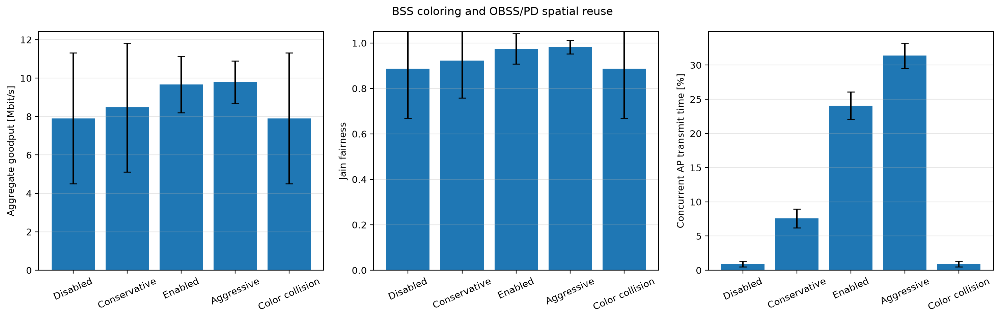

# HE BSS Coloring and Spatial Reuse

This example compares five BSS-color/OBSS-PD treatments in the two-BSS
topology defined by [BssColoringNetwork.ned](BssColoringNetwork.ned) and
[omnetpp.ini](omnetpp.ini). The evidence below is limited to recorded
application-delivery, radio-state, receiver-decision, and packet-capture
artifacts.

## Run the example

Run one configuration from the repository root:

```sh
bin/inet -u Cmdenv -f examples/ieee80211ax/bss_coloring/omnetpp.ini \
  -c BssColoringEnabled -r 0
```

Generate five runs per plotted configuration and rebuild the figure:

```sh
python3 examples/ieee80211ax/analysis/run_campaign.py bss -j$(nproc)
MPLCONFIGDIR=/tmp/matplotlib \
  python3 examples/ieee80211ax/analysis/first_tranche.py bss
```

The plotted campaign is stored under
[`results/scalar-vector/20260725T120411Z`](results/scalar-vector/20260725T120411Z).
Its provenance file,
[`bss-coloring-comparison.png.json`](../analysis/figures/bss/bss-coloring-comparison.png.json),
names every `.sca` and `.vec` input, its SHA-256 digest, runs `0` through `4`,
and the `0.3–0.95 s` measurement window.

## Scalar/vector evidence

The analysis derives aggregate goodput and Jain fairness from
`packetReceived:vector(packetBytes)` at the four client applications. It
derives concurrent AP airtime from the two AP
`transmissionState:vector` recordings. The figure provenance also records a
validation requirement for inter-BSS OBSS/PD decisions and the
`21 dBm/-82 dBm` threshold-to-power relation.

```sh
opp_scavetool query -l \
  -f 'type =~ vector AND module =~ "**.sta*.app[0]" AND name =~ "packetReceived:vector(packetBytes)"' \
  examples/ieee80211ax/bss_coloring/results/scalar-vector/20260725T120411Z/*/*.vec
```



| Configuration | Aggregate goodput | Jain fairness | Concurrent AP airtime |
|---|---:|---:|---:|
| `BssColoringDisabled` | 7.909 ± 3.398 Mbps | 0.887 ± 0.218 | 0.904 ± 0.419% |
| `ObssPdConservative` (`-81 dBm`) | 8.475 ± 3.352 Mbps | 0.922 ± 0.164 | 7.590 ± 1.365% |
| `BssColoringEnabled` (`-79 dBm`) | 9.669 ± 1.478 Mbps | 0.974 ± 0.067 | 24.068 ± 2.021% |
| `ObssPdAggressive` (`-78 dBm`) | 9.782 ± 1.103 Mbps | 0.982 ± 0.030 | 31.290 ± 1.843% |
| `BssColoringCollision` | 7.909 ± 3.398 Mbps | 0.887 ± 0.218 | 0.904 ± 0.419% |

Values are means ± 95% Student-t confidence intervals over runs `0–4`, as
defined by the figure provenance. The `transmissionState:vector` result places
concurrent airtime in the order aggressive, enabled, conservative, disabled
and color-collision. The overlapping goodput intervals do not establish a
strict goodput ordering.

The receiver-decision vectors used by the figure validation are the direct
evidence for local/received color, intra/inter-BSS classification, OBSS/PD
eligibility, ignore decision, threshold, reason code, and transmit-power
limit. The MAC captures below do not expose those receiver decisions.

## Packet evidence

The retained run-0 capture session is
[`results/packet-statistics/20260724T175025Z`](results/packet-statistics/20260724T175025Z).
It records `mac` observations at every `wlan[0]`. Regenerate the captures and
packet summary with:

```sh
MPLCONFIGDIR=/tmp/matplotlib \
  python3 examples/ieee80211ax/analysis/analyze_pcap_types.py \
  --generate --subdir bss_coloring
```

Inspect the enabled AP capture directly:

```sh
tshark -n -r \
  'examples/ieee80211ax/bss_coloring/results/packet-statistics/20260724T175025Z/BssColoringEnabled/BssColoringEnabled-#0BssColoringNetwork.ap1.wlan[0].pcap' \
  -c 20
```

The packet-statistics evidence check reports protocol-visible observations for
every retained configuration:

| Configuration | AP/global transmission observations |
|---|---:|
| `BssColoringCollision` | 2586 |
| `BssColoringDisabled` | 2586 |
| `BssColoringEnabled` | 2347 |
| `ObssPdAggressive` | 2378 |
| `ObssPdConservative` | 2553 |
| `TwoNav` | 1805 |

These are observations at AP capture points, not de-duplicated application
packets. The packet-statistics table also reports at least two different
frame-distribution signatures across the coloring/OBSS-PD configurations.
Use `packet_statistics.png` for the corresponding frame-type, duration,
frequency, signal, power, and estimated-airtime breakdown.

## Dual-NAV evidence boundary

For `TwoNav` run 0, the retained result files
[`TwoNav-#0.vec`](results/packet-statistics/20260724T175025Z/TwoNav/TwoNav-%230.vec)
and
[`TwoNav-#0.sca`](results/packet-statistics/20260724T175025Z/TwoNav/TwoNav-%230.sca)
contain `nav:vector` at all six MAC receivers: the two APs have 524 and 1380
samples, and the four STAs have 1169, 1240, 1452, and 1287 samples.
`intraBssNavChanged:vector` has no match in those files, so these artifacts do
not demonstrate an Intra-BSS NAV transition.

```sh
opp_scavetool query -l \
  -f 'type =~ vector AND (name =~ "nav:vector" OR name =~ "intraBssNavChanged:vector")' \
  examples/ieee80211ax/bss_coloring/results/packet-statistics/20260724T175025Z/TwoNav/TwoNav-#0.vec \
  examples/ieee80211ax/bss_coloring/results/packet-statistics/20260724T175025Z/TwoNav/TwoNav-#0.sca
```
