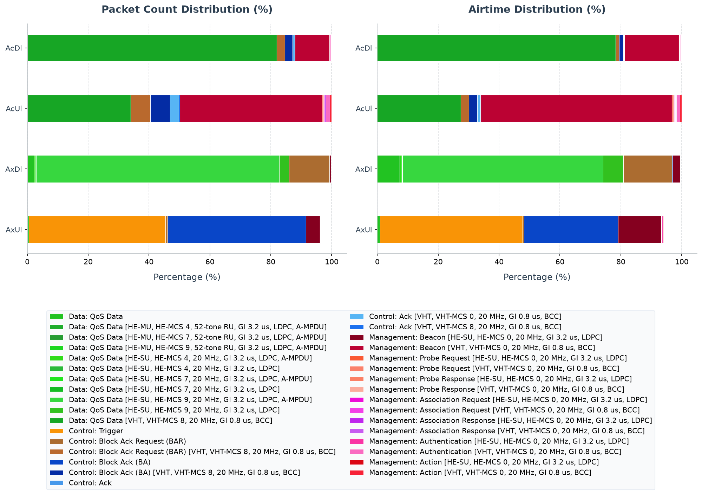

# Walkthrough: Dense IoT with 802.11ax OFDMA and TWT

<!-- BEGIN SCRIPT RESULTS SESSIONS -->
`[script]` results sessions:

- Scalar/vector: `NOT RUN`
- PCAP: `20260725T234519Z`
<!-- END SCRIPT RESULTS SESSIONS -->

`[agent]` results sessions: `20260725T120411Z`, `20260725T234519Z`.

This example compares an IEEE 802.11ax dense-IoT treatment that requests
orthogonal frequency-division multiple access (OFDMA) and Target Wake Time
(TWT) with a matched IEEE 802.11ac single-user control. The retained evidence
supports a five-seed uplink comparison at 8 and 16 stations; the downlink and
mixed campaigns, and packet-level mechanism checks, remain incomplete.

## [agent] Learning objectives and feature primer

After completing this walkthrough, the reader can:

- explain how OFDMA divides a channel into resource units (RUs) and how TWT
  concentrates a station's activity into negotiated service periods;
- identify the AX/AC feature gates, TWT agreement telemetry, AP Basic Trigger
  counter, application outcomes, and station-energy results;
- explain why energy, delivery, and delay must be interpreted together; and
- reproduce the retained uplink queries and identify the first missing
  artifact for packet-level validation.

In the AX treatment, the access point (AP) may schedule several stations on
different RUs and each station requests one implicit, individual, unannounced
TWT agreement. A sleeping station should wake for its service period, exchange
queued traffic, and return to sleep. The AC control uses Enhanced Distributed
Channel Access (EDCA) without TWT. The validation outcome is deliberately
bounded: the treatment passes the retained energy comparison only as an
outcome observation, while the OFDMA frame exchange remains inconclusive.

## [agent] Scenario description

The [network](DenseIotNetwork.ned) and [configuration](omnetpp.ini) define one
infrastructure basic service set (BSS). A fixed AP at the center of a 500 m by
500 m area connects through 100 Gbit/s Ethernet to `server`; 8 or 16 stationary
stations are independently placed in the inner 360 m by 360 m square. All
wireless nodes use the same 5 GHz, 20 MHz scalar-radio channel, transmit power,
sensitivity, one antenna, and state-based radio energy model.

```text
       sta[0]       sta[1]       ...       sta[N-1]
          \            |                       /
           +-----------+---- 5 GHz BSS -------+
                              |
                             AP ===== 100 Gbit/s ===== server
```

Association starts are spread over the first 15 s. Applications start between
10 s and 11 s, the simulation lasts 120 s, and OMNeT++ removes the first 20 s
as warm-up. Uplink stations send 100-byte UDP payloads once per second.
Station placement, association, and application phases use separate random
number streams; paired AX/AC repetitions share those inputs, although their
MAC paths can consume randomness differently.

## [agent] Standards and INET model boundary

IEEE Std 802.11-2024 Clause 26.8.1 describes TWT as concentrating exchanges in
predefined service periods to reduce contention and awake time
(`80211ax-2024:chunk:09855`). Clause 26.5.4.1 describes AP allocation of
random-access RUs in Trigger frames and the station OFDMA random-access state
(`80211ax-2024:chunk:09810`). These are normative protocol concepts.

INET configures `HeHcf`, backlog-based DL/UL schedulers, an
`Ieee80211TwtManager`, and state-based power consumption. These are model
abstractions, not proof that every standard field or procedure occurred.
`twtAgreementCount` directly exposes model agreement state; the Basic Trigger
counter exposes AP coordinator activity. The fresh run-0 AP captures directly
expose HE Basic and BSRP Trigger frames, their user-info RU allocations, and
the following Block Ack observations. They do not expose a correlated TWT
wake-state transition or an authoritative per-station response identity.

## [agent] Evidence status

| Claim or check | Status | Authoritative evidence | Runs/seeds | Scope or gap |
|---|---|---|---|---|
| AX stations establish the requested TWT agreement | `PASS` | `twtAgreementCount = 1` for every station in each `AxUl` scalar file | 8 and 16 stations, repetitions/seeds 0–4 | Direct model telemetry; not a decoded negotiation |
| AP emits Basic Triggers in every AX uplink run | `FAIL` | `heUlBasicTriggerSent:count` | Same ten runs | Nonzero in only 5 of 10 runs |
| AX uplink uses less modeled station energy than AC | `PASS` | residual-energy scalars and paired derived means | Same ten paired runs | 43.99% and 44.02% reductions; outcome only |
| Delivery and delay remain comparable | `INCONCLUSIVE` | server receive count and delay summary | Same ten paired runs | AX sample means are lower/higher respectively, but no acceptance gate or uncertainty was retained |
| HE Trigger exchange occurs in the AX uplink run | `PASS` | AP PCAP frames 3191–3194 and generated packet summary | run/seed 0 | Basic Trigger type 0, RU allocations 1–4, followed by BA observations |
| TWT wake exchange caused the energy result | `INCONCLUSIVE` | scalar/vector and packet sessions are separate | — | No co-recorded wake-state-to-frame correlation |
| Downlink AX/AC frames are observable | `PASS` | AP PCAP session `20260725T234519Z` | run/seed 0 | Packet-level single-run comparison only |
| Mixed AX/AC outcomes | `NOT RUN` | excluded from the packet campaign | none | Skipped by request |

## [agent] Configuration matrix

| Configuration | Role | Feature gate/delta | Workload/channel | Runs/seeds | Expected invariant |
|---|---|---|---|---|---|
| `AcUl` | Control | `opMode=ac`, `Hcf`, AARF, no TWT | 8/16 STAs, 100 B uplink each 1 s, 20 MHz | 0–4 | Single-user reference |
| `AxUl` | Treatment | `opMode=ax`, `HeHcf`, HE Minstrel, DL/UL schedulers, individual unannounced TWT | Matched to `AcUl` | 0–4 | One agreement per STA; AP trigger telemetry when UL MU is used |
| `AcDl` / `AxDl` | Packet control/treatment | Downlink AX disables empty UL polling; AC remains SU | 100 B per STA each 100 ms | packet run/seed 0 | HE/VHT frame-composition comparison |
| `AcMixed` / `AxMixed` | Excluded stress pair | Combined UL and DL; AX OFDMA/TWT | Both workloads | `NOT RUN` (skipped by request) | Energy/delivery/delay under mixed load |

The winning AX assignments come from `AxUl extends = Ax, UlTraffic`:
`HeHcf`, backlog-based UL scheduling, 2–4 random-access RUs, a 10 ms minimum
Trigger interval, and one 100 ms/5 ms implicit unannounced agreement per STA.
The AC control changes several coupled mechanisms—PHY generation, rate
control, queueing/access, OFDMA, and TWT—so it is a system treatment/control
comparison, not an isolated estimate of either OFDMA or TWT.

## [agent] Expected invariants and diagnostic map

| Invariant | Evidence and observation point | Failure symptom | Likely subsystem | Next diagnostic |
|---|---|---|---|---|
| One TWT agreement per AX STA | station `twtAgreementCount` | zero/multiple agreements | TWT agent, management, manager | Targeted TWT setup logs and AP/STA PCAP |
| AP supplies UL opportunities | AP `heUlBasicTriggerSent:count` and Trigger frames | zero counter or no Basic Trigger | UL trigger policy/coordinator | Correlate coordinator logs with AP PCAP |
| Trigger contains intended RU allocations | Trigger AID12/RU fields | absent/undecoded allocation | scheduler/recorder/dissector | Typed-HE decode from retained AP PCAP |
| Energy is not saved by suppressing work | residual energy plus sink receive/delay | lower energy with lower delivery/higher delay | TWT timing, queues, application window | Co-record radio mode, power, delivery, and queue state |

## [agent] Reproduction

Run from the INET repository root. The bounded packet campaign below completed
with exit status 0 and created session `20260725T234519Z`:

```sh
MPLCONFIGDIR=/tmp/matplotlib \
  python3 examples/ieee80211/analysis/analyze_pcap.py \
  --suite examples/ieee80211/analysis/suites/ax.json \
  --generate --subdir dense_iot \
  --config AxUl --config AcUl --config AxDl --config AcDl \
  --run 0 --allow-failed-evidence
```

The retained campaign was created by the example runner. A full regeneration
command is:

```sh
python3 examples/ieee80211ax/dense_iot/run_campaign.py \
  --station-counts 8,16 --runs-per-station-count 5 -j$(nproc)
```

The scalar/vector regeneration command is a recipe, not a newly observed exit
status. The retained scalar/vector files identify repetitions and seed sets
0–4.

## [agent] Scalar and vector analysis

Inputs are the 20 `.sca` and 20 `.vec` files under
`results/20260725T120411Z/{AxUl,AcUl}/`. Query only the receiving
application and named mechanism results:

```sh
opp_scavetool query -l \
  -f 'module =~ "*.server.app[0]" AND (name =~ "packetReceived:count" OR name =~ "endToEndDelay:vector")' \
  examples/ieee80211ax/dense_iot/results/20260725T120411Z/AxUl/*.{sca,vec} \
  examples/ieee80211ax/dense_iot/results/20260725T120411Z/AcUl/*.{sca,vec}

opp_scavetool query -l \
  -f 'name =~ "residualEnergyCapacity:last" OR name =~ "twtAgreementCount" OR name =~ "twtAwakeTime" OR name =~ "twtSleepTime" OR name =~ "heUlBasicTriggerSent:count"' \
  examples/ieee80211ax/dense_iot/results/20260725T120411Z/AxUl/*.sca \
  examples/ieee80211ax/dense_iot/results/20260725T120411Z/AcUl/*.sca
```

Receive count is `DenseIotNetwork.server.app[0] packetReceived:count`; delay is
the summary mean of its `endToEndDelay:vector`. Mean station energy used is the
per-run station average of `1000 J - residualEnergyCapacity:last`. Each table
entry is one run; the final row is the arithmetic mean of five independent
seed-set repetitions. No confidence interval was retained for this analysis.

### [agent] Eight stations

| Repetition | AX received | AC received | AX mean delay | AC mean delay | AX mean station energy | AC mean station energy |
|---:|---:|---:|---:|---:|---:|---:|
| 0 | 700 | 800 | 0.028219 s | 0.000105 s | 0.135945 J | 0.242398 J |
| 1 | 800 | 800 | 0.020160 s | 0.000104 s | 0.134993 J | 0.242427 J |
| 2 | 800 | 800 | 0.046847 s | 0.000104 s | 0.136388 J | 0.242382 J |
| 3 | 800 | 800 | 0.040412 s | 0.000104 s | 0.136055 J | 0.242359 J |
| 4 | 800 | 800 | 0.047810 s | 0.000103 s | 0.135473 J | 0.242431 J |
| Five-run mean | 780.0 | 800.0 | 0.036690 s | 0.000104 s | 0.135771 J | 0.242400 J |

### [agent] Sixteen stations

| Repetition | AX received | AC received | AX mean delay | AC mean delay | AX mean station energy | AC mean station energy |
|---:|---:|---:|---:|---:|---:|---:|
| 0 | 1,570 | 1,600 | 1.345015 s | 0.000104 s | 0.135930 J | 0.242981 J |
| 1 | 1,565 | 1,592 | 1.325530 s | 0.431639 s | 0.136496 J | 0.243095 J |
| 2 | 1,613 | 1,607 | 1.037000 s | 0.028115 s | 0.135499 J | 0.243096 J |
| 3 | 1,600 | 1,600 | 0.048280 s | 0.000104 s | 0.135194 J | 0.243066 J |
| 4 | 1,598 | 1,600 | 0.120907 s | 0.000103 s | 0.137231 J | 0.243062 J |
| Five-run mean | 1,589.2 | 1,599.8 | 0.775346 s | 0.091813 s | 0.136070 J | 0.243060 J |

The derived AX energy reductions are 43.99% at 8 stations and 44.02% at 16.
They do not establish a better overall outcome: AX has lower mean receive
counts and substantially higher mean delay. Counts can exceed the nominal
measurement-window generation count because packets generated during warm-up
may arrive after recording begins; they are therefore not delivery ratios.
Every AX station records one agreement, while Basic Trigger counts are
`170,0,0,0,0` (8 STAs) and `10,10,10,0,440` (16 STAs).

No plot: the retained `analysis/dense_iot_comparison.png` has no
session-bound provenance sidecar, and the retained scalar/vector campaign
covers only the uplink pair. It is therefore excluded instead of presenting
an unverifiable or incomplete comparison.

## [agent] PCAP statistics

Session `results/20260725T234519Z` records the AP `wlan[0]`
MAC observation point for the four requested UL/DL configurations. The files
are PCAPng despite the compatibility `.pcap` suffix, use microsecond
timestamps and computed checksum/FCS settings, and decode with TShark 4.6.4.
Rows count AP capture observations, not application deliveries or
de-duplicated transmissions.

```sh
python3 examples/ieee80211/analysis/analyze_pcap.py \
  --suite examples/ieee80211/analysis/suites/ax.json \
  --generate --subdir dense_iot \
  --config AxUl --config AcUl --config AxDl --config AcDl --run 0
```

| Configuration | AP observations | Dominant direct packet evidence | Interpretation limit |
|---|---:|---|---|
| `AxUl` | 26,551 | 11,921 HE Triggers and 12,067 BA observations | No frame-to-energy causality |
| `AcUl` | 2,563 | 871 VHT QoS Data and 166 BAR/BA observations | System-level AC counterfactual |
| `AxDl` | 265,600 | HE-SU dominates; HE-MU 52-tone RU observations also decode | Capture observations, not delivery |
| `AcDl` | 10,598 | 8,686 VHT QoS Data observations | Capture observations, not delivery |

<!-- BEGIN GENERATED: ieee80211ax-pcap-statistics -->
### [script] Generated PCAP plots and tables


Figure provenance: [`packet_statistics.png.json`](../analysis/figures/dense_iot/packet_statistics.png.json).

This section provides a statistical overview of the 802.11 frames transmitted over the wireless medium during the simulation. The packet counts were gathered from AP wireless-interface observation points. With multiple AP captures, one medium transmission may be observed at more than one AP; counts and airtime therefore represent recorded transmission observations, not de-duplicated application packets.

Capture session `20260725T234519Z` was generated from fresh PCAPng input with `TShark (Wireshark) 4.6.4.`. The selected manifest is `examples/ieee80211/analysis/generated/ax/pcapmanifests/20260725T234519Z.json` (SHA-256 `5002d629772d1f12e94751bf446a48eb62b9e9b708710f842d37418a8c4f49bf`). HE PPDU format, MCS, coding, bandwidth/RU, GI, and NSTS are decoded directly from standards-compliant radiotap HE fields; values not marked known by the recorder are omitted.

Two estimated airtime occupancy percentages are provided. HE-SU and HE-ER-SU use the modeled 36/44 µs preambles; a dissector-expanded A-MPDU is charged one shared preamble. HE MU/TB user-dependent signaling not exposed by radiotap remains approximate.
- **Air Time %**: This frame type's share of the sum of all estimated frame airtimes.
- **Air Time (Sim Time) %** (and **Estimated airtime / sim time** in the summary table): The sum of estimated frame airtimes divided by the simulation time limit. Parallel multi-user transmissions (e.g., OFDMA resource units or MU-MIMO spatial streams) and concurrent observations across multiple capture points are summed per transmission/RU, so this cumulative metric can exceed 100%; it is not the union of busy channel time.

#### [script] Compact cross-configuration summary

Observation point: Access Point (AP) wireless interfaces.

| Configuration | Selection/filter | Observations | Dominant decoded frame/PHY evidence | Estimated airtime / sim time | Limits |
|---|---|---:|---|---:|---|
| `AcDl` | `none (all decoded frames)` | 10598 | Data: QoS Data [VHT, VHT-MCS 8, 20 MHz, GI 0.8 us, BCC] (8686), Management: Beacon [VHT, VHT-MCS 0, 20 MHz, GI 0.8 us, BCC] (1200), Control: Block Ack Request (BAR) [VHT, VHT-MCS 8, 20 MHz, GI 0.8 us, BCC] (276) | 0.53% | Not delivery or de-duplicated transmissions; unknown PHY fields stay unknown |
| `AcUl` | `none (all decoded frames)` | 2563 | Management: Beacon [VHT, VHT-MCS 0, 20 MHz, GI 0.8 us, BCC] (1200), Data: QoS Data [VHT, VHT-MCS 8, 20 MHz, GI 0.8 us, BCC] (871), Control: Block Ack Request (BAR) [VHT, VHT-MCS 8, 20 MHz, GI 0.8 us, BCC] (166) | 0.15% | Not delivery or de-duplicated transmissions; unknown PHY fields stay unknown |
| `AxDl` | `none (all decoded frames)` | 265600 | Data: QoS Data [HE-SU, HE-MCS 9, 20 MHz, GI 3.2 us, LDPC, A-MPDU] (212159), Control: Block Ack Request (BAR) (35191), Data: QoS Data [HE-SU, HE-MCS 9, 20 MHz, GI 3.2 us, LDPC] (8414) | 5.17% | Not delivery or de-duplicated transmissions; unknown PHY fields stay unknown |
| `AxUl` | `none (all decoded frames)` | 26551 | Control: Block Ack (BA) (12067), Control: Trigger (11921), Management: Beacon [HE-SU, HE-MCS 0, 20 MHz, GI 3.2 us, LDPC] (1200) | 0.94% | Not delivery or de-duplicated transmissions; unknown PHY fields stay unknown |

### [script] Evidence checks

| Status | Requirement | Observed evidence |
|---|---|---|
| **PASS** | AcDl produced protocol-visible wireless observations | 10598 AP/global transmission observations |
| **PASS** | AcUl produced protocol-visible wireless observations | 2563 AP/global transmission observations |
| **PASS** | AxDl produced protocol-visible wireless observations | 265600 AP/global transmission observations |
| **PASS** | AxUl produced protocol-visible wireless observations | 26551 AP/global transmission observations |

### [script] Configuration: `AcDl`
Total over-the-air frame/MPDU transmission observations (Global BSS/AP): **10598**

| Color | Frame Type & Subtype | Count | Percentage | Mean Size | Std Dev | Mean Duration | Std Dev Duration | Freq | Mean RX Sig | Mean TX Pwr | Air Time % | Air Time (Sim Time) % |
|:---:|---|---:|---:|---:|---:|---:|---:|---:|---:|---:|---:|---:|
| <svg width="16" height="16"><rect width="16" height="16" rx="3" fill="#17a625" /></svg> | Data: QoS Data [VHT, VHT-MCS 8, 20 MHz, GI 0.8 us, BCC] | 8686 | 81.96% | 166.0 B | 0.0 B | 57.0 us | 0.0 us | 5010 MHz | - | 13.0 dBm | 78.26% | 0.41% |
| <hr> | <hr> | <hr> | <hr> | <hr> | <hr> | <hr> | <hr> | <hr> | <hr> | <hr> | <hr> | <hr> |
| <svg width="16" height="16"><rect width="16" height="16" rx="3" fill="#b9692d" /></svg> | Control: Block Ack Request (BAR) [VHT, VHT-MCS 8, 20 MHz, GI 0.8 us, BCC] | 276 | 2.60% | 24.0 B | 0.0 B | 28.0 us | 0.0 us | 5010 MHz | - | 13.0 dBm | 1.22% | 0.01% |
| <svg width="16" height="16"><rect width="16" height="16" rx="3" fill="#042ca4" /></svg> | Control: Block Ack (BA) [VHT, VHT-MCS 8, 20 MHz, GI 0.8 us, BCC] | 276 | 2.60% | 32.0 B | 0.0 B | 30.7 us | 0.0 us | 5010 MHz | -78.0 dBm | - | 1.34% | 0.01% |
| <svg width="16" height="16"><rect width="16" height="16" rx="3" fill="#57b5f4" /></svg> | Control: Ack [VHT, VHT-MCS 0, 20 MHz, GI 0.8 us, BCC] | 72 | 0.68% | 14.0 B | 0.0 B | 24.7 us | 0.0 us | 5010 MHz | -77.1 dBm | 13.0 dBm | 0.28% | 0.00% |
| <svg width="16" height="16"><rect width="16" height="16" rx="3" fill="#1b70ee" /></svg> | Control: Ack [VHT, VHT-MCS 8, 20 MHz, GI 0.8 us, BCC] | 8 | 0.08% | 14.0 B | 0.0 B | 24.7 us | 0.0 us | 5010 MHz | -77.1 dBm | - | 0.03% | 0.00% |
| <hr> | <hr> | <hr> | <hr> | <hr> | <hr> | <hr> | <hr> | <hr> | <hr> | <hr> | <hr> | <hr> |
| <svg width="16" height="16"><rect width="16" height="16" rx="3" fill="#bb0233" /></svg> | Management: Beacon [VHT, VHT-MCS 0, 20 MHz, GI 0.8 us, BCC] | 1200 | 11.32% | 56.0 B | 0.0 B | 94.7 us | 0.0 us | 5010 MHz | - | 13.0 dBm | 17.95% | 0.09% |
| <svg width="16" height="16"><rect width="16" height="16" rx="3" fill="#fa816b" /></svg> | Management: Probe Request [VHT, VHT-MCS 0, 20 MHz, GI 0.8 us, BCC] | 8 | 0.08% | 40.0 B | 0.0 B | 73.3 us | 0.0 us | 5010 MHz | -77.1 dBm | - | 0.09% | 0.00% |
| <svg width="16" height="16"><rect width="16" height="16" rx="3" fill="#fbab9d" /></svg> | Management: Probe Response [VHT, VHT-MCS 0, 20 MHz, GI 0.8 us, BCC] | 8 | 0.08% | 56.0 B | 0.0 B | 94.7 us | 0.0 us | 5010 MHz | - | 13.0 dBm | 0.12% | 0.00% |
| <svg width="16" height="16"><rect width="16" height="16" rx="3" fill="#f33fe7" /></svg> | Management: Association Request [VHT, VHT-MCS 0, 20 MHz, GI 0.8 us, BCC] | 8 | 0.08% | 48.0 B | 0.0 B | 84.0 us | 0.0 us | 5010 MHz | -77.1 dBm | - | 0.11% | 0.00% |
| <svg width="16" height="16"><rect width="16" height="16" rx="3" fill="#c85cf0" /></svg> | Management: Association Response [VHT, VHT-MCS 0, 20 MHz, GI 0.8 us, BCC] | 8 | 0.08% | 44.0 B | 0.0 B | 78.7 us | 0.0 us | 5010 MHz | - | 13.0 dBm | 0.10% | 0.00% |
| <svg width="16" height="16"><rect width="16" height="16" rx="3" fill="#fa6bc1" /></svg> | Management: Authentication [VHT, VHT-MCS 0, 20 MHz, GI 0.8 us, BCC] | 32 | 0.30% | 34.0 B | 0.0 B | 65.3 us | 0.0 us | 5010 MHz | -77.1 dBm | 13.0 dBm | 0.33% | 0.00% |
| <svg width="16" height="16"><rect width="16" height="16" rx="3" fill="#f72237" /></svg> | Management: Action [VHT, VHT-MCS 0, 20 MHz, GI 0.8 us, BCC] | 16 | 0.15% | 37.0 B | 0.0 B | 69.3 us | 0.0 us | 5010 MHz | -77.1 dBm | 13.0 dBm | 0.18% | 0.00% |

#### [script] Representative frame-exchange timeline

| Frame | Simulation time (s) | Transmitter → receiver | Type/PHY | Decisive fields | Role in exchange |
|---:|---:|---|---|---|---|
| 1 | 0.062472000 | 10:00:00:00:00:00 → ff:ff:ff:ff:ff:ff | Management: Beacon / Legacy/HT/VHT | direction=direct/IBSS, retry=0, seq=0, frag=0, more-frag=0, TID=- | Provides frame-order context for the representative exchange. |
| 2 | 0.162472000 | 10:00:00:00:00:00 → ff:ff:ff:ff:ff:ff | Management: Beacon / Legacy/HT/VHT | direction=direct/IBSS, retry=0, seq=1, frag=0, more-frag=0, TID=- | Provides frame-order context for the representative exchange. |
| 3 | 0.262472000 | 10:00:00:00:00:00 → ff:ff:ff:ff:ff:ff | Management: Beacon / Legacy/HT/VHT | direction=direct/IBSS, retry=0, seq=2, frag=0, more-frag=0, TID=- | Provides frame-order context for the representative exchange. |
| 4 | 0.362472000 | 10:00:00:00:00:00 → ff:ff:ff:ff:ff:ff | Management: Beacon / Legacy/HT/VHT | direction=direct/IBSS, retry=0, seq=3, frag=0, more-frag=0, TID=- | Provides frame-order context for the representative exchange. |
| 5 | 0.462472000 | 10:00:00:00:00:00 → ff:ff:ff:ff:ff:ff | Management: Beacon / Legacy/HT/VHT | direction=direct/IBSS, retry=0, seq=4, frag=0, more-frag=0, TID=- | Provides frame-order context for the representative exchange. |
| 6 | 0.488990000 | 0a:aa:00:00:00:04 → ff:ff:ff:ff:ff:ff | Management: Probe Request / Legacy/HT/VHT | direction=direct/IBSS, retry=0, seq=0, frag=0, more-frag=0, TID=- | Provides frame-order context for the representative exchange. |
| 7 | 0.489220000 | 10:00:00:00:00:00 → 0a:aa:00:00:00:04 | Management: Probe Response / Legacy/HT/VHT | direction=direct/IBSS, retry=0, seq=4, frag=0, more-frag=0, TID=- | Provides frame-order context for the representative exchange. |
| 8 | 0.489301000 | ? → 10:00:00:00:00:00 | Control: Ack / Legacy/HT/VHT | direction=direct/IBSS, retry=0, seq=-, frag=-, more-frag=0, TID=- | Acknowledges the preceding unicast frame. |
| 9 | 0.562472000 | 10:00:00:00:00:00 → ff:ff:ff:ff:ff:ff | Management: Beacon / Legacy/HT/VHT | direction=direct/IBSS, retry=0, seq=5, frag=0, more-frag=0, TID=- | Provides frame-order context for the representative exchange. |
| 10 | 0.662472000 | 10:00:00:00:00:00 → ff:ff:ff:ff:ff:ff | Management: Beacon / Legacy/HT/VHT | direction=direct/IBSS, retry=0, seq=6, frag=0, more-frag=0, TID=- | Provides frame-order context for the representative exchange. |
| 11 | 0.762472000 | 10:00:00:00:00:00 → ff:ff:ff:ff:ff:ff | Management: Beacon / Legacy/HT/VHT | direction=direct/IBSS, retry=0, seq=7, frag=0, more-frag=0, TID=- | Provides frame-order context for the representative exchange. |
| 12 | 0.788982000 | 0a:aa:00:00:00:04 → 10:00:00:00:00:00 | Management: Authentication / Legacy/HT/VHT | direction=direct/IBSS, retry=0, seq=0, frag=0, more-frag=0, TID=- | Provides frame-order context for the representative exchange. |
| 13 | 0.789062000 | ? → 0a:aa:00:00:00:04 | Control: Ack / Legacy/HT/VHT | direction=direct/IBSS, retry=0, seq=-, frag=-, more-frag=0, TID=- | Acknowledges the preceding unicast frame. |
| 14 | 0.789211000 | 10:00:00:00:00:00 → 0a:aa:00:00:00:04 | Management: Authentication / Legacy/HT/VHT | direction=direct/IBSS, retry=0, seq=7, frag=0, more-frag=0, TID=- | Provides frame-order context for the representative exchange. |
| 15 | 0.789292000 | ? → 10:00:00:00:00:00 | Control: Ack / Legacy/HT/VHT | direction=direct/IBSS, retry=0, seq=-, frag=-, more-frag=0, TID=- | Acknowledges the preceding unicast frame. |
| 16 | 0.789441000 | 0a:aa:00:00:00:04 → 10:00:00:00:00:00 | Management: Authentication / Legacy/HT/VHT | direction=direct/IBSS, retry=0, seq=1, frag=0, more-frag=0, TID=- | Provides frame-order context for the representative exchange. |

Frame numbers are local to capture `AcDl-#0DenseIotNetwork.ap.wlan[0].pcap`, not OMNeT++ event numbers. For readability, the table collapses observations with the same timestamp and MAC identity across capture interfaces; aggregate PCAP statistics retain the original observation counts.

### [script] Configuration: `AcUl`
Total over-the-air frame/MPDU transmission observations (Global BSS/AP): **2563**

| Color | Frame Type & Subtype | Count | Percentage | Mean Size | Std Dev | Mean Duration | Std Dev Duration | Freq | Mean RX Sig | Mean TX Pwr | Air Time % | Air Time (Sim Time) % |
|:---:|---|---:|---:|---:|---:|---:|---:|---:|---:|---:|---:|---:|
| <svg width="16" height="16"><rect width="16" height="16" rx="3" fill="#17a625" /></svg> | Data: QoS Data [VHT, VHT-MCS 8, 20 MHz, GI 0.8 us, BCC] | 871 | 33.98% | 166.0 B | 0.0 B | 57.0 us | 0.0 us | 5010 MHz | -77.1 dBm | - | 27.47% | 0.04% |
| <hr> | <hr> | <hr> | <hr> | <hr> | <hr> | <hr> | <hr> | <hr> | <hr> | <hr> | <hr> | <hr> |
| <svg width="16" height="16"><rect width="16" height="16" rx="3" fill="#b9692d" /></svg> | Control: Block Ack Request (BAR) [VHT, VHT-MCS 8, 20 MHz, GI 0.8 us, BCC] | 166 | 6.48% | 24.0 B | 0.0 B | 28.0 us | 0.0 us | 5010 MHz | -77.1 dBm | - | 2.57% | 0.00% |
| <svg width="16" height="16"><rect width="16" height="16" rx="3" fill="#042ca4" /></svg> | Control: Block Ack (BA) [VHT, VHT-MCS 8, 20 MHz, GI 0.8 us, BCC] | 166 | 6.48% | 32.0 B | 0.0 B | 30.7 us | 0.0 us | 5010 MHz | - | 13.0 dBm | 2.82% | 0.00% |
| <svg width="16" height="16"><rect width="16" height="16" rx="3" fill="#57b5f4" /></svg> | Control: Ack [VHT, VHT-MCS 0, 20 MHz, GI 0.8 us, BCC] | 72 | 2.81% | 14.0 B | 0.0 B | 24.7 us | 0.0 us | 5010 MHz | -77.1 dBm | 13.0 dBm | 0.98% | 0.00% |
| <svg width="16" height="16"><rect width="16" height="16" rx="3" fill="#1b70ee" /></svg> | Control: Ack [VHT, VHT-MCS 8, 20 MHz, GI 0.8 us, BCC] | 8 | 0.31% | 14.0 B | 0.0 B | 24.7 us | 0.0 us | 5010 MHz | - | 13.0 dBm | 0.11% | 0.00% |
| <hr> | <hr> | <hr> | <hr> | <hr> | <hr> | <hr> | <hr> | <hr> | <hr> | <hr> | <hr> | <hr> |
| <svg width="16" height="16"><rect width="16" height="16" rx="3" fill="#bb0233" /></svg> | Management: Beacon [VHT, VHT-MCS 0, 20 MHz, GI 0.8 us, BCC] | 1200 | 46.82% | 56.0 B | 0.0 B | 94.7 us | 0.0 us | 5010 MHz | - | 13.0 dBm | 62.82% | 0.09% |
| <svg width="16" height="16"><rect width="16" height="16" rx="3" fill="#fa816b" /></svg> | Management: Probe Request [VHT, VHT-MCS 0, 20 MHz, GI 0.8 us, BCC] | 8 | 0.31% | 40.0 B | 0.0 B | 73.3 us | 0.0 us | 5010 MHz | -77.1 dBm | - | 0.32% | 0.00% |
| <svg width="16" height="16"><rect width="16" height="16" rx="3" fill="#fbab9d" /></svg> | Management: Probe Response [VHT, VHT-MCS 0, 20 MHz, GI 0.8 us, BCC] | 8 | 0.31% | 56.0 B | 0.0 B | 94.7 us | 0.0 us | 5010 MHz | - | 13.0 dBm | 0.42% | 0.00% |
| <svg width="16" height="16"><rect width="16" height="16" rx="3" fill="#f33fe7" /></svg> | Management: Association Request [VHT, VHT-MCS 0, 20 MHz, GI 0.8 us, BCC] | 8 | 0.31% | 48.0 B | 0.0 B | 84.0 us | 0.0 us | 5010 MHz | -77.1 dBm | - | 0.37% | 0.00% |
| <svg width="16" height="16"><rect width="16" height="16" rx="3" fill="#c85cf0" /></svg> | Management: Association Response [VHT, VHT-MCS 0, 20 MHz, GI 0.8 us, BCC] | 8 | 0.31% | 44.0 B | 0.0 B | 78.7 us | 0.0 us | 5010 MHz | - | 13.0 dBm | 0.35% | 0.00% |
| <svg width="16" height="16"><rect width="16" height="16" rx="3" fill="#fa6bc1" /></svg> | Management: Authentication [VHT, VHT-MCS 0, 20 MHz, GI 0.8 us, BCC] | 32 | 1.25% | 34.0 B | 0.0 B | 65.3 us | 0.0 us | 5010 MHz | -77.1 dBm | 13.0 dBm | 1.16% | 0.00% |
| <svg width="16" height="16"><rect width="16" height="16" rx="3" fill="#f72237" /></svg> | Management: Action [VHT, VHT-MCS 0, 20 MHz, GI 0.8 us, BCC] | 16 | 0.62% | 37.0 B | 0.0 B | 69.3 us | 0.0 us | 5010 MHz | -77.1 dBm | 13.0 dBm | 0.61% | 0.00% |

#### [script] Representative frame-exchange timeline

| Frame | Simulation time (s) | Transmitter → receiver | Type/PHY | Decisive fields | Role in exchange |
|---:|---:|---|---|---|---|
| 1 | 0.062472000 | 10:00:00:00:00:00 → ff:ff:ff:ff:ff:ff | Management: Beacon / Legacy/HT/VHT | direction=direct/IBSS, retry=0, seq=0, frag=0, more-frag=0, TID=- | Provides frame-order context for the representative exchange. |
| 2 | 0.162472000 | 10:00:00:00:00:00 → ff:ff:ff:ff:ff:ff | Management: Beacon / Legacy/HT/VHT | direction=direct/IBSS, retry=0, seq=1, frag=0, more-frag=0, TID=- | Provides frame-order context for the representative exchange. |
| 3 | 0.262472000 | 10:00:00:00:00:00 → ff:ff:ff:ff:ff:ff | Management: Beacon / Legacy/HT/VHT | direction=direct/IBSS, retry=0, seq=2, frag=0, more-frag=0, TID=- | Provides frame-order context for the representative exchange. |
| 4 | 0.362472000 | 10:00:00:00:00:00 → ff:ff:ff:ff:ff:ff | Management: Beacon / Legacy/HT/VHT | direction=direct/IBSS, retry=0, seq=3, frag=0, more-frag=0, TID=- | Provides frame-order context for the representative exchange. |
| 5 | 0.462472000 | 10:00:00:00:00:00 → ff:ff:ff:ff:ff:ff | Management: Beacon / Legacy/HT/VHT | direction=direct/IBSS, retry=0, seq=4, frag=0, more-frag=0, TID=- | Provides frame-order context for the representative exchange. |
| 6 | 0.488990000 | 0a:aa:00:00:00:04 → ff:ff:ff:ff:ff:ff | Management: Probe Request / Legacy/HT/VHT | direction=direct/IBSS, retry=0, seq=0, frag=0, more-frag=0, TID=- | Provides frame-order context for the representative exchange. |
| 7 | 0.489220000 | 10:00:00:00:00:00 → 0a:aa:00:00:00:04 | Management: Probe Response / Legacy/HT/VHT | direction=direct/IBSS, retry=0, seq=4, frag=0, more-frag=0, TID=- | Provides frame-order context for the representative exchange. |
| 8 | 0.489301000 | ? → 10:00:00:00:00:00 | Control: Ack / Legacy/HT/VHT | direction=direct/IBSS, retry=0, seq=-, frag=-, more-frag=0, TID=- | Acknowledges the preceding unicast frame. |
| 9 | 0.562472000 | 10:00:00:00:00:00 → ff:ff:ff:ff:ff:ff | Management: Beacon / Legacy/HT/VHT | direction=direct/IBSS, retry=0, seq=5, frag=0, more-frag=0, TID=- | Provides frame-order context for the representative exchange. |
| 10 | 0.662472000 | 10:00:00:00:00:00 → ff:ff:ff:ff:ff:ff | Management: Beacon / Legacy/HT/VHT | direction=direct/IBSS, retry=0, seq=6, frag=0, more-frag=0, TID=- | Provides frame-order context for the representative exchange. |
| 11 | 0.762472000 | 10:00:00:00:00:00 → ff:ff:ff:ff:ff:ff | Management: Beacon / Legacy/HT/VHT | direction=direct/IBSS, retry=0, seq=7, frag=0, more-frag=0, TID=- | Provides frame-order context for the representative exchange. |
| 12 | 0.788982000 | 0a:aa:00:00:00:04 → 10:00:00:00:00:00 | Management: Authentication / Legacy/HT/VHT | direction=direct/IBSS, retry=0, seq=0, frag=0, more-frag=0, TID=- | Provides frame-order context for the representative exchange. |
| 13 | 0.789062000 | ? → 0a:aa:00:00:00:04 | Control: Ack / Legacy/HT/VHT | direction=direct/IBSS, retry=0, seq=-, frag=-, more-frag=0, TID=- | Acknowledges the preceding unicast frame. |
| 14 | 0.789211000 | 10:00:00:00:00:00 → 0a:aa:00:00:00:04 | Management: Authentication / Legacy/HT/VHT | direction=direct/IBSS, retry=0, seq=7, frag=0, more-frag=0, TID=- | Provides frame-order context for the representative exchange. |
| 15 | 0.789292000 | ? → 10:00:00:00:00:00 | Control: Ack / Legacy/HT/VHT | direction=direct/IBSS, retry=0, seq=-, frag=-, more-frag=0, TID=- | Acknowledges the preceding unicast frame. |
| 16 | 0.789441000 | 0a:aa:00:00:00:04 → 10:00:00:00:00:00 | Management: Authentication / Legacy/HT/VHT | direction=direct/IBSS, retry=0, seq=1, frag=0, more-frag=0, TID=- | Provides frame-order context for the representative exchange. |

Frame numbers are local to capture `AcUl-#0DenseIotNetwork.ap.wlan[0].pcap`, not OMNeT++ event numbers. For readability, the table collapses observations with the same timestamp and MAC identity across capture interfaces; aggregate PCAP statistics retain the original observation counts.

### [script] Configuration: `AxDl`
Total over-the-air frame/MPDU transmission observations (Global BSS/AP): **265600**

| Color | Frame Type & Subtype | Count | Percentage | Mean Size | Std Dev | Mean Duration | Std Dev Duration | Freq | Mean RX Sig | Mean TX Pwr | Air Time % | Air Time (Sim Time) % |
|:---:|---|---:|---:|---:|---:|---:|---:|---:|---:|---:|---:|---:|
| <svg width="16" height="16"><rect width="16" height="16" rx="3" fill="#22c322" /></svg> | Data: QoS Data | 258 | 0.10% | 166.0 B | 0.0 B | 75.3 us | 0.0 us | 5010 MHz | - | 13.0 dBm | 0.31% | 0.02% |
| <svg width="16" height="16"><rect width="16" height="16" rx="3" fill="#22c322" /></svg> | Data: QoS Data | 6037 | 2.27% | 166.0 B | 0.0 B | 75.3 us | 0.0 us | 5010 MHz | - | 13.0 dBm | 7.32% | 0.38% |
| <svg width="16" height="16"><rect width="16" height="16" rx="3" fill="#1fad2b" /></svg> | Data: QoS Data [HE-MU, HE-MCS 4, 52-tone RU, GI 3.2 us, LDPC, A-MPDU] | 1 | 0.00% | 166.0 B | 0.0 B | 183.6 us | 0.0 us | 5010 MHz | - | 13.0 dBm | 0.00% | 0.00% |
| <svg width="16" height="16"><rect width="16" height="16" rx="3" fill="#269c32" /></svg> | Data: QoS Data [HE-MU, HE-MCS 7, 52-tone RU, GI 3.2 us, LDPC, A-MPDU] | 1 | 0.00% | 166.0 B | 0.0 B | 124.5 us | 0.0 us | 5010 MHz | - | 13.0 dBm | 0.00% | 0.00% |
| <svg width="16" height="16"><rect width="16" height="16" rx="3" fill="#1dd720" /></svg> | Data: QoS Data [HE-MU, HE-MCS 9, 52-tone RU, GI 3.2 us, LDPC, A-MPDU] | 20 | 0.01% | 166.0 B | 0.0 B | 102.4 us | 0.0 us | 5010 MHz | - | 13.0 dBm | 0.03% | 0.00% |
| <svg width="16" height="16"><rect width="16" height="16" rx="3" fill="#2fdc18" /></svg> | Data: QoS Data [HE-SU, HE-MCS 4, 20 MHz, GI 3.2 us, LDPC, A-MPDU] | 725 | 0.27% | 166.0 B | 0.0 B | 37.5 us | 14.4 us | 5010 MHz | - | 13.0 dBm | 0.44% | 0.02% |
| <svg width="16" height="16"><rect width="16" height="16" rx="3" fill="#2cba3a" /></svg> | Data: QoS Data [HE-SU, HE-MCS 4, 20 MHz, GI 3.2 us, LDPC] | 31 | 0.01% | 166.0 B | 0.0 B | 66.3 us | 0.0 us | 5010 MHz | - | 13.0 dBm | 0.03% | 0.00% |
| <svg width="16" height="16"><rect width="16" height="16" rx="3" fill="#21e61e" /></svg> | Data: QoS Data [HE-SU, HE-MCS 7, 20 MHz, GI 3.2 us, LDPC, A-MPDU] | 915 | 0.34% | 166.0 B | 0.0 B | 25.4 us | 14.4 us | 5010 MHz | - | 13.0 dBm | 0.37% | 0.02% |
| <svg width="16" height="16"><rect width="16" height="16" rx="3" fill="#15bc23" /></svg> | Data: QoS Data [HE-SU, HE-MCS 7, 20 MHz, GI 3.2 us, LDPC] | 33 | 0.01% | 166.0 B | 0.0 B | 54.2 us | 0.0 us | 5010 MHz | - | 13.0 dBm | 0.03% | 0.00% |
| <svg width="16" height="16"><rect width="16" height="16" rx="3" fill="#37d73f" /></svg> | Data: QoS Data [HE-SU, HE-MCS 9, 20 MHz, GI 3.2 us, LDPC, A-MPDU] | 212159 | 79.88% | 166.0 B | 0.0 B | 19.3 us | 13.1 us | 5010 MHz | - | 13.0 dBm | 65.90% | 3.41% |
| <svg width="16" height="16"><rect width="16" height="16" rx="3" fill="#32c11f" /></svg> | Data: QoS Data [HE-SU, HE-MCS 9, 20 MHz, GI 3.2 us, LDPC] | 8414 | 3.17% | 166.0 B | 0.0 B | 49.6 us | 0.0 us | 5010 MHz | - | 13.0 dBm | 6.72% | 0.35% |
| <hr> | <hr> | <hr> | <hr> | <hr> | <hr> | <hr> | <hr> | <hr> | <hr> | <hr> | <hr> | <hr> |
| <svg width="16" height="16"><rect width="16" height="16" rx="3" fill="#ab6c30" /></svg> | Control: Block Ack Request (BAR) | 35191 | 13.25% | 24.0 B | 0.0 B | 28.0 us | 0.0 us | 5010 MHz | - | 13.0 dBm | 15.87% | 0.82% |
| <svg width="16" height="16"><rect width="16" height="16" rx="3" fill="#0946c8" /></svg> | Control: Block Ack (BA) | 423 | 0.16% | 38.2 B | 26.6 B | 32.7 us | 8.9 us | 5010 MHz | -76.9 dBm | - | 0.22% | 0.01% |
| <svg width="16" height="16"><rect width="16" height="16" rx="3" fill="#4799eb" /></svg> | Control: Ack | 88 | 0.03% | 14.0 B | 0.0 B | 24.7 us | 0.0 us | 5010 MHz | -77.1 dBm | 13.0 dBm | 0.03% | 0.00% |
| <svg width="16" height="16"><rect width="16" height="16" rx="3" fill="#4799eb" /></svg> | Control: Ack | 8 | 0.00% | 14.0 B | 0.0 B | 24.7 us | 0.0 us | 5010 MHz | -77.1 dBm | - | 0.00% | 0.00% |
| <hr> | <hr> | <hr> | <hr> | <hr> | <hr> | <hr> | <hr> | <hr> | <hr> | <hr> | <hr> | <hr> |
| <svg width="16" height="16"><rect width="16" height="16" rx="3" fill="#85001f" /></svg> | Management: Beacon [HE-SU, HE-MCS 0, 20 MHz, GI 3.2 us, LDPC] | 1200 | 0.45% | 88.0 B | 0.0 B | 132.3 us | 0.0 us | 5010 MHz | - | 13.0 dBm | 2.56% | 0.13% |
| <svg width="16" height="16"><rect width="16" height="16" rx="3" fill="#fa5833" /></svg> | Management: Probe Request [HE-SU, HE-MCS 0, 20 MHz, GI 3.2 us, LDPC] | 8 | 0.00% | 63.0 B | 0.0 B | 104.9 us | 0.0 us | 5010 MHz | -77.1 dBm | - | 0.01% | 0.00% |
| <svg width="16" height="16"><rect width="16" height="16" rx="3" fill="#fb8065" /></svg> | Management: Probe Response [HE-SU, HE-MCS 0, 20 MHz, GI 3.2 us, LDPC] | 8 | 0.00% | 88.0 B | 0.0 B | 132.3 us | 0.0 us | 5010 MHz | - | 13.0 dBm | 0.02% | 0.00% |
| <svg width="16" height="16"><rect width="16" height="16" rx="3" fill="#ed0cd7" /></svg> | Management: Association Request [HE-SU, HE-MCS 0, 20 MHz, GI 3.2 us, LDPC] | 8 | 0.00% | 71.0 B | 0.0 B | 113.7 us | 0.0 us | 5010 MHz | -77.1 dBm | - | 0.01% | 0.00% |
| <svg width="16" height="16"><rect width="16" height="16" rx="3" fill="#bf26ed" /></svg> | Management: Association Response [HE-SU, HE-MCS 0, 20 MHz, GI 3.2 us, LDPC] | 8 | 0.00% | 76.0 B | 0.0 B | 119.1 us | 0.0 us | 5010 MHz | - | 13.0 dBm | 0.02% | 0.00% |
| <svg width="16" height="16"><rect width="16" height="16" rx="3" fill="#fa33a4" /></svg> | Management: Authentication [HE-SU, HE-MCS 0, 20 MHz, GI 3.2 us, LDPC] | 32 | 0.01% | 34.0 B | 0.0 B | 73.2 us | 0.0 us | 5010 MHz | -77.1 dBm | 13.0 dBm | 0.04% | 0.00% |
| <svg width="16" height="16"><rect width="16" height="16" rx="3" fill="#db0614" /></svg> | Management: Action [HE-SU, HE-MCS 0, 20 MHz, GI 3.2 us, LDPC] | 32 | 0.01% | 42.5 B | 5.5 B | 82.5 us | 6.0 us | 5010 MHz | -77.1 dBm | 13.0 dBm | 0.04% | 0.00% |

#### [script] Representative frame-exchange timeline

| Frame | Simulation time (s) | Transmitter → receiver | Type/PHY | Decisive fields | Role in exchange |
|---:|---:|---|---|---|---|
| 1 | 0.052211000 | 10:00:00:00:00:00 → ff:ff:ff:ff:ff:ff | Management: Beacon / HE-SU, HE-MCS 0, 20 MHz, NSS 1, GI 3.2 us, LDPC | direction=direct/IBSS, retry=0, seq=0, frag=0, more-frag=0, TID=- | Provides frame-order context for the representative exchange. |
| 2 | 0.152211000 | 10:00:00:00:00:00 → ff:ff:ff:ff:ff:ff | Management: Beacon / HE-SU, HE-MCS 0, 20 MHz, NSS 1, GI 3.2 us, LDPC | direction=direct/IBSS, retry=0, seq=1, frag=0, more-frag=0, TID=- | Provides frame-order context for the representative exchange. |
| 3 | 0.252211000 | 10:00:00:00:00:00 → ff:ff:ff:ff:ff:ff | Management: Beacon / HE-SU, HE-MCS 0, 20 MHz, NSS 1, GI 3.2 us, LDPC | direction=direct/IBSS, retry=0, seq=2, frag=0, more-frag=0, TID=- | Provides frame-order context for the representative exchange. |
| 4 | 0.352211000 | 10:00:00:00:00:00 → ff:ff:ff:ff:ff:ff | Management: Beacon / HE-SU, HE-MCS 0, 20 MHz, NSS 1, GI 3.2 us, LDPC | direction=direct/IBSS, retry=0, seq=3, frag=0, more-frag=0, TID=- | Provides frame-order context for the representative exchange. |
| 5 | 0.452211000 | 10:00:00:00:00:00 → ff:ff:ff:ff:ff:ff | Management: Beacon / HE-SU, HE-MCS 0, 20 MHz, NSS 1, GI 3.2 us, LDPC | direction=direct/IBSS, retry=0, seq=4, frag=0, more-frag=0, TID=- | Provides frame-order context for the representative exchange. |
| 6 | 0.489026000 | 0a:aa:00:00:00:04 → ff:ff:ff:ff:ff:ff | Management: Probe Request / HE-SU, HE-MCS 0, 20 MHz, NSS 1, GI 3.2 us, LDPC | direction=direct/IBSS, retry=0, seq=0, frag=0, more-frag=0, TID=- | Provides frame-order context for the representative exchange. |
| 7 | 0.489293000 | 10:00:00:00:00:00 → 0a:aa:00:00:00:04 | Management: Probe Response / HE-SU, HE-MCS 0, 20 MHz, NSS 1, GI 3.2 us, LDPC | direction=direct/IBSS, retry=0, seq=4, frag=0, more-frag=0, TID=- | Provides frame-order context for the representative exchange. |
| 8 | 0.489354000 | ? → 10:00:00:00:00:00 | Control: Ack / Legacy/HT/VHT | direction=direct/IBSS, retry=0, seq=-, frag=-, more-frag=0, TID=- | Acknowledges the preceding unicast frame. |
| 9 | 0.552211000 | 10:00:00:00:00:00 → ff:ff:ff:ff:ff:ff | Management: Beacon / HE-SU, HE-MCS 0, 20 MHz, NSS 1, GI 3.2 us, LDPC | direction=direct/IBSS, retry=0, seq=5, frag=0, more-frag=0, TID=- | Provides frame-order context for the representative exchange. |
| 10 | 0.652211000 | 10:00:00:00:00:00 → ff:ff:ff:ff:ff:ff | Management: Beacon / HE-SU, HE-MCS 0, 20 MHz, NSS 1, GI 3.2 us, LDPC | direction=direct/IBSS, retry=0, seq=6, frag=0, more-frag=0, TID=- | Provides frame-order context for the representative exchange. |
| 11 | 0.752211000 | 10:00:00:00:00:00 → ff:ff:ff:ff:ff:ff | Management: Beacon / HE-SU, HE-MCS 0, 20 MHz, NSS 1, GI 3.2 us, LDPC | direction=direct/IBSS, retry=0, seq=7, frag=0, more-frag=0, TID=- | Provides frame-order context for the representative exchange. |
| 12 | 0.788994000 | 0a:aa:00:00:00:04 → 10:00:00:00:00:00 | Management: Authentication / HE-SU, HE-MCS 0, 20 MHz, NSS 1, GI 3.2 us, LDPC | direction=direct/IBSS, retry=0, seq=0, frag=0, more-frag=0, TID=- | Provides frame-order context for the representative exchange. |
| 13 | 0.789054000 | ? → 0a:aa:00:00:00:04 | Control: Ack / Legacy/HT/VHT | direction=direct/IBSS, retry=0, seq=-, frag=-, more-frag=0, TID=- | Acknowledges the preceding unicast frame. |
| 14 | 0.789206000 | 10:00:00:00:00:00 → 0a:aa:00:00:00:04 | Management: Authentication / HE-SU, HE-MCS 0, 20 MHz, NSS 1, GI 3.2 us, LDPC | direction=direct/IBSS, retry=0, seq=7, frag=0, more-frag=0, TID=- | Provides frame-order context for the representative exchange. |
| 15 | 0.789267000 | ? → 10:00:00:00:00:00 | Control: Ack / Legacy/HT/VHT | direction=direct/IBSS, retry=0, seq=-, frag=-, more-frag=0, TID=- | Acknowledges the preceding unicast frame. |
| 16 | 0.789401000 | 0a:aa:00:00:00:04 → 10:00:00:00:00:00 | Management: Authentication / HE-SU, HE-MCS 0, 20 MHz, NSS 1, GI 3.2 us, LDPC | direction=direct/IBSS, retry=0, seq=1, frag=0, more-frag=0, TID=- | Provides frame-order context for the representative exchange. |

Frame numbers are local to capture `AxDl-#0DenseIotNetwork.ap.wlan[0].pcap`, not OMNeT++ event numbers. For readability, the table collapses observations with the same timestamp and MAC identity across capture interfaces; aggregate PCAP statistics retain the original observation counts.

### [script] Configuration: `AxUl`
Total over-the-air frame/MPDU transmission observations (Global BSS/AP): **26551**

| Color | Frame Type & Subtype | Count | Percentage | Mean Size | Std Dev | Mean Duration | Std Dev Duration | Freq | Mean RX Sig | Mean TX Pwr | Air Time % | Air Time (Sim Time) % |
|:---:|---|---:|---:|---:|---:|---:|---:|---:|---:|---:|---:|---:|
| <svg width="16" height="16"><rect width="16" height="16" rx="3" fill="#22c322" /></svg> | Data: QoS Data | 851 | 3.21% | 170.0 B | 0.0 B | 76.7 us | 0.0 us | 5010 MHz | -77.1 dBm | - | 5.79% | 0.05% |
| <svg width="16" height="16"><rect width="16" height="16" rx="3" fill="#22c322" /></svg> | Data: QoS Data | 137 | 0.52% | 168.8 B | 1.8 B | 76.3 us | 0.6 us | 5010 MHz | -79.0 dBm | - | 0.93% | 0.01% |
| <hr> | <hr> | <hr> | <hr> | <hr> | <hr> | <hr> | <hr> | <hr> | <hr> | <hr> | <hr> | <hr> |
| <svg width="16" height="16"><rect width="16" height="16" rx="3" fill="#f99406" /></svg> | Control: Trigger | 11921 | 44.90% | 72.7 B | 2.6 B | 44.2 us | 0.9 us | 5010 MHz | - | 13.0 dBm | 46.81% | 0.44% |
| <svg width="16" height="16"><rect width="16" height="16" rx="3" fill="#ab6c30" /></svg> | Control: Block Ack Request (BAR) | 183 | 0.69% | 24.0 B | 0.0 B | 28.0 us | 0.0 us | 5010 MHz | -77.3 dBm | - | 0.45% | 0.00% |
| <svg width="16" height="16"><rect width="16" height="16" rx="3" fill="#0946c8" /></svg> | Control: Block Ack (BA) | 12067 | 45.45% | 26.6 B | 5.8 B | 28.9 us | 1.9 us | 5010 MHz | - | 13.0 dBm | 30.94% | 0.29% |
| <svg width="16" height="16"><rect width="16" height="16" rx="3" fill="#4799eb" /></svg> | Control: Ack | 88 | 0.33% | 14.0 B | 0.0 B | 24.7 us | 0.0 us | 5010 MHz | -77.1 dBm | 13.0 dBm | 0.19% | 0.00% |
| <svg width="16" height="16"><rect width="16" height="16" rx="3" fill="#4799eb" /></svg> | Control: Ack | 8 | 0.03% | 14.0 B | 0.0 B | 24.7 us | 0.0 us | 5010 MHz | - | 13.0 dBm | 0.02% | 0.00% |
| <hr> | <hr> | <hr> | <hr> | <hr> | <hr> | <hr> | <hr> | <hr> | <hr> | <hr> | <hr> | <hr> |
| <svg width="16" height="16"><rect width="16" height="16" rx="3" fill="#85001f" /></svg> | Management: Beacon [HE-SU, HE-MCS 0, 20 MHz, GI 3.2 us, LDPC] | 1200 | 4.52% | 88.0 B | 0.0 B | 132.3 us | 0.0 us | 5010 MHz | - | 13.0 dBm | 14.09% | 0.13% |
| <svg width="16" height="16"><rect width="16" height="16" rx="3" fill="#fa5833" /></svg> | Management: Probe Request [HE-SU, HE-MCS 0, 20 MHz, GI 3.2 us, LDPC] | 8 | 0.03% | 63.0 B | 0.0 B | 104.9 us | 0.0 us | 5010 MHz | -77.1 dBm | - | 0.07% | 0.00% |
| <svg width="16" height="16"><rect width="16" height="16" rx="3" fill="#fb8065" /></svg> | Management: Probe Response [HE-SU, HE-MCS 0, 20 MHz, GI 3.2 us, LDPC] | 8 | 0.03% | 88.0 B | 0.0 B | 132.3 us | 0.0 us | 5010 MHz | - | 13.0 dBm | 0.09% | 0.00% |
| <svg width="16" height="16"><rect width="16" height="16" rx="3" fill="#ed0cd7" /></svg> | Management: Association Request [HE-SU, HE-MCS 0, 20 MHz, GI 3.2 us, LDPC] | 8 | 0.03% | 71.0 B | 0.0 B | 113.7 us | 0.0 us | 5010 MHz | -77.1 dBm | - | 0.08% | 0.00% |
| <svg width="16" height="16"><rect width="16" height="16" rx="3" fill="#bf26ed" /></svg> | Management: Association Response [HE-SU, HE-MCS 0, 20 MHz, GI 3.2 us, LDPC] | 8 | 0.03% | 76.0 B | 0.0 B | 119.1 us | 0.0 us | 5010 MHz | - | 13.0 dBm | 0.08% | 0.00% |
| <svg width="16" height="16"><rect width="16" height="16" rx="3" fill="#fa33a4" /></svg> | Management: Authentication [HE-SU, HE-MCS 0, 20 MHz, GI 3.2 us, LDPC] | 32 | 0.12% | 34.0 B | 0.0 B | 73.2 us | 0.0 us | 5010 MHz | -77.1 dBm | 13.0 dBm | 0.21% | 0.00% |
| <svg width="16" height="16"><rect width="16" height="16" rx="3" fill="#db0614" /></svg> | Management: Action [HE-SU, HE-MCS 0, 20 MHz, GI 3.2 us, LDPC] | 32 | 0.12% | 42.5 B | 5.5 B | 82.5 us | 6.0 us | 5010 MHz | -77.1 dBm | 13.0 dBm | 0.23% | 0.00% |

#### [script] Representative frame-exchange timeline

| Frame | Simulation time (s) | Transmitter → receiver | Type/PHY | Decisive fields | Role in exchange |
|---:|---:|---|---|---|---|
| 1 | 0.052211000 | 10:00:00:00:00:00 → ff:ff:ff:ff:ff:ff | Management: Beacon / HE-SU, HE-MCS 0, 20 MHz, NSS 1, GI 3.2 us, LDPC | direction=direct/IBSS, retry=0, seq=0, frag=0, more-frag=0, TID=- | Provides frame-order context for the representative exchange. |
| 2 | 0.152211000 | 10:00:00:00:00:00 → ff:ff:ff:ff:ff:ff | Management: Beacon / HE-SU, HE-MCS 0, 20 MHz, NSS 1, GI 3.2 us, LDPC | direction=direct/IBSS, retry=0, seq=1, frag=0, more-frag=0, TID=- | Provides frame-order context for the representative exchange. |
| 3 | 0.252211000 | 10:00:00:00:00:00 → ff:ff:ff:ff:ff:ff | Management: Beacon / HE-SU, HE-MCS 0, 20 MHz, NSS 1, GI 3.2 us, LDPC | direction=direct/IBSS, retry=0, seq=2, frag=0, more-frag=0, TID=- | Provides frame-order context for the representative exchange. |
| 4 | 0.352211000 | 10:00:00:00:00:00 → ff:ff:ff:ff:ff:ff | Management: Beacon / HE-SU, HE-MCS 0, 20 MHz, NSS 1, GI 3.2 us, LDPC | direction=direct/IBSS, retry=0, seq=3, frag=0, more-frag=0, TID=- | Provides frame-order context for the representative exchange. |
| 5 | 0.452211000 | 10:00:00:00:00:00 → ff:ff:ff:ff:ff:ff | Management: Beacon / HE-SU, HE-MCS 0, 20 MHz, NSS 1, GI 3.2 us, LDPC | direction=direct/IBSS, retry=0, seq=4, frag=0, more-frag=0, TID=- | Provides frame-order context for the representative exchange. |
| 6 | 0.489026000 | 0a:aa:00:00:00:04 → ff:ff:ff:ff:ff:ff | Management: Probe Request / HE-SU, HE-MCS 0, 20 MHz, NSS 1, GI 3.2 us, LDPC | direction=direct/IBSS, retry=0, seq=0, frag=0, more-frag=0, TID=- | Provides frame-order context for the representative exchange. |
| 7 | 0.489293000 | 10:00:00:00:00:00 → 0a:aa:00:00:00:04 | Management: Probe Response / HE-SU, HE-MCS 0, 20 MHz, NSS 1, GI 3.2 us, LDPC | direction=direct/IBSS, retry=0, seq=4, frag=0, more-frag=0, TID=- | Provides frame-order context for the representative exchange. |
| 8 | 0.489354000 | ? → 10:00:00:00:00:00 | Control: Ack / Legacy/HT/VHT | direction=direct/IBSS, retry=0, seq=-, frag=-, more-frag=0, TID=- | Acknowledges the preceding unicast frame. |
| 9 | 0.552211000 | 10:00:00:00:00:00 → ff:ff:ff:ff:ff:ff | Management: Beacon / HE-SU, HE-MCS 0, 20 MHz, NSS 1, GI 3.2 us, LDPC | direction=direct/IBSS, retry=0, seq=5, frag=0, more-frag=0, TID=- | Provides frame-order context for the representative exchange. |
| 10 | 0.652211000 | 10:00:00:00:00:00 → ff:ff:ff:ff:ff:ff | Management: Beacon / HE-SU, HE-MCS 0, 20 MHz, NSS 1, GI 3.2 us, LDPC | direction=direct/IBSS, retry=0, seq=6, frag=0, more-frag=0, TID=- | Provides frame-order context for the representative exchange. |
| 11 | 0.752211000 | 10:00:00:00:00:00 → ff:ff:ff:ff:ff:ff | Management: Beacon / HE-SU, HE-MCS 0, 20 MHz, NSS 1, GI 3.2 us, LDPC | direction=direct/IBSS, retry=0, seq=7, frag=0, more-frag=0, TID=- | Provides frame-order context for the representative exchange. |
| 12 | 0.788994000 | 0a:aa:00:00:00:04 → 10:00:00:00:00:00 | Management: Authentication / HE-SU, HE-MCS 0, 20 MHz, NSS 1, GI 3.2 us, LDPC | direction=direct/IBSS, retry=0, seq=0, frag=0, more-frag=0, TID=- | Provides frame-order context for the representative exchange. |
| 13 | 0.789054000 | ? → 0a:aa:00:00:00:04 | Control: Ack / Legacy/HT/VHT | direction=direct/IBSS, retry=0, seq=-, frag=-, more-frag=0, TID=- | Acknowledges the preceding unicast frame. |
| 14 | 0.789206000 | 10:00:00:00:00:00 → 0a:aa:00:00:00:04 | Management: Authentication / HE-SU, HE-MCS 0, 20 MHz, NSS 1, GI 3.2 us, LDPC | direction=direct/IBSS, retry=0, seq=7, frag=0, more-frag=0, TID=- | Provides frame-order context for the representative exchange. |
| 15 | 0.789267000 | ? → 10:00:00:00:00:00 | Control: Ack / Legacy/HT/VHT | direction=direct/IBSS, retry=0, seq=-, frag=-, more-frag=0, TID=- | Acknowledges the preceding unicast frame. |
| 16 | 0.789401000 | 0a:aa:00:00:00:04 → 10:00:00:00:00:00 | Management: Authentication / HE-SU, HE-MCS 0, 20 MHz, NSS 1, GI 3.2 us, LDPC | direction=direct/IBSS, retry=0, seq=1, frag=0, more-frag=0, TID=- | Provides frame-order context for the representative exchange. |

Frame numbers are local to capture `AxUl-#0DenseIotNetwork.ap.wlan[0].pcap`, not OMNeT++ event numbers. For readability, the table collapses observations with the same timestamp and MAC identity across capture interfaces; aggregate PCAP statistics retain the original observation counts.

### [script] Analysis of Packet Distribution
Across these configurations, **QoS Data** frames constitute the primary payload delivery mechanism, while **Block Ack (BA)** and **Block Ack Request (BAR)** control frames ensure reliable transport via the MAC-level acknowledgment protocol. Management frames, specifically **Beacons**, are transmitted periodically by the Access Point to maintain BSS time synchronization and broadcast network capabilities. The ratio of control/management overhead to actual data frames indicates the relative MAC efficiency of the chosen configurations.
<!-- END GENERATED: ieee80211ax-pcap-statistics -->

## [agent] Frame exchange analysis

| Frame | Simulation time | Transmitter → receiver | Type/PHY | Decisive fields | Role in exchange |
|---:|---:|---|---|---|---|
| 3189 | 14.896957 s | STA `...:05` → AP | data | UDP 1025→80, 100 B | Preceding uplink traffic |
| 3190 | 14.897001 s | AP → STA `...:05` | Ack | receiver address decoded | Acknowledges the unicast |
| 3191 | 14.905040 s | AP → broadcast | HE Basic Trigger | type 0; four user-info records; RU allocations 1,2,3,4 | Opens scheduled uplink opportunity |
| 3192 | 14.906113 s | stations → AP observation | Block Ack | dissector marks payload malformed | Response follows Trigger; identity/content remains limited |
| 3193 | 14.915040 s | AP → broadcast | HE Basic Trigger | same type/RU allocation pattern | Next scheduled opportunity |
| 3194 | 14.916113 s | stations → AP observation | Block Ack | dissector marks payload malformed | Next observed response |

This timeline comes from
`AxUl-#0DenseIotNetwork.ap.wlan[0].pcap`; frame numbers are capture-local, not
OMNeT++ event numbers. TShark exports the four AID12 values as zero, so the
walkthrough does not attribute the responses to individual stations. The
smallest remaining decisive run would co-record AP and at least one STA PCAP,
`twtAgreementCount`, Basic Trigger counters, radio mode/power, and application
delivery for one `AxUl` seed, then compare the same seed with `AcUl`.

## [agent] Cross-layer findings and verdict

| Claim | Verdict | Configuration evidence | Model telemetry | Packet evidence | Outcome evidence |
|---|---|---|---|---|---|
| TWT is established | `PASS` | requester/responder and manager enabled | one agreement per STA | Action frames are present but not joined to wake state | sleep/energy scalars are adjacent evidence |
| UL OFDMA is consistently exercised | `FAIL` | UL scheduler enabled | zero Basic Triggers in 5/10 scalar runs | run-0 Basic Trigger/BA exchange is direct evidence | no mechanism-to-outcome causality |
| AX reduces modeled station energy | `PASS` | matched energy model | residual capacity | separate run-0 HE packet session | 43.99%/44.02% lower mean energy |
| AX preserves service quality | `INCONCLUSIVE` | matched offered uplink load | receive/delay results | `INCONCLUSIVE` | lower mean receive count and higher delay are sample observations; no acceptance gate was defined |
| AX/AC downlink frames are observable | `PASS` | matched declared load | run-0 packet-session scalars | HE/VHT AP captures | no multi-run outcome estimate |

The cross-layer verdict is mixed. Configuration and TWT telemetry directly
show requested agreements; those are direct observations from model results.
The energy reductions are derived measurements from residual capacity, while
the proposed mechanism-to-outcome explanation is inference.
The fresh packet evidence closes the protocol-visibility gap for run 0, but
intermittent trigger telemetry across the historical seeds and the
separate-session design still prevent a complete OFDMA/TWT causal chain.

## [agent] Limitations and inconclusive claims

- AP PCAP now exposes Trigger/RU and acknowledgment observations, but TWT
  wake-state correlation and authoritative station attribution remain
  `INCONCLUSIVE`.
- Uplink has five-run scalar/vector evidence; downlink has only run-0 packet
  evidence. Mixed cases were skipped by request, and larger dense-BSS points
  remain `NOT RUN`.
- The AX/AC pair changes multiple mechanisms and cannot isolate TWT from OFDMA,
  rate control, or queueing.
- The smallest resolution is one co-recorded paired seed, followed by the
  remaining four seeds only if the mechanism is observed and stable.

## [agent] Further experiments

- Disable TWT while retaining AX/OFDMA; predict higher awake energy with
  similar Trigger telemetry.
- Disable UL OFDMA while retaining AX/TWT; predict zero Basic Trigger count and
  expose the energy/delay contribution of scheduled access.
- Repeat one 16-STA pair with AP/STA captures; require a decoded Trigger/RU
  exchange and aligned power/application telemetry before expanding seeds.

## [agent] Implementation plan

| Item | Evidence-backed plan |
|---|---|
| Demonstrated gap | Five AX uplink runs record zero Basic Triggers, and no packet session explains why |
| Intended behavior | Determine whether TWT timing legitimately suppresses UL trigger opportunities or whether observability/scheduling is deficient |
| Smallest change surface | First inspect `omnetpp.ini` trigger/TWT timing and existing coordinator/TWT signals; no production-code change is yet justified |
| Observability | Co-record Basic/BSRP Trigger decisions, TWT awake state, queue backlog, AP/STA PCAP, and delivery |
| Validation | `AxUl` versus `AcUl`, one paired seed first; invariant is a correlated awake service period and successful exchange |
| Compatibility and risks | Instrumentation may alter event trajectory; do not compare exact counts across sessions |
| Architecture and sealing | No `src/inet` change is proposed; apply architectural/sealing review before any future production edit |
| Next handoff | Wi-Fi simulation investigator after a co-recorded run establishes the first divergence |

## [agent] Artifact provenance

| Artifact family | Session/path | Configurations/runs | Tool/filter/window | Integrity notes |
|---|---|---|---|---|
| Scalar/vector | `results/20260725T120411Z` | `AxUl`, `AcUl`; 8/16 STAs; seeds 0–4 | queries above; warm-up 20 s | 20 matched `.sca`/`.vec` pairs per technology/size set |
| PCAP | `results/20260725T234519Z` | `AxUl`, `AcUl`, `AxDl`, `AcDl`; run/seed 0 | TShark 4.6.4; AP MAC observations | manifest and hashes in generated block; mixed cases excluded |
| Configuration | `omnetpp.ini`, `DenseIotNetwork.ned` | all declared configs | inheritance described above | configuration input, not runtime proof |
