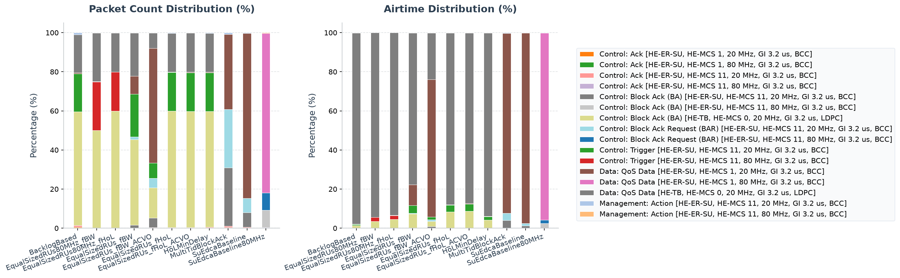

# Walkthrough: 802.11ax Downlink OFDMA

This example compares ordinary single-user (SU) OFDM with 802.11ax downlink
OFDMA. In SU operation the AP gives the complete channel to one receiver per
transmission. With OFDMA, the AP divides an HE MU PPDU into resource units
(RUs) and serves several receivers at the same time.

The experiments deliberately cover three different questions:

1. a low-load 20 MHz comparison, where OFDMA can reduce the cost of serving
   several sparse downlink queues;
2. a higher-load 80 MHz comparison, where scheduler efficiency and capacity
   become visible; and
3. an asymmetric overload scenario, where aggregate throughput alone hides
   important per-flow behavior.

All reported performance values use seed sets 0 through 4. Throughput is the
mean application payload throughput in the `0.3–0.88 s` measurement interval.
The p95 delay is the nearest-rank percentile of application delay samples
pooled across the five seeds and restricted to the same interval.

## Rate and buffer controls

The SU PHY rate is set by `**.wlan[*].bitrate`. The DL MU scheduler normally
selects an MCS separately for each RU from estimated SNR. To prevent OFDMA
from gaining an unintended rate advantage, `heMcsSnrThresholds` permits only
MCS 0 and MCS 1. MCS 1 corresponds to `14.625 Mbps` over 20 MHz and
`61.25 Mbps` over 80 MHz with the configured guard interval.

Those values are PHY data-field rates, not application goodput limits. MAC and
PHY headers, interframe spaces, contention, acknowledgments, Block Ack setup,
padding, retransmissions, and small-packet inefficiency all consume airtime.
Conversely, an aggregate OFDMA throughput can exceed `14.625 Mbps` only if its
RUs use independent PHY rates whose total exceeds the full-channel reference
rate. The MCS cap removes that earlier confounder in this example.

Queue capacity also needs careful treatment. The HE HCF creates one 100-packet
queue per STA and access category, so three downlink best-effort destinations
have a total budget of 300 packets. Ordinary HCF uses one shared best-effort
pending queue. The SU configurations therefore set only the AP's `AC_BE`
pending queue to 300 packets.

This is a fair comparison of total packet-buffer budget, but it does **not**
make the queueing systems equivalent. OFDMA still has three isolated FIFO
queues, while SU has one shared FIFO. Per-STA queues isolate drops and let the
scheduler choose among destinations; a shared queue can exhibit cross-flow
head-of-line effects. Queue structure is part of the mechanism being compared.

Increasing the SU queue from 100 to 300 packets does not increase its service
rate. It retains more backlog and trades some early drops for longer queueing
delay. That is why the matched-buffer SU result has a higher p95 delay than the
earlier 100-packet baseline.

## Comparison matrix

The topology, station positions, transmit power, packet size, warm-up,
normal-traffic start, duration, and MCS cap are common to the controlled
configurations. The two `_ACVO` variants change only the traffic
classification from best effort to voice. The offered load intentionally
differs between the 20 and 80 MHz experiments:

| Configuration | Width | Offered load | Access category | MAC/scheduler |
|---|---:|---:|---|---|
| `EqualSizedRUs_fBW` | 20 MHz | 2.4 Mbps | `AC_BE` | DL OFDMA, maximize occupied bandwidth |
| `EqualSizedRUs_fBW_ACVO` | 20 MHz | 2.4 Mbps | `AC_VO` | DL OFDMA, maximize occupied bandwidth |
| `EqualSizedRUs_fHoL` | 20 MHz | 2.4 Mbps | `AC_BE` | DL OFDMA, serve candidates by HoL policy |
| `EqualSizedRUs_fHoL_ACVO` | 20 MHz | 2.4 Mbps | `AC_VO` | DL OFDMA, serve candidates by HoL policy |
| `SuEdcaBaseline` | 20 MHz | 2.4 Mbps | `AC_BE` | SU OFDM, shared 300-packet queue |
| `EqualSizedRUs80MHz_fBW` | 80 MHz | 24 Mbps | `AC_BE` | high-load DL OFDMA, `fBW` |
| `EqualSizedRUs80MHz_fHoL` | 80 MHz | 24 Mbps | `AC_BE` | high-load DL OFDMA, `fHoL` |
| `SuEdcaBaseline80MHz` | 80 MHz | 24 Mbps | `AC_BE` | high-load SU OFDM, shared 300-packet queue |

At 20 MHz, each source sends a 100-byte packet every `1 ms`. The 80 MHz base
configuration overrides that interval to `0.1 ms`, increasing aggregate load
tenfold. Thus the 80 MHz rows are a high-load capacity comparison, not a
one-variable channel-width comparison with the 20 MHz rows.

`WideBandwidth80MHz` remains a separate eight-station scaling scenario and is
not part of this three-station comparison.

## Equal-RU scheduler behavior

At 20 MHz, the relevant equal-RU layouts contain two 106-tone RUs or four
52-tone RUs:

- `fBW` selects a wide layout that fits the chosen users. It normally serves
  two stations on two 106-tone RUs and rotates service.
- `fHoL` selects a smaller-RU layout that accommodates all three eligible
  stations, using three 52-tone positions.

At low load both policies have enough capacity. The wider per-user RUs make
`fBW` somewhat faster at draining a selected queue. At high load, the layout
choice matters more: serving all candidates on smaller RUs can reduce total
goodput even though more users appear in each MU transmission.

## Controlled performance results

| Configuration | Aggregate app throughput | p95 E2E delay |
|---|---:|---:|
| `EqualSizedRUs_fBW` | 2.399 Mbps | 1.68 ms |
| `EqualSizedRUs_fBW_ACVO` | 2.400 Mbps | 0.78 ms |
| `EqualSizedRUs_fHoL` | 2.395 Mbps | 2.31 ms |
| `EqualSizedRUs_fHoL_ACVO` | 2.396 Mbps | 2.25 ms |
| `SuEdcaBaseline` | 1.588 Mbps | 155.96 ms |
| `EqualSizedRUs80MHz_fBW` | 22.465 Mbps | 11.47 ms |
| `EqualSizedRUs80MHz_fHoL` | 19.607 Mbps | 14.03 ms |
| `SuEdcaBaseline80MHz` | 22.389 Mbps | 13.42 ms |

The 20 MHz workload is sparse enough for both OFDMA policies to deliver
almost all `2.4 Mbps`. The SU AP cannot serve the three streams as efficiently
and its shared queue saturates. Matching its aggregate buffer budget does not
fix the service-rate deficit: the queue reaches 300 packets in every seed,
ends with 298.2 packets on average, and drops 413.6 packets per run on average.
Both OFDMA configurations have zero queue-overflow drops and a maximum of two
packets in any per-STA queue.

Classifying the same sparse traffic as `AC_VO` preserves DL MU OFDMA and full
offered-load delivery. Its shorter AIFS and smaller contention window reduce
the `fBW` p95 delay from `1.68 ms` to `0.78 ms`. The `fHoL` change is much
smaller, from `2.31 ms` to `2.25 ms`, because scheduler layout and candidate
timing still dominate part of its delay. These differences are specific to
this workload and seed set; changing access category does not guarantee the
same relative improvement under congestion.

At 80 MHz, `fBW` and SU have nearly equal aggregate throughput. `fBW` has about
15% lower p95 delay (`11.47 ms` versus `13.42 ms`), but this result does not
support a blanket claim that OFDMA always has higher throughput. `fHoL` serves
more destinations with smaller RUs and delivers less aggregate traffic under
this load. Its p95 delay is also slightly higher than SU's.

The 24 Mbps load is close enough to the effective capacity to saturate queues:
the mean total overflow counts are 1034.2 for `fBW`, 3504.0 for `fHoL`, and
961.4 for SU. Those are full-run queue counters, whereas the throughput and
delay values use only `0.3–0.88 s`. They show that the high-load experiment is
a scheduler/capacity stress test rather than an uncongested latency test.

The point of OFDMA is therefore not an unconditional aggregate-throughput
gain. It is the ability to schedule multiple destination queues in one access,
which can greatly reduce latency and queue buildup for many small or sparse
flows. Whether that benefit outweighs smaller-RU rates and MU overhead depends
on bandwidth, load, packet sizes, and scheduler policy.

## Asymmetric flows: per-flow results

`BacklogBased` and `HoLMinDelay` use the same deliberately overloaded traffic:

| Flow | Destination | Packet/interval | Offered load |
|---|---|---:|---:|
| Heavy | `host[0]` | 1000 B / 0.1 ms | 80 Mbps |
| Medium | `host[1]` | 400 B / 0.4 ms | 8 Mbps |
| Light | `host[2]` | 100 B / 1 ms | 0.8 Mbps |

The aggregate offered load is `88.8 Mbps`, far beyond this 20 MHz scenario's
application capacity. Consequently, absolute offered-load satisfaction is
more informative than aggregate throughput alone.

| Scheduler | Flow | Throughput | Delivered/offered | Per-flow p95 delay |
|---|---|---:|---:|---:|
| `BacklogBased` | Heavy | 3.986 Mbps | 5.0% | 209.31 ms |
| `BacklogBased` | Medium | 2.109 Mbps | 26.4% | 155.35 ms |
| `BacklogBased` | Light | 0.657 Mbps | 82.1% | 98.15 ms |
| `HoLMinDelay` | Heavy | 3.652 Mbps | 4.6% | 221.36 ms |
| `HoLMinDelay` | Medium | 1.455 Mbps | 18.2% | 221.24 ms |
| `HoLMinDelay` | Light | 0.364 Mbps | 45.5% | 220.96 ms |

The corresponding aggregate throughput and pooled p95 delay are:

| Scheduler | Aggregate throughput | Aggregate p95 delay |
|---|---:|---:|
| `BacklogBased` | 6.751 Mbps | 208.78 ms |
| `HoLMinDelay` | 5.472 Mbps | 221.27 ms |

Several details disappear in the aggregate table:

- `BacklogBased` delivers more traffic and lower p95 delay for every flow in
  this five-seed campaign, not only for the aggregate.
- The heavy flow contributes the most absolute throughput but receives only
  about 5% of its offered load because its source is intentionally extreme.
- Under `BacklogBased`, the light flow receives 82.1% of its offered traffic
  and has much lower p95 delay than the other flows. `HoLMinDelay` produces
  nearly the same high p95 delay for all three flows and serves only 45.5% of
  the light load.
- Aggregate p95 delay mixes flows with different packet sizes, rates, and
  sample counts. It must not be interpreted as the delay experienced by each
  flow.

These observations are properties of this workload and implementation; they
are not a universal ordering of the two scheduling algorithms.

## Reproducing the results

Run from `examples/ieee80211ax/dl_ofdma`. The configurations define run number
0, so vary `--seed-set` rather than using run numbers 0 through 4:

```sh
../../../bin/inet --release -u Cmdenv -f omnetpp.ini \
  -c EqualSizedRUs_fBW -r 0 --seed-set=0 \
  --result-dir=results/comparison/EqualSizedRUs_fBW/seed0
```

Repeat for seed sets 0 through 4 and for the configurations in the tables.
Each verified run exited successfully at the `1 s` simulation-time limit and
produced `.sca`, `.vec`, and `.vci` files.

Inspect run metadata before combining files:

```sh
opp_scavetool query -a \
  'results/comparison/EqualSizedRUs_fBW/seed0/EqualSizedRUs_fBW-#0.sca'
```

List sink totals and delay vectors with:

```sh
opp_scavetool query -s -l \
  -f 'module =~ **.host[*].app[0] AND (name =~ packetReceived* OR name =~ endToEndDelay*)' \
  results/comparison/*/seed*/*.sca

opp_scavetool query -v -l \
  -f 'module =~ **.host[*].app[0] AND (name =~ packetReceived* OR name =~ endToEndDelay*)' \
  results/comparison/*/seed*/*.vec
```

Per-flow analysis must retain the `host[0]`, `host[1]`, and `host[2]` module
names instead of summing them before computing percentiles. Apply the same
`0.3–0.88 s` timestamp filter to both received-byte and delay vectors.

## Protocol verification

The short `10 ms` ADDBA retry interval lets all independently contending
stations complete Block Ack setup before the measurement interval. Port 80
maps the original comparison traffic to `AC_BE`. The `_ACVO` configurations
map both warm-up and measured traffic to port 5000, which the QoS classifier
maps to TID 6/`AC_VO`; keeping both phases on the same TID also lets the
measured traffic use the Block Ack agreements established during warm-up.

`AC_VO` has a `1.504 ms` TXOP limit in this configuration, but that does not
prevent the small-packet MU exchanges. Focused seed-0 traces over
`0.300–0.310 s` assembled ten HE MU PPDUs for each scheduler. `fBW` used two
RU allocations in all ten. `fHoL` used two allocations in six and three
allocations in four. A two-user PPDU occupied `400 us` and its reported
sequential acknowledgment phase occupied `272 us`, for about `672 us`. The
longest observed three-user case occupied `772 us` plus a `384 us`
acknowledgment phase, or about `1.156 ms`. Thus each complete observed MU
exchange fits within the voice TXOP; no single-frame exception is needed.

The focused MAC trace can be reproduced with:

```sh
../../../bin/inet --release -u Cmdenv -f omnetpp.ini \
  -c EqualSizedRUs_fHoL_ACVO -r 0 --seed-set=0 \
  --sim-time-limit=0.31s --cmdenv-express-mode=false \
  '--**.ap.wlan[0].mac.hcf.**.cmdenv-log-level=debug' \
  '--**.scalar-recording=false' '--**.vector-recording=false'
```

Look for `Txop started: limit = 0.001504`, `HE DL MU scheduling`, and
`Assembled HE MU PPDU` in the output. Repeat with
`EqualSizedRUs_fBW_ACVO` for the other scheduler.

For a structural packet-exchange check, enable AP MAC capture from the command
line rather than permanently changing `omnetpp.ini`:

```sh
../../../bin/inet --release -u Cmdenv -f omnetpp.ini \
  -c EqualSizedRUs_fBW -r 0 --seed-set=0 \
  --result-dir=results/pcap_comparison/fBW \
  '--*.ap.wlan[*].recordPcap=true' \
  '--*.ap.wlan[*].pcapRecorder[*].moduleNamePatterns="mac"' \
  '--*.ap.wlan[*].pcapRecorder[*].verbose=false' \
  '--**.checksumMode="computed"' '--**.fcsMode="computed"' \
  '--**.scalar-recording=false' '--**.vector-recording=false'
```

The native INET MAC capture exposes QoS Data, Action, ACK, and related frame
exchanges, but not every HE RU field carried internally as packet metadata.
Use sink vectors to establish delivery and HE result vectors for RU analysis;
do not infer application goodput from decoded UDP frame counts in an aggregated
802.11 capture.

## Standards baseline

The normative reference is IEEE Std 802.11-2024:

- Clause 26.5.1.1 defines HE DL MU operation and permits simultaneous delivery
  by DL OFDMA, DL MU-MIMO, or both. It also requires PSDUs on allocated RUs to
  be padded to finish together.
- Clause 26.5.1.2 requires the HE MU TXVECTOR to identify the STA associated
  with each RU.
- Clause 26.6.2.2 defines padding of per-user A-MPDUs in an HE MU PPDU.
- Clause 9.3.1.22.4 defines the MU-BAR Trigger User Info field.
- Clause 26.5.2.3.3 specifies the HE-TB response parameters indicated by a
  Trigger frame.

The standard defines frame formats and protocol behavior. It does not define
INET's `fBW`, `fHoL`, `BacklogBased`, or `HoLMinDelay` heuristics, and it does
not require OFDMA to outperform SU for every workload.

## 802.11 Packet Type Statistics


This section provides a statistical overview of the 802.11 frames transmitted over the wireless medium during the simulation. The packet counts were gathered from the Access Point's wireless interface (`ap.wlan[0]`), which captures all uplink, downlink, and management traffic in the BSS without duplication.

Two airtime occupancy percentages are provided:
- **Air Time %**: The percentage of the total transmission airtime of all packets occupied by this frame type.
- **Air Time (Sim Time) %**: The percentage of the total simulation time occupied by the transmission of this frame type (defined as the sum of physical airtimes of this frame type w.r.t. the total simulation time limit).

### Configuration: `BacklogBased`
Total over-the-air packets captured (Global BSS/AP): **599**

| Color | Frame Type & Subtype | Count | Percentage | Mean Size | Std Dev | Mean Duration | Std Dev Duration | Freq | Mean RX Sig | Mean TX Pwr | Air Time % | Air Time (Sim Time) % |
|:---:|---|---:|---:|---:|---:|---:|---:|---:|---:|---:|---:|---:|
| <svg width="16" height="16"><rect width="16" height="16" rx="3" fill="#16b619" /></svg> | Data: QoS Data [HE-ER-SU, HE-MCS 1, 20 MHz, GI 3.2 us, BCC] | 4 | 0.67% | 391.0 B | 389.7 B | 337.9 us | 213.2 us | 5010 MHz | - | 20.0 dBm | 0.17% | 0.14% |
| <svg width="16" height="16"><rect width="16" height="16" rx="3" fill="#2f9c21" /></svg> | Data: QoS Data [HE-TB, HE-MCS 0, 20 MHz, GI 3.2 us, LDPC] | 116 | 19.37% | 6004.0 B | 214.1 B | 6692.5 us | 234.2 us | 5010 MHz | - | 20.0 dBm | 97.84% | 77.63% |
| <hr> | <hr> | <hr> | <hr> | <hr> | <hr> | <hr> | <hr> | <hr> | <hr> | <hr> | <hr> | <hr> |
| <svg width="16" height="16"><rect width="16" height="16" rx="3" fill="#f09000" /></svg> | Control: Trigger [HE-ER-SU, HE-MCS 11, 20 MHz, GI 3.2 us, BCC] | 116 | 19.37% | 55.0 B | 0.0 B | 38.3 us | 0.0 us | 5010 MHz | - | 20.0 dBm | 0.56% | 0.44% |
| <svg width="16" height="16"><rect width="16" height="16" rx="3" fill="#0e49c8" /></svg> | Control: Block Ack (BA) [HE-TB, HE-MCS 0, 20 MHz, GI 3.2 us, LDPC] | 348 | 58.10% | 32.0 B | 0.0 B | 30.7 us | 0.0 us | 5003 MHz, 5005 MHz, 5007 MHz, 5010 MHz, 5013 MHz | -65.3 dBm | - | 1.35% | 1.07% |
| <svg width="16" height="16"><rect width="16" height="16" rx="3" fill="#2789f1" /></svg> | Control: Ack [HE-ER-SU, HE-MCS 1, 20 MHz, GI 3.2 us, BCC] | 3 | 0.50% | 14.0 B | 0.0 B | 24.7 us | 0.0 us | 5010 MHz | -65.3 dBm | - | 0.01% | 0.01% |
| <svg width="16" height="16"><rect width="16" height="16" rx="3" fill="#308ef3" /></svg> | Control: Ack [HE-ER-SU, HE-MCS 11, 20 MHz, GI 3.2 us, BCC] | 6 | 1.00% | 14.0 B | 0.0 B | 24.7 us | 0.0 us | 5010 MHz | -65.3 dBm | 20.0 dBm | 0.02% | 0.01% |
| <hr> | <hr> | <hr> | <hr> | <hr> | <hr> | <hr> | <hr> | <hr> | <hr> | <hr> | <hr> | <hr> |
| <svg width="16" height="16"><rect width="16" height="16" rx="3" fill="#e90b07" /></svg> | Management: Action [HE-ER-SU, HE-MCS 11, 20 MHz, GI 3.2 us, BCC] | 6 | 1.00% | 37.0 B | 0.0 B | 69.3 us | 0.0 us | 5010 MHz | -65.3 dBm | 20.0 dBm | 0.05% | 0.04% |

#### Per-Flow Traffic Statistics for `BacklogBased`

##### Heavy Flow (destined to `host[0]`, offered load: 80 Mbps, size: 1000 B)
Total packets captured for flow: **121**

| Color | Frame Type & Subtype | Count | Percentage | Mean Size | Std Dev | Mean Duration | Std Dev Duration | Freq | Mean RX Sig | Mean TX Pwr | Air Time % | Air Time (Sim Time) % |
|:---:|---|---:|---:|---:|---:|---:|---:|---:|---:|---:|---:|---:|
| <svg width="16" height="16"><rect width="16" height="16" rx="3" fill="#16b619" /></svg> | Data: QoS Data [HE-ER-SU, HE-MCS 1, 20 MHz, GI 3.2 us, BCC] | 2 | 1.65% | 616.0 B | 450.0 B | 461.0 us | 246.2 us | 5010 MHz | - | 20.0 dBm | 19.86% | 0.09% |
| <hr> | <hr> | <hr> | <hr> | <hr> | <hr> | <hr> | <hr> | <hr> | <hr> | <hr> | <hr> | <hr> |
| <svg width="16" height="16"><rect width="16" height="16" rx="3" fill="#0e49c8" /></svg> | Control: Block Ack (BA) [HE-TB, HE-MCS 0, 20 MHz, GI 3.2 us, LDPC] | 116 | 95.87% | 32.0 B | 0.0 B | 30.7 us | 0.0 us | 5005 MHz, 5007 MHz | -66.0 dBm | - | 76.62% | 0.36% |
| <svg width="16" height="16"><rect width="16" height="16" rx="3" fill="#308ef3" /></svg> | Control: Ack [HE-ER-SU, HE-MCS 11, 20 MHz, GI 3.2 us, BCC] | 1 | 0.83% | 14.0 B | 0.0 B | 24.7 us | 0.0 us | 5010 MHz | - | 20.0 dBm | 0.53% | 0.00% |
| <hr> | <hr> | <hr> | <hr> | <hr> | <hr> | <hr> | <hr> | <hr> | <hr> | <hr> | <hr> | <hr> |
| <svg width="16" height="16"><rect width="16" height="16" rx="3" fill="#e90b07" /></svg> | Management: Action [HE-ER-SU, HE-MCS 11, 20 MHz, GI 3.2 us, BCC] | 2 | 1.65% | 37.0 B | 0.0 B | 69.3 us | 0.0 us | 5010 MHz | -66.0 dBm | 20.0 dBm | 2.99% | 0.01% |

##### Medium Flow (destined to `host[1]`, offered load: 8 Mbps, size: 400 B)
Total packets captured for flow: **120**

| Color | Frame Type & Subtype | Count | Percentage | Mean Size | Std Dev | Mean Duration | Std Dev Duration | Freq | Mean RX Sig | Mean TX Pwr | Air Time % | Air Time (Sim Time) % |
|:---:|---|---:|---:|---:|---:|---:|---:|---:|---:|---:|---:|---:|
| <svg width="16" height="16"><rect width="16" height="16" rx="3" fill="#16b619" /></svg> | Data: QoS Data [HE-ER-SU, HE-MCS 1, 20 MHz, GI 3.2 us, BCC] | 1 | 0.83% | 166.0 B | 0.0 B | 214.8 us | 0.0 us | 5010 MHz | - | 20.0 dBm | 5.46% | 0.02% |
| <hr> | <hr> | <hr> | <hr> | <hr> | <hr> | <hr> | <hr> | <hr> | <hr> | <hr> | <hr> | <hr> |
| <svg width="16" height="16"><rect width="16" height="16" rx="3" fill="#0e49c8" /></svg> | Control: Block Ack (BA) [HE-TB, HE-MCS 0, 20 MHz, GI 3.2 us, LDPC] | 116 | 96.67% | 32.0 B | 0.0 B | 30.7 us | 0.0 us | 5003 MHz, 5013 MHz | -63.0 dBm | - | 90.39% | 0.36% |
| <svg width="16" height="16"><rect width="16" height="16" rx="3" fill="#308ef3" /></svg> | Control: Ack [HE-ER-SU, HE-MCS 11, 20 MHz, GI 3.2 us, BCC] | 1 | 0.83% | 14.0 B | 0.0 B | 24.7 us | 0.0 us | 5010 MHz | - | 20.0 dBm | 0.63% | 0.00% |
| <hr> | <hr> | <hr> | <hr> | <hr> | <hr> | <hr> | <hr> | <hr> | <hr> | <hr> | <hr> | <hr> |
| <svg width="16" height="16"><rect width="16" height="16" rx="3" fill="#e90b07" /></svg> | Management: Action [HE-ER-SU, HE-MCS 11, 20 MHz, GI 3.2 us, BCC] | 2 | 1.67% | 37.0 B | 0.0 B | 69.3 us | 0.0 us | 5010 MHz | -63.0 dBm | 20.0 dBm | 3.52% | 0.01% |

##### Light Flow (destined to `host[2]`, offered load: 0.8 Mbps, size: 100 B)
Total packets captured for flow: **120**

| Color | Frame Type & Subtype | Count | Percentage | Mean Size | Std Dev | Mean Duration | Std Dev Duration | Freq | Mean RX Sig | Mean TX Pwr | Air Time % | Air Time (Sim Time) % |
|:---:|---|---:|---:|---:|---:|---:|---:|---:|---:|---:|---:|---:|
| <svg width="16" height="16"><rect width="16" height="16" rx="3" fill="#16b619" /></svg> | Data: QoS Data [HE-ER-SU, HE-MCS 1, 20 MHz, GI 3.2 us, BCC] | 1 | 0.83% | 166.0 B | 0.0 B | 214.8 us | 0.0 us | 5010 MHz | - | 20.0 dBm | 5.46% | 0.02% |
| <hr> | <hr> | <hr> | <hr> | <hr> | <hr> | <hr> | <hr> | <hr> | <hr> | <hr> | <hr> | <hr> |
| <svg width="16" height="16"><rect width="16" height="16" rx="3" fill="#0e49c8" /></svg> | Control: Block Ack (BA) [HE-TB, HE-MCS 0, 20 MHz, GI 3.2 us, LDPC] | 116 | 96.67% | 32.0 B | 0.0 B | 30.7 us | 0.0 us | 5010 MHz | -67.0 dBm | - | 90.39% | 0.36% |
| <svg width="16" height="16"><rect width="16" height="16" rx="3" fill="#308ef3" /></svg> | Control: Ack [HE-ER-SU, HE-MCS 11, 20 MHz, GI 3.2 us, BCC] | 1 | 0.83% | 14.0 B | 0.0 B | 24.7 us | 0.0 us | 5010 MHz | - | 20.0 dBm | 0.63% | 0.00% |
| <hr> | <hr> | <hr> | <hr> | <hr> | <hr> | <hr> | <hr> | <hr> | <hr> | <hr> | <hr> | <hr> |
| <svg width="16" height="16"><rect width="16" height="16" rx="3" fill="#e90b07" /></svg> | Management: Action [HE-ER-SU, HE-MCS 11, 20 MHz, GI 3.2 us, BCC] | 2 | 1.67% | 37.0 B | 0.0 B | 69.3 us | 0.0 us | 5010 MHz | -67.0 dBm | 20.0 dBm | 3.52% | 0.01% |

### Configuration: `EqualSizedRUs80MHz_fBW`
Total over-the-air packets captured (Global BSS/AP): **4393**

| Color | Frame Type & Subtype | Count | Percentage | Mean Size | Std Dev | Mean Duration | Std Dev Duration | Freq | Mean RX Sig | Mean TX Pwr | Air Time % | Air Time (Sim Time) % |
|:---:|---|---:|---:|---:|---:|---:|---:|---:|---:|---:|---:|---:|
| <svg width="16" height="16"><rect width="16" height="16" rx="3" fill="#35b521" /></svg> | Data: QoS Data [HE-ER-SU, HE-MCS 1, 80 MHz, GI 3.2 us, BCC] | 4 | 0.09% | 166.0 B | 0.0 B | 145.7 us | 0.0 us | 5200 MHz | - | 20.0 dBm | 0.03% | 0.06% |
| <svg width="16" height="16"><rect width="16" height="16" rx="3" fill="#2f9c21" /></svg> | Data: QoS Data [HE-TB, HE-MCS 0, 20 MHz, GI 3.2 us, LDPC] | 1094 | 24.90% | 1369.6 B | 143.8 B | 1622.3 us | 157.4 us | 5200 MHz | - | 20.0 dBm | 94.32% | 177.48% |
| <hr> | <hr> | <hr> | <hr> | <hr> | <hr> | <hr> | <hr> | <hr> | <hr> | <hr> | <hr> | <hr> |
| <svg width="16" height="16"><rect width="16" height="16" rx="3" fill="#f47106" /></svg> | Control: Trigger [HE-ER-SU, HE-MCS 11, 80 MHz, GI 3.2 us, BCC] | 1094 | 24.90% | 46.0 B | 0.0 B | 35.3 us | 0.0 us | 5200 MHz | - | 20.0 dBm | 2.05% | 3.87% |
| <svg width="16" height="16"><rect width="16" height="16" rx="3" fill="#0e49c8" /></svg> | Control: Block Ack (BA) [HE-TB, HE-MCS 0, 20 MHz, GI 3.2 us, LDPC] | 2186 | 49.76% | 32.0 B | 0.0 B | 30.7 us | 0.0 us | 5180 MHz, 5220 MHz | -66.5 dBm | - | 3.56% | 6.70% |
| <svg width="16" height="16"><rect width="16" height="16" rx="3" fill="#3ba8e8" /></svg> | Control: Ack [HE-ER-SU, HE-MCS 1, 80 MHz, GI 3.2 us, BCC] | 3 | 0.07% | 14.0 B | 0.0 B | 24.7 us | 0.0 us | 5200 MHz | -66.3 dBm | - | 0.00% | 0.01% |
| <svg width="16" height="16"><rect width="16" height="16" rx="3" fill="#43adea" /></svg> | Control: Ack [HE-ER-SU, HE-MCS 11, 80 MHz, GI 3.2 us, BCC] | 6 | 0.14% | 14.0 B | 0.0 B | 24.7 us | 0.0 us | 5200 MHz | -66.3 dBm | 20.0 dBm | 0.01% | 0.01% |
| <hr> | <hr> | <hr> | <hr> | <hr> | <hr> | <hr> | <hr> | <hr> | <hr> | <hr> | <hr> | <hr> |
| <svg width="16" height="16"><rect width="16" height="16" rx="3" fill="#e7132f" /></svg> | Management: Action [HE-ER-SU, HE-MCS 11, 80 MHz, GI 3.2 us, BCC] | 6 | 0.14% | 37.0 B | 0.0 B | 69.3 us | 0.0 us | 5200 MHz | -66.3 dBm | 20.0 dBm | 0.02% | 0.04% |

### Configuration: `EqualSizedRUs80MHz_fHoL`
Total over-the-air packets captured (Global BSS/AP): **4715**

| Color | Frame Type & Subtype | Count | Percentage | Mean Size | Std Dev | Mean Duration | Std Dev Duration | Freq | Mean RX Sig | Mean TX Pwr | Air Time % | Air Time (Sim Time) % |
|:---:|---|---:|---:|---:|---:|---:|---:|---:|---:|---:|---:|---:|
| <svg width="16" height="16"><rect width="16" height="16" rx="3" fill="#35b521" /></svg> | Data: QoS Data [HE-ER-SU, HE-MCS 1, 80 MHz, GI 3.2 us, BCC] | 4 | 0.08% | 166.0 B | 0.0 B | 145.7 us | 0.0 us | 5200 MHz | - | 20.0 dBm | 0.03% | 0.06% |
| <svg width="16" height="16"><rect width="16" height="16" rx="3" fill="#2f9c21" /></svg> | Data: QoS Data [HE-TB, HE-MCS 0, 20 MHz, GI 3.2 us, LDPC] | 940 | 19.94% | 1595.7 B | 153.3 B | 1869.8 us | 167.7 us | 5200 MHz | - | 20.0 dBm | 93.43% | 175.76% |
| <hr> | <hr> | <hr> | <hr> | <hr> | <hr> | <hr> | <hr> | <hr> | <hr> | <hr> | <hr> | <hr> |
| <svg width="16" height="16"><rect width="16" height="16" rx="3" fill="#f47106" /></svg> | Control: Trigger [HE-ER-SU, HE-MCS 11, 80 MHz, GI 3.2 us, BCC] | 940 | 19.94% | 55.0 B | 0.3 B | 38.3 us | 0.1 us | 5200 MHz | - | 20.0 dBm | 1.92% | 3.60% |
| <svg width="16" height="16"><rect width="16" height="16" rx="3" fill="#0e49c8" /></svg> | Control: Block Ack (BA) [HE-TB, HE-MCS 0, 20 MHz, GI 3.2 us, LDPC] | 2816 | 59.72% | 32.0 B | 0.0 B | 30.7 us | 0.0 us | 5170 MHz, 5180 MHz, 5189 MHz, 5211 MHz, 5220 MHz | -66.3 dBm | - | 4.59% | 8.64% |
| <svg width="16" height="16"><rect width="16" height="16" rx="3" fill="#3ba8e8" /></svg> | Control: Ack [HE-ER-SU, HE-MCS 1, 80 MHz, GI 3.2 us, BCC] | 3 | 0.06% | 14.0 B | 0.0 B | 24.7 us | 0.0 us | 5200 MHz | -66.3 dBm | - | 0.00% | 0.01% |
| <svg width="16" height="16"><rect width="16" height="16" rx="3" fill="#43adea" /></svg> | Control: Ack [HE-ER-SU, HE-MCS 11, 80 MHz, GI 3.2 us, BCC] | 6 | 0.13% | 14.0 B | 0.0 B | 24.7 us | 0.0 us | 5200 MHz | -66.3 dBm | 20.0 dBm | 0.01% | 0.01% |
| <hr> | <hr> | <hr> | <hr> | <hr> | <hr> | <hr> | <hr> | <hr> | <hr> | <hr> | <hr> | <hr> |
| <svg width="16" height="16"><rect width="16" height="16" rx="3" fill="#e7132f" /></svg> | Management: Action [HE-ER-SU, HE-MCS 11, 80 MHz, GI 3.2 us, BCC] | 6 | 0.13% | 37.0 B | 0.0 B | 69.3 us | 0.0 us | 5200 MHz | -66.3 dBm | 20.0 dBm | 0.02% | 0.04% |

### Configuration: `EqualSizedRUs_fBW`
Total over-the-air packets captured (Global BSS/AP): **3192**

| Color | Frame Type & Subtype | Count | Percentage | Mean Size | Std Dev | Mean Duration | Std Dev Duration | Freq | Mean RX Sig | Mean TX Pwr | Air Time % | Air Time (Sim Time) % |
|:---:|---|---:|---:|---:|---:|---:|---:|---:|---:|---:|---:|---:|
| <svg width="16" height="16"><rect width="16" height="16" rx="3" fill="#16b619" /></svg> | Data: QoS Data [HE-ER-SU, HE-MCS 1, 20 MHz, GI 3.2 us, BCC] | 295 | 9.24% | 166.0 B | 0.0 B | 214.8 us | 0.0 us | 5010 MHz | - | 20.0 dBm | 10.58% | 6.34% |
| <svg width="16" height="16"><rect width="16" height="16" rx="3" fill="#2f9c21" /></svg> | Data: QoS Data [HE-TB, HE-MCS 0, 20 MHz, GI 3.2 us, LDPC] | 700 | 21.93% | 494.0 B | 84.9 B | 664.5 us | 92.8 us | 5010 MHz | - | 20.0 dBm | 77.62% | 46.51% |
| <hr> | <hr> | <hr> | <hr> | <hr> | <hr> | <hr> | <hr> | <hr> | <hr> | <hr> | <hr> | <hr> |
| <svg width="16" height="16"><rect width="16" height="16" rx="3" fill="#f09000" /></svg> | Control: Trigger [HE-ER-SU, HE-MCS 11, 20 MHz, GI 3.2 us, BCC] | 700 | 21.93% | 46.0 B | 0.0 B | 35.3 us | 0.0 us | 5010 MHz | - | 20.0 dBm | 4.13% | 2.47% |
| <svg width="16" height="16"><rect width="16" height="16" rx="3" fill="#be6237" /></svg> | Control: Block Ack Request (BAR) [HE-ER-SU, HE-MCS 11, 20 MHz, GI 3.2 us, BCC] | 41 | 1.28% | 24.0 B | 0.0 B | 28.0 us | 0.0 us | 5010 MHz | - | 20.0 dBm | 0.19% | 0.11% |
| <svg width="16" height="16"><rect width="16" height="16" rx="3" fill="#12268c" /></svg> | Control: Block Ack (BA) [HE-ER-SU, HE-MCS 11, 20 MHz, GI 3.2 us, BCC] | 41 | 1.28% | 32.0 B | 0.0 B | 30.7 us | 0.0 us | 5010 MHz | -65.5 dBm | - | 0.21% | 0.13% |
| <svg width="16" height="16"><rect width="16" height="16" rx="3" fill="#0e49c8" /></svg> | Control: Block Ack (BA) [HE-TB, HE-MCS 0, 20 MHz, GI 3.2 us, LDPC] | 1400 | 43.86% | 32.0 B | 0.0 B | 30.7 us | 0.0 us | 5005 MHz, 5015 MHz | -65.3 dBm | - | 7.17% | 4.29% |
| <svg width="16" height="16"><rect width="16" height="16" rx="3" fill="#2789f1" /></svg> | Control: Ack [HE-ER-SU, HE-MCS 1, 20 MHz, GI 3.2 us, BCC] | 3 | 0.09% | 14.0 B | 0.0 B | 24.7 us | 0.0 us | 5010 MHz | -65.3 dBm | - | 0.01% | 0.01% |
| <svg width="16" height="16"><rect width="16" height="16" rx="3" fill="#308ef3" /></svg> | Control: Ack [HE-ER-SU, HE-MCS 11, 20 MHz, GI 3.2 us, BCC] | 6 | 0.19% | 14.0 B | 0.0 B | 24.7 us | 0.0 us | 5010 MHz | -65.3 dBm | 20.0 dBm | 0.02% | 0.01% |
| <hr> | <hr> | <hr> | <hr> | <hr> | <hr> | <hr> | <hr> | <hr> | <hr> | <hr> | <hr> | <hr> |
| <svg width="16" height="16"><rect width="16" height="16" rx="3" fill="#e90b07" /></svg> | Management: Action [HE-ER-SU, HE-MCS 11, 20 MHz, GI 3.2 us, BCC] | 6 | 0.19% | 37.0 B | 0.0 B | 69.3 us | 0.0 us | 5010 MHz | -65.3 dBm | 20.0 dBm | 0.07% | 0.04% |

### Configuration: `EqualSizedRUs_fBW_ACVO`
Total over-the-air packets captured (Global BSS/AP): **2836**

| Color | Frame Type & Subtype | Count | Percentage | Mean Size | Std Dev | Mean Duration | Std Dev Duration | Freq | Mean RX Sig | Mean TX Pwr | Air Time % | Air Time (Sim Time) % |
|:---:|---|---:|---:|---:|---:|---:|---:|---:|---:|---:|---:|---:|
| <svg width="16" height="16"><rect width="16" height="16" rx="3" fill="#16b619" /></svg> | Data: QoS Data [HE-ER-SU, HE-MCS 1, 20 MHz, GI 3.2 us, BCC] | 1667 | 58.78% | 166.0 B | 0.0 B | 214.8 us | 0.0 us | 5010 MHz | - | 20.0 dBm | 70.34% | 35.81% |
| <svg width="16" height="16"><rect width="16" height="16" rx="3" fill="#2f9c21" /></svg> | Data: QoS Data [HE-TB, HE-MCS 0, 20 MHz, GI 3.2 us, LDPC] | 218 | 7.69% | 394.0 B | 0.0 B | 555.0 us | 0.0 us | 5010 MHz | - | 20.0 dBm | 23.77% | 12.10% |
| <hr> | <hr> | <hr> | <hr> | <hr> | <hr> | <hr> | <hr> | <hr> | <hr> | <hr> | <hr> | <hr> |
| <svg width="16" height="16"><rect width="16" height="16" rx="3" fill="#f09000" /></svg> | Control: Trigger [HE-ER-SU, HE-MCS 11, 20 MHz, GI 3.2 us, BCC] | 218 | 7.69% | 46.0 B | 0.0 B | 35.3 us | 0.0 us | 5010 MHz | - | 20.0 dBm | 1.51% | 0.77% |
| <svg width="16" height="16"><rect width="16" height="16" rx="3" fill="#be6237" /></svg> | Control: Block Ack Request (BAR) [HE-ER-SU, HE-MCS 11, 20 MHz, GI 3.2 us, BCC] | 141 | 4.97% | 24.0 B | 0.0 B | 28.0 us | 0.0 us | 5010 MHz | - | 20.0 dBm | 0.78% | 0.39% |
| <svg width="16" height="16"><rect width="16" height="16" rx="3" fill="#12268c" /></svg> | Control: Block Ack (BA) [HE-ER-SU, HE-MCS 11, 20 MHz, GI 3.2 us, BCC] | 141 | 4.97% | 32.0 B | 0.0 B | 30.7 us | 0.0 us | 5010 MHz | -65.5 dBm | - | 0.85% | 0.43% |
| <svg width="16" height="16"><rect width="16" height="16" rx="3" fill="#0e49c8" /></svg> | Control: Block Ack (BA) [HE-TB, HE-MCS 0, 20 MHz, GI 3.2 us, LDPC] | 436 | 15.37% | 32.0 B | 0.0 B | 30.7 us | 0.0 us | 5005 MHz, 5015 MHz | -64.8 dBm | - | 2.63% | 1.34% |
| <svg width="16" height="16"><rect width="16" height="16" rx="3" fill="#2789f1" /></svg> | Control: Ack [HE-ER-SU, HE-MCS 1, 20 MHz, GI 3.2 us, BCC] | 3 | 0.11% | 14.0 B | 0.0 B | 24.7 us | 0.0 us | 5010 MHz | -65.3 dBm | - | 0.01% | 0.01% |
| <svg width="16" height="16"><rect width="16" height="16" rx="3" fill="#308ef3" /></svg> | Control: Ack [HE-ER-SU, HE-MCS 11, 20 MHz, GI 3.2 us, BCC] | 6 | 0.21% | 14.0 B | 0.0 B | 24.7 us | 0.0 us | 5010 MHz | -65.3 dBm | 20.0 dBm | 0.03% | 0.01% |
| <hr> | <hr> | <hr> | <hr> | <hr> | <hr> | <hr> | <hr> | <hr> | <hr> | <hr> | <hr> | <hr> |
| <svg width="16" height="16"><rect width="16" height="16" rx="3" fill="#e90b07" /></svg> | Management: Action [HE-ER-SU, HE-MCS 11, 20 MHz, GI 3.2 us, BCC] | 6 | 0.21% | 37.0 B | 0.0 B | 69.3 us | 0.0 us | 5010 MHz | -65.3 dBm | 20.0 dBm | 0.08% | 0.04% |

### Configuration: `EqualSizedRUs_fHoL`
Total over-the-air packets captured (Global BSS/AP): **2533**

| Color | Frame Type & Subtype | Count | Percentage | Mean Size | Std Dev | Mean Duration | Std Dev Duration | Freq | Mean RX Sig | Mean TX Pwr | Air Time % | Air Time (Sim Time) % |
|:---:|---|---:|---:|---:|---:|---:|---:|---:|---:|---:|---:|---:|
| <svg width="16" height="16"><rect width="16" height="16" rx="3" fill="#16b619" /></svg> | Data: QoS Data [HE-ER-SU, HE-MCS 1, 20 MHz, GI 3.2 us, BCC] | 4 | 0.16% | 166.0 B | 0.0 B | 214.8 us | 0.0 us | 5010 MHz | - | 20.0 dBm | 0.15% | 0.09% |
| <svg width="16" height="16"><rect width="16" height="16" rx="3" fill="#2f9c21" /></svg> | Data: QoS Data [HE-TB, HE-MCS 0, 20 MHz, GI 3.2 us, LDPC] | 503 | 19.86% | 776.7 B | 251.6 B | 973.7 us | 275.2 us | 5010 MHz | - | 20.0 dBm | 87.96% | 48.98% |
| <hr> | <hr> | <hr> | <hr> | <hr> | <hr> | <hr> | <hr> | <hr> | <hr> | <hr> | <hr> | <hr> |
| <svg width="16" height="16"><rect width="16" height="16" rx="3" fill="#f09000" /></svg> | Control: Trigger [HE-ER-SU, HE-MCS 11, 20 MHz, GI 3.2 us, BCC] | 503 | 19.86% | 55.0 B | 0.4 B | 38.3 us | 0.1 us | 5010 MHz | - | 20.0 dBm | 3.46% | 1.93% |
| <svg width="16" height="16"><rect width="16" height="16" rx="3" fill="#0e49c8" /></svg> | Control: Block Ack (BA) [HE-TB, HE-MCS 0, 20 MHz, GI 3.2 us, LDPC] | 1508 | 59.53% | 32.0 B | 0.0 B | 30.7 us | 0.0 us | 5003 MHz, 5005 MHz, 5007 MHz, 5013 MHz, 5015 MHz | -65.3 dBm | - | 8.31% | 4.62% |
| <svg width="16" height="16"><rect width="16" height="16" rx="3" fill="#2789f1" /></svg> | Control: Ack [HE-ER-SU, HE-MCS 1, 20 MHz, GI 3.2 us, BCC] | 3 | 0.12% | 14.0 B | 0.0 B | 24.7 us | 0.0 us | 5010 MHz | -65.3 dBm | - | 0.01% | 0.01% |
| <svg width="16" height="16"><rect width="16" height="16" rx="3" fill="#308ef3" /></svg> | Control: Ack [HE-ER-SU, HE-MCS 11, 20 MHz, GI 3.2 us, BCC] | 6 | 0.24% | 14.0 B | 0.0 B | 24.7 us | 0.0 us | 5010 MHz | -65.3 dBm | 20.0 dBm | 0.03% | 0.01% |
| <hr> | <hr> | <hr> | <hr> | <hr> | <hr> | <hr> | <hr> | <hr> | <hr> | <hr> | <hr> | <hr> |
| <svg width="16" height="16"><rect width="16" height="16" rx="3" fill="#e90b07" /></svg> | Management: Action [HE-ER-SU, HE-MCS 11, 20 MHz, GI 3.2 us, BCC] | 6 | 0.24% | 37.0 B | 0.0 B | 69.3 us | 0.0 us | 5010 MHz | -65.3 dBm | 20.0 dBm | 0.07% | 0.04% |

### Configuration: `EqualSizedRUs_fHoL_ACVO`
Total over-the-air packets captured (Global BSS/AP): **2720**

| Color | Frame Type & Subtype | Count | Percentage | Mean Size | Std Dev | Mean Duration | Std Dev Duration | Freq | Mean RX Sig | Mean TX Pwr | Air Time % | Air Time (Sim Time) % |
|:---:|---|---:|---:|---:|---:|---:|---:|---:|---:|---:|---:|---:|
| <svg width="16" height="16"><rect width="16" height="16" rx="3" fill="#16b619" /></svg> | Data: QoS Data [HE-ER-SU, HE-MCS 1, 20 MHz, GI 3.2 us, BCC] | 9 | 0.33% | 166.0 B | 0.0 B | 214.8 us | 0.0 us | 5010 MHz | - | 20.0 dBm | 0.34% | 0.19% |
| <svg width="16" height="16"><rect width="16" height="16" rx="3" fill="#2f9c21" /></svg> | Data: QoS Data [HE-TB, HE-MCS 0, 20 MHz, GI 3.2 us, LDPC] | 540 | 19.85% | 725.9 B | 237.3 B | 918.2 us | 259.6 us | 5010 MHz | - | 20.0 dBm | 87.20% | 49.58% |
| <hr> | <hr> | <hr> | <hr> | <hr> | <hr> | <hr> | <hr> | <hr> | <hr> | <hr> | <hr> | <hr> |
| <svg width="16" height="16"><rect width="16" height="16" rx="3" fill="#f09000" /></svg> | Control: Trigger [HE-ER-SU, HE-MCS 11, 20 MHz, GI 3.2 us, BCC] | 540 | 19.85% | 54.9 B | 0.9 B | 38.3 us | 0.3 us | 5010 MHz | - | 20.0 dBm | 3.64% | 2.07% |
| <svg width="16" height="16"><rect width="16" height="16" rx="3" fill="#be6237" /></svg> | Control: Block Ack Request (BAR) [HE-ER-SU, HE-MCS 11, 20 MHz, GI 3.2 us, BCC] | 1 | 0.04% | 24.0 B | 0.0 B | 28.0 us | 0.0 us | 5010 MHz | - | 20.0 dBm | 0.00% | 0.00% |
| <svg width="16" height="16"><rect width="16" height="16" rx="3" fill="#12268c" /></svg> | Control: Block Ack (BA) [HE-ER-SU, HE-MCS 11, 20 MHz, GI 3.2 us, BCC] | 1 | 0.04% | 32.0 B | 0.0 B | 30.7 us | 0.0 us | 5010 MHz | -66.0 dBm | - | 0.01% | 0.00% |
| <svg width="16" height="16"><rect width="16" height="16" rx="3" fill="#0e49c8" /></svg> | Control: Block Ack (BA) [HE-TB, HE-MCS 0, 20 MHz, GI 3.2 us, LDPC] | 1614 | 59.34% | 32.0 B | 0.0 B | 30.7 us | 0.0 us | 5003 MHz, 5005 MHz, 5007 MHz, 5013 MHz, 5015 MHz | -65.3 dBm | - | 8.70% | 4.95% |
| <svg width="16" height="16"><rect width="16" height="16" rx="3" fill="#2789f1" /></svg> | Control: Ack [HE-ER-SU, HE-MCS 1, 20 MHz, GI 3.2 us, BCC] | 3 | 0.11% | 14.0 B | 0.0 B | 24.7 us | 0.0 us | 5010 MHz | -65.3 dBm | - | 0.01% | 0.01% |
| <svg width="16" height="16"><rect width="16" height="16" rx="3" fill="#308ef3" /></svg> | Control: Ack [HE-ER-SU, HE-MCS 11, 20 MHz, GI 3.2 us, BCC] | 6 | 0.22% | 14.0 B | 0.0 B | 24.7 us | 0.0 us | 5010 MHz | -65.3 dBm | 20.0 dBm | 0.03% | 0.01% |
| <hr> | <hr> | <hr> | <hr> | <hr> | <hr> | <hr> | <hr> | <hr> | <hr> | <hr> | <hr> | <hr> |
| <svg width="16" height="16"><rect width="16" height="16" rx="3" fill="#e90b07" /></svg> | Management: Action [HE-ER-SU, HE-MCS 11, 20 MHz, GI 3.2 us, BCC] | 6 | 0.22% | 37.0 B | 0.0 B | 69.3 us | 0.0 us | 5010 MHz | -65.3 dBm | 20.0 dBm | 0.07% | 0.04% |

### Configuration: `HoLMinDelay`
Total over-the-air packets captured (Global BSS/AP): **1611**

| Color | Frame Type & Subtype | Count | Percentage | Mean Size | Std Dev | Mean Duration | Std Dev Duration | Freq | Mean RX Sig | Mean TX Pwr | Air Time % | Air Time (Sim Time) % |
|:---:|---|---:|---:|---:|---:|---:|---:|---:|---:|---:|---:|---:|
| <svg width="16" height="16"><rect width="16" height="16" rx="3" fill="#16b619" /></svg> | Data: QoS Data [HE-ER-SU, HE-MCS 1, 20 MHz, GI 3.2 us, BCC] | 4 | 0.25% | 391.0 B | 389.7 B | 337.9 us | 213.2 us | 5010 MHz | - | 20.0 dBm | 0.19% | 0.14% |
| <svg width="16" height="16"><rect width="16" height="16" rx="3" fill="#2f9c21" /></svg> | Data: QoS Data [HE-TB, HE-MCS 0, 20 MHz, GI 3.2 us, LDPC] | 319 | 19.80% | 1776.0 B | 0.0 B | 2067.0 us | 0.0 us | 5010 MHz | - | 20.0 dBm | 93.81% | 65.94% |
| <hr> | <hr> | <hr> | <hr> | <hr> | <hr> | <hr> | <hr> | <hr> | <hr> | <hr> | <hr> | <hr> |
| <svg width="16" height="16"><rect width="16" height="16" rx="3" fill="#f09000" /></svg> | Control: Trigger [HE-ER-SU, HE-MCS 11, 20 MHz, GI 3.2 us, BCC] | 319 | 19.80% | 55.0 B | 0.0 B | 38.3 us | 0.0 us | 5010 MHz | - | 20.0 dBm | 1.74% | 1.22% |
| <svg width="16" height="16"><rect width="16" height="16" rx="3" fill="#0e49c8" /></svg> | Control: Block Ack (BA) [HE-TB, HE-MCS 0, 20 MHz, GI 3.2 us, LDPC] | 954 | 59.22% | 32.0 B | 0.0 B | 30.7 us | 0.0 us | 5005 MHz, 5010 MHz, 5013 MHz | -65.3 dBm | - | 4.16% | 2.93% |
| <svg width="16" height="16"><rect width="16" height="16" rx="3" fill="#2789f1" /></svg> | Control: Ack [HE-ER-SU, HE-MCS 1, 20 MHz, GI 3.2 us, BCC] | 3 | 0.19% | 14.0 B | 0.0 B | 24.7 us | 0.0 us | 5010 MHz | -65.3 dBm | - | 0.01% | 0.01% |
| <svg width="16" height="16"><rect width="16" height="16" rx="3" fill="#308ef3" /></svg> | Control: Ack [HE-ER-SU, HE-MCS 11, 20 MHz, GI 3.2 us, BCC] | 6 | 0.37% | 14.0 B | 0.0 B | 24.7 us | 0.0 us | 5010 MHz | -65.3 dBm | 20.0 dBm | 0.02% | 0.01% |
| <hr> | <hr> | <hr> | <hr> | <hr> | <hr> | <hr> | <hr> | <hr> | <hr> | <hr> | <hr> | <hr> |
| <svg width="16" height="16"><rect width="16" height="16" rx="3" fill="#e90b07" /></svg> | Management: Action [HE-ER-SU, HE-MCS 11, 20 MHz, GI 3.2 us, BCC] | 6 | 0.37% | 37.0 B | 0.0 B | 69.3 us | 0.0 us | 5010 MHz | -65.3 dBm | 20.0 dBm | 0.06% | 0.04% |

#### Per-Flow Traffic Statistics for `HoLMinDelay`

##### Heavy Flow (destined to `host[0]`, offered load: 80 Mbps, size: 1000 B)
Total packets captured for flow: **323**

| Color | Frame Type & Subtype | Count | Percentage | Mean Size | Std Dev | Mean Duration | Std Dev Duration | Freq | Mean RX Sig | Mean TX Pwr | Air Time % | Air Time (Sim Time) % |
|:---:|---|---:|---:|---:|---:|---:|---:|---:|---:|---:|---:|---:|
| <svg width="16" height="16"><rect width="16" height="16" rx="3" fill="#16b619" /></svg> | Data: QoS Data [HE-ER-SU, HE-MCS 1, 20 MHz, GI 3.2 us, BCC] | 2 | 0.62% | 616.0 B | 450.0 B | 461.0 us | 246.2 us | 5010 MHz | - | 20.0 dBm | 8.51% | 0.09% |
| <hr> | <hr> | <hr> | <hr> | <hr> | <hr> | <hr> | <hr> | <hr> | <hr> | <hr> | <hr> | <hr> |
| <svg width="16" height="16"><rect width="16" height="16" rx="3" fill="#0e49c8" /></svg> | Control: Block Ack (BA) [HE-TB, HE-MCS 0, 20 MHz, GI 3.2 us, LDPC] | 318 | 98.45% | 32.0 B | 0.0 B | 30.7 us | 0.0 us | 5005 MHz | -66.0 dBm | - | 89.99% | 0.98% |
| <svg width="16" height="16"><rect width="16" height="16" rx="3" fill="#308ef3" /></svg> | Control: Ack [HE-ER-SU, HE-MCS 11, 20 MHz, GI 3.2 us, BCC] | 1 | 0.31% | 14.0 B | 0.0 B | 24.7 us | 0.0 us | 5010 MHz | - | 20.0 dBm | 0.23% | 0.00% |
| <hr> | <hr> | <hr> | <hr> | <hr> | <hr> | <hr> | <hr> | <hr> | <hr> | <hr> | <hr> | <hr> |
| <svg width="16" height="16"><rect width="16" height="16" rx="3" fill="#e90b07" /></svg> | Management: Action [HE-ER-SU, HE-MCS 11, 20 MHz, GI 3.2 us, BCC] | 2 | 0.62% | 37.0 B | 0.0 B | 69.3 us | 0.0 us | 5010 MHz | -66.0 dBm | 20.0 dBm | 1.28% | 0.01% |

##### Medium Flow (destined to `host[1]`, offered load: 8 Mbps, size: 400 B)
Total packets captured for flow: **322**

| Color | Frame Type & Subtype | Count | Percentage | Mean Size | Std Dev | Mean Duration | Std Dev Duration | Freq | Mean RX Sig | Mean TX Pwr | Air Time % | Air Time (Sim Time) % |
|:---:|---|---:|---:|---:|---:|---:|---:|---:|---:|---:|---:|---:|
| <svg width="16" height="16"><rect width="16" height="16" rx="3" fill="#16b619" /></svg> | Data: QoS Data [HE-ER-SU, HE-MCS 1, 20 MHz, GI 3.2 us, BCC] | 1 | 0.31% | 166.0 B | 0.0 B | 214.8 us | 0.0 us | 5010 MHz | - | 20.0 dBm | 2.12% | 0.02% |
| <hr> | <hr> | <hr> | <hr> | <hr> | <hr> | <hr> | <hr> | <hr> | <hr> | <hr> | <hr> | <hr> |
| <svg width="16" height="16"><rect width="16" height="16" rx="3" fill="#0e49c8" /></svg> | Control: Block Ack (BA) [HE-TB, HE-MCS 0, 20 MHz, GI 3.2 us, LDPC] | 318 | 98.76% | 32.0 B | 0.0 B | 30.7 us | 0.0 us | 5013 MHz | -63.0 dBm | - | 96.27% | 0.98% |
| <svg width="16" height="16"><rect width="16" height="16" rx="3" fill="#308ef3" /></svg> | Control: Ack [HE-ER-SU, HE-MCS 11, 20 MHz, GI 3.2 us, BCC] | 1 | 0.31% | 14.0 B | 0.0 B | 24.7 us | 0.0 us | 5010 MHz | - | 20.0 dBm | 0.24% | 0.00% |
| <hr> | <hr> | <hr> | <hr> | <hr> | <hr> | <hr> | <hr> | <hr> | <hr> | <hr> | <hr> | <hr> |
| <svg width="16" height="16"><rect width="16" height="16" rx="3" fill="#e90b07" /></svg> | Management: Action [HE-ER-SU, HE-MCS 11, 20 MHz, GI 3.2 us, BCC] | 2 | 0.62% | 37.0 B | 0.0 B | 69.3 us | 0.0 us | 5010 MHz | -63.0 dBm | 20.0 dBm | 1.37% | 0.01% |

##### Light Flow (destined to `host[2]`, offered load: 0.8 Mbps, size: 100 B)
Total packets captured for flow: **322**

| Color | Frame Type & Subtype | Count | Percentage | Mean Size | Std Dev | Mean Duration | Std Dev Duration | Freq | Mean RX Sig | Mean TX Pwr | Air Time % | Air Time (Sim Time) % |
|:---:|---|---:|---:|---:|---:|---:|---:|---:|---:|---:|---:|---:|
| <svg width="16" height="16"><rect width="16" height="16" rx="3" fill="#16b619" /></svg> | Data: QoS Data [HE-ER-SU, HE-MCS 1, 20 MHz, GI 3.2 us, BCC] | 1 | 0.31% | 166.0 B | 0.0 B | 214.8 us | 0.0 us | 5010 MHz | - | 20.0 dBm | 2.12% | 0.02% |
| <hr> | <hr> | <hr> | <hr> | <hr> | <hr> | <hr> | <hr> | <hr> | <hr> | <hr> | <hr> | <hr> |
| <svg width="16" height="16"><rect width="16" height="16" rx="3" fill="#0e49c8" /></svg> | Control: Block Ack (BA) [HE-TB, HE-MCS 0, 20 MHz, GI 3.2 us, LDPC] | 318 | 98.76% | 32.0 B | 0.0 B | 30.7 us | 0.0 us | 5010 MHz | -67.0 dBm | - | 96.27% | 0.98% |
| <svg width="16" height="16"><rect width="16" height="16" rx="3" fill="#308ef3" /></svg> | Control: Ack [HE-ER-SU, HE-MCS 11, 20 MHz, GI 3.2 us, BCC] | 1 | 0.31% | 14.0 B | 0.0 B | 24.7 us | 0.0 us | 5010 MHz | - | 20.0 dBm | 0.24% | 0.00% |
| <hr> | <hr> | <hr> | <hr> | <hr> | <hr> | <hr> | <hr> | <hr> | <hr> | <hr> | <hr> | <hr> |
| <svg width="16" height="16"><rect width="16" height="16" rx="3" fill="#e90b07" /></svg> | Management: Action [HE-ER-SU, HE-MCS 11, 20 MHz, GI 3.2 us, BCC] | 2 | 0.62% | 37.0 B | 0.0 B | 69.3 us | 0.0 us | 5010 MHz | -67.0 dBm | 20.0 dBm | 1.37% | 0.01% |

### Configuration: `MultiTidBlockAck`
Total over-the-air packets captured (Global BSS/AP): **1045**

| Color | Frame Type & Subtype | Count | Percentage | Mean Size | Std Dev | Mean Duration | Std Dev Duration | Freq | Mean RX Sig | Mean TX Pwr | Air Time % | Air Time (Sim Time) % |
|:---:|---|---:|---:|---:|---:|---:|---:|---:|---:|---:|---:|---:|
| <svg width="16" height="16"><rect width="16" height="16" rx="3" fill="#16b619" /></svg> | Data: QoS Data [HE-ER-SU, HE-MCS 1, 20 MHz, GI 3.2 us, BCC] | 401 | 38.37% | 798.7 B | 377.4 B | 560.9 us | 206.4 us | 5010 MHz | - | 20.0 dBm | 92.15% | 22.49% |
| <hr> | <hr> | <hr> | <hr> | <hr> | <hr> | <hr> | <hr> | <hr> | <hr> | <hr> | <hr> | <hr> |
| <svg width="16" height="16"><rect width="16" height="16" rx="3" fill="#be6237" /></svg> | Control: Block Ack Request (BAR) [HE-ER-SU, HE-MCS 11, 20 MHz, GI 3.2 us, BCC] | 312 | 29.86% | 24.0 B | 0.0 B | 28.0 us | 0.0 us | 5010 MHz | - | 20.0 dBm | 3.58% | 0.87% |
| <svg width="16" height="16"><rect width="16" height="16" rx="3" fill="#12268c" /></svg> | Control: Block Ack (BA) [HE-ER-SU, HE-MCS 11, 20 MHz, GI 3.2 us, BCC] | 312 | 29.86% | 32.0 B | 0.0 B | 30.7 us | 0.0 us | 5010 MHz | -66.0 dBm | - | 3.92% | 0.96% |
| <svg width="16" height="16"><rect width="16" height="16" rx="3" fill="#2789f1" /></svg> | Control: Ack [HE-ER-SU, HE-MCS 1, 20 MHz, GI 3.2 us, BCC] | 4 | 0.38% | 14.0 B | 0.0 B | 24.7 us | 0.0 us | 5010 MHz | -64.5 dBm | - | 0.04% | 0.01% |
| <svg width="16" height="16"><rect width="16" height="16" rx="3" fill="#308ef3" /></svg> | Control: Ack [HE-ER-SU, HE-MCS 11, 20 MHz, GI 3.2 us, BCC] | 8 | 0.77% | 14.0 B | 0.0 B | 24.7 us | 0.0 us | 5010 MHz | -64.5 dBm | 20.0 dBm | 0.08% | 0.02% |
| <hr> | <hr> | <hr> | <hr> | <hr> | <hr> | <hr> | <hr> | <hr> | <hr> | <hr> | <hr> | <hr> |
| <svg width="16" height="16"><rect width="16" height="16" rx="3" fill="#e90b07" /></svg> | Management: Action [HE-ER-SU, HE-MCS 11, 20 MHz, GI 3.2 us, BCC] | 8 | 0.77% | 37.0 B | 0.0 B | 69.3 us | 0.0 us | 5010 MHz | -64.5 dBm | 20.0 dBm | 0.23% | 0.06% |

### Configuration: `SuEdcaBaseline`
Total over-the-air packets captured (Global BSS/AP): **1617**

| Color | Frame Type & Subtype | Count | Percentage | Mean Size | Std Dev | Mean Duration | Std Dev Duration | Freq | Mean RX Sig | Mean TX Pwr | Air Time % | Air Time (Sim Time) % |
|:---:|---|---:|---:|---:|---:|---:|---:|---:|---:|---:|---:|---:|
| <svg width="16" height="16"><rect width="16" height="16" rx="3" fill="#16b619" /></svg> | Data: QoS Data [HE-ER-SU, HE-MCS 1, 20 MHz, GI 3.2 us, BCC] | 1362 | 84.23% | 169.4 B | 23.6 B | 216.7 us | 12.9 us | 5010 MHz | - | 20.0 dBm | 97.46% | 29.51% |
| <hr> | <hr> | <hr> | <hr> | <hr> | <hr> | <hr> | <hr> | <hr> | <hr> | <hr> | <hr> | <hr> |
| <svg width="16" height="16"><rect width="16" height="16" rx="3" fill="#be6237" /></svg> | Control: Block Ack Request (BAR) [HE-ER-SU, HE-MCS 11, 20 MHz, GI 3.2 us, BCC] | 120 | 7.42% | 24.0 B | 0.0 B | 28.0 us | 0.0 us | 5010 MHz | - | 20.0 dBm | 1.11% | 0.34% |
| <svg width="16" height="16"><rect width="16" height="16" rx="3" fill="#12268c" /></svg> | Control: Block Ack (BA) [HE-ER-SU, HE-MCS 11, 20 MHz, GI 3.2 us, BCC] | 120 | 7.42% | 32.0 B | 0.0 B | 30.7 us | 0.0 us | 5010 MHz | -65.1 dBm | - | 1.22% | 0.37% |
| <svg width="16" height="16"><rect width="16" height="16" rx="3" fill="#2789f1" /></svg> | Control: Ack [HE-ER-SU, HE-MCS 1, 20 MHz, GI 3.2 us, BCC] | 3 | 0.19% | 14.0 B | 0.0 B | 24.7 us | 0.0 us | 5010 MHz | -65.3 dBm | - | 0.02% | 0.01% |
| <svg width="16" height="16"><rect width="16" height="16" rx="3" fill="#308ef3" /></svg> | Control: Ack [HE-ER-SU, HE-MCS 11, 20 MHz, GI 3.2 us, BCC] | 6 | 0.37% | 14.0 B | 0.0 B | 24.7 us | 0.0 us | 5010 MHz | -65.3 dBm | 20.0 dBm | 0.05% | 0.01% |
| <hr> | <hr> | <hr> | <hr> | <hr> | <hr> | <hr> | <hr> | <hr> | <hr> | <hr> | <hr> | <hr> |
| <svg width="16" height="16"><rect width="16" height="16" rx="3" fill="#e90b07" /></svg> | Management: Action [HE-ER-SU, HE-MCS 11, 20 MHz, GI 3.2 us, BCC] | 6 | 0.37% | 37.0 B | 0.0 B | 69.3 us | 0.0 us | 5010 MHz | -65.3 dBm | 20.0 dBm | 0.14% | 0.04% |

### Configuration: `SuEdcaBaseline80MHz`
Total over-the-air packets captured (Global BSS/AP): **2559**

| Color | Frame Type & Subtype | Count | Percentage | Mean Size | Std Dev | Mean Duration | Std Dev Duration | Freq | Mean RX Sig | Mean TX Pwr | Air Time % | Air Time (Sim Time) % |
|:---:|---|---:|---:|---:|---:|---:|---:|---:|---:|---:|---:|---:|
| <svg width="16" height="16"><rect width="16" height="16" rx="3" fill="#35b521" /></svg> | Data: QoS Data [HE-ER-SU, HE-MCS 1, 80 MHz, GI 3.2 us, BCC] | 2090 | 81.67% | 258.8 B | 326.4 B | 157.8 us | 42.6 us | 5200 MHz | - | 20.0 dBm | 95.63% | 32.98% |
| <hr> | <hr> | <hr> | <hr> | <hr> | <hr> | <hr> | <hr> | <hr> | <hr> | <hr> | <hr> | <hr> |
| <svg width="16" height="16"><rect width="16" height="16" rx="3" fill="#ba7a45" /></svg> | Control: Block Ack Request (BAR) [HE-ER-SU, HE-MCS 11, 80 MHz, GI 3.2 us, BCC] | 227 | 8.87% | 24.0 B | 0.0 B | 28.0 us | 0.0 us | 5200 MHz | - | 20.0 dBm | 1.84% | 0.64% |
| <svg width="16" height="16"><rect width="16" height="16" rx="3" fill="#09399f" /></svg> | Control: Block Ack (BA) [HE-ER-SU, HE-MCS 11, 80 MHz, GI 3.2 us, BCC] | 227 | 8.87% | 46.8 B | 39.5 B | 35.6 us | 13.2 us | 5200 MHz | -66.4 dBm | - | 2.34% | 0.81% |
| <svg width="16" height="16"><rect width="16" height="16" rx="3" fill="#3ba8e8" /></svg> | Control: Ack [HE-ER-SU, HE-MCS 1, 80 MHz, GI 3.2 us, BCC] | 3 | 0.12% | 14.0 B | 0.0 B | 24.7 us | 0.0 us | 5200 MHz | -66.3 dBm | - | 0.02% | 0.01% |
| <svg width="16" height="16"><rect width="16" height="16" rx="3" fill="#43adea" /></svg> | Control: Ack [HE-ER-SU, HE-MCS 11, 80 MHz, GI 3.2 us, BCC] | 6 | 0.23% | 14.0 B | 0.0 B | 24.7 us | 0.0 us | 5200 MHz | -66.3 dBm | 20.0 dBm | 0.04% | 0.01% |
| <hr> | <hr> | <hr> | <hr> | <hr> | <hr> | <hr> | <hr> | <hr> | <hr> | <hr> | <hr> | <hr> |
| <svg width="16" height="16"><rect width="16" height="16" rx="3" fill="#e7132f" /></svg> | Management: Action [HE-ER-SU, HE-MCS 11, 80 MHz, GI 3.2 us, BCC] | 6 | 0.23% | 37.0 B | 0.0 B | 69.3 us | 0.0 us | 5200 MHz | -66.3 dBm | 20.0 dBm | 0.12% | 0.04% |

### Analysis of Packet Distribution
Downlink OFDMA simulations are dominated by **QoS Data** and **Block Ack (BA)** frames. For the asymmetric flow cases (`BacklogBased` and `HoLMinDelay`), comparing individual flows reveals clear scheduling priorities. The heavy flow (`host[0]`) dominates airtime and packet counts due to its high load, but suffers from low delivery satisfaction (about 5%). In contrast, under `BacklogBased`, the light flow (`host[2]`) occupies small airtime but achieves 82% satisfaction. The per-flow statistics clearly isolate the packet sizes: the average size of data packets successfully received by `host[0]` is ~1070 B, while for `host[1]` it is ~470 B, and for `host[2]` it is ~170 B, reflecting their different application payload limits. The airtime percentages also show that the heavy flow consumes the vast majority of wireless resources, which helps visualize the cross-flow resource allocations in OFDMA scheduling.
