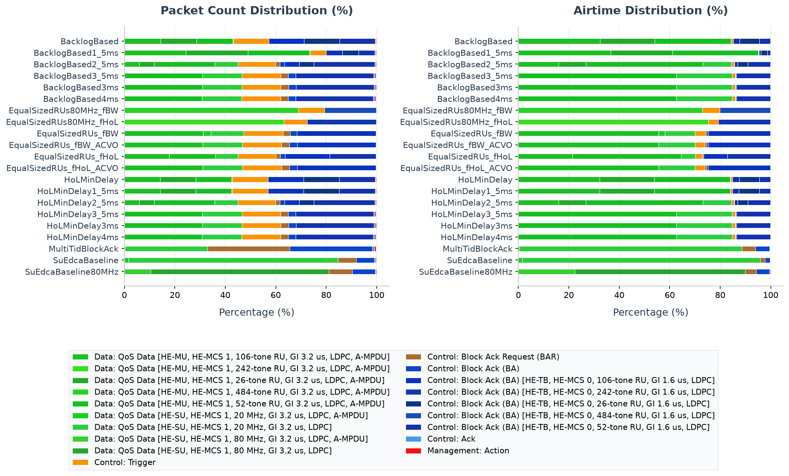

# Walkthrough: 802.11ax Downlink OFDMA

This example contains controlled downlink scheduler workloads and run-0 packet
captures. Result claims in this walkthrough refer only to the retained artifacts
listed below.

## Evidence sets

- Scalar/vector session: [`results/scalar-vector/20260725T120411Z`](results/scalar-vector/20260725T120411Z). Every dashboard condition has runs 0 through 4 with both `.sca` and `.vec` files.
- Dashboard: [DL scheduler figure](../analysis/figures/dl/dl-scheduler-dashboard.png) and its [provenance](../analysis/figures/dl/dl-scheduler-dashboard.png.json). The provenance records the input-file hashes, the `0.3–0.88 s` window, and the exact vector filters.
- Packet session: [`results/packet-statistics/20260725T105717Z`](results/packet-statistics/20260725T105717Z). The generated tables below are exact run-0 AP/global and per-host capture summaries from that session.

The dashboard computes one observation per run. Goodput sums
`packetReceived:vector(packetBytes)` at the application sinks. Delay is the
nearest-rank p95 after pooling `endToEndDelay:vector` samples within a run.
Reported uncertainty is a two-sided 95% Student-t confidence interval over runs
0–4. The scheduler telemetry contract is the timestamp-aligned AP-radio triple
`heStaId:vector`, `heScheduledPsduBytes:vector`, and
`heUserPpduDuration:vector`; these exact filters appear in the provenance file.

## Configurations

The configuration facts in this table come from [the INI file](omnetpp.ini).
They describe inputs, not measured outcomes.

| Configuration family | Traffic and channel | Access/scheduler |
|---|---|---|
| `SuEdcaBaseline`, `EqualSizedRUs_fBW`, `EqualSizedRUs_fHoL` | Three 100 B flows, 1 ms interval, 20 MHz | SU EDCA control, equal-RU `fBW`, equal-RU `fHoL` |
| `BacklogBased*`, `HoLMinDelay*` | 1000/400/100 B flows; common interval 1.5, 2, 2.5, 3, 3.5, or 4 ms | Backlog-based or minimum-HoL-delay DL scheduler |
| `EqualSizedRUs80MHz_fBW`, `EqualSizedRUs80MHz_fHoL`, `SuEdcaBaseline80MHz` | Three 100 B flows, 0.25 ms interval, 80 MHz | Run-0 packet-capture comparison only in this walkthrough |

`SuEdcaBaseline` uses one shared 300-packet AC_BE pending queue. The OFDMA
configs use `HeHcf`, whose destination queues are separate. The symmetric
comparison therefore holds aggregate configured queue capacity at 300 packets
but does not isolate frequency partitioning from queue organization.

## Five-run scalar/vector results


### Symmetric workload

| Configuration | Aggregate goodput | Pooled p95 delay |
|---|---:|---:|
| `SuEdcaBaseline` | 1.744 ± 0.005 Mbit/s | 140.695 ± 0.834 ms |
| `EqualSizedRUs_fBW` | 2.388 ± 0.009 Mbit/s | 6.954 ± 4.413 ms |
| `EqualSizedRUs_fHoL` | 2.400 ± 0.000 Mbit/s | 0.758 ± 0.032 ms |

These numbers are the bars in the top row of the retained dashboard and are
derived from the files named in its provenance. In this workload, both equal-RU
configs have greater application goodput and lower pooled p95 delay than the SU
control. That statement is limited to these configurations because their queue
organizations differ.

### Asymmetric workload

| Scheduler pair | Interval | Backlog goodput / p95 | HoL goodput / p95 |
|---|---:|---:|---:|
| base | 2 ms | 5.979 ± 0.000 Mbit/s / 3.387 ± 0.022 ms | 5.926 ± 0.014 Mbit/s / 7.985 ± 0.908 ms |
| `*1_5ms` | 1.5 ms | 7.833 ± 0.029 Mbit/s / 13.256 ± 0.176 ms | 5.926 ± 0.014 Mbit/s / 143.584 ± 0.564 ms |
| `*2_5ms` | 2.5 ms | 4.800 ± 0.000 Mbit/s / 2.147 ± 0.009 ms | 4.800 ± 0.000 Mbit/s / 2.147 ± 0.009 ms |
| `*3ms` | 3 ms | 4.007 ± 0.000 Mbit/s / 2.556 ± 0.020 ms | 4.007 ± 0.000 Mbit/s / 2.556 ± 0.020 ms |
| `*3_5ms` | 3.5 ms | 3.421 ± 0.000 Mbit/s / 2.554 ± 0.018 ms | 3.421 ± 0.000 Mbit/s / 2.554 ± 0.018 ms |
| `*4ms` | 4 ms | 3.000 ± 0.000 Mbit/s / 2.553 ± 0.010 ms | 3.000 ± 0.000 Mbit/s / 2.553 ± 0.010 ms |

The bottom-row dashboard bars and the session files support two bounded
observations: the scheduler results separate at 1.5 and 2 ms, while the paired
aggregate goodput and pooled p95 values are equal at 2.5 ms and longer
intervals. Pooled p95 combines samples from flows with different packet sizes
and must not be read as a per-flow percentile.

## Reproduction

Run one configuration from the repository root:

```sh
bin/inet -u Cmdenv -f examples/ieee80211ax/dl_ofdma/omnetpp.ini \
  -c EqualSizedRUs_fBW -r 0
```

Regenerate the five-run result group and validate the checked-in dashboard:

```sh
python3 examples/ieee80211ax/analysis/run_campaign.py dl -j$(nproc)
MPLCONFIGDIR=/tmp/matplotlib \
  python3 examples/ieee80211ax/analysis/first_tranche.py dl --check
```

Inspect the result names without selecting unrelated metrics:

```sh
opp_scavetool query -l \
  -f 'name =~ "packetReceived:vector(packetBytes)" OR name =~ "endToEndDelay:vector" OR name =~ "heStaId:vector" OR name =~ "heScheduledPsduBytes:vector" OR name =~ "heUserPpduDuration:vector"' \
  examples/ieee80211ax/dl_ofdma/results/scalar-vector/20260725T120411Z/*/*.sca \
  examples/ieee80211ax/dl_ofdma/results/scalar-vector/20260725T120411Z/*/*.vec
```

Regenerate the run-0 capture appendix:

```sh
MPLCONFIGDIR=/tmp/matplotlib \
  python3 examples/ieee80211ax/analysis/analyze_pcap_types.py \
  --generate --subdir dl_ofdma
```

The packet tables are observation-point evidence. A Trigger or Multi-STA Block
Ack row establishes that the frame subtype was observed at the recorded
interface; it does not by itself establish application delivery or explain a
scheduler decision. The scalar/vector dashboard supplies the application result
evidence.

<!-- BEGIN GENERATED: ieee80211ax-pcap-statistics -->
## 802.11 Packet Type Statistics


This section provides a statistical overview of the 802.11 frames transmitted over the wireless medium during the simulation. The packet counts were gathered from AP wireless-interface observation points. With multiple AP captures, one medium transmission may be observed at more than one AP; counts and airtime therefore represent recorded transmission observations, not de-duplicated application packets.

Capture session `20260725T105717Z` was generated from fresh PCAPng input with `TShark (Wireshark) 4.6.4.`. HE PPDU format, MCS, coding, bandwidth/RU, GI, and NSTS are decoded directly from standards-compliant radiotap HE fields; values not marked known by the recorder are omitted.

Two estimated airtime occupancy percentages are provided. HE-SU and HE-ER-SU use the modeled 36/44 µs preambles; a dissector-expanded A-MPDU is charged one shared preamble. HE MU/TB user-dependent signaling not exposed by radiotap remains approximate.
- **Air Time %**: This frame type's share of the sum of all estimated frame airtimes.
- **Air Time (Sim Time) %**: The sum of this frame type's estimated airtimes divided by the simulation time limit. Concurrent transmissions from multiple capture points are counted separately, so this value can exceed 100%; it is not the union of busy channel time.

### Evidence checks

| Status | Requirement | Observed evidence |
|---|---|---|
| **PASS** | BacklogBased produced protocol-visible wireless observations | 2432 AP/global transmission observations |
| **PASS** | BacklogBased1_5ms produced protocol-visible wireless observations | 1874 AP/global transmission observations |
| **PASS** | BacklogBased2_5ms produced protocol-visible wireless observations | 1874 AP/global transmission observations |
| **PASS** | BacklogBased3_5ms produced protocol-visible wireless observations | 1296 AP/global transmission observations |
| **PASS** | BacklogBased3ms produced protocol-visible wireless observations | 1509 AP/global transmission observations |
| **PASS** | BacklogBased4ms produced protocol-visible wireless observations | 1136 AP/global transmission observations |
| **PASS** | EqualSizedRUs80MHz_fBW produced protocol-visible wireless observations | 12168 AP/global transmission observations |
| **PASS** | EqualSizedRUs80MHz_fHoL produced protocol-visible wireless observations | 13273 AP/global transmission observations |
| **PASS** | EqualSizedRUs_fBW produced protocol-visible wireless observations | 4414 AP/global transmission observations |
| **PASS** | EqualSizedRUs_fBW_ACVO produced protocol-visible wireless observations | 4496 AP/global transmission observations |
| **PASS** | EqualSizedRUs_fHoL produced protocol-visible wireless observations | 4668 AP/global transmission observations |
| **PASS** | EqualSizedRUs_fHoL_ACVO produced protocol-visible wireless observations | 4496 AP/global transmission observations |
| **PASS** | HoLMinDelay produced protocol-visible wireless observations | 2436 AP/global transmission observations |
| **PASS** | HoLMinDelay1_5ms produced protocol-visible wireless observations | 2439 AP/global transmission observations |
| **PASS** | HoLMinDelay2_5ms produced protocol-visible wireless observations | 1874 AP/global transmission observations |
| **PASS** | HoLMinDelay3_5ms produced protocol-visible wireless observations | 1296 AP/global transmission observations |
| **PASS** | HoLMinDelay3ms produced protocol-visible wireless observations | 1509 AP/global transmission observations |
| **PASS** | HoLMinDelay4ms produced protocol-visible wireless observations | 1136 AP/global transmission observations |
| **PASS** | MultiTidBlockAck produced protocol-visible wireless observations | 1225 AP/global transmission observations |
| **PASS** | SuEdcaBaseline produced protocol-visible wireless observations | 1790 AP/global transmission observations |
| **PASS** | SuEdcaBaseline80MHz produced protocol-visible wireless observations | 2651 AP/global transmission observations |
| **PASS** | HE-MU payload observations decode as QoS Data with A-MPDU status | 30915 of 30915 HE-MU observations |
| **FAIL** | HE-MU recipient addresses support per-flow PCAP grouping | BacklogBased/host[0]: 348, BacklogBased/host[1]: 349, BacklogBased/host[2]: 349, HoLMinDelay/host[0]: 345, HoLMinDelay/host[1]: 346, HoLMinDelay/host[2]: 346, BacklogBased4ms/host[0]: 0, BacklogBased4ms/host[1]: 175, BacklogBased4ms/host[2]: 175, HoLMinDelay4ms/host[0]: 0, HoLMinDelay4ms/host[1]: 175, HoLMinDelay4ms/host[2]: 175, BacklogBased3ms/host[0]: 0, BacklogBased3ms/host[1]: 233, BacklogBased3ms/host[2]: 233, HoLMinDelay3ms/host[0]: 0, HoLMinDelay3ms/host[1]: 233, HoLMinDelay3ms/host[2]: 233, BacklogBased3_5ms/host[0]: 0, BacklogBased3_5ms/host[1]: 200, BacklogBased3_5ms/host[2]: 200, HoLMinDelay3_5ms/host[0]: 0, HoLMinDelay3_5ms/host[1]: 200, HoLMinDelay3_5ms/host[2]: 200, BacklogBased2_5ms/host[0]: 110, BacklogBased2_5ms/host[1]: 280, BacklogBased2_5ms/host[2]: 280, HoLMinDelay2_5ms/host[0]: 110, HoLMinDelay2_5ms/host[1]: 280, HoLMinDelay2_5ms/host[2]: 280, BacklogBased1_5ms/host[0]: 457, BacklogBased1_5ms/host[1]: 458, BacklogBased1_5ms/host[2]: 461, HoLMinDelay1_5ms/host[0]: 345, HoLMinDelay1_5ms/host[1]: 346, HoLMinDelay1_5ms/host[2]: 346 |

### Configuration: `BacklogBased`
Total over-the-air frame/MPDU transmission observations (Global BSS/AP): **2432**

| Color | Frame Type & Subtype | Count | Percentage | Mean Size | Std Dev | Mean Duration | Std Dev Duration | Freq | Mean RX Sig | Mean TX Pwr | Air Time % | Air Time (Sim Time) % |
|:---:|---|---:|---:|---:|---:|---:|---:|---:|---:|---:|---:|---:|
| <svg width="16" height="16"><rect width="16" height="16" rx="3" fill="#1bc021" /></svg> | Data: QoS Data [HE-MU, HE-MCS 1, 106-tone RU, GI 3.2 us, LDPC, A-MPDU] | 348 | 14.31% | 1066.0 B | 0.0 B | 1373.0 us | 5.1 us | 5010 MHz | - | 20.0 dBm | 32.32% | 47.78% |
| <svg width="16" height="16"><rect width="16" height="16" rx="3" fill="#20ac27" /></svg> | Data: QoS Data [HE-MU, HE-MCS 1, 26-tone RU, GI 3.2 us, LDPC, A-MPDU] | 348 | 14.31% | 166.0 B | 0.0 B | 920.6 us | 5.1 us | 5010 MHz | - | 20.0 dBm | 21.67% | 32.04% |
| <svg width="16" height="16"><rect width="16" height="16" rx="3" fill="#16c022" /></svg> | Data: QoS Data [HE-MU, HE-MCS 1, 52-tone RU, GI 3.2 us, LDPC, A-MPDU] | 350 | 14.39% | 465.1 B | 16.0 B | 1275.7 us | 43.0 us | 5010 MHz | - | 20.0 dBm | 30.20% | 44.65% |
| <svg width="16" height="16"><rect width="16" height="16" rx="3" fill="#2cce3f" /></svg> | Data: QoS Data [HE-SU, HE-MCS 1, 20 MHz, GI 3.2 us, LDPC] | 4 | 0.16% | 391.0 B | 389.7 B | 249.9 us | 213.2 us | 5010 MHz | - | 20.0 dBm | 0.07% | 0.10% |
| <hr> | <hr> | <hr> | <hr> | <hr> | <hr> | <hr> | <hr> | <hr> | <hr> | <hr> | <hr> | <hr> |
| <svg width="16" height="16"><rect width="16" height="16" rx="3" fill="#f99406" /></svg> | Control: Trigger | 342 | 14.06% | 55.0 B | 0.5 B | 38.3 us | 0.2 us | 5010 MHz | - | 20.0 dBm | 0.89% | 1.31% |
| <svg width="16" height="16"><rect width="16" height="16" rx="3" fill="#0933be" /></svg> | Control: Block Ack (BA) [HE-TB, HE-MCS 0, 106-tone RU, GI 1.6 us, LDPC] | 341 | 14.02% | 32.0 B | 0.0 B | 108.3 us | 0.0 us | 5005 MHz | -66.0 dBm | - | 2.50% | 3.69% |
| <svg width="16" height="16"><rect width="16" height="16" rx="3" fill="#0c3683" /></svg> | Control: Block Ack (BA) [HE-TB, HE-MCS 0, 26-tone RU, GI 1.6 us, LDPC] | 341 | 14.02% | 32.0 B | 0.0 B | 343.2 us | 0.0 us | 5010 MHz | -67.0 dBm | - | 7.92% | 11.70% |
| <svg width="16" height="16"><rect width="16" height="16" rx="3" fill="#1332ae" /></svg> | Control: Block Ack (BA) [HE-TB, HE-MCS 0, 52-tone RU, GI 1.6 us, LDPC] | 343 | 14.10% | 32.0 B | 0.0 B | 189.6 us | 0.0 us | 5003 MHz, 5007 MHz, 5013 MHz | -63.0 dBm | - | 4.40% | 6.50% |
| <svg width="16" height="16"><rect width="16" height="16" rx="3" fill="#4799eb" /></svg> | Control: Ack | 3 | 0.12% | 14.0 B | 0.0 B | 24.7 us | 0.0 us | 5010 MHz | -65.3 dBm | - | 0.01% | 0.01% |
| <svg width="16" height="16"><rect width="16" height="16" rx="3" fill="#4799eb" /></svg> | Control: Ack | 6 | 0.25% | 14.0 B | 0.0 B | 24.7 us | 0.0 us | 5010 MHz | -65.3 dBm | 20.0 dBm | 0.01% | 0.01% |
| <hr> | <hr> | <hr> | <hr> | <hr> | <hr> | <hr> | <hr> | <hr> | <hr> | <hr> | <hr> | <hr> |
| <svg width="16" height="16"><rect width="16" height="16" rx="3" fill="#ec1313" /></svg> | Management: Action | 6 | 0.25% | 37.0 B | 0.0 B | 69.3 us | 0.0 us | 5010 MHz | -65.3 dBm | 20.0 dBm | 0.03% | 0.04% |

#### Per-Flow Traffic Statistics for `BacklogBased`

##### Heavy Flow (destined to `host[0]`, offered load: 32 Mbps, size: 1000 B)
Total packets captured for flow: **694**

| Color | Frame Type & Subtype | Count | Percentage | Mean Size | Std Dev | Mean Duration | Std Dev Duration | Freq | Mean RX Sig | Mean TX Pwr | Air Time % | Air Time (Sim Time) % |
|:---:|---|---:|---:|---:|---:|---:|---:|---:|---:|---:|---:|---:|
| <svg width="16" height="16"><rect width="16" height="16" rx="3" fill="#1bc021" /></svg> | Data: QoS Data [HE-MU, HE-MCS 1, 106-tone RU, GI 3.2 us, LDPC, A-MPDU] | 348 | 50.14% | 1066.0 B | 0.0 B | 1373.0 us | 5.1 us | 5010 MHz | - | 20.0 dBm | 92.66% | 47.78% |
| <svg width="16" height="16"><rect width="16" height="16" rx="3" fill="#2cce3f" /></svg> | Data: QoS Data [HE-SU, HE-MCS 1, 20 MHz, GI 3.2 us, LDPC] | 2 | 0.29% | 616.0 B | 450.0 B | 373.0 us | 246.2 us | 5010 MHz | - | 20.0 dBm | 0.14% | 0.07% |
| <hr> | <hr> | <hr> | <hr> | <hr> | <hr> | <hr> | <hr> | <hr> | <hr> | <hr> | <hr> | <hr> |
| <svg width="16" height="16"><rect width="16" height="16" rx="3" fill="#0933be" /></svg> | Control: Block Ack (BA) [HE-TB, HE-MCS 0, 106-tone RU, GI 1.6 us, LDPC] | 341 | 49.14% | 32.0 B | 0.0 B | 108.3 us | 0.0 us | 5005 MHz | -66.0 dBm | - | 7.16% | 3.69% |
| <svg width="16" height="16"><rect width="16" height="16" rx="3" fill="#4799eb" /></svg> | Control: Ack | 1 | 0.14% | 14.0 B | 0.0 B | 24.7 us | 0.0 us | 5010 MHz | - | 20.0 dBm | 0.00% | 0.00% |
| <hr> | <hr> | <hr> | <hr> | <hr> | <hr> | <hr> | <hr> | <hr> | <hr> | <hr> | <hr> | <hr> |
| <svg width="16" height="16"><rect width="16" height="16" rx="3" fill="#ec1313" /></svg> | Management: Action | 2 | 0.29% | 37.0 B | 0.0 B | 69.3 us | 0.0 us | 5010 MHz | -66.0 dBm | 20.0 dBm | 0.03% | 0.01% |

##### Medium Flow (destined to `host[1]`, offered load: 12.8 Mbps, size: 400 B)
Total packets captured for flow: **695**

| Color | Frame Type & Subtype | Count | Percentage | Mean Size | Std Dev | Mean Duration | Std Dev Duration | Freq | Mean RX Sig | Mean TX Pwr | Air Time % | Air Time (Sim Time) % |
|:---:|---|---:|---:|---:|---:|---:|---:|---:|---:|---:|---:|---:|
| <svg width="16" height="16"><rect width="16" height="16" rx="3" fill="#16c022" /></svg> | Data: QoS Data [HE-MU, HE-MCS 1, 52-tone RU, GI 3.2 us, LDPC, A-MPDU] | 349 | 50.22% | 466.0 B | 0.0 B | 1277.9 us | 5.0 us | 5010 MHz | - | 20.0 dBm | 87.26% | 44.60% |
| <svg width="16" height="16"><rect width="16" height="16" rx="3" fill="#2cce3f" /></svg> | Data: QoS Data [HE-SU, HE-MCS 1, 20 MHz, GI 3.2 us, LDPC] | 1 | 0.14% | 166.0 B | 0.0 B | 126.8 us | 0.0 us | 5010 MHz | - | 20.0 dBm | 0.02% | 0.01% |
| <hr> | <hr> | <hr> | <hr> | <hr> | <hr> | <hr> | <hr> | <hr> | <hr> | <hr> | <hr> | <hr> |
| <svg width="16" height="16"><rect width="16" height="16" rx="3" fill="#1332ae" /></svg> | Control: Block Ack (BA) [HE-TB, HE-MCS 0, 52-tone RU, GI 1.6 us, LDPC] | 342 | 49.21% | 32.0 B | 0.0 B | 189.6 us | 0.0 us | 5003 MHz, 5013 MHz | -63.0 dBm | - | 12.69% | 6.48% |
| <svg width="16" height="16"><rect width="16" height="16" rx="3" fill="#4799eb" /></svg> | Control: Ack | 1 | 0.14% | 14.0 B | 0.0 B | 24.7 us | 0.0 us | 5010 MHz | - | 20.0 dBm | 0.00% | 0.00% |
| <hr> | <hr> | <hr> | <hr> | <hr> | <hr> | <hr> | <hr> | <hr> | <hr> | <hr> | <hr> | <hr> |
| <svg width="16" height="16"><rect width="16" height="16" rx="3" fill="#ec1313" /></svg> | Management: Action | 2 | 0.29% | 37.0 B | 0.0 B | 69.3 us | 0.0 us | 5010 MHz | -63.0 dBm | 20.0 dBm | 0.03% | 0.01% |

##### Light Flow (destined to `host[2]`, offered load: 3.2 Mbps, size: 100 B)
Total packets captured for flow: **695**

| Color | Frame Type & Subtype | Count | Percentage | Mean Size | Std Dev | Mean Duration | Std Dev Duration | Freq | Mean RX Sig | Mean TX Pwr | Air Time % | Air Time (Sim Time) % |
|:---:|---|---:|---:|---:|---:|---:|---:|---:|---:|---:|---:|---:|
| <svg width="16" height="16"><rect width="16" height="16" rx="3" fill="#20ac27" /></svg> | Data: QoS Data [HE-MU, HE-MCS 1, 26-tone RU, GI 3.2 us, LDPC, A-MPDU] | 348 | 50.07% | 166.0 B | 0.0 B | 920.6 us | 5.1 us | 5010 MHz | - | 20.0 dBm | 73.08% | 32.04% |
| <svg width="16" height="16"><rect width="16" height="16" rx="3" fill="#16c022" /></svg> | Data: QoS Data [HE-MU, HE-MCS 1, 52-tone RU, GI 3.2 us, LDPC, A-MPDU] | 1 | 0.14% | 166.0 B | 0.0 B | 478.7 us | 0.0 us | 5010 MHz | - | 20.0 dBm | 0.11% | 0.05% |
| <svg width="16" height="16"><rect width="16" height="16" rx="3" fill="#2cce3f" /></svg> | Data: QoS Data [HE-SU, HE-MCS 1, 20 MHz, GI 3.2 us, LDPC] | 1 | 0.14% | 166.0 B | 0.0 B | 126.8 us | 0.0 us | 5010 MHz | - | 20.0 dBm | 0.03% | 0.01% |
| <hr> | <hr> | <hr> | <hr> | <hr> | <hr> | <hr> | <hr> | <hr> | <hr> | <hr> | <hr> | <hr> |
| <svg width="16" height="16"><rect width="16" height="16" rx="3" fill="#0c3683" /></svg> | Control: Block Ack (BA) [HE-TB, HE-MCS 0, 26-tone RU, GI 1.6 us, LDPC] | 341 | 49.06% | 32.0 B | 0.0 B | 343.2 us | 0.0 us | 5010 MHz | -67.0 dBm | - | 26.70% | 11.70% |
| <svg width="16" height="16"><rect width="16" height="16" rx="3" fill="#1332ae" /></svg> | Control: Block Ack (BA) [HE-TB, HE-MCS 0, 52-tone RU, GI 1.6 us, LDPC] | 1 | 0.14% | 32.0 B | 0.0 B | 189.6 us | 0.0 us | 5007 MHz | -67.0 dBm | - | 0.04% | 0.02% |
| <svg width="16" height="16"><rect width="16" height="16" rx="3" fill="#4799eb" /></svg> | Control: Ack | 1 | 0.14% | 14.0 B | 0.0 B | 24.7 us | 0.0 us | 5010 MHz | - | 20.0 dBm | 0.01% | 0.00% |
| <hr> | <hr> | <hr> | <hr> | <hr> | <hr> | <hr> | <hr> | <hr> | <hr> | <hr> | <hr> | <hr> |
| <svg width="16" height="16"><rect width="16" height="16" rx="3" fill="#ec1313" /></svg> | Management: Action | 2 | 0.29% | 37.0 B | 0.0 B | 69.3 us | 0.0 us | 5010 MHz | -67.0 dBm | 20.0 dBm | 0.03% | 0.01% |

### Configuration: `BacklogBased1_5ms`
Total over-the-air frame/MPDU transmission observations (Global BSS/AP): **1874**

| Color | Frame Type & Subtype | Count | Percentage | Mean Size | Std Dev | Mean Duration | Std Dev Duration | Freq | Mean RX Sig | Mean TX Pwr | Air Time % | Air Time (Sim Time) % |
|:---:|---|---:|---:|---:|---:|---:|---:|---:|---:|---:|---:|---:|
| <svg width="16" height="16"><rect width="16" height="16" rx="3" fill="#1bc021" /></svg> | Data: QoS Data [HE-MU, HE-MCS 1, 106-tone RU, GI 3.2 us, LDPC, A-MPDU] | 457 | 24.39% | 1066.0 B | 0.0 B | 1347.1 us | 15.8 us | 5010 MHz | - | 20.0 dBm | 36.56% | 61.56% |
| <svg width="16" height="16"><rect width="16" height="16" rx="3" fill="#20ac27" /></svg> | Data: QoS Data [HE-MU, HE-MCS 1, 26-tone RU, GI 3.2 us, LDPC, A-MPDU] | 460 | 24.55% | 166.0 B | 0.0 B | 894.6 us | 15.8 us | 5010 MHz | - | 20.0 dBm | 24.44% | 41.15% |
| <svg width="16" height="16"><rect width="16" height="16" rx="3" fill="#16c022" /></svg> | Data: QoS Data [HE-MU, HE-MCS 1, 52-tone RU, GI 3.2 us, LDPC, A-MPDU] | 459 | 24.49% | 465.3 B | 14.0 B | 1250.4 us | 39.4 us | 5010 MHz | - | 20.0 dBm | 34.08% | 57.39% |
| <svg width="16" height="16"><rect width="16" height="16" rx="3" fill="#2cce3f" /></svg> | Data: QoS Data [HE-SU, HE-MCS 1, 20 MHz, GI 3.2 us, LDPC] | 4 | 0.21% | 391.0 B | 389.7 B | 249.9 us | 213.2 us | 5010 MHz | - | 20.0 dBm | 0.06% | 0.10% |
| <hr> | <hr> | <hr> | <hr> | <hr> | <hr> | <hr> | <hr> | <hr> | <hr> | <hr> | <hr> | <hr> |
| <svg width="16" height="16"><rect width="16" height="16" rx="3" fill="#f99406" /></svg> | Control: Trigger | 120 | 6.40% | 54.9 B | 0.8 B | 38.3 us | 0.3 us | 5010 MHz | - | 20.0 dBm | 0.27% | 0.46% |
| <svg width="16" height="16"><rect width="16" height="16" rx="3" fill="#0933be" /></svg> | Control: Block Ack (BA) [HE-TB, HE-MCS 0, 106-tone RU, GI 1.6 us, LDPC] | 119 | 6.35% | 32.0 B | 0.0 B | 108.3 us | 0.0 us | 5005 MHz | -66.0 dBm | - | 0.77% | 1.29% |
| <svg width="16" height="16"><rect width="16" height="16" rx="3" fill="#0c3683" /></svg> | Control: Block Ack (BA) [HE-TB, HE-MCS 0, 26-tone RU, GI 1.6 us, LDPC] | 119 | 6.35% | 32.0 B | 0.0 B | 343.2 us | 0.0 us | 5010 MHz | -67.0 dBm | - | 2.43% | 4.08% |
| <svg width="16" height="16"><rect width="16" height="16" rx="3" fill="#1332ae" /></svg> | Control: Block Ack (BA) [HE-TB, HE-MCS 0, 52-tone RU, GI 1.6 us, LDPC] | 121 | 6.46% | 32.0 B | 0.0 B | 189.6 us | 0.0 us | 5003 MHz, 5007 MHz, 5013 MHz | -63.0 dBm | - | 1.36% | 2.29% |
| <svg width="16" height="16"><rect width="16" height="16" rx="3" fill="#4799eb" /></svg> | Control: Ack | 3 | 0.16% | 14.0 B | 0.0 B | 24.7 us | 0.0 us | 5010 MHz | -65.3 dBm | - | 0.00% | 0.01% |
| <svg width="16" height="16"><rect width="16" height="16" rx="3" fill="#4799eb" /></svg> | Control: Ack | 6 | 0.32% | 14.0 B | 0.0 B | 24.7 us | 0.0 us | 5010 MHz | -65.3 dBm | 20.0 dBm | 0.01% | 0.01% |
| <hr> | <hr> | <hr> | <hr> | <hr> | <hr> | <hr> | <hr> | <hr> | <hr> | <hr> | <hr> | <hr> |
| <svg width="16" height="16"><rect width="16" height="16" rx="3" fill="#ec1313" /></svg> | Management: Action | 6 | 0.32% | 37.0 B | 0.0 B | 69.3 us | 0.0 us | 5010 MHz | -65.3 dBm | 20.0 dBm | 0.02% | 0.04% |

#### Per-Flow Traffic Statistics for `BacklogBased1_5ms`

##### Heavy Flow (destined to `host[0]`, offered load: 32 Mbps, size: 1000 B)
Total packets captured for flow: **581**

| Color | Frame Type & Subtype | Count | Percentage | Mean Size | Std Dev | Mean Duration | Std Dev Duration | Freq | Mean RX Sig | Mean TX Pwr | Air Time % | Air Time (Sim Time) % |
|:---:|---|---:|---:|---:|---:|---:|---:|---:|---:|---:|---:|---:|
| <svg width="16" height="16"><rect width="16" height="16" rx="3" fill="#1bc021" /></svg> | Data: QoS Data [HE-MU, HE-MCS 1, 106-tone RU, GI 3.2 us, LDPC, A-MPDU] | 457 | 78.66% | 1066.0 B | 0.0 B | 1347.1 us | 15.8 us | 5010 MHz | - | 20.0 dBm | 97.81% | 61.56% |
| <svg width="16" height="16"><rect width="16" height="16" rx="3" fill="#2cce3f" /></svg> | Data: QoS Data [HE-SU, HE-MCS 1, 20 MHz, GI 3.2 us, LDPC] | 2 | 0.34% | 616.0 B | 450.0 B | 373.0 us | 246.2 us | 5010 MHz | - | 20.0 dBm | 0.12% | 0.07% |
| <hr> | <hr> | <hr> | <hr> | <hr> | <hr> | <hr> | <hr> | <hr> | <hr> | <hr> | <hr> | <hr> |
| <svg width="16" height="16"><rect width="16" height="16" rx="3" fill="#0933be" /></svg> | Control: Block Ack (BA) [HE-TB, HE-MCS 0, 106-tone RU, GI 1.6 us, LDPC] | 119 | 20.48% | 32.0 B | 0.0 B | 108.3 us | 0.0 us | 5005 MHz | -66.0 dBm | - | 2.05% | 1.29% |
| <svg width="16" height="16"><rect width="16" height="16" rx="3" fill="#4799eb" /></svg> | Control: Ack | 1 | 0.17% | 14.0 B | 0.0 B | 24.7 us | 0.0 us | 5010 MHz | - | 20.0 dBm | 0.00% | 0.00% |
| <hr> | <hr> | <hr> | <hr> | <hr> | <hr> | <hr> | <hr> | <hr> | <hr> | <hr> | <hr> | <hr> |
| <svg width="16" height="16"><rect width="16" height="16" rx="3" fill="#ec1313" /></svg> | Management: Action | 2 | 0.34% | 37.0 B | 0.0 B | 69.3 us | 0.0 us | 5010 MHz | -66.0 dBm | 20.0 dBm | 0.02% | 0.01% |

##### Medium Flow (destined to `host[1]`, offered load: 12.8 Mbps, size: 400 B)
Total packets captured for flow: **582**

| Color | Frame Type & Subtype | Count | Percentage | Mean Size | Std Dev | Mean Duration | Std Dev Duration | Freq | Mean RX Sig | Mean TX Pwr | Air Time % | Air Time (Sim Time) % |
|:---:|---|---:|---:|---:|---:|---:|---:|---:|---:|---:|---:|---:|
| <svg width="16" height="16"><rect width="16" height="16" rx="3" fill="#16c022" /></svg> | Data: QoS Data [HE-MU, HE-MCS 1, 52-tone RU, GI 3.2 us, LDPC, A-MPDU] | 458 | 78.69% | 466.0 B | 0.0 B | 1252.1 us | 15.8 us | 5010 MHz | - | 20.0 dBm | 96.14% | 57.35% |
| <svg width="16" height="16"><rect width="16" height="16" rx="3" fill="#2cce3f" /></svg> | Data: QoS Data [HE-SU, HE-MCS 1, 20 MHz, GI 3.2 us, LDPC] | 1 | 0.17% | 166.0 B | 0.0 B | 126.8 us | 0.0 us | 5010 MHz | - | 20.0 dBm | 0.02% | 0.01% |
| <hr> | <hr> | <hr> | <hr> | <hr> | <hr> | <hr> | <hr> | <hr> | <hr> | <hr> | <hr> | <hr> |
| <svg width="16" height="16"><rect width="16" height="16" rx="3" fill="#1332ae" /></svg> | Control: Block Ack (BA) [HE-TB, HE-MCS 0, 52-tone RU, GI 1.6 us, LDPC] | 120 | 20.62% | 32.0 B | 0.0 B | 189.6 us | 0.0 us | 5003 MHz, 5013 MHz | -63.0 dBm | - | 3.81% | 2.28% |
| <svg width="16" height="16"><rect width="16" height="16" rx="3" fill="#4799eb" /></svg> | Control: Ack | 1 | 0.17% | 14.0 B | 0.0 B | 24.7 us | 0.0 us | 5010 MHz | - | 20.0 dBm | 0.00% | 0.00% |
| <hr> | <hr> | <hr> | <hr> | <hr> | <hr> | <hr> | <hr> | <hr> | <hr> | <hr> | <hr> | <hr> |
| <svg width="16" height="16"><rect width="16" height="16" rx="3" fill="#ec1313" /></svg> | Management: Action | 2 | 0.34% | 37.0 B | 0.0 B | 69.3 us | 0.0 us | 5010 MHz | -63.0 dBm | 20.0 dBm | 0.02% | 0.01% |

##### Light Flow (destined to `host[2]`, offered load: 3.2 Mbps, size: 100 B)
Total packets captured for flow: **585**

| Color | Frame Type & Subtype | Count | Percentage | Mean Size | Std Dev | Mean Duration | Std Dev Duration | Freq | Mean RX Sig | Mean TX Pwr | Air Time % | Air Time (Sim Time) % |
|:---:|---|---:|---:|---:|---:|---:|---:|---:|---:|---:|---:|---:|
| <svg width="16" height="16"><rect width="16" height="16" rx="3" fill="#20ac27" /></svg> | Data: QoS Data [HE-MU, HE-MCS 1, 26-tone RU, GI 3.2 us, LDPC, A-MPDU] | 460 | 78.63% | 166.0 B | 0.0 B | 894.6 us | 15.8 us | 5010 MHz | - | 20.0 dBm | 90.78% | 41.15% |
| <svg width="16" height="16"><rect width="16" height="16" rx="3" fill="#16c022" /></svg> | Data: QoS Data [HE-MU, HE-MCS 1, 52-tone RU, GI 3.2 us, LDPC, A-MPDU] | 1 | 0.17% | 166.0 B | 0.0 B | 478.7 us | 0.0 us | 5010 MHz | - | 20.0 dBm | 0.11% | 0.05% |
| <svg width="16" height="16"><rect width="16" height="16" rx="3" fill="#2cce3f" /></svg> | Data: QoS Data [HE-SU, HE-MCS 1, 20 MHz, GI 3.2 us, LDPC] | 1 | 0.17% | 166.0 B | 0.0 B | 126.8 us | 0.0 us | 5010 MHz | - | 20.0 dBm | 0.03% | 0.01% |
| <hr> | <hr> | <hr> | <hr> | <hr> | <hr> | <hr> | <hr> | <hr> | <hr> | <hr> | <hr> | <hr> |
| <svg width="16" height="16"><rect width="16" height="16" rx="3" fill="#0c3683" /></svg> | Control: Block Ack (BA) [HE-TB, HE-MCS 0, 26-tone RU, GI 1.6 us, LDPC] | 119 | 20.34% | 32.0 B | 0.0 B | 343.2 us | 0.0 us | 5010 MHz | -67.0 dBm | - | 9.01% | 4.08% |
| <svg width="16" height="16"><rect width="16" height="16" rx="3" fill="#1332ae" /></svg> | Control: Block Ack (BA) [HE-TB, HE-MCS 0, 52-tone RU, GI 1.6 us, LDPC] | 1 | 0.17% | 32.0 B | 0.0 B | 189.6 us | 0.0 us | 5007 MHz | -67.0 dBm | - | 0.04% | 0.02% |
| <svg width="16" height="16"><rect width="16" height="16" rx="3" fill="#4799eb" /></svg> | Control: Ack | 1 | 0.17% | 14.0 B | 0.0 B | 24.7 us | 0.0 us | 5010 MHz | - | 20.0 dBm | 0.01% | 0.00% |
| <hr> | <hr> | <hr> | <hr> | <hr> | <hr> | <hr> | <hr> | <hr> | <hr> | <hr> | <hr> | <hr> |
| <svg width="16" height="16"><rect width="16" height="16" rx="3" fill="#ec1313" /></svg> | Management: Action | 2 | 0.34% | 37.0 B | 0.0 B | 69.3 us | 0.0 us | 5010 MHz | -67.0 dBm | 20.0 dBm | 0.03% | 0.01% |

### Configuration: `BacklogBased2_5ms`
Total over-the-air frame/MPDU transmission observations (Global BSS/AP): **1874**

| Color | Frame Type & Subtype | Count | Percentage | Mean Size | Std Dev | Mean Duration | Std Dev Duration | Freq | Mean RX Sig | Mean TX Pwr | Air Time % | Air Time (Sim Time) % |
|:---:|---|---:|---:|---:|---:|---:|---:|---:|---:|---:|---:|---:|
| <svg width="16" height="16"><rect width="16" height="16" rx="3" fill="#1bc021" /></svg> | Data: QoS Data [HE-MU, HE-MCS 1, 106-tone RU, GI 3.2 us, LDPC, A-MPDU] | 110 | 5.87% | 1066.0 B | 0.0 B | 1373.7 us | 0.0 us | 5010 MHz | - | 20.0 dBm | 15.99% | 15.11% |
| <svg width="16" height="16"><rect width="16" height="16" rx="3" fill="#20ac27" /></svg> | Data: QoS Data [HE-MU, HE-MCS 1, 26-tone RU, GI 3.2 us, LDPC, A-MPDU] | 110 | 5.87% | 166.0 B | 0.0 B | 921.3 us | 0.0 us | 5010 MHz | - | 20.0 dBm | 10.72% | 10.13% |
| <svg width="16" height="16"><rect width="16" height="16" rx="3" fill="#16c022" /></svg> | Data: QoS Data [HE-MU, HE-MCS 1, 52-tone RU, GI 3.2 us, LDPC, A-MPDU] | 450 | 24.01% | 352.7 B | 145.4 B | 976.4 us | 387.9 us | 5010 MHz | - | 20.0 dBm | 46.48% | 43.94% |
| <svg width="16" height="16"><rect width="16" height="16" rx="3" fill="#2cce3f" /></svg> | Data: QoS Data [HE-SU, HE-MCS 1, 20 MHz, GI 3.2 us, LDPC] | 173 | 9.23% | 1050.4 B | 117.5 B | 610.6 us | 64.3 us | 5010 MHz | - | 20.0 dBm | 11.17% | 10.56% |
| <hr> | <hr> | <hr> | <hr> | <hr> | <hr> | <hr> | <hr> | <hr> | <hr> | <hr> | <hr> | <hr> |
| <svg width="16" height="16"><rect width="16" height="16" rx="3" fill="#f99406" /></svg> | Control: Trigger | 280 | 14.94% | 49.5 B | 4.4 B | 36.5 us | 1.5 us | 5010 MHz | - | 20.0 dBm | 1.08% | 1.02% |
| <svg width="16" height="16"><rect width="16" height="16" rx="3" fill="#ab6c30" /></svg> | Control: Block Ack Request (BAR) | 33 | 1.76% | 24.0 B | 0.0 B | 28.0 us | 0.0 us | 5010 MHz | - | 20.0 dBm | 0.10% | 0.09% |
| <svg width="16" height="16"><rect width="16" height="16" rx="3" fill="#0946c8" /></svg> | Control: Block Ack (BA) | 33 | 1.76% | 32.0 B | 0.0 B | 30.7 us | 0.0 us | 5010 MHz | -66.0 dBm | - | 0.11% | 0.10% |
| <svg width="16" height="16"><rect width="16" height="16" rx="3" fill="#0933be" /></svg> | Control: Block Ack (BA) [HE-TB, HE-MCS 0, 106-tone RU, GI 1.6 us, LDPC] | 110 | 5.87% | 32.0 B | 0.0 B | 108.3 us | 0.0 us | 5005 MHz | -66.0 dBm | - | 1.26% | 1.19% |
| <svg width="16" height="16"><rect width="16" height="16" rx="3" fill="#0c3683" /></svg> | Control: Block Ack (BA) [HE-TB, HE-MCS 0, 26-tone RU, GI 1.6 us, LDPC] | 110 | 5.87% | 32.0 B | 0.0 B | 343.2 us | 0.0 us | 5010 MHz | -67.0 dBm | - | 3.99% | 3.78% |
| <svg width="16" height="16"><rect width="16" height="16" rx="3" fill="#1332ae" /></svg> | Control: Block Ack (BA) [HE-TB, HE-MCS 0, 52-tone RU, GI 1.6 us, LDPC] | 450 | 24.01% | 32.0 B | 0.0 B | 189.6 us | 0.0 us | 5003 MHz, 5007 MHz, 5013 MHz | -64.5 dBm | - | 9.03% | 8.53% |
| <svg width="16" height="16"><rect width="16" height="16" rx="3" fill="#4799eb" /></svg> | Control: Ack | 3 | 0.16% | 14.0 B | 0.0 B | 24.7 us | 0.0 us | 5010 MHz | -65.3 dBm | - | 0.01% | 0.01% |
| <svg width="16" height="16"><rect width="16" height="16" rx="3" fill="#4799eb" /></svg> | Control: Ack | 6 | 0.32% | 14.0 B | 0.0 B | 24.7 us | 0.0 us | 5010 MHz | -65.3 dBm | 20.0 dBm | 0.02% | 0.01% |
| <hr> | <hr> | <hr> | <hr> | <hr> | <hr> | <hr> | <hr> | <hr> | <hr> | <hr> | <hr> | <hr> |
| <svg width="16" height="16"><rect width="16" height="16" rx="3" fill="#ec1313" /></svg> | Management: Action | 6 | 0.32% | 37.0 B | 0.0 B | 69.3 us | 0.0 us | 5010 MHz | -65.3 dBm | 20.0 dBm | 0.04% | 0.04% |

#### Per-Flow Traffic Statistics for `BacklogBased2_5ms`

##### Heavy Flow (destined to `host[0]`, offered load: 32 Mbps, size: 1000 B)
Total packets captured for flow: **460**

| Color | Frame Type & Subtype | Count | Percentage | Mean Size | Std Dev | Mean Duration | Std Dev Duration | Freq | Mean RX Sig | Mean TX Pwr | Air Time % | Air Time (Sim Time) % |
|:---:|---|---:|---:|---:|---:|---:|---:|---:|---:|---:|---:|---:|
| <svg width="16" height="16"><rect width="16" height="16" rx="3" fill="#1bc021" /></svg> | Data: QoS Data [HE-MU, HE-MCS 1, 106-tone RU, GI 3.2 us, LDPC, A-MPDU] | 110 | 23.91% | 1066.0 B | 0.0 B | 1373.7 us | 0.0 us | 5010 MHz | - | 20.0 dBm | 55.86% | 15.11% |
| <svg width="16" height="16"><rect width="16" height="16" rx="3" fill="#2cce3f" /></svg> | Data: QoS Data [HE-SU, HE-MCS 1, 20 MHz, GI 3.2 us, LDPC] | 171 | 37.17% | 1060.7 B | 68.6 B | 616.2 us | 37.5 us | 5010 MHz | - | 20.0 dBm | 38.96% | 10.54% |
| <hr> | <hr> | <hr> | <hr> | <hr> | <hr> | <hr> | <hr> | <hr> | <hr> | <hr> | <hr> | <hr> |
| <svg width="16" height="16"><rect width="16" height="16" rx="3" fill="#ab6c30" /></svg> | Control: Block Ack Request (BAR) | 33 | 7.17% | 24.0 B | 0.0 B | 28.0 us | 0.0 us | 5010 MHz | - | 20.0 dBm | 0.34% | 0.09% |
| <svg width="16" height="16"><rect width="16" height="16" rx="3" fill="#0946c8" /></svg> | Control: Block Ack (BA) | 33 | 7.17% | 32.0 B | 0.0 B | 30.7 us | 0.0 us | 5010 MHz | -66.0 dBm | - | 0.37% | 0.10% |
| <svg width="16" height="16"><rect width="16" height="16" rx="3" fill="#0933be" /></svg> | Control: Block Ack (BA) [HE-TB, HE-MCS 0, 106-tone RU, GI 1.6 us, LDPC] | 110 | 23.91% | 32.0 B | 0.0 B | 108.3 us | 0.0 us | 5005 MHz | -66.0 dBm | - | 4.40% | 1.19% |
| <svg width="16" height="16"><rect width="16" height="16" rx="3" fill="#4799eb" /></svg> | Control: Ack | 1 | 0.22% | 14.0 B | 0.0 B | 24.7 us | 0.0 us | 5010 MHz | - | 20.0 dBm | 0.01% | 0.00% |
| <hr> | <hr> | <hr> | <hr> | <hr> | <hr> | <hr> | <hr> | <hr> | <hr> | <hr> | <hr> | <hr> |
| <svg width="16" height="16"><rect width="16" height="16" rx="3" fill="#ec1313" /></svg> | Management: Action | 2 | 0.43% | 37.0 B | 0.0 B | 69.3 us | 0.0 us | 5010 MHz | -66.0 dBm | 20.0 dBm | 0.05% | 0.01% |

##### Medium Flow (destined to `host[1]`, offered load: 12.8 Mbps, size: 400 B)
Total packets captured for flow: **564**

| Color | Frame Type & Subtype | Count | Percentage | Mean Size | Std Dev | Mean Duration | Std Dev Duration | Freq | Mean RX Sig | Mean TX Pwr | Air Time % | Air Time (Sim Time) % |
|:---:|---|---:|---:|---:|---:|---:|---:|---:|---:|---:|---:|---:|
| <svg width="16" height="16"><rect width="16" height="16" rx="3" fill="#16c022" /></svg> | Data: QoS Data [HE-MU, HE-MCS 1, 52-tone RU, GI 3.2 us, LDPC, A-MPDU] | 280 | 49.65% | 466.0 B | 0.0 B | 1278.7 us | 0.0 us | 5010 MHz | - | 20.0 dBm | 87.03% | 35.80% |
| <svg width="16" height="16"><rect width="16" height="16" rx="3" fill="#2cce3f" /></svg> | Data: QoS Data [HE-SU, HE-MCS 1, 20 MHz, GI 3.2 us, LDPC] | 1 | 0.18% | 166.0 B | 0.0 B | 126.8 us | 0.0 us | 5010 MHz | - | 20.0 dBm | 0.03% | 0.01% |
| <hr> | <hr> | <hr> | <hr> | <hr> | <hr> | <hr> | <hr> | <hr> | <hr> | <hr> | <hr> | <hr> |
| <svg width="16" height="16"><rect width="16" height="16" rx="3" fill="#1332ae" /></svg> | Control: Block Ack (BA) [HE-TB, HE-MCS 0, 52-tone RU, GI 1.6 us, LDPC] | 280 | 49.65% | 32.0 B | 0.0 B | 189.6 us | 0.0 us | 5003 MHz, 5013 MHz | -63.0 dBm | - | 12.90% | 5.31% |
| <svg width="16" height="16"><rect width="16" height="16" rx="3" fill="#4799eb" /></svg> | Control: Ack | 1 | 0.18% | 14.0 B | 0.0 B | 24.7 us | 0.0 us | 5010 MHz | - | 20.0 dBm | 0.01% | 0.00% |
| <hr> | <hr> | <hr> | <hr> | <hr> | <hr> | <hr> | <hr> | <hr> | <hr> | <hr> | <hr> | <hr> |
| <svg width="16" height="16"><rect width="16" height="16" rx="3" fill="#ec1313" /></svg> | Management: Action | 2 | 0.35% | 37.0 B | 0.0 B | 69.3 us | 0.0 us | 5010 MHz | -63.0 dBm | 20.0 dBm | 0.03% | 0.01% |

##### Light Flow (destined to `host[2]`, offered load: 3.2 Mbps, size: 100 B)
Total packets captured for flow: **564**

| Color | Frame Type & Subtype | Count | Percentage | Mean Size | Std Dev | Mean Duration | Std Dev Duration | Freq | Mean RX Sig | Mean TX Pwr | Air Time % | Air Time (Sim Time) % |
|:---:|---|---:|---:|---:|---:|---:|---:|---:|---:|---:|---:|---:|
| <svg width="16" height="16"><rect width="16" height="16" rx="3" fill="#20ac27" /></svg> | Data: QoS Data [HE-MU, HE-MCS 1, 26-tone RU, GI 3.2 us, LDPC, A-MPDU] | 110 | 19.50% | 166.0 B | 0.0 B | 921.3 us | 0.0 us | 5010 MHz | - | 20.0 dBm | 40.06% | 10.13% |
| <svg width="16" height="16"><rect width="16" height="16" rx="3" fill="#16c022" /></svg> | Data: QoS Data [HE-MU, HE-MCS 1, 52-tone RU, GI 3.2 us, LDPC, A-MPDU] | 170 | 30.14% | 166.0 B | 0.0 B | 478.7 us | 0.0 us | 5010 MHz | - | 20.0 dBm | 32.16% | 8.14% |
| <svg width="16" height="16"><rect width="16" height="16" rx="3" fill="#2cce3f" /></svg> | Data: QoS Data [HE-SU, HE-MCS 1, 20 MHz, GI 3.2 us, LDPC] | 1 | 0.18% | 166.0 B | 0.0 B | 126.8 us | 0.0 us | 5010 MHz | - | 20.0 dBm | 0.05% | 0.01% |
| <hr> | <hr> | <hr> | <hr> | <hr> | <hr> | <hr> | <hr> | <hr> | <hr> | <hr> | <hr> | <hr> |
| <svg width="16" height="16"><rect width="16" height="16" rx="3" fill="#0c3683" /></svg> | Control: Block Ack (BA) [HE-TB, HE-MCS 0, 26-tone RU, GI 1.6 us, LDPC] | 110 | 19.50% | 32.0 B | 0.0 B | 343.2 us | 0.0 us | 5010 MHz | -67.0 dBm | - | 14.92% | 3.78% |
| <svg width="16" height="16"><rect width="16" height="16" rx="3" fill="#1332ae" /></svg> | Control: Block Ack (BA) [HE-TB, HE-MCS 0, 52-tone RU, GI 1.6 us, LDPC] | 170 | 30.14% | 32.0 B | 0.0 B | 189.6 us | 0.0 us | 5007 MHz | -67.0 dBm | - | 12.74% | 3.22% |
| <svg width="16" height="16"><rect width="16" height="16" rx="3" fill="#4799eb" /></svg> | Control: Ack | 1 | 0.18% | 14.0 B | 0.0 B | 24.7 us | 0.0 us | 5010 MHz | - | 20.0 dBm | 0.01% | 0.00% |
| <hr> | <hr> | <hr> | <hr> | <hr> | <hr> | <hr> | <hr> | <hr> | <hr> | <hr> | <hr> | <hr> |
| <svg width="16" height="16"><rect width="16" height="16" rx="3" fill="#ec1313" /></svg> | Management: Action | 2 | 0.35% | 37.0 B | 0.0 B | 69.3 us | 0.0 us | 5010 MHz | -67.0 dBm | 20.0 dBm | 0.05% | 0.01% |

### Configuration: `BacklogBased3_5ms`
Total over-the-air frame/MPDU transmission observations (Global BSS/AP): **1296**

| Color | Frame Type & Subtype | Count | Percentage | Mean Size | Std Dev | Mean Duration | Std Dev Duration | Freq | Mean RX Sig | Mean TX Pwr | Air Time % | Air Time (Sim Time) % |
|:---:|---|---:|---:|---:|---:|---:|---:|---:|---:|---:|---:|---:|
| <svg width="16" height="16"><rect width="16" height="16" rx="3" fill="#16c022" /></svg> | Data: QoS Data [HE-MU, HE-MCS 1, 52-tone RU, GI 3.2 us, LDPC, A-MPDU] | 400 | 30.86% | 316.0 B | 150.0 B | 878.7 us | 400.0 us | 5010 MHz | - | 20.0 dBm | 62.59% | 35.15% |
| <svg width="16" height="16"><rect width="16" height="16" rx="3" fill="#2cce3f" /></svg> | Data: QoS Data [HE-SU, HE-MCS 1, 20 MHz, GI 3.2 us, LDPC] | 203 | 15.66% | 1052.7 B | 108.6 B | 611.8 us | 59.4 us | 5010 MHz | - | 20.0 dBm | 22.12% | 12.42% |
| <hr> | <hr> | <hr> | <hr> | <hr> | <hr> | <hr> | <hr> | <hr> | <hr> | <hr> | <hr> | <hr> |
| <svg width="16" height="16"><rect width="16" height="16" rx="3" fill="#f99406" /></svg> | Control: Trigger | 200 | 15.43% | 46.0 B | 0.0 B | 35.3 us | 0.0 us | 5010 MHz | - | 20.0 dBm | 1.26% | 0.71% |
| <svg width="16" height="16"><rect width="16" height="16" rx="3" fill="#ab6c30" /></svg> | Control: Block Ack Request (BAR) | 39 | 3.01% | 24.0 B | 0.0 B | 28.0 us | 0.0 us | 5010 MHz | - | 20.0 dBm | 0.19% | 0.11% |
| <svg width="16" height="16"><rect width="16" height="16" rx="3" fill="#0946c8" /></svg> | Control: Block Ack (BA) | 39 | 3.01% | 32.0 B | 0.0 B | 30.7 us | 0.0 us | 5010 MHz | -66.0 dBm | - | 0.21% | 0.12% |
| <svg width="16" height="16"><rect width="16" height="16" rx="3" fill="#1332ae" /></svg> | Control: Block Ack (BA) [HE-TB, HE-MCS 0, 52-tone RU, GI 1.6 us, LDPC] | 400 | 30.86% | 32.0 B | 0.0 B | 189.6 us | 0.0 us | 5003 MHz, 5007 MHz | -65.0 dBm | - | 13.51% | 7.58% |
| <svg width="16" height="16"><rect width="16" height="16" rx="3" fill="#4799eb" /></svg> | Control: Ack | 3 | 0.23% | 14.0 B | 0.0 B | 24.7 us | 0.0 us | 5010 MHz | -65.3 dBm | - | 0.01% | 0.01% |
| <svg width="16" height="16"><rect width="16" height="16" rx="3" fill="#4799eb" /></svg> | Control: Ack | 6 | 0.46% | 14.0 B | 0.0 B | 24.7 us | 0.0 us | 5010 MHz | -65.3 dBm | 20.0 dBm | 0.03% | 0.01% |
| <hr> | <hr> | <hr> | <hr> | <hr> | <hr> | <hr> | <hr> | <hr> | <hr> | <hr> | <hr> | <hr> |
| <svg width="16" height="16"><rect width="16" height="16" rx="3" fill="#ec1313" /></svg> | Management: Action | 6 | 0.46% | 37.0 B | 0.0 B | 69.3 us | 0.0 us | 5010 MHz | -65.3 dBm | 20.0 dBm | 0.07% | 0.04% |

#### Per-Flow Traffic Statistics for `BacklogBased3_5ms`

##### Heavy Flow (destined to `host[0]`, offered load: 32 Mbps, size: 1000 B)
Total packets captured for flow: **282**

| Color | Frame Type & Subtype | Count | Percentage | Mean Size | Std Dev | Mean Duration | Std Dev Duration | Freq | Mean RX Sig | Mean TX Pwr | Air Time % | Air Time (Sim Time) % |
|:---:|---|---:|---:|---:|---:|---:|---:|---:|---:|---:|---:|---:|
| <svg width="16" height="16"><rect width="16" height="16" rx="3" fill="#2cce3f" /></svg> | Data: QoS Data [HE-SU, HE-MCS 1, 20 MHz, GI 3.2 us, LDPC] | 201 | 71.28% | 1061.5 B | 63.3 B | 616.7 us | 34.6 us | 5010 MHz | - | 20.0 dBm | 98.06% | 12.39% |
| <hr> | <hr> | <hr> | <hr> | <hr> | <hr> | <hr> | <hr> | <hr> | <hr> | <hr> | <hr> | <hr> |
| <svg width="16" height="16"><rect width="16" height="16" rx="3" fill="#ab6c30" /></svg> | Control: Block Ack Request (BAR) | 39 | 13.83% | 24.0 B | 0.0 B | 28.0 us | 0.0 us | 5010 MHz | - | 20.0 dBm | 0.86% | 0.11% |
| <svg width="16" height="16"><rect width="16" height="16" rx="3" fill="#0946c8" /></svg> | Control: Block Ack (BA) | 39 | 13.83% | 32.0 B | 0.0 B | 30.7 us | 0.0 us | 5010 MHz | -66.0 dBm | - | 0.95% | 0.12% |
| <svg width="16" height="16"><rect width="16" height="16" rx="3" fill="#4799eb" /></svg> | Control: Ack | 1 | 0.35% | 14.0 B | 0.0 B | 24.7 us | 0.0 us | 5010 MHz | - | 20.0 dBm | 0.02% | 0.00% |
| <hr> | <hr> | <hr> | <hr> | <hr> | <hr> | <hr> | <hr> | <hr> | <hr> | <hr> | <hr> | <hr> |
| <svg width="16" height="16"><rect width="16" height="16" rx="3" fill="#ec1313" /></svg> | Management: Action | 2 | 0.71% | 37.0 B | 0.0 B | 69.3 us | 0.0 us | 5010 MHz | -66.0 dBm | 20.0 dBm | 0.11% | 0.01% |

##### Medium Flow (destined to `host[1]`, offered load: 12.8 Mbps, size: 400 B)
Total packets captured for flow: **404**

| Color | Frame Type & Subtype | Count | Percentage | Mean Size | Std Dev | Mean Duration | Std Dev Duration | Freq | Mean RX Sig | Mean TX Pwr | Air Time % | Air Time (Sim Time) % |
|:---:|---|---:|---:|---:|---:|---:|---:|---:|---:|---:|---:|---:|
| <svg width="16" height="16"><rect width="16" height="16" rx="3" fill="#16c022" /></svg> | Data: QoS Data [HE-MU, HE-MCS 1, 52-tone RU, GI 3.2 us, LDPC, A-MPDU] | 200 | 49.50% | 466.0 B | 0.0 B | 1278.7 us | 0.0 us | 5010 MHz | - | 20.0 dBm | 87.00% | 25.57% |
| <svg width="16" height="16"><rect width="16" height="16" rx="3" fill="#2cce3f" /></svg> | Data: QoS Data [HE-SU, HE-MCS 1, 20 MHz, GI 3.2 us, LDPC] | 1 | 0.25% | 166.0 B | 0.0 B | 126.8 us | 0.0 us | 5010 MHz | - | 20.0 dBm | 0.04% | 0.01% |
| <hr> | <hr> | <hr> | <hr> | <hr> | <hr> | <hr> | <hr> | <hr> | <hr> | <hr> | <hr> | <hr> |
| <svg width="16" height="16"><rect width="16" height="16" rx="3" fill="#1332ae" /></svg> | Control: Block Ack (BA) [HE-TB, HE-MCS 0, 52-tone RU, GI 1.6 us, LDPC] | 200 | 49.50% | 32.0 B | 0.0 B | 189.6 us | 0.0 us | 5003 MHz | -63.0 dBm | - | 12.90% | 3.79% |
| <svg width="16" height="16"><rect width="16" height="16" rx="3" fill="#4799eb" /></svg> | Control: Ack | 1 | 0.25% | 14.0 B | 0.0 B | 24.7 us | 0.0 us | 5010 MHz | - | 20.0 dBm | 0.01% | 0.00% |
| <hr> | <hr> | <hr> | <hr> | <hr> | <hr> | <hr> | <hr> | <hr> | <hr> | <hr> | <hr> | <hr> |
| <svg width="16" height="16"><rect width="16" height="16" rx="3" fill="#ec1313" /></svg> | Management: Action | 2 | 0.50% | 37.0 B | 0.0 B | 69.3 us | 0.0 us | 5010 MHz | -63.0 dBm | 20.0 dBm | 0.05% | 0.01% |

##### Light Flow (destined to `host[2]`, offered load: 3.2 Mbps, size: 100 B)
Total packets captured for flow: **404**

| Color | Frame Type & Subtype | Count | Percentage | Mean Size | Std Dev | Mean Duration | Std Dev Duration | Freq | Mean RX Sig | Mean TX Pwr | Air Time % | Air Time (Sim Time) % |
|:---:|---|---:|---:|---:|---:|---:|---:|---:|---:|---:|---:|---:|
| <svg width="16" height="16"><rect width="16" height="16" rx="3" fill="#16c022" /></svg> | Data: QoS Data [HE-MU, HE-MCS 1, 52-tone RU, GI 3.2 us, LDPC, A-MPDU] | 200 | 49.50% | 166.0 B | 0.0 B | 478.7 us | 0.0 us | 5010 MHz | - | 20.0 dBm | 71.47% | 9.57% |
| <svg width="16" height="16"><rect width="16" height="16" rx="3" fill="#2cce3f" /></svg> | Data: QoS Data [HE-SU, HE-MCS 1, 20 MHz, GI 3.2 us, LDPC] | 1 | 0.25% | 166.0 B | 0.0 B | 126.8 us | 0.0 us | 5010 MHz | - | 20.0 dBm | 0.09% | 0.01% |
| <hr> | <hr> | <hr> | <hr> | <hr> | <hr> | <hr> | <hr> | <hr> | <hr> | <hr> | <hr> | <hr> |
| <svg width="16" height="16"><rect width="16" height="16" rx="3" fill="#1332ae" /></svg> | Control: Block Ack (BA) [HE-TB, HE-MCS 0, 52-tone RU, GI 1.6 us, LDPC] | 200 | 49.50% | 32.0 B | 0.0 B | 189.6 us | 0.0 us | 5007 MHz | -67.0 dBm | - | 28.31% | 3.79% |
| <svg width="16" height="16"><rect width="16" height="16" rx="3" fill="#4799eb" /></svg> | Control: Ack | 1 | 0.25% | 14.0 B | 0.0 B | 24.7 us | 0.0 us | 5010 MHz | - | 20.0 dBm | 0.02% | 0.00% |
| <hr> | <hr> | <hr> | <hr> | <hr> | <hr> | <hr> | <hr> | <hr> | <hr> | <hr> | <hr> | <hr> |
| <svg width="16" height="16"><rect width="16" height="16" rx="3" fill="#ec1313" /></svg> | Management: Action | 2 | 0.50% | 37.0 B | 0.0 B | 69.3 us | 0.0 us | 5010 MHz | -67.0 dBm | 20.0 dBm | 0.10% | 0.01% |

### Configuration: `BacklogBased3ms`
Total over-the-air frame/MPDU transmission observations (Global BSS/AP): **1509**

| Color | Frame Type & Subtype | Count | Percentage | Mean Size | Std Dev | Mean Duration | Std Dev Duration | Freq | Mean RX Sig | Mean TX Pwr | Air Time % | Air Time (Sim Time) % |
|:---:|---|---:|---:|---:|---:|---:|---:|---:|---:|---:|---:|---:|
| <svg width="16" height="16"><rect width="16" height="16" rx="3" fill="#16c022" /></svg> | Data: QoS Data [HE-MU, HE-MCS 1, 52-tone RU, GI 3.2 us, LDPC, A-MPDU] | 466 | 30.88% | 316.0 B | 150.0 B | 878.7 us | 400.0 us | 5010 MHz | - | 20.0 dBm | 62.55% | 40.95% |
| <svg width="16" height="16"><rect width="16" height="16" rx="3" fill="#2cce3f" /></svg> | Data: QoS Data [HE-SU, HE-MCS 1, 20 MHz, GI 3.2 us, LDPC] | 237 | 15.71% | 1054.6 B | 100.6 B | 612.9 us | 55.0 us | 5010 MHz | - | 20.0 dBm | 22.19% | 14.53% |
| <hr> | <hr> | <hr> | <hr> | <hr> | <hr> | <hr> | <hr> | <hr> | <hr> | <hr> | <hr> | <hr> |
| <svg width="16" height="16"><rect width="16" height="16" rx="3" fill="#f99406" /></svg> | Control: Trigger | 233 | 15.44% | 46.0 B | 0.0 B | 35.3 us | 0.0 us | 5010 MHz | - | 20.0 dBm | 1.26% | 0.82% |
| <svg width="16" height="16"><rect width="16" height="16" rx="3" fill="#ab6c30" /></svg> | Control: Block Ack Request (BAR) | 46 | 3.05% | 24.0 B | 0.0 B | 28.0 us | 0.0 us | 5010 MHz | - | 20.0 dBm | 0.20% | 0.13% |
| <svg width="16" height="16"><rect width="16" height="16" rx="3" fill="#0946c8" /></svg> | Control: Block Ack (BA) | 46 | 3.05% | 32.0 B | 0.0 B | 30.7 us | 0.0 us | 5010 MHz | -66.0 dBm | - | 0.22% | 0.14% |
| <svg width="16" height="16"><rect width="16" height="16" rx="3" fill="#1332ae" /></svg> | Control: Block Ack (BA) [HE-TB, HE-MCS 0, 52-tone RU, GI 1.6 us, LDPC] | 466 | 30.88% | 32.0 B | 0.0 B | 189.6 us | 0.0 us | 5003 MHz, 5007 MHz | -65.0 dBm | - | 13.50% | 8.84% |
| <svg width="16" height="16"><rect width="16" height="16" rx="3" fill="#4799eb" /></svg> | Control: Ack | 3 | 0.20% | 14.0 B | 0.0 B | 24.7 us | 0.0 us | 5010 MHz | -65.3 dBm | - | 0.01% | 0.01% |
| <svg width="16" height="16"><rect width="16" height="16" rx="3" fill="#4799eb" /></svg> | Control: Ack | 6 | 0.40% | 14.0 B | 0.0 B | 24.7 us | 0.0 us | 5010 MHz | -65.3 dBm | 20.0 dBm | 0.02% | 0.01% |
| <hr> | <hr> | <hr> | <hr> | <hr> | <hr> | <hr> | <hr> | <hr> | <hr> | <hr> | <hr> | <hr> |
| <svg width="16" height="16"><rect width="16" height="16" rx="3" fill="#ec1313" /></svg> | Management: Action | 6 | 0.40% | 37.0 B | 0.0 B | 69.3 us | 0.0 us | 5010 MHz | -65.3 dBm | 20.0 dBm | 0.06% | 0.04% |

#### Per-Flow Traffic Statistics for `BacklogBased3ms`

##### Heavy Flow (destined to `host[0]`, offered load: 32 Mbps, size: 1000 B)
Total packets captured for flow: **330**

| Color | Frame Type & Subtype | Count | Percentage | Mean Size | Std Dev | Mean Duration | Std Dev Duration | Freq | Mean RX Sig | Mean TX Pwr | Air Time % | Air Time (Sim Time) % |
|:---:|---|---:|---:|---:|---:|---:|---:|---:|---:|---:|---:|---:|
| <svg width="16" height="16"><rect width="16" height="16" rx="3" fill="#2cce3f" /></svg> | Data: QoS Data [HE-SU, HE-MCS 1, 20 MHz, GI 3.2 us, LDPC] | 235 | 71.21% | 1062.2 B | 58.6 B | 617.0 us | 32.0 us | 5010 MHz | - | 20.0 dBm | 98.06% | 14.50% |
| <hr> | <hr> | <hr> | <hr> | <hr> | <hr> | <hr> | <hr> | <hr> | <hr> | <hr> | <hr> | <hr> |
| <svg width="16" height="16"><rect width="16" height="16" rx="3" fill="#ab6c30" /></svg> | Control: Block Ack Request (BAR) | 46 | 13.94% | 24.0 B | 0.0 B | 28.0 us | 0.0 us | 5010 MHz | - | 20.0 dBm | 0.87% | 0.13% |
| <svg width="16" height="16"><rect width="16" height="16" rx="3" fill="#0946c8" /></svg> | Control: Block Ack (BA) | 46 | 13.94% | 32.0 B | 0.0 B | 30.7 us | 0.0 us | 5010 MHz | -66.0 dBm | - | 0.95% | 0.14% |
| <svg width="16" height="16"><rect width="16" height="16" rx="3" fill="#4799eb" /></svg> | Control: Ack | 1 | 0.30% | 14.0 B | 0.0 B | 24.7 us | 0.0 us | 5010 MHz | - | 20.0 dBm | 0.02% | 0.00% |
| <hr> | <hr> | <hr> | <hr> | <hr> | <hr> | <hr> | <hr> | <hr> | <hr> | <hr> | <hr> | <hr> |
| <svg width="16" height="16"><rect width="16" height="16" rx="3" fill="#ec1313" /></svg> | Management: Action | 2 | 0.61% | 37.0 B | 0.0 B | 69.3 us | 0.0 us | 5010 MHz | -66.0 dBm | 20.0 dBm | 0.09% | 0.01% |

##### Medium Flow (destined to `host[1]`, offered load: 12.8 Mbps, size: 400 B)
Total packets captured for flow: **470**

| Color | Frame Type & Subtype | Count | Percentage | Mean Size | Std Dev | Mean Duration | Std Dev Duration | Freq | Mean RX Sig | Mean TX Pwr | Air Time % | Air Time (Sim Time) % |
|:---:|---|---:|---:|---:|---:|---:|---:|---:|---:|---:|---:|---:|
| <svg width="16" height="16"><rect width="16" height="16" rx="3" fill="#16c022" /></svg> | Data: QoS Data [HE-MU, HE-MCS 1, 52-tone RU, GI 3.2 us, LDPC, A-MPDU] | 233 | 49.57% | 466.0 B | 0.0 B | 1278.7 us | 0.0 us | 5010 MHz | - | 20.0 dBm | 87.01% | 29.79% |
| <svg width="16" height="16"><rect width="16" height="16" rx="3" fill="#2cce3f" /></svg> | Data: QoS Data [HE-SU, HE-MCS 1, 20 MHz, GI 3.2 us, LDPC] | 1 | 0.21% | 166.0 B | 0.0 B | 126.8 us | 0.0 us | 5010 MHz | - | 20.0 dBm | 0.04% | 0.01% |
| <hr> | <hr> | <hr> | <hr> | <hr> | <hr> | <hr> | <hr> | <hr> | <hr> | <hr> | <hr> | <hr> |
| <svg width="16" height="16"><rect width="16" height="16" rx="3" fill="#1332ae" /></svg> | Control: Block Ack (BA) [HE-TB, HE-MCS 0, 52-tone RU, GI 1.6 us, LDPC] | 233 | 49.57% | 32.0 B | 0.0 B | 189.6 us | 0.0 us | 5003 MHz | -63.0 dBm | - | 12.90% | 4.42% |
| <svg width="16" height="16"><rect width="16" height="16" rx="3" fill="#4799eb" /></svg> | Control: Ack | 1 | 0.21% | 14.0 B | 0.0 B | 24.7 us | 0.0 us | 5010 MHz | - | 20.0 dBm | 0.01% | 0.00% |
| <hr> | <hr> | <hr> | <hr> | <hr> | <hr> | <hr> | <hr> | <hr> | <hr> | <hr> | <hr> | <hr> |
| <svg width="16" height="16"><rect width="16" height="16" rx="3" fill="#ec1313" /></svg> | Management: Action | 2 | 0.43% | 37.0 B | 0.0 B | 69.3 us | 0.0 us | 5010 MHz | -63.0 dBm | 20.0 dBm | 0.04% | 0.01% |

##### Light Flow (destined to `host[2]`, offered load: 3.2 Mbps, size: 100 B)
Total packets captured for flow: **470**

| Color | Frame Type & Subtype | Count | Percentage | Mean Size | Std Dev | Mean Duration | Std Dev Duration | Freq | Mean RX Sig | Mean TX Pwr | Air Time % | Air Time (Sim Time) % |
|:---:|---|---:|---:|---:|---:|---:|---:|---:|---:|---:|---:|---:|
| <svg width="16" height="16"><rect width="16" height="16" rx="3" fill="#16c022" /></svg> | Data: QoS Data [HE-MU, HE-MCS 1, 52-tone RU, GI 3.2 us, LDPC, A-MPDU] | 233 | 49.57% | 166.0 B | 0.0 B | 478.7 us | 0.0 us | 5010 MHz | - | 20.0 dBm | 71.49% | 11.15% |
| <svg width="16" height="16"><rect width="16" height="16" rx="3" fill="#2cce3f" /></svg> | Data: QoS Data [HE-SU, HE-MCS 1, 20 MHz, GI 3.2 us, LDPC] | 1 | 0.21% | 166.0 B | 0.0 B | 126.8 us | 0.0 us | 5010 MHz | - | 20.0 dBm | 0.08% | 0.01% |
| <hr> | <hr> | <hr> | <hr> | <hr> | <hr> | <hr> | <hr> | <hr> | <hr> | <hr> | <hr> | <hr> |
| <svg width="16" height="16"><rect width="16" height="16" rx="3" fill="#1332ae" /></svg> | Control: Block Ack (BA) [HE-TB, HE-MCS 0, 52-tone RU, GI 1.6 us, LDPC] | 233 | 49.57% | 32.0 B | 0.0 B | 189.6 us | 0.0 us | 5007 MHz | -67.0 dBm | - | 28.32% | 4.42% |
| <svg width="16" height="16"><rect width="16" height="16" rx="3" fill="#4799eb" /></svg> | Control: Ack | 1 | 0.21% | 14.0 B | 0.0 B | 24.7 us | 0.0 us | 5010 MHz | - | 20.0 dBm | 0.02% | 0.00% |
| <hr> | <hr> | <hr> | <hr> | <hr> | <hr> | <hr> | <hr> | <hr> | <hr> | <hr> | <hr> | <hr> |
| <svg width="16" height="16"><rect width="16" height="16" rx="3" fill="#ec1313" /></svg> | Management: Action | 2 | 0.43% | 37.0 B | 0.0 B | 69.3 us | 0.0 us | 5010 MHz | -67.0 dBm | 20.0 dBm | 0.09% | 0.01% |

### Configuration: `BacklogBased4ms`
Total over-the-air frame/MPDU transmission observations (Global BSS/AP): **1136**

| Color | Frame Type & Subtype | Count | Percentage | Mean Size | Std Dev | Mean Duration | Std Dev Duration | Freq | Mean RX Sig | Mean TX Pwr | Air Time % | Air Time (Sim Time) % |
|:---:|---|---:|---:|---:|---:|---:|---:|---:|---:|---:|---:|---:|
| <svg width="16" height="16"><rect width="16" height="16" rx="3" fill="#16c022" /></svg> | Data: QoS Data [HE-MU, HE-MCS 1, 52-tone RU, GI 3.2 us, LDPC, A-MPDU] | 350 | 30.81% | 316.0 B | 150.0 B | 878.7 us | 400.0 us | 5010 MHz | - | 20.0 dBm | 62.58% | 30.75% |
| <svg width="16" height="16"><rect width="16" height="16" rx="3" fill="#2cce3f" /></svg> | Data: QoS Data [HE-SU, HE-MCS 1, 20 MHz, GI 3.2 us, LDPC] | 178 | 15.67% | 1050.8 B | 115.9 B | 610.8 us | 63.4 us | 5010 MHz | - | 20.0 dBm | 22.12% | 10.87% |
| <hr> | <hr> | <hr> | <hr> | <hr> | <hr> | <hr> | <hr> | <hr> | <hr> | <hr> | <hr> | <hr> |
| <svg width="16" height="16"><rect width="16" height="16" rx="3" fill="#f99406" /></svg> | Control: Trigger | 175 | 15.40% | 46.0 B | 0.0 B | 35.3 us | 0.0 us | 5010 MHz | - | 20.0 dBm | 1.26% | 0.62% |
| <svg width="16" height="16"><rect width="16" height="16" rx="3" fill="#ab6c30" /></svg> | Control: Block Ack Request (BAR) | 34 | 2.99% | 24.0 B | 0.0 B | 28.0 us | 0.0 us | 5010 MHz | - | 20.0 dBm | 0.19% | 0.10% |
| <svg width="16" height="16"><rect width="16" height="16" rx="3" fill="#0946c8" /></svg> | Control: Block Ack (BA) | 34 | 2.99% | 32.0 B | 0.0 B | 30.7 us | 0.0 us | 5010 MHz | -66.0 dBm | - | 0.21% | 0.10% |
| <svg width="16" height="16"><rect width="16" height="16" rx="3" fill="#1332ae" /></svg> | Control: Block Ack (BA) [HE-TB, HE-MCS 0, 52-tone RU, GI 1.6 us, LDPC] | 350 | 30.81% | 32.0 B | 0.0 B | 189.6 us | 0.0 us | 5003 MHz, 5007 MHz | -65.0 dBm | - | 13.50% | 6.64% |
| <svg width="16" height="16"><rect width="16" height="16" rx="3" fill="#4799eb" /></svg> | Control: Ack | 3 | 0.26% | 14.0 B | 0.0 B | 24.7 us | 0.0 us | 5010 MHz | -65.3 dBm | - | 0.02% | 0.01% |
| <svg width="16" height="16"><rect width="16" height="16" rx="3" fill="#4799eb" /></svg> | Control: Ack | 6 | 0.53% | 14.0 B | 0.0 B | 24.7 us | 0.0 us | 5010 MHz | -65.3 dBm | 20.0 dBm | 0.03% | 0.01% |
| <hr> | <hr> | <hr> | <hr> | <hr> | <hr> | <hr> | <hr> | <hr> | <hr> | <hr> | <hr> | <hr> |
| <svg width="16" height="16"><rect width="16" height="16" rx="3" fill="#ec1313" /></svg> | Management: Action | 6 | 0.53% | 37.0 B | 0.0 B | 69.3 us | 0.0 us | 5010 MHz | -65.3 dBm | 20.0 dBm | 0.08% | 0.04% |

#### Per-Flow Traffic Statistics for `BacklogBased4ms`

##### Heavy Flow (destined to `host[0]`, offered load: 32 Mbps, size: 1000 B)
Total packets captured for flow: **247**

| Color | Frame Type & Subtype | Count | Percentage | Mean Size | Std Dev | Mean Duration | Std Dev Duration | Freq | Mean RX Sig | Mean TX Pwr | Air Time % | Air Time (Sim Time) % |
|:---:|---|---:|---:|---:|---:|---:|---:|---:|---:|---:|---:|---:|
| <svg width="16" height="16"><rect width="16" height="16" rx="3" fill="#2cce3f" /></svg> | Data: QoS Data [HE-SU, HE-MCS 1, 20 MHz, GI 3.2 us, LDPC] | 176 | 71.26% | 1060.9 B | 67.6 B | 616.3 us | 37.0 us | 5010 MHz | - | 20.0 dBm | 98.05% | 10.85% |
| <hr> | <hr> | <hr> | <hr> | <hr> | <hr> | <hr> | <hr> | <hr> | <hr> | <hr> | <hr> | <hr> |
| <svg width="16" height="16"><rect width="16" height="16" rx="3" fill="#ab6c30" /></svg> | Control: Block Ack Request (BAR) | 34 | 13.77% | 24.0 B | 0.0 B | 28.0 us | 0.0 us | 5010 MHz | - | 20.0 dBm | 0.86% | 0.10% |
| <svg width="16" height="16"><rect width="16" height="16" rx="3" fill="#0946c8" /></svg> | Control: Block Ack (BA) | 34 | 13.77% | 32.0 B | 0.0 B | 30.7 us | 0.0 us | 5010 MHz | -66.0 dBm | - | 0.94% | 0.10% |
| <svg width="16" height="16"><rect width="16" height="16" rx="3" fill="#4799eb" /></svg> | Control: Ack | 1 | 0.40% | 14.0 B | 0.0 B | 24.7 us | 0.0 us | 5010 MHz | - | 20.0 dBm | 0.02% | 0.00% |
| <hr> | <hr> | <hr> | <hr> | <hr> | <hr> | <hr> | <hr> | <hr> | <hr> | <hr> | <hr> | <hr> |
| <svg width="16" height="16"><rect width="16" height="16" rx="3" fill="#ec1313" /></svg> | Management: Action | 2 | 0.81% | 37.0 B | 0.0 B | 69.3 us | 0.0 us | 5010 MHz | -66.0 dBm | 20.0 dBm | 0.13% | 0.01% |

##### Medium Flow (destined to `host[1]`, offered load: 12.8 Mbps, size: 400 B)
Total packets captured for flow: **354**

| Color | Frame Type & Subtype | Count | Percentage | Mean Size | Std Dev | Mean Duration | Std Dev Duration | Freq | Mean RX Sig | Mean TX Pwr | Air Time % | Air Time (Sim Time) % |
|:---:|---|---:|---:|---:|---:|---:|---:|---:|---:|---:|---:|---:|
| <svg width="16" height="16"><rect width="16" height="16" rx="3" fill="#16c022" /></svg> | Data: QoS Data [HE-MU, HE-MCS 1, 52-tone RU, GI 3.2 us, LDPC, A-MPDU] | 175 | 49.44% | 466.0 B | 0.0 B | 1278.7 us | 0.0 us | 5010 MHz | - | 20.0 dBm | 86.99% | 22.38% |
| <svg width="16" height="16"><rect width="16" height="16" rx="3" fill="#2cce3f" /></svg> | Data: QoS Data [HE-SU, HE-MCS 1, 20 MHz, GI 3.2 us, LDPC] | 1 | 0.28% | 166.0 B | 0.0 B | 126.8 us | 0.0 us | 5010 MHz | - | 20.0 dBm | 0.05% | 0.01% |
| <hr> | <hr> | <hr> | <hr> | <hr> | <hr> | <hr> | <hr> | <hr> | <hr> | <hr> | <hr> | <hr> |
| <svg width="16" height="16"><rect width="16" height="16" rx="3" fill="#1332ae" /></svg> | Control: Block Ack (BA) [HE-TB, HE-MCS 0, 52-tone RU, GI 1.6 us, LDPC] | 175 | 49.44% | 32.0 B | 0.0 B | 189.6 us | 0.0 us | 5003 MHz | -63.0 dBm | - | 12.90% | 3.32% |
| <svg width="16" height="16"><rect width="16" height="16" rx="3" fill="#4799eb" /></svg> | Control: Ack | 1 | 0.28% | 14.0 B | 0.0 B | 24.7 us | 0.0 us | 5010 MHz | - | 20.0 dBm | 0.01% | 0.00% |
| <hr> | <hr> | <hr> | <hr> | <hr> | <hr> | <hr> | <hr> | <hr> | <hr> | <hr> | <hr> | <hr> |
| <svg width="16" height="16"><rect width="16" height="16" rx="3" fill="#ec1313" /></svg> | Management: Action | 2 | 0.56% | 37.0 B | 0.0 B | 69.3 us | 0.0 us | 5010 MHz | -63.0 dBm | 20.0 dBm | 0.05% | 0.01% |

##### Light Flow (destined to `host[2]`, offered load: 3.2 Mbps, size: 100 B)
Total packets captured for flow: **354**

| Color | Frame Type & Subtype | Count | Percentage | Mean Size | Std Dev | Mean Duration | Std Dev Duration | Freq | Mean RX Sig | Mean TX Pwr | Air Time % | Air Time (Sim Time) % |
|:---:|---|---:|---:|---:|---:|---:|---:|---:|---:|---:|---:|---:|
| <svg width="16" height="16"><rect width="16" height="16" rx="3" fill="#16c022" /></svg> | Data: QoS Data [HE-MU, HE-MCS 1, 52-tone RU, GI 3.2 us, LDPC, A-MPDU] | 175 | 49.44% | 166.0 B | 0.0 B | 478.7 us | 0.0 us | 5010 MHz | - | 20.0 dBm | 71.45% | 8.38% |
| <svg width="16" height="16"><rect width="16" height="16" rx="3" fill="#2cce3f" /></svg> | Data: QoS Data [HE-SU, HE-MCS 1, 20 MHz, GI 3.2 us, LDPC] | 1 | 0.28% | 166.0 B | 0.0 B | 126.8 us | 0.0 us | 5010 MHz | - | 20.0 dBm | 0.11% | 0.01% |
| <hr> | <hr> | <hr> | <hr> | <hr> | <hr> | <hr> | <hr> | <hr> | <hr> | <hr> | <hr> | <hr> |
| <svg width="16" height="16"><rect width="16" height="16" rx="3" fill="#1332ae" /></svg> | Control: Block Ack (BA) [HE-TB, HE-MCS 0, 52-tone RU, GI 1.6 us, LDPC] | 175 | 49.44% | 32.0 B | 0.0 B | 189.6 us | 0.0 us | 5007 MHz | -67.0 dBm | - | 28.30% | 3.32% |
| <svg width="16" height="16"><rect width="16" height="16" rx="3" fill="#4799eb" /></svg> | Control: Ack | 1 | 0.28% | 14.0 B | 0.0 B | 24.7 us | 0.0 us | 5010 MHz | - | 20.0 dBm | 0.02% | 0.00% |
| <hr> | <hr> | <hr> | <hr> | <hr> | <hr> | <hr> | <hr> | <hr> | <hr> | <hr> | <hr> | <hr> |
| <svg width="16" height="16"><rect width="16" height="16" rx="3" fill="#ec1313" /></svg> | Management: Action | 2 | 0.56% | 37.0 B | 0.0 B | 69.3 us | 0.0 us | 5010 MHz | -67.0 dBm | 20.0 dBm | 0.12% | 0.01% |

### Configuration: `EqualSizedRUs80MHz_fBW`
Total over-the-air frame/MPDU transmission observations (Global BSS/AP): **12168**

| Color | Frame Type & Subtype | Count | Percentage | Mean Size | Std Dev | Mean Duration | Std Dev Duration | Freq | Mean RX Sig | Mean TX Pwr | Air Time % | Air Time (Sim Time) % |
|:---:|---|---:|---:|---:|---:|---:|---:|---:|---:|---:|---:|---:|
| <svg width="16" height="16"><rect width="16" height="16" rx="3" fill="#28d228" /></svg> | Data: QoS Data [HE-MU, HE-MCS 1, 484-tone RU, GI 3.2 us, LDPC, A-MPDU] | 8393 | 68.98% | 166.0 B | 0.0 B | 56.1 us | 16.5 us | 5200 MHz | - | 20.0 dBm | 72.95% | 47.12% |
| <svg width="16" height="16"><rect width="16" height="16" rx="3" fill="#27a52f" /></svg> | Data: QoS Data [HE-SU, HE-MCS 1, 80 MHz, GI 3.2 us, LDPC] | 4 | 0.03% | 166.0 B | 0.0 B | 57.7 us | 0.0 us | 5200 MHz | - | 20.0 dBm | 0.04% | 0.02% |
| <hr> | <hr> | <hr> | <hr> | <hr> | <hr> | <hr> | <hr> | <hr> | <hr> | <hr> | <hr> | <hr> |
| <svg width="16" height="16"><rect width="16" height="16" rx="3" fill="#f99406" /></svg> | Control: Trigger | 1252 | 10.29% | 46.0 B | 0.0 B | 35.3 us | 0.0 us | 5200 MHz | - | 20.0 dBm | 6.85% | 4.42% |
| <svg width="16" height="16"><rect width="16" height="16" rx="3" fill="#194eb8" /></svg> | Control: Block Ack (BA) [HE-TB, HE-MCS 0, 484-tone RU, GI 1.6 us, LDPC] | 2504 | 20.58% | 32.0 B | 0.0 B | 51.8 us | 0.0 us | 5180 MHz, 5220 MHz | -66.5 dBm | - | 20.06% | 12.96% |
| <svg width="16" height="16"><rect width="16" height="16" rx="3" fill="#4799eb" /></svg> | Control: Ack | 9 | 0.07% | 14.0 B | 0.0 B | 24.7 us | 0.0 us | 5200 MHz | -66.3 dBm | 20.0 dBm | 0.03% | 0.02% |
| <hr> | <hr> | <hr> | <hr> | <hr> | <hr> | <hr> | <hr> | <hr> | <hr> | <hr> | <hr> | <hr> |
| <svg width="16" height="16"><rect width="16" height="16" rx="3" fill="#ec1313" /></svg> | Management: Action | 6 | 0.05% | 37.0 B | 0.0 B | 69.3 us | 0.0 us | 5200 MHz | -66.3 dBm | 20.0 dBm | 0.06% | 0.04% |

### Configuration: `EqualSizedRUs80MHz_fHoL`
Total over-the-air frame/MPDU transmission observations (Global BSS/AP): **13273**

| Color | Frame Type & Subtype | Count | Percentage | Mean Size | Std Dev | Mean Duration | Std Dev Duration | Freq | Mean RX Sig | Mean TX Pwr | Air Time % | Air Time (Sim Time) % |
|:---:|---|---:|---:|---:|---:|---:|---:|---:|---:|---:|---:|---:|
| <svg width="16" height="16"><rect width="16" height="16" rx="3" fill="#37de21" /></svg> | Data: QoS Data [HE-MU, HE-MCS 1, 242-tone RU, GI 3.2 us, LDPC, A-MPDU] | 8390 | 63.21% | 166.0 B | 0.0 B | 106.5 us | 17.8 us | 5200 MHz | - | 20.0 dBm | 75.25% | 89.32% |
| <svg width="16" height="16"><rect width="16" height="16" rx="3" fill="#27a52f" /></svg> | Data: QoS Data [HE-SU, HE-MCS 1, 80 MHz, GI 3.2 us, LDPC] | 4 | 0.03% | 166.0 B | 0.0 B | 57.7 us | 0.0 us | 5200 MHz | - | 20.0 dBm | 0.02% | 0.02% |
| <hr> | <hr> | <hr> | <hr> | <hr> | <hr> | <hr> | <hr> | <hr> | <hr> | <hr> | <hr> | <hr> |
| <svg width="16" height="16"><rect width="16" height="16" rx="3" fill="#f99406" /></svg> | Control: Trigger | 1216 | 9.16% | 55.0 B | 0.0 B | 38.3 us | 0.0 us | 5200 MHz | - | 20.0 dBm | 3.93% | 4.66% |
| <svg width="16" height="16"><rect width="16" height="16" rx="3" fill="#1137b0" /></svg> | Control: Block Ack (BA) [HE-TB, HE-MCS 0, 242-tone RU, GI 1.6 us, LDPC] | 3648 | 27.48% | 32.0 B | 0.0 B | 67.5 us | 0.0 us | 5170 MHz, 5189 MHz, 5211 MHz | -66.3 dBm | - | 20.75% | 24.63% |
| <svg width="16" height="16"><rect width="16" height="16" rx="3" fill="#4799eb" /></svg> | Control: Ack | 9 | 0.07% | 14.0 B | 0.0 B | 24.7 us | 0.0 us | 5200 MHz | -66.3 dBm | 20.0 dBm | 0.02% | 0.02% |
| <hr> | <hr> | <hr> | <hr> | <hr> | <hr> | <hr> | <hr> | <hr> | <hr> | <hr> | <hr> | <hr> |
| <svg width="16" height="16"><rect width="16" height="16" rx="3" fill="#ec1313" /></svg> | Management: Action | 6 | 0.05% | 37.0 B | 0.0 B | 69.3 us | 0.0 us | 5200 MHz | -66.3 dBm | 20.0 dBm | 0.04% | 0.04% |

### Configuration: `EqualSizedRUs_fBW`
Total over-the-air frame/MPDU transmission observations (Global BSS/AP): **4414**

| Color | Frame Type & Subtype | Count | Percentage | Mean Size | Std Dev | Mean Duration | Std Dev Duration | Freq | Mean RX Sig | Mean TX Pwr | Air Time % | Air Time (Sim Time) % |
|:---:|---|---:|---:|---:|---:|---:|---:|---:|---:|---:|---:|---:|
| <svg width="16" height="16"><rect width="16" height="16" rx="3" fill="#1bc021" /></svg> | Data: QoS Data [HE-MU, HE-MCS 1, 106-tone RU, GI 3.2 us, LDPC, A-MPDU] | 1378 | 31.22% | 166.0 B | 0.0 B | 244.3 us | 0.0 us | 5010 MHz | - | 20.0 dBm | 55.61% | 33.67% |
| <svg width="16" height="16"><rect width="16" height="16" rx="3" fill="#17cf23" /></svg> | Data: QoS Data [HE-SU, HE-MCS 1, 20 MHz, GI 3.2 us, LDPC, A-MPDU] | 134 | 3.04% | 166.0 B | 0.0 B | 108.8 us | 18.0 us | 5010 MHz | - | 20.0 dBm | 2.41% | 1.46% |
| <svg width="16" height="16"><rect width="16" height="16" rx="3" fill="#2cce3f" /></svg> | Data: QoS Data [HE-SU, HE-MCS 1, 20 MHz, GI 3.2 us, LDPC] | 574 | 13.00% | 166.0 B | 0.0 B | 126.8 us | 0.0 us | 5010 MHz | - | 20.0 dBm | 12.02% | 7.28% |
| <hr> | <hr> | <hr> | <hr> | <hr> | <hr> | <hr> | <hr> | <hr> | <hr> | <hr> | <hr> | <hr> |
| <svg width="16" height="16"><rect width="16" height="16" rx="3" fill="#f99406" /></svg> | Control: Trigger | 689 | 15.61% | 46.0 B | 0.0 B | 35.3 us | 0.0 us | 5010 MHz | - | 20.0 dBm | 4.02% | 2.43% |
| <svg width="16" height="16"><rect width="16" height="16" rx="3" fill="#ab6c30" /></svg> | Control: Block Ack Request (BAR) | 123 | 2.79% | 24.0 B | 0.0 B | 28.0 us | 0.0 us | 5010 MHz | - | 20.0 dBm | 0.57% | 0.34% |
| <svg width="16" height="16"><rect width="16" height="16" rx="3" fill="#0946c8" /></svg> | Control: Block Ack (BA) | 123 | 2.79% | 32.0 B | 0.0 B | 30.7 us | 0.0 us | 5010 MHz | -66.6 dBm | - | 0.62% | 0.38% |
| <svg width="16" height="16"><rect width="16" height="16" rx="3" fill="#0933be" /></svg> | Control: Block Ack (BA) [HE-TB, HE-MCS 0, 106-tone RU, GI 1.6 us, LDPC] | 1378 | 31.22% | 32.0 B | 0.0 B | 108.3 us | 0.0 us | 5005 MHz, 5015 MHz | -64.7 dBm | - | 24.65% | 14.92% |
| <svg width="16" height="16"><rect width="16" height="16" rx="3" fill="#4799eb" /></svg> | Control: Ack | 3 | 0.07% | 14.0 B | 0.0 B | 24.7 us | 0.0 us | 5010 MHz | -65.3 dBm | - | 0.01% | 0.01% |
| <svg width="16" height="16"><rect width="16" height="16" rx="3" fill="#4799eb" /></svg> | Control: Ack | 6 | 0.14% | 14.0 B | 0.0 B | 24.7 us | 0.0 us | 5010 MHz | -65.3 dBm | 20.0 dBm | 0.02% | 0.01% |
| <hr> | <hr> | <hr> | <hr> | <hr> | <hr> | <hr> | <hr> | <hr> | <hr> | <hr> | <hr> | <hr> |
| <svg width="16" height="16"><rect width="16" height="16" rx="3" fill="#ec1313" /></svg> | Management: Action | 6 | 0.14% | 37.0 B | 0.0 B | 69.3 us | 0.0 us | 5010 MHz | -65.3 dBm | 20.0 dBm | 0.07% | 0.04% |

### Configuration: `EqualSizedRUs_fBW_ACVO`
Total over-the-air frame/MPDU transmission observations (Global BSS/AP): **4496**

| Color | Frame Type & Subtype | Count | Percentage | Mean Size | Std Dev | Mean Duration | Std Dev Duration | Freq | Mean RX Sig | Mean TX Pwr | Air Time % | Air Time (Sim Time) % |
|:---:|---|---:|---:|---:|---:|---:|---:|---:|---:|---:|---:|---:|
| <svg width="16" height="16"><rect width="16" height="16" rx="3" fill="#1bc021" /></svg> | Data: QoS Data [HE-MU, HE-MCS 1, 106-tone RU, GI 3.2 us, LDPC, A-MPDU] | 1400 | 31.14% | 166.0 B | 0.0 B | 244.3 us | 0.0 us | 5010 MHz | - | 20.0 dBm | 55.50% | 34.20% |
| <svg width="16" height="16"><rect width="16" height="16" rx="3" fill="#2cce3f" /></svg> | Data: QoS Data [HE-SU, HE-MCS 1, 20 MHz, GI 3.2 us, LDPC] | 703 | 15.64% | 166.0 B | 0.0 B | 126.8 us | 0.0 us | 5010 MHz | - | 20.0 dBm | 14.46% | 8.91% |
| <hr> | <hr> | <hr> | <hr> | <hr> | <hr> | <hr> | <hr> | <hr> | <hr> | <hr> | <hr> | <hr> |
| <svg width="16" height="16"><rect width="16" height="16" rx="3" fill="#f99406" /></svg> | Control: Trigger | 700 | 15.57% | 46.0 B | 0.0 B | 35.3 us | 0.0 us | 5010 MHz | - | 20.0 dBm | 4.01% | 2.47% |
| <svg width="16" height="16"><rect width="16" height="16" rx="3" fill="#ab6c30" /></svg> | Control: Block Ack Request (BAR) | 139 | 3.09% | 24.0 B | 0.0 B | 28.0 us | 0.0 us | 5010 MHz | - | 20.0 dBm | 0.63% | 0.39% |
| <svg width="16" height="16"><rect width="16" height="16" rx="3" fill="#0946c8" /></svg> | Control: Block Ack (BA) | 139 | 3.09% | 32.0 B | 0.0 B | 30.7 us | 0.0 us | 5010 MHz | -66.0 dBm | - | 0.69% | 0.43% |
| <svg width="16" height="16"><rect width="16" height="16" rx="3" fill="#0933be" /></svg> | Control: Block Ack (BA) [HE-TB, HE-MCS 0, 106-tone RU, GI 1.6 us, LDPC] | 1400 | 31.14% | 32.0 B | 0.0 B | 108.3 us | 0.0 us | 5005 MHz, 5015 MHz | -65.0 dBm | - | 24.60% | 15.16% |
| <svg width="16" height="16"><rect width="16" height="16" rx="3" fill="#4799eb" /></svg> | Control: Ack | 3 | 0.07% | 14.0 B | 0.0 B | 24.7 us | 0.0 us | 5010 MHz | -65.3 dBm | - | 0.01% | 0.01% |
| <svg width="16" height="16"><rect width="16" height="16" rx="3" fill="#4799eb" /></svg> | Control: Ack | 6 | 0.13% | 14.0 B | 0.0 B | 24.7 us | 0.0 us | 5010 MHz | -65.3 dBm | 20.0 dBm | 0.02% | 0.01% |
| <hr> | <hr> | <hr> | <hr> | <hr> | <hr> | <hr> | <hr> | <hr> | <hr> | <hr> | <hr> | <hr> |
| <svg width="16" height="16"><rect width="16" height="16" rx="3" fill="#ec1313" /></svg> | Management: Action | 6 | 0.13% | 37.0 B | 0.0 B | 69.3 us | 0.0 us | 5010 MHz | -65.3 dBm | 20.0 dBm | 0.07% | 0.04% |

### Configuration: `EqualSizedRUs_fHoL`
Total over-the-air frame/MPDU transmission observations (Global BSS/AP): **4668**

| Color | Frame Type & Subtype | Count | Percentage | Mean Size | Std Dev | Mean Duration | Std Dev Duration | Freq | Mean RX Sig | Mean TX Pwr | Air Time % | Air Time (Sim Time) % |
|:---:|---|---:|---:|---:|---:|---:|---:|---:|---:|---:|---:|---:|
| <svg width="16" height="16"><rect width="16" height="16" rx="3" fill="#1bc021" /></svg> | Data: QoS Data [HE-MU, HE-MCS 1, 106-tone RU, GI 3.2 us, LDPC, A-MPDU] | 832 | 17.82% | 166.0 B | 0.0 B | 244.3 us | 0.0 us | 5010 MHz | - | 20.0 dBm | 21.47% | 20.33% |
| <svg width="16" height="16"><rect width="16" height="16" rx="3" fill="#16c022" /></svg> | Data: QoS Data [HE-MU, HE-MCS 1, 52-tone RU, GI 3.2 us, LDPC, A-MPDU] | 852 | 18.25% | 166.0 B | 0.0 B | 478.7 us | 0.0 us | 5010 MHz | - | 20.0 dBm | 43.07% | 40.78% |
| <svg width="16" height="16"><rect width="16" height="16" rx="3" fill="#2cce3f" /></svg> | Data: QoS Data [HE-SU, HE-MCS 1, 20 MHz, GI 3.2 us, LDPC] | 419 | 8.98% | 166.0 B | 0.0 B | 126.8 us | 0.0 us | 5010 MHz | - | 20.0 dBm | 5.61% | 5.31% |
| <hr> | <hr> | <hr> | <hr> | <hr> | <hr> | <hr> | <hr> | <hr> | <hr> | <hr> | <hr> | <hr> |
| <svg width="16" height="16"><rect width="16" height="16" rx="3" fill="#f99406" /></svg> | Control: Trigger | 700 | 15.00% | 49.7 B | 4.4 B | 36.6 us | 1.5 us | 5010 MHz | - | 20.0 dBm | 2.70% | 2.56% |
| <svg width="16" height="16"><rect width="16" height="16" rx="3" fill="#ab6c30" /></svg> | Control: Block Ack Request (BAR) | 83 | 1.78% | 24.0 B | 0.0 B | 28.0 us | 0.0 us | 5010 MHz | - | 20.0 dBm | 0.25% | 0.23% |
| <svg width="16" height="16"><rect width="16" height="16" rx="3" fill="#0946c8" /></svg> | Control: Block Ack (BA) | 83 | 1.78% | 32.0 B | 0.0 B | 30.7 us | 0.0 us | 5010 MHz | -66.0 dBm | - | 0.27% | 0.25% |
| <svg width="16" height="16"><rect width="16" height="16" rx="3" fill="#0933be" /></svg> | Control: Block Ack (BA) [HE-TB, HE-MCS 0, 106-tone RU, GI 1.6 us, LDPC] | 832 | 17.82% | 32.0 B | 0.0 B | 108.3 us | 0.0 us | 5005 MHz, 5015 MHz | -65.0 dBm | - | 9.51% | 9.01% |
| <svg width="16" height="16"><rect width="16" height="16" rx="3" fill="#1332ae" /></svg> | Control: Block Ack (BA) [HE-TB, HE-MCS 0, 52-tone RU, GI 1.6 us, LDPC] | 852 | 18.25% | 32.0 B | 0.0 B | 189.6 us | 0.0 us | 5003 MHz, 5007 MHz, 5013 MHz | -65.3 dBm | - | 17.06% | 16.15% |
| <svg width="16" height="16"><rect width="16" height="16" rx="3" fill="#4799eb" /></svg> | Control: Ack | 3 | 0.06% | 14.0 B | 0.0 B | 24.7 us | 0.0 us | 5010 MHz | -65.3 dBm | - | 0.01% | 0.01% |
| <svg width="16" height="16"><rect width="16" height="16" rx="3" fill="#4799eb" /></svg> | Control: Ack | 6 | 0.13% | 14.0 B | 0.0 B | 24.7 us | 0.0 us | 5010 MHz | -65.3 dBm | 20.0 dBm | 0.02% | 0.01% |
| <hr> | <hr> | <hr> | <hr> | <hr> | <hr> | <hr> | <hr> | <hr> | <hr> | <hr> | <hr> | <hr> |
| <svg width="16" height="16"><rect width="16" height="16" rx="3" fill="#ec1313" /></svg> | Management: Action | 6 | 0.13% | 37.0 B | 0.0 B | 69.3 us | 0.0 us | 5010 MHz | -65.3 dBm | 20.0 dBm | 0.04% | 0.04% |

### Configuration: `EqualSizedRUs_fHoL_ACVO`
Total over-the-air frame/MPDU transmission observations (Global BSS/AP): **4496**

| Color | Frame Type & Subtype | Count | Percentage | Mean Size | Std Dev | Mean Duration | Std Dev Duration | Freq | Mean RX Sig | Mean TX Pwr | Air Time % | Air Time (Sim Time) % |
|:---:|---|---:|---:|---:|---:|---:|---:|---:|---:|---:|---:|---:|
| <svg width="16" height="16"><rect width="16" height="16" rx="3" fill="#1bc021" /></svg> | Data: QoS Data [HE-MU, HE-MCS 1, 106-tone RU, GI 3.2 us, LDPC, A-MPDU] | 1400 | 31.14% | 166.0 B | 0.0 B | 244.3 us | 0.0 us | 5010 MHz | - | 20.0 dBm | 55.50% | 34.20% |
| <svg width="16" height="16"><rect width="16" height="16" rx="3" fill="#2cce3f" /></svg> | Data: QoS Data [HE-SU, HE-MCS 1, 20 MHz, GI 3.2 us, LDPC] | 703 | 15.64% | 166.0 B | 0.0 B | 126.8 us | 0.0 us | 5010 MHz | - | 20.0 dBm | 14.46% | 8.91% |
| <hr> | <hr> | <hr> | <hr> | <hr> | <hr> | <hr> | <hr> | <hr> | <hr> | <hr> | <hr> | <hr> |
| <svg width="16" height="16"><rect width="16" height="16" rx="3" fill="#f99406" /></svg> | Control: Trigger | 700 | 15.57% | 46.0 B | 0.0 B | 35.3 us | 0.0 us | 5010 MHz | - | 20.0 dBm | 4.01% | 2.47% |
| <svg width="16" height="16"><rect width="16" height="16" rx="3" fill="#ab6c30" /></svg> | Control: Block Ack Request (BAR) | 139 | 3.09% | 24.0 B | 0.0 B | 28.0 us | 0.0 us | 5010 MHz | - | 20.0 dBm | 0.63% | 0.39% |
| <svg width="16" height="16"><rect width="16" height="16" rx="3" fill="#0946c8" /></svg> | Control: Block Ack (BA) | 139 | 3.09% | 32.0 B | 0.0 B | 30.7 us | 0.0 us | 5010 MHz | -66.0 dBm | - | 0.69% | 0.43% |
| <svg width="16" height="16"><rect width="16" height="16" rx="3" fill="#0933be" /></svg> | Control: Block Ack (BA) [HE-TB, HE-MCS 0, 106-tone RU, GI 1.6 us, LDPC] | 1400 | 31.14% | 32.0 B | 0.0 B | 108.3 us | 0.0 us | 5005 MHz, 5015 MHz | -65.0 dBm | - | 24.60% | 15.16% |
| <svg width="16" height="16"><rect width="16" height="16" rx="3" fill="#4799eb" /></svg> | Control: Ack | 3 | 0.07% | 14.0 B | 0.0 B | 24.7 us | 0.0 us | 5010 MHz | -65.3 dBm | - | 0.01% | 0.01% |
| <svg width="16" height="16"><rect width="16" height="16" rx="3" fill="#4799eb" /></svg> | Control: Ack | 6 | 0.13% | 14.0 B | 0.0 B | 24.7 us | 0.0 us | 5010 MHz | -65.3 dBm | 20.0 dBm | 0.02% | 0.01% |
| <hr> | <hr> | <hr> | <hr> | <hr> | <hr> | <hr> | <hr> | <hr> | <hr> | <hr> | <hr> | <hr> |
| <svg width="16" height="16"><rect width="16" height="16" rx="3" fill="#ec1313" /></svg> | Management: Action | 6 | 0.13% | 37.0 B | 0.0 B | 69.3 us | 0.0 us | 5010 MHz | -65.3 dBm | 20.0 dBm | 0.07% | 0.04% |

### Configuration: `HoLMinDelay`
Total over-the-air frame/MPDU transmission observations (Global BSS/AP): **2436**

| Color | Frame Type & Subtype | Count | Percentage | Mean Size | Std Dev | Mean Duration | Std Dev Duration | Freq | Mean RX Sig | Mean TX Pwr | Air Time % | Air Time (Sim Time) % |
|:---:|---|---:|---:|---:|---:|---:|---:|---:|---:|---:|---:|---:|
| <svg width="16" height="16"><rect width="16" height="16" rx="3" fill="#1bc021" /></svg> | Data: QoS Data [HE-MU, HE-MCS 1, 106-tone RU, GI 3.2 us, LDPC, A-MPDU] | 345 | 14.16% | 1066.0 B | 0.0 B | 1373.7 us | 0.0 us | 5010 MHz | - | 20.0 dBm | 32.23% | 47.39% |
| <svg width="16" height="16"><rect width="16" height="16" rx="3" fill="#20ac27" /></svg> | Data: QoS Data [HE-MU, HE-MCS 1, 26-tone RU, GI 3.2 us, LDPC, A-MPDU] | 345 | 14.16% | 166.0 B | 0.0 B | 921.3 us | 0.0 us | 5010 MHz | - | 20.0 dBm | 21.62% | 31.79% |
| <svg width="16" height="16"><rect width="16" height="16" rx="3" fill="#16c022" /></svg> | Data: QoS Data [HE-MU, HE-MCS 1, 52-tone RU, GI 3.2 us, LDPC, A-MPDU] | 347 | 14.24% | 465.1 B | 16.1 B | 1276.4 us | 42.9 us | 5010 MHz | - | 20.0 dBm | 30.12% | 44.29% |
| <svg width="16" height="16"><rect width="16" height="16" rx="3" fill="#2cce3f" /></svg> | Data: QoS Data [HE-SU, HE-MCS 1, 20 MHz, GI 3.2 us, LDPC] | 4 | 0.16% | 391.0 B | 389.7 B | 249.9 us | 213.2 us | 5010 MHz | - | 20.0 dBm | 0.07% | 0.10% |
| <hr> | <hr> | <hr> | <hr> | <hr> | <hr> | <hr> | <hr> | <hr> | <hr> | <hr> | <hr> | <hr> |
| <svg width="16" height="16"><rect width="16" height="16" rx="3" fill="#f99406" /></svg> | Control: Trigger | 346 | 14.20% | 55.0 B | 0.5 B | 38.3 us | 0.2 us | 5010 MHz | - | 20.0 dBm | 0.90% | 1.33% |
| <svg width="16" height="16"><rect width="16" height="16" rx="3" fill="#0933be" /></svg> | Control: Block Ack (BA) [HE-TB, HE-MCS 0, 106-tone RU, GI 1.6 us, LDPC] | 344 | 14.12% | 32.0 B | 0.0 B | 108.3 us | 0.0 us | 5005 MHz | -66.0 dBm | - | 2.53% | 3.72% |
| <svg width="16" height="16"><rect width="16" height="16" rx="3" fill="#0c3683" /></svg> | Control: Block Ack (BA) [HE-TB, HE-MCS 0, 26-tone RU, GI 1.6 us, LDPC] | 344 | 14.12% | 32.0 B | 0.0 B | 343.2 us | 0.0 us | 5010 MHz | -67.0 dBm | - | 8.03% | 11.81% |
| <svg width="16" height="16"><rect width="16" height="16" rx="3" fill="#1332ae" /></svg> | Control: Block Ack (BA) [HE-TB, HE-MCS 0, 52-tone RU, GI 1.6 us, LDPC] | 346 | 14.20% | 32.0 B | 0.0 B | 189.6 us | 0.0 us | 5003 MHz, 5007 MHz, 5013 MHz | -63.0 dBm | - | 4.46% | 6.56% |
| <svg width="16" height="16"><rect width="16" height="16" rx="3" fill="#4799eb" /></svg> | Control: Ack | 3 | 0.12% | 14.0 B | 0.0 B | 24.7 us | 0.0 us | 5010 MHz | -65.3 dBm | - | 0.01% | 0.01% |
| <svg width="16" height="16"><rect width="16" height="16" rx="3" fill="#4799eb" /></svg> | Control: Ack | 6 | 0.25% | 14.0 B | 0.0 B | 24.7 us | 0.0 us | 5010 MHz | -65.3 dBm | 20.0 dBm | 0.01% | 0.01% |
| <hr> | <hr> | <hr> | <hr> | <hr> | <hr> | <hr> | <hr> | <hr> | <hr> | <hr> | <hr> | <hr> |
| <svg width="16" height="16"><rect width="16" height="16" rx="3" fill="#ec1313" /></svg> | Management: Action | 6 | 0.25% | 37.0 B | 0.0 B | 69.3 us | 0.0 us | 5010 MHz | -65.3 dBm | 20.0 dBm | 0.03% | 0.04% |

#### Per-Flow Traffic Statistics for `HoLMinDelay`

##### Heavy Flow (destined to `host[0]`, offered load: 32 Mbps, size: 1000 B)
Total packets captured for flow: **694**

| Color | Frame Type & Subtype | Count | Percentage | Mean Size | Std Dev | Mean Duration | Std Dev Duration | Freq | Mean RX Sig | Mean TX Pwr | Air Time % | Air Time (Sim Time) % |
|:---:|---|---:|---:|---:|---:|---:|---:|---:|---:|---:|---:|---:|
| <svg width="16" height="16"><rect width="16" height="16" rx="3" fill="#1bc021" /></svg> | Data: QoS Data [HE-MU, HE-MCS 1, 106-tone RU, GI 3.2 us, LDPC, A-MPDU] | 345 | 49.71% | 1066.0 B | 0.0 B | 1373.7 us | 0.0 us | 5010 MHz | - | 20.0 dBm | 92.55% | 47.39% |
| <svg width="16" height="16"><rect width="16" height="16" rx="3" fill="#2cce3f" /></svg> | Data: QoS Data [HE-SU, HE-MCS 1, 20 MHz, GI 3.2 us, LDPC] | 2 | 0.29% | 616.0 B | 450.0 B | 373.0 us | 246.2 us | 5010 MHz | - | 20.0 dBm | 0.15% | 0.07% |
| <hr> | <hr> | <hr> | <hr> | <hr> | <hr> | <hr> | <hr> | <hr> | <hr> | <hr> | <hr> | <hr> |
| <svg width="16" height="16"><rect width="16" height="16" rx="3" fill="#0933be" /></svg> | Control: Block Ack (BA) [HE-TB, HE-MCS 0, 106-tone RU, GI 1.6 us, LDPC] | 344 | 49.57% | 32.0 B | 0.0 B | 108.3 us | 0.0 us | 5005 MHz | -66.0 dBm | - | 7.27% | 3.72% |
| <svg width="16" height="16"><rect width="16" height="16" rx="3" fill="#4799eb" /></svg> | Control: Ack | 1 | 0.14% | 14.0 B | 0.0 B | 24.7 us | 0.0 us | 5010 MHz | - | 20.0 dBm | 0.00% | 0.00% |
| <hr> | <hr> | <hr> | <hr> | <hr> | <hr> | <hr> | <hr> | <hr> | <hr> | <hr> | <hr> | <hr> |
| <svg width="16" height="16"><rect width="16" height="16" rx="3" fill="#ec1313" /></svg> | Management: Action | 2 | 0.29% | 37.0 B | 0.0 B | 69.3 us | 0.0 us | 5010 MHz | -66.0 dBm | 20.0 dBm | 0.03% | 0.01% |

##### Medium Flow (destined to `host[1]`, offered load: 12.8 Mbps, size: 400 B)
Total packets captured for flow: **695**

| Color | Frame Type & Subtype | Count | Percentage | Mean Size | Std Dev | Mean Duration | Std Dev Duration | Freq | Mean RX Sig | Mean TX Pwr | Air Time % | Air Time (Sim Time) % |
|:---:|---|---:|---:|---:|---:|---:|---:|---:|---:|---:|---:|---:|
| <svg width="16" height="16"><rect width="16" height="16" rx="3" fill="#16c022" /></svg> | Data: QoS Data [HE-MU, HE-MCS 1, 52-tone RU, GI 3.2 us, LDPC, A-MPDU] | 346 | 49.78% | 466.0 B | 0.0 B | 1278.7 us | 0.0 us | 5010 MHz | - | 20.0 dBm | 87.07% | 44.24% |
| <svg width="16" height="16"><rect width="16" height="16" rx="3" fill="#2cce3f" /></svg> | Data: QoS Data [HE-SU, HE-MCS 1, 20 MHz, GI 3.2 us, LDPC] | 1 | 0.14% | 166.0 B | 0.0 B | 126.8 us | 0.0 us | 5010 MHz | - | 20.0 dBm | 0.02% | 0.01% |
| <hr> | <hr> | <hr> | <hr> | <hr> | <hr> | <hr> | <hr> | <hr> | <hr> | <hr> | <hr> | <hr> |
| <svg width="16" height="16"><rect width="16" height="16" rx="3" fill="#1332ae" /></svg> | Control: Block Ack (BA) [HE-TB, HE-MCS 0, 52-tone RU, GI 1.6 us, LDPC] | 345 | 49.64% | 32.0 B | 0.0 B | 189.6 us | 0.0 us | 5003 MHz, 5013 MHz | -63.0 dBm | - | 12.87% | 6.54% |
| <svg width="16" height="16"><rect width="16" height="16" rx="3" fill="#4799eb" /></svg> | Control: Ack | 1 | 0.14% | 14.0 B | 0.0 B | 24.7 us | 0.0 us | 5010 MHz | - | 20.0 dBm | 0.00% | 0.00% |
| <hr> | <hr> | <hr> | <hr> | <hr> | <hr> | <hr> | <hr> | <hr> | <hr> | <hr> | <hr> | <hr> |
| <svg width="16" height="16"><rect width="16" height="16" rx="3" fill="#ec1313" /></svg> | Management: Action | 2 | 0.29% | 37.0 B | 0.0 B | 69.3 us | 0.0 us | 5010 MHz | -63.0 dBm | 20.0 dBm | 0.03% | 0.01% |

##### Light Flow (destined to `host[2]`, offered load: 3.2 Mbps, size: 100 B)
Total packets captured for flow: **695**

| Color | Frame Type & Subtype | Count | Percentage | Mean Size | Std Dev | Mean Duration | Std Dev Duration | Freq | Mean RX Sig | Mean TX Pwr | Air Time % | Air Time (Sim Time) % |
|:---:|---|---:|---:|---:|---:|---:|---:|---:|---:|---:|---:|---:|
| <svg width="16" height="16"><rect width="16" height="16" rx="3" fill="#20ac27" /></svg> | Data: QoS Data [HE-MU, HE-MCS 1, 26-tone RU, GI 3.2 us, LDPC, A-MPDU] | 345 | 49.64% | 166.0 B | 0.0 B | 921.3 us | 0.0 us | 5010 MHz | - | 20.0 dBm | 72.76% | 31.79% |
| <svg width="16" height="16"><rect width="16" height="16" rx="3" fill="#16c022" /></svg> | Data: QoS Data [HE-MU, HE-MCS 1, 52-tone RU, GI 3.2 us, LDPC, A-MPDU] | 1 | 0.14% | 166.0 B | 0.0 B | 478.7 us | 0.0 us | 5010 MHz | - | 20.0 dBm | 0.11% | 0.05% |
| <svg width="16" height="16"><rect width="16" height="16" rx="3" fill="#2cce3f" /></svg> | Data: QoS Data [HE-SU, HE-MCS 1, 20 MHz, GI 3.2 us, LDPC] | 1 | 0.14% | 166.0 B | 0.0 B | 126.8 us | 0.0 us | 5010 MHz | - | 20.0 dBm | 0.03% | 0.01% |
| <hr> | <hr> | <hr> | <hr> | <hr> | <hr> | <hr> | <hr> | <hr> | <hr> | <hr> | <hr> | <hr> |
| <svg width="16" height="16"><rect width="16" height="16" rx="3" fill="#0c3683" /></svg> | Control: Block Ack (BA) [HE-TB, HE-MCS 0, 26-tone RU, GI 1.6 us, LDPC] | 344 | 49.50% | 32.0 B | 0.0 B | 343.2 us | 0.0 us | 5010 MHz | -67.0 dBm | - | 27.02% | 11.81% |
| <svg width="16" height="16"><rect width="16" height="16" rx="3" fill="#1332ae" /></svg> | Control: Block Ack (BA) [HE-TB, HE-MCS 0, 52-tone RU, GI 1.6 us, LDPC] | 1 | 0.14% | 32.0 B | 0.0 B | 189.6 us | 0.0 us | 5007 MHz | -67.0 dBm | - | 0.04% | 0.02% |
| <svg width="16" height="16"><rect width="16" height="16" rx="3" fill="#4799eb" /></svg> | Control: Ack | 1 | 0.14% | 14.0 B | 0.0 B | 24.7 us | 0.0 us | 5010 MHz | - | 20.0 dBm | 0.01% | 0.00% |
| <hr> | <hr> | <hr> | <hr> | <hr> | <hr> | <hr> | <hr> | <hr> | <hr> | <hr> | <hr> | <hr> |
| <svg width="16" height="16"><rect width="16" height="16" rx="3" fill="#ec1313" /></svg> | Management: Action | 2 | 0.29% | 37.0 B | 0.0 B | 69.3 us | 0.0 us | 5010 MHz | -67.0 dBm | 20.0 dBm | 0.03% | 0.01% |

### Configuration: `HoLMinDelay1_5ms`
Total over-the-air frame/MPDU transmission observations (Global BSS/AP): **2439**

| Color | Frame Type & Subtype | Count | Percentage | Mean Size | Std Dev | Mean Duration | Std Dev Duration | Freq | Mean RX Sig | Mean TX Pwr | Air Time % | Air Time (Sim Time) % |
|:---:|---|---:|---:|---:|---:|---:|---:|---:|---:|---:|---:|---:|
| <svg width="16" height="16"><rect width="16" height="16" rx="3" fill="#1bc021" /></svg> | Data: QoS Data [HE-MU, HE-MCS 1, 106-tone RU, GI 3.2 us, LDPC, A-MPDU] | 345 | 14.15% | 1066.0 B | 0.0 B | 1373.7 us | 0.0 us | 5010 MHz | - | 20.0 dBm | 32.22% | 47.39% |
| <svg width="16" height="16"><rect width="16" height="16" rx="3" fill="#20ac27" /></svg> | Data: QoS Data [HE-MU, HE-MCS 1, 26-tone RU, GI 3.2 us, LDPC, A-MPDU] | 345 | 14.15% | 166.0 B | 0.0 B | 921.3 us | 0.0 us | 5010 MHz | - | 20.0 dBm | 21.61% | 31.79% |
| <svg width="16" height="16"><rect width="16" height="16" rx="3" fill="#16c022" /></svg> | Data: QoS Data [HE-MU, HE-MCS 1, 52-tone RU, GI 3.2 us, LDPC, A-MPDU] | 347 | 14.23% | 465.1 B | 16.1 B | 1276.4 us | 42.9 us | 5010 MHz | - | 20.0 dBm | 30.11% | 44.29% |
| <svg width="16" height="16"><rect width="16" height="16" rx="3" fill="#2cce3f" /></svg> | Data: QoS Data [HE-SU, HE-MCS 1, 20 MHz, GI 3.2 us, LDPC] | 4 | 0.16% | 391.0 B | 389.7 B | 249.9 us | 213.2 us | 5010 MHz | - | 20.0 dBm | 0.07% | 0.10% |
| <hr> | <hr> | <hr> | <hr> | <hr> | <hr> | <hr> | <hr> | <hr> | <hr> | <hr> | <hr> | <hr> |
| <svg width="16" height="16"><rect width="16" height="16" rx="3" fill="#f99406" /></svg> | Control: Trigger | 346 | 14.19% | 55.0 B | 0.5 B | 38.3 us | 0.2 us | 5010 MHz | - | 20.0 dBm | 0.90% | 1.33% |
| <svg width="16" height="16"><rect width="16" height="16" rx="3" fill="#0933be" /></svg> | Control: Block Ack (BA) [HE-TB, HE-MCS 0, 106-tone RU, GI 1.6 us, LDPC] | 345 | 14.15% | 32.0 B | 0.0 B | 108.3 us | 0.0 us | 5005 MHz | -66.0 dBm | - | 2.54% | 3.74% |
| <svg width="16" height="16"><rect width="16" height="16" rx="3" fill="#0c3683" /></svg> | Control: Block Ack (BA) [HE-TB, HE-MCS 0, 26-tone RU, GI 1.6 us, LDPC] | 345 | 14.15% | 32.0 B | 0.0 B | 343.2 us | 0.0 us | 5010 MHz | -67.0 dBm | - | 8.05% | 11.84% |
| <svg width="16" height="16"><rect width="16" height="16" rx="3" fill="#1332ae" /></svg> | Control: Block Ack (BA) [HE-TB, HE-MCS 0, 52-tone RU, GI 1.6 us, LDPC] | 347 | 14.23% | 32.0 B | 0.0 B | 189.6 us | 0.0 us | 5003 MHz, 5007 MHz, 5013 MHz | -63.0 dBm | - | 4.47% | 6.58% |
| <svg width="16" height="16"><rect width="16" height="16" rx="3" fill="#4799eb" /></svg> | Control: Ack | 3 | 0.12% | 14.0 B | 0.0 B | 24.7 us | 0.0 us | 5010 MHz | -65.3 dBm | - | 0.01% | 0.01% |
| <svg width="16" height="16"><rect width="16" height="16" rx="3" fill="#4799eb" /></svg> | Control: Ack | 6 | 0.25% | 14.0 B | 0.0 B | 24.7 us | 0.0 us | 5010 MHz | -65.3 dBm | 20.0 dBm | 0.01% | 0.01% |
| <hr> | <hr> | <hr> | <hr> | <hr> | <hr> | <hr> | <hr> | <hr> | <hr> | <hr> | <hr> | <hr> |
| <svg width="16" height="16"><rect width="16" height="16" rx="3" fill="#ec1313" /></svg> | Management: Action | 6 | 0.25% | 37.0 B | 0.0 B | 69.3 us | 0.0 us | 5010 MHz | -65.3 dBm | 20.0 dBm | 0.03% | 0.04% |

#### Per-Flow Traffic Statistics for `HoLMinDelay1_5ms`

##### Heavy Flow (destined to `host[0]`, offered load: 32 Mbps, size: 1000 B)
Total packets captured for flow: **695**

| Color | Frame Type & Subtype | Count | Percentage | Mean Size | Std Dev | Mean Duration | Std Dev Duration | Freq | Mean RX Sig | Mean TX Pwr | Air Time % | Air Time (Sim Time) % |
|:---:|---|---:|---:|---:|---:|---:|---:|---:|---:|---:|---:|---:|
| <svg width="16" height="16"><rect width="16" height="16" rx="3" fill="#1bc021" /></svg> | Data: QoS Data [HE-MU, HE-MCS 1, 106-tone RU, GI 3.2 us, LDPC, A-MPDU] | 345 | 49.64% | 1066.0 B | 0.0 B | 1373.7 us | 0.0 us | 5010 MHz | - | 20.0 dBm | 92.53% | 47.39% |
| <svg width="16" height="16"><rect width="16" height="16" rx="3" fill="#2cce3f" /></svg> | Data: QoS Data [HE-SU, HE-MCS 1, 20 MHz, GI 3.2 us, LDPC] | 2 | 0.29% | 616.0 B | 450.0 B | 373.0 us | 246.2 us | 5010 MHz | - | 20.0 dBm | 0.15% | 0.07% |
| <hr> | <hr> | <hr> | <hr> | <hr> | <hr> | <hr> | <hr> | <hr> | <hr> | <hr> | <hr> | <hr> |
| <svg width="16" height="16"><rect width="16" height="16" rx="3" fill="#0933be" /></svg> | Control: Block Ack (BA) [HE-TB, HE-MCS 0, 106-tone RU, GI 1.6 us, LDPC] | 345 | 49.64% | 32.0 B | 0.0 B | 108.3 us | 0.0 us | 5005 MHz | -66.0 dBm | - | 7.29% | 3.74% |
| <svg width="16" height="16"><rect width="16" height="16" rx="3" fill="#4799eb" /></svg> | Control: Ack | 1 | 0.14% | 14.0 B | 0.0 B | 24.7 us | 0.0 us | 5010 MHz | - | 20.0 dBm | 0.00% | 0.00% |
| <hr> | <hr> | <hr> | <hr> | <hr> | <hr> | <hr> | <hr> | <hr> | <hr> | <hr> | <hr> | <hr> |
| <svg width="16" height="16"><rect width="16" height="16" rx="3" fill="#ec1313" /></svg> | Management: Action | 2 | 0.29% | 37.0 B | 0.0 B | 69.3 us | 0.0 us | 5010 MHz | -66.0 dBm | 20.0 dBm | 0.03% | 0.01% |

##### Medium Flow (destined to `host[1]`, offered load: 12.8 Mbps, size: 400 B)
Total packets captured for flow: **696**

| Color | Frame Type & Subtype | Count | Percentage | Mean Size | Std Dev | Mean Duration | Std Dev Duration | Freq | Mean RX Sig | Mean TX Pwr | Air Time % | Air Time (Sim Time) % |
|:---:|---|---:|---:|---:|---:|---:|---:|---:|---:|---:|---:|---:|
| <svg width="16" height="16"><rect width="16" height="16" rx="3" fill="#16c022" /></svg> | Data: QoS Data [HE-MU, HE-MCS 1, 52-tone RU, GI 3.2 us, LDPC, A-MPDU] | 346 | 49.71% | 466.0 B | 0.0 B | 1278.7 us | 0.0 us | 5010 MHz | - | 20.0 dBm | 87.04% | 44.24% |
| <svg width="16" height="16"><rect width="16" height="16" rx="3" fill="#2cce3f" /></svg> | Data: QoS Data [HE-SU, HE-MCS 1, 20 MHz, GI 3.2 us, LDPC] | 1 | 0.14% | 166.0 B | 0.0 B | 126.8 us | 0.0 us | 5010 MHz | - | 20.0 dBm | 0.02% | 0.01% |
| <hr> | <hr> | <hr> | <hr> | <hr> | <hr> | <hr> | <hr> | <hr> | <hr> | <hr> | <hr> | <hr> |
| <svg width="16" height="16"><rect width="16" height="16" rx="3" fill="#1332ae" /></svg> | Control: Block Ack (BA) [HE-TB, HE-MCS 0, 52-tone RU, GI 1.6 us, LDPC] | 346 | 49.71% | 32.0 B | 0.0 B | 189.6 us | 0.0 us | 5003 MHz, 5013 MHz | -63.0 dBm | - | 12.91% | 6.56% |
| <svg width="16" height="16"><rect width="16" height="16" rx="3" fill="#4799eb" /></svg> | Control: Ack | 1 | 0.14% | 14.0 B | 0.0 B | 24.7 us | 0.0 us | 5010 MHz | - | 20.0 dBm | 0.00% | 0.00% |
| <hr> | <hr> | <hr> | <hr> | <hr> | <hr> | <hr> | <hr> | <hr> | <hr> | <hr> | <hr> | <hr> |
| <svg width="16" height="16"><rect width="16" height="16" rx="3" fill="#ec1313" /></svg> | Management: Action | 2 | 0.29% | 37.0 B | 0.0 B | 69.3 us | 0.0 us | 5010 MHz | -63.0 dBm | 20.0 dBm | 0.03% | 0.01% |

##### Light Flow (destined to `host[2]`, offered load: 3.2 Mbps, size: 100 B)
Total packets captured for flow: **696**

| Color | Frame Type & Subtype | Count | Percentage | Mean Size | Std Dev | Mean Duration | Std Dev Duration | Freq | Mean RX Sig | Mean TX Pwr | Air Time % | Air Time (Sim Time) % |
|:---:|---|---:|---:|---:|---:|---:|---:|---:|---:|---:|---:|---:|
| <svg width="16" height="16"><rect width="16" height="16" rx="3" fill="#20ac27" /></svg> | Data: QoS Data [HE-MU, HE-MCS 1, 26-tone RU, GI 3.2 us, LDPC, A-MPDU] | 345 | 49.57% | 166.0 B | 0.0 B | 921.3 us | 0.0 us | 5010 MHz | - | 20.0 dBm | 72.70% | 31.79% |
| <svg width="16" height="16"><rect width="16" height="16" rx="3" fill="#16c022" /></svg> | Data: QoS Data [HE-MU, HE-MCS 1, 52-tone RU, GI 3.2 us, LDPC, A-MPDU] | 1 | 0.14% | 166.0 B | 0.0 B | 478.7 us | 0.0 us | 5010 MHz | - | 20.0 dBm | 0.11% | 0.05% |
| <svg width="16" height="16"><rect width="16" height="16" rx="3" fill="#2cce3f" /></svg> | Data: QoS Data [HE-SU, HE-MCS 1, 20 MHz, GI 3.2 us, LDPC] | 1 | 0.14% | 166.0 B | 0.0 B | 126.8 us | 0.0 us | 5010 MHz | - | 20.0 dBm | 0.03% | 0.01% |
| <hr> | <hr> | <hr> | <hr> | <hr> | <hr> | <hr> | <hr> | <hr> | <hr> | <hr> | <hr> | <hr> |
| <svg width="16" height="16"><rect width="16" height="16" rx="3" fill="#0c3683" /></svg> | Control: Block Ack (BA) [HE-TB, HE-MCS 0, 26-tone RU, GI 1.6 us, LDPC] | 345 | 49.57% | 32.0 B | 0.0 B | 343.2 us | 0.0 us | 5010 MHz | -67.0 dBm | - | 27.08% | 11.84% |
| <svg width="16" height="16"><rect width="16" height="16" rx="3" fill="#1332ae" /></svg> | Control: Block Ack (BA) [HE-TB, HE-MCS 0, 52-tone RU, GI 1.6 us, LDPC] | 1 | 0.14% | 32.0 B | 0.0 B | 189.6 us | 0.0 us | 5007 MHz | -67.0 dBm | - | 0.04% | 0.02% |
| <svg width="16" height="16"><rect width="16" height="16" rx="3" fill="#4799eb" /></svg> | Control: Ack | 1 | 0.14% | 14.0 B | 0.0 B | 24.7 us | 0.0 us | 5010 MHz | - | 20.0 dBm | 0.01% | 0.00% |
| <hr> | <hr> | <hr> | <hr> | <hr> | <hr> | <hr> | <hr> | <hr> | <hr> | <hr> | <hr> | <hr> |
| <svg width="16" height="16"><rect width="16" height="16" rx="3" fill="#ec1313" /></svg> | Management: Action | 2 | 0.29% | 37.0 B | 0.0 B | 69.3 us | 0.0 us | 5010 MHz | -67.0 dBm | 20.0 dBm | 0.03% | 0.01% |

### Configuration: `HoLMinDelay2_5ms`
Total over-the-air frame/MPDU transmission observations (Global BSS/AP): **1874**

| Color | Frame Type & Subtype | Count | Percentage | Mean Size | Std Dev | Mean Duration | Std Dev Duration | Freq | Mean RX Sig | Mean TX Pwr | Air Time % | Air Time (Sim Time) % |
|:---:|---|---:|---:|---:|---:|---:|---:|---:|---:|---:|---:|---:|
| <svg width="16" height="16"><rect width="16" height="16" rx="3" fill="#1bc021" /></svg> | Data: QoS Data [HE-MU, HE-MCS 1, 106-tone RU, GI 3.2 us, LDPC, A-MPDU] | 110 | 5.87% | 1066.0 B | 0.0 B | 1373.7 us | 0.0 us | 5010 MHz | - | 20.0 dBm | 15.99% | 15.11% |
| <svg width="16" height="16"><rect width="16" height="16" rx="3" fill="#20ac27" /></svg> | Data: QoS Data [HE-MU, HE-MCS 1, 26-tone RU, GI 3.2 us, LDPC, A-MPDU] | 110 | 5.87% | 166.0 B | 0.0 B | 921.3 us | 0.0 us | 5010 MHz | - | 20.0 dBm | 10.72% | 10.13% |
| <svg width="16" height="16"><rect width="16" height="16" rx="3" fill="#16c022" /></svg> | Data: QoS Data [HE-MU, HE-MCS 1, 52-tone RU, GI 3.2 us, LDPC, A-MPDU] | 450 | 24.01% | 352.7 B | 145.4 B | 976.4 us | 387.9 us | 5010 MHz | - | 20.0 dBm | 46.48% | 43.94% |
| <svg width="16" height="16"><rect width="16" height="16" rx="3" fill="#2cce3f" /></svg> | Data: QoS Data [HE-SU, HE-MCS 1, 20 MHz, GI 3.2 us, LDPC] | 173 | 9.23% | 1050.4 B | 117.5 B | 610.6 us | 64.3 us | 5010 MHz | - | 20.0 dBm | 11.17% | 10.56% |
| <hr> | <hr> | <hr> | <hr> | <hr> | <hr> | <hr> | <hr> | <hr> | <hr> | <hr> | <hr> | <hr> |
| <svg width="16" height="16"><rect width="16" height="16" rx="3" fill="#f99406" /></svg> | Control: Trigger | 280 | 14.94% | 49.5 B | 4.4 B | 36.5 us | 1.5 us | 5010 MHz | - | 20.0 dBm | 1.08% | 1.02% |
| <svg width="16" height="16"><rect width="16" height="16" rx="3" fill="#ab6c30" /></svg> | Control: Block Ack Request (BAR) | 33 | 1.76% | 24.0 B | 0.0 B | 28.0 us | 0.0 us | 5010 MHz | - | 20.0 dBm | 0.10% | 0.09% |
| <svg width="16" height="16"><rect width="16" height="16" rx="3" fill="#0946c8" /></svg> | Control: Block Ack (BA) | 33 | 1.76% | 32.0 B | 0.0 B | 30.7 us | 0.0 us | 5010 MHz | -66.0 dBm | - | 0.11% | 0.10% |
| <svg width="16" height="16"><rect width="16" height="16" rx="3" fill="#0933be" /></svg> | Control: Block Ack (BA) [HE-TB, HE-MCS 0, 106-tone RU, GI 1.6 us, LDPC] | 110 | 5.87% | 32.0 B | 0.0 B | 108.3 us | 0.0 us | 5005 MHz | -66.0 dBm | - | 1.26% | 1.19% |
| <svg width="16" height="16"><rect width="16" height="16" rx="3" fill="#0c3683" /></svg> | Control: Block Ack (BA) [HE-TB, HE-MCS 0, 26-tone RU, GI 1.6 us, LDPC] | 110 | 5.87% | 32.0 B | 0.0 B | 343.2 us | 0.0 us | 5010 MHz | -67.0 dBm | - | 3.99% | 3.78% |
| <svg width="16" height="16"><rect width="16" height="16" rx="3" fill="#1332ae" /></svg> | Control: Block Ack (BA) [HE-TB, HE-MCS 0, 52-tone RU, GI 1.6 us, LDPC] | 450 | 24.01% | 32.0 B | 0.0 B | 189.6 us | 0.0 us | 5003 MHz, 5007 MHz, 5013 MHz | -64.5 dBm | - | 9.03% | 8.53% |
| <svg width="16" height="16"><rect width="16" height="16" rx="3" fill="#4799eb" /></svg> | Control: Ack | 3 | 0.16% | 14.0 B | 0.0 B | 24.7 us | 0.0 us | 5010 MHz | -65.3 dBm | - | 0.01% | 0.01% |
| <svg width="16" height="16"><rect width="16" height="16" rx="3" fill="#4799eb" /></svg> | Control: Ack | 6 | 0.32% | 14.0 B | 0.0 B | 24.7 us | 0.0 us | 5010 MHz | -65.3 dBm | 20.0 dBm | 0.02% | 0.01% |
| <hr> | <hr> | <hr> | <hr> | <hr> | <hr> | <hr> | <hr> | <hr> | <hr> | <hr> | <hr> | <hr> |
| <svg width="16" height="16"><rect width="16" height="16" rx="3" fill="#ec1313" /></svg> | Management: Action | 6 | 0.32% | 37.0 B | 0.0 B | 69.3 us | 0.0 us | 5010 MHz | -65.3 dBm | 20.0 dBm | 0.04% | 0.04% |

#### Per-Flow Traffic Statistics for `HoLMinDelay2_5ms`

##### Heavy Flow (destined to `host[0]`, offered load: 32 Mbps, size: 1000 B)
Total packets captured for flow: **460**

| Color | Frame Type & Subtype | Count | Percentage | Mean Size | Std Dev | Mean Duration | Std Dev Duration | Freq | Mean RX Sig | Mean TX Pwr | Air Time % | Air Time (Sim Time) % |
|:---:|---|---:|---:|---:|---:|---:|---:|---:|---:|---:|---:|---:|
| <svg width="16" height="16"><rect width="16" height="16" rx="3" fill="#1bc021" /></svg> | Data: QoS Data [HE-MU, HE-MCS 1, 106-tone RU, GI 3.2 us, LDPC, A-MPDU] | 110 | 23.91% | 1066.0 B | 0.0 B | 1373.7 us | 0.0 us | 5010 MHz | - | 20.0 dBm | 55.86% | 15.11% |
| <svg width="16" height="16"><rect width="16" height="16" rx="3" fill="#2cce3f" /></svg> | Data: QoS Data [HE-SU, HE-MCS 1, 20 MHz, GI 3.2 us, LDPC] | 171 | 37.17% | 1060.7 B | 68.6 B | 616.2 us | 37.5 us | 5010 MHz | - | 20.0 dBm | 38.96% | 10.54% |
| <hr> | <hr> | <hr> | <hr> | <hr> | <hr> | <hr> | <hr> | <hr> | <hr> | <hr> | <hr> | <hr> |
| <svg width="16" height="16"><rect width="16" height="16" rx="3" fill="#ab6c30" /></svg> | Control: Block Ack Request (BAR) | 33 | 7.17% | 24.0 B | 0.0 B | 28.0 us | 0.0 us | 5010 MHz | - | 20.0 dBm | 0.34% | 0.09% |
| <svg width="16" height="16"><rect width="16" height="16" rx="3" fill="#0946c8" /></svg> | Control: Block Ack (BA) | 33 | 7.17% | 32.0 B | 0.0 B | 30.7 us | 0.0 us | 5010 MHz | -66.0 dBm | - | 0.37% | 0.10% |
| <svg width="16" height="16"><rect width="16" height="16" rx="3" fill="#0933be" /></svg> | Control: Block Ack (BA) [HE-TB, HE-MCS 0, 106-tone RU, GI 1.6 us, LDPC] | 110 | 23.91% | 32.0 B | 0.0 B | 108.3 us | 0.0 us | 5005 MHz | -66.0 dBm | - | 4.40% | 1.19% |
| <svg width="16" height="16"><rect width="16" height="16" rx="3" fill="#4799eb" /></svg> | Control: Ack | 1 | 0.22% | 14.0 B | 0.0 B | 24.7 us | 0.0 us | 5010 MHz | - | 20.0 dBm | 0.01% | 0.00% |
| <hr> | <hr> | <hr> | <hr> | <hr> | <hr> | <hr> | <hr> | <hr> | <hr> | <hr> | <hr> | <hr> |
| <svg width="16" height="16"><rect width="16" height="16" rx="3" fill="#ec1313" /></svg> | Management: Action | 2 | 0.43% | 37.0 B | 0.0 B | 69.3 us | 0.0 us | 5010 MHz | -66.0 dBm | 20.0 dBm | 0.05% | 0.01% |

##### Medium Flow (destined to `host[1]`, offered load: 12.8 Mbps, size: 400 B)
Total packets captured for flow: **564**

| Color | Frame Type & Subtype | Count | Percentage | Mean Size | Std Dev | Mean Duration | Std Dev Duration | Freq | Mean RX Sig | Mean TX Pwr | Air Time % | Air Time (Sim Time) % |
|:---:|---|---:|---:|---:|---:|---:|---:|---:|---:|---:|---:|---:|
| <svg width="16" height="16"><rect width="16" height="16" rx="3" fill="#16c022" /></svg> | Data: QoS Data [HE-MU, HE-MCS 1, 52-tone RU, GI 3.2 us, LDPC, A-MPDU] | 280 | 49.65% | 466.0 B | 0.0 B | 1278.7 us | 0.0 us | 5010 MHz | - | 20.0 dBm | 87.03% | 35.80% |
| <svg width="16" height="16"><rect width="16" height="16" rx="3" fill="#2cce3f" /></svg> | Data: QoS Data [HE-SU, HE-MCS 1, 20 MHz, GI 3.2 us, LDPC] | 1 | 0.18% | 166.0 B | 0.0 B | 126.8 us | 0.0 us | 5010 MHz | - | 20.0 dBm | 0.03% | 0.01% |
| <hr> | <hr> | <hr> | <hr> | <hr> | <hr> | <hr> | <hr> | <hr> | <hr> | <hr> | <hr> | <hr> |
| <svg width="16" height="16"><rect width="16" height="16" rx="3" fill="#1332ae" /></svg> | Control: Block Ack (BA) [HE-TB, HE-MCS 0, 52-tone RU, GI 1.6 us, LDPC] | 280 | 49.65% | 32.0 B | 0.0 B | 189.6 us | 0.0 us | 5003 MHz, 5013 MHz | -63.0 dBm | - | 12.90% | 5.31% |
| <svg width="16" height="16"><rect width="16" height="16" rx="3" fill="#4799eb" /></svg> | Control: Ack | 1 | 0.18% | 14.0 B | 0.0 B | 24.7 us | 0.0 us | 5010 MHz | - | 20.0 dBm | 0.01% | 0.00% |
| <hr> | <hr> | <hr> | <hr> | <hr> | <hr> | <hr> | <hr> | <hr> | <hr> | <hr> | <hr> | <hr> |
| <svg width="16" height="16"><rect width="16" height="16" rx="3" fill="#ec1313" /></svg> | Management: Action | 2 | 0.35% | 37.0 B | 0.0 B | 69.3 us | 0.0 us | 5010 MHz | -63.0 dBm | 20.0 dBm | 0.03% | 0.01% |

##### Light Flow (destined to `host[2]`, offered load: 3.2 Mbps, size: 100 B)
Total packets captured for flow: **564**

| Color | Frame Type & Subtype | Count | Percentage | Mean Size | Std Dev | Mean Duration | Std Dev Duration | Freq | Mean RX Sig | Mean TX Pwr | Air Time % | Air Time (Sim Time) % |
|:---:|---|---:|---:|---:|---:|---:|---:|---:|---:|---:|---:|---:|
| <svg width="16" height="16"><rect width="16" height="16" rx="3" fill="#20ac27" /></svg> | Data: QoS Data [HE-MU, HE-MCS 1, 26-tone RU, GI 3.2 us, LDPC, A-MPDU] | 110 | 19.50% | 166.0 B | 0.0 B | 921.3 us | 0.0 us | 5010 MHz | - | 20.0 dBm | 40.06% | 10.13% |
| <svg width="16" height="16"><rect width="16" height="16" rx="3" fill="#16c022" /></svg> | Data: QoS Data [HE-MU, HE-MCS 1, 52-tone RU, GI 3.2 us, LDPC, A-MPDU] | 170 | 30.14% | 166.0 B | 0.0 B | 478.7 us | 0.0 us | 5010 MHz | - | 20.0 dBm | 32.16% | 8.14% |
| <svg width="16" height="16"><rect width="16" height="16" rx="3" fill="#2cce3f" /></svg> | Data: QoS Data [HE-SU, HE-MCS 1, 20 MHz, GI 3.2 us, LDPC] | 1 | 0.18% | 166.0 B | 0.0 B | 126.8 us | 0.0 us | 5010 MHz | - | 20.0 dBm | 0.05% | 0.01% |
| <hr> | <hr> | <hr> | <hr> | <hr> | <hr> | <hr> | <hr> | <hr> | <hr> | <hr> | <hr> | <hr> |
| <svg width="16" height="16"><rect width="16" height="16" rx="3" fill="#0c3683" /></svg> | Control: Block Ack (BA) [HE-TB, HE-MCS 0, 26-tone RU, GI 1.6 us, LDPC] | 110 | 19.50% | 32.0 B | 0.0 B | 343.2 us | 0.0 us | 5010 MHz | -67.0 dBm | - | 14.92% | 3.78% |
| <svg width="16" height="16"><rect width="16" height="16" rx="3" fill="#1332ae" /></svg> | Control: Block Ack (BA) [HE-TB, HE-MCS 0, 52-tone RU, GI 1.6 us, LDPC] | 170 | 30.14% | 32.0 B | 0.0 B | 189.6 us | 0.0 us | 5007 MHz | -67.0 dBm | - | 12.74% | 3.22% |
| <svg width="16" height="16"><rect width="16" height="16" rx="3" fill="#4799eb" /></svg> | Control: Ack | 1 | 0.18% | 14.0 B | 0.0 B | 24.7 us | 0.0 us | 5010 MHz | - | 20.0 dBm | 0.01% | 0.00% |
| <hr> | <hr> | <hr> | <hr> | <hr> | <hr> | <hr> | <hr> | <hr> | <hr> | <hr> | <hr> | <hr> |
| <svg width="16" height="16"><rect width="16" height="16" rx="3" fill="#ec1313" /></svg> | Management: Action | 2 | 0.35% | 37.0 B | 0.0 B | 69.3 us | 0.0 us | 5010 MHz | -67.0 dBm | 20.0 dBm | 0.05% | 0.01% |

### Configuration: `HoLMinDelay3_5ms`
Total over-the-air frame/MPDU transmission observations (Global BSS/AP): **1296**

| Color | Frame Type & Subtype | Count | Percentage | Mean Size | Std Dev | Mean Duration | Std Dev Duration | Freq | Mean RX Sig | Mean TX Pwr | Air Time % | Air Time (Sim Time) % |
|:---:|---|---:|---:|---:|---:|---:|---:|---:|---:|---:|---:|---:|
| <svg width="16" height="16"><rect width="16" height="16" rx="3" fill="#16c022" /></svg> | Data: QoS Data [HE-MU, HE-MCS 1, 52-tone RU, GI 3.2 us, LDPC, A-MPDU] | 400 | 30.86% | 316.0 B | 150.0 B | 878.7 us | 400.0 us | 5010 MHz | - | 20.0 dBm | 62.59% | 35.15% |
| <svg width="16" height="16"><rect width="16" height="16" rx="3" fill="#2cce3f" /></svg> | Data: QoS Data [HE-SU, HE-MCS 1, 20 MHz, GI 3.2 us, LDPC] | 203 | 15.66% | 1052.7 B | 108.6 B | 611.8 us | 59.4 us | 5010 MHz | - | 20.0 dBm | 22.12% | 12.42% |
| <hr> | <hr> | <hr> | <hr> | <hr> | <hr> | <hr> | <hr> | <hr> | <hr> | <hr> | <hr> | <hr> |
| <svg width="16" height="16"><rect width="16" height="16" rx="3" fill="#f99406" /></svg> | Control: Trigger | 200 | 15.43% | 46.0 B | 0.0 B | 35.3 us | 0.0 us | 5010 MHz | - | 20.0 dBm | 1.26% | 0.71% |
| <svg width="16" height="16"><rect width="16" height="16" rx="3" fill="#ab6c30" /></svg> | Control: Block Ack Request (BAR) | 39 | 3.01% | 24.0 B | 0.0 B | 28.0 us | 0.0 us | 5010 MHz | - | 20.0 dBm | 0.19% | 0.11% |
| <svg width="16" height="16"><rect width="16" height="16" rx="3" fill="#0946c8" /></svg> | Control: Block Ack (BA) | 39 | 3.01% | 32.0 B | 0.0 B | 30.7 us | 0.0 us | 5010 MHz | -66.0 dBm | - | 0.21% | 0.12% |
| <svg width="16" height="16"><rect width="16" height="16" rx="3" fill="#1332ae" /></svg> | Control: Block Ack (BA) [HE-TB, HE-MCS 0, 52-tone RU, GI 1.6 us, LDPC] | 400 | 30.86% | 32.0 B | 0.0 B | 189.6 us | 0.0 us | 5003 MHz, 5007 MHz | -65.0 dBm | - | 13.51% | 7.58% |
| <svg width="16" height="16"><rect width="16" height="16" rx="3" fill="#4799eb" /></svg> | Control: Ack | 3 | 0.23% | 14.0 B | 0.0 B | 24.7 us | 0.0 us | 5010 MHz | -65.3 dBm | - | 0.01% | 0.01% |
| <svg width="16" height="16"><rect width="16" height="16" rx="3" fill="#4799eb" /></svg> | Control: Ack | 6 | 0.46% | 14.0 B | 0.0 B | 24.7 us | 0.0 us | 5010 MHz | -65.3 dBm | 20.0 dBm | 0.03% | 0.01% |
| <hr> | <hr> | <hr> | <hr> | <hr> | <hr> | <hr> | <hr> | <hr> | <hr> | <hr> | <hr> | <hr> |
| <svg width="16" height="16"><rect width="16" height="16" rx="3" fill="#ec1313" /></svg> | Management: Action | 6 | 0.46% | 37.0 B | 0.0 B | 69.3 us | 0.0 us | 5010 MHz | -65.3 dBm | 20.0 dBm | 0.07% | 0.04% |

#### Per-Flow Traffic Statistics for `HoLMinDelay3_5ms`

##### Heavy Flow (destined to `host[0]`, offered load: 32 Mbps, size: 1000 B)
Total packets captured for flow: **282**

| Color | Frame Type & Subtype | Count | Percentage | Mean Size | Std Dev | Mean Duration | Std Dev Duration | Freq | Mean RX Sig | Mean TX Pwr | Air Time % | Air Time (Sim Time) % |
|:---:|---|---:|---:|---:|---:|---:|---:|---:|---:|---:|---:|---:|
| <svg width="16" height="16"><rect width="16" height="16" rx="3" fill="#2cce3f" /></svg> | Data: QoS Data [HE-SU, HE-MCS 1, 20 MHz, GI 3.2 us, LDPC] | 201 | 71.28% | 1061.5 B | 63.3 B | 616.7 us | 34.6 us | 5010 MHz | - | 20.0 dBm | 98.06% | 12.39% |
| <hr> | <hr> | <hr> | <hr> | <hr> | <hr> | <hr> | <hr> | <hr> | <hr> | <hr> | <hr> | <hr> |
| <svg width="16" height="16"><rect width="16" height="16" rx="3" fill="#ab6c30" /></svg> | Control: Block Ack Request (BAR) | 39 | 13.83% | 24.0 B | 0.0 B | 28.0 us | 0.0 us | 5010 MHz | - | 20.0 dBm | 0.86% | 0.11% |
| <svg width="16" height="16"><rect width="16" height="16" rx="3" fill="#0946c8" /></svg> | Control: Block Ack (BA) | 39 | 13.83% | 32.0 B | 0.0 B | 30.7 us | 0.0 us | 5010 MHz | -66.0 dBm | - | 0.95% | 0.12% |
| <svg width="16" height="16"><rect width="16" height="16" rx="3" fill="#4799eb" /></svg> | Control: Ack | 1 | 0.35% | 14.0 B | 0.0 B | 24.7 us | 0.0 us | 5010 MHz | - | 20.0 dBm | 0.02% | 0.00% |
| <hr> | <hr> | <hr> | <hr> | <hr> | <hr> | <hr> | <hr> | <hr> | <hr> | <hr> | <hr> | <hr> |
| <svg width="16" height="16"><rect width="16" height="16" rx="3" fill="#ec1313" /></svg> | Management: Action | 2 | 0.71% | 37.0 B | 0.0 B | 69.3 us | 0.0 us | 5010 MHz | -66.0 dBm | 20.0 dBm | 0.11% | 0.01% |

##### Medium Flow (destined to `host[1]`, offered load: 12.8 Mbps, size: 400 B)
Total packets captured for flow: **404**

| Color | Frame Type & Subtype | Count | Percentage | Mean Size | Std Dev | Mean Duration | Std Dev Duration | Freq | Mean RX Sig | Mean TX Pwr | Air Time % | Air Time (Sim Time) % |
|:---:|---|---:|---:|---:|---:|---:|---:|---:|---:|---:|---:|---:|
| <svg width="16" height="16"><rect width="16" height="16" rx="3" fill="#16c022" /></svg> | Data: QoS Data [HE-MU, HE-MCS 1, 52-tone RU, GI 3.2 us, LDPC, A-MPDU] | 200 | 49.50% | 466.0 B | 0.0 B | 1278.7 us | 0.0 us | 5010 MHz | - | 20.0 dBm | 87.00% | 25.57% |
| <svg width="16" height="16"><rect width="16" height="16" rx="3" fill="#2cce3f" /></svg> | Data: QoS Data [HE-SU, HE-MCS 1, 20 MHz, GI 3.2 us, LDPC] | 1 | 0.25% | 166.0 B | 0.0 B | 126.8 us | 0.0 us | 5010 MHz | - | 20.0 dBm | 0.04% | 0.01% |
| <hr> | <hr> | <hr> | <hr> | <hr> | <hr> | <hr> | <hr> | <hr> | <hr> | <hr> | <hr> | <hr> |
| <svg width="16" height="16"><rect width="16" height="16" rx="3" fill="#1332ae" /></svg> | Control: Block Ack (BA) [HE-TB, HE-MCS 0, 52-tone RU, GI 1.6 us, LDPC] | 200 | 49.50% | 32.0 B | 0.0 B | 189.6 us | 0.0 us | 5003 MHz | -63.0 dBm | - | 12.90% | 3.79% |
| <svg width="16" height="16"><rect width="16" height="16" rx="3" fill="#4799eb" /></svg> | Control: Ack | 1 | 0.25% | 14.0 B | 0.0 B | 24.7 us | 0.0 us | 5010 MHz | - | 20.0 dBm | 0.01% | 0.00% |
| <hr> | <hr> | <hr> | <hr> | <hr> | <hr> | <hr> | <hr> | <hr> | <hr> | <hr> | <hr> | <hr> |
| <svg width="16" height="16"><rect width="16" height="16" rx="3" fill="#ec1313" /></svg> | Management: Action | 2 | 0.50% | 37.0 B | 0.0 B | 69.3 us | 0.0 us | 5010 MHz | -63.0 dBm | 20.0 dBm | 0.05% | 0.01% |

##### Light Flow (destined to `host[2]`, offered load: 3.2 Mbps, size: 100 B)
Total packets captured for flow: **404**

| Color | Frame Type & Subtype | Count | Percentage | Mean Size | Std Dev | Mean Duration | Std Dev Duration | Freq | Mean RX Sig | Mean TX Pwr | Air Time % | Air Time (Sim Time) % |
|:---:|---|---:|---:|---:|---:|---:|---:|---:|---:|---:|---:|---:|
| <svg width="16" height="16"><rect width="16" height="16" rx="3" fill="#16c022" /></svg> | Data: QoS Data [HE-MU, HE-MCS 1, 52-tone RU, GI 3.2 us, LDPC, A-MPDU] | 200 | 49.50% | 166.0 B | 0.0 B | 478.7 us | 0.0 us | 5010 MHz | - | 20.0 dBm | 71.47% | 9.57% |
| <svg width="16" height="16"><rect width="16" height="16" rx="3" fill="#2cce3f" /></svg> | Data: QoS Data [HE-SU, HE-MCS 1, 20 MHz, GI 3.2 us, LDPC] | 1 | 0.25% | 166.0 B | 0.0 B | 126.8 us | 0.0 us | 5010 MHz | - | 20.0 dBm | 0.09% | 0.01% |
| <hr> | <hr> | <hr> | <hr> | <hr> | <hr> | <hr> | <hr> | <hr> | <hr> | <hr> | <hr> | <hr> |
| <svg width="16" height="16"><rect width="16" height="16" rx="3" fill="#1332ae" /></svg> | Control: Block Ack (BA) [HE-TB, HE-MCS 0, 52-tone RU, GI 1.6 us, LDPC] | 200 | 49.50% | 32.0 B | 0.0 B | 189.6 us | 0.0 us | 5007 MHz | -67.0 dBm | - | 28.31% | 3.79% |
| <svg width="16" height="16"><rect width="16" height="16" rx="3" fill="#4799eb" /></svg> | Control: Ack | 1 | 0.25% | 14.0 B | 0.0 B | 24.7 us | 0.0 us | 5010 MHz | - | 20.0 dBm | 0.02% | 0.00% |
| <hr> | <hr> | <hr> | <hr> | <hr> | <hr> | <hr> | <hr> | <hr> | <hr> | <hr> | <hr> | <hr> |
| <svg width="16" height="16"><rect width="16" height="16" rx="3" fill="#ec1313" /></svg> | Management: Action | 2 | 0.50% | 37.0 B | 0.0 B | 69.3 us | 0.0 us | 5010 MHz | -67.0 dBm | 20.0 dBm | 0.10% | 0.01% |

### Configuration: `HoLMinDelay3ms`
Total over-the-air frame/MPDU transmission observations (Global BSS/AP): **1509**

| Color | Frame Type & Subtype | Count | Percentage | Mean Size | Std Dev | Mean Duration | Std Dev Duration | Freq | Mean RX Sig | Mean TX Pwr | Air Time % | Air Time (Sim Time) % |
|:---:|---|---:|---:|---:|---:|---:|---:|---:|---:|---:|---:|---:|
| <svg width="16" height="16"><rect width="16" height="16" rx="3" fill="#16c022" /></svg> | Data: QoS Data [HE-MU, HE-MCS 1, 52-tone RU, GI 3.2 us, LDPC, A-MPDU] | 466 | 30.88% | 316.0 B | 150.0 B | 878.7 us | 400.0 us | 5010 MHz | - | 20.0 dBm | 62.55% | 40.95% |
| <svg width="16" height="16"><rect width="16" height="16" rx="3" fill="#2cce3f" /></svg> | Data: QoS Data [HE-SU, HE-MCS 1, 20 MHz, GI 3.2 us, LDPC] | 237 | 15.71% | 1054.6 B | 100.6 B | 612.9 us | 55.0 us | 5010 MHz | - | 20.0 dBm | 22.19% | 14.53% |
| <hr> | <hr> | <hr> | <hr> | <hr> | <hr> | <hr> | <hr> | <hr> | <hr> | <hr> | <hr> | <hr> |
| <svg width="16" height="16"><rect width="16" height="16" rx="3" fill="#f99406" /></svg> | Control: Trigger | 233 | 15.44% | 46.0 B | 0.0 B | 35.3 us | 0.0 us | 5010 MHz | - | 20.0 dBm | 1.26% | 0.82% |
| <svg width="16" height="16"><rect width="16" height="16" rx="3" fill="#ab6c30" /></svg> | Control: Block Ack Request (BAR) | 46 | 3.05% | 24.0 B | 0.0 B | 28.0 us | 0.0 us | 5010 MHz | - | 20.0 dBm | 0.20% | 0.13% |
| <svg width="16" height="16"><rect width="16" height="16" rx="3" fill="#0946c8" /></svg> | Control: Block Ack (BA) | 46 | 3.05% | 32.0 B | 0.0 B | 30.7 us | 0.0 us | 5010 MHz | -66.0 dBm | - | 0.22% | 0.14% |
| <svg width="16" height="16"><rect width="16" height="16" rx="3" fill="#1332ae" /></svg> | Control: Block Ack (BA) [HE-TB, HE-MCS 0, 52-tone RU, GI 1.6 us, LDPC] | 466 | 30.88% | 32.0 B | 0.0 B | 189.6 us | 0.0 us | 5003 MHz, 5007 MHz | -65.0 dBm | - | 13.50% | 8.84% |
| <svg width="16" height="16"><rect width="16" height="16" rx="3" fill="#4799eb" /></svg> | Control: Ack | 3 | 0.20% | 14.0 B | 0.0 B | 24.7 us | 0.0 us | 5010 MHz | -65.3 dBm | - | 0.01% | 0.01% |
| <svg width="16" height="16"><rect width="16" height="16" rx="3" fill="#4799eb" /></svg> | Control: Ack | 6 | 0.40% | 14.0 B | 0.0 B | 24.7 us | 0.0 us | 5010 MHz | -65.3 dBm | 20.0 dBm | 0.02% | 0.01% |
| <hr> | <hr> | <hr> | <hr> | <hr> | <hr> | <hr> | <hr> | <hr> | <hr> | <hr> | <hr> | <hr> |
| <svg width="16" height="16"><rect width="16" height="16" rx="3" fill="#ec1313" /></svg> | Management: Action | 6 | 0.40% | 37.0 B | 0.0 B | 69.3 us | 0.0 us | 5010 MHz | -65.3 dBm | 20.0 dBm | 0.06% | 0.04% |

#### Per-Flow Traffic Statistics for `HoLMinDelay3ms`

##### Heavy Flow (destined to `host[0]`, offered load: 32 Mbps, size: 1000 B)
Total packets captured for flow: **330**

| Color | Frame Type & Subtype | Count | Percentage | Mean Size | Std Dev | Mean Duration | Std Dev Duration | Freq | Mean RX Sig | Mean TX Pwr | Air Time % | Air Time (Sim Time) % |
|:---:|---|---:|---:|---:|---:|---:|---:|---:|---:|---:|---:|---:|
| <svg width="16" height="16"><rect width="16" height="16" rx="3" fill="#2cce3f" /></svg> | Data: QoS Data [HE-SU, HE-MCS 1, 20 MHz, GI 3.2 us, LDPC] | 235 | 71.21% | 1062.2 B | 58.6 B | 617.0 us | 32.0 us | 5010 MHz | - | 20.0 dBm | 98.06% | 14.50% |
| <hr> | <hr> | <hr> | <hr> | <hr> | <hr> | <hr> | <hr> | <hr> | <hr> | <hr> | <hr> | <hr> |
| <svg width="16" height="16"><rect width="16" height="16" rx="3" fill="#ab6c30" /></svg> | Control: Block Ack Request (BAR) | 46 | 13.94% | 24.0 B | 0.0 B | 28.0 us | 0.0 us | 5010 MHz | - | 20.0 dBm | 0.87% | 0.13% |
| <svg width="16" height="16"><rect width="16" height="16" rx="3" fill="#0946c8" /></svg> | Control: Block Ack (BA) | 46 | 13.94% | 32.0 B | 0.0 B | 30.7 us | 0.0 us | 5010 MHz | -66.0 dBm | - | 0.95% | 0.14% |
| <svg width="16" height="16"><rect width="16" height="16" rx="3" fill="#4799eb" /></svg> | Control: Ack | 1 | 0.30% | 14.0 B | 0.0 B | 24.7 us | 0.0 us | 5010 MHz | - | 20.0 dBm | 0.02% | 0.00% |
| <hr> | <hr> | <hr> | <hr> | <hr> | <hr> | <hr> | <hr> | <hr> | <hr> | <hr> | <hr> | <hr> |
| <svg width="16" height="16"><rect width="16" height="16" rx="3" fill="#ec1313" /></svg> | Management: Action | 2 | 0.61% | 37.0 B | 0.0 B | 69.3 us | 0.0 us | 5010 MHz | -66.0 dBm | 20.0 dBm | 0.09% | 0.01% |

##### Medium Flow (destined to `host[1]`, offered load: 12.8 Mbps, size: 400 B)
Total packets captured for flow: **470**

| Color | Frame Type & Subtype | Count | Percentage | Mean Size | Std Dev | Mean Duration | Std Dev Duration | Freq | Mean RX Sig | Mean TX Pwr | Air Time % | Air Time (Sim Time) % |
|:---:|---|---:|---:|---:|---:|---:|---:|---:|---:|---:|---:|---:|
| <svg width="16" height="16"><rect width="16" height="16" rx="3" fill="#16c022" /></svg> | Data: QoS Data [HE-MU, HE-MCS 1, 52-tone RU, GI 3.2 us, LDPC, A-MPDU] | 233 | 49.57% | 466.0 B | 0.0 B | 1278.7 us | 0.0 us | 5010 MHz | - | 20.0 dBm | 87.01% | 29.79% |
| <svg width="16" height="16"><rect width="16" height="16" rx="3" fill="#2cce3f" /></svg> | Data: QoS Data [HE-SU, HE-MCS 1, 20 MHz, GI 3.2 us, LDPC] | 1 | 0.21% | 166.0 B | 0.0 B | 126.8 us | 0.0 us | 5010 MHz | - | 20.0 dBm | 0.04% | 0.01% |
| <hr> | <hr> | <hr> | <hr> | <hr> | <hr> | <hr> | <hr> | <hr> | <hr> | <hr> | <hr> | <hr> |
| <svg width="16" height="16"><rect width="16" height="16" rx="3" fill="#1332ae" /></svg> | Control: Block Ack (BA) [HE-TB, HE-MCS 0, 52-tone RU, GI 1.6 us, LDPC] | 233 | 49.57% | 32.0 B | 0.0 B | 189.6 us | 0.0 us | 5003 MHz | -63.0 dBm | - | 12.90% | 4.42% |
| <svg width="16" height="16"><rect width="16" height="16" rx="3" fill="#4799eb" /></svg> | Control: Ack | 1 | 0.21% | 14.0 B | 0.0 B | 24.7 us | 0.0 us | 5010 MHz | - | 20.0 dBm | 0.01% | 0.00% |
| <hr> | <hr> | <hr> | <hr> | <hr> | <hr> | <hr> | <hr> | <hr> | <hr> | <hr> | <hr> | <hr> |
| <svg width="16" height="16"><rect width="16" height="16" rx="3" fill="#ec1313" /></svg> | Management: Action | 2 | 0.43% | 37.0 B | 0.0 B | 69.3 us | 0.0 us | 5010 MHz | -63.0 dBm | 20.0 dBm | 0.04% | 0.01% |

##### Light Flow (destined to `host[2]`, offered load: 3.2 Mbps, size: 100 B)
Total packets captured for flow: **470**

| Color | Frame Type & Subtype | Count | Percentage | Mean Size | Std Dev | Mean Duration | Std Dev Duration | Freq | Mean RX Sig | Mean TX Pwr | Air Time % | Air Time (Sim Time) % |
|:---:|---|---:|---:|---:|---:|---:|---:|---:|---:|---:|---:|---:|
| <svg width="16" height="16"><rect width="16" height="16" rx="3" fill="#16c022" /></svg> | Data: QoS Data [HE-MU, HE-MCS 1, 52-tone RU, GI 3.2 us, LDPC, A-MPDU] | 233 | 49.57% | 166.0 B | 0.0 B | 478.7 us | 0.0 us | 5010 MHz | - | 20.0 dBm | 71.49% | 11.15% |
| <svg width="16" height="16"><rect width="16" height="16" rx="3" fill="#2cce3f" /></svg> | Data: QoS Data [HE-SU, HE-MCS 1, 20 MHz, GI 3.2 us, LDPC] | 1 | 0.21% | 166.0 B | 0.0 B | 126.8 us | 0.0 us | 5010 MHz | - | 20.0 dBm | 0.08% | 0.01% |
| <hr> | <hr> | <hr> | <hr> | <hr> | <hr> | <hr> | <hr> | <hr> | <hr> | <hr> | <hr> | <hr> |
| <svg width="16" height="16"><rect width="16" height="16" rx="3" fill="#1332ae" /></svg> | Control: Block Ack (BA) [HE-TB, HE-MCS 0, 52-tone RU, GI 1.6 us, LDPC] | 233 | 49.57% | 32.0 B | 0.0 B | 189.6 us | 0.0 us | 5007 MHz | -67.0 dBm | - | 28.32% | 4.42% |
| <svg width="16" height="16"><rect width="16" height="16" rx="3" fill="#4799eb" /></svg> | Control: Ack | 1 | 0.21% | 14.0 B | 0.0 B | 24.7 us | 0.0 us | 5010 MHz | - | 20.0 dBm | 0.02% | 0.00% |
| <hr> | <hr> | <hr> | <hr> | <hr> | <hr> | <hr> | <hr> | <hr> | <hr> | <hr> | <hr> | <hr> |
| <svg width="16" height="16"><rect width="16" height="16" rx="3" fill="#ec1313" /></svg> | Management: Action | 2 | 0.43% | 37.0 B | 0.0 B | 69.3 us | 0.0 us | 5010 MHz | -67.0 dBm | 20.0 dBm | 0.09% | 0.01% |

### Configuration: `HoLMinDelay4ms`
Total over-the-air frame/MPDU transmission observations (Global BSS/AP): **1136**

| Color | Frame Type & Subtype | Count | Percentage | Mean Size | Std Dev | Mean Duration | Std Dev Duration | Freq | Mean RX Sig | Mean TX Pwr | Air Time % | Air Time (Sim Time) % |
|:---:|---|---:|---:|---:|---:|---:|---:|---:|---:|---:|---:|---:|
| <svg width="16" height="16"><rect width="16" height="16" rx="3" fill="#16c022" /></svg> | Data: QoS Data [HE-MU, HE-MCS 1, 52-tone RU, GI 3.2 us, LDPC, A-MPDU] | 350 | 30.81% | 316.0 B | 150.0 B | 878.7 us | 400.0 us | 5010 MHz | - | 20.0 dBm | 62.58% | 30.75% |
| <svg width="16" height="16"><rect width="16" height="16" rx="3" fill="#2cce3f" /></svg> | Data: QoS Data [HE-SU, HE-MCS 1, 20 MHz, GI 3.2 us, LDPC] | 178 | 15.67% | 1050.8 B | 115.9 B | 610.8 us | 63.4 us | 5010 MHz | - | 20.0 dBm | 22.12% | 10.87% |
| <hr> | <hr> | <hr> | <hr> | <hr> | <hr> | <hr> | <hr> | <hr> | <hr> | <hr> | <hr> | <hr> |
| <svg width="16" height="16"><rect width="16" height="16" rx="3" fill="#f99406" /></svg> | Control: Trigger | 175 | 15.40% | 46.0 B | 0.0 B | 35.3 us | 0.0 us | 5010 MHz | - | 20.0 dBm | 1.26% | 0.62% |
| <svg width="16" height="16"><rect width="16" height="16" rx="3" fill="#ab6c30" /></svg> | Control: Block Ack Request (BAR) | 34 | 2.99% | 24.0 B | 0.0 B | 28.0 us | 0.0 us | 5010 MHz | - | 20.0 dBm | 0.19% | 0.10% |
| <svg width="16" height="16"><rect width="16" height="16" rx="3" fill="#0946c8" /></svg> | Control: Block Ack (BA) | 34 | 2.99% | 32.0 B | 0.0 B | 30.7 us | 0.0 us | 5010 MHz | -66.0 dBm | - | 0.21% | 0.10% |
| <svg width="16" height="16"><rect width="16" height="16" rx="3" fill="#1332ae" /></svg> | Control: Block Ack (BA) [HE-TB, HE-MCS 0, 52-tone RU, GI 1.6 us, LDPC] | 350 | 30.81% | 32.0 B | 0.0 B | 189.6 us | 0.0 us | 5003 MHz, 5007 MHz | -65.0 dBm | - | 13.50% | 6.64% |
| <svg width="16" height="16"><rect width="16" height="16" rx="3" fill="#4799eb" /></svg> | Control: Ack | 3 | 0.26% | 14.0 B | 0.0 B | 24.7 us | 0.0 us | 5010 MHz | -65.3 dBm | - | 0.02% | 0.01% |
| <svg width="16" height="16"><rect width="16" height="16" rx="3" fill="#4799eb" /></svg> | Control: Ack | 6 | 0.53% | 14.0 B | 0.0 B | 24.7 us | 0.0 us | 5010 MHz | -65.3 dBm | 20.0 dBm | 0.03% | 0.01% |
| <hr> | <hr> | <hr> | <hr> | <hr> | <hr> | <hr> | <hr> | <hr> | <hr> | <hr> | <hr> | <hr> |
| <svg width="16" height="16"><rect width="16" height="16" rx="3" fill="#ec1313" /></svg> | Management: Action | 6 | 0.53% | 37.0 B | 0.0 B | 69.3 us | 0.0 us | 5010 MHz | -65.3 dBm | 20.0 dBm | 0.08% | 0.04% |

#### Per-Flow Traffic Statistics for `HoLMinDelay4ms`

##### Heavy Flow (destined to `host[0]`, offered load: 32 Mbps, size: 1000 B)
Total packets captured for flow: **247**

| Color | Frame Type & Subtype | Count | Percentage | Mean Size | Std Dev | Mean Duration | Std Dev Duration | Freq | Mean RX Sig | Mean TX Pwr | Air Time % | Air Time (Sim Time) % |
|:---:|---|---:|---:|---:|---:|---:|---:|---:|---:|---:|---:|---:|
| <svg width="16" height="16"><rect width="16" height="16" rx="3" fill="#2cce3f" /></svg> | Data: QoS Data [HE-SU, HE-MCS 1, 20 MHz, GI 3.2 us, LDPC] | 176 | 71.26% | 1060.9 B | 67.6 B | 616.3 us | 37.0 us | 5010 MHz | - | 20.0 dBm | 98.05% | 10.85% |
| <hr> | <hr> | <hr> | <hr> | <hr> | <hr> | <hr> | <hr> | <hr> | <hr> | <hr> | <hr> | <hr> |
| <svg width="16" height="16"><rect width="16" height="16" rx="3" fill="#ab6c30" /></svg> | Control: Block Ack Request (BAR) | 34 | 13.77% | 24.0 B | 0.0 B | 28.0 us | 0.0 us | 5010 MHz | - | 20.0 dBm | 0.86% | 0.10% |
| <svg width="16" height="16"><rect width="16" height="16" rx="3" fill="#0946c8" /></svg> | Control: Block Ack (BA) | 34 | 13.77% | 32.0 B | 0.0 B | 30.7 us | 0.0 us | 5010 MHz | -66.0 dBm | - | 0.94% | 0.10% |
| <svg width="16" height="16"><rect width="16" height="16" rx="3" fill="#4799eb" /></svg> | Control: Ack | 1 | 0.40% | 14.0 B | 0.0 B | 24.7 us | 0.0 us | 5010 MHz | - | 20.0 dBm | 0.02% | 0.00% |
| <hr> | <hr> | <hr> | <hr> | <hr> | <hr> | <hr> | <hr> | <hr> | <hr> | <hr> | <hr> | <hr> |
| <svg width="16" height="16"><rect width="16" height="16" rx="3" fill="#ec1313" /></svg> | Management: Action | 2 | 0.81% | 37.0 B | 0.0 B | 69.3 us | 0.0 us | 5010 MHz | -66.0 dBm | 20.0 dBm | 0.13% | 0.01% |

##### Medium Flow (destined to `host[1]`, offered load: 12.8 Mbps, size: 400 B)
Total packets captured for flow: **354**

| Color | Frame Type & Subtype | Count | Percentage | Mean Size | Std Dev | Mean Duration | Std Dev Duration | Freq | Mean RX Sig | Mean TX Pwr | Air Time % | Air Time (Sim Time) % |
|:---:|---|---:|---:|---:|---:|---:|---:|---:|---:|---:|---:|---:|
| <svg width="16" height="16"><rect width="16" height="16" rx="3" fill="#16c022" /></svg> | Data: QoS Data [HE-MU, HE-MCS 1, 52-tone RU, GI 3.2 us, LDPC, A-MPDU] | 175 | 49.44% | 466.0 B | 0.0 B | 1278.7 us | 0.0 us | 5010 MHz | - | 20.0 dBm | 86.99% | 22.38% |
| <svg width="16" height="16"><rect width="16" height="16" rx="3" fill="#2cce3f" /></svg> | Data: QoS Data [HE-SU, HE-MCS 1, 20 MHz, GI 3.2 us, LDPC] | 1 | 0.28% | 166.0 B | 0.0 B | 126.8 us | 0.0 us | 5010 MHz | - | 20.0 dBm | 0.05% | 0.01% |
| <hr> | <hr> | <hr> | <hr> | <hr> | <hr> | <hr> | <hr> | <hr> | <hr> | <hr> | <hr> | <hr> |
| <svg width="16" height="16"><rect width="16" height="16" rx="3" fill="#1332ae" /></svg> | Control: Block Ack (BA) [HE-TB, HE-MCS 0, 52-tone RU, GI 1.6 us, LDPC] | 175 | 49.44% | 32.0 B | 0.0 B | 189.6 us | 0.0 us | 5003 MHz | -63.0 dBm | - | 12.90% | 3.32% |
| <svg width="16" height="16"><rect width="16" height="16" rx="3" fill="#4799eb" /></svg> | Control: Ack | 1 | 0.28% | 14.0 B | 0.0 B | 24.7 us | 0.0 us | 5010 MHz | - | 20.0 dBm | 0.01% | 0.00% |
| <hr> | <hr> | <hr> | <hr> | <hr> | <hr> | <hr> | <hr> | <hr> | <hr> | <hr> | <hr> | <hr> |
| <svg width="16" height="16"><rect width="16" height="16" rx="3" fill="#ec1313" /></svg> | Management: Action | 2 | 0.56% | 37.0 B | 0.0 B | 69.3 us | 0.0 us | 5010 MHz | -63.0 dBm | 20.0 dBm | 0.05% | 0.01% |

##### Light Flow (destined to `host[2]`, offered load: 3.2 Mbps, size: 100 B)
Total packets captured for flow: **354**

| Color | Frame Type & Subtype | Count | Percentage | Mean Size | Std Dev | Mean Duration | Std Dev Duration | Freq | Mean RX Sig | Mean TX Pwr | Air Time % | Air Time (Sim Time) % |
|:---:|---|---:|---:|---:|---:|---:|---:|---:|---:|---:|---:|---:|
| <svg width="16" height="16"><rect width="16" height="16" rx="3" fill="#16c022" /></svg> | Data: QoS Data [HE-MU, HE-MCS 1, 52-tone RU, GI 3.2 us, LDPC, A-MPDU] | 175 | 49.44% | 166.0 B | 0.0 B | 478.7 us | 0.0 us | 5010 MHz | - | 20.0 dBm | 71.45% | 8.38% |
| <svg width="16" height="16"><rect width="16" height="16" rx="3" fill="#2cce3f" /></svg> | Data: QoS Data [HE-SU, HE-MCS 1, 20 MHz, GI 3.2 us, LDPC] | 1 | 0.28% | 166.0 B | 0.0 B | 126.8 us | 0.0 us | 5010 MHz | - | 20.0 dBm | 0.11% | 0.01% |
| <hr> | <hr> | <hr> | <hr> | <hr> | <hr> | <hr> | <hr> | <hr> | <hr> | <hr> | <hr> | <hr> |
| <svg width="16" height="16"><rect width="16" height="16" rx="3" fill="#1332ae" /></svg> | Control: Block Ack (BA) [HE-TB, HE-MCS 0, 52-tone RU, GI 1.6 us, LDPC] | 175 | 49.44% | 32.0 B | 0.0 B | 189.6 us | 0.0 us | 5007 MHz | -67.0 dBm | - | 28.30% | 3.32% |
| <svg width="16" height="16"><rect width="16" height="16" rx="3" fill="#4799eb" /></svg> | Control: Ack | 1 | 0.28% | 14.0 B | 0.0 B | 24.7 us | 0.0 us | 5010 MHz | - | 20.0 dBm | 0.02% | 0.00% |
| <hr> | <hr> | <hr> | <hr> | <hr> | <hr> | <hr> | <hr> | <hr> | <hr> | <hr> | <hr> | <hr> |
| <svg width="16" height="16"><rect width="16" height="16" rx="3" fill="#ec1313" /></svg> | Management: Action | 2 | 0.56% | 37.0 B | 0.0 B | 69.3 us | 0.0 us | 5010 MHz | -67.0 dBm | 20.0 dBm | 0.12% | 0.01% |

### Configuration: `MultiTidBlockAck`
Total over-the-air frame/MPDU transmission observations (Global BSS/AP): **1225**

| Color | Frame Type & Subtype | Count | Percentage | Mean Size | Std Dev | Mean Duration | Std Dev Duration | Freq | Mean RX Sig | Mean TX Pwr | Air Time % | Air Time (Sim Time) % |
|:---:|---|---:|---:|---:|---:|---:|---:|---:|---:|---:|---:|---:|
| <svg width="16" height="16"><rect width="16" height="16" rx="3" fill="#1bc021" /></svg> | Data: QoS Data [HE-MU, HE-MCS 1, 106-tone RU, GI 3.2 us, LDPC, A-MPDU] | 2 | 0.16% | 266.0 B | 0.0 B | 369.8 us | 0.0 us | 5010 MHz | - | 20.0 dBm | 0.34% | 0.07% |
| <svg width="16" height="16"><rect width="16" height="16" rx="3" fill="#2cce3f" /></svg> | Data: QoS Data [HE-SU, HE-MCS 1, 20 MHz, GI 3.2 us, LDPC] | 401 | 32.73% | 798.7 B | 377.4 B | 472.9 us | 206.4 us | 5010 MHz | - | 20.0 dBm | 88.30% | 18.96% |
| <hr> | <hr> | <hr> | <hr> | <hr> | <hr> | <hr> | <hr> | <hr> | <hr> | <hr> | <hr> | <hr> |
| <svg width="16" height="16"><rect width="16" height="16" rx="3" fill="#ab6c30" /></svg> | Control: Block Ack Request (BAR) | 401 | 32.73% | 24.0 B | 0.1 B | 28.0 us | 0.0 us | 5010 MHz | - | 20.0 dBm | 5.23% | 1.12% |
| <svg width="16" height="16"><rect width="16" height="16" rx="3" fill="#0946c8" /></svg> | Control: Block Ack (BA) | 401 | 32.73% | 32.0 B | 0.1 B | 30.7 us | 0.0 us | 5010 MHz | -66.0 dBm | - | 5.73% | 1.23% |
| <svg width="16" height="16"><rect width="16" height="16" rx="3" fill="#4799eb" /></svg> | Control: Ack | 4 | 0.33% | 14.0 B | 0.0 B | 24.7 us | 0.0 us | 5010 MHz | -64.5 dBm | - | 0.05% | 0.01% |
| <svg width="16" height="16"><rect width="16" height="16" rx="3" fill="#4799eb" /></svg> | Control: Ack | 8 | 0.65% | 14.0 B | 0.0 B | 24.7 us | 0.0 us | 5010 MHz | -64.5 dBm | 20.0 dBm | 0.09% | 0.02% |
| <hr> | <hr> | <hr> | <hr> | <hr> | <hr> | <hr> | <hr> | <hr> | <hr> | <hr> | <hr> | <hr> |
| <svg width="16" height="16"><rect width="16" height="16" rx="3" fill="#ec1313" /></svg> | Management: Action | 8 | 0.65% | 37.0 B | 0.0 B | 69.3 us | 0.0 us | 5010 MHz | -64.5 dBm | 20.0 dBm | 0.26% | 0.06% |

### Configuration: `SuEdcaBaseline`
Total over-the-air frame/MPDU transmission observations (Global BSS/AP): **1790**

| Color | Frame Type & Subtype | Count | Percentage | Mean Size | Std Dev | Mean Duration | Std Dev Duration | Freq | Mean RX Sig | Mean TX Pwr | Air Time % | Air Time (Sim Time) % |
|:---:|---|---:|---:|---:|---:|---:|---:|---:|---:|---:|---:|---:|
| <svg width="16" height="16"><rect width="16" height="16" rx="3" fill="#17cf23" /></svg> | Data: QoS Data [HE-SU, HE-MCS 1, 20 MHz, GI 3.2 us, LDPC, A-MPDU] | 28 | 1.56% | 166.0 B | 0.0 B | 108.8 us | 18.0 us | 5010 MHz | - | 20.0 dBm | 1.52% | 0.30% |
| <svg width="16" height="16"><rect width="16" height="16" rx="3" fill="#2cce3f" /></svg> | Data: QoS Data [HE-SU, HE-MCS 1, 20 MHz, GI 3.2 us, LDPC] | 1487 | 83.07% | 166.9 B | 12.1 B | 127.3 us | 6.6 us | 5010 MHz | - | 20.0 dBm | 94.36% | 18.93% |
| <hr> | <hr> | <hr> | <hr> | <hr> | <hr> | <hr> | <hr> | <hr> | <hr> | <hr> | <hr> | <hr> |
| <svg width="16" height="16"><rect width="16" height="16" rx="3" fill="#ab6c30" /></svg> | Control: Block Ack Request (BAR) | 130 | 7.26% | 24.0 B | 0.0 B | 28.0 us | 0.0 us | 5010 MHz | - | 20.0 dBm | 1.81% | 0.36% |
| <svg width="16" height="16"><rect width="16" height="16" rx="3" fill="#0946c8" /></svg> | Control: Block Ack (BA) | 130 | 7.26% | 32.0 B | 0.0 B | 30.7 us | 0.0 us | 5010 MHz | -65.2 dBm | - | 1.99% | 0.40% |
| <svg width="16" height="16"><rect width="16" height="16" rx="3" fill="#4799eb" /></svg> | Control: Ack | 3 | 0.17% | 14.0 B | 0.0 B | 24.7 us | 0.0 us | 5010 MHz | -65.3 dBm | - | 0.04% | 0.01% |
| <svg width="16" height="16"><rect width="16" height="16" rx="3" fill="#4799eb" /></svg> | Control: Ack | 6 | 0.34% | 14.0 B | 0.0 B | 24.7 us | 0.0 us | 5010 MHz | -65.3 dBm | 20.0 dBm | 0.07% | 0.01% |
| <hr> | <hr> | <hr> | <hr> | <hr> | <hr> | <hr> | <hr> | <hr> | <hr> | <hr> | <hr> | <hr> |
| <svg width="16" height="16"><rect width="16" height="16" rx="3" fill="#ec1313" /></svg> | Management: Action | 6 | 0.34% | 37.0 B | 0.0 B | 69.3 us | 0.0 us | 5010 MHz | -65.3 dBm | 20.0 dBm | 0.21% | 0.04% |

### Configuration: `SuEdcaBaseline80MHz`
Total over-the-air frame/MPDU transmission observations (Global BSS/AP): **2651**

| Color | Frame Type & Subtype | Count | Percentage | Mean Size | Std Dev | Mean Duration | Std Dev Duration | Freq | Mean RX Sig | Mean TX Pwr | Air Time % | Air Time (Sim Time) % |
|:---:|---|---:|---:|---:|---:|---:|---:|---:|---:|---:|---:|---:|
| <svg width="16" height="16"><rect width="16" height="16" rx="3" fill="#36cf30" /></svg> | Data: QoS Data [HE-SU, HE-MCS 1, 80 MHz, GI 3.2 us, LDPC, A-MPDU] | 275 | 10.37% | 904.8 B | 613.6 B | 129.8 us | 83.5 us | 5200 MHz | - | 20.0 dBm | 22.28% | 3.57% |
| <svg width="16" height="16"><rect width="16" height="16" rx="3" fill="#27a52f" /></svg> | Data: QoS Data [HE-SU, HE-MCS 1, 80 MHz, GI 3.2 us, LDPC] | 1875 | 70.73% | 167.3 B | 24.2 B | 57.8 us | 3.2 us | 5200 MHz | - | 20.0 dBm | 67.68% | 10.85% |
| <hr> | <hr> | <hr> | <hr> | <hr> | <hr> | <hr> | <hr> | <hr> | <hr> | <hr> | <hr> | <hr> |
| <svg width="16" height="16"><rect width="16" height="16" rx="3" fill="#ab6c30" /></svg> | Control: Block Ack Request (BAR) | 243 | 9.17% | 24.0 B | 0.0 B | 28.0 us | 0.0 us | 5200 MHz | - | 20.0 dBm | 4.25% | 0.68% |
| <svg width="16" height="16"><rect width="16" height="16" rx="3" fill="#0946c8" /></svg> | Control: Block Ack (BA) | 243 | 9.17% | 46.8 B | 39.5 B | 35.6 us | 13.2 us | 5200 MHz | -66.4 dBm | - | 5.40% | 0.87% |
| <svg width="16" height="16"><rect width="16" height="16" rx="3" fill="#4799eb" /></svg> | Control: Ack | 9 | 0.34% | 14.0 B | 0.0 B | 24.7 us | 0.0 us | 5200 MHz | -66.3 dBm | 20.0 dBm | 0.14% | 0.02% |
| <hr> | <hr> | <hr> | <hr> | <hr> | <hr> | <hr> | <hr> | <hr> | <hr> | <hr> | <hr> | <hr> |
| <svg width="16" height="16"><rect width="16" height="16" rx="3" fill="#ec1313" /></svg> | Management: Action | 6 | 0.23% | 37.0 B | 0.0 B | 69.3 us | 0.0 us | 5200 MHz | -66.3 dBm | 20.0 dBm | 0.26% | 0.04% |

### Analysis of Packet Distribution
The tables record **Trigger** frames, HE-TB **Block Ack** responses, and
HE-MU QoS Data observations at the configured capture points. The evidence
check above records that 30915 of 30915 HE-MU observations decode as QoS Data
with radiotap A-MPDU status. These counts establish decoded frame observations;
they do not establish application delivery.
<!-- END GENERATED: ieee80211ax-pcap-statistics -->
