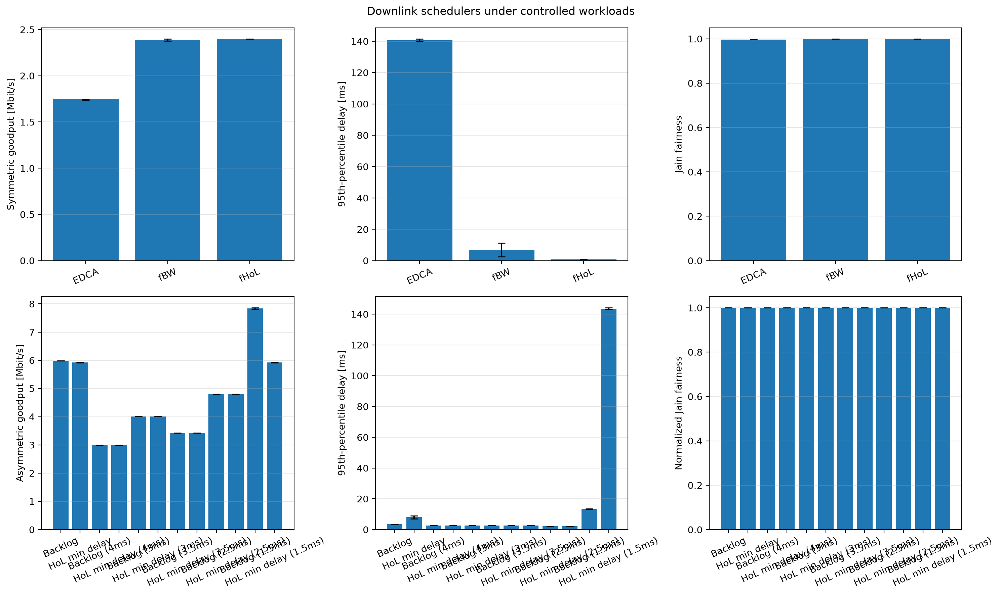

# Walkthrough: 802.11ax Downlink OFDMA

This example contains controlled downlink scheduler workloads and run-0 packet
captures. Result claims in this walkthrough refer only to the retained artifacts
listed below.

## Learning objectives and feature primer

After completing this walkthrough, the reader can:

- explain how downlink OFDMA lets an access point (AP) transmit to several
  stations in one high-efficiency multi-user (HE-MU) physical-layer protocol
  data unit (PPDU);
- distinguish equal-RU, backlog-based, head-of-line (HoL), and single-user
  Enhanced Distributed Channel Access (EDCA) configurations;
- identify simultaneous HE-MU QoS Data and the following acknowledgment
  exchange in a capture; and
- reproduce the five-run outcome queries and run-0 packet inspection.

The AP partitions channel tones into resource units (RUs), selects recipients,
and transmits separate payloads concurrently. The equal-RU `fBW` policy chooses
the widest equal layout for a subset of users; `fHoL` serves all backlogged
users using the smallest fitting layout. Backlog and HoL schedulers instead
adapt service to unequal queues. The central validation invariant is a decoded
HE-MU transmission to multiple recipients at the same timestamp, supported by
AP scheduler telemetry and application outcomes.

## Scenario description

The [network](Lan80211AxDlOfdma.ned) and [configuration](omnetpp.ini) contain
one fixed AP, three fixed stations, and a wired UDP server. The AP sits at
`(250,200)` m and the stations at three nearby coordinates; all use a 5 GHz,
20 MHz channel except the explicit 80 MHz variants. Warm-up traffic establishes
Block Ack agreements before 0.25 s. Measured server-to-station traffic starts
at 0.3 s; the run ends at 1 s and the dashboard uses `[0.3,0.88)` s.

```text
server === wired LAN === AP  -- HE downlink -->  host[0]
                               |-------------->  host[1]
                               `-------------->  host[2]
```

The geometry is stationary and close range, with no external interferer. It
isolates scheduling and queueing, but is not a coverage or coexistence study.

## Standards and INET model boundary

IEEE Std 802.11-2024 defines a downlink HE-MU PPDU as one transmitted by an HE
AP to one or more associated HE stations (definition in
`80211ax-2024:chunk:00350`). Clause 27.3.11 describes HE-SIG-B; its Common
field carries RU allocation and its User Specific fields tell recipients how
to decode their payloads (`80211ax-2024:chunk:10175`). These are normative PHY
structures.

INET's `HeHcf` and scheduler classes are model abstractions. AP-radio vectors
expose STA ID, scheduled PSDU bytes, and user PPDU duration. Radiotap directly
decodes HE-MU format and RU width for captured observations, but the capture
does not expose the scheduler's internal objective. The SU control also changes
queue organization: one shared 300-packet queue replaces three destination
queues. Outcome differences therefore cannot be attributed to frequency
partitioning alone.

## Evidence status

| Claim or check | Status | Authoritative evidence | Runs/seeds | Scope or gap |
|---|---|---|---|---|
| OFDMA treatment records HE-MU transmissions | `PASS` | run-0 AP PCAP HE PPDU format and RU decode | Packet session `20260725T230519Z`, run 0 | Direct packet observation |
| Multiple recipients share one HE-MU transmission time | `PASS` | frames 20–21 at 0.300605 s | `EqualSizedRUs_fBW`, run 0 | Two recipients, 106-tone RUs |
| Scheduler telemetry is present | `PASS` | aligned `heStaId`, `heScheduledPsduBytes`, `heUserPpduDuration` vectors | Scalar/vector session `20260725T120411Z`, runs 0–4 | Direct model telemetry |
| Equal-RU treatments improve retained symmetric outcomes | `PASS` | application goodput and per-run pooled p95 delay | Five seeds | Bounded by queue confounder |
| Scheduler objective caused a particular captured allocation | `INCONCLUSIVE` | Results and PCAP are separate sessions | — | No event-level correlation |

The dashboard computes one observation per run. Goodput sums
`packetReceived:vector(packetBytes)` at the application sinks. Delay is the
nearest-rank p95 after pooling `endToEndDelay:vector` samples within a run.
Reported uncertainty is a two-sided 95% Student-t confidence interval over runs
0–4. The scheduler telemetry contract is the timestamp-aligned AP-radio triple
`heStaId:vector`, `heScheduledPsduBytes:vector`, and
`heUserPpduDuration:vector`; these exact filters appear in the provenance file.

## Configuration matrix

The configuration facts in this table come from [the INI file](omnetpp.ini).
They describe inputs, not measured outcomes.

| Configuration family | Traffic and channel | Access/scheduler |
|---|---|---|
| `SuEdcaBaseline`, `EqualSizedRUs_fBW`, `EqualSizedRUs_fHoL` | Three 100 B flows, 1 ms interval, 20 MHz | SU EDCA control, equal-RU `fBW`, equal-RU `fHoL` |
| `BacklogBased*`, `HoLMinDelay*` | 1000/400/100 B flows; common interval 1.5, 2, 2.5, 3, 3.5, or 4 ms | Backlog-based or minimum-HoL-delay DL scheduler |
| `EqualSizedRUs80MHz_fBW`, `EqualSizedRUs80MHz_fHoL`, `SuEdcaBaseline80MHz` | Three 100 B flows, 0.25 ms interval, 80 MHz | Run-0 packet-capture comparison only in this walkthrough |

`SuEdcaBaseline` uses one shared 300-packet AC_BE pending queue. The OFDMA
configs use `HeHcf`, whose destination queues are separate. The symmetric
comparison therefore holds aggregate configured queue capacity at 300 packets
but does not isolate frequency partitioning from queue organization.

## Expected invariants and diagnostic map

| Invariant | Evidence and observation point | Failure symptom | Likely subsystem | Next diagnostic |
|---|---|---|---|---|
| AP schedules at least two users together | aligned AP-radio telemetry and same-time HE-MU frames | one STA ID or only HE-SU | DL scheduler/rate selection | inspect scheduler vectors, then AP PCAP |
| Captured users occupy valid RUs | radiotap HE format/RU fields | unknown or overlapping allocation | transmitter/recorder/typed decoder | typed-HE decode and transmitter logs |
| HE-MU data receives a response | QoS Data → MU-BAR/Block Ack timeline | missing response/retry | acknowledgment policy or reception | receiver PCAP and Block Ack logs |
| Outcome comparison uses matched inputs | provenance, result metadata, window | mismatched seed/window/load | campaign/analysis | inspect JSON hashes and run attributes |

## Reproduction

Run from the INET repository root. This minimal command was **not executed
during this rewrite**; status: `NOT RUN`.

```sh
bin/inet -u Cmdenv -f examples/ieee80211ax/dl_ofdma/omnetpp.ini \
  -c EqualSizedRUs_fBW -r 0 \
  --result-dir=/tmp/inet-dl-ofdma-equal-rus-r0
```

The scalar/vector session is historical. The suite-owned packet command below
was executed in this update with exit status 0 and created session
`20260725T230519Z`; `--allow-failed-evidence` preserves failed evidence checks
in the generated block.

```sh
MPLCONFIGDIR=/tmp/matplotlib \
  python3 examples/ieee80211/analysis/analyze_pcap.py \
  --suite examples/ieee80211/analysis/suites/ax.json \
  --generate --subdir dl_ofdma --run 0 --allow-failed-evidence
```

## Scalar and vector analysis



### Symmetric workload

| Configuration | Aggregate goodput | Pooled p95 delay |
|---|---:|---:|
| `SuEdcaBaseline` | 1.744 ± 0.005 Mbit/s | 140.695 ± 0.834 ms |
| `EqualSizedRUs_fBW` | 2.388 ± 0.009 Mbit/s | 6.954 ± 4.413 ms |
| `EqualSizedRUs_fHoL` | 2.400 ± 0.000 Mbit/s | 0.758 ± 0.032 ms |

These numbers are the bars in the top row of the retained dashboard and are
derived from the files named in its provenance. In this workload, both equal-RU
configs have greater application goodput and lower pooled p95 delay than the SU
control. That statement is limited to these configurations because their queue
organizations differ.

### Asymmetric workload

| Scheduler pair | Interval | Backlog goodput / p95 | HoL goodput / p95 |
|---|---:|---:|---:|
| base | 2 ms | 5.979 ± 0.000 Mbit/s / 3.387 ± 0.022 ms | 5.926 ± 0.014 Mbit/s / 7.985 ± 0.908 ms |
| `*1_5ms` | 1.5 ms | 7.833 ± 0.029 Mbit/s / 13.256 ± 0.176 ms | 5.926 ± 0.014 Mbit/s / 143.584 ± 0.564 ms |
| `*2_5ms` | 2.5 ms | 4.800 ± 0.000 Mbit/s / 2.147 ± 0.009 ms | 4.800 ± 0.000 Mbit/s / 2.147 ± 0.009 ms |
| `*3ms` | 3 ms | 4.007 ± 0.000 Mbit/s / 2.556 ± 0.020 ms | 4.007 ± 0.000 Mbit/s / 2.556 ± 0.020 ms |
| `*3_5ms` | 3.5 ms | 3.421 ± 0.000 Mbit/s / 2.554 ± 0.018 ms | 3.421 ± 0.000 Mbit/s / 2.554 ± 0.018 ms |
| `*4ms` | 4 ms | 3.000 ± 0.000 Mbit/s / 2.553 ± 0.010 ms | 3.000 ± 0.000 Mbit/s / 2.553 ± 0.010 ms |

The bottom-row dashboard bars and the session files support two bounded
observations: the scheduler results separate at 1.5 and 2 ms, while the paired
aggregate goodput and pooled p95 values are equal at 2.5 ms and longer
intervals. Pooled p95 combines samples from flows with different packet sizes
and must not be read as a per-flow percentile.
For the asymmetric workload, Jain fairness is computed after dividing each
station's goodput by its offered rate. This prevents a scheduler from appearing
unfair merely because it respects unequal demand; it does not make one
scheduling objective universally preferable.

### Regeneration and result inspection

Regenerate the five-run result group and validate the checked-in dashboard:

```sh
python3 examples/ieee80211ax/analysis/run_campaign.py dl -j$(nproc)
MPLCONFIGDIR=/tmp/matplotlib \
  python3 examples/ieee80211ax/analysis/first_tranche.py dl --check
```

Inspect the result names without selecting unrelated metrics:

```sh
opp_scavetool query -l \
  -f 'name =~ "packetReceived:vector(packetBytes)" OR name =~ "endToEndDelay:vector" OR name =~ "heStaId:vector" OR name =~ "heScheduledPsduBytes:vector" OR name =~ "heUserPpduDuration:vector"' \
  examples/ieee80211ax/dl_ofdma/results/scalar-vector/20260725T120411Z/*/*.sca \
  examples/ieee80211ax/dl_ofdma/results/scalar-vector/20260725T120411Z/*/*.vec
```

Regenerate the run-0 capture appendix:

```sh
MPLCONFIGDIR=/tmp/matplotlib \
  python3 examples/ieee80211/analysis/analyze_pcap.py \
  --suite examples/ieee80211/analysis/suites/ax.json \
  --generate --subdir dl_ofdma --run 0 --update-walkthrough
```

The packet tables are observation-point evidence. A Trigger or Multi-STA Block
Ack row establishes that the frame subtype was observed at the recorded
interface; it does not by itself establish application delivery or explain a
scheduler decision. The scalar/vector dashboard supplies the application result
evidence.

<!-- BEGIN GENERATED: ieee80211-scalar-vector-dl -->
### Generated scalar/vector plot and table


Figure provenance: [`../analysis/figures/dl/dl-scheduler-dashboard.png.json`](../analysis/figures/dl/dl-scheduler-dashboard.png.json). Run-level metric source: [`../analysis/metrics.json`](../analysis/metrics.json).

| Configuration or comparison | Metric | Source result filters / modules / units | Window / per-run aggregation / exclusions | Independent runs (n) | Mean or direct value | 95% CI half-width |
|---|---|---|---|---:|---:|---:|
| Backlog | delay p95 ms | vector / **.app[*] / packetReceived:vector(packetBytes) / unit=B<br>vector / **.app[*] / endToEndDelay:vector / unit=s<br>vector / **.ap.wlan[0].radio / heStaId:vector<br>vector / **.ap.wlan[0].radio / heScheduledPsduBytes:vector / unit=B<br>vector / **.ap.wlan[0].radio / heUserPpduDuration:vector / unit=s | [0.3, 0.88) s; delay=pooled packet p95 within run; observation=one per run; per_user=STA-ID aligned scheduled PSDU bytes and PPDU duration; uncertainty=95% Student-t CI | 5 | 3.38742 | 0.0215225 |
| Backlog | goodput mbps | vector / **.app[*] / packetReceived:vector(packetBytes) / unit=B<br>vector / **.app[*] / endToEndDelay:vector / unit=s<br>vector / **.ap.wlan[0].radio / heStaId:vector<br>vector / **.ap.wlan[0].radio / heScheduledPsduBytes:vector / unit=B<br>vector / **.ap.wlan[0].radio / heUserPpduDuration:vector / unit=s | [0.3, 0.88) s; delay=pooled packet p95 within run; observation=one per run; per_user=STA-ID aligned scheduled PSDU bytes and PPDU duration; uncertainty=95% Student-t CI | 5 | 5.97931 | 0 |
| Backlog | jain fairness | vector / **.app[*] / packetReceived:vector(packetBytes) / unit=B<br>vector / **.app[*] / endToEndDelay:vector / unit=s<br>vector / **.ap.wlan[0].radio / heStaId:vector<br>vector / **.ap.wlan[0].radio / heScheduledPsduBytes:vector / unit=B<br>vector / **.ap.wlan[0].radio / heUserPpduDuration:vector / unit=s | [0.3, 0.88) s; delay=pooled packet p95 within run; observation=one per run; per_user=STA-ID aligned scheduled PSDU bytes and PPDU duration; uncertainty=95% Student-t CI | 5 | 1 | 0 |
| Backlog (1.5ms) | delay p95 ms | vector / **.app[*] / packetReceived:vector(packetBytes) / unit=B<br>vector / **.app[*] / endToEndDelay:vector / unit=s<br>vector / **.ap.wlan[0].radio / heStaId:vector<br>vector / **.ap.wlan[0].radio / heScheduledPsduBytes:vector / unit=B<br>vector / **.ap.wlan[0].radio / heUserPpduDuration:vector / unit=s | [0.3, 0.88) s; delay=pooled packet p95 within run; observation=one per run; per_user=STA-ID aligned scheduled PSDU bytes and PPDU duration; uncertainty=95% Student-t CI | 5 | 13.2563 | 0.175576 |
| Backlog (1.5ms) | goodput mbps | vector / **.app[*] / packetReceived:vector(packetBytes) / unit=B<br>vector / **.app[*] / endToEndDelay:vector / unit=s<br>vector / **.ap.wlan[0].radio / heStaId:vector<br>vector / **.ap.wlan[0].radio / heScheduledPsduBytes:vector / unit=B<br>vector / **.ap.wlan[0].radio / heUserPpduDuration:vector / unit=s | [0.3, 0.88) s; delay=pooled packet p95 within run; observation=one per run; per_user=STA-ID aligned scheduled PSDU bytes and PPDU duration; uncertainty=95% Student-t CI | 5 | 7.8331 | 0.0292907 |
| Backlog (1.5ms) | jain fairness | vector / **.app[*] / packetReceived:vector(packetBytes) / unit=B<br>vector / **.app[*] / endToEndDelay:vector / unit=s<br>vector / **.ap.wlan[0].radio / heStaId:vector<br>vector / **.ap.wlan[0].radio / heScheduledPsduBytes:vector / unit=B<br>vector / **.ap.wlan[0].radio / heUserPpduDuration:vector / unit=s | [0.3, 0.88) s; delay=pooled packet p95 within run; observation=one per run; per_user=STA-ID aligned scheduled PSDU bytes and PPDU duration; uncertainty=95% Student-t CI | 5 | 0.999986 | 1.03586e-07 |
| Backlog (2.5ms) | delay p95 ms | vector / **.app[*] / packetReceived:vector(packetBytes) / unit=B<br>vector / **.app[*] / endToEndDelay:vector / unit=s<br>vector / **.ap.wlan[0].radio / heStaId:vector<br>vector / **.ap.wlan[0].radio / heScheduledPsduBytes:vector / unit=B<br>vector / **.ap.wlan[0].radio / heUserPpduDuration:vector / unit=s | [0.3, 0.88) s; delay=pooled packet p95 within run; observation=one per run; per_user=STA-ID aligned scheduled PSDU bytes and PPDU duration; uncertainty=95% Student-t CI | 5 | 2.14726 | 0.00927856 |
| Backlog (2.5ms) | goodput mbps | vector / **.app[*] / packetReceived:vector(packetBytes) / unit=B<br>vector / **.app[*] / endToEndDelay:vector / unit=s<br>vector / **.ap.wlan[0].radio / heStaId:vector<br>vector / **.ap.wlan[0].radio / heScheduledPsduBytes:vector / unit=B<br>vector / **.ap.wlan[0].radio / heUserPpduDuration:vector / unit=s | [0.3, 0.88) s; delay=pooled packet p95 within run; observation=one per run; per_user=STA-ID aligned scheduled PSDU bytes and PPDU duration; uncertainty=95% Student-t CI | 5 | 4.8 | 0 |
| Backlog (2.5ms) | jain fairness | vector / **.app[*] / packetReceived:vector(packetBytes) / unit=B<br>vector / **.app[*] / endToEndDelay:vector / unit=s<br>vector / **.ap.wlan[0].radio / heStaId:vector<br>vector / **.ap.wlan[0].radio / heScheduledPsduBytes:vector / unit=B<br>vector / **.ap.wlan[0].radio / heUserPpduDuration:vector / unit=s | [0.3, 0.88) s; delay=pooled packet p95 within run; observation=one per run; per_user=STA-ID aligned scheduled PSDU bytes and PPDU duration; uncertainty=95% Student-t CI | 5 | 1 | 0 |
| Backlog (3.5ms) | delay p95 ms | vector / **.app[*] / packetReceived:vector(packetBytes) / unit=B<br>vector / **.app[*] / endToEndDelay:vector / unit=s<br>vector / **.ap.wlan[0].radio / heStaId:vector<br>vector / **.ap.wlan[0].radio / heScheduledPsduBytes:vector / unit=B<br>vector / **.ap.wlan[0].radio / heUserPpduDuration:vector / unit=s | [0.3, 0.88) s; delay=pooled packet p95 within run; observation=one per run; per_user=STA-ID aligned scheduled PSDU bytes and PPDU duration; uncertainty=95% Student-t CI | 5 | 2.55426 | 0.0176409 |
| Backlog (3.5ms) | goodput mbps | vector / **.app[*] / packetReceived:vector(packetBytes) / unit=B<br>vector / **.app[*] / endToEndDelay:vector / unit=s<br>vector / **.ap.wlan[0].radio / heStaId:vector<br>vector / **.ap.wlan[0].radio / heScheduledPsduBytes:vector / unit=B<br>vector / **.ap.wlan[0].radio / heUserPpduDuration:vector / unit=s | [0.3, 0.88) s; delay=pooled packet p95 within run; observation=one per run; per_user=STA-ID aligned scheduled PSDU bytes and PPDU duration; uncertainty=95% Student-t CI | 5 | 3.42069 | 6.16495e-16 |
| Backlog (3.5ms) | jain fairness | vector / **.app[*] / packetReceived:vector(packetBytes) / unit=B<br>vector / **.app[*] / endToEndDelay:vector / unit=s<br>vector / **.ap.wlan[0].radio / heStaId:vector<br>vector / **.ap.wlan[0].radio / heScheduledPsduBytes:vector / unit=B<br>vector / **.ap.wlan[0].radio / heUserPpduDuration:vector / unit=s | [0.3, 0.88) s; delay=pooled packet p95 within run; observation=one per run; per_user=STA-ID aligned scheduled PSDU bytes and PPDU duration; uncertainty=95% Student-t CI | 5 | 0.999992 | 0 |
| Backlog (3ms) | delay p95 ms | vector / **.app[*] / packetReceived:vector(packetBytes) / unit=B<br>vector / **.app[*] / endToEndDelay:vector / unit=s<br>vector / **.ap.wlan[0].radio / heStaId:vector<br>vector / **.ap.wlan[0].radio / heScheduledPsduBytes:vector / unit=B<br>vector / **.ap.wlan[0].radio / heUserPpduDuration:vector / unit=s | [0.3, 0.88) s; delay=pooled packet p95 within run; observation=one per run; per_user=STA-ID aligned scheduled PSDU bytes and PPDU duration; uncertainty=95% Student-t CI | 5 | 2.55561 | 0.0198831 |
| Backlog (3ms) | goodput mbps | vector / **.app[*] / packetReceived:vector(packetBytes) / unit=B<br>vector / **.app[*] / endToEndDelay:vector / unit=s<br>vector / **.ap.wlan[0].radio / heStaId:vector<br>vector / **.ap.wlan[0].radio / heScheduledPsduBytes:vector / unit=B<br>vector / **.ap.wlan[0].radio / heUserPpduDuration:vector / unit=s | [0.3, 0.88) s; delay=pooled packet p95 within run; observation=one per run; per_user=STA-ID aligned scheduled PSDU bytes and PPDU duration; uncertainty=95% Student-t CI | 5 | 4.0069 | 0 |
| Backlog (3ms) | jain fairness | vector / **.app[*] / packetReceived:vector(packetBytes) / unit=B<br>vector / **.app[*] / endToEndDelay:vector / unit=s<br>vector / **.ap.wlan[0].radio / heStaId:vector<br>vector / **.ap.wlan[0].radio / heScheduledPsduBytes:vector / unit=B<br>vector / **.ap.wlan[0].radio / heUserPpduDuration:vector / unit=s | [0.3, 0.88) s; delay=pooled packet p95 within run; observation=one per run; per_user=STA-ID aligned scheduled PSDU bytes and PPDU duration; uncertainty=95% Student-t CI | 5 | 0.999994 | 0 |
| Backlog (4ms) | delay p95 ms | vector / **.app[*] / packetReceived:vector(packetBytes) / unit=B<br>vector / **.app[*] / endToEndDelay:vector / unit=s<br>vector / **.ap.wlan[0].radio / heStaId:vector<br>vector / **.ap.wlan[0].radio / heScheduledPsduBytes:vector / unit=B<br>vector / **.ap.wlan[0].radio / heUserPpduDuration:vector / unit=s | [0.3, 0.88) s; delay=pooled packet p95 within run; observation=one per run; per_user=STA-ID aligned scheduled PSDU bytes and PPDU duration; uncertainty=95% Student-t CI | 5 | 2.55264 | 0.0096455 |
| Backlog (4ms) | goodput mbps | vector / **.app[*] / packetReceived:vector(packetBytes) / unit=B<br>vector / **.app[*] / endToEndDelay:vector / unit=s<br>vector / **.ap.wlan[0].radio / heStaId:vector<br>vector / **.ap.wlan[0].radio / heScheduledPsduBytes:vector / unit=B<br>vector / **.ap.wlan[0].radio / heUserPpduDuration:vector / unit=s | [0.3, 0.88) s; delay=pooled packet p95 within run; observation=one per run; per_user=STA-ID aligned scheduled PSDU bytes and PPDU duration; uncertainty=95% Student-t CI | 5 | 3 | 0 |
| Backlog (4ms) | jain fairness | vector / **.app[*] / packetReceived:vector(packetBytes) / unit=B<br>vector / **.app[*] / endToEndDelay:vector / unit=s<br>vector / **.ap.wlan[0].radio / heStaId:vector<br>vector / **.ap.wlan[0].radio / heScheduledPsduBytes:vector / unit=B<br>vector / **.ap.wlan[0].radio / heUserPpduDuration:vector / unit=s | [0.3, 0.88) s; delay=pooled packet p95 within run; observation=one per run; per_user=STA-ID aligned scheduled PSDU bytes and PPDU duration; uncertainty=95% Student-t CI | 5 | 1 | 0 |
| EDCA | delay p95 ms | vector / **.app[*] / packetReceived:vector(packetBytes) / unit=B<br>vector / **.app[*] / endToEndDelay:vector / unit=s<br>vector / **.ap.wlan[0].radio / heStaId:vector<br>vector / **.ap.wlan[0].radio / heScheduledPsduBytes:vector / unit=B<br>vector / **.ap.wlan[0].radio / heUserPpduDuration:vector / unit=s | [0.3, 0.88) s; delay=pooled packet p95 within run; observation=one per run; per_user=STA-ID aligned scheduled PSDU bytes and PPDU duration; uncertainty=95% Student-t CI | 5 | 140.695 | 0.833888 |
| EDCA | goodput mbps | vector / **.app[*] / packetReceived:vector(packetBytes) / unit=B<br>vector / **.app[*] / endToEndDelay:vector / unit=s<br>vector / **.ap.wlan[0].radio / heStaId:vector<br>vector / **.ap.wlan[0].radio / heScheduledPsduBytes:vector / unit=B<br>vector / **.ap.wlan[0].radio / heUserPpduDuration:vector / unit=s | [0.3, 0.88) s; delay=pooled packet p95 within run; observation=one per run; per_user=STA-ID aligned scheduled PSDU bytes and PPDU duration; uncertainty=95% Student-t CI | 5 | 1.74428 | 0.00549648 |
| EDCA | jain fairness | vector / **.app[*] / packetReceived:vector(packetBytes) / unit=B<br>vector / **.app[*] / endToEndDelay:vector / unit=s<br>vector / **.ap.wlan[0].radio / heStaId:vector<br>vector / **.ap.wlan[0].radio / heScheduledPsduBytes:vector / unit=B<br>vector / **.ap.wlan[0].radio / heUserPpduDuration:vector / unit=s | [0.3, 0.88) s; delay=pooled packet p95 within run; observation=one per run; per_user=STA-ID aligned scheduled PSDU bytes and PPDU duration; uncertainty=95% Student-t CI | 5 | 0.996821 | 0.000505725 |
| HoL min delay | delay p95 ms | vector / **.app[*] / packetReceived:vector(packetBytes) / unit=B<br>vector / **.app[*] / endToEndDelay:vector / unit=s<br>vector / **.ap.wlan[0].radio / heStaId:vector<br>vector / **.ap.wlan[0].radio / heScheduledPsduBytes:vector / unit=B<br>vector / **.ap.wlan[0].radio / heUserPpduDuration:vector / unit=s | [0.3, 0.88) s; delay=pooled packet p95 within run; observation=one per run; per_user=STA-ID aligned scheduled PSDU bytes and PPDU duration; uncertainty=95% Student-t CI | 5 | 7.98526 | 0.908104 |
| HoL min delay | goodput mbps | vector / **.app[*] / packetReceived:vector(packetBytes) / unit=B<br>vector / **.app[*] / endToEndDelay:vector / unit=s<br>vector / **.ap.wlan[0].radio / heStaId:vector<br>vector / **.ap.wlan[0].radio / heScheduledPsduBytes:vector / unit=B<br>vector / **.ap.wlan[0].radio / heUserPpduDuration:vector / unit=s | [0.3, 0.88) s; delay=pooled packet p95 within run; observation=one per run; per_user=STA-ID aligned scheduled PSDU bytes and PPDU duration; uncertainty=95% Student-t CI | 5 | 5.92552 | 0.0140708 |
| HoL min delay | jain fairness | vector / **.app[*] / packetReceived:vector(packetBytes) / unit=B<br>vector / **.app[*] / endToEndDelay:vector / unit=s<br>vector / **.ap.wlan[0].radio / heStaId:vector<br>vector / **.ap.wlan[0].radio / heScheduledPsduBytes:vector / unit=B<br>vector / **.ap.wlan[0].radio / heUserPpduDuration:vector / unit=s | [0.3, 0.88) s; delay=pooled packet p95 within run; observation=one per run; per_user=STA-ID aligned scheduled PSDU bytes and PPDU duration; uncertainty=95% Student-t CI | 5 | 1 | 1.94953e-16 |
| HoL min delay (1.5ms) | delay p95 ms | vector / **.app[*] / packetReceived:vector(packetBytes) / unit=B<br>vector / **.app[*] / endToEndDelay:vector / unit=s<br>vector / **.ap.wlan[0].radio / heStaId:vector<br>vector / **.ap.wlan[0].radio / heScheduledPsduBytes:vector / unit=B<br>vector / **.ap.wlan[0].radio / heUserPpduDuration:vector / unit=s | [0.3, 0.88) s; delay=pooled packet p95 within run; observation=one per run; per_user=STA-ID aligned scheduled PSDU bytes and PPDU duration; uncertainty=95% Student-t CI | 5 | 143.584 | 0.564095 |
| HoL min delay (1.5ms) | goodput mbps | vector / **.app[*] / packetReceived:vector(packetBytes) / unit=B<br>vector / **.app[*] / endToEndDelay:vector / unit=s<br>vector / **.ap.wlan[0].radio / heStaId:vector<br>vector / **.ap.wlan[0].radio / heScheduledPsduBytes:vector / unit=B<br>vector / **.ap.wlan[0].radio / heUserPpduDuration:vector / unit=s | [0.3, 0.88) s; delay=pooled packet p95 within run; observation=one per run; per_user=STA-ID aligned scheduled PSDU bytes and PPDU duration; uncertainty=95% Student-t CI | 5 | 5.92552 | 0.0140708 |
| HoL min delay (1.5ms) | jain fairness | vector / **.app[*] / packetReceived:vector(packetBytes) / unit=B<br>vector / **.app[*] / endToEndDelay:vector / unit=s<br>vector / **.ap.wlan[0].radio / heStaId:vector<br>vector / **.ap.wlan[0].radio / heScheduledPsduBytes:vector / unit=B<br>vector / **.ap.wlan[0].radio / heUserPpduDuration:vector / unit=s | [0.3, 0.88) s; delay=pooled packet p95 within run; observation=one per run; per_user=STA-ID aligned scheduled PSDU bytes and PPDU duration; uncertainty=95% Student-t CI | 5 | 1 | 9.74764e-17 |
| HoL min delay (2.5ms) | delay p95 ms | vector / **.app[*] / packetReceived:vector(packetBytes) / unit=B<br>vector / **.app[*] / endToEndDelay:vector / unit=s<br>vector / **.ap.wlan[0].radio / heStaId:vector<br>vector / **.ap.wlan[0].radio / heScheduledPsduBytes:vector / unit=B<br>vector / **.ap.wlan[0].radio / heUserPpduDuration:vector / unit=s | [0.3, 0.88) s; delay=pooled packet p95 within run; observation=one per run; per_user=STA-ID aligned scheduled PSDU bytes and PPDU duration; uncertainty=95% Student-t CI | 5 | 2.14726 | 0.00927856 |
| HoL min delay (2.5ms) | goodput mbps | vector / **.app[*] / packetReceived:vector(packetBytes) / unit=B<br>vector / **.app[*] / endToEndDelay:vector / unit=s<br>vector / **.ap.wlan[0].radio / heStaId:vector<br>vector / **.ap.wlan[0].radio / heScheduledPsduBytes:vector / unit=B<br>vector / **.ap.wlan[0].radio / heUserPpduDuration:vector / unit=s | [0.3, 0.88) s; delay=pooled packet p95 within run; observation=one per run; per_user=STA-ID aligned scheduled PSDU bytes and PPDU duration; uncertainty=95% Student-t CI | 5 | 4.8 | 0 |
| HoL min delay (2.5ms) | jain fairness | vector / **.app[*] / packetReceived:vector(packetBytes) / unit=B<br>vector / **.app[*] / endToEndDelay:vector / unit=s<br>vector / **.ap.wlan[0].radio / heStaId:vector<br>vector / **.ap.wlan[0].radio / heScheduledPsduBytes:vector / unit=B<br>vector / **.ap.wlan[0].radio / heUserPpduDuration:vector / unit=s | [0.3, 0.88) s; delay=pooled packet p95 within run; observation=one per run; per_user=STA-ID aligned scheduled PSDU bytes and PPDU duration; uncertainty=95% Student-t CI | 5 | 1 | 0 |
| HoL min delay (3.5ms) | delay p95 ms | vector / **.app[*] / packetReceived:vector(packetBytes) / unit=B<br>vector / **.app[*] / endToEndDelay:vector / unit=s<br>vector / **.ap.wlan[0].radio / heStaId:vector<br>vector / **.ap.wlan[0].radio / heScheduledPsduBytes:vector / unit=B<br>vector / **.ap.wlan[0].radio / heUserPpduDuration:vector / unit=s | [0.3, 0.88) s; delay=pooled packet p95 within run; observation=one per run; per_user=STA-ID aligned scheduled PSDU bytes and PPDU duration; uncertainty=95% Student-t CI | 5 | 2.55426 | 0.0176409 |
| HoL min delay (3.5ms) | goodput mbps | vector / **.app[*] / packetReceived:vector(packetBytes) / unit=B<br>vector / **.app[*] / endToEndDelay:vector / unit=s<br>vector / **.ap.wlan[0].radio / heStaId:vector<br>vector / **.ap.wlan[0].radio / heScheduledPsduBytes:vector / unit=B<br>vector / **.ap.wlan[0].radio / heUserPpduDuration:vector / unit=s | [0.3, 0.88) s; delay=pooled packet p95 within run; observation=one per run; per_user=STA-ID aligned scheduled PSDU bytes and PPDU duration; uncertainty=95% Student-t CI | 5 | 3.42069 | 6.16495e-16 |
| HoL min delay (3.5ms) | jain fairness | vector / **.app[*] / packetReceived:vector(packetBytes) / unit=B<br>vector / **.app[*] / endToEndDelay:vector / unit=s<br>vector / **.ap.wlan[0].radio / heStaId:vector<br>vector / **.ap.wlan[0].radio / heScheduledPsduBytes:vector / unit=B<br>vector / **.ap.wlan[0].radio / heUserPpduDuration:vector / unit=s | [0.3, 0.88) s; delay=pooled packet p95 within run; observation=one per run; per_user=STA-ID aligned scheduled PSDU bytes and PPDU duration; uncertainty=95% Student-t CI | 5 | 0.999992 | 0 |
| HoL min delay (3ms) | delay p95 ms | vector / **.app[*] / packetReceived:vector(packetBytes) / unit=B<br>vector / **.app[*] / endToEndDelay:vector / unit=s<br>vector / **.ap.wlan[0].radio / heStaId:vector<br>vector / **.ap.wlan[0].radio / heScheduledPsduBytes:vector / unit=B<br>vector / **.ap.wlan[0].radio / heUserPpduDuration:vector / unit=s | [0.3, 0.88) s; delay=pooled packet p95 within run; observation=one per run; per_user=STA-ID aligned scheduled PSDU bytes and PPDU duration; uncertainty=95% Student-t CI | 5 | 2.55561 | 0.0198831 |
| HoL min delay (3ms) | goodput mbps | vector / **.app[*] / packetReceived:vector(packetBytes) / unit=B<br>vector / **.app[*] / endToEndDelay:vector / unit=s<br>vector / **.ap.wlan[0].radio / heStaId:vector<br>vector / **.ap.wlan[0].radio / heScheduledPsduBytes:vector / unit=B<br>vector / **.ap.wlan[0].radio / heUserPpduDuration:vector / unit=s | [0.3, 0.88) s; delay=pooled packet p95 within run; observation=one per run; per_user=STA-ID aligned scheduled PSDU bytes and PPDU duration; uncertainty=95% Student-t CI | 5 | 4.0069 | 0 |
| HoL min delay (3ms) | jain fairness | vector / **.app[*] / packetReceived:vector(packetBytes) / unit=B<br>vector / **.app[*] / endToEndDelay:vector / unit=s<br>vector / **.ap.wlan[0].radio / heStaId:vector<br>vector / **.ap.wlan[0].radio / heScheduledPsduBytes:vector / unit=B<br>vector / **.ap.wlan[0].radio / heUserPpduDuration:vector / unit=s | [0.3, 0.88) s; delay=pooled packet p95 within run; observation=one per run; per_user=STA-ID aligned scheduled PSDU bytes and PPDU duration; uncertainty=95% Student-t CI | 5 | 0.999994 | 0 |
| HoL min delay (4ms) | delay p95 ms | vector / **.app[*] / packetReceived:vector(packetBytes) / unit=B<br>vector / **.app[*] / endToEndDelay:vector / unit=s<br>vector / **.ap.wlan[0].radio / heStaId:vector<br>vector / **.ap.wlan[0].radio / heScheduledPsduBytes:vector / unit=B<br>vector / **.ap.wlan[0].radio / heUserPpduDuration:vector / unit=s | [0.3, 0.88) s; delay=pooled packet p95 within run; observation=one per run; per_user=STA-ID aligned scheduled PSDU bytes and PPDU duration; uncertainty=95% Student-t CI | 5 | 2.55264 | 0.0096455 |
| HoL min delay (4ms) | goodput mbps | vector / **.app[*] / packetReceived:vector(packetBytes) / unit=B<br>vector / **.app[*] / endToEndDelay:vector / unit=s<br>vector / **.ap.wlan[0].radio / heStaId:vector<br>vector / **.ap.wlan[0].radio / heScheduledPsduBytes:vector / unit=B<br>vector / **.ap.wlan[0].radio / heUserPpduDuration:vector / unit=s | [0.3, 0.88) s; delay=pooled packet p95 within run; observation=one per run; per_user=STA-ID aligned scheduled PSDU bytes and PPDU duration; uncertainty=95% Student-t CI | 5 | 3 | 0 |
| HoL min delay (4ms) | jain fairness | vector / **.app[*] / packetReceived:vector(packetBytes) / unit=B<br>vector / **.app[*] / endToEndDelay:vector / unit=s<br>vector / **.ap.wlan[0].radio / heStaId:vector<br>vector / **.ap.wlan[0].radio / heScheduledPsduBytes:vector / unit=B<br>vector / **.ap.wlan[0].radio / heUserPpduDuration:vector / unit=s | [0.3, 0.88) s; delay=pooled packet p95 within run; observation=one per run; per_user=STA-ID aligned scheduled PSDU bytes and PPDU duration; uncertainty=95% Student-t CI | 5 | 1 | 0 |
| fBW | delay p95 ms | vector / **.app[*] / packetReceived:vector(packetBytes) / unit=B<br>vector / **.app[*] / endToEndDelay:vector / unit=s<br>vector / **.ap.wlan[0].radio / heStaId:vector<br>vector / **.ap.wlan[0].radio / heScheduledPsduBytes:vector / unit=B<br>vector / **.ap.wlan[0].radio / heUserPpduDuration:vector / unit=s | [0.3, 0.88) s; delay=pooled packet p95 within run; observation=one per run; per_user=STA-ID aligned scheduled PSDU bytes and PPDU duration; uncertainty=95% Student-t CI | 5 | 6.9538 | 4.41329 |
| fBW | goodput mbps | vector / **.app[*] / packetReceived:vector(packetBytes) / unit=B<br>vector / **.app[*] / endToEndDelay:vector / unit=s<br>vector / **.ap.wlan[0].radio / heStaId:vector<br>vector / **.ap.wlan[0].radio / heScheduledPsduBytes:vector / unit=B<br>vector / **.ap.wlan[0].radio / heUserPpduDuration:vector / unit=s | [0.3, 0.88) s; delay=pooled packet p95 within run; observation=one per run; per_user=STA-ID aligned scheduled PSDU bytes and PPDU duration; uncertainty=95% Student-t CI | 5 | 2.38759 | 0.00938052 |
| fBW | jain fairness | vector / **.app[*] / packetReceived:vector(packetBytes) / unit=B<br>vector / **.app[*] / endToEndDelay:vector / unit=s<br>vector / **.ap.wlan[0].radio / heStaId:vector<br>vector / **.ap.wlan[0].radio / heScheduledPsduBytes:vector / unit=B<br>vector / **.ap.wlan[0].radio / heUserPpduDuration:vector / unit=s | [0.3, 0.88) s; delay=pooled packet p95 within run; observation=one per run; per_user=STA-ID aligned scheduled PSDU bytes and PPDU duration; uncertainty=95% Student-t CI | 5 | 0.99993 | 6.66467e-05 |
| fHoL | delay p95 ms | vector / **.app[*] / packetReceived:vector(packetBytes) / unit=B<br>vector / **.app[*] / endToEndDelay:vector / unit=s<br>vector / **.ap.wlan[0].radio / heStaId:vector<br>vector / **.ap.wlan[0].radio / heScheduledPsduBytes:vector / unit=B<br>vector / **.ap.wlan[0].radio / heUserPpduDuration:vector / unit=s | [0.3, 0.88) s; delay=pooled packet p95 within run; observation=one per run; per_user=STA-ID aligned scheduled PSDU bytes and PPDU duration; uncertainty=95% Student-t CI | 5 | 0.758235 | 0.0317215 |
| fHoL | goodput mbps | vector / **.app[*] / packetReceived:vector(packetBytes) / unit=B<br>vector / **.app[*] / endToEndDelay:vector / unit=s<br>vector / **.ap.wlan[0].radio / heStaId:vector<br>vector / **.ap.wlan[0].radio / heScheduledPsduBytes:vector / unit=B<br>vector / **.ap.wlan[0].radio / heUserPpduDuration:vector / unit=s | [0.3, 0.88) s; delay=pooled packet p95 within run; observation=one per run; per_user=STA-ID aligned scheduled PSDU bytes and PPDU duration; uncertainty=95% Student-t CI | 5 | 2.4 | 0 |
| fHoL | jain fairness | vector / **.app[*] / packetReceived:vector(packetBytes) / unit=B<br>vector / **.app[*] / endToEndDelay:vector / unit=s<br>vector / **.ap.wlan[0].radio / heStaId:vector<br>vector / **.ap.wlan[0].radio / heScheduledPsduBytes:vector / unit=B<br>vector / **.ap.wlan[0].radio / heUserPpduDuration:vector / unit=s | [0.3, 0.88) s; delay=pooled packet p95 within run; observation=one per run; per_user=STA-ID aligned scheduled PSDU bytes and PPDU duration; uncertainty=95% Student-t CI | 5 | 1 | 0 |

The table is a presentation view of the session-bound run-level summary. The source and aggregation columns reproduce the bundle-level figure provenance; the authored analysis identifies which source supports each metric and supplies the interpretation.
<!-- END GENERATED: ieee80211-scalar-vector-dl -->

## PCAP statistics

Capture point: `Lan80211AxDlOfdma.ap.wlan[0]`, with per-host captures retained.
Capture session: `results/packet-statistics/20260725T230519Z`.
Decode scope: captured transmission/MPDU observations, TShark 4.6.4; HE fields
are reported only when radiotap marks them known.

```sh
tshark -n -r \
  'examples/ieee80211ax/dl_ofdma/results/packet-statistics/20260725T230519Z/EqualSizedRUs_fBW/EqualSizedRUs_fBW-#0Lan80211AxDlOfdma.ap.wlan[0].pcap' \
  -q -z io,stat,0,'radiotap.he.data_1.ppdu_format == 2','wlan.fc.type_subtype == 0x19'
```

| Configuration | Observation count | Relevant frame/PHY summary | Interpretation limit |
|---|---:|---|---|
| `EqualSizedRUs_fBW` | 4,414 | HE-MU QoS Data, MU-BAR, Block Ack | no scheduler intent in subtype totals |
| `SuEdcaBaseline` | 1,790 | SU control observations | queue organization also differs |
| Generated DL set | nonempty | typed HE fields when known | run 0 only |

The generated check below also records a `FAIL`: recipient addresses do not
support reliable per-flow grouping for all HE-MU observations. Application
sink vectors remain authoritative for per-flow outcomes.

<!-- BEGIN GENERATED: ieee80211ax-pcap-statistics -->
### Generated PCAP plots and tables


Figure provenance: [`packet_statistics.png.json`](../analysis/figures/dl_ofdma/packet_statistics.png.json).

This section provides a statistical overview of the 802.11 frames transmitted over the wireless medium during the simulation. The packet counts were gathered from AP wireless-interface observation points. With multiple AP captures, one medium transmission may be observed at more than one AP; counts and airtime therefore represent recorded transmission observations, not de-duplicated application packets.

Capture session `20260725T230519Z` was generated from fresh PCAPng input with `TShark (Wireshark) 4.6.4.`. The selected manifest is `examples/ieee80211/analysis/generated/ax/pcapmanifests/20260725T230519Z.json` (SHA-256 `2a53cc9c6b0de1ab9fdd94c2a7a8d81485a76e97c34d0d952eeab47d8193d5fa`). HE PPDU format, MCS, coding, bandwidth/RU, GI, and NSTS are decoded directly from standards-compliant radiotap HE fields; values not marked known by the recorder are omitted.

Two estimated airtime occupancy percentages are provided. HE-SU and HE-ER-SU use the modeled 36/44 µs preambles; a dissector-expanded A-MPDU is charged one shared preamble. HE MU/TB user-dependent signaling not exposed by radiotap remains approximate.
- **Air Time %**: This frame type's share of the sum of all estimated frame airtimes.
- **Air Time (Sim Time) %**: The sum of this frame type's estimated airtimes divided by the simulation time limit. Concurrent transmissions from multiple capture points are counted separately, so this value can exceed 100%; it is not the union of busy channel time.

#### Compact cross-configuration summary

| Configuration | Observation point / counting unit | Selection/filter | Observations | Dominant decoded frame/PHY evidence | Estimated airtime / sim time | Limits |
|---|---|---|---:|---|---:|---|
| `BacklogBased` | AP interface(s); capture observations<br>`examples/ieee80211ax/dl_ofdma/results/packet-statistics/20260725T230519Z/BacklogBased/BacklogBased-#0Lan80211AxDlOfdma.ap.wlan[0].pcap` | `none (all decoded frames)` | 2432 | Data: QoS Data [HE-MU, HE-MCS 1, 52-tone RU, GI 3.2 us, LDPC, A-MPDU] (350), Data: QoS Data [HE-MU, HE-MCS 1, 26-tone RU, GI 3.2 us, LDPC, A-MPDU] (348), Data: QoS Data [HE-MU, HE-MCS 1, 106-tone RU, GI 3.2 us, LDPC, A-MPDU] (348) | 147.84% | Not delivery or de-duplicated transmissions; unknown PHY fields stay unknown |
| `BacklogBased1_5ms` | AP interface(s); capture observations<br>`examples/ieee80211ax/dl_ofdma/results/packet-statistics/20260725T230519Z/BacklogBased1_5ms/BacklogBased1_5ms-#0Lan80211AxDlOfdma.ap.wlan[0].pcap` | `none (all decoded frames)` | 1874 | Data: QoS Data [HE-MU, HE-MCS 1, 26-tone RU, GI 3.2 us, LDPC, A-MPDU] (460), Data: QoS Data [HE-MU, HE-MCS 1, 52-tone RU, GI 3.2 us, LDPC, A-MPDU] (459), Data: QoS Data [HE-MU, HE-MCS 1, 106-tone RU, GI 3.2 us, LDPC, A-MPDU] (457) | 168.40% | Not delivery or de-duplicated transmissions; unknown PHY fields stay unknown |
| `BacklogBased2_5ms` | AP interface(s); capture observations<br>`examples/ieee80211ax/dl_ofdma/results/packet-statistics/20260725T230519Z/BacklogBased2_5ms/BacklogBased2_5ms-#0Lan80211AxDlOfdma.ap.wlan[0].pcap` | `none (all decoded frames)` | 1874 | Data: QoS Data [HE-MU, HE-MCS 1, 52-tone RU, GI 3.2 us, LDPC, A-MPDU] (450), Control: Block Ack (BA) [HE-TB, HE-MCS 0, 52-tone RU, GI 1.6 us, LDPC] (450), Control: Trigger (280) | 94.53% | Not delivery or de-duplicated transmissions; unknown PHY fields stay unknown |
| `BacklogBased3_5ms` | AP interface(s); capture observations<br>`examples/ieee80211ax/dl_ofdma/results/packet-statistics/20260725T230519Z/BacklogBased3_5ms/BacklogBased3_5ms-#0Lan80211AxDlOfdma.ap.wlan[0].pcap` | `none (all decoded frames)` | 1296 | Data: QoS Data [HE-MU, HE-MCS 1, 52-tone RU, GI 3.2 us, LDPC, A-MPDU] (400), Control: Block Ack (BA) [HE-TB, HE-MCS 0, 52-tone RU, GI 1.6 us, LDPC] (400), Data: QoS Data [HE-SU, HE-MCS 1, 20 MHz, GI 3.2 us, LDPC] (203) | 56.15% | Not delivery or de-duplicated transmissions; unknown PHY fields stay unknown |
| `BacklogBased3ms` | AP interface(s); capture observations<br>`examples/ieee80211ax/dl_ofdma/results/packet-statistics/20260725T230519Z/BacklogBased3ms/BacklogBased3ms-#0Lan80211AxDlOfdma.ap.wlan[0].pcap` | `none (all decoded frames)` | 1509 | Data: QoS Data [HE-MU, HE-MCS 1, 52-tone RU, GI 3.2 us, LDPC, A-MPDU] (466), Control: Block Ack (BA) [HE-TB, HE-MCS 0, 52-tone RU, GI 1.6 us, LDPC] (466), Data: QoS Data [HE-SU, HE-MCS 1, 20 MHz, GI 3.2 us, LDPC] (237) | 65.46% | Not delivery or de-duplicated transmissions; unknown PHY fields stay unknown |
| `BacklogBased4ms` | AP interface(s); capture observations<br>`examples/ieee80211ax/dl_ofdma/results/packet-statistics/20260725T230519Z/BacklogBased4ms/BacklogBased4ms-#0Lan80211AxDlOfdma.ap.wlan[0].pcap` | `none (all decoded frames)` | 1136 | Data: QoS Data [HE-MU, HE-MCS 1, 52-tone RU, GI 3.2 us, LDPC, A-MPDU] (350), Control: Block Ack (BA) [HE-TB, HE-MCS 0, 52-tone RU, GI 1.6 us, LDPC] (350), Data: QoS Data [HE-SU, HE-MCS 1, 20 MHz, GI 3.2 us, LDPC] (178) | 49.14% | Not delivery or de-duplicated transmissions; unknown PHY fields stay unknown |
| `EqualSizedRUs80MHz_fBW` | AP interface(s); capture observations<br>`examples/ieee80211ax/dl_ofdma/results/packet-statistics/20260725T230519Z/EqualSizedRUs80MHz_fBW/EqualSizedRUs80MHz_fBW-#0Lan80211AxDlOfdma.ap.wlan[0].pcap` | `none (all decoded frames)` | 12168 | Data: QoS Data [HE-MU, HE-MCS 1, 484-tone RU, GI 3.2 us, LDPC, A-MPDU] (8393), Control: Block Ack (BA) [HE-TB, HE-MCS 0, 484-tone RU, GI 1.6 us, LDPC] (2504), Control: Trigger (1252) | 64.59% | Not delivery or de-duplicated transmissions; unknown PHY fields stay unknown |
| `EqualSizedRUs80MHz_fHoL` | AP interface(s); capture observations<br>`examples/ieee80211ax/dl_ofdma/results/packet-statistics/20260725T230519Z/EqualSizedRUs80MHz_fHoL/EqualSizedRUs80MHz_fHoL-#0Lan80211AxDlOfdma.ap.wlan[0].pcap` | `none (all decoded frames)` | 13273 | Data: QoS Data [HE-MU, HE-MCS 1, 242-tone RU, GI 3.2 us, LDPC, A-MPDU] (8390), Control: Block Ack (BA) [HE-TB, HE-MCS 0, 242-tone RU, GI 1.6 us, LDPC] (3648), Control: Trigger (1216) | 118.69% | Not delivery or de-duplicated transmissions; unknown PHY fields stay unknown |
| `EqualSizedRUs_fBW` | AP interface(s); capture observations<br>`examples/ieee80211ax/dl_ofdma/results/packet-statistics/20260725T230519Z/EqualSizedRUs_fBW/EqualSizedRUs_fBW-#0Lan80211AxDlOfdma.ap.wlan[0].pcap` | `none (all decoded frames)` | 4414 | Data: QoS Data [HE-MU, HE-MCS 1, 106-tone RU, GI 3.2 us, LDPC, A-MPDU] (1378), Control: Block Ack (BA) [HE-TB, HE-MCS 0, 106-tone RU, GI 1.6 us, LDPC] (1378), Control: Trigger (689) | 60.54% | Not delivery or de-duplicated transmissions; unknown PHY fields stay unknown |
| `EqualSizedRUs_fBW_ACVO` | AP interface(s); capture observations<br>`examples/ieee80211ax/dl_ofdma/results/packet-statistics/20260725T230519Z/EqualSizedRUs_fBW_ACVO/EqualSizedRUs_fBW_ACVO-#0Lan80211AxDlOfdma.ap.wlan[0].pcap` | `none (all decoded frames)` | 4496 | Data: QoS Data [HE-MU, HE-MCS 1, 106-tone RU, GI 3.2 us, LDPC, A-MPDU] (1400), Control: Block Ack (BA) [HE-TB, HE-MCS 0, 106-tone RU, GI 1.6 us, LDPC] (1400), Data: QoS Data [HE-SU, HE-MCS 1, 20 MHz, GI 3.2 us, LDPC] (703) | 61.63% | Not delivery or de-duplicated transmissions; unknown PHY fields stay unknown |
| `EqualSizedRUs_fHoL` | AP interface(s); capture observations<br>`examples/ieee80211ax/dl_ofdma/results/packet-statistics/20260725T230519Z/EqualSizedRUs_fHoL/EqualSizedRUs_fHoL-#0Lan80211AxDlOfdma.ap.wlan[0].pcap` | `none (all decoded frames)` | 4668 | Data: QoS Data [HE-MU, HE-MCS 1, 52-tone RU, GI 3.2 us, LDPC, A-MPDU] (852), Control: Block Ack (BA) [HE-TB, HE-MCS 0, 52-tone RU, GI 1.6 us, LDPC] (852), Data: QoS Data [HE-MU, HE-MCS 1, 106-tone RU, GI 3.2 us, LDPC, A-MPDU] (832) | 94.69% | Not delivery or de-duplicated transmissions; unknown PHY fields stay unknown |
| `EqualSizedRUs_fHoL_ACVO` | AP interface(s); capture observations<br>`examples/ieee80211ax/dl_ofdma/results/packet-statistics/20260725T230519Z/EqualSizedRUs_fHoL_ACVO/EqualSizedRUs_fHoL_ACVO-#0Lan80211AxDlOfdma.ap.wlan[0].pcap` | `none (all decoded frames)` | 4496 | Data: QoS Data [HE-MU, HE-MCS 1, 106-tone RU, GI 3.2 us, LDPC, A-MPDU] (1400), Control: Block Ack (BA) [HE-TB, HE-MCS 0, 106-tone RU, GI 1.6 us, LDPC] (1400), Data: QoS Data [HE-SU, HE-MCS 1, 20 MHz, GI 3.2 us, LDPC] (703) | 61.63% | Not delivery or de-duplicated transmissions; unknown PHY fields stay unknown |
| `HoLMinDelay` | AP interface(s); capture observations<br>`examples/ieee80211ax/dl_ofdma/results/packet-statistics/20260725T230519Z/HoLMinDelay/HoLMinDelay-#0Lan80211AxDlOfdma.ap.wlan[0].pcap` | `none (all decoded frames)` | 2436 | Data: QoS Data [HE-MU, HE-MCS 1, 52-tone RU, GI 3.2 us, LDPC, A-MPDU] (347), Control: Trigger (346), Control: Block Ack (BA) [HE-TB, HE-MCS 0, 52-tone RU, GI 1.6 us, LDPC] (346) | 147.05% | Not delivery or de-duplicated transmissions; unknown PHY fields stay unknown |
| `HoLMinDelay1_5ms` | AP interface(s); capture observations<br>`examples/ieee80211ax/dl_ofdma/results/packet-statistics/20260725T230519Z/HoLMinDelay1_5ms/HoLMinDelay1_5ms-#0Lan80211AxDlOfdma.ap.wlan[0].pcap` | `none (all decoded frames)` | 2439 | Data: QoS Data [HE-MU, HE-MCS 1, 52-tone RU, GI 3.2 us, LDPC, A-MPDU] (347), Control: Block Ack (BA) [HE-TB, HE-MCS 0, 52-tone RU, GI 1.6 us, LDPC] (347), Control: Trigger (346) | 147.11% | Not delivery or de-duplicated transmissions; unknown PHY fields stay unknown |
| `HoLMinDelay2_5ms` | AP interface(s); capture observations<br>`examples/ieee80211ax/dl_ofdma/results/packet-statistics/20260725T230519Z/HoLMinDelay2_5ms/HoLMinDelay2_5ms-#0Lan80211AxDlOfdma.ap.wlan[0].pcap` | `none (all decoded frames)` | 1874 | Data: QoS Data [HE-MU, HE-MCS 1, 52-tone RU, GI 3.2 us, LDPC, A-MPDU] (450), Control: Block Ack (BA) [HE-TB, HE-MCS 0, 52-tone RU, GI 1.6 us, LDPC] (450), Control: Trigger (280) | 94.53% | Not delivery or de-duplicated transmissions; unknown PHY fields stay unknown |
| `HoLMinDelay3_5ms` | AP interface(s); capture observations<br>`examples/ieee80211ax/dl_ofdma/results/packet-statistics/20260725T230519Z/HoLMinDelay3_5ms/HoLMinDelay3_5ms-#0Lan80211AxDlOfdma.ap.wlan[0].pcap` | `none (all decoded frames)` | 1296 | Data: QoS Data [HE-MU, HE-MCS 1, 52-tone RU, GI 3.2 us, LDPC, A-MPDU] (400), Control: Block Ack (BA) [HE-TB, HE-MCS 0, 52-tone RU, GI 1.6 us, LDPC] (400), Data: QoS Data [HE-SU, HE-MCS 1, 20 MHz, GI 3.2 us, LDPC] (203) | 56.15% | Not delivery or de-duplicated transmissions; unknown PHY fields stay unknown |
| `HoLMinDelay3ms` | AP interface(s); capture observations<br>`examples/ieee80211ax/dl_ofdma/results/packet-statistics/20260725T230519Z/HoLMinDelay3ms/HoLMinDelay3ms-#0Lan80211AxDlOfdma.ap.wlan[0].pcap` | `none (all decoded frames)` | 1509 | Data: QoS Data [HE-MU, HE-MCS 1, 52-tone RU, GI 3.2 us, LDPC, A-MPDU] (466), Control: Block Ack (BA) [HE-TB, HE-MCS 0, 52-tone RU, GI 1.6 us, LDPC] (466), Data: QoS Data [HE-SU, HE-MCS 1, 20 MHz, GI 3.2 us, LDPC] (237) | 65.46% | Not delivery or de-duplicated transmissions; unknown PHY fields stay unknown |
| `HoLMinDelay4ms` | AP interface(s); capture observations<br>`examples/ieee80211ax/dl_ofdma/results/packet-statistics/20260725T230519Z/HoLMinDelay4ms/HoLMinDelay4ms-#0Lan80211AxDlOfdma.ap.wlan[0].pcap` | `none (all decoded frames)` | 1136 | Data: QoS Data [HE-MU, HE-MCS 1, 52-tone RU, GI 3.2 us, LDPC, A-MPDU] (350), Control: Block Ack (BA) [HE-TB, HE-MCS 0, 52-tone RU, GI 1.6 us, LDPC] (350), Data: QoS Data [HE-SU, HE-MCS 1, 20 MHz, GI 3.2 us, LDPC] (178) | 49.14% | Not delivery or de-duplicated transmissions; unknown PHY fields stay unknown |
| `MultiTidBlockAck` | AP interface(s); capture observations<br>`examples/ieee80211ax/dl_ofdma/results/packet-statistics/20260725T230519Z/MultiTidBlockAck/MultiTidBlockAck-#0Lan80211AxDlOfdma.ap.wlan[0].pcap` | `none (all decoded frames)` | 1225 | Data: QoS Data [HE-SU, HE-MCS 1, 20 MHz, GI 3.2 us, LDPC] (401), Control: Block Ack Request (BAR) (401), Control: Block Ack (BA) (401) | 21.47% | Not delivery or de-duplicated transmissions; unknown PHY fields stay unknown |
| `SuEdcaBaseline` | AP interface(s); capture observations<br>`examples/ieee80211ax/dl_ofdma/results/packet-statistics/20260725T230519Z/SuEdcaBaseline/SuEdcaBaseline-#0Lan80211AxDlOfdma.ap.wlan[0].pcap` | `none (all decoded frames)` | 1790 | Data: QoS Data [HE-SU, HE-MCS 1, 20 MHz, GI 3.2 us, LDPC] (1487), Control: Block Ack Request (BAR) (130), Control: Block Ack (BA) (130) | 20.06% | Not delivery or de-duplicated transmissions; unknown PHY fields stay unknown |
| `SuEdcaBaseline80MHz` | AP interface(s); capture observations<br>`examples/ieee80211ax/dl_ofdma/results/packet-statistics/20260725T230519Z/SuEdcaBaseline80MHz/SuEdcaBaseline80MHz-#0Lan80211AxDlOfdma.ap.wlan[0].pcap` | `none (all decoded frames)` | 2651 | Data: QoS Data [HE-SU, HE-MCS 1, 80 MHz, GI 3.2 us, LDPC] (1875), Data: QoS Data [HE-SU, HE-MCS 1, 80 MHz, GI 3.2 us, LDPC, A-MPDU] (275), Control: Block Ack Request (BAR) (243) | 16.03% | Not delivery or de-duplicated transmissions; unknown PHY fields stay unknown |

### Evidence checks

| Status | Requirement | Observed evidence |
|---|---|---|
| **PASS** | BacklogBased produced protocol-visible wireless observations | 2432 AP/global transmission observations |
| **PASS** | BacklogBased1_5ms produced protocol-visible wireless observations | 1874 AP/global transmission observations |
| **PASS** | BacklogBased2_5ms produced protocol-visible wireless observations | 1874 AP/global transmission observations |
| **PASS** | BacklogBased3_5ms produced protocol-visible wireless observations | 1296 AP/global transmission observations |
| **PASS** | BacklogBased3ms produced protocol-visible wireless observations | 1509 AP/global transmission observations |
| **PASS** | BacklogBased4ms produced protocol-visible wireless observations | 1136 AP/global transmission observations |
| **PASS** | EqualSizedRUs80MHz_fBW produced protocol-visible wireless observations | 12168 AP/global transmission observations |
| **PASS** | EqualSizedRUs80MHz_fHoL produced protocol-visible wireless observations | 13273 AP/global transmission observations |
| **PASS** | EqualSizedRUs_fBW produced protocol-visible wireless observations | 4414 AP/global transmission observations |
| **PASS** | EqualSizedRUs_fBW_ACVO produced protocol-visible wireless observations | 4496 AP/global transmission observations |
| **PASS** | EqualSizedRUs_fHoL produced protocol-visible wireless observations | 4668 AP/global transmission observations |
| **PASS** | EqualSizedRUs_fHoL_ACVO produced protocol-visible wireless observations | 4496 AP/global transmission observations |
| **PASS** | HoLMinDelay produced protocol-visible wireless observations | 2436 AP/global transmission observations |
| **PASS** | HoLMinDelay1_5ms produced protocol-visible wireless observations | 2439 AP/global transmission observations |
| **PASS** | HoLMinDelay2_5ms produced protocol-visible wireless observations | 1874 AP/global transmission observations |
| **PASS** | HoLMinDelay3_5ms produced protocol-visible wireless observations | 1296 AP/global transmission observations |
| **PASS** | HoLMinDelay3ms produced protocol-visible wireless observations | 1509 AP/global transmission observations |
| **PASS** | HoLMinDelay4ms produced protocol-visible wireless observations | 1136 AP/global transmission observations |
| **PASS** | MultiTidBlockAck produced protocol-visible wireless observations | 1225 AP/global transmission observations |
| **PASS** | SuEdcaBaseline produced protocol-visible wireless observations | 1790 AP/global transmission observations |
| **PASS** | SuEdcaBaseline80MHz produced protocol-visible wireless observations | 2651 AP/global transmission observations |
| **PASS** | HE-MU payload observations decode as QoS Data with A-MPDU status | 30915 of 30915 HE-MU observations |
| **FAIL** | HE-MU recipient addresses support per-flow PCAP grouping | BacklogBased/host[0]: 348, BacklogBased/host[1]: 349, BacklogBased/host[2]: 349, HoLMinDelay/host[0]: 345, HoLMinDelay/host[1]: 346, HoLMinDelay/host[2]: 346, BacklogBased4ms/host[0]: 0, BacklogBased4ms/host[1]: 175, BacklogBased4ms/host[2]: 175, HoLMinDelay4ms/host[0]: 0, HoLMinDelay4ms/host[1]: 175, HoLMinDelay4ms/host[2]: 175, BacklogBased3ms/host[0]: 0, BacklogBased3ms/host[1]: 233, BacklogBased3ms/host[2]: 233, HoLMinDelay3ms/host[0]: 0, HoLMinDelay3ms/host[1]: 233, HoLMinDelay3ms/host[2]: 233, BacklogBased3_5ms/host[0]: 0, BacklogBased3_5ms/host[1]: 200, BacklogBased3_5ms/host[2]: 200, HoLMinDelay3_5ms/host[0]: 0, HoLMinDelay3_5ms/host[1]: 200, HoLMinDelay3_5ms/host[2]: 200, BacklogBased2_5ms/host[0]: 110, BacklogBased2_5ms/host[1]: 280, BacklogBased2_5ms/host[2]: 280, HoLMinDelay2_5ms/host[0]: 110, HoLMinDelay2_5ms/host[1]: 280, HoLMinDelay2_5ms/host[2]: 280, BacklogBased1_5ms/host[0]: 457, BacklogBased1_5ms/host[1]: 458, BacklogBased1_5ms/host[2]: 461, HoLMinDelay1_5ms/host[0]: 345, HoLMinDelay1_5ms/host[1]: 346, HoLMinDelay1_5ms/host[2]: 346 |

### Configuration: `BacklogBased`
Total over-the-air frame/MPDU transmission observations (Global BSS/AP): **2432**

| Color | Frame Type & Subtype | Count | Percentage | Mean Size | Std Dev | Mean Duration | Std Dev Duration | Freq | Mean RX Sig | Mean TX Pwr | Air Time % | Air Time (Sim Time) % |
|:---:|---|---:|---:|---:|---:|---:|---:|---:|---:|---:|---:|---:|
| <svg width="16" height="16"><rect width="16" height="16" rx="3" fill="#1bc021" /></svg> | Data: QoS Data [HE-MU, HE-MCS 1, 106-tone RU, GI 3.2 us, LDPC, A-MPDU] | 348 | 14.31% | 1066.0 B | 0.0 B | 1373.0 us | 5.1 us | 5010 MHz | - | 20.0 dBm | 32.32% | 47.78% |
| <svg width="16" height="16"><rect width="16" height="16" rx="3" fill="#20ac27" /></svg> | Data: QoS Data [HE-MU, HE-MCS 1, 26-tone RU, GI 3.2 us, LDPC, A-MPDU] | 348 | 14.31% | 166.0 B | 0.0 B | 920.6 us | 5.1 us | 5010 MHz | - | 20.0 dBm | 21.67% | 32.04% |
| <svg width="16" height="16"><rect width="16" height="16" rx="3" fill="#16c022" /></svg> | Data: QoS Data [HE-MU, HE-MCS 1, 52-tone RU, GI 3.2 us, LDPC, A-MPDU] | 350 | 14.39% | 465.1 B | 16.0 B | 1275.7 us | 43.0 us | 5010 MHz | - | 20.0 dBm | 30.20% | 44.65% |
| <svg width="16" height="16"><rect width="16" height="16" rx="3" fill="#2cce3f" /></svg> | Data: QoS Data [HE-SU, HE-MCS 1, 20 MHz, GI 3.2 us, LDPC] | 4 | 0.16% | 391.0 B | 389.7 B | 249.9 us | 213.2 us | 5010 MHz | - | 20.0 dBm | 0.07% | 0.10% |
| <hr> | <hr> | <hr> | <hr> | <hr> | <hr> | <hr> | <hr> | <hr> | <hr> | <hr> | <hr> | <hr> |
| <svg width="16" height="16"><rect width="16" height="16" rx="3" fill="#f99406" /></svg> | Control: Trigger | 342 | 14.06% | 55.0 B | 0.5 B | 38.3 us | 0.2 us | 5010 MHz | - | 20.0 dBm | 0.89% | 1.31% |
| <svg width="16" height="16"><rect width="16" height="16" rx="3" fill="#0933be" /></svg> | Control: Block Ack (BA) [HE-TB, HE-MCS 0, 106-tone RU, GI 1.6 us, LDPC] | 341 | 14.02% | 32.0 B | 0.0 B | 108.3 us | 0.0 us | 5005 MHz | -66.0 dBm | - | 2.50% | 3.69% |
| <svg width="16" height="16"><rect width="16" height="16" rx="3" fill="#0c3683" /></svg> | Control: Block Ack (BA) [HE-TB, HE-MCS 0, 26-tone RU, GI 1.6 us, LDPC] | 341 | 14.02% | 32.0 B | 0.0 B | 343.2 us | 0.0 us | 5010 MHz | -67.0 dBm | - | 7.92% | 11.70% |
| <svg width="16" height="16"><rect width="16" height="16" rx="3" fill="#1332ae" /></svg> | Control: Block Ack (BA) [HE-TB, HE-MCS 0, 52-tone RU, GI 1.6 us, LDPC] | 343 | 14.10% | 32.0 B | 0.0 B | 189.6 us | 0.0 us | 5003 MHz, 5007 MHz, 5013 MHz | -63.0 dBm | - | 4.40% | 6.50% |
| <svg width="16" height="16"><rect width="16" height="16" rx="3" fill="#4799eb" /></svg> | Control: Ack | 3 | 0.12% | 14.0 B | 0.0 B | 24.7 us | 0.0 us | 5010 MHz | -65.3 dBm | - | 0.01% | 0.01% |
| <svg width="16" height="16"><rect width="16" height="16" rx="3" fill="#4799eb" /></svg> | Control: Ack | 6 | 0.25% | 14.0 B | 0.0 B | 24.7 us | 0.0 us | 5010 MHz | -65.3 dBm | 20.0 dBm | 0.01% | 0.01% |
| <hr> | <hr> | <hr> | <hr> | <hr> | <hr> | <hr> | <hr> | <hr> | <hr> | <hr> | <hr> | <hr> |
| <svg width="16" height="16"><rect width="16" height="16" rx="3" fill="#ec1313" /></svg> | Management: Action | 6 | 0.25% | 37.0 B | 0.0 B | 69.3 us | 0.0 us | 5010 MHz | -65.3 dBm | 20.0 dBm | 0.03% | 0.04% |

#### Representative frame-exchange timeline

| Frame | Simulation time (s) | Transmitter → receiver | Type/PHY | Decisive fields | Role in exchange |
|---:|---:|---|---|---|---|
| `BacklogBased-#0Lan80211AxDlOfdma.ap.wlan[0].pcap:20` | 0.302145000 | 10:00:00:00:00:00 → 0a:aa:00:00:00:02 | Data: QoS Data / HE-MU, HE-MCS 1, 52-tone RU, NSS 1, GI 3.2 us, LDPC | direction=from DS, retry=0, seq=1, frag=0, more-frag=0, TID=0, A-MPDU=2654435975 | Carries protocol-visible MAC payload in the representative exchange. |
| `BacklogBased-#0Lan80211AxDlOfdma.ap.wlan[0].pcap:21` | 0.302145000 | 10:00:00:00:00:00 → 0a:aa:00:00:00:03 | Data: QoS Data / HE-MU, HE-MCS 1, 52-tone RU, NSS 1, GI 3.2 us, LDPC | direction=from DS, retry=0, seq=1, frag=0, more-frag=0, TID=0, A-MPDU=1013903436 | Carries protocol-visible MAC payload in the representative exchange. |
| `BacklogBased-#0Lan80211AxDlOfdma.ap.wlan[0].pcap:22` | 0.302201000 | 10:00:00:00:00:00 → ff:ff:ff:ff:ff:ff | Control: Trigger / Legacy/HT/VHT | direction=direct/IBSS, retry=0, seq=-, frag=-, more-frag=0, TID=- | Coordinates the following HE multi-user response. |
| `BacklogBased-#0Lan80211AxDlOfdma.ap.wlan[0].pcap:23` | 0.302438000 | 0a:aa:00:00:00:02 → 10:00:00:00:00:00 | Control: Block Ack (BA) / HE-TB, HE-MCS 0, 52-tone RU, NSS 1, GI 1.6 us, LDPC | direction=direct/IBSS, retry=0, seq=-, frag=-, more-frag=0, TID=- | Acknowledges a preceding aggregate or scheduled transmission. |
| `BacklogBased-#0Lan80211AxDlOfdma.ap.wlan[0].pcap:24` | 0.302438000 | 0a:aa:00:00:00:03 → 10:00:00:00:00:00 | Control: Block Ack (BA) / HE-TB, HE-MCS 0, 52-tone RU, NSS 1, GI 1.6 us, LDPC | direction=direct/IBSS, retry=0, seq=-, frag=-, more-frag=0, TID=- | Acknowledges a preceding aggregate or scheduled transmission. |
| `BacklogBased-#0Lan80211AxDlOfdma.ap.wlan[0].pcap:25` | 0.304016000 | 10:00:00:00:00:00 → 0a:aa:00:00:00:01 | Data: QoS Data / HE-MU, HE-MCS 1, 106-tone RU, NSS 1, GI 3.2 us, LDPC | direction=from DS, retry=0, seq=2, frag=0, more-frag=0, TID=0, A-MPDU=2654435923 | Carries protocol-visible MAC payload in the representative exchange. |
| `BacklogBased-#0Lan80211AxDlOfdma.ap.wlan[0].pcap:26` | 0.304016000 | 10:00:00:00:00:00 → 0a:aa:00:00:00:03 | Data: QoS Data / HE-MU, HE-MCS 1, 26-tone RU, NSS 1, GI 3.2 us, LDPC | direction=from DS, retry=0, seq=2, frag=0, more-frag=0, TID=0, A-MPDU=1013903512 | Carries protocol-visible MAC payload in the representative exchange. |
| `BacklogBased-#0Lan80211AxDlOfdma.ap.wlan[0].pcap:27` | 0.304016000 | 10:00:00:00:00:00 → 0a:aa:00:00:00:02 | Data: QoS Data / HE-MU, HE-MCS 1, 52-tone RU, NSS 1, GI 3.2 us, LDPC | direction=from DS, retry=0, seq=2, frag=0, more-frag=0, TID=0, A-MPDU=3668340417 | Carries protocol-visible MAC payload in the representative exchange. |
| `BacklogBased-#0Lan80211AxDlOfdma.ap.wlan[0].pcap:28` | 0.304072000 | 10:00:00:00:00:00 → ff:ff:ff:ff:ff:ff | Control: Trigger / Legacy/HT/VHT | direction=direct/IBSS, retry=0, seq=-, frag=-, more-frag=0, TID=- | Coordinates the following HE multi-user response. |
| `BacklogBased-#0Lan80211AxDlOfdma.ap.wlan[0].pcap:29` | 0.304467000 | 0a:aa:00:00:00:02 → 10:00:00:00:00:00 | Control: Block Ack (BA) / HE-TB, HE-MCS 0, 52-tone RU, NSS 1, GI 1.6 us, LDPC | direction=direct/IBSS, retry=0, seq=-, frag=-, more-frag=0, TID=- | Acknowledges a preceding aggregate or scheduled transmission. |
| `BacklogBased-#0Lan80211AxDlOfdma.ap.wlan[0].pcap:30` | 0.304468000 | 0a:aa:00:00:00:01 → 10:00:00:00:00:00 | Control: Block Ack (BA) / HE-TB, HE-MCS 0, 106-tone RU, NSS 1, GI 1.6 us, LDPC | direction=direct/IBSS, retry=0, seq=-, frag=-, more-frag=0, TID=- | Acknowledges a preceding aggregate or scheduled transmission. |
| `BacklogBased-#0Lan80211AxDlOfdma.ap.wlan[0].pcap:31` | 0.304468000 | 0a:aa:00:00:00:03 → 10:00:00:00:00:00 | Control: Block Ack (BA) / HE-TB, HE-MCS 0, 26-tone RU, NSS 1, GI 1.6 us, LDPC | direction=direct/IBSS, retry=0, seq=-, frag=-, more-frag=0, TID=- | Acknowledges a preceding aggregate or scheduled transmission. |
| `BacklogBased-#0Lan80211AxDlOfdma.ap.wlan[0].pcap:32` | 0.306034000 | 10:00:00:00:00:00 → 0a:aa:00:00:00:01 | Data: QoS Data / HE-MU, HE-MCS 1, 106-tone RU, NSS 1, GI 3.2 us, LDPC | direction=from DS, retry=0, seq=3, frag=0, more-frag=0, TID=0, A-MPDU=2654436734 | Carries protocol-visible MAC payload in the representative exchange. |
| `BacklogBased-#0Lan80211AxDlOfdma.ap.wlan[0].pcap:33` | 0.306034000 | 10:00:00:00:00:00 → 0a:aa:00:00:00:03 | Data: QoS Data / HE-MU, HE-MCS 1, 26-tone RU, NSS 1, GI 3.2 us, LDPC | direction=from DS, retry=0, seq=3, frag=0, more-frag=0, TID=0, A-MPDU=1013905333 | Carries protocol-visible MAC payload in the representative exchange. |
| `BacklogBased-#0Lan80211AxDlOfdma.ap.wlan[0].pcap:34` | 0.306034000 | 10:00:00:00:00:00 → 0a:aa:00:00:00:02 | Data: QoS Data / HE-MU, HE-MCS 1, 52-tone RU, NSS 1, GI 3.2 us, LDPC | direction=from DS, retry=0, seq=3, frag=0, more-frag=0, TID=0, A-MPDU=3668339180 | Carries protocol-visible MAC payload in the representative exchange. |
| `BacklogBased-#0Lan80211AxDlOfdma.ap.wlan[0].pcap:35` | 0.306090000 | 10:00:00:00:00:00 → ff:ff:ff:ff:ff:ff | Control: Trigger / Legacy/HT/VHT | direction=direct/IBSS, retry=0, seq=-, frag=-, more-frag=0, TID=- | Coordinates the following HE multi-user response. |

Frame numbers are local to the named capture, not OMNeT++ event numbers. For readability, the table collapses observations with the same timestamp and MAC identity across capture interfaces; aggregate PCAP statistics retain the original observation counts.

#### Per-Flow Traffic Statistics for `BacklogBased`

##### Heavy Flow (destined to `host[0]`, offered load: 32 Mbps, size: 1000 B)
Total packets captured for flow: **352**

| Color | Frame Type & Subtype | Count | Percentage | Mean Size | Std Dev | Mean Duration | Std Dev Duration | Freq | Mean RX Sig | Mean TX Pwr | Air Time % | Air Time (Sim Time) % |
|:---:|---|---:|---:|---:|---:|---:|---:|---:|---:|---:|---:|---:|
| <svg width="16" height="16"><rect width="16" height="16" rx="3" fill="#1bc021" /></svg> | Data: QoS Data [HE-MU, HE-MCS 1, 106-tone RU, GI 3.2 us, LDPC, A-MPDU] | 348 | 98.86% | 1066.0 B | 0.0 B | 1373.0 us | 5.1 us | 5010 MHz | - | 20.0 dBm | 99.82% | 47.78% |
| <svg width="16" height="16"><rect width="16" height="16" rx="3" fill="#2cce3f" /></svg> | Data: QoS Data [HE-SU, HE-MCS 1, 20 MHz, GI 3.2 us, LDPC] | 2 | 0.57% | 616.0 B | 450.0 B | 373.0 us | 246.2 us | 5010 MHz | - | 20.0 dBm | 0.16% | 0.07% |
| <hr> | <hr> | <hr> | <hr> | <hr> | <hr> | <hr> | <hr> | <hr> | <hr> | <hr> | <hr> | <hr> |
| <svg width="16" height="16"><rect width="16" height="16" rx="3" fill="#4799eb" /></svg> | Control: Ack | 1 | 0.28% | 14.0 B | 0.0 B | 24.7 us | 0.0 us | 5010 MHz | - | 20.0 dBm | 0.01% | 0.00% |
| <hr> | <hr> | <hr> | <hr> | <hr> | <hr> | <hr> | <hr> | <hr> | <hr> | <hr> | <hr> | <hr> |
| <svg width="16" height="16"><rect width="16" height="16" rx="3" fill="#ec1313" /></svg> | Management: Action | 1 | 0.28% | 37.0 B | 0.0 B | 69.3 us | 0.0 us | 5010 MHz | - | 20.0 dBm | 0.01% | 0.01% |

##### Medium Flow (destined to `host[1]`, offered load: 12.8 Mbps, size: 400 B)
Total packets captured for flow: **352**

| Color | Frame Type & Subtype | Count | Percentage | Mean Size | Std Dev | Mean Duration | Std Dev Duration | Freq | Mean RX Sig | Mean TX Pwr | Air Time % | Air Time (Sim Time) % |
|:---:|---|---:|---:|---:|---:|---:|---:|---:|---:|---:|---:|---:|
| <svg width="16" height="16"><rect width="16" height="16" rx="3" fill="#16c022" /></svg> | Data: QoS Data [HE-MU, HE-MCS 1, 52-tone RU, GI 3.2 us, LDPC, A-MPDU] | 349 | 99.15% | 466.0 B | 0.0 B | 1277.9 us | 5.0 us | 5010 MHz | - | 20.0 dBm | 99.95% | 44.60% |
| <svg width="16" height="16"><rect width="16" height="16" rx="3" fill="#2cce3f" /></svg> | Data: QoS Data [HE-SU, HE-MCS 1, 20 MHz, GI 3.2 us, LDPC] | 1 | 0.28% | 166.0 B | 0.0 B | 126.8 us | 0.0 us | 5010 MHz | - | 20.0 dBm | 0.03% | 0.01% |
| <hr> | <hr> | <hr> | <hr> | <hr> | <hr> | <hr> | <hr> | <hr> | <hr> | <hr> | <hr> | <hr> |
| <svg width="16" height="16"><rect width="16" height="16" rx="3" fill="#4799eb" /></svg> | Control: Ack | 1 | 0.28% | 14.0 B | 0.0 B | 24.7 us | 0.0 us | 5010 MHz | - | 20.0 dBm | 0.01% | 0.00% |
| <hr> | <hr> | <hr> | <hr> | <hr> | <hr> | <hr> | <hr> | <hr> | <hr> | <hr> | <hr> | <hr> |
| <svg width="16" height="16"><rect width="16" height="16" rx="3" fill="#ec1313" /></svg> | Management: Action | 1 | 0.28% | 37.0 B | 0.0 B | 69.3 us | 0.0 us | 5010 MHz | - | 20.0 dBm | 0.02% | 0.01% |

##### Light Flow (destined to `host[2]`, offered load: 3.2 Mbps, size: 100 B)
Total packets captured for flow: **352**

| Color | Frame Type & Subtype | Count | Percentage | Mean Size | Std Dev | Mean Duration | Std Dev Duration | Freq | Mean RX Sig | Mean TX Pwr | Air Time % | Air Time (Sim Time) % |
|:---:|---|---:|---:|---:|---:|---:|---:|---:|---:|---:|---:|---:|
| <svg width="16" height="16"><rect width="16" height="16" rx="3" fill="#20ac27" /></svg> | Data: QoS Data [HE-MU, HE-MCS 1, 26-tone RU, GI 3.2 us, LDPC, A-MPDU] | 348 | 98.86% | 166.0 B | 0.0 B | 920.6 us | 5.1 us | 5010 MHz | - | 20.0 dBm | 99.78% | 32.04% |
| <svg width="16" height="16"><rect width="16" height="16" rx="3" fill="#16c022" /></svg> | Data: QoS Data [HE-MU, HE-MCS 1, 52-tone RU, GI 3.2 us, LDPC, A-MPDU] | 1 | 0.28% | 166.0 B | 0.0 B | 478.7 us | 0.0 us | 5010 MHz | - | 20.0 dBm | 0.15% | 0.05% |
| <svg width="16" height="16"><rect width="16" height="16" rx="3" fill="#2cce3f" /></svg> | Data: QoS Data [HE-SU, HE-MCS 1, 20 MHz, GI 3.2 us, LDPC] | 1 | 0.28% | 166.0 B | 0.0 B | 126.8 us | 0.0 us | 5010 MHz | - | 20.0 dBm | 0.04% | 0.01% |
| <hr> | <hr> | <hr> | <hr> | <hr> | <hr> | <hr> | <hr> | <hr> | <hr> | <hr> | <hr> | <hr> |
| <svg width="16" height="16"><rect width="16" height="16" rx="3" fill="#4799eb" /></svg> | Control: Ack | 1 | 0.28% | 14.0 B | 0.0 B | 24.7 us | 0.0 us | 5010 MHz | - | 20.0 dBm | 0.01% | 0.00% |
| <hr> | <hr> | <hr> | <hr> | <hr> | <hr> | <hr> | <hr> | <hr> | <hr> | <hr> | <hr> | <hr> |
| <svg width="16" height="16"><rect width="16" height="16" rx="3" fill="#ec1313" /></svg> | Management: Action | 1 | 0.28% | 37.0 B | 0.0 B | 69.3 us | 0.0 us | 5010 MHz | - | 20.0 dBm | 0.02% | 0.01% |

### Configuration: `BacklogBased1_5ms`
Total over-the-air frame/MPDU transmission observations (Global BSS/AP): **1874**

| Color | Frame Type & Subtype | Count | Percentage | Mean Size | Std Dev | Mean Duration | Std Dev Duration | Freq | Mean RX Sig | Mean TX Pwr | Air Time % | Air Time (Sim Time) % |
|:---:|---|---:|---:|---:|---:|---:|---:|---:|---:|---:|---:|---:|
| <svg width="16" height="16"><rect width="16" height="16" rx="3" fill="#1bc021" /></svg> | Data: QoS Data [HE-MU, HE-MCS 1, 106-tone RU, GI 3.2 us, LDPC, A-MPDU] | 457 | 24.39% | 1066.0 B | 0.0 B | 1347.1 us | 15.8 us | 5010 MHz | - | 20.0 dBm | 36.56% | 61.56% |
| <svg width="16" height="16"><rect width="16" height="16" rx="3" fill="#20ac27" /></svg> | Data: QoS Data [HE-MU, HE-MCS 1, 26-tone RU, GI 3.2 us, LDPC, A-MPDU] | 460 | 24.55% | 166.0 B | 0.0 B | 894.6 us | 15.8 us | 5010 MHz | - | 20.0 dBm | 24.44% | 41.15% |
| <svg width="16" height="16"><rect width="16" height="16" rx="3" fill="#16c022" /></svg> | Data: QoS Data [HE-MU, HE-MCS 1, 52-tone RU, GI 3.2 us, LDPC, A-MPDU] | 459 | 24.49% | 465.3 B | 14.0 B | 1250.4 us | 39.4 us | 5010 MHz | - | 20.0 dBm | 34.08% | 57.39% |
| <svg width="16" height="16"><rect width="16" height="16" rx="3" fill="#2cce3f" /></svg> | Data: QoS Data [HE-SU, HE-MCS 1, 20 MHz, GI 3.2 us, LDPC] | 4 | 0.21% | 391.0 B | 389.7 B | 249.9 us | 213.2 us | 5010 MHz | - | 20.0 dBm | 0.06% | 0.10% |
| <hr> | <hr> | <hr> | <hr> | <hr> | <hr> | <hr> | <hr> | <hr> | <hr> | <hr> | <hr> | <hr> |
| <svg width="16" height="16"><rect width="16" height="16" rx="3" fill="#f99406" /></svg> | Control: Trigger | 120 | 6.40% | 54.9 B | 0.8 B | 38.3 us | 0.3 us | 5010 MHz | - | 20.0 dBm | 0.27% | 0.46% |
| <svg width="16" height="16"><rect width="16" height="16" rx="3" fill="#0933be" /></svg> | Control: Block Ack (BA) [HE-TB, HE-MCS 0, 106-tone RU, GI 1.6 us, LDPC] | 119 | 6.35% | 32.0 B | 0.0 B | 108.3 us | 0.0 us | 5005 MHz | -66.0 dBm | - | 0.77% | 1.29% |
| <svg width="16" height="16"><rect width="16" height="16" rx="3" fill="#0c3683" /></svg> | Control: Block Ack (BA) [HE-TB, HE-MCS 0, 26-tone RU, GI 1.6 us, LDPC] | 119 | 6.35% | 32.0 B | 0.0 B | 343.2 us | 0.0 us | 5010 MHz | -67.0 dBm | - | 2.43% | 4.08% |
| <svg width="16" height="16"><rect width="16" height="16" rx="3" fill="#1332ae" /></svg> | Control: Block Ack (BA) [HE-TB, HE-MCS 0, 52-tone RU, GI 1.6 us, LDPC] | 121 | 6.46% | 32.0 B | 0.0 B | 189.6 us | 0.0 us | 5003 MHz, 5007 MHz, 5013 MHz | -63.0 dBm | - | 1.36% | 2.29% |
| <svg width="16" height="16"><rect width="16" height="16" rx="3" fill="#4799eb" /></svg> | Control: Ack | 3 | 0.16% | 14.0 B | 0.0 B | 24.7 us | 0.0 us | 5010 MHz | -65.3 dBm | - | 0.00% | 0.01% |
| <svg width="16" height="16"><rect width="16" height="16" rx="3" fill="#4799eb" /></svg> | Control: Ack | 6 | 0.32% | 14.0 B | 0.0 B | 24.7 us | 0.0 us | 5010 MHz | -65.3 dBm | 20.0 dBm | 0.01% | 0.01% |
| <hr> | <hr> | <hr> | <hr> | <hr> | <hr> | <hr> | <hr> | <hr> | <hr> | <hr> | <hr> | <hr> |
| <svg width="16" height="16"><rect width="16" height="16" rx="3" fill="#ec1313" /></svg> | Management: Action | 6 | 0.32% | 37.0 B | 0.0 B | 69.3 us | 0.0 us | 5010 MHz | -65.3 dBm | 20.0 dBm | 0.02% | 0.04% |

#### Representative frame-exchange timeline

| Frame | Simulation time (s) | Transmitter → receiver | Type/PHY | Decisive fields | Role in exchange |
|---:|---:|---|---|---|---|
| `BacklogBased1_5ms-#0Lan80211AxDlOfdma.ap.wlan[0].pcap:20` | 0.302145000 | 10:00:00:00:00:00 → 0a:aa:00:00:00:02 | Data: QoS Data / HE-MU, HE-MCS 1, 52-tone RU, NSS 1, GI 3.2 us, LDPC | direction=from DS, retry=0, seq=1, frag=0, more-frag=0, TID=0, A-MPDU=2654435975 | Carries protocol-visible MAC payload in the representative exchange. |
| `BacklogBased1_5ms-#0Lan80211AxDlOfdma.ap.wlan[0].pcap:21` | 0.302145000 | 10:00:00:00:00:00 → 0a:aa:00:00:00:03 | Data: QoS Data / HE-MU, HE-MCS 1, 52-tone RU, NSS 1, GI 3.2 us, LDPC | direction=from DS, retry=0, seq=1, frag=0, more-frag=0, TID=0, A-MPDU=1013903436 | Carries protocol-visible MAC payload in the representative exchange. |
| `BacklogBased1_5ms-#0Lan80211AxDlOfdma.ap.wlan[0].pcap:22` | 0.302201000 | 10:00:00:00:00:00 → ff:ff:ff:ff:ff:ff | Control: Trigger / Legacy/HT/VHT | direction=direct/IBSS, retry=0, seq=-, frag=-, more-frag=0, TID=- | Coordinates the following HE multi-user response. |
| `BacklogBased1_5ms-#0Lan80211AxDlOfdma.ap.wlan[0].pcap:23` | 0.302438000 | 0a:aa:00:00:00:02 → 10:00:00:00:00:00 | Control: Block Ack (BA) / HE-TB, HE-MCS 0, 52-tone RU, NSS 1, GI 1.6 us, LDPC | direction=direct/IBSS, retry=0, seq=-, frag=-, more-frag=0, TID=- | Acknowledges a preceding aggregate or scheduled transmission. |
| `BacklogBased1_5ms-#0Lan80211AxDlOfdma.ap.wlan[0].pcap:24` | 0.302438000 | 0a:aa:00:00:00:03 → 10:00:00:00:00:00 | Control: Block Ack (BA) / HE-TB, HE-MCS 0, 52-tone RU, NSS 1, GI 1.6 us, LDPC | direction=direct/IBSS, retry=0, seq=-, frag=-, more-frag=0, TID=- | Acknowledges a preceding aggregate or scheduled transmission. |
| `BacklogBased1_5ms-#0Lan80211AxDlOfdma.ap.wlan[0].pcap:25` | 0.304016000 | 10:00:00:00:00:00 → 0a:aa:00:00:00:01 | Data: QoS Data / HE-MU, HE-MCS 1, 106-tone RU, NSS 1, GI 3.2 us, LDPC | direction=from DS, retry=0, seq=2, frag=0, more-frag=0, TID=0, A-MPDU=2654435923 | Carries protocol-visible MAC payload in the representative exchange. |
| `BacklogBased1_5ms-#0Lan80211AxDlOfdma.ap.wlan[0].pcap:26` | 0.304016000 | 10:00:00:00:00:00 → 0a:aa:00:00:00:03 | Data: QoS Data / HE-MU, HE-MCS 1, 26-tone RU, NSS 1, GI 3.2 us, LDPC | direction=from DS, retry=0, seq=2, frag=0, more-frag=0, TID=0, A-MPDU=1013903512 | Carries protocol-visible MAC payload in the representative exchange. |
| `BacklogBased1_5ms-#0Lan80211AxDlOfdma.ap.wlan[0].pcap:27` | 0.304016000 | 10:00:00:00:00:00 → 0a:aa:00:00:00:02 | Data: QoS Data / HE-MU, HE-MCS 1, 52-tone RU, NSS 1, GI 3.2 us, LDPC | direction=from DS, retry=0, seq=2, frag=0, more-frag=0, TID=0, A-MPDU=3668340417 | Carries protocol-visible MAC payload in the representative exchange. |
| `BacklogBased1_5ms-#0Lan80211AxDlOfdma.ap.wlan[0].pcap:28` | 0.304072000 | 10:00:00:00:00:00 → ff:ff:ff:ff:ff:ff | Control: Trigger / Legacy/HT/VHT | direction=direct/IBSS, retry=0, seq=-, frag=-, more-frag=0, TID=- | Coordinates the following HE multi-user response. |
| `BacklogBased1_5ms-#0Lan80211AxDlOfdma.ap.wlan[0].pcap:29` | 0.304467000 | 0a:aa:00:00:00:02 → 10:00:00:00:00:00 | Control: Block Ack (BA) / HE-TB, HE-MCS 0, 52-tone RU, NSS 1, GI 1.6 us, LDPC | direction=direct/IBSS, retry=0, seq=-, frag=-, more-frag=0, TID=- | Acknowledges a preceding aggregate or scheduled transmission. |
| `BacklogBased1_5ms-#0Lan80211AxDlOfdma.ap.wlan[0].pcap:30` | 0.304468000 | 0a:aa:00:00:00:01 → 10:00:00:00:00:00 | Control: Block Ack (BA) / HE-TB, HE-MCS 0, 106-tone RU, NSS 1, GI 1.6 us, LDPC | direction=direct/IBSS, retry=0, seq=-, frag=-, more-frag=0, TID=- | Acknowledges a preceding aggregate or scheduled transmission. |
| `BacklogBased1_5ms-#0Lan80211AxDlOfdma.ap.wlan[0].pcap:31` | 0.304468000 | 0a:aa:00:00:00:03 → 10:00:00:00:00:00 | Control: Block Ack (BA) / HE-TB, HE-MCS 0, 26-tone RU, NSS 1, GI 1.6 us, LDPC | direction=direct/IBSS, retry=0, seq=-, frag=-, more-frag=0, TID=- | Acknowledges a preceding aggregate or scheduled transmission. |
| `BacklogBased1_5ms-#0Lan80211AxDlOfdma.ap.wlan[0].pcap:32` | 0.307378000 | 10:00:00:00:00:00 → 0a:aa:00:00:00:01 | Data: QoS Data / HE-MU, HE-MCS 1, 106-tone RU, NSS 1, GI 3.2 us, LDPC | direction=from DS, retry=0, seq=3, frag=0, more-frag=0, TID=0, A-MPDU=2654436704 | Carries protocol-visible MAC payload in the representative exchange. |
| `BacklogBased1_5ms-#0Lan80211AxDlOfdma.ap.wlan[0].pcap:33` | 0.307378000 | 10:00:00:00:00:00 → 0a:aa:00:00:00:01 | Data: QoS Data / HE-MU, HE-MCS 1, 106-tone RU, NSS 1, GI 3.2 us, LDPC | direction=from DS, retry=0, seq=4, frag=0, more-frag=0, TID=0, A-MPDU=2654436704 | Carries protocol-visible MAC payload in the representative exchange. |
| `BacklogBased1_5ms-#0Lan80211AxDlOfdma.ap.wlan[0].pcap:34` | 0.307378000 | 10:00:00:00:00:00 → 0a:aa:00:00:00:03 | Data: QoS Data / HE-MU, HE-MCS 1, 26-tone RU, NSS 1, GI 3.2 us, LDPC | direction=from DS, retry=0, seq=3, frag=0, more-frag=0, TID=0, A-MPDU=1013905323 | Carries protocol-visible MAC payload in the representative exchange. |
| `BacklogBased1_5ms-#0Lan80211AxDlOfdma.ap.wlan[0].pcap:35` | 0.307378000 | 10:00:00:00:00:00 → 0a:aa:00:00:00:03 | Data: QoS Data / HE-MU, HE-MCS 1, 26-tone RU, NSS 1, GI 3.2 us, LDPC | direction=from DS, retry=0, seq=4, frag=0, more-frag=0, TID=0, A-MPDU=1013905323 | Carries protocol-visible MAC payload in the representative exchange. |

Frame numbers are local to the named capture, not OMNeT++ event numbers. For readability, the table collapses observations with the same timestamp and MAC identity across capture interfaces; aggregate PCAP statistics retain the original observation counts.

#### Per-Flow Traffic Statistics for `BacklogBased1_5ms`

##### Heavy Flow (destined to `host[0]`, offered load: 32 Mbps, size: 1000 B)
Total packets captured for flow: **461**

| Color | Frame Type & Subtype | Count | Percentage | Mean Size | Std Dev | Mean Duration | Std Dev Duration | Freq | Mean RX Sig | Mean TX Pwr | Air Time % | Air Time (Sim Time) % |
|:---:|---|---:|---:|---:|---:|---:|---:|---:|---:|---:|---:|---:|
| <svg width="16" height="16"><rect width="16" height="16" rx="3" fill="#1bc021" /></svg> | Data: QoS Data [HE-MU, HE-MCS 1, 106-tone RU, GI 3.2 us, LDPC, A-MPDU] | 457 | 99.13% | 1066.0 B | 0.0 B | 1347.1 us | 15.8 us | 5010 MHz | - | 20.0 dBm | 99.86% | 61.56% |
| <svg width="16" height="16"><rect width="16" height="16" rx="3" fill="#2cce3f" /></svg> | Data: QoS Data [HE-SU, HE-MCS 1, 20 MHz, GI 3.2 us, LDPC] | 2 | 0.43% | 616.0 B | 450.0 B | 373.0 us | 246.2 us | 5010 MHz | - | 20.0 dBm | 0.12% | 0.07% |
| <hr> | <hr> | <hr> | <hr> | <hr> | <hr> | <hr> | <hr> | <hr> | <hr> | <hr> | <hr> | <hr> |
| <svg width="16" height="16"><rect width="16" height="16" rx="3" fill="#4799eb" /></svg> | Control: Ack | 1 | 0.22% | 14.0 B | 0.0 B | 24.7 us | 0.0 us | 5010 MHz | - | 20.0 dBm | 0.00% | 0.00% |
| <hr> | <hr> | <hr> | <hr> | <hr> | <hr> | <hr> | <hr> | <hr> | <hr> | <hr> | <hr> | <hr> |
| <svg width="16" height="16"><rect width="16" height="16" rx="3" fill="#ec1313" /></svg> | Management: Action | 1 | 0.22% | 37.0 B | 0.0 B | 69.3 us | 0.0 us | 5010 MHz | - | 20.0 dBm | 0.01% | 0.01% |

##### Medium Flow (destined to `host[1]`, offered load: 12.8 Mbps, size: 400 B)
Total packets captured for flow: **461**

| Color | Frame Type & Subtype | Count | Percentage | Mean Size | Std Dev | Mean Duration | Std Dev Duration | Freq | Mean RX Sig | Mean TX Pwr | Air Time % | Air Time (Sim Time) % |
|:---:|---|---:|---:|---:|---:|---:|---:|---:|---:|---:|---:|---:|
| <svg width="16" height="16"><rect width="16" height="16" rx="3" fill="#16c022" /></svg> | Data: QoS Data [HE-MU, HE-MCS 1, 52-tone RU, GI 3.2 us, LDPC, A-MPDU] | 458 | 99.35% | 466.0 B | 0.0 B | 1252.1 us | 15.8 us | 5010 MHz | - | 20.0 dBm | 99.96% | 57.35% |
| <svg width="16" height="16"><rect width="16" height="16" rx="3" fill="#2cce3f" /></svg> | Data: QoS Data [HE-SU, HE-MCS 1, 20 MHz, GI 3.2 us, LDPC] | 1 | 0.22% | 166.0 B | 0.0 B | 126.8 us | 0.0 us | 5010 MHz | - | 20.0 dBm | 0.02% | 0.01% |
| <hr> | <hr> | <hr> | <hr> | <hr> | <hr> | <hr> | <hr> | <hr> | <hr> | <hr> | <hr> | <hr> |
| <svg width="16" height="16"><rect width="16" height="16" rx="3" fill="#4799eb" /></svg> | Control: Ack | 1 | 0.22% | 14.0 B | 0.0 B | 24.7 us | 0.0 us | 5010 MHz | - | 20.0 dBm | 0.00% | 0.00% |
| <hr> | <hr> | <hr> | <hr> | <hr> | <hr> | <hr> | <hr> | <hr> | <hr> | <hr> | <hr> | <hr> |
| <svg width="16" height="16"><rect width="16" height="16" rx="3" fill="#ec1313" /></svg> | Management: Action | 1 | 0.22% | 37.0 B | 0.0 B | 69.3 us | 0.0 us | 5010 MHz | - | 20.0 dBm | 0.01% | 0.01% |

##### Light Flow (destined to `host[2]`, offered load: 3.2 Mbps, size: 100 B)
Total packets captured for flow: **464**

| Color | Frame Type & Subtype | Count | Percentage | Mean Size | Std Dev | Mean Duration | Std Dev Duration | Freq | Mean RX Sig | Mean TX Pwr | Air Time % | Air Time (Sim Time) % |
|:---:|---|---:|---:|---:|---:|---:|---:|---:|---:|---:|---:|---:|
| <svg width="16" height="16"><rect width="16" height="16" rx="3" fill="#20ac27" /></svg> | Data: QoS Data [HE-MU, HE-MCS 1, 26-tone RU, GI 3.2 us, LDPC, A-MPDU] | 460 | 99.14% | 166.0 B | 0.0 B | 894.6 us | 15.8 us | 5010 MHz | - | 20.0 dBm | 99.83% | 41.15% |
| <svg width="16" height="16"><rect width="16" height="16" rx="3" fill="#16c022" /></svg> | Data: QoS Data [HE-MU, HE-MCS 1, 52-tone RU, GI 3.2 us, LDPC, A-MPDU] | 1 | 0.22% | 166.0 B | 0.0 B | 478.7 us | 0.0 us | 5010 MHz | - | 20.0 dBm | 0.12% | 0.05% |
| <svg width="16" height="16"><rect width="16" height="16" rx="3" fill="#2cce3f" /></svg> | Data: QoS Data [HE-SU, HE-MCS 1, 20 MHz, GI 3.2 us, LDPC] | 1 | 0.22% | 166.0 B | 0.0 B | 126.8 us | 0.0 us | 5010 MHz | - | 20.0 dBm | 0.03% | 0.01% |
| <hr> | <hr> | <hr> | <hr> | <hr> | <hr> | <hr> | <hr> | <hr> | <hr> | <hr> | <hr> | <hr> |
| <svg width="16" height="16"><rect width="16" height="16" rx="3" fill="#4799eb" /></svg> | Control: Ack | 1 | 0.22% | 14.0 B | 0.0 B | 24.7 us | 0.0 us | 5010 MHz | - | 20.0 dBm | 0.01% | 0.00% |
| <hr> | <hr> | <hr> | <hr> | <hr> | <hr> | <hr> | <hr> | <hr> | <hr> | <hr> | <hr> | <hr> |
| <svg width="16" height="16"><rect width="16" height="16" rx="3" fill="#ec1313" /></svg> | Management: Action | 1 | 0.22% | 37.0 B | 0.0 B | 69.3 us | 0.0 us | 5010 MHz | - | 20.0 dBm | 0.02% | 0.01% |

### Configuration: `BacklogBased2_5ms`
Total over-the-air frame/MPDU transmission observations (Global BSS/AP): **1874**

| Color | Frame Type & Subtype | Count | Percentage | Mean Size | Std Dev | Mean Duration | Std Dev Duration | Freq | Mean RX Sig | Mean TX Pwr | Air Time % | Air Time (Sim Time) % |
|:---:|---|---:|---:|---:|---:|---:|---:|---:|---:|---:|---:|---:|
| <svg width="16" height="16"><rect width="16" height="16" rx="3" fill="#1bc021" /></svg> | Data: QoS Data [HE-MU, HE-MCS 1, 106-tone RU, GI 3.2 us, LDPC, A-MPDU] | 110 | 5.87% | 1066.0 B | 0.0 B | 1373.7 us | 0.0 us | 5010 MHz | - | 20.0 dBm | 15.99% | 15.11% |
| <svg width="16" height="16"><rect width="16" height="16" rx="3" fill="#20ac27" /></svg> | Data: QoS Data [HE-MU, HE-MCS 1, 26-tone RU, GI 3.2 us, LDPC, A-MPDU] | 110 | 5.87% | 166.0 B | 0.0 B | 921.3 us | 0.0 us | 5010 MHz | - | 20.0 dBm | 10.72% | 10.13% |
| <svg width="16" height="16"><rect width="16" height="16" rx="3" fill="#16c022" /></svg> | Data: QoS Data [HE-MU, HE-MCS 1, 52-tone RU, GI 3.2 us, LDPC, A-MPDU] | 450 | 24.01% | 352.7 B | 145.4 B | 976.4 us | 387.9 us | 5010 MHz | - | 20.0 dBm | 46.48% | 43.94% |
| <svg width="16" height="16"><rect width="16" height="16" rx="3" fill="#2cce3f" /></svg> | Data: QoS Data [HE-SU, HE-MCS 1, 20 MHz, GI 3.2 us, LDPC] | 173 | 9.23% | 1050.4 B | 117.5 B | 610.6 us | 64.3 us | 5010 MHz | - | 20.0 dBm | 11.17% | 10.56% |
| <hr> | <hr> | <hr> | <hr> | <hr> | <hr> | <hr> | <hr> | <hr> | <hr> | <hr> | <hr> | <hr> |
| <svg width="16" height="16"><rect width="16" height="16" rx="3" fill="#f99406" /></svg> | Control: Trigger | 280 | 14.94% | 49.5 B | 4.4 B | 36.5 us | 1.5 us | 5010 MHz | - | 20.0 dBm | 1.08% | 1.02% |
| <svg width="16" height="16"><rect width="16" height="16" rx="3" fill="#ab6c30" /></svg> | Control: Block Ack Request (BAR) | 33 | 1.76% | 24.0 B | 0.0 B | 28.0 us | 0.0 us | 5010 MHz | - | 20.0 dBm | 0.10% | 0.09% |
| <svg width="16" height="16"><rect width="16" height="16" rx="3" fill="#0946c8" /></svg> | Control: Block Ack (BA) | 33 | 1.76% | 32.0 B | 0.0 B | 30.7 us | 0.0 us | 5010 MHz | -66.0 dBm | - | 0.11% | 0.10% |
| <svg width="16" height="16"><rect width="16" height="16" rx="3" fill="#0933be" /></svg> | Control: Block Ack (BA) [HE-TB, HE-MCS 0, 106-tone RU, GI 1.6 us, LDPC] | 110 | 5.87% | 32.0 B | 0.0 B | 108.3 us | 0.0 us | 5005 MHz | -66.0 dBm | - | 1.26% | 1.19% |
| <svg width="16" height="16"><rect width="16" height="16" rx="3" fill="#0c3683" /></svg> | Control: Block Ack (BA) [HE-TB, HE-MCS 0, 26-tone RU, GI 1.6 us, LDPC] | 110 | 5.87% | 32.0 B | 0.0 B | 343.2 us | 0.0 us | 5010 MHz | -67.0 dBm | - | 3.99% | 3.78% |
| <svg width="16" height="16"><rect width="16" height="16" rx="3" fill="#1332ae" /></svg> | Control: Block Ack (BA) [HE-TB, HE-MCS 0, 52-tone RU, GI 1.6 us, LDPC] | 450 | 24.01% | 32.0 B | 0.0 B | 189.6 us | 0.0 us | 5003 MHz, 5007 MHz, 5013 MHz | -64.5 dBm | - | 9.03% | 8.53% |
| <svg width="16" height="16"><rect width="16" height="16" rx="3" fill="#4799eb" /></svg> | Control: Ack | 3 | 0.16% | 14.0 B | 0.0 B | 24.7 us | 0.0 us | 5010 MHz | -65.3 dBm | - | 0.01% | 0.01% |
| <svg width="16" height="16"><rect width="16" height="16" rx="3" fill="#4799eb" /></svg> | Control: Ack | 6 | 0.32% | 14.0 B | 0.0 B | 24.7 us | 0.0 us | 5010 MHz | -65.3 dBm | 20.0 dBm | 0.02% | 0.01% |
| <hr> | <hr> | <hr> | <hr> | <hr> | <hr> | <hr> | <hr> | <hr> | <hr> | <hr> | <hr> | <hr> |
| <svg width="16" height="16"><rect width="16" height="16" rx="3" fill="#ec1313" /></svg> | Management: Action | 6 | 0.32% | 37.0 B | 0.0 B | 69.3 us | 0.0 us | 5010 MHz | -65.3 dBm | 20.0 dBm | 0.04% | 0.04% |

#### Representative frame-exchange timeline

| Frame | Simulation time (s) | Transmitter → receiver | Type/PHY | Decisive fields | Role in exchange |
|---:|---:|---|---|---|---|
| `BacklogBased2_5ms-#0Lan80211AxDlOfdma.ap.wlan[0].pcap:20` | 0.302145000 | 10:00:00:00:00:00 → 0a:aa:00:00:00:02 | Data: QoS Data / HE-MU, HE-MCS 1, 52-tone RU, NSS 1, GI 3.2 us, LDPC | direction=from DS, retry=0, seq=1, frag=0, more-frag=0, TID=0, A-MPDU=2654435975 | Carries protocol-visible MAC payload in the representative exchange. |
| `BacklogBased2_5ms-#0Lan80211AxDlOfdma.ap.wlan[0].pcap:21` | 0.302145000 | 10:00:00:00:00:00 → 0a:aa:00:00:00:03 | Data: QoS Data / HE-MU, HE-MCS 1, 52-tone RU, NSS 1, GI 3.2 us, LDPC | direction=from DS, retry=0, seq=1, frag=0, more-frag=0, TID=0, A-MPDU=1013903436 | Carries protocol-visible MAC payload in the representative exchange. |
| `BacklogBased2_5ms-#0Lan80211AxDlOfdma.ap.wlan[0].pcap:22` | 0.302201000 | 10:00:00:00:00:00 → ff:ff:ff:ff:ff:ff | Control: Trigger / Legacy/HT/VHT | direction=direct/IBSS, retry=0, seq=-, frag=-, more-frag=0, TID=- | Coordinates the following HE multi-user response. |
| `BacklogBased2_5ms-#0Lan80211AxDlOfdma.ap.wlan[0].pcap:23` | 0.302438000 | 0a:aa:00:00:00:02 → 10:00:00:00:00:00 | Control: Block Ack (BA) / HE-TB, HE-MCS 0, 52-tone RU, NSS 1, GI 1.6 us, LDPC | direction=direct/IBSS, retry=0, seq=-, frag=-, more-frag=0, TID=- | Acknowledges a preceding aggregate or scheduled transmission. |
| `BacklogBased2_5ms-#0Lan80211AxDlOfdma.ap.wlan[0].pcap:24` | 0.302438000 | 0a:aa:00:00:00:03 → 10:00:00:00:00:00 | Control: Block Ack (BA) / HE-TB, HE-MCS 0, 52-tone RU, NSS 1, GI 1.6 us, LDPC | direction=direct/IBSS, retry=0, seq=-, frag=-, more-frag=0, TID=- | Acknowledges a preceding aggregate or scheduled transmission. |
| `BacklogBased2_5ms-#0Lan80211AxDlOfdma.ap.wlan[0].pcap:25` | 0.304016000 | 10:00:00:00:00:00 → 0a:aa:00:00:00:01 | Data: QoS Data / HE-MU, HE-MCS 1, 106-tone RU, NSS 1, GI 3.2 us, LDPC | direction=from DS, retry=0, seq=2, frag=0, more-frag=0, TID=0, A-MPDU=2654435923 | Carries protocol-visible MAC payload in the representative exchange. |
| `BacklogBased2_5ms-#0Lan80211AxDlOfdma.ap.wlan[0].pcap:26` | 0.304016000 | 10:00:00:00:00:00 → 0a:aa:00:00:00:03 | Data: QoS Data / HE-MU, HE-MCS 1, 26-tone RU, NSS 1, GI 3.2 us, LDPC | direction=from DS, retry=0, seq=2, frag=0, more-frag=0, TID=0, A-MPDU=1013903512 | Carries protocol-visible MAC payload in the representative exchange. |
| `BacklogBased2_5ms-#0Lan80211AxDlOfdma.ap.wlan[0].pcap:27` | 0.304016000 | 10:00:00:00:00:00 → 0a:aa:00:00:00:02 | Data: QoS Data / HE-MU, HE-MCS 1, 52-tone RU, NSS 1, GI 3.2 us, LDPC | direction=from DS, retry=0, seq=2, frag=0, more-frag=0, TID=0, A-MPDU=3668340417 | Carries protocol-visible MAC payload in the representative exchange. |
| `BacklogBased2_5ms-#0Lan80211AxDlOfdma.ap.wlan[0].pcap:28` | 0.304072000 | 10:00:00:00:00:00 → ff:ff:ff:ff:ff:ff | Control: Trigger / Legacy/HT/VHT | direction=direct/IBSS, retry=0, seq=-, frag=-, more-frag=0, TID=- | Coordinates the following HE multi-user response. |
| `BacklogBased2_5ms-#0Lan80211AxDlOfdma.ap.wlan[0].pcap:29` | 0.304467000 | 0a:aa:00:00:00:02 → 10:00:00:00:00:00 | Control: Block Ack (BA) / HE-TB, HE-MCS 0, 52-tone RU, NSS 1, GI 1.6 us, LDPC | direction=direct/IBSS, retry=0, seq=-, frag=-, more-frag=0, TID=- | Acknowledges a preceding aggregate or scheduled transmission. |
| `BacklogBased2_5ms-#0Lan80211AxDlOfdma.ap.wlan[0].pcap:30` | 0.304468000 | 0a:aa:00:00:00:01 → 10:00:00:00:00:00 | Control: Block Ack (BA) / HE-TB, HE-MCS 0, 106-tone RU, NSS 1, GI 1.6 us, LDPC | direction=direct/IBSS, retry=0, seq=-, frag=-, more-frag=0, TID=- | Acknowledges a preceding aggregate or scheduled transmission. |
| `BacklogBased2_5ms-#0Lan80211AxDlOfdma.ap.wlan[0].pcap:31` | 0.304468000 | 0a:aa:00:00:00:03 → 10:00:00:00:00:00 | Control: Block Ack (BA) / HE-TB, HE-MCS 0, 26-tone RU, NSS 1, GI 1.6 us, LDPC | direction=direct/IBSS, retry=0, seq=-, frag=-, more-frag=0, TID=- | Acknowledges a preceding aggregate or scheduled transmission. |
| `BacklogBased2_5ms-#0Lan80211AxDlOfdma.ap.wlan[0].pcap:32` | 0.305644000 | 10:00:00:00:00:00 → 0a:aa:00:00:00:01 | Data: QoS Data / HE-SU, HE-MCS 1, 20 MHz, NSS 1, GI 3.2 us, LDPC | direction=from DS, retry=0, seq=3, frag=0, more-frag=0, TID=0 | Carries protocol-visible MAC payload in the representative exchange. |
| `BacklogBased2_5ms-#0Lan80211AxDlOfdma.ap.wlan[0].pcap:33` | 0.307019000 | 10:00:00:00:00:00 → 0a:aa:00:00:00:02 | Data: QoS Data / HE-MU, HE-MCS 1, 52-tone RU, NSS 1, GI 3.2 us, LDPC | direction=from DS, retry=0, seq=3, frag=0, more-frag=0, TID=0, A-MPDU=2654436702 | Carries protocol-visible MAC payload in the representative exchange. |
| `BacklogBased2_5ms-#0Lan80211AxDlOfdma.ap.wlan[0].pcap:34` | 0.307019000 | 10:00:00:00:00:00 → 0a:aa:00:00:00:03 | Data: QoS Data / HE-MU, HE-MCS 1, 52-tone RU, NSS 1, GI 3.2 us, LDPC | direction=from DS, retry=0, seq=3, frag=0, more-frag=0, TID=0, A-MPDU=1013905301 | Carries protocol-visible MAC payload in the representative exchange. |
| `BacklogBased2_5ms-#0Lan80211AxDlOfdma.ap.wlan[0].pcap:35` | 0.307075000 | 10:00:00:00:00:00 → ff:ff:ff:ff:ff:ff | Control: Trigger / Legacy/HT/VHT | direction=direct/IBSS, retry=0, seq=-, frag=-, more-frag=0, TID=- | Coordinates the following HE multi-user response. |

Frame numbers are local to the named capture, not OMNeT++ event numbers. For readability, the table collapses observations with the same timestamp and MAC identity across capture interfaces; aggregate PCAP statistics retain the original observation counts.

#### Per-Flow Traffic Statistics for `BacklogBased2_5ms`

##### Heavy Flow (destined to `host[0]`, offered load: 32 Mbps, size: 1000 B)
Total packets captured for flow: **316**

| Color | Frame Type & Subtype | Count | Percentage | Mean Size | Std Dev | Mean Duration | Std Dev Duration | Freq | Mean RX Sig | Mean TX Pwr | Air Time % | Air Time (Sim Time) % |
|:---:|---|---:|---:|---:|---:|---:|---:|---:|---:|---:|---:|---:|
| <svg width="16" height="16"><rect width="16" height="16" rx="3" fill="#1bc021" /></svg> | Data: QoS Data [HE-MU, HE-MCS 1, 106-tone RU, GI 3.2 us, LDPC, A-MPDU] | 110 | 34.81% | 1066.0 B | 0.0 B | 1373.7 us | 0.0 us | 5010 MHz | - | 20.0 dBm | 58.68% | 15.11% |
| <svg width="16" height="16"><rect width="16" height="16" rx="3" fill="#2cce3f" /></svg> | Data: QoS Data [HE-SU, HE-MCS 1, 20 MHz, GI 3.2 us, LDPC] | 171 | 54.11% | 1060.7 B | 68.6 B | 616.2 us | 37.5 us | 5010 MHz | - | 20.0 dBm | 40.92% | 10.54% |
| <hr> | <hr> | <hr> | <hr> | <hr> | <hr> | <hr> | <hr> | <hr> | <hr> | <hr> | <hr> | <hr> |
| <svg width="16" height="16"><rect width="16" height="16" rx="3" fill="#ab6c30" /></svg> | Control: Block Ack Request (BAR) | 33 | 10.44% | 24.0 B | 0.0 B | 28.0 us | 0.0 us | 5010 MHz | - | 20.0 dBm | 0.36% | 0.09% |
| <svg width="16" height="16"><rect width="16" height="16" rx="3" fill="#4799eb" /></svg> | Control: Ack | 1 | 0.32% | 14.0 B | 0.0 B | 24.7 us | 0.0 us | 5010 MHz | - | 20.0 dBm | 0.01% | 0.00% |
| <hr> | <hr> | <hr> | <hr> | <hr> | <hr> | <hr> | <hr> | <hr> | <hr> | <hr> | <hr> | <hr> |
| <svg width="16" height="16"><rect width="16" height="16" rx="3" fill="#ec1313" /></svg> | Management: Action | 1 | 0.32% | 37.0 B | 0.0 B | 69.3 us | 0.0 us | 5010 MHz | - | 20.0 dBm | 0.03% | 0.01% |

##### Medium Flow (destined to `host[1]`, offered load: 12.8 Mbps, size: 400 B)
Total packets captured for flow: **283**

| Color | Frame Type & Subtype | Count | Percentage | Mean Size | Std Dev | Mean Duration | Std Dev Duration | Freq | Mean RX Sig | Mean TX Pwr | Air Time % | Air Time (Sim Time) % |
|:---:|---|---:|---:|---:|---:|---:|---:|---:|---:|---:|---:|---:|
| <svg width="16" height="16"><rect width="16" height="16" rx="3" fill="#16c022" /></svg> | Data: QoS Data [HE-MU, HE-MCS 1, 52-tone RU, GI 3.2 us, LDPC, A-MPDU] | 280 | 98.94% | 466.0 B | 0.0 B | 1278.7 us | 0.0 us | 5010 MHz | - | 20.0 dBm | 99.94% | 35.80% |
| <svg width="16" height="16"><rect width="16" height="16" rx="3" fill="#2cce3f" /></svg> | Data: QoS Data [HE-SU, HE-MCS 1, 20 MHz, GI 3.2 us, LDPC] | 1 | 0.35% | 166.0 B | 0.0 B | 126.8 us | 0.0 us | 5010 MHz | - | 20.0 dBm | 0.04% | 0.01% |
| <hr> | <hr> | <hr> | <hr> | <hr> | <hr> | <hr> | <hr> | <hr> | <hr> | <hr> | <hr> | <hr> |
| <svg width="16" height="16"><rect width="16" height="16" rx="3" fill="#4799eb" /></svg> | Control: Ack | 1 | 0.35% | 14.0 B | 0.0 B | 24.7 us | 0.0 us | 5010 MHz | - | 20.0 dBm | 0.01% | 0.00% |
| <hr> | <hr> | <hr> | <hr> | <hr> | <hr> | <hr> | <hr> | <hr> | <hr> | <hr> | <hr> | <hr> |
| <svg width="16" height="16"><rect width="16" height="16" rx="3" fill="#ec1313" /></svg> | Management: Action | 1 | 0.35% | 37.0 B | 0.0 B | 69.3 us | 0.0 us | 5010 MHz | - | 20.0 dBm | 0.02% | 0.01% |

##### Light Flow (destined to `host[2]`, offered load: 3.2 Mbps, size: 100 B)
Total packets captured for flow: **283**

| Color | Frame Type & Subtype | Count | Percentage | Mean Size | Std Dev | Mean Duration | Std Dev Duration | Freq | Mean RX Sig | Mean TX Pwr | Air Time % | Air Time (Sim Time) % |
|:---:|---|---:|---:|---:|---:|---:|---:|---:|---:|---:|---:|---:|
| <svg width="16" height="16"><rect width="16" height="16" rx="3" fill="#20ac27" /></svg> | Data: QoS Data [HE-MU, HE-MCS 1, 26-tone RU, GI 3.2 us, LDPC, A-MPDU] | 110 | 38.87% | 166.0 B | 0.0 B | 921.3 us | 0.0 us | 5010 MHz | - | 20.0 dBm | 55.40% | 10.13% |
| <svg width="16" height="16"><rect width="16" height="16" rx="3" fill="#16c022" /></svg> | Data: QoS Data [HE-MU, HE-MCS 1, 52-tone RU, GI 3.2 us, LDPC, A-MPDU] | 170 | 60.07% | 166.0 B | 0.0 B | 478.7 us | 0.0 us | 5010 MHz | - | 20.0 dBm | 44.48% | 8.14% |
| <svg width="16" height="16"><rect width="16" height="16" rx="3" fill="#2cce3f" /></svg> | Data: QoS Data [HE-SU, HE-MCS 1, 20 MHz, GI 3.2 us, LDPC] | 1 | 0.35% | 166.0 B | 0.0 B | 126.8 us | 0.0 us | 5010 MHz | - | 20.0 dBm | 0.07% | 0.01% |
| <hr> | <hr> | <hr> | <hr> | <hr> | <hr> | <hr> | <hr> | <hr> | <hr> | <hr> | <hr> | <hr> |
| <svg width="16" height="16"><rect width="16" height="16" rx="3" fill="#4799eb" /></svg> | Control: Ack | 1 | 0.35% | 14.0 B | 0.0 B | 24.7 us | 0.0 us | 5010 MHz | - | 20.0 dBm | 0.01% | 0.00% |
| <hr> | <hr> | <hr> | <hr> | <hr> | <hr> | <hr> | <hr> | <hr> | <hr> | <hr> | <hr> | <hr> |
| <svg width="16" height="16"><rect width="16" height="16" rx="3" fill="#ec1313" /></svg> | Management: Action | 1 | 0.35% | 37.0 B | 0.0 B | 69.3 us | 0.0 us | 5010 MHz | - | 20.0 dBm | 0.04% | 0.01% |

### Configuration: `BacklogBased3_5ms`
Total over-the-air frame/MPDU transmission observations (Global BSS/AP): **1296**

| Color | Frame Type & Subtype | Count | Percentage | Mean Size | Std Dev | Mean Duration | Std Dev Duration | Freq | Mean RX Sig | Mean TX Pwr | Air Time % | Air Time (Sim Time) % |
|:---:|---|---:|---:|---:|---:|---:|---:|---:|---:|---:|---:|---:|
| <svg width="16" height="16"><rect width="16" height="16" rx="3" fill="#16c022" /></svg> | Data: QoS Data [HE-MU, HE-MCS 1, 52-tone RU, GI 3.2 us, LDPC, A-MPDU] | 400 | 30.86% | 316.0 B | 150.0 B | 878.7 us | 400.0 us | 5010 MHz | - | 20.0 dBm | 62.59% | 35.15% |
| <svg width="16" height="16"><rect width="16" height="16" rx="3" fill="#2cce3f" /></svg> | Data: QoS Data [HE-SU, HE-MCS 1, 20 MHz, GI 3.2 us, LDPC] | 203 | 15.66% | 1052.7 B | 108.6 B | 611.8 us | 59.4 us | 5010 MHz | - | 20.0 dBm | 22.12% | 12.42% |
| <hr> | <hr> | <hr> | <hr> | <hr> | <hr> | <hr> | <hr> | <hr> | <hr> | <hr> | <hr> | <hr> |
| <svg width="16" height="16"><rect width="16" height="16" rx="3" fill="#f99406" /></svg> | Control: Trigger | 200 | 15.43% | 46.0 B | 0.0 B | 35.3 us | 0.0 us | 5010 MHz | - | 20.0 dBm | 1.26% | 0.71% |
| <svg width="16" height="16"><rect width="16" height="16" rx="3" fill="#ab6c30" /></svg> | Control: Block Ack Request (BAR) | 39 | 3.01% | 24.0 B | 0.0 B | 28.0 us | 0.0 us | 5010 MHz | - | 20.0 dBm | 0.19% | 0.11% |
| <svg width="16" height="16"><rect width="16" height="16" rx="3" fill="#0946c8" /></svg> | Control: Block Ack (BA) | 39 | 3.01% | 32.0 B | 0.0 B | 30.7 us | 0.0 us | 5010 MHz | -66.0 dBm | - | 0.21% | 0.12% |
| <svg width="16" height="16"><rect width="16" height="16" rx="3" fill="#1332ae" /></svg> | Control: Block Ack (BA) [HE-TB, HE-MCS 0, 52-tone RU, GI 1.6 us, LDPC] | 400 | 30.86% | 32.0 B | 0.0 B | 189.6 us | 0.0 us | 5003 MHz, 5007 MHz | -65.0 dBm | - | 13.51% | 7.58% |
| <svg width="16" height="16"><rect width="16" height="16" rx="3" fill="#4799eb" /></svg> | Control: Ack | 3 | 0.23% | 14.0 B | 0.0 B | 24.7 us | 0.0 us | 5010 MHz | -65.3 dBm | - | 0.01% | 0.01% |
| <svg width="16" height="16"><rect width="16" height="16" rx="3" fill="#4799eb" /></svg> | Control: Ack | 6 | 0.46% | 14.0 B | 0.0 B | 24.7 us | 0.0 us | 5010 MHz | -65.3 dBm | 20.0 dBm | 0.03% | 0.01% |
| <hr> | <hr> | <hr> | <hr> | <hr> | <hr> | <hr> | <hr> | <hr> | <hr> | <hr> | <hr> | <hr> |
| <svg width="16" height="16"><rect width="16" height="16" rx="3" fill="#ec1313" /></svg> | Management: Action | 6 | 0.46% | 37.0 B | 0.0 B | 69.3 us | 0.0 us | 5010 MHz | -65.3 dBm | 20.0 dBm | 0.07% | 0.04% |

#### Representative frame-exchange timeline

| Frame | Simulation time (s) | Transmitter → receiver | Type/PHY | Decisive fields | Role in exchange |
|---:|---:|---|---|---|---|
| `BacklogBased3_5ms-#0Lan80211AxDlOfdma.ap.wlan[0].pcap:20` | 0.302145000 | 10:00:00:00:00:00 → 0a:aa:00:00:00:02 | Data: QoS Data / HE-MU, HE-MCS 1, 52-tone RU, NSS 1, GI 3.2 us, LDPC | direction=from DS, retry=0, seq=1, frag=0, more-frag=0, TID=0, A-MPDU=2654435975 | Carries protocol-visible MAC payload in the representative exchange. |
| `BacklogBased3_5ms-#0Lan80211AxDlOfdma.ap.wlan[0].pcap:21` | 0.302145000 | 10:00:00:00:00:00 → 0a:aa:00:00:00:03 | Data: QoS Data / HE-MU, HE-MCS 1, 52-tone RU, NSS 1, GI 3.2 us, LDPC | direction=from DS, retry=0, seq=1, frag=0, more-frag=0, TID=0, A-MPDU=1013903436 | Carries protocol-visible MAC payload in the representative exchange. |
| `BacklogBased3_5ms-#0Lan80211AxDlOfdma.ap.wlan[0].pcap:22` | 0.302201000 | 10:00:00:00:00:00 → ff:ff:ff:ff:ff:ff | Control: Trigger / Legacy/HT/VHT | direction=direct/IBSS, retry=0, seq=-, frag=-, more-frag=0, TID=- | Coordinates the following HE multi-user response. |
| `BacklogBased3_5ms-#0Lan80211AxDlOfdma.ap.wlan[0].pcap:23` | 0.302438000 | 0a:aa:00:00:00:02 → 10:00:00:00:00:00 | Control: Block Ack (BA) / HE-TB, HE-MCS 0, 52-tone RU, NSS 1, GI 1.6 us, LDPC | direction=direct/IBSS, retry=0, seq=-, frag=-, more-frag=0, TID=- | Acknowledges a preceding aggregate or scheduled transmission. |
| `BacklogBased3_5ms-#0Lan80211AxDlOfdma.ap.wlan[0].pcap:24` | 0.302438000 | 0a:aa:00:00:00:03 → 10:00:00:00:00:00 | Control: Block Ack (BA) / HE-TB, HE-MCS 0, 52-tone RU, NSS 1, GI 1.6 us, LDPC | direction=direct/IBSS, retry=0, seq=-, frag=-, more-frag=0, TID=- | Acknowledges a preceding aggregate or scheduled transmission. |
| `BacklogBased3_5ms-#0Lan80211AxDlOfdma.ap.wlan[0].pcap:25` | 0.304144000 | 10:00:00:00:00:00 → 0a:aa:00:00:00:01 | Data: QoS Data / HE-SU, HE-MCS 1, 20 MHz, NSS 1, GI 3.2 us, LDPC | direction=from DS, retry=0, seq=2, frag=0, more-frag=0, TID=0 | Carries protocol-visible MAC payload in the representative exchange. |
| `BacklogBased3_5ms-#0Lan80211AxDlOfdma.ap.wlan[0].pcap:26` | 0.305528000 | 10:00:00:00:00:00 → 0a:aa:00:00:00:02 | Data: QoS Data / HE-MU, HE-MCS 1, 52-tone RU, NSS 1, GI 3.2 us, LDPC | direction=from DS, retry=0, seq=2, frag=0, more-frag=0, TID=0, A-MPDU=2654436787 | Carries protocol-visible MAC payload in the representative exchange. |
| `BacklogBased3_5ms-#0Lan80211AxDlOfdma.ap.wlan[0].pcap:27` | 0.305528000 | 10:00:00:00:00:00 → 0a:aa:00:00:00:03 | Data: QoS Data / HE-MU, HE-MCS 1, 52-tone RU, NSS 1, GI 3.2 us, LDPC | direction=from DS, retry=0, seq=2, frag=0, more-frag=0, TID=0, A-MPDU=1013905272 | Carries protocol-visible MAC payload in the representative exchange. |
| `BacklogBased3_5ms-#0Lan80211AxDlOfdma.ap.wlan[0].pcap:28` | 0.305584000 | 10:00:00:00:00:00 → ff:ff:ff:ff:ff:ff | Control: Trigger / Legacy/HT/VHT | direction=direct/IBSS, retry=0, seq=-, frag=-, more-frag=0, TID=- | Coordinates the following HE multi-user response. |
| `BacklogBased3_5ms-#0Lan80211AxDlOfdma.ap.wlan[0].pcap:29` | 0.305821000 | 0a:aa:00:00:00:02 → 10:00:00:00:00:00 | Control: Block Ack (BA) / HE-TB, HE-MCS 0, 52-tone RU, NSS 1, GI 1.6 us, LDPC | direction=direct/IBSS, retry=0, seq=-, frag=-, more-frag=0, TID=- | Acknowledges a preceding aggregate or scheduled transmission. |
| `BacklogBased3_5ms-#0Lan80211AxDlOfdma.ap.wlan[0].pcap:30` | 0.305821000 | 0a:aa:00:00:00:03 → 10:00:00:00:00:00 | Control: Block Ack (BA) / HE-TB, HE-MCS 0, 52-tone RU, NSS 1, GI 1.6 us, LDPC | direction=direct/IBSS, retry=0, seq=-, frag=-, more-frag=0, TID=- | Acknowledges a preceding aggregate or scheduled transmission. |
| `BacklogBased3_5ms-#0Lan80211AxDlOfdma.ap.wlan[0].pcap:31` | 0.307644000 | 10:00:00:00:00:00 → 0a:aa:00:00:00:01 | Data: QoS Data / HE-SU, HE-MCS 1, 20 MHz, NSS 1, GI 3.2 us, LDPC | direction=from DS, retry=0, seq=3, frag=0, more-frag=0, TID=0 | Carries protocol-visible MAC payload in the representative exchange. |
| `BacklogBased3_5ms-#0Lan80211AxDlOfdma.ap.wlan[0].pcap:32` | 0.309019000 | 10:00:00:00:00:00 → 0a:aa:00:00:00:02 | Data: QoS Data / HE-MU, HE-MCS 1, 52-tone RU, NSS 1, GI 3.2 us, LDPC | direction=from DS, retry=0, seq=3, frag=0, more-frag=0, TID=0, A-MPDU=2654436719 | Carries protocol-visible MAC payload in the representative exchange. |
| `BacklogBased3_5ms-#0Lan80211AxDlOfdma.ap.wlan[0].pcap:33` | 0.309019000 | 10:00:00:00:00:00 → 0a:aa:00:00:00:03 | Data: QoS Data / HE-MU, HE-MCS 1, 52-tone RU, NSS 1, GI 3.2 us, LDPC | direction=from DS, retry=0, seq=3, frag=0, more-frag=0, TID=0, A-MPDU=1013905316 | Carries protocol-visible MAC payload in the representative exchange. |
| `BacklogBased3_5ms-#0Lan80211AxDlOfdma.ap.wlan[0].pcap:34` | 0.309075000 | 10:00:00:00:00:00 → ff:ff:ff:ff:ff:ff | Control: Trigger / Legacy/HT/VHT | direction=direct/IBSS, retry=0, seq=-, frag=-, more-frag=0, TID=- | Coordinates the following HE multi-user response. |
| `BacklogBased3_5ms-#0Lan80211AxDlOfdma.ap.wlan[0].pcap:35` | 0.309312000 | 0a:aa:00:00:00:02 → 10:00:00:00:00:00 | Control: Block Ack (BA) / HE-TB, HE-MCS 0, 52-tone RU, NSS 1, GI 1.6 us, LDPC | direction=direct/IBSS, retry=0, seq=-, frag=-, more-frag=0, TID=- | Acknowledges a preceding aggregate or scheduled transmission. |

Frame numbers are local to the named capture, not OMNeT++ event numbers. For readability, the table collapses observations with the same timestamp and MAC identity across capture interfaces; aggregate PCAP statistics retain the original observation counts.

#### Per-Flow Traffic Statistics for `BacklogBased3_5ms`

##### Heavy Flow (destined to `host[0]`, offered load: 32 Mbps, size: 1000 B)
Total packets captured for flow: **242**

| Color | Frame Type & Subtype | Count | Percentage | Mean Size | Std Dev | Mean Duration | Std Dev Duration | Freq | Mean RX Sig | Mean TX Pwr | Air Time % | Air Time (Sim Time) % |
|:---:|---|---:|---:|---:|---:|---:|---:|---:|---:|---:|---:|---:|
| <svg width="16" height="16"><rect width="16" height="16" rx="3" fill="#2cce3f" /></svg> | Data: QoS Data [HE-SU, HE-MCS 1, 20 MHz, GI 3.2 us, LDPC] | 201 | 83.06% | 1061.5 B | 63.3 B | 616.7 us | 34.6 us | 5010 MHz | - | 20.0 dBm | 99.05% | 12.39% |
| <hr> | <hr> | <hr> | <hr> | <hr> | <hr> | <hr> | <hr> | <hr> | <hr> | <hr> | <hr> | <hr> |
| <svg width="16" height="16"><rect width="16" height="16" rx="3" fill="#ab6c30" /></svg> | Control: Block Ack Request (BAR) | 39 | 16.12% | 24.0 B | 0.0 B | 28.0 us | 0.0 us | 5010 MHz | - | 20.0 dBm | 0.87% | 0.11% |
| <svg width="16" height="16"><rect width="16" height="16" rx="3" fill="#4799eb" /></svg> | Control: Ack | 1 | 0.41% | 14.0 B | 0.0 B | 24.7 us | 0.0 us | 5010 MHz | - | 20.0 dBm | 0.02% | 0.00% |
| <hr> | <hr> | <hr> | <hr> | <hr> | <hr> | <hr> | <hr> | <hr> | <hr> | <hr> | <hr> | <hr> |
| <svg width="16" height="16"><rect width="16" height="16" rx="3" fill="#ec1313" /></svg> | Management: Action | 1 | 0.41% | 37.0 B | 0.0 B | 69.3 us | 0.0 us | 5010 MHz | - | 20.0 dBm | 0.06% | 0.01% |

##### Medium Flow (destined to `host[1]`, offered load: 12.8 Mbps, size: 400 B)
Total packets captured for flow: **203**

| Color | Frame Type & Subtype | Count | Percentage | Mean Size | Std Dev | Mean Duration | Std Dev Duration | Freq | Mean RX Sig | Mean TX Pwr | Air Time % | Air Time (Sim Time) % |
|:---:|---|---:|---:|---:|---:|---:|---:|---:|---:|---:|---:|---:|
| <svg width="16" height="16"><rect width="16" height="16" rx="3" fill="#16c022" /></svg> | Data: QoS Data [HE-MU, HE-MCS 1, 52-tone RU, GI 3.2 us, LDPC, A-MPDU] | 200 | 98.52% | 466.0 B | 0.0 B | 1278.7 us | 0.0 us | 5010 MHz | - | 20.0 dBm | 99.91% | 25.57% |
| <svg width="16" height="16"><rect width="16" height="16" rx="3" fill="#2cce3f" /></svg> | Data: QoS Data [HE-SU, HE-MCS 1, 20 MHz, GI 3.2 us, LDPC] | 1 | 0.49% | 166.0 B | 0.0 B | 126.8 us | 0.0 us | 5010 MHz | - | 20.0 dBm | 0.05% | 0.01% |
| <hr> | <hr> | <hr> | <hr> | <hr> | <hr> | <hr> | <hr> | <hr> | <hr> | <hr> | <hr> | <hr> |
| <svg width="16" height="16"><rect width="16" height="16" rx="3" fill="#4799eb" /></svg> | Control: Ack | 1 | 0.49% | 14.0 B | 0.0 B | 24.7 us | 0.0 us | 5010 MHz | - | 20.0 dBm | 0.01% | 0.00% |
| <hr> | <hr> | <hr> | <hr> | <hr> | <hr> | <hr> | <hr> | <hr> | <hr> | <hr> | <hr> | <hr> |
| <svg width="16" height="16"><rect width="16" height="16" rx="3" fill="#ec1313" /></svg> | Management: Action | 1 | 0.49% | 37.0 B | 0.0 B | 69.3 us | 0.0 us | 5010 MHz | - | 20.0 dBm | 0.03% | 0.01% |

##### Light Flow (destined to `host[2]`, offered load: 3.2 Mbps, size: 100 B)
Total packets captured for flow: **203**

| Color | Frame Type & Subtype | Count | Percentage | Mean Size | Std Dev | Mean Duration | Std Dev Duration | Freq | Mean RX Sig | Mean TX Pwr | Air Time % | Air Time (Sim Time) % |
|:---:|---|---:|---:|---:|---:|---:|---:|---:|---:|---:|---:|---:|
| <svg width="16" height="16"><rect width="16" height="16" rx="3" fill="#16c022" /></svg> | Data: QoS Data [HE-MU, HE-MCS 1, 52-tone RU, GI 3.2 us, LDPC, A-MPDU] | 200 | 98.52% | 166.0 B | 0.0 B | 478.7 us | 0.0 us | 5010 MHz | - | 20.0 dBm | 99.77% | 9.57% |
| <svg width="16" height="16"><rect width="16" height="16" rx="3" fill="#2cce3f" /></svg> | Data: QoS Data [HE-SU, HE-MCS 1, 20 MHz, GI 3.2 us, LDPC] | 1 | 0.49% | 166.0 B | 0.0 B | 126.8 us | 0.0 us | 5010 MHz | - | 20.0 dBm | 0.13% | 0.01% |
| <hr> | <hr> | <hr> | <hr> | <hr> | <hr> | <hr> | <hr> | <hr> | <hr> | <hr> | <hr> | <hr> |
| <svg width="16" height="16"><rect width="16" height="16" rx="3" fill="#4799eb" /></svg> | Control: Ack | 1 | 0.49% | 14.0 B | 0.0 B | 24.7 us | 0.0 us | 5010 MHz | - | 20.0 dBm | 0.03% | 0.00% |
| <hr> | <hr> | <hr> | <hr> | <hr> | <hr> | <hr> | <hr> | <hr> | <hr> | <hr> | <hr> | <hr> |
| <svg width="16" height="16"><rect width="16" height="16" rx="3" fill="#ec1313" /></svg> | Management: Action | 1 | 0.49% | 37.0 B | 0.0 B | 69.3 us | 0.0 us | 5010 MHz | - | 20.0 dBm | 0.07% | 0.01% |

### Configuration: `BacklogBased3ms`
Total over-the-air frame/MPDU transmission observations (Global BSS/AP): **1509**

| Color | Frame Type & Subtype | Count | Percentage | Mean Size | Std Dev | Mean Duration | Std Dev Duration | Freq | Mean RX Sig | Mean TX Pwr | Air Time % | Air Time (Sim Time) % |
|:---:|---|---:|---:|---:|---:|---:|---:|---:|---:|---:|---:|---:|
| <svg width="16" height="16"><rect width="16" height="16" rx="3" fill="#16c022" /></svg> | Data: QoS Data [HE-MU, HE-MCS 1, 52-tone RU, GI 3.2 us, LDPC, A-MPDU] | 466 | 30.88% | 316.0 B | 150.0 B | 878.7 us | 400.0 us | 5010 MHz | - | 20.0 dBm | 62.55% | 40.95% |
| <svg width="16" height="16"><rect width="16" height="16" rx="3" fill="#2cce3f" /></svg> | Data: QoS Data [HE-SU, HE-MCS 1, 20 MHz, GI 3.2 us, LDPC] | 237 | 15.71% | 1054.6 B | 100.6 B | 612.9 us | 55.0 us | 5010 MHz | - | 20.0 dBm | 22.19% | 14.53% |
| <hr> | <hr> | <hr> | <hr> | <hr> | <hr> | <hr> | <hr> | <hr> | <hr> | <hr> | <hr> | <hr> |
| <svg width="16" height="16"><rect width="16" height="16" rx="3" fill="#f99406" /></svg> | Control: Trigger | 233 | 15.44% | 46.0 B | 0.0 B | 35.3 us | 0.0 us | 5010 MHz | - | 20.0 dBm | 1.26% | 0.82% |
| <svg width="16" height="16"><rect width="16" height="16" rx="3" fill="#ab6c30" /></svg> | Control: Block Ack Request (BAR) | 46 | 3.05% | 24.0 B | 0.0 B | 28.0 us | 0.0 us | 5010 MHz | - | 20.0 dBm | 0.20% | 0.13% |
| <svg width="16" height="16"><rect width="16" height="16" rx="3" fill="#0946c8" /></svg> | Control: Block Ack (BA) | 46 | 3.05% | 32.0 B | 0.0 B | 30.7 us | 0.0 us | 5010 MHz | -66.0 dBm | - | 0.22% | 0.14% |
| <svg width="16" height="16"><rect width="16" height="16" rx="3" fill="#1332ae" /></svg> | Control: Block Ack (BA) [HE-TB, HE-MCS 0, 52-tone RU, GI 1.6 us, LDPC] | 466 | 30.88% | 32.0 B | 0.0 B | 189.6 us | 0.0 us | 5003 MHz, 5007 MHz | -65.0 dBm | - | 13.50% | 8.84% |
| <svg width="16" height="16"><rect width="16" height="16" rx="3" fill="#4799eb" /></svg> | Control: Ack | 3 | 0.20% | 14.0 B | 0.0 B | 24.7 us | 0.0 us | 5010 MHz | -65.3 dBm | - | 0.01% | 0.01% |
| <svg width="16" height="16"><rect width="16" height="16" rx="3" fill="#4799eb" /></svg> | Control: Ack | 6 | 0.40% | 14.0 B | 0.0 B | 24.7 us | 0.0 us | 5010 MHz | -65.3 dBm | 20.0 dBm | 0.02% | 0.01% |
| <hr> | <hr> | <hr> | <hr> | <hr> | <hr> | <hr> | <hr> | <hr> | <hr> | <hr> | <hr> | <hr> |
| <svg width="16" height="16"><rect width="16" height="16" rx="3" fill="#ec1313" /></svg> | Management: Action | 6 | 0.40% | 37.0 B | 0.0 B | 69.3 us | 0.0 us | 5010 MHz | -65.3 dBm | 20.0 dBm | 0.06% | 0.04% |

#### Representative frame-exchange timeline

| Frame | Simulation time (s) | Transmitter → receiver | Type/PHY | Decisive fields | Role in exchange |
|---:|---:|---|---|---|---|
| `BacklogBased3ms-#0Lan80211AxDlOfdma.ap.wlan[0].pcap:20` | 0.302145000 | 10:00:00:00:00:00 → 0a:aa:00:00:00:02 | Data: QoS Data / HE-MU, HE-MCS 1, 52-tone RU, NSS 1, GI 3.2 us, LDPC | direction=from DS, retry=0, seq=1, frag=0, more-frag=0, TID=0, A-MPDU=2654435975 | Carries protocol-visible MAC payload in the representative exchange. |
| `BacklogBased3ms-#0Lan80211AxDlOfdma.ap.wlan[0].pcap:21` | 0.302145000 | 10:00:00:00:00:00 → 0a:aa:00:00:00:03 | Data: QoS Data / HE-MU, HE-MCS 1, 52-tone RU, NSS 1, GI 3.2 us, LDPC | direction=from DS, retry=0, seq=1, frag=0, more-frag=0, TID=0, A-MPDU=1013903436 | Carries protocol-visible MAC payload in the representative exchange. |
| `BacklogBased3ms-#0Lan80211AxDlOfdma.ap.wlan[0].pcap:22` | 0.302201000 | 10:00:00:00:00:00 → ff:ff:ff:ff:ff:ff | Control: Trigger / Legacy/HT/VHT | direction=direct/IBSS, retry=0, seq=-, frag=-, more-frag=0, TID=- | Coordinates the following HE multi-user response. |
| `BacklogBased3ms-#0Lan80211AxDlOfdma.ap.wlan[0].pcap:23` | 0.302438000 | 0a:aa:00:00:00:02 → 10:00:00:00:00:00 | Control: Block Ack (BA) / HE-TB, HE-MCS 0, 52-tone RU, NSS 1, GI 1.6 us, LDPC | direction=direct/IBSS, retry=0, seq=-, frag=-, more-frag=0, TID=- | Acknowledges a preceding aggregate or scheduled transmission. |
| `BacklogBased3ms-#0Lan80211AxDlOfdma.ap.wlan[0].pcap:24` | 0.302438000 | 0a:aa:00:00:00:03 → 10:00:00:00:00:00 | Control: Block Ack (BA) / HE-TB, HE-MCS 0, 52-tone RU, NSS 1, GI 1.6 us, LDPC | direction=direct/IBSS, retry=0, seq=-, frag=-, more-frag=0, TID=- | Acknowledges a preceding aggregate or scheduled transmission. |
| `BacklogBased3ms-#0Lan80211AxDlOfdma.ap.wlan[0].pcap:25` | 0.303644000 | 10:00:00:00:00:00 → 0a:aa:00:00:00:01 | Data: QoS Data / HE-SU, HE-MCS 1, 20 MHz, NSS 1, GI 3.2 us, LDPC | direction=from DS, retry=0, seq=2, frag=0, more-frag=0, TID=0 | Carries protocol-visible MAC payload in the representative exchange. |
| `BacklogBased3ms-#0Lan80211AxDlOfdma.ap.wlan[0].pcap:26` | 0.305028000 | 10:00:00:00:00:00 → 0a:aa:00:00:00:02 | Data: QoS Data / HE-MU, HE-MCS 1, 52-tone RU, NSS 1, GI 3.2 us, LDPC | direction=from DS, retry=0, seq=2, frag=0, more-frag=0, TID=0, A-MPDU=2654436787 | Carries protocol-visible MAC payload in the representative exchange. |
| `BacklogBased3ms-#0Lan80211AxDlOfdma.ap.wlan[0].pcap:27` | 0.305028000 | 10:00:00:00:00:00 → 0a:aa:00:00:00:03 | Data: QoS Data / HE-MU, HE-MCS 1, 52-tone RU, NSS 1, GI 3.2 us, LDPC | direction=from DS, retry=0, seq=2, frag=0, more-frag=0, TID=0, A-MPDU=1013905272 | Carries protocol-visible MAC payload in the representative exchange. |
| `BacklogBased3ms-#0Lan80211AxDlOfdma.ap.wlan[0].pcap:28` | 0.305084000 | 10:00:00:00:00:00 → ff:ff:ff:ff:ff:ff | Control: Trigger / Legacy/HT/VHT | direction=direct/IBSS, retry=0, seq=-, frag=-, more-frag=0, TID=- | Coordinates the following HE multi-user response. |
| `BacklogBased3ms-#0Lan80211AxDlOfdma.ap.wlan[0].pcap:29` | 0.305321000 | 0a:aa:00:00:00:02 → 10:00:00:00:00:00 | Control: Block Ack (BA) / HE-TB, HE-MCS 0, 52-tone RU, NSS 1, GI 1.6 us, LDPC | direction=direct/IBSS, retry=0, seq=-, frag=-, more-frag=0, TID=- | Acknowledges a preceding aggregate or scheduled transmission. |
| `BacklogBased3ms-#0Lan80211AxDlOfdma.ap.wlan[0].pcap:30` | 0.305321000 | 0a:aa:00:00:00:03 → 10:00:00:00:00:00 | Control: Block Ack (BA) / HE-TB, HE-MCS 0, 52-tone RU, NSS 1, GI 1.6 us, LDPC | direction=direct/IBSS, retry=0, seq=-, frag=-, more-frag=0, TID=- | Acknowledges a preceding aggregate or scheduled transmission. |
| `BacklogBased3ms-#0Lan80211AxDlOfdma.ap.wlan[0].pcap:31` | 0.306644000 | 10:00:00:00:00:00 → 0a:aa:00:00:00:01 | Data: QoS Data / HE-SU, HE-MCS 1, 20 MHz, NSS 1, GI 3.2 us, LDPC | direction=from DS, retry=0, seq=3, frag=0, more-frag=0, TID=0 | Carries protocol-visible MAC payload in the representative exchange. |
| `BacklogBased3ms-#0Lan80211AxDlOfdma.ap.wlan[0].pcap:32` | 0.308019000 | 10:00:00:00:00:00 → 0a:aa:00:00:00:02 | Data: QoS Data / HE-MU, HE-MCS 1, 52-tone RU, NSS 1, GI 3.2 us, LDPC | direction=from DS, retry=0, seq=3, frag=0, more-frag=0, TID=0, A-MPDU=2654436719 | Carries protocol-visible MAC payload in the representative exchange. |
| `BacklogBased3ms-#0Lan80211AxDlOfdma.ap.wlan[0].pcap:33` | 0.308019000 | 10:00:00:00:00:00 → 0a:aa:00:00:00:03 | Data: QoS Data / HE-MU, HE-MCS 1, 52-tone RU, NSS 1, GI 3.2 us, LDPC | direction=from DS, retry=0, seq=3, frag=0, more-frag=0, TID=0, A-MPDU=1013905316 | Carries protocol-visible MAC payload in the representative exchange. |
| `BacklogBased3ms-#0Lan80211AxDlOfdma.ap.wlan[0].pcap:34` | 0.308075000 | 10:00:00:00:00:00 → ff:ff:ff:ff:ff:ff | Control: Trigger / Legacy/HT/VHT | direction=direct/IBSS, retry=0, seq=-, frag=-, more-frag=0, TID=- | Coordinates the following HE multi-user response. |
| `BacklogBased3ms-#0Lan80211AxDlOfdma.ap.wlan[0].pcap:35` | 0.308312000 | 0a:aa:00:00:00:02 → 10:00:00:00:00:00 | Control: Block Ack (BA) / HE-TB, HE-MCS 0, 52-tone RU, NSS 1, GI 1.6 us, LDPC | direction=direct/IBSS, retry=0, seq=-, frag=-, more-frag=0, TID=- | Acknowledges a preceding aggregate or scheduled transmission. |

Frame numbers are local to the named capture, not OMNeT++ event numbers. For readability, the table collapses observations with the same timestamp and MAC identity across capture interfaces; aggregate PCAP statistics retain the original observation counts.

#### Per-Flow Traffic Statistics for `BacklogBased3ms`

##### Heavy Flow (destined to `host[0]`, offered load: 32 Mbps, size: 1000 B)
Total packets captured for flow: **283**

| Color | Frame Type & Subtype | Count | Percentage | Mean Size | Std Dev | Mean Duration | Std Dev Duration | Freq | Mean RX Sig | Mean TX Pwr | Air Time % | Air Time (Sim Time) % |
|:---:|---|---:|---:|---:|---:|---:|---:|---:|---:|---:|---:|---:|
| <svg width="16" height="16"><rect width="16" height="16" rx="3" fill="#2cce3f" /></svg> | Data: QoS Data [HE-SU, HE-MCS 1, 20 MHz, GI 3.2 us, LDPC] | 235 | 83.04% | 1062.2 B | 58.6 B | 617.0 us | 32.0 us | 5010 MHz | - | 20.0 dBm | 99.06% | 14.50% |
| <hr> | <hr> | <hr> | <hr> | <hr> | <hr> | <hr> | <hr> | <hr> | <hr> | <hr> | <hr> | <hr> |
| <svg width="16" height="16"><rect width="16" height="16" rx="3" fill="#ab6c30" /></svg> | Control: Block Ack Request (BAR) | 46 | 16.25% | 24.0 B | 0.0 B | 28.0 us | 0.0 us | 5010 MHz | - | 20.0 dBm | 0.88% | 0.13% |
| <svg width="16" height="16"><rect width="16" height="16" rx="3" fill="#4799eb" /></svg> | Control: Ack | 1 | 0.35% | 14.0 B | 0.0 B | 24.7 us | 0.0 us | 5010 MHz | - | 20.0 dBm | 0.02% | 0.00% |
| <hr> | <hr> | <hr> | <hr> | <hr> | <hr> | <hr> | <hr> | <hr> | <hr> | <hr> | <hr> | <hr> |
| <svg width="16" height="16"><rect width="16" height="16" rx="3" fill="#ec1313" /></svg> | Management: Action | 1 | 0.35% | 37.0 B | 0.0 B | 69.3 us | 0.0 us | 5010 MHz | - | 20.0 dBm | 0.05% | 0.01% |

##### Medium Flow (destined to `host[1]`, offered load: 12.8 Mbps, size: 400 B)
Total packets captured for flow: **236**

| Color | Frame Type & Subtype | Count | Percentage | Mean Size | Std Dev | Mean Duration | Std Dev Duration | Freq | Mean RX Sig | Mean TX Pwr | Air Time % | Air Time (Sim Time) % |
|:---:|---|---:|---:|---:|---:|---:|---:|---:|---:|---:|---:|---:|
| <svg width="16" height="16"><rect width="16" height="16" rx="3" fill="#16c022" /></svg> | Data: QoS Data [HE-MU, HE-MCS 1, 52-tone RU, GI 3.2 us, LDPC, A-MPDU] | 233 | 98.73% | 466.0 B | 0.0 B | 1278.7 us | 0.0 us | 5010 MHz | - | 20.0 dBm | 99.93% | 29.79% |
| <svg width="16" height="16"><rect width="16" height="16" rx="3" fill="#2cce3f" /></svg> | Data: QoS Data [HE-SU, HE-MCS 1, 20 MHz, GI 3.2 us, LDPC] | 1 | 0.42% | 166.0 B | 0.0 B | 126.8 us | 0.0 us | 5010 MHz | - | 20.0 dBm | 0.04% | 0.01% |
| <hr> | <hr> | <hr> | <hr> | <hr> | <hr> | <hr> | <hr> | <hr> | <hr> | <hr> | <hr> | <hr> |
| <svg width="16" height="16"><rect width="16" height="16" rx="3" fill="#4799eb" /></svg> | Control: Ack | 1 | 0.42% | 14.0 B | 0.0 B | 24.7 us | 0.0 us | 5010 MHz | - | 20.0 dBm | 0.01% | 0.00% |
| <hr> | <hr> | <hr> | <hr> | <hr> | <hr> | <hr> | <hr> | <hr> | <hr> | <hr> | <hr> | <hr> |
| <svg width="16" height="16"><rect width="16" height="16" rx="3" fill="#ec1313" /></svg> | Management: Action | 1 | 0.42% | 37.0 B | 0.0 B | 69.3 us | 0.0 us | 5010 MHz | - | 20.0 dBm | 0.02% | 0.01% |

##### Light Flow (destined to `host[2]`, offered load: 3.2 Mbps, size: 100 B)
Total packets captured for flow: **236**

| Color | Frame Type & Subtype | Count | Percentage | Mean Size | Std Dev | Mean Duration | Std Dev Duration | Freq | Mean RX Sig | Mean TX Pwr | Air Time % | Air Time (Sim Time) % |
|:---:|---|---:|---:|---:|---:|---:|---:|---:|---:|---:|---:|---:|
| <svg width="16" height="16"><rect width="16" height="16" rx="3" fill="#16c022" /></svg> | Data: QoS Data [HE-MU, HE-MCS 1, 52-tone RU, GI 3.2 us, LDPC, A-MPDU] | 233 | 98.73% | 166.0 B | 0.0 B | 478.7 us | 0.0 us | 5010 MHz | - | 20.0 dBm | 99.80% | 11.15% |
| <svg width="16" height="16"><rect width="16" height="16" rx="3" fill="#2cce3f" /></svg> | Data: QoS Data [HE-SU, HE-MCS 1, 20 MHz, GI 3.2 us, LDPC] | 1 | 0.42% | 166.0 B | 0.0 B | 126.8 us | 0.0 us | 5010 MHz | - | 20.0 dBm | 0.11% | 0.01% |
| <hr> | <hr> | <hr> | <hr> | <hr> | <hr> | <hr> | <hr> | <hr> | <hr> | <hr> | <hr> | <hr> |
| <svg width="16" height="16"><rect width="16" height="16" rx="3" fill="#4799eb" /></svg> | Control: Ack | 1 | 0.42% | 14.0 B | 0.0 B | 24.7 us | 0.0 us | 5010 MHz | - | 20.0 dBm | 0.02% | 0.00% |
| <hr> | <hr> | <hr> | <hr> | <hr> | <hr> | <hr> | <hr> | <hr> | <hr> | <hr> | <hr> | <hr> |
| <svg width="16" height="16"><rect width="16" height="16" rx="3" fill="#ec1313" /></svg> | Management: Action | 1 | 0.42% | 37.0 B | 0.0 B | 69.3 us | 0.0 us | 5010 MHz | - | 20.0 dBm | 0.06% | 0.01% |

### Configuration: `BacklogBased4ms`
Total over-the-air frame/MPDU transmission observations (Global BSS/AP): **1136**

| Color | Frame Type & Subtype | Count | Percentage | Mean Size | Std Dev | Mean Duration | Std Dev Duration | Freq | Mean RX Sig | Mean TX Pwr | Air Time % | Air Time (Sim Time) % |
|:---:|---|---:|---:|---:|---:|---:|---:|---:|---:|---:|---:|---:|
| <svg width="16" height="16"><rect width="16" height="16" rx="3" fill="#16c022" /></svg> | Data: QoS Data [HE-MU, HE-MCS 1, 52-tone RU, GI 3.2 us, LDPC, A-MPDU] | 350 | 30.81% | 316.0 B | 150.0 B | 878.7 us | 400.0 us | 5010 MHz | - | 20.0 dBm | 62.58% | 30.75% |
| <svg width="16" height="16"><rect width="16" height="16" rx="3" fill="#2cce3f" /></svg> | Data: QoS Data [HE-SU, HE-MCS 1, 20 MHz, GI 3.2 us, LDPC] | 178 | 15.67% | 1050.8 B | 115.9 B | 610.8 us | 63.4 us | 5010 MHz | - | 20.0 dBm | 22.12% | 10.87% |
| <hr> | <hr> | <hr> | <hr> | <hr> | <hr> | <hr> | <hr> | <hr> | <hr> | <hr> | <hr> | <hr> |
| <svg width="16" height="16"><rect width="16" height="16" rx="3" fill="#f99406" /></svg> | Control: Trigger | 175 | 15.40% | 46.0 B | 0.0 B | 35.3 us | 0.0 us | 5010 MHz | - | 20.0 dBm | 1.26% | 0.62% |
| <svg width="16" height="16"><rect width="16" height="16" rx="3" fill="#ab6c30" /></svg> | Control: Block Ack Request (BAR) | 34 | 2.99% | 24.0 B | 0.0 B | 28.0 us | 0.0 us | 5010 MHz | - | 20.0 dBm | 0.19% | 0.10% |
| <svg width="16" height="16"><rect width="16" height="16" rx="3" fill="#0946c8" /></svg> | Control: Block Ack (BA) | 34 | 2.99% | 32.0 B | 0.0 B | 30.7 us | 0.0 us | 5010 MHz | -66.0 dBm | - | 0.21% | 0.10% |
| <svg width="16" height="16"><rect width="16" height="16" rx="3" fill="#1332ae" /></svg> | Control: Block Ack (BA) [HE-TB, HE-MCS 0, 52-tone RU, GI 1.6 us, LDPC] | 350 | 30.81% | 32.0 B | 0.0 B | 189.6 us | 0.0 us | 5003 MHz, 5007 MHz | -65.0 dBm | - | 13.50% | 6.64% |
| <svg width="16" height="16"><rect width="16" height="16" rx="3" fill="#4799eb" /></svg> | Control: Ack | 3 | 0.26% | 14.0 B | 0.0 B | 24.7 us | 0.0 us | 5010 MHz | -65.3 dBm | - | 0.02% | 0.01% |
| <svg width="16" height="16"><rect width="16" height="16" rx="3" fill="#4799eb" /></svg> | Control: Ack | 6 | 0.53% | 14.0 B | 0.0 B | 24.7 us | 0.0 us | 5010 MHz | -65.3 dBm | 20.0 dBm | 0.03% | 0.01% |
| <hr> | <hr> | <hr> | <hr> | <hr> | <hr> | <hr> | <hr> | <hr> | <hr> | <hr> | <hr> | <hr> |
| <svg width="16" height="16"><rect width="16" height="16" rx="3" fill="#ec1313" /></svg> | Management: Action | 6 | 0.53% | 37.0 B | 0.0 B | 69.3 us | 0.0 us | 5010 MHz | -65.3 dBm | 20.0 dBm | 0.08% | 0.04% |

#### Representative frame-exchange timeline

| Frame | Simulation time (s) | Transmitter → receiver | Type/PHY | Decisive fields | Role in exchange |
|---:|---:|---|---|---|---|
| `BacklogBased4ms-#0Lan80211AxDlOfdma.ap.wlan[0].pcap:20` | 0.302145000 | 10:00:00:00:00:00 → 0a:aa:00:00:00:02 | Data: QoS Data / HE-MU, HE-MCS 1, 52-tone RU, NSS 1, GI 3.2 us, LDPC | direction=from DS, retry=0, seq=1, frag=0, more-frag=0, TID=0, A-MPDU=2654435975 | Carries protocol-visible MAC payload in the representative exchange. |
| `BacklogBased4ms-#0Lan80211AxDlOfdma.ap.wlan[0].pcap:21` | 0.302145000 | 10:00:00:00:00:00 → 0a:aa:00:00:00:03 | Data: QoS Data / HE-MU, HE-MCS 1, 52-tone RU, NSS 1, GI 3.2 us, LDPC | direction=from DS, retry=0, seq=1, frag=0, more-frag=0, TID=0, A-MPDU=1013903436 | Carries protocol-visible MAC payload in the representative exchange. |
| `BacklogBased4ms-#0Lan80211AxDlOfdma.ap.wlan[0].pcap:22` | 0.302201000 | 10:00:00:00:00:00 → ff:ff:ff:ff:ff:ff | Control: Trigger / Legacy/HT/VHT | direction=direct/IBSS, retry=0, seq=-, frag=-, more-frag=0, TID=- | Coordinates the following HE multi-user response. |
| `BacklogBased4ms-#0Lan80211AxDlOfdma.ap.wlan[0].pcap:23` | 0.302438000 | 0a:aa:00:00:00:02 → 10:00:00:00:00:00 | Control: Block Ack (BA) / HE-TB, HE-MCS 0, 52-tone RU, NSS 1, GI 1.6 us, LDPC | direction=direct/IBSS, retry=0, seq=-, frag=-, more-frag=0, TID=- | Acknowledges a preceding aggregate or scheduled transmission. |
| `BacklogBased4ms-#0Lan80211AxDlOfdma.ap.wlan[0].pcap:24` | 0.302438000 | 0a:aa:00:00:00:03 → 10:00:00:00:00:00 | Control: Block Ack (BA) / HE-TB, HE-MCS 0, 52-tone RU, NSS 1, GI 1.6 us, LDPC | direction=direct/IBSS, retry=0, seq=-, frag=-, more-frag=0, TID=- | Acknowledges a preceding aggregate or scheduled transmission. |
| `BacklogBased4ms-#0Lan80211AxDlOfdma.ap.wlan[0].pcap:25` | 0.304644000 | 10:00:00:00:00:00 → 0a:aa:00:00:00:01 | Data: QoS Data / HE-SU, HE-MCS 1, 20 MHz, NSS 1, GI 3.2 us, LDPC | direction=from DS, retry=0, seq=2, frag=0, more-frag=0, TID=0 | Carries protocol-visible MAC payload in the representative exchange. |
| `BacklogBased4ms-#0Lan80211AxDlOfdma.ap.wlan[0].pcap:26` | 0.306028000 | 10:00:00:00:00:00 → 0a:aa:00:00:00:02 | Data: QoS Data / HE-MU, HE-MCS 1, 52-tone RU, NSS 1, GI 3.2 us, LDPC | direction=from DS, retry=0, seq=2, frag=0, more-frag=0, TID=0, A-MPDU=2654436787 | Carries protocol-visible MAC payload in the representative exchange. |
| `BacklogBased4ms-#0Lan80211AxDlOfdma.ap.wlan[0].pcap:27` | 0.306028000 | 10:00:00:00:00:00 → 0a:aa:00:00:00:03 | Data: QoS Data / HE-MU, HE-MCS 1, 52-tone RU, NSS 1, GI 3.2 us, LDPC | direction=from DS, retry=0, seq=2, frag=0, more-frag=0, TID=0, A-MPDU=1013905272 | Carries protocol-visible MAC payload in the representative exchange. |
| `BacklogBased4ms-#0Lan80211AxDlOfdma.ap.wlan[0].pcap:28` | 0.306084000 | 10:00:00:00:00:00 → ff:ff:ff:ff:ff:ff | Control: Trigger / Legacy/HT/VHT | direction=direct/IBSS, retry=0, seq=-, frag=-, more-frag=0, TID=- | Coordinates the following HE multi-user response. |
| `BacklogBased4ms-#0Lan80211AxDlOfdma.ap.wlan[0].pcap:29` | 0.306321000 | 0a:aa:00:00:00:02 → 10:00:00:00:00:00 | Control: Block Ack (BA) / HE-TB, HE-MCS 0, 52-tone RU, NSS 1, GI 1.6 us, LDPC | direction=direct/IBSS, retry=0, seq=-, frag=-, more-frag=0, TID=- | Acknowledges a preceding aggregate or scheduled transmission. |
| `BacklogBased4ms-#0Lan80211AxDlOfdma.ap.wlan[0].pcap:30` | 0.306321000 | 0a:aa:00:00:00:03 → 10:00:00:00:00:00 | Control: Block Ack (BA) / HE-TB, HE-MCS 0, 52-tone RU, NSS 1, GI 1.6 us, LDPC | direction=direct/IBSS, retry=0, seq=-, frag=-, more-frag=0, TID=- | Acknowledges a preceding aggregate or scheduled transmission. |
| `BacklogBased4ms-#0Lan80211AxDlOfdma.ap.wlan[0].pcap:31` | 0.308644000 | 10:00:00:00:00:00 → 0a:aa:00:00:00:01 | Data: QoS Data / HE-SU, HE-MCS 1, 20 MHz, NSS 1, GI 3.2 us, LDPC | direction=from DS, retry=0, seq=3, frag=0, more-frag=0, TID=0 | Carries protocol-visible MAC payload in the representative exchange. |
| `BacklogBased4ms-#0Lan80211AxDlOfdma.ap.wlan[0].pcap:32` | 0.310019000 | 10:00:00:00:00:00 → 0a:aa:00:00:00:02 | Data: QoS Data / HE-MU, HE-MCS 1, 52-tone RU, NSS 1, GI 3.2 us, LDPC | direction=from DS, retry=0, seq=3, frag=0, more-frag=0, TID=0, A-MPDU=2654436719 | Carries protocol-visible MAC payload in the representative exchange. |
| `BacklogBased4ms-#0Lan80211AxDlOfdma.ap.wlan[0].pcap:33` | 0.310019000 | 10:00:00:00:00:00 → 0a:aa:00:00:00:03 | Data: QoS Data / HE-MU, HE-MCS 1, 52-tone RU, NSS 1, GI 3.2 us, LDPC | direction=from DS, retry=0, seq=3, frag=0, more-frag=0, TID=0, A-MPDU=1013905316 | Carries protocol-visible MAC payload in the representative exchange. |
| `BacklogBased4ms-#0Lan80211AxDlOfdma.ap.wlan[0].pcap:34` | 0.310075000 | 10:00:00:00:00:00 → ff:ff:ff:ff:ff:ff | Control: Trigger / Legacy/HT/VHT | direction=direct/IBSS, retry=0, seq=-, frag=-, more-frag=0, TID=- | Coordinates the following HE multi-user response. |
| `BacklogBased4ms-#0Lan80211AxDlOfdma.ap.wlan[0].pcap:35` | 0.310312000 | 0a:aa:00:00:00:02 → 10:00:00:00:00:00 | Control: Block Ack (BA) / HE-TB, HE-MCS 0, 52-tone RU, NSS 1, GI 1.6 us, LDPC | direction=direct/IBSS, retry=0, seq=-, frag=-, more-frag=0, TID=- | Acknowledges a preceding aggregate or scheduled transmission. |

Frame numbers are local to the named capture, not OMNeT++ event numbers. For readability, the table collapses observations with the same timestamp and MAC identity across capture interfaces; aggregate PCAP statistics retain the original observation counts.

#### Per-Flow Traffic Statistics for `BacklogBased4ms`

##### Heavy Flow (destined to `host[0]`, offered load: 32 Mbps, size: 1000 B)
Total packets captured for flow: **212**

| Color | Frame Type & Subtype | Count | Percentage | Mean Size | Std Dev | Mean Duration | Std Dev Duration | Freq | Mean RX Sig | Mean TX Pwr | Air Time % | Air Time (Sim Time) % |
|:---:|---|---:|---:|---:|---:|---:|---:|---:|---:|---:|---:|---:|
| <svg width="16" height="16"><rect width="16" height="16" rx="3" fill="#2cce3f" /></svg> | Data: QoS Data [HE-SU, HE-MCS 1, 20 MHz, GI 3.2 us, LDPC] | 176 | 83.02% | 1060.9 B | 67.6 B | 616.3 us | 37.0 us | 5010 MHz | - | 20.0 dBm | 99.04% | 10.85% |
| <hr> | <hr> | <hr> | <hr> | <hr> | <hr> | <hr> | <hr> | <hr> | <hr> | <hr> | <hr> | <hr> |
| <svg width="16" height="16"><rect width="16" height="16" rx="3" fill="#ab6c30" /></svg> | Control: Block Ack Request (BAR) | 34 | 16.04% | 24.0 B | 0.0 B | 28.0 us | 0.0 us | 5010 MHz | - | 20.0 dBm | 0.87% | 0.10% |
| <svg width="16" height="16"><rect width="16" height="16" rx="3" fill="#4799eb" /></svg> | Control: Ack | 1 | 0.47% | 14.0 B | 0.0 B | 24.7 us | 0.0 us | 5010 MHz | - | 20.0 dBm | 0.02% | 0.00% |
| <hr> | <hr> | <hr> | <hr> | <hr> | <hr> | <hr> | <hr> | <hr> | <hr> | <hr> | <hr> | <hr> |
| <svg width="16" height="16"><rect width="16" height="16" rx="3" fill="#ec1313" /></svg> | Management: Action | 1 | 0.47% | 37.0 B | 0.0 B | 69.3 us | 0.0 us | 5010 MHz | - | 20.0 dBm | 0.06% | 0.01% |

##### Medium Flow (destined to `host[1]`, offered load: 12.8 Mbps, size: 400 B)
Total packets captured for flow: **178**

| Color | Frame Type & Subtype | Count | Percentage | Mean Size | Std Dev | Mean Duration | Std Dev Duration | Freq | Mean RX Sig | Mean TX Pwr | Air Time % | Air Time (Sim Time) % |
|:---:|---|---:|---:|---:|---:|---:|---:|---:|---:|---:|---:|---:|
| <svg width="16" height="16"><rect width="16" height="16" rx="3" fill="#16c022" /></svg> | Data: QoS Data [HE-MU, HE-MCS 1, 52-tone RU, GI 3.2 us, LDPC, A-MPDU] | 175 | 98.31% | 466.0 B | 0.0 B | 1278.7 us | 0.0 us | 5010 MHz | - | 20.0 dBm | 99.90% | 22.38% |
| <svg width="16" height="16"><rect width="16" height="16" rx="3" fill="#2cce3f" /></svg> | Data: QoS Data [HE-SU, HE-MCS 1, 20 MHz, GI 3.2 us, LDPC] | 1 | 0.56% | 166.0 B | 0.0 B | 126.8 us | 0.0 us | 5010 MHz | - | 20.0 dBm | 0.06% | 0.01% |
| <hr> | <hr> | <hr> | <hr> | <hr> | <hr> | <hr> | <hr> | <hr> | <hr> | <hr> | <hr> | <hr> |
| <svg width="16" height="16"><rect width="16" height="16" rx="3" fill="#4799eb" /></svg> | Control: Ack | 1 | 0.56% | 14.0 B | 0.0 B | 24.7 us | 0.0 us | 5010 MHz | - | 20.0 dBm | 0.01% | 0.00% |
| <hr> | <hr> | <hr> | <hr> | <hr> | <hr> | <hr> | <hr> | <hr> | <hr> | <hr> | <hr> | <hr> |
| <svg width="16" height="16"><rect width="16" height="16" rx="3" fill="#ec1313" /></svg> | Management: Action | 1 | 0.56% | 37.0 B | 0.0 B | 69.3 us | 0.0 us | 5010 MHz | - | 20.0 dBm | 0.03% | 0.01% |

##### Light Flow (destined to `host[2]`, offered load: 3.2 Mbps, size: 100 B)
Total packets captured for flow: **178**

| Color | Frame Type & Subtype | Count | Percentage | Mean Size | Std Dev | Mean Duration | Std Dev Duration | Freq | Mean RX Sig | Mean TX Pwr | Air Time % | Air Time (Sim Time) % |
|:---:|---|---:|---:|---:|---:|---:|---:|---:|---:|---:|---:|---:|
| <svg width="16" height="16"><rect width="16" height="16" rx="3" fill="#16c022" /></svg> | Data: QoS Data [HE-MU, HE-MCS 1, 52-tone RU, GI 3.2 us, LDPC, A-MPDU] | 175 | 98.31% | 166.0 B | 0.0 B | 478.7 us | 0.0 us | 5010 MHz | - | 20.0 dBm | 99.74% | 8.38% |
| <svg width="16" height="16"><rect width="16" height="16" rx="3" fill="#2cce3f" /></svg> | Data: QoS Data [HE-SU, HE-MCS 1, 20 MHz, GI 3.2 us, LDPC] | 1 | 0.56% | 166.0 B | 0.0 B | 126.8 us | 0.0 us | 5010 MHz | - | 20.0 dBm | 0.15% | 0.01% |
| <hr> | <hr> | <hr> | <hr> | <hr> | <hr> | <hr> | <hr> | <hr> | <hr> | <hr> | <hr> | <hr> |
| <svg width="16" height="16"><rect width="16" height="16" rx="3" fill="#4799eb" /></svg> | Control: Ack | 1 | 0.56% | 14.0 B | 0.0 B | 24.7 us | 0.0 us | 5010 MHz | - | 20.0 dBm | 0.03% | 0.00% |
| <hr> | <hr> | <hr> | <hr> | <hr> | <hr> | <hr> | <hr> | <hr> | <hr> | <hr> | <hr> | <hr> |
| <svg width="16" height="16"><rect width="16" height="16" rx="3" fill="#ec1313" /></svg> | Management: Action | 1 | 0.56% | 37.0 B | 0.0 B | 69.3 us | 0.0 us | 5010 MHz | - | 20.0 dBm | 0.08% | 0.01% |

### Configuration: `EqualSizedRUs80MHz_fBW`
Total over-the-air frame/MPDU transmission observations (Global BSS/AP): **12168**

| Color | Frame Type & Subtype | Count | Percentage | Mean Size | Std Dev | Mean Duration | Std Dev Duration | Freq | Mean RX Sig | Mean TX Pwr | Air Time % | Air Time (Sim Time) % |
|:---:|---|---:|---:|---:|---:|---:|---:|---:|---:|---:|---:|---:|
| <svg width="16" height="16"><rect width="16" height="16" rx="3" fill="#28d228" /></svg> | Data: QoS Data [HE-MU, HE-MCS 1, 484-tone RU, GI 3.2 us, LDPC, A-MPDU] | 8393 | 68.98% | 166.0 B | 0.0 B | 56.1 us | 16.5 us | 5200 MHz | - | 20.0 dBm | 72.95% | 47.12% |
| <svg width="16" height="16"><rect width="16" height="16" rx="3" fill="#27a52f" /></svg> | Data: QoS Data [HE-SU, HE-MCS 1, 80 MHz, GI 3.2 us, LDPC] | 4 | 0.03% | 166.0 B | 0.0 B | 57.7 us | 0.0 us | 5200 MHz | - | 20.0 dBm | 0.04% | 0.02% |
| <hr> | <hr> | <hr> | <hr> | <hr> | <hr> | <hr> | <hr> | <hr> | <hr> | <hr> | <hr> | <hr> |
| <svg width="16" height="16"><rect width="16" height="16" rx="3" fill="#f99406" /></svg> | Control: Trigger | 1252 | 10.29% | 46.0 B | 0.0 B | 35.3 us | 0.0 us | 5200 MHz | - | 20.0 dBm | 6.85% | 4.42% |
| <svg width="16" height="16"><rect width="16" height="16" rx="3" fill="#194eb8" /></svg> | Control: Block Ack (BA) [HE-TB, HE-MCS 0, 484-tone RU, GI 1.6 us, LDPC] | 2504 | 20.58% | 32.0 B | 0.0 B | 51.8 us | 0.0 us | 5180 MHz, 5220 MHz | -66.5 dBm | - | 20.06% | 12.96% |
| <svg width="16" height="16"><rect width="16" height="16" rx="3" fill="#4799eb" /></svg> | Control: Ack | 9 | 0.07% | 14.0 B | 0.0 B | 24.7 us | 0.0 us | 5200 MHz | -66.3 dBm | 20.0 dBm | 0.03% | 0.02% |
| <hr> | <hr> | <hr> | <hr> | <hr> | <hr> | <hr> | <hr> | <hr> | <hr> | <hr> | <hr> | <hr> |
| <svg width="16" height="16"><rect width="16" height="16" rx="3" fill="#ec1313" /></svg> | Management: Action | 6 | 0.05% | 37.0 B | 0.0 B | 69.3 us | 0.0 us | 5200 MHz | -66.3 dBm | 20.0 dBm | 0.06% | 0.04% |

#### Representative frame-exchange timeline

| Frame | Simulation time (s) | Transmitter → receiver | Type/PHY | Decisive fields | Role in exchange |
|---:|---:|---|---|---|---|
| `EqualSizedRUs80MHz_fBW-#0Lan80211AxDlOfdma.ap.wlan[0].pcap:22` | 0.300417000 | 10:00:00:00:00:00 → 0a:aa:00:00:00:03 | Data: QoS Data / HE-MU, HE-MCS 1, 484-tone RU, NSS 1, GI 3.2 us, LDPC | direction=from DS, retry=0, seq=1, frag=0, more-frag=0, TID=0, A-MPDU=1013903394 | Carries protocol-visible MAC payload in the representative exchange. |
| `EqualSizedRUs80MHz_fBW-#0Lan80211AxDlOfdma.ap.wlan[0].pcap:23` | 0.300417000 | 10:00:00:00:00:00 → 0a:aa:00:00:00:03 | Data: QoS Data / HE-MU, HE-MCS 1, 484-tone RU, NSS 1, GI 3.2 us, LDPC | direction=from DS, retry=0, seq=2, frag=0, more-frag=0, TID=0, A-MPDU=1013903394 | Carries protocol-visible MAC payload in the representative exchange. |
| `EqualSizedRUs80MHz_fBW-#0Lan80211AxDlOfdma.ap.wlan[0].pcap:24` | 0.300473000 | 10:00:00:00:00:00 → ff:ff:ff:ff:ff:ff | Control: Trigger / Legacy/HT/VHT | direction=direct/IBSS, retry=0, seq=-, frag=-, more-frag=0, TID=- | Coordinates the following HE multi-user response. |
| `EqualSizedRUs80MHz_fBW-#0Lan80211AxDlOfdma.ap.wlan[0].pcap:25` | 0.300566000 | 0a:aa:00:00:00:02 → 10:00:00:00:00:00 | Control: Block Ack (BA) / HE-TB, HE-MCS 0, 484-tone RU, NSS 1, GI 1.6 us, LDPC | direction=direct/IBSS, retry=0, seq=-, frag=-, more-frag=0, TID=- | Acknowledges a preceding aggregate or scheduled transmission. |
| `EqualSizedRUs80MHz_fBW-#0Lan80211AxDlOfdma.ap.wlan[0].pcap:26` | 0.300566000 | 0a:aa:00:00:00:03 → 10:00:00:00:00:00 | Control: Block Ack (BA) / HE-TB, HE-MCS 0, 484-tone RU, NSS 1, GI 1.6 us, LDPC | direction=direct/IBSS, retry=0, seq=-, frag=-, more-frag=0, TID=- | Acknowledges a preceding aggregate or scheduled transmission. |
| `EqualSizedRUs80MHz_fBW-#0Lan80211AxDlOfdma.ap.wlan[0].pcap:27` | 0.300815000 | 10:00:00:00:00:00 → 0a:aa:00:00:00:01 | Data: QoS Data / HE-MU, HE-MCS 1, 484-tone RU, NSS 1, GI 3.2 us, LDPC | direction=from DS, retry=0, seq=2, frag=0, more-frag=0, TID=0, A-MPDU=2654436785 | Carries protocol-visible MAC payload in the representative exchange. |
| `EqualSizedRUs80MHz_fBW-#0Lan80211AxDlOfdma.ap.wlan[0].pcap:28` | 0.300815000 | 10:00:00:00:00:00 → 0a:aa:00:00:00:01 | Data: QoS Data / HE-MU, HE-MCS 1, 484-tone RU, NSS 1, GI 3.2 us, LDPC | direction=from DS, retry=0, seq=3, frag=0, more-frag=0, TID=0, A-MPDU=2654436785 | Carries protocol-visible MAC payload in the representative exchange. |
| `EqualSizedRUs80MHz_fBW-#0Lan80211AxDlOfdma.ap.wlan[0].pcap:29` | 0.300815000 | 10:00:00:00:00:00 → 0a:aa:00:00:00:02 | Data: QoS Data / HE-MU, HE-MCS 1, 484-tone RU, NSS 1, GI 3.2 us, LDPC | direction=from DS, retry=0, seq=3, frag=0, more-frag=0, TID=0, A-MPDU=1013905274 | Carries protocol-visible MAC payload in the representative exchange. |
| `EqualSizedRUs80MHz_fBW-#0Lan80211AxDlOfdma.ap.wlan[0].pcap:30` | 0.300871000 | 10:00:00:00:00:00 → ff:ff:ff:ff:ff:ff | Control: Trigger / Legacy/HT/VHT | direction=direct/IBSS, retry=0, seq=-, frag=-, more-frag=0, TID=- | Coordinates the following HE multi-user response. |
| `EqualSizedRUs80MHz_fBW-#0Lan80211AxDlOfdma.ap.wlan[0].pcap:31` | 0.300964000 | 0a:aa:00:00:00:02 → 10:00:00:00:00:00 | Control: Block Ack (BA) / HE-TB, HE-MCS 0, 484-tone RU, NSS 1, GI 1.6 us, LDPC | direction=direct/IBSS, retry=0, seq=-, frag=-, more-frag=0, TID=- | Acknowledges a preceding aggregate or scheduled transmission. |
| `EqualSizedRUs80MHz_fBW-#0Lan80211AxDlOfdma.ap.wlan[0].pcap:32` | 0.300964000 | 0a:aa:00:00:00:01 → 10:00:00:00:00:00 | Control: Block Ack (BA) / HE-TB, HE-MCS 0, 484-tone RU, NSS 1, GI 1.6 us, LDPC | direction=direct/IBSS, retry=0, seq=-, frag=-, more-frag=0, TID=- | Acknowledges a preceding aggregate or scheduled transmission. |
| `EqualSizedRUs80MHz_fBW-#0Lan80211AxDlOfdma.ap.wlan[0].pcap:33` | 0.301385000 | 10:00:00:00:00:00 → 0a:aa:00:00:00:03 | Data: QoS Data / HE-MU, HE-MCS 1, 484-tone RU, NSS 1, GI 3.2 us, LDPC | direction=from DS, retry=0, seq=3, frag=0, more-frag=0, TID=0, A-MPDU=2654436725 | Carries protocol-visible MAC payload in the representative exchange. |
| `EqualSizedRUs80MHz_fBW-#0Lan80211AxDlOfdma.ap.wlan[0].pcap:34` | 0.301385000 | 10:00:00:00:00:00 → 0a:aa:00:00:00:03 | Data: QoS Data / HE-MU, HE-MCS 1, 484-tone RU, NSS 1, GI 3.2 us, LDPC | direction=from DS, retry=0, seq=4, frag=0, more-frag=0, TID=0, A-MPDU=2654436725 | Carries protocol-visible MAC payload in the representative exchange. |
| `EqualSizedRUs80MHz_fBW-#0Lan80211AxDlOfdma.ap.wlan[0].pcap:35` | 0.301385000 | 10:00:00:00:00:00 → 0a:aa:00:00:00:03 | Data: QoS Data / HE-MU, HE-MCS 1, 484-tone RU, NSS 1, GI 3.2 us, LDPC | direction=from DS, retry=0, seq=5, frag=0, more-frag=0, TID=0, A-MPDU=2654436725 | Carries protocol-visible MAC payload in the representative exchange. |
| `EqualSizedRUs80MHz_fBW-#0Lan80211AxDlOfdma.ap.wlan[0].pcap:36` | 0.301385000 | 10:00:00:00:00:00 → 0a:aa:00:00:00:01 | Data: QoS Data / HE-MU, HE-MCS 1, 484-tone RU, NSS 1, GI 3.2 us, LDPC | direction=from DS, retry=0, seq=4, frag=0, more-frag=0, TID=0, A-MPDU=1013905342 | Carries protocol-visible MAC payload in the representative exchange. |
| `EqualSizedRUs80MHz_fBW-#0Lan80211AxDlOfdma.ap.wlan[0].pcap:37` | 0.301385000 | 10:00:00:00:00:00 → 0a:aa:00:00:00:01 | Data: QoS Data / HE-MU, HE-MCS 1, 484-tone RU, NSS 1, GI 3.2 us, LDPC | direction=from DS, retry=0, seq=5, frag=0, more-frag=0, TID=0, A-MPDU=1013905342 | Carries protocol-visible MAC payload in the representative exchange. |

Frame numbers are local to the named capture, not OMNeT++ event numbers. For readability, the table collapses observations with the same timestamp and MAC identity across capture interfaces; aggregate PCAP statistics retain the original observation counts.

### Configuration: `EqualSizedRUs80MHz_fHoL`
Total over-the-air frame/MPDU transmission observations (Global BSS/AP): **13273**

| Color | Frame Type & Subtype | Count | Percentage | Mean Size | Std Dev | Mean Duration | Std Dev Duration | Freq | Mean RX Sig | Mean TX Pwr | Air Time % | Air Time (Sim Time) % |
|:---:|---|---:|---:|---:|---:|---:|---:|---:|---:|---:|---:|---:|
| <svg width="16" height="16"><rect width="16" height="16" rx="3" fill="#37de21" /></svg> | Data: QoS Data [HE-MU, HE-MCS 1, 242-tone RU, GI 3.2 us, LDPC, A-MPDU] | 8390 | 63.21% | 166.0 B | 0.0 B | 106.5 us | 17.8 us | 5200 MHz | - | 20.0 dBm | 75.25% | 89.32% |
| <svg width="16" height="16"><rect width="16" height="16" rx="3" fill="#27a52f" /></svg> | Data: QoS Data [HE-SU, HE-MCS 1, 80 MHz, GI 3.2 us, LDPC] | 4 | 0.03% | 166.0 B | 0.0 B | 57.7 us | 0.0 us | 5200 MHz | - | 20.0 dBm | 0.02% | 0.02% |
| <hr> | <hr> | <hr> | <hr> | <hr> | <hr> | <hr> | <hr> | <hr> | <hr> | <hr> | <hr> | <hr> |
| <svg width="16" height="16"><rect width="16" height="16" rx="3" fill="#f99406" /></svg> | Control: Trigger | 1216 | 9.16% | 55.0 B | 0.0 B | 38.3 us | 0.0 us | 5200 MHz | - | 20.0 dBm | 3.93% | 4.66% |
| <svg width="16" height="16"><rect width="16" height="16" rx="3" fill="#1137b0" /></svg> | Control: Block Ack (BA) [HE-TB, HE-MCS 0, 242-tone RU, GI 1.6 us, LDPC] | 3648 | 27.48% | 32.0 B | 0.0 B | 67.5 us | 0.0 us | 5170 MHz, 5189 MHz, 5211 MHz | -66.3 dBm | - | 20.75% | 24.63% |
| <svg width="16" height="16"><rect width="16" height="16" rx="3" fill="#4799eb" /></svg> | Control: Ack | 9 | 0.07% | 14.0 B | 0.0 B | 24.7 us | 0.0 us | 5200 MHz | -66.3 dBm | 20.0 dBm | 0.02% | 0.02% |
| <hr> | <hr> | <hr> | <hr> | <hr> | <hr> | <hr> | <hr> | <hr> | <hr> | <hr> | <hr> | <hr> |
| <svg width="16" height="16"><rect width="16" height="16" rx="3" fill="#ec1313" /></svg> | Management: Action | 6 | 0.05% | 37.0 B | 0.0 B | 69.3 us | 0.0 us | 5200 MHz | -66.3 dBm | 20.0 dBm | 0.04% | 0.04% |

#### Representative frame-exchange timeline

| Frame | Simulation time (s) | Transmitter → receiver | Type/PHY | Decisive fields | Role in exchange |
|---:|---:|---|---|---|---|
| `EqualSizedRUs80MHz_fHoL-#0Lan80211AxDlOfdma.ap.wlan[0].pcap:23` | 0.300513000 | 10:00:00:00:00:00 → 0a:aa:00:00:00:03 | Data: QoS Data / HE-MU, HE-MCS 1, 242-tone RU, NSS 1, GI 3.2 us, LDPC | direction=from DS, retry=0, seq=2, frag=0, more-frag=0, TID=0, A-MPDU=1013903394 | Carries protocol-visible MAC payload in the representative exchange. |
| `EqualSizedRUs80MHz_fHoL-#0Lan80211AxDlOfdma.ap.wlan[0].pcap:24` | 0.300513000 | 10:00:00:00:00:00 → 0a:aa:00:00:00:01 | Data: QoS Data / HE-MU, HE-MCS 1, 242-tone RU, NSS 1, GI 3.2 us, LDPC | direction=from DS, retry=0, seq=2, frag=0, more-frag=0, TID=0, A-MPDU=3668340347 | Carries protocol-visible MAC payload in the representative exchange. |
| `EqualSizedRUs80MHz_fHoL-#0Lan80211AxDlOfdma.ap.wlan[0].pcap:25` | 0.300569000 | 10:00:00:00:00:00 → ff:ff:ff:ff:ff:ff | Control: Trigger / Legacy/HT/VHT | direction=direct/IBSS, retry=0, seq=-, frag=-, more-frag=0, TID=- | Coordinates the following HE multi-user response. |
| `EqualSizedRUs80MHz_fHoL-#0Lan80211AxDlOfdma.ap.wlan[0].pcap:26` | 0.300676000 | 0a:aa:00:00:00:02 → 10:00:00:00:00:00 | Control: Block Ack (BA) / HE-TB, HE-MCS 0, 242-tone RU, NSS 1, GI 1.6 us, LDPC | direction=direct/IBSS, retry=0, seq=-, frag=-, more-frag=0, TID=- | Acknowledges a preceding aggregate or scheduled transmission. |
| `EqualSizedRUs80MHz_fHoL-#0Lan80211AxDlOfdma.ap.wlan[0].pcap:27` | 0.300676000 | 0a:aa:00:00:00:01 → 10:00:00:00:00:00 | Control: Block Ack (BA) / HE-TB, HE-MCS 0, 242-tone RU, NSS 1, GI 1.6 us, LDPC | direction=direct/IBSS, retry=0, seq=-, frag=-, more-frag=0, TID=- | Acknowledges a preceding aggregate or scheduled transmission. |
| `EqualSizedRUs80MHz_fHoL-#0Lan80211AxDlOfdma.ap.wlan[0].pcap:28` | 0.300677000 | 0a:aa:00:00:00:03 → 10:00:00:00:00:00 | Control: Block Ack (BA) / HE-TB, HE-MCS 0, 242-tone RU, NSS 1, GI 1.6 us, LDPC | direction=direct/IBSS, retry=0, seq=-, frag=-, more-frag=0, TID=- | Acknowledges a preceding aggregate or scheduled transmission. |
| `EqualSizedRUs80MHz_fHoL-#0Lan80211AxDlOfdma.ap.wlan[0].pcap:29` | 0.301118000 | 10:00:00:00:00:00 → 0a:aa:00:00:00:01 | Data: QoS Data / HE-MU, HE-MCS 1, 242-tone RU, NSS 1, GI 3.2 us, LDPC | direction=from DS, retry=0, seq=3, frag=0, more-frag=0, TID=0, A-MPDU=2654436850 | Carries protocol-visible MAC payload in the representative exchange. |
| `EqualSizedRUs80MHz_fHoL-#0Lan80211AxDlOfdma.ap.wlan[0].pcap:30` | 0.301118000 | 10:00:00:00:00:00 → 0a:aa:00:00:00:01 | Data: QoS Data / HE-MU, HE-MCS 1, 242-tone RU, NSS 1, GI 3.2 us, LDPC | direction=from DS, retry=0, seq=4, frag=0, more-frag=0, TID=0, A-MPDU=2654436850 | Carries protocol-visible MAC payload in the representative exchange. |
| `EqualSizedRUs80MHz_fHoL-#0Lan80211AxDlOfdma.ap.wlan[0].pcap:31` | 0.301118000 | 10:00:00:00:00:00 → 0a:aa:00:00:00:02 | Data: QoS Data / HE-MU, HE-MCS 1, 242-tone RU, NSS 1, GI 3.2 us, LDPC | direction=from DS, retry=0, seq=3, frag=0, more-frag=0, TID=0, A-MPDU=1013905209 | Carries protocol-visible MAC payload in the representative exchange. |
| `EqualSizedRUs80MHz_fHoL-#0Lan80211AxDlOfdma.ap.wlan[0].pcap:32` | 0.301118000 | 10:00:00:00:00:00 → 0a:aa:00:00:00:02 | Data: QoS Data / HE-MU, HE-MCS 1, 242-tone RU, NSS 1, GI 3.2 us, LDPC | direction=from DS, retry=0, seq=4, frag=0, more-frag=0, TID=0, A-MPDU=1013905209 | Carries protocol-visible MAC payload in the representative exchange. |
| `EqualSizedRUs80MHz_fHoL-#0Lan80211AxDlOfdma.ap.wlan[0].pcap:33` | 0.301118000 | 10:00:00:00:00:00 → 0a:aa:00:00:00:03 | Data: QoS Data / HE-MU, HE-MCS 1, 242-tone RU, NSS 1, GI 3.2 us, LDPC | direction=from DS, retry=0, seq=3, frag=0, more-frag=0, TID=0, A-MPDU=3668339040 | Carries protocol-visible MAC payload in the representative exchange. |
| `EqualSizedRUs80MHz_fHoL-#0Lan80211AxDlOfdma.ap.wlan[0].pcap:34` | 0.301118000 | 10:00:00:00:00:00 → 0a:aa:00:00:00:03 | Data: QoS Data / HE-MU, HE-MCS 1, 242-tone RU, NSS 1, GI 3.2 us, LDPC | direction=from DS, retry=0, seq=4, frag=0, more-frag=0, TID=0, A-MPDU=3668339040 | Carries protocol-visible MAC payload in the representative exchange. |
| `EqualSizedRUs80MHz_fHoL-#0Lan80211AxDlOfdma.ap.wlan[0].pcap:35` | 0.301174000 | 10:00:00:00:00:00 → ff:ff:ff:ff:ff:ff | Control: Trigger / Legacy/HT/VHT | direction=direct/IBSS, retry=0, seq=-, frag=-, more-frag=0, TID=- | Coordinates the following HE multi-user response. |
| `EqualSizedRUs80MHz_fHoL-#0Lan80211AxDlOfdma.ap.wlan[0].pcap:36` | 0.301281000 | 0a:aa:00:00:00:02 → 10:00:00:00:00:00 | Control: Block Ack (BA) / HE-TB, HE-MCS 0, 242-tone RU, NSS 1, GI 1.6 us, LDPC | direction=direct/IBSS, retry=0, seq=-, frag=-, more-frag=0, TID=- | Acknowledges a preceding aggregate or scheduled transmission. |
| `EqualSizedRUs80MHz_fHoL-#0Lan80211AxDlOfdma.ap.wlan[0].pcap:37` | 0.301281000 | 0a:aa:00:00:00:01 → 10:00:00:00:00:00 | Control: Block Ack (BA) / HE-TB, HE-MCS 0, 242-tone RU, NSS 1, GI 1.6 us, LDPC | direction=direct/IBSS, retry=0, seq=-, frag=-, more-frag=0, TID=- | Acknowledges a preceding aggregate or scheduled transmission. |
| `EqualSizedRUs80MHz_fHoL-#0Lan80211AxDlOfdma.ap.wlan[0].pcap:38` | 0.301282000 | 0a:aa:00:00:00:03 → 10:00:00:00:00:00 | Control: Block Ack (BA) / HE-TB, HE-MCS 0, 242-tone RU, NSS 1, GI 1.6 us, LDPC | direction=direct/IBSS, retry=0, seq=-, frag=-, more-frag=0, TID=- | Acknowledges a preceding aggregate or scheduled transmission. |

Frame numbers are local to the named capture, not OMNeT++ event numbers. For readability, the table collapses observations with the same timestamp and MAC identity across capture interfaces; aggregate PCAP statistics retain the original observation counts.

### Configuration: `EqualSizedRUs_fBW`
Total over-the-air frame/MPDU transmission observations (Global BSS/AP): **4414**

| Color | Frame Type & Subtype | Count | Percentage | Mean Size | Std Dev | Mean Duration | Std Dev Duration | Freq | Mean RX Sig | Mean TX Pwr | Air Time % | Air Time (Sim Time) % |
|:---:|---|---:|---:|---:|---:|---:|---:|---:|---:|---:|---:|---:|
| <svg width="16" height="16"><rect width="16" height="16" rx="3" fill="#1bc021" /></svg> | Data: QoS Data [HE-MU, HE-MCS 1, 106-tone RU, GI 3.2 us, LDPC, A-MPDU] | 1378 | 31.22% | 166.0 B | 0.0 B | 244.3 us | 0.0 us | 5010 MHz | - | 20.0 dBm | 55.61% | 33.67% |
| <svg width="16" height="16"><rect width="16" height="16" rx="3" fill="#17cf23" /></svg> | Data: QoS Data [HE-SU, HE-MCS 1, 20 MHz, GI 3.2 us, LDPC, A-MPDU] | 134 | 3.04% | 166.0 B | 0.0 B | 108.8 us | 18.0 us | 5010 MHz | - | 20.0 dBm | 2.41% | 1.46% |
| <svg width="16" height="16"><rect width="16" height="16" rx="3" fill="#2cce3f" /></svg> | Data: QoS Data [HE-SU, HE-MCS 1, 20 MHz, GI 3.2 us, LDPC] | 574 | 13.00% | 166.0 B | 0.0 B | 126.8 us | 0.0 us | 5010 MHz | - | 20.0 dBm | 12.02% | 7.28% |
| <hr> | <hr> | <hr> | <hr> | <hr> | <hr> | <hr> | <hr> | <hr> | <hr> | <hr> | <hr> | <hr> |
| <svg width="16" height="16"><rect width="16" height="16" rx="3" fill="#f99406" /></svg> | Control: Trigger | 689 | 15.61% | 46.0 B | 0.0 B | 35.3 us | 0.0 us | 5010 MHz | - | 20.0 dBm | 4.02% | 2.43% |
| <svg width="16" height="16"><rect width="16" height="16" rx="3" fill="#ab6c30" /></svg> | Control: Block Ack Request (BAR) | 123 | 2.79% | 24.0 B | 0.0 B | 28.0 us | 0.0 us | 5010 MHz | - | 20.0 dBm | 0.57% | 0.34% |
| <svg width="16" height="16"><rect width="16" height="16" rx="3" fill="#0946c8" /></svg> | Control: Block Ack (BA) | 123 | 2.79% | 32.0 B | 0.0 B | 30.7 us | 0.0 us | 5010 MHz | -66.6 dBm | - | 0.62% | 0.38% |
| <svg width="16" height="16"><rect width="16" height="16" rx="3" fill="#0933be" /></svg> | Control: Block Ack (BA) [HE-TB, HE-MCS 0, 106-tone RU, GI 1.6 us, LDPC] | 1378 | 31.22% | 32.0 B | 0.0 B | 108.3 us | 0.0 us | 5005 MHz, 5015 MHz | -64.7 dBm | - | 24.65% | 14.92% |
| <svg width="16" height="16"><rect width="16" height="16" rx="3" fill="#4799eb" /></svg> | Control: Ack | 3 | 0.07% | 14.0 B | 0.0 B | 24.7 us | 0.0 us | 5010 MHz | -65.3 dBm | - | 0.01% | 0.01% |
| <svg width="16" height="16"><rect width="16" height="16" rx="3" fill="#4799eb" /></svg> | Control: Ack | 6 | 0.14% | 14.0 B | 0.0 B | 24.7 us | 0.0 us | 5010 MHz | -65.3 dBm | 20.0 dBm | 0.02% | 0.01% |
| <hr> | <hr> | <hr> | <hr> | <hr> | <hr> | <hr> | <hr> | <hr> | <hr> | <hr> | <hr> | <hr> |
| <svg width="16" height="16"><rect width="16" height="16" rx="3" fill="#ec1313" /></svg> | Management: Action | 6 | 0.14% | 37.0 B | 0.0 B | 69.3 us | 0.0 us | 5010 MHz | -65.3 dBm | 20.0 dBm | 0.07% | 0.04% |

#### Representative frame-exchange timeline

| Frame | Simulation time (s) | Transmitter → receiver | Type/PHY | Decisive fields | Role in exchange |
|---:|---:|---|---|---|---|
| `EqualSizedRUs_fBW-#0Lan80211AxDlOfdma.ap.wlan[0].pcap:20` | 0.300605000 | 10:00:00:00:00:00 → 0a:aa:00:00:00:02 | Data: QoS Data / HE-MU, HE-MCS 1, 106-tone RU, NSS 1, GI 3.2 us, LDPC | direction=from DS, retry=0, seq=1, frag=0, more-frag=0, TID=0, A-MPDU=2654435975 | Carries protocol-visible MAC payload in the representative exchange. |
| `EqualSizedRUs_fBW-#0Lan80211AxDlOfdma.ap.wlan[0].pcap:21` | 0.300605000 | 10:00:00:00:00:00 → 0a:aa:00:00:00:03 | Data: QoS Data / HE-MU, HE-MCS 1, 106-tone RU, NSS 1, GI 3.2 us, LDPC | direction=from DS, retry=0, seq=1, frag=0, more-frag=0, TID=0, A-MPDU=1013903436 | Carries protocol-visible MAC payload in the representative exchange. |
| `EqualSizedRUs_fBW-#0Lan80211AxDlOfdma.ap.wlan[0].pcap:22` | 0.300661000 | 10:00:00:00:00:00 → ff:ff:ff:ff:ff:ff | Control: Trigger / Legacy/HT/VHT | direction=direct/IBSS, retry=0, seq=-, frag=-, more-frag=0, TID=- | Coordinates the following HE multi-user response. |
| `EqualSizedRUs_fBW-#0Lan80211AxDlOfdma.ap.wlan[0].pcap:23` | 0.300811000 | 0a:aa:00:00:00:02 → 10:00:00:00:00:00 | Control: Block Ack (BA) / HE-TB, HE-MCS 0, 106-tone RU, NSS 1, GI 1.6 us, LDPC | direction=direct/IBSS, retry=0, seq=-, frag=-, more-frag=0, TID=- | Acknowledges a preceding aggregate or scheduled transmission. |
| `EqualSizedRUs_fBW-#0Lan80211AxDlOfdma.ap.wlan[0].pcap:24` | 0.300812000 | 0a:aa:00:00:00:03 → 10:00:00:00:00:00 | Control: Block Ack (BA) / HE-TB, HE-MCS 0, 106-tone RU, NSS 1, GI 1.6 us, LDPC | direction=direct/IBSS, retry=0, seq=-, frag=-, more-frag=0, TID=- | Acknowledges a preceding aggregate or scheduled transmission. |
| `EqualSizedRUs_fBW-#0Lan80211AxDlOfdma.ap.wlan[0].pcap:25` | 0.301148000 | 10:00:00:00:00:00 → 0a:aa:00:00:00:01 | Data: QoS Data / HE-SU, HE-MCS 1, 20 MHz, NSS 1, GI 3.2 us, LDPC | direction=from DS, retry=0, seq=2, frag=0, more-frag=0, TID=0 | Carries protocol-visible MAC payload in the representative exchange. |
| `EqualSizedRUs_fBW-#0Lan80211AxDlOfdma.ap.wlan[0].pcap:26` | 0.301488000 | 10:00:00:00:00:00 → 0a:aa:00:00:00:02 | Data: QoS Data / HE-MU, HE-MCS 1, 106-tone RU, NSS 1, GI 3.2 us, LDPC | direction=from DS, retry=0, seq=2, frag=0, more-frag=0, TID=0, A-MPDU=2654436787 | Carries protocol-visible MAC payload in the representative exchange. |
| `EqualSizedRUs_fBW-#0Lan80211AxDlOfdma.ap.wlan[0].pcap:27` | 0.301488000 | 10:00:00:00:00:00 → 0a:aa:00:00:00:03 | Data: QoS Data / HE-MU, HE-MCS 1, 106-tone RU, NSS 1, GI 3.2 us, LDPC | direction=from DS, retry=0, seq=2, frag=0, more-frag=0, TID=0, A-MPDU=1013905272 | Carries protocol-visible MAC payload in the representative exchange. |
| `EqualSizedRUs_fBW-#0Lan80211AxDlOfdma.ap.wlan[0].pcap:28` | 0.301544000 | 10:00:00:00:00:00 → ff:ff:ff:ff:ff:ff | Control: Trigger / Legacy/HT/VHT | direction=direct/IBSS, retry=0, seq=-, frag=-, more-frag=0, TID=- | Coordinates the following HE multi-user response. |
| `EqualSizedRUs_fBW-#0Lan80211AxDlOfdma.ap.wlan[0].pcap:29` | 0.301694000 | 0a:aa:00:00:00:02 → 10:00:00:00:00:00 | Control: Block Ack (BA) / HE-TB, HE-MCS 0, 106-tone RU, NSS 1, GI 1.6 us, LDPC | direction=direct/IBSS, retry=0, seq=-, frag=-, more-frag=0, TID=- | Acknowledges a preceding aggregate or scheduled transmission. |
| `EqualSizedRUs_fBW-#0Lan80211AxDlOfdma.ap.wlan[0].pcap:30` | 0.301695000 | 0a:aa:00:00:00:03 → 10:00:00:00:00:00 | Control: Block Ack (BA) / HE-TB, HE-MCS 0, 106-tone RU, NSS 1, GI 1.6 us, LDPC | direction=direct/IBSS, retry=0, seq=-, frag=-, more-frag=0, TID=- | Acknowledges a preceding aggregate or scheduled transmission. |
| `EqualSizedRUs_fBW-#0Lan80211AxDlOfdma.ap.wlan[0].pcap:31` | 0.302148000 | 10:00:00:00:00:00 → 0a:aa:00:00:00:01 | Data: QoS Data / HE-SU, HE-MCS 1, 20 MHz, NSS 1, GI 3.2 us, LDPC | direction=from DS, retry=0, seq=3, frag=0, more-frag=0, TID=0 | Carries protocol-visible MAC payload in the representative exchange. |
| `EqualSizedRUs_fBW-#0Lan80211AxDlOfdma.ap.wlan[0].pcap:32` | 0.302479000 | 10:00:00:00:00:00 → 0a:aa:00:00:00:02 | Data: QoS Data / HE-MU, HE-MCS 1, 106-tone RU, NSS 1, GI 3.2 us, LDPC | direction=from DS, retry=0, seq=3, frag=0, more-frag=0, TID=0, A-MPDU=2654436719 | Carries protocol-visible MAC payload in the representative exchange. |
| `EqualSizedRUs_fBW-#0Lan80211AxDlOfdma.ap.wlan[0].pcap:33` | 0.302479000 | 10:00:00:00:00:00 → 0a:aa:00:00:00:03 | Data: QoS Data / HE-MU, HE-MCS 1, 106-tone RU, NSS 1, GI 3.2 us, LDPC | direction=from DS, retry=0, seq=3, frag=0, more-frag=0, TID=0, A-MPDU=1013905316 | Carries protocol-visible MAC payload in the representative exchange. |
| `EqualSizedRUs_fBW-#0Lan80211AxDlOfdma.ap.wlan[0].pcap:34` | 0.302535000 | 10:00:00:00:00:00 → ff:ff:ff:ff:ff:ff | Control: Trigger / Legacy/HT/VHT | direction=direct/IBSS, retry=0, seq=-, frag=-, more-frag=0, TID=- | Coordinates the following HE multi-user response. |
| `EqualSizedRUs_fBW-#0Lan80211AxDlOfdma.ap.wlan[0].pcap:35` | 0.302685000 | 0a:aa:00:00:00:02 → 10:00:00:00:00:00 | Control: Block Ack (BA) / HE-TB, HE-MCS 0, 106-tone RU, NSS 1, GI 1.6 us, LDPC | direction=direct/IBSS, retry=0, seq=-, frag=-, more-frag=0, TID=- | Acknowledges a preceding aggregate or scheduled transmission. |

Frame numbers are local to the named capture, not OMNeT++ event numbers. For readability, the table collapses observations with the same timestamp and MAC identity across capture interfaces; aggregate PCAP statistics retain the original observation counts.

### Configuration: `EqualSizedRUs_fBW_ACVO`
Total over-the-air frame/MPDU transmission observations (Global BSS/AP): **4496**

| Color | Frame Type & Subtype | Count | Percentage | Mean Size | Std Dev | Mean Duration | Std Dev Duration | Freq | Mean RX Sig | Mean TX Pwr | Air Time % | Air Time (Sim Time) % |
|:---:|---|---:|---:|---:|---:|---:|---:|---:|---:|---:|---:|---:|
| <svg width="16" height="16"><rect width="16" height="16" rx="3" fill="#1bc021" /></svg> | Data: QoS Data [HE-MU, HE-MCS 1, 106-tone RU, GI 3.2 us, LDPC, A-MPDU] | 1400 | 31.14% | 166.0 B | 0.0 B | 244.3 us | 0.0 us | 5010 MHz | - | 20.0 dBm | 55.50% | 34.20% |
| <svg width="16" height="16"><rect width="16" height="16" rx="3" fill="#2cce3f" /></svg> | Data: QoS Data [HE-SU, HE-MCS 1, 20 MHz, GI 3.2 us, LDPC] | 703 | 15.64% | 166.0 B | 0.0 B | 126.8 us | 0.0 us | 5010 MHz | - | 20.0 dBm | 14.46% | 8.91% |
| <hr> | <hr> | <hr> | <hr> | <hr> | <hr> | <hr> | <hr> | <hr> | <hr> | <hr> | <hr> | <hr> |
| <svg width="16" height="16"><rect width="16" height="16" rx="3" fill="#f99406" /></svg> | Control: Trigger | 700 | 15.57% | 46.0 B | 0.0 B | 35.3 us | 0.0 us | 5010 MHz | - | 20.0 dBm | 4.01% | 2.47% |
| <svg width="16" height="16"><rect width="16" height="16" rx="3" fill="#ab6c30" /></svg> | Control: Block Ack Request (BAR) | 139 | 3.09% | 24.0 B | 0.0 B | 28.0 us | 0.0 us | 5010 MHz | - | 20.0 dBm | 0.63% | 0.39% |
| <svg width="16" height="16"><rect width="16" height="16" rx="3" fill="#0946c8" /></svg> | Control: Block Ack (BA) | 139 | 3.09% | 32.0 B | 0.0 B | 30.7 us | 0.0 us | 5010 MHz | -66.0 dBm | - | 0.69% | 0.43% |
| <svg width="16" height="16"><rect width="16" height="16" rx="3" fill="#0933be" /></svg> | Control: Block Ack (BA) [HE-TB, HE-MCS 0, 106-tone RU, GI 1.6 us, LDPC] | 1400 | 31.14% | 32.0 B | 0.0 B | 108.3 us | 0.0 us | 5005 MHz, 5015 MHz | -65.0 dBm | - | 24.60% | 15.16% |
| <svg width="16" height="16"><rect width="16" height="16" rx="3" fill="#4799eb" /></svg> | Control: Ack | 3 | 0.07% | 14.0 B | 0.0 B | 24.7 us | 0.0 us | 5010 MHz | -65.3 dBm | - | 0.01% | 0.01% |
| <svg width="16" height="16"><rect width="16" height="16" rx="3" fill="#4799eb" /></svg> | Control: Ack | 6 | 0.13% | 14.0 B | 0.0 B | 24.7 us | 0.0 us | 5010 MHz | -65.3 dBm | 20.0 dBm | 0.02% | 0.01% |
| <hr> | <hr> | <hr> | <hr> | <hr> | <hr> | <hr> | <hr> | <hr> | <hr> | <hr> | <hr> | <hr> |
| <svg width="16" height="16"><rect width="16" height="16" rx="3" fill="#ec1313" /></svg> | Management: Action | 6 | 0.13% | 37.0 B | 0.0 B | 69.3 us | 0.0 us | 5010 MHz | -65.3 dBm | 20.0 dBm | 0.07% | 0.04% |

#### Representative frame-exchange timeline

| Frame | Simulation time (s) | Transmitter → receiver | Type/PHY | Decisive fields | Role in exchange |
|---:|---:|---|---|---|---|
| `EqualSizedRUs_fBW_ACVO-#0Lan80211AxDlOfdma.ap.wlan[0].pcap:20` | 0.300470000 | 10:00:00:00:00:00 → 0a:aa:00:00:00:02 | Data: QoS Data / HE-MU, HE-MCS 1, 106-tone RU, NSS 1, GI 3.2 us, LDPC | direction=from DS, retry=0, seq=1, frag=0, more-frag=0, TID=6, A-MPDU=2654435975 | Carries protocol-visible MAC payload in the representative exchange. |
| `EqualSizedRUs_fBW_ACVO-#0Lan80211AxDlOfdma.ap.wlan[0].pcap:21` | 0.300470000 | 10:00:00:00:00:00 → 0a:aa:00:00:00:03 | Data: QoS Data / HE-MU, HE-MCS 1, 106-tone RU, NSS 1, GI 3.2 us, LDPC | direction=from DS, retry=0, seq=1, frag=0, more-frag=0, TID=6, A-MPDU=1013903436 | Carries protocol-visible MAC payload in the representative exchange. |
| `EqualSizedRUs_fBW_ACVO-#0Lan80211AxDlOfdma.ap.wlan[0].pcap:22` | 0.300526000 | 10:00:00:00:00:00 → ff:ff:ff:ff:ff:ff | Control: Trigger / Legacy/HT/VHT | direction=direct/IBSS, retry=0, seq=-, frag=-, more-frag=0, TID=- | Coordinates the following HE multi-user response. |
| `EqualSizedRUs_fBW_ACVO-#0Lan80211AxDlOfdma.ap.wlan[0].pcap:23` | 0.300676000 | 0a:aa:00:00:00:02 → 10:00:00:00:00:00 | Control: Block Ack (BA) / HE-TB, HE-MCS 0, 106-tone RU, NSS 1, GI 1.6 us, LDPC | direction=direct/IBSS, retry=0, seq=-, frag=-, more-frag=0, TID=- | Acknowledges a preceding aggregate or scheduled transmission. |
| `EqualSizedRUs_fBW_ACVO-#0Lan80211AxDlOfdma.ap.wlan[0].pcap:24` | 0.300677000 | 0a:aa:00:00:00:03 → 10:00:00:00:00:00 | Control: Block Ack (BA) / HE-TB, HE-MCS 0, 106-tone RU, NSS 1, GI 1.6 us, LDPC | direction=direct/IBSS, retry=0, seq=-, frag=-, more-frag=0, TID=- | Acknowledges a preceding aggregate or scheduled transmission. |
| `EqualSizedRUs_fBW_ACVO-#0Lan80211AxDlOfdma.ap.wlan[0].pcap:25` | 0.301148000 | 10:00:00:00:00:00 → 0a:aa:00:00:00:01 | Data: QoS Data / HE-SU, HE-MCS 1, 20 MHz, NSS 1, GI 3.2 us, LDPC | direction=from DS, retry=0, seq=2, frag=0, more-frag=0, TID=6 | Carries protocol-visible MAC payload in the representative exchange. |
| `EqualSizedRUs_fBW_ACVO-#0Lan80211AxDlOfdma.ap.wlan[0].pcap:26` | 0.301488000 | 10:00:00:00:00:00 → 0a:aa:00:00:00:02 | Data: QoS Data / HE-MU, HE-MCS 1, 106-tone RU, NSS 1, GI 3.2 us, LDPC | direction=from DS, retry=0, seq=2, frag=0, more-frag=0, TID=6, A-MPDU=2654436787 | Carries protocol-visible MAC payload in the representative exchange. |
| `EqualSizedRUs_fBW_ACVO-#0Lan80211AxDlOfdma.ap.wlan[0].pcap:27` | 0.301488000 | 10:00:00:00:00:00 → 0a:aa:00:00:00:03 | Data: QoS Data / HE-MU, HE-MCS 1, 106-tone RU, NSS 1, GI 3.2 us, LDPC | direction=from DS, retry=0, seq=2, frag=0, more-frag=0, TID=6, A-MPDU=1013905272 | Carries protocol-visible MAC payload in the representative exchange. |
| `EqualSizedRUs_fBW_ACVO-#0Lan80211AxDlOfdma.ap.wlan[0].pcap:28` | 0.301544000 | 10:00:00:00:00:00 → ff:ff:ff:ff:ff:ff | Control: Trigger / Legacy/HT/VHT | direction=direct/IBSS, retry=0, seq=-, frag=-, more-frag=0, TID=- | Coordinates the following HE multi-user response. |
| `EqualSizedRUs_fBW_ACVO-#0Lan80211AxDlOfdma.ap.wlan[0].pcap:29` | 0.301694000 | 0a:aa:00:00:00:02 → 10:00:00:00:00:00 | Control: Block Ack (BA) / HE-TB, HE-MCS 0, 106-tone RU, NSS 1, GI 1.6 us, LDPC | direction=direct/IBSS, retry=0, seq=-, frag=-, more-frag=0, TID=- | Acknowledges a preceding aggregate or scheduled transmission. |
| `EqualSizedRUs_fBW_ACVO-#0Lan80211AxDlOfdma.ap.wlan[0].pcap:30` | 0.301695000 | 0a:aa:00:00:00:03 → 10:00:00:00:00:00 | Control: Block Ack (BA) / HE-TB, HE-MCS 0, 106-tone RU, NSS 1, GI 1.6 us, LDPC | direction=direct/IBSS, retry=0, seq=-, frag=-, more-frag=0, TID=- | Acknowledges a preceding aggregate or scheduled transmission. |
| `EqualSizedRUs_fBW_ACVO-#0Lan80211AxDlOfdma.ap.wlan[0].pcap:31` | 0.302148000 | 10:00:00:00:00:00 → 0a:aa:00:00:00:01 | Data: QoS Data / HE-SU, HE-MCS 1, 20 MHz, NSS 1, GI 3.2 us, LDPC | direction=from DS, retry=0, seq=3, frag=0, more-frag=0, TID=6 | Carries protocol-visible MAC payload in the representative exchange. |
| `EqualSizedRUs_fBW_ACVO-#0Lan80211AxDlOfdma.ap.wlan[0].pcap:32` | 0.302497000 | 10:00:00:00:00:00 → 0a:aa:00:00:00:02 | Data: QoS Data / HE-MU, HE-MCS 1, 106-tone RU, NSS 1, GI 3.2 us, LDPC | direction=from DS, retry=0, seq=3, frag=0, more-frag=0, TID=6, A-MPDU=2654436719 | Carries protocol-visible MAC payload in the representative exchange. |
| `EqualSizedRUs_fBW_ACVO-#0Lan80211AxDlOfdma.ap.wlan[0].pcap:33` | 0.302497000 | 10:00:00:00:00:00 → 0a:aa:00:00:00:03 | Data: QoS Data / HE-MU, HE-MCS 1, 106-tone RU, NSS 1, GI 3.2 us, LDPC | direction=from DS, retry=0, seq=3, frag=0, more-frag=0, TID=6, A-MPDU=1013905316 | Carries protocol-visible MAC payload in the representative exchange. |
| `EqualSizedRUs_fBW_ACVO-#0Lan80211AxDlOfdma.ap.wlan[0].pcap:34` | 0.302553000 | 10:00:00:00:00:00 → ff:ff:ff:ff:ff:ff | Control: Trigger / Legacy/HT/VHT | direction=direct/IBSS, retry=0, seq=-, frag=-, more-frag=0, TID=- | Coordinates the following HE multi-user response. |
| `EqualSizedRUs_fBW_ACVO-#0Lan80211AxDlOfdma.ap.wlan[0].pcap:35` | 0.302703000 | 0a:aa:00:00:00:02 → 10:00:00:00:00:00 | Control: Block Ack (BA) / HE-TB, HE-MCS 0, 106-tone RU, NSS 1, GI 1.6 us, LDPC | direction=direct/IBSS, retry=0, seq=-, frag=-, more-frag=0, TID=- | Acknowledges a preceding aggregate or scheduled transmission. |

Frame numbers are local to the named capture, not OMNeT++ event numbers. For readability, the table collapses observations with the same timestamp and MAC identity across capture interfaces; aggregate PCAP statistics retain the original observation counts.

### Configuration: `EqualSizedRUs_fHoL`
Total over-the-air frame/MPDU transmission observations (Global BSS/AP): **4668**

| Color | Frame Type & Subtype | Count | Percentage | Mean Size | Std Dev | Mean Duration | Std Dev Duration | Freq | Mean RX Sig | Mean TX Pwr | Air Time % | Air Time (Sim Time) % |
|:---:|---|---:|---:|---:|---:|---:|---:|---:|---:|---:|---:|---:|
| <svg width="16" height="16"><rect width="16" height="16" rx="3" fill="#1bc021" /></svg> | Data: QoS Data [HE-MU, HE-MCS 1, 106-tone RU, GI 3.2 us, LDPC, A-MPDU] | 832 | 17.82% | 166.0 B | 0.0 B | 244.3 us | 0.0 us | 5010 MHz | - | 20.0 dBm | 21.47% | 20.33% |
| <svg width="16" height="16"><rect width="16" height="16" rx="3" fill="#16c022" /></svg> | Data: QoS Data [HE-MU, HE-MCS 1, 52-tone RU, GI 3.2 us, LDPC, A-MPDU] | 852 | 18.25% | 166.0 B | 0.0 B | 478.7 us | 0.0 us | 5010 MHz | - | 20.0 dBm | 43.07% | 40.78% |
| <svg width="16" height="16"><rect width="16" height="16" rx="3" fill="#2cce3f" /></svg> | Data: QoS Data [HE-SU, HE-MCS 1, 20 MHz, GI 3.2 us, LDPC] | 419 | 8.98% | 166.0 B | 0.0 B | 126.8 us | 0.0 us | 5010 MHz | - | 20.0 dBm | 5.61% | 5.31% |
| <hr> | <hr> | <hr> | <hr> | <hr> | <hr> | <hr> | <hr> | <hr> | <hr> | <hr> | <hr> | <hr> |
| <svg width="16" height="16"><rect width="16" height="16" rx="3" fill="#f99406" /></svg> | Control: Trigger | 700 | 15.00% | 49.7 B | 4.4 B | 36.6 us | 1.5 us | 5010 MHz | - | 20.0 dBm | 2.70% | 2.56% |
| <svg width="16" height="16"><rect width="16" height="16" rx="3" fill="#ab6c30" /></svg> | Control: Block Ack Request (BAR) | 83 | 1.78% | 24.0 B | 0.0 B | 28.0 us | 0.0 us | 5010 MHz | - | 20.0 dBm | 0.25% | 0.23% |
| <svg width="16" height="16"><rect width="16" height="16" rx="3" fill="#0946c8" /></svg> | Control: Block Ack (BA) | 83 | 1.78% | 32.0 B | 0.0 B | 30.7 us | 0.0 us | 5010 MHz | -66.0 dBm | - | 0.27% | 0.25% |
| <svg width="16" height="16"><rect width="16" height="16" rx="3" fill="#0933be" /></svg> | Control: Block Ack (BA) [HE-TB, HE-MCS 0, 106-tone RU, GI 1.6 us, LDPC] | 832 | 17.82% | 32.0 B | 0.0 B | 108.3 us | 0.0 us | 5005 MHz, 5015 MHz | -65.0 dBm | - | 9.51% | 9.01% |
| <svg width="16" height="16"><rect width="16" height="16" rx="3" fill="#1332ae" /></svg> | Control: Block Ack (BA) [HE-TB, HE-MCS 0, 52-tone RU, GI 1.6 us, LDPC] | 852 | 18.25% | 32.0 B | 0.0 B | 189.6 us | 0.0 us | 5003 MHz, 5007 MHz, 5013 MHz | -65.3 dBm | - | 17.06% | 16.15% |
| <svg width="16" height="16"><rect width="16" height="16" rx="3" fill="#4799eb" /></svg> | Control: Ack | 3 | 0.06% | 14.0 B | 0.0 B | 24.7 us | 0.0 us | 5010 MHz | -65.3 dBm | - | 0.01% | 0.01% |
| <svg width="16" height="16"><rect width="16" height="16" rx="3" fill="#4799eb" /></svg> | Control: Ack | 6 | 0.13% | 14.0 B | 0.0 B | 24.7 us | 0.0 us | 5010 MHz | -65.3 dBm | 20.0 dBm | 0.02% | 0.01% |
| <hr> | <hr> | <hr> | <hr> | <hr> | <hr> | <hr> | <hr> | <hr> | <hr> | <hr> | <hr> | <hr> |
| <svg width="16" height="16"><rect width="16" height="16" rx="3" fill="#ec1313" /></svg> | Management: Action | 6 | 0.13% | 37.0 B | 0.0 B | 69.3 us | 0.0 us | 5010 MHz | -65.3 dBm | 20.0 dBm | 0.04% | 0.04% |

#### Representative frame-exchange timeline

| Frame | Simulation time (s) | Transmitter → receiver | Type/PHY | Decisive fields | Role in exchange |
|---:|---:|---|---|---|---|
| `EqualSizedRUs_fHoL-#0Lan80211AxDlOfdma.ap.wlan[0].pcap:20` | 0.300605000 | 10:00:00:00:00:00 → 0a:aa:00:00:00:02 | Data: QoS Data / HE-MU, HE-MCS 1, 106-tone RU, NSS 1, GI 3.2 us, LDPC | direction=from DS, retry=0, seq=1, frag=0, more-frag=0, TID=0, A-MPDU=2654435975 | Carries protocol-visible MAC payload in the representative exchange. |
| `EqualSizedRUs_fHoL-#0Lan80211AxDlOfdma.ap.wlan[0].pcap:21` | 0.300605000 | 10:00:00:00:00:00 → 0a:aa:00:00:00:03 | Data: QoS Data / HE-MU, HE-MCS 1, 106-tone RU, NSS 1, GI 3.2 us, LDPC | direction=from DS, retry=0, seq=1, frag=0, more-frag=0, TID=0, A-MPDU=1013903436 | Carries protocol-visible MAC payload in the representative exchange. |
| `EqualSizedRUs_fHoL-#0Lan80211AxDlOfdma.ap.wlan[0].pcap:22` | 0.300661000 | 10:00:00:00:00:00 → ff:ff:ff:ff:ff:ff | Control: Trigger / Legacy/HT/VHT | direction=direct/IBSS, retry=0, seq=-, frag=-, more-frag=0, TID=- | Coordinates the following HE multi-user response. |
| `EqualSizedRUs_fHoL-#0Lan80211AxDlOfdma.ap.wlan[0].pcap:23` | 0.300811000 | 0a:aa:00:00:00:02 → 10:00:00:00:00:00 | Control: Block Ack (BA) / HE-TB, HE-MCS 0, 106-tone RU, NSS 1, GI 1.6 us, LDPC | direction=direct/IBSS, retry=0, seq=-, frag=-, more-frag=0, TID=- | Acknowledges a preceding aggregate or scheduled transmission. |
| `EqualSizedRUs_fHoL-#0Lan80211AxDlOfdma.ap.wlan[0].pcap:24` | 0.300812000 | 0a:aa:00:00:00:03 → 10:00:00:00:00:00 | Control: Block Ack (BA) / HE-TB, HE-MCS 0, 106-tone RU, NSS 1, GI 1.6 us, LDPC | direction=direct/IBSS, retry=0, seq=-, frag=-, more-frag=0, TID=- | Acknowledges a preceding aggregate or scheduled transmission. |
| `EqualSizedRUs_fHoL-#0Lan80211AxDlOfdma.ap.wlan[0].pcap:25` | 0.301148000 | 10:00:00:00:00:00 → 0a:aa:00:00:00:01 | Data: QoS Data / HE-SU, HE-MCS 1, 20 MHz, NSS 1, GI 3.2 us, LDPC | direction=from DS, retry=0, seq=2, frag=0, more-frag=0, TID=0 | Carries protocol-visible MAC payload in the representative exchange. |
| `EqualSizedRUs_fHoL-#0Lan80211AxDlOfdma.ap.wlan[0].pcap:26` | 0.301488000 | 10:00:00:00:00:00 → 0a:aa:00:00:00:02 | Data: QoS Data / HE-MU, HE-MCS 1, 106-tone RU, NSS 1, GI 3.2 us, LDPC | direction=from DS, retry=0, seq=2, frag=0, more-frag=0, TID=0, A-MPDU=2654436787 | Carries protocol-visible MAC payload in the representative exchange. |
| `EqualSizedRUs_fHoL-#0Lan80211AxDlOfdma.ap.wlan[0].pcap:27` | 0.301488000 | 10:00:00:00:00:00 → 0a:aa:00:00:00:03 | Data: QoS Data / HE-MU, HE-MCS 1, 106-tone RU, NSS 1, GI 3.2 us, LDPC | direction=from DS, retry=0, seq=2, frag=0, more-frag=0, TID=0, A-MPDU=1013905272 | Carries protocol-visible MAC payload in the representative exchange. |
| `EqualSizedRUs_fHoL-#0Lan80211AxDlOfdma.ap.wlan[0].pcap:28` | 0.301544000 | 10:00:00:00:00:00 → ff:ff:ff:ff:ff:ff | Control: Trigger / Legacy/HT/VHT | direction=direct/IBSS, retry=0, seq=-, frag=-, more-frag=0, TID=- | Coordinates the following HE multi-user response. |
| `EqualSizedRUs_fHoL-#0Lan80211AxDlOfdma.ap.wlan[0].pcap:29` | 0.301694000 | 0a:aa:00:00:00:02 → 10:00:00:00:00:00 | Control: Block Ack (BA) / HE-TB, HE-MCS 0, 106-tone RU, NSS 1, GI 1.6 us, LDPC | direction=direct/IBSS, retry=0, seq=-, frag=-, more-frag=0, TID=- | Acknowledges a preceding aggregate or scheduled transmission. |
| `EqualSizedRUs_fHoL-#0Lan80211AxDlOfdma.ap.wlan[0].pcap:30` | 0.301695000 | 0a:aa:00:00:00:03 → 10:00:00:00:00:00 | Control: Block Ack (BA) / HE-TB, HE-MCS 0, 106-tone RU, NSS 1, GI 1.6 us, LDPC | direction=direct/IBSS, retry=0, seq=-, frag=-, more-frag=0, TID=- | Acknowledges a preceding aggregate or scheduled transmission. |
| `EqualSizedRUs_fHoL-#0Lan80211AxDlOfdma.ap.wlan[0].pcap:31` | 0.302148000 | 10:00:00:00:00:00 → 0a:aa:00:00:00:01 | Data: QoS Data / HE-SU, HE-MCS 1, 20 MHz, NSS 1, GI 3.2 us, LDPC | direction=from DS, retry=0, seq=3, frag=0, more-frag=0, TID=0 | Carries protocol-visible MAC payload in the representative exchange. |
| `EqualSizedRUs_fHoL-#0Lan80211AxDlOfdma.ap.wlan[0].pcap:32` | 0.302479000 | 10:00:00:00:00:00 → 0a:aa:00:00:00:02 | Data: QoS Data / HE-MU, HE-MCS 1, 106-tone RU, NSS 1, GI 3.2 us, LDPC | direction=from DS, retry=0, seq=3, frag=0, more-frag=0, TID=0, A-MPDU=2654436719 | Carries protocol-visible MAC payload in the representative exchange. |
| `EqualSizedRUs_fHoL-#0Lan80211AxDlOfdma.ap.wlan[0].pcap:33` | 0.302479000 | 10:00:00:00:00:00 → 0a:aa:00:00:00:03 | Data: QoS Data / HE-MU, HE-MCS 1, 106-tone RU, NSS 1, GI 3.2 us, LDPC | direction=from DS, retry=0, seq=3, frag=0, more-frag=0, TID=0, A-MPDU=1013905316 | Carries protocol-visible MAC payload in the representative exchange. |
| `EqualSizedRUs_fHoL-#0Lan80211AxDlOfdma.ap.wlan[0].pcap:34` | 0.302535000 | 10:00:00:00:00:00 → ff:ff:ff:ff:ff:ff | Control: Trigger / Legacy/HT/VHT | direction=direct/IBSS, retry=0, seq=-, frag=-, more-frag=0, TID=- | Coordinates the following HE multi-user response. |
| `EqualSizedRUs_fHoL-#0Lan80211AxDlOfdma.ap.wlan[0].pcap:35` | 0.302685000 | 0a:aa:00:00:00:02 → 10:00:00:00:00:00 | Control: Block Ack (BA) / HE-TB, HE-MCS 0, 106-tone RU, NSS 1, GI 1.6 us, LDPC | direction=direct/IBSS, retry=0, seq=-, frag=-, more-frag=0, TID=- | Acknowledges a preceding aggregate or scheduled transmission. |

Frame numbers are local to the named capture, not OMNeT++ event numbers. For readability, the table collapses observations with the same timestamp and MAC identity across capture interfaces; aggregate PCAP statistics retain the original observation counts.

### Configuration: `EqualSizedRUs_fHoL_ACVO`
Total over-the-air frame/MPDU transmission observations (Global BSS/AP): **4496**

| Color | Frame Type & Subtype | Count | Percentage | Mean Size | Std Dev | Mean Duration | Std Dev Duration | Freq | Mean RX Sig | Mean TX Pwr | Air Time % | Air Time (Sim Time) % |
|:---:|---|---:|---:|---:|---:|---:|---:|---:|---:|---:|---:|---:|
| <svg width="16" height="16"><rect width="16" height="16" rx="3" fill="#1bc021" /></svg> | Data: QoS Data [HE-MU, HE-MCS 1, 106-tone RU, GI 3.2 us, LDPC, A-MPDU] | 1400 | 31.14% | 166.0 B | 0.0 B | 244.3 us | 0.0 us | 5010 MHz | - | 20.0 dBm | 55.50% | 34.20% |
| <svg width="16" height="16"><rect width="16" height="16" rx="3" fill="#2cce3f" /></svg> | Data: QoS Data [HE-SU, HE-MCS 1, 20 MHz, GI 3.2 us, LDPC] | 703 | 15.64% | 166.0 B | 0.0 B | 126.8 us | 0.0 us | 5010 MHz | - | 20.0 dBm | 14.46% | 8.91% |
| <hr> | <hr> | <hr> | <hr> | <hr> | <hr> | <hr> | <hr> | <hr> | <hr> | <hr> | <hr> | <hr> |
| <svg width="16" height="16"><rect width="16" height="16" rx="3" fill="#f99406" /></svg> | Control: Trigger | 700 | 15.57% | 46.0 B | 0.0 B | 35.3 us | 0.0 us | 5010 MHz | - | 20.0 dBm | 4.01% | 2.47% |
| <svg width="16" height="16"><rect width="16" height="16" rx="3" fill="#ab6c30" /></svg> | Control: Block Ack Request (BAR) | 139 | 3.09% | 24.0 B | 0.0 B | 28.0 us | 0.0 us | 5010 MHz | - | 20.0 dBm | 0.63% | 0.39% |
| <svg width="16" height="16"><rect width="16" height="16" rx="3" fill="#0946c8" /></svg> | Control: Block Ack (BA) | 139 | 3.09% | 32.0 B | 0.0 B | 30.7 us | 0.0 us | 5010 MHz | -66.0 dBm | - | 0.69% | 0.43% |
| <svg width="16" height="16"><rect width="16" height="16" rx="3" fill="#0933be" /></svg> | Control: Block Ack (BA) [HE-TB, HE-MCS 0, 106-tone RU, GI 1.6 us, LDPC] | 1400 | 31.14% | 32.0 B | 0.0 B | 108.3 us | 0.0 us | 5005 MHz, 5015 MHz | -65.0 dBm | - | 24.60% | 15.16% |
| <svg width="16" height="16"><rect width="16" height="16" rx="3" fill="#4799eb" /></svg> | Control: Ack | 3 | 0.07% | 14.0 B | 0.0 B | 24.7 us | 0.0 us | 5010 MHz | -65.3 dBm | - | 0.01% | 0.01% |
| <svg width="16" height="16"><rect width="16" height="16" rx="3" fill="#4799eb" /></svg> | Control: Ack | 6 | 0.13% | 14.0 B | 0.0 B | 24.7 us | 0.0 us | 5010 MHz | -65.3 dBm | 20.0 dBm | 0.02% | 0.01% |
| <hr> | <hr> | <hr> | <hr> | <hr> | <hr> | <hr> | <hr> | <hr> | <hr> | <hr> | <hr> | <hr> |
| <svg width="16" height="16"><rect width="16" height="16" rx="3" fill="#ec1313" /></svg> | Management: Action | 6 | 0.13% | 37.0 B | 0.0 B | 69.3 us | 0.0 us | 5010 MHz | -65.3 dBm | 20.0 dBm | 0.07% | 0.04% |

#### Representative frame-exchange timeline

| Frame | Simulation time (s) | Transmitter → receiver | Type/PHY | Decisive fields | Role in exchange |
|---:|---:|---|---|---|---|
| `EqualSizedRUs_fHoL_ACVO-#0Lan80211AxDlOfdma.ap.wlan[0].pcap:20` | 0.300470000 | 10:00:00:00:00:00 → 0a:aa:00:00:00:02 | Data: QoS Data / HE-MU, HE-MCS 1, 106-tone RU, NSS 1, GI 3.2 us, LDPC | direction=from DS, retry=0, seq=1, frag=0, more-frag=0, TID=6, A-MPDU=2654435975 | Carries protocol-visible MAC payload in the representative exchange. |
| `EqualSizedRUs_fHoL_ACVO-#0Lan80211AxDlOfdma.ap.wlan[0].pcap:21` | 0.300470000 | 10:00:00:00:00:00 → 0a:aa:00:00:00:03 | Data: QoS Data / HE-MU, HE-MCS 1, 106-tone RU, NSS 1, GI 3.2 us, LDPC | direction=from DS, retry=0, seq=1, frag=0, more-frag=0, TID=6, A-MPDU=1013903436 | Carries protocol-visible MAC payload in the representative exchange. |
| `EqualSizedRUs_fHoL_ACVO-#0Lan80211AxDlOfdma.ap.wlan[0].pcap:22` | 0.300526000 | 10:00:00:00:00:00 → ff:ff:ff:ff:ff:ff | Control: Trigger / Legacy/HT/VHT | direction=direct/IBSS, retry=0, seq=-, frag=-, more-frag=0, TID=- | Coordinates the following HE multi-user response. |
| `EqualSizedRUs_fHoL_ACVO-#0Lan80211AxDlOfdma.ap.wlan[0].pcap:23` | 0.300676000 | 0a:aa:00:00:00:02 → 10:00:00:00:00:00 | Control: Block Ack (BA) / HE-TB, HE-MCS 0, 106-tone RU, NSS 1, GI 1.6 us, LDPC | direction=direct/IBSS, retry=0, seq=-, frag=-, more-frag=0, TID=- | Acknowledges a preceding aggregate or scheduled transmission. |
| `EqualSizedRUs_fHoL_ACVO-#0Lan80211AxDlOfdma.ap.wlan[0].pcap:24` | 0.300677000 | 0a:aa:00:00:00:03 → 10:00:00:00:00:00 | Control: Block Ack (BA) / HE-TB, HE-MCS 0, 106-tone RU, NSS 1, GI 1.6 us, LDPC | direction=direct/IBSS, retry=0, seq=-, frag=-, more-frag=0, TID=- | Acknowledges a preceding aggregate or scheduled transmission. |
| `EqualSizedRUs_fHoL_ACVO-#0Lan80211AxDlOfdma.ap.wlan[0].pcap:25` | 0.301148000 | 10:00:00:00:00:00 → 0a:aa:00:00:00:01 | Data: QoS Data / HE-SU, HE-MCS 1, 20 MHz, NSS 1, GI 3.2 us, LDPC | direction=from DS, retry=0, seq=2, frag=0, more-frag=0, TID=6 | Carries protocol-visible MAC payload in the representative exchange. |
| `EqualSizedRUs_fHoL_ACVO-#0Lan80211AxDlOfdma.ap.wlan[0].pcap:26` | 0.301488000 | 10:00:00:00:00:00 → 0a:aa:00:00:00:02 | Data: QoS Data / HE-MU, HE-MCS 1, 106-tone RU, NSS 1, GI 3.2 us, LDPC | direction=from DS, retry=0, seq=2, frag=0, more-frag=0, TID=6, A-MPDU=2654436787 | Carries protocol-visible MAC payload in the representative exchange. |
| `EqualSizedRUs_fHoL_ACVO-#0Lan80211AxDlOfdma.ap.wlan[0].pcap:27` | 0.301488000 | 10:00:00:00:00:00 → 0a:aa:00:00:00:03 | Data: QoS Data / HE-MU, HE-MCS 1, 106-tone RU, NSS 1, GI 3.2 us, LDPC | direction=from DS, retry=0, seq=2, frag=0, more-frag=0, TID=6, A-MPDU=1013905272 | Carries protocol-visible MAC payload in the representative exchange. |
| `EqualSizedRUs_fHoL_ACVO-#0Lan80211AxDlOfdma.ap.wlan[0].pcap:28` | 0.301544000 | 10:00:00:00:00:00 → ff:ff:ff:ff:ff:ff | Control: Trigger / Legacy/HT/VHT | direction=direct/IBSS, retry=0, seq=-, frag=-, more-frag=0, TID=- | Coordinates the following HE multi-user response. |
| `EqualSizedRUs_fHoL_ACVO-#0Lan80211AxDlOfdma.ap.wlan[0].pcap:29` | 0.301694000 | 0a:aa:00:00:00:02 → 10:00:00:00:00:00 | Control: Block Ack (BA) / HE-TB, HE-MCS 0, 106-tone RU, NSS 1, GI 1.6 us, LDPC | direction=direct/IBSS, retry=0, seq=-, frag=-, more-frag=0, TID=- | Acknowledges a preceding aggregate or scheduled transmission. |
| `EqualSizedRUs_fHoL_ACVO-#0Lan80211AxDlOfdma.ap.wlan[0].pcap:30` | 0.301695000 | 0a:aa:00:00:00:03 → 10:00:00:00:00:00 | Control: Block Ack (BA) / HE-TB, HE-MCS 0, 106-tone RU, NSS 1, GI 1.6 us, LDPC | direction=direct/IBSS, retry=0, seq=-, frag=-, more-frag=0, TID=- | Acknowledges a preceding aggregate or scheduled transmission. |
| `EqualSizedRUs_fHoL_ACVO-#0Lan80211AxDlOfdma.ap.wlan[0].pcap:31` | 0.302148000 | 10:00:00:00:00:00 → 0a:aa:00:00:00:01 | Data: QoS Data / HE-SU, HE-MCS 1, 20 MHz, NSS 1, GI 3.2 us, LDPC | direction=from DS, retry=0, seq=3, frag=0, more-frag=0, TID=6 | Carries protocol-visible MAC payload in the representative exchange. |
| `EqualSizedRUs_fHoL_ACVO-#0Lan80211AxDlOfdma.ap.wlan[0].pcap:32` | 0.302497000 | 10:00:00:00:00:00 → 0a:aa:00:00:00:02 | Data: QoS Data / HE-MU, HE-MCS 1, 106-tone RU, NSS 1, GI 3.2 us, LDPC | direction=from DS, retry=0, seq=3, frag=0, more-frag=0, TID=6, A-MPDU=2654436719 | Carries protocol-visible MAC payload in the representative exchange. |
| `EqualSizedRUs_fHoL_ACVO-#0Lan80211AxDlOfdma.ap.wlan[0].pcap:33` | 0.302497000 | 10:00:00:00:00:00 → 0a:aa:00:00:00:03 | Data: QoS Data / HE-MU, HE-MCS 1, 106-tone RU, NSS 1, GI 3.2 us, LDPC | direction=from DS, retry=0, seq=3, frag=0, more-frag=0, TID=6, A-MPDU=1013905316 | Carries protocol-visible MAC payload in the representative exchange. |
| `EqualSizedRUs_fHoL_ACVO-#0Lan80211AxDlOfdma.ap.wlan[0].pcap:34` | 0.302553000 | 10:00:00:00:00:00 → ff:ff:ff:ff:ff:ff | Control: Trigger / Legacy/HT/VHT | direction=direct/IBSS, retry=0, seq=-, frag=-, more-frag=0, TID=- | Coordinates the following HE multi-user response. |
| `EqualSizedRUs_fHoL_ACVO-#0Lan80211AxDlOfdma.ap.wlan[0].pcap:35` | 0.302703000 | 0a:aa:00:00:00:02 → 10:00:00:00:00:00 | Control: Block Ack (BA) / HE-TB, HE-MCS 0, 106-tone RU, NSS 1, GI 1.6 us, LDPC | direction=direct/IBSS, retry=0, seq=-, frag=-, more-frag=0, TID=- | Acknowledges a preceding aggregate or scheduled transmission. |

Frame numbers are local to the named capture, not OMNeT++ event numbers. For readability, the table collapses observations with the same timestamp and MAC identity across capture interfaces; aggregate PCAP statistics retain the original observation counts.

### Configuration: `HoLMinDelay`
Total over-the-air frame/MPDU transmission observations (Global BSS/AP): **2436**

| Color | Frame Type & Subtype | Count | Percentage | Mean Size | Std Dev | Mean Duration | Std Dev Duration | Freq | Mean RX Sig | Mean TX Pwr | Air Time % | Air Time (Sim Time) % |
|:---:|---|---:|---:|---:|---:|---:|---:|---:|---:|---:|---:|---:|
| <svg width="16" height="16"><rect width="16" height="16" rx="3" fill="#1bc021" /></svg> | Data: QoS Data [HE-MU, HE-MCS 1, 106-tone RU, GI 3.2 us, LDPC, A-MPDU] | 345 | 14.16% | 1066.0 B | 0.0 B | 1373.7 us | 0.0 us | 5010 MHz | - | 20.0 dBm | 32.23% | 47.39% |
| <svg width="16" height="16"><rect width="16" height="16" rx="3" fill="#20ac27" /></svg> | Data: QoS Data [HE-MU, HE-MCS 1, 26-tone RU, GI 3.2 us, LDPC, A-MPDU] | 345 | 14.16% | 166.0 B | 0.0 B | 921.3 us | 0.0 us | 5010 MHz | - | 20.0 dBm | 21.62% | 31.79% |
| <svg width="16" height="16"><rect width="16" height="16" rx="3" fill="#16c022" /></svg> | Data: QoS Data [HE-MU, HE-MCS 1, 52-tone RU, GI 3.2 us, LDPC, A-MPDU] | 347 | 14.24% | 465.1 B | 16.1 B | 1276.4 us | 42.9 us | 5010 MHz | - | 20.0 dBm | 30.12% | 44.29% |
| <svg width="16" height="16"><rect width="16" height="16" rx="3" fill="#2cce3f" /></svg> | Data: QoS Data [HE-SU, HE-MCS 1, 20 MHz, GI 3.2 us, LDPC] | 4 | 0.16% | 391.0 B | 389.7 B | 249.9 us | 213.2 us | 5010 MHz | - | 20.0 dBm | 0.07% | 0.10% |
| <hr> | <hr> | <hr> | <hr> | <hr> | <hr> | <hr> | <hr> | <hr> | <hr> | <hr> | <hr> | <hr> |
| <svg width="16" height="16"><rect width="16" height="16" rx="3" fill="#f99406" /></svg> | Control: Trigger | 346 | 14.20% | 55.0 B | 0.5 B | 38.3 us | 0.2 us | 5010 MHz | - | 20.0 dBm | 0.90% | 1.33% |
| <svg width="16" height="16"><rect width="16" height="16" rx="3" fill="#0933be" /></svg> | Control: Block Ack (BA) [HE-TB, HE-MCS 0, 106-tone RU, GI 1.6 us, LDPC] | 344 | 14.12% | 32.0 B | 0.0 B | 108.3 us | 0.0 us | 5005 MHz | -66.0 dBm | - | 2.53% | 3.72% |
| <svg width="16" height="16"><rect width="16" height="16" rx="3" fill="#0c3683" /></svg> | Control: Block Ack (BA) [HE-TB, HE-MCS 0, 26-tone RU, GI 1.6 us, LDPC] | 344 | 14.12% | 32.0 B | 0.0 B | 343.2 us | 0.0 us | 5010 MHz | -67.0 dBm | - | 8.03% | 11.81% |
| <svg width="16" height="16"><rect width="16" height="16" rx="3" fill="#1332ae" /></svg> | Control: Block Ack (BA) [HE-TB, HE-MCS 0, 52-tone RU, GI 1.6 us, LDPC] | 346 | 14.20% | 32.0 B | 0.0 B | 189.6 us | 0.0 us | 5003 MHz, 5007 MHz, 5013 MHz | -63.0 dBm | - | 4.46% | 6.56% |
| <svg width="16" height="16"><rect width="16" height="16" rx="3" fill="#4799eb" /></svg> | Control: Ack | 3 | 0.12% | 14.0 B | 0.0 B | 24.7 us | 0.0 us | 5010 MHz | -65.3 dBm | - | 0.01% | 0.01% |
| <svg width="16" height="16"><rect width="16" height="16" rx="3" fill="#4799eb" /></svg> | Control: Ack | 6 | 0.25% | 14.0 B | 0.0 B | 24.7 us | 0.0 us | 5010 MHz | -65.3 dBm | 20.0 dBm | 0.01% | 0.01% |
| <hr> | <hr> | <hr> | <hr> | <hr> | <hr> | <hr> | <hr> | <hr> | <hr> | <hr> | <hr> | <hr> |
| <svg width="16" height="16"><rect width="16" height="16" rx="3" fill="#ec1313" /></svg> | Management: Action | 6 | 0.25% | 37.0 B | 0.0 B | 69.3 us | 0.0 us | 5010 MHz | -65.3 dBm | 20.0 dBm | 0.03% | 0.04% |

#### Representative frame-exchange timeline

| Frame | Simulation time (s) | Transmitter → receiver | Type/PHY | Decisive fields | Role in exchange |
|---:|---:|---|---|---|---|
| `HoLMinDelay-#0Lan80211AxDlOfdma.ap.wlan[0].pcap:20` | 0.302145000 | 10:00:00:00:00:00 → 0a:aa:00:00:00:02 | Data: QoS Data / HE-MU, HE-MCS 1, 52-tone RU, NSS 1, GI 3.2 us, LDPC | direction=from DS, retry=0, seq=1, frag=0, more-frag=0, TID=0, A-MPDU=2654435975 | Carries protocol-visible MAC payload in the representative exchange. |
| `HoLMinDelay-#0Lan80211AxDlOfdma.ap.wlan[0].pcap:21` | 0.302145000 | 10:00:00:00:00:00 → 0a:aa:00:00:00:03 | Data: QoS Data / HE-MU, HE-MCS 1, 52-tone RU, NSS 1, GI 3.2 us, LDPC | direction=from DS, retry=0, seq=1, frag=0, more-frag=0, TID=0, A-MPDU=1013903436 | Carries protocol-visible MAC payload in the representative exchange. |
| `HoLMinDelay-#0Lan80211AxDlOfdma.ap.wlan[0].pcap:22` | 0.302201000 | 10:00:00:00:00:00 → ff:ff:ff:ff:ff:ff | Control: Trigger / Legacy/HT/VHT | direction=direct/IBSS, retry=0, seq=-, frag=-, more-frag=0, TID=- | Coordinates the following HE multi-user response. |
| `HoLMinDelay-#0Lan80211AxDlOfdma.ap.wlan[0].pcap:23` | 0.302438000 | 0a:aa:00:00:00:02 → 10:00:00:00:00:00 | Control: Block Ack (BA) / HE-TB, HE-MCS 0, 52-tone RU, NSS 1, GI 1.6 us, LDPC | direction=direct/IBSS, retry=0, seq=-, frag=-, more-frag=0, TID=- | Acknowledges a preceding aggregate or scheduled transmission. |
| `HoLMinDelay-#0Lan80211AxDlOfdma.ap.wlan[0].pcap:24` | 0.302438000 | 0a:aa:00:00:00:03 → 10:00:00:00:00:00 | Control: Block Ack (BA) / HE-TB, HE-MCS 0, 52-tone RU, NSS 1, GI 1.6 us, LDPC | direction=direct/IBSS, retry=0, seq=-, frag=-, more-frag=0, TID=- | Acknowledges a preceding aggregate or scheduled transmission. |
| `HoLMinDelay-#0Lan80211AxDlOfdma.ap.wlan[0].pcap:25` | 0.304016000 | 10:00:00:00:00:00 → 0a:aa:00:00:00:01 | Data: QoS Data / HE-MU, HE-MCS 1, 106-tone RU, NSS 1, GI 3.2 us, LDPC | direction=from DS, retry=0, seq=2, frag=0, more-frag=0, TID=0, A-MPDU=2654435923 | Carries protocol-visible MAC payload in the representative exchange. |
| `HoLMinDelay-#0Lan80211AxDlOfdma.ap.wlan[0].pcap:26` | 0.304016000 | 10:00:00:00:00:00 → 0a:aa:00:00:00:02 | Data: QoS Data / HE-MU, HE-MCS 1, 52-tone RU, NSS 1, GI 3.2 us, LDPC | direction=from DS, retry=0, seq=2, frag=0, more-frag=0, TID=0, A-MPDU=1013903512 | Carries protocol-visible MAC payload in the representative exchange. |
| `HoLMinDelay-#0Lan80211AxDlOfdma.ap.wlan[0].pcap:27` | 0.304016000 | 10:00:00:00:00:00 → 0a:aa:00:00:00:03 | Data: QoS Data / HE-MU, HE-MCS 1, 26-tone RU, NSS 1, GI 3.2 us, LDPC | direction=from DS, retry=0, seq=2, frag=0, more-frag=0, TID=0, A-MPDU=3668340417 | Carries protocol-visible MAC payload in the representative exchange. |
| `HoLMinDelay-#0Lan80211AxDlOfdma.ap.wlan[0].pcap:28` | 0.304072000 | 10:00:00:00:00:00 → ff:ff:ff:ff:ff:ff | Control: Trigger / Legacy/HT/VHT | direction=direct/IBSS, retry=0, seq=-, frag=-, more-frag=0, TID=- | Coordinates the following HE multi-user response. |
| `HoLMinDelay-#0Lan80211AxDlOfdma.ap.wlan[0].pcap:29` | 0.304467000 | 0a:aa:00:00:00:02 → 10:00:00:00:00:00 | Control: Block Ack (BA) / HE-TB, HE-MCS 0, 52-tone RU, NSS 1, GI 1.6 us, LDPC | direction=direct/IBSS, retry=0, seq=-, frag=-, more-frag=0, TID=- | Acknowledges a preceding aggregate or scheduled transmission. |
| `HoLMinDelay-#0Lan80211AxDlOfdma.ap.wlan[0].pcap:30` | 0.304468000 | 0a:aa:00:00:00:01 → 10:00:00:00:00:00 | Control: Block Ack (BA) / HE-TB, HE-MCS 0, 106-tone RU, NSS 1, GI 1.6 us, LDPC | direction=direct/IBSS, retry=0, seq=-, frag=-, more-frag=0, TID=- | Acknowledges a preceding aggregate or scheduled transmission. |
| `HoLMinDelay-#0Lan80211AxDlOfdma.ap.wlan[0].pcap:31` | 0.304468000 | 0a:aa:00:00:00:03 → 10:00:00:00:00:00 | Control: Block Ack (BA) / HE-TB, HE-MCS 0, 26-tone RU, NSS 1, GI 1.6 us, LDPC | direction=direct/IBSS, retry=0, seq=-, frag=-, more-frag=0, TID=- | Acknowledges a preceding aggregate or scheduled transmission. |
| `HoLMinDelay-#0Lan80211AxDlOfdma.ap.wlan[0].pcap:32` | 0.306034000 | 10:00:00:00:00:00 → 0a:aa:00:00:00:01 | Data: QoS Data / HE-MU, HE-MCS 1, 106-tone RU, NSS 1, GI 3.2 us, LDPC | direction=from DS, retry=0, seq=3, frag=0, more-frag=0, TID=0, A-MPDU=2654436734 | Carries protocol-visible MAC payload in the representative exchange. |
| `HoLMinDelay-#0Lan80211AxDlOfdma.ap.wlan[0].pcap:33` | 0.306034000 | 10:00:00:00:00:00 → 0a:aa:00:00:00:02 | Data: QoS Data / HE-MU, HE-MCS 1, 52-tone RU, NSS 1, GI 3.2 us, LDPC | direction=from DS, retry=0, seq=3, frag=0, more-frag=0, TID=0, A-MPDU=1013905333 | Carries protocol-visible MAC payload in the representative exchange. |
| `HoLMinDelay-#0Lan80211AxDlOfdma.ap.wlan[0].pcap:34` | 0.306034000 | 10:00:00:00:00:00 → 0a:aa:00:00:00:03 | Data: QoS Data / HE-MU, HE-MCS 1, 26-tone RU, NSS 1, GI 3.2 us, LDPC | direction=from DS, retry=0, seq=3, frag=0, more-frag=0, TID=0, A-MPDU=3668339180 | Carries protocol-visible MAC payload in the representative exchange. |
| `HoLMinDelay-#0Lan80211AxDlOfdma.ap.wlan[0].pcap:35` | 0.306090000 | 10:00:00:00:00:00 → ff:ff:ff:ff:ff:ff | Control: Trigger / Legacy/HT/VHT | direction=direct/IBSS, retry=0, seq=-, frag=-, more-frag=0, TID=- | Coordinates the following HE multi-user response. |

Frame numbers are local to the named capture, not OMNeT++ event numbers. For readability, the table collapses observations with the same timestamp and MAC identity across capture interfaces; aggregate PCAP statistics retain the original observation counts.

#### Per-Flow Traffic Statistics for `HoLMinDelay`

##### Heavy Flow (destined to `host[0]`, offered load: 32 Mbps, size: 1000 B)
Total packets captured for flow: **349**

| Color | Frame Type & Subtype | Count | Percentage | Mean Size | Std Dev | Mean Duration | Std Dev Duration | Freq | Mean RX Sig | Mean TX Pwr | Air Time % | Air Time (Sim Time) % |
|:---:|---|---:|---:|---:|---:|---:|---:|---:|---:|---:|---:|---:|
| <svg width="16" height="16"><rect width="16" height="16" rx="3" fill="#1bc021" /></svg> | Data: QoS Data [HE-MU, HE-MCS 1, 106-tone RU, GI 3.2 us, LDPC, A-MPDU] | 345 | 98.85% | 1066.0 B | 0.0 B | 1373.7 us | 0.0 us | 5010 MHz | - | 20.0 dBm | 99.82% | 47.39% |
| <svg width="16" height="16"><rect width="16" height="16" rx="3" fill="#2cce3f" /></svg> | Data: QoS Data [HE-SU, HE-MCS 1, 20 MHz, GI 3.2 us, LDPC] | 2 | 0.57% | 616.0 B | 450.0 B | 373.0 us | 246.2 us | 5010 MHz | - | 20.0 dBm | 0.16% | 0.07% |
| <hr> | <hr> | <hr> | <hr> | <hr> | <hr> | <hr> | <hr> | <hr> | <hr> | <hr> | <hr> | <hr> |
| <svg width="16" height="16"><rect width="16" height="16" rx="3" fill="#4799eb" /></svg> | Control: Ack | 1 | 0.29% | 14.0 B | 0.0 B | 24.7 us | 0.0 us | 5010 MHz | - | 20.0 dBm | 0.01% | 0.00% |
| <hr> | <hr> | <hr> | <hr> | <hr> | <hr> | <hr> | <hr> | <hr> | <hr> | <hr> | <hr> | <hr> |
| <svg width="16" height="16"><rect width="16" height="16" rx="3" fill="#ec1313" /></svg> | Management: Action | 1 | 0.29% | 37.0 B | 0.0 B | 69.3 us | 0.0 us | 5010 MHz | - | 20.0 dBm | 0.01% | 0.01% |

##### Medium Flow (destined to `host[1]`, offered load: 12.8 Mbps, size: 400 B)
Total packets captured for flow: **349**

| Color | Frame Type & Subtype | Count | Percentage | Mean Size | Std Dev | Mean Duration | Std Dev Duration | Freq | Mean RX Sig | Mean TX Pwr | Air Time % | Air Time (Sim Time) % |
|:---:|---|---:|---:|---:|---:|---:|---:|---:|---:|---:|---:|---:|
| <svg width="16" height="16"><rect width="16" height="16" rx="3" fill="#16c022" /></svg> | Data: QoS Data [HE-MU, HE-MCS 1, 52-tone RU, GI 3.2 us, LDPC, A-MPDU] | 346 | 99.14% | 466.0 B | 0.0 B | 1278.7 us | 0.0 us | 5010 MHz | - | 20.0 dBm | 99.95% | 44.24% |
| <svg width="16" height="16"><rect width="16" height="16" rx="3" fill="#2cce3f" /></svg> | Data: QoS Data [HE-SU, HE-MCS 1, 20 MHz, GI 3.2 us, LDPC] | 1 | 0.29% | 166.0 B | 0.0 B | 126.8 us | 0.0 us | 5010 MHz | - | 20.0 dBm | 0.03% | 0.01% |
| <hr> | <hr> | <hr> | <hr> | <hr> | <hr> | <hr> | <hr> | <hr> | <hr> | <hr> | <hr> | <hr> |
| <svg width="16" height="16"><rect width="16" height="16" rx="3" fill="#4799eb" /></svg> | Control: Ack | 1 | 0.29% | 14.0 B | 0.0 B | 24.7 us | 0.0 us | 5010 MHz | - | 20.0 dBm | 0.01% | 0.00% |
| <hr> | <hr> | <hr> | <hr> | <hr> | <hr> | <hr> | <hr> | <hr> | <hr> | <hr> | <hr> | <hr> |
| <svg width="16" height="16"><rect width="16" height="16" rx="3" fill="#ec1313" /></svg> | Management: Action | 1 | 0.29% | 37.0 B | 0.0 B | 69.3 us | 0.0 us | 5010 MHz | - | 20.0 dBm | 0.02% | 0.01% |

##### Light Flow (destined to `host[2]`, offered load: 3.2 Mbps, size: 100 B)
Total packets captured for flow: **349**

| Color | Frame Type & Subtype | Count | Percentage | Mean Size | Std Dev | Mean Duration | Std Dev Duration | Freq | Mean RX Sig | Mean TX Pwr | Air Time % | Air Time (Sim Time) % |
|:---:|---|---:|---:|---:|---:|---:|---:|---:|---:|---:|---:|---:|
| <svg width="16" height="16"><rect width="16" height="16" rx="3" fill="#20ac27" /></svg> | Data: QoS Data [HE-MU, HE-MCS 1, 26-tone RU, GI 3.2 us, LDPC, A-MPDU] | 345 | 98.85% | 166.0 B | 0.0 B | 921.3 us | 0.0 us | 5010 MHz | - | 20.0 dBm | 99.78% | 31.79% |
| <svg width="16" height="16"><rect width="16" height="16" rx="3" fill="#16c022" /></svg> | Data: QoS Data [HE-MU, HE-MCS 1, 52-tone RU, GI 3.2 us, LDPC, A-MPDU] | 1 | 0.29% | 166.0 B | 0.0 B | 478.7 us | 0.0 us | 5010 MHz | - | 20.0 dBm | 0.15% | 0.05% |
| <svg width="16" height="16"><rect width="16" height="16" rx="3" fill="#2cce3f" /></svg> | Data: QoS Data [HE-SU, HE-MCS 1, 20 MHz, GI 3.2 us, LDPC] | 1 | 0.29% | 166.0 B | 0.0 B | 126.8 us | 0.0 us | 5010 MHz | - | 20.0 dBm | 0.04% | 0.01% |
| <hr> | <hr> | <hr> | <hr> | <hr> | <hr> | <hr> | <hr> | <hr> | <hr> | <hr> | <hr> | <hr> |
| <svg width="16" height="16"><rect width="16" height="16" rx="3" fill="#4799eb" /></svg> | Control: Ack | 1 | 0.29% | 14.0 B | 0.0 B | 24.7 us | 0.0 us | 5010 MHz | - | 20.0 dBm | 0.01% | 0.00% |
| <hr> | <hr> | <hr> | <hr> | <hr> | <hr> | <hr> | <hr> | <hr> | <hr> | <hr> | <hr> | <hr> |
| <svg width="16" height="16"><rect width="16" height="16" rx="3" fill="#ec1313" /></svg> | Management: Action | 1 | 0.29% | 37.0 B | 0.0 B | 69.3 us | 0.0 us | 5010 MHz | - | 20.0 dBm | 0.02% | 0.01% |

### Configuration: `HoLMinDelay1_5ms`
Total over-the-air frame/MPDU transmission observations (Global BSS/AP): **2439**

| Color | Frame Type & Subtype | Count | Percentage | Mean Size | Std Dev | Mean Duration | Std Dev Duration | Freq | Mean RX Sig | Mean TX Pwr | Air Time % | Air Time (Sim Time) % |
|:---:|---|---:|---:|---:|---:|---:|---:|---:|---:|---:|---:|---:|
| <svg width="16" height="16"><rect width="16" height="16" rx="3" fill="#1bc021" /></svg> | Data: QoS Data [HE-MU, HE-MCS 1, 106-tone RU, GI 3.2 us, LDPC, A-MPDU] | 345 | 14.15% | 1066.0 B | 0.0 B | 1373.7 us | 0.0 us | 5010 MHz | - | 20.0 dBm | 32.22% | 47.39% |
| <svg width="16" height="16"><rect width="16" height="16" rx="3" fill="#20ac27" /></svg> | Data: QoS Data [HE-MU, HE-MCS 1, 26-tone RU, GI 3.2 us, LDPC, A-MPDU] | 345 | 14.15% | 166.0 B | 0.0 B | 921.3 us | 0.0 us | 5010 MHz | - | 20.0 dBm | 21.61% | 31.79% |
| <svg width="16" height="16"><rect width="16" height="16" rx="3" fill="#16c022" /></svg> | Data: QoS Data [HE-MU, HE-MCS 1, 52-tone RU, GI 3.2 us, LDPC, A-MPDU] | 347 | 14.23% | 465.1 B | 16.1 B | 1276.4 us | 42.9 us | 5010 MHz | - | 20.0 dBm | 30.11% | 44.29% |
| <svg width="16" height="16"><rect width="16" height="16" rx="3" fill="#2cce3f" /></svg> | Data: QoS Data [HE-SU, HE-MCS 1, 20 MHz, GI 3.2 us, LDPC] | 4 | 0.16% | 391.0 B | 389.7 B | 249.9 us | 213.2 us | 5010 MHz | - | 20.0 dBm | 0.07% | 0.10% |
| <hr> | <hr> | <hr> | <hr> | <hr> | <hr> | <hr> | <hr> | <hr> | <hr> | <hr> | <hr> | <hr> |
| <svg width="16" height="16"><rect width="16" height="16" rx="3" fill="#f99406" /></svg> | Control: Trigger | 346 | 14.19% | 55.0 B | 0.5 B | 38.3 us | 0.2 us | 5010 MHz | - | 20.0 dBm | 0.90% | 1.33% |
| <svg width="16" height="16"><rect width="16" height="16" rx="3" fill="#0933be" /></svg> | Control: Block Ack (BA) [HE-TB, HE-MCS 0, 106-tone RU, GI 1.6 us, LDPC] | 345 | 14.15% | 32.0 B | 0.0 B | 108.3 us | 0.0 us | 5005 MHz | -66.0 dBm | - | 2.54% | 3.74% |
| <svg width="16" height="16"><rect width="16" height="16" rx="3" fill="#0c3683" /></svg> | Control: Block Ack (BA) [HE-TB, HE-MCS 0, 26-tone RU, GI 1.6 us, LDPC] | 345 | 14.15% | 32.0 B | 0.0 B | 343.2 us | 0.0 us | 5010 MHz | -67.0 dBm | - | 8.05% | 11.84% |
| <svg width="16" height="16"><rect width="16" height="16" rx="3" fill="#1332ae" /></svg> | Control: Block Ack (BA) [HE-TB, HE-MCS 0, 52-tone RU, GI 1.6 us, LDPC] | 347 | 14.23% | 32.0 B | 0.0 B | 189.6 us | 0.0 us | 5003 MHz, 5007 MHz, 5013 MHz | -63.0 dBm | - | 4.47% | 6.58% |
| <svg width="16" height="16"><rect width="16" height="16" rx="3" fill="#4799eb" /></svg> | Control: Ack | 3 | 0.12% | 14.0 B | 0.0 B | 24.7 us | 0.0 us | 5010 MHz | -65.3 dBm | - | 0.01% | 0.01% |
| <svg width="16" height="16"><rect width="16" height="16" rx="3" fill="#4799eb" /></svg> | Control: Ack | 6 | 0.25% | 14.0 B | 0.0 B | 24.7 us | 0.0 us | 5010 MHz | -65.3 dBm | 20.0 dBm | 0.01% | 0.01% |
| <hr> | <hr> | <hr> | <hr> | <hr> | <hr> | <hr> | <hr> | <hr> | <hr> | <hr> | <hr> | <hr> |
| <svg width="16" height="16"><rect width="16" height="16" rx="3" fill="#ec1313" /></svg> | Management: Action | 6 | 0.25% | 37.0 B | 0.0 B | 69.3 us | 0.0 us | 5010 MHz | -65.3 dBm | 20.0 dBm | 0.03% | 0.04% |

#### Representative frame-exchange timeline

| Frame | Simulation time (s) | Transmitter → receiver | Type/PHY | Decisive fields | Role in exchange |
|---:|---:|---|---|---|---|
| `HoLMinDelay1_5ms-#0Lan80211AxDlOfdma.ap.wlan[0].pcap:20` | 0.302145000 | 10:00:00:00:00:00 → 0a:aa:00:00:00:02 | Data: QoS Data / HE-MU, HE-MCS 1, 52-tone RU, NSS 1, GI 3.2 us, LDPC | direction=from DS, retry=0, seq=1, frag=0, more-frag=0, TID=0, A-MPDU=2654435975 | Carries protocol-visible MAC payload in the representative exchange. |
| `HoLMinDelay1_5ms-#0Lan80211AxDlOfdma.ap.wlan[0].pcap:21` | 0.302145000 | 10:00:00:00:00:00 → 0a:aa:00:00:00:03 | Data: QoS Data / HE-MU, HE-MCS 1, 52-tone RU, NSS 1, GI 3.2 us, LDPC | direction=from DS, retry=0, seq=1, frag=0, more-frag=0, TID=0, A-MPDU=1013903436 | Carries protocol-visible MAC payload in the representative exchange. |
| `HoLMinDelay1_5ms-#0Lan80211AxDlOfdma.ap.wlan[0].pcap:22` | 0.302201000 | 10:00:00:00:00:00 → ff:ff:ff:ff:ff:ff | Control: Trigger / Legacy/HT/VHT | direction=direct/IBSS, retry=0, seq=-, frag=-, more-frag=0, TID=- | Coordinates the following HE multi-user response. |
| `HoLMinDelay1_5ms-#0Lan80211AxDlOfdma.ap.wlan[0].pcap:23` | 0.302438000 | 0a:aa:00:00:00:02 → 10:00:00:00:00:00 | Control: Block Ack (BA) / HE-TB, HE-MCS 0, 52-tone RU, NSS 1, GI 1.6 us, LDPC | direction=direct/IBSS, retry=0, seq=-, frag=-, more-frag=0, TID=- | Acknowledges a preceding aggregate or scheduled transmission. |
| `HoLMinDelay1_5ms-#0Lan80211AxDlOfdma.ap.wlan[0].pcap:24` | 0.302438000 | 0a:aa:00:00:00:03 → 10:00:00:00:00:00 | Control: Block Ack (BA) / HE-TB, HE-MCS 0, 52-tone RU, NSS 1, GI 1.6 us, LDPC | direction=direct/IBSS, retry=0, seq=-, frag=-, more-frag=0, TID=- | Acknowledges a preceding aggregate or scheduled transmission. |
| `HoLMinDelay1_5ms-#0Lan80211AxDlOfdma.ap.wlan[0].pcap:25` | 0.304016000 | 10:00:00:00:00:00 → 0a:aa:00:00:00:01 | Data: QoS Data / HE-MU, HE-MCS 1, 106-tone RU, NSS 1, GI 3.2 us, LDPC | direction=from DS, retry=0, seq=2, frag=0, more-frag=0, TID=0, A-MPDU=2654435923 | Carries protocol-visible MAC payload in the representative exchange. |
| `HoLMinDelay1_5ms-#0Lan80211AxDlOfdma.ap.wlan[0].pcap:26` | 0.304016000 | 10:00:00:00:00:00 → 0a:aa:00:00:00:02 | Data: QoS Data / HE-MU, HE-MCS 1, 52-tone RU, NSS 1, GI 3.2 us, LDPC | direction=from DS, retry=0, seq=2, frag=0, more-frag=0, TID=0, A-MPDU=1013903512 | Carries protocol-visible MAC payload in the representative exchange. |
| `HoLMinDelay1_5ms-#0Lan80211AxDlOfdma.ap.wlan[0].pcap:27` | 0.304016000 | 10:00:00:00:00:00 → 0a:aa:00:00:00:03 | Data: QoS Data / HE-MU, HE-MCS 1, 26-tone RU, NSS 1, GI 3.2 us, LDPC | direction=from DS, retry=0, seq=2, frag=0, more-frag=0, TID=0, A-MPDU=3668340417 | Carries protocol-visible MAC payload in the representative exchange. |
| `HoLMinDelay1_5ms-#0Lan80211AxDlOfdma.ap.wlan[0].pcap:28` | 0.304072000 | 10:00:00:00:00:00 → ff:ff:ff:ff:ff:ff | Control: Trigger / Legacy/HT/VHT | direction=direct/IBSS, retry=0, seq=-, frag=-, more-frag=0, TID=- | Coordinates the following HE multi-user response. |
| `HoLMinDelay1_5ms-#0Lan80211AxDlOfdma.ap.wlan[0].pcap:29` | 0.304467000 | 0a:aa:00:00:00:02 → 10:00:00:00:00:00 | Control: Block Ack (BA) / HE-TB, HE-MCS 0, 52-tone RU, NSS 1, GI 1.6 us, LDPC | direction=direct/IBSS, retry=0, seq=-, frag=-, more-frag=0, TID=- | Acknowledges a preceding aggregate or scheduled transmission. |
| `HoLMinDelay1_5ms-#0Lan80211AxDlOfdma.ap.wlan[0].pcap:30` | 0.304468000 | 0a:aa:00:00:00:01 → 10:00:00:00:00:00 | Control: Block Ack (BA) / HE-TB, HE-MCS 0, 106-tone RU, NSS 1, GI 1.6 us, LDPC | direction=direct/IBSS, retry=0, seq=-, frag=-, more-frag=0, TID=- | Acknowledges a preceding aggregate or scheduled transmission. |
| `HoLMinDelay1_5ms-#0Lan80211AxDlOfdma.ap.wlan[0].pcap:31` | 0.304468000 | 0a:aa:00:00:00:03 → 10:00:00:00:00:00 | Control: Block Ack (BA) / HE-TB, HE-MCS 0, 26-tone RU, NSS 1, GI 1.6 us, LDPC | direction=direct/IBSS, retry=0, seq=-, frag=-, more-frag=0, TID=- | Acknowledges a preceding aggregate or scheduled transmission. |
| `HoLMinDelay1_5ms-#0Lan80211AxDlOfdma.ap.wlan[0].pcap:32` | 0.306034000 | 10:00:00:00:00:00 → 0a:aa:00:00:00:01 | Data: QoS Data / HE-MU, HE-MCS 1, 106-tone RU, NSS 1, GI 3.2 us, LDPC | direction=from DS, retry=0, seq=3, frag=0, more-frag=0, TID=0, A-MPDU=2654436704 | Carries protocol-visible MAC payload in the representative exchange. |
| `HoLMinDelay1_5ms-#0Lan80211AxDlOfdma.ap.wlan[0].pcap:33` | 0.306034000 | 10:00:00:00:00:00 → 0a:aa:00:00:00:02 | Data: QoS Data / HE-MU, HE-MCS 1, 52-tone RU, NSS 1, GI 3.2 us, LDPC | direction=from DS, retry=0, seq=3, frag=0, more-frag=0, TID=0, A-MPDU=1013905323 | Carries protocol-visible MAC payload in the representative exchange. |
| `HoLMinDelay1_5ms-#0Lan80211AxDlOfdma.ap.wlan[0].pcap:34` | 0.306034000 | 10:00:00:00:00:00 → 0a:aa:00:00:00:03 | Data: QoS Data / HE-MU, HE-MCS 1, 26-tone RU, NSS 1, GI 3.2 us, LDPC | direction=from DS, retry=0, seq=3, frag=0, more-frag=0, TID=0, A-MPDU=3668339186 | Carries protocol-visible MAC payload in the representative exchange. |
| `HoLMinDelay1_5ms-#0Lan80211AxDlOfdma.ap.wlan[0].pcap:35` | 0.306090000 | 10:00:00:00:00:00 → ff:ff:ff:ff:ff:ff | Control: Trigger / Legacy/HT/VHT | direction=direct/IBSS, retry=0, seq=-, frag=-, more-frag=0, TID=- | Coordinates the following HE multi-user response. |

Frame numbers are local to the named capture, not OMNeT++ event numbers. For readability, the table collapses observations with the same timestamp and MAC identity across capture interfaces; aggregate PCAP statistics retain the original observation counts.

#### Per-Flow Traffic Statistics for `HoLMinDelay1_5ms`

##### Heavy Flow (destined to `host[0]`, offered load: 32 Mbps, size: 1000 B)
Total packets captured for flow: **349**

| Color | Frame Type & Subtype | Count | Percentage | Mean Size | Std Dev | Mean Duration | Std Dev Duration | Freq | Mean RX Sig | Mean TX Pwr | Air Time % | Air Time (Sim Time) % |
|:---:|---|---:|---:|---:|---:|---:|---:|---:|---:|---:|---:|---:|
| <svg width="16" height="16"><rect width="16" height="16" rx="3" fill="#1bc021" /></svg> | Data: QoS Data [HE-MU, HE-MCS 1, 106-tone RU, GI 3.2 us, LDPC, A-MPDU] | 345 | 98.85% | 1066.0 B | 0.0 B | 1373.7 us | 0.0 us | 5010 MHz | - | 20.0 dBm | 99.82% | 47.39% |
| <svg width="16" height="16"><rect width="16" height="16" rx="3" fill="#2cce3f" /></svg> | Data: QoS Data [HE-SU, HE-MCS 1, 20 MHz, GI 3.2 us, LDPC] | 2 | 0.57% | 616.0 B | 450.0 B | 373.0 us | 246.2 us | 5010 MHz | - | 20.0 dBm | 0.16% | 0.07% |
| <hr> | <hr> | <hr> | <hr> | <hr> | <hr> | <hr> | <hr> | <hr> | <hr> | <hr> | <hr> | <hr> |
| <svg width="16" height="16"><rect width="16" height="16" rx="3" fill="#4799eb" /></svg> | Control: Ack | 1 | 0.29% | 14.0 B | 0.0 B | 24.7 us | 0.0 us | 5010 MHz | - | 20.0 dBm | 0.01% | 0.00% |
| <hr> | <hr> | <hr> | <hr> | <hr> | <hr> | <hr> | <hr> | <hr> | <hr> | <hr> | <hr> | <hr> |
| <svg width="16" height="16"><rect width="16" height="16" rx="3" fill="#ec1313" /></svg> | Management: Action | 1 | 0.29% | 37.0 B | 0.0 B | 69.3 us | 0.0 us | 5010 MHz | - | 20.0 dBm | 0.01% | 0.01% |

##### Medium Flow (destined to `host[1]`, offered load: 12.8 Mbps, size: 400 B)
Total packets captured for flow: **349**

| Color | Frame Type & Subtype | Count | Percentage | Mean Size | Std Dev | Mean Duration | Std Dev Duration | Freq | Mean RX Sig | Mean TX Pwr | Air Time % | Air Time (Sim Time) % |
|:---:|---|---:|---:|---:|---:|---:|---:|---:|---:|---:|---:|---:|
| <svg width="16" height="16"><rect width="16" height="16" rx="3" fill="#16c022" /></svg> | Data: QoS Data [HE-MU, HE-MCS 1, 52-tone RU, GI 3.2 us, LDPC, A-MPDU] | 346 | 99.14% | 466.0 B | 0.0 B | 1278.7 us | 0.0 us | 5010 MHz | - | 20.0 dBm | 99.95% | 44.24% |
| <svg width="16" height="16"><rect width="16" height="16" rx="3" fill="#2cce3f" /></svg> | Data: QoS Data [HE-SU, HE-MCS 1, 20 MHz, GI 3.2 us, LDPC] | 1 | 0.29% | 166.0 B | 0.0 B | 126.8 us | 0.0 us | 5010 MHz | - | 20.0 dBm | 0.03% | 0.01% |
| <hr> | <hr> | <hr> | <hr> | <hr> | <hr> | <hr> | <hr> | <hr> | <hr> | <hr> | <hr> | <hr> |
| <svg width="16" height="16"><rect width="16" height="16" rx="3" fill="#4799eb" /></svg> | Control: Ack | 1 | 0.29% | 14.0 B | 0.0 B | 24.7 us | 0.0 us | 5010 MHz | - | 20.0 dBm | 0.01% | 0.00% |
| <hr> | <hr> | <hr> | <hr> | <hr> | <hr> | <hr> | <hr> | <hr> | <hr> | <hr> | <hr> | <hr> |
| <svg width="16" height="16"><rect width="16" height="16" rx="3" fill="#ec1313" /></svg> | Management: Action | 1 | 0.29% | 37.0 B | 0.0 B | 69.3 us | 0.0 us | 5010 MHz | - | 20.0 dBm | 0.02% | 0.01% |

##### Light Flow (destined to `host[2]`, offered load: 3.2 Mbps, size: 100 B)
Total packets captured for flow: **349**

| Color | Frame Type & Subtype | Count | Percentage | Mean Size | Std Dev | Mean Duration | Std Dev Duration | Freq | Mean RX Sig | Mean TX Pwr | Air Time % | Air Time (Sim Time) % |
|:---:|---|---:|---:|---:|---:|---:|---:|---:|---:|---:|---:|---:|
| <svg width="16" height="16"><rect width="16" height="16" rx="3" fill="#20ac27" /></svg> | Data: QoS Data [HE-MU, HE-MCS 1, 26-tone RU, GI 3.2 us, LDPC, A-MPDU] | 345 | 98.85% | 166.0 B | 0.0 B | 921.3 us | 0.0 us | 5010 MHz | - | 20.0 dBm | 99.78% | 31.79% |
| <svg width="16" height="16"><rect width="16" height="16" rx="3" fill="#16c022" /></svg> | Data: QoS Data [HE-MU, HE-MCS 1, 52-tone RU, GI 3.2 us, LDPC, A-MPDU] | 1 | 0.29% | 166.0 B | 0.0 B | 478.7 us | 0.0 us | 5010 MHz | - | 20.0 dBm | 0.15% | 0.05% |
| <svg width="16" height="16"><rect width="16" height="16" rx="3" fill="#2cce3f" /></svg> | Data: QoS Data [HE-SU, HE-MCS 1, 20 MHz, GI 3.2 us, LDPC] | 1 | 0.29% | 166.0 B | 0.0 B | 126.8 us | 0.0 us | 5010 MHz | - | 20.0 dBm | 0.04% | 0.01% |
| <hr> | <hr> | <hr> | <hr> | <hr> | <hr> | <hr> | <hr> | <hr> | <hr> | <hr> | <hr> | <hr> |
| <svg width="16" height="16"><rect width="16" height="16" rx="3" fill="#4799eb" /></svg> | Control: Ack | 1 | 0.29% | 14.0 B | 0.0 B | 24.7 us | 0.0 us | 5010 MHz | - | 20.0 dBm | 0.01% | 0.00% |
| <hr> | <hr> | <hr> | <hr> | <hr> | <hr> | <hr> | <hr> | <hr> | <hr> | <hr> | <hr> | <hr> |
| <svg width="16" height="16"><rect width="16" height="16" rx="3" fill="#ec1313" /></svg> | Management: Action | 1 | 0.29% | 37.0 B | 0.0 B | 69.3 us | 0.0 us | 5010 MHz | - | 20.0 dBm | 0.02% | 0.01% |

### Configuration: `HoLMinDelay2_5ms`
Total over-the-air frame/MPDU transmission observations (Global BSS/AP): **1874**

| Color | Frame Type & Subtype | Count | Percentage | Mean Size | Std Dev | Mean Duration | Std Dev Duration | Freq | Mean RX Sig | Mean TX Pwr | Air Time % | Air Time (Sim Time) % |
|:---:|---|---:|---:|---:|---:|---:|---:|---:|---:|---:|---:|---:|
| <svg width="16" height="16"><rect width="16" height="16" rx="3" fill="#1bc021" /></svg> | Data: QoS Data [HE-MU, HE-MCS 1, 106-tone RU, GI 3.2 us, LDPC, A-MPDU] | 110 | 5.87% | 1066.0 B | 0.0 B | 1373.7 us | 0.0 us | 5010 MHz | - | 20.0 dBm | 15.99% | 15.11% |
| <svg width="16" height="16"><rect width="16" height="16" rx="3" fill="#20ac27" /></svg> | Data: QoS Data [HE-MU, HE-MCS 1, 26-tone RU, GI 3.2 us, LDPC, A-MPDU] | 110 | 5.87% | 166.0 B | 0.0 B | 921.3 us | 0.0 us | 5010 MHz | - | 20.0 dBm | 10.72% | 10.13% |
| <svg width="16" height="16"><rect width="16" height="16" rx="3" fill="#16c022" /></svg> | Data: QoS Data [HE-MU, HE-MCS 1, 52-tone RU, GI 3.2 us, LDPC, A-MPDU] | 450 | 24.01% | 352.7 B | 145.4 B | 976.4 us | 387.9 us | 5010 MHz | - | 20.0 dBm | 46.48% | 43.94% |
| <svg width="16" height="16"><rect width="16" height="16" rx="3" fill="#2cce3f" /></svg> | Data: QoS Data [HE-SU, HE-MCS 1, 20 MHz, GI 3.2 us, LDPC] | 173 | 9.23% | 1050.4 B | 117.5 B | 610.6 us | 64.3 us | 5010 MHz | - | 20.0 dBm | 11.17% | 10.56% |
| <hr> | <hr> | <hr> | <hr> | <hr> | <hr> | <hr> | <hr> | <hr> | <hr> | <hr> | <hr> | <hr> |
| <svg width="16" height="16"><rect width="16" height="16" rx="3" fill="#f99406" /></svg> | Control: Trigger | 280 | 14.94% | 49.5 B | 4.4 B | 36.5 us | 1.5 us | 5010 MHz | - | 20.0 dBm | 1.08% | 1.02% |
| <svg width="16" height="16"><rect width="16" height="16" rx="3" fill="#ab6c30" /></svg> | Control: Block Ack Request (BAR) | 33 | 1.76% | 24.0 B | 0.0 B | 28.0 us | 0.0 us | 5010 MHz | - | 20.0 dBm | 0.10% | 0.09% |
| <svg width="16" height="16"><rect width="16" height="16" rx="3" fill="#0946c8" /></svg> | Control: Block Ack (BA) | 33 | 1.76% | 32.0 B | 0.0 B | 30.7 us | 0.0 us | 5010 MHz | -66.0 dBm | - | 0.11% | 0.10% |
| <svg width="16" height="16"><rect width="16" height="16" rx="3" fill="#0933be" /></svg> | Control: Block Ack (BA) [HE-TB, HE-MCS 0, 106-tone RU, GI 1.6 us, LDPC] | 110 | 5.87% | 32.0 B | 0.0 B | 108.3 us | 0.0 us | 5005 MHz | -66.0 dBm | - | 1.26% | 1.19% |
| <svg width="16" height="16"><rect width="16" height="16" rx="3" fill="#0c3683" /></svg> | Control: Block Ack (BA) [HE-TB, HE-MCS 0, 26-tone RU, GI 1.6 us, LDPC] | 110 | 5.87% | 32.0 B | 0.0 B | 343.2 us | 0.0 us | 5010 MHz | -67.0 dBm | - | 3.99% | 3.78% |
| <svg width="16" height="16"><rect width="16" height="16" rx="3" fill="#1332ae" /></svg> | Control: Block Ack (BA) [HE-TB, HE-MCS 0, 52-tone RU, GI 1.6 us, LDPC] | 450 | 24.01% | 32.0 B | 0.0 B | 189.6 us | 0.0 us | 5003 MHz, 5007 MHz, 5013 MHz | -64.5 dBm | - | 9.03% | 8.53% |
| <svg width="16" height="16"><rect width="16" height="16" rx="3" fill="#4799eb" /></svg> | Control: Ack | 3 | 0.16% | 14.0 B | 0.0 B | 24.7 us | 0.0 us | 5010 MHz | -65.3 dBm | - | 0.01% | 0.01% |
| <svg width="16" height="16"><rect width="16" height="16" rx="3" fill="#4799eb" /></svg> | Control: Ack | 6 | 0.32% | 14.0 B | 0.0 B | 24.7 us | 0.0 us | 5010 MHz | -65.3 dBm | 20.0 dBm | 0.02% | 0.01% |
| <hr> | <hr> | <hr> | <hr> | <hr> | <hr> | <hr> | <hr> | <hr> | <hr> | <hr> | <hr> | <hr> |
| <svg width="16" height="16"><rect width="16" height="16" rx="3" fill="#ec1313" /></svg> | Management: Action | 6 | 0.32% | 37.0 B | 0.0 B | 69.3 us | 0.0 us | 5010 MHz | -65.3 dBm | 20.0 dBm | 0.04% | 0.04% |

#### Representative frame-exchange timeline

| Frame | Simulation time (s) | Transmitter → receiver | Type/PHY | Decisive fields | Role in exchange |
|---:|---:|---|---|---|---|
| `HoLMinDelay2_5ms-#0Lan80211AxDlOfdma.ap.wlan[0].pcap:20` | 0.302145000 | 10:00:00:00:00:00 → 0a:aa:00:00:00:02 | Data: QoS Data / HE-MU, HE-MCS 1, 52-tone RU, NSS 1, GI 3.2 us, LDPC | direction=from DS, retry=0, seq=1, frag=0, more-frag=0, TID=0, A-MPDU=2654435975 | Carries protocol-visible MAC payload in the representative exchange. |
| `HoLMinDelay2_5ms-#0Lan80211AxDlOfdma.ap.wlan[0].pcap:21` | 0.302145000 | 10:00:00:00:00:00 → 0a:aa:00:00:00:03 | Data: QoS Data / HE-MU, HE-MCS 1, 52-tone RU, NSS 1, GI 3.2 us, LDPC | direction=from DS, retry=0, seq=1, frag=0, more-frag=0, TID=0, A-MPDU=1013903436 | Carries protocol-visible MAC payload in the representative exchange. |
| `HoLMinDelay2_5ms-#0Lan80211AxDlOfdma.ap.wlan[0].pcap:22` | 0.302201000 | 10:00:00:00:00:00 → ff:ff:ff:ff:ff:ff | Control: Trigger / Legacy/HT/VHT | direction=direct/IBSS, retry=0, seq=-, frag=-, more-frag=0, TID=- | Coordinates the following HE multi-user response. |
| `HoLMinDelay2_5ms-#0Lan80211AxDlOfdma.ap.wlan[0].pcap:23` | 0.302438000 | 0a:aa:00:00:00:02 → 10:00:00:00:00:00 | Control: Block Ack (BA) / HE-TB, HE-MCS 0, 52-tone RU, NSS 1, GI 1.6 us, LDPC | direction=direct/IBSS, retry=0, seq=-, frag=-, more-frag=0, TID=- | Acknowledges a preceding aggregate or scheduled transmission. |
| `HoLMinDelay2_5ms-#0Lan80211AxDlOfdma.ap.wlan[0].pcap:24` | 0.302438000 | 0a:aa:00:00:00:03 → 10:00:00:00:00:00 | Control: Block Ack (BA) / HE-TB, HE-MCS 0, 52-tone RU, NSS 1, GI 1.6 us, LDPC | direction=direct/IBSS, retry=0, seq=-, frag=-, more-frag=0, TID=- | Acknowledges a preceding aggregate or scheduled transmission. |
| `HoLMinDelay2_5ms-#0Lan80211AxDlOfdma.ap.wlan[0].pcap:25` | 0.304016000 | 10:00:00:00:00:00 → 0a:aa:00:00:00:01 | Data: QoS Data / HE-MU, HE-MCS 1, 106-tone RU, NSS 1, GI 3.2 us, LDPC | direction=from DS, retry=0, seq=2, frag=0, more-frag=0, TID=0, A-MPDU=2654435923 | Carries protocol-visible MAC payload in the representative exchange. |
| `HoLMinDelay2_5ms-#0Lan80211AxDlOfdma.ap.wlan[0].pcap:26` | 0.304016000 | 10:00:00:00:00:00 → 0a:aa:00:00:00:02 | Data: QoS Data / HE-MU, HE-MCS 1, 52-tone RU, NSS 1, GI 3.2 us, LDPC | direction=from DS, retry=0, seq=2, frag=0, more-frag=0, TID=0, A-MPDU=1013903512 | Carries protocol-visible MAC payload in the representative exchange. |
| `HoLMinDelay2_5ms-#0Lan80211AxDlOfdma.ap.wlan[0].pcap:27` | 0.304016000 | 10:00:00:00:00:00 → 0a:aa:00:00:00:03 | Data: QoS Data / HE-MU, HE-MCS 1, 26-tone RU, NSS 1, GI 3.2 us, LDPC | direction=from DS, retry=0, seq=2, frag=0, more-frag=0, TID=0, A-MPDU=3668340417 | Carries protocol-visible MAC payload in the representative exchange. |
| `HoLMinDelay2_5ms-#0Lan80211AxDlOfdma.ap.wlan[0].pcap:28` | 0.304072000 | 10:00:00:00:00:00 → ff:ff:ff:ff:ff:ff | Control: Trigger / Legacy/HT/VHT | direction=direct/IBSS, retry=0, seq=-, frag=-, more-frag=0, TID=- | Coordinates the following HE multi-user response. |
| `HoLMinDelay2_5ms-#0Lan80211AxDlOfdma.ap.wlan[0].pcap:29` | 0.304467000 | 0a:aa:00:00:00:02 → 10:00:00:00:00:00 | Control: Block Ack (BA) / HE-TB, HE-MCS 0, 52-tone RU, NSS 1, GI 1.6 us, LDPC | direction=direct/IBSS, retry=0, seq=-, frag=-, more-frag=0, TID=- | Acknowledges a preceding aggregate or scheduled transmission. |
| `HoLMinDelay2_5ms-#0Lan80211AxDlOfdma.ap.wlan[0].pcap:30` | 0.304468000 | 0a:aa:00:00:00:01 → 10:00:00:00:00:00 | Control: Block Ack (BA) / HE-TB, HE-MCS 0, 106-tone RU, NSS 1, GI 1.6 us, LDPC | direction=direct/IBSS, retry=0, seq=-, frag=-, more-frag=0, TID=- | Acknowledges a preceding aggregate or scheduled transmission. |
| `HoLMinDelay2_5ms-#0Lan80211AxDlOfdma.ap.wlan[0].pcap:31` | 0.304468000 | 0a:aa:00:00:00:03 → 10:00:00:00:00:00 | Control: Block Ack (BA) / HE-TB, HE-MCS 0, 26-tone RU, NSS 1, GI 1.6 us, LDPC | direction=direct/IBSS, retry=0, seq=-, frag=-, more-frag=0, TID=- | Acknowledges a preceding aggregate or scheduled transmission. |
| `HoLMinDelay2_5ms-#0Lan80211AxDlOfdma.ap.wlan[0].pcap:32` | 0.305644000 | 10:00:00:00:00:00 → 0a:aa:00:00:00:01 | Data: QoS Data / HE-SU, HE-MCS 1, 20 MHz, NSS 1, GI 3.2 us, LDPC | direction=from DS, retry=0, seq=3, frag=0, more-frag=0, TID=0 | Carries protocol-visible MAC payload in the representative exchange. |
| `HoLMinDelay2_5ms-#0Lan80211AxDlOfdma.ap.wlan[0].pcap:33` | 0.307019000 | 10:00:00:00:00:00 → 0a:aa:00:00:00:02 | Data: QoS Data / HE-MU, HE-MCS 1, 52-tone RU, NSS 1, GI 3.2 us, LDPC | direction=from DS, retry=0, seq=3, frag=0, more-frag=0, TID=0, A-MPDU=2654436702 | Carries protocol-visible MAC payload in the representative exchange. |
| `HoLMinDelay2_5ms-#0Lan80211AxDlOfdma.ap.wlan[0].pcap:34` | 0.307019000 | 10:00:00:00:00:00 → 0a:aa:00:00:00:03 | Data: QoS Data / HE-MU, HE-MCS 1, 52-tone RU, NSS 1, GI 3.2 us, LDPC | direction=from DS, retry=0, seq=3, frag=0, more-frag=0, TID=0, A-MPDU=1013905301 | Carries protocol-visible MAC payload in the representative exchange. |
| `HoLMinDelay2_5ms-#0Lan80211AxDlOfdma.ap.wlan[0].pcap:35` | 0.307075000 | 10:00:00:00:00:00 → ff:ff:ff:ff:ff:ff | Control: Trigger / Legacy/HT/VHT | direction=direct/IBSS, retry=0, seq=-, frag=-, more-frag=0, TID=- | Coordinates the following HE multi-user response. |

Frame numbers are local to the named capture, not OMNeT++ event numbers. For readability, the table collapses observations with the same timestamp and MAC identity across capture interfaces; aggregate PCAP statistics retain the original observation counts.

#### Per-Flow Traffic Statistics for `HoLMinDelay2_5ms`

##### Heavy Flow (destined to `host[0]`, offered load: 32 Mbps, size: 1000 B)
Total packets captured for flow: **316**

| Color | Frame Type & Subtype | Count | Percentage | Mean Size | Std Dev | Mean Duration | Std Dev Duration | Freq | Mean RX Sig | Mean TX Pwr | Air Time % | Air Time (Sim Time) % |
|:---:|---|---:|---:|---:|---:|---:|---:|---:|---:|---:|---:|---:|
| <svg width="16" height="16"><rect width="16" height="16" rx="3" fill="#1bc021" /></svg> | Data: QoS Data [HE-MU, HE-MCS 1, 106-tone RU, GI 3.2 us, LDPC, A-MPDU] | 110 | 34.81% | 1066.0 B | 0.0 B | 1373.7 us | 0.0 us | 5010 MHz | - | 20.0 dBm | 58.68% | 15.11% |
| <svg width="16" height="16"><rect width="16" height="16" rx="3" fill="#2cce3f" /></svg> | Data: QoS Data [HE-SU, HE-MCS 1, 20 MHz, GI 3.2 us, LDPC] | 171 | 54.11% | 1060.7 B | 68.6 B | 616.2 us | 37.5 us | 5010 MHz | - | 20.0 dBm | 40.92% | 10.54% |
| <hr> | <hr> | <hr> | <hr> | <hr> | <hr> | <hr> | <hr> | <hr> | <hr> | <hr> | <hr> | <hr> |
| <svg width="16" height="16"><rect width="16" height="16" rx="3" fill="#ab6c30" /></svg> | Control: Block Ack Request (BAR) | 33 | 10.44% | 24.0 B | 0.0 B | 28.0 us | 0.0 us | 5010 MHz | - | 20.0 dBm | 0.36% | 0.09% |
| <svg width="16" height="16"><rect width="16" height="16" rx="3" fill="#4799eb" /></svg> | Control: Ack | 1 | 0.32% | 14.0 B | 0.0 B | 24.7 us | 0.0 us | 5010 MHz | - | 20.0 dBm | 0.01% | 0.00% |
| <hr> | <hr> | <hr> | <hr> | <hr> | <hr> | <hr> | <hr> | <hr> | <hr> | <hr> | <hr> | <hr> |
| <svg width="16" height="16"><rect width="16" height="16" rx="3" fill="#ec1313" /></svg> | Management: Action | 1 | 0.32% | 37.0 B | 0.0 B | 69.3 us | 0.0 us | 5010 MHz | - | 20.0 dBm | 0.03% | 0.01% |

##### Medium Flow (destined to `host[1]`, offered load: 12.8 Mbps, size: 400 B)
Total packets captured for flow: **283**

| Color | Frame Type & Subtype | Count | Percentage | Mean Size | Std Dev | Mean Duration | Std Dev Duration | Freq | Mean RX Sig | Mean TX Pwr | Air Time % | Air Time (Sim Time) % |
|:---:|---|---:|---:|---:|---:|---:|---:|---:|---:|---:|---:|---:|
| <svg width="16" height="16"><rect width="16" height="16" rx="3" fill="#16c022" /></svg> | Data: QoS Data [HE-MU, HE-MCS 1, 52-tone RU, GI 3.2 us, LDPC, A-MPDU] | 280 | 98.94% | 466.0 B | 0.0 B | 1278.7 us | 0.0 us | 5010 MHz | - | 20.0 dBm | 99.94% | 35.80% |
| <svg width="16" height="16"><rect width="16" height="16" rx="3" fill="#2cce3f" /></svg> | Data: QoS Data [HE-SU, HE-MCS 1, 20 MHz, GI 3.2 us, LDPC] | 1 | 0.35% | 166.0 B | 0.0 B | 126.8 us | 0.0 us | 5010 MHz | - | 20.0 dBm | 0.04% | 0.01% |
| <hr> | <hr> | <hr> | <hr> | <hr> | <hr> | <hr> | <hr> | <hr> | <hr> | <hr> | <hr> | <hr> |
| <svg width="16" height="16"><rect width="16" height="16" rx="3" fill="#4799eb" /></svg> | Control: Ack | 1 | 0.35% | 14.0 B | 0.0 B | 24.7 us | 0.0 us | 5010 MHz | - | 20.0 dBm | 0.01% | 0.00% |
| <hr> | <hr> | <hr> | <hr> | <hr> | <hr> | <hr> | <hr> | <hr> | <hr> | <hr> | <hr> | <hr> |
| <svg width="16" height="16"><rect width="16" height="16" rx="3" fill="#ec1313" /></svg> | Management: Action | 1 | 0.35% | 37.0 B | 0.0 B | 69.3 us | 0.0 us | 5010 MHz | - | 20.0 dBm | 0.02% | 0.01% |

##### Light Flow (destined to `host[2]`, offered load: 3.2 Mbps, size: 100 B)
Total packets captured for flow: **283**

| Color | Frame Type & Subtype | Count | Percentage | Mean Size | Std Dev | Mean Duration | Std Dev Duration | Freq | Mean RX Sig | Mean TX Pwr | Air Time % | Air Time (Sim Time) % |
|:---:|---|---:|---:|---:|---:|---:|---:|---:|---:|---:|---:|---:|
| <svg width="16" height="16"><rect width="16" height="16" rx="3" fill="#20ac27" /></svg> | Data: QoS Data [HE-MU, HE-MCS 1, 26-tone RU, GI 3.2 us, LDPC, A-MPDU] | 110 | 38.87% | 166.0 B | 0.0 B | 921.3 us | 0.0 us | 5010 MHz | - | 20.0 dBm | 55.40% | 10.13% |
| <svg width="16" height="16"><rect width="16" height="16" rx="3" fill="#16c022" /></svg> | Data: QoS Data [HE-MU, HE-MCS 1, 52-tone RU, GI 3.2 us, LDPC, A-MPDU] | 170 | 60.07% | 166.0 B | 0.0 B | 478.7 us | 0.0 us | 5010 MHz | - | 20.0 dBm | 44.48% | 8.14% |
| <svg width="16" height="16"><rect width="16" height="16" rx="3" fill="#2cce3f" /></svg> | Data: QoS Data [HE-SU, HE-MCS 1, 20 MHz, GI 3.2 us, LDPC] | 1 | 0.35% | 166.0 B | 0.0 B | 126.8 us | 0.0 us | 5010 MHz | - | 20.0 dBm | 0.07% | 0.01% |
| <hr> | <hr> | <hr> | <hr> | <hr> | <hr> | <hr> | <hr> | <hr> | <hr> | <hr> | <hr> | <hr> |
| <svg width="16" height="16"><rect width="16" height="16" rx="3" fill="#4799eb" /></svg> | Control: Ack | 1 | 0.35% | 14.0 B | 0.0 B | 24.7 us | 0.0 us | 5010 MHz | - | 20.0 dBm | 0.01% | 0.00% |
| <hr> | <hr> | <hr> | <hr> | <hr> | <hr> | <hr> | <hr> | <hr> | <hr> | <hr> | <hr> | <hr> |
| <svg width="16" height="16"><rect width="16" height="16" rx="3" fill="#ec1313" /></svg> | Management: Action | 1 | 0.35% | 37.0 B | 0.0 B | 69.3 us | 0.0 us | 5010 MHz | - | 20.0 dBm | 0.04% | 0.01% |

### Configuration: `HoLMinDelay3_5ms`
Total over-the-air frame/MPDU transmission observations (Global BSS/AP): **1296**

| Color | Frame Type & Subtype | Count | Percentage | Mean Size | Std Dev | Mean Duration | Std Dev Duration | Freq | Mean RX Sig | Mean TX Pwr | Air Time % | Air Time (Sim Time) % |
|:---:|---|---:|---:|---:|---:|---:|---:|---:|---:|---:|---:|---:|
| <svg width="16" height="16"><rect width="16" height="16" rx="3" fill="#16c022" /></svg> | Data: QoS Data [HE-MU, HE-MCS 1, 52-tone RU, GI 3.2 us, LDPC, A-MPDU] | 400 | 30.86% | 316.0 B | 150.0 B | 878.7 us | 400.0 us | 5010 MHz | - | 20.0 dBm | 62.59% | 35.15% |
| <svg width="16" height="16"><rect width="16" height="16" rx="3" fill="#2cce3f" /></svg> | Data: QoS Data [HE-SU, HE-MCS 1, 20 MHz, GI 3.2 us, LDPC] | 203 | 15.66% | 1052.7 B | 108.6 B | 611.8 us | 59.4 us | 5010 MHz | - | 20.0 dBm | 22.12% | 12.42% |
| <hr> | <hr> | <hr> | <hr> | <hr> | <hr> | <hr> | <hr> | <hr> | <hr> | <hr> | <hr> | <hr> |
| <svg width="16" height="16"><rect width="16" height="16" rx="3" fill="#f99406" /></svg> | Control: Trigger | 200 | 15.43% | 46.0 B | 0.0 B | 35.3 us | 0.0 us | 5010 MHz | - | 20.0 dBm | 1.26% | 0.71% |
| <svg width="16" height="16"><rect width="16" height="16" rx="3" fill="#ab6c30" /></svg> | Control: Block Ack Request (BAR) | 39 | 3.01% | 24.0 B | 0.0 B | 28.0 us | 0.0 us | 5010 MHz | - | 20.0 dBm | 0.19% | 0.11% |
| <svg width="16" height="16"><rect width="16" height="16" rx="3" fill="#0946c8" /></svg> | Control: Block Ack (BA) | 39 | 3.01% | 32.0 B | 0.0 B | 30.7 us | 0.0 us | 5010 MHz | -66.0 dBm | - | 0.21% | 0.12% |
| <svg width="16" height="16"><rect width="16" height="16" rx="3" fill="#1332ae" /></svg> | Control: Block Ack (BA) [HE-TB, HE-MCS 0, 52-tone RU, GI 1.6 us, LDPC] | 400 | 30.86% | 32.0 B | 0.0 B | 189.6 us | 0.0 us | 5003 MHz, 5007 MHz | -65.0 dBm | - | 13.51% | 7.58% |
| <svg width="16" height="16"><rect width="16" height="16" rx="3" fill="#4799eb" /></svg> | Control: Ack | 3 | 0.23% | 14.0 B | 0.0 B | 24.7 us | 0.0 us | 5010 MHz | -65.3 dBm | - | 0.01% | 0.01% |
| <svg width="16" height="16"><rect width="16" height="16" rx="3" fill="#4799eb" /></svg> | Control: Ack | 6 | 0.46% | 14.0 B | 0.0 B | 24.7 us | 0.0 us | 5010 MHz | -65.3 dBm | 20.0 dBm | 0.03% | 0.01% |
| <hr> | <hr> | <hr> | <hr> | <hr> | <hr> | <hr> | <hr> | <hr> | <hr> | <hr> | <hr> | <hr> |
| <svg width="16" height="16"><rect width="16" height="16" rx="3" fill="#ec1313" /></svg> | Management: Action | 6 | 0.46% | 37.0 B | 0.0 B | 69.3 us | 0.0 us | 5010 MHz | -65.3 dBm | 20.0 dBm | 0.07% | 0.04% |

#### Representative frame-exchange timeline

| Frame | Simulation time (s) | Transmitter → receiver | Type/PHY | Decisive fields | Role in exchange |
|---:|---:|---|---|---|---|
| `HoLMinDelay3_5ms-#0Lan80211AxDlOfdma.ap.wlan[0].pcap:20` | 0.302145000 | 10:00:00:00:00:00 → 0a:aa:00:00:00:02 | Data: QoS Data / HE-MU, HE-MCS 1, 52-tone RU, NSS 1, GI 3.2 us, LDPC | direction=from DS, retry=0, seq=1, frag=0, more-frag=0, TID=0, A-MPDU=2654435975 | Carries protocol-visible MAC payload in the representative exchange. |
| `HoLMinDelay3_5ms-#0Lan80211AxDlOfdma.ap.wlan[0].pcap:21` | 0.302145000 | 10:00:00:00:00:00 → 0a:aa:00:00:00:03 | Data: QoS Data / HE-MU, HE-MCS 1, 52-tone RU, NSS 1, GI 3.2 us, LDPC | direction=from DS, retry=0, seq=1, frag=0, more-frag=0, TID=0, A-MPDU=1013903436 | Carries protocol-visible MAC payload in the representative exchange. |
| `HoLMinDelay3_5ms-#0Lan80211AxDlOfdma.ap.wlan[0].pcap:22` | 0.302201000 | 10:00:00:00:00:00 → ff:ff:ff:ff:ff:ff | Control: Trigger / Legacy/HT/VHT | direction=direct/IBSS, retry=0, seq=-, frag=-, more-frag=0, TID=- | Coordinates the following HE multi-user response. |
| `HoLMinDelay3_5ms-#0Lan80211AxDlOfdma.ap.wlan[0].pcap:23` | 0.302438000 | 0a:aa:00:00:00:02 → 10:00:00:00:00:00 | Control: Block Ack (BA) / HE-TB, HE-MCS 0, 52-tone RU, NSS 1, GI 1.6 us, LDPC | direction=direct/IBSS, retry=0, seq=-, frag=-, more-frag=0, TID=- | Acknowledges a preceding aggregate or scheduled transmission. |
| `HoLMinDelay3_5ms-#0Lan80211AxDlOfdma.ap.wlan[0].pcap:24` | 0.302438000 | 0a:aa:00:00:00:03 → 10:00:00:00:00:00 | Control: Block Ack (BA) / HE-TB, HE-MCS 0, 52-tone RU, NSS 1, GI 1.6 us, LDPC | direction=direct/IBSS, retry=0, seq=-, frag=-, more-frag=0, TID=- | Acknowledges a preceding aggregate or scheduled transmission. |
| `HoLMinDelay3_5ms-#0Lan80211AxDlOfdma.ap.wlan[0].pcap:25` | 0.304144000 | 10:00:00:00:00:00 → 0a:aa:00:00:00:01 | Data: QoS Data / HE-SU, HE-MCS 1, 20 MHz, NSS 1, GI 3.2 us, LDPC | direction=from DS, retry=0, seq=2, frag=0, more-frag=0, TID=0 | Carries protocol-visible MAC payload in the representative exchange. |
| `HoLMinDelay3_5ms-#0Lan80211AxDlOfdma.ap.wlan[0].pcap:26` | 0.305528000 | 10:00:00:00:00:00 → 0a:aa:00:00:00:02 | Data: QoS Data / HE-MU, HE-MCS 1, 52-tone RU, NSS 1, GI 3.2 us, LDPC | direction=from DS, retry=0, seq=2, frag=0, more-frag=0, TID=0, A-MPDU=2654436787 | Carries protocol-visible MAC payload in the representative exchange. |
| `HoLMinDelay3_5ms-#0Lan80211AxDlOfdma.ap.wlan[0].pcap:27` | 0.305528000 | 10:00:00:00:00:00 → 0a:aa:00:00:00:03 | Data: QoS Data / HE-MU, HE-MCS 1, 52-tone RU, NSS 1, GI 3.2 us, LDPC | direction=from DS, retry=0, seq=2, frag=0, more-frag=0, TID=0, A-MPDU=1013905272 | Carries protocol-visible MAC payload in the representative exchange. |
| `HoLMinDelay3_5ms-#0Lan80211AxDlOfdma.ap.wlan[0].pcap:28` | 0.305584000 | 10:00:00:00:00:00 → ff:ff:ff:ff:ff:ff | Control: Trigger / Legacy/HT/VHT | direction=direct/IBSS, retry=0, seq=-, frag=-, more-frag=0, TID=- | Coordinates the following HE multi-user response. |
| `HoLMinDelay3_5ms-#0Lan80211AxDlOfdma.ap.wlan[0].pcap:29` | 0.305821000 | 0a:aa:00:00:00:02 → 10:00:00:00:00:00 | Control: Block Ack (BA) / HE-TB, HE-MCS 0, 52-tone RU, NSS 1, GI 1.6 us, LDPC | direction=direct/IBSS, retry=0, seq=-, frag=-, more-frag=0, TID=- | Acknowledges a preceding aggregate or scheduled transmission. |
| `HoLMinDelay3_5ms-#0Lan80211AxDlOfdma.ap.wlan[0].pcap:30` | 0.305821000 | 0a:aa:00:00:00:03 → 10:00:00:00:00:00 | Control: Block Ack (BA) / HE-TB, HE-MCS 0, 52-tone RU, NSS 1, GI 1.6 us, LDPC | direction=direct/IBSS, retry=0, seq=-, frag=-, more-frag=0, TID=- | Acknowledges a preceding aggregate or scheduled transmission. |
| `HoLMinDelay3_5ms-#0Lan80211AxDlOfdma.ap.wlan[0].pcap:31` | 0.307644000 | 10:00:00:00:00:00 → 0a:aa:00:00:00:01 | Data: QoS Data / HE-SU, HE-MCS 1, 20 MHz, NSS 1, GI 3.2 us, LDPC | direction=from DS, retry=0, seq=3, frag=0, more-frag=0, TID=0 | Carries protocol-visible MAC payload in the representative exchange. |
| `HoLMinDelay3_5ms-#0Lan80211AxDlOfdma.ap.wlan[0].pcap:32` | 0.309019000 | 10:00:00:00:00:00 → 0a:aa:00:00:00:02 | Data: QoS Data / HE-MU, HE-MCS 1, 52-tone RU, NSS 1, GI 3.2 us, LDPC | direction=from DS, retry=0, seq=3, frag=0, more-frag=0, TID=0, A-MPDU=2654436719 | Carries protocol-visible MAC payload in the representative exchange. |
| `HoLMinDelay3_5ms-#0Lan80211AxDlOfdma.ap.wlan[0].pcap:33` | 0.309019000 | 10:00:00:00:00:00 → 0a:aa:00:00:00:03 | Data: QoS Data / HE-MU, HE-MCS 1, 52-tone RU, NSS 1, GI 3.2 us, LDPC | direction=from DS, retry=0, seq=3, frag=0, more-frag=0, TID=0, A-MPDU=1013905316 | Carries protocol-visible MAC payload in the representative exchange. |
| `HoLMinDelay3_5ms-#0Lan80211AxDlOfdma.ap.wlan[0].pcap:34` | 0.309075000 | 10:00:00:00:00:00 → ff:ff:ff:ff:ff:ff | Control: Trigger / Legacy/HT/VHT | direction=direct/IBSS, retry=0, seq=-, frag=-, more-frag=0, TID=- | Coordinates the following HE multi-user response. |
| `HoLMinDelay3_5ms-#0Lan80211AxDlOfdma.ap.wlan[0].pcap:35` | 0.309312000 | 0a:aa:00:00:00:02 → 10:00:00:00:00:00 | Control: Block Ack (BA) / HE-TB, HE-MCS 0, 52-tone RU, NSS 1, GI 1.6 us, LDPC | direction=direct/IBSS, retry=0, seq=-, frag=-, more-frag=0, TID=- | Acknowledges a preceding aggregate or scheduled transmission. |

Frame numbers are local to the named capture, not OMNeT++ event numbers. For readability, the table collapses observations with the same timestamp and MAC identity across capture interfaces; aggregate PCAP statistics retain the original observation counts.

#### Per-Flow Traffic Statistics for `HoLMinDelay3_5ms`

##### Heavy Flow (destined to `host[0]`, offered load: 32 Mbps, size: 1000 B)
Total packets captured for flow: **242**

| Color | Frame Type & Subtype | Count | Percentage | Mean Size | Std Dev | Mean Duration | Std Dev Duration | Freq | Mean RX Sig | Mean TX Pwr | Air Time % | Air Time (Sim Time) % |
|:---:|---|---:|---:|---:|---:|---:|---:|---:|---:|---:|---:|---:|
| <svg width="16" height="16"><rect width="16" height="16" rx="3" fill="#2cce3f" /></svg> | Data: QoS Data [HE-SU, HE-MCS 1, 20 MHz, GI 3.2 us, LDPC] | 201 | 83.06% | 1061.5 B | 63.3 B | 616.7 us | 34.6 us | 5010 MHz | - | 20.0 dBm | 99.05% | 12.39% |
| <hr> | <hr> | <hr> | <hr> | <hr> | <hr> | <hr> | <hr> | <hr> | <hr> | <hr> | <hr> | <hr> |
| <svg width="16" height="16"><rect width="16" height="16" rx="3" fill="#ab6c30" /></svg> | Control: Block Ack Request (BAR) | 39 | 16.12% | 24.0 B | 0.0 B | 28.0 us | 0.0 us | 5010 MHz | - | 20.0 dBm | 0.87% | 0.11% |
| <svg width="16" height="16"><rect width="16" height="16" rx="3" fill="#4799eb" /></svg> | Control: Ack | 1 | 0.41% | 14.0 B | 0.0 B | 24.7 us | 0.0 us | 5010 MHz | - | 20.0 dBm | 0.02% | 0.00% |
| <hr> | <hr> | <hr> | <hr> | <hr> | <hr> | <hr> | <hr> | <hr> | <hr> | <hr> | <hr> | <hr> |
| <svg width="16" height="16"><rect width="16" height="16" rx="3" fill="#ec1313" /></svg> | Management: Action | 1 | 0.41% | 37.0 B | 0.0 B | 69.3 us | 0.0 us | 5010 MHz | - | 20.0 dBm | 0.06% | 0.01% |

##### Medium Flow (destined to `host[1]`, offered load: 12.8 Mbps, size: 400 B)
Total packets captured for flow: **203**

| Color | Frame Type & Subtype | Count | Percentage | Mean Size | Std Dev | Mean Duration | Std Dev Duration | Freq | Mean RX Sig | Mean TX Pwr | Air Time % | Air Time (Sim Time) % |
|:---:|---|---:|---:|---:|---:|---:|---:|---:|---:|---:|---:|---:|
| <svg width="16" height="16"><rect width="16" height="16" rx="3" fill="#16c022" /></svg> | Data: QoS Data [HE-MU, HE-MCS 1, 52-tone RU, GI 3.2 us, LDPC, A-MPDU] | 200 | 98.52% | 466.0 B | 0.0 B | 1278.7 us | 0.0 us | 5010 MHz | - | 20.0 dBm | 99.91% | 25.57% |
| <svg width="16" height="16"><rect width="16" height="16" rx="3" fill="#2cce3f" /></svg> | Data: QoS Data [HE-SU, HE-MCS 1, 20 MHz, GI 3.2 us, LDPC] | 1 | 0.49% | 166.0 B | 0.0 B | 126.8 us | 0.0 us | 5010 MHz | - | 20.0 dBm | 0.05% | 0.01% |
| <hr> | <hr> | <hr> | <hr> | <hr> | <hr> | <hr> | <hr> | <hr> | <hr> | <hr> | <hr> | <hr> |
| <svg width="16" height="16"><rect width="16" height="16" rx="3" fill="#4799eb" /></svg> | Control: Ack | 1 | 0.49% | 14.0 B | 0.0 B | 24.7 us | 0.0 us | 5010 MHz | - | 20.0 dBm | 0.01% | 0.00% |
| <hr> | <hr> | <hr> | <hr> | <hr> | <hr> | <hr> | <hr> | <hr> | <hr> | <hr> | <hr> | <hr> |
| <svg width="16" height="16"><rect width="16" height="16" rx="3" fill="#ec1313" /></svg> | Management: Action | 1 | 0.49% | 37.0 B | 0.0 B | 69.3 us | 0.0 us | 5010 MHz | - | 20.0 dBm | 0.03% | 0.01% |

##### Light Flow (destined to `host[2]`, offered load: 3.2 Mbps, size: 100 B)
Total packets captured for flow: **203**

| Color | Frame Type & Subtype | Count | Percentage | Mean Size | Std Dev | Mean Duration | Std Dev Duration | Freq | Mean RX Sig | Mean TX Pwr | Air Time % | Air Time (Sim Time) % |
|:---:|---|---:|---:|---:|---:|---:|---:|---:|---:|---:|---:|---:|
| <svg width="16" height="16"><rect width="16" height="16" rx="3" fill="#16c022" /></svg> | Data: QoS Data [HE-MU, HE-MCS 1, 52-tone RU, GI 3.2 us, LDPC, A-MPDU] | 200 | 98.52% | 166.0 B | 0.0 B | 478.7 us | 0.0 us | 5010 MHz | - | 20.0 dBm | 99.77% | 9.57% |
| <svg width="16" height="16"><rect width="16" height="16" rx="3" fill="#2cce3f" /></svg> | Data: QoS Data [HE-SU, HE-MCS 1, 20 MHz, GI 3.2 us, LDPC] | 1 | 0.49% | 166.0 B | 0.0 B | 126.8 us | 0.0 us | 5010 MHz | - | 20.0 dBm | 0.13% | 0.01% |
| <hr> | <hr> | <hr> | <hr> | <hr> | <hr> | <hr> | <hr> | <hr> | <hr> | <hr> | <hr> | <hr> |
| <svg width="16" height="16"><rect width="16" height="16" rx="3" fill="#4799eb" /></svg> | Control: Ack | 1 | 0.49% | 14.0 B | 0.0 B | 24.7 us | 0.0 us | 5010 MHz | - | 20.0 dBm | 0.03% | 0.00% |
| <hr> | <hr> | <hr> | <hr> | <hr> | <hr> | <hr> | <hr> | <hr> | <hr> | <hr> | <hr> | <hr> |
| <svg width="16" height="16"><rect width="16" height="16" rx="3" fill="#ec1313" /></svg> | Management: Action | 1 | 0.49% | 37.0 B | 0.0 B | 69.3 us | 0.0 us | 5010 MHz | - | 20.0 dBm | 0.07% | 0.01% |

### Configuration: `HoLMinDelay3ms`
Total over-the-air frame/MPDU transmission observations (Global BSS/AP): **1509**

| Color | Frame Type & Subtype | Count | Percentage | Mean Size | Std Dev | Mean Duration | Std Dev Duration | Freq | Mean RX Sig | Mean TX Pwr | Air Time % | Air Time (Sim Time) % |
|:---:|---|---:|---:|---:|---:|---:|---:|---:|---:|---:|---:|---:|
| <svg width="16" height="16"><rect width="16" height="16" rx="3" fill="#16c022" /></svg> | Data: QoS Data [HE-MU, HE-MCS 1, 52-tone RU, GI 3.2 us, LDPC, A-MPDU] | 466 | 30.88% | 316.0 B | 150.0 B | 878.7 us | 400.0 us | 5010 MHz | - | 20.0 dBm | 62.55% | 40.95% |
| <svg width="16" height="16"><rect width="16" height="16" rx="3" fill="#2cce3f" /></svg> | Data: QoS Data [HE-SU, HE-MCS 1, 20 MHz, GI 3.2 us, LDPC] | 237 | 15.71% | 1054.6 B | 100.6 B | 612.9 us | 55.0 us | 5010 MHz | - | 20.0 dBm | 22.19% | 14.53% |
| <hr> | <hr> | <hr> | <hr> | <hr> | <hr> | <hr> | <hr> | <hr> | <hr> | <hr> | <hr> | <hr> |
| <svg width="16" height="16"><rect width="16" height="16" rx="3" fill="#f99406" /></svg> | Control: Trigger | 233 | 15.44% | 46.0 B | 0.0 B | 35.3 us | 0.0 us | 5010 MHz | - | 20.0 dBm | 1.26% | 0.82% |
| <svg width="16" height="16"><rect width="16" height="16" rx="3" fill="#ab6c30" /></svg> | Control: Block Ack Request (BAR) | 46 | 3.05% | 24.0 B | 0.0 B | 28.0 us | 0.0 us | 5010 MHz | - | 20.0 dBm | 0.20% | 0.13% |
| <svg width="16" height="16"><rect width="16" height="16" rx="3" fill="#0946c8" /></svg> | Control: Block Ack (BA) | 46 | 3.05% | 32.0 B | 0.0 B | 30.7 us | 0.0 us | 5010 MHz | -66.0 dBm | - | 0.22% | 0.14% |
| <svg width="16" height="16"><rect width="16" height="16" rx="3" fill="#1332ae" /></svg> | Control: Block Ack (BA) [HE-TB, HE-MCS 0, 52-tone RU, GI 1.6 us, LDPC] | 466 | 30.88% | 32.0 B | 0.0 B | 189.6 us | 0.0 us | 5003 MHz, 5007 MHz | -65.0 dBm | - | 13.50% | 8.84% |
| <svg width="16" height="16"><rect width="16" height="16" rx="3" fill="#4799eb" /></svg> | Control: Ack | 3 | 0.20% | 14.0 B | 0.0 B | 24.7 us | 0.0 us | 5010 MHz | -65.3 dBm | - | 0.01% | 0.01% |
| <svg width="16" height="16"><rect width="16" height="16" rx="3" fill="#4799eb" /></svg> | Control: Ack | 6 | 0.40% | 14.0 B | 0.0 B | 24.7 us | 0.0 us | 5010 MHz | -65.3 dBm | 20.0 dBm | 0.02% | 0.01% |
| <hr> | <hr> | <hr> | <hr> | <hr> | <hr> | <hr> | <hr> | <hr> | <hr> | <hr> | <hr> | <hr> |
| <svg width="16" height="16"><rect width="16" height="16" rx="3" fill="#ec1313" /></svg> | Management: Action | 6 | 0.40% | 37.0 B | 0.0 B | 69.3 us | 0.0 us | 5010 MHz | -65.3 dBm | 20.0 dBm | 0.06% | 0.04% |

#### Representative frame-exchange timeline

| Frame | Simulation time (s) | Transmitter → receiver | Type/PHY | Decisive fields | Role in exchange |
|---:|---:|---|---|---|---|
| `HoLMinDelay3ms-#0Lan80211AxDlOfdma.ap.wlan[0].pcap:20` | 0.302145000 | 10:00:00:00:00:00 → 0a:aa:00:00:00:02 | Data: QoS Data / HE-MU, HE-MCS 1, 52-tone RU, NSS 1, GI 3.2 us, LDPC | direction=from DS, retry=0, seq=1, frag=0, more-frag=0, TID=0, A-MPDU=2654435975 | Carries protocol-visible MAC payload in the representative exchange. |
| `HoLMinDelay3ms-#0Lan80211AxDlOfdma.ap.wlan[0].pcap:21` | 0.302145000 | 10:00:00:00:00:00 → 0a:aa:00:00:00:03 | Data: QoS Data / HE-MU, HE-MCS 1, 52-tone RU, NSS 1, GI 3.2 us, LDPC | direction=from DS, retry=0, seq=1, frag=0, more-frag=0, TID=0, A-MPDU=1013903436 | Carries protocol-visible MAC payload in the representative exchange. |
| `HoLMinDelay3ms-#0Lan80211AxDlOfdma.ap.wlan[0].pcap:22` | 0.302201000 | 10:00:00:00:00:00 → ff:ff:ff:ff:ff:ff | Control: Trigger / Legacy/HT/VHT | direction=direct/IBSS, retry=0, seq=-, frag=-, more-frag=0, TID=- | Coordinates the following HE multi-user response. |
| `HoLMinDelay3ms-#0Lan80211AxDlOfdma.ap.wlan[0].pcap:23` | 0.302438000 | 0a:aa:00:00:00:02 → 10:00:00:00:00:00 | Control: Block Ack (BA) / HE-TB, HE-MCS 0, 52-tone RU, NSS 1, GI 1.6 us, LDPC | direction=direct/IBSS, retry=0, seq=-, frag=-, more-frag=0, TID=- | Acknowledges a preceding aggregate or scheduled transmission. |
| `HoLMinDelay3ms-#0Lan80211AxDlOfdma.ap.wlan[0].pcap:24` | 0.302438000 | 0a:aa:00:00:00:03 → 10:00:00:00:00:00 | Control: Block Ack (BA) / HE-TB, HE-MCS 0, 52-tone RU, NSS 1, GI 1.6 us, LDPC | direction=direct/IBSS, retry=0, seq=-, frag=-, more-frag=0, TID=- | Acknowledges a preceding aggregate or scheduled transmission. |
| `HoLMinDelay3ms-#0Lan80211AxDlOfdma.ap.wlan[0].pcap:25` | 0.303644000 | 10:00:00:00:00:00 → 0a:aa:00:00:00:01 | Data: QoS Data / HE-SU, HE-MCS 1, 20 MHz, NSS 1, GI 3.2 us, LDPC | direction=from DS, retry=0, seq=2, frag=0, more-frag=0, TID=0 | Carries protocol-visible MAC payload in the representative exchange. |
| `HoLMinDelay3ms-#0Lan80211AxDlOfdma.ap.wlan[0].pcap:26` | 0.305028000 | 10:00:00:00:00:00 → 0a:aa:00:00:00:02 | Data: QoS Data / HE-MU, HE-MCS 1, 52-tone RU, NSS 1, GI 3.2 us, LDPC | direction=from DS, retry=0, seq=2, frag=0, more-frag=0, TID=0, A-MPDU=2654436787 | Carries protocol-visible MAC payload in the representative exchange. |
| `HoLMinDelay3ms-#0Lan80211AxDlOfdma.ap.wlan[0].pcap:27` | 0.305028000 | 10:00:00:00:00:00 → 0a:aa:00:00:00:03 | Data: QoS Data / HE-MU, HE-MCS 1, 52-tone RU, NSS 1, GI 3.2 us, LDPC | direction=from DS, retry=0, seq=2, frag=0, more-frag=0, TID=0, A-MPDU=1013905272 | Carries protocol-visible MAC payload in the representative exchange. |
| `HoLMinDelay3ms-#0Lan80211AxDlOfdma.ap.wlan[0].pcap:28` | 0.305084000 | 10:00:00:00:00:00 → ff:ff:ff:ff:ff:ff | Control: Trigger / Legacy/HT/VHT | direction=direct/IBSS, retry=0, seq=-, frag=-, more-frag=0, TID=- | Coordinates the following HE multi-user response. |
| `HoLMinDelay3ms-#0Lan80211AxDlOfdma.ap.wlan[0].pcap:29` | 0.305321000 | 0a:aa:00:00:00:02 → 10:00:00:00:00:00 | Control: Block Ack (BA) / HE-TB, HE-MCS 0, 52-tone RU, NSS 1, GI 1.6 us, LDPC | direction=direct/IBSS, retry=0, seq=-, frag=-, more-frag=0, TID=- | Acknowledges a preceding aggregate or scheduled transmission. |
| `HoLMinDelay3ms-#0Lan80211AxDlOfdma.ap.wlan[0].pcap:30` | 0.305321000 | 0a:aa:00:00:00:03 → 10:00:00:00:00:00 | Control: Block Ack (BA) / HE-TB, HE-MCS 0, 52-tone RU, NSS 1, GI 1.6 us, LDPC | direction=direct/IBSS, retry=0, seq=-, frag=-, more-frag=0, TID=- | Acknowledges a preceding aggregate or scheduled transmission. |
| `HoLMinDelay3ms-#0Lan80211AxDlOfdma.ap.wlan[0].pcap:31` | 0.306644000 | 10:00:00:00:00:00 → 0a:aa:00:00:00:01 | Data: QoS Data / HE-SU, HE-MCS 1, 20 MHz, NSS 1, GI 3.2 us, LDPC | direction=from DS, retry=0, seq=3, frag=0, more-frag=0, TID=0 | Carries protocol-visible MAC payload in the representative exchange. |
| `HoLMinDelay3ms-#0Lan80211AxDlOfdma.ap.wlan[0].pcap:32` | 0.308019000 | 10:00:00:00:00:00 → 0a:aa:00:00:00:02 | Data: QoS Data / HE-MU, HE-MCS 1, 52-tone RU, NSS 1, GI 3.2 us, LDPC | direction=from DS, retry=0, seq=3, frag=0, more-frag=0, TID=0, A-MPDU=2654436719 | Carries protocol-visible MAC payload in the representative exchange. |
| `HoLMinDelay3ms-#0Lan80211AxDlOfdma.ap.wlan[0].pcap:33` | 0.308019000 | 10:00:00:00:00:00 → 0a:aa:00:00:00:03 | Data: QoS Data / HE-MU, HE-MCS 1, 52-tone RU, NSS 1, GI 3.2 us, LDPC | direction=from DS, retry=0, seq=3, frag=0, more-frag=0, TID=0, A-MPDU=1013905316 | Carries protocol-visible MAC payload in the representative exchange. |
| `HoLMinDelay3ms-#0Lan80211AxDlOfdma.ap.wlan[0].pcap:34` | 0.308075000 | 10:00:00:00:00:00 → ff:ff:ff:ff:ff:ff | Control: Trigger / Legacy/HT/VHT | direction=direct/IBSS, retry=0, seq=-, frag=-, more-frag=0, TID=- | Coordinates the following HE multi-user response. |
| `HoLMinDelay3ms-#0Lan80211AxDlOfdma.ap.wlan[0].pcap:35` | 0.308312000 | 0a:aa:00:00:00:02 → 10:00:00:00:00:00 | Control: Block Ack (BA) / HE-TB, HE-MCS 0, 52-tone RU, NSS 1, GI 1.6 us, LDPC | direction=direct/IBSS, retry=0, seq=-, frag=-, more-frag=0, TID=- | Acknowledges a preceding aggregate or scheduled transmission. |

Frame numbers are local to the named capture, not OMNeT++ event numbers. For readability, the table collapses observations with the same timestamp and MAC identity across capture interfaces; aggregate PCAP statistics retain the original observation counts.

#### Per-Flow Traffic Statistics for `HoLMinDelay3ms`

##### Heavy Flow (destined to `host[0]`, offered load: 32 Mbps, size: 1000 B)
Total packets captured for flow: **283**

| Color | Frame Type & Subtype | Count | Percentage | Mean Size | Std Dev | Mean Duration | Std Dev Duration | Freq | Mean RX Sig | Mean TX Pwr | Air Time % | Air Time (Sim Time) % |
|:---:|---|---:|---:|---:|---:|---:|---:|---:|---:|---:|---:|---:|
| <svg width="16" height="16"><rect width="16" height="16" rx="3" fill="#2cce3f" /></svg> | Data: QoS Data [HE-SU, HE-MCS 1, 20 MHz, GI 3.2 us, LDPC] | 235 | 83.04% | 1062.2 B | 58.6 B | 617.0 us | 32.0 us | 5010 MHz | - | 20.0 dBm | 99.06% | 14.50% |
| <hr> | <hr> | <hr> | <hr> | <hr> | <hr> | <hr> | <hr> | <hr> | <hr> | <hr> | <hr> | <hr> |
| <svg width="16" height="16"><rect width="16" height="16" rx="3" fill="#ab6c30" /></svg> | Control: Block Ack Request (BAR) | 46 | 16.25% | 24.0 B | 0.0 B | 28.0 us | 0.0 us | 5010 MHz | - | 20.0 dBm | 0.88% | 0.13% |
| <svg width="16" height="16"><rect width="16" height="16" rx="3" fill="#4799eb" /></svg> | Control: Ack | 1 | 0.35% | 14.0 B | 0.0 B | 24.7 us | 0.0 us | 5010 MHz | - | 20.0 dBm | 0.02% | 0.00% |
| <hr> | <hr> | <hr> | <hr> | <hr> | <hr> | <hr> | <hr> | <hr> | <hr> | <hr> | <hr> | <hr> |
| <svg width="16" height="16"><rect width="16" height="16" rx="3" fill="#ec1313" /></svg> | Management: Action | 1 | 0.35% | 37.0 B | 0.0 B | 69.3 us | 0.0 us | 5010 MHz | - | 20.0 dBm | 0.05% | 0.01% |

##### Medium Flow (destined to `host[1]`, offered load: 12.8 Mbps, size: 400 B)
Total packets captured for flow: **236**

| Color | Frame Type & Subtype | Count | Percentage | Mean Size | Std Dev | Mean Duration | Std Dev Duration | Freq | Mean RX Sig | Mean TX Pwr | Air Time % | Air Time (Sim Time) % |
|:---:|---|---:|---:|---:|---:|---:|---:|---:|---:|---:|---:|---:|
| <svg width="16" height="16"><rect width="16" height="16" rx="3" fill="#16c022" /></svg> | Data: QoS Data [HE-MU, HE-MCS 1, 52-tone RU, GI 3.2 us, LDPC, A-MPDU] | 233 | 98.73% | 466.0 B | 0.0 B | 1278.7 us | 0.0 us | 5010 MHz | - | 20.0 dBm | 99.93% | 29.79% |
| <svg width="16" height="16"><rect width="16" height="16" rx="3" fill="#2cce3f" /></svg> | Data: QoS Data [HE-SU, HE-MCS 1, 20 MHz, GI 3.2 us, LDPC] | 1 | 0.42% | 166.0 B | 0.0 B | 126.8 us | 0.0 us | 5010 MHz | - | 20.0 dBm | 0.04% | 0.01% |
| <hr> | <hr> | <hr> | <hr> | <hr> | <hr> | <hr> | <hr> | <hr> | <hr> | <hr> | <hr> | <hr> |
| <svg width="16" height="16"><rect width="16" height="16" rx="3" fill="#4799eb" /></svg> | Control: Ack | 1 | 0.42% | 14.0 B | 0.0 B | 24.7 us | 0.0 us | 5010 MHz | - | 20.0 dBm | 0.01% | 0.00% |
| <hr> | <hr> | <hr> | <hr> | <hr> | <hr> | <hr> | <hr> | <hr> | <hr> | <hr> | <hr> | <hr> |
| <svg width="16" height="16"><rect width="16" height="16" rx="3" fill="#ec1313" /></svg> | Management: Action | 1 | 0.42% | 37.0 B | 0.0 B | 69.3 us | 0.0 us | 5010 MHz | - | 20.0 dBm | 0.02% | 0.01% |

##### Light Flow (destined to `host[2]`, offered load: 3.2 Mbps, size: 100 B)
Total packets captured for flow: **236**

| Color | Frame Type & Subtype | Count | Percentage | Mean Size | Std Dev | Mean Duration | Std Dev Duration | Freq | Mean RX Sig | Mean TX Pwr | Air Time % | Air Time (Sim Time) % |
|:---:|---|---:|---:|---:|---:|---:|---:|---:|---:|---:|---:|---:|
| <svg width="16" height="16"><rect width="16" height="16" rx="3" fill="#16c022" /></svg> | Data: QoS Data [HE-MU, HE-MCS 1, 52-tone RU, GI 3.2 us, LDPC, A-MPDU] | 233 | 98.73% | 166.0 B | 0.0 B | 478.7 us | 0.0 us | 5010 MHz | - | 20.0 dBm | 99.80% | 11.15% |
| <svg width="16" height="16"><rect width="16" height="16" rx="3" fill="#2cce3f" /></svg> | Data: QoS Data [HE-SU, HE-MCS 1, 20 MHz, GI 3.2 us, LDPC] | 1 | 0.42% | 166.0 B | 0.0 B | 126.8 us | 0.0 us | 5010 MHz | - | 20.0 dBm | 0.11% | 0.01% |
| <hr> | <hr> | <hr> | <hr> | <hr> | <hr> | <hr> | <hr> | <hr> | <hr> | <hr> | <hr> | <hr> |
| <svg width="16" height="16"><rect width="16" height="16" rx="3" fill="#4799eb" /></svg> | Control: Ack | 1 | 0.42% | 14.0 B | 0.0 B | 24.7 us | 0.0 us | 5010 MHz | - | 20.0 dBm | 0.02% | 0.00% |
| <hr> | <hr> | <hr> | <hr> | <hr> | <hr> | <hr> | <hr> | <hr> | <hr> | <hr> | <hr> | <hr> |
| <svg width="16" height="16"><rect width="16" height="16" rx="3" fill="#ec1313" /></svg> | Management: Action | 1 | 0.42% | 37.0 B | 0.0 B | 69.3 us | 0.0 us | 5010 MHz | - | 20.0 dBm | 0.06% | 0.01% |

### Configuration: `HoLMinDelay4ms`
Total over-the-air frame/MPDU transmission observations (Global BSS/AP): **1136**

| Color | Frame Type & Subtype | Count | Percentage | Mean Size | Std Dev | Mean Duration | Std Dev Duration | Freq | Mean RX Sig | Mean TX Pwr | Air Time % | Air Time (Sim Time) % |
|:---:|---|---:|---:|---:|---:|---:|---:|---:|---:|---:|---:|---:|
| <svg width="16" height="16"><rect width="16" height="16" rx="3" fill="#16c022" /></svg> | Data: QoS Data [HE-MU, HE-MCS 1, 52-tone RU, GI 3.2 us, LDPC, A-MPDU] | 350 | 30.81% | 316.0 B | 150.0 B | 878.7 us | 400.0 us | 5010 MHz | - | 20.0 dBm | 62.58% | 30.75% |
| <svg width="16" height="16"><rect width="16" height="16" rx="3" fill="#2cce3f" /></svg> | Data: QoS Data [HE-SU, HE-MCS 1, 20 MHz, GI 3.2 us, LDPC] | 178 | 15.67% | 1050.8 B | 115.9 B | 610.8 us | 63.4 us | 5010 MHz | - | 20.0 dBm | 22.12% | 10.87% |
| <hr> | <hr> | <hr> | <hr> | <hr> | <hr> | <hr> | <hr> | <hr> | <hr> | <hr> | <hr> | <hr> |
| <svg width="16" height="16"><rect width="16" height="16" rx="3" fill="#f99406" /></svg> | Control: Trigger | 175 | 15.40% | 46.0 B | 0.0 B | 35.3 us | 0.0 us | 5010 MHz | - | 20.0 dBm | 1.26% | 0.62% |
| <svg width="16" height="16"><rect width="16" height="16" rx="3" fill="#ab6c30" /></svg> | Control: Block Ack Request (BAR) | 34 | 2.99% | 24.0 B | 0.0 B | 28.0 us | 0.0 us | 5010 MHz | - | 20.0 dBm | 0.19% | 0.10% |
| <svg width="16" height="16"><rect width="16" height="16" rx="3" fill="#0946c8" /></svg> | Control: Block Ack (BA) | 34 | 2.99% | 32.0 B | 0.0 B | 30.7 us | 0.0 us | 5010 MHz | -66.0 dBm | - | 0.21% | 0.10% |
| <svg width="16" height="16"><rect width="16" height="16" rx="3" fill="#1332ae" /></svg> | Control: Block Ack (BA) [HE-TB, HE-MCS 0, 52-tone RU, GI 1.6 us, LDPC] | 350 | 30.81% | 32.0 B | 0.0 B | 189.6 us | 0.0 us | 5003 MHz, 5007 MHz | -65.0 dBm | - | 13.50% | 6.64% |
| <svg width="16" height="16"><rect width="16" height="16" rx="3" fill="#4799eb" /></svg> | Control: Ack | 3 | 0.26% | 14.0 B | 0.0 B | 24.7 us | 0.0 us | 5010 MHz | -65.3 dBm | - | 0.02% | 0.01% |
| <svg width="16" height="16"><rect width="16" height="16" rx="3" fill="#4799eb" /></svg> | Control: Ack | 6 | 0.53% | 14.0 B | 0.0 B | 24.7 us | 0.0 us | 5010 MHz | -65.3 dBm | 20.0 dBm | 0.03% | 0.01% |
| <hr> | <hr> | <hr> | <hr> | <hr> | <hr> | <hr> | <hr> | <hr> | <hr> | <hr> | <hr> | <hr> |
| <svg width="16" height="16"><rect width="16" height="16" rx="3" fill="#ec1313" /></svg> | Management: Action | 6 | 0.53% | 37.0 B | 0.0 B | 69.3 us | 0.0 us | 5010 MHz | -65.3 dBm | 20.0 dBm | 0.08% | 0.04% |

#### Representative frame-exchange timeline

| Frame | Simulation time (s) | Transmitter → receiver | Type/PHY | Decisive fields | Role in exchange |
|---:|---:|---|---|---|---|
| `HoLMinDelay4ms-#0Lan80211AxDlOfdma.ap.wlan[0].pcap:20` | 0.302145000 | 10:00:00:00:00:00 → 0a:aa:00:00:00:02 | Data: QoS Data / HE-MU, HE-MCS 1, 52-tone RU, NSS 1, GI 3.2 us, LDPC | direction=from DS, retry=0, seq=1, frag=0, more-frag=0, TID=0, A-MPDU=2654435975 | Carries protocol-visible MAC payload in the representative exchange. |
| `HoLMinDelay4ms-#0Lan80211AxDlOfdma.ap.wlan[0].pcap:21` | 0.302145000 | 10:00:00:00:00:00 → 0a:aa:00:00:00:03 | Data: QoS Data / HE-MU, HE-MCS 1, 52-tone RU, NSS 1, GI 3.2 us, LDPC | direction=from DS, retry=0, seq=1, frag=0, more-frag=0, TID=0, A-MPDU=1013903436 | Carries protocol-visible MAC payload in the representative exchange. |
| `HoLMinDelay4ms-#0Lan80211AxDlOfdma.ap.wlan[0].pcap:22` | 0.302201000 | 10:00:00:00:00:00 → ff:ff:ff:ff:ff:ff | Control: Trigger / Legacy/HT/VHT | direction=direct/IBSS, retry=0, seq=-, frag=-, more-frag=0, TID=- | Coordinates the following HE multi-user response. |
| `HoLMinDelay4ms-#0Lan80211AxDlOfdma.ap.wlan[0].pcap:23` | 0.302438000 | 0a:aa:00:00:00:02 → 10:00:00:00:00:00 | Control: Block Ack (BA) / HE-TB, HE-MCS 0, 52-tone RU, NSS 1, GI 1.6 us, LDPC | direction=direct/IBSS, retry=0, seq=-, frag=-, more-frag=0, TID=- | Acknowledges a preceding aggregate or scheduled transmission. |
| `HoLMinDelay4ms-#0Lan80211AxDlOfdma.ap.wlan[0].pcap:24` | 0.302438000 | 0a:aa:00:00:00:03 → 10:00:00:00:00:00 | Control: Block Ack (BA) / HE-TB, HE-MCS 0, 52-tone RU, NSS 1, GI 1.6 us, LDPC | direction=direct/IBSS, retry=0, seq=-, frag=-, more-frag=0, TID=- | Acknowledges a preceding aggregate or scheduled transmission. |
| `HoLMinDelay4ms-#0Lan80211AxDlOfdma.ap.wlan[0].pcap:25` | 0.304644000 | 10:00:00:00:00:00 → 0a:aa:00:00:00:01 | Data: QoS Data / HE-SU, HE-MCS 1, 20 MHz, NSS 1, GI 3.2 us, LDPC | direction=from DS, retry=0, seq=2, frag=0, more-frag=0, TID=0 | Carries protocol-visible MAC payload in the representative exchange. |
| `HoLMinDelay4ms-#0Lan80211AxDlOfdma.ap.wlan[0].pcap:26` | 0.306028000 | 10:00:00:00:00:00 → 0a:aa:00:00:00:02 | Data: QoS Data / HE-MU, HE-MCS 1, 52-tone RU, NSS 1, GI 3.2 us, LDPC | direction=from DS, retry=0, seq=2, frag=0, more-frag=0, TID=0, A-MPDU=2654436787 | Carries protocol-visible MAC payload in the representative exchange. |
| `HoLMinDelay4ms-#0Lan80211AxDlOfdma.ap.wlan[0].pcap:27` | 0.306028000 | 10:00:00:00:00:00 → 0a:aa:00:00:00:03 | Data: QoS Data / HE-MU, HE-MCS 1, 52-tone RU, NSS 1, GI 3.2 us, LDPC | direction=from DS, retry=0, seq=2, frag=0, more-frag=0, TID=0, A-MPDU=1013905272 | Carries protocol-visible MAC payload in the representative exchange. |
| `HoLMinDelay4ms-#0Lan80211AxDlOfdma.ap.wlan[0].pcap:28` | 0.306084000 | 10:00:00:00:00:00 → ff:ff:ff:ff:ff:ff | Control: Trigger / Legacy/HT/VHT | direction=direct/IBSS, retry=0, seq=-, frag=-, more-frag=0, TID=- | Coordinates the following HE multi-user response. |
| `HoLMinDelay4ms-#0Lan80211AxDlOfdma.ap.wlan[0].pcap:29` | 0.306321000 | 0a:aa:00:00:00:02 → 10:00:00:00:00:00 | Control: Block Ack (BA) / HE-TB, HE-MCS 0, 52-tone RU, NSS 1, GI 1.6 us, LDPC | direction=direct/IBSS, retry=0, seq=-, frag=-, more-frag=0, TID=- | Acknowledges a preceding aggregate or scheduled transmission. |
| `HoLMinDelay4ms-#0Lan80211AxDlOfdma.ap.wlan[0].pcap:30` | 0.306321000 | 0a:aa:00:00:00:03 → 10:00:00:00:00:00 | Control: Block Ack (BA) / HE-TB, HE-MCS 0, 52-tone RU, NSS 1, GI 1.6 us, LDPC | direction=direct/IBSS, retry=0, seq=-, frag=-, more-frag=0, TID=- | Acknowledges a preceding aggregate or scheduled transmission. |
| `HoLMinDelay4ms-#0Lan80211AxDlOfdma.ap.wlan[0].pcap:31` | 0.308644000 | 10:00:00:00:00:00 → 0a:aa:00:00:00:01 | Data: QoS Data / HE-SU, HE-MCS 1, 20 MHz, NSS 1, GI 3.2 us, LDPC | direction=from DS, retry=0, seq=3, frag=0, more-frag=0, TID=0 | Carries protocol-visible MAC payload in the representative exchange. |
| `HoLMinDelay4ms-#0Lan80211AxDlOfdma.ap.wlan[0].pcap:32` | 0.310019000 | 10:00:00:00:00:00 → 0a:aa:00:00:00:02 | Data: QoS Data / HE-MU, HE-MCS 1, 52-tone RU, NSS 1, GI 3.2 us, LDPC | direction=from DS, retry=0, seq=3, frag=0, more-frag=0, TID=0, A-MPDU=2654436719 | Carries protocol-visible MAC payload in the representative exchange. |
| `HoLMinDelay4ms-#0Lan80211AxDlOfdma.ap.wlan[0].pcap:33` | 0.310019000 | 10:00:00:00:00:00 → 0a:aa:00:00:00:03 | Data: QoS Data / HE-MU, HE-MCS 1, 52-tone RU, NSS 1, GI 3.2 us, LDPC | direction=from DS, retry=0, seq=3, frag=0, more-frag=0, TID=0, A-MPDU=1013905316 | Carries protocol-visible MAC payload in the representative exchange. |
| `HoLMinDelay4ms-#0Lan80211AxDlOfdma.ap.wlan[0].pcap:34` | 0.310075000 | 10:00:00:00:00:00 → ff:ff:ff:ff:ff:ff | Control: Trigger / Legacy/HT/VHT | direction=direct/IBSS, retry=0, seq=-, frag=-, more-frag=0, TID=- | Coordinates the following HE multi-user response. |
| `HoLMinDelay4ms-#0Lan80211AxDlOfdma.ap.wlan[0].pcap:35` | 0.310312000 | 0a:aa:00:00:00:02 → 10:00:00:00:00:00 | Control: Block Ack (BA) / HE-TB, HE-MCS 0, 52-tone RU, NSS 1, GI 1.6 us, LDPC | direction=direct/IBSS, retry=0, seq=-, frag=-, more-frag=0, TID=- | Acknowledges a preceding aggregate or scheduled transmission. |

Frame numbers are local to the named capture, not OMNeT++ event numbers. For readability, the table collapses observations with the same timestamp and MAC identity across capture interfaces; aggregate PCAP statistics retain the original observation counts.

#### Per-Flow Traffic Statistics for `HoLMinDelay4ms`

##### Heavy Flow (destined to `host[0]`, offered load: 32 Mbps, size: 1000 B)
Total packets captured for flow: **212**

| Color | Frame Type & Subtype | Count | Percentage | Mean Size | Std Dev | Mean Duration | Std Dev Duration | Freq | Mean RX Sig | Mean TX Pwr | Air Time % | Air Time (Sim Time) % |
|:---:|---|---:|---:|---:|---:|---:|---:|---:|---:|---:|---:|---:|
| <svg width="16" height="16"><rect width="16" height="16" rx="3" fill="#2cce3f" /></svg> | Data: QoS Data [HE-SU, HE-MCS 1, 20 MHz, GI 3.2 us, LDPC] | 176 | 83.02% | 1060.9 B | 67.6 B | 616.3 us | 37.0 us | 5010 MHz | - | 20.0 dBm | 99.04% | 10.85% |
| <hr> | <hr> | <hr> | <hr> | <hr> | <hr> | <hr> | <hr> | <hr> | <hr> | <hr> | <hr> | <hr> |
| <svg width="16" height="16"><rect width="16" height="16" rx="3" fill="#ab6c30" /></svg> | Control: Block Ack Request (BAR) | 34 | 16.04% | 24.0 B | 0.0 B | 28.0 us | 0.0 us | 5010 MHz | - | 20.0 dBm | 0.87% | 0.10% |
| <svg width="16" height="16"><rect width="16" height="16" rx="3" fill="#4799eb" /></svg> | Control: Ack | 1 | 0.47% | 14.0 B | 0.0 B | 24.7 us | 0.0 us | 5010 MHz | - | 20.0 dBm | 0.02% | 0.00% |
| <hr> | <hr> | <hr> | <hr> | <hr> | <hr> | <hr> | <hr> | <hr> | <hr> | <hr> | <hr> | <hr> |
| <svg width="16" height="16"><rect width="16" height="16" rx="3" fill="#ec1313" /></svg> | Management: Action | 1 | 0.47% | 37.0 B | 0.0 B | 69.3 us | 0.0 us | 5010 MHz | - | 20.0 dBm | 0.06% | 0.01% |

##### Medium Flow (destined to `host[1]`, offered load: 12.8 Mbps, size: 400 B)
Total packets captured for flow: **178**

| Color | Frame Type & Subtype | Count | Percentage | Mean Size | Std Dev | Mean Duration | Std Dev Duration | Freq | Mean RX Sig | Mean TX Pwr | Air Time % | Air Time (Sim Time) % |
|:---:|---|---:|---:|---:|---:|---:|---:|---:|---:|---:|---:|---:|
| <svg width="16" height="16"><rect width="16" height="16" rx="3" fill="#16c022" /></svg> | Data: QoS Data [HE-MU, HE-MCS 1, 52-tone RU, GI 3.2 us, LDPC, A-MPDU] | 175 | 98.31% | 466.0 B | 0.0 B | 1278.7 us | 0.0 us | 5010 MHz | - | 20.0 dBm | 99.90% | 22.38% |
| <svg width="16" height="16"><rect width="16" height="16" rx="3" fill="#2cce3f" /></svg> | Data: QoS Data [HE-SU, HE-MCS 1, 20 MHz, GI 3.2 us, LDPC] | 1 | 0.56% | 166.0 B | 0.0 B | 126.8 us | 0.0 us | 5010 MHz | - | 20.0 dBm | 0.06% | 0.01% |
| <hr> | <hr> | <hr> | <hr> | <hr> | <hr> | <hr> | <hr> | <hr> | <hr> | <hr> | <hr> | <hr> |
| <svg width="16" height="16"><rect width="16" height="16" rx="3" fill="#4799eb" /></svg> | Control: Ack | 1 | 0.56% | 14.0 B | 0.0 B | 24.7 us | 0.0 us | 5010 MHz | - | 20.0 dBm | 0.01% | 0.00% |
| <hr> | <hr> | <hr> | <hr> | <hr> | <hr> | <hr> | <hr> | <hr> | <hr> | <hr> | <hr> | <hr> |
| <svg width="16" height="16"><rect width="16" height="16" rx="3" fill="#ec1313" /></svg> | Management: Action | 1 | 0.56% | 37.0 B | 0.0 B | 69.3 us | 0.0 us | 5010 MHz | - | 20.0 dBm | 0.03% | 0.01% |

##### Light Flow (destined to `host[2]`, offered load: 3.2 Mbps, size: 100 B)
Total packets captured for flow: **178**

| Color | Frame Type & Subtype | Count | Percentage | Mean Size | Std Dev | Mean Duration | Std Dev Duration | Freq | Mean RX Sig | Mean TX Pwr | Air Time % | Air Time (Sim Time) % |
|:---:|---|---:|---:|---:|---:|---:|---:|---:|---:|---:|---:|---:|
| <svg width="16" height="16"><rect width="16" height="16" rx="3" fill="#16c022" /></svg> | Data: QoS Data [HE-MU, HE-MCS 1, 52-tone RU, GI 3.2 us, LDPC, A-MPDU] | 175 | 98.31% | 166.0 B | 0.0 B | 478.7 us | 0.0 us | 5010 MHz | - | 20.0 dBm | 99.74% | 8.38% |
| <svg width="16" height="16"><rect width="16" height="16" rx="3" fill="#2cce3f" /></svg> | Data: QoS Data [HE-SU, HE-MCS 1, 20 MHz, GI 3.2 us, LDPC] | 1 | 0.56% | 166.0 B | 0.0 B | 126.8 us | 0.0 us | 5010 MHz | - | 20.0 dBm | 0.15% | 0.01% |
| <hr> | <hr> | <hr> | <hr> | <hr> | <hr> | <hr> | <hr> | <hr> | <hr> | <hr> | <hr> | <hr> |
| <svg width="16" height="16"><rect width="16" height="16" rx="3" fill="#4799eb" /></svg> | Control: Ack | 1 | 0.56% | 14.0 B | 0.0 B | 24.7 us | 0.0 us | 5010 MHz | - | 20.0 dBm | 0.03% | 0.00% |
| <hr> | <hr> | <hr> | <hr> | <hr> | <hr> | <hr> | <hr> | <hr> | <hr> | <hr> | <hr> | <hr> |
| <svg width="16" height="16"><rect width="16" height="16" rx="3" fill="#ec1313" /></svg> | Management: Action | 1 | 0.56% | 37.0 B | 0.0 B | 69.3 us | 0.0 us | 5010 MHz | - | 20.0 dBm | 0.08% | 0.01% |

### Configuration: `MultiTidBlockAck`
Total over-the-air frame/MPDU transmission observations (Global BSS/AP): **1225**

| Color | Frame Type & Subtype | Count | Percentage | Mean Size | Std Dev | Mean Duration | Std Dev Duration | Freq | Mean RX Sig | Mean TX Pwr | Air Time % | Air Time (Sim Time) % |
|:---:|---|---:|---:|---:|---:|---:|---:|---:|---:|---:|---:|---:|
| <svg width="16" height="16"><rect width="16" height="16" rx="3" fill="#1bc021" /></svg> | Data: QoS Data [HE-MU, HE-MCS 1, 106-tone RU, GI 3.2 us, LDPC, A-MPDU] | 2 | 0.16% | 266.0 B | 0.0 B | 369.8 us | 0.0 us | 5010 MHz | - | 20.0 dBm | 0.34% | 0.07% |
| <svg width="16" height="16"><rect width="16" height="16" rx="3" fill="#2cce3f" /></svg> | Data: QoS Data [HE-SU, HE-MCS 1, 20 MHz, GI 3.2 us, LDPC] | 401 | 32.73% | 798.7 B | 377.4 B | 472.9 us | 206.4 us | 5010 MHz | - | 20.0 dBm | 88.30% | 18.96% |
| <hr> | <hr> | <hr> | <hr> | <hr> | <hr> | <hr> | <hr> | <hr> | <hr> | <hr> | <hr> | <hr> |
| <svg width="16" height="16"><rect width="16" height="16" rx="3" fill="#ab6c30" /></svg> | Control: Block Ack Request (BAR) | 401 | 32.73% | 24.0 B | 0.1 B | 28.0 us | 0.0 us | 5010 MHz | - | 20.0 dBm | 5.23% | 1.12% |
| <svg width="16" height="16"><rect width="16" height="16" rx="3" fill="#0946c8" /></svg> | Control: Block Ack (BA) | 401 | 32.73% | 32.0 B | 0.1 B | 30.7 us | 0.0 us | 5010 MHz | -66.0 dBm | - | 5.73% | 1.23% |
| <svg width="16" height="16"><rect width="16" height="16" rx="3" fill="#4799eb" /></svg> | Control: Ack | 4 | 0.33% | 14.0 B | 0.0 B | 24.7 us | 0.0 us | 5010 MHz | -64.5 dBm | - | 0.05% | 0.01% |
| <svg width="16" height="16"><rect width="16" height="16" rx="3" fill="#4799eb" /></svg> | Control: Ack | 8 | 0.65% | 14.0 B | 0.0 B | 24.7 us | 0.0 us | 5010 MHz | -64.5 dBm | 20.0 dBm | 0.09% | 0.02% |
| <hr> | <hr> | <hr> | <hr> | <hr> | <hr> | <hr> | <hr> | <hr> | <hr> | <hr> | <hr> | <hr> |
| <svg width="16" height="16"><rect width="16" height="16" rx="3" fill="#ec1313" /></svg> | Management: Action | 8 | 0.65% | 37.0 B | 0.0 B | 69.3 us | 0.0 us | 5010 MHz | -64.5 dBm | 20.0 dBm | 0.26% | 0.06% |

#### Representative frame-exchange timeline

| Frame | Simulation time (s) | Transmitter → receiver | Type/PHY | Decisive fields | Role in exchange |
|---:|---:|---|---|---|---|
| `MultiTidBlockAck-#0Lan80211AxDlOfdma.ap.wlan[0].pcap:1` | 0.300644000 | 10:00:00:00:00:00 → 0a:aa:00:00:00:01 | Data: QoS Data / HE-SU, HE-MCS 1, 20 MHz, NSS 1, GI 3.2 us, LDPC | direction=from DS, retry=0, seq=0, frag=0, more-frag=0, TID=6 | Carries protocol-visible MAC payload in the representative exchange. |
| `MultiTidBlockAck-#0Lan80211AxDlOfdma.ap.wlan[0].pcap:2` | 0.300692000 | ? → 10:00:00:00:00:00 | Control: Ack / Legacy/HT/VHT | direction=direct/IBSS, retry=0, seq=-, frag=-, more-frag=0, TID=- | Acknowledges the preceding unicast frame. |
| `MultiTidBlockAck-#0Lan80211AxDlOfdma.ap.wlan[0].pcap:4` | 0.300789000 | ? → 10:00:00:00:00:00 | Control: Ack / Legacy/HT/VHT | direction=direct/IBSS, retry=0, seq=-, frag=-, more-frag=0, TID=- | Acknowledges the preceding unicast frame. |
| `MultiTidBlockAck-#0Lan80211AxDlOfdma.ap.wlan[0].pcap:6` | 0.300912000 | ? → 0a:aa:00:00:00:01 | Control: Ack / Legacy/HT/VHT | direction=direct/IBSS, retry=0, seq=-, frag=-, more-frag=0, TID=- | Acknowledges the preceding unicast frame. |
| `MultiTidBlockAck-#0Lan80211AxDlOfdma.ap.wlan[0].pcap:7` | 0.301158000 | 10:00:00:00:00:00 → 0a:aa:00:00:00:01 | Data: QoS Data / HE-SU, HE-MCS 1, 20 MHz, NSS 1, GI 3.2 us, LDPC | direction=from DS, retry=0, seq=0, frag=0, more-frag=0, TID=7 | Carries protocol-visible MAC payload in the representative exchange. |
| `MultiTidBlockAck-#0Lan80211AxDlOfdma.ap.wlan[0].pcap:8` | 0.301207000 | ? → 10:00:00:00:00:00 | Control: Ack / Legacy/HT/VHT | direction=direct/IBSS, retry=0, seq=-, frag=-, more-frag=0, TID=- | Acknowledges the preceding unicast frame. |
| `MultiTidBlockAck-#0Lan80211AxDlOfdma.ap.wlan[0].pcap:10` | 0.301303000 | ? → 10:00:00:00:00:00 | Control: Ack / Legacy/HT/VHT | direction=direct/IBSS, retry=0, seq=-, frag=-, more-frag=0, TID=- | Acknowledges the preceding unicast frame. |
| `MultiTidBlockAck-#0Lan80211AxDlOfdma.ap.wlan[0].pcap:12` | 0.301426000 | ? → 0a:aa:00:00:00:01 | Control: Ack / Legacy/HT/VHT | direction=direct/IBSS, retry=0, seq=-, frag=-, more-frag=0, TID=- | Acknowledges the preceding unicast frame. |
| `MultiTidBlockAck-#0Lan80211AxDlOfdma.ap.wlan[0].pcap:13` | 0.302104000 | 10:00:00:00:00:00 → 0a:aa:00:00:00:02 | Data: QoS Data / HE-SU, HE-MCS 1, 20 MHz, NSS 1, GI 3.2 us, LDPC | direction=from DS, retry=0, seq=0, frag=0, more-frag=0, TID=6 | Carries protocol-visible MAC payload in the representative exchange. |
| `MultiTidBlockAck-#0Lan80211AxDlOfdma.ap.wlan[0].pcap:14` | 0.302153000 | ? → 10:00:00:00:00:00 | Control: Ack / Legacy/HT/VHT | direction=direct/IBSS, retry=0, seq=-, frag=-, more-frag=0, TID=- | Acknowledges the preceding unicast frame. |
| `MultiTidBlockAck-#0Lan80211AxDlOfdma.ap.wlan[0].pcap:16` | 0.302249000 | ? → 10:00:00:00:00:00 | Control: Ack / Legacy/HT/VHT | direction=direct/IBSS, retry=0, seq=-, frag=-, more-frag=0, TID=- | Acknowledges the preceding unicast frame. |
| `MultiTidBlockAck-#0Lan80211AxDlOfdma.ap.wlan[0].pcap:18` | 0.302363000 | ? → 0a:aa:00:00:00:02 | Control: Ack / Legacy/HT/VHT | direction=direct/IBSS, retry=0, seq=-, frag=-, more-frag=0, TID=- | Acknowledges the preceding unicast frame. |
| `MultiTidBlockAck-#0Lan80211AxDlOfdma.ap.wlan[0].pcap:19` | 0.302618000 | 10:00:00:00:00:00 → 0a:aa:00:00:00:02 | Data: QoS Data / HE-SU, HE-MCS 1, 20 MHz, NSS 1, GI 3.2 us, LDPC | direction=from DS, retry=0, seq=0, frag=0, more-frag=0, TID=7 | Carries protocol-visible MAC payload in the representative exchange. |
| `MultiTidBlockAck-#0Lan80211AxDlOfdma.ap.wlan[0].pcap:20` | 0.302667000 | ? → 10:00:00:00:00:00 | Control: Ack / Legacy/HT/VHT | direction=direct/IBSS, retry=0, seq=-, frag=-, more-frag=0, TID=- | Acknowledges the preceding unicast frame. |
| `MultiTidBlockAck-#0Lan80211AxDlOfdma.ap.wlan[0].pcap:22` | 0.302763000 | ? → 10:00:00:00:00:00 | Control: Ack / Legacy/HT/VHT | direction=direct/IBSS, retry=0, seq=-, frag=-, more-frag=0, TID=- | Acknowledges the preceding unicast frame. |
| `MultiTidBlockAck-#0Lan80211AxDlOfdma.ap.wlan[0].pcap:24` | 0.302877000 | ? → 0a:aa:00:00:00:02 | Control: Ack / Legacy/HT/VHT | direction=direct/IBSS, retry=0, seq=-, frag=-, more-frag=0, TID=- | Acknowledges the preceding unicast frame. |

Frame numbers are local to the named capture, not OMNeT++ event numbers. For readability, the table collapses observations with the same timestamp and MAC identity across capture interfaces; aggregate PCAP statistics retain the original observation counts.

### Configuration: `SuEdcaBaseline`
Total over-the-air frame/MPDU transmission observations (Global BSS/AP): **1790**

| Color | Frame Type & Subtype | Count | Percentage | Mean Size | Std Dev | Mean Duration | Std Dev Duration | Freq | Mean RX Sig | Mean TX Pwr | Air Time % | Air Time (Sim Time) % |
|:---:|---|---:|---:|---:|---:|---:|---:|---:|---:|---:|---:|---:|
| <svg width="16" height="16"><rect width="16" height="16" rx="3" fill="#17cf23" /></svg> | Data: QoS Data [HE-SU, HE-MCS 1, 20 MHz, GI 3.2 us, LDPC, A-MPDU] | 28 | 1.56% | 166.0 B | 0.0 B | 108.8 us | 18.0 us | 5010 MHz | - | 20.0 dBm | 1.52% | 0.30% |
| <svg width="16" height="16"><rect width="16" height="16" rx="3" fill="#2cce3f" /></svg> | Data: QoS Data [HE-SU, HE-MCS 1, 20 MHz, GI 3.2 us, LDPC] | 1487 | 83.07% | 166.9 B | 12.1 B | 127.3 us | 6.6 us | 5010 MHz | - | 20.0 dBm | 94.36% | 18.93% |
| <hr> | <hr> | <hr> | <hr> | <hr> | <hr> | <hr> | <hr> | <hr> | <hr> | <hr> | <hr> | <hr> |
| <svg width="16" height="16"><rect width="16" height="16" rx="3" fill="#ab6c30" /></svg> | Control: Block Ack Request (BAR) | 130 | 7.26% | 24.0 B | 0.0 B | 28.0 us | 0.0 us | 5010 MHz | - | 20.0 dBm | 1.81% | 0.36% |
| <svg width="16" height="16"><rect width="16" height="16" rx="3" fill="#0946c8" /></svg> | Control: Block Ack (BA) | 130 | 7.26% | 32.0 B | 0.0 B | 30.7 us | 0.0 us | 5010 MHz | -65.2 dBm | - | 1.99% | 0.40% |
| <svg width="16" height="16"><rect width="16" height="16" rx="3" fill="#4799eb" /></svg> | Control: Ack | 3 | 0.17% | 14.0 B | 0.0 B | 24.7 us | 0.0 us | 5010 MHz | -65.3 dBm | - | 0.04% | 0.01% |
| <svg width="16" height="16"><rect width="16" height="16" rx="3" fill="#4799eb" /></svg> | Control: Ack | 6 | 0.34% | 14.0 B | 0.0 B | 24.7 us | 0.0 us | 5010 MHz | -65.3 dBm | 20.0 dBm | 0.07% | 0.01% |
| <hr> | <hr> | <hr> | <hr> | <hr> | <hr> | <hr> | <hr> | <hr> | <hr> | <hr> | <hr> | <hr> |
| <svg width="16" height="16"><rect width="16" height="16" rx="3" fill="#ec1313" /></svg> | Management: Action | 6 | 0.34% | 37.0 B | 0.0 B | 69.3 us | 0.0 us | 5010 MHz | -65.3 dBm | 20.0 dBm | 0.21% | 0.04% |

#### Representative frame-exchange timeline

| Frame | Simulation time (s) | Transmitter → receiver | Type/PHY | Decisive fields | Role in exchange |
|---:|---:|---|---|---|---|
| `SuEdcaBaseline-#0Lan80211AxDlOfdma.ap.wlan[0].pcap:1` | 0.200148000 | 10:00:00:00:00:00 → 0a:aa:00:00:00:01 | Data: QoS Data / HE-SU, HE-MCS 1, 20 MHz, NSS 1, GI 3.2 us, LDPC | direction=from DS, retry=0, seq=0, frag=0, more-frag=0, TID=0 | Carries protocol-visible MAC payload in the representative exchange. |
| `SuEdcaBaseline-#0Lan80211AxDlOfdma.ap.wlan[0].pcap:2` | 0.200196000 | ? → 10:00:00:00:00:00 | Control: Ack / Legacy/HT/VHT | direction=direct/IBSS, retry=0, seq=-, frag=-, more-frag=0, TID=- | Acknowledges the preceding unicast frame. |
| `SuEdcaBaseline-#0Lan80211AxDlOfdma.ap.wlan[0].pcap:4` | 0.200338000 | ? → 10:00:00:00:00:00 | Control: Ack / Legacy/HT/VHT | direction=direct/IBSS, retry=0, seq=-, frag=-, more-frag=0, TID=- | Acknowledges the preceding unicast frame. |
| `SuEdcaBaseline-#0Lan80211AxDlOfdma.ap.wlan[0].pcap:6` | 0.200461000 | ? → 0a:aa:00:00:00:01 | Control: Ack / Legacy/HT/VHT | direction=direct/IBSS, retry=0, seq=-, frag=-, more-frag=0, TID=- | Acknowledges the preceding unicast frame. |
| `SuEdcaBaseline-#0Lan80211AxDlOfdma.ap.wlan[0].pcap:7` | 0.200715000 | 10:00:00:00:00:00 → 0a:aa:00:00:00:02 | Data: QoS Data / HE-SU, HE-MCS 1, 20 MHz, NSS 1, GI 3.2 us, LDPC | direction=from DS, retry=0, seq=0, frag=0, more-frag=0, TID=0 | Carries protocol-visible MAC payload in the representative exchange. |
| `SuEdcaBaseline-#0Lan80211AxDlOfdma.ap.wlan[0].pcap:8` | 0.200763000 | ? → 10:00:00:00:00:00 | Control: Ack / Legacy/HT/VHT | direction=direct/IBSS, retry=0, seq=-, frag=-, more-frag=0, TID=- | Acknowledges the preceding unicast frame. |
| `SuEdcaBaseline-#0Lan80211AxDlOfdma.ap.wlan[0].pcap:10` | 0.201073000 | ? → 10:00:00:00:00:00 | Control: Ack / Legacy/HT/VHT | direction=direct/IBSS, retry=0, seq=-, frag=-, more-frag=0, TID=- | Acknowledges the preceding unicast frame. |
| `SuEdcaBaseline-#0Lan80211AxDlOfdma.ap.wlan[0].pcap:12` | 0.201214000 | ? → 0a:aa:00:00:00:02 | Control: Ack / Legacy/HT/VHT | direction=direct/IBSS, retry=0, seq=-, frag=-, more-frag=0, TID=- | Acknowledges the preceding unicast frame. |
| `SuEdcaBaseline-#0Lan80211AxDlOfdma.ap.wlan[0].pcap:13` | 0.201405000 | 10:00:00:00:00:00 → 0a:aa:00:00:00:03 | Data: QoS Data / HE-SU, HE-MCS 1, 20 MHz, NSS 1, GI 3.2 us, LDPC | direction=from DS, retry=0, seq=0, frag=0, more-frag=0, TID=0 | Carries protocol-visible MAC payload in the representative exchange. |
| `SuEdcaBaseline-#0Lan80211AxDlOfdma.ap.wlan[0].pcap:14` | 0.201454000 | ? → 10:00:00:00:00:00 | Control: Ack / Legacy/HT/VHT | direction=direct/IBSS, retry=0, seq=-, frag=-, more-frag=0, TID=- | Acknowledges the preceding unicast frame. |
| `SuEdcaBaseline-#0Lan80211AxDlOfdma.ap.wlan[0].pcap:16` | 0.201587000 | ? → 10:00:00:00:00:00 | Control: Ack / Legacy/HT/VHT | direction=direct/IBSS, retry=0, seq=-, frag=-, more-frag=0, TID=- | Acknowledges the preceding unicast frame. |
| `SuEdcaBaseline-#0Lan80211AxDlOfdma.ap.wlan[0].pcap:18` | 0.201701000 | ? → 0a:aa:00:00:00:03 | Control: Ack / Legacy/HT/VHT | direction=direct/IBSS, retry=0, seq=-, frag=-, more-frag=0, TID=- | Acknowledges the preceding unicast frame. |
| `SuEdcaBaseline-#0Lan80211AxDlOfdma.ap.wlan[0].pcap:19` | 0.300148000 | 10:00:00:00:00:00 → 0a:aa:00:00:00:01 | Data: QoS Data / HE-SU, HE-MCS 1, 20 MHz, NSS 1, GI 3.2 us, LDPC | direction=from DS, retry=0, seq=1, frag=0, more-frag=0, TID=0 | Carries protocol-visible MAC payload in the representative exchange. |
| `SuEdcaBaseline-#0Lan80211AxDlOfdma.ap.wlan[0].pcap:20` | 0.300393000 | 10:00:00:00:00:00 → 0a:aa:00:00:00:02 | Data: QoS Data / HE-SU, HE-MCS 1, 20 MHz, NSS 1, GI 3.2 us, LDPC | direction=from DS, retry=0, seq=1, frag=0, more-frag=0, TID=0 | Carries protocol-visible MAC payload in the representative exchange. |
| `SuEdcaBaseline-#0Lan80211AxDlOfdma.ap.wlan[0].pcap:21` | 0.300843000 | 10:00:00:00:00:00 → 0a:aa:00:00:00:03 | Data: QoS Data / HE-SU, HE-MCS 1, 20 MHz, NSS 1, GI 3.2 us, LDPC | direction=from DS, retry=0, seq=1, frag=0, more-frag=0, TID=0 | Carries protocol-visible MAC payload in the representative exchange. |
| `SuEdcaBaseline-#0Lan80211AxDlOfdma.ap.wlan[0].pcap:22` | 0.301148000 | 10:00:00:00:00:00 → 0a:aa:00:00:00:01 | Data: QoS Data / HE-SU, HE-MCS 1, 20 MHz, NSS 1, GI 3.2 us, LDPC | direction=from DS, retry=0, seq=2, frag=0, more-frag=0, TID=0 | Carries protocol-visible MAC payload in the representative exchange. |

Frame numbers are local to the named capture, not OMNeT++ event numbers. For readability, the table collapses observations with the same timestamp and MAC identity across capture interfaces; aggregate PCAP statistics retain the original observation counts.

### Configuration: `SuEdcaBaseline80MHz`
Total over-the-air frame/MPDU transmission observations (Global BSS/AP): **2651**

| Color | Frame Type & Subtype | Count | Percentage | Mean Size | Std Dev | Mean Duration | Std Dev Duration | Freq | Mean RX Sig | Mean TX Pwr | Air Time % | Air Time (Sim Time) % |
|:---:|---|---:|---:|---:|---:|---:|---:|---:|---:|---:|---:|---:|
| <svg width="16" height="16"><rect width="16" height="16" rx="3" fill="#36cf30" /></svg> | Data: QoS Data [HE-SU, HE-MCS 1, 80 MHz, GI 3.2 us, LDPC, A-MPDU] | 275 | 10.37% | 904.8 B | 613.6 B | 129.8 us | 83.5 us | 5200 MHz | - | 20.0 dBm | 22.28% | 3.57% |
| <svg width="16" height="16"><rect width="16" height="16" rx="3" fill="#27a52f" /></svg> | Data: QoS Data [HE-SU, HE-MCS 1, 80 MHz, GI 3.2 us, LDPC] | 1875 | 70.73% | 167.3 B | 24.2 B | 57.8 us | 3.2 us | 5200 MHz | - | 20.0 dBm | 67.68% | 10.85% |
| <hr> | <hr> | <hr> | <hr> | <hr> | <hr> | <hr> | <hr> | <hr> | <hr> | <hr> | <hr> | <hr> |
| <svg width="16" height="16"><rect width="16" height="16" rx="3" fill="#ab6c30" /></svg> | Control: Block Ack Request (BAR) | 243 | 9.17% | 24.0 B | 0.0 B | 28.0 us | 0.0 us | 5200 MHz | - | 20.0 dBm | 4.25% | 0.68% |
| <svg width="16" height="16"><rect width="16" height="16" rx="3" fill="#0946c8" /></svg> | Control: Block Ack (BA) | 243 | 9.17% | 46.8 B | 39.5 B | 35.6 us | 13.2 us | 5200 MHz | -66.4 dBm | - | 5.40% | 0.87% |
| <svg width="16" height="16"><rect width="16" height="16" rx="3" fill="#4799eb" /></svg> | Control: Ack | 9 | 0.34% | 14.0 B | 0.0 B | 24.7 us | 0.0 us | 5200 MHz | -66.3 dBm | 20.0 dBm | 0.14% | 0.02% |
| <hr> | <hr> | <hr> | <hr> | <hr> | <hr> | <hr> | <hr> | <hr> | <hr> | <hr> | <hr> | <hr> |
| <svg width="16" height="16"><rect width="16" height="16" rx="3" fill="#ec1313" /></svg> | Management: Action | 6 | 0.23% | 37.0 B | 0.0 B | 69.3 us | 0.0 us | 5200 MHz | -66.3 dBm | 20.0 dBm | 0.26% | 0.04% |

#### Representative frame-exchange timeline

| Frame | Simulation time (s) | Transmitter → receiver | Type/PHY | Decisive fields | Role in exchange |
|---:|---:|---|---|---|---|
| `SuEdcaBaseline80MHz-#0Lan80211AxDlOfdma.ap.wlan[0].pcap:1` | 0.200084000 | 10:00:00:00:00:00 → 0a:aa:00:00:00:01 | Data: QoS Data / HE-SU, HE-MCS 1, 80 MHz, NSS 1, GI 3.2 us, LDPC | direction=from DS, retry=0, seq=0, frag=0, more-frag=0, TID=0 | Carries protocol-visible MAC payload in the representative exchange. |
| `SuEdcaBaseline80MHz-#0Lan80211AxDlOfdma.ap.wlan[0].pcap:2` | 0.200128000 | ? → 10:00:00:00:00:00 | Control: Ack / Legacy/HT/VHT | direction=direct/IBSS, retry=0, seq=-, frag=-, more-frag=0, TID=- | Acknowledges the preceding unicast frame. |
| `SuEdcaBaseline80MHz-#0Lan80211AxDlOfdma.ap.wlan[0].pcap:4` | 0.200270000 | ? → 10:00:00:00:00:00 | Control: Ack / Legacy/HT/VHT | direction=direct/IBSS, retry=0, seq=-, frag=-, more-frag=0, TID=- | Acknowledges the preceding unicast frame. |
| `SuEdcaBaseline80MHz-#0Lan80211AxDlOfdma.ap.wlan[0].pcap:6` | 0.200393000 | ? → 0a:aa:00:00:00:01 | Control: Ack / Legacy/HT/VHT | direction=direct/IBSS, retry=0, seq=-, frag=-, more-frag=0, TID=- | Acknowledges the preceding unicast frame. |
| `SuEdcaBaseline80MHz-#0Lan80211AxDlOfdma.ap.wlan[0].pcap:7` | 0.200583000 | 10:00:00:00:00:00 → 0a:aa:00:00:00:02 | Data: QoS Data / HE-SU, HE-MCS 1, 80 MHz, NSS 1, GI 3.2 us, LDPC | direction=from DS, retry=0, seq=0, frag=0, more-frag=0, TID=0 | Carries protocol-visible MAC payload in the representative exchange. |
| `SuEdcaBaseline80MHz-#0Lan80211AxDlOfdma.ap.wlan[0].pcap:8` | 0.200627000 | ? → 10:00:00:00:00:00 | Control: Ack / Legacy/HT/VHT | direction=direct/IBSS, retry=0, seq=-, frag=-, more-frag=0, TID=- | Acknowledges the preceding unicast frame. |
| `SuEdcaBaseline80MHz-#0Lan80211AxDlOfdma.ap.wlan[0].pcap:10` | 0.200869000 | ? → 10:00:00:00:00:00 | Control: Ack / Legacy/HT/VHT | direction=direct/IBSS, retry=0, seq=-, frag=-, more-frag=0, TID=- | Acknowledges the preceding unicast frame. |
| `SuEdcaBaseline80MHz-#0Lan80211AxDlOfdma.ap.wlan[0].pcap:12` | 0.201010000 | ? → 0a:aa:00:00:00:02 | Control: Ack / Legacy/HT/VHT | direction=direct/IBSS, retry=0, seq=-, frag=-, more-frag=0, TID=- | Acknowledges the preceding unicast frame. |
| `SuEdcaBaseline80MHz-#0Lan80211AxDlOfdma.ap.wlan[0].pcap:13` | 0.201137000 | 10:00:00:00:00:00 → 0a:aa:00:00:00:03 | Data: QoS Data / HE-SU, HE-MCS 1, 80 MHz, NSS 1, GI 3.2 us, LDPC | direction=from DS, retry=0, seq=0, frag=0, more-frag=0, TID=0 | Carries protocol-visible MAC payload in the representative exchange. |
| `SuEdcaBaseline80MHz-#0Lan80211AxDlOfdma.ap.wlan[0].pcap:14` | 0.201182000 | ? → 10:00:00:00:00:00 | Control: Ack / Legacy/HT/VHT | direction=direct/IBSS, retry=0, seq=-, frag=-, more-frag=0, TID=- | Acknowledges the preceding unicast frame. |
| `SuEdcaBaseline80MHz-#0Lan80211AxDlOfdma.ap.wlan[0].pcap:16` | 0.201315000 | ? → 10:00:00:00:00:00 | Control: Ack / Legacy/HT/VHT | direction=direct/IBSS, retry=0, seq=-, frag=-, more-frag=0, TID=- | Acknowledges the preceding unicast frame. |
| `SuEdcaBaseline80MHz-#0Lan80211AxDlOfdma.ap.wlan[0].pcap:18` | 0.201429000 | ? → 0a:aa:00:00:00:03 | Control: Ack / Legacy/HT/VHT | direction=direct/IBSS, retry=0, seq=-, frag=-, more-frag=0, TID=- | Acknowledges the preceding unicast frame. |
| `SuEdcaBaseline80MHz-#0Lan80211AxDlOfdma.ap.wlan[0].pcap:19` | 0.300084000 | 10:00:00:00:00:00 → 0a:aa:00:00:00:01 | Data: QoS Data / HE-SU, HE-MCS 1, 80 MHz, NSS 1, GI 3.2 us, LDPC | direction=from DS, retry=0, seq=1, frag=0, more-frag=0, TID=0 | Carries protocol-visible MAC payload in the representative exchange. |
| `SuEdcaBaseline80MHz-#0Lan80211AxDlOfdma.ap.wlan[0].pcap:20` | 0.300265000 | 10:00:00:00:00:00 → 0a:aa:00:00:00:02 | Data: QoS Data / HE-SU, HE-MCS 1, 80 MHz, NSS 1, GI 3.2 us, LDPC | direction=from DS, retry=0, seq=1, frag=0, more-frag=0, TID=0 | Carries protocol-visible MAC payload in the representative exchange. |
| `SuEdcaBaseline80MHz-#0Lan80211AxDlOfdma.ap.wlan[0].pcap:21` | 0.300640000 | 10:00:00:00:00:00 → 0a:aa:00:00:00:03 | Data: QoS Data / HE-SU, HE-MCS 1, 80 MHz, NSS 1, GI 3.2 us, LDPC | direction=from DS, retry=0, seq=1, frag=0, more-frag=0, TID=0, A-MPDU=890 | Carries protocol-visible MAC payload in the representative exchange. |
| `SuEdcaBaseline80MHz-#0Lan80211AxDlOfdma.ap.wlan[0].pcap:22` | 0.300640000 | 10:00:00:00:00:00 → 0a:aa:00:00:00:03 | Data: QoS Data / HE-SU, HE-MCS 1, 80 MHz, NSS 1, GI 3.2 us, LDPC | direction=from DS, retry=0, seq=2, frag=0, more-frag=0, TID=0, A-MPDU=890 | Carries protocol-visible MAC payload in the representative exchange. |

Frame numbers are local to the named capture, not OMNeT++ event numbers. For readability, the table collapses observations with the same timestamp and MAC identity across capture interfaces; aggregate PCAP statistics retain the original observation counts.

### Analysis of Packet Distribution
The scheduled downlink captures contain the expected **Trigger** frames and HE-TB **Block Ack** responses for the DL-MU acknowledgment exchange described by IEEE Std 802.11-2024 Clauses 26.5.1 and 26.5.2.3.3. The radiotap suffixes also distinguish HE-MU transmissions from HE-TB responses. **PASS: HE-MU payload decoding.** 30915 of 30915 HE-MU observations decode as **QoS Data** with radiotap A-MPDU status; none are misclassified as Association Request or Control Subtype 0.

The packet tables verify the protocol-visible exchange structure and the corrected aggregate serialization boundary, but scheduler telemetry remains authoritative for per-user RU allocation. The corrected MPDUs expose unicast receiver addresses, so the asymmetric tables can group observations by STA. These address-scoped counts include protocol observations rather than delivered application packets; measure scheduler priorities and offered-load satisfaction from aligned per-user scheduler and application results. IEEE 802.11 does not prescribe INET's backlog- or head-of-line scheduling policies.
<!-- END GENERATED: ieee80211ax-pcap-statistics -->

## Frame exchange analysis

```sh
tshark -n -r \
  'examples/ieee80211ax/dl_ofdma/results/packet-statistics/20260725T230519Z/EqualSizedRUs_fBW/EqualSizedRUs_fBW-#0Lan80211AxDlOfdma.ap.wlan[0].pcap' \
  -Y 'frame.number >= 19 && frame.number <= 24' \
  -T fields -E header=y -E separator='|' -E occurrence=a \
  -e frame.number -e frame.time_epoch -e wlan.fc.type_subtype \
  -e wlan.ta -e wlan.ra -e radiotap.he.data_1.ppdu_format \
  -e radiotap.he.data_5.data_bw_ru_allocation -e wlan.qos.tid \
  -e _ws.col.Info
```

| Frame | Simulation time | Transmitter → receiver | Type/PHY | Decisive fields | Role in exchange |
|---:|---:|---|---|---|---|
| 19 | 0.300148 s | AP → STA 1 | QoS Data, HE-SU | format 0, full 20 MHz, TID 0 | preceding SU service |
| 20 | 0.300605 s | AP → STA 2 | QoS Data, HE-MU | format 2, 106-tone RU, TID 0 | simultaneous user 1 |
| 21 | 0.300605 s | AP → STA 3 | QoS Data, HE-MU | format 2, 106-tone RU, TID 0 | simultaneous user 2 |
| 22 | 0.300661 s | AP → broadcast | Trigger, HE MU-BAR | subtype 0x12 | solicits responses |
| 23 | 0.300811 s | STA 2 → AP | HE-TB Block Ack | format 3, 106-tone RU | response 1 |
| 24 | 0.300812 s | STA 3 → AP | HE-TB Block Ack | format 3, 106-tone RU | response 2 |

This is direct packet evidence of a two-user exchange. The scheduler vectors
belong to a separate session, so linking this allocation to one internal
decision is inference.

## Cross-layer findings and verdict

| Claim | Verdict | Configuration evidence | Model telemetry | Packet evidence | Outcome evidence |
|---|---|---|---|---|---|
| Equal-RU DL OFDMA is exercised | `PASS` | `HeHcf`/equal-RU scheduler | aligned AP vectors | frames 20–24 | symmetric goodput/delay |
| Equal-RU exceeds SU in retained symmetric case | `PASS` | matched load/channel; different queues | OFDMA telemetry | SU/MU sessions | 2.388/2.400 vs 1.744 Mbit/s and lower p95 |
| Backlog is universally superior to HoL | `FAIL` | matched asymmetric pairs | scheduler telemetry | run-0 captures | separation only at 1.5/2 ms |
| Named policy caused this captured allocation | `INCONCLUSIVE` | policy requested | separate session | decoded exchange | no event correlation |

The evidence directly establishes a representative HE-MU exchange and bounded
outcomes. It neither proves a universal scheduler ranking nor isolates OFDMA
from the queue-organization confounder.

## Limitations and inconclusive claims

- Results session `20260725T120411Z` and packet session `20260725T230519Z`
  cannot prove event-level causality.
- The SU/OFDMA control changes queue organization.
- Pooled p95 is not a per-flow percentile.
- Recipient-address grouping fails for some HE-MU observations.
- One co-recorded equal-RU run with AP vectors and AP/STA PCAP is the smallest
  additional evidence needed.

## Further experiments

- Match per-destination queues in an SU control.
- Sweep one asymmetric interval around 2–2.5 ms.
- Repeat the representative pair with co-recorded packet and scheduler data.

## Implementation plan

| Item | Evidence-backed plan |
|---|---|
| Demonstrated gap | HE-MU addresses do not reliably support per-flow PCAP grouping |
| Intended behavior | expose unambiguous user attribution without inventing absent PHY fields |
| Smallest change surface | OFDMA feature plugin/typed-HE analysis using existing STA-ID telemetry; no production edit yet |
| Observability | co-record PPDU/user identity, STA ID, scheduled bytes, and sink |
| Validation | equal-RU plus SU control; unique mapping and unchanged totals |
| Compatibility and risks | preserve fail-closed typed profiles |
| Architecture and sealing | required before any future `src/inet` edit |
| Next handoff | result/packet analyst, then implementer only if a model gap is proven |

## Artifact provenance

| Artifact family | Session/path | Configurations/runs | Tool/filter/window | Integrity notes |
|---|---|---|---|---|
| Scalar/vector | `results/scalar-vector/20260725T120411Z` | dashboard configs, runs 0–4 | provenance; `[0.3,0.88)` s | hashes retained in figure JSON |
| PCAP | `results/packet-statistics/20260725T230519Z` | generated configs, run 0 | TShark 4.6.4, AP/host | manifest and hashes in generated block |
| Figure | `../analysis/figures/dl/dl-scheduler-dashboard.png` | five-run groups | one observation/run, 95% t CI | provenance file retained |
