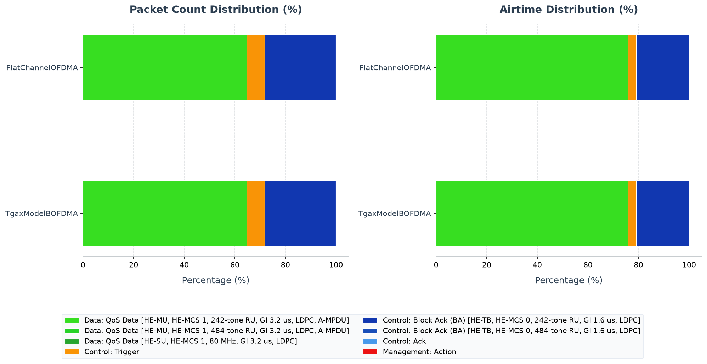

# Walkthrough: HE operation on frequency-selective channels

<!-- BEGIN SCRIPT RESULTS SESSIONS -->
`[script]` results sessions:

- Scalar/vector: `NOT RUN`
- PCAP: `20260725T230224Z`
<!-- END SCRIPT RESULTS SESSIONS -->

`[agent]` results sessions: `20260725T120411Z`, `20260725T230224Z`.

This example uses INET's dimensional radio model to retain power spectral
density across frequency and evaluate HE resource units (RUs) within their
assigned bandwidth. Retained evidence covers only run 0 of the flat 80 MHz
OFDMA reference and static TGax Model B OFDMA case; the wider catalogue of
notch, interferer, puncturing, SU-control, and sweep configurations is
documented as `NOT RUN`.

## [agent] Learning objectives and feature primer

After completing this walkthrough, the reader can:

- explain why RU-local signal and noise matter on a frequency-selective channel;
- identify the dimensional radio/medium and HE RU telemetry;
- recognize Trigger followed by HE trigger-based (HE-TB) Block Ack exchanges;
  and
- distinguish demonstrated allocation from an untested impairment advantage.

Orthogonal frequency-division multiple access (OFDMA) assigns groups of
subcarriers, called RUs, to users. When noise or channel gain varies with
frequency, two RUs in the same wide channel can experience different
signal-to-interference-plus-noise ratio (SINR). A dimensional model can retain
that frequency dependence; a scalar wideband power cannot.

## [agent] Scenario description

[FrequencySelectiveChannelNetwork.ned](FrequencySelectiveChannelNetwork.ned)
extends the common single-BSS topology with four stationary, equidistant
stations around one AP and an optional legacy interferer. A wired server sends
four warm-up bursts, then four 100 B UDP flows every 0.25 ms from `0.3 s`
(12.8 Mbit/s aggregate). The HE scheduler assigns up to four equal-sized RUs
at no more than MCS 1. [omnetpp.ini](omnetpp.ini) contains the full catalogue.

```text
             host[1]
                |
host[0] --- AP --- host[2]       optional interferer
                |
             host[3]
                |
              server
```

Equal 40 m AP distances prevent geometry from being the intended source of
per-station differences. Energy detection is deliberately `-40 dBm` so the
controlled cases emphasize receiver error decisions rather than CCA deferral.

## [agent] Standards and INET model boundary

IEEE Std 802.11-2024 Clause 27.3.2.5 defines resource indication and user
identification in HE MU PPDUs; Clause 27.3.2.6 describes HE-TB resource
allocation following a Trigger frame (corpus chunks
`80211ax-2024:chunk:10062` and `10064`). The standard defines the exchange,
not INET's synthetic spectral profiles or the results below.

INET instantiates `Ieee80211DimensionalRadioMedium` and
`Ieee80211DimensionalRadio`; HE reception filters signal/noise to the assigned
RU. Synthetic notch gains, TGax realization, NIST/RBIR error models, scripted
puncturing, and `-40 dBm` energy detection are modeling choices. A configured
profile is input evidence until runtime telemetry demonstrates it.

## [agent] Evidence status

| Claim or check | Status | Authoritative evidence | Runs/seeds | Scope or gap |
|---|---|---|---|---|
| Dimensional HE RU allocations occurred | `PASS` | `heRuToneSize/Offset` vectors | run/seed `0` | flat and TGax Model B OFDMA |
| Trigger/HE-TB Block Ack exchange occurred | `PASS` | AP PCAP | run/seed `0` | both retained configs |
| Both retained cases delivered 14,388 packets | `PASS` | sink count scalars | run/seed `0` | direct single-run count |
| Frequency-selective impairment changes per-RU reception | `INCONCLUSIVE` | no retained impaired/control pair | none | decisive SNIR/error comparison missing |
| Notch, real interferer, puncturing, sweep, SU, SIMO/RBIR claims | `NOT RUN` | no retained result set | none | configuration input only |

## [agent] Configuration matrix

| Configuration | Role | Feature gate/delta | Workload/channel | Runs/seeds | Expected invariant |
|---|---|---|---|---|---|
| `FlatChannelOFDMA` | Retained control | dimensional flat 80 MHz; equal RUs | matched four-flow load | run/seed `0` | HE RU telemetry and delivery |
| `TgaxModelBOFDMA` | Retained treatment | static reciprocal SISO TGax Model B/NIST error model | matched | run/seed `0` | HE RU telemetry and delivery |
| `FlatChannelSU` / `TgaxModelBSU` | Counterfactual | HCF/EDCA whole-channel SU | matched | `NOT RUN` | no Trigger-scheduled OFDMA |
| `*Notch*`, `FortyMHz*Interferer*` | Stress | frequency-local noise or 20 MHz interferer | declared | `NOT RUN` | affected RUs change SNIR/error |
| `Puncturing*` / `Transient*` | Stress | mask or timed interferer | declared | `NOT RUN` | allocations avoid punctured spectrum |
| SIMO/MRC/L-MMSE/RBIR variants | Model study | receiver/error-model change | declared | `NOT RUN` | model-specific reception outcome |

All rows inherit the dimensional 80 MHz HE base unless an explicit base config
overrides width/channel. `TgaxModelBOFDMA` extends `Ofdma` and
`TgaxIndoorModelB80MHz`; the latter's channel/error-model assignments are the
effective delta. This matrix does not convert unexecuted rows into evidence.

## [agent] Expected invariants and diagnostic map

| Invariant | Evidence and observation point | Failure symptom | Likely subsystem | Next diagnostic |
|---|---|---|---|---|
| Scheduler emits RU sizes/offsets | AP radio vectors | empty/out-of-band RU | HE scheduler/PHY | query RU vectors and puncture mask |
| Trigger precedes HE-TB response | AP PCAP timestamps | missing response | HE MAC/Block Ack | inspect Trigger fields, receiver capture, MAC log |
| Local impairment affects overlapping RU only | per-RU SNIR/error vectors | all/no RUs affected | dimensional medium/receiver | co-record power, SNIR, RU offset, outcome |
| Application comparison is matched | sink scalars and run attrs | unequal load/seed/window | traffic/config | query run metadata first |

## [agent] Reproduction

Run from the repository root. This minimal command is illustrative and was
**NOT RUN** during this rewrite:

```sh
bin/inet --release -u Cmdenv \
  -f examples/ieee80211ax/frequency_selective_channel/omnetpp.ini \
  -c FlatChannelOFDMA -r 0 --seed-set=0 \
  --result-dir=examples/ieee80211ax/frequency_selective_channel/results/manual/FlatChannelOFDMA
```

Fresh suite PCAP generation was executed with exit status 0 and created
session `20260725T230224Z`:

```sh
python3 examples/ieee80211/analysis/analyze_pcap.py \
  --suite examples/ieee80211/analysis/suites/ax.json \
  --generate --subdir frequency_selective_channel --run 0 \
  --allow-failed-evidence
```

## [agent] Scalar and vector analysis

Inputs:
`results/20260725T120411Z/{FlatChannelOFDMA,TgaxModelBOFDMA}/*.{sca,vec}`.

```sh
opp_scavetool query -l \
  -f 'name =~ "packetReceived:count" AND module =~ "*.host[*].app[0]"' \
  examples/ieee80211ax/frequency_selective_channel/results/20260725T120411Z/*/*.sca

opp_scavetool query -l \
  -f 'type =~ vector AND (name =~ "heRuToneSize:vector" OR name =~ "heRuToneOffset:vector" OR name =~ "hePuncturedSubchannelMask:vector")' \
  examples/ieee80211ax/frequency_selective_channel/results/20260725T120411Z/*/*.vec
```

| Configuration | host[0] | host[1] | host[2] | host[3] | Aggregate |
|---|---:|---:|---:|---:|---:|
| `FlatChannelOFDMA` | 3597 | 3597 | 3597 | 3597 | 14,388 |
| `TgaxModelBOFDMA` | 3597 | 3597 | 3597 | 3597 | 14,388 |

In both run-0 vector files the AP has 6246 RU-size records ranging 242–484
tones and 6246 offset records ranging 0–754. It has 1563 puncturing-mask
records, all zero; each station has about 1560 RU records. These are
single-run direct observations. No confidence interval or warm-up-adjusted
rate is computed, and equality does not establish robustness.

No plot: the retained result pair contains only the two equal-delivery flat
channel controls; the frequency-selective stress cases needed for a meaningful
comparison were not run.

## [agent] PCAP statistics

Session `results/20260725T230224Z` contains run/seed 0 legacy
PCAPs at all WLAN MAC observation points. Each retained AP capture has 9401
observations from `0.080084 s` through `1.199664 s`; TShark 4.6.4 decodes it.

```sh
tshark -n -r 'examples/ieee80211ax/frequency_selective_channel/results/20260725T230224Z/FlatChannelOFDMA/FlatChannelOFDMA-#0FrequencySelectiveChannelNetwork.ap.wlan[0].pcap' \
  -q -z io,stat,0,'wlan.fc.type==1 && (wlan.fc.subtype==2 || wlan.fc.subtype==9)'
```

| Decoded AP observation | `FlatChannelOFDMA` | `TgaxModelBOFDMA` |
|---|---:|---:|
| Trigger | 1561 | 1561 |
| HE-TB Block Ack, 242-tone RU | 6240 | 6240 |
| HE-TB Block Ack, 484-tone RU | 2 | 2 |
| QoS Data, HE-SU | 17 | 17 |
| All observations | 9401 | 9401 |

Rows count capture observations, including multiple HE-TB user observations;
they are not application delivery or scheduler-decision counts.

<!-- BEGIN GENERATED: ieee80211ax-pcap-statistics -->
### [script] Generated PCAP plots and tables


Figure provenance: [`packet_statistics.png.json`](../analysis/figures/frequency_selective_channel/packet_statistics.png.json).

This section provides a statistical overview of the 802.11 frames transmitted over the wireless medium during the simulation. The packet counts were gathered from AP wireless-interface observation points. With multiple AP captures, one medium transmission may be observed at more than one AP; counts and airtime therefore represent recorded transmission observations, not de-duplicated application packets.

Capture session `20260725T230224Z` was generated from fresh PCAPng input with `TShark (Wireshark) 4.6.4.`. The selected manifest is `examples/ieee80211/analysis/generated/ax/pcapmanifests/20260725T230224Z.json` (SHA-256 `d6451b4bedace28e08848db7713e94aa70e49dff31b7854ef956ebc96cb73359`). HE PPDU format, MCS, coding, bandwidth/RU, GI, and NSTS are decoded directly from standards-compliant radiotap HE fields; values not marked known by the recorder are omitted.

Two estimated airtime occupancy percentages are provided. HE-SU and HE-ER-SU use the modeled 36/44 µs preambles; a dissector-expanded A-MPDU is charged one shared preamble. HE MU/TB user-dependent signaling not exposed by radiotap remains approximate.
- **Air Time %**: This frame type's share of the sum of all estimated frame airtimes.
- **Air Time (Sim Time) %**: The sum of this frame type's estimated airtimes divided by the simulation time limit. Concurrent transmissions from multiple capture points are counted separately, so this value can exceed 100%; it is not the union of busy channel time.

#### [script] Compact cross-configuration summary

Observation point: Access Point (AP) wireless interfaces.

| Configuration | Selection/filter | Observations | Dominant decoded frame/PHY evidence | Estimated airtime / sim time | Limits |
|---|---|---:|---|---:|---|
| `FlatChannelOFDMA` | `none (all decoded frames)` | 22227 | Data: QoS Data [HE-MU, HE-MCS 1, 242-tone RU, GI 3.2 us, LDPC, A-MPDU] (14385), Control: Block Ack (BA) [HE-TB, HE-MCS 0, 242-tone RU, GI 1.6 us, LDPC] (6240), Control: Trigger (1561) | 168.23% | Not delivery or de-duplicated transmissions; unknown PHY fields stay unknown |
| `TgaxModelBOFDMA` | `none (all decoded frames)` | 22227 | Data: QoS Data [HE-MU, HE-MCS 1, 242-tone RU, GI 3.2 us, LDPC, A-MPDU] (14385), Control: Block Ack (BA) [HE-TB, HE-MCS 0, 242-tone RU, GI 1.6 us, LDPC] (6240), Control: Trigger (1561) | 168.23% | Not delivery or de-duplicated transmissions; unknown PHY fields stay unknown |

### [script] Evidence checks

| Status | Requirement | Observed evidence |
|---|---|---|
| **PASS** | FlatChannelOFDMA produced protocol-visible wireless observations | 22227 AP/global transmission observations |
| **PASS** | TgaxModelBOFDMA produced protocol-visible wireless observations | 22227 AP/global transmission observations |
| **INCONCLUSIVE** | Per-RU SNIR/reception outcome and sink delivery | The packet-type table is exchange evidence only; use the recorded feature vectors/results |

### [script] Configuration: `FlatChannelOFDMA`
Total over-the-air frame/MPDU transmission observations (Global BSS/AP): **22227**

| Color | Frame Type & Subtype | Count | Percentage | Mean Size | Std Dev | Mean Duration | Std Dev Duration | Freq | Mean RX Sig | Mean TX Pwr | Air Time % | Air Time (Sim Time) % |
|:---:|---|---:|---:|---:|---:|---:|---:|---:|---:|---:|---:|---:|
| <svg width="16" height="16"><rect width="16" height="16" rx="3" fill="#37de21" /></svg> | Data: QoS Data [HE-MU, HE-MCS 1, 242-tone RU, GI 3.2 us, LDPC, A-MPDU] | 14385 | 64.72% | 166.0 B | 0.0 B | 106.4 us | 17.8 us | 5200 MHz | - | 20.0 dBm | 75.83% | 127.57% |
| <svg width="16" height="16"><rect width="16" height="16" rx="3" fill="#28d228" /></svg> | Data: QoS Data [HE-MU, HE-MCS 1, 484-tone RU, GI 3.2 us, LDPC, A-MPDU] | 2 | 0.01% | 166.0 B | 0.0 B | 81.4 us | 0.0 us | 5200 MHz | - | 20.0 dBm | 0.01% | 0.01% |
| <svg width="16" height="16"><rect width="16" height="16" rx="3" fill="#27a52f" /></svg> | Data: QoS Data [HE-SU, HE-MCS 1, 80 MHz, GI 3.2 us, LDPC] | 17 | 0.08% | 166.0 B | 0.0 B | 57.7 us | 0.0 us | 5200 MHz | - | 20.0 dBm | 0.05% | 0.08% |
| <hr> | <hr> | <hr> | <hr> | <hr> | <hr> | <hr> | <hr> | <hr> | <hr> | <hr> | <hr> | <hr> |
| <svg width="16" height="16"><rect width="16" height="16" rx="3" fill="#f99406" /></svg> | Control: Trigger | 1561 | 7.02% | 64.0 B | 0.5 B | 41.3 us | 0.2 us | 5200 MHz | - | 20.0 dBm | 3.20% | 5.38% |
| <svg width="16" height="16"><rect width="16" height="16" rx="3" fill="#1137b0" /></svg> | Control: Block Ack (BA) [HE-TB, HE-MCS 0, 242-tone RU, GI 1.6 us, LDPC] | 6240 | 28.07% | 32.0 B | 0.0 B | 67.5 us | 0.0 us | 5170 MHz, 5189 MHz, 5211 MHz, 5230 MHz | -59.0 dBm | - | 20.87% | 35.10% |
| <svg width="16" height="16"><rect width="16" height="16" rx="3" fill="#194eb8" /></svg> | Control: Block Ack (BA) [HE-TB, HE-MCS 0, 484-tone RU, GI 1.6 us, LDPC] | 2 | 0.01% | 32.0 B | 0.0 B | 51.8 us | 0.0 us | 5180 MHz, 5220 MHz | -59.0 dBm | - | 0.01% | 0.01% |
| <svg width="16" height="16"><rect width="16" height="16" rx="3" fill="#4799eb" /></svg> | Control: Ack | 12 | 0.05% | 14.0 B | 0.0 B | 24.7 us | 0.0 us | 5200 MHz | -59.0 dBm | 20.0 dBm | 0.01% | 0.02% |
| <hr> | <hr> | <hr> | <hr> | <hr> | <hr> | <hr> | <hr> | <hr> | <hr> | <hr> | <hr> | <hr> |
| <svg width="16" height="16"><rect width="16" height="16" rx="3" fill="#ec1313" /></svg> | Management: Action | 8 | 0.04% | 37.0 B | 0.0 B | 69.3 us | 0.0 us | 5200 MHz | -59.0 dBm | 20.0 dBm | 0.03% | 0.05% |

#### [script] Representative frame-exchange timeline

| Frame | Simulation time (s) | Transmitter → receiver | Type/PHY | Decisive fields | Role in exchange |
|---:|---:|---|---|---|---|
| 1 | 0.080084000 | 10:00:00:00:00:00 → 0a:aa:00:00:00:01 | Data: QoS Data / HE-SU, HE-MCS 1, 80 MHz, NSS 1, GI 3.2 us, LDPC | direction=from DS, retry=0, seq=0, frag=0, more-frag=0, TID=0 | Carries protocol-visible MAC payload in the representative exchange. |
| 2 | 0.080128000 | ? → 10:00:00:00:00:00 | Control: Ack / Legacy/HT/VHT | direction=direct/IBSS, retry=0, seq=-, frag=-, more-frag=0, TID=- | Acknowledges the preceding unicast frame. |
| 3 | 0.080207000 | 10:00:00:00:00:00 → 0a:aa:00:00:00:01 | Management: Action / Legacy/HT/VHT | direction=direct/IBSS, retry=0, seq=0, frag=0, more-frag=0, TID=- | Provides frame-order context for the representative exchange. |
| 4 | 0.080251000 | ? → 10:00:00:00:00:00 | Control: Ack / Legacy/HT/VHT | direction=direct/IBSS, retry=0, seq=-, frag=-, more-frag=0, TID=- | Acknowledges the preceding unicast frame. |
| 5 | 0.080330000 | 0a:aa:00:00:00:01 → 10:00:00:00:00:00 | Management: Action / Legacy/HT/VHT | direction=direct/IBSS, retry=0, seq=0, frag=0, more-frag=0, TID=- | Provides frame-order context for the representative exchange. |
| 6 | 0.080374000 | ? → 0a:aa:00:00:00:01 | Control: Ack / Legacy/HT/VHT | direction=direct/IBSS, retry=0, seq=-, frag=-, more-frag=0, TID=- | Acknowledges the preceding unicast frame. |
| 7 | 0.085084000 | 10:00:00:00:00:00 → 0a:aa:00:00:00:01 | Data: QoS Data / HE-SU, HE-MCS 1, 80 MHz, NSS 1, GI 3.2 us, LDPC | direction=from DS, retry=0, seq=1, frag=0, more-frag=0, TID=0 | Carries protocol-visible MAC payload in the representative exchange. |
| 8 | 0.090084000 | 10:00:00:00:00:00 → 0a:aa:00:00:00:01 | Data: QoS Data / HE-SU, HE-MCS 1, 80 MHz, NSS 1, GI 3.2 us, LDPC | direction=from DS, retry=0, seq=2, frag=0, more-frag=0, TID=0 | Carries protocol-visible MAC payload in the representative exchange. |
| 9 | 0.095084000 | 10:00:00:00:00:00 → 0a:aa:00:00:00:01 | Data: QoS Data / HE-SU, HE-MCS 1, 80 MHz, NSS 1, GI 3.2 us, LDPC | direction=from DS, retry=0, seq=3, frag=0, more-frag=0, TID=0 | Carries protocol-visible MAC payload in the representative exchange. |
| 10 | 0.120084000 | 10:00:00:00:00:00 → 0a:aa:00:00:00:02 | Data: QoS Data / HE-SU, HE-MCS 1, 80 MHz, NSS 1, GI 3.2 us, LDPC | direction=from DS, retry=0, seq=0, frag=0, more-frag=0, TID=0 | Carries protocol-visible MAC payload in the representative exchange. |
| 11 | 0.120128000 | ? → 10:00:00:00:00:00 | Control: Ack / Legacy/HT/VHT | direction=direct/IBSS, retry=0, seq=-, frag=-, more-frag=0, TID=- | Acknowledges the preceding unicast frame. |
| 12 | 0.120225000 | 10:00:00:00:00:00 → 0a:aa:00:00:00:02 | Management: Action / Legacy/HT/VHT | direction=direct/IBSS, retry=0, seq=0, frag=0, more-frag=0, TID=- | Provides frame-order context for the representative exchange. |
| 13 | 0.120269000 | ? → 10:00:00:00:00:00 | Control: Ack / Legacy/HT/VHT | direction=direct/IBSS, retry=0, seq=-, frag=-, more-frag=0, TID=- | Acknowledges the preceding unicast frame. |
| 14 | 0.120366000 | 0a:aa:00:00:00:02 → 10:00:00:00:00:00 | Management: Action / Legacy/HT/VHT | direction=direct/IBSS, retry=0, seq=0, frag=0, more-frag=0, TID=- | Provides frame-order context for the representative exchange. |
| 15 | 0.120410000 | ? → 0a:aa:00:00:00:02 | Control: Ack / Legacy/HT/VHT | direction=direct/IBSS, retry=0, seq=-, frag=-, more-frag=0, TID=- | Acknowledges the preceding unicast frame. |
| 16 | 0.125084000 | 10:00:00:00:00:00 → 0a:aa:00:00:00:02 | Data: QoS Data / HE-SU, HE-MCS 1, 80 MHz, NSS 1, GI 3.2 us, LDPC | direction=from DS, retry=0, seq=1, frag=0, more-frag=0, TID=0 | Carries protocol-visible MAC payload in the representative exchange. |

Frame numbers are local to capture `FlatChannelOFDMA-#0FrequencySelectiveChannelNetwork.ap.wlan[0].pcap`, not OMNeT++ event numbers. For readability, the table collapses observations with the same timestamp and MAC identity across capture interfaces; aggregate PCAP statistics retain the original observation counts.

### [script] Configuration: `TgaxModelBOFDMA`
Total over-the-air frame/MPDU transmission observations (Global BSS/AP): **22227**

| Color | Frame Type & Subtype | Count | Percentage | Mean Size | Std Dev | Mean Duration | Std Dev Duration | Freq | Mean RX Sig | Mean TX Pwr | Air Time % | Air Time (Sim Time) % |
|:---:|---|---:|---:|---:|---:|---:|---:|---:|---:|---:|---:|---:|
| <svg width="16" height="16"><rect width="16" height="16" rx="3" fill="#37de21" /></svg> | Data: QoS Data [HE-MU, HE-MCS 1, 242-tone RU, GI 3.2 us, LDPC, A-MPDU] | 14385 | 64.72% | 166.0 B | 0.0 B | 106.4 us | 17.8 us | 5200 MHz | - | 20.0 dBm | 75.83% | 127.57% |
| <svg width="16" height="16"><rect width="16" height="16" rx="3" fill="#28d228" /></svg> | Data: QoS Data [HE-MU, HE-MCS 1, 484-tone RU, GI 3.2 us, LDPC, A-MPDU] | 2 | 0.01% | 166.0 B | 0.0 B | 81.4 us | 0.0 us | 5200 MHz | - | 20.0 dBm | 0.01% | 0.01% |
| <svg width="16" height="16"><rect width="16" height="16" rx="3" fill="#27a52f" /></svg> | Data: QoS Data [HE-SU, HE-MCS 1, 80 MHz, GI 3.2 us, LDPC] | 17 | 0.08% | 166.0 B | 0.0 B | 57.7 us | 0.0 us | 5200 MHz | - | 20.0 dBm | 0.05% | 0.08% |
| <hr> | <hr> | <hr> | <hr> | <hr> | <hr> | <hr> | <hr> | <hr> | <hr> | <hr> | <hr> | <hr> |
| <svg width="16" height="16"><rect width="16" height="16" rx="3" fill="#f99406" /></svg> | Control: Trigger | 1561 | 7.02% | 64.0 B | 0.5 B | 41.3 us | 0.2 us | 5200 MHz | - | 20.0 dBm | 3.20% | 5.38% |
| <svg width="16" height="16"><rect width="16" height="16" rx="3" fill="#1137b0" /></svg> | Control: Block Ack (BA) [HE-TB, HE-MCS 0, 242-tone RU, GI 1.6 us, LDPC] | 6240 | 28.07% | 32.0 B | 0.0 B | 67.5 us | 0.0 us | 5170 MHz, 5189 MHz, 5211 MHz, 5230 MHz | -74.0 dBm | - | 20.87% | 35.10% |
| <svg width="16" height="16"><rect width="16" height="16" rx="3" fill="#194eb8" /></svg> | Control: Block Ack (BA) [HE-TB, HE-MCS 0, 484-tone RU, GI 1.6 us, LDPC] | 2 | 0.01% | 32.0 B | 0.0 B | 51.8 us | 0.0 us | 5180 MHz, 5220 MHz | -73.0 dBm | - | 0.01% | 0.01% |
| <svg width="16" height="16"><rect width="16" height="16" rx="3" fill="#4799eb" /></svg> | Control: Ack | 12 | 0.05% | 14.0 B | 0.0 B | 24.7 us | 0.0 us | 5200 MHz | -72.8 dBm | 20.0 dBm | 0.01% | 0.02% |
| <hr> | <hr> | <hr> | <hr> | <hr> | <hr> | <hr> | <hr> | <hr> | <hr> | <hr> | <hr> | <hr> |
| <svg width="16" height="16"><rect width="16" height="16" rx="3" fill="#ec1313" /></svg> | Management: Action | 8 | 0.04% | 37.0 B | 0.0 B | 69.3 us | 0.0 us | 5200 MHz | -72.8 dBm | 20.0 dBm | 0.03% | 0.05% |

#### [script] Representative frame-exchange timeline

| Frame | Simulation time (s) | Transmitter → receiver | Type/PHY | Decisive fields | Role in exchange |
|---:|---:|---|---|---|---|
| 1 | 0.080084000 | 10:00:00:00:00:00 → 0a:aa:00:00:00:01 | Data: QoS Data / HE-SU, HE-MCS 1, 80 MHz, NSS 1, GI 3.2 us, LDPC | direction=from DS, retry=0, seq=0, frag=0, more-frag=0, TID=0 | Carries protocol-visible MAC payload in the representative exchange. |
| 2 | 0.080128000 | ? → 10:00:00:00:00:00 | Control: Ack / Legacy/HT/VHT | direction=direct/IBSS, retry=0, seq=-, frag=-, more-frag=0, TID=- | Acknowledges the preceding unicast frame. |
| 3 | 0.080207000 | 10:00:00:00:00:00 → 0a:aa:00:00:00:01 | Management: Action / Legacy/HT/VHT | direction=direct/IBSS, retry=0, seq=0, frag=0, more-frag=0, TID=- | Provides frame-order context for the representative exchange. |
| 4 | 0.080251000 | ? → 10:00:00:00:00:00 | Control: Ack / Legacy/HT/VHT | direction=direct/IBSS, retry=0, seq=-, frag=-, more-frag=0, TID=- | Acknowledges the preceding unicast frame. |
| 5 | 0.080330000 | 0a:aa:00:00:00:01 → 10:00:00:00:00:00 | Management: Action / Legacy/HT/VHT | direction=direct/IBSS, retry=0, seq=0, frag=0, more-frag=0, TID=- | Provides frame-order context for the representative exchange. |
| 6 | 0.080374000 | ? → 0a:aa:00:00:00:01 | Control: Ack / Legacy/HT/VHT | direction=direct/IBSS, retry=0, seq=-, frag=-, more-frag=0, TID=- | Acknowledges the preceding unicast frame. |
| 7 | 0.085084000 | 10:00:00:00:00:00 → 0a:aa:00:00:00:01 | Data: QoS Data / HE-SU, HE-MCS 1, 80 MHz, NSS 1, GI 3.2 us, LDPC | direction=from DS, retry=0, seq=1, frag=0, more-frag=0, TID=0 | Carries protocol-visible MAC payload in the representative exchange. |
| 8 | 0.090084000 | 10:00:00:00:00:00 → 0a:aa:00:00:00:01 | Data: QoS Data / HE-SU, HE-MCS 1, 80 MHz, NSS 1, GI 3.2 us, LDPC | direction=from DS, retry=0, seq=2, frag=0, more-frag=0, TID=0 | Carries protocol-visible MAC payload in the representative exchange. |
| 9 | 0.095084000 | 10:00:00:00:00:00 → 0a:aa:00:00:00:01 | Data: QoS Data / HE-SU, HE-MCS 1, 80 MHz, NSS 1, GI 3.2 us, LDPC | direction=from DS, retry=0, seq=3, frag=0, more-frag=0, TID=0 | Carries protocol-visible MAC payload in the representative exchange. |
| 10 | 0.120084000 | 10:00:00:00:00:00 → 0a:aa:00:00:00:02 | Data: QoS Data / HE-SU, HE-MCS 1, 80 MHz, NSS 1, GI 3.2 us, LDPC | direction=from DS, retry=0, seq=0, frag=0, more-frag=0, TID=0 | Carries protocol-visible MAC payload in the representative exchange. |
| 11 | 0.120128000 | ? → 10:00:00:00:00:00 | Control: Ack / Legacy/HT/VHT | direction=direct/IBSS, retry=0, seq=-, frag=-, more-frag=0, TID=- | Acknowledges the preceding unicast frame. |
| 12 | 0.120225000 | 10:00:00:00:00:00 → 0a:aa:00:00:00:02 | Management: Action / Legacy/HT/VHT | direction=direct/IBSS, retry=0, seq=0, frag=0, more-frag=0, TID=- | Provides frame-order context for the representative exchange. |
| 13 | 0.120269000 | ? → 10:00:00:00:00:00 | Control: Ack / Legacy/HT/VHT | direction=direct/IBSS, retry=0, seq=-, frag=-, more-frag=0, TID=- | Acknowledges the preceding unicast frame. |
| 14 | 0.120366000 | 0a:aa:00:00:00:02 → 10:00:00:00:00:00 | Management: Action / Legacy/HT/VHT | direction=direct/IBSS, retry=0, seq=0, frag=0, more-frag=0, TID=- | Provides frame-order context for the representative exchange. |
| 15 | 0.120410000 | ? → 0a:aa:00:00:00:02 | Control: Ack / Legacy/HT/VHT | direction=direct/IBSS, retry=0, seq=-, frag=-, more-frag=0, TID=- | Acknowledges the preceding unicast frame. |
| 16 | 0.125084000 | 10:00:00:00:00:00 → 0a:aa:00:00:00:02 | Data: QoS Data / HE-SU, HE-MCS 1, 80 MHz, NSS 1, GI 3.2 us, LDPC | direction=from DS, retry=0, seq=1, frag=0, more-frag=0, TID=0 | Carries protocol-visible MAC payload in the representative exchange. |

Frame numbers are local to capture `TgaxModelBOFDMA-#0FrequencySelectiveChannelNetwork.ap.wlan[0].pcap`, not OMNeT++ event numbers. For readability, the table collapses observations with the same timestamp and MAC identity across capture interfaces; aggregate PCAP statistics retain the original observation counts.

### [script] Analysis of Packet Distribution
The different frame mixtures show that the two configured access paths executed different exchanges, but aggregate subtype counts cannot validate a frequency-selective channel or per-RU isolation. IEEE HE DL-MU behavior must be established with RU allocation and per-RU reception/SNIR outcomes together with sink delivery; the channel model is an implementation choice rather than an IEEE-mandated propagation model.
<!-- END GENERATED: ieee80211ax-pcap-statistics -->

## [agent] Frame exchange analysis

```sh
tshark -n -r 'examples/ieee80211ax/frequency_selective_channel/results/20260725T230224Z/FlatChannelOFDMA/FlatChannelOFDMA-#0FrequencySelectiveChannelNetwork.ap.wlan[0].pcap' \
  -Y 'frame.number >= 39 && frame.number <= 41' \
  -T fields -E header=y -E separator='|' \
  -e frame.number -e frame.time_epoch -e wlan.fc.type -e wlan.fc.subtype \
  -e radiotap.he.data_1.ppdu_format -e radiotap.he.data_3.data_mcs \
  -e radiotap.he.data_5.data_bw_ru_allocation \
  -e radiotap.he.data_2.ru_allocation_offset
```

| Frame | Simulation time | Transmitter → receiver | Type/PHY | Decisive fields | Role in exchange |
|---:|---:|---|---|---|---|
| 39 | 0.300360 s | AP → stations | Trigger | control subtype 2 | solicits HE-TB responses |
| 40 | 0.300453 s | station → AP | Block Ack / HE-TB | PPDU 3, MCS 0, RU code 8, offset 0 | first captured 242-tone response |
| 41 | 0.300453 s | station → AP | Block Ack / HE-TB | same timestamp/profile | another user observation |

The typed analyzer maps the known RU code to 242 tones. Empty transmitter
addresses on control rows are a capture/dissector limitation, and equal
timestamps can represent per-user observations of one multi-user exchange.

## [agent] Cross-layer findings and verdict

| Claim | Verdict | Configuration evidence | Model telemetry | Packet evidence | Outcome evidence |
|---|---|---|---|---|---|
| HE frequency-domain allocation runs | `PASS` | dimensional radio + OFDMA scheduler | RU sizes/offsets | Trigger and HE-TB BA | all sinks receive |
| Flat and TGax retained runs differ in delivery | `FAIL` | channel-model delta | allocation counts equal | packet summaries equal | both 14,388 |
| Selective impairment advantage | `INCONCLUSIVE` | scenarios declared | decisive impaired vectors absent | impaired captures absent | controls absent |

The bounded verdict is `PASS` for exercising and observing HE RU allocation,
but `INCONCLUSIVE` for the example's central frequency-selective impairment
comparison. The retained pair happens to have equal delivery; it is not a
failed standard invariant.

## [agent] Limitations and inconclusive claims

- Only one seed and two OFDMA configurations are retained.
- The decisive impaired/control and matched SU pairs were not run.
- AP PCAP cannot expose per-RU SNIR, receiver error cause, or application loss.
- Result and packet sessions are separate and cannot establish event causality.
- The synthetic notch profiles are frequency-domain noise, not multipath
  impulse responses.

The smallest resolving experiment is one matched
`FortyMHzSilentInterfererOFDMA`/`FortyMHzLowerHalfOFDMA` run with co-recorded
RU offset, filtered signal/noise, minimum SNIR, reception outcome, sink count,
and AP/receiver PCAP; then repeat across seeds only after the mechanism appears.

## [agent] Further experiments

- Move the 20 MHz impairment from lower to upper half and predict which RU
  offsets show reduced SNIR.
- Compare matched OFDMA and SU controls at one impairment and report delivery
  per run before adding a notch-depth sweep.
- Run clean/impaired punctured controls and verify the runtime mask and RU
  placement before comparing delivery.

## [agent] Implementation plan

| Item | Evidence-backed plan |
|---|---|
| Demonstrated gap | retained artifacts do not expose per-RU filtered power/SNIR tied to reception outcome |
| Intended behavior | make frequency-local impairment causally testable |
| Smallest change surface | first enable/discover existing radio results; extend typed analysis only if the decisive telemetry is absent |
| Observability | RU size/offset, mask, filtered signal/noise, SNIR, error stage, sink delivery |
| Validation | silent/active interferer pair, one seed first, then independent seeds and SU control |
| Compatibility and risks | preserve dimensional/scalar radio behavior and RNG trajectory where possible |
| Architecture and sealing | apply architecture/sealing review before any `src/inet` edit |
| Next handoff | dimensional PHY/results specialist after a co-recorded reproduction |

## [agent] Artifact provenance

| Artifact family | Session/path | Configurations/runs | Tool/filter/window | Integrity notes |
|---|---|---|---|---|
| Scalar/vector | `results/20260725T120411Z` | flat and TGax OFDMA, run/seed `0` | exact queries above | single-run only |
| PCAP/results | `results/20260725T230224Z` | same configs, run/seed `0` | TShark 4.6.4; MAC | manifest and hashes in generated block |
| Config catalogue | `omnetpp.ini` | all declared cases | input inspection | not runtime evidence |
