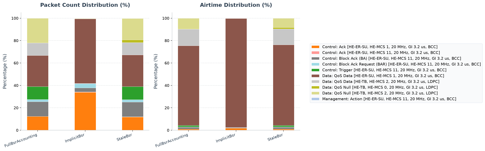

# 802.11ax HE Buffer Status Report (BSR) Simulation

This example illustrates the Buffer Status Report (BSR) and Buffer Status Report Poll (BSRP) mechanisms introduced in the IEEE 802.11ax (Wi-Fi 6) standard. It demonstrates how BSRs assist the AP in dynamically scheduling uplink MU-OFDMA transmissions, and highlights the impact of BSR report freshness on overall network overhead and throughput.

## Background: HE BSR & Uplink OFDMA Scheduling

In 802.11ax, Uplink Multi-User Orthogonal Frequency Division Multiple Access (UL MU-OFDMA) allows multiple stations (STAs) to transmit concurrently to the Access Point (AP) on partitioned frequency channels called **Resource Units (RUs)**.

To allocate RUs efficiently, the AP's Uplink Scheduler needs to know the backlog (buffer size) of each STA's traffic queues. The **BSR** mechanism provides this:
1. **Implicit BSR**: STAs include buffer status details in the *BSR control subfield* of the HE variant HT Control field in uplink MAC data frames.
2. **Explicit BSR / BSRP**: When the AP needs fresh buffer status information and has no pending uplink data from a STA, it transmits a **Buffer Status Report Poll (BSRP)** Trigger frame. The target STAs reply with their current queue status.
3. **Queue Accounting Freshness**: The AP's UL Coordinator maintains an active registry of STA queue statuses. If a status record is older than `reportMaxAge`, it is marked as stale, and the AP must re-poll using a BSRP Trigger frame before scheduling.

---

## Network Topology

The network [HeBsrNetwork.ned](HeBsrNetwork.ned) consists of:
- **`ap`**: An Access Point located at `(300, 210)`.
- **`host[0..2]`**: Three wireless stations located around the AP at distances of 60m.
- **`server`**: A wired server connected to the AP via a 100 Gbps Ethernet link (`ap.ethg++ <--> Eth100G <--> server.ethg++`).
- **Traffic**: Each host runs a `UdpBasicApp` that generates uplink traffic destined for the `server` with 700B messages every 0.35ms. The controlled phase uses a `0.2–0.25s` warm-up and normal traffic from `0.3s`; the bursty comparison starts its first burst at `0.3s`.

```
       [host[0]]  [host[1]]  [host[2]]
           \          |          /
            \         | (wireless)
             v        v        v
                   [ ap ]
                     |
                     | (100G Ethernet)
                     v
                 [server]
```

---

## Configurations in `omnetpp.ini`

The [omnetpp.ini](omnetpp.ini) file defines three test scenarios:

### 1. `FullBsrAccounting` (fresh-report reference)
- The BSR freshness timer (`reportMaxAge`) uses the default (retained longer).
- The AP relies on fresh queue reports delivered implicitly or from previous polls to schedule UL MU-OFDMA data transmissions using `HeUlSchedulerBacklogBased`.
- Fresh reports let the AP allocate RUs from recent queue information without
  first spending another exchange on BSRP polling.

### 2. `StaleBsr`
- The queue report freshness threshold is set to `**.ap.wlan[*].mac.hcf.ulCoordinator.reportMaxAge = 10ms`.
- Since queue statuses expire after 10 ms, the AP's scheduler frequently finds records stale and sends additional BSRP Trigger frames before backlog-based scheduling. The value is deliberately long enough for one Trigger exchange to finish deterministically; it is an INET experiment parameter, not an IEEE timer value.
- The intentionally short age limit makes the cost of stale state visible:
  reports expire on the timescale of the offered traffic, so the AP must
  refresh its view before it can make a useful backlog-based allocation.

### 3. `ImplicitBsr`
- The AP's UL trigger check interval is set to a larger value: `**.ap.wlan[*].mac.hcf.ulTriggerCheckInterval = 0.5s`.
- This allows STAs to first transmit data frames using single-user (SU) EDCA channel access. The buffer status (BSR) is implicitly set in the HE-variant HT Control field of these SU data frames.
- When the AP receives these SU QoS Data frames, it extracts the BSR implicitly, updating its backlog database. It then triggers UL MU-OFDMA transmissions only when necessary, without sending explicit BSRP poll frames.
- This configuration demonstrates how an uplink data frame can refresh the
  AP's scheduling state without a dedicated poll. It is not a pure throughput
  comparison with scheduled OFDMA because it intentionally allows SU EDCA.

---

## Running the Simulation

From the INET project root, use the project launcher.

### Running with Qtenv (GUI)
```sh
bin/inet -u Qtenv -c ImplicitBsr examples/ieee80211ax/he_bsr/omnetpp.ini
```

While the simulation runs, inspect the AP `wlan[0].mac.hcf.ulCoordinator` module. The watches `bufferStatusSummary`, `freshReports`, `backloggedReports`, `bufferStatusByAid`, `ofdmaContentionWindow`, and `ofdmaBackoff` show how BSR information drives Trigger decisions. The AP `ulTriggerPolicy` watches `lastContext.*` and `lastSelectedTriggerName`, and the `ulScheduler` watches `lastScheduleSummary` and `lastRuAllocations`.

### Running with Cmdenv (Command Line)
```sh
# Run Full BSR Accounting
bin/inet -u Cmdenv -c FullBsrAccounting examples/ieee80211ax/he_bsr/omnetpp.ini

# Run Stale BSR Scenario
bin/inet -u Cmdenv -c StaleBsr examples/ieee80211ax/he_bsr/omnetpp.ini

# Run Implicit BSR Scenario
bin/inet -u Cmdenv -c ImplicitBsr examples/ieee80211ax/he_bsr/omnetpp.ini
```

---

## Verifying Results

After running the simulations, use `opp_scavetool` to analyze how many BSRP and Basic triggers were sent by the AP and the total packets received at the server.

```sh
# Query the number of BSRP and Basic Trigger frames sent by the AP
opp_scavetool query -l -f "*Trigger*" examples/ieee80211ax/he_bsr/results/*.sca

# Query the total packets received at the UDP sink on the server
opp_scavetool query -l -f "*packetReceived:count*" examples/ieee80211ax/he_bsr/results/*.sca
```

### Vector summary

The five-seed campaign records AP backlog vectors for `BurstyTraffic`
and `StaleBsr` and measures `0.3–1.9s`. Mean reported/scheduled backlog is
`36,079/41,506 B` for the fresh bursty condition and `73,410/73,565 B` for
the stale condition. These are scheduling-state observations; the campaign
uses those vectors, rather than packet counts, to show what information the
scheduler actually had.

---

## PCAP Tshark Packet Exchange Analysis

To record PCAP traces and inspect them with TShark, run the simulation with PCAP recording and checksum computation enabled:

```sh
bin/inet -u Cmdenv -c StaleBsr examples/ieee80211ax/he_bsr/omnetpp.ini --result-dir=examples/ieee80211ax/he_bsr/results --**.numPcapRecorders=1 --**.checksumMode=\"computed\" --**.fcsMode=\"computed\"
```

Use TShark to print the timeline of packet exchanges:

```sh
tshark -n -r examples/ieee80211ax/he_bsr/results/StaleBsr-#0HeBsrNetwork.ap.wlan[0].pcap -c 25
```

The decoded output timeline shows:
1. **BSRP Triggers**: The AP broadcasts Buffer Status Report Poll (BSRP) triggers (e.g. frame 1) to poll station queue statuses. Stations respond with QoS Null frames carrying queue status (e.g. frames 2, 3, 4).
2. **Periodic Polling**: Since the queue status expires rapidly in the `StaleBsr` configuration (10 ms age limit), the AP is forced to re-poll buffer status regularly (e.g. frames 6, 11, 16, 21), generating explicit BSRP overhead.

---

## Interpretation of Results

1. **Fresh information is the advantage**: BSR does not carry payload; it lets
   the AP replace blind polling or contention with informed RU allocation.
   Scheduled bytes following nonzero reports is therefore stronger evidence
   than application packet count alone.
2. **Why `10 ms` matters**: it is long enough for a report exchange to finish,
   but short relative to this saturated workload. The stale case consequently
   accumulates about twice the mean reported backlog of the bursty fresh case.
   That is a scheduling-state penalty, not a claim that every shorter report
   lifetime halves throughput.
3. **Why bursty traffic matters**: filling, draining, and refilling the queues
   makes report freshness observable. A permanently empty or permanently
   saturated queue would reveal much less about whether the AP's view tracks
   changes in demand.

## 802.11 Packet Type Statistics


This section provides a statistical overview of the 802.11 frames transmitted over the wireless medium during the simulation. The packet counts were gathered from the Access Point's wireless interface (`ap.wlan[0]`), which captures all uplink, downlink, and management traffic in the BSS without duplication.

Two airtime occupancy percentages are provided:
- **Air Time %**: The percentage of the total transmission airtime of all packets occupied by this frame type.
- **Air Time (Sim Time) %**: The percentage of the total simulation time occupied by the transmission of this frame type (defined as the sum of physical airtimes of this frame type w.r.t. the total simulation time limit).

### Configuration: `FullBsrAccounting`
Total over-the-air packets captured (Global BSS/AP): **4465**

| Frame Type & Subtype | Count | Percentage | Mean Size | Std Dev | Mean Duration | Std Dev Duration | Freq | Mean RX Sig | Mean TX Pwr | Air Time % | Air Time (Sim Time) % |
|---|---:|---:|---:|---:|---:|---:|---:|---:|---:|---:|---:|
| Data: QoS Data [HE-ER-SU, HE-MCS 1, 20 MHz, GI 3.2 us, BCC] | 1239 | 27.75% | 1211.7 B | 344.0 B | 786.8 us | 188.2 us | 5010 MHz | -72.0 dBm | - | 71.14% | 48.74% |
| Data: QoS Null [HE-TB, HE-MCS 2, 20 MHz, GI 3.2 us, LDPC] | 977 | 21.88% | 34.0 B | 0.0 B | 136.4 us | 0.0 us | 5002 MHz, 5003 MHz, 5004 MHz, 5006 MHz, 5010 MHz, 5013 MHz, 5017 MHz | -72.0 dBm | - | 9.72% | 6.66% |
| Control: Block Ack (BA) [HE-ER-SU, HE-MCS 11, 20 MHz, GI 3.2 us, BCC] | 581 | 13.01% | 68.2 B | 29.5 B | 42.7 us | 9.8 us | 5010 MHz | - | 10.0 dBm | 1.81% | 1.24% |
| Control: Ack [HE-ER-SU, HE-MCS 1, 20 MHz, GI 3.2 us, BCC] | 547 | 12.25% | 14.0 B | 0.0 B | 24.7 us | 0.0 us | 5010 MHz | - | 10.0 dBm | 0.98% | 0.67% |
| Control: Trigger [HE-ER-SU, HE-MCS 11, 20 MHz, GI 3.2 us, BCC] | 517 | 11.58% | 46.1 B | 1.8 B | 35.4 us | 0.6 us | 5010 MHz | - | 10.0 dBm | 1.33% | 0.91% |
| Data: QoS Data [HE-TB, HE-MCS 2, 20 MHz, GI 3.2 us, LDPC] | 498 | 11.15% | 770.0 B | 0.0 B | 404.8 us | 0.0 us | 5005 MHz, 5015 MHz | -72.0 dBm | - | 14.71% | 10.08% |
| Control: Block Ack Request (BAR) [HE-ER-SU, HE-MCS 11, 20 MHz, GI 3.2 us, BCC] | 88 | 1.97% | 24.0 B | 0.0 B | 28.0 us | 0.0 us | 5010 MHz | -72.0 dBm | - | 0.18% | 0.12% |
| Data: QoS Null [HE-TB, HE-MCS 0, 20 MHz, GI 3.2 us, LDPC] | 6 | 0.13% | 34.0 B | 0.0 B | 161.2 us | 0.0 us | 5002 MHz, 5004 MHz, 5006 MHz | -72.0 dBm | - | 0.07% | 0.05% |
| Management: Action [HE-ER-SU, HE-MCS 11, 20 MHz, GI 3.2 us, BCC] | 6 | 0.13% | 37.0 B | 0.0 B | 69.3 us | 0.0 us | 5010 MHz | -72.0 dBm | 10.0 dBm | 0.03% | 0.02% |
| Control: Ack [HE-ER-SU, HE-MCS 11, 20 MHz, GI 3.2 us, BCC] | 6 | 0.13% | 14.0 B | 0.0 B | 24.7 us | 0.0 us | 5010 MHz | -72.0 dBm | 10.0 dBm | 0.01% | 0.01% |

### Configuration: `ImplicitBsr`
Total over-the-air packets captured (Global BSS/AP): **2425**

| Frame Type & Subtype | Count | Percentage | Mean Size | Std Dev | Mean Duration | Std Dev Duration | Freq | Mean RX Sig | Mean TX Pwr | Air Time % | Air Time (Sim Time) % |
|---|---:|---:|---:|---:|---:|---:|---:|---:|---:|---:|---:|
| Data: QoS Data [HE-ER-SU, HE-MCS 1, 20 MHz, GI 3.2 us, BCC] | 1398 | 57.65% | 1260.2 B | 324.9 B | 813.3 us | 177.7 us | 5010 MHz | -72.0 dBm | - | 97.28% | 56.85% |
| Control: Ack [HE-ER-SU, HE-MCS 1, 20 MHz, GI 3.2 us, BCC] | 822 | 33.90% | 14.0 B | 0.0 B | 24.7 us | 0.0 us | 5010 MHz | - | 10.0 dBm | 1.73% | 1.01% |
| Control: Block Ack Request (BAR) [HE-ER-SU, HE-MCS 11, 20 MHz, GI 3.2 us, BCC] | 92 | 3.79% | 24.0 B | 0.0 B | 28.0 us | 0.0 us | 5010 MHz | -72.0 dBm | - | 0.22% | 0.13% |
| Control: Block Ack (BA) [HE-ER-SU, HE-MCS 11, 20 MHz, GI 3.2 us, BCC] | 89 | 3.67% | 148.8 B | 17.0 B | 69.6 us | 5.7 us | 5010 MHz | - | 10.0 dBm | 0.53% | 0.31% |
| Management: Action [HE-ER-SU, HE-MCS 11, 20 MHz, GI 3.2 us, BCC] | 6 | 0.25% | 37.0 B | 0.0 B | 69.3 us | 0.0 us | 5010 MHz | -72.0 dBm | 10.0 dBm | 0.04% | 0.02% |
| Control: Ack [HE-ER-SU, HE-MCS 11, 20 MHz, GI 3.2 us, BCC] | 6 | 0.25% | 14.0 B | 0.0 B | 24.7 us | 0.0 us | 5010 MHz | -72.0 dBm | 10.0 dBm | 0.01% | 0.01% |
| Data: QoS Null [HE-TB, HE-MCS 2, 20 MHz, GI 3.2 us, LDPC] | 6 | 0.25% | 34.0 B | 0.0 B | 136.4 us | 0.0 us | 5013 MHz, 5017 MHz | -72.0 dBm | - | 0.07% | 0.04% |
| Control: Trigger [HE-ER-SU, HE-MCS 11, 20 MHz, GI 3.2 us, BCC] | 3 | 0.12% | 46.0 B | 0.0 B | 35.3 us | 0.0 us | 5010 MHz | - | 10.0 dBm | 0.01% | 0.01% |
| Data: QoS Data [HE-TB, HE-MCS 2, 20 MHz, GI 3.2 us, LDPC] | 3 | 0.12% | 770.0 B | 0.0 B | 404.8 us | 0.0 us | 5005 MHz | -72.0 dBm | - | 0.10% | 0.06% |

### Configuration: `StaleBsr`
Total over-the-air packets captured (Global BSS/AP): **4261**

| Frame Type & Subtype | Count | Percentage | Mean Size | Std Dev | Mean Duration | Std Dev Duration | Freq | Mean RX Sig | Mean TX Pwr | Air Time % | Air Time (Sim Time) % |
|---|---:|---:|---:|---:|---:|---:|---:|---:|---:|---:|---:|
| Data: QoS Data [HE-ER-SU, HE-MCS 1, 20 MHz, GI 3.2 us, BCC] | 1207 | 28.33% | 1236.1 B | 327.1 B | 800.2 us | 178.9 us | 5010 MHz | -72.0 dBm | - | 72.00% | 48.29% |
| Data: QoS Null [HE-TB, HE-MCS 2, 20 MHz, GI 3.2 us, LDPC] | 815 | 19.13% | 34.0 B | 0.0 B | 136.4 us | 0.0 us | 5002 MHz, 5003 MHz, 5004 MHz, 5006 MHz, 5008 MHz, 5010 MHz, 5013 MHz, 5017 MHz | -72.0 dBm | - | 8.29% | 5.56% |
| Control: Block Ack (BA) [HE-ER-SU, HE-MCS 11, 20 MHz, GI 3.2 us, BCC] | 559 | 13.12% | 67.4 B | 29.5 B | 42.5 us | 9.8 us | 5010 MHz | - | 10.0 dBm | 1.77% | 1.19% |
| Control: Ack [HE-ER-SU, HE-MCS 1, 20 MHz, GI 3.2 us, BCC] | 505 | 11.85% | 14.0 B | 0.0 B | 24.7 us | 0.0 us | 5010 MHz | - | 10.0 dBm | 0.93% | 0.62% |
| Control: Trigger [HE-ER-SU, HE-MCS 11, 20 MHz, GI 3.2 us, BCC] | 499 | 11.71% | 47.8 B | 6.9 B | 35.9 us | 2.3 us | 5010 MHz | - | 10.0 dBm | 1.34% | 0.90% |
| Data: QoS Data [HE-TB, HE-MCS 2, 20 MHz, GI 3.2 us, LDPC] | 470 | 11.03% | 770.0 B | 0.0 B | 404.8 us | 0.0 us | 5005 MHz, 5015 MHz | -72.0 dBm | - | 14.18% | 9.51% |
| Data: QoS Null [HE-TB, HE-MCS 0, 20 MHz, GI 3.2 us, LDPC] | 105 | 2.46% | 34.0 B | 0.0 B | 161.2 us | 0.0 us | 5002 MHz, 5004 MHz, 5006 MHz | -72.0 dBm | - | 1.26% | 0.85% |
| Control: Block Ack Request (BAR) [HE-ER-SU, HE-MCS 11, 20 MHz, GI 3.2 us, BCC] | 89 | 2.09% | 24.0 B | 0.0 B | 28.0 us | 0.0 us | 5010 MHz | -72.0 dBm | - | 0.19% | 0.12% |
| Management: Action [HE-ER-SU, HE-MCS 11, 20 MHz, GI 3.2 us, BCC] | 6 | 0.14% | 37.0 B | 0.0 B | 69.3 us | 0.0 us | 5010 MHz | -72.0 dBm | 10.0 dBm | 0.03% | 0.02% |
| Control: Ack [HE-ER-SU, HE-MCS 11, 20 MHz, GI 3.2 us, BCC] | 6 | 0.14% | 14.0 B | 0.0 B | 24.7 us | 0.0 us | 5010 MHz | -72.0 dBm | 10.0 dBm | 0.01% | 0.01% |

### Analysis of Packet Distribution
Across these configurations, **QoS Data** frames constitute the primary payload delivery mechanism, while **Block Ack (BA)** and **Block Ack Request (BAR)** control frames ensure reliable transport via the MAC-level acknowledgment protocol. Management frames, specifically **Beacons**, are transmitted periodically by the Access Point to maintain BSS time synchronization and broadcast network capabilities. The ratio of control/management overhead to actual data frames indicates the relative MAC efficiency of the chosen configurations.
