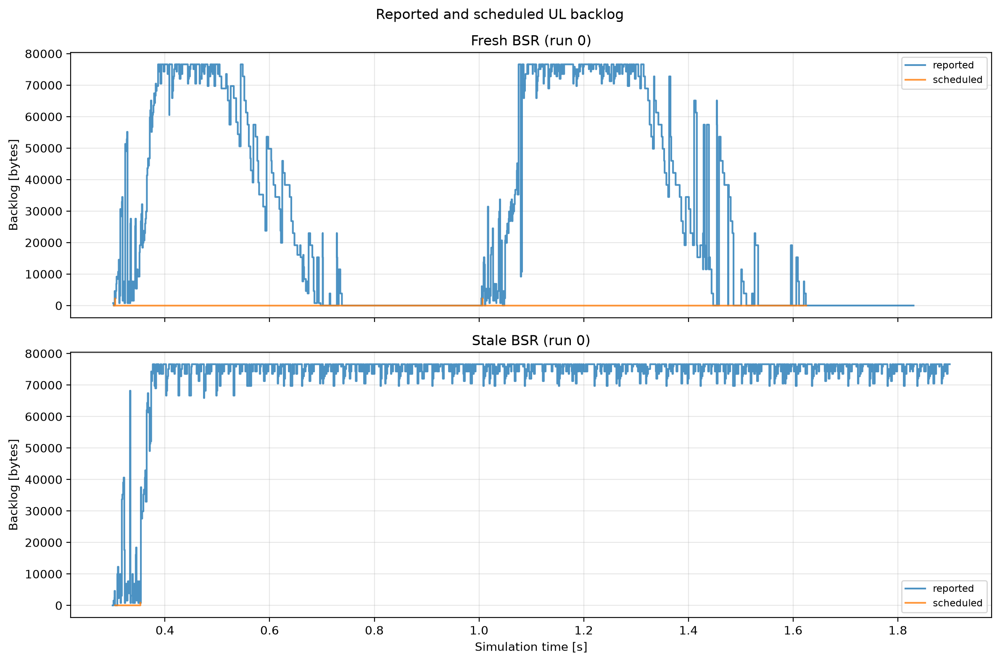

# HE Buffer Status Report Scheduling

This example records the AP's buffer-status view and scheduled-byte decisions
for the topology in [HeBsrNetwork.ned](HeBsrNetwork.ned) and the treatments in
[omnetpp.ini](omnetpp.ini). Claims below are restricted to the named vectors
and run-0 packet observations.

## Run the example

```sh
bin/inet -u Cmdenv -c BurstyTraffic \
  examples/ieee80211ax/he_bsr/omnetpp.ini -r 0
bin/inet -u Cmdenv -c StaleBsr \
  examples/ieee80211ax/he_bsr/omnetpp.ini -r 0
```

Generate five runs per plotted configuration and rebuild the figure:

```sh
python3 examples/ieee80211ax/analysis/run_campaign.py bsr -j$(nproc)
MPLCONFIGDIR=/tmp/matplotlib \
  python3 examples/ieee80211ax/analysis/first_tranche.py bsr
```

The campaign files are under
[`results/scalar-vector/20260725T120411Z`](results/scalar-vector/20260725T120411Z).
The figure provenance,
[`bsr-reported-vs-scheduled.png.json`](../analysis/figures/bsr/bsr-reported-vs-scheduled.png.json),
lists runs `0–4`, SHA-256 digests for all `.sca` and `.vec` inputs, the
`0.3–1.9 s` window, and these result filters:

- `heUlBufferStatusReportedBytes:vector`
- `heUlBufferStatusScheduledBytes:vector`

## Scalar/vector evidence



The figure uses event-driven step observations from run 0. Across runs `0–4`,
a time-weighted mean of `heUlBufferStatusReportedBytes:vector` is
`27,145 ± 704 B` for `BurstyTraffic` and `72,371 ± 151 B` for `StaleBsr`
(mean ± 95% Student-t confidence interval over `0.3–1.9 s`).

Raw sample means are not interchangeable with those values because the vector
emits when state changes. The `BurstyTraffic`
`heUlBufferStatusScheduledBytes:vector` begins after the measurement-window
start and supplies no initial state; consequently, these artifacts do not
define a time-weighted scheduled-backlog mean.

```sh
opp_scavetool query -l \
  -f 'type =~ vector AND (name =~ "heUlBufferStatusReportedBytes:vector" OR name =~ "heUlBufferStatusScheduledBytes:vector")' \
  examples/ieee80211ax/he_bsr/results/scalar-vector/20260725T120411Z/*/*.vec
```

The two reported-backlog confidence intervals do not overlap. This is a
comparison of the AP's recorded queue-state view, not an application
throughput comparison.

## Packet evidence

The retained run-0 capture session is
[`results/packet-statistics/20260724T175025Z`](results/packet-statistics/20260724T175025Z).
Its AP/global observation totals are:

| Configuration | Transmission observations |
|---|---:|
| `FullBsrAccounting` | 3049 |
| `ImplicitBsr` | 2808 |
| `StaleBsr` | 3107 |

The packet-statistics tables report 56 Trigger observations for
`FullBsrAccounting` and 69 for `StaleBsr`. They also report HE-TB QoS Null
observations in both configurations: 6 at MCS 0 plus 159 at MCS 2 for
`FullBsrAccounting`, and 51 at MCS 0 plus 155 at MCS 2 for `StaleBsr`.
Those exact frame-type counts establish Trigger/response activity; they do not
by themselves identify report freshness or delivered payload.

Inspect the AP-side `StaleBsr` capture:

```sh
tshark -n -r \
  'examples/ieee80211ax/he_bsr/results/packet-statistics/20260724T175025Z/StaleBsr/StaleBsr-#0HeBsrNetwork.ap.wlan[0].pcap' \
  -c 25
```

Regenerate the packet artifacts with:

```sh
MPLCONFIGDIR=/tmp/matplotlib \
  python3 examples/ieee80211ax/analysis/analyze_pcap_types.py \
  --generate --subdir he_bsr
```

Use the AP coordinator vectors, rather than QoS Data counts, to determine
reported or scheduled backlog. Use `packet_statistics.png` for the retained
frame-type, RU, duration, frequency, signal, power, and estimated-airtime
tables.
