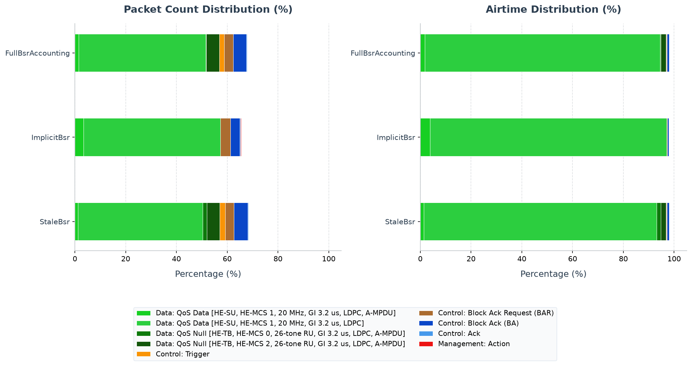

# HE Buffer Status Report scheduling walkthrough

<!-- BEGIN SCRIPT RESULTS SESSIONS -->
`[script]` results sessions:

- Scalar/vector: `20260725T120411Z`
- PCAP: `20260725T230736Z`
<!-- END SCRIPT RESULTS SESSIONS -->

`[agent]` results sessions: `20260725T120411Z`, `20260725T230736Z`.

This walkthrough teaches how an access point (AP) obtains high-efficiency
(HE) station queue information and uses it for uplink orthogonal
frequency-division multiple access (OFDMA) scheduling. It validates only the
retained BSR-poll exchange, AP backlog vectors, and the stated five-run
comparison; the missing report-to-decision join remains explicit.

## [agent] Learning objectives and feature primer

After completing this walkthrough, the reader can:

- distinguish a Buffer Status Report Poll (BSRP) Trigger from its HE
  trigger-based (HE-TB) responses;
- find the AP's reported- and scheduled-backlog telemetry;
- explain why a queue-state average is not proof that a particular report
  caused a particular resource-unit (RU) allocation; and
- reproduce one run and the first-line result and packet diagnostics.

A station (STA) can report queued traffic in a QoS frame. The AP may solicit
reports by broadcasting a BSRP Trigger; selected STAs respond simultaneously
on assigned RUs. INET's backlog-based uplink scheduler then has a queue view
from which it can construct later Trigger allocations. The validation outcome
is: a retained run passes the protocol-visible BSRP/HE-TB exchange check and
the campaign passes the backlog-state comparison, but the causal
report-to-scheduling invariant is `INCONCLUSIVE`.

## [agent] Scenario description

[HeBsrNetwork.ned](HeBsrNetwork.ned) extends the common single-BSS network
with one wired UDP server, one stationary AP, and three stationary STAs.
Each STA is 60 m from the AP. Traffic is uplink to UDP port 5000 over a
20 MHz, 5 GHz channel with no configured mobility or external interferer.
[omnetpp.ini](omnetpp.ini) defines a 0.2 s warm-up and either saturated,
stale-report, implicit-report, or two-burst traffic over a 2 s run.

```text
host[0..2] -- 802.11ax uplink --> AP -- Ethernet --> server
             BSRP / HE-TB          scheduler
```

`BurstyTraffic` isolates queue-state changes with bursts at 0.3--0.5 s and
1.0--1.3 s. `StaleBsr` instead uses continuous offered load and a 10 ms
report maximum age, so it is a stress case rather than a clean
single-parameter control for burstiness.

## [agent] Standards and INET model boundary

IEEE Std 802.11-2024 Table 9-47 assigns Trigger Type 4 to BSRP, and
Clause 26.5.5 defines solicited BSR operation and queue-size reporting
(`80211ax-2024:chunk:01660`, `80211ax-2024:chunk:09817`). INET configures
`HeHcf`, `HeUlSchedulerBacklogBased`, and AP report freshness as model
abstractions. Configuration proves what was requested; the AP vectors expose
model state; the radiotap/802.11 capture exposes Trigger and HE-TB frames.
The capture does not expose the scheduler's consumed-backlog decision key,
and the model vectors do not retain one, so exact standards-to-decision
causality is not claimed.

## [agent] Evidence status

| Claim or check | Status | Authoritative evidence | Runs/seeds | Scope or gap |
|---|---|---|---|---|
| BSRP followed by HE-TB responses | `PASS` | AP PCAP session `20260725T230736Z`, frames 1--4 | `StaleBsr`, run 0 | Direct packet observation at AP |
| Reported backlog differs between bursty and stale stress cases | `PASS` | `heUlBufferStatusReportedBytes:vector`; figure provenance | runs 0--4 per config | Derived time-weighted means over 0.3--1.9 s |
| Reported backlog is joined to scheduler-consumed backlog | `INCONCLUSIVE` | experiment contract and the two AP vectors | retained campaigns | No stable scheduling-decision identifier |
| Application delivery consequence | `NOT RUN` | no matched analysis retained | — | No stated acceptance criterion |

## [agent] Configuration matrix

| Configuration | Role | Feature gate/delta | Workload/channel | Runs/seeds | Expected invariant |
|---|---|---|---|---|---|
| `FullBsrAccounting` | treatment basis | default report lifetime | saturated uplink; 20 MHz | packet run 0 | explicit BSR activity |
| `StaleBsr` | freshness stress | `reportMaxAge=10ms` | saturated uplink; matched PHY | packet run 0; scalar runs 0--4 | frequent polling and larger recorded AP backlog |
| `ImplicitBsr` | alternate path | `ulTriggerCheckInterval=0.5s` | saturated uplink; matched PHY | packet run 0 | reports can arrive with SU QoS data |
| `BurstyTraffic` | workload treatment | extends full accounting; two bursts | bursty uplink; matched PHY | scalar runs 0--4 | AP backlog falls and rises with offered load |

All rows inherit `HeHcf`, the backlog scheduler, three STAs, MCS 2 scheduler
default, and a 20 MHz channel. `BurstyTraffic` versus `StaleBsr` changes both
workload and freshness policy, so it is not a causal estimate of either delta
alone. Run numbers are retained; the seed values must be read from each result
file's run attributes rather than inferred from the run number.

## [agent] Expected invariants and diagnostic map

| Invariant | Evidence and observation point | Failure symptom | Likely subsystem | Next diagnostic |
|---|---|---|---|---|
| Trigger Type 4 receives HE-TB responses | AP PCAP fields and timestamp order | no BSRP or no responses after it | HE coordinator / reception | inspect `wlan.trigger.he.*`, then matched Cmdenv logs |
| AP records reported backlog | AP `heUlBufferStatusReportedBytes:vector` | empty result query | recorder path / BSR parsing | query result names and AP module paths |
| A consumed decision can be tied to its report | reported and scheduled vectors joined by decision ID | ambiguous many-to-many timestamp join | scheduler observability | add a stable decision identifier before regression |

## [agent] Reproduction

Run from the INET repository root:

```sh
bin/inet -u Cmdenv -f examples/ieee80211ax/he_bsr/omnetpp.ini \
  -c StaleBsr -r 0 \
  --result-dir=examples/ieee80211ax/he_bsr/results/manual/StaleBsr
```

The direct minimal command was not executed and remains `NOT RUN`. The
suite-owned packet command below was executed with exit status 0 and created
session `20260725T230736Z`:

```sh
python3 examples/ieee80211/analysis/analyze_pcap.py \
  --suite examples/ieee80211/analysis/suites/ax.json \
  --generate --subdir he_bsr --run 0 --allow-failed-evidence
```

## [agent] Scalar and vector analysis

Inputs are
`results/20260725T120411Z/{BurstyTraffic,StaleBsr}/*.{sca,vec}`;
the figure and its JSON provenance are
[bsr-reported-vs-scheduled.png](../analysis/figures/he_bsr/bsr-reported-vs-scheduled.png)
and
[bsr-reported-vs-scheduled.png.json](../analysis/figures/he_bsr/bsr-reported-vs-scheduled.png.json).

```sh
opp_scavetool query -l \
  -f 'type =~ vector AND (name =~ "heUlBufferStatusReportedBytes:vector" OR name =~ "heUlBufferStatusScheduledBytes:vector")' \
  examples/ieee80211ax/he_bsr/results/20260725T120411Z/*/*.vec
```

| Metric or invariant | Source | Window/aggregation | `BurstyTraffic` | `StaleBsr` | Interpretation |
|---|---|---|---:|---:|---|
| reported backlog | AP `heUlBufferStatusReportedBytes:vector`, B | per-run time-weighted mean, then mean ± 95% Student-t CI across 5 runs; 0.3--1.9 s | 27,145 ± 704 B | 72,371 ± 151 B | direct model state; nonoverlapping CIs |
| scheduled backlog | `heUlBufferStatusScheduledBytes:vector`, B | same intended window | undefined | not reported here | bursty vector lacks an initial state at 0.3 s |

Vector emissions are event-driven; raw sample means are invalid substitutes
for time weighting. These are five independent run summaries, not confidence
intervals over vector samples. The comparison proves different AP-recorded
queue-state trajectories, not a throughput effect or a report-to-allocation
join.
The two bursts make the fresh-condition backlog fill, drain, and refill.
Scheduled bytes should follow nonzero reports, while quiet gaps should allow
the reported state to drain. These AP telemetry vectors are scheduling-state
observations, not delivered-payload counts or exact queue occupancy between
events.

<!-- BEGIN GENERATED: ieee80211-scalar-vector-bsr -->
### [script] Generated scalar/vector plot and table


Figure provenance: [`../analysis/figures/he_bsr/bsr-reported-vs-scheduled.png.json`](../analysis/figures/he_bsr/bsr-reported-vs-scheduled.png.json). Run-level metric source: [`../analysis/metrics.json`](../analysis/metrics.json).

| Configuration or comparison | Metric | Source result filters / modules / units | Window / per-run aggregation / exclusions | Independent runs (n) | Mean or direct value | 95% CI half-width |
|---|---|---|---|---:|---:|---:|
| Fresh BSR | reported backlog time weighted mean bytes | vector / heUlBufferStatusReportedBytes:vector<br>vector / heUlBufferStatusScheduledBytes:vector | [0.3, 1.9) s; timeline=representative run 0; event-driven step observations | 5 | 27144.6 | 704.18 |
| Stale BSR | reported backlog time weighted mean bytes | vector / heUlBufferStatusReportedBytes:vector<br>vector / heUlBufferStatusScheduledBytes:vector | [0.3, 1.9) s; timeline=representative run 0; event-driven step observations | 5 | 72370.5 | 151.22 |

The table is a presentation view of the session-bound run-level summary. The source and aggregation columns reproduce the bundle-level figure provenance; the authored analysis identifies which source supports each metric and supplies the interpretation.
<!-- END GENERATED: ieee80211-scalar-vector-bsr -->

## [agent] PCAP statistics

Capture point: `HeBsrNetwork.ap.wlan[0]`

Capture:
`results/20260725T230736Z/StaleBsr/StaleBsr-#0HeBsrNetwork.ap.wlan[0].pcap`

Scope: legacy PCAP, simulation timestamps, AP packet-signal observations;
TShark 4.6.4 per retained analyzer output. FCS/checksum settings were not
retained.

```sh
tshark -n -r \
  'examples/ieee80211ax/he_bsr/results/20260725T230736Z/StaleBsr/StaleBsr-#0HeBsrNetwork.ap.wlan[0].pcap' \
  -Y 'wlan.trigger.he.trigger_type == 4' \
  -T fields -E header=y -E separator='|' \
  -e frame.number -e frame.time_epoch -e wlan.ta -e wlan.ra \
  -e wlan.trigger.he.trigger_type -e wlan.trigger.he.ul_length
```

| Configuration | Observation count | Relevant summary | Interpretation limit |
|---|---:|---|---|
| `FullBsrAccounting` | 3049 | 56 Trigger observations; 165 HE-TB QoS Null observations | AP/global transmission observations, not reports joined to decisions |
| `ImplicitBsr` | 2808 | nonempty protocol population | subtype total does not prove implicit report content |
| `StaleBsr` | 3107 | 69 Trigger observations; 206 HE-TB QoS Null observations | not application delivery or freshness proof |

<!-- BEGIN GENERATED: ieee80211ax-pcap-statistics -->
### [script] Generated PCAP plots and tables


Figure provenance: [`packet_statistics.png.json`](../analysis/figures/he_bsr/packet_statistics.png.json).

This section provides a statistical overview of the 802.11 frames transmitted over the wireless medium during the simulation. The packet counts were gathered from AP wireless-interface observation points. With multiple AP captures, one medium transmission may be observed at more than one AP; counts and airtime therefore represent recorded transmission observations, not de-duplicated application packets.

Capture session `20260725T230736Z` was generated from fresh PCAPng input with `TShark (Wireshark) 4.6.4.`. The selected manifest is `examples/ieee80211/analysis/generated/ax/pcapmanifests/20260725T230736Z.json` (SHA-256 `021f5981d4eb48730ed761393cba27f6816ea4c9d833bf9921e01cdcc248c0fc`). HE PPDU format, MCS, coding, bandwidth/RU, GI, and NSTS are decoded directly from standards-compliant radiotap HE fields; values not marked known by the recorder are omitted.

Two estimated airtime occupancy percentages are provided. HE-SU and HE-ER-SU use the modeled 36/44 µs preambles; a dissector-expanded A-MPDU is charged one shared preamble. HE MU/TB user-dependent signaling not exposed by radiotap remains approximate.
- **Air Time %**: This frame type's share of the sum of all estimated frame airtimes.
- **Air Time (Sim Time) %**: The sum of this frame type's estimated airtimes divided by the simulation time limit. Concurrent transmissions from multiple capture points are counted separately, so this value can exceed 100%; it is not the union of busy channel time.

#### [script] Compact cross-configuration summary

| Configuration | Observation point / counting unit | Selection/filter | Observations | Dominant decoded frame/PHY evidence | Estimated airtime / sim time | Limits |
|---|---|---|---:|---|---:|---|
| `FullBsrAccounting` | AP interface(s); capture observations<br>`examples/ieee80211ax/he_bsr/results/20260725T230736Z/FullBsrAccounting/FullBsrAccounting-#0HeBsrNetwork.ap.wlan[0].pcap` | `none (all decoded frames)` | 3049 | Data: QoS Data [HE-SU, HE-MCS 1, 20 MHz, GI 3.2 us, LDPC] (1525), Control: Ack (976), Control: Block Ack (BA) (161) | 60.85% | Not delivery or de-duplicated transmissions; unknown PHY fields stay unknown |
| `ImplicitBsr` | AP interface(s); capture observations<br>`examples/ieee80211ax/he_bsr/results/20260725T230736Z/ImplicitBsr/ImplicitBsr-#0HeBsrNetwork.ap.wlan[0].pcap` | `none (all decoded frames)` | 2808 | Data: QoS Data [HE-SU, HE-MCS 1, 20 MHz, GI 3.2 us, LDPC] (1511), Control: Ack (970), Control: Block Ack Request (BAR) (113) | 60.09% | Not delivery or de-duplicated transmissions; unknown PHY fields stay unknown |
| `StaleBsr` | AP interface(s); capture observations<br>`examples/ieee80211ax/he_bsr/results/20260725T230736Z/StaleBsr/StaleBsr-#0HeBsrNetwork.ap.wlan[0].pcap` | `none (all decoded frames)` | 3107 | Data: QoS Data [HE-SU, HE-MCS 1, 20 MHz, GI 3.2 us, LDPC] (1529), Control: Ack (977), Control: Block Ack (BA) (172) | 61.73% | Not delivery or de-duplicated transmissions; unknown PHY fields stay unknown |

### [script] Evidence checks

| Status | Requirement | Observed evidence |
|---|---|---|
| **PASS** | FullBsrAccounting produced protocol-visible wireless observations | 3049 AP/global transmission observations |
| **PASS** | ImplicitBsr produced protocol-visible wireless observations | 2808 AP/global transmission observations |
| **PASS** | StaleBsr produced protocol-visible wireless observations | 3107 AP/global transmission observations |
| **INCONCLUSIVE** | Reported backlog and scheduler-consumed backlog | The packet-type table is exchange evidence only; use the recorded feature vectors/results |

### [script] Configuration: `FullBsrAccounting`
Total over-the-air frame/MPDU transmission observations (Global BSS/AP): **3049**

| Color | Frame Type & Subtype | Count | Percentage | Mean Size | Std Dev | Mean Duration | Std Dev Duration | Freq | Mean RX Sig | Mean TX Pwr | Air Time % | Air Time (Sim Time) % |
|:---:|---|---:|---:|---:|---:|---:|---:|---:|---:|---:|---:|---:|
| <svg width="16" height="16"><rect width="16" height="16" rx="3" fill="#17cf23" /></svg> | Data: QoS Data [HE-SU, HE-MCS 1, 20 MHz, GI 3.2 us, LDPC, A-MPDU] | 47 | 1.54% | 846.5 B | 21.0 B | 473.0 us | 21.2 us | 5010 MHz | -72.0 dBm | - | 1.83% | 1.11% |
| <svg width="16" height="16"><rect width="16" height="16" rx="3" fill="#2cce3f" /></svg> | Data: QoS Data [HE-SU, HE-MCS 1, 20 MHz, GI 3.2 us, LDPC] | 1525 | 50.02% | 1286.5 B | 318.3 B | 739.7 us | 174.1 us | 5010 MHz | -72.0 dBm | - | 92.70% | 56.40% |
| <svg width="16" height="16"><rect width="16" height="16" rx="3" fill="#0d790b" /></svg> | Data: QoS Null [HE-TB, HE-MCS 0, 26-tone RU, GI 3.2 us, LDPC, A-MPDU] | 6 | 0.20% | 34.0 B | 0.0 B | 398.7 us | 0.0 us | 5002 MHz, 5004 MHz, 5006 MHz | -75.0 dBm | - | 0.20% | 0.12% |
| <svg width="16" height="16"><rect width="16" height="16" rx="3" fill="#13560b" /></svg> | Data: QoS Null [HE-TB, HE-MCS 2, 26-tone RU, GI 3.2 us, LDPC, A-MPDU] | 159 | 5.21% | 34.0 B | 0.0 B | 156.9 us | 0.0 us | 5002 MHz, 5004 MHz, 5006 MHz | -75.0 dBm | - | 2.05% | 1.25% |
| <hr> | <hr> | <hr> | <hr> | <hr> | <hr> | <hr> | <hr> | <hr> | <hr> | <hr> | <hr> | <hr> |
| <svg width="16" height="16"><rect width="16" height="16" rx="3" fill="#f99406" /></svg> | Control: Trigger | 56 | 1.84% | 47.0 B | 5.0 B | 35.7 us | 1.7 us | 5010 MHz | - | 10.0 dBm | 0.16% | 0.10% |
| <svg width="16" height="16"><rect width="16" height="16" rx="3" fill="#ab6c30" /></svg> | Control: Block Ack Request (BAR) | 107 | 3.51% | 24.0 B | 0.0 B | 28.0 us | 0.0 us | 5010 MHz | -72.0 dBm | - | 0.25% | 0.15% |
| <svg width="16" height="16"><rect width="16" height="16" rx="3" fill="#0946c8" /></svg> | Control: Block Ack (BA) | 161 | 5.28% | 119.3 B | 44.8 B | 59.8 us | 14.9 us | 5010 MHz | - | 10.0 dBm | 0.79% | 0.48% |
| <svg width="16" height="16"><rect width="16" height="16" rx="3" fill="#4799eb" /></svg> | Control: Ack | 976 | 32.01% | 14.0 B | 0.0 B | 24.7 us | 0.0 us | 5010 MHz | - | 10.0 dBm | 1.98% | 1.20% |
| <svg width="16" height="16"><rect width="16" height="16" rx="3" fill="#4799eb" /></svg> | Control: Ack | 6 | 0.20% | 14.0 B | 0.0 B | 24.7 us | 0.0 us | 5010 MHz | -72.0 dBm | 10.0 dBm | 0.01% | 0.01% |
| <hr> | <hr> | <hr> | <hr> | <hr> | <hr> | <hr> | <hr> | <hr> | <hr> | <hr> | <hr> | <hr> |
| <svg width="16" height="16"><rect width="16" height="16" rx="3" fill="#ec1313" /></svg> | Management: Action | 6 | 0.20% | 37.0 B | 0.0 B | 69.3 us | 0.0 us | 5010 MHz | -72.0 dBm | 10.0 dBm | 0.03% | 0.02% |

#### [script] Representative frame-exchange timeline

| Frame | Simulation time (s) | Transmitter → receiver | Type/PHY | Decisive fields | Role in exchange |
|---:|---:|---|---|---|---|
| `FullBsrAccounting-#0HeBsrNetwork.ap.wlan[0].pcap:1` | 0.001048000 | 10:00:00:00:00:00 → ff:ff:ff:ff:ff:ff | Control: Trigger / Legacy/HT/VHT | direction=direct/IBSS, retry=0, seq=-, frag=-, more-frag=0, TID=- | Coordinates the following HE multi-user response. |
| `FullBsrAccounting-#0HeBsrNetwork.ap.wlan[0].pcap:2` | 0.002064000 | 0a:aa:00:00:00:01 → 10:00:00:00:00:00 | Data: QoS Null / HE-TB, HE-MCS 0, 26-tone RU, NSS 1, GI 3.2 us, LDPC | direction=to DS, retry=0, seq=0, frag=0, more-frag=0, TID=0, A-MPDU=226 | Carries protocol-visible MAC payload in the representative exchange. |
| `FullBsrAccounting-#0HeBsrNetwork.ap.wlan[0].pcap:3` | 0.002064000 | 0a:aa:00:00:00:02 → 10:00:00:00:00:00 | Data: QoS Null / HE-TB, HE-MCS 0, 26-tone RU, NSS 1, GI 3.2 us, LDPC | direction=to DS, retry=0, seq=0, frag=0, more-frag=0, TID=0, A-MPDU=230 | Carries protocol-visible MAC payload in the representative exchange. |
| `FullBsrAccounting-#0HeBsrNetwork.ap.wlan[0].pcap:4` | 0.002064000 | 0a:aa:00:00:00:03 → 10:00:00:00:00:00 | Data: QoS Null / HE-TB, HE-MCS 0, 26-tone RU, NSS 1, GI 3.2 us, LDPC | direction=to DS, retry=0, seq=0, frag=0, more-frag=0, TID=0, A-MPDU=234 | Carries protocol-visible MAC payload in the representative exchange. |
| `FullBsrAccounting-#0HeBsrNetwork.ap.wlan[0].pcap:5` | 0.002133000 | 10:00:00:00:00:00 → ff:ff:ff:ff:ff:ff | Control: Block Ack (BA) / Legacy/HT/VHT | direction=direct/IBSS, retry=0, seq=-, frag=-, more-frag=0, TID=- | Acknowledges a preceding aggregate or scheduled transmission. |
| `FullBsrAccounting-#0HeBsrNetwork.ap.wlan[0].pcap:6` | 0.103048000 | 10:00:00:00:00:00 → ff:ff:ff:ff:ff:ff | Control: Trigger / Legacy/HT/VHT | direction=direct/IBSS, retry=0, seq=-, frag=-, more-frag=0, TID=- | Coordinates the following HE multi-user response. |
| `FullBsrAccounting-#0HeBsrNetwork.ap.wlan[0].pcap:7` | 0.104064000 | 0a:aa:00:00:00:01 → 10:00:00:00:00:00 | Data: QoS Null / HE-TB, HE-MCS 0, 26-tone RU, NSS 1, GI 3.2 us, LDPC | direction=to DS, retry=0, seq=1, frag=0, more-frag=0, TID=0, A-MPDU=424 | Carries protocol-visible MAC payload in the representative exchange. |
| `FullBsrAccounting-#0HeBsrNetwork.ap.wlan[0].pcap:8` | 0.104064000 | 0a:aa:00:00:00:02 → 10:00:00:00:00:00 | Data: QoS Null / HE-TB, HE-MCS 0, 26-tone RU, NSS 1, GI 3.2 us, LDPC | direction=to DS, retry=0, seq=1, frag=0, more-frag=0, TID=0, A-MPDU=428 | Carries protocol-visible MAC payload in the representative exchange. |
| `FullBsrAccounting-#0HeBsrNetwork.ap.wlan[0].pcap:9` | 0.104064000 | 0a:aa:00:00:00:03 → 10:00:00:00:00:00 | Data: QoS Null / HE-TB, HE-MCS 0, 26-tone RU, NSS 1, GI 3.2 us, LDPC | direction=to DS, retry=0, seq=1, frag=0, more-frag=0, TID=0, A-MPDU=432 | Carries protocol-visible MAC payload in the representative exchange. |
| `FullBsrAccounting-#0HeBsrNetwork.ap.wlan[0].pcap:10` | 0.104133000 | 10:00:00:00:00:00 → ff:ff:ff:ff:ff:ff | Control: Block Ack (BA) / Legacy/HT/VHT | direction=direct/IBSS, retry=0, seq=-, frag=-, more-frag=0, TID=- | Acknowledges a preceding aggregate or scheduled transmission. |
| `FullBsrAccounting-#0HeBsrNetwork.ap.wlan[0].pcap:11` | 0.200484000 | 0a:aa:00:00:00:01 → 10:00:00:00:00:00 | Data: QoS Data / HE-SU, HE-MCS 1, 20 MHz, NSS 1, GI 3.2 us, LDPC | direction=to DS, retry=0, seq=0, frag=0, more-frag=0, TID=6 | Carries protocol-visible MAC payload in the representative exchange. |
| `FullBsrAccounting-#0HeBsrNetwork.ap.wlan[0].pcap:12` | 0.201077000 | 0a:aa:00:00:00:01 → 10:00:00:00:00:00 | Data: QoS Data / HE-SU, HE-MCS 1, 20 MHz, NSS 1, GI 3.2 us, LDPC | direction=to DS, retry=1, seq=0, frag=0, more-frag=0, TID=6 | Carries protocol-visible MAC payload in the representative exchange. |
| `FullBsrAccounting-#0HeBsrNetwork.ap.wlan[0].pcap:13` | 0.201682000 | 0a:aa:00:00:00:03 → 10:00:00:00:00:00 | Data: QoS Data / HE-SU, HE-MCS 1, 20 MHz, NSS 1, GI 3.2 us, LDPC | direction=to DS, retry=1, seq=0, frag=0, more-frag=0, TID=6 | Carries protocol-visible MAC payload in the representative exchange. |
| `FullBsrAccounting-#0HeBsrNetwork.ap.wlan[0].pcap:14` | 0.201730000 | ? → 0a:aa:00:00:00:03 | Control: Ack / Legacy/HT/VHT | direction=direct/IBSS, retry=0, seq=-, frag=-, more-frag=0, TID=- | Acknowledges the preceding unicast frame. |
| `FullBsrAccounting-#0HeBsrNetwork.ap.wlan[0].pcap:16` | 0.201827000 | ? → 0a:aa:00:00:00:03 | Control: Ack / Legacy/HT/VHT | direction=direct/IBSS, retry=0, seq=-, frag=-, more-frag=0, TID=- | Acknowledges the preceding unicast frame. |
| `FullBsrAccounting-#0HeBsrNetwork.ap.wlan[0].pcap:17` | 0.202345000 | 0a:aa:00:00:00:02 → 10:00:00:00:00:00 | Data: QoS Data / HE-SU, HE-MCS 1, 20 MHz, NSS 1, GI 3.2 us, LDPC | direction=to DS, retry=1, seq=0, frag=0, more-frag=0, TID=6 | Carries protocol-visible MAC payload in the representative exchange. |

Frame numbers are local to the named capture, not OMNeT++ event numbers. For readability, the table collapses observations with the same timestamp and MAC identity across capture interfaces; aggregate PCAP statistics retain the original observation counts.

### [script] Configuration: `ImplicitBsr`
Total over-the-air frame/MPDU transmission observations (Global BSS/AP): **2808**

| Color | Frame Type & Subtype | Count | Percentage | Mean Size | Std Dev | Mean Duration | Std Dev Duration | Freq | Mean RX Sig | Mean TX Pwr | Air Time % | Air Time (Sim Time) % |
|:---:|---|---:|---:|---:|---:|---:|---:|---:|---:|---:|---:|---:|
| <svg width="16" height="16"><rect width="16" height="16" rx="3" fill="#17cf23" /></svg> | Data: QoS Data [HE-SU, HE-MCS 1, 20 MHz, GI 3.2 us, LDPC, A-MPDU] | 97 | 3.45% | 851.1 B | 8.7 B | 474.5 us | 16.5 us | 5010 MHz | -72.0 dBm | - | 3.83% | 2.30% |
| <svg width="16" height="16"><rect width="16" height="16" rx="3" fill="#2cce3f" /></svg> | Data: QoS Data [HE-SU, HE-MCS 1, 20 MHz, GI 3.2 us, LDPC] | 1511 | 53.81% | 1290.1 B | 315.0 B | 741.7 us | 172.3 us | 5010 MHz | -72.0 dBm | - | 93.25% | 56.04% |
| <hr> | <hr> | <hr> | <hr> | <hr> | <hr> | <hr> | <hr> | <hr> | <hr> | <hr> | <hr> | <hr> |
| <svg width="16" height="16"><rect width="16" height="16" rx="3" fill="#ab6c30" /></svg> | Control: Block Ack Request (BAR) | 113 | 4.02% | 24.0 B | 0.0 B | 28.0 us | 0.0 us | 5010 MHz | -72.0 dBm | - | 0.26% | 0.16% |
| <svg width="16" height="16"><rect width="16" height="16" rx="3" fill="#0946c8" /></svg> | Control: Block Ack (BA) | 105 | 3.74% | 152.0 B | 0.0 B | 70.7 us | 0.0 us | 5010 MHz | - | 10.0 dBm | 0.62% | 0.37% |
| <svg width="16" height="16"><rect width="16" height="16" rx="3" fill="#4799eb" /></svg> | Control: Ack | 970 | 34.54% | 14.0 B | 0.0 B | 24.7 us | 0.0 us | 5010 MHz | - | 10.0 dBm | 1.99% | 1.20% |
| <svg width="16" height="16"><rect width="16" height="16" rx="3" fill="#4799eb" /></svg> | Control: Ack | 6 | 0.21% | 14.0 B | 0.0 B | 24.7 us | 0.0 us | 5010 MHz | -72.0 dBm | 10.0 dBm | 0.01% | 0.01% |
| <hr> | <hr> | <hr> | <hr> | <hr> | <hr> | <hr> | <hr> | <hr> | <hr> | <hr> | <hr> | <hr> |
| <svg width="16" height="16"><rect width="16" height="16" rx="3" fill="#ec1313" /></svg> | Management: Action | 6 | 0.21% | 37.0 B | 0.0 B | 69.3 us | 0.0 us | 5010 MHz | -72.0 dBm | 10.0 dBm | 0.03% | 0.02% |

#### [script] Representative frame-exchange timeline

| Frame | Simulation time (s) | Transmitter → receiver | Type/PHY | Decisive fields | Role in exchange |
|---:|---:|---|---|---|---|
| `ImplicitBsr-#0HeBsrNetwork.ap.wlan[0].pcap:1` | 0.200484000 | 0a:aa:00:00:00:01 → 10:00:00:00:00:00 | Data: QoS Data / HE-SU, HE-MCS 1, 20 MHz, NSS 1, GI 3.2 us, LDPC | direction=to DS, retry=0, seq=0, frag=0, more-frag=0, TID=6 | Carries protocol-visible MAC payload in the representative exchange. |
| `ImplicitBsr-#0HeBsrNetwork.ap.wlan[0].pcap:2` | 0.201059000 | 0a:aa:00:00:00:02 → 10:00:00:00:00:00 | Data: QoS Data / HE-SU, HE-MCS 1, 20 MHz, NSS 1, GI 3.2 us, LDPC | direction=to DS, retry=1, seq=0, frag=0, more-frag=0, TID=6 | Carries protocol-visible MAC payload in the representative exchange. |
| `ImplicitBsr-#0HeBsrNetwork.ap.wlan[0].pcap:3` | 0.201107000 | ? → 0a:aa:00:00:00:02 | Control: Ack / Legacy/HT/VHT | direction=direct/IBSS, retry=0, seq=-, frag=-, more-frag=0, TID=- | Acknowledges the preceding unicast frame. |
| `ImplicitBsr-#0HeBsrNetwork.ap.wlan[0].pcap:5` | 0.201203000 | ? → 0a:aa:00:00:00:02 | Control: Ack / Legacy/HT/VHT | direction=direct/IBSS, retry=0, seq=-, frag=-, more-frag=0, TID=- | Acknowledges the preceding unicast frame. |
| `ImplicitBsr-#0HeBsrNetwork.ap.wlan[0].pcap:7` | 0.201318000 | ? → 10:00:00:00:00:00 | Control: Ack / Legacy/HT/VHT | direction=direct/IBSS, retry=0, seq=-, frag=-, more-frag=0, TID=- | Acknowledges the preceding unicast frame. |
| `ImplicitBsr-#0HeBsrNetwork.ap.wlan[0].pcap:8` | 0.201872000 | 0a:aa:00:00:00:01 → 10:00:00:00:00:00 | Data: QoS Data / HE-SU, HE-MCS 1, 20 MHz, NSS 1, GI 3.2 us, LDPC | direction=to DS, retry=1, seq=0, frag=0, more-frag=0, TID=6 | Carries protocol-visible MAC payload in the representative exchange. |
| `ImplicitBsr-#0HeBsrNetwork.ap.wlan[0].pcap:9` | 0.202543000 | 0a:aa:00:00:00:01 → 10:00:00:00:00:00 | Data: QoS Data / HE-SU, HE-MCS 1, 20 MHz, NSS 1, GI 3.2 us, LDPC | direction=to DS, retry=1, seq=0, frag=0, more-frag=0, TID=6 | Carries protocol-visible MAC payload in the representative exchange. |
| `ImplicitBsr-#0HeBsrNetwork.ap.wlan[0].pcap:10` | 0.202591000 | ? → 0a:aa:00:00:00:01 | Control: Ack / Legacy/HT/VHT | direction=direct/IBSS, retry=0, seq=-, frag=-, more-frag=0, TID=- | Acknowledges the preceding unicast frame. |
| `ImplicitBsr-#0HeBsrNetwork.ap.wlan[0].pcap:12` | 0.202687000 | ? → 0a:aa:00:00:00:01 | Control: Ack / Legacy/HT/VHT | direction=direct/IBSS, retry=0, seq=-, frag=-, more-frag=0, TID=- | Acknowledges the preceding unicast frame. |
| `ImplicitBsr-#0HeBsrNetwork.ap.wlan[0].pcap:14` | 0.202829000 | ? → 10:00:00:00:00:00 | Control: Ack / Legacy/HT/VHT | direction=direct/IBSS, retry=0, seq=-, frag=-, more-frag=0, TID=- | Acknowledges the preceding unicast frame. |
| `ImplicitBsr-#0HeBsrNetwork.ap.wlan[0].pcap:15` | 0.203356000 | 0a:aa:00:00:00:03 → 10:00:00:00:00:00 | Data: QoS Data / HE-SU, HE-MCS 1, 20 MHz, NSS 1, GI 3.2 us, LDPC | direction=to DS, retry=1, seq=0, frag=0, more-frag=0, TID=6 | Carries protocol-visible MAC payload in the representative exchange. |
| `ImplicitBsr-#0HeBsrNetwork.ap.wlan[0].pcap:16` | 0.203404000 | ? → 0a:aa:00:00:00:03 | Control: Ack / Legacy/HT/VHT | direction=direct/IBSS, retry=0, seq=-, frag=-, more-frag=0, TID=- | Acknowledges the preceding unicast frame. |
| `ImplicitBsr-#0HeBsrNetwork.ap.wlan[0].pcap:18` | 0.203500000 | ? → 0a:aa:00:00:00:03 | Control: Ack / Legacy/HT/VHT | direction=direct/IBSS, retry=0, seq=-, frag=-, more-frag=0, TID=- | Acknowledges the preceding unicast frame. |
| `ImplicitBsr-#0HeBsrNetwork.ap.wlan[0].pcap:20` | 0.203615000 | ? → 10:00:00:00:00:00 | Control: Ack / Legacy/HT/VHT | direction=direct/IBSS, retry=0, seq=-, frag=-, more-frag=0, TID=- | Acknowledges the preceding unicast frame. |
| `ImplicitBsr-#0HeBsrNetwork.ap.wlan[0].pcap:21` | 0.300484000 | 0a:aa:00:00:00:01 → 10:00:00:00:00:00 | Data: QoS Data / HE-SU, HE-MCS 1, 20 MHz, NSS 1, GI 3.2 us, LDPC | direction=to DS, retry=0, seq=1, frag=0, more-frag=0, TID=6 | Carries protocol-visible MAC payload in the representative exchange. |
| `ImplicitBsr-#0HeBsrNetwork.ap.wlan[0].pcap:22` | 0.300984000 | 0a:aa:00:00:00:01 → 10:00:00:00:00:00 | Data: QoS Data / HE-SU, HE-MCS 1, 20 MHz, NSS 1, GI 3.2 us, LDPC | direction=to DS, retry=0, seq=2, frag=0, more-frag=0, TID=6 | Carries protocol-visible MAC payload in the representative exchange. |

Frame numbers are local to the named capture, not OMNeT++ event numbers. For readability, the table collapses observations with the same timestamp and MAC identity across capture interfaces; aggregate PCAP statistics retain the original observation counts.

### [script] Configuration: `StaleBsr`
Total over-the-air frame/MPDU transmission observations (Global BSS/AP): **3107**

| Color | Frame Type & Subtype | Count | Percentage | Mean Size | Std Dev | Mean Duration | Std Dev Duration | Freq | Mean RX Sig | Mean TX Pwr | Air Time % | Air Time (Sim Time) % |
|:---:|---|---:|---:|---:|---:|---:|---:|---:|---:|---:|---:|---:|
| <svg width="16" height="16"><rect width="16" height="16" rx="3" fill="#17cf23" /></svg> | Data: QoS Data [HE-SU, HE-MCS 1, 20 MHz, GI 3.2 us, LDPC, A-MPDU] | 37 | 1.19% | 845.0 B | 23.5 B | 472.9 us | 22.7 us | 5010 MHz | -72.0 dBm | - | 1.42% | 0.87% |
| <svg width="16" height="16"><rect width="16" height="16" rx="3" fill="#2cce3f" /></svg> | Data: QoS Data [HE-SU, HE-MCS 1, 20 MHz, GI 3.2 us, LDPC] | 1529 | 49.21% | 1287.9 B | 314.2 B | 740.5 us | 171.9 us | 5010 MHz | -72.0 dBm | - | 91.71% | 56.61% |
| <svg width="16" height="16"><rect width="16" height="16" rx="3" fill="#0d790b" /></svg> | Data: QoS Null [HE-TB, HE-MCS 0, 26-tone RU, GI 3.2 us, LDPC, A-MPDU] | 51 | 1.64% | 34.0 B | 0.0 B | 398.7 us | 0.0 us | 5002 MHz, 5004 MHz, 5006 MHz | -75.0 dBm | - | 1.65% | 1.02% |
| <svg width="16" height="16"><rect width="16" height="16" rx="3" fill="#13560b" /></svg> | Data: QoS Null [HE-TB, HE-MCS 2, 26-tone RU, GI 3.2 us, LDPC, A-MPDU] | 155 | 4.99% | 34.0 B | 0.0 B | 156.9 us | 0.0 us | 5002 MHz, 5004 MHz, 5006 MHz | -75.0 dBm | - | 1.97% | 1.22% |
| <hr> | <hr> | <hr> | <hr> | <hr> | <hr> | <hr> | <hr> | <hr> | <hr> | <hr> | <hr> | <hr> |
| <svg width="16" height="16"><rect width="16" height="16" rx="3" fill="#f99406" /></svg> | Control: Trigger | 69 | 2.22% | 52.6 B | 11.7 B | 37.5 us | 3.9 us | 5010 MHz | - | 10.0 dBm | 0.21% | 0.13% |
| <svg width="16" height="16"><rect width="16" height="16" rx="3" fill="#ab6c30" /></svg> | Control: Block Ack Request (BAR) | 105 | 3.38% | 24.0 B | 0.0 B | 28.0 us | 0.0 us | 5010 MHz | -72.0 dBm | - | 0.24% | 0.15% |
| <svg width="16" height="16"><rect width="16" height="16" rx="3" fill="#0946c8" /></svg> | Control: Block Ack (BA) | 172 | 5.54% | 114.2 B | 46.2 B | 58.1 us | 15.4 us | 5010 MHz | - | 10.0 dBm | 0.81% | 0.50% |
| <svg width="16" height="16"><rect width="16" height="16" rx="3" fill="#4799eb" /></svg> | Control: Ack | 977 | 31.45% | 14.0 B | 0.0 B | 24.7 us | 0.0 us | 5010 MHz | - | 10.0 dBm | 1.95% | 1.20% |
| <svg width="16" height="16"><rect width="16" height="16" rx="3" fill="#4799eb" /></svg> | Control: Ack | 6 | 0.19% | 14.0 B | 0.0 B | 24.7 us | 0.0 us | 5010 MHz | -72.0 dBm | 10.0 dBm | 0.01% | 0.01% |
| <hr> | <hr> | <hr> | <hr> | <hr> | <hr> | <hr> | <hr> | <hr> | <hr> | <hr> | <hr> | <hr> |
| <svg width="16" height="16"><rect width="16" height="16" rx="3" fill="#ec1313" /></svg> | Management: Action | 6 | 0.19% | 37.0 B | 0.0 B | 69.3 us | 0.0 us | 5010 MHz | -72.0 dBm | 10.0 dBm | 0.03% | 0.02% |

#### [script] Representative frame-exchange timeline

| Frame | Simulation time (s) | Transmitter → receiver | Type/PHY | Decisive fields | Role in exchange |
|---:|---:|---|---|---|---|
| `StaleBsr-#0HeBsrNetwork.ap.wlan[0].pcap:1` | 0.001048000 | 10:00:00:00:00:00 → ff:ff:ff:ff:ff:ff | Control: Trigger / Legacy/HT/VHT | direction=direct/IBSS, retry=0, seq=-, frag=-, more-frag=0, TID=- | Coordinates the following HE multi-user response. |
| `StaleBsr-#0HeBsrNetwork.ap.wlan[0].pcap:2` | 0.002064000 | 0a:aa:00:00:00:01 → 10:00:00:00:00:00 | Data: QoS Null / HE-TB, HE-MCS 0, 26-tone RU, NSS 1, GI 3.2 us, LDPC | direction=to DS, retry=0, seq=0, frag=0, more-frag=0, TID=0, A-MPDU=226 | Carries protocol-visible MAC payload in the representative exchange. |
| `StaleBsr-#0HeBsrNetwork.ap.wlan[0].pcap:3` | 0.002064000 | 0a:aa:00:00:00:02 → 10:00:00:00:00:00 | Data: QoS Null / HE-TB, HE-MCS 0, 26-tone RU, NSS 1, GI 3.2 us, LDPC | direction=to DS, retry=0, seq=0, frag=0, more-frag=0, TID=0, A-MPDU=230 | Carries protocol-visible MAC payload in the representative exchange. |
| `StaleBsr-#0HeBsrNetwork.ap.wlan[0].pcap:4` | 0.002064000 | 0a:aa:00:00:00:03 → 10:00:00:00:00:00 | Data: QoS Null / HE-TB, HE-MCS 0, 26-tone RU, NSS 1, GI 3.2 us, LDPC | direction=to DS, retry=0, seq=0, frag=0, more-frag=0, TID=0, A-MPDU=234 | Carries protocol-visible MAC payload in the representative exchange. |
| `StaleBsr-#0HeBsrNetwork.ap.wlan[0].pcap:5` | 0.002133000 | 10:00:00:00:00:00 → ff:ff:ff:ff:ff:ff | Control: Block Ack (BA) / Legacy/HT/VHT | direction=direct/IBSS, retry=0, seq=-, frag=-, more-frag=0, TID=- | Acknowledges a preceding aggregate or scheduled transmission. |
| `StaleBsr-#0HeBsrNetwork.ap.wlan[0].pcap:6` | 0.013048000 | 10:00:00:00:00:00 → ff:ff:ff:ff:ff:ff | Control: Trigger / Legacy/HT/VHT | direction=direct/IBSS, retry=0, seq=-, frag=-, more-frag=0, TID=- | Coordinates the following HE multi-user response. |
| `StaleBsr-#0HeBsrNetwork.ap.wlan[0].pcap:7` | 0.014064000 | 0a:aa:00:00:00:01 → 10:00:00:00:00:00 | Data: QoS Null / HE-TB, HE-MCS 0, 26-tone RU, NSS 1, GI 3.2 us, LDPC | direction=to DS, retry=0, seq=1, frag=0, more-frag=0, TID=0, A-MPDU=424 | Carries protocol-visible MAC payload in the representative exchange. |
| `StaleBsr-#0HeBsrNetwork.ap.wlan[0].pcap:8` | 0.014064000 | 0a:aa:00:00:00:02 → 10:00:00:00:00:00 | Data: QoS Null / HE-TB, HE-MCS 0, 26-tone RU, NSS 1, GI 3.2 us, LDPC | direction=to DS, retry=0, seq=1, frag=0, more-frag=0, TID=0, A-MPDU=428 | Carries protocol-visible MAC payload in the representative exchange. |
| `StaleBsr-#0HeBsrNetwork.ap.wlan[0].pcap:9` | 0.014064000 | 0a:aa:00:00:00:03 → 10:00:00:00:00:00 | Data: QoS Null / HE-TB, HE-MCS 0, 26-tone RU, NSS 1, GI 3.2 us, LDPC | direction=to DS, retry=0, seq=1, frag=0, more-frag=0, TID=0, A-MPDU=432 | Carries protocol-visible MAC payload in the representative exchange. |
| `StaleBsr-#0HeBsrNetwork.ap.wlan[0].pcap:10` | 0.014133000 | 10:00:00:00:00:00 → ff:ff:ff:ff:ff:ff | Control: Block Ack (BA) / Legacy/HT/VHT | direction=direct/IBSS, retry=0, seq=-, frag=-, more-frag=0, TID=- | Acknowledges a preceding aggregate or scheduled transmission. |
| `StaleBsr-#0HeBsrNetwork.ap.wlan[0].pcap:11` | 0.025048000 | 10:00:00:00:00:00 → ff:ff:ff:ff:ff:ff | Control: Trigger / Legacy/HT/VHT | direction=direct/IBSS, retry=0, seq=-, frag=-, more-frag=0, TID=- | Coordinates the following HE multi-user response. |
| `StaleBsr-#0HeBsrNetwork.ap.wlan[0].pcap:12` | 0.026064000 | 0a:aa:00:00:00:01 → 10:00:00:00:00:00 | Data: QoS Null / HE-TB, HE-MCS 0, 26-tone RU, NSS 1, GI 3.2 us, LDPC | direction=to DS, retry=0, seq=2, frag=0, more-frag=0, TID=0, A-MPDU=622 | Carries protocol-visible MAC payload in the representative exchange. |
| `StaleBsr-#0HeBsrNetwork.ap.wlan[0].pcap:13` | 0.026064000 | 0a:aa:00:00:00:02 → 10:00:00:00:00:00 | Data: QoS Null / HE-TB, HE-MCS 0, 26-tone RU, NSS 1, GI 3.2 us, LDPC | direction=to DS, retry=0, seq=2, frag=0, more-frag=0, TID=0, A-MPDU=626 | Carries protocol-visible MAC payload in the representative exchange. |
| `StaleBsr-#0HeBsrNetwork.ap.wlan[0].pcap:14` | 0.026064000 | 0a:aa:00:00:00:03 → 10:00:00:00:00:00 | Data: QoS Null / HE-TB, HE-MCS 0, 26-tone RU, NSS 1, GI 3.2 us, LDPC | direction=to DS, retry=0, seq=2, frag=0, more-frag=0, TID=0, A-MPDU=630 | Carries protocol-visible MAC payload in the representative exchange. |
| `StaleBsr-#0HeBsrNetwork.ap.wlan[0].pcap:15` | 0.026133000 | 10:00:00:00:00:00 → ff:ff:ff:ff:ff:ff | Control: Block Ack (BA) / Legacy/HT/VHT | direction=direct/IBSS, retry=0, seq=-, frag=-, more-frag=0, TID=- | Acknowledges a preceding aggregate or scheduled transmission. |
| `StaleBsr-#0HeBsrNetwork.ap.wlan[0].pcap:16` | 0.037048000 | 10:00:00:00:00:00 → ff:ff:ff:ff:ff:ff | Control: Trigger / Legacy/HT/VHT | direction=direct/IBSS, retry=0, seq=-, frag=-, more-frag=0, TID=- | Coordinates the following HE multi-user response. |

Frame numbers are local to the named capture, not OMNeT++ event numbers. For readability, the table collapses observations with the same timestamp and MAC identity across capture interfaces; aggregate PCAP statistics retain the original observation counts.

### [script] Analysis of Packet Distribution
The scheduled conditions contain the expected Trigger/response activity, but a BSR is an A-Control scheduling input rather than a frame subtype. IEEE Std 802.11-2024 Clause 26.5.5 requires the report contents and capability conditions; use the AP-reported and scheduled-backlog telemetry documented above. QoS Data counts are not evidence that a BSR was fresh or that the reported bytes were delivered.
<!-- END GENERATED: ieee80211ax-pcap-statistics -->

## [agent] Frame exchange analysis

| Frame | Simulation time | Transmitter → receiver | Type/PHY | Decisive fields | Role in exchange |
|---:|---:|---|---|---|---|
| 1 | 0.001048 s | AP → broadcast | Trigger | type=4, UL length=730 | solicits BSRs |
| 2 | 0.002064 s | STA 1 → AP | QoS Null, HE-TB | MCS=0, BW/RU code=4 | first simultaneous response observation |
| 3 | 0.002064 s | STA 2 → AP | QoS Null, HE-TB | MCS=0, BW/RU code=4 | second response observation |
| 4 | 0.002064 s | STA 3 → AP | QoS Null, HE-TB | MCS=0, BW/RU code=4 | third response observation |

The equal response timestamps directly demonstrate a trigger-based concurrent
response exchange. They do not decode queue bytes or prove how a later
scheduler decision consumed them; that link remains `INCONCLUSIVE`.

## [agent] Cross-layer findings and verdict

| Claim | Verdict | Configuration evidence | Model telemetry | Packet evidence | Outcome evidence |
|---|---|---|---|---|---|
| BSR exchange is exercised | `PASS` | `HeHcf` plus backlog scheduler | report vectors exist | BSRP + three HE-TB responses | not required |
| stale stress changes AP queue view | `PASS` | 10 ms freshness plus continuous load | 72,371 ± 151 B vs 27,145 ± 704 B | both sessions have Trigger activity | no matched delivery analysis |
| a report caused a specific allocation | `INCONCLUSIVE` | scheduler requested | no join identifier | headers do not expose internal join | not analyzed |

The configuration, vector, and packet sessions support adjacent claims but
do not establish event-level causality across sessions. The bounded verdict is
that BSR exchange and AP backlog observability work in the retained scope;
scheduler accounting correctness is not yet a regression-grade invariant.
Evidence basis: the timeline is a **direct observation**, the confidence
intervals are **derived measurements**, and the proposed scheduler connection
is an **inference** that remains inconclusive.

## [agent] Limitations and inconclusive claims

- The retained vectors cannot join one report to one scheduling decision.
- The bursty/stale comparison has two causal deltas and is not a clean control.
- No application delivery, delay, fairness, or retry acceptance criterion was
  evaluated.
- One co-recorded run with report value, decision ID, scheduled bytes, Trigger
  allocation, and delivery would resolve the central causal gap.

## [agent] Further experiments

- Compare `FullBsrAccounting` and `StaleBsr` at matched saturated load and five
  paired seeds; predict more expired-report polls in the latter.
- Compare full accounting with `ImplicitBsr` while retaining report-source
  telemetry; predict fewer BSRP Trigger frames for the implicit path.
- Sweep `reportMaxAge` around one exchange duration and record timeout state
  plus delivery to expose the boundary without changing workload.

## [agent] Implementation plan

| Item | Evidence-backed plan |
|---|---|
| Demonstrated gap | no stable report-to-scheduling decision join |
| Intended behavior | expose which reported queue state a scheduler decision consumed |
| Smallest change surface | AP HE coordinator/scheduler telemetry and result recording; exact source symbols require architecture review |
| Observability | emit decision ID, STA/AC, report timestamp/bytes, scheduled bytes, and Trigger correlation |
| Validation | full/stale matched pair, one deterministic run first, then five paired seeds; co-record vectors, PCAP, and delivery |
| Compatibility and risks | telemetry must not alter event order or legacy scheduler behavior |
| Architecture and sealing | apply `inet-architectural-requirements` and check seals before any `src/inet` edit |
| Next handoff | HE scheduler implementation owner plus independent Wi-Fi regression review |

This is a proposed development path, not evidence that a named source path
executed and not authorization to modify production code.

## [agent] Artifact provenance

| Artifact family | Session/path | Configurations/runs | Tool/filter/window | Integrity notes |
|---|---|---|---|---|
| scalar/vector | `results/20260725T120411Z` | `BurstyTraffic`, `StaleBsr`; 0--4 | JSON provenance; 0.3--1.9 s | hashes retained in figure JSON |
| PCAP/results/log | `results/20260725T230736Z` | full, implicit, stale; run 0 | shared AX analyzer; TShark 4.6.4 | manifest and hashes in generated block; separate from five-run campaign |
