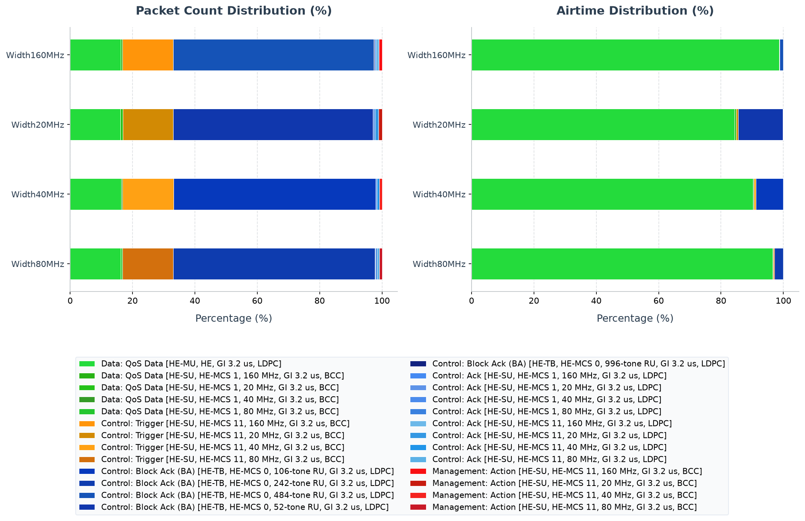

# Walkthrough - HE Channel-Width Comparison

This walkthrough guides you through the contiguous HE channel width simulation example in the INET Framework, analyzing how channel bandwidth affects transmission capacity, subchannel scheduling, and client latency.

## Background: HE Channel Bandwidths and Tones

In IEEE 802.11ax (Wi-Fi 6), the OFDM subcarrier spacing is reduced to 1/4 of the legacy spacing (78.125 kHz instead of 312.5 kHz), resulting in 4 times more subcarriers (tones) for the same bandwidth. A wider channel can carry significantly more tones, which can be allocated to a single user (HE SU) or partitioned into smaller Resource Units (RUs) for multiple concurrent users (HE MU-OFDMA).

The full-bandwidth tone allocations for the supported channel widths are:
- **20 MHz**: 242-tone RU
- **40 MHz**: 484-tone RU
- **80 MHz**: 996-tone RU
- **160 MHz**: 2x996-tone RU (contiguous 160 MHz representation, not non-contiguous 80+80 MHz)

### The noise-integration trade-off
While a wider channel increases the transmission rate, it also integrates more physical noise across the receiver band. Doubling the receiver bandwidth increases the thermal noise floor by 3 dB:
- 40 MHz has 3 dB more noise than 20 MHz.
- 80 MHz has 6 dB more noise than 20 MHz.
- 160 MHz has 9 dB more noise than 20 MHz.
Therefore, wider channels do not automatically translate to increased range or better performance in low-SNR environments unless transmit power or receiver sensitivity is adjusted.

---

## Network Topology and Configuration

The simulation runs in the `HeChannelWidthsNetwork` topology consisting of:
- **`ap`**: Access Point at `(300, 200)`.
- **`sta[0..3]`**: Four stationary client hosts arranged around the AP at close range (approx. 50-80 meters).
- **`server`**: A wired server connected to the AP via a 100G Ethernet link.
- **Traffic**: Downlink UDP traffic is sent from the server to each of the four client hosts (1000B payloads sent every 0.25ms in the saturated phase, with a single-packet trigger at t = 0.2s for ADDBA warmup).

The variables under test are the channel width and its matching physical bitrate:
- **`Width20MHz`**: 20 MHz channel, 14.625 Mbps bitrate.
- **`Width40MHz`**: 40 MHz channel, 29.25 Mbps bitrate.
- **`Width80MHz`**: 80 MHz channel, 61.25 Mbps bitrate.
- **`Width160MHz`**: 160 MHz channel, 122.5 Mbps bitrate.

---

## Running the Simulation

Run the four configurations using Cmdenv:
```sh
bin/inet -u Cmdenv -c Width20MHz examples/ieee80211ax/he_channel_widths/omnetpp.ini
bin/inet -u Cmdenv -c Width40MHz examples/ieee80211ax/he_channel_widths/omnetpp.ini
bin/inet -u Cmdenv -c Width80MHz examples/ieee80211ax/he_channel_widths/omnetpp.ini
bin/inet -u Cmdenv -c Width160MHz examples/ieee80211ax/he_channel_widths/omnetpp.ini
```

---

## Verifying and Interpreting Results

Compare the total received packets and the mean end-to-end delays at the client applications:
```sh
# Query total received packets at the clients
opp_scavetool query -l -f 'name =~ "packetReceived:count" and module =~ "*.host*app*"' examples/ieee80211ax/he_channel_widths/results/*.sca

# Query end-to-end delay histograms at the clients
opp_scavetool query -l -f 'name =~ "endToEndDelay:histogram"' examples/ieee80211ax/he_channel_widths/results/*.sca
```

### Quantitative Summary:
For each configuration, the server generates a single trigger packet per host during an idle warmup phase (`t = 0.2s` to `0.25s`) to establish Block Ack agreements, and then generates saturated traffic from `t = 0.3s` to `0.45s`. The five-seed analysis measures `0.3–0.43s`.

| Configuration | Aggregate goodput | p95 delay |
|---|---:|---:|
| **`Width20MHz`** | 23.94 Mbps | 100.88 ms |
| **`Width40MHz`** | 35.31 Mbps | 89.39 ms |
| **`Width80MHz`** | 66.15 Mbps | 48.64 ms |
| **`Width160MHz`** | 111.90 Mbps | 15.81 ms |

---

## PCAP Tshark Packet Exchange Analysis

To record PCAP traces and inspect them with TShark, run the simulation with PCAP recording and checksum computation enabled:

```sh
bin/inet -u Cmdenv -c Width20MHz examples/ieee80211ax/he_channel_widths/omnetpp.ini --result-dir=examples/ieee80211ax/he_channel_widths/results --**.numPcapRecorders=1 --**.checksumMode=\"computed\" --**.fcsMode=\"computed\"
```

Use TShark to print the timeline of packet exchanges:

```sh
tshark -n -r examples/ieee80211ax/he_channel_widths/results/Width20MHz-#0HeChannelWidthsNetwork.ap.wlan[0].pcap -c 20
```

The decoded output timeline shows:
1. **ADDBA Negotiation**: Before data transfer, the AP and client hosts negotiate block acknowledgment using 802.11 Action frames (e.g. frames 3, 5).
2. **Downlink UDP Packets**: The AP transmits UDP data frames to each client host (e.g. frames 1, 7, 11, 15) which are acknowledged by the client hosts via Block Ack frames.

---

## Analysis and Insights:

1. **Bandwidth vs. Wire-Time Delay**:
   - As the channel width increases from 20 MHz to 160 MHz, aggregate goodput rises from `23.94` to `111.90 Mbps` and p95 delay falls from `100.88` to `15.81 ms`. With the warm-up trigger setup, all four stations have nonempty arrival vectors in every run.
   - This occurs because a wider channel supports a higher physical bit rate, reducing the physical transmission duration (airtime) of the frame.

2. **Why these parameters make bandwidth visible**:
   - The `0.25 ms` per-flow interval keeps every width backlogged. If the load
     were below 20 MHz capacity, all four configurations would merely deliver
     the offered load and bandwidth would appear irrelevant.
   - The 1000-byte payload is large enough that PHY capacity matters more than
     per-packet MAC overhead. The 100 Gbit/s wired link makes its serialization
     delay negligible, so the measured trend comes from the wireless channel.
   - The stations are deliberately close to the AP. This is a capacity test,
     not a coverage test: at the cell edge, the 3 dB noise increase per width
     doubling can outweigh the extra tones.

<!-- BEGIN GENERATED: ieee80211ax-pcap-statistics -->
## 802.11 Packet Type Statistics


This section provides a statistical overview of the 802.11 frames transmitted over the wireless medium during the simulation. The packet counts were gathered from AP wireless-interface observation points. With multiple AP captures, one medium transmission may be observed at more than one AP; counts and airtime therefore represent recorded transmission observations, not de-duplicated application packets.

Capture session `20260718T132413Z` was generated from fresh PCAPng input with `TShark (Wireshark) 4.6.4.`. HE PPDU format, MCS, coding, bandwidth/RU, GI, and NSTS are decoded directly from standards-compliant radiotap HE fields; values not marked known by the recorder are omitted.

Two estimated airtime occupancy percentages are provided. HE-SU and HE-ER-SU use the modeled 36/44 µs preambles; a dissector-expanded A-MPDU is charged one shared preamble. HE MU/TB user-dependent signaling not exposed by radiotap remains approximate.
- **Air Time %**: This frame type's share of the sum of all estimated frame airtimes.
- **Air Time (Sim Time) %**: The sum of this frame type's estimated airtimes divided by the simulation time limit. Concurrent transmissions from multiple capture points are counted separately, so this value can exceed 100%; it is not the union of busy channel time.

### Evidence checks

| Status | Requirement | Observed evidence |
|---|---|---|
| **PASS** | Width160MHz produced protocol-visible wireless observations | 815 AP/global transmission observations |
| **PASS** | Width20MHz produced protocol-visible wireless observations | 693 AP/global transmission observations |
| **PASS** | Width40MHz produced protocol-visible wireless observations | 1023 AP/global transmission observations |
| **PASS** | Width80MHz produced protocol-visible wireless observations | 959 AP/global transmission observations |

### Configuration: `Width160MHz`
Total over-the-air frame/MPDU transmission observations (Global BSS/AP): **815**

| Color | Frame Type & Subtype | Count | Percentage | Mean Size | Std Dev | Mean Duration | Std Dev Duration | Freq | Mean RX Sig | Mean TX Pwr | Air Time % | Air Time (Sim Time) % |
|:---:|---|---:|---:|---:|---:|---:|---:|---:|---:|---:|---:|---:|
| <svg width="16" height="16"><rect width="16" height="16" rx="3" fill="#24db3c" /></svg> | Data: QoS Data [HE-MU, HE, GI 3.2 us, LDPC] | 132 | 16.20% | 17051.3 B | 1452.0 B | 18690.4 us | 1588.5 us | 5240 MHz | - | 15.0 dBm | 98.63% | 548.25% |
| <svg width="16" height="16"><rect width="16" height="16" rx="3" fill="#27b215" /></svg> | Data: QoS Data [HE-SU, HE-MCS 1, 160 MHz, GI 3.2 us, BCC] | 5 | 0.61% | 1066.0 B | 0.0 B | 105.6 us | 0.0 us | 5240 MHz | - | 15.0 dBm | 0.02% | 0.12% |
| <hr> | <hr> | <hr> | <hr> | <hr> | <hr> | <hr> | <hr> | <hr> | <hr> | <hr> | <hr> | <hr> |
| <svg width="16" height="16"><rect width="16" height="16" rx="3" fill="#ff950a" /></svg> | Control: Trigger [HE-SU, HE-MCS 11, 160 MHz, GI 3.2 us, BCC] | 132 | 16.20% | 63.9 B | 1.6 B | 36.5 us | 0.0 us | 5240 MHz | - | 15.0 dBm | 0.19% | 1.07% |
| <svg width="16" height="16"><rect width="16" height="16" rx="3" fill="#1553b7" /></svg> | Control: Block Ack (BA) [HE-TB, HE-MCS 0, 484-tone RU, GI 3.2 us, LDPC] | 524 | 64.29% | 32.0 B | 0.0 B | 53.5 us | 0.0 us | 5180 MHz, 5220 MHz, 5260 MHz, 5300 MHz | -71.8 dBm | - | 1.12% | 6.23% |
| <svg width="16" height="16"><rect width="16" height="16" rx="3" fill="#122381" /></svg> | Control: Block Ack (BA) [HE-TB, HE-MCS 0, 996-tone RU, GI 3.2 us, LDPC] | 2 | 0.25% | 32.0 B | 0.0 B | 44.4 us | 0.0 us | 5200 MHz, 5280 MHz | -71.5 dBm | - | 0.00% | 0.02% |
| <svg width="16" height="16"><rect width="16" height="16" rx="3" fill="#458af2" /></svg> | Control: Ack [HE-SU, HE-MCS 1, 160 MHz, GI 3.2 us, LDPC] | 4 | 0.49% | 14.0 B | 0.0 B | 36.9 us | 0.0 us | 5240 MHz | -72.0 dBm | - | 0.01% | 0.03% |
| <svg width="16" height="16"><rect width="16" height="16" rx="3" fill="#6db9e9" /></svg> | Control: Ack [HE-SU, HE-MCS 11, 160 MHz, GI 3.2 us, LDPC] | 8 | 0.98% | 14.0 B | 0.0 B | 36.1 us | 0.0 us | 5240 MHz | -72.0 dBm | 15.0 dBm | 0.01% | 0.06% |
| <hr> | <hr> | <hr> | <hr> | <hr> | <hr> | <hr> | <hr> | <hr> | <hr> | <hr> | <hr> | <hr> |
| <svg width="16" height="16"><rect width="16" height="16" rx="3" fill="#f91014" /></svg> | Management: Action [HE-SU, HE-MCS 11, 160 MHz, GI 3.2 us, BCC] | 8 | 0.98% | 37.0 B | 0.0 B | 36.3 us | 0.0 us | 5240 MHz | -72.0 dBm | 15.0 dBm | 0.01% | 0.06% |

### Configuration: `Width20MHz`
Total over-the-air frame/MPDU transmission observations (Global BSS/AP): **693**

| Color | Frame Type & Subtype | Count | Percentage | Mean Size | Std Dev | Mean Duration | Std Dev Duration | Freq | Mean RX Sig | Mean TX Pwr | Air Time % | Air Time (Sim Time) % |
|:---:|---|---:|---:|---:|---:|---:|---:|---:|---:|---:|---:|---:|
| <svg width="16" height="16"><rect width="16" height="16" rx="3" fill="#24db3c" /></svg> | Data: QoS Data [HE-MU, HE, GI 3.2 us, LDPC] | 112 | 16.16% | 4358.0 B | 0.0 B | 4803.7 us | 0.0 us | 5050 MHz | - | 15.0 dBm | 84.31% | 119.56% |
| <svg width="16" height="16"><rect width="16" height="16" rx="3" fill="#24c219" /></svg> | Data: QoS Data [HE-SU, HE-MCS 1, 20 MHz, GI 3.2 us, BCC] | 5 | 0.72% | 1066.0 B | 0.0 B | 619.1 us | 0.0 us | 5050 MHz | - | 15.0 dBm | 0.49% | 0.69% |
| <hr> | <hr> | <hr> | <hr> | <hr> | <hr> | <hr> | <hr> | <hr> | <hr> | <hr> | <hr> | <hr> |
| <svg width="16" height="16"><rect width="16" height="16" rx="3" fill="#d28a04" /></svg> | Control: Trigger [HE-SU, HE-MCS 11, 20 MHz, GI 3.2 us, BCC] | 112 | 16.16% | 64.0 B | 0.0 B | 40.2 us | 0.0 us | 5050 MHz | - | 15.0 dBm | 0.71% | 1.00% |
| <svg width="16" height="16"><rect width="16" height="16" rx="3" fill="#1037ad" /></svg> | Control: Block Ack (BA) [HE-TB, HE-MCS 0, 52-tone RU, GI 3.2 us, LDPC] | 444 | 64.07% | 32.0 B | 0.0 B | 206.7 us | 0.0 us | 5043 MHz, 5047 MHz, 5053 MHz, 5057 MHz | -71.0 dBm | - | 14.38% | 20.39% |
| <svg width="16" height="16"><rect width="16" height="16" rx="3" fill="#5e93e8" /></svg> | Control: Ack [HE-SU, HE-MCS 1, 20 MHz, GI 3.2 us, LDPC] | 4 | 0.58% | 14.0 B | 0.0 B | 43.7 us | 0.0 us | 5050 MHz | -71.0 dBm | - | 0.03% | 0.04% |
| <svg width="16" height="16"><rect width="16" height="16" rx="3" fill="#3598e3" /></svg> | Control: Ack [HE-SU, HE-MCS 11, 20 MHz, GI 3.2 us, LDPC] | 8 | 1.15% | 14.0 B | 0.0 B | 36.9 us | 0.0 us | 5050 MHz | -71.0 dBm | 15.0 dBm | 0.05% | 0.07% |
| <hr> | <hr> | <hr> | <hr> | <hr> | <hr> | <hr> | <hr> | <hr> | <hr> | <hr> | <hr> | <hr> |
| <svg width="16" height="16"><rect width="16" height="16" rx="3" fill="#c71b0f" /></svg> | Management: Action [HE-SU, HE-MCS 11, 20 MHz, GI 3.2 us, BCC] | 8 | 1.15% | 37.0 B | 0.0 B | 38.4 us | 0.0 us | 5050 MHz | -71.0 dBm | 15.0 dBm | 0.05% | 0.07% |

### Configuration: `Width40MHz`
Total over-the-air frame/MPDU transmission observations (Global BSS/AP): **1023**

| Color | Frame Type & Subtype | Count | Percentage | Mean Size | Std Dev | Mean Duration | Std Dev Duration | Freq | Mean RX Sig | Mean TX Pwr | Air Time % | Air Time (Sim Time) % |
|:---:|---|---:|---:|---:|---:|---:|---:|---:|---:|---:|---:|---:|
| <svg width="16" height="16"><rect width="16" height="16" rx="3" fill="#24db3c" /></svg> | Data: QoS Data [HE-MU, HE, GI 3.2 us, LDPC] | 167 | 16.32% | 4358.0 B | 0.0 B | 4803.7 us | 0.0 us | 5100 MHz | - | 15.0 dBm | 90.32% | 178.27% |
| <svg width="16" height="16"><rect width="16" height="16" rx="3" fill="#349b27" /></svg> | Data: QoS Data [HE-SU, HE-MCS 1, 40 MHz, GI 3.2 us, BCC] | 5 | 0.49% | 1066.0 B | 0.0 B | 327.6 us | 0.0 us | 5100 MHz | - | 15.0 dBm | 0.18% | 0.36% |
| <hr> | <hr> | <hr> | <hr> | <hr> | <hr> | <hr> | <hr> | <hr> | <hr> | <hr> | <hr> | <hr> |
| <svg width="16" height="16"><rect width="16" height="16" rx="3" fill="#ffa114" /></svg> | Control: Trigger [HE-SU, HE-MCS 11, 40 MHz, GI 3.2 us, BCC] | 167 | 16.32% | 64.0 B | 0.0 B | 38.1 us | 0.0 us | 5100 MHz | - | 15.0 dBm | 0.72% | 1.41% |
| <svg width="16" height="16"><rect width="16" height="16" rx="3" fill="#0639bc" /></svg> | Control: Block Ack (BA) [HE-TB, HE-MCS 0, 106-tone RU, GI 3.2 us, LDPC] | 664 | 64.91% | 32.0 B | 0.0 B | 116.3 us | 0.0 us | 5085 MHz, 5096 MHz, 5104 MHz, 5115 MHz | -71.0 dBm | - | 8.70% | 17.16% |
| <svg width="16" height="16"><rect width="16" height="16" rx="3" fill="#4b8bec" /></svg> | Control: Ack [HE-SU, HE-MCS 1, 40 MHz, GI 3.2 us, LDPC] | 4 | 0.39% | 14.0 B | 0.0 B | 39.8 us | 0.0 us | 5100 MHz | -71.0 dBm | - | 0.02% | 0.04% |
| <svg width="16" height="16"><rect width="16" height="16" rx="3" fill="#2095e9" /></svg> | Control: Ack [HE-SU, HE-MCS 11, 40 MHz, GI 3.2 us, LDPC] | 8 | 0.78% | 14.0 B | 0.0 B | 36.5 us | 0.0 us | 5100 MHz | -71.0 dBm | 15.0 dBm | 0.03% | 0.06% |
| <hr> | <hr> | <hr> | <hr> | <hr> | <hr> | <hr> | <hr> | <hr> | <hr> | <hr> | <hr> | <hr> |
| <svg width="16" height="16"><rect width="16" height="16" rx="3" fill="#f4231f" /></svg> | Management: Action [HE-SU, HE-MCS 11, 40 MHz, GI 3.2 us, BCC] | 8 | 0.78% | 37.0 B | 0.0 B | 37.2 us | 0.0 us | 5100 MHz | -71.0 dBm | 15.0 dBm | 0.03% | 0.07% |

### Configuration: `Width80MHz`
Total over-the-air frame/MPDU transmission observations (Global BSS/AP): **959**

| Color | Frame Type & Subtype | Count | Percentage | Mean Size | Std Dev | Mean Duration | Std Dev Duration | Freq | Mean RX Sig | Mean TX Pwr | Air Time % | Air Time (Sim Time) % |
|:---:|---|---:|---:|---:|---:|---:|---:|---:|---:|---:|---:|---:|
| <svg width="16" height="16"><rect width="16" height="16" rx="3" fill="#24db3c" /></svg> | Data: QoS Data [HE-MU, HE, GI 3.2 us, LDPC] | 156 | 16.27% | 8604.6 B | 514.9 B | 9449.6 us | 563.3 us | 5200 MHz | - | 15.0 dBm | 96.62% | 327.59% |
| <svg width="16" height="16"><rect width="16" height="16" rx="3" fill="#24c62f" /></svg> | Data: QoS Data [HE-SU, HE-MCS 1, 80 MHz, GI 3.2 us, BCC] | 5 | 0.52% | 1066.0 B | 0.0 B | 175.2 us | 0.0 us | 5200 MHz | - | 15.0 dBm | 0.06% | 0.19% |
| <hr> | <hr> | <hr> | <hr> | <hr> | <hr> | <hr> | <hr> | <hr> | <hr> | <hr> | <hr> | <hr> |
| <svg width="16" height="16"><rect width="16" height="16" rx="3" fill="#d3700d" /></svg> | Control: Trigger [HE-SU, HE-MCS 11, 80 MHz, GI 3.2 us, BCC] | 156 | 16.27% | 63.9 B | 1.4 B | 37.0 us | 0.0 us | 5200 MHz | - | 15.0 dBm | 0.38% | 1.28% |
| <svg width="16" height="16"><rect width="16" height="16" rx="3" fill="#0e3caf" /></svg> | Control: Block Ack (BA) [HE-TB, HE-MCS 0, 242-tone RU, GI 3.2 us, LDPC] | 620 | 64.65% | 32.0 B | 0.0 B | 71.0 us | 0.0 us | 5170 MHz, 5189 MHz, 5211 MHz, 5230 MHz | -71.5 dBm | - | 2.89% | 9.78% |
| <svg width="16" height="16"><rect width="16" height="16" rx="3" fill="#1553b7" /></svg> | Control: Block Ack (BA) [HE-TB, HE-MCS 0, 484-tone RU, GI 3.2 us, LDPC] | 2 | 0.21% | 32.0 B | 0.0 B | 53.5 us | 0.0 us | 5180 MHz, 5220 MHz | -71.5 dBm | - | 0.01% | 0.02% |
| <svg width="16" height="16"><rect width="16" height="16" rx="3" fill="#3a81df" /></svg> | Control: Ack [HE-SU, HE-MCS 1, 80 MHz, GI 3.2 us, LDPC] | 4 | 0.42% | 14.0 B | 0.0 B | 37.8 us | 0.0 us | 5200 MHz | -71.0 dBm | - | 0.01% | 0.03% |
| <svg width="16" height="16"><rect width="16" height="16" rx="3" fill="#5cb1e6" /></svg> | Control: Ack [HE-SU, HE-MCS 11, 80 MHz, GI 3.2 us, LDPC] | 8 | 0.83% | 14.0 B | 0.0 B | 36.2 us | 0.0 us | 5200 MHz | -71.0 dBm | 15.0 dBm | 0.02% | 0.06% |
| <hr> | <hr> | <hr> | <hr> | <hr> | <hr> | <hr> | <hr> | <hr> | <hr> | <hr> | <hr> | <hr> |
| <svg width="16" height="16"><rect width="16" height="16" rx="3" fill="#c81927" /></svg> | Management: Action [HE-SU, HE-MCS 11, 80 MHz, GI 3.2 us, BCC] | 8 | 0.83% | 37.0 B | 0.0 B | 36.6 us | 0.0 us | 5200 MHz | -71.0 dBm | 15.0 dBm | 0.02% | 0.07% |

### Analysis of Packet Distribution
IEEE Std 802.11-2024 Table 27-1 defines 20, 40, 80, and 160 MHz HE channel-width encodings, but the standard does not require packet count or throughput to scale linearly with width. The run-0 frame totals here are non-monotonic because aggregation, RU scheduling, and fixed overhead change the number of transmitted frames. The five-run sink goodput and delay analysis above is the appropriate capacity comparison; the radiotap bandwidth suffix is not.
<!-- END GENERATED: ieee80211ax-pcap-statistics -->
