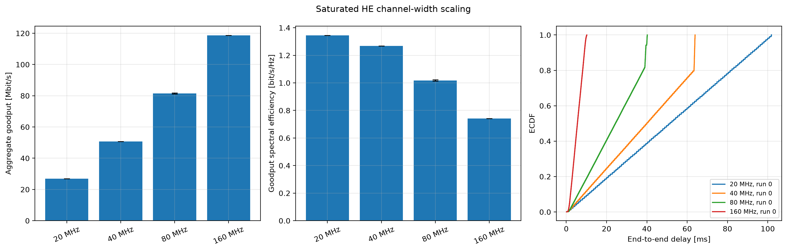
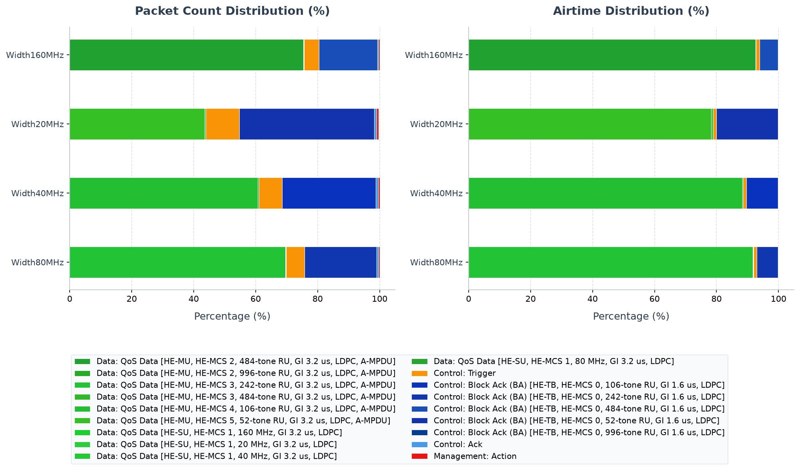

# Walkthrough: HE channel widths

This example compares matched 20, 40, 80, and 160 MHz HE single-user
configurations. Five-run application results measure capacity and delay in the
offered-load-limited topology, while run-0 radiotap captures establish the
transmitted bandwidth and airtime of equal-sized QoS Data frames.

## Learning objectives and feature primer

After completing this walkthrough, the reader can:

- explain why a wider channel supplies more HE subcarriers at fixed MCS;
- identify channel width in effective configuration and radiotap evidence;
- relate equal-sized frame duration to application goodput and delay; and
- reproduce the run and diagnostic queries.

Channel width is the occupied RF bandwidth, not an application bitrate.
Keeping modulation and coding scheme (MCS), guard interval, payload, topology,
and offered load matched isolates the modeled bandwidth effect. Wider channels
should shorten equal-sized PHY transmissions and raise service capacity, but
the relationship need not be linear.

## Scenario description

[HeChannelWidthsNetwork.ned](HeChannelWidthsNetwork.ned) contains one wired
server, one AP, and four stationary wireless hosts. The server warms each flow
at `0.2 s`, then offers downlink UDP traffic from `0.3 s`; the analyzed window
is `0.3–0.43 s`. [omnetpp.ini](omnetpp.ini) changes channel number, band name,
receiver bandwidth, sensitivity, and fixed bitrate as a consistent width
bundle. There is no mobility or external interferer.
The measured flows use 1,000-byte packets at 0.25 ms intervals. This keeps all
widths backlogged while reducing the tiny-packet overhead that would otherwise
obscure width scaling.

```text
server -- AP ~~ {host[0], host[1], host[2], host[3]}
```

## Standards and INET model boundary

IEEE Std 802.11-2024 describes HE channel-width capabilities in Table 9-376
and limits transmission width to the BSS channel width in Clause 26.17.1
(corpus chunks `80211ax-2024:chunk:03627`, `09952`, and `09956`). The standard permits
these widths; it does not guarantee the throughput values below.

INET's configured radio bandwidth, sensitivity, rate, scheduler, traffic, and
packet-level error model define this experiment. Radiotap is direct capture
evidence only where the HE presence/known bits support a value.

## Evidence status

| Claim or check | Status | Authoritative evidence | Runs/seeds | Scope or gap |
|---|---|---|---|---|
| Each treatment transmits at its named width | `PASS` | radiotap HE QoS Data rows | packet run/seed `0` | five frames per width |
| Equal payload duration decreases with width | `PASS` | decoded QoS Data durations | packet run/seed `0` | direct packet observation |
| Goodput increases and p95 delay decreases | `PASS` | application vectors | runs/seeds `0–4` | `0.3–0.43 s`, this load/topology |
| Wider width improves coverage | `NOT RUN` | no distance/sensitivity sweep | none | scenario does not test coverage |

## Configuration matrix

| Configuration | Role | Feature gate/delta | Workload/channel | Runs/seeds | Expected invariant |
|---|---|---|---|---|---|
| `Width20MHz` | Control | 20 MHz | matched saturated downlink | `0–4` | longest frame duration |
| `Width40MHz` | Treatment | 40 MHz | matched | `0–4` | more capacity than 20 MHz |
| `Width80MHz` | Treatment | 80 MHz | matched | `0–4` | more capacity than 40 MHz |
| `Width160MHz` | Treatment | 160 MHz | matched | `0–4` | shortest duration/highest capacity |

The width-specific config blocks supply consistent `bandName`, channel,
receiver bandwidth, sensitivity, and fixed HE MCS-1 bitrate. Those coordinated
changes are necessary for a valid radio configuration but mean the result is a
width bundle rather than a single raw parameter toggle.

## Expected invariants and diagnostic map

| Invariant | Evidence and observation point | Failure symptom | Likely subsystem | Next diagnostic |
|---|---|---|---|---|
| HE QoS Data width equals config | AP PCAP radiotap HE field | unknown/wrong width | radio/PCAP encoding | inspect presence/known bits and effective radio bandwidth |
| Duration falls at equal size/MCS | packet statistics | non-monotonic duration | mode construction | compare MCS, GI, NSS, coding, and bytes |
| Goodput rises, p95 delay falls | sink vectors | reversed or missing metric | load/MAC/application | verify offered load and per-run window |

## Reproduction

Run from the repository root. The command is illustrative and was **NOT RUN**
during this rewrite:

```sh
bin/inet -u Cmdenv -f examples/ieee80211ax/he_channel_widths/omnetpp.ini \
  -c Width20MHz -r 0 --seed-set=0 \
  --result-dir=examples/ieee80211ax/he_channel_widths/results/manual/Width20MHz
```

Campaign regeneration:

```sh
python3 examples/ieee80211ax/analysis/run_campaign.py width -j$(nproc)
MPLCONFIGDIR=/tmp/matplotlib \
  python3 examples/ieee80211ax/analysis/first_tranche.py width
```

The suite-owned packet command was executed with exit status 0 and created
session `20260725T230447Z`:

```sh
MPLCONFIGDIR=/tmp/matplotlib \
  python3 examples/ieee80211/analysis/analyze_pcap.py \
  --suite examples/ieee80211/analysis/suites/ax.json \
  --generate --subdir he_channel_widths --run 0 --allow-failed-evidence
```

## Scalar and vector analysis

Inputs are the `.sca` and `.vec` files in each configuration directory under
`results/scalar-vector/20260725T120411Z/`. The sidecar
[channel-width-dashboard.png.json](../analysis/figures/width/channel-width-dashboard.png.json)
binds all hashes, filters, runs, and the `0.3–0.43 s` window.

```sh
opp_scavetool query -l \
  -f 'type =~ vector AND module =~ "**.app[*]" AND (name =~ "packetReceived:vector(packetBytes)" OR name =~ "endToEndDelay:vector")' \
  examples/ieee80211ax/he_channel_widths/results/scalar-vector/20260725T120411Z/*/*.vec
```

| Configuration | Aggregate goodput | p95 end-to-end delay |
|---|---:|---:|
| `Width20MHz` | 26.892 ± 0.000 Mbps | 97.253 ± 0.057 ms |
| `Width40MHz` | 50.708 ± 0.000 Mbps | 63.809 ± 0.077 ms |
| `Width80MHz` | 81.428 ± 0.335 Mbps | 40.060 ± 0.075 ms |
| `Width160MHz` | 118.646 ± 0.000 Mbps | 9.406 ± 0.075 ms |

These values are a **derived measurement** from the named application vectors.
Each run is aggregated before computing the mean and two-sided 95% Student-t
CI over five independent seeds. The p95 is computed within each run; vector
samples are not repetitions. No warm-up samples enter the `0.3–0.43 s`
window.

<!-- BEGIN GENERATED: ieee80211-scalar-vector-width -->
### Generated scalar/vector plot and table



Figure provenance: [`../analysis/figures/width/channel-width-dashboard.png.json`](../analysis/figures/width/channel-width-dashboard.png.json). Run-level metric source: [`../analysis/metrics.json`](../analysis/metrics.json).

| Configuration or comparison | Metric | Source result filters / modules / units | Window / per-run aggregation / exclusions | Independent runs (n) | Mean or direct value | 95% CI half-width |
|---|---|---|---|---:|---:|---:|
| 160 MHz | delay p95 ms | vector / **.app[*] / packetReceived:vector(packetBytes) / unit=B<br>vector / **.app[*] / endToEndDelay:vector / unit=s | [0.3, 0.43) s; ECDF=representative run 0; bars=per-run values with 95% Student-t CI | 5 | 9.40625 | 0.0750894 |
| 160 MHz | goodput mbps | vector / **.app[*] / packetReceived:vector(packetBytes) / unit=B<br>vector / **.app[*] / endToEndDelay:vector / unit=s | [0.3, 0.43) s; ECDF=representative run 0; bars=per-run values with 95% Student-t CI | 5 | 118.646 | 0 |
| 20 MHz | delay p95 ms | vector / **.app[*] / packetReceived:vector(packetBytes) / unit=B<br>vector / **.app[*] / endToEndDelay:vector / unit=s | [0.3, 0.43) s; ECDF=representative run 0; bars=per-run values with 95% Student-t CI | 5 | 97.253 | 0.0573092 |
| 20 MHz | goodput mbps | vector / **.app[*] / packetReceived:vector(packetBytes) / unit=B<br>vector / **.app[*] / endToEndDelay:vector / unit=s | [0.3, 0.43) s; ECDF=representative run 0; bars=per-run values with 95% Student-t CI | 5 | 26.8923 | 0 |
| 40 MHz | delay p95 ms | vector / **.app[*] / packetReceived:vector(packetBytes) / unit=B<br>vector / **.app[*] / endToEndDelay:vector / unit=s | [0.3, 0.43) s; ECDF=representative run 0; bars=per-run values with 95% Student-t CI | 5 | 63.809 | 0.0766852 |
| 40 MHz | goodput mbps | vector / **.app[*] / packetReceived:vector(packetBytes) / unit=B<br>vector / **.app[*] / endToEndDelay:vector / unit=s | [0.3, 0.43) s; ECDF=representative run 0; bars=per-run values with 95% Student-t CI | 5 | 50.7077 | 0 |
| 80 MHz | delay p95 ms | vector / **.app[*] / packetReceived:vector(packetBytes) / unit=B<br>vector / **.app[*] / endToEndDelay:vector / unit=s | [0.3, 0.43) s; ECDF=representative run 0; bars=per-run values with 95% Student-t CI | 5 | 40.0602 | 0.075074 |
| 80 MHz | goodput mbps | vector / **.app[*] / packetReceived:vector(packetBytes) / unit=B<br>vector / **.app[*] / endToEndDelay:vector / unit=s | [0.3, 0.43) s; ECDF=representative run 0; bars=per-run values with 95% Student-t CI | 5 | 81.4277 | 0.334812 |

The table is a presentation view of the session-bound run-level summary. The source and aggregation columns reproduce the bundle-level figure provenance; the authored analysis identifies which source supports each metric and supplies the interpretation.
<!-- END GENERATED: ieee80211-scalar-vector-width -->

## PCAP statistics

Capture session `results/packet-statistics/20260725T230447Z` records run/seed 0
MAC observations at each `wlan[0]` in legacy PCAP. TShark 4.6.4 decodes it.

```sh
tshark -n -r 'examples/ieee80211ax/he_channel_widths/results/packet-statistics/20260725T230447Z/Width20MHz/Width20MHz-#0HeChannelWidthsNetwork.ap.wlan[0].pcap' \
  -q -z io,stat,0,'wlan.fc.type_subtype==0x28'
```

| Configuration | All AP observations | QoS Data evidence (5 frames, 1066 B, MCS 1, GI 3.2 µs, LDPC) |
|---|---:|---|
| `Width20MHz` | 781 | 20 MHz, mean 619.1 µs |
| `Width40MHz` | 734 | 40 MHz, mean 327.6 µs |
| `Width80MHz` | 791 | 80 MHz, mean 175.2 µs |
| `Width160MHz` | 865 | 160 MHz, mean 105.6 µs |

Counts are capture observations, not de-duplicated application packets.

<!-- BEGIN GENERATED: ieee80211ax-pcap-statistics -->
### Generated PCAP plots and tables


Figure provenance: [`packet_statistics.png.json`](../analysis/figures/he_channel_widths/packet_statistics.png.json).

This section provides a statistical overview of the 802.11 frames transmitted over the wireless medium during the simulation. The packet counts were gathered from AP wireless-interface observation points. With multiple AP captures, one medium transmission may be observed at more than one AP; counts and airtime therefore represent recorded transmission observations, not de-duplicated application packets.

Capture session `20260725T230447Z` was generated from fresh PCAPng input with `TShark (Wireshark) 4.6.4.`. The selected manifest is `examples/ieee80211/analysis/generated/ax/pcapmanifests/20260725T230447Z.json` (SHA-256 `62488d269e8268439e2afd9ccb67f45321a8ecd8daae2bc93d17694459dfe718`). HE PPDU format, MCS, coding, bandwidth/RU, GI, and NSTS are decoded directly from standards-compliant radiotap HE fields; values not marked known by the recorder are omitted.

Two estimated airtime occupancy percentages are provided. HE-SU and HE-ER-SU use the modeled 36/44 µs preambles; a dissector-expanded A-MPDU is charged one shared preamble. HE MU/TB user-dependent signaling not exposed by radiotap remains approximate.
- **Air Time %**: This frame type's share of the sum of all estimated frame airtimes.
- **Air Time (Sim Time) %**: The sum of this frame type's estimated airtimes divided by the simulation time limit. Concurrent transmissions from multiple capture points are counted separately, so this value can exceed 100%; it is not the union of busy channel time.

#### Compact cross-configuration summary

| Configuration | Observation point / counting unit | Selection/filter | Observations | Dominant decoded frame/PHY evidence | Estimated airtime / sim time | Limits |
|---|---|---|---:|---|---:|---|
| `Width160MHz` | AP interface(s); capture observations<br>`examples/ieee80211ax/he_channel_widths/results/packet-statistics/20260725T230447Z/Width160MHz/Width160MHz-#0HeChannelWidthsNetwork.ap.wlan[0].pcap` | `none (all decoded frames)` | 2955 | Data: QoS Data [HE-MU, HE-MCS 2, 484-tone RU, GI 3.2 us, LDPC, A-MPDU] (2229), Control: Block Ack (BA) [HE-TB, HE-MCS 0, 484-tone RU, GI 1.6 us, LDPC] (556), Control: Trigger (141) | 108.83% | Not delivery or de-duplicated transmissions; unknown PHY fields stay unknown |
| `Width20MHz` | AP interface(s); capture observations<br>`examples/ieee80211ax/he_channel_widths/results/packet-statistics/20260725T230447Z/Width20MHz/Width20MHz-#0HeChannelWidthsNetwork.ap.wlan[0].pcap` | `none (all decoded frames)` | 1159 | Data: QoS Data [HE-MU, HE-MCS 5, 52-tone RU, GI 3.2 us, LDPC, A-MPDU] (504), Control: Block Ack (BA) [HE-TB, HE-MCS 0, 52-tone RU, GI 1.6 us, LDPC] (504), Control: Trigger (126) | 106.90% | Not delivery or de-duplicated transmissions; unknown PHY fields stay unknown |
| `Width40MHz` | AP interface(s); capture observations<br>`examples/ieee80211ax/he_channel_widths/results/packet-statistics/20260725T230447Z/Width40MHz/Width40MHz-#0HeChannelWidthsNetwork.ap.wlan[0].pcap` | `none (all decoded frames)` | 1566 | Data: QoS Data [HE-MU, HE-MCS 4, 106-tone RU, GI 3.2 us, LDPC, A-MPDU] (951), Control: Block Ack (BA) [HE-TB, HE-MCS 0, 106-tone RU, GI 1.6 us, LDPC] (472), Control: Trigger (118) | 111.04% | Not delivery or de-duplicated transmissions; unknown PHY fields stay unknown |
| `Width80MHz` | AP interface(s); capture observations<br>`examples/ieee80211ax/he_channel_widths/results/packet-statistics/20260725T230447Z/Width80MHz/Width80MHz-#0HeChannelWidthsNetwork.ap.wlan[0].pcap` | `none (all decoded frames)` | 2186 | Data: QoS Data [HE-MU, HE-MCS 3, 242-tone RU, GI 3.2 us, LDPC, A-MPDU] (1521), Control: Block Ack (BA) [HE-TB, HE-MCS 0, 242-tone RU, GI 1.6 us, LDPC] (508), Control: Trigger (128) | 111.89% | Not delivery or de-duplicated transmissions; unknown PHY fields stay unknown |

### Evidence checks

| Status | Requirement | Observed evidence |
|---|---|---|
| **PASS** | Width160MHz produced protocol-visible wireless observations | 2955 AP/global transmission observations |
| **PASS** | Width20MHz produced protocol-visible wireless observations | 1159 AP/global transmission observations |
| **PASS** | Width40MHz produced protocol-visible wireless observations | 1566 AP/global transmission observations |
| **PASS** | Width80MHz produced protocol-visible wireless observations | 2186 AP/global transmission observations |

### Configuration: `Width160MHz`
Total over-the-air frame/MPDU transmission observations (Global BSS/AP): **2955**

| Color | Frame Type & Subtype | Count | Percentage | Mean Size | Std Dev | Mean Duration | Std Dev Duration | Freq | Mean RX Sig | Mean TX Pwr | Air Time % | Air Time (Sim Time) % |
|:---:|---|---:|---:|---:|---:|---:|---:|---:|---:|---:|---:|---:|
| <svg width="16" height="16"><rect width="16" height="16" rx="3" fill="#21a130" /></svg> | Data: QoS Data [HE-MU, HE-MCS 2, 484-tone RU, GI 3.2 us, LDPC, A-MPDU] | 2229 | 75.43% | 1066.0 B | 0.0 B | 203.4 us | 15.6 us | 5240 MHz | - | 15.0 dBm | 92.58% | 100.76% |
| <svg width="16" height="16"><rect width="16" height="16" rx="3" fill="#26ab26" /></svg> | Data: QoS Data [HE-MU, HE-MCS 2, 996-tone RU, GI 3.2 us, LDPC, A-MPDU] | 2 | 0.07% | 1066.0 B | 0.0 B | 128.8 us | 0.0 us | 5240 MHz | - | 15.0 dBm | 0.05% | 0.06% |
| <svg width="16" height="16"><rect width="16" height="16" rx="3" fill="#1bd02d" /></svg> | Data: QoS Data [HE-SU, HE-MCS 1, 160 MHz, GI 3.2 us, LDPC] | 5 | 0.17% | 1066.0 B | 0.0 B | 105.6 us | 0.0 us | 5240 MHz | - | 15.0 dBm | 0.11% | 0.12% |
| <hr> | <hr> | <hr> | <hr> | <hr> | <hr> | <hr> | <hr> | <hr> | <hr> | <hr> | <hr> | <hr> |
| <svg width="16" height="16"><rect width="16" height="16" rx="3" fill="#f99406" /></svg> | Control: Trigger | 141 | 4.77% | 63.9 B | 1.5 B | 41.3 us | 0.5 us | 5240 MHz | - | 15.0 dBm | 1.19% | 1.29% |
| <svg width="16" height="16"><rect width="16" height="16" rx="3" fill="#194eb8" /></svg> | Control: Block Ack (BA) [HE-TB, HE-MCS 0, 484-tone RU, GI 1.6 us, LDPC] | 556 | 18.82% | 32.0 B | 0.0 B | 51.8 us | 0.0 us | 5180 MHz, 5220 MHz, 5260 MHz, 5300 MHz | -71.8 dBm | - | 5.88% | 6.39% |
| <svg width="16" height="16"><rect width="16" height="16" rx="3" fill="#053c94" /></svg> | Control: Block Ack (BA) [HE-TB, HE-MCS 0, 996-tone RU, GI 1.6 us, LDPC] | 2 | 0.07% | 32.0 B | 0.0 B | 43.5 us | 0.0 us | 5200 MHz, 5280 MHz | -71.5 dBm | - | 0.02% | 0.02% |
| <svg width="16" height="16"><rect width="16" height="16" rx="3" fill="#4799eb" /></svg> | Control: Ack | 12 | 0.41% | 14.0 B | 0.0 B | 24.7 us | 0.0 us | 5240 MHz | -72.0 dBm | 15.0 dBm | 0.06% | 0.07% |
| <hr> | <hr> | <hr> | <hr> | <hr> | <hr> | <hr> | <hr> | <hr> | <hr> | <hr> | <hr> | <hr> |
| <svg width="16" height="16"><rect width="16" height="16" rx="3" fill="#ec1313" /></svg> | Management: Action | 8 | 0.27% | 37.0 B | 0.0 B | 69.3 us | 0.0 us | 5240 MHz | -72.0 dBm | 15.0 dBm | 0.11% | 0.12% |

#### Representative frame-exchange timeline

| Frame | Simulation time (s) | Transmitter → receiver | Type/PHY | Decisive fields | Role in exchange |
|---:|---:|---|---|---|---|
| `Width160MHz-#0HeChannelWidthsNetwork.ap.wlan[0].pcap:1` | 0.200132000 | 10:00:00:00:00:00 → 0a:aa:00:00:00:01 | Data: QoS Data / HE-SU, HE-MCS 1, 160 MHz, NSS 1, GI 3.2 us, LDPC | direction=from DS, retry=0, seq=0, frag=0, more-frag=0, TID=6 | Carries protocol-visible MAC payload in the representative exchange. |
| `Width160MHz-#0HeChannelWidthsNetwork.ap.wlan[0].pcap:2` | 0.200176000 | ? → 10:00:00:00:00:00 | Control: Ack / Legacy/HT/VHT | direction=direct/IBSS, retry=0, seq=-, frag=-, more-frag=0, TID=- | Acknowledges the preceding unicast frame. |
| `Width160MHz-#0HeChannelWidthsNetwork.ap.wlan[0].pcap:3` | 0.200228000 | 10:00:00:00:00:00 → 0a:aa:00:00:00:01 | Management: Action / Legacy/HT/VHT | direction=direct/IBSS, retry=0, seq=0, frag=0, more-frag=0, TID=- | Provides frame-order context for the representative exchange. |
| `Width160MHz-#0HeChannelWidthsNetwork.ap.wlan[0].pcap:4` | 0.200273000 | ? → 10:00:00:00:00:00 | Control: Ack / Legacy/HT/VHT | direction=direct/IBSS, retry=0, seq=-, frag=-, more-frag=0, TID=- | Acknowledges the preceding unicast frame. |
| `Width160MHz-#0HeChannelWidthsNetwork.ap.wlan[0].pcap:5` | 0.200370000 | 0a:aa:00:00:00:01 → 10:00:00:00:00:00 | Management: Action / Legacy/HT/VHT | direction=direct/IBSS, retry=0, seq=0, frag=0, more-frag=0, TID=- | Provides frame-order context for the representative exchange. |
| `Width160MHz-#0HeChannelWidthsNetwork.ap.wlan[0].pcap:6` | 0.200414000 | ? → 0a:aa:00:00:00:01 | Control: Ack / Legacy/HT/VHT | direction=direct/IBSS, retry=0, seq=-, frag=-, more-frag=0, TID=- | Acknowledges the preceding unicast frame. |
| `Width160MHz-#0HeChannelWidthsNetwork.ap.wlan[0].pcap:7` | 0.200580000 | 10:00:00:00:00:00 → 0a:aa:00:00:00:02 | Data: QoS Data / HE-SU, HE-MCS 1, 160 MHz, NSS 1, GI 3.2 us, LDPC | direction=from DS, retry=0, seq=0, frag=0, more-frag=0, TID=6 | Carries protocol-visible MAC payload in the representative exchange. |
| `Width160MHz-#0HeChannelWidthsNetwork.ap.wlan[0].pcap:8` | 0.200625000 | ? → 10:00:00:00:00:00 | Control: Ack / Legacy/HT/VHT | direction=direct/IBSS, retry=0, seq=-, frag=-, more-frag=0, TID=- | Acknowledges the preceding unicast frame. |
| `Width160MHz-#0HeChannelWidthsNetwork.ap.wlan[0].pcap:9` | 0.200677000 | 10:00:00:00:00:00 → 0a:aa:00:00:00:02 | Management: Action / Legacy/HT/VHT | direction=direct/IBSS, retry=0, seq=0, frag=0, more-frag=0, TID=- | Provides frame-order context for the representative exchange. |
| `Width160MHz-#0HeChannelWidthsNetwork.ap.wlan[0].pcap:10` | 0.200721000 | ? → 10:00:00:00:00:00 | Control: Ack / Legacy/HT/VHT | direction=direct/IBSS, retry=0, seq=-, frag=-, more-frag=0, TID=- | Acknowledges the preceding unicast frame. |
| `Width160MHz-#0HeChannelWidthsNetwork.ap.wlan[0].pcap:11` | 0.200791000 | 0a:aa:00:00:00:02 → 10:00:00:00:00:00 | Management: Action / Legacy/HT/VHT | direction=direct/IBSS, retry=0, seq=0, frag=0, more-frag=0, TID=- | Provides frame-order context for the representative exchange. |
| `Width160MHz-#0HeChannelWidthsNetwork.ap.wlan[0].pcap:12` | 0.200835000 | ? → 0a:aa:00:00:00:02 | Control: Ack / Legacy/HT/VHT | direction=direct/IBSS, retry=0, seq=-, frag=-, more-frag=0, TID=- | Acknowledges the preceding unicast frame. |
| `Width160MHz-#0HeChannelWidthsNetwork.ap.wlan[0].pcap:13` | 0.201019000 | 10:00:00:00:00:00 → 0a:aa:00:00:00:03 | Data: QoS Data / HE-SU, HE-MCS 1, 160 MHz, NSS 1, GI 3.2 us, LDPC | direction=from DS, retry=0, seq=0, frag=0, more-frag=0, TID=6 | Carries protocol-visible MAC payload in the representative exchange. |
| `Width160MHz-#0HeChannelWidthsNetwork.ap.wlan[0].pcap:14` | 0.201064000 | ? → 10:00:00:00:00:00 | Control: Ack / Legacy/HT/VHT | direction=direct/IBSS, retry=0, seq=-, frag=-, more-frag=0, TID=- | Acknowledges the preceding unicast frame. |
| `Width160MHz-#0HeChannelWidthsNetwork.ap.wlan[0].pcap:15` | 0.201116000 | 10:00:00:00:00:00 → 0a:aa:00:00:00:03 | Management: Action / Legacy/HT/VHT | direction=direct/IBSS, retry=0, seq=0, frag=0, more-frag=0, TID=- | Provides frame-order context for the representative exchange. |
| `Width160MHz-#0HeChannelWidthsNetwork.ap.wlan[0].pcap:16` | 0.201160000 | ? → 10:00:00:00:00:00 | Control: Ack / Legacy/HT/VHT | direction=direct/IBSS, retry=0, seq=-, frag=-, more-frag=0, TID=- | Acknowledges the preceding unicast frame. |

Frame numbers are local to the named capture, not OMNeT++ event numbers. For readability, the table collapses observations with the same timestamp and MAC identity across capture interfaces; aggregate PCAP statistics retain the original observation counts.

### Configuration: `Width20MHz`
Total over-the-air frame/MPDU transmission observations (Global BSS/AP): **1159**

| Color | Frame Type & Subtype | Count | Percentage | Mean Size | Std Dev | Mean Duration | Std Dev Duration | Freq | Mean RX Sig | Mean TX Pwr | Air Time % | Air Time (Sim Time) % |
|:---:|---|---:|---:|---:|---:|---:|---:|---:|---:|---:|---:|---:|
| <svg width="16" height="16"><rect width="16" height="16" rx="3" fill="#35c026" /></svg> | Data: QoS Data [HE-MU, HE-MCS 5, 52-tone RU, GI 3.2 us, LDPC, A-MPDU] | 504 | 43.49% | 1066.0 B | 0.0 B | 746.7 us | 0.0 us | 5050 MHz | - | 15.0 dBm | 78.23% | 83.63% |
| <svg width="16" height="16"><rect width="16" height="16" rx="3" fill="#2cce3f" /></svg> | Data: QoS Data [HE-SU, HE-MCS 1, 20 MHz, GI 3.2 us, LDPC] | 5 | 0.43% | 1066.0 B | 0.0 B | 619.1 us | 0.0 us | 5050 MHz | - | 15.0 dBm | 0.64% | 0.69% |
| <hr> | <hr> | <hr> | <hr> | <hr> | <hr> | <hr> | <hr> | <hr> | <hr> | <hr> | <hr> | <hr> |
| <svg width="16" height="16"><rect width="16" height="16" rx="3" fill="#f99406" /></svg> | Control: Trigger | 126 | 10.87% | 64.0 B | 0.0 B | 41.3 us | 0.0 us | 5050 MHz | - | 15.0 dBm | 1.08% | 1.16% |
| <svg width="16" height="16"><rect width="16" height="16" rx="3" fill="#1332ae" /></svg> | Control: Block Ack (BA) [HE-TB, HE-MCS 0, 52-tone RU, GI 1.6 us, LDPC] | 504 | 43.49% | 32.0 B | 0.0 B | 189.6 us | 0.0 us | 5043 MHz, 5047 MHz, 5053 MHz, 5057 MHz | -71.0 dBm | - | 19.87% | 21.24% |
| <svg width="16" height="16"><rect width="16" height="16" rx="3" fill="#4799eb" /></svg> | Control: Ack | 4 | 0.35% | 14.0 B | 0.0 B | 24.7 us | 0.0 us | 5050 MHz | -71.0 dBm | - | 0.02% | 0.02% |
| <svg width="16" height="16"><rect width="16" height="16" rx="3" fill="#4799eb" /></svg> | Control: Ack | 8 | 0.69% | 14.0 B | 0.0 B | 24.7 us | 0.0 us | 5050 MHz | -71.0 dBm | 15.0 dBm | 0.04% | 0.04% |
| <hr> | <hr> | <hr> | <hr> | <hr> | <hr> | <hr> | <hr> | <hr> | <hr> | <hr> | <hr> | <hr> |
| <svg width="16" height="16"><rect width="16" height="16" rx="3" fill="#ec1313" /></svg> | Management: Action | 8 | 0.69% | 37.0 B | 0.0 B | 69.3 us | 0.0 us | 5050 MHz | -71.0 dBm | 15.0 dBm | 0.12% | 0.12% |

#### Representative frame-exchange timeline

| Frame | Simulation time (s) | Transmitter → receiver | Type/PHY | Decisive fields | Role in exchange |
|---:|---:|---|---|---|---|
| `Width20MHz-#0HeChannelWidthsNetwork.ap.wlan[0].pcap:1` | 0.200644000 | 10:00:00:00:00:00 → 0a:aa:00:00:00:01 | Data: QoS Data / HE-SU, HE-MCS 1, 20 MHz, NSS 1, GI 3.2 us, LDPC | direction=from DS, retry=0, seq=0, frag=0, more-frag=0, TID=6 | Carries protocol-visible MAC payload in the representative exchange. |
| `Width20MHz-#0HeChannelWidthsNetwork.ap.wlan[0].pcap:2` | 0.200692000 | ? → 10:00:00:00:00:00 | Control: Ack / Legacy/HT/VHT | direction=direct/IBSS, retry=0, seq=-, frag=-, more-frag=0, TID=- | Acknowledges the preceding unicast frame. |
| `Width20MHz-#0HeChannelWidthsNetwork.ap.wlan[0].pcap:3` | 0.200744000 | 10:00:00:00:00:00 → 0a:aa:00:00:00:01 | Management: Action / Legacy/HT/VHT | direction=direct/IBSS, retry=0, seq=0, frag=0, more-frag=0, TID=- | Provides frame-order context for the representative exchange. |
| `Width20MHz-#0HeChannelWidthsNetwork.ap.wlan[0].pcap:4` | 0.200789000 | ? → 10:00:00:00:00:00 | Control: Ack / Legacy/HT/VHT | direction=direct/IBSS, retry=0, seq=-, frag=-, more-frag=0, TID=- | Acknowledges the preceding unicast frame. |
| `Width20MHz-#0HeChannelWidthsNetwork.ap.wlan[0].pcap:5` | 0.200886000 | 0a:aa:00:00:00:01 → 10:00:00:00:00:00 | Management: Action / Legacy/HT/VHT | direction=direct/IBSS, retry=0, seq=0, frag=0, more-frag=0, TID=- | Provides frame-order context for the representative exchange. |
| `Width20MHz-#0HeChannelWidthsNetwork.ap.wlan[0].pcap:6` | 0.200930000 | ? → 0a:aa:00:00:00:01 | Control: Ack / Legacy/HT/VHT | direction=direct/IBSS, retry=0, seq=-, frag=-, more-frag=0, TID=- | Acknowledges the preceding unicast frame. |
| `Width20MHz-#0HeChannelWidthsNetwork.ap.wlan[0].pcap:7` | 0.201608000 | 10:00:00:00:00:00 → 0a:aa:00:00:00:02 | Data: QoS Data / HE-SU, HE-MCS 1, 20 MHz, NSS 1, GI 3.2 us, LDPC | direction=from DS, retry=0, seq=0, frag=0, more-frag=0, TID=6 | Carries protocol-visible MAC payload in the representative exchange. |
| `Width20MHz-#0HeChannelWidthsNetwork.ap.wlan[0].pcap:8` | 0.201657000 | ? → 10:00:00:00:00:00 | Control: Ack / Legacy/HT/VHT | direction=direct/IBSS, retry=0, seq=-, frag=-, more-frag=0, TID=- | Acknowledges the preceding unicast frame. |
| `Width20MHz-#0HeChannelWidthsNetwork.ap.wlan[0].pcap:9` | 0.201709000 | 10:00:00:00:00:00 → 0a:aa:00:00:00:02 | Management: Action / Legacy/HT/VHT | direction=direct/IBSS, retry=0, seq=0, frag=0, more-frag=0, TID=- | Provides frame-order context for the representative exchange. |
| `Width20MHz-#0HeChannelWidthsNetwork.ap.wlan[0].pcap:10` | 0.201753000 | ? → 10:00:00:00:00:00 | Control: Ack / Legacy/HT/VHT | direction=direct/IBSS, retry=0, seq=-, frag=-, more-frag=0, TID=- | Acknowledges the preceding unicast frame. |
| `Width20MHz-#0HeChannelWidthsNetwork.ap.wlan[0].pcap:11` | 0.201823000 | 0a:aa:00:00:00:02 → 10:00:00:00:00:00 | Management: Action / Legacy/HT/VHT | direction=direct/IBSS, retry=0, seq=0, frag=0, more-frag=0, TID=- | Provides frame-order context for the representative exchange. |
| `Width20MHz-#0HeChannelWidthsNetwork.ap.wlan[0].pcap:12` | 0.201867000 | ? → 0a:aa:00:00:00:02 | Control: Ack / Legacy/HT/VHT | direction=direct/IBSS, retry=0, seq=-, frag=-, more-frag=0, TID=- | Acknowledges the preceding unicast frame. |
| `Width20MHz-#0HeChannelWidthsNetwork.ap.wlan[0].pcap:13` | 0.202563000 | 10:00:00:00:00:00 → 0a:aa:00:00:00:03 | Data: QoS Data / HE-SU, HE-MCS 1, 20 MHz, NSS 1, GI 3.2 us, LDPC | direction=from DS, retry=0, seq=0, frag=0, more-frag=0, TID=6 | Carries protocol-visible MAC payload in the representative exchange. |
| `Width20MHz-#0HeChannelWidthsNetwork.ap.wlan[0].pcap:14` | 0.202612000 | ? → 10:00:00:00:00:00 | Control: Ack / Legacy/HT/VHT | direction=direct/IBSS, retry=0, seq=-, frag=-, more-frag=0, TID=- | Acknowledges the preceding unicast frame. |
| `Width20MHz-#0HeChannelWidthsNetwork.ap.wlan[0].pcap:15` | 0.202664000 | 10:00:00:00:00:00 → 0a:aa:00:00:00:03 | Management: Action / Legacy/HT/VHT | direction=direct/IBSS, retry=0, seq=0, frag=0, more-frag=0, TID=- | Provides frame-order context for the representative exchange. |
| `Width20MHz-#0HeChannelWidthsNetwork.ap.wlan[0].pcap:16` | 0.202708000 | ? → 10:00:00:00:00:00 | Control: Ack / Legacy/HT/VHT | direction=direct/IBSS, retry=0, seq=-, frag=-, more-frag=0, TID=- | Acknowledges the preceding unicast frame. |

Frame numbers are local to the named capture, not OMNeT++ event numbers. For readability, the table collapses observations with the same timestamp and MAC identity across capture interfaces; aggregate PCAP statistics retain the original observation counts.

### Configuration: `Width40MHz`
Total over-the-air frame/MPDU transmission observations (Global BSS/AP): **1566**

| Color | Frame Type & Subtype | Count | Percentage | Mean Size | Std Dev | Mean Duration | Std Dev Duration | Freq | Mean RX Sig | Mean TX Pwr | Air Time % | Air Time (Sim Time) % |
|:---:|---|---:|---:|---:|---:|---:|---:|---:|---:|---:|---:|---:|
| <svg width="16" height="16"><rect width="16" height="16" rx="3" fill="#23be32" /></svg> | Data: QoS Data [HE-MU, HE-MCS 4, 106-tone RU, GI 3.2 us, LDPC, A-MPDU] | 951 | 60.73% | 1066.0 B | 0.0 B | 463.9 us | 18.0 us | 5100 MHz | - | 15.0 dBm | 88.30% | 98.04% |
| <svg width="16" height="16"><rect width="16" height="16" rx="3" fill="#22c933" /></svg> | Data: QoS Data [HE-SU, HE-MCS 1, 40 MHz, GI 3.2 us, LDPC] | 5 | 0.32% | 1066.0 B | 0.0 B | 327.6 us | 0.0 us | 5100 MHz | - | 15.0 dBm | 0.33% | 0.36% |
| <hr> | <hr> | <hr> | <hr> | <hr> | <hr> | <hr> | <hr> | <hr> | <hr> | <hr> | <hr> | <hr> |
| <svg width="16" height="16"><rect width="16" height="16" rx="3" fill="#f99406" /></svg> | Control: Trigger | 118 | 7.54% | 64.0 B | 0.0 B | 41.3 us | 0.0 us | 5100 MHz | - | 15.0 dBm | 0.98% | 1.08% |
| <svg width="16" height="16"><rect width="16" height="16" rx="3" fill="#0933be" /></svg> | Control: Block Ack (BA) [HE-TB, HE-MCS 0, 106-tone RU, GI 1.6 us, LDPC] | 472 | 30.14% | 32.0 B | 0.0 B | 108.3 us | 0.0 us | 5085 MHz, 5096 MHz, 5104 MHz, 5115 MHz | -71.0 dBm | - | 10.23% | 11.36% |
| <svg width="16" height="16"><rect width="16" height="16" rx="3" fill="#4799eb" /></svg> | Control: Ack | 12 | 0.77% | 14.0 B | 0.0 B | 24.7 us | 0.0 us | 5100 MHz | -71.0 dBm | 15.0 dBm | 0.06% | 0.07% |
| <hr> | <hr> | <hr> | <hr> | <hr> | <hr> | <hr> | <hr> | <hr> | <hr> | <hr> | <hr> | <hr> |
| <svg width="16" height="16"><rect width="16" height="16" rx="3" fill="#ec1313" /></svg> | Management: Action | 8 | 0.51% | 37.0 B | 0.0 B | 69.3 us | 0.0 us | 5100 MHz | -71.0 dBm | 15.0 dBm | 0.11% | 0.12% |

#### Representative frame-exchange timeline

| Frame | Simulation time (s) | Transmitter → receiver | Type/PHY | Decisive fields | Role in exchange |
|---:|---:|---|---|---|---|
| `Width40MHz-#0HeChannelWidthsNetwork.ap.wlan[0].pcap:1` | 0.200356000 | 10:00:00:00:00:00 → 0a:aa:00:00:00:01 | Data: QoS Data / HE-SU, HE-MCS 1, 40 MHz, NSS 1, GI 3.2 us, LDPC | direction=from DS, retry=0, seq=0, frag=0, more-frag=0, TID=6 | Carries protocol-visible MAC payload in the representative exchange. |
| `Width40MHz-#0HeChannelWidthsNetwork.ap.wlan[0].pcap:2` | 0.200400000 | ? → 10:00:00:00:00:00 | Control: Ack / Legacy/HT/VHT | direction=direct/IBSS, retry=0, seq=-, frag=-, more-frag=0, TID=- | Acknowledges the preceding unicast frame. |
| `Width40MHz-#0HeChannelWidthsNetwork.ap.wlan[0].pcap:3` | 0.200452000 | 10:00:00:00:00:00 → 0a:aa:00:00:00:01 | Management: Action / Legacy/HT/VHT | direction=direct/IBSS, retry=0, seq=0, frag=0, more-frag=0, TID=- | Provides frame-order context for the representative exchange. |
| `Width40MHz-#0HeChannelWidthsNetwork.ap.wlan[0].pcap:4` | 0.200497000 | ? → 10:00:00:00:00:00 | Control: Ack / Legacy/HT/VHT | direction=direct/IBSS, retry=0, seq=-, frag=-, more-frag=0, TID=- | Acknowledges the preceding unicast frame. |
| `Width40MHz-#0HeChannelWidthsNetwork.ap.wlan[0].pcap:5` | 0.200594000 | 0a:aa:00:00:00:01 → 10:00:00:00:00:00 | Management: Action / Legacy/HT/VHT | direction=direct/IBSS, retry=0, seq=0, frag=0, more-frag=0, TID=- | Provides frame-order context for the representative exchange. |
| `Width40MHz-#0HeChannelWidthsNetwork.ap.wlan[0].pcap:6` | 0.200638000 | ? → 0a:aa:00:00:00:01 | Control: Ack / Legacy/HT/VHT | direction=direct/IBSS, retry=0, seq=-, frag=-, more-frag=0, TID=- | Acknowledges the preceding unicast frame. |
| `Width40MHz-#0HeChannelWidthsNetwork.ap.wlan[0].pcap:7` | 0.201028000 | 10:00:00:00:00:00 → 0a:aa:00:00:00:02 | Data: QoS Data / HE-SU, HE-MCS 1, 40 MHz, NSS 1, GI 3.2 us, LDPC | direction=from DS, retry=0, seq=0, frag=0, more-frag=0, TID=6 | Carries protocol-visible MAC payload in the representative exchange. |
| `Width40MHz-#0HeChannelWidthsNetwork.ap.wlan[0].pcap:8` | 0.201073000 | ? → 10:00:00:00:00:00 | Control: Ack / Legacy/HT/VHT | direction=direct/IBSS, retry=0, seq=-, frag=-, more-frag=0, TID=- | Acknowledges the preceding unicast frame. |
| `Width40MHz-#0HeChannelWidthsNetwork.ap.wlan[0].pcap:9` | 0.201125000 | 10:00:00:00:00:00 → 0a:aa:00:00:00:02 | Management: Action / Legacy/HT/VHT | direction=direct/IBSS, retry=0, seq=0, frag=0, more-frag=0, TID=- | Provides frame-order context for the representative exchange. |
| `Width40MHz-#0HeChannelWidthsNetwork.ap.wlan[0].pcap:10` | 0.201169000 | ? → 10:00:00:00:00:00 | Control: Ack / Legacy/HT/VHT | direction=direct/IBSS, retry=0, seq=-, frag=-, more-frag=0, TID=- | Acknowledges the preceding unicast frame. |
| `Width40MHz-#0HeChannelWidthsNetwork.ap.wlan[0].pcap:11` | 0.201239000 | 0a:aa:00:00:00:02 → 10:00:00:00:00:00 | Management: Action / Legacy/HT/VHT | direction=direct/IBSS, retry=0, seq=0, frag=0, more-frag=0, TID=- | Provides frame-order context for the representative exchange. |
| `Width40MHz-#0HeChannelWidthsNetwork.ap.wlan[0].pcap:12` | 0.201283000 | ? → 0a:aa:00:00:00:02 | Control: Ack / Legacy/HT/VHT | direction=direct/IBSS, retry=0, seq=-, frag=-, more-frag=0, TID=- | Acknowledges the preceding unicast frame. |
| `Width40MHz-#0HeChannelWidthsNetwork.ap.wlan[0].pcap:13` | 0.201691000 | 10:00:00:00:00:00 → 0a:aa:00:00:00:03 | Data: QoS Data / HE-SU, HE-MCS 1, 40 MHz, NSS 1, GI 3.2 us, LDPC | direction=from DS, retry=0, seq=0, frag=0, more-frag=0, TID=6 | Carries protocol-visible MAC payload in the representative exchange. |
| `Width40MHz-#0HeChannelWidthsNetwork.ap.wlan[0].pcap:14` | 0.201736000 | ? → 10:00:00:00:00:00 | Control: Ack / Legacy/HT/VHT | direction=direct/IBSS, retry=0, seq=-, frag=-, more-frag=0, TID=- | Acknowledges the preceding unicast frame. |
| `Width40MHz-#0HeChannelWidthsNetwork.ap.wlan[0].pcap:15` | 0.201788000 | 10:00:00:00:00:00 → 0a:aa:00:00:00:03 | Management: Action / Legacy/HT/VHT | direction=direct/IBSS, retry=0, seq=0, frag=0, more-frag=0, TID=- | Provides frame-order context for the representative exchange. |
| `Width40MHz-#0HeChannelWidthsNetwork.ap.wlan[0].pcap:16` | 0.201832000 | ? → 10:00:00:00:00:00 | Control: Ack / Legacy/HT/VHT | direction=direct/IBSS, retry=0, seq=-, frag=-, more-frag=0, TID=- | Acknowledges the preceding unicast frame. |

Frame numbers are local to the named capture, not OMNeT++ event numbers. For readability, the table collapses observations with the same timestamp and MAC identity across capture interfaces; aggregate PCAP statistics retain the original observation counts.

### Configuration: `Width80MHz`
Total over-the-air frame/MPDU transmission observations (Global BSS/AP): **2186**

| Color | Frame Type & Subtype | Count | Percentage | Mean Size | Std Dev | Mean Duration | Std Dev Duration | Freq | Mean RX Sig | Mean TX Pwr | Air Time % | Air Time (Sim Time) % |
|:---:|---|---:|---:|---:|---:|---:|---:|---:|---:|---:|---:|---:|
| <svg width="16" height="16"><rect width="16" height="16" rx="3" fill="#22c335" /></svg> | Data: QoS Data [HE-MU, HE-MCS 3, 242-tone RU, GI 3.2 us, LDPC, A-MPDU] | 1521 | 69.58% | 1066.0 B | 0.0 B | 303.6 us | 17.0 us | 5200 MHz | - | 15.0 dBm | 91.70% | 102.61% |
| <svg width="16" height="16"><rect width="16" height="16" rx="3" fill="#30b828" /></svg> | Data: QoS Data [HE-MU, HE-MCS 3, 484-tone RU, GI 3.2 us, LDPC, A-MPDU] | 2 | 0.09% | 1066.0 B | 0.0 B | 181.8 us | 0.0 us | 5200 MHz | - | 15.0 dBm | 0.07% | 0.08% |
| <svg width="16" height="16"><rect width="16" height="16" rx="3" fill="#27a52f" /></svg> | Data: QoS Data [HE-SU, HE-MCS 1, 80 MHz, GI 3.2 us, LDPC] | 5 | 0.23% | 1066.0 B | 0.0 B | 175.2 us | 0.0 us | 5200 MHz | - | 15.0 dBm | 0.17% | 0.19% |
| <hr> | <hr> | <hr> | <hr> | <hr> | <hr> | <hr> | <hr> | <hr> | <hr> | <hr> | <hr> | <hr> |
| <svg width="16" height="16"><rect width="16" height="16" rx="3" fill="#f99406" /></svg> | Control: Trigger | 128 | 5.86% | 63.9 B | 1.6 B | 41.3 us | 0.5 us | 5200 MHz | - | 15.0 dBm | 1.05% | 1.17% |
| <svg width="16" height="16"><rect width="16" height="16" rx="3" fill="#1137b0" /></svg> | Control: Block Ack (BA) [HE-TB, HE-MCS 0, 242-tone RU, GI 1.6 us, LDPC] | 508 | 23.24% | 32.0 B | 0.0 B | 67.5 us | 0.0 us | 5170 MHz, 5189 MHz, 5211 MHz, 5230 MHz | -71.5 dBm | - | 6.81% | 7.62% |
| <svg width="16" height="16"><rect width="16" height="16" rx="3" fill="#194eb8" /></svg> | Control: Block Ack (BA) [HE-TB, HE-MCS 0, 484-tone RU, GI 1.6 us, LDPC] | 2 | 0.09% | 32.0 B | 0.0 B | 51.8 us | 0.0 us | 5180 MHz, 5220 MHz | -71.5 dBm | - | 0.02% | 0.02% |
| <svg width="16" height="16"><rect width="16" height="16" rx="3" fill="#4799eb" /></svg> | Control: Ack | 12 | 0.55% | 14.0 B | 0.0 B | 24.7 us | 0.0 us | 5200 MHz | -71.0 dBm | 15.0 dBm | 0.06% | 0.07% |
| <hr> | <hr> | <hr> | <hr> | <hr> | <hr> | <hr> | <hr> | <hr> | <hr> | <hr> | <hr> | <hr> |
| <svg width="16" height="16"><rect width="16" height="16" rx="3" fill="#ec1313" /></svg> | Management: Action | 8 | 0.37% | 37.0 B | 0.0 B | 69.3 us | 0.0 us | 5200 MHz | -71.0 dBm | 15.0 dBm | 0.11% | 0.12% |

#### Representative frame-exchange timeline

| Frame | Simulation time (s) | Transmitter → receiver | Type/PHY | Decisive fields | Role in exchange |
|---:|---:|---|---|---|---|
| `Width80MHz-#0HeChannelWidthsNetwork.ap.wlan[0].pcap:1` | 0.200196000 | 10:00:00:00:00:00 → 0a:aa:00:00:00:01 | Data: QoS Data / HE-SU, HE-MCS 1, 80 MHz, NSS 1, GI 3.2 us, LDPC | direction=from DS, retry=0, seq=0, frag=0, more-frag=0, TID=6 | Carries protocol-visible MAC payload in the representative exchange. |
| `Width80MHz-#0HeChannelWidthsNetwork.ap.wlan[0].pcap:2` | 0.200240000 | ? → 10:00:00:00:00:00 | Control: Ack / Legacy/HT/VHT | direction=direct/IBSS, retry=0, seq=-, frag=-, more-frag=0, TID=- | Acknowledges the preceding unicast frame. |
| `Width80MHz-#0HeChannelWidthsNetwork.ap.wlan[0].pcap:3` | 0.200292000 | 10:00:00:00:00:00 → 0a:aa:00:00:00:01 | Management: Action / Legacy/HT/VHT | direction=direct/IBSS, retry=0, seq=0, frag=0, more-frag=0, TID=- | Provides frame-order context for the representative exchange. |
| `Width80MHz-#0HeChannelWidthsNetwork.ap.wlan[0].pcap:4` | 0.200337000 | ? → 10:00:00:00:00:00 | Control: Ack / Legacy/HT/VHT | direction=direct/IBSS, retry=0, seq=-, frag=-, more-frag=0, TID=- | Acknowledges the preceding unicast frame. |
| `Width80MHz-#0HeChannelWidthsNetwork.ap.wlan[0].pcap:5` | 0.200434000 | 0a:aa:00:00:00:01 → 10:00:00:00:00:00 | Management: Action / Legacy/HT/VHT | direction=direct/IBSS, retry=0, seq=0, frag=0, more-frag=0, TID=- | Provides frame-order context for the representative exchange. |
| `Width80MHz-#0HeChannelWidthsNetwork.ap.wlan[0].pcap:6` | 0.200478000 | ? → 0a:aa:00:00:00:01 | Control: Ack / Legacy/HT/VHT | direction=direct/IBSS, retry=0, seq=-, frag=-, more-frag=0, TID=- | Acknowledges the preceding unicast frame. |
| `Width80MHz-#0HeChannelWidthsNetwork.ap.wlan[0].pcap:7` | 0.200708000 | 10:00:00:00:00:00 → 0a:aa:00:00:00:02 | Data: QoS Data / HE-SU, HE-MCS 1, 80 MHz, NSS 1, GI 3.2 us, LDPC | direction=from DS, retry=0, seq=0, frag=0, more-frag=0, TID=6 | Carries protocol-visible MAC payload in the representative exchange. |
| `Width80MHz-#0HeChannelWidthsNetwork.ap.wlan[0].pcap:8` | 0.200753000 | ? → 10:00:00:00:00:00 | Control: Ack / Legacy/HT/VHT | direction=direct/IBSS, retry=0, seq=-, frag=-, more-frag=0, TID=- | Acknowledges the preceding unicast frame. |
| `Width80MHz-#0HeChannelWidthsNetwork.ap.wlan[0].pcap:9` | 0.200805000 | 10:00:00:00:00:00 → 0a:aa:00:00:00:02 | Management: Action / Legacy/HT/VHT | direction=direct/IBSS, retry=0, seq=0, frag=0, more-frag=0, TID=- | Provides frame-order context for the representative exchange. |
| `Width80MHz-#0HeChannelWidthsNetwork.ap.wlan[0].pcap:10` | 0.200849000 | ? → 10:00:00:00:00:00 | Control: Ack / Legacy/HT/VHT | direction=direct/IBSS, retry=0, seq=-, frag=-, more-frag=0, TID=- | Acknowledges the preceding unicast frame. |
| `Width80MHz-#0HeChannelWidthsNetwork.ap.wlan[0].pcap:11` | 0.200919000 | 0a:aa:00:00:00:02 → 10:00:00:00:00:00 | Management: Action / Legacy/HT/VHT | direction=direct/IBSS, retry=0, seq=0, frag=0, more-frag=0, TID=- | Provides frame-order context for the representative exchange. |
| `Width80MHz-#0HeChannelWidthsNetwork.ap.wlan[0].pcap:12` | 0.200963000 | ? → 0a:aa:00:00:00:02 | Control: Ack / Legacy/HT/VHT | direction=direct/IBSS, retry=0, seq=-, frag=-, more-frag=0, TID=- | Acknowledges the preceding unicast frame. |
| `Width80MHz-#0HeChannelWidthsNetwork.ap.wlan[0].pcap:13` | 0.201211000 | 10:00:00:00:00:00 → 0a:aa:00:00:00:03 | Data: QoS Data / HE-SU, HE-MCS 1, 80 MHz, NSS 1, GI 3.2 us, LDPC | direction=from DS, retry=0, seq=0, frag=0, more-frag=0, TID=6 | Carries protocol-visible MAC payload in the representative exchange. |
| `Width80MHz-#0HeChannelWidthsNetwork.ap.wlan[0].pcap:14` | 0.201256000 | ? → 10:00:00:00:00:00 | Control: Ack / Legacy/HT/VHT | direction=direct/IBSS, retry=0, seq=-, frag=-, more-frag=0, TID=- | Acknowledges the preceding unicast frame. |
| `Width80MHz-#0HeChannelWidthsNetwork.ap.wlan[0].pcap:15` | 0.201308000 | 10:00:00:00:00:00 → 0a:aa:00:00:00:03 | Management: Action / Legacy/HT/VHT | direction=direct/IBSS, retry=0, seq=0, frag=0, more-frag=0, TID=- | Provides frame-order context for the representative exchange. |
| `Width80MHz-#0HeChannelWidthsNetwork.ap.wlan[0].pcap:16` | 0.201352000 | ? → 10:00:00:00:00:00 | Control: Ack / Legacy/HT/VHT | direction=direct/IBSS, retry=0, seq=-, frag=-, more-frag=0, TID=- | Acknowledges the preceding unicast frame. |

Frame numbers are local to the named capture, not OMNeT++ event numbers. For readability, the table collapses observations with the same timestamp and MAC identity across capture interfaces; aggregate PCAP statistics retain the original observation counts.

### Analysis of Packet Distribution
IEEE Std 802.11-2024 Table 27-1 defines 20, 40, 80, and 160 MHz HE channel-width encodings, but the standard does not require packet count or throughput to scale linearly with width. The run-0 frame totals here are non-monotonic because aggregation, RU scheduling, and fixed overhead change the number of transmitted frames. The five-run sink goodput and delay analysis above is the appropriate capacity comparison; the radiotap bandwidth suffix is not.
<!-- END GENERATED: ieee80211ax-pcap-statistics -->

## Frame exchange analysis

```sh
tshark -n -r 'examples/ieee80211ax/he_channel_widths/results/packet-statistics/20260725T230447Z/Width20MHz/Width20MHz-#0HeChannelWidthsNetwork.ap.wlan[0].pcap' \
  -Y 'frame.number <= 2' -T fields -E header=y -E separator='|' \
  -e frame.number -e frame.time_epoch -e wlan.sa -e wlan.da \
  -e wlan.fc.type_subtype -e radiotap.he.data_1.ppdu_format \
  -e radiotap.he.data_3.data_mcs -e radiotap.he.data_5.data_bw_ru_allocation
```

| Frame | Simulation time | Transmitter → receiver | Type/PHY | Decisive fields | Role in exchange |
|---:|---:|---|---|---|---|
| 1 | 0.200644 s | AP → host[0] | QoS Data / HE-SU | subtype `0x28`, PPDU `0`, MCS 1, width code 0 (20 MHz) | warm-up data |
| 2 | 0.200692 s | host[0] → AP | Ack | subtype `0x1d` | successful MAC response |

The packet-statistics decoder, which checks radiotap known bits, supplies the
human-readable width labels used above.

## Cross-layer findings and verdict

| Claim | Verdict | Configuration evidence | Model telemetry | Packet evidence | Outcome evidence |
|---|---|---|---|---|---|
| Width bundle took effect | `PASS` | four width configs | none required | decoded 20/40/80/160 MHz | n/a |
| Wider channels serve this load faster | `PASS` | matched traffic | app vectors | shorter equal-size frames | monotonic goodput/delay |
| Wider channels increase range | `NOT RUN` | no distance control | none | none | none |

The bounded verdict is `PASS`: the configured widths are directly visible in
the capture and the five-run outcomes move monotonically in this scenario.

## Limitations and inconclusive claims

- The result and PCAP sessions are separate, so their relationship is
  configuration-level rather than event-level.
- Sensitivity differs consistently by width; no coverage conclusion follows.
- Only one topology, MCS, payload family, and offered-load regime are tested.
- Packet totals are not a capacity estimator.

## Further experiments

- Sweep offered load to locate saturation for each width.
- Repeat at matched receive power and multiple MCS values; predict that frame
  duration remains ordered but the capacity ratios change.

## Implementation plan

No implementation work is proposed; the retained invariants pass. Additional
coverage is experimental, not a demonstrated model gap.

## Artifact provenance

| Artifact family | Session/path | Configurations/runs | Tool/filter/window | Integrity notes |
|---|---|---|---|---|
| Scalar/vector | `results/scalar-vector/20260725T120411Z` | four configs, runs/seeds `0–4` | sidecar filters; `0.3–0.43 s` | SHA-256 per input |
| PCAP | `results/packet-statistics/20260725T230447Z` | four configs, run/seed `0` | TShark 4.6.4, MAC observation | manifest and hashes in generated block |
| Figure | `../analysis/figures/width/channel-width-dashboard.png` | four configs | per-run CI; run-0 ECDF | provenance sidecar |
