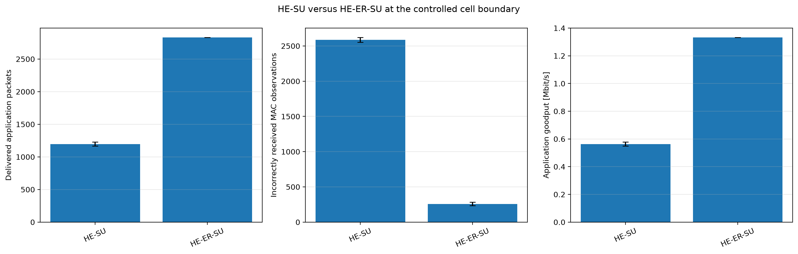
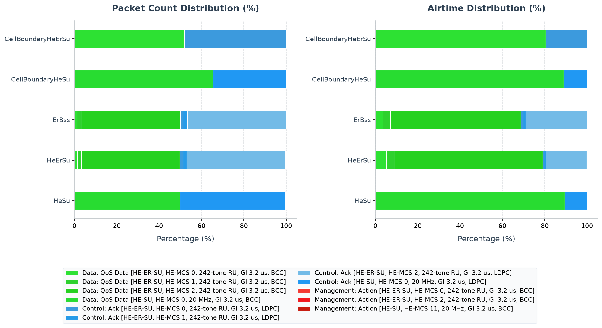

# 802.11ax HE Extended Range Single User (ER SU) Simulation

This example illustrates the Extended Range Single User (ER SU) transmission format introduced in IEEE 802.11ax. It verifies HE ER SU PPDU selection, its repeated HE-SIG-A timing, legal MCS/RU metadata, and the improved MAC-layer reliability at a controlled cell boundary that comes from modeling the repeated HE-SIG-A robustness gain.

## Background: HE ER SU and optional DCM

In dense or outdoor deployments, stations (STAs) at the cell edge suffer from low Signal-to-Noise Ratio (SNR) due to path loss, leading to packet reception failures. To extend range without increasing transmission power, 802.11ax introduces **HE ER SU**:
1. **Preamble Duplication**: The preamble of an HE ER SU PPDU repeats the HE-SIG-A field, increasing its duration by 8 µs (from 36 µs to 44 µs in total). This repetition allows receivers to combine the energy of the two fields, significantly improving HE-SIG-A decoding robustness.
2. **Resource Unit Limitation**: HE ER SU uses one 242-tone or 106-tone RU. IEEE Std 802.11-2024 Clause 27.3.7 permits MCS 0–2 on the 242-tone RU and MCS 0 on the 106-tone RU.
3. **Optional Dual Carrier Modulation (DCM)**: DCM can duplicate coded information across separated subcarriers for frequency diversity. It is optional for the permitted ER combinations. This scenario does not request or claim DCM; it isolates PPDU-format and preamble behavior.

---

## Network Topology

The network [HeErSuNetwork.ned](HeErSuNetwork.ned) consists of:
- **`ap`**: An Access Point located at `(390, 180)`.
- **`host[0]`**: A stationary wireless host located at `(70, 180)`
  (representing a cell-edge client).
- **Distance**: The AP and client are separated by **320 meters**. At this distance, the Free Space Path Loss (FSPL) at 5 GHz is approximately 96.5 dB, resulting in very weak signal reception (around -86.5 dBm at 10mW transmission power).
- **`server`**: A wired server connected to the AP.
- **Traffic**: Downlink UDP traffic is sent from the `server` to `host[0]` via
  the AP (300 B packets sent every 1 ms).

```
        [server]
           | (wired)
           v
        [ ap ] <--------------- 320m -------------> [host[0]]
      (AP at 390m)                                (STA at 70m)
```

---

## Configurations in `omnetpp.ini`

The [omnetpp.ini](omnetpp.ini) file defines the following scenarios:

### 1. `HeSu` (Baseline)
- The AP transmits standard HE SU PPDUs.
- It uses a fixed bitrate configuration of `7.3125 Mbps` (corresponding to MCS 0 with 20 MHz bandwidth, NSS = 1, and no DCM).
- Preamble format is the standard HE SU PPDU (36 µs).

### 2. `HeErSu` (Extended Range SU)
- The AP enables Minstrel rate control with ER SU capability:
  - `**.ap.wlan[*].mac.hcf.rateControl.typename = "HeMinstrelRateControl"`
  - `**.ap.wlan[*].mac.hcf.rateControl.enableExtendedRangeSu = true`
  - `**.ap.wlan[*].mac.hcf.rateControl.maxMcs = 2`
- The fixed interface data bitrate is disabled on the HCF rate-selection path so the rate controller is actually consulted.
- **Result**: The AP restricts selection to robust MCS levels and formats data PPDUs as HE ER SU with the repeated HE-SIG-A field (44 µs total preamble duration). DCM remains disabled.

### 3. `ErBss` (ER BSS management behavior)

- Extends `HeErSu`, enables full beaconing/association instead of installing
  association state at initialization, and sets the HE ER BSS capability.
- Management-frame bitrate overrides are removed so HE rate control can choose
  ER SU for the relevant management and group-addressed transmissions.
- Block Ack is disabled to keep the trace focused on ER-BSS management and
  single-MPDU behavior; this is a scope choice, not an ER-BSS requirement.

### 4. `CellBoundaryHeSu` and `CellBoundaryHeErSu` (controlled comparison)

- Move the client to 340 m and use a -89 dBm background-noise floor, -100 dBm
  receiver sensitivity, and a 0 dB generic SNIR threshold. This keeps the
  signal inside the receiver gates while leaving packet success to the IEEE
  802.11 error model.
- Use MCS 0 for both formats, 100-byte packets every 600 us, and single-MPDU
  acknowledgments. Equal MCS removes rate selection as an explanation, while
  short, unaggregated frames exercise HE-SIG-A often enough for its repetition
  gain to affect application delivery.

---

## Running the Simulation

Ensure your environment is set up, then run the simulations.

### Running with Qtenv (GUI)
```sh
bin/inet -u Qtenv -c HeErSu examples/ieee80211ax/he_er_su/omnetpp.ini
```

### Running with Cmdenv (Command Line)
```sh
# Run HeSu Baseline
bin/inet -u Cmdenv -c HeSu examples/ieee80211ax/he_er_su/omnetpp.ini

# Run HeErSu Config
bin/inet -u Cmdenv -c HeErSu examples/ieee80211ax/he_er_su/omnetpp.ini

# Run ER-BSS beaconing and association
bin/inet -u Cmdenv -c ErBss examples/ieee80211ax/he_er_su/omnetpp.ini

# Run the matched low-SNR comparison
bin/inet -u Cmdenv -c CellBoundaryHeSu examples/ieee80211ax/he_er_su/omnetpp.ini
bin/inet -u Cmdenv -c CellBoundaryHeErSu examples/ieee80211ax/he_er_su/omnetpp.ini
```

---

## Verifying Results

After running the simulations, analyze the packets received at the UDP application layer on the `host[0]` client and wireless MAC packet drops due to incorrect reception.

```sh
# Query packets received at the UDP sink on the host[0]
opp_scavetool query -l -f 'name =~ "packetReceived:count" and module =~ "*.host[0].app*"' examples/ieee80211ax/he_er_su/results/*.sca

# Query packet drops due to corruption/incorrect reception at all wireless MACs
opp_scavetool query -l -f 'name =~ "packetDropIncorrectlyReceived:count" and module =~ "*.wlan[0].mac"' examples/ieee80211ax/he_er_su/results/*.sca
```

### Controlled cell-boundary result



At 340 m, the five matched seeds now produce different MAC-layer reliability results in this deterministic model, because the PHY error model applies the HE-SIG-A repetition gain for HE-ER-SU:

| Configuration | Delivered packets per seed | Incorrectly received MAC observations per seed | Mean application goodput |
|---|---:|---:|---:|
| `CellBoundaryHeSu` | 1157-1218 (mean 1196.2) | 2562-2626 (mean 2587.8) | 0.563 Mbit/s |
| `CellBoundaryHeErSu` | 2832-2833 (mean 2832.8) | 233-286 (mean 258.8) | 1.333 Mbit/s |

Across five matched seeds, HE-ER-SU delivers 2.37 times as many application
packets and reduces incorrectly received MAC observations by 90%. It carries
essentially the complete 1.333 Mbit/s offered stream, whereas HE-SU reaches
only 0.563 Mbit/s on average. Because both configurations use the same MCS 0
data field, this separation comes from the modeled HE-SIG-A repetition gain.

---

## PCAP Tshark Packet Exchange Analysis

To record PCAP traces and inspect them with TShark, run the simulation with PCAP recording and checksum computation enabled:

```sh
bin/inet -u Cmdenv -c HeErSu examples/ieee80211ax/he_er_su/omnetpp.ini --result-dir=examples/ieee80211ax/he_er_su/results --**.numPcapRecorders=1 --**.checksumMode=\"computed\" --**.fcsMode=\"computed\"
```

Use TShark to print the timeline of packet exchanges:

```sh
tshark -n -r examples/ieee80211ax/he_er_su/results/HeErSu-#0HeErSuNetwork.ap.wlan[0].pcap -c 20
```

The decoded output timeline shows:
1. **Long-Distance Downlink Data**: The AP transmits UDP data packets (e.g. frame 1, 6) to the cell-edge `host[0]` at 320m.
2. **Block Ack Negotiation**: Block ACK negotiation Action frames (e.g. frames 3, 5, 7) are exchanged between the AP and the client host to establish session block acknowledgments.
3. **Format evidence, not an inferred coding gain**: The HE radiotap fields distinguish HE-SU from HE-ER-SU and expose the legal MCS/RU tuple. The packet-level model does not evaluate HE-SIG-A repetition with a separate error probability, and DCM is not enabled.

---

## Interpretation of Results

1. **Successful Delivery**:
   - The five HE-SU runs deliver **1157-1218 packets**, while HE-ER-SU
     delivers **2832-2833 packets** during the normalized `.3-2s` traffic
     interval.
   - HE-ER-SU reduces the mean incorrectly received MAC observations across
     the wireless endpoints from **2587.8** to **258.8** and raises mean application goodput from
     **0.563 Mbit/s** to **1.333 Mbit/s**.
   - The boundary pair fixes both data fields at MCS 0. The measured difference
     therefore does not rely on HE Minstrel choosing a different MCS.

2. **Under-the-Hood Preamble Difference**:
   - In `HeSu`, transmissions use standard HE SU PPDUs with a **36 µs** preamble.
   - In `HeErSu`, transmissions employ HE ER SU PPDUs. The preamble includes the repeated HE-SIG-A field, increasing the preamble duration to **44 µs**. The repetition allows the receiver to combine the two copies of the HE-SIG-A field, giving approximately **3 dB** of additional robustness for the common signaling field. This gain is now applied in the packet-level error model (see `Ieee80211ErrorModelBase`).
   - The data field uses the same 242-tone RU and MCS 0–2 options as the corresponding HE-SU mode, so the range benefit observed here is purely the preamble/header robustness gain.

3. **Why the parameters sit near the coverage boundary**:
   - The matched boundary treatment uses `340 m`, `10 mW`, and a controlled
     `-89 dBm` background-noise floor; the original `HeSu`/`HeErSu` format pair
     remains at 320 m.
   - The `-100 dBm` sensitivity and `0 dB` generic SNIR threshold prevent a
     receiver-gate cliff from hiding the format-specific error-model behavior.
   - The 100-byte, `600 us` single-MPDU stream makes header robustness visible
     while keeping the offered load low enough for HE-ER-SU to deliver it.

<!-- BEGIN GENERATED: ieee80211ax-pcap-statistics -->
## 802.11 Packet Type Statistics


This section provides a statistical overview of the 802.11 frames transmitted over the wireless medium during the simulation. The packet counts were gathered from AP wireless-interface observation points. With multiple AP captures, one medium transmission may be observed at more than one AP; counts and airtime therefore represent recorded transmission observations, not de-duplicated application packets.

Capture session `20260719T084559Z` was generated from fresh PCAPng input with `TShark (Wireshark) 4.6.4.`. HE PPDU format, MCS, coding, bandwidth/RU, GI, and NSTS are decoded directly from standards-compliant radiotap HE fields; values not marked known by the recorder are omitted.

Two estimated airtime occupancy percentages are provided. HE-SU and HE-ER-SU use the modeled 36/44 µs preambles; a dissector-expanded A-MPDU is charged one shared preamble. HE MU/TB user-dependent signaling not exposed by radiotap remains approximate.
- **Air Time %**: This frame type's share of the sum of all estimated frame airtimes.
- **Air Time (Sim Time) %**: The sum of this frame type's estimated airtimes divided by the simulation time limit. Concurrent transmissions from multiple capture points are counted separately, so this value can exceed 100%; it is not the union of busy channel time.

### Evidence checks

| Status | Requirement | Observed evidence |
|---|---|---|
| **PASS** | CellBoundaryHeErSu produced protocol-visible wireless observations | 5937 AP/global transmission observations |
| **PASS** | CellBoundaryHeSu produced protocol-visible wireless observations | 5627 AP/global transmission observations |
| **PASS** | ErBss produced protocol-visible wireless observations | 240 AP/global transmission observations |
| **PASS** | HeErSu produced protocol-visible wireless observations | 3420 AP/global transmission observations |
| **PASS** | HeSu produced protocol-visible wireless observations | 3414 AP/global transmission observations |
| **PASS** | HE-SU baseline does not use HE-ER-SU | 0 of 1700 QoS Data observations decoded as HE-ER-SU |
| **PASS** | QoS payload uses HE-ER-SU | 1702 of 1702 QoS Data observations decoded as HE-ER-SU |
| **PASS** | HE-ER-SU uses one spatial stream, a 242-tone RU, and MCS 0-2 | HE-MCS 0/242-tone RU/NSTS 1, HE-MCS 1/242-tone RU/NSTS 1, HE-MCS 2/242-tone RU/NSTS 1 |
| **PASS** | HE-SU baseline does not use HE-ER-SU | 0 of 3687 QoS Data observations decoded as HE-ER-SU |
| **PASS** | QoS payload uses HE-ER-SU | 3085 of 3085 QoS Data observations decoded as HE-ER-SU |
| **PASS** | HE-ER-SU uses one spatial stream, a 242-tone RU, and MCS 0-2 | HE-MCS 0/242-tone RU/NSTS 1 |

### Configuration: `CellBoundaryHeErSu`
Total over-the-air frame/MPDU transmission observations (Global BSS/AP): **5937**

| Color | Frame Type & Subtype | Count | Percentage | Mean Size | Std Dev | Mean Duration | Std Dev Duration | Freq | Mean RX Sig | Mean TX Pwr | Air Time % | Air Time (Sim Time) % |
|:---:|---|---:|---:|---:|---:|---:|---:|---:|---:|---:|---:|---:|
| <svg width="16" height="16"><rect width="16" height="16" rx="3" fill="#2de133" /></svg> | Data: QoS Data [HE-ER-SU, HE-MCS 0, 242-tone RU, GI 3.2 us, BCC] | 3085 | 51.96% | 166.0 B | 0.0 B | 225.6 us | 0.0 us | 5010 MHz | - | 10.0 dBm | 80.45% | 34.80% |
| <hr> | <hr> | <hr> | <hr> | <hr> | <hr> | <hr> | <hr> | <hr> | <hr> | <hr> | <hr> | <hr> |
| <svg width="16" height="16"><rect width="16" height="16" rx="3" fill="#3c9add" /></svg> | Control: Ack [HE-ER-SU, HE-MCS 0, 242-tone RU, GI 3.2 us, LDPC] | 2852 | 48.04% | 14.0 B | 0.0 B | 59.3 us | 0.0 us | 5010 MHz | -87.0 dBm | - | 19.55% | 8.46% |

### Configuration: `CellBoundaryHeSu`
Total over-the-air frame/MPDU transmission observations (Global BSS/AP): **5627**

| Color | Frame Type & Subtype | Count | Percentage | Mean Size | Std Dev | Mean Duration | Std Dev Duration | Freq | Mean RX Sig | Mean TX Pwr | Air Time % | Air Time (Sim Time) % |
|:---:|---|---:|---:|---:|---:|---:|---:|---:|---:|---:|---:|---:|
| <svg width="16" height="16"><rect width="16" height="16" rx="3" fill="#28dc31" /></svg> | Data: QoS Data [HE-SU, HE-MCS 0, 20 MHz, GI 3.2 us, BCC] | 3687 | 65.52% | 166.0 B | 0.0 B | 217.6 us | 0.0 us | 5010 MHz | - | 10.0 dBm | 88.96% | 40.12% |
| <hr> | <hr> | <hr> | <hr> | <hr> | <hr> | <hr> | <hr> | <hr> | <hr> | <hr> | <hr> | <hr> |
| <svg width="16" height="16"><rect width="16" height="16" rx="3" fill="#2098f3" /></svg> | Control: Ack [HE-SU, HE-MCS 0, 20 MHz, GI 3.2 us, LDPC] | 1940 | 34.48% | 14.0 B | 0.0 B | 51.3 us | 0.0 us | 5010 MHz | -87.0 dBm | - | 11.04% | 4.98% |

### Configuration: `ErBss`
Total over-the-air frame/MPDU transmission observations (Global BSS/AP): **240**

| Color | Frame Type & Subtype | Count | Percentage | Mean Size | Std Dev | Mean Duration | Std Dev Duration | Freq | Mean RX Sig | Mean TX Pwr | Air Time % | Air Time (Sim Time) % |
|:---:|---|---:|---:|---:|---:|---:|---:|---:|---:|---:|---:|---:|
| <svg width="16" height="16"><rect width="16" height="16" rx="3" fill="#2de133" /></svg> | Data: QoS Data [HE-ER-SU, HE-MCS 0, 242-tone RU, GI 3.2 us, BCC] | 3 | 1.25% | 166.0 B | 0.0 B | 225.6 us | 0.0 us | 5010 MHz | - | 10.0 dBm | 3.56% | 0.03% |
| <svg width="16" height="16"><rect width="16" height="16" rx="3" fill="#2ed12e" /></svg> | Data: QoS Data [HE-ER-SU, HE-MCS 1, 242-tone RU, GI 3.2 us, BCC] | 5 | 2.08% | 166.0 B | 0.0 B | 134.8 us | 0.0 us | 5010 MHz | - | 10.0 dBm | 3.55% | 0.03% |
| <svg width="16" height="16"><rect width="16" height="16" rx="3" fill="#25d11f" /></svg> | Data: QoS Data [HE-ER-SU, HE-MCS 2, 242-tone RU, GI 3.2 us, BCC] | 112 | 46.67% | 166.0 B | 0.0 B | 104.5 us | 0.0 us | 5010 MHz | - | 10.0 dBm | 61.64% | 0.59% |
| <hr> | <hr> | <hr> | <hr> | <hr> | <hr> | <hr> | <hr> | <hr> | <hr> | <hr> | <hr> | <hr> |
| <svg width="16" height="16"><rect width="16" height="16" rx="3" fill="#3c9add" /></svg> | Control: Ack [HE-ER-SU, HE-MCS 0, 242-tone RU, GI 3.2 us, LDPC] | 3 | 1.25% | 14.0 B | 0.0 B | 59.3 us | 0.0 us | 5010 MHz | -87.0 dBm | - | 0.94% | 0.01% |
| <svg width="16" height="16"><rect width="16" height="16" rx="3" fill="#269be8" /></svg> | Control: Ack [HE-ER-SU, HE-MCS 1, 242-tone RU, GI 3.2 us, LDPC] | 5 | 2.08% | 14.0 B | 0.0 B | 51.7 us | 0.0 us | 5010 MHz | -87.0 dBm | - | 1.36% | 0.01% |
| <svg width="16" height="16"><rect width="16" height="16" rx="3" fill="#73bbe7" /></svg> | Control: Ack [HE-ER-SU, HE-MCS 2, 242-tone RU, GI 3.2 us, LDPC] | 112 | 46.67% | 14.0 B | 0.0 B | 49.1 us | 0.0 us | 5010 MHz | -87.0 dBm | - | 28.95% | 0.27% |

### Configuration: `HeErSu`
Total over-the-air frame/MPDU transmission observations (Global BSS/AP): **3420**

| Color | Frame Type & Subtype | Count | Percentage | Mean Size | Std Dev | Mean Duration | Std Dev Duration | Freq | Mean RX Sig | Mean TX Pwr | Air Time % | Air Time (Sim Time) % |
|:---:|---|---:|---:|---:|---:|---:|---:|---:|---:|---:|---:|---:|
| <svg width="16" height="16"><rect width="16" height="16" rx="3" fill="#2de133" /></svg> | Data: QoS Data [HE-ER-SU, HE-MCS 0, 242-tone RU, GI 3.2 us, BCC] | 48 | 1.40% | 366.0 B | 0.0 B | 444.4 us | 0.0 us | 5010 MHz | - | 10.0 dBm | 5.28% | 1.07% |
| <svg width="16" height="16"><rect width="16" height="16" rx="3" fill="#2ed12e" /></svg> | Data: QoS Data [HE-ER-SU, HE-MCS 1, 242-tone RU, GI 3.2 us, BCC] | 62 | 1.81% | 366.0 B | 0.0 B | 244.2 us | 0.0 us | 5010 MHz | - | 10.0 dBm | 3.75% | 0.76% |
| <svg width="16" height="16"><rect width="16" height="16" rx="3" fill="#25d11f" /></svg> | Data: QoS Data [HE-ER-SU, HE-MCS 2, 242-tone RU, GI 3.2 us, BCC] | 1592 | 46.55% | 366.0 B | 0.0 B | 177.5 us | 0.0 us | 5010 MHz | - | 10.0 dBm | 69.95% | 14.13% |
| <hr> | <hr> | <hr> | <hr> | <hr> | <hr> | <hr> | <hr> | <hr> | <hr> | <hr> | <hr> | <hr> |
| <svg width="16" height="16"><rect width="16" height="16" rx="3" fill="#3c9add" /></svg> | Control: Ack [HE-ER-SU, HE-MCS 0, 242-tone RU, GI 3.2 us, LDPC] | 49 | 1.43% | 14.0 B | 0.0 B | 59.3 us | 0.0 us | 5010 MHz | -87.0 dBm | - | 0.72% | 0.15% |
| <svg width="16" height="16"><rect width="16" height="16" rx="3" fill="#269be8" /></svg> | Control: Ack [HE-ER-SU, HE-MCS 1, 242-tone RU, GI 3.2 us, LDPC] | 62 | 1.81% | 14.0 B | 0.0 B | 51.7 us | 0.0 us | 5010 MHz | -87.0 dBm | - | 0.79% | 0.16% |
| <svg width="16" height="16"><rect width="16" height="16" rx="3" fill="#73bbe7" /></svg> | Control: Ack [HE-ER-SU, HE-MCS 2, 242-tone RU, GI 3.2 us, LDPC] | 1591 | 46.52% | 14.0 B | 0.0 B | 49.1 us | 0.0 us | 5010 MHz | -87.0 dBm | - | 19.34% | 3.91% |
| <hr> | <hr> | <hr> | <hr> | <hr> | <hr> | <hr> | <hr> | <hr> | <hr> | <hr> | <hr> | <hr> |
| <svg width="16" height="16"><rect width="16" height="16" rx="3" fill="#f43a34" /></svg> | Management: Action [HE-ER-SU, HE-MCS 0, 242-tone RU, GI 3.2 us, BCC] | 1 | 0.03% | 37.0 B | 0.0 B | 84.5 us | 0.0 us | 5010 MHz | - | 10.0 dBm | 0.02% | 0.00% |
| <svg width="16" height="16"><rect width="16" height="16" rx="3" fill="#f2181f" /></svg> | Management: Action [HE-ER-SU, HE-MCS 2, 242-tone RU, GI 3.2 us, BCC] | 1 | 0.03% | 37.0 B | 0.0 B | 57.5 us | 0.0 us | 5010 MHz | - | 10.0 dBm | 0.01% | 0.00% |
| <svg width="16" height="16"><rect width="16" height="16" rx="3" fill="#c71b0f" /></svg> | Management: Action [HE-SU, HE-MCS 11, 20 MHz, GI 3.2 us, BCC] | 14 | 0.41% | 37.0 B | 0.0 B | 38.4 us | 0.0 us | 5010 MHz | -87.0 dBm | - | 0.13% | 0.03% |

### Configuration: `HeSu`
Total over-the-air frame/MPDU transmission observations (Global BSS/AP): **3414**

| Color | Frame Type & Subtype | Count | Percentage | Mean Size | Std Dev | Mean Duration | Std Dev Duration | Freq | Mean RX Sig | Mean TX Pwr | Air Time % | Air Time (Sim Time) % |
|:---:|---|---:|---:|---:|---:|---:|---:|---:|---:|---:|---:|---:|
| <svg width="16" height="16"><rect width="16" height="16" rx="3" fill="#28dc31" /></svg> | Data: QoS Data [HE-SU, HE-MCS 0, 20 MHz, GI 3.2 us, BCC] | 1700 | 49.79% | 366.0 B | 0.0 B | 436.4 us | 0.0 us | 5010 MHz | - | 10.0 dBm | 89.42% | 37.09% |
| <hr> | <hr> | <hr> | <hr> | <hr> | <hr> | <hr> | <hr> | <hr> | <hr> | <hr> | <hr> | <hr> |
| <svg width="16" height="16"><rect width="16" height="16" rx="3" fill="#2098f3" /></svg> | Control: Ack [HE-SU, HE-MCS 0, 20 MHz, GI 3.2 us, LDPC] | 1700 | 49.79% | 14.0 B | 0.0 B | 51.3 us | 0.0 us | 5010 MHz | -87.0 dBm | - | 10.51% | 4.36% |
| <hr> | <hr> | <hr> | <hr> | <hr> | <hr> | <hr> | <hr> | <hr> | <hr> | <hr> | <hr> | <hr> |
| <svg width="16" height="16"><rect width="16" height="16" rx="3" fill="#c71b0f" /></svg> | Management: Action [HE-SU, HE-MCS 11, 20 MHz, GI 3.2 us, BCC] | 14 | 0.41% | 37.0 B | 0.0 B | 38.4 us | 0.0 us | 5010 MHz | - | 10.0 dBm | 0.06% | 0.03% |

### Analysis of Packet Distribution
**PASS: HE-ER-SU payload selection.** 1702 of 1702 QoS Data observations decoded as HE-ER-SU. IEEE Std 802.11-2024 Clause 27.3.7 restricts HE ER SU to a single 242-tone or 106-tone RU and MCS 0–2 (242-tone) or MCS 0 (106-tone); DCM is optional. The standard does not guarantee a range gain on every channel, but a configuration claiming HE-ER-SU payload coverage must first select that PPDU format. The matched five-seed 340 m sweep in this walkthrough uses equal MCS 0 data fields and reports application delivery together with incorrect-reception observations, isolating the modeled HE-SIG-A repetition gain.
<!-- END GENERATED: ieee80211ax-pcap-statistics -->
