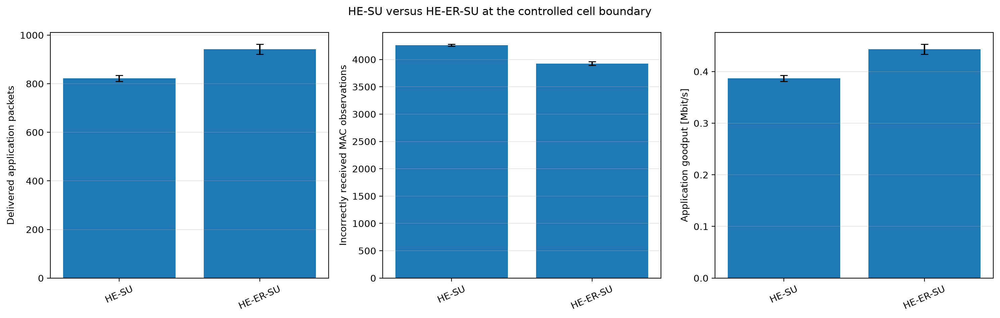
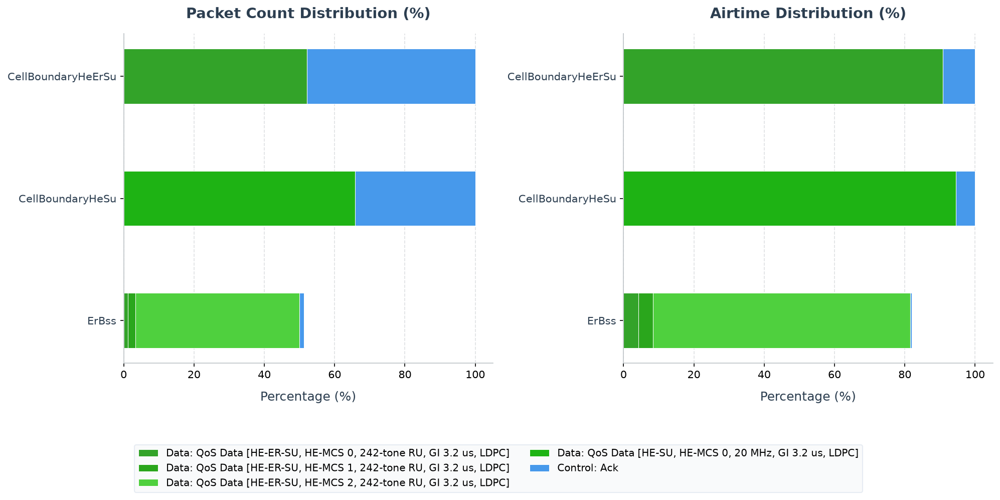

# Walkthrough: HE extended-range single-user

This walkthrough compares matched cell-boundary HE single-user (HE-SU) and HE
extended-range single-user (HE-ER-SU) transmissions. Run-0 radiotap fields
distinguish the PPDU formats; five-run application vectors measure the bounded
delivery outcome under the configured error model.

## Learning objectives and feature primer

After completing this walkthrough, the reader can:

- distinguish HE-SU from HE-ER-SU physical layer protocol data units (PPDUs);
- explain why repeated HE-SIG-A signaling can improve robustness;
- separate transmitted-format evidence from receiver/application evidence;
  and
- reproduce the representative run and first diagnostics.

HE-ER-SU carries one user's payload and repeats the HE-SIG-A signaling field.
The extra signaling time trades efficiency for robustness. A format label in
a sender-side capture proves what was transmitted, not that the receiver
decoded it or that range improved.

## Scenario description

[HeErSuNetwork.ned](HeErSuNetwork.ned) extends the common single-BSS network
with one AP and one station; a wired server sends downlink UDP. In the boundary
pair the AP and host are 340 m apart, background noise is `-89 dBm`,
sensitivity is `-100 dBm`, generic SNIR threshold is `0 dB`, payload is
100 B, interval is 600 µs, and Block Ack is disabled. Traffic starts at
`0.3 s`; there is no separate warm-up interval in the boundary pair, and
results use `0.3–2.0 s`. [omnetpp.ini](omnetpp.ini) fixes MCS 0 in
both cases so the primary delta is the PPDU format.

```text
server -- AP  ~~~~~~~~~ 340 m ~~~~~~~~~  host[0]
```

`ErBss` is a separate management/rate-control example and is not part of the
cell-boundary outcome comparison.

## Standards and INET model boundary

IEEE Std 802.11-2024 Clauses 27.1.4 and 27.3.4 define HE-SU and HE-ER-SU PPDU
formats; Table 27-13 gives the longer HE-SIG-A-R duration for HE-ER-SU. These
were verified in corpus chunks `80211ax-2024:chunk:09989`, `10075`, and
`10124`.

INET's `enableExtendedRangeSu` rate-control choice, error model, path loss,
noise, and thresholds are modeling choices. The experiment does not decode
HE-SIG-A success separately and does not certify a real-world range gain.

## Evidence status

| Claim or check | Status | Authoritative evidence | Runs/seeds | Scope or gap |
|---|---|---|---|---|
| Treatment transmits HE-ER-SU at MCS 0 | `PASS` | radiotap HE profile | packet run/seed `0` | 4513 QoS Data observations |
| Control transmits HE-SU at MCS 0 | `PASS` | radiotap HE profile | packet run/seed `0` | 4615 QoS Data observations |
| HE-ER-SU goodput is higher in boundary setup | `PASS` | application vectors | runs/seeds `0–4` | `0.3–2.0 s` |
| Repeated HE-SIG-A caused each delivery | `INCONCLUSIVE` | no per-frame signaling decode/outcome correlation | none | configuration-level inference |
| General range extension | `NOT RUN` | no distance curve | none | one boundary point only |

## Configuration matrix

| Configuration | Role | Feature gate/delta | Workload/channel | Runs/seeds | Expected invariant |
|---|---|---|---|---|---|
| `CellBoundaryHeSu` | Control | fixed HE-SU MCS 0 | 340 m, matched UDP/noise | `0–4` | HE-SU frames |
| `CellBoundaryHeErSu` | Treatment | extends control; ER-SU enabled, max MCS 0 | matched | `0–4` | HE-ER-SU and improved boundary delivery |
| `ErBss` | Feature example | ER-BSS and full management exchange | lighter traffic | packet run `0` | HE-ER-SU management/data formats |

The treatment extends the control, then installs `HeMinstrelRateControl`,
enables extended-range SU, clears the fixed data bitrate with `-1bps`, and
caps MCS at 0. Those more specific assignments win over the general interface
bitrate.

## Expected invariants and diagnostic map

| Invariant | Evidence and observation point | Failure symptom | Likely subsystem | Next diagnostic |
|---|---|---|---|---|
| PPDU format differs while MCS matches | AP PCAP HE fields | same/unknown format or MCS | rate control/PHY encoder | inspect known bits and selected mode |
| ER frame duration is longer at equal payload | packet statistics | no signaling overhead | duration calculator | compare GI, NSS, coding, and size |
| ER boundary goodput is higher | sink byte vectors | overlap/reversal | receiver error model | correlate reception/drop telemetry per seed |

## Reproduction

Run from the repository root. This command is illustrative and was **NOT RUN**
during this rewrite:

```sh
bin/inet -u Cmdenv -f examples/ieee80211ax/he_er_su/omnetpp.ini \
  -c CellBoundaryHeErSu -r 0 --seed-set=0 \
  --result-dir=examples/ieee80211ax/he_er_su/results/manual/CellBoundaryHeErSu
```

Campaign regeneration:

```sh
python3 examples/ieee80211ax/analysis/run_campaign.py er -j$(nproc)
MPLCONFIGDIR=/tmp/matplotlib \
  python3 examples/ieee80211ax/analysis/first_tranche.py er
```

The suite-owned packet command was executed with exit status 0 and created
session `20260725T234448Z`:

```sh
MPLCONFIGDIR=/tmp/matplotlib \
  python3 examples/ieee80211/analysis/analyze_pcap.py \
  --suite examples/ieee80211/analysis/suites/ax.json \
  --generate --subdir he_er_su --run 0 --allow-failed-evidence
```

## Scalar and vector analysis

Inputs are the `.sca`/`.vec` pairs in each configuration directory under
`results/20260725T120411Z/`. The sidecar
[he-er-su-boundary.png.json](../analysis/figures/he_er_su/he-er-su-boundary.png.json)
records all hashes, filters, seeds, and the `0.3–2.0 s` window.

```sh
opp_scavetool query -l \
  -f 'type =~ vector AND ((module =~ "**.app[*]" AND name =~ "packetReceived:vector(packetBytes)") OR (module =~ "**.mac" AND name =~ "packetDropIncorrectlyReceived:vector(packetBytes)"))' \
  examples/ieee80211ax/he_er_su/results/20260725T120411Z/*/*.vec
```

| Configuration | Application goodput |
|---|---:|
| `CellBoundaryHeSu` | 0.3870 ± 0.0059 Mbit/s |
| `CellBoundaryHeErSu` | 0.4435 ± 0.0098 Mbit/s |

Values are per-run means ± two-sided 95% Student-t CIs over five independent
seeds. Bytes received in `0.3–2.0 s` are aggregated within each run before
the across-run CI. The optional incorrect-reception vector may be absent when
zero. This supports a bounded delivery comparison, not a general range claim.

<!-- BEGIN GENERATED: ieee80211-scalar-vector-er -->
### Generated scalar/vector plot and table



Figure provenance: [`../analysis/figures/he_er_su/he-er-su-boundary.png.json`](../analysis/figures/he_er_su/he-er-su-boundary.png.json). Run-level metric source: [`../analysis/metrics.json`](../analysis/metrics.json).

| Configuration or comparison | Metric | Source result filters / modules / units | Window / per-run aggregation / exclusions | Independent runs (n) | Mean or direct value | 95% CI half-width |
|---|---|---|---|---:|---:|---:|
| HE-ER-SU | goodput mbps | vector / **.app[*] / packetReceived:vector(packetBytes) / unit=B<br>vector / **.mac / packetDropIncorrectlyReceived:vector(packetBytes) / unit=B | [0.3, 2.0) s; interpretation=diagnostic delivery comparison; the standard does not guarantee a gain for this channel/error model; observation=per-run 0.3-2.0 s measurement window; uncertainty=95% Student-t CI over five seeds | 5 | 0.443482 | 0.00975644 |
| HE-SU | goodput mbps | vector / **.app[*] / packetReceived:vector(packetBytes) / unit=B<br>vector / **.mac / packetDropIncorrectlyReceived:vector(packetBytes) / unit=B | [0.3, 2.0) s; interpretation=diagnostic delivery comparison; the standard does not guarantee a gain for this channel/error model; observation=per-run 0.3-2.0 s measurement window; uncertainty=95% Student-t CI over five seeds | 5 | 0.387012 | 0.00588098 |

The table is a presentation view of the session-bound run-level summary. The source and aggregation columns reproduce the bundle-level figure provenance; the authored analysis identifies which source supports each metric and supplies the interpretation.
<!-- END GENERATED: ieee80211-scalar-vector-er -->

## PCAP statistics

Session `results/20260725T234448Z` contains run/seed 0 legacy
PCAPs at AP and host MAC observation points. TShark 4.6.4 decodes them.

```sh
tshark -n -r 'examples/ieee80211ax/he_er_su/results/20260725T234448Z/CellBoundaryHeErSu/CellBoundaryHeErSu-#0HeErSuNetwork.ap.wlan[0].pcap' \
  -q -z io,stat,0,'wlan.fc.type_subtype==0x28'
```

| Configuration | AP/global observations | QoS Data evidence |
|---|---:|---|
| `CellBoundaryHeSu` | 7007 | 4615 HE-SU, MCS 0, 20 MHz; mean 217.6 µs, 166 B |
| `CellBoundaryHeErSu` | 8669 | 4513 HE-ER-SU, MCS 0, 242-tone RU, NSTS 1; mean 225.6 µs, 166 B |
| `ErBss` | 240 | 120 HE-ER-SU QoS Data; MCS 0/1/2 counts 3/5/112 |

Both boundary rows use 10 dBm transmit power. Counts are capture observations,
not delivered application packets.

<!-- BEGIN GENERATED: ieee80211ax-pcap-statistics -->
### Generated PCAP plots and tables


Figure provenance: [`packet_statistics.png.json`](../analysis/figures/he_er_su/packet_statistics.png.json).

This section provides a statistical overview of the 802.11 frames transmitted over the wireless medium during the simulation. The packet counts were gathered from AP wireless-interface observation points. With multiple AP captures, one medium transmission may be observed at more than one AP; counts and airtime therefore represent recorded transmission observations, not de-duplicated application packets.

Capture session `20260725T234448Z` was generated from fresh PCAPng input with `TShark (Wireshark) 4.6.4.`. The selected manifest is `examples/ieee80211/analysis/generated/ax/pcapmanifests/20260725T234448Z.json` (SHA-256 `c6f4ed39e6b636fb77033c5c062ee61147b4b80751e836e58baa14243d90cedf`). HE PPDU format, MCS, coding, bandwidth/RU, GI, and NSTS are decoded directly from standards-compliant radiotap HE fields; values not marked known by the recorder are omitted.

Two estimated airtime occupancy percentages are provided. HE-SU and HE-ER-SU use the modeled 36/44 µs preambles; a dissector-expanded A-MPDU is charged one shared preamble. HE MU/TB user-dependent signaling not exposed by radiotap remains approximate.
- **Air Time %**: This frame type's share of the sum of all estimated frame airtimes.
- **Air Time (Sim Time) %**: The sum of this frame type's estimated airtimes divided by the simulation time limit. Concurrent transmissions from multiple capture points are counted separately, so this value can exceed 100%; it is not the union of busy channel time.

#### Compact cross-configuration summary

| Configuration | Observation point / counting unit | Selection/filter | Observations | Dominant decoded frame/PHY evidence | Estimated airtime / sim time | Limits |
|---|---|---|---:|---|---:|---|
| `CellBoundaryHeErSu` | AP interface(s); capture observations<br>`examples/ieee80211ax/he_er_su/results/20260725T234448Z/CellBoundaryHeErSu/CellBoundaryHeErSu-#0HeErSuNetwork.ap.wlan[0].pcap` | `none (all decoded frames)` | 8669 | Data: QoS Data [HE-ER-SU, HE-MCS 0, 242-tone RU, GI 3.2 us, LDPC] (4513), Control: Ack (4156) | 56.03% | Not delivery or de-duplicated transmissions; unknown PHY fields stay unknown |
| `CellBoundaryHeSu` | AP interface(s); capture observations<br>`examples/ieee80211ax/he_er_su/results/20260725T234448Z/CellBoundaryHeSu/CellBoundaryHeSu-#0HeErSuNetwork.ap.wlan[0].pcap` | `none (all decoded frames)` | 7007 | Data: QoS Data [HE-SU, HE-MCS 0, 20 MHz, GI 3.2 us, LDPC] (4615), Control: Ack (2392) | 53.16% | Not delivery or de-duplicated transmissions; unknown PHY fields stay unknown |
| `ErBss` | AP interface(s); capture observations<br>`examples/ieee80211ax/he_er_su/results/20260725T234448Z/ErBss/ErBss-#0HeErSuNetwork.ap.wlan[0].pcap` | `none (all decoded frames)` | 240 | Control: Ack (117), Data: QoS Data [HE-ER-SU, HE-MCS 2, 242-tone RU, GI 3.2 us, LDPC] (112), Data: QoS Data [HE-ER-SU, HE-MCS 1, 242-tone RU, GI 3.2 us, LDPC] (5) | 0.80% | Not delivery or de-duplicated transmissions; unknown PHY fields stay unknown |

### Evidence checks

| Status | Requirement | Observed evidence |
|---|---|---|
| **PASS** | CellBoundaryHeErSu produced protocol-visible wireless observations | 8669 AP/global transmission observations |
| **PASS** | CellBoundaryHeSu produced protocol-visible wireless observations | 7007 AP/global transmission observations |
| **PASS** | ErBss produced protocol-visible wireless observations | 240 AP/global transmission observations |
| **PASS** | QoS payload uses HE-ER-SU | 120 of 120 QoS Data observations decoded as HE-ER-SU |
| **PASS** | HE-ER-SU uses one spatial stream, a 242-tone RU, and MCS 0-2 | HE-MCS 0/242-tone RU/NSTS 1, HE-MCS 1/242-tone RU/NSTS 1, HE-MCS 2/242-tone RU/NSTS 1 |
| **PASS** | HE-SU baseline does not use HE-ER-SU | 0 of 4615 QoS Data observations decoded as HE-ER-SU |
| **PASS** | QoS payload uses HE-ER-SU | 4513 of 4513 QoS Data observations decoded as HE-ER-SU |
| **PASS** | HE-ER-SU uses one spatial stream, a 242-tone RU, and MCS 0-2 | HE-MCS 0/242-tone RU/NSTS 1 |

### Configuration: `CellBoundaryHeErSu`
Total over-the-air frame/MPDU transmission observations (Global BSS/AP): **8669**

| Color | Frame Type & Subtype | Count | Percentage | Mean Size | Std Dev | Mean Duration | Std Dev Duration | Freq | Mean RX Sig | Mean TX Pwr | Air Time % | Air Time (Sim Time) % |
|:---:|---|---:|---:|---:|---:|---:|---:|---:|---:|---:|---:|---:|
| <svg width="16" height="16"><rect width="16" height="16" rx="3" fill="#33a329" /></svg> | Data: QoS Data [HE-ER-SU, HE-MCS 0, 242-tone RU, GI 3.2 us, LDPC] | 4513 | 52.06% | 166.0 B | 0.0 B | 225.6 us | 0.0 us | 5010 MHz | - | 10.0 dBm | 90.85% | 50.91% |
| <hr> | <hr> | <hr> | <hr> | <hr> | <hr> | <hr> | <hr> | <hr> | <hr> | <hr> | <hr> | <hr> |
| <svg width="16" height="16"><rect width="16" height="16" rx="3" fill="#4799eb" /></svg> | Control: Ack | 4156 | 47.94% | 14.0 B | 0.0 B | 24.7 us | 0.0 us | 5010 MHz | -87.0 dBm | - | 9.15% | 5.13% |

#### Representative frame-exchange timeline

| Frame | Simulation time (s) | Transmitter → receiver | Type/PHY | Decisive fields | Role in exchange |
|---:|---:|---|---|---|---|
| `CellBoundaryHeErSu-#0HeErSuNetwork.ap.wlan[0].pcap:1` | 0.300252000 | 10:00:00:00:00:00 → 0a:aa:00:00:00:01 | Data: QoS Data / HE-ER-SU, HE-MCS 0, 242-tone RU, NSS 1, GI 3.2 us, LDPC | direction=from DS, retry=0, seq=0, frag=0, more-frag=0, TID=6 | Carries protocol-visible MAC payload in the representative exchange. |
| `CellBoundaryHeErSu-#0HeErSuNetwork.ap.wlan[0].pcap:2` | 0.300314000 | ? → 10:00:00:00:00:00 | Control: Ack / Legacy/HT/VHT | direction=direct/IBSS, retry=0, seq=-, frag=-, more-frag=0, TID=- | Acknowledges the preceding unicast frame. |
| `CellBoundaryHeErSu-#0HeErSuNetwork.ap.wlan[0].pcap:3` | 0.300852000 | 10:00:00:00:00:00 → 0a:aa:00:00:00:01 | Data: QoS Data / HE-ER-SU, HE-MCS 0, 242-tone RU, NSS 1, GI 3.2 us, LDPC | direction=from DS, retry=0, seq=1, frag=0, more-frag=0, TID=6 | Carries protocol-visible MAC payload in the representative exchange. |
| `CellBoundaryHeErSu-#0HeErSuNetwork.ap.wlan[0].pcap:4` | 0.300914000 | ? → 10:00:00:00:00:00 | Control: Ack / Legacy/HT/VHT | direction=direct/IBSS, retry=0, seq=-, frag=-, more-frag=0, TID=- | Acknowledges the preceding unicast frame. |
| `CellBoundaryHeErSu-#0HeErSuNetwork.ap.wlan[0].pcap:5` | 0.301263000 | 10:00:00:00:00:00 → 0a:aa:00:00:00:01 | Data: QoS Data / HE-ER-SU, HE-MCS 0, 242-tone RU, NSS 1, GI 3.2 us, LDPC | direction=from DS, retry=1, seq=1, frag=0, more-frag=0, TID=6 | Carries protocol-visible MAC payload in the representative exchange. |
| `CellBoundaryHeErSu-#0HeErSuNetwork.ap.wlan[0].pcap:6` | 0.301325000 | ? → 10:00:00:00:00:00 | Control: Ack / Legacy/HT/VHT | direction=direct/IBSS, retry=0, seq=-, frag=-, more-frag=0, TID=- | Acknowledges the preceding unicast frame. |
| `CellBoundaryHeErSu-#0HeErSuNetwork.ap.wlan[0].pcap:7` | 0.301620000 | 10:00:00:00:00:00 → 0a:aa:00:00:00:01 | Data: QoS Data / HE-ER-SU, HE-MCS 0, 242-tone RU, NSS 1, GI 3.2 us, LDPC | direction=from DS, retry=0, seq=2, frag=0, more-frag=0, TID=6 | Carries protocol-visible MAC payload in the representative exchange. |
| `CellBoundaryHeErSu-#0HeErSuNetwork.ap.wlan[0].pcap:8` | 0.301682000 | ? → 10:00:00:00:00:00 | Control: Ack / Legacy/HT/VHT | direction=direct/IBSS, retry=0, seq=-, frag=-, more-frag=0, TID=- | Acknowledges the preceding unicast frame. |
| `CellBoundaryHeErSu-#0HeErSuNetwork.ap.wlan[0].pcap:9` | 0.301995000 | 10:00:00:00:00:00 → 0a:aa:00:00:00:01 | Data: QoS Data / HE-ER-SU, HE-MCS 0, 242-tone RU, NSS 1, GI 3.2 us, LDPC | direction=from DS, retry=1, seq=2, frag=0, more-frag=0, TID=6 | Carries protocol-visible MAC payload in the representative exchange. |
| `CellBoundaryHeErSu-#0HeErSuNetwork.ap.wlan[0].pcap:10` | 0.302058000 | ? → 10:00:00:00:00:00 | Control: Ack / Legacy/HT/VHT | direction=direct/IBSS, retry=0, seq=-, frag=-, more-frag=0, TID=- | Acknowledges the preceding unicast frame. |
| `CellBoundaryHeErSu-#0HeErSuNetwork.ap.wlan[0].pcap:11` | 0.302362000 | 10:00:00:00:00:00 → 0a:aa:00:00:00:01 | Data: QoS Data / HE-ER-SU, HE-MCS 0, 242-tone RU, NSS 1, GI 3.2 us, LDPC | direction=from DS, retry=0, seq=3, frag=0, more-frag=0, TID=6 | Carries protocol-visible MAC payload in the representative exchange. |
| `CellBoundaryHeErSu-#0HeErSuNetwork.ap.wlan[0].pcap:12` | 0.302424000 | ? → 10:00:00:00:00:00 | Control: Ack / Legacy/HT/VHT | direction=direct/IBSS, retry=0, seq=-, frag=-, more-frag=0, TID=- | Acknowledges the preceding unicast frame. |
| `CellBoundaryHeErSu-#0HeErSuNetwork.ap.wlan[0].pcap:13` | 0.302737000 | 10:00:00:00:00:00 → 0a:aa:00:00:00:01 | Data: QoS Data / HE-ER-SU, HE-MCS 0, 242-tone RU, NSS 1, GI 3.2 us, LDPC | direction=from DS, retry=1, seq=3, frag=0, more-frag=0, TID=6 | Carries protocol-visible MAC payload in the representative exchange. |
| `CellBoundaryHeErSu-#0HeErSuNetwork.ap.wlan[0].pcap:14` | 0.302799000 | ? → 10:00:00:00:00:00 | Control: Ack / Legacy/HT/VHT | direction=direct/IBSS, retry=0, seq=-, frag=-, more-frag=0, TID=- | Acknowledges the preceding unicast frame. |
| `CellBoundaryHeErSu-#0HeErSuNetwork.ap.wlan[0].pcap:15` | 0.303094000 | 10:00:00:00:00:00 → 0a:aa:00:00:00:01 | Data: QoS Data / HE-ER-SU, HE-MCS 0, 242-tone RU, NSS 1, GI 3.2 us, LDPC | direction=from DS, retry=1, seq=3, frag=0, more-frag=0, TID=6 | Carries protocol-visible MAC payload in the representative exchange. |
| `CellBoundaryHeErSu-#0HeErSuNetwork.ap.wlan[0].pcap:16` | 0.303156000 | ? → 10:00:00:00:00:00 | Control: Ack / Legacy/HT/VHT | direction=direct/IBSS, retry=0, seq=-, frag=-, more-frag=0, TID=- | Acknowledges the preceding unicast frame. |

Frame numbers are local to the named capture, not OMNeT++ event numbers. For readability, the table collapses observations with the same timestamp and MAC identity across capture interfaces; aggregate PCAP statistics retain the original observation counts.

### Configuration: `CellBoundaryHeSu`
Total over-the-air frame/MPDU transmission observations (Global BSS/AP): **7007**

| Color | Frame Type & Subtype | Count | Percentage | Mean Size | Std Dev | Mean Duration | Std Dev Duration | Freq | Mean RX Sig | Mean TX Pwr | Air Time % | Air Time (Sim Time) % |
|:---:|---|---:|---:|---:|---:|---:|---:|---:|---:|---:|---:|---:|
| <svg width="16" height="16"><rect width="16" height="16" rx="3" fill="#1eb314" /></svg> | Data: QoS Data [HE-SU, HE-MCS 0, 20 MHz, GI 3.2 us, LDPC] | 4615 | 65.86% | 166.0 B | 0.0 B | 217.6 us | 0.0 us | 5010 MHz | - | 10.0 dBm | 94.45% | 50.21% |
| <hr> | <hr> | <hr> | <hr> | <hr> | <hr> | <hr> | <hr> | <hr> | <hr> | <hr> | <hr> | <hr> |
| <svg width="16" height="16"><rect width="16" height="16" rx="3" fill="#4799eb" /></svg> | Control: Ack | 2392 | 34.14% | 14.0 B | 0.0 B | 24.7 us | 0.0 us | 5010 MHz | -87.0 dBm | - | 5.55% | 2.95% |

#### Representative frame-exchange timeline

| Frame | Simulation time (s) | Transmitter → receiver | Type/PHY | Decisive fields | Role in exchange |
|---:|---:|---|---|---|---|
| `CellBoundaryHeSu-#0HeErSuNetwork.ap.wlan[0].pcap:1` | 0.300244000 | 10:00:00:00:00:00 → 0a:aa:00:00:00:01 | Data: QoS Data / HE-SU, HE-MCS 0, 20 MHz, NSS 1, GI 3.2 us, LDPC | direction=from DS, retry=0, seq=0, frag=0, more-frag=0, TID=6 | Carries protocol-visible MAC payload in the representative exchange. |
| `CellBoundaryHeSu-#0HeErSuNetwork.ap.wlan[0].pcap:2` | 0.300645000 | 10:00:00:00:00:00 → 0a:aa:00:00:00:01 | Data: QoS Data / HE-SU, HE-MCS 0, 20 MHz, NSS 1, GI 3.2 us, LDPC | direction=from DS, retry=1, seq=0, frag=0, more-frag=0, TID=6 | Carries protocol-visible MAC payload in the representative exchange. |
| `CellBoundaryHeSu-#0HeErSuNetwork.ap.wlan[0].pcap:3` | 0.300983000 | 10:00:00:00:00:00 → 0a:aa:00:00:00:01 | Data: QoS Data / HE-SU, HE-MCS 0, 20 MHz, NSS 1, GI 3.2 us, LDPC | direction=from DS, retry=1, seq=0, frag=0, more-frag=0, TID=6 | Carries protocol-visible MAC payload in the representative exchange. |
| `CellBoundaryHeSu-#0HeErSuNetwork.ap.wlan[0].pcap:4` | 0.301339000 | 10:00:00:00:00:00 → 0a:aa:00:00:00:01 | Data: QoS Data / HE-SU, HE-MCS 0, 20 MHz, NSS 1, GI 3.2 us, LDPC | direction=from DS, retry=1, seq=0, frag=0, more-frag=0, TID=6 | Carries protocol-visible MAC payload in the representative exchange. |
| `CellBoundaryHeSu-#0HeErSuNetwork.ap.wlan[0].pcap:5` | 0.301401000 | ? → 10:00:00:00:00:00 | Control: Ack / Legacy/HT/VHT | direction=direct/IBSS, retry=0, seq=-, frag=-, more-frag=0, TID=- | Acknowledges the preceding unicast frame. |
| `CellBoundaryHeSu-#0HeErSuNetwork.ap.wlan[0].pcap:6` | 0.301742000 | 10:00:00:00:00:00 → 0a:aa:00:00:00:01 | Data: QoS Data / HE-SU, HE-MCS 0, 20 MHz, NSS 1, GI 3.2 us, LDPC | direction=from DS, retry=1, seq=0, frag=0, more-frag=0, TID=6 | Carries protocol-visible MAC payload in the representative exchange. |
| `CellBoundaryHeSu-#0HeErSuNetwork.ap.wlan[0].pcap:7` | 0.301804000 | ? → 10:00:00:00:00:00 | Control: Ack / Legacy/HT/VHT | direction=direct/IBSS, retry=0, seq=-, frag=-, more-frag=0, TID=- | Acknowledges the preceding unicast frame. |
| `CellBoundaryHeSu-#0HeErSuNetwork.ap.wlan[0].pcap:8` | 0.302127000 | 10:00:00:00:00:00 → 0a:aa:00:00:00:01 | Data: QoS Data / HE-SU, HE-MCS 0, 20 MHz, NSS 1, GI 3.2 us, LDPC | direction=from DS, retry=1, seq=0, frag=0, more-frag=0, TID=6 | Carries protocol-visible MAC payload in the representative exchange. |
| `CellBoundaryHeSu-#0HeErSuNetwork.ap.wlan[0].pcap:9` | 0.302189000 | ? → 10:00:00:00:00:00 | Control: Ack / Legacy/HT/VHT | direction=direct/IBSS, retry=0, seq=-, frag=-, more-frag=0, TID=- | Acknowledges the preceding unicast frame. |
| `CellBoundaryHeSu-#0HeErSuNetwork.ap.wlan[0].pcap:10` | 0.302467000 | 10:00:00:00:00:00 → 0a:aa:00:00:00:01 | Data: QoS Data / HE-SU, HE-MCS 0, 20 MHz, NSS 1, GI 3.2 us, LDPC | direction=from DS, retry=1, seq=0, frag=0, more-frag=0, TID=6 | Carries protocol-visible MAC payload in the representative exchange. |
| `CellBoundaryHeSu-#0HeErSuNetwork.ap.wlan[0].pcap:11` | 0.302530000 | ? → 10:00:00:00:00:00 | Control: Ack / Legacy/HT/VHT | direction=direct/IBSS, retry=0, seq=-, frag=-, more-frag=0, TID=- | Acknowledges the preceding unicast frame. |
| `CellBoundaryHeSu-#0HeErSuNetwork.ap.wlan[0].pcap:12` | 0.302808000 | 10:00:00:00:00:00 → 0a:aa:00:00:00:01 | Data: QoS Data / HE-SU, HE-MCS 0, 20 MHz, NSS 1, GI 3.2 us, LDPC | direction=from DS, retry=0, seq=1, frag=0, more-frag=0, TID=6 | Carries protocol-visible MAC payload in the representative exchange. |
| `CellBoundaryHeSu-#0HeErSuNetwork.ap.wlan[0].pcap:13` | 0.302870000 | ? → 10:00:00:00:00:00 | Control: Ack / Legacy/HT/VHT | direction=direct/IBSS, retry=0, seq=-, frag=-, more-frag=0, TID=- | Acknowledges the preceding unicast frame. |
| `CellBoundaryHeSu-#0HeErSuNetwork.ap.wlan[0].pcap:14` | 0.303166000 | 10:00:00:00:00:00 → 0a:aa:00:00:00:01 | Data: QoS Data / HE-SU, HE-MCS 0, 20 MHz, NSS 1, GI 3.2 us, LDPC | direction=from DS, retry=0, seq=2, frag=0, more-frag=0, TID=6 | Carries protocol-visible MAC payload in the representative exchange. |
| `CellBoundaryHeSu-#0HeErSuNetwork.ap.wlan[0].pcap:15` | 0.303228000 | ? → 10:00:00:00:00:00 | Control: Ack / Legacy/HT/VHT | direction=direct/IBSS, retry=0, seq=-, frag=-, more-frag=0, TID=- | Acknowledges the preceding unicast frame. |
| `CellBoundaryHeSu-#0HeErSuNetwork.ap.wlan[0].pcap:16` | 0.303524000 | 10:00:00:00:00:00 → 0a:aa:00:00:00:01 | Data: QoS Data / HE-SU, HE-MCS 0, 20 MHz, NSS 1, GI 3.2 us, LDPC | direction=from DS, retry=0, seq=3, frag=0, more-frag=0, TID=6 | Carries protocol-visible MAC payload in the representative exchange. |

Frame numbers are local to the named capture, not OMNeT++ event numbers. For readability, the table collapses observations with the same timestamp and MAC identity across capture interfaces; aggregate PCAP statistics retain the original observation counts.

### Configuration: `ErBss`
Total over-the-air frame/MPDU transmission observations (Global BSS/AP): **240**

| Color | Frame Type & Subtype | Count | Percentage | Mean Size | Std Dev | Mean Duration | Std Dev Duration | Freq | Mean RX Sig | Mean TX Pwr | Air Time % | Air Time (Sim Time) % |
|:---:|---|---:|---:|---:|---:|---:|---:|---:|---:|---:|---:|---:|
| <svg width="16" height="16"><rect width="16" height="16" rx="3" fill="#33a329" /></svg> | Data: QoS Data [HE-ER-SU, HE-MCS 0, 242-tone RU, GI 3.2 us, LDPC] | 3 | 1.25% | 166.0 B | 0.0 B | 225.6 us | 0.0 us | 5010 MHz | - | 10.0 dBm | 4.23% | 0.03% |
| <svg width="16" height="16"><rect width="16" height="16" rx="3" fill="#2aa61c" /></svg> | Data: QoS Data [HE-ER-SU, HE-MCS 1, 242-tone RU, GI 3.2 us, LDPC] | 5 | 2.08% | 166.0 B | 0.0 B | 134.8 us | 0.0 us | 5010 MHz | - | 10.0 dBm | 4.21% | 0.03% |
| <svg width="16" height="16"><rect width="16" height="16" rx="3" fill="#4fd03e" /></svg> | Data: QoS Data [HE-ER-SU, HE-MCS 2, 242-tone RU, GI 3.2 us, LDPC] | 112 | 46.67% | 166.0 B | 0.0 B | 104.5 us | 0.0 us | 5010 MHz | - | 10.0 dBm | 73.09% | 0.59% |
| <hr> | <hr> | <hr> | <hr> | <hr> | <hr> | <hr> | <hr> | <hr> | <hr> | <hr> | <hr> | <hr> |
| <svg width="16" height="16"><rect width="16" height="16" rx="3" fill="#4799eb" /></svg> | Control: Ack | 117 | 48.75% | 14.0 B | 0.0 B | 24.7 us | 0.0 us | 5010 MHz | -87.0 dBm | - | 18.02% | 0.14% |
| <svg width="16" height="16"><rect width="16" height="16" rx="3" fill="#4799eb" /></svg> | Control: Ack | 3 | 1.25% | 14.0 B | 0.0 B | 24.7 us | 0.0 us | 5010 MHz | -87.0 dBm | - | 0.46% | 0.00% |

#### Representative frame-exchange timeline

| Frame | Simulation time (s) | Transmitter → receiver | Type/PHY | Decisive fields | Role in exchange |
|---:|---:|---|---|---|---|
| `ErBss-#0HeErSuNetwork.ap.wlan[0].pcap:1` | 0.800124000 | 10:00:00:00:00:00 → 0a:aa:00:00:00:01 | Data: QoS Data / HE-ER-SU, HE-MCS 2, 242-tone RU, NSS 1, GI 3.2 us, LDPC | direction=from DS, retry=0, seq=0, frag=0, more-frag=0, TID=6 | Carries protocol-visible MAC payload in the representative exchange. |
| `ErBss-#0HeErSuNetwork.ap.wlan[0].pcap:2` | 0.800174000 | ? → 10:00:00:00:00:00 | Control: Ack / Legacy/HT/VHT | direction=direct/IBSS, retry=0, seq=-, frag=-, more-frag=0, TID=- | Acknowledges the preceding unicast frame. |
| `ErBss-#0HeErSuNetwork.ap.wlan[0].pcap:3` | 0.810124000 | 10:00:00:00:00:00 → 0a:aa:00:00:00:01 | Data: QoS Data / HE-ER-SU, HE-MCS 2, 242-tone RU, NSS 1, GI 3.2 us, LDPC | direction=from DS, retry=0, seq=1, frag=0, more-frag=0, TID=6 | Carries protocol-visible MAC payload in the representative exchange. |
| `ErBss-#0HeErSuNetwork.ap.wlan[0].pcap:4` | 0.810174000 | ? → 10:00:00:00:00:00 | Control: Ack / Legacy/HT/VHT | direction=direct/IBSS, retry=0, seq=-, frag=-, more-frag=0, TID=- | Acknowledges the preceding unicast frame. |
| `ErBss-#0HeErSuNetwork.ap.wlan[0].pcap:5` | 0.820124000 | 10:00:00:00:00:00 → 0a:aa:00:00:00:01 | Data: QoS Data / HE-ER-SU, HE-MCS 2, 242-tone RU, NSS 1, GI 3.2 us, LDPC | direction=from DS, retry=0, seq=2, frag=0, more-frag=0, TID=6 | Carries protocol-visible MAC payload in the representative exchange. |
| `ErBss-#0HeErSuNetwork.ap.wlan[0].pcap:6` | 0.820174000 | ? → 10:00:00:00:00:00 | Control: Ack / Legacy/HT/VHT | direction=direct/IBSS, retry=0, seq=-, frag=-, more-frag=0, TID=- | Acknowledges the preceding unicast frame. |
| `ErBss-#0HeErSuNetwork.ap.wlan[0].pcap:7` | 0.830124000 | 10:00:00:00:00:00 → 0a:aa:00:00:00:01 | Data: QoS Data / HE-ER-SU, HE-MCS 2, 242-tone RU, NSS 1, GI 3.2 us, LDPC | direction=from DS, retry=0, seq=3, frag=0, more-frag=0, TID=6 | Carries protocol-visible MAC payload in the representative exchange. |
| `ErBss-#0HeErSuNetwork.ap.wlan[0].pcap:8` | 0.830174000 | ? → 10:00:00:00:00:00 | Control: Ack / Legacy/HT/VHT | direction=direct/IBSS, retry=0, seq=-, frag=-, more-frag=0, TID=- | Acknowledges the preceding unicast frame. |
| `ErBss-#0HeErSuNetwork.ap.wlan[0].pcap:9` | 0.840124000 | 10:00:00:00:00:00 → 0a:aa:00:00:00:01 | Data: QoS Data / HE-ER-SU, HE-MCS 2, 242-tone RU, NSS 1, GI 3.2 us, LDPC | direction=from DS, retry=0, seq=4, frag=0, more-frag=0, TID=6 | Carries protocol-visible MAC payload in the representative exchange. |
| `ErBss-#0HeErSuNetwork.ap.wlan[0].pcap:10` | 0.840174000 | ? → 10:00:00:00:00:00 | Control: Ack / Legacy/HT/VHT | direction=direct/IBSS, retry=0, seq=-, frag=-, more-frag=0, TID=- | Acknowledges the preceding unicast frame. |
| `ErBss-#0HeErSuNetwork.ap.wlan[0].pcap:11` | 0.850124000 | 10:00:00:00:00:00 → 0a:aa:00:00:00:01 | Data: QoS Data / HE-ER-SU, HE-MCS 2, 242-tone RU, NSS 1, GI 3.2 us, LDPC | direction=from DS, retry=0, seq=5, frag=0, more-frag=0, TID=6 | Carries protocol-visible MAC payload in the representative exchange. |
| `ErBss-#0HeErSuNetwork.ap.wlan[0].pcap:12` | 0.850174000 | ? → 10:00:00:00:00:00 | Control: Ack / Legacy/HT/VHT | direction=direct/IBSS, retry=0, seq=-, frag=-, more-frag=0, TID=- | Acknowledges the preceding unicast frame. |
| `ErBss-#0HeErSuNetwork.ap.wlan[0].pcap:13` | 0.860124000 | 10:00:00:00:00:00 → 0a:aa:00:00:00:01 | Data: QoS Data / HE-ER-SU, HE-MCS 2, 242-tone RU, NSS 1, GI 3.2 us, LDPC | direction=from DS, retry=0, seq=6, frag=0, more-frag=0, TID=6 | Carries protocol-visible MAC payload in the representative exchange. |
| `ErBss-#0HeErSuNetwork.ap.wlan[0].pcap:14` | 0.860174000 | ? → 10:00:00:00:00:00 | Control: Ack / Legacy/HT/VHT | direction=direct/IBSS, retry=0, seq=-, frag=-, more-frag=0, TID=- | Acknowledges the preceding unicast frame. |
| `ErBss-#0HeErSuNetwork.ap.wlan[0].pcap:15` | 0.870252000 | 10:00:00:00:00:00 → 0a:aa:00:00:00:01 | Data: QoS Data / HE-ER-SU, HE-MCS 0, 242-tone RU, NSS 1, GI 3.2 us, LDPC | direction=from DS, retry=0, seq=7, frag=0, more-frag=0, TID=6 | Carries protocol-visible MAC payload in the representative exchange. |
| `ErBss-#0HeErSuNetwork.ap.wlan[0].pcap:16` | 0.870314000 | ? → 10:00:00:00:00:00 | Control: Ack / Legacy/HT/VHT | direction=direct/IBSS, retry=0, seq=-, frag=-, more-frag=0, TID=- | Acknowledges the preceding unicast frame. |

Frame numbers are local to the named capture, not OMNeT++ event numbers. For readability, the table collapses observations with the same timestamp and MAC identity across capture interfaces; aggregate PCAP statistics retain the original observation counts.

### Analysis of Packet Distribution
**PASS: HE-ER-SU payload selection.** 4513 of 4513 QoS Data observations decoded as HE-ER-SU. IEEE Std 802.11-2024 Clause 27.3.7 restricts HE ER SU to a single 242-tone or 106-tone RU and MCS 0–2 (242-tone) or MCS 0 (106-tone); DCM is optional. The standard does not guarantee a range gain on every channel, but a configuration claiming HE-ER-SU payload coverage must first select that PPDU format. The matched five-seed 340 m sweep in this walkthrough uses equal MCS 0 data fields and reports application delivery together with incorrect-reception observations, isolating the modeled HE-SIG-A repetition gain.
<!-- END GENERATED: ieee80211ax-pcap-statistics -->

## Frame exchange analysis

```sh
tshark -n -r 'examples/ieee80211ax/he_er_su/results/20260725T234448Z/CellBoundaryHeErSu/CellBoundaryHeErSu-#0HeErSuNetwork.ap.wlan[0].pcap' \
  -Y 'frame.number <= 2' -T fields -E header=y -E separator='|' \
  -e frame.number -e frame.time_epoch -e wlan.sa -e wlan.da \
  -e wlan.fc.type_subtype -e radiotap.he.data_1.ppdu_format \
  -e radiotap.he.data_3.data_mcs -e radiotap.he.data_5.data_bw_ru_allocation \
  -e radiotap.he.data_6.nsts
```

| Frame | Simulation time | Transmitter → receiver | Type/PHY | Decisive fields | Role in exchange |
|---:|---:|---|---|---|---|
| 1 | 0.300252 s | AP → host[0] | QoS Data / HE-ER-SU | PPDU `1`, MCS 0, BW/RU code 7, NSTS 1 | treatment data |
| 2 | 0.300314 s | host[0] → AP | Ack | subtype `0x1d` | receiver MAC response |

The typed analyzer maps code 7 to the authoritative 242-tone HE-ER-SU
observation after checking radiotap presence and known bits.

## Cross-layer findings and verdict

| Claim | Verdict | Configuration evidence | Model telemetry | Packet evidence | Outcome evidence |
|---|---|---|---|---|---|
| ER treatment changes PPDU format | `PASS` | ER rate control enabled | selected-mode path implied | HE-ER-SU vs HE-SU decoded | n/a |
| ER treatment improves this boundary outcome | `PASS` | matched MCS/load/channel | application receive vectors | equal-MCS format distinction | higher five-run goodput |
| repeated SIG-A is per-frame cause | `INCONCLUSIVE` | requested format | no signaling decision vector | no SIG-A-success field | separate-session aggregate |

The bounded verdict is `PASS` for PPDU-format selection and higher application
goodput at this configured boundary, with per-packet causal attribution
`INCONCLUSIVE`.

## Limitations and inconclusive claims

- Scalar/vector and packet evidence come from separate sessions.
- The capture identifies transmitted format but not HE-SIG-A decode success.
- One distance, path-loss realization, MCS, and noise point do not define a
  range curve.
- Resolve causality by co-recording selected mode, signaling/header error
  outcome, receiver decision, and AP/host captures in one seed.

## Further experiments

- Sweep distance or noise around the boundary and compare matched delivery
  curves across several seeds.
- Add a negative control with ER disabled but dynamic rate control retained.

## Implementation plan

| Item | Evidence-backed plan |
|---|---|
| Demonstrated gap | no direct HE-SIG-A success/failure observation |
| Intended behavior | expose signaling-field outcome without altering reception |
| Smallest change surface | first assess existing PHY error-model signals/results; add telemetry only if absent |
| Observability | selected PPDU format plus preamble/header/data error stage |
| Validation | co-record control/treatment, boundary points, seeds, PCAP and receiver telemetry |
| Compatibility and risks | telemetry must not perturb RNG or packet processing |
| Architecture and sealing | apply architecture/sealing review before any `src/inet` edit |
| Next handoff | HE PHY/error-model maintainer |

## Artifact provenance

| Artifact family | Session/path | Configurations/runs | Tool/filter/window | Integrity notes |
|---|---|---|---|---|
| Scalar/vector | `results/20260725T120411Z` | boundary pair, runs/seeds `0–4` | sidecar; `0.3–2.0 s` | SHA-256 per input |
| PCAP | `results/20260725T234448Z` | three configs, run/seed `0` | TShark 4.6.4; MAC | manifest and hashes in generated block |
| Figure | `../analysis/figures/he_er_su/he-er-su-boundary.png` | boundary pair | per-run CI | provenance sidecar |
