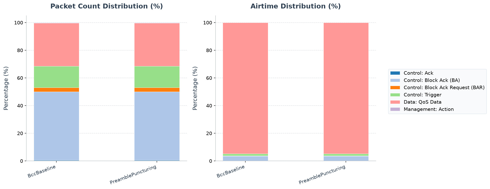

# 802.11ax HE Advanced Features Showcase

This example isolates several 802.11ax HE PHY/MAC choices and the trade-offs
they introduce relative to a BCC, unpunctured HE MU baseline:

* HE LDPC timing/accounting and LDPC PER gain
* Packet-extension (PE) timing metadata
* HE MU PHY header puncturing metadata
* HE LDPC / preamble-puncturing capability negotiation
* Validated preamble-puncturing configuration
* Puncture-aware RU allocation

All scenarios share the same network, `Lan80211AxHeFeatures`, which consists of a wired server, one access point, and four wireless stations operating on an 80 MHz channel.  80 MHz is required because HE preamble puncturing is only defined for 80 MHz and 160 MHz channels.

---

## 1. Network Configuration

The network is configured in `omnetpp.ini` under `[General]`:

* `**.opMode = "ax"`
* `**.bandName = "5 GHz (80 MHz)"` with `**.centerFrequency = 5.2GHz` and `**.channelNumber = 2`
* `**.wlan[*].radio.receiver.bandwidth = 80MHz`
* `**.mac.hcf.typename = "HeHcf"`
* `**.ap.wlan[*].mac.hcf.dlScheduler.typename = "HeDlSchedulerBacklogBased"`
  * This scheduler is used for all scenarios because it calls `allocateHeRus()` with the punctured-subchannel mask, producing a puncture-aware RU layout.
* `**.displayHeMuSignalDetails = true` and `**.displayHeMuSignalPhyFields = true`

The server sends 1000-byte downlink UDP packets to all four hosts every 2 ms in
the ordinary feature configurations. A single warm-up trigger runs from
`0.2s` to `0.25s`; normal traffic starts at `0.3s`. The interference
configurations override the data interval to `0.5ms` to saturate the channel.
The resulting backlog exceeds the scheduler's 1500 B threshold, so it requests
large RUs (up to 484-tone). Under puncturing, the allocator downgrades or
relocates allocations so that no RU overlaps the disabled 20 MHz subchannel.

These values are deliberate. An 80 MHz channel is the smallest width in this
example that can lose one 20 MHz subchannel while retaining a useful wideband
transmission. Four continuously backlogged stations give the scheduler several
RU-placement choices. The 1000-byte packets make PHY coding and RU capacity
more visible than a tiny-packet workload, while the `0.5 ms` interference cases
remove the offered-load ceiling when puncturing is evaluated.

---

## 2. Simulation Scenarios

### Scenario A: `BccBaseline`

**Description:** Baseline HE MU-OFDMA with BCC coding, zero packet-extension duration, and no preamble puncturing.

**What to observe:** This is the reference point. The AP schedules all four stations concurrently. With the backlog-based scheduler, stations receive large RUs (up to 484-tone once backlog has grown). The HE MU PHY header uses `HE_CODING_BCC`, `packetExtensionDurationUs = 0`, and `puncturedSubchannelMask = 0`, so the compact (non-extended) PHY header format is used.

### Scenario B: `HeLdpc`

**Description:** Enable HE LDPC at the AP and all four stations.

**What it demonstrates:**

* **LDPC timing / accounting:** When `HE_CODING_LDPC` is selected, `Ieee80211HePhyCalculator` omits the BCC tail bits and instead computes the LDPC codeword length (648, 1296, or 1944 bits), the number of codewords, shortening bits, and repetition bits.
* **LDPC PER gain:** `Ieee80211YansErrorModel` applies a 1.5 dB SNR boost for LDPC-coded HE transmissions, improving the per-user success rate.

**Configuration:**

```ini
**.ap.wlan[*].mib.heLdpc = true
**.host[*].wlan[*].mib.heLdpc = true
```

**What to observe:**

* Slightly shorter PPDU durations because the BCC tail bits are no longer transmitted and LDPC codeword accounting is used.
* The LDPC PHY path is selected, but this offered load is fully delivered in
  both BCC and LDPC runs; application packet counts alone do not expose the
  modeled PER improvement here.
* The HE MU signal details show `coding = LDPC`.

### Scenario C: `PacketExtension`

**Description:** Use an 8 µs HE packet-extension duration.

**What it demonstrates:**

* **PE metadata propagation:** The default PE duration is read from `Ieee80211Mib` (`heDefaultPeDurationUs`), copied into the scheduler's `ScheduleContext`, attached to the MU container via `Ieee80211HeMuCommonReq`, written into the `Ieee80211HeMuPhyHeader`, and finally passed to `computeHePpduParameters()` where it is added to the PPDU duration.
* **Extended HE MU PHY header:** The serializer emits the extended HE MU PHY header whenever the PE duration or puncturing mask is non-zero, preserving backward compatibility for the default case.

**Configuration:**

```ini
**.ap.wlan[*].mib.heDefaultPeDurationUs = 8
**.host[*].wlan[*].mib.heDefaultPeDurationUs = 8
```

**What to observe:**

* PPDU durations are exactly 8 µs longer than in the baseline.
* The HE MU signal details show `packetExtensionDurationUs = 8`.
* The emitted HE MU PHY header is the extended variant.

### Scenario D: `PreamblePuncturing`

**Description:** Puncture the second 20 MHz subchannel of the 80 MHz channel.

**What it demonstrates:**

* **Validated puncturing configuration:** `HeHcf::parseHePreamblePuncturing()` checks that the mask is only used for 80/160 MHz, that the primary 20 MHz subchannel remains active, and that at least one subchannel stays enabled.
* **Puncture-aware RU allocation:** `Ieee80211HeRu::allocateHeRus()` receives the punctured-subchannel mask and marks the corresponding tones as occupied before fitting RUs. No RU is placed on the disabled subchannel.
* **Puncturing metadata:** The mask is carried through the trigger / MU request tags and written into the `Ieee80211HeMuPhyHeader` as `puncturedSubchannelMask`.

**Configuration:**

```ini
**.ap.wlan[*].mac.hcf.hePreamblePuncturing = "0100"
```

Bit 0 is the primary 20 MHz subchannel; `0100` disables subchannel index 1 only.

**What to observe:**

* The scheduler cannot place the large requested RUs on the remaining three 20 MHz subchannels (a 484-tone RU needs two adjacent active 20 MHz subchannels). `fitRequestedRus()` downgrades one or more allocations to smaller RU sizes so that no RU overlaps the punctured subchannel.
* No RU overlaps the punctured subchannel.
* The HE MU signal details show `puncturedSubchannelMask = 0x2` (binary `0100` where character index 1 maps to bit 1).
* The extended HE MU PHY header is emitted.

### Scenario E: `MixedLdpcSupport`

**Description:** The AP supports HE LDPC, but `host[3]` does not.

**What it demonstrates:**

* **Capability negotiation:** During association, the AP and each STA exchange `Ieee80211HeCapabilitiesElement`s. `negotiateHeCapabilities()` computes the intersection of local and peer capabilities: `ldpc = local.ldpc && peer.ldpc`. The negotiated result is stored per peer in `Ieee80211Mib`.
* **Scheduling fallback:** `HeHcf` selects `HE_CODING_LDPC` only when **all** scheduled peers support it. Any MU frame that includes `host[3]` therefore falls back to `HE_CODING_BCC`.

**Configuration:**

```ini
**.ap.wlan[*].mib.heLdpc = true
**.host[0].wlan[*].mib.heLdpc = true
**.host[1].wlan[*].mib.heLdpc = true
**.host[2].wlan[*].mib.heLdpc = true
**.host[3].wlan[*].mib.heLdpc = false
```

**What to observe:**

* HE MU frames that do not include `host[3]` use `coding = LDPC`.
* HE MU frames that include `host[3]` use `coding = BCC`.
* This demonstrates that capability negotiation is per-peer and that the scheduler respects the negotiated result.

### Scenario F: `CombinedHeFeatures`

**Description:** Enable LDPC, an 8 µs packet extension, and one punctured 20 MHz subchannel at the same time.

**What it demonstrates:** All featured mechanisms working together in a single configuration.

**Configuration:**

```ini
**.ap.wlan[*].mib.heLdpc = true
**.host[*].wlan[*].mib.heLdpc = true
**.ap.wlan[*].mib.heDefaultPeDurationUs = 8
**.host[*].wlan[*].mib.heDefaultPeDurationUs = 8
**.ap.wlan[*].mac.hcf.hePreamblePuncturing = "0100"
```

**What to observe:**

* Extended HE MU PHY header carrying `coding = LDPC`, `packetExtensionDurationUs = 8`, and `puncturedSubchannelMask = 0x2`.
* PPDU duration includes the PE contribution.
* The RU layout avoids the punctured subchannel.

---

## 3. How to Run

From the INET project root, run the desired configuration:

```sh
bin/inet -u Qtenv -c HeLdpc examples/ieee80211ax/he_features/omnetpp.ini
```

Other useful configurations:

```sh
bin/inet -u Qtenv -c BccBaseline examples/ieee80211ax/he_features/omnetpp.ini
bin/inet -u Qtenv -c PacketExtension examples/ieee80211ax/he_features/omnetpp.ini
bin/inet -u Qtenv -c PreamblePuncturing examples/ieee80211ax/he_features/omnetpp.ini
bin/inet -u Qtenv -c MixedLdpcSupport examples/ieee80211ax/he_features/omnetpp.ini
bin/inet -u Qtenv -c CombinedHeFeatures examples/ieee80211ax/he_features/omnetpp.ini
```

For a batch run comparing all scenarios:

```sh
bin/inet -c BccBaseline examples/ieee80211ax/he_features/omnetpp.ini
bin/inet -c HeLdpc examples/ieee80211ax/he_features/omnetpp.ini
bin/inet -c PacketExtension examples/ieee80211ax/he_features/omnetpp.ini
bin/inet -c PreamblePuncturing examples/ieee80211ax/he_features/omnetpp.ini
bin/inet -c MixedLdpcSupport examples/ieee80211ax/he_features/omnetpp.ini
bin/inet -c CombinedHeFeatures examples/ieee80211ax/he_features/omnetpp.ini
```

---

## 4. Verification Hints

The following log or signal fields are useful for verifying each mechanism:

| Feature | Where to look |
|---|---|
| LDPC vs BCC selection | HE MU signal detail label / `Ieee80211HeMuPhyHeader::coding` |
| LDPC codeword accounting | `Ieee80211HeUserPhyParameters` (`ldpcCodewordLength`, `ldpcCodewordCount`, `ldpcShorteningBits`, `tailBits`) |
| LDPC PER gain | `udpApp[*]` packet received counts compared with `BccBaseline` |
| PE duration | `Ieee80211HeMuPhyHeader::packetExtensionDurationUs` and PPDU duration |
| Extended PHY header | `Ieee80211HeMuPhyHeaderSerializer` emits extra bytes when PE or puncturing is non-zero |
| Puncturing mask | `Ieee80211HeMuPhyHeader::puncturedSubchannelMask` and the number of scheduled users per PPDU |
| Puncture-aware allocation | RU indices in the HE MU signal details should avoid the punctured 20 MHz subchannel |
| Capability negotiation | Per-peer negotiated capabilities in `Ieee80211Mib` and the resulting `coding` field per frame |

In Qtenv, inspect the AP `mib` module for `heCapabilitiesSummary`, `heOperationSummary`, `negotiatedHePeers`, and the HE capability maps. Inspect `wlan[0].mac.hcf.dlScheduler` for `lastScheduleSummary` and `lastRuAllocations`, and inspect the radio transmitter for `lastHeTransmissionSummary` and `lastHeUserPhyParameters`.

---

## 5. Code Pointers

| Mechanism | Key files |
|---|---|
| LDPC accounting & PE timing | `src/inet/physicallayer/wireless/ieee80211/packetlevel/Ieee80211HePhyCalculator.h` |
| LDPC PER boost | `src/inet/physicallayer/wireless/ieee80211/packetlevel/errormodel/Ieee80211YansErrorModel.cc` |
| Capability negotiation | `src/inet/linklayer/ieee80211/mib/Ieee80211HeCapabilities.h`, `Ieee80211Mib.cc` |
| Puncturing validation & filtering | `src/inet/linklayer/ieee80211/mac/coordinationfunction/HeHcf.cc` |
| Puncture-aware RU allocation | `src/inet/physicallayer/wireless/ieee80211/packetlevel/Ieee80211HeRu.h` |
| HE MU PHY header metadata | `src/inet/physicallayer/wireless/ieee80211/packetlevel/Ieee80211PhyHeader.msg` |
| Metadata tags & trigger frame | `src/inet/linklayer/ieee80211/mac/Ieee80211Frame.msg`, `src/inet/physicallayer/wireless/ieee80211/packetlevel/Ieee80211Tag.msg` |

---

## 6. Quantitative Results and Verification

All configurations were run with Cmdenv using five seeds. The table reports
aggregate goodput from `packetReceived:vector(packetBytes)` in the common
`0.3–0.95s` measurement window. The ordinary feature cases offer 2 ms traffic;
the three interference cases use the 0.5 ms override.

| Configuration / Config | Description | Measured aggregate goodput |
|---|---|---|
| **`BccBaseline`** | HE MU-OFDMA with BCC coding | **16.000 Mbps**; 325 packets/STA/run |
| **`HeLdpc`** | HE LDPC timing and PER gain | **16.000 Mbps**; 325 packets/STA/run |
| **`PacketExtension`** | 8 µs HE packet-extension duration | **16.000 Mbps**; 325 packets/STA/run |
| **`PreamblePuncturing`** | Punctured second 20 MHz subchannel | **16.000 Mbps**; 325 packets/STA/run |
| **`MixedLdpcSupport`** | AP LDPC enabled, host[3] disabled | **16.000 Mbps**; 325 packets/STA/run |
| **`CombinedHeFeatures`** | LDPC, PE, and puncturing enabled | **16.000 Mbps**; 325 packets/STA/run |
| **`CleanChannelBaseline`** | Clean channel baseline (no interferer) | **16.000 Mbps**; 325 packets/STA/run |
| **`LegacyInterferenceWithoutPuncturing`** | Jammer on 2nd subchannel (no puncturing) | **63.941 ± 0.051 Mbps** |
| **`PreamblePuncturingUnderInterference`** | Jammer on 2nd subchannel (punctured) | **63.882 ± 0.033 Mbps** |
| **`DynamicPuncturing`** | Dynamic preamble puncturing | **63.931 ± 0.033 Mbps** |

The intervals are 95% Student-t confidence intervals over five run-level
observations. The equal ordinary-case goodput is the offered-load ceiling:
LDPC, PE, and puncturing change the PHY representation without changing an
application rate that is already fully served. The near-equal interference
results also do not establish a puncturing gain in this scalar-medium scenario;
the decisive evidence here is the mask transition and puncture-aware RU
placement. Conceptually, puncturing's advantage is resilience, not extra
clean-channel capacity: it sacrifices one 20 MHz subchannel so traffic can
continue on the remaining spectrum when that subchannel is unusable.

To query the received packet counts using `opp_scavetool`:

```sh
opp_scavetool query -l -f 'name =~ "packetReceived:vector(packetBytes)" and module =~ "*.host*app*"' examples/ieee80211ax/he_features/results/*.vec
```

---

## 7. PCAP Tshark Packet Exchange Analysis

To record PCAP traces and inspect them with TShark, run the simulation with PCAP recording and checksum computation enabled:

```sh
mkdir -p examples/ieee80211ax/he_features/results/pcap
bin/inet -u Cmdenv -f examples/ieee80211ax/he_features/omnetpp.ini -c DynamicPuncturing -r 0 --result-dir=examples/ieee80211ax/he_features/results/pcap --**.numPcapRecorders=1 --**.checksumMode=\"computed\" --**.fcsMode=\"computed\" --**.pcapRecorder[*].moduleNamePatterns=\"wlan[0]\" --**.pcapRecorder[*].dumpProtocols=\"ieee80211mac\" --**.pcapRecorder[*].fileFormat=\"pcapng\" --**.pcapRecorder[*].timePrecision=9 --**.pcapRecorder[*].alwaysFlush=true
```

Use TShark to print the timeline of packet exchanges at the Access Point's wireless interface:

```sh
tshark -n -r 'examples/ieee80211ax/he_features/results/pcap/DynamicPuncturing-#0Lan80211AxHeFeatures.ap.wlan[0].pcap' -c 20
```

The decoded output timeline shows:
1. **Downlink UDP Traffic**: The AP transmits UDP data packets (e.g. frame 1) to the client hosts.
2. **ADDBA Handshake**: The AP and hosts exchange block acknowledgment action frames (e.g. frames 3, 5, 7) to negotiate Multi-STA block acknowledgments.
3. **Preamble Puncturing Verification**: The AP `.vec` telemetry observes
   mask values `0` and `2`, with the runtime transition at approximately
   `0.35s` and `0.7s`. The aligned RU offset/size/STA vectors show the
   scheduler's puncture-aware allocation; the native PCAP confirms the
   surrounding IEEE 802.11 exchange but does not carry all HE PHY fields.

---

## 8. How to interpret the feature trade-offs

* HE LDPC in INET is a packet-level model: it does not include a bit-level LDPC codec. Instead it models the timing and PER impact (codeword accounting, tail-bit omission, and a 1.5 dB SNR boost).
* Preamble puncturing capability is advertised by default in the current `Ieee80211HeCapabilities` struct, so all peers in this example support it. The scenario therefore emphasizes **configuration validation** and **puncture-aware allocation** rather than a peer-capability fallback.
* The example focuses on downlink MU-OFDMA. The same metadata paths (PE duration, puncturing mask, coding) are also used for uplink MU-OFDMA via the Trigger frame.
* LDPC buys robustness and can improve useful throughput near a decoding
  boundary; on a clean link it may only change coding/timing telemetry.
* Packet extension gives receivers more processing time at a direct airtime
  cost. The configured `8 us` makes that cost easy to identify in PPDU duration.
* Mixed capability is intentionally included because an AP can use a feature
  only when the scheduled peers support the relevant mode. Negotiation is part
  of the advantage: it permits modern and less-capable stations to coexist.

## 802.11 Packet Type Statistics


This section provides a statistical overview of the 802.11 frames transmitted over the wireless medium during the simulation. The packet counts were gathered from the Access Point's wireless interface (`ap.wlan[0]`), which captures all uplink, downlink, and management traffic in the BSS without duplication.

> **HE capture metadata caveat:** The current INET `PcapRecorder` uses a repository-specific packing for HE radiotap metadata. TShark can consequently decode SU transmissions as HE ER SU and downlink HE MU transmissions as HE TB. Frame type, subtype, count, and size remain useful, but the HE PPDU-format, MCS, bandwidth, GI, NSS, and coding suffixes—and the airtime estimates derived from them—are diagnostic only and are not standards-conformance evidence.

Two airtime occupancy percentages are provided:
- **Air Time %**: This frame type's share of the sum of all estimated frame airtimes.
- **Air Time (Sim Time) %**: The sum of this frame type's estimated airtimes divided by the simulation time limit. Concurrent transmissions from multiple capture points are counted separately, so this value can exceed 100%; it is not the union of busy channel time.

### Configuration: `BccBaseline`
Total over-the-air packets captured (Global BSS/AP): **2262**

| Color | Frame Type & Subtype | Count | Percentage | Mean Size | Std Dev | Mean Duration | Std Dev Duration | Freq | Mean RX Sig | Mean TX Pwr | Air Time % | Air Time (Sim Time) % |
|:---:|---|---:|---:|---:|---:|---:|---:|---:|---:|---:|---:|---:|
| <svg width="16" height="16"><rect width="16" height="16" rx="3" fill="#35b521" /></svg> | Data: QoS Data [HE-ER-SU, HE-MCS 1, 80 MHz, GI 3.2 us, BCC] | 704 | 31.12% | 2164.7 B | 1105.0 B | 406.7 us | 144.3 us | 5200 MHz | - | 20.0 dBm | 85.00% | 28.63% |
| <hr> | <hr> | <hr> | <hr> | <hr> | <hr> | <hr> | <hr> | <hr> | <hr> | <hr> | <hr> | <hr> |
| <svg width="16" height="16"><rect width="16" height="16" rx="3" fill="#f47106" /></svg> | Control: Trigger [HE-ER-SU, HE-MCS 11, 80 MHz, GI 3.2 us, BCC] | 350 | 15.47% | 55.0 B | 0.0 B | 38.3 us | 0.0 us | 5200 MHz | - | 20.0 dBm | 3.98% | 1.34% |
| <svg width="16" height="16"><rect width="16" height="16" rx="3" fill="#ba7a45" /></svg> | Control: Block Ack Request (BAR) [HE-ER-SU, HE-MCS 11, 80 MHz, GI 3.2 us, BCC] | 69 | 3.05% | 24.0 B | 0.0 B | 28.0 us | 0.0 us | 5200 MHz | - | 20.0 dBm | 0.57% | 0.19% |
| <svg width="16" height="16"><rect width="16" height="16" rx="3" fill="#09399f" /></svg> | Control: Block Ack (BA) [HE-ER-SU, HE-MCS 11, 80 MHz, GI 3.2 us, BCC] | 69 | 3.05% | 32.0 B | 0.0 B | 30.7 us | 0.0 us | 5200 MHz | -67.0 dBm | - | 0.63% | 0.21% |
| <svg width="16" height="16"><rect width="16" height="16" rx="3" fill="#0d31a5" /></svg> | Control: Block Ack (BA) [HE-TB, HE-MCS 0, 20 MHz, GI 3.2 us, BCC] | 1050 | 46.42% | 32.0 B | 0.0 B | 30.7 us | 0.0 us | 5165 MHz, 5176 MHz, 5184 MHz | -67.0 dBm | - | 9.56% | 3.22% |
| <svg width="16" height="16"><rect width="16" height="16" rx="3" fill="#3ba8e8" /></svg> | Control: Ack [HE-ER-SU, HE-MCS 1, 80 MHz, GI 3.2 us, BCC] | 4 | 0.18% | 14.0 B | 0.0 B | 24.7 us | 0.0 us | 5200 MHz | -67.0 dBm | - | 0.03% | 0.01% |
| <svg width="16" height="16"><rect width="16" height="16" rx="3" fill="#43adea" /></svg> | Control: Ack [HE-ER-SU, HE-MCS 11, 80 MHz, GI 3.2 us, BCC] | 8 | 0.35% | 14.0 B | 0.0 B | 24.7 us | 0.0 us | 5200 MHz | -67.0 dBm | 20.0 dBm | 0.06% | 0.02% |
| <hr> | <hr> | <hr> | <hr> | <hr> | <hr> | <hr> | <hr> | <hr> | <hr> | <hr> | <hr> | <hr> |
| <svg width="16" height="16"><rect width="16" height="16" rx="3" fill="#e7132f" /></svg> | Management: Action [HE-ER-SU, HE-MCS 11, 80 MHz, GI 3.2 us, BCC] | 8 | 0.35% | 37.0 B | 0.0 B | 69.3 us | 0.0 us | 5200 MHz | -67.0 dBm | 20.0 dBm | 0.16% | 0.06% |

### Configuration: `PreamblePuncturing`
Total over-the-air packets captured (Global BSS/AP): **2262**

| Color | Frame Type & Subtype | Count | Percentage | Mean Size | Std Dev | Mean Duration | Std Dev Duration | Freq | Mean RX Sig | Mean TX Pwr | Air Time % | Air Time (Sim Time) % |
|:---:|---|---:|---:|---:|---:|---:|---:|---:|---:|---:|---:|---:|
| <svg width="16" height="16"><rect width="16" height="16" rx="3" fill="#35b521" /></svg> | Data: QoS Data [HE-ER-SU, HE-MCS 1, 80 MHz, GI 3.2 us, BCC] | 704 | 31.12% | 2164.7 B | 1105.0 B | 406.7 us | 144.3 us | 5200 MHz | - | 20.0 dBm | 85.00% | 28.63% |
| <hr> | <hr> | <hr> | <hr> | <hr> | <hr> | <hr> | <hr> | <hr> | <hr> | <hr> | <hr> | <hr> |
| <svg width="16" height="16"><rect width="16" height="16" rx="3" fill="#f47106" /></svg> | Control: Trigger [HE-ER-SU, HE-MCS 11, 80 MHz, GI 3.2 us, BCC] | 350 | 15.47% | 55.0 B | 0.0 B | 38.3 us | 0.0 us | 5200 MHz | - | 20.0 dBm | 3.98% | 1.34% |
| <svg width="16" height="16"><rect width="16" height="16" rx="3" fill="#ba7a45" /></svg> | Control: Block Ack Request (BAR) [HE-ER-SU, HE-MCS 11, 80 MHz, GI 3.2 us, BCC] | 69 | 3.05% | 24.0 B | 0.0 B | 28.0 us | 0.0 us | 5200 MHz | - | 20.0 dBm | 0.57% | 0.19% |
| <svg width="16" height="16"><rect width="16" height="16" rx="3" fill="#09399f" /></svg> | Control: Block Ack (BA) [HE-ER-SU, HE-MCS 11, 80 MHz, GI 3.2 us, BCC] | 69 | 3.05% | 32.0 B | 0.0 B | 30.7 us | 0.0 us | 5200 MHz | -67.0 dBm | - | 0.63% | 0.21% |
| <svg width="16" height="16"><rect width="16" height="16" rx="3" fill="#0e49c8" /></svg> | Control: Block Ack (BA) [HE-TB, HE-MCS 0, 20 MHz, GI 3.2 us, LDPC] | 1050 | 46.42% | 32.0 B | 0.0 B | 30.7 us | 0.0 us | 5165 MHz, 5176 MHz, 5206 MHz | -67.0 dBm | - | 9.56% | 3.22% |
| <svg width="16" height="16"><rect width="16" height="16" rx="3" fill="#3ba8e8" /></svg> | Control: Ack [HE-ER-SU, HE-MCS 1, 80 MHz, GI 3.2 us, BCC] | 4 | 0.18% | 14.0 B | 0.0 B | 24.7 us | 0.0 us | 5200 MHz | -67.0 dBm | - | 0.03% | 0.01% |
| <svg width="16" height="16"><rect width="16" height="16" rx="3" fill="#43adea" /></svg> | Control: Ack [HE-ER-SU, HE-MCS 11, 80 MHz, GI 3.2 us, BCC] | 8 | 0.35% | 14.0 B | 0.0 B | 24.7 us | 0.0 us | 5200 MHz | -67.0 dBm | 20.0 dBm | 0.06% | 0.02% |
| <hr> | <hr> | <hr> | <hr> | <hr> | <hr> | <hr> | <hr> | <hr> | <hr> | <hr> | <hr> | <hr> |
| <svg width="16" height="16"><rect width="16" height="16" rx="3" fill="#e7132f" /></svg> | Management: Action [HE-ER-SU, HE-MCS 11, 80 MHz, GI 3.2 us, BCC] | 8 | 0.35% | 37.0 B | 0.0 B | 69.3 us | 0.0 us | 5200 MHz | -67.0 dBm | 20.0 dBm | 0.16% | 0.06% |

### Analysis of Packet Distribution
`BccBaseline` and `PreamblePuncturing` have identical frame counts in this run. That is not a standards violation and does not mean the PHY configuration was identical: preamble puncturing changes the usable subchannels/RU placement, while a fully served offered load can leave packet totals unchanged. Validate the mask and puncture-aware RU allocation with the vectors documented above; the current PCAP metadata cannot prove them.
