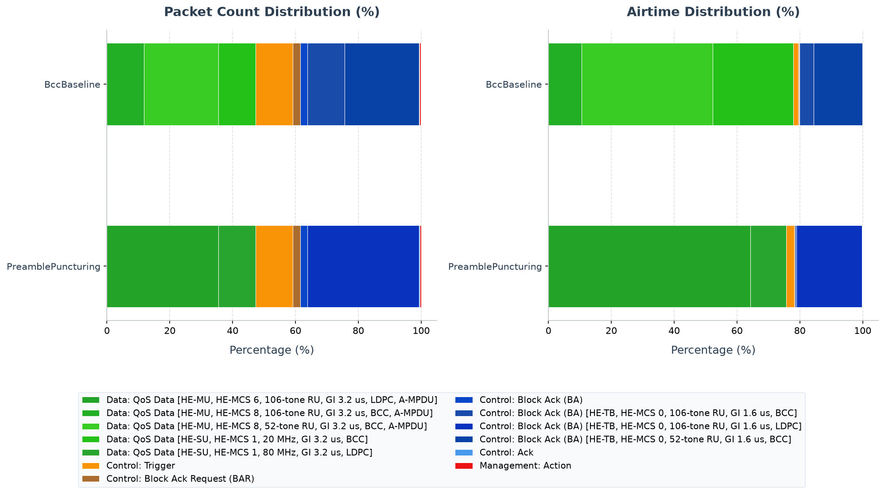

# HE Preamble Puncturing Walkthrough

This walkthrough is limited to puncturing behavior demonstrated by the retained
results. The network and configuration definitions are in
[omnetpp.ini](omnetpp.ini) and [Lan80211AxHeFeatures.ned](Lan80211AxHeFeatures.ned).

## Demonstrated configurations

The scalar/vector session
[`20260725T120411Z`](results/scalar-vector/20260725T120411Z) contains five runs
(`-r 0` through `-r 4`) for each configuration below.

| Configuration | Direct evidence |
|---|---|
| `CleanChannelBaseline` | `packetReceived:vector(packetBytes)` records `16.000 Mbps` aggregate goodput (five-run mean, 95% CI `±0.000 Mbps`). |
| `LegacyInterferenceWithoutPuncturing` | `packetReceived:vector(packetBytes)` records `63.931 ± 0.033 Mbps`. |
| `PreamblePuncturingUnderInterference` | `packetReceived:vector(packetBytes)` records `63.902 ± 0.043 Mbps`; `hePuncturedSubchannelMask:vector` and the paired `heRuToneOffset:vector`/`heRuToneSize:vector` are the mask and allocation evidence. |
| `DynamicPuncturing` | `hePuncturedSubchannelMask:vector` contains masks `0` and `2`, directly recording runtime mask changes; `packetReceived:vector(packetBytes)` records `63.921 ± 0.033 Mbps`. |

The interference configurations have overlapping five-run goodput intervals,
so these measurements demonstrate puncturing state and RU-placement telemetry,
not a goodput advantage. For each scheduled allocation, interpret
`heRuToneOffset:vector`, `heRuToneSize:vector`, and `heStaId:vector` at the same
timestamp as `hePuncturedSubchannelMask:vector`; those aligned vectors are the
evidence for whether an RU occupies an enabled frequency region.

## Reproduce and inspect

Run one configuration and run number at a time from the INET project root:

```sh
bin/inet -u Cmdenv -f examples/ieee80211ax/he_features/omnetpp.ini -c DynamicPuncturing -r 0 --result-dir=examples/ieee80211ax/he_features/results/manual
```

Query only the puncturing and delivery vectors:

```sh
opp_scavetool query -l \
  -f 'name =~ "hePuncturedSubchannelMask:vector" or name =~ "heRuToneOffset:vector" or name =~ "heRuToneSize:vector" or name =~ "heStaId:vector" or name =~ "packetReceived:vector(packetBytes)"' \
  examples/ieee80211ax/he_features/results/manual/*.sca \
  examples/ieee80211ax/he_features/results/manual/*.vec
```

The retained packet-statistics session
[`20260724T175025Z`](results/packet-statistics/20260724T175025Z) supplies the
PCAP, scalar, and vector artifacts summarized in the exact tables below. The
tables record `2264` AP/global observations for both `BccBaseline` and
`PreamblePuncturing`; their evidence check explicitly leaves mask transitions
and RU non-overlap to the result vectors.

To inspect the punctured AP capture directly:

```sh
tshark -n -r 'examples/ieee80211ax/he_features/results/packet-statistics/20260724T175025Z/PreamblePuncturing/PreamblePuncturing-#0Lan80211AxHeFeatures.ap.wlan[0].pcap' -c 20
```

<!-- REWRITE-PREFIX-END -->


<!-- BEGIN GENERATED: ieee80211ax-pcap-statistics -->
## 802.11 Packet Type Statistics


This section provides a statistical overview of the 802.11 frames transmitted over the wireless medium during the simulation. The packet counts were gathered from AP wireless-interface observation points. With multiple AP captures, one medium transmission may be observed at more than one AP; counts and airtime therefore represent recorded transmission observations, not de-duplicated application packets.

Capture session `20260724T175025Z` was generated from fresh PCAPng input with `TShark (Wireshark) 4.6.4.`. HE PPDU format, MCS, coding, bandwidth/RU, GI, and NSTS are decoded directly from standards-compliant radiotap HE fields; values not marked known by the recorder are omitted.

Two estimated airtime occupancy percentages are provided. HE-SU and HE-ER-SU use the modeled 36/44 µs preambles; a dissector-expanded A-MPDU is charged one shared preamble. HE MU/TB user-dependent signaling not exposed by radiotap remains approximate.
- **Air Time %**: This frame type's share of the sum of all estimated frame airtimes.
- **Air Time (Sim Time) %**: The sum of this frame type's estimated airtimes divided by the simulation time limit. Concurrent transmissions from multiple capture points are counted separately, so this value can exceed 100%; it is not the union of busy channel time.

### Evidence checks

| Status | Requirement | Observed evidence |
|---|---|---|
| **PASS** | BccBaseline produced protocol-visible wireless observations | 2264 AP/global transmission observations |
| **PASS** | PreamblePuncturing produced protocol-visible wireless observations | 2264 AP/global transmission observations |
| **INCONCLUSIVE** | Puncturing mask transitions and RU allocations do not overlap punctured subchannels | Subtype counts cannot establish the puncturing mask; result vectors remain authoritative |

### Configuration: `BccBaseline`
Total over-the-air frame/MPDU transmission observations (Global BSS/AP): **2264**

| Color | Frame Type & Subtype | Count | Percentage | Mean Size | Std Dev | Mean Duration | Std Dev Duration | Freq | Mean RX Sig | Mean TX Pwr | Air Time % | Air Time (Sim Time) % |
|:---:|---|---:|---:|---:|---:|---:|---:|---:|---:|---:|---:|---:|
| <svg width="16" height="16"><rect width="16" height="16" rx="3" fill="#24c219" /></svg> | Data: QoS Data [HE-SU, HE-MCS 1, 20 MHz, GI 3.2 us, BCC] | 354 | 15.64% | 1066.0 B | 0.0 B | 619.1 us | 0.0 us | 5050 MHz | - | 20.0 dBm | 13.28% | 21.92% |
| <hr> | <hr> | <hr> | <hr> | <hr> | <hr> | <hr> | <hr> | <hr> | <hr> | <hr> | <hr> | <hr> |
| <svg width="16" height="16"><rect width="16" height="16" rx="3" fill="#f99406" /></svg> | Control: Trigger | 350 | 15.46% | 55.0 B | 0.0 B | 38.3 us | 0.0 us | 5050 MHz | - | 20.0 dBm | 0.81% | 1.34% |
| <svg width="16" height="16"><rect width="16" height="16" rx="3" fill="#ab6c30" /></svg> | Control: Block Ack Request (BAR) | 69 | 3.05% | 24.0 B | 0.0 B | 28.0 us | 0.0 us | 5050 MHz | - | 20.0 dBm | 0.12% | 0.19% |
| <svg width="16" height="16"><rect width="16" height="16" rx="3" fill="#0946c8" /></svg> | Control: Block Ack (BA) | 69 | 3.05% | 32.0 B | 0.0 B | 30.7 us | 0.0 us | 5050 MHz | -67.0 dBm | - | 0.13% | 0.21% |
| <svg width="16" height="16"><rect width="16" height="16" rx="3" fill="#184baa" /></svg> | Control: Block Ack (BA) [HE-TB, HE-MCS 0, 106-tone RU, GI 1.6 us, BCC] | 350 | 15.46% | 32.0 B | 0.0 B | 108.3 us | 0.0 us | 5045 MHz | -67.0 dBm | - | 2.30% | 3.79% |
| <svg width="16" height="16"><rect width="16" height="16" rx="3" fill="#0842a6" /></svg> | Control: Block Ack (BA) [HE-TB, HE-MCS 0, 52-tone RU, GI 1.6 us, BCC] | 700 | 30.92% | 32.0 B | 0.0 B | 189.6 us | 0.0 us | 5053 MHz, 5057 MHz | -67.0 dBm | - | 8.04% | 13.27% |
| <svg width="16" height="16"><rect width="16" height="16" rx="3" fill="#4799eb" /></svg> | Control: Ack | 4 | 0.18% | 14.0 B | 0.0 B | 24.7 us | 0.0 us | 5050 MHz | -67.0 dBm | - | 0.01% | 0.01% |
| <svg width="16" height="16"><rect width="16" height="16" rx="3" fill="#4799eb" /></svg> | Control: Ack | 8 | 0.35% | 14.0 B | 0.0 B | 24.7 us | 0.0 us | 5050 MHz | -67.0 dBm | 20.0 dBm | 0.01% | 0.02% |
| <hr> | <hr> | <hr> | <hr> | <hr> | <hr> | <hr> | <hr> | <hr> | <hr> | <hr> | <hr> | <hr> |
| <svg width="16" height="16"><rect width="16" height="16" rx="3" fill="#ec1313" /></svg> | Management: Action | 10 | 0.44% | 37.0 B | 0.0 B | 69.3 us | 0.0 us | 5050 MHz | -67.0 dBm | 20.0 dBm | 0.04% | 0.07% |
| <hr> | <hr> | <hr> | <hr> | <hr> | <hr> | <hr> | <hr> | <hr> | <hr> | <hr> | <hr> | <hr> |
| <svg width="16" height="16"><rect width="16" height="16" rx="3" fill="#33cc52" /></svg> | Control: Subtype 0 [HE-MU, HE, GI 3.2 us] | 350 | 15.46% | 3210.0 B | 0.0 B | 3547.8 us | 0.0 us | 5050 MHz | - | 20.0 dBm | 75.26% | 124.17% |

### Configuration: `PreamblePuncturing`
Total over-the-air frame/MPDU transmission observations (Global BSS/AP): **2264**

| Color | Frame Type & Subtype | Count | Percentage | Mean Size | Std Dev | Mean Duration | Std Dev Duration | Freq | Mean RX Sig | Mean TX Pwr | Air Time % | Air Time (Sim Time) % |
|:---:|---|---:|---:|---:|---:|---:|---:|---:|---:|---:|---:|---:|
| <svg width="16" height="16"><rect width="16" height="16" rx="3" fill="#27a52f" /></svg> | Data: QoS Data [HE-SU, HE-MCS 1, 80 MHz, GI 3.2 us, LDPC] | 354 | 15.64% | 1066.0 B | 0.0 B | 175.2 us | 0.0 us | 5200 MHz | - | 20.0 dBm | 4.32% | 6.20% |
| <hr> | <hr> | <hr> | <hr> | <hr> | <hr> | <hr> | <hr> | <hr> | <hr> | <hr> | <hr> | <hr> |
| <svg width="16" height="16"><rect width="16" height="16" rx="3" fill="#f99406" /></svg> | Control: Trigger | 350 | 15.46% | 55.0 B | 0.0 B | 38.3 us | 0.0 us | 5200 MHz | - | 20.0 dBm | 0.93% | 1.34% |
| <svg width="16" height="16"><rect width="16" height="16" rx="3" fill="#ab6c30" /></svg> | Control: Block Ack Request (BAR) | 69 | 3.05% | 24.0 B | 0.0 B | 28.0 us | 0.0 us | 5200 MHz | - | 20.0 dBm | 0.13% | 0.19% |
| <svg width="16" height="16"><rect width="16" height="16" rx="3" fill="#0946c8" /></svg> | Control: Block Ack (BA) | 69 | 3.05% | 32.0 B | 0.0 B | 30.7 us | 0.0 us | 5200 MHz | -67.0 dBm | - | 0.15% | 0.21% |
| <svg width="16" height="16"><rect width="16" height="16" rx="3" fill="#0933be" /></svg> | Control: Block Ack (BA) [HE-TB, HE-MCS 0, 106-tone RU, GI 1.6 us, LDPC] | 1050 | 46.38% | 32.0 B | 0.0 B | 108.3 us | 0.0 us | 5165 MHz, 5176 MHz, 5206 MHz | -67.0 dBm | - | 7.92% | 11.37% |
| <svg width="16" height="16"><rect width="16" height="16" rx="3" fill="#4799eb" /></svg> | Control: Ack | 12 | 0.53% | 14.0 B | 0.0 B | 24.7 us | 0.0 us | 5200 MHz | -67.0 dBm | 20.0 dBm | 0.02% | 0.03% |
| <hr> | <hr> | <hr> | <hr> | <hr> | <hr> | <hr> | <hr> | <hr> | <hr> | <hr> | <hr> | <hr> |
| <svg width="16" height="16"><rect width="16" height="16" rx="3" fill="#ec1313" /></svg> | Management: Action | 10 | 0.44% | 37.0 B | 0.0 B | 69.3 us | 0.0 us | 5200 MHz | -67.0 dBm | 20.0 dBm | 0.05% | 0.07% |
| <hr> | <hr> | <hr> | <hr> | <hr> | <hr> | <hr> | <hr> | <hr> | <hr> | <hr> | <hr> | <hr> |
| <svg width="16" height="16"><rect width="16" height="16" rx="3" fill="#33cc52" /></svg> | Control: Subtype 0 [HE-MU, HE, GI 3.2 us] | 350 | 15.46% | 3210.0 B | 0.0 B | 3547.8 us | 0.0 us | 5200 MHz | - | 20.0 dBm | 86.48% | 124.17% |

<!-- END GENERATED: ieee80211ax-pcap-statistics -->
