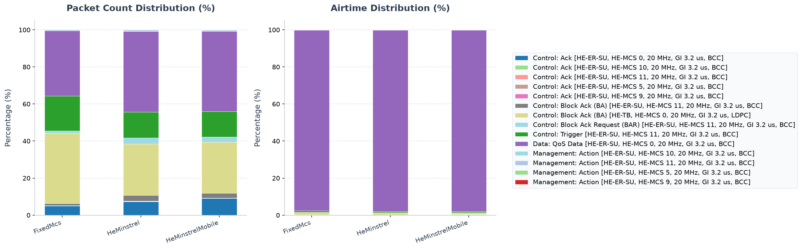

# 802.11ax HE Rate Adaptation Simulation

This example illustrates the High Efficiency (HE) Rate Adaptation mechanisms in the IEEE 802.11ax (Wi-Fi 6) standard. It showcases the difference between a static SNR-based MCS selection fallback and the dynamic, feedback-driven **HE Minstrel** rate adaptation algorithm in a multi-user downlink scheduling scenario.

## Background: HE Rate Selection & Minstrel Rate Control

Selecting the optimal Modulation and Coding Scheme (MCS) is critical in wireless networks. A rate too high causes packet corruption, while a rate too low wastes channel airtime. In 802.11ax, this choice is further integrated with the downlink scheduler:

1. **Static SNR-Based Fallback (SNR Mapping)**:
   - When no dynamic rate control is active, the HCF Downlink Scheduler uses a static mapping.
   - It estimates the path loss to the destination, calculates the expected SNR, and matches it against a configured table of thresholds (`heMcsSnrThresholds` parameter, default: `"4 7 10 13 16 19 21 24 27 30 33 36"` dB for MCS 0..11).

2. **HE Minstrel Rate Control (`HeMinstrelRateControl`)**:
   - Inspired by the classic Minstrel algorithm for legacy 802.11, this is a feedback-driven rate controller.
   - It maintains an **Exponentially Weighted Moving Average (EWMA)** of frame transmission success probabilities for each peer station and each possible MCS/NSS combination.
   - It periodically schedules **probe frames** (controlled by `lookaroundRatio`) to test other rates, dynamically adapting to actual link conditions (such as fading, shadowing, and collision levels) based on received ACKs and Block ACKs.

---

## Network Topology

The network [HeRateAdaptationNetwork.ned](HeRateAdaptationNetwork.ned) consists of:
- **`ap`**: An Access Point located at `(320, 210)`.
- **`host[0..3]`**: Four wireless stations placed at varying distances from the AP:
  - `host[0]` at 70m (`(250, 210)`) -> closest, high SNR.
  - `host[1]` at 130m (`(200, 160)`).
  - `host[2]` at 177m (`(150, 260)`).
  - `host[3]` at 230m (`(90, 210)`) -> furthest, low SNR.
- **`server`**: A wired server connected to the AP.
- **Traffic**: Downlink UDP traffic is sent from the `server` to each of the four hosts via the AP (900B packets sent every 0.35ms). The common warm-up is `0.2–0.25s`, normal traffic starts at `0.3s`, and rate analysis starts at `0.5s` to allow controller settling.

```
  [host[3]]       [host[2]]       [host[1]]       [host[0]]      [ap] <== (wired) ==> [server]
    230m            177m            130m            70m
```

---

## Configurations in `omnetpp.ini`

The [omnetpp.ini](omnetpp.ini) file defines three scenarios:

### 1. `FixedMcs` (Baseline)
- The AP's HCF Downlink Scheduler does not use a dynamic rate control module.
- Instead, it falls back to the static path-loss SNR mapping to choose the transmission MCS for each station.

### 2. `HeMinstrel`
- Dynamic HE Minstrel rate control is enabled on the AP:
  - `**.ap.wlan[*].mac.hcf.rateControl.typename = "HeMinstrelRateControl"`
  - `**.ap.wlan[*].mac.hcf.rateControl.minMcs = 0`
  - `**.ap.wlan[*].mac.hcf.rateControl.maxMcs = 11`
  - `**.ap.wlan[*].mac.hcf.dlScheduler.heRateControlModule = "^.rateControl"`
- **Result**: The Downlink Scheduler queries the `HeMinstrelRateControl` module to select the optimal MCS/NSS dynamically for each peer, updating its selection based on ACK success rates.

### 3. `HeMinstrelMobile`

- Extends `HeMinstrel` and changes only `host[3]` to `LinearMobility` at
  `40 m/s`.
- This is the didactically useful adaptation case: the link budget changes
  during the run, so inspect the selected-rate vector over simulation time
  rather than comparing only its mean or the final packet count.

---

## Running the Simulation

From the INET project root, use the project launcher.

### Running with Qtenv (GUI)
```sh
bin/inet -u Qtenv -c HeMinstrel examples/ieee80211ax/he_rate_adaptation/omnetpp.ini
```

### Running with Cmdenv (Command Line)
```sh
# Run FixedMcs Baseline
bin/inet -u Cmdenv -c FixedMcs examples/ieee80211ax/he_rate_adaptation/omnetpp.ini

# Run HeMinstrel Config
bin/inet -u Cmdenv -c HeMinstrel examples/ieee80211ax/he_rate_adaptation/omnetpp.ini

# Run Minstrel with a moving edge station
bin/inet -u Cmdenv -c HeMinstrelMobile examples/ieee80211ax/he_rate_adaptation/omnetpp.ini
```

---

## Verifying Results

After running the simulations, use `opp_scavetool` to analyze the received packets at the hosts and the selected transmission bitrates of the AP.

```sh
# Query the total packets received at the UDP applications on host[0..3]
opp_scavetool query -l -f 'name =~ "packetReceived:count" and module =~ "*.host*app*"' examples/ieee80211ax/he_rate_adaptation/results/*.sca

# Query the selected datarate statistics for transmissions by the AP HCF
opp_scavetool query -l -f 'name =~ "datarateSelected:vector"' examples/ieee80211ax/he_rate_adaptation/results/*.vec
```

### Vector summary

The five-run `HeMinstrelMobile` campaign selects MCS 0 through 11, with
`9.372 ± 3.830 Mbps` goodput and a `0.980 ± 0.010` transmission-success
fraction. The selected-MCS and transmission-outcome vectors together are the
evidence for useful adaptation; a changing MCS by itself could merely show
probing or instability.

---

## PCAP Tshark Packet Exchange Analysis

To record PCAP traces and inspect them with TShark, run the simulation with PCAP recording and checksum computation enabled:

```sh
bin/inet -u Cmdenv -c HeMinstrel examples/ieee80211ax/he_rate_adaptation/omnetpp.ini --result-dir=examples/ieee80211ax/he_rate_adaptation/results --**.numPcapRecorders=1 --**.checksumMode=\"computed\" --**.fcsMode=\"computed\"
```

Use TShark to print the timeline of packet exchanges:

```sh
tshark -n -r examples/ieee80211ax/he_rate_adaptation/results/HeMinstrel-#0HeRateAdaptationNetwork.ap.wlan[0].pcap -c 20
```

The decoded output timeline shows:
1. **Downlink UDP Packets**: The AP transmits UDP data packets (e.g. frames 1, 7, 13) to client hosts at distance-adapted MCS rates.
2. **Block Ack Negotiation**: Block ACK negotiation Action frames (e.g. frames 3, 5, 9, 11, 15) are exchanged between the AP and the client hosts to establish session block acknowledgments.
3. **Minstrel Dynamic Adaptation (HeMinstrelMobile)**: Under mobility (in `HeMinstrelMobile`), you can observe the AP dynamically reducing the transmission MCS and datarates for `host[3]` as it moves further away and its SNR decreases, maintaining high packet delivery success rates.

---

## Interpretation of Results

1. **Observed adaptation**:
   - The selected-MCS vector spans MCS 0 through 11 while the transmission-outcome vector remains highly successful (`0.980 ± 0.010`). This pairing is the evidence for adaptation; selected rates alone would not establish useful delivery.

2. **Why the moving edge station is the teaching case**:
   - A stationary strong link would let both static and adaptive selection stay
     near one rate. Moving `host[3]` at `40 m/s` makes the link budget change
     enough during a two-second run to traverse MCS 0 through 11.
   - Traffic begins at `0.3 s`, but analysis starts at `0.5 s` so controller
     initialization and probing are not mistaken for steady adaptation.
   - The `0.980 ± 0.010` success fraction shows the controller changes rates
     without simply trading goodput for widespread loss. Rate adaptation is an
     implementation policy available to earlier Wi-Fi too; the HE-specific
     benefit demonstrated here is selecting within the larger 802.11ax MCS,
     NSS, RU, and PPDU-format envelope.

## 802.11 Packet Type Statistics


This section provides a statistical overview of the 802.11 frames transmitted over the wireless medium during the simulation. The packet counts were gathered from the Access Point's wireless interface (`ap.wlan[0]`), which captures all uplink, downlink, and management traffic in the BSS without duplication.

Two airtime occupancy percentages are provided:
- **Air Time %**: The percentage of the total transmission airtime of all packets occupied by this frame type.
- **Air Time (Sim Time) %**: The percentage of the total simulation time occupied by the transmission of this frame type (defined as the sum of physical airtimes of this frame type w.r.t. the total simulation time limit).

### Configuration: `FixedMcs`
Total over-the-air packets captured (Global BSS/AP): **3863**

| Frame Type & Subtype | Count | Percentage | Mean Size | Std Dev | Mean Duration | Std Dev Duration | Freq | Mean RX Sig | Mean TX Pwr | Air Time % | Air Time (Sim Time) % |
|---|---:|---:|---:|---:|---:|---:|---:|---:|---:|---:|---:|
| Control: Block Ack (BA) [HE-TB, HE-MCS 0, 20 MHz, GI 3.2 us, LDPC] | 1461 | 37.82% | 32.0 B | 0.0 B | 30.7 us | 0.0 us | 5005 MHz, 5015 MHz | -73.0 dBm | - | 1.36% | 2.24% |
| Data: QoS Data [HE-ER-SU, HE-MCS 0, 20 MHz, GI 3.2 us, BCC] | 1358 | 35.15% | 2042.6 B | 997.1 B | 2358.6 us | 1090.8 us | 5010 MHz | - | 13.0 dBm | 97.57% | 160.15% |
| Control: Trigger [HE-ER-SU, HE-MCS 11, 20 MHz, GI 3.2 us, BCC] | 731 | 18.92% | 46.0 B | 0.0 B | 35.3 us | 0.0 us | 5010 MHz | - | 13.0 dBm | 0.79% | 1.29% |
| Control: Ack [HE-ER-SU, HE-MCS 0, 20 MHz, GI 3.2 us, BCC] | 193 | 5.00% | 14.0 B | 0.0 B | 24.7 us | 0.0 us | 5010 MHz | -80.9 dBm | - | 0.15% | 0.24% |
| Control: Block Ack Request (BAR) [HE-ER-SU, HE-MCS 11, 20 MHz, GI 3.2 us, BCC] | 49 | 1.27% | 24.0 B | 0.0 B | 28.0 us | 0.0 us | 5010 MHz | - | 13.0 dBm | 0.04% | 0.07% |
| Control: Block Ack (BA) [HE-ER-SU, HE-MCS 11, 20 MHz, GI 3.2 us, BCC] | 45 | 1.16% | 32.0 B | 0.0 B | 30.7 us | 0.0 us | 5010 MHz | -76.2 dBm | - | 0.04% | 0.07% |
| Management: Action [HE-ER-SU, HE-MCS 11, 20 MHz, GI 3.2 us, BCC] | 20 | 0.52% | 37.0 B | 0.0 B | 69.3 us | 0.0 us | 5010 MHz | -74.7 dBm | 13.0 dBm | 0.04% | 0.07% |
| Control: Ack [HE-ER-SU, HE-MCS 11, 20 MHz, GI 3.2 us, BCC] | 6 | 0.16% | 14.0 B | 0.0 B | 24.7 us | 0.0 us | 5010 MHz | -74.7 dBm | 13.0 dBm | 0.00% | 0.01% |

### Configuration: `HeMinstrel`
Total over-the-air packets captured (Global BSS/AP): **3164**

| Frame Type & Subtype | Count | Percentage | Mean Size | Std Dev | Mean Duration | Std Dev Duration | Freq | Mean RX Sig | Mean TX Pwr | Air Time % | Air Time (Sim Time) % |
|---|---:|---:|---:|---:|---:|---:|---:|---:|---:|---:|---:|
| Data: QoS Data [HE-ER-SU, HE-MCS 0, 20 MHz, GI 3.2 us, BCC] | 1380 | 43.62% | 1603.7 B | 932.1 B | 1878.5 us | 1019.7 us | 5010 MHz | - | 13.0 dBm | 97.89% | 129.61% |
| Control: Block Ack (BA) [HE-TB, HE-MCS 0, 20 MHz, GI 3.2 us, LDPC] | 878 | 27.75% | 32.0 B | 0.0 B | 30.7 us | 0.0 us | 5005 MHz, 5015 MHz | -73.0 dBm | - | 1.02% | 1.35% |
| Control: Trigger [HE-ER-SU, HE-MCS 11, 20 MHz, GI 3.2 us, BCC] | 440 | 13.91% | 46.0 B | 0.0 B | 35.3 us | 0.0 us | 5010 MHz | - | 13.0 dBm | 0.59% | 0.78% |
| Control: Ack [HE-ER-SU, HE-MCS 0, 20 MHz, GI 3.2 us, BCC] | 233 | 7.36% | 14.0 B | 0.0 B | 24.7 us | 0.0 us | 5010 MHz | -80.9 dBm | - | 0.22% | 0.29% |
| Control: Block Ack Request (BAR) [HE-ER-SU, HE-MCS 11, 20 MHz, GI 3.2 us, BCC] | 103 | 3.26% | 24.0 B | 0.0 B | 28.0 us | 0.0 us | 5010 MHz | - | 13.0 dBm | 0.11% | 0.14% |
| Control: Block Ack (BA) [HE-ER-SU, HE-MCS 11, 20 MHz, GI 3.2 us, BCC] | 99 | 3.13% | 32.0 B | 0.0 B | 30.7 us | 0.0 us | 5010 MHz | -75.1 dBm | - | 0.11% | 0.15% |
| Management: Action [HE-ER-SU, HE-MCS 11, 20 MHz, GI 3.2 us, BCC] | 21 | 0.66% | 37.0 B | 0.0 B | 69.3 us | 0.0 us | 5010 MHz | -79.9 dBm | 13.0 dBm | 0.05% | 0.07% |
| Control: Ack [HE-ER-SU, HE-MCS 11, 20 MHz, GI 3.2 us, BCC] | 6 | 0.19% | 14.0 B | 0.0 B | 24.7 us | 0.0 us | 5010 MHz | -74.7 dBm | 13.0 dBm | 0.01% | 0.01% |
| Management: Action [HE-ER-SU, HE-MCS 5, 20 MHz, GI 3.2 us, BCC] | 1 | 0.03% | 37.0 B | 0.0 B | 69.3 us | 0.0 us | 5010 MHz | - | 13.0 dBm | 0.00% | 0.00% |
| Control: Ack [HE-ER-SU, HE-MCS 5, 20 MHz, GI 3.2 us, BCC] | 1 | 0.03% | 14.0 B | 0.0 B | 24.7 us | 0.0 us | 5010 MHz | -81.0 dBm | - | 0.00% | 0.00% |
| Management: Action [HE-ER-SU, HE-MCS 10, 20 MHz, GI 3.2 us, BCC] | 1 | 0.03% | 37.0 B | 0.0 B | 69.3 us | 0.0 us | 5010 MHz | - | 13.0 dBm | 0.00% | 0.00% |
| Control: Ack [HE-ER-SU, HE-MCS 10, 20 MHz, GI 3.2 us, BCC] | 1 | 0.03% | 14.0 B | 0.0 B | 24.7 us | 0.0 us | 5010 MHz | -81.0 dBm | - | 0.00% | 0.00% |

### Configuration: `HeMinstrelMobile`
Total over-the-air packets captured (Global BSS/AP): **3184**

| Frame Type & Subtype | Count | Percentage | Mean Size | Std Dev | Mean Duration | Std Dev Duration | Freq | Mean RX Sig | Mean TX Pwr | Air Time % | Air Time (Sim Time) % |
|---|---:|---:|---:|---:|---:|---:|---:|---:|---:|---:|---:|
| Data: QoS Data [HE-ER-SU, HE-MCS 0, 20 MHz, GI 3.2 us, BCC] | 1376 | 43.22% | 1601.2 B | 931.1 B | 1875.7 us | 1018.6 us | 5010 MHz | - | 13.0 dBm | 97.86% | 129.05% |
| Control: Block Ack (BA) [HE-TB, HE-MCS 0, 20 MHz, GI 3.2 us, LDPC] | 873 | 27.42% | 32.0 B | 0.0 B | 30.7 us | 0.0 us | 5005 MHz, 5015 MHz | -73.0 dBm | - | 1.02% | 1.34% |
| Control: Trigger [HE-ER-SU, HE-MCS 11, 20 MHz, GI 3.2 us, BCC] | 437 | 13.72% | 46.0 B | 0.0 B | 35.3 us | 0.0 us | 5010 MHz | - | 13.0 dBm | 0.59% | 0.77% |
| Control: Ack [HE-ER-SU, HE-MCS 0, 20 MHz, GI 3.2 us, BCC] | 288 | 9.05% | 14.0 B | 0.0 B | 24.7 us | 0.0 us | 5010 MHz | -81.9 dBm | - | 0.27% | 0.36% |
| Control: Block Ack Request (BAR) [HE-ER-SU, HE-MCS 11, 20 MHz, GI 3.2 us, BCC] | 92 | 2.89% | 24.0 B | 0.0 B | 28.0 us | 0.0 us | 5010 MHz | - | 13.0 dBm | 0.10% | 0.13% |
| Control: Block Ack (BA) [HE-ER-SU, HE-MCS 11, 20 MHz, GI 3.2 us, BCC] | 85 | 2.67% | 32.0 B | 0.0 B | 30.7 us | 0.0 us | 5010 MHz | -76.6 dBm | - | 0.10% | 0.13% |
| Management: Action [HE-ER-SU, HE-MCS 11, 20 MHz, GI 3.2 us, BCC] | 22 | 0.69% | 37.0 B | 0.0 B | 69.3 us | 0.0 us | 5010 MHz | -80.1 dBm | 13.0 dBm | 0.06% | 0.08% |
| Control: Ack [HE-ER-SU, HE-MCS 11, 20 MHz, GI 3.2 us, BCC] | 6 | 0.19% | 14.0 B | 0.0 B | 24.7 us | 0.0 us | 5010 MHz | -74.7 dBm | 13.0 dBm | 0.01% | 0.01% |
| Management: Action [HE-ER-SU, HE-MCS 10, 20 MHz, GI 3.2 us, BCC] | 1 | 0.03% | 37.0 B | 0.0 B | 69.3 us | 0.0 us | 5010 MHz | - | 13.0 dBm | 0.00% | 0.00% |
| Management: Action [HE-ER-SU, HE-MCS 9, 20 MHz, GI 3.2 us, BCC] | 1 | 0.03% | 37.0 B | 0.0 B | 69.3 us | 0.0 us | 5010 MHz | - | 13.0 dBm | 0.00% | 0.00% |
| Control: Ack [HE-ER-SU, HE-MCS 9, 20 MHz, GI 3.2 us, BCC] | 1 | 0.03% | 14.0 B | 0.0 B | 24.7 us | 0.0 us | 5010 MHz | -81.0 dBm | - | 0.00% | 0.00% |
| Management: Action [HE-ER-SU, HE-MCS 5, 20 MHz, GI 3.2 us, BCC] | 1 | 0.03% | 37.0 B | 0.0 B | 69.3 us | 0.0 us | 5010 MHz | - | 13.0 dBm | 0.00% | 0.00% |
| Control: Ack [HE-ER-SU, HE-MCS 5, 20 MHz, GI 3.2 us, BCC] | 1 | 0.03% | 14.0 B | 0.0 B | 24.7 us | 0.0 us | 5010 MHz | -82.0 dBm | - | 0.00% | 0.00% |

### Analysis of Packet Distribution
Rate adaptation simulations (such as HE Minstrel) show how the MAC dynamically adjusts modulation and coding schemes (MCS). The distribution of **QoS Data** frames indicates the volume of traffic successfully transmitted, while the presence of **Block Ack (BA)** confirms reception. Retransmissions and rate sweeps can be inferred from the ratio of control frames to data frames.

### Model Limitations
- **Minstrel Rate Selection**: The current INET implementation of the HE Minstrel rate-control algorithm utilizes a simplified model that does not dynamically adjust parameters (such as sounding intervals or probe rates) based on localized channel fading or multi-user scheduler context.
