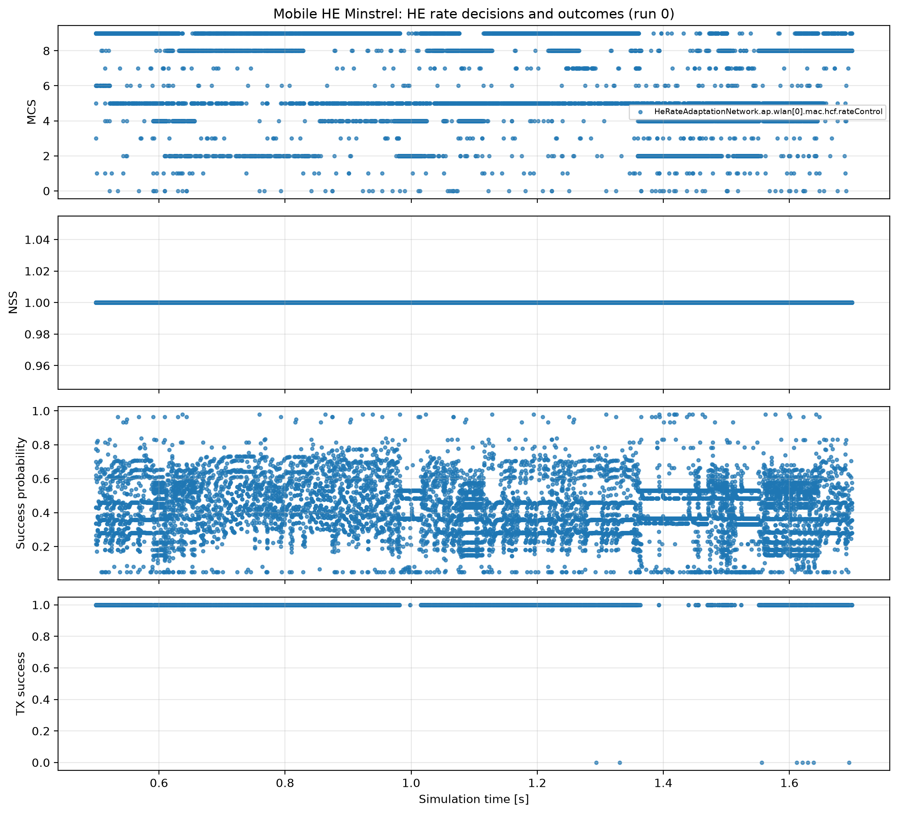
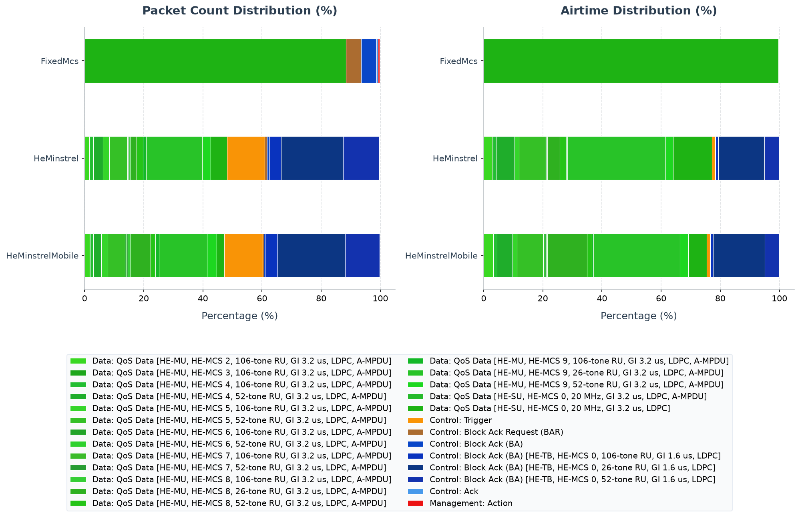

# HE rate-adaptation walkthrough

This walkthrough teaches how INET's HE Minstrel controller selects modulation
and coding scheme (MCS) and spatial streams per peer. Retained five-run
telemetry directly demonstrates changing selections and outcomes for a mobile
edge STA; it does not retain a matched five-run fixed-rate control.

## Learning objectives and feature primer

After completing this walkthrough, the reader can:

- distinguish controller choice, predicted probability, transmission outcome,
  MAC retry, and application delivery;
- align HE rate-control vectors by module and timestamp;
- verify known MCS values in radiotap without substituting INI defaults; and
- reproduce the mobile treatment and diagnose a frozen or invalid selector.

Rate adaptation chooses a PHY rate from recent success history. A higher MCS
can carry more bits per symbol but needs a better channel; the number of
spatial streams (NSS) is another dimension. Minstrel explores alternatives and
updates a success estimate. The validation outcome is a `PASS` that the
retained mobile run selected MCS 0--9 with valid outcome telemetry, and
`INCONCLUSIVE` for any comparative performance advantage.

## Scenario description

[HeRateAdaptationNetwork.ned](HeRateAdaptationNetwork.ned) uses one wired UDP
server, one stationary AP, and four STAs. [omnetpp.ini](omnetpp.ini) sends
saturated downlink traffic from 0.3--1.7 s on a 20 MHz 5 GHz channel. Hosts
0--2 are stationary; in `HeMinstrelMobile`, host 3 starts 230 m left of the AP
and moves right at 40 m/s. The AP's backlog-aware downlink scheduler consults
the HE rate-control module.

```text
server --> AP == HE downlink ==> host[0..2] stationary
                              ==> host[3] moving at 40 m/s
```

## Standards and INET model boundary

IEEE Std 802.11-2024 Clause 26.15.3 covers HE MCS, NSS, bandwidth, and DCM
selection (`80211ax-2024:chunk:09938`). The standard constrains valid PHY
operation; it does not mandate INET's Minstrel algorithm. `HeMinstrelRateControl`
and its probability are model choices. Controller vectors are authoritative
for internal choice; known radiotap HE bits are authoritative for captured
MCS; application vectors are outcomes. None alone proves that Minstrel
outperforms a fixed rate.

## Evidence status

| Claim or check | Status | Authoritative evidence | Runs/seeds | Scope or gap |
|---|---|---|---|---|
| controller selects multiple HE MCS values | `PASS` | `heRateSelectedMcs:vector` range 0--9 | mobile 0--4 | direct controller telemetry |
| selected NSS remains valid | `PASS` | `heRateSelectedNss:vector` all 1 | mobile 0--4 | single-stream retained scope |
| selected-attempt success is high | `PASS` | `heRateTxSuccess:vector` | mobile 0--4 | 0.998445 ± 0.001980 |
| Minstrel improves delivery | `INCONCLUSIVE` | only mobile five-run campaign | — | no matched five-run control |

## Configuration matrix

| Configuration | Role | Feature gate/delta | Workload/channel | Runs/seeds | Expected invariant |
|---|---|---|---|---|---|
| `FixedMcs` | control | no rate-control typename; configured 7.3125 Mbps | matched static topology | packet run 0 | captured data stays at fixed MCS |
| `HeMinstrel` | treatment | `HeMinstrelRateControl`, MCS 0--11, lookaround 0.1 | static topology | packet run 0 | controller emits choices |
| `HeMinstrelMobile` | stress treatment | extends Minstrel; host 3 moves 40 m/s | matched downlink load | packet run 0; scalar 0--4 | MCS changes with controller state |
| `HighCollisionRate` | unexecuted stress | adds uplink contention | bidirectional load | `NOT RUN` | failures/retries drive updates |

The packet session offers run-0 controls, while the five-run result campaign
contains only `HeMinstrelMobile`; these sessions cannot support a five-run
algorithm comparison. Seeds must be read from result attributes.

## Expected invariants and diagnostic map

| Invariant | Evidence and observation point | Failure symptom | Likely subsystem | Next diagnostic |
|---|---|---|---|---|
| selected MCS stays in configured 0--11 | AP controller vector | out-of-range or empty value | HE Minstrel candidate table | query module path and rate-control logs |
| probability and outcome align to attempts | same-module timestamped vectors | missing/misaligned samples | controller instrumentation | export narrow interval as CSV-R |
| captured MCS is known | AP PCAP known bit + value | value present without known bit | recorder / typed HE decoder | inspect `radiotap.he.data_1.data_mcs_known` |
| retry outcome is consistent | controller plus MAC retry/drop vectors | contradictory counts/timestamps | rate control / HCF retry | correlate one attempt in co-recorded run |

## Reproduction

Run from the repository root:

```sh
bin/inet -u Cmdenv -f examples/ieee80211ax/he_rate_adaptation/omnetpp.ini \
  -c HeMinstrelMobile -r 0 \
  --result-dir=examples/ieee80211ax/he_rate_adaptation/results/manual/HeMinstrelMobile
```

The direct minimal command was not executed and remains `NOT RUN`. The
suite-owned packet command below was executed with exit status 0 and created
session `20260725T230705Z`:

```sh
python3 examples/ieee80211/analysis/analyze_pcap.py \
  --suite examples/ieee80211/analysis/suites/ax.json \
  --generate --subdir he_rate_adaptation --run 0 --allow-failed-evidence
```

## Scalar and vector analysis

Inputs:
`results/scalar-vector/20260725T120411Z/HeMinstrelMobile/*.{sca,vec}`.
Figure provenance:
[rate-adaptation-timeline.png.json](../analysis/figures/rate/rate-adaptation-timeline.png.json).

```sh
opp_scavetool query -l \
  -f 'name =~ "heRateSelectedMcs:vector" OR name =~ "heRateSelectedNss:vector" OR name =~ "heRateSuccessProbability:vector" OR name =~ "heRateTxSuccess:vector" OR name =~ "heRateRetryCount:vector" OR name =~ "packetSentToPeerWithRetry:vector(packetBytes)" OR name =~ "packetDropRetryLimitReached:vector(packetBytes)" OR name =~ "packetReceived:vector(packetBytes)"' \
  examples/ieee80211ax/he_rate_adaptation/results/scalar-vector/20260725T120411Z/HeMinstrelMobile/*.sca \
  examples/ieee80211ax/he_rate_adaptation/results/scalar-vector/20260725T120411Z/HeMinstrelMobile/*.vec
```

| Metric | Source/units | Aggregation | Five-run result | Interpretation |
|---|---|---|---:|---|
| selected MCS | controller vector, index | observed range | 0--9 | mechanism choice |
| selected NSS | controller vector, streams | observed values | 1 only | mechanism choice |
| success probability | controller vector, ratio | observed range | 0.0158203--0.98 | internal estimate |
| attempt success | outcome vector, Boolean | fraction per run, then mean ± 95% t-CI | 0.998445 ± 0.001980 | direct attempt outcome |
| retry count | controller vector, count | observed values | 0 only | not a MAC retry substitute |
| aggregate goodput | app received bytes | per run, then mean ± 95% t-CI | 13.338 ± 1.053 Mbps | end-to-end outcome |

Vector samples are not independent repetitions. Retry diagnosis must include
the AP HCF `packetSentToPeerWithRetry` and retry-limit drop vectors at matched
timestamps; control-frame counts are not a substitute.

<!-- BEGIN GENERATED: ieee80211-scalar-vector-rate -->
### Generated scalar/vector plot and table



Figure provenance: [`../analysis/figures/rate/rate-adaptation-timeline.png.json`](../analysis/figures/rate/rate-adaptation-timeline.png.json). Run-level metric source: [`../analysis/metrics.json`](../analysis/metrics.json).

| Configuration or comparison | Metric | Source result filters / modules / units | Window / per-run aggregation / exclusions | Independent runs (n) | Mean or direct value | 95% CI half-width |
|---|---|---|---|---:|---:|---:|
| Mobile HE Minstrel | goodput mbps | vector / **.rateControl / heRateSelectedMcs:vector<br>vector / **.rateControl / heRateSelectedNss:vector<br>vector / **.rateControl / heRateSuccessProbability:vector<br>vector / **.rateControl / heRateTxSuccess:vector | [0.5, 1.7) s; timeline=representative run 0; no cross-peer inference | 5 | 13.338 | 1.05252 |
| Mobile HE Minstrel | selected mcs max | vector / **.rateControl / heRateSelectedMcs:vector<br>vector / **.rateControl / heRateSelectedNss:vector<br>vector / **.rateControl / heRateSuccessProbability:vector<br>vector / **.rateControl / heRateTxSuccess:vector | [0.5, 1.7) s; timeline=representative run 0; no cross-peer inference | — | 9 | — |
| Mobile HE Minstrel | selected mcs min | vector / **.rateControl / heRateSelectedMcs:vector<br>vector / **.rateControl / heRateSelectedNss:vector<br>vector / **.rateControl / heRateSuccessProbability:vector<br>vector / **.rateControl / heRateTxSuccess:vector | [0.5, 1.7) s; timeline=representative run 0; no cross-peer inference | — | 0 | — |
| Mobile HE Minstrel | tx success fraction | vector / **.rateControl / heRateSelectedMcs:vector<br>vector / **.rateControl / heRateSelectedNss:vector<br>vector / **.rateControl / heRateSuccessProbability:vector<br>vector / **.rateControl / heRateTxSuccess:vector | [0.5, 1.7) s; timeline=representative run 0; no cross-peer inference | 5 | 0.998445 | 0.00198003 |

The table is a presentation view of the session-bound run-level summary. The source and aggregation columns reproduce the bundle-level figure provenance; the authored analysis identifies which source supports each metric and supplies the interpretation.
<!-- END GENERATED: ieee80211-scalar-vector-rate -->

## PCAP statistics

Capture point: `HeRateAdaptationNetwork.ap.wlan[0]`

Capture:
`results/packet-statistics/20260725T230705Z/HeMinstrelMobile/HeMinstrelMobile-#0HeRateAdaptationNetwork.ap.wlan[0].pcap`

Scope: AP packet-signal observations in legacy PCAP with simulation
timestamps; TShark 4.6.4; FCS/checksum settings not retained.

```sh
tshark -n -r \
  'examples/ieee80211ax/he_rate_adaptation/results/packet-statistics/20260725T230705Z/HeMinstrelMobile/HeMinstrelMobile-#0HeRateAdaptationNetwork.ap.wlan[0].pcap' \
  -Y 'wlan.fc.type_subtype == 0x0028' \
  -T fields -E header=y -E separator='|' \
  -e frame.number -e frame.time_epoch -e wlan.ta -e wlan.ra \
  -e radiotap.he.data_1.data_mcs_known \
  -e radiotap.he.data_3.data_mcs -e wlan.fc.retry
```

The preserved generated block is exhaustive population evidence; its
controller check remains correctly `INCONCLUSIVE`.

<!-- REWRITE-PREFIX-END -->

<!-- BEGIN GENERATED: ieee80211ax-pcap-statistics -->
### Generated PCAP plots and tables


Figure provenance: [`packet_statistics.png.json`](packet_statistics.png.json).

This section provides a statistical overview of the 802.11 frames transmitted over the wireless medium during the simulation. The packet counts were gathered from AP wireless-interface observation points. With multiple AP captures, one medium transmission may be observed at more than one AP; counts and airtime therefore represent recorded transmission observations, not de-duplicated application packets.

Capture session `20260725T230705Z` was generated from fresh PCAPng input with `TShark (Wireshark) 4.6.4.`. The selected manifest is `examples/ieee80211/analysis/generated/ax/pcapmanifests/20260725T230705Z.json` (SHA-256 `0935f213de8b2cfd6dbfda4fabd379f4a497dd5d75ef382eb348f091d38f4c7e`). HE PPDU format, MCS, coding, bandwidth/RU, GI, and NSTS are decoded directly from standards-compliant radiotap HE fields; values not marked known by the recorder are omitted.

Two estimated airtime occupancy percentages are provided. HE-SU and HE-ER-SU use the modeled 36/44 µs preambles; a dissector-expanded A-MPDU is charged one shared preamble. HE MU/TB user-dependent signaling not exposed by radiotap remains approximate.
- **Air Time %**: This frame type's share of the sum of all estimated frame airtimes.
- **Air Time (Sim Time) %**: The sum of this frame type's estimated airtimes divided by the simulation time limit. Concurrent transmissions from multiple capture points are counted separately, so this value can exceed 100%; it is not the union of busy channel time.

#### Compact cross-configuration summary

| Configuration | Observation point / counting unit | Selection/filter | Observations | Dominant decoded frame/PHY evidence | Estimated airtime / sim time | Limits |
|---|---|---|---:|---|---:|---|
| `FixedMcs` | AP interface(s); capture observations<br>`examples/ieee80211ax/he_rate_adaptation/results/packet-statistics/20260725T230705Z/FixedMcs/FixedMcs-#0HeRateAdaptationNetwork.ap.wlan[0].pcap` | `none (all decoded frames)` | 1624 | Data: QoS Data [HE-SU, HE-MCS 0, 20 MHz, GI 3.2 us, LDPC] (1435), Control: Block Ack Request (BAR) (84), Control: Block Ack (BA) (84) | 78.70% | Not delivery or de-duplicated transmissions; unknown PHY fields stay unknown |
| `HeMinstrel` | AP interface(s); capture observations<br>`examples/ieee80211ax/he_rate_adaptation/results/packet-statistics/20260725T230705Z/HeMinstrel/HeMinstrel-#0HeRateAdaptationNetwork.ap.wlan[0].pcap` | `none (all decoded frames)` | 6364 | Control: Block Ack (BA) [HE-TB, HE-MCS 0, 26-tone RU, GI 1.6 us, LDPC] (1339), Data: QoS Data [HE-MU, HE-MCS 9, 26-tone RU, GI 3.2 us, LDPC, A-MPDU] (1207), Control: Trigger (811) | 146.83% | Not delivery or de-duplicated transmissions; unknown PHY fields stay unknown |
| `HeMinstrelMobile` | AP interface(s); capture observations<br>`examples/ieee80211ax/he_rate_adaptation/results/packet-statistics/20260725T230705Z/HeMinstrelMobile/HeMinstrelMobile-#0HeRateAdaptationNetwork.ap.wlan[0].pcap` | `none (all decoded frames)` | 7018 | Control: Block Ack (BA) [HE-TB, HE-MCS 0, 26-tone RU, GI 1.6 us, LDPC] (1610), Data: QoS Data [HE-MU, HE-MCS 9, 26-tone RU, GI 3.2 us, LDPC, A-MPDU] (1141), Control: Trigger (916) | 157.73% | Not delivery or de-duplicated transmissions; unknown PHY fields stay unknown |

### Evidence checks

| Status | Requirement | Observed evidence |
|---|---|---|
| **PASS** | FixedMcs produced protocol-visible wireless observations | 1624 AP/global transmission observations |
| **PASS** | HeMinstrel produced protocol-visible wireless observations | 6364 AP/global transmission observations |
| **PASS** | HeMinstrelMobile produced protocol-visible wireless observations | 7018 AP/global transmission observations |
| **INCONCLUSIVE** | Selected MCS/NSS, EWMA outcome and retries | The packet-type table is exchange evidence only; use the recorded feature vectors/results |

### Configuration: `FixedMcs`
Total over-the-air frame/MPDU transmission observations (Global BSS/AP): **1624**

| Color | Frame Type & Subtype | Count | Percentage | Mean Size | Std Dev | Mean Duration | Std Dev Duration | Freq | Mean RX Sig | Mean TX Pwr | Air Time % | Air Time (Sim Time) % |
|:---:|---|---:|---:|---:|---:|---:|---:|---:|---:|---:|---:|---:|
| <svg width="16" height="16"><rect width="16" height="16" rx="3" fill="#1eb314" /></svg> | Data: QoS Data [HE-SU, HE-MCS 0, 20 MHz, GI 3.2 us, LDPC] | 1435 | 88.36% | 966.0 B | 0.0 B | 1092.8 us | 0.0 us | 5010 MHz | - | 13.0 dBm | 99.63% | 78.41% |
| <hr> | <hr> | <hr> | <hr> | <hr> | <hr> | <hr> | <hr> | <hr> | <hr> | <hr> | <hr> | <hr> |
| <svg width="16" height="16"><rect width="16" height="16" rx="3" fill="#ab6c30" /></svg> | Control: Block Ack Request (BAR) | 84 | 5.17% | 24.0 B | 0.0 B | 28.0 us | 0.0 us | 5010 MHz | - | 13.0 dBm | 0.15% | 0.12% |
| <svg width="16" height="16"><rect width="16" height="16" rx="3" fill="#0946c8" /></svg> | Control: Block Ack (BA) | 84 | 5.17% | 32.0 B | 0.0 B | 30.7 us | 0.0 us | 5010 MHz | -76.2 dBm | - | 0.16% | 0.13% |
| <svg width="16" height="16"><rect width="16" height="16" rx="3" fill="#4799eb" /></svg> | Control: Ack | 4 | 0.25% | 14.0 B | 0.0 B | 24.7 us | 0.0 us | 5010 MHz | -76.2 dBm | - | 0.01% | 0.00% |
| <svg width="16" height="16"><rect width="16" height="16" rx="3" fill="#4799eb" /></svg> | Control: Ack | 8 | 0.49% | 14.0 B | 0.0 B | 24.7 us | 0.0 us | 5010 MHz | -76.2 dBm | 13.0 dBm | 0.01% | 0.01% |
| <hr> | <hr> | <hr> | <hr> | <hr> | <hr> | <hr> | <hr> | <hr> | <hr> | <hr> | <hr> | <hr> |
| <svg width="16" height="16"><rect width="16" height="16" rx="3" fill="#ec1313" /></svg> | Management: Action | 9 | 0.55% | 37.0 B | 0.0 B | 69.3 us | 0.0 us | 5010 MHz | -75.0 dBm | 13.0 dBm | 0.04% | 0.03% |

#### Representative frame-exchange timeline

| Frame | Simulation time (s) | Transmitter → receiver | Type/PHY | Decisive fields | Role in exchange |
|---:|---:|---|---|---|---|
| `FixedMcs-#0HeRateAdaptationNetwork.ap.wlan[0].pcap:1` | 0.201124000 | 10:00:00:00:00:00 → 0a:aa:00:00:00:01 | Data: QoS Data / HE-SU, HE-MCS 0, 20 MHz, NSS 1, GI 3.2 us, LDPC | direction=from DS, retry=0, seq=0, frag=0, more-frag=0, TID=6 | Carries protocol-visible MAC payload in the representative exchange. |
| `FixedMcs-#0HeRateAdaptationNetwork.ap.wlan[0].pcap:2` | 0.201184000 | ? → 10:00:00:00:00:00 | Control: Ack / Legacy/HT/VHT | direction=direct/IBSS, retry=0, seq=-, frag=-, more-frag=0, TID=- | Acknowledges the preceding unicast frame. |
| `FixedMcs-#0HeRateAdaptationNetwork.ap.wlan[0].pcap:3` | 0.201236000 | 10:00:00:00:00:00 → 0a:aa:00:00:00:01 | Management: Action / Legacy/HT/VHT | direction=direct/IBSS, retry=0, seq=0, frag=0, more-frag=0, TID=- | Provides frame-order context for the representative exchange. |
| `FixedMcs-#0HeRateAdaptationNetwork.ap.wlan[0].pcap:4` | 0.201281000 | ? → 10:00:00:00:00:00 | Control: Ack / Legacy/HT/VHT | direction=direct/IBSS, retry=0, seq=-, frag=-, more-frag=0, TID=- | Acknowledges the preceding unicast frame. |
| `FixedMcs-#0HeRateAdaptationNetwork.ap.wlan[0].pcap:5` | 0.202439000 | 10:00:00:00:00:00 → 0a:aa:00:00:00:02 | Data: QoS Data / HE-SU, HE-MCS 0, 20 MHz, NSS 1, GI 3.2 us, LDPC | direction=from DS, retry=0, seq=0, frag=0, more-frag=0, TID=6 | Carries protocol-visible MAC payload in the representative exchange. |
| `FixedMcs-#0HeRateAdaptationNetwork.ap.wlan[0].pcap:6` | 0.202499000 | ? → 10:00:00:00:00:00 | Control: Ack / Legacy/HT/VHT | direction=direct/IBSS, retry=0, seq=-, frag=-, more-frag=0, TID=- | Acknowledges the preceding unicast frame. |
| `FixedMcs-#0HeRateAdaptationNetwork.ap.wlan[0].pcap:7` | 0.202551000 | 10:00:00:00:00:00 → 0a:aa:00:00:00:02 | Management: Action / Legacy/HT/VHT | direction=direct/IBSS, retry=0, seq=0, frag=0, more-frag=0, TID=- | Provides frame-order context for the representative exchange. |
| `FixedMcs-#0HeRateAdaptationNetwork.ap.wlan[0].pcap:8` | 0.202596000 | ? → 10:00:00:00:00:00 | Control: Ack / Legacy/HT/VHT | direction=direct/IBSS, retry=0, seq=-, frag=-, more-frag=0, TID=- | Acknowledges the preceding unicast frame. |
| `FixedMcs-#0HeRateAdaptationNetwork.ap.wlan[0].pcap:9` | 0.203754000 | 10:00:00:00:00:00 → 0a:aa:00:00:00:03 | Data: QoS Data / HE-SU, HE-MCS 0, 20 MHz, NSS 1, GI 3.2 us, LDPC | direction=from DS, retry=0, seq=0, frag=0, more-frag=0, TID=6 | Carries protocol-visible MAC payload in the representative exchange. |
| `FixedMcs-#0HeRateAdaptationNetwork.ap.wlan[0].pcap:10` | 0.203815000 | ? → 10:00:00:00:00:00 | Control: Ack / Legacy/HT/VHT | direction=direct/IBSS, retry=0, seq=-, frag=-, more-frag=0, TID=- | Acknowledges the preceding unicast frame. |
| `FixedMcs-#0HeRateAdaptationNetwork.ap.wlan[0].pcap:11` | 0.203867000 | 10:00:00:00:00:00 → 0a:aa:00:00:00:03 | Management: Action / Legacy/HT/VHT | direction=direct/IBSS, retry=0, seq=0, frag=0, more-frag=0, TID=- | Provides frame-order context for the representative exchange. |
| `FixedMcs-#0HeRateAdaptationNetwork.ap.wlan[0].pcap:12` | 0.203913000 | ? → 10:00:00:00:00:00 | Control: Ack / Legacy/HT/VHT | direction=direct/IBSS, retry=0, seq=-, frag=-, more-frag=0, TID=- | Acknowledges the preceding unicast frame. |
| `FixedMcs-#0HeRateAdaptationNetwork.ap.wlan[0].pcap:13` | 0.205080000 | 10:00:00:00:00:00 → 0a:aa:00:00:00:04 | Data: QoS Data / HE-SU, HE-MCS 0, 20 MHz, NSS 1, GI 3.2 us, LDPC | direction=from DS, retry=0, seq=0, frag=0, more-frag=0, TID=6 | Carries protocol-visible MAC payload in the representative exchange. |
| `FixedMcs-#0HeRateAdaptationNetwork.ap.wlan[0].pcap:14` | 0.205168000 | 0a:aa:00:00:00:01 → 10:00:00:00:00:00 | Management: Action / Legacy/HT/VHT | direction=direct/IBSS, retry=1, seq=0, frag=0, more-frag=0, TID=- | Provides frame-order context for the representative exchange. |
| `FixedMcs-#0HeRateAdaptationNetwork.ap.wlan[0].pcap:15` | 0.205283000 | 0a:aa:00:00:00:02 → 10:00:00:00:00:00 | Management: Action / Legacy/HT/VHT | direction=direct/IBSS, retry=1, seq=0, frag=0, more-frag=0, TID=- | Provides frame-order context for the representative exchange. |
| `FixedMcs-#0HeRateAdaptationNetwork.ap.wlan[0].pcap:16` | 0.205327000 | ? → 0a:aa:00:00:00:02 | Control: Ack / Legacy/HT/VHT | direction=direct/IBSS, retry=0, seq=-, frag=-, more-frag=0, TID=- | Acknowledges the preceding unicast frame. |

Frame numbers are local to the named capture, not OMNeT++ event numbers. For readability, the table collapses observations with the same timestamp and MAC identity across capture interfaces; aggregate PCAP statistics retain the original observation counts.

### Configuration: `HeMinstrel`
Total over-the-air frame/MPDU transmission observations (Global BSS/AP): **6364**

| Color | Frame Type & Subtype | Count | Percentage | Mean Size | Std Dev | Mean Duration | Std Dev Duration | Freq | Mean RX Sig | Mean TX Pwr | Air Time % | Air Time (Sim Time) % |
|:---:|---|---:|---:|---:|---:|---:|---:|---:|---:|---:|---:|---:|
| <svg width="16" height="16"><rect width="16" height="16" rx="3" fill="#3ad822" /></svg> | Data: QoS Data [HE-MU, HE-MCS 2, 106-tone RU, GI 3.2 us, LDPC, A-MPDU] | 101 | 1.59% | 966.0 B | 0.0 B | 844.2 us | 0.0 us | 5010 MHz | - | 13.0 dBm | 2.90% | 4.26% |
| <svg width="16" height="16"><rect width="16" height="16" rx="3" fill="#1ea61c" /></svg> | Data: QoS Data [HE-MU, HE-MCS 3, 106-tone RU, GI 3.2 us, LDPC, A-MPDU] | 9 | 0.14% | 966.0 B | 0.0 B | 642.1 us | 0.0 us | 5010 MHz | - | 13.0 dBm | 0.20% | 0.29% |
| <svg width="16" height="16"><rect width="16" height="16" rx="3" fill="#23be32" /></svg> | Data: QoS Data [HE-MU, HE-MCS 4, 106-tone RU, GI 3.2 us, LDPC, A-MPDU] | 80 | 1.26% | 966.0 B | 0.0 B | 422.1 us | 18.0 us | 5010 MHz | - | 13.0 dBm | 1.15% | 1.69% |
| <svg width="16" height="16"><rect width="16" height="16" rx="3" fill="#1fad2b" /></svg> | Data: QoS Data [HE-MU, HE-MCS 4, 52-tone RU, GI 3.2 us, LDPC, A-MPDU] | 202 | 3.17% | 966.0 B | 0.0 B | 894.7 us | 0.0 us | 5010 MHz | - | 13.0 dBm | 6.15% | 9.04% |
| <svg width="16" height="16"><rect width="16" height="16" rx="3" fill="#35d52a" /></svg> | Data: QoS Data [HE-MU, HE-MCS 5, 106-tone RU, GI 3.2 us, LDPC, A-MPDU] | 140 | 2.20% | 966.0 B | 0.0 B | 321.1 us | 18.0 us | 5010 MHz | - | 13.0 dBm | 1.53% | 2.25% |
| <svg width="16" height="16"><rect width="16" height="16" rx="3" fill="#35c026" /></svg> | Data: QoS Data [HE-MU, HE-MCS 5, 52-tone RU, GI 3.2 us, LDPC, A-MPDU] | 391 | 6.14% | 966.0 B | 0.0 B | 680.0 us | 0.0 us | 5010 MHz | - | 13.0 dBm | 9.05% | 13.29% |
| <svg width="16" height="16"><rect width="16" height="16" rx="3" fill="#23a429" /></svg> | Data: QoS Data [HE-MU, HE-MCS 6, 106-tone RU, GI 3.2 us, LDPC, A-MPDU] | 3 | 0.05% | 966.0 B | 0.0 B | 281.4 us | 17.0 us | 5010 MHz | - | 13.0 dBm | 0.03% | 0.04% |
| <svg width="16" height="16"><rect width="16" height="16" rx="3" fill="#2ed12e" /></svg> | Data: QoS Data [HE-MU, HE-MCS 6, 52-tone RU, GI 3.2 us, LDPC, A-MPDU] | 5 | 0.08% | 966.0 B | 0.0 B | 608.4 us | 0.0 us | 5010 MHz | - | 13.0 dBm | 0.10% | 0.15% |
| <svg width="16" height="16"><rect width="16" height="16" rx="3" fill="#3bbb2a" /></svg> | Data: QoS Data [HE-MU, HE-MCS 7, 106-tone RU, GI 3.2 us, LDPC, A-MPDU] | 6 | 0.09% | 966.0 B | 0.0 B | 254.4 us | 17.0 us | 5010 MHz | - | 13.0 dBm | 0.05% | 0.08% |
| <svg width="16" height="16"><rect width="16" height="16" rx="3" fill="#269c32" /></svg> | Data: QoS Data [HE-MU, HE-MCS 7, 52-tone RU, GI 3.2 us, LDPC, A-MPDU] | 17 | 0.27% | 966.0 B | 0.0 B | 551.2 us | 0.0 us | 5010 MHz | - | 13.0 dBm | 0.32% | 0.47% |
| <svg width="16" height="16"><rect width="16" height="16" rx="3" fill="#36ce36" /></svg> | Data: QoS Data [HE-MU, HE-MCS 8, 106-tone RU, GI 3.2 us, LDPC, A-MPDU] | 32 | 0.50% | 966.0 B | 0.0 B | 211.0 us | 15.6 us | 5010 MHz | - | 13.0 dBm | 0.23% | 0.34% |
| <svg width="16" height="16"><rect width="16" height="16" rx="3" fill="#2fb120" /></svg> | Data: QoS Data [HE-MU, HE-MCS 8, 26-tone RU, GI 3.2 us, LDPC, A-MPDU] | 132 | 2.07% | 966.0 B | 0.0 B | 894.7 us | 0.0 us | 5010 MHz | - | 13.0 dBm | 4.02% | 5.90% |
| <svg width="16" height="16"><rect width="16" height="16" rx="3" fill="#25c417" /></svg> | Data: QoS Data [HE-MU, HE-MCS 8, 52-tone RU, GI 3.2 us, LDPC, A-MPDU] | 140 | 2.20% | 966.0 B | 0.0 B | 447.3 us | 18.0 us | 5010 MHz | - | 13.0 dBm | 2.13% | 3.13% |
| <svg width="16" height="16"><rect width="16" height="16" rx="3" fill="#14b827" /></svg> | Data: QoS Data [HE-MU, HE-MCS 9, 106-tone RU, GI 3.2 us, LDPC, A-MPDU] | 64 | 1.01% | 966.0 B | 0.0 B | 190.8 us | 15.6 us | 5010 MHz | - | 13.0 dBm | 0.42% | 0.61% |
| <svg width="16" height="16"><rect width="16" height="16" rx="3" fill="#28c328" /></svg> | Data: QoS Data [HE-MU, HE-MCS 9, 26-tone RU, GI 3.2 us, LDPC, A-MPDU] | 1207 | 18.97% | 966.0 B | 0.0 B | 808.8 us | 0.0 us | 5010 MHz | - | 13.0 dBm | 33.24% | 48.81% |
| <svg width="16" height="16"><rect width="16" height="16" rx="3" fill="#1dd720" /></svg> | Data: QoS Data [HE-MU, HE-MCS 9, 52-tone RU, GI 3.2 us, LDPC, A-MPDU] | 186 | 2.92% | 966.0 B | 0.0 B | 404.4 us | 18.0 us | 5010 MHz | - | 13.0 dBm | 2.56% | 3.76% |
| <svg width="16" height="16"><rect width="16" height="16" rx="3" fill="#1eb314" /></svg> | Data: QoS Data [HE-SU, HE-MCS 0, 20 MHz, GI 3.2 us, LDPC] | 353 | 5.55% | 966.0 B | 0.0 B | 1092.8 us | 0.0 us | 5010 MHz | - | 13.0 dBm | 13.14% | 19.29% |
| <hr> | <hr> | <hr> | <hr> | <hr> | <hr> | <hr> | <hr> | <hr> | <hr> | <hr> | <hr> | <hr> |
| <svg width="16" height="16"><rect width="16" height="16" rx="3" fill="#f99406" /></svg> | Control: Trigger | 811 | 12.74% | 54.2 B | 2.6 B | 38.1 us | 0.9 us | 5010 MHz | - | 13.0 dBm | 1.05% | 1.54% |
| <svg width="16" height="16"><rect width="16" height="16" rx="3" fill="#ab6c30" /></svg> | Control: Block Ack Request (BAR) | 50 | 0.79% | 24.0 B | 0.0 B | 28.0 us | 0.0 us | 5010 MHz | - | 13.0 dBm | 0.05% | 0.07% |
| <svg width="16" height="16"><rect width="16" height="16" rx="3" fill="#0946c8" /></svg> | Control: Block Ack (BA) | 50 | 0.79% | 32.0 B | 0.0 B | 30.7 us | 0.0 us | 5010 MHz | -75.9 dBm | - | 0.05% | 0.08% |
| <svg width="16" height="16"><rect width="16" height="16" rx="3" fill="#0933be" /></svg> | Control: Block Ack (BA) [HE-TB, HE-MCS 0, 106-tone RU, GI 1.6 us, LDPC] | 247 | 3.88% | 32.0 B | 0.0 B | 108.3 us | 0.0 us | 5005 MHz, 5015 MHz | -77.5 dBm | - | 0.91% | 1.34% |
| <svg width="16" height="16"><rect width="16" height="16" rx="3" fill="#0c3683" /></svg> | Control: Block Ack (BA) [HE-TB, HE-MCS 0, 26-tone RU, GI 1.6 us, LDPC] | 1339 | 21.04% | 32.0 B | 0.0 B | 343.2 us | 0.0 us | 5002 MHz, 5004 MHz, 5006 MHz, 5008 MHz, 5010 MHz, 5012 MHz, 5014 MHz | -77.2 dBm | - | 15.65% | 22.98% |
| <svg width="16" height="16"><rect width="16" height="16" rx="3" fill="#1332ae" /></svg> | Control: Block Ack (BA) [HE-TB, HE-MCS 0, 52-tone RU, GI 1.6 us, LDPC] | 778 | 12.23% | 32.0 B | 0.0 B | 189.6 us | 0.0 us | 5003 MHz, 5007 MHz, 5013 MHz, 5017 MHz | -74.0 dBm | - | 5.02% | 7.38% |
| <svg width="16" height="16"><rect width="16" height="16" rx="3" fill="#4799eb" /></svg> | Control: Ack | 4 | 0.06% | 14.0 B | 0.0 B | 24.7 us | 0.0 us | 5010 MHz | -76.2 dBm | - | 0.00% | 0.00% |
| <svg width="16" height="16"><rect width="16" height="16" rx="3" fill="#4799eb" /></svg> | Control: Ack | 8 | 0.13% | 14.0 B | 0.0 B | 24.7 us | 0.0 us | 5010 MHz | -76.2 dBm | 13.0 dBm | 0.01% | 0.01% |
| <hr> | <hr> | <hr> | <hr> | <hr> | <hr> | <hr> | <hr> | <hr> | <hr> | <hr> | <hr> | <hr> |
| <svg width="16" height="16"><rect width="16" height="16" rx="3" fill="#ec1313" /></svg> | Management: Action | 9 | 0.14% | 37.0 B | 0.0 B | 69.3 us | 0.0 us | 5010 MHz | -75.0 dBm | 13.0 dBm | 0.02% | 0.03% |

#### Representative frame-exchange timeline

| Frame | Simulation time (s) | Transmitter → receiver | Type/PHY | Decisive fields | Role in exchange |
|---:|---:|---|---|---|---|
| `HeMinstrel-#0HeRateAdaptationNetwork.ap.wlan[0].pcap:1` | 0.201124000 | 10:00:00:00:00:00 → 0a:aa:00:00:00:01 | Data: QoS Data / HE-SU, HE-MCS 0, 20 MHz, NSS 1, GI 3.2 us, LDPC | direction=from DS, retry=0, seq=0, frag=0, more-frag=0, TID=6 | Carries protocol-visible MAC payload in the representative exchange. |
| `HeMinstrel-#0HeRateAdaptationNetwork.ap.wlan[0].pcap:2` | 0.201184000 | ? → 10:00:00:00:00:00 | Control: Ack / Legacy/HT/VHT | direction=direct/IBSS, retry=0, seq=-, frag=-, more-frag=0, TID=- | Acknowledges the preceding unicast frame. |
| `HeMinstrel-#0HeRateAdaptationNetwork.ap.wlan[0].pcap:3` | 0.201236000 | 10:00:00:00:00:00 → 0a:aa:00:00:00:01 | Management: Action / Legacy/HT/VHT | direction=direct/IBSS, retry=0, seq=0, frag=0, more-frag=0, TID=- | Provides frame-order context for the representative exchange. |
| `HeMinstrel-#0HeRateAdaptationNetwork.ap.wlan[0].pcap:4` | 0.201281000 | ? → 10:00:00:00:00:00 | Control: Ack / Legacy/HT/VHT | direction=direct/IBSS, retry=0, seq=-, frag=-, more-frag=0, TID=- | Acknowledges the preceding unicast frame. |
| `HeMinstrel-#0HeRateAdaptationNetwork.ap.wlan[0].pcap:5` | 0.202439000 | 10:00:00:00:00:00 → 0a:aa:00:00:00:02 | Data: QoS Data / HE-SU, HE-MCS 0, 20 MHz, NSS 1, GI 3.2 us, LDPC | direction=from DS, retry=0, seq=0, frag=0, more-frag=0, TID=6 | Carries protocol-visible MAC payload in the representative exchange. |
| `HeMinstrel-#0HeRateAdaptationNetwork.ap.wlan[0].pcap:6` | 0.202499000 | ? → 10:00:00:00:00:00 | Control: Ack / Legacy/HT/VHT | direction=direct/IBSS, retry=0, seq=-, frag=-, more-frag=0, TID=- | Acknowledges the preceding unicast frame. |
| `HeMinstrel-#0HeRateAdaptationNetwork.ap.wlan[0].pcap:7` | 0.202551000 | 10:00:00:00:00:00 → 0a:aa:00:00:00:02 | Management: Action / Legacy/HT/VHT | direction=direct/IBSS, retry=0, seq=0, frag=0, more-frag=0, TID=- | Provides frame-order context for the representative exchange. |
| `HeMinstrel-#0HeRateAdaptationNetwork.ap.wlan[0].pcap:8` | 0.202596000 | ? → 10:00:00:00:00:00 | Control: Ack / Legacy/HT/VHT | direction=direct/IBSS, retry=0, seq=-, frag=-, more-frag=0, TID=- | Acknowledges the preceding unicast frame. |
| `HeMinstrel-#0HeRateAdaptationNetwork.ap.wlan[0].pcap:9` | 0.203754000 | 10:00:00:00:00:00 → 0a:aa:00:00:00:03 | Data: QoS Data / HE-SU, HE-MCS 0, 20 MHz, NSS 1, GI 3.2 us, LDPC | direction=from DS, retry=0, seq=0, frag=0, more-frag=0, TID=6 | Carries protocol-visible MAC payload in the representative exchange. |
| `HeMinstrel-#0HeRateAdaptationNetwork.ap.wlan[0].pcap:10` | 0.203815000 | ? → 10:00:00:00:00:00 | Control: Ack / Legacy/HT/VHT | direction=direct/IBSS, retry=0, seq=-, frag=-, more-frag=0, TID=- | Acknowledges the preceding unicast frame. |
| `HeMinstrel-#0HeRateAdaptationNetwork.ap.wlan[0].pcap:11` | 0.203867000 | 10:00:00:00:00:00 → 0a:aa:00:00:00:03 | Management: Action / Legacy/HT/VHT | direction=direct/IBSS, retry=0, seq=0, frag=0, more-frag=0, TID=- | Provides frame-order context for the representative exchange. |
| `HeMinstrel-#0HeRateAdaptationNetwork.ap.wlan[0].pcap:12` | 0.203913000 | ? → 10:00:00:00:00:00 | Control: Ack / Legacy/HT/VHT | direction=direct/IBSS, retry=0, seq=-, frag=-, more-frag=0, TID=- | Acknowledges the preceding unicast frame. |
| `HeMinstrel-#0HeRateAdaptationNetwork.ap.wlan[0].pcap:13` | 0.205080000 | 10:00:00:00:00:00 → 0a:aa:00:00:00:04 | Data: QoS Data / HE-SU, HE-MCS 0, 20 MHz, NSS 1, GI 3.2 us, LDPC | direction=from DS, retry=0, seq=0, frag=0, more-frag=0, TID=6 | Carries protocol-visible MAC payload in the representative exchange. |
| `HeMinstrel-#0HeRateAdaptationNetwork.ap.wlan[0].pcap:14` | 0.205168000 | 0a:aa:00:00:00:01 → 10:00:00:00:00:00 | Management: Action / Legacy/HT/VHT | direction=direct/IBSS, retry=1, seq=0, frag=0, more-frag=0, TID=- | Provides frame-order context for the representative exchange. |
| `HeMinstrel-#0HeRateAdaptationNetwork.ap.wlan[0].pcap:15` | 0.205283000 | 0a:aa:00:00:00:02 → 10:00:00:00:00:00 | Management: Action / Legacy/HT/VHT | direction=direct/IBSS, retry=1, seq=0, frag=0, more-frag=0, TID=- | Provides frame-order context for the representative exchange. |
| `HeMinstrel-#0HeRateAdaptationNetwork.ap.wlan[0].pcap:16` | 0.205327000 | ? → 0a:aa:00:00:00:02 | Control: Ack / Legacy/HT/VHT | direction=direct/IBSS, retry=0, seq=-, frag=-, more-frag=0, TID=- | Acknowledges the preceding unicast frame. |

Frame numbers are local to the named capture, not OMNeT++ event numbers. For readability, the table collapses observations with the same timestamp and MAC identity across capture interfaces; aggregate PCAP statistics retain the original observation counts.

### Configuration: `HeMinstrelMobile`
Total over-the-air frame/MPDU transmission observations (Global BSS/AP): **7018**

| Color | Frame Type & Subtype | Count | Percentage | Mean Size | Std Dev | Mean Duration | Std Dev Duration | Freq | Mean RX Sig | Mean TX Pwr | Air Time % | Air Time (Sim Time) % |
|:---:|---|---:|---:|---:|---:|---:|---:|---:|---:|---:|---:|---:|
| <svg width="16" height="16"><rect width="16" height="16" rx="3" fill="#3ad822" /></svg> | Data: QoS Data [HE-MU, HE-MCS 2, 106-tone RU, GI 3.2 us, LDPC, A-MPDU] | 120 | 1.71% | 966.0 B | 0.0 B | 844.2 us | 0.0 us | 5010 MHz | - | 13.0 dBm | 3.21% | 5.06% |
| <svg width="16" height="16"><rect width="16" height="16" rx="3" fill="#1ea61c" /></svg> | Data: QoS Data [HE-MU, HE-MCS 3, 106-tone RU, GI 3.2 us, LDPC, A-MPDU] | 9 | 0.13% | 966.0 B | 0.0 B | 642.1 us | 0.0 us | 5010 MHz | - | 13.0 dBm | 0.18% | 0.29% |
| <svg width="16" height="16"><rect width="16" height="16" rx="3" fill="#23be32" /></svg> | Data: QoS Data [HE-MU, HE-MCS 4, 106-tone RU, GI 3.2 us, LDPC, A-MPDU] | 80 | 1.14% | 966.0 B | 0.0 B | 422.1 us | 18.0 us | 5010 MHz | - | 13.0 dBm | 1.07% | 1.69% |
| <svg width="16" height="16"><rect width="16" height="16" rx="3" fill="#1fad2b" /></svg> | Data: QoS Data [HE-MU, HE-MCS 4, 52-tone RU, GI 3.2 us, LDPC, A-MPDU] | 186 | 2.65% | 966.0 B | 0.0 B | 894.7 us | 0.0 us | 5010 MHz | - | 13.0 dBm | 5.28% | 8.32% |
| <svg width="16" height="16"><rect width="16" height="16" rx="3" fill="#35d52a" /></svg> | Data: QoS Data [HE-MU, HE-MCS 5, 106-tone RU, GI 3.2 us, LDPC, A-MPDU] | 154 | 2.19% | 966.0 B | 0.0 B | 321.1 us | 18.0 us | 5010 MHz | - | 13.0 dBm | 1.57% | 2.47% |
| <svg width="16" height="16"><rect width="16" height="16" rx="3" fill="#35c026" /></svg> | Data: QoS Data [HE-MU, HE-MCS 5, 52-tone RU, GI 3.2 us, LDPC, A-MPDU] | 406 | 5.79% | 966.0 B | 0.0 B | 680.0 us | 0.0 us | 5010 MHz | - | 13.0 dBm | 8.75% | 13.80% |
| <svg width="16" height="16"><rect width="16" height="16" rx="3" fill="#23a429" /></svg> | Data: QoS Data [HE-MU, HE-MCS 6, 106-tone RU, GI 3.2 us, LDPC, A-MPDU] | 18 | 0.26% | 966.0 B | 0.0 B | 281.4 us | 17.0 us | 5010 MHz | - | 13.0 dBm | 0.16% | 0.25% |
| <svg width="16" height="16"><rect width="16" height="16" rx="3" fill="#2ed12e" /></svg> | Data: QoS Data [HE-MU, HE-MCS 6, 52-tone RU, GI 3.2 us, LDPC, A-MPDU] | 26 | 0.37% | 966.0 B | 0.0 B | 608.4 us | 0.0 us | 5010 MHz | - | 13.0 dBm | 0.50% | 0.79% |
| <svg width="16" height="16"><rect width="16" height="16" rx="3" fill="#3bbb2a" /></svg> | Data: QoS Data [HE-MU, HE-MCS 7, 106-tone RU, GI 3.2 us, LDPC, A-MPDU] | 9 | 0.13% | 966.0 B | 0.0 B | 254.4 us | 17.0 us | 5010 MHz | - | 13.0 dBm | 0.07% | 0.11% |
| <svg width="16" height="16"><rect width="16" height="16" rx="3" fill="#269c32" /></svg> | Data: QoS Data [HE-MU, HE-MCS 7, 52-tone RU, GI 3.2 us, LDPC, A-MPDU] | 21 | 0.30% | 966.0 B | 0.0 B | 551.2 us | 0.0 us | 5010 MHz | - | 13.0 dBm | 0.37% | 0.58% |
| <svg width="16" height="16"><rect width="16" height="16" rx="3" fill="#36ce36" /></svg> | Data: QoS Data [HE-MU, HE-MCS 8, 106-tone RU, GI 3.2 us, LDPC, A-MPDU] | 64 | 0.91% | 966.0 B | 0.0 B | 211.0 us | 15.6 us | 5010 MHz | - | 13.0 dBm | 0.43% | 0.68% |
| <svg width="16" height="16"><rect width="16" height="16" rx="3" fill="#2fb120" /></svg> | Data: QoS Data [HE-MU, HE-MCS 8, 26-tone RU, GI 3.2 us, LDPC, A-MPDU] | 469 | 6.68% | 966.0 B | 0.0 B | 894.7 us | 0.0 us | 5010 MHz | - | 13.0 dBm | 13.30% | 20.98% |
| <svg width="16" height="16"><rect width="16" height="16" rx="3" fill="#25c417" /></svg> | Data: QoS Data [HE-MU, HE-MCS 8, 52-tone RU, GI 3.2 us, LDPC, A-MPDU] | 114 | 1.62% | 966.0 B | 0.0 B | 447.3 us | 18.0 us | 5010 MHz | - | 13.0 dBm | 1.62% | 2.55% |
| <svg width="16" height="16"><rect width="16" height="16" rx="3" fill="#14b827" /></svg> | Data: QoS Data [HE-MU, HE-MCS 9, 106-tone RU, GI 3.2 us, LDPC, A-MPDU] | 89 | 1.27% | 966.0 B | 0.0 B | 190.7 us | 15.5 us | 5010 MHz | - | 13.0 dBm | 0.54% | 0.85% |
| <svg width="16" height="16"><rect width="16" height="16" rx="3" fill="#28c328" /></svg> | Data: QoS Data [HE-MU, HE-MCS 9, 26-tone RU, GI 3.2 us, LDPC, A-MPDU] | 1141 | 16.26% | 966.0 B | 0.0 B | 808.8 us | 0.0 us | 5010 MHz | - | 13.0 dBm | 29.25% | 46.14% |
| <svg width="16" height="16"><rect width="16" height="16" rx="3" fill="#1dd720" /></svg> | Data: QoS Data [HE-MU, HE-MCS 9, 52-tone RU, GI 3.2 us, LDPC, A-MPDU] | 228 | 3.25% | 966.0 B | 0.0 B | 404.4 us | 18.0 us | 5010 MHz | - | 13.0 dBm | 2.92% | 4.61% |
| <svg width="16" height="16"><rect width="16" height="16" rx="3" fill="#26ba2b" /></svg> | Data: QoS Data [HE-SU, HE-MCS 0, 20 MHz, GI 3.2 us, LDPC, A-MPDU] | 2 | 0.03% | 966.0 B | 0.0 B | 1074.8 us | 18.0 us | 5010 MHz | - | 13.0 dBm | 0.07% | 0.11% |
| <svg width="16" height="16"><rect width="16" height="16" rx="3" fill="#1eb314" /></svg> | Data: QoS Data [HE-SU, HE-MCS 0, 20 MHz, GI 3.2 us, LDPC] | 177 | 2.52% | 966.0 B | 0.0 B | 1092.8 us | 0.0 us | 5010 MHz | - | 13.0 dBm | 6.13% | 9.67% |
| <hr> | <hr> | <hr> | <hr> | <hr> | <hr> | <hr> | <hr> | <hr> | <hr> | <hr> | <hr> | <hr> |
| <svg width="16" height="16"><rect width="16" height="16" rx="3" fill="#f99406" /></svg> | Control: Trigger | 916 | 13.05% | 54.7 B | 3.2 B | 38.2 us | 1.1 us | 5010 MHz | - | 13.0 dBm | 1.11% | 1.75% |
| <svg width="16" height="16"><rect width="16" height="16" rx="3" fill="#ab6c30" /></svg> | Control: Block Ack Request (BAR) | 28 | 0.40% | 24.0 B | 0.0 B | 28.0 us | 0.0 us | 5010 MHz | - | 13.0 dBm | 0.02% | 0.04% |
| <svg width="16" height="16"><rect width="16" height="16" rx="3" fill="#0946c8" /></svg> | Control: Block Ack (BA) | 28 | 0.40% | 32.0 B | 0.0 B | 30.7 us | 0.0 us | 5010 MHz | -75.2 dBm | - | 0.03% | 0.04% |
| <svg width="16" height="16"><rect width="16" height="16" rx="3" fill="#0933be" /></svg> | Control: Block Ack (BA) [HE-TB, HE-MCS 0, 106-tone RU, GI 1.6 us, LDPC] | 293 | 4.17% | 32.0 B | 0.0 B | 108.3 us | 0.0 us | 5005 MHz | -77.7 dBm | - | 1.01% | 1.59% |
| <svg width="16" height="16"><rect width="16" height="16" rx="3" fill="#0c3683" /></svg> | Control: Block Ack (BA) [HE-TB, HE-MCS 0, 26-tone RU, GI 1.6 us, LDPC] | 1610 | 22.94% | 32.0 B | 0.0 B | 343.2 us | 0.0 us | 5002 MHz, 5004 MHz, 5006 MHz, 5008 MHz, 5010 MHz, 5012 MHz, 5014 MHz, 5016 MHz | -77.3 dBm | - | 17.52% | 27.63% |
| <svg width="16" height="16"><rect width="16" height="16" rx="3" fill="#1332ae" /></svg> | Control: Block Ack (BA) [HE-TB, HE-MCS 0, 52-tone RU, GI 1.6 us, LDPC] | 810 | 11.54% | 32.0 B | 0.0 B | 189.6 us | 0.0 us | 5003 MHz, 5007 MHz, 5013 MHz, 5017 MHz | -74.3 dBm | - | 4.87% | 7.68% |
| <svg width="16" height="16"><rect width="16" height="16" rx="3" fill="#4799eb" /></svg> | Control: Ack | 4 | 0.06% | 14.0 B | 0.0 B | 24.7 us | 0.0 us | 5010 MHz | -76.2 dBm | - | 0.00% | 0.00% |
| <svg width="16" height="16"><rect width="16" height="16" rx="3" fill="#4799eb" /></svg> | Control: Ack | 8 | 0.11% | 14.0 B | 0.0 B | 24.7 us | 0.0 us | 5010 MHz | -76.2 dBm | 13.0 dBm | 0.01% | 0.01% |
| <hr> | <hr> | <hr> | <hr> | <hr> | <hr> | <hr> | <hr> | <hr> | <hr> | <hr> | <hr> | <hr> |
| <svg width="16" height="16"><rect width="16" height="16" rx="3" fill="#ec1313" /></svg> | Management: Action | 8 | 0.11% | 37.0 B | 0.0 B | 69.3 us | 0.0 us | 5010 MHz | -76.2 dBm | 13.0 dBm | 0.02% | 0.03% |

#### Representative frame-exchange timeline

| Frame | Simulation time (s) | Transmitter → receiver | Type/PHY | Decisive fields | Role in exchange |
|---:|---:|---|---|---|---|
| `HeMinstrelMobile-#0HeRateAdaptationNetwork.ap.wlan[0].pcap:1` | 0.201124000 | 10:00:00:00:00:00 → 0a:aa:00:00:00:01 | Data: QoS Data / HE-SU, HE-MCS 0, 20 MHz, NSS 1, GI 3.2 us, LDPC | direction=from DS, retry=0, seq=0, frag=0, more-frag=0, TID=6 | Carries protocol-visible MAC payload in the representative exchange. |
| `HeMinstrelMobile-#0HeRateAdaptationNetwork.ap.wlan[0].pcap:2` | 0.201184000 | ? → 10:00:00:00:00:00 | Control: Ack / Legacy/HT/VHT | direction=direct/IBSS, retry=0, seq=-, frag=-, more-frag=0, TID=- | Acknowledges the preceding unicast frame. |
| `HeMinstrelMobile-#0HeRateAdaptationNetwork.ap.wlan[0].pcap:3` | 0.201236000 | 10:00:00:00:00:00 → 0a:aa:00:00:00:01 | Management: Action / Legacy/HT/VHT | direction=direct/IBSS, retry=0, seq=0, frag=0, more-frag=0, TID=- | Provides frame-order context for the representative exchange. |
| `HeMinstrelMobile-#0HeRateAdaptationNetwork.ap.wlan[0].pcap:4` | 0.201281000 | ? → 10:00:00:00:00:00 | Control: Ack / Legacy/HT/VHT | direction=direct/IBSS, retry=0, seq=-, frag=-, more-frag=0, TID=- | Acknowledges the preceding unicast frame. |
| `HeMinstrelMobile-#0HeRateAdaptationNetwork.ap.wlan[0].pcap:5` | 0.201351000 | 0a:aa:00:00:00:01 → 10:00:00:00:00:00 | Management: Action / Legacy/HT/VHT | direction=direct/IBSS, retry=0, seq=0, frag=0, more-frag=0, TID=- | Provides frame-order context for the representative exchange. |
| `HeMinstrelMobile-#0HeRateAdaptationNetwork.ap.wlan[0].pcap:6` | 0.201395000 | ? → 0a:aa:00:00:00:01 | Control: Ack / Legacy/HT/VHT | direction=direct/IBSS, retry=0, seq=-, frag=-, more-frag=0, TID=- | Acknowledges the preceding unicast frame. |
| `HeMinstrelMobile-#0HeRateAdaptationNetwork.ap.wlan[0].pcap:7` | 0.202580000 | 10:00:00:00:00:00 → 0a:aa:00:00:00:02 | Data: QoS Data / HE-SU, HE-MCS 0, 20 MHz, NSS 1, GI 3.2 us, LDPC | direction=from DS, retry=0, seq=0, frag=0, more-frag=0, TID=6 | Carries protocol-visible MAC payload in the representative exchange. |
| `HeMinstrelMobile-#0HeRateAdaptationNetwork.ap.wlan[0].pcap:8` | 0.202640000 | ? → 10:00:00:00:00:00 | Control: Ack / Legacy/HT/VHT | direction=direct/IBSS, retry=0, seq=-, frag=-, more-frag=0, TID=- | Acknowledges the preceding unicast frame. |
| `HeMinstrelMobile-#0HeRateAdaptationNetwork.ap.wlan[0].pcap:9` | 0.202692000 | 10:00:00:00:00:00 → 0a:aa:00:00:00:02 | Management: Action / Legacy/HT/VHT | direction=direct/IBSS, retry=0, seq=0, frag=0, more-frag=0, TID=- | Provides frame-order context for the representative exchange. |
| `HeMinstrelMobile-#0HeRateAdaptationNetwork.ap.wlan[0].pcap:10` | 0.202737000 | ? → 10:00:00:00:00:00 | Control: Ack / Legacy/HT/VHT | direction=direct/IBSS, retry=0, seq=-, frag=-, more-frag=0, TID=- | Acknowledges the preceding unicast frame. |
| `HeMinstrelMobile-#0HeRateAdaptationNetwork.ap.wlan[0].pcap:11` | 0.202807000 | 0a:aa:00:00:00:02 → 10:00:00:00:00:00 | Management: Action / Legacy/HT/VHT | direction=direct/IBSS, retry=0, seq=0, frag=0, more-frag=0, TID=- | Provides frame-order context for the representative exchange. |
| `HeMinstrelMobile-#0HeRateAdaptationNetwork.ap.wlan[0].pcap:12` | 0.202851000 | ? → 0a:aa:00:00:00:02 | Control: Ack / Legacy/HT/VHT | direction=direct/IBSS, retry=0, seq=-, frag=-, more-frag=0, TID=- | Acknowledges the preceding unicast frame. |
| `HeMinstrelMobile-#0HeRateAdaptationNetwork.ap.wlan[0].pcap:13` | 0.204036000 | 10:00:00:00:00:00 → 0a:aa:00:00:00:03 | Data: QoS Data / HE-SU, HE-MCS 0, 20 MHz, NSS 1, GI 3.2 us, LDPC | direction=from DS, retry=0, seq=0, frag=0, more-frag=0, TID=6 | Carries protocol-visible MAC payload in the representative exchange. |
| `HeMinstrelMobile-#0HeRateAdaptationNetwork.ap.wlan[0].pcap:14` | 0.204097000 | ? → 10:00:00:00:00:00 | Control: Ack / Legacy/HT/VHT | direction=direct/IBSS, retry=0, seq=-, frag=-, more-frag=0, TID=- | Acknowledges the preceding unicast frame. |
| `HeMinstrelMobile-#0HeRateAdaptationNetwork.ap.wlan[0].pcap:15` | 0.204149000 | 10:00:00:00:00:00 → 0a:aa:00:00:00:03 | Management: Action / Legacy/HT/VHT | direction=direct/IBSS, retry=0, seq=0, frag=0, more-frag=0, TID=- | Provides frame-order context for the representative exchange. |
| `HeMinstrelMobile-#0HeRateAdaptationNetwork.ap.wlan[0].pcap:16` | 0.204195000 | ? → 10:00:00:00:00:00 | Control: Ack / Legacy/HT/VHT | direction=direct/IBSS, retry=0, seq=-, frag=-, more-frag=0, TID=- | Acknowledges the preceding unicast frame. |

Frame numbers are local to the named capture, not OMNeT++ event numbers. For readability, the table collapses observations with the same timestamp and MAC identity across capture interfaces; aggregate PCAP statistics retain the original observation counts.

### Analysis of Packet Distribution
IEEE 802.11 constrains negotiated HE modes but does not mandate a Minstrel algorithm. These packet counts therefore cannot establish adaptation, and a control/data ratio is not reliable evidence of retransmission or probing. Use the aligned selected-MCS/NSS, EWMA probability, transmission-outcome, and retry vectors documented above. INET's HE Minstrel remains a simplified implementation without scheduler-context or localized-fading adaptation.
<!-- END GENERATED: ieee80211ax-pcap-statistics -->

## Frame exchange analysis

| Frame | Simulation time | Transmitter → receiver | Type/PHY | Decisive fields | Role in exchange |
|---:|---:|---|---|---|---|
| 1 | 0.201124 s | AP → STA 1 | QoS Data, HE-SU | MCS known=1, MCS=0, retry=0 | warm-up transmission |
| 2 | 0.201184 s | STA 1 → AP | Ack | retry=0 | acknowledges frame 1 |
| 3 | 0.201236 s | AP → STA 1 | Action | management | block-ack setup |
| 5 | 0.201351 s | STA 1 → AP | Action | management | setup response |
| 7 | 0.202580 s | AP → STA 2 | QoS Data, HE-SU | MCS known=1, MCS=0, retry=0 | next peer transmission |

These frames directly establish known captured MCS values and exchange order.
They do not reveal Minstrel's probability or candidate-selection reason; those
are internal vectors. TShark frame numbers are not OMNeT++ event numbers.

## Cross-layer findings and verdict

| Claim | Verdict | Configuration evidence | Model telemetry | Packet evidence | Outcome evidence |
|---|---|---|---|---|---|
| HE Minstrel is active and varies MCS | `PASS` | controller typename and 0--11 bounds | observed 0--9, NSS 1 | known HE MCS visible | 13.338 ± 1.053 Mbps |
| selected attempts usually succeed | `PASS` | same treatment | success 0.998445 ± 0.001980 | representative retry bit 0 | delivery recorded |
| Minstrel beats fixed MCS | `INCONCLUSIVE` | fixed control exists | no five-run fixed telemetry | separate run-0 populations | no matched estimate |

The five-run results and run-0 PCAP session are separate and cannot establish
event-level vector-to-frame causality. The bounded verdict is that controller
selection and outcome observability work for the mobile treatment; comparative
algorithm efficacy is not demonstrated.
Evidence basis: selections, outcomes, and known radiotap fields are **direct
observations**; success fractions and goodput intervals are **derived
measurements**; a controller decision causing a separately captured frame
would be an **inference**.

## Limitations and inconclusive claims

- No five-run `FixedMcs` or static `HeMinstrel` result set is retained.
- The mobile campaign changes path geometry only for host 3, but the reported
  aggregate goodput pools all four destinations.
- Controller retry count and MAC retry signals need a same-attempt join.
- A matched three-configuration campaign with paired seeds and per-peer
  delivery would resolve the primary comparison gap.

## Further experiments

- Run `FixedMcs`, `HeMinstrel`, and `HeMinstrelMobile` with five paired seeds;
  predict selection variability only in adaptive rows.
- Sweep host-3 speed while retaining per-peer MCS, SNIR, delay, and delivery.
- Run `HighCollisionRate` and predict nonzero failure/retry telemetry before
  interpreting throughput.

## Implementation plan

| Item | Evidence-backed plan |
|---|---|
| Demonstrated gap | no stable join among candidate choice, probability, frame, and MAC retry |
| Intended behavior | make one rate decision traceable through attempt and outcome |
| Smallest change surface | shared analysis correlation first; controller/HCF telemetry only if identifiers are absent |
| Observability | decision ID, peer, MCS/NSS, probability, attempt, retry, result |
| Validation | fixed/adaptive/mobile matched controls; boundary MCS checks and five paired seeds |
| Compatibility and risks | instrumentation must not perturb exploration timing or random streams |
| Architecture and sealing | apply architectural requirements before any production source change |
| Next handoff | HE rate-control owner and independent regression reviewer |

## Artifact provenance

| Artifact family | Session/path | Configurations/runs | Tool/filter/window | Integrity notes |
|---|---|---|---|---|
| scalar/vector | `results/scalar-vector/20260725T120411Z` | mobile 0--4 | figure JSON and named vectors | hashes retained in JSON |
| PCAP/results/log | `results/packet-statistics/20260725T230705Z` | fixed, Minstrel, mobile; run 0 | shared analyzer; TShark 4.6.4 | manifest and hashes in generated block; separate from five-run campaign |
