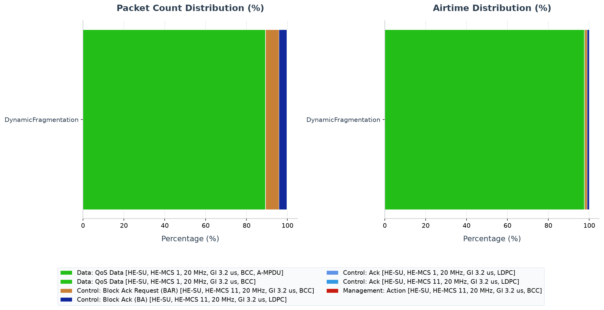

# Walkthrough - HE Dynamic Fragmentation

This walkthrough shows why 802.11ax negotiates dynamic fragmentation. Static
fragmentation commits to one boundary in advance; dynamic fragmentation can
choose a boundary that fits the current TXOP or RU budget, avoiding the choice
between wasting the remainder of an opportunity and deferring the whole MSDU.

## Background: HE Dynamic Fragmentation

IEEE 802.11ax introduces **Dynamic Fragmentation** to replace the legacy static MAC-layer fragmentation.
- **Legacy Static Fragmentation**: Divides MSDUs into fixed-size fragments (except the last one) based on a static fragmentation threshold. This cannot adapt to changing channel conditions or dynamic TXOP (Transmission Opportunity) limits.
- **HE Dynamic Fragmentation**: Allows the transmitter to adjust fragment
  boundaries so eligible data fits a constrained PPDU duration. The negotiated
  levels govern how fragments may be included in an A-MPDU:
  - **Level 1**: one dynamic fragment as a non-A-MPDU.
  - **Level 2**: dynamic fragments may appear in an A-MPDU, with no more than
    one fragment of a given MSDU or A-MSDU in that A-MPDU.
  - **Level 3**: up to four fragments of a given MSDU or A-MSDU may appear in
    the A-MPDU.

---

## Network Topology and Configuration

The simulation runs in a single-BSS network (`Lan80211AxUlOfdma`) where:
- **`ap`**: The Access Point.
- **`host[0..2]`**: Three wireless stations.
- **`server`**: A wired server connected to the AP.
- **Traffic**: Uplink traffic is generated from the hosts to the server. The hosts send large packets (1400-byte payloads) every 5ms.

The `DynamicFragmentation` config in `omnetpp.ini` is defined as:
```ini
[Config DynamicFragmentation]
description = "Negotiated HE level-1 dynamic fragmentation divides 1400-byte QoS MSDUs into approximately 500-byte MPDUs and reassembles them at the AP."
**.ap.wlan[*].mib.heDynamicFragmentationLevel = 1
**.host[*].wlan[*].mib.heDynamicFragmentationLevel = 1
**.host[*].wlan[*].mac.hcf.originatorMacDataService.fragmentationPolicy.typename = "HeDynamicFragmentationPolicy"
**.host[*].wlan[*].mac.hcf.originatorMacDataService.fragmentationPolicy.fragmentationThreshold = 500B
**.host[*].wlan[*].mac.hcf.originatorMacDataService.fragmentationPolicy.requiredLevel = 1
**.host[*].app[0].messageLength = 1400B
**.wlan[*].mac.hcf.enableUlMuOfdma = false
```

### Key Parameters:
1. **`heDynamicFragmentationLevel = 1`**: AP and stations advertise Level-1 dynamic fragmentation support.
2. **`typename = "HeDynamicFragmentationPolicy"`**: Activates the HE-specific fragmentation policy that checks negotiated peer capabilities.
3. **`fragmentationThreshold = 500B`**: Targets a nominal fragment size of 500 bytes.
4. **`requiredLevel = 1`**: Specifies that dynamic fragmentation requires Level-1 support.

The 1400-byte MSDU is intentionally larger than the 500-byte policy threshold,
so every eligible packet exercises fragmentation and reassembly. Level 1 is
the minimum negotiated mode and keeps the exchange easy to inspect.
The static and unfragmented configurations are essential controls: negotiation
alone is not evidence that fragment sizing changed.

---

## Running the Simulation

Execute the simulation using Cmdenv:
```sh
bin/inet -u Cmdenv -c DynamicFragmentation examples/ieee80211ax/mac_features/dynamic_fragmentation/omnetpp.ini
```

---

## Verifying Results

After the simulation completes, query the results using `opp_scavetool` or standard grepping of the `.sca` file:
```sh
# Query packetSent and packetFragmented at the client hosts
opp_scavetool query -l -f 'name =~ "packetSent:count" or name =~ "packetFragmented:count"' examples/ieee80211ax/mac_features/dynamic_fragmentation/results/*.sca

# Query packetDefragmented at the AP
opp_scavetool query -l -f 'name =~ "packetDefragmented:count"' examples/ieee80211ax/mac_features/dynamic_fragmentation/results/*.sca
```

### Quantitative Summary:
- **`host[0..2].app[0] packetSent:count`**: 361 packets each (Total sent by hosts = 1083).
- **`host[0..2].wlan[0].mac.hcf.originatorMacDataService packetFragmented:count`**: 359, 359, 360 (Total fragmented = 1078).
- **`ap.wlan[0].mac.hcf.recipientMacDataService packetDefragmented:count`**: 1068.
- **`server.app[0] packetReceived:count`**: 1068.

---

## PCAP Tshark Packet Exchange Analysis

To record PCAP traces and inspect them with TShark, run the simulation with PCAP recording and checksum computation enabled:

```sh
bin/inet -u Cmdenv -c DynamicFragmentation examples/ieee80211ax/mac_features/dynamic_fragmentation/omnetpp.ini --result-dir=examples/ieee80211ax/mac_features/dynamic_fragmentation/results --**.numPcapRecorders=1 --**.checksumMode=\"computed\" --**.fcsMode=\"computed\"
```

Use TShark to print the timeline of packet exchanges:

```sh
tshark -n -r examples/ieee80211ax/mac_features/dynamic_fragmentation/results/DynamicFragmentation-#0Lan80211AxUlOfdma.ap.wlan[0].pcap -c 20
```

The decoded output timeline shows:
1. **Dynamic Frame Fragments**: Standard data frames are dynamically split into smaller fragments of approximately 504 bytes (corresponding to the `fragmentationThreshold = 500B` configuration) to fit channel opportunities (e.g. frames 1, 2, 4, 6).
2. **Fragment ACKs**: The AP acknowledges each received fragment (e.g. frames 3, 5, 7) individually.
3. **Reassembly**: Once the last fragment is received, the MAC layer defragments and reassembles the original QoS MSDU before passing it up to UDP, decoded by TShark as the fully reassembled UDP packet (e.g. frame 8).

## Interpreting the comparison

Across five seeds, dynamic and static policies both produce a mean transmitted
MAC-frame size of `293.89 B` and `51.792 ms` of ACK airtime; the unfragmented
control produces `1070 B` frames and `69.360 ms` of ACK airtime. Dynamic and
static overlap because this example gives both the same 500-byte sizing rule.
The HE-specific advantage demonstrated here is negotiated eligibility and the
ability to choose boundaries per opportunity; showing adaptive sizing would
require varying the available TXOP or RU budget during the run.

<!-- BEGIN GENERATED: ieee80211ax-pcap-statistics -->
## 802.11 Packet Type Statistics


This section provides a statistical overview of the 802.11 frames transmitted over the wireless medium during the simulation. The packet counts were gathered from AP wireless-interface observation points. With multiple AP captures, one medium transmission may be observed at more than one AP; counts and airtime therefore represent recorded transmission observations, not de-duplicated application packets.

Capture session `20260718T132413Z` was generated from fresh PCAPng input with `TShark (Wireshark) 4.6.4.`. HE PPDU format, MCS, coding, bandwidth/RU, GI, and NSTS are decoded directly from standards-compliant radiotap HE fields; values not marked known by the recorder are omitted.

Two estimated airtime occupancy percentages are provided. HE-SU and HE-ER-SU use the modeled 36/44 µs preambles; a dissector-expanded A-MPDU is charged one shared preamble. HE MU/TB user-dependent signaling not exposed by radiotap remains approximate.
- **Air Time %**: This frame type's share of the sum of all estimated frame airtimes.
- **Air Time (Sim Time) %**: The sum of this frame type's estimated airtimes divided by the simulation time limit. Concurrent transmissions from multiple capture points are counted separately, so this value can exceed 100%; it is not the union of busy channel time.

### Evidence checks

| Status | Requirement | Observed evidence |
|---|---|---|
| **PASS** | DynamicFragmentation produced protocol-visible wireless observations | 6764 AP/global transmission observations |
| **INCONCLUSIVE** | Capability gate, fragment numbers, sizes, More Fragments and acknowledgment | The packet-type table is exchange evidence only; use the recorded feature vectors/results |

### Configuration: `DynamicFragmentation`
Total over-the-air frame/MPDU transmission observations (Global BSS/AP): **6764**

| Color | Frame Type & Subtype | Count | Percentage | Mean Size | Std Dev | Mean Duration | Std Dev Duration | Freq | Mean RX Sig | Mean TX Pwr | Air Time % | Air Time (Sim Time) % |
|:---:|---|---:|---:|---:|---:|---:|---:|---:|---:|---:|---:|---:|
| <svg width="16" height="16"><rect width="16" height="16" rx="3" fill="#23bf18" /></svg> | Data: QoS Data [HE-SU, HE-MCS 1, 20 MHz, GI 3.2 us, BCC, A-MPDU] | 6030 | 89.15% | 376.0 B | 176.8 B | 208.6 us | 99.3 us | 5010 MHz | -63.3 dBm | - | 97.47% | 62.89% |
| <svg width="16" height="16"><rect width="16" height="16" rx="3" fill="#24c219" /></svg> | Data: QoS Data [HE-SU, HE-MCS 1, 20 MHz, GI 3.2 us, BCC] | 13 | 0.19% | 401.5 B | 187.1 B | 255.6 us | 102.3 us | 5010 MHz | -63.5 dBm | - | 0.26% | 0.17% |
| <hr> | <hr> | <hr> | <hr> | <hr> | <hr> | <hr> | <hr> | <hr> | <hr> | <hr> | <hr> | <hr> |
| <svg width="16" height="16"><rect width="16" height="16" rx="3" fill="#c88037" /></svg> | Control: Block Ack Request (BAR) [HE-SU, HE-MCS 11, 20 MHz, GI 3.2 us, BCC] | 435 | 6.43% | 24.0 B | 0.0 B | 37.6 us | 0.0 us | 5010 MHz | -62.8 dBm | - | 1.27% | 0.82% |
| <svg width="16" height="16"><rect width="16" height="16" rx="3" fill="#11289c" /></svg> | Control: Block Ack (BA) [HE-SU, HE-MCS 11, 20 MHz, GI 3.2 us, LDPC] | 261 | 3.86% | 152.0 B | 0.0 B | 46.0 us | 0.0 us | 5010 MHz | - | 10.0 dBm | 0.93% | 0.60% |
| <svg width="16" height="16"><rect width="16" height="16" rx="3" fill="#5e93e8" /></svg> | Control: Ack [HE-SU, HE-MCS 1, 20 MHz, GI 3.2 us, LDPC] | 12 | 0.18% | 14.0 B | 0.0 B | 43.7 us | 0.0 us | 5010 MHz | - | 10.0 dBm | 0.04% | 0.03% |
| <svg width="16" height="16"><rect width="16" height="16" rx="3" fill="#3598e3" /></svg> | Control: Ack [HE-SU, HE-MCS 11, 20 MHz, GI 3.2 us, LDPC] | 6 | 0.09% | 14.0 B | 0.0 B | 36.9 us | 0.0 us | 5010 MHz | -63.7 dBm | 10.0 dBm | 0.02% | 0.01% |
| <hr> | <hr> | <hr> | <hr> | <hr> | <hr> | <hr> | <hr> | <hr> | <hr> | <hr> | <hr> | <hr> |
| <svg width="16" height="16"><rect width="16" height="16" rx="3" fill="#c71b0f" /></svg> | Management: Action [HE-SU, HE-MCS 11, 20 MHz, GI 3.2 us, BCC] | 7 | 0.10% | 37.0 B | 0.0 B | 38.4 us | 0.0 us | 5010 MHz | -63.0 dBm | 10.0 dBm | 0.02% | 0.01% |

### Analysis of Packet Distribution
IEEE Std 802.11-2024 Clause 26.3 gates dynamic fragmentation on negotiated peer capability; it does not require fragment size to adapt to channel conditions. In this implementation the dynamic and static policies use the same 500-byte sizing policy after the capability gate, so their detailed result-analysis traces are expected to overlap. This packet table contains only `DynamicFragmentation`; it cannot establish a higher fragment count without the static and unfragmented controls, nor can Block Ack subtype counts alone establish the fragment bitmap.
<!-- END GENERATED: ieee80211ax-pcap-statistics -->
