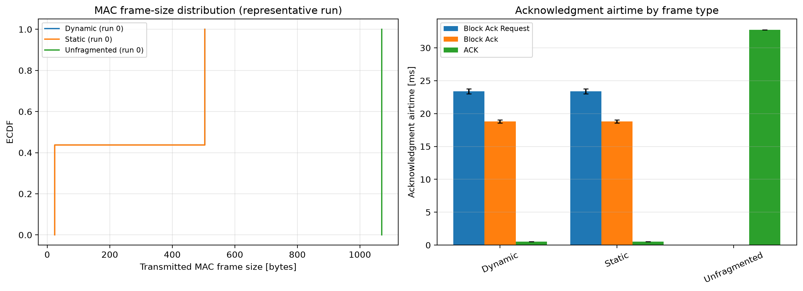
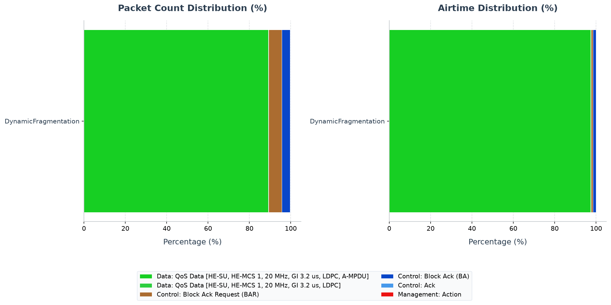

# HE dynamic-fragmentation walkthrough

This walkthrough teaches how HE dynamic fragmentation differs from static
MAC fragmentation and no fragmentation. The retained results prove smaller
transmitted frames, increased acknowledgment airtime, and application
delivery; a run-0 PCAP directly shows fragment-number sequences. Negotiated
capability state and an opportunity-dependent size change are not retained.

## Learning objectives and feature primer

After completing this walkthrough, the reader can:

- distinguish MAC fragmentation from IP fragmentation and A-MPDU aggregation;
- identify fragment numbers, fragment sizes, and acknowledgments in a capture;
- relate fragmentation to acknowledgment airtime and delivery; and
- diagnose a fallback path that silently sends unfragmented MPDUs.

Fragmentation splits one MAC service data unit (MSDU) into multiple MAC
protocol data units (MPDUs), which the recipient reassembles. HE dynamic
fragmentation relaxes uniform-size rules so eligible data can fit an available
PPDU opportunity, subject to negotiated capability. The validation outcome is
a `PASS` for actual fragment sequences and smaller frames, but
`INCONCLUSIVE` for negotiated capability and truly opportunity-dependent
dynamic sizing because dynamic and static outcomes are identical here.

## Scenario description

[omnetpp.ini](omnetpp.ini) includes the uplink OFDMA example's
[configuration](../../ul_ofdma/omnetpp.ini); [README.md](README.md) describes
the entry point. The inherited `Lan80211AxUlOfdma` topology has a wired server,
one AP, and three wireless hosts sending 1400 B uplink application messages.
The three comparison configurations disable UL MU-OFDMA so the fragmentation
policy is isolated from Trigger scheduling.

```text
host[0..2] -- fragmented HE QoS data --> AP --> server
                MPDU 0,1,2,3              reassembly
```

## Standards and INET model boundary

IEEE Std 802.11-2024 Clause 26.3 defines HE dynamic fragmentation; Clause
26.3.1 defines its levels and nonuniform fragments, while Clause 26.3.2.2
requires recipient support (and, under block ack, negotiated HE Fragmentation
Operation) for level 1 (`80211ax-2024:chunk:09757`,
`80211ax-2024:chunk:09760`). INET requests level 1 on AP and hosts and selects
`HeDynamicFragmentationPolicy` with a 500 B threshold. Those inputs do not
prove negotiation. `wlan.frag` in PCAP proves header fragment numbers; result
vectors prove modeled sizes and ACK airtime.

## Evidence status

| Claim or check | Status | Authoritative evidence | Runs/seeds | Scope or gap |
|---|---|---|---|---|
| frames are fragmented | `PASS` | AP PCAP fragment numbers 0--3 and sizes | dynamic run 0 | direct packet observation |
| fragmentation reduces transmitted frame size | `PASS` | `packetSentToPeer:vector(packetBytes)` | all configs 0--4 | dynamic/static vs none |
| dynamic policy differs from static policy | `FAIL` | identical retained size and ACK-airtime summaries | 0--4 | treatment did not expose dynamic advantage |
| level-1 capability was negotiated | `INCONCLUSIVE` | no capability-state result | retained sessions | configuration only |

## Configuration matrix

| Configuration | Role | Feature gate/delta | Workload/channel | Runs/seeds | Expected invariant |
|---|---|---|---|---|---|
| `NoFragmentation` | negative control | empty policy; level 0 | 1400 B uplink; inherited PHY | 0--4 | large MPDUs, lower ACK airtime |
| `StaticFragmentation` | control | `BasicFragmentationPolicy`, 500 B; level 0 | matched workload | 0--4 | uniform fragments |
| `DynamicFragmentation` | treatment | level 1 both peers; HE policy, 500 B | matched workload | scalar 0--4; packet 0 | negotiated path and eligible dynamic fragments |

All rows inherit the same topology and traffic and disable UL MU-OFDMA. The
retained scenario provides no varying TXOP/PPDU budget, so dynamic and static
policies have no demonstrated causal opportunity to diverge.

## Expected invariants and diagnostic map

| Invariant | Evidence and observation point | Failure symptom | Likely subsystem | Next diagnostic |
|---|---|---|---|---|
| one MSDU yields ordered fragment numbers | AP PCAP `wlan.frag` and timestamps | no nonzero fragments or gaps | originator fragmentation / receiver reassembly | export sequence, More Fragments, sequence control |
| recipient support gates dynamic policy | negotiated capability result | policy active without peer support, or no result | HE capabilities / ADDBA | add capability-state telemetry |
| fragmented rows use smaller frames | sender `packetSentToPeer` vector | mean remains 1070 B | policy selection | verify effective typename and threshold |
| delivery remains close to control | server receive vector | large deficit/drop | reassembly / retry | correlate drops and final fragment |

## Reproduction

Run from the repository root:

```sh
bin/inet -u Cmdenv \
  -f examples/ieee80211ax/mac_features/dynamic_fragmentation/omnetpp.ini \
  -c DynamicFragmentation -r 0 \
  --result-dir=examples/ieee80211ax/mac_features/dynamic_fragmentation/results/manual/DynamicFragmentation
```

The direct minimal command was not executed and remains `NOT RUN`. The
suite-owned packet command below was executed with exit status 0 and created
session `20260725T225941Z`:

```sh
python3 examples/ieee80211/analysis/analyze_pcap.py \
  --suite examples/ieee80211/analysis/suites/ax.json \
  --generate --subdir mac_features/dynamic_fragmentation --run 0 \
  --allow-failed-evidence
```

## Scalar and vector analysis

Inputs:
`results/scalar-vector/20260725T120411Z/{configuration}/*.{sca,vec}`.
Figure provenance:
[fragmentation-and-ack-overhead.png.json](../../analysis/figures/fragmentation/fragmentation-and-ack-overhead.png.json).

```sh
opp_scavetool query -l \
  -f 'name =~ "packetSentToPeer:vector(packetBytes)" OR name =~ "acknowledgmentFrameType:vector" OR name =~ "acknowledgmentAirtime:vector" OR name =~ "packetReceived:vector(packetBytes)"' \
  examples/ieee80211ax/mac_features/dynamic_fragmentation/results/scalar-vector/20260725T120411Z/*/*.sca \
  examples/ieee80211ax/mac_features/dynamic_fragmentation/results/scalar-vector/20260725T120411Z/*/*.vec
```

| Configuration | mean transmitted frame size | total ACK airtime | server packets received, runs 0--4 |
|---|---:|---:|---|
| dynamic | 293.002 ± 0.792 B | 42.205 ± 0.537 ms | 1019, 1021, 1019, 1021, 1019 |
| static | 293.002 ± 0.792 B | 42.205 ± 0.537 ms | 1019, 1021, 1019, 1021, 1019 |
| none | 1070.000 ± 0.000 B | 32.640 ± 0.000 ms | 1023 each run |

Means and 95% Student-t intervals are computed from per-run summaries across
five runs, not from vector samples. Fragmentation reduces frame size and adds
ACK overhead; the fragmented rows deliver four or five fewer packets per run.
The equality of dynamic and static rows is direct negative evidence for this
scenario's ability to demonstrate opportunity-dependent sizing.
The unfragmented row is therefore the essential contrast: it demonstrates
that the smaller transmitted frames and changed acknowledgment work come from
fragmentation. The retained comparison exercises the configured
capability-gated path and validates fragmentation mechanics; it does not prove
that level-1 support was negotiated or demonstrate channel-adaptive fragment
sizing.
The declared measurement window is 0.3--2.0 s; the initial setup period is
excluded as warm-up.

<!-- BEGIN GENERATED: ieee80211-scalar-vector-fragmentation -->
### Generated scalar/vector plot and table



Figure provenance: [`../../analysis/figures/fragmentation/fragmentation-and-ack-overhead.png.json`](../../analysis/figures/fragmentation/fragmentation-and-ack-overhead.png.json). Run-level metric source: [`../../analysis/metrics.json`](../../analysis/metrics.json).

| Configuration or comparison | Metric | Source result filters / modules / units | Window / per-run aggregation / exclusions | Independent runs (n) | Mean or direct value | 95% CI half-width |
|---|---|---|---|---:|---:|---:|
| Dynamic | ack airtime total ms | vector / **.host[*].wlan[0].mac.hcf / packetSentToPeer:vector(packetBytes)<br>vector / **.radio / acknowledgmentFrameType:vector<br>vector / **.radio / acknowledgmentAirtime:vector / unit=s | [0.3, 2.0) s; airtime=per-run sums with 95% t CI; frame_sizes=ECDF from run 0 | 5 | 42.2048 | 0.536886 |
| Dynamic | mac frame size mean bytes | vector / **.host[*].wlan[0].mac.hcf / packetSentToPeer:vector(packetBytes)<br>vector / **.radio / acknowledgmentFrameType:vector<br>vector / **.radio / acknowledgmentAirtime:vector / unit=s | [0.3, 2.0) s; airtime=per-run sums with 95% t CI; frame_sizes=ECDF from run 0 | 5 | 293.002 | 0.792239 |
| Static | ack airtime total ms | vector / **.host[*].wlan[0].mac.hcf / packetSentToPeer:vector(packetBytes)<br>vector / **.radio / acknowledgmentFrameType:vector<br>vector / **.radio / acknowledgmentAirtime:vector / unit=s | [0.3, 2.0) s; airtime=per-run sums with 95% t CI; frame_sizes=ECDF from run 0 | 5 | 42.2048 | 0.536886 |
| Static | mac frame size mean bytes | vector / **.host[*].wlan[0].mac.hcf / packetSentToPeer:vector(packetBytes)<br>vector / **.radio / acknowledgmentFrameType:vector<br>vector / **.radio / acknowledgmentAirtime:vector / unit=s | [0.3, 2.0) s; airtime=per-run sums with 95% t CI; frame_sizes=ECDF from run 0 | 5 | 293.002 | 0.792239 |
| Unfragmented | ack airtime total ms | vector / **.host[*].wlan[0].mac.hcf / packetSentToPeer:vector(packetBytes)<br>vector / **.radio / acknowledgmentFrameType:vector<br>vector / **.radio / acknowledgmentAirtime:vector / unit=s | [0.3, 2.0) s; airtime=per-run sums with 95% t CI; frame_sizes=ECDF from run 0 | 5 | 32.64 | 0 |
| Unfragmented | mac frame size mean bytes | vector / **.host[*].wlan[0].mac.hcf / packetSentToPeer:vector(packetBytes)<br>vector / **.radio / acknowledgmentFrameType:vector<br>vector / **.radio / acknowledgmentAirtime:vector / unit=s | [0.3, 2.0) s; airtime=per-run sums with 95% t CI; frame_sizes=ECDF from run 0 | 5 | 1070 | 0 |

The table is a presentation view of the session-bound run-level summary. The source and aggregation columns reproduce the bundle-level figure provenance; the authored analysis identifies which source supports each metric and supplies the interpretation.
<!-- END GENERATED: ieee80211-scalar-vector-fragmentation -->

## PCAP statistics

Capture point: `Lan80211AxUlOfdma.ap.wlan[0]`

Capture:
`results/packet-statistics/20260725T225941Z/DynamicFragmentation/DynamicFragmentation-#0Lan80211AxUlOfdma.ap.wlan[0].pcap`

Scope: AP packet observations in legacy PCAP, simulation timestamps,
TShark 4.6.4; FCS/checksum settings not retained.

```sh
tshark -n -r \
  'examples/ieee80211ax/mac_features/dynamic_fragmentation/results/packet-statistics/20260725T225941Z/DynamicFragmentation/DynamicFragmentation-#0Lan80211AxUlOfdma.ap.wlan[0].pcap' \
  -Y 'wlan.fc.type == 2 AND (wlan.frag > 0 OR wlan.fc.more_fragments == 1)' \
  -T fields -E header=y -E separator='|' \
  -e frame.number -e frame.time_epoch -e wlan.ta -e wlan.ra \
  -e wlan.frag -e wlan.fc.more_fragments -e frame.len
```

The preserved generated table counts AP/global observations, not
de-duplicated MSDUs or delivered application packets.

<!-- REWRITE-PREFIX-END -->

<!-- BEGIN GENERATED: ieee80211ax-pcap-statistics -->
### Generated PCAP plots and tables


Figure provenance: [`packet_statistics.png.json`](packet_statistics.png.json).

This section provides a statistical overview of the 802.11 frames transmitted over the wireless medium during the simulation. The packet counts were gathered from AP wireless-interface observation points. With multiple AP captures, one medium transmission may be observed at more than one AP; counts and airtime therefore represent recorded transmission observations, not de-duplicated application packets.

Capture session `20260725T225941Z` was generated from fresh PCAPng input with `TShark (Wireshark) 4.6.4.`. The selected manifest is `examples/ieee80211/analysis/generated/ax/pcapmanifests/20260725T225941Z.json` (SHA-256 `334ea1a4182fe3e8b8d3ca97a62b4d09c72e2323e8146c940c81c69681f8bbe4`). HE PPDU format, MCS, coding, bandwidth/RU, GI, and NSTS are decoded directly from standards-compliant radiotap HE fields; values not marked known by the recorder are omitted.

Two estimated airtime occupancy percentages are provided. HE-SU and HE-ER-SU use the modeled 36/44 µs preambles; a dissector-expanded A-MPDU is charged one shared preamble. HE MU/TB user-dependent signaling not exposed by radiotap remains approximate.
- **Air Time %**: This frame type's share of the sum of all estimated frame airtimes.
- **Air Time (Sim Time) %**: The sum of this frame type's estimated airtimes divided by the simulation time limit. Concurrent transmissions from multiple capture points are counted separately, so this value can exceed 100%; it is not the union of busy channel time.

#### Compact cross-configuration summary

| Configuration | Observation point / counting unit | Selection/filter | Observations | Dominant decoded frame/PHY evidence | Estimated airtime / sim time | Limits |
|---|---|---|---:|---|---:|---|
| `DynamicFragmentation` | AP interface(s); capture observations<br>`examples/ieee80211ax/mac_features/dynamic_fragmentation/results/packet-statistics/20260725T225941Z/DynamicFragmentation/DynamicFragmentation-#0Lan80211AxUlOfdma.ap.wlan[0].pcap` | `none (all decoded frames)` | 6667 | Data: QoS Data [HE-SU, HE-MCS 1, 20 MHz, GI 3.2 us, LDPC, A-MPDU] (5937), Control: Block Ack Request (BAR) (429), Control: Block Ack (BA) (264) | 64.16% | Not delivery or de-duplicated transmissions; unknown PHY fields stay unknown |

### Evidence checks

| Status | Requirement | Observed evidence |
|---|---|---|
| **PASS** | DynamicFragmentation produced protocol-visible wireless observations | 6667 AP/global transmission observations |
| **INCONCLUSIVE** | Capability gate, fragment numbers, sizes, More Fragments and acknowledgment | The packet-type table is exchange evidence only; use the recorded feature vectors/results |

### Configuration: `DynamicFragmentation`
Total over-the-air frame/MPDU transmission observations (Global BSS/AP): **6667**

| Color | Frame Type & Subtype | Count | Percentage | Mean Size | Std Dev | Mean Duration | Std Dev Duration | Freq | Mean RX Sig | Mean TX Pwr | Air Time % | Air Time (Sim Time) % |
|:---:|---|---:|---:|---:|---:|---:|---:|---:|---:|---:|---:|---:|
| <svg width="16" height="16"><rect width="16" height="16" rx="3" fill="#17cf23" /></svg> | Data: QoS Data [HE-SU, HE-MCS 1, 20 MHz, GI 3.2 us, LDPC, A-MPDU] | 5937 | 89.05% | 376.0 B | 176.8 B | 210.3 us | 100.7 us | 5010 MHz | -63.4 dBm | - | 97.28% | 62.41% |
| <svg width="16" height="16"><rect width="16" height="16" rx="3" fill="#2cce3f" /></svg> | Data: QoS Data [HE-SU, HE-MCS 1, 20 MHz, GI 3.2 us, LDPC] | 13 | 0.19% | 401.5 B | 187.1 B | 255.6 us | 102.3 us | 5010 MHz | -63.5 dBm | - | 0.26% | 0.17% |
| <hr> | <hr> | <hr> | <hr> | <hr> | <hr> | <hr> | <hr> | <hr> | <hr> | <hr> | <hr> | <hr> |
| <svg width="16" height="16"><rect width="16" height="16" rx="3" fill="#ab6c30" /></svg> | Control: Block Ack Request (BAR) | 429 | 6.43% | 24.0 B | 0.0 B | 28.0 us | 0.0 us | 5010 MHz | -62.8 dBm | - | 0.94% | 0.60% |
| <svg width="16" height="16"><rect width="16" height="16" rx="3" fill="#0946c8" /></svg> | Control: Block Ack (BA) | 264 | 3.96% | 152.0 B | 0.0 B | 70.7 us | 0.0 us | 5010 MHz | - | 10.0 dBm | 1.45% | 0.93% |
| <svg width="16" height="16"><rect width="16" height="16" rx="3" fill="#4799eb" /></svg> | Control: Ack | 12 | 0.18% | 14.0 B | 0.0 B | 24.7 us | 0.0 us | 5010 MHz | - | 10.0 dBm | 0.02% | 0.01% |
| <svg width="16" height="16"><rect width="16" height="16" rx="3" fill="#4799eb" /></svg> | Control: Ack | 6 | 0.09% | 14.0 B | 0.0 B | 24.7 us | 0.0 us | 5010 MHz | -63.7 dBm | 10.0 dBm | 0.01% | 0.01% |
| <hr> | <hr> | <hr> | <hr> | <hr> | <hr> | <hr> | <hr> | <hr> | <hr> | <hr> | <hr> | <hr> |
| <svg width="16" height="16"><rect width="16" height="16" rx="3" fill="#ec1313" /></svg> | Management: Action | 6 | 0.09% | 37.0 B | 0.0 B | 69.3 us | 0.0 us | 5010 MHz | -63.7 dBm | 10.0 dBm | 0.03% | 0.02% |

#### Representative frame-exchange timeline

| Frame | Simulation time (s) | Transmitter → receiver | Type/PHY | Decisive fields | Role in exchange |
|---:|---:|---|---|---|---|
| `DynamicFragmentation-#0Lan80211AxUlOfdma.ap.wlan[0].pcap:2` | 0.201150000 | 0a:aa:00:00:00:02 → 10:00:00:00:00:00 | Data: QoS Data / HE-SU, HE-MCS 1, 20 MHz, NSS 1, GI 3.2 us, LDPC | direction=to DS, retry=1, seq=0, frag=0, more-frag=0, TID=6 | Carries protocol-visible MAC payload in the representative exchange. |
| `DynamicFragmentation-#0Lan80211AxUlOfdma.ap.wlan[0].pcap:3` | 0.201198000 | ? → 0a:aa:00:00:00:02 | Control: Ack / Legacy/HT/VHT | direction=direct/IBSS, retry=0, seq=-, frag=-, more-frag=0, TID=- | Acknowledges the preceding unicast frame. |
| `DynamicFragmentation-#0Lan80211AxUlOfdma.ap.wlan[0].pcap:4` | 0.201554000 | 0a:aa:00:00:00:02 → 10:00:00:00:00:00 | Data: QoS Data / HE-SU, HE-MCS 1, 20 MHz, NSS 1, GI 3.2 us, LDPC | direction=to DS, retry=0, seq=0, frag=1, more-frag=0, TID=6 | Carries protocol-visible MAC payload in the representative exchange. |
| `DynamicFragmentation-#0Lan80211AxUlOfdma.ap.wlan[0].pcap:5` | 0.201602000 | ? → 0a:aa:00:00:00:02 | Control: Ack / Legacy/HT/VHT | direction=direct/IBSS, retry=0, seq=-, frag=-, more-frag=0, TID=- | Acknowledges the preceding unicast frame. |
| `DynamicFragmentation-#0Lan80211AxUlOfdma.ap.wlan[0].pcap:6` | 0.201958000 | 0a:aa:00:00:00:02 → 10:00:00:00:00:00 | Data: QoS Data / HE-SU, HE-MCS 1, 20 MHz, NSS 1, GI 3.2 us, LDPC | direction=to DS, retry=0, seq=0, frag=2, more-frag=0, TID=6 | Carries protocol-visible MAC payload in the representative exchange. |
| `DynamicFragmentation-#0Lan80211AxUlOfdma.ap.wlan[0].pcap:7` | 0.202006000 | ? → 0a:aa:00:00:00:02 | Control: Ack / Legacy/HT/VHT | direction=direct/IBSS, retry=0, seq=-, frag=-, more-frag=0, TID=- | Acknowledges the preceding unicast frame. |
| `DynamicFragmentation-#0Lan80211AxUlOfdma.ap.wlan[0].pcap:8` | 0.202122000 | 0a:aa:00:00:00:02 → 10:00:00:00:00:00 | Data: QoS Data / HE-SU, HE-MCS 1, 20 MHz, NSS 1, GI 3.2 us, LDPC | direction=to DS, retry=0, seq=0, frag=3, more-frag=0, TID=6 | Carries protocol-visible MAC payload in the representative exchange. |
| `DynamicFragmentation-#0Lan80211AxUlOfdma.ap.wlan[0].pcap:9` | 0.202170000 | ? → 0a:aa:00:00:00:02 | Control: Ack / Legacy/HT/VHT | direction=direct/IBSS, retry=0, seq=-, frag=-, more-frag=0, TID=- | Acknowledges the preceding unicast frame. |
| `DynamicFragmentation-#0Lan80211AxUlOfdma.ap.wlan[0].pcap:11` | 0.202266000 | ? → 0a:aa:00:00:00:02 | Control: Ack / Legacy/HT/VHT | direction=direct/IBSS, retry=0, seq=-, frag=-, more-frag=0, TID=- | Acknowledges the preceding unicast frame. |
| `DynamicFragmentation-#0Lan80211AxUlOfdma.ap.wlan[0].pcap:12` | 0.202650000 | 0a:aa:00:00:00:03 → 10:00:00:00:00:00 | Data: QoS Data / HE-SU, HE-MCS 1, 20 MHz, NSS 1, GI 3.2 us, LDPC | direction=to DS, retry=1, seq=0, frag=0, more-frag=0, TID=6 | Carries protocol-visible MAC payload in the representative exchange. |
| `DynamicFragmentation-#0Lan80211AxUlOfdma.ap.wlan[0].pcap:13` | 0.202698000 | ? → 0a:aa:00:00:00:03 | Control: Ack / Legacy/HT/VHT | direction=direct/IBSS, retry=0, seq=-, frag=-, more-frag=0, TID=- | Acknowledges the preceding unicast frame. |
| `DynamicFragmentation-#0Lan80211AxUlOfdma.ap.wlan[0].pcap:14` | 0.203054000 | 0a:aa:00:00:00:03 → 10:00:00:00:00:00 | Data: QoS Data / HE-SU, HE-MCS 1, 20 MHz, NSS 1, GI 3.2 us, LDPC | direction=to DS, retry=0, seq=0, frag=1, more-frag=0, TID=6 | Carries protocol-visible MAC payload in the representative exchange. |
| `DynamicFragmentation-#0Lan80211AxUlOfdma.ap.wlan[0].pcap:15` | 0.203102000 | ? → 0a:aa:00:00:00:03 | Control: Ack / Legacy/HT/VHT | direction=direct/IBSS, retry=0, seq=-, frag=-, more-frag=0, TID=- | Acknowledges the preceding unicast frame. |
| `DynamicFragmentation-#0Lan80211AxUlOfdma.ap.wlan[0].pcap:16` | 0.203458000 | 0a:aa:00:00:00:03 → 10:00:00:00:00:00 | Data: QoS Data / HE-SU, HE-MCS 1, 20 MHz, NSS 1, GI 3.2 us, LDPC | direction=to DS, retry=0, seq=0, frag=2, more-frag=0, TID=6 | Carries protocol-visible MAC payload in the representative exchange. |
| `DynamicFragmentation-#0Lan80211AxUlOfdma.ap.wlan[0].pcap:17` | 0.203506000 | ? → 0a:aa:00:00:00:03 | Control: Ack / Legacy/HT/VHT | direction=direct/IBSS, retry=0, seq=-, frag=-, more-frag=0, TID=- | Acknowledges the preceding unicast frame. |
| `DynamicFragmentation-#0Lan80211AxUlOfdma.ap.wlan[0].pcap:18` | 0.203622000 | 0a:aa:00:00:00:03 → 10:00:00:00:00:00 | Data: QoS Data / HE-SU, HE-MCS 1, 20 MHz, NSS 1, GI 3.2 us, LDPC | direction=to DS, retry=0, seq=0, frag=3, more-frag=0, TID=6 | Carries protocol-visible MAC payload in the representative exchange. |

Frame numbers are local to the named capture, not OMNeT++ event numbers. For readability, the table collapses observations with the same timestamp and MAC identity across capture interfaces; aggregate PCAP statistics retain the original observation counts.

### Analysis of Packet Distribution
IEEE Std 802.11-2024 Clause 26.3 gates dynamic fragmentation on negotiated peer capability; it does not require fragment size to adapt to channel conditions. In this implementation the dynamic and static policies use the same 500-byte sizing policy after the capability gate, so their detailed result-analysis traces are expected to overlap. This packet table contains only `DynamicFragmentation`; it cannot establish a higher fragment count without the static and unfragmented controls, nor can Block Ack subtype counts alone establish the fragment bitmap.
<!-- END GENERATED: ieee80211ax-pcap-statistics -->

## Frame exchange analysis

| Frame | Simulation time | Transmitter → receiver | Type/PHY | Decisive fields | Role in exchange |
|---:|---:|---|---|---|---|
| 2 | 0.201150 s | STA 2 → AP | QoS Data | fragment=0, length=534 B | first fragment |
| 3 | 0.201198 s | AP → STA 2 | Ack | length=32 B | acknowledges fragment 0 |
| 4 | 0.201554 s | STA 2 → AP | QoS Data | fragment=1, length=534 B | next fragment |
| 5 | 0.201602 s | AP → STA 2 | Ack | length=32 B | acknowledges fragment 1 |
| 6 | 0.201958 s | STA 2 → AP | QoS Data | fragment=2, length=534 B | next fragment |
| 7 | 0.202006 s | AP → STA 2 | Ack | length=32 B | acknowledges fragment 2 |
| 8 | 0.202122 s | STA 2 → AP | QoS Data | fragment=3, length=90 B | final short fragment |
| 9 | 0.202170 s | AP → STA 2 | Ack | length=32 B | acknowledges final fragment |

This directly demonstrates fragment numbering, unequal final size, ordering,
and per-fragment acknowledgment at the AP capture point. It does not expose
the negotiated HE capability state. Capture `frame.len` includes recorded
link-layer bytes and is not identical to the sender result vector's packet
size definition.

## Cross-layer findings and verdict

| Claim | Verdict | Configuration evidence | Model telemetry | Packet evidence | Outcome evidence |
|---|---|---|---|---|---|
| fragmentation executes | `PASS` | HE policy and 500 B threshold requested | 293 B mean frame | fragment 0--3 + ACKs | server receives 1019--1021 |
| dynamic beats static | `FAIL` | distinct policy typenames | identical size/ACK results | no retained static PCAP comparison | identical delivery counts |
| capability correctly gates policy | `INCONCLUSIVE` | both peers request level 1 | no negotiated-state result | setup table not decoded for operation | delivery cannot prove gate |

The five-run result and run-0 packet sessions are separate. Together they
prove actual fragmentation and its measured overhead, but not an event-level
causal join or a dynamic-vs-static benefit. This is a useful fragmentation
regression and an incomplete dynamic-fragmentation feature test.
Evidence basis: fragment headers and result values are **direct
observations**, five-run summaries are **derived measurements**, and a
capability-to-fragment causal link is an **inference** pending correlation.

## Limitations and inconclusive claims

- No retained result exposes negotiated peer fragmentation capability.
- No stable join ties an MSDU, fragment sequence, ACK state, and reassembly.
- The fixed 500 B threshold and opportunity do not make dynamic sizing differ
  from static sizing.
- A resolving test needs a constrained, varied PPDU/TXOP budget plus
  co-recorded capability, fragment, acknowledgment, and delivery telemetry.

## Further experiments

- Sweep the available PPDU duration while holding the MSDU at 1400 B; predict
  dynamic fragment sizes change while static sizes remain threshold-bound.
- Set recipient capability to level 0 as a negative case; predict no dynamic
  fragments and an explicit fallback/capability result.
- Inject loss of a middle fragment and verify retry/reassembly behavior and
  final application delivery.

## Implementation plan

| Item | Evidence-backed plan |
|---|---|
| Demonstrated gap | no negotiated-capability result or correlated fragment lifecycle |
| Intended behavior | directly test capability gate and dynamic opportunity-dependent sizing |
| Smallest change surface | first extend shared fragmentation analysis; add model telemetry only for missing internal state |
| Observability | peer capability/ADDBA level, MSDU ID, fragment number/size/final flag, ACK, reassembly |
| Validation | level-0 negative, static control, dynamic varying-opportunity treatment; deterministic run then five paired seeds |
| Compatibility and risks | preserve legacy static/no-fragmentation behavior and event ordering |
| Architecture and sealing | apply architectural requirements and seal check before any `src/inet` edit |
| Next handoff | MAC data-service owner and independent Wi-Fi regression reviewer |

## Artifact provenance

| Artifact family | Session/path | Configurations/runs | Tool/filter/window | Integrity notes |
|---|---|---|---|---|
| scalar/vector | `results/scalar-vector/20260725T120411Z` | dynamic/static/none, 0--4 | figure JSON; 0.3--2.0 s | hashes retained in JSON |
| PCAP/results/log | `results/packet-statistics/20260725T225941Z` | dynamic, run 0 | shared analyzer; TShark 4.6.4 | manifest and hashes in generated block |
