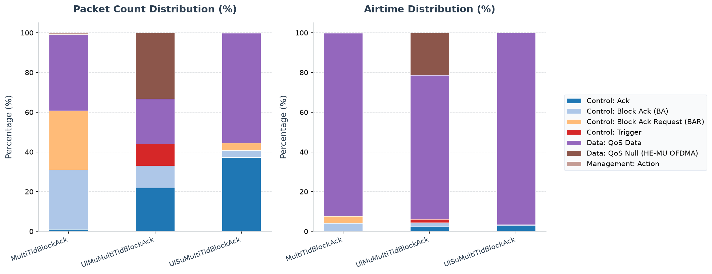

# Walkthrough - HE Multi-TID Block Ack

This walkthrough explains how 802.11ax reduces acknowledgment overhead when a
station has traffic in several QoS queues. Earlier per-TID Block Ack exchanges
repeat BAR, BA, and SIFS overhead; Multi-TID feedback can describe several TID
windows in one acknowledgment context.

## Background: Multi-TID Block Ack

In high-QoS wireless networks, stations (STAs) generate traffic belonging to different traffic classes or Traffic Identifiers (TIDs). In legacy 802.11, Block Ack agreements are negotiated separately for each TID. If an Access Point (AP) or station wants to acknowledge packets from multiple TIDs, it has to send separate Block Ack Request (BAR) and Block Ack (BA) frames for each TID. This introduces significant channel overhead and increases latency.

802.11ax introduces **Multi-TID Block Ack**:
- **Multi-TID ADDBA Negotiation**: Allows stations and APs to establish a shared acknowledgment context covering multiple TIDs.
- **Combined Feedback**: A single Multi-TID Block Ack frame can acknowledge MAC Service Data Units (MSDUs) belonging to multiple TIDs, reducing control frame overhead and SIFS gaps.

---

## Network Topology and Configuration

The simulation runs in a single-BSS network (`Lan80211AxUlOfdma`) where:
- **`ap`**: The Access Point.
- **`host[0..2]`**: Three wireless stations.
- **`server`**: A wired server connected to the AP.
- **Traffic**: Uplink traffic is generated from two separate UDP applications on each host:
  - `app[0]` generates **TID 0 (Best Effort)** traffic (1000B packets sent every 5ms).
  - `app[1]` generates **TID 6 (Voice)** traffic (200B packets sent every 10ms).

The `MultiTidBlockAck` config in `omnetpp.ini` is defined as:
```ini
[Config MultiTidBlockAck]
description = "HE Multi-TID Block Ack: AP and stations negotiate Multi-TID Aggregation and transmit voice/video/BE traffic concurrently"
**.ap.wlan[*].mib.heMultiTidAggregationRx = true
**.ap.wlan[*].mib.heMultiTidAggregationTx = true
**.host[*].wlan[*].mib.heMultiTidAggregationRx = true
**.host[*].wlan[*].mib.heMultiTidAggregationTx = true
```

### Key Parameters:
1. **`heMultiTidAggregationRx = true`**: Declares that the node's receiver supports receiving aggregated Multi-TID A-MPDUs.
2. **`heMultiTidAggregationTx = true`**: Declares that the node's transmitter supports building and transmitting Multi-TID A-MPDUs.

The two applications use different TIDs and unequal packet sizes/rates so both
acknowledgment windows remain active and easy to distinguish. A single-TID
stream could negotiate the capability but would never exercise its purpose.

---

## Running the Simulation

Execute the simulation using Cmdenv for either downlink or uplink direction:
```sh
# Run Downlink Multi-TID Block Ack
bin/inet -u Cmdenv -c MultiTidBlockAck examples/ieee80211ax/mac_features/multi_tid_block_ack/downlink.ini

# Run Uplink Multi-TID Block Ack
bin/inet -u Cmdenv -c UlMuMultiTidBlockAck examples/ieee80211ax/mac_features/multi_tid_block_ack/uplink.ini
```

---

## Verifying Results

After the simulation completes, check the results using `opp_scavetool`:
```sh
# Query packetSent at host applications (Uplink run)
opp_scavetool query -l -f 'name =~ "packetSent:count" and module =~ "*.host*app*"' examples/ieee80211ax/mac_features/multi_tid_block_ack/results/*.sca

# Query packetReceived at server applications (Uplink run)
opp_scavetool query -l -f 'name =~ "packetReceived:count" and module =~ "*.server.app*"' examples/ieee80211ax/mac_features/multi_tid_block_ack/results/*.sca
```

### Quantitative Summary:
- **`host[0].app[0] packetSent:count` (TID 6)**: 361 packets.
- **`host[1].app[0] packetSent:count` (TID 7)**: 361 packets.
- **`host[2]`**: Traffic is disabled (`numApps = 0`).
- **`server.app[0] packetReceived:count` (TID 6)**: 360.
- **`server.app[1] packetReceived:count` (TID 7)**: 360.

---

## PCAP Tshark Packet Exchange Analysis

To record PCAP traces and inspect them with TShark, run the simulation with PCAP recording and checksum computation enabled:

```sh
bin/inet -u Cmdenv -c UlMuMultiTidBlockAck examples/ieee80211ax/mac_features/multi_tid_block_ack/uplink.ini --result-dir=examples/ieee80211ax/mac_features/multi_tid_block_ack/results --**.numPcapRecorders=1 --**.checksumMode=\"computed\" --**.fcsMode=\"computed\"
```

Use TShark to print the timeline of packet exchanges:

```sh
tshark -n -r examples/ieee80211ax/mac_features/multi_tid_block_ack/results/UlMuMultiTidBlockAck-#0Lan80211AxUlOfdma.ap.wlan[0].pcap -c 20
```

The decoded output timeline shows:
1. **BSRP and Basic Triggers**: The AP broadcasts Buffer Status Report Poll (BSRP) triggers (e.g. frames 1, 6) and Basic triggers (e.g. frame 15) to coordinate multi-user uplink access.
2. **Concurrent Uplink Traffic**: Target stations transmit UDP data frames (TID 0/6) concurrently via HE TB PPDUs (e.g. frame 11, 13, 20).
3. **Multi-STA Block Acks**: The AP acknowledges the received frames via Block Ack frames (e.g. frames 5, 10, 19).

---

## Interpreting the result

The application counts establish delivery of both TIDs, while the Trigger and
Block Ack sequence establishes coordinated feedback. The current scenario
exercises capability negotiation and the per-TID acknowledgment state, but it
does not measure an airtime saving from packing several TID records into one
physical Multi-TID Block Ack. Such a performance claim requires a matched
single-TID control and direct BAR/BA airtime accounting.

## 802.11 Packet Type Statistics


This section provides a statistical overview of the 802.11 frames transmitted over the wireless medium during the simulation. The packet counts were gathered from the Access Point's wireless interface (`ap.wlan[0]`), which captures all uplink, downlink, and management traffic in the BSS without duplication.

> **HE capture metadata caveat:** The current INET `PcapRecorder` uses a repository-specific packing for HE radiotap metadata. TShark can consequently decode SU transmissions as HE ER SU and downlink HE MU transmissions as HE TB. Frame type, subtype, count, and size remain useful, but the HE PPDU-format, MCS, bandwidth, GI, NSS, and coding suffixes—and the airtime estimates derived from them—are diagnostic only and are not standards-conformance evidence.

Two airtime occupancy percentages are provided:
- **Air Time %**: This frame type's share of the sum of all estimated frame airtimes.
- **Air Time (Sim Time) %**: The sum of this frame type's estimated airtimes divided by the simulation time limit. Concurrent transmissions from multiple capture points are counted separately, so this value can exceed 100%; it is not the union of busy channel time.

### Configuration: `MultiTidBlockAck`
Total over-the-air packets captured (Global BSS/AP): **1045**

| Color | Frame Type & Subtype | Count | Percentage | Mean Size | Std Dev | Mean Duration | Std Dev Duration | Freq | Mean RX Sig | Mean TX Pwr | Air Time % | Air Time (Sim Time) % |
|:---:|---|---:|---:|---:|---:|---:|---:|---:|---:|---:|---:|---:|
| <svg width="16" height="16"><rect width="16" height="16" rx="3" fill="#16b619" /></svg> | Data: QoS Data [HE-ER-SU, HE-MCS 1, 20 MHz, GI 3.2 us, BCC] | 401 | 38.37% | 798.7 B | 377.4 B | 560.9 us | 206.4 us | 5010 MHz | - | 20.0 dBm | 92.15% | 22.49% |
| <hr> | <hr> | <hr> | <hr> | <hr> | <hr> | <hr> | <hr> | <hr> | <hr> | <hr> | <hr> | <hr> |
| <svg width="16" height="16"><rect width="16" height="16" rx="3" fill="#be6237" /></svg> | Control: Block Ack Request (BAR) [HE-ER-SU, HE-MCS 11, 20 MHz, GI 3.2 us, BCC] | 312 | 29.86% | 24.0 B | 0.0 B | 28.0 us | 0.0 us | 5010 MHz | - | 20.0 dBm | 3.58% | 0.87% |
| <svg width="16" height="16"><rect width="16" height="16" rx="3" fill="#12268c" /></svg> | Control: Block Ack (BA) [HE-ER-SU, HE-MCS 11, 20 MHz, GI 3.2 us, BCC] | 312 | 29.86% | 32.0 B | 0.0 B | 30.7 us | 0.0 us | 5010 MHz | -66.0 dBm | - | 3.92% | 0.96% |
| <svg width="16" height="16"><rect width="16" height="16" rx="3" fill="#2789f1" /></svg> | Control: Ack [HE-ER-SU, HE-MCS 1, 20 MHz, GI 3.2 us, BCC] | 4 | 0.38% | 14.0 B | 0.0 B | 24.7 us | 0.0 us | 5010 MHz | -64.5 dBm | - | 0.04% | 0.01% |
| <svg width="16" height="16"><rect width="16" height="16" rx="3" fill="#308ef3" /></svg> | Control: Ack [HE-ER-SU, HE-MCS 11, 20 MHz, GI 3.2 us, BCC] | 8 | 0.77% | 14.0 B | 0.0 B | 24.7 us | 0.0 us | 5010 MHz | -64.5 dBm | 20.0 dBm | 0.08% | 0.02% |
| <hr> | <hr> | <hr> | <hr> | <hr> | <hr> | <hr> | <hr> | <hr> | <hr> | <hr> | <hr> | <hr> |
| <svg width="16" height="16"><rect width="16" height="16" rx="3" fill="#e90b07" /></svg> | Management: Action [HE-ER-SU, HE-MCS 11, 20 MHz, GI 3.2 us, BCC] | 8 | 0.77% | 37.0 B | 0.0 B | 69.3 us | 0.0 us | 5010 MHz | -64.5 dBm | 20.0 dBm | 0.23% | 0.06% |

### Configuration: `UlMuMultiTidBlockAck`
Total over-the-air packets captured (Global BSS/AP): **3093**

| Color | Frame Type & Subtype | Count | Percentage | Mean Size | Std Dev | Mean Duration | Std Dev Duration | Freq | Mean RX Sig | Mean TX Pwr | Air Time % | Air Time (Sim Time) % |
|:---:|---|---:|---:|---:|---:|---:|---:|---:|---:|---:|---:|---:|
| <svg width="16" height="16"><rect width="16" height="16" rx="3" fill="#16b619" /></svg> | Data: QoS Data [HE-ER-SU, HE-MCS 1, 20 MHz, GI 3.2 us, BCC] | 698 | 22.57% | 1070.0 B | 0.0 B | 709.3 us | 0.0 us | 5010 MHz | -63.9 dBm | - | 70.39% | 24.75% |
| <svg width="16" height="16"><rect width="16" height="16" rx="3" fill="#113d0b" /></svg> | Data: QoS Null [HE-TB, HE-MCS 0, 20 MHz, GI 3.2 us, LDPC] | 1029 | 33.27% | 34.0 B | 0.0 B | 161.2 us | 0.0 us | 5002 MHz, 5004 MHz, 5006 MHz | -63.7 dBm | - | 23.58% | 8.29% |
| <hr> | <hr> | <hr> | <hr> | <hr> | <hr> | <hr> | <hr> | <hr> | <hr> | <hr> | <hr> | <hr> |
| <svg width="16" height="16"><rect width="16" height="16" rx="3" fill="#f09000" /></svg> | Control: Trigger [HE-ER-SU, HE-MCS 11, 20 MHz, GI 3.2 us, BCC] | 343 | 11.09% | 46.2 B | 2.5 B | 35.4 us | 0.8 us | 5010 MHz | - | 10.0 dBm | 1.73% | 0.61% |
| <svg width="16" height="16"><rect width="16" height="16" rx="3" fill="#12268c" /></svg> | Control: Block Ack (BA) [HE-ER-SU, HE-MCS 11, 20 MHz, GI 3.2 us, BCC] | 343 | 11.09% | 58.0 B | 0.0 B | 39.3 us | 0.0 us | 5010 MHz | - | 10.0 dBm | 1.92% | 0.67% |
| <svg width="16" height="16"><rect width="16" height="16" rx="3" fill="#2789f1" /></svg> | Control: Ack [HE-ER-SU, HE-MCS 1, 20 MHz, GI 3.2 us, BCC] | 680 | 21.99% | 14.0 B | 0.0 B | 24.7 us | 0.0 us | 5010 MHz | - | 10.0 dBm | 2.38% | 0.84% |

### Configuration: `UlSuMultiTidBlockAck`
Total over-the-air packets captured (Global BSS/AP): **921**

| Color | Frame Type & Subtype | Count | Percentage | Mean Size | Std Dev | Mean Duration | Std Dev Duration | Freq | Mean RX Sig | Mean TX Pwr | Air Time % | Air Time (Sim Time) % |
|:---:|---|---:|---:|---:|---:|---:|---:|---:|---:|---:|---:|---:|
| <svg width="16" height="16"><rect width="16" height="16" rx="3" fill="#16b619" /></svg> | Data: QoS Data [HE-ER-SU, HE-MCS 1, 20 MHz, GI 3.2 us, BCC] | 510 | 55.37% | 803.3 B | 377.1 B | 563.4 us | 206.3 us | 5010 MHz | -60.0 dBm | - | 96.46% | 14.37% |
| <hr> | <hr> | <hr> | <hr> | <hr> | <hr> | <hr> | <hr> | <hr> | <hr> | <hr> | <hr> | <hr> |
| <svg width="16" height="16"><rect width="16" height="16" rx="3" fill="#be6237" /></svg> | Control: Block Ack Request (BAR) [HE-ER-SU, HE-MCS 11, 20 MHz, GI 3.2 us, BCC] | 33 | 3.58% | 24.0 B | 0.0 B | 28.0 us | 0.0 us | 5010 MHz | -60.0 dBm | - | 0.31% | 0.05% |
| <svg width="16" height="16"><rect width="16" height="16" rx="3" fill="#12268c" /></svg> | Control: Block Ack (BA) [HE-ER-SU, HE-MCS 11, 20 MHz, GI 3.2 us, BCC] | 33 | 3.58% | 32.0 B | 0.0 B | 30.7 us | 0.0 us | 5010 MHz | - | 10.0 dBm | 0.34% | 0.05% |
| <svg width="16" height="16"><rect width="16" height="16" rx="3" fill="#2789f1" /></svg> | Control: Ack [HE-ER-SU, HE-MCS 1, 20 MHz, GI 3.2 us, BCC] | 341 | 37.02% | 14.0 B | 0.0 B | 24.7 us | 0.0 us | 5010 MHz | - | 10.0 dBm | 2.82% | 0.42% |
| <svg width="16" height="16"><rect width="16" height="16" rx="3" fill="#308ef3" /></svg> | Control: Ack [HE-ER-SU, HE-MCS 11, 20 MHz, GI 3.2 us, BCC] | 2 | 0.22% | 14.0 B | 0.0 B | 24.7 us | 0.0 us | 5010 MHz | -60.0 dBm | 10.0 dBm | 0.02% | 0.00% |
| <hr> | <hr> | <hr> | <hr> | <hr> | <hr> | <hr> | <hr> | <hr> | <hr> | <hr> | <hr> | <hr> |
| <svg width="16" height="16"><rect width="16" height="16" rx="3" fill="#e90b07" /></svg> | Management: Action [HE-ER-SU, HE-MCS 11, 20 MHz, GI 3.2 us, BCC] | 2 | 0.22% | 37.0 B | 0.0 B | 69.3 us | 0.0 us | 5010 MHz | -60.0 dBm | 10.0 dBm | 0.05% | 0.01% |

### Analysis of Packet Distribution
BAR and Block Ack subtype counts show acknowledgment exchanges, but they do not identify the BA Control variant or its per-AID/TID entries. IEEE Std 802.11-2024 Clauses 9.3.1.8.6 and 10.25.5 require those contents to distinguish Multi-STA and Multi-TID operation. Treat this table as an exchange count; use decoded BA fields or simulator telemetry to prove that multiple TIDs were acknowledged.
