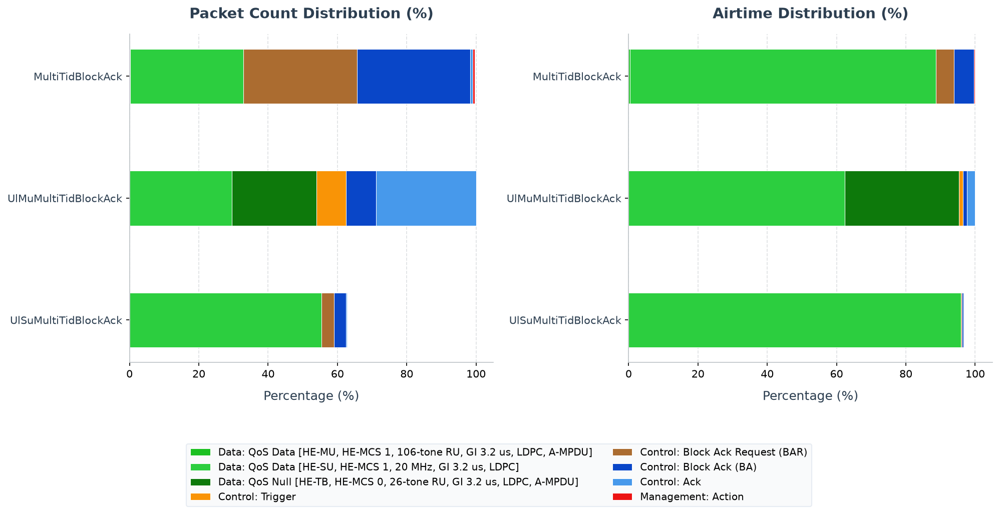

# Walkthrough: HE Multi-TID Block Ack

This example exercises downlink (DL) and uplink (UL) Block Ack arrangements
involving multiple traffic identifiers (TIDs). Retained run-0 results establish
the offered application flows and protocol-visible BAR/BA exchanges, but the
available decode does not prove that a single acknowledgment contains multiple
TID records. The feature verdict is therefore deliberately `INCONCLUSIVE`.

## Learning objectives and feature primer

After completing this walkthrough, the reader can:

- explain why an aggregate containing several QoS TIDs needs acknowledgment
  state for each TID;
- distinguish a Multi-TID BAR/Block Ack from a Multi-STA Block Ack;
- locate the split DL and UL entry points and inherited configurations; and
- reproduce the first-line result and packet queries without treating traffic
  delivery as proof of the acknowledgment variant.

A TID identifies a QoS traffic stream. IEEE 802.11 High Efficiency (HE)
multi-TID aggregation can place MAC protocol data units (MPDUs) from more than
one TID in an aggregate. The acknowledgment context must then identify the
relevant per-TID sequence state. In the UL multi-user case, one Multi-STA Block
Ack may instead carry per-station AID/TID information after Trigger-based
transmissions.

## Scenario description

There is no local `omnetpp.ini`. [downlink.ini](downlink.ini) includes
[`../../dl_ofdma/omnetpp.ini`](../../dl_ofdma/omnetpp.ini), while
[uplink.ini](uplink.ini) includes
[`../../ul_ofdma/omnetpp.ini`](../../ul_ofdma/omnetpp.ini).

```text
DL: server -- Ethernet -- AP ))) host[0], host[1]
UL: host[0..1] ))) AP -- Ethernet -- server
```

All nodes are stationary. Both inherited networks use 5 GHz/20 MHz HE radios.
The DL run lasts 1 s with a 0.25 s warm-up; the UL runs last 2 s. DL sends
ports 5000 and 5001 (TIDs 6 and 7) to two stations. UL-SU sends two TIDs from
one station; UL-MU sends one TID from each of two stations and disables
`host[2]` traffic.

## Standards and INET model boundary

IEEE Std 802.11-2024 Clause 26.6.3 defines multi-TID A-MPDU operation; Clause
10.25.5 selects BlockAck/BlockAckReq variants; Clause 9.3.1.8.6 defines the
Multi-STA BlockAck variant. The corpus evidence used here is
`80211ax-2024:chunk:09842`, `:05346`, and `:01597`.

INET configuration advertises HE multi-TID transmit/receive capability at AP
and stations. The checked-out model contains Multi-TID BAR/BA record
structures, but configuration and source availability are not runtime proof.
The retained native MAC capture exposes QoS TIDs and generic BAR/BA labels but
does not authoritatively expose all required per-TID records.

## Evidence status

| Claim or check | Status | Authoritative evidence | Runs/seeds | Scope or gap |
|---|---|---|---|---|
| Split entry points resolve to the intended networks/configurations | `PASS` | include chains and `.sca` metadata | run 0/seed 0 | Configuration provenance only |
| Two DL/UL-SU application TIDs are active | `PASS` | application vectors and decoded `wlan.qos.tid` | run 0/seed 0 | TIDs 6 and 7 are observed |
| BAR/BA or Trigger/BA exchanges occur | `PASS` | retained AP PCAPs | run 0/seed 0 | Observation counts, not variant proof |
| One acknowledgment covers multiple TIDs | `INCONCLUSIVE` | required BA variant and per-TID records are absent from the retained decode | run 0/seed 0 | Central feature invariant unresolved |
| Single-TID negative control | `NOT RUN` | `SingleTidBlockAckComparison` exists in the included DL INI | none | No retained matched artifacts |
| Shared AX analyzer regenerates the split scenario | `PASS` | session `20260725T230138Z` manifest resolves `downlink.ini` and `uplink.ini` by configuration | run 0/seed 0 | Three configured treatments completed |

## Configuration matrix

| Configuration | Role | Feature gate/delta | Workload/channel | Runs/seeds | Expected invariant |
|---|---|---|---|---|---|
| `MultiTidBlockAck` via `downlink.ini` | DL treatment | capability on; sequential BAR | two TIDs to each of two STAs, 20 MHz | 0/0 | BAR/BA carries both TID contexts |
| `UlSuMultiTidBlockAck` via `uplink.ini` | UL-SU treatment | capability on; UL MU disabled | two TIDs from one STA, 20 MHz | 0/0 | one response covers both TIDs |
| `UlMuMultiTidBlockAck` via `uplink.ini` | UL-MU treatment | capability on; scheduled UL MU | one TID from each of two STAs | 0/0 | one Multi-STA BA covers both AID/TID contexts |
| `SingleTidBlockAckComparison` via `downlink.ini` | Negative control | multi-TID capability off | matched DL traffic | `NOT RUN` | separate single-TID acknowledgment contexts |

The assignments in the included DL/UL INIs are the winning feature settings;
the one-line wrappers add no later overrides.

## Expected invariants and diagnostic map

| Invariant | Evidence and observation point | Failure symptom | Likely subsystem | Next diagnostic |
|---|---|---|---|---|
| Both QoS TIDs enter the exchange | AP/STA PCAP `wlan.qos.tid` | only one TID | classifier/queues | inspect `ExampleQosClassifier` and per-AC queues |
| BAR/BA variant contains multiple TID records | BAR/BA control plus record array | generic BA only or one record | frame construction/serialization | targeted `HeDlMuTxOpFs` / `RecipientBlockAckProcedure` log or model signal |
| UL-MU response covers scheduled stations | Trigger AIDs correlated with Multi-STA BA AID/TID entries | missing station/TID | UL scheduler/BA builder | co-record Trigger fields, BA fields, and HCF log |
| Application outcome remains intact | sender/receiver application vectors | unexpected receive deficit | MAC retry/queue/upper path | correlate QoS sequence/retry fields and result vectors |

## Reproduction

Run from the INET repository root. These illustrative commands were not
executed during this documentation revision, so their exit status is
`NOT RUN`:

```sh
bin/inet -u Cmdenv -f examples/ieee80211ax/mac_features/multi_tid_block_ack/downlink.ini \
  -c MultiTidBlockAck -r 0 --seed-set=0 \
  --result-dir=examples/ieee80211ax/mac_features/multi_tid_block_ack/results/validation/dl

bin/inet -u Cmdenv -f examples/ieee80211ax/mac_features/multi_tid_block_ack/uplink.ini \
  -c UlMuMultiTidBlockAck -r 0 --seed-set=0 \
  --result-dir=examples/ieee80211ax/mac_features/multi_tid_block_ack/results/validation/ul-mu
```

The shared analyzer resolved the real split INI entry points by configuration.
The command below was executed with exit status 0 and created session
`20260725T230138Z`:

```sh
python3 examples/ieee80211/analysis/analyze_pcap.py \
  --suite examples/ieee80211/analysis/suites/ax.json \
  --generate --subdir mac_features/multi_tid_block_ack --run 0 \
  --allow-failed-evidence
```

## Scalar and vector analysis

Inputs are under `results/20260725T120411Z/`.

```sh
opp_scavetool query -l \
  -f 'type =~ vector and module =~ "*.app[*]" and (name =~ "packetSent:vector(packetBytes)" or name =~ "packetReceived:vector(packetBytes)")' \
  examples/ieee80211ax/mac_features/multi_tid_block_ack/results/20260725T120411Z/UlMuMultiTidBlockAck/UlMuMultiTidBlockAck-\#0.vec
```

| Configuration | Per-run application observation | Interpretation |
|---|---|---|
| `MultiTidBlockAck` | sends 141/71/141/71; receives 134/68 and 133/68 | two payload sizes/flows reach both DL receivers |
| `UlSuMultiTidBlockAck` | sends 341/171; receives 340/170 | two UL flows reach the server |
| `UlMuMultiTidBlockAck` | each active STA sends 341; server receives 340+340 | both scheduled sources deliver traffic |

Counts are single-run samples over each full recorded run; no uncertainty is
claimed. They are outcome evidence only: no scalar/vector result classifies the
Block Ack variant or per-TID acknowledgment records.

No plot: these single-run application totals do not expose the multi-TID
acknowledgment mechanism, so plotting them would not answer the feature
question.

## PCAP statistics

Capture point: AP `wlan[0]`; PCAPng with radiotap, microsecond precision;
computed checksum/FCS settings are recorded by the session. Decode used TShark
4.6.4. Rows count capture observations, not de-duplicated transmissions.

| Configuration | Observations | Relevant frame summary | Interpretation limit |
|---|---:|---|---|
| `MultiTidBlockAck` | 1,224 | 401 QoS Data, 401 BAR, 401 BA | generic labels do not prove multi-TID records |
| `UlSuMultiTidBlockAck` | 921 | 510 QoS Data, 33 BAR, 33 BA, 343 Ack | no per-record decode shown |
| `UlMuMultiTidBlockAck` | 1,268 | 1,176 QoS Data, 45 QoS Null, 16 Trigger, 15 BA | no authoritative AID/TID BA table |

<!-- BEGIN GENERATED: ieee80211ax-pcap-statistics -->
### Generated PCAP plots and tables


Figure provenance: [`packet_statistics.png.json`](../../analysis/figures/mac_features/multi_tid_block_ack/packet_statistics.png.json).

This section provides a statistical overview of the 802.11 frames transmitted over the wireless medium during the simulation. The packet counts were gathered from AP wireless-interface observation points. With multiple AP captures, one medium transmission may be observed at more than one AP; counts and airtime therefore represent recorded transmission observations, not de-duplicated application packets.

Capture session `20260725T230138Z` was generated from fresh PCAPng input with `TShark (Wireshark) 4.6.4.`. The selected manifest is `examples/ieee80211/analysis/generated/ax/pcapmanifests/20260725T230138Z.json` (SHA-256 `2cf03ec952d10fe3d92b65a2929ac5df3fcfbc89c545a82dafa3b0da21a2e823`). HE PPDU format, MCS, coding, bandwidth/RU, GI, and NSTS are decoded directly from standards-compliant radiotap HE fields; values not marked known by the recorder are omitted.

Two estimated airtime occupancy percentages are provided. HE-SU and HE-ER-SU use the modeled 36/44 µs preambles; a dissector-expanded A-MPDU is charged one shared preamble. HE MU/TB user-dependent signaling not exposed by radiotap remains approximate.
- **Air Time %**: This frame type's share of the sum of all estimated frame airtimes.
- **Air Time (Sim Time) %**: The sum of this frame type's estimated airtimes divided by the simulation time limit. Concurrent transmissions from multiple capture points are counted separately, so this value can exceed 100%; it is not the union of busy channel time.

#### Compact cross-configuration summary

| Configuration | Observation point / counting unit | Selection/filter | Observations | Dominant decoded frame/PHY evidence | Estimated airtime / sim time | Limits |
|---|---|---|---:|---|---:|---|
| `MultiTidBlockAck` | AP interface(s); capture observations<br>`examples/ieee80211ax/mac_features/multi_tid_block_ack/results/20260725T230138Z/MultiTidBlockAck/MultiTidBlockAck-#0Lan80211AxDlOfdma.ap.wlan[0].pcap` | `none (all decoded frames)` | 1225 | Data: QoS Data [HE-SU, HE-MCS 1, 20 MHz, GI 3.2 us, LDPC] (401), Control: Block Ack Request (BAR) (401), Control: Block Ack (BA) (401) | 21.47% | Not delivery or de-duplicated transmissions; unknown PHY fields stay unknown |
| `UlMuMultiTidBlockAck` | AP interface(s); capture observations<br>`examples/ieee80211ax/mac_features/multi_tid_block_ack/results/20260725T230138Z/UlMuMultiTidBlockAck/UlMuMultiTidBlockAck-#0Lan80211AxUlOfdma.ap.wlan[0].pcap` | `none (all decoded frames)` | 2355 | Data: QoS Data [HE-SU, HE-MCS 1, 20 MHz, GI 3.2 us, LDPC] (696), Control: Ack (680), Data: QoS Null [HE-TB, HE-MCS 0, 26-tone RU, GI 3.2 us, LDPC, A-MPDU] (573) | 34.64% | Not delivery or de-duplicated transmissions; unknown PHY fields stay unknown |
| `UlSuMultiTidBlockAck` | AP interface(s); capture observations<br>`examples/ieee80211ax/mac_features/multi_tid_block_ack/results/20260725T230138Z/UlSuMultiTidBlockAck/UlSuMultiTidBlockAck-#0Lan80211AxUlOfdma.ap.wlan[0].pcap` | `none (all decoded frames)` | 921 | Data: QoS Data [HE-SU, HE-MCS 1, 20 MHz, GI 3.2 us, LDPC] (510), Control: Ack (341), Control: Block Ack Request (BAR) (33) | 12.65% | Not delivery or de-duplicated transmissions; unknown PHY fields stay unknown |

### Evidence checks

| Status | Requirement | Observed evidence |
|---|---|---|
| **PASS** | MultiTidBlockAck produced protocol-visible wireless observations | 1225 AP/global transmission observations |
| **PASS** | UlMuMultiTidBlockAck produced protocol-visible wireless observations | 2355 AP/global transmission observations |
| **PASS** | UlSuMultiTidBlockAck produced protocol-visible wireless observations | 921 AP/global transmission observations |
| **INCONCLUSIVE** | BA variant and per-AID/TID entries | The packet-type table is exchange evidence only; use the recorded feature vectors/results |

### Configuration: `MultiTidBlockAck`
Total over-the-air frame/MPDU transmission observations (Global BSS/AP): **1225**

| Color | Frame Type & Subtype | Count | Percentage | Mean Size | Std Dev | Mean Duration | Std Dev Duration | Freq | Mean RX Sig | Mean TX Pwr | Air Time % | Air Time (Sim Time) % |
|:---:|---|---:|---:|---:|---:|---:|---:|---:|---:|---:|---:|---:|
| <svg width="16" height="16"><rect width="16" height="16" rx="3" fill="#1bc021" /></svg> | Data: QoS Data [HE-MU, HE-MCS 1, 106-tone RU, GI 3.2 us, LDPC, A-MPDU] | 2 | 0.16% | 266.0 B | 0.0 B | 369.8 us | 0.0 us | 5010 MHz | - | 20.0 dBm | 0.34% | 0.07% |
| <svg width="16" height="16"><rect width="16" height="16" rx="3" fill="#2cce3f" /></svg> | Data: QoS Data [HE-SU, HE-MCS 1, 20 MHz, GI 3.2 us, LDPC] | 401 | 32.73% | 798.7 B | 377.4 B | 472.9 us | 206.4 us | 5010 MHz | - | 20.0 dBm | 88.30% | 18.96% |
| <hr> | <hr> | <hr> | <hr> | <hr> | <hr> | <hr> | <hr> | <hr> | <hr> | <hr> | <hr> | <hr> |
| <svg width="16" height="16"><rect width="16" height="16" rx="3" fill="#ab6c30" /></svg> | Control: Block Ack Request (BAR) | 401 | 32.73% | 24.0 B | 0.1 B | 28.0 us | 0.0 us | 5010 MHz | - | 20.0 dBm | 5.23% | 1.12% |
| <svg width="16" height="16"><rect width="16" height="16" rx="3" fill="#0946c8" /></svg> | Control: Block Ack (BA) | 401 | 32.73% | 32.0 B | 0.1 B | 30.7 us | 0.0 us | 5010 MHz | -66.0 dBm | - | 5.73% | 1.23% |
| <svg width="16" height="16"><rect width="16" height="16" rx="3" fill="#4799eb" /></svg> | Control: Ack | 4 | 0.33% | 14.0 B | 0.0 B | 24.7 us | 0.0 us | 5010 MHz | -64.5 dBm | - | 0.05% | 0.01% |
| <svg width="16" height="16"><rect width="16" height="16" rx="3" fill="#4799eb" /></svg> | Control: Ack | 8 | 0.65% | 14.0 B | 0.0 B | 24.7 us | 0.0 us | 5010 MHz | -64.5 dBm | 20.0 dBm | 0.09% | 0.02% |
| <hr> | <hr> | <hr> | <hr> | <hr> | <hr> | <hr> | <hr> | <hr> | <hr> | <hr> | <hr> | <hr> |
| <svg width="16" height="16"><rect width="16" height="16" rx="3" fill="#ec1313" /></svg> | Management: Action | 8 | 0.65% | 37.0 B | 0.0 B | 69.3 us | 0.0 us | 5010 MHz | -64.5 dBm | 20.0 dBm | 0.26% | 0.06% |

#### Representative frame-exchange timeline

| Frame | Simulation time (s) | Transmitter → receiver | Type/PHY | Decisive fields | Role in exchange |
|---:|---:|---|---|---|---|
| `MultiTidBlockAck-#0Lan80211AxDlOfdma.ap.wlan[0].pcap:1` | 0.300644000 | 10:00:00:00:00:00 → 0a:aa:00:00:00:01 | Data: QoS Data / HE-SU, HE-MCS 1, 20 MHz, NSS 1, GI 3.2 us, LDPC | direction=from DS, retry=0, seq=0, frag=0, more-frag=0, TID=6 | Carries protocol-visible MAC payload in the representative exchange. |
| `MultiTidBlockAck-#0Lan80211AxDlOfdma.ap.wlan[0].pcap:2` | 0.300692000 | ? → 10:00:00:00:00:00 | Control: Ack / Legacy/HT/VHT | direction=direct/IBSS, retry=0, seq=-, frag=-, more-frag=0, TID=- | Acknowledges the preceding unicast frame. |
| `MultiTidBlockAck-#0Lan80211AxDlOfdma.ap.wlan[0].pcap:3` | 0.300744000 | 10:00:00:00:00:00 → 0a:aa:00:00:00:01 | Management: Action / Legacy/HT/VHT | direction=direct/IBSS, retry=0, seq=0, frag=0, more-frag=0, TID=- | Provides frame-order context for the representative exchange. |
| `MultiTidBlockAck-#0Lan80211AxDlOfdma.ap.wlan[0].pcap:4` | 0.300789000 | ? → 10:00:00:00:00:00 | Control: Ack / Legacy/HT/VHT | direction=direct/IBSS, retry=0, seq=-, frag=-, more-frag=0, TID=- | Acknowledges the preceding unicast frame. |
| `MultiTidBlockAck-#0Lan80211AxDlOfdma.ap.wlan[0].pcap:5` | 0.300868000 | 0a:aa:00:00:00:01 → 10:00:00:00:00:00 | Management: Action / Legacy/HT/VHT | direction=direct/IBSS, retry=0, seq=0, frag=0, more-frag=0, TID=- | Provides frame-order context for the representative exchange. |
| `MultiTidBlockAck-#0Lan80211AxDlOfdma.ap.wlan[0].pcap:6` | 0.300912000 | ? → 0a:aa:00:00:00:01 | Control: Ack / Legacy/HT/VHT | direction=direct/IBSS, retry=0, seq=-, frag=-, more-frag=0, TID=- | Acknowledges the preceding unicast frame. |
| `MultiTidBlockAck-#0Lan80211AxDlOfdma.ap.wlan[0].pcap:7` | 0.301158000 | 10:00:00:00:00:00 → 0a:aa:00:00:00:01 | Data: QoS Data / HE-SU, HE-MCS 1, 20 MHz, NSS 1, GI 3.2 us, LDPC | direction=from DS, retry=0, seq=0, frag=0, more-frag=0, TID=7 | Carries protocol-visible MAC payload in the representative exchange. |
| `MultiTidBlockAck-#0Lan80211AxDlOfdma.ap.wlan[0].pcap:8` | 0.301207000 | ? → 10:00:00:00:00:00 | Control: Ack / Legacy/HT/VHT | direction=direct/IBSS, retry=0, seq=-, frag=-, more-frag=0, TID=- | Acknowledges the preceding unicast frame. |
| `MultiTidBlockAck-#0Lan80211AxDlOfdma.ap.wlan[0].pcap:9` | 0.301259000 | 10:00:00:00:00:00 → 0a:aa:00:00:00:01 | Management: Action / Legacy/HT/VHT | direction=direct/IBSS, retry=0, seq=1, frag=0, more-frag=0, TID=- | Provides frame-order context for the representative exchange. |
| `MultiTidBlockAck-#0Lan80211AxDlOfdma.ap.wlan[0].pcap:10` | 0.301303000 | ? → 10:00:00:00:00:00 | Control: Ack / Legacy/HT/VHT | direction=direct/IBSS, retry=0, seq=-, frag=-, more-frag=0, TID=- | Acknowledges the preceding unicast frame. |
| `MultiTidBlockAck-#0Lan80211AxDlOfdma.ap.wlan[0].pcap:11` | 0.301382000 | 0a:aa:00:00:00:01 → 10:00:00:00:00:00 | Management: Action / Legacy/HT/VHT | direction=direct/IBSS, retry=0, seq=1, frag=0, more-frag=0, TID=- | Provides frame-order context for the representative exchange. |
| `MultiTidBlockAck-#0Lan80211AxDlOfdma.ap.wlan[0].pcap:12` | 0.301426000 | ? → 0a:aa:00:00:00:01 | Control: Ack / Legacy/HT/VHT | direction=direct/IBSS, retry=0, seq=-, frag=-, more-frag=0, TID=- | Acknowledges the preceding unicast frame. |
| `MultiTidBlockAck-#0Lan80211AxDlOfdma.ap.wlan[0].pcap:13` | 0.302104000 | 10:00:00:00:00:00 → 0a:aa:00:00:00:02 | Data: QoS Data / HE-SU, HE-MCS 1, 20 MHz, NSS 1, GI 3.2 us, LDPC | direction=from DS, retry=0, seq=0, frag=0, more-frag=0, TID=6 | Carries protocol-visible MAC payload in the representative exchange. |
| `MultiTidBlockAck-#0Lan80211AxDlOfdma.ap.wlan[0].pcap:14` | 0.302153000 | ? → 10:00:00:00:00:00 | Control: Ack / Legacy/HT/VHT | direction=direct/IBSS, retry=0, seq=-, frag=-, more-frag=0, TID=- | Acknowledges the preceding unicast frame. |
| `MultiTidBlockAck-#0Lan80211AxDlOfdma.ap.wlan[0].pcap:15` | 0.302205000 | 10:00:00:00:00:00 → 0a:aa:00:00:00:02 | Management: Action / Legacy/HT/VHT | direction=direct/IBSS, retry=0, seq=1, frag=0, more-frag=0, TID=- | Provides frame-order context for the representative exchange. |
| `MultiTidBlockAck-#0Lan80211AxDlOfdma.ap.wlan[0].pcap:16` | 0.302249000 | ? → 10:00:00:00:00:00 | Control: Ack / Legacy/HT/VHT | direction=direct/IBSS, retry=0, seq=-, frag=-, more-frag=0, TID=- | Acknowledges the preceding unicast frame. |

Frame numbers are local to the named capture, not OMNeT++ event numbers. For readability, the table collapses observations with the same timestamp and MAC identity across capture interfaces; aggregate PCAP statistics retain the original observation counts.

### Configuration: `UlMuMultiTidBlockAck`
Total over-the-air frame/MPDU transmission observations (Global BSS/AP): **2355**

| Color | Frame Type & Subtype | Count | Percentage | Mean Size | Std Dev | Mean Duration | Std Dev Duration | Freq | Mean RX Sig | Mean TX Pwr | Air Time % | Air Time (Sim Time) % |
|:---:|---|---:|---:|---:|---:|---:|---:|---:|---:|---:|---:|---:|
| <svg width="16" height="16"><rect width="16" height="16" rx="3" fill="#2cce3f" /></svg> | Data: QoS Data [HE-SU, HE-MCS 1, 20 MHz, GI 3.2 us, LDPC] | 696 | 29.55% | 1070.0 B | 0.0 B | 621.3 us | 0.0 us | 5010 MHz | -64.0 dBm | - | 62.42% | 21.62% |
| <svg width="16" height="16"><rect width="16" height="16" rx="3" fill="#0d790b" /></svg> | Data: QoS Null [HE-TB, HE-MCS 0, 26-tone RU, GI 3.2 us, LDPC, A-MPDU] | 573 | 24.33% | 34.0 B | 0.0 B | 398.7 us | 0.0 us | 5002 MHz, 5004 MHz, 5006 MHz | -75.0 dBm | - | 32.97% | 11.42% |
| <hr> | <hr> | <hr> | <hr> | <hr> | <hr> | <hr> | <hr> | <hr> | <hr> | <hr> | <hr> | <hr> |
| <svg width="16" height="16"><rect width="16" height="16" rx="3" fill="#f99406" /></svg> | Control: Trigger | 203 | 8.62% | 46.4 B | 3.3 B | 35.5 us | 1.1 us | 5010 MHz | - | 10.0 dBm | 1.04% | 0.36% |
| <svg width="16" height="16"><rect width="16" height="16" rx="3" fill="#0946c8" /></svg> | Control: Block Ack (BA) | 203 | 8.62% | 58.0 B | 0.0 B | 39.3 us | 0.0 us | 5010 MHz | - | 10.0 dBm | 1.15% | 0.40% |
| <svg width="16" height="16"><rect width="16" height="16" rx="3" fill="#4799eb" /></svg> | Control: Ack | 680 | 28.87% | 14.0 B | 0.0 B | 24.7 us | 0.0 us | 5010 MHz | - | 10.0 dBm | 2.42% | 0.84% |

#### Representative frame-exchange timeline

| Frame | Simulation time (s) | Transmitter → receiver | Type/PHY | Decisive fields | Role in exchange |
|---:|---:|---|---|---|---|
| `UlMuMultiTidBlockAck-#0Lan80211AxUlOfdma.ap.wlan[0].pcap:1` | 0.001048000 | 10:00:00:00:00:00 → ff:ff:ff:ff:ff:ff | Control: Trigger / Legacy/HT/VHT | direction=direct/IBSS, retry=0, seq=-, frag=-, more-frag=0, TID=- | Coordinates the following HE multi-user response. |
| `UlMuMultiTidBlockAck-#0Lan80211AxUlOfdma.ap.wlan[0].pcap:2` | 0.002064000 | 0a:aa:00:00:00:01 → 10:00:00:00:00:00 | Data: QoS Null / HE-TB, HE-MCS 0, 26-tone RU, NSS 1, GI 3.2 us, LDPC | direction=to DS, retry=0, seq=0, frag=0, more-frag=0, TID=0, A-MPDU=211 | Carries protocol-visible MAC payload in the representative exchange. |
| `UlMuMultiTidBlockAck-#0Lan80211AxUlOfdma.ap.wlan[0].pcap:3` | 0.002064000 | 0a:aa:00:00:00:03 → 10:00:00:00:00:00 | Data: QoS Null / HE-TB, HE-MCS 0, 26-tone RU, NSS 1, GI 3.2 us, LDPC | direction=to DS, retry=0, seq=0, frag=0, more-frag=0, TID=0, A-MPDU=219 | Carries protocol-visible MAC payload in the representative exchange. |
| `UlMuMultiTidBlockAck-#0Lan80211AxUlOfdma.ap.wlan[0].pcap:4` | 0.002064000 | 0a:aa:00:00:00:02 → 10:00:00:00:00:00 | Data: QoS Null / HE-TB, HE-MCS 0, 26-tone RU, NSS 1, GI 3.2 us, LDPC | direction=to DS, retry=0, seq=0, frag=0, more-frag=0, TID=0, A-MPDU=227 | Carries protocol-visible MAC payload in the representative exchange. |
| `UlMuMultiTidBlockAck-#0Lan80211AxUlOfdma.ap.wlan[0].pcap:5` | 0.002133000 | 10:00:00:00:00:00 → ff:ff:ff:ff:ff:ff | Control: Block Ack (BA) / Legacy/HT/VHT | direction=direct/IBSS, retry=0, seq=-, frag=-, more-frag=0, TID=- | Acknowledges a preceding aggregate or scheduled transmission. |
| `UlMuMultiTidBlockAck-#0Lan80211AxUlOfdma.ap.wlan[0].pcap:6` | 0.103048000 | 10:00:00:00:00:00 → ff:ff:ff:ff:ff:ff | Control: Trigger / Legacy/HT/VHT | direction=direct/IBSS, retry=0, seq=-, frag=-, more-frag=0, TID=- | Coordinates the following HE multi-user response. |
| `UlMuMultiTidBlockAck-#0Lan80211AxUlOfdma.ap.wlan[0].pcap:7` | 0.104064000 | 0a:aa:00:00:00:01 → 10:00:00:00:00:00 | Data: QoS Null / HE-TB, HE-MCS 0, 26-tone RU, NSS 1, GI 3.2 us, LDPC | direction=to DS, retry=0, seq=1, frag=0, more-frag=0, TID=0, A-MPDU=412 | Carries protocol-visible MAC payload in the representative exchange. |
| `UlMuMultiTidBlockAck-#0Lan80211AxUlOfdma.ap.wlan[0].pcap:8` | 0.104064000 | 0a:aa:00:00:00:03 → 10:00:00:00:00:00 | Data: QoS Null / HE-TB, HE-MCS 0, 26-tone RU, NSS 1, GI 3.2 us, LDPC | direction=to DS, retry=0, seq=1, frag=0, more-frag=0, TID=0, A-MPDU=420 | Carries protocol-visible MAC payload in the representative exchange. |
| `UlMuMultiTidBlockAck-#0Lan80211AxUlOfdma.ap.wlan[0].pcap:9` | 0.104064000 | 0a:aa:00:00:00:02 → 10:00:00:00:00:00 | Data: QoS Null / HE-TB, HE-MCS 0, 26-tone RU, NSS 1, GI 3.2 us, LDPC | direction=to DS, retry=0, seq=1, frag=0, more-frag=0, TID=0, A-MPDU=428 | Carries protocol-visible MAC payload in the representative exchange. |
| `UlMuMultiTidBlockAck-#0Lan80211AxUlOfdma.ap.wlan[0].pcap:10` | 0.104133000 | 10:00:00:00:00:00 → ff:ff:ff:ff:ff:ff | Control: Block Ack (BA) / Legacy/HT/VHT | direction=direct/IBSS, retry=0, seq=-, frag=-, more-frag=0, TID=- | Acknowledges a preceding aggregate or scheduled transmission. |
| `UlMuMultiTidBlockAck-#0Lan80211AxUlOfdma.ap.wlan[0].pcap:11` | 0.205048000 | 10:00:00:00:00:00 → ff:ff:ff:ff:ff:ff | Control: Trigger / Legacy/HT/VHT | direction=direct/IBSS, retry=0, seq=-, frag=-, more-frag=0, TID=- | Coordinates the following HE multi-user response. |
| `UlMuMultiTidBlockAck-#0Lan80211AxUlOfdma.ap.wlan[0].pcap:12` | 0.206064000 | 0a:aa:00:00:00:01 → 10:00:00:00:00:00 | Data: QoS Null / HE-TB, HE-MCS 0, 26-tone RU, NSS 1, GI 3.2 us, LDPC | direction=to DS, retry=0, seq=2, frag=0, more-frag=0, TID=0, A-MPDU=613 | Carries protocol-visible MAC payload in the representative exchange. |
| `UlMuMultiTidBlockAck-#0Lan80211AxUlOfdma.ap.wlan[0].pcap:13` | 0.206064000 | 0a:aa:00:00:00:03 → 10:00:00:00:00:00 | Data: QoS Null / HE-TB, HE-MCS 0, 26-tone RU, NSS 1, GI 3.2 us, LDPC | direction=to DS, retry=0, seq=2, frag=0, more-frag=0, TID=0, A-MPDU=621 | Carries protocol-visible MAC payload in the representative exchange. |
| `UlMuMultiTidBlockAck-#0Lan80211AxUlOfdma.ap.wlan[0].pcap:14` | 0.206064000 | 0a:aa:00:00:00:02 → 10:00:00:00:00:00 | Data: QoS Null / HE-TB, HE-MCS 0, 26-tone RU, NSS 1, GI 3.2 us, LDPC | direction=to DS, retry=0, seq=2, frag=0, more-frag=0, TID=0, A-MPDU=629 | Carries protocol-visible MAC payload in the representative exchange. |
| `UlMuMultiTidBlockAck-#0Lan80211AxUlOfdma.ap.wlan[0].pcap:15` | 0.206133000 | 10:00:00:00:00:00 → ff:ff:ff:ff:ff:ff | Control: Block Ack (BA) / Legacy/HT/VHT | direction=direct/IBSS, retry=0, seq=-, frag=-, more-frag=0, TID=- | Acknowledges a preceding aggregate or scheduled transmission. |
| `UlMuMultiTidBlockAck-#0Lan80211AxUlOfdma.ap.wlan[0].pcap:16` | 0.300644000 | 0a:aa:00:00:00:01 → 10:00:00:00:00:00 | Data: QoS Data / HE-SU, HE-MCS 1, 20 MHz, NSS 1, GI 3.2 us, LDPC | direction=to DS, retry=0, seq=0, frag=0, more-frag=0, TID=6 | Carries protocol-visible MAC payload in the representative exchange. |

Frame numbers are local to the named capture, not OMNeT++ event numbers. For readability, the table collapses observations with the same timestamp and MAC identity across capture interfaces; aggregate PCAP statistics retain the original observation counts.

### Configuration: `UlSuMultiTidBlockAck`
Total over-the-air frame/MPDU transmission observations (Global BSS/AP): **921**

| Color | Frame Type & Subtype | Count | Percentage | Mean Size | Std Dev | Mean Duration | Std Dev Duration | Freq | Mean RX Sig | Mean TX Pwr | Air Time % | Air Time (Sim Time) % |
|:---:|---|---:|---:|---:|---:|---:|---:|---:|---:|---:|---:|---:|
| <svg width="16" height="16"><rect width="16" height="16" rx="3" fill="#2cce3f" /></svg> | Data: QoS Data [HE-SU, HE-MCS 1, 20 MHz, GI 3.2 us, LDPC] | 510 | 55.37% | 803.3 B | 377.1 B | 475.4 us | 206.3 us | 5010 MHz | -60.0 dBm | - | 95.84% | 12.12% |
| <hr> | <hr> | <hr> | <hr> | <hr> | <hr> | <hr> | <hr> | <hr> | <hr> | <hr> | <hr> | <hr> |
| <svg width="16" height="16"><rect width="16" height="16" rx="3" fill="#ab6c30" /></svg> | Control: Block Ack Request (BAR) | 33 | 3.58% | 24.0 B | 0.0 B | 28.0 us | 0.0 us | 5010 MHz | -60.0 dBm | - | 0.37% | 0.05% |
| <svg width="16" height="16"><rect width="16" height="16" rx="3" fill="#0946c8" /></svg> | Control: Block Ack (BA) | 33 | 3.58% | 32.0 B | 0.0 B | 30.7 us | 0.0 us | 5010 MHz | - | 10.0 dBm | 0.40% | 0.05% |
| <svg width="16" height="16"><rect width="16" height="16" rx="3" fill="#4799eb" /></svg> | Control: Ack | 341 | 37.02% | 14.0 B | 0.0 B | 24.7 us | 0.0 us | 5010 MHz | - | 10.0 dBm | 3.32% | 0.42% |
| <svg width="16" height="16"><rect width="16" height="16" rx="3" fill="#4799eb" /></svg> | Control: Ack | 2 | 0.22% | 14.0 B | 0.0 B | 24.7 us | 0.0 us | 5010 MHz | -60.0 dBm | 10.0 dBm | 0.02% | 0.00% |
| <hr> | <hr> | <hr> | <hr> | <hr> | <hr> | <hr> | <hr> | <hr> | <hr> | <hr> | <hr> | <hr> |
| <svg width="16" height="16"><rect width="16" height="16" rx="3" fill="#ec1313" /></svg> | Management: Action | 2 | 0.22% | 37.0 B | 0.0 B | 69.3 us | 0.0 us | 5010 MHz | -60.0 dBm | 10.0 dBm | 0.05% | 0.01% |

#### Representative frame-exchange timeline

| Frame | Simulation time (s) | Transmitter → receiver | Type/PHY | Decisive fields | Role in exchange |
|---:|---:|---|---|---|---|
| `UlSuMultiTidBlockAck-#0Lan80211AxUlOfdma.ap.wlan[0].pcap:1` | 0.300644000 | 0a:aa:00:00:00:01 → 10:00:00:00:00:00 | Data: QoS Data / HE-SU, HE-MCS 1, 20 MHz, NSS 1, GI 3.2 us, LDPC | direction=to DS, retry=0, seq=0, frag=0, more-frag=0, TID=6 | Carries protocol-visible MAC payload in the representative exchange. |
| `UlSuMultiTidBlockAck-#0Lan80211AxUlOfdma.ap.wlan[0].pcap:2` | 0.300692000 | ? → 0a:aa:00:00:00:01 | Control: Ack / Legacy/HT/VHT | direction=direct/IBSS, retry=0, seq=-, frag=-, more-frag=0, TID=- | Acknowledges the preceding unicast frame. |
| `UlSuMultiTidBlockAck-#0Lan80211AxUlOfdma.ap.wlan[0].pcap:3` | 0.300920000 | 0a:aa:00:00:00:01 → 10:00:00:00:00:00 | Data: QoS Data / HE-SU, HE-MCS 1, 20 MHz, NSS 1, GI 3.2 us, LDPC | direction=to DS, retry=0, seq=0, frag=0, more-frag=0, TID=7 | Carries protocol-visible MAC payload in the representative exchange. |
| `UlSuMultiTidBlockAck-#0Lan80211AxUlOfdma.ap.wlan[0].pcap:4` | 0.300968000 | ? → 0a:aa:00:00:00:01 | Control: Ack / Legacy/HT/VHT | direction=direct/IBSS, retry=0, seq=-, frag=-, more-frag=0, TID=- | Acknowledges the preceding unicast frame. |
| `UlSuMultiTidBlockAck-#0Lan80211AxUlOfdma.ap.wlan[0].pcap:5` | 0.301020000 | 0a:aa:00:00:00:01 → 10:00:00:00:00:00 | Management: Action / Legacy/HT/VHT | direction=direct/IBSS, retry=0, seq=0, frag=0, more-frag=0, TID=- | Provides frame-order context for the representative exchange. |
| `UlSuMultiTidBlockAck-#0Lan80211AxUlOfdma.ap.wlan[0].pcap:6` | 0.301064000 | ? → 0a:aa:00:00:00:01 | Control: Ack / Legacy/HT/VHT | direction=direct/IBSS, retry=0, seq=-, frag=-, more-frag=0, TID=- | Acknowledges the preceding unicast frame. |
| `UlSuMultiTidBlockAck-#0Lan80211AxUlOfdma.ap.wlan[0].pcap:7` | 0.301161000 | 10:00:00:00:00:00 → 0a:aa:00:00:00:01 | Management: Action / Legacy/HT/VHT | direction=direct/IBSS, retry=0, seq=0, frag=0, more-frag=0, TID=- | Provides frame-order context for the representative exchange. |
| `UlSuMultiTidBlockAck-#0Lan80211AxUlOfdma.ap.wlan[0].pcap:8` | 0.301205000 | ? → 10:00:00:00:00:00 | Control: Ack / Legacy/HT/VHT | direction=direct/IBSS, retry=0, seq=-, frag=-, more-frag=0, TID=- | Acknowledges the preceding unicast frame. |
| `UlSuMultiTidBlockAck-#0Lan80211AxUlOfdma.ap.wlan[0].pcap:9` | 0.305644000 | 0a:aa:00:00:00:01 → 10:00:00:00:00:00 | Data: QoS Data / HE-SU, HE-MCS 1, 20 MHz, NSS 1, GI 3.2 us, LDPC | direction=to DS, retry=0, seq=1, frag=0, more-frag=0, TID=6 | Carries protocol-visible MAC payload in the representative exchange. |
| `UlSuMultiTidBlockAck-#0Lan80211AxUlOfdma.ap.wlan[0].pcap:10` | 0.305692000 | ? → 0a:aa:00:00:00:01 | Control: Ack / Legacy/HT/VHT | direction=direct/IBSS, retry=0, seq=-, frag=-, more-frag=0, TID=- | Acknowledges the preceding unicast frame. |
| `UlSuMultiTidBlockAck-#0Lan80211AxUlOfdma.ap.wlan[0].pcap:11` | 0.310212000 | 0a:aa:00:00:00:01 → 10:00:00:00:00:00 | Data: QoS Data / HE-SU, HE-MCS 1, 20 MHz, NSS 1, GI 3.2 us, LDPC | direction=to DS, retry=0, seq=1, frag=0, more-frag=0, TID=7 | Carries protocol-visible MAC payload in the representative exchange. |
| `UlSuMultiTidBlockAck-#0Lan80211AxUlOfdma.ap.wlan[0].pcap:12` | 0.310872000 | 0a:aa:00:00:00:01 → 10:00:00:00:00:00 | Data: QoS Data / HE-SU, HE-MCS 1, 20 MHz, NSS 1, GI 3.2 us, LDPC | direction=to DS, retry=0, seq=2, frag=0, more-frag=0, TID=6 | Carries protocol-visible MAC payload in the representative exchange. |
| `UlSuMultiTidBlockAck-#0Lan80211AxUlOfdma.ap.wlan[0].pcap:13` | 0.310920000 | ? → 0a:aa:00:00:00:01 | Control: Ack / Legacy/HT/VHT | direction=direct/IBSS, retry=0, seq=-, frag=-, more-frag=0, TID=- | Acknowledges the preceding unicast frame. |
| `UlSuMultiTidBlockAck-#0Lan80211AxUlOfdma.ap.wlan[0].pcap:14` | 0.315644000 | 0a:aa:00:00:00:01 → 10:00:00:00:00:00 | Data: QoS Data / HE-SU, HE-MCS 1, 20 MHz, NSS 1, GI 3.2 us, LDPC | direction=to DS, retry=0, seq=3, frag=0, more-frag=0, TID=6 | Carries protocol-visible MAC payload in the representative exchange. |
| `UlSuMultiTidBlockAck-#0Lan80211AxUlOfdma.ap.wlan[0].pcap:15` | 0.315692000 | ? → 0a:aa:00:00:00:01 | Control: Ack / Legacy/HT/VHT | direction=direct/IBSS, retry=0, seq=-, frag=-, more-frag=0, TID=- | Acknowledges the preceding unicast frame. |
| `UlSuMultiTidBlockAck-#0Lan80211AxUlOfdma.ap.wlan[0].pcap:16` | 0.320212000 | 0a:aa:00:00:00:01 → 10:00:00:00:00:00 | Data: QoS Data / HE-SU, HE-MCS 1, 20 MHz, NSS 1, GI 3.2 us, LDPC | direction=to DS, retry=0, seq=2, frag=0, more-frag=0, TID=7 | Carries protocol-visible MAC payload in the representative exchange. |

Frame numbers are local to the named capture, not OMNeT++ event numbers. For readability, the table collapses observations with the same timestamp and MAC identity across capture interfaces; aggregate PCAP statistics retain the original observation counts.

### Analysis of Packet Distribution
BAR and Block Ack subtype counts show acknowledgment exchanges, but they do not identify the BA Control variant or its per-AID/TID entries. IEEE Std 802.11-2024 Clauses 9.3.1.8.6 and 10.25.5 require those contents to distinguish Multi-STA and Multi-TID operation. Treat this table as an exchange count; use decoded BA fields or simulator telemetry to prove that multiple TIDs were acknowledged.
<!-- END GENERATED: ieee80211ax-pcap-statistics -->

## Frame exchange analysis

```sh
tshark -n \
  -r 'examples/ieee80211ax/mac_features/multi_tid_block_ack/results/20260725T230138Z/MultiTidBlockAck/MultiTidBlockAck-#0Lan80211AxDlOfdma.ap.wlan[0].pcap' \
  -Y 'wlan.fc.type_subtype == 0x28 || wlan.fc.type_subtype == 0x18 || wlan.fc.type_subtype == 0x19' \
  -T fields -E header=y -E separator='|' -E occurrence=a \
  -e frame.number -e frame.time_epoch -e wlan.sa -e wlan.da \
  -e wlan.fc.type_subtype -e wlan.qos.tid -e wlan.ba.control.ba_type \
  -e wlan.ba.multi_sta.aid11 -e wlan.ba.multi_sta.tid -e _ws.col.Info
```

| Frame | Simulation time | Transmitter → receiver | Type/PHY | Decisive fields | Role in exchange |
|---:|---:|---|---|---|---|
| 1 | 0.300644 s | AP → host 0 | QoS Data | TID 6 | first voice-flow observation |
| 7 | 0.301158 s | AP → host 0 | QoS Data | TID 7 | second TID is directly observed |
| later | run 0 | AP ↔ station | BAR/BA | variant records undecoded | acknowledgment exchange is present but central invariant remains unresolved |

TShark frame numbers are capture indices, not OMNeT++ event numbers. A
co-recorded model signal or richer serializer decode is required to correlate
the TID data with the exact BAR/BA record array.

## Cross-layer findings and verdict

| Claim | Verdict | Configuration evidence | Model telemetry | Packet evidence | Outcome evidence |
|---|---|---|---|---|---|
| Multi-TID capability was requested | `PASS` | all peers enable TX/RX capability | none retained | capability negotiation not decoded here | n/a |
| Multiple TIDs and BA exchanges occur | `PASS` | two application classes | none retained | TIDs 6/7 and BAR/BA observations | sends/receives recorded |
| The exchange uses a multi-TID acknowledgment context | `INCONCLUSIVE` | requested only | absent | decisive BA records not exposed | application delivery is not mechanism proof |

The bounded verdict is `INCONCLUSIVE`: adjacent configuration, packet, and
outcome evidence exists, but no retained direct observation proves the
multi-TID acknowledgment content.

## Limitations and inconclusive claims

- No matched retained negative-control run exists.
- Separate scalar/vector and packet sessions cannot establish event-level
  causality or exact count agreement.
- PHY width, guard interval, NSS, coding, and aggregate membership are not
  claimed where the typed capture profile does not expose them.
- The smallest resolving run co-records BAR/BA record arrays, QoS TIDs, HCF
  decisions, and application vectors for treatment and
  `SingleTidBlockAckComparison` with seed 0.

## Further experiments

- Run the DL negative control with identical seed/load and compare the number
  and record count of BAR/BA contexts.
- Vary only the second TID's offered load; the multi-TID record should appear
  only when both queues contribute to the acknowledged aggregate.
- Repeat several seeds after the deterministic record invariant is observable;
  aggregate application outcomes per run before estimating variability.

## Implementation plan

| Item | Evidence-backed plan |
|---|---|
| Demonstrated gap | BA per-TID records and shared-suite entry-point selection are not observable/valid |
| Intended behavior | expose the Clause 26.6.3/10.25.5 acknowledgment context without inferring it |
| Smallest change surface | AX suite descriptor plus block-ack feature plugin; serializer fields only if the capture format can carry them authoritatively |
| Observability | record BA variant, record count, AID/TID, starting sequence, and correlated frame time |
| Validation | DL treatment/control and UL-SU/UL-MU seed-0 checks, then bounded seed coverage |
| Compatibility and risks | preserve single-TID and existing split INI entry points; do not fill absent fields from configuration |
| Architecture and sealing | apply `inet-architectural-requirements` before any `src/inet` change; no source change is authorized here |
| Next handoff | analysis-suite owner first; Wi-Fi MAC owner only if serializer observability is insufficient |

## Artifact provenance

| Artifact family | Session/path | Configurations/runs | Tool/filter/window | Integrity notes |
|---|---|---|---|---|
| Scalar/vector | `results/20260725T120411Z/` | three configs, run 0/seed 0 | `opp_scavetool` application filters; full run | `.sca` binds each real split INI |
| PCAP/log | `results/20260725T230138Z/` | three configs, run 0 | TShark 4.6.4; AP `wlan[0]` | manifest and hashes in generated block; separate from scalar/vector evidence |
| Standards | corpus `80211ax-2024` | IEEE Std 802.11-2024 | clauses/chunks named above | PDF not needed |
