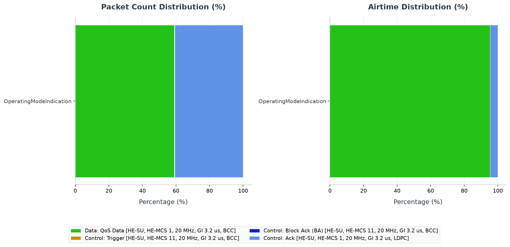

# Walkthrough - HE Operating Mode Indication (OMI)

This walkthrough shows how an 802.11ax station can change its active receive
capability without reassociating. OMI turns a costly management transition into
a small control field carried by ordinary traffic, allowing the AP scheduler to
adapt immediately to a station's power, thermal, or bandwidth constraint.

## Background: Operating Mode Indication (OMI)

In high-density 802.11ax networks, client stations (STAs) may need to dynamically adjust their operating parameters (such as the number of Receive Spatial Streams (Rx NSS) or their channel width) to save power or adapt to local thermal conditions.

Instead of performing a full, high-overhead re-association with the Access Point (AP), 802.11ax introduces **Operating Mode Indication (OMI)**:
1. **OM Control Subfield**: An OMI is carried inside the *HE variant HT Control field* of the MAC header in ordinary QoS Data or management frames.
2. **Rx NSS Constraint**: A station can announce a reduction in its Rx NSS (e.g. from 4 to 2 or 1) to conserve receiver power.
3. **Channel Width Constraint**: A station can dynamically restrict its operating channel width.
4. **UL MU Disable**: A station can disable its participation in Uplink Multi-User (UL MU-OFDMA and UL MU-MIMO) triggers, signaling to the AP coordinator that it should only be scheduled via single-user (SU) opportunities.

---

## Network Topology and Configuration

The simulation runs in a single-BSS network (`Lan80211AxUlOfdma`) where:
- **`ap`**: The Access Point.
- **`host[0..2]`**: Three wireless stations.
- **`server`**: A wired server connected to the AP.
- **Traffic**: Uplink traffic is generated from the hosts to the server (1000B payloads sent every 5ms).

The `OperatingModeIndication` config in `omnetpp.ini` is defined as:
```ini
[Config OperatingModeIndication]
description = "A non-AP HE STA sends an OM Control update selecting RX NSS 2 and disabling UL MU operation."
extends = ScheduledOnly
**.ap.wlan[*].mib.heOmControl = true
**.host[*].wlan[*].mib.heOmControl = true
**.wlan[*].mib.heTwoNav = true
**.host[0].wlan[*].mac.hcf.sendOperatingModeIndication = true
**.host[0].wlan[*].mac.hcf.operatingModeRxNss = 2
**.host[0].wlan[*].mac.hcf.operatingModeChannelWidth = 0
**.host[0].wlan[*].mac.hcf.operatingModeUlMuDisable = true
**.ap.wlan[*].mac.hcf.ulTriggerCheckInterval = 0.5s
```

### Key Parameters:
1. **`heOmControl = true`**: Enables support for the HE variant HT Control field containing OM Control subfields.
2. **`sendOperatingModeIndication = true`**: Commands `host[0]` to append the OMI HT Control subfield to its transmitted frames.
3. **`operatingModeRxNss = 2`**: `host[0]` advertises an operating Rx NSS limit of 2.
4. **`operatingModeUlMuDisable = true`**: `host[0]` requests that the AP disable scheduling it in uplink multi-user transmissions.

`host[0]` advertises two receive streams so the value is restrictive but still
allows spatial multiplexing in downlink tests. Setting `ulMuDisable` makes the
scheduler consequence unambiguous: hosts 1 and 2 remain eligible for Triggered
UL MU service, while host 0 must use a single-user opportunity. The `0.5 s`
Trigger check interval leaves time for the OMI-carrying frame to update AP state
before the next scheduling decision.

---

## Running the Simulation

Execute the simulation using Cmdenv:
```sh
bin/inet -u Cmdenv -c OperatingModeIndication examples/ieee80211ax/mac_features/operating_mode_indication/omnetpp.ini
```

---

## Verifying Results and Model Details

After running the simulation, check the results using `opp_scavetool`:
```sh
# Query packetSent at the hosts
opp_scavetool query -l -f 'name =~ "packetSent:count" and module =~ "*.host*app*"' examples/ieee80211ax/mac_features/operating_mode_indication/results/*.sca

# Query packetReceived at the server
opp_scavetool query -l -f 'name =~ "packetReceived:count" and module =~ "*.server.app*"' examples/ieee80211ax/mac_features/operating_mode_indication/results/*.sca
```

### Quantitative Summary:
- **`host[0..2].app[0] packetSent:count`**: 361 packets each (Total sent by hosts = 1083).
- **`server.app[0] packetReceived:count`**: 1073.

---

## PCAP Tshark Packet Exchange Analysis

To record PCAP traces and inspect them with TShark, run the simulation with PCAP recording and checksum computation enabled:

```sh
bin/inet -u Cmdenv -c OperatingModeIndication examples/ieee80211ax/mac_features/operating_mode_indication/omnetpp.ini --result-dir=examples/ieee80211ax/mac_features/operating_mode_indication/results --**.numPcapRecorders=1 --**.checksumMode=\"computed\" --**.fcsMode=\"computed\"
```

Use TShark to print the timeline of packet exchanges:

```sh
tshark -n -r examples/ieee80211ax/mac_features/operating_mode_indication/results/OperatingModeIndication-#0Lan80211AxUlOfdma.ap.wlan[0].pcap -c 20
```

The decoded output timeline shows:
1. **Uplink UDP Traffic**: Stations transmit UDP packets (e.g. frames 1, 2, 4) to the AP.
2. **OMI Insertion**: `host[0]` (MAC `0a:aa:00:00:00:01`) transmits data frames with the HE variant HT Control field containing the OM Control subfield (e.g. frames 6, 9, 19).
3. **AP State Update**: The AP receives these frames, extracts the OMI flags (Rx NSS 2, UL MU Disable), and updates its internal peer tracking records.

---

### Under-the-Hood OMI Exchange:
When the AP receives a frame from `host[0]` carrying the OMI field, it extracts the parameters and updates its internal peer state:
- The AP `HeHcf` coordination module stores this state in its `peerOperatingModes` map.
- If debugging is enabled, the AP logs: `Updated peer operating mode: address=<host[0]-MAC>, rxNss=2, channelWidth=0, ulMuDisable=1`.

### Qtenv Inspection:
Run the configuration in Qtenv:
```sh
bin/inet -u Qtenv -c OperatingModeIndication examples/ieee80211ax/mac_features/operating_mode_indication/omnetpp.ini
```
1. Select the AP's `ap.wlan[0].mac.hcf` module.
2. Inspect the `peerOperatingModes` watch/inspector.
3. Observe how the AP updates the entry for `host[0]`'s MAC address once the first data frame is received.

### Active OMI Scheduling Filtering:
In the INET HCF scheduler implementation, the AP coordination function parses, maintains, and respects the `peerOperatingModes` state. In the `OperatingModeIndication` run:
- The AP `HeHcf` coordination module stores this state in its `peerOperatingModes` map.
- The uplink scheduler `HeUlSchedulerBacklogBased` checks this map and actively excludes `host[0]` from the UL MU triggers because of its `ulMuDisable` OMI setting.
- This is verified by the fact that the AP only schedules `host[1]` and `host[2]` in its User Info fields (visible in verbose logs and PCAP decodes), while `host[0]` falls back to EDCA transmission.
- Similarly, the downlink scheduler respects the `rxNss` constraint when allocating streams.

The packet count confirms that traffic continues through the mode change, but
the didactic evidence is the causal chain: OM Control field, updated peer state,
then changed scheduler eligibility. A throughput comparison would mix the
energy/capability trade-off with the chosen traffic and is not the purpose of
this scenario.

<!-- BEGIN GENERATED: ieee80211ax-pcap-statistics -->
## 802.11 Packet Type Statistics


This section provides a statistical overview of the 802.11 frames transmitted over the wireless medium during the simulation. The packet counts were gathered from AP wireless-interface observation points. With multiple AP captures, one medium transmission may be observed at more than one AP; counts and airtime therefore represent recorded transmission observations, not de-duplicated application packets.

Capture session `20260718T132413Z` was generated from fresh PCAPng input with `TShark (Wireshark) 4.6.4.`. HE PPDU format, MCS, coding, bandwidth/RU, GI, and NSTS are decoded directly from standards-compliant radiotap HE fields; values not marked known by the recorder are omitted.

Two estimated airtime occupancy percentages are provided. HE-SU and HE-ER-SU use the modeled 36/44 µs preambles; a dissector-expanded A-MPDU is charged one shared preamble. HE MU/TB user-dependent signaling not exposed by radiotap remains approximate.
- **Air Time %**: This frame type's share of the sum of all estimated frame airtimes.
- **Air Time (Sim Time) %**: The sum of this frame type's estimated airtimes divided by the simulation time limit. Concurrent transmissions from multiple capture points are counted separately, so this value can exceed 100%; it is not the union of busy channel time.

### Evidence checks

| Status | Requirement | Observed evidence |
|---|---|---|
| **PASS** | OperatingModeIndication produced protocol-visible wireless observations | 2502 AP/global transmission observations |
| **INCONCLUSIVE** | OM Control value and receiver-applied width/NSS | The packet-type table is exchange evidence only; use the recorded feature vectors/results |

### Configuration: `OperatingModeIndication`
Total over-the-air frame/MPDU transmission observations (Global BSS/AP): **2502**

| Color | Frame Type & Subtype | Count | Percentage | Mean Size | Std Dev | Mean Duration | Std Dev Duration | Freq | Mean RX Sig | Mean TX Pwr | Air Time % | Air Time (Sim Time) % |
|:---:|---|---:|---:|---:|---:|---:|---:|---:|---:|---:|---:|---:|
| <svg width="16" height="16"><rect width="16" height="16" rx="3" fill="#24c219" /></svg> | Data: QoS Data [HE-SU, HE-MCS 1, 20 MHz, GI 3.2 us, BCC] | 1476 | 58.99% | 1070.0 B | 0.0 B | 621.3 us | 0.0 us | 5010 MHz | -63.0 dBm | - | 95.35% | 45.85% |
| <hr> | <hr> | <hr> | <hr> | <hr> | <hr> | <hr> | <hr> | <hr> | <hr> | <hr> | <hr> | <hr> |
| <svg width="16" height="16"><rect width="16" height="16" rx="3" fill="#d28a04" /></svg> | Control: Trigger [HE-SU, HE-MCS 11, 20 MHz, GI 3.2 us, BCC] | 3 | 0.12% | 40.0 B | 0.0 B | 38.6 us | 0.0 us | 5010 MHz | - | 10.0 dBm | 0.01% | 0.01% |
| <svg width="16" height="16"><rect width="16" height="16" rx="3" fill="#0621d0" /></svg> | Control: Block Ack (BA) [HE-SU, HE-MCS 11, 20 MHz, GI 3.2 us, BCC] | 3 | 0.12% | 46.0 B | 0.0 B | 39.0 us | 0.0 us | 5010 MHz | - | 10.0 dBm | 0.01% | 0.01% |
| <svg width="16" height="16"><rect width="16" height="16" rx="3" fill="#5e93e8" /></svg> | Control: Ack [HE-SU, HE-MCS 1, 20 MHz, GI 3.2 us, LDPC] | 1020 | 40.77% | 14.0 B | 0.0 B | 43.7 us | 0.0 us | 5010 MHz | - | 10.0 dBm | 4.63% | 2.23% |

### Analysis of Packet Distribution
The data and acknowledgment counts show traffic before and after the configured operating-mode change, but frame subtype statistics cannot expose the Operating Mode Indication element or OM Control subfield. Standard behavior must be checked from those fields and the receiver's applied channel-width/NSS state, not inferred from the packet total.
<!-- END GENERATED: ieee80211ax-pcap-statistics -->
