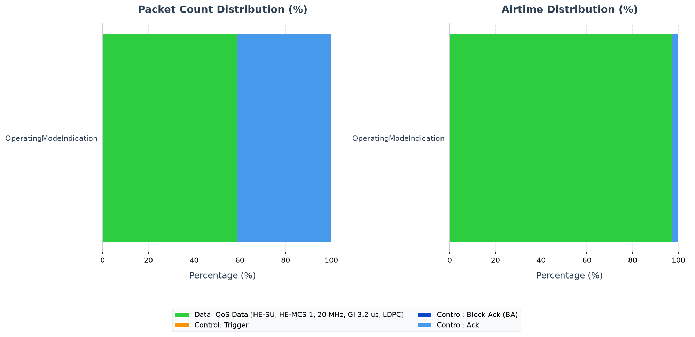

# Walkthrough: HE Operating Mode Indication

This single-BSS uplink example requests an HE Operating Mode Indication (OMI)
from `host[0]`: receive NSS 2, 20 MHz channel-width encoding 0, and UL MU
Disable. Retained traffic and packet artifacts show that the run operated, but
they do not expose the OM Control bits or the AP's updated peer state, so the
central model invariant remains `INCONCLUSIVE`.

## Learning objectives and feature primer

After completing this walkthrough, the reader can:

- explain how an HE station changes receive constraints without reassociation;
- identify Rx NSS, Channel Width, and UL MU Disable as independent OM Control
  subfields;
- trace the wrapper INI to the winning inherited configuration; and
- distinguish requested OMI parameters from transmitted bits and receiver
  state.

OMI is carried in the HE variant HT Control field. The initiator announces
operating constraints; after successful reception, the responder updates how
it addresses that peer in subsequent transmissions. This example also asks the
AP not to select `host[0]` for uplink multi-user (UL MU) operation.

## Scenario description

[omnetpp.ini](omnetpp.ini) includes
[`../../ul_ofdma/omnetpp.ini`](../../ul_ofdma/omnetpp.ini). The inherited
`Lan80211AxUlOfdma` network contains three stationary stations around one AP
and a wired server:

```text
host[0..2] ))) AP -- Ethernet -- server
```

The 2 s, 5 GHz/20 MHz HE scenario starts warm-up traffic at 0.2 s and regular
1,000-byte uplink flows at 0.3 s. `OperatingModeIndication` extends
`ScheduledOnly`; the wrapper adds no overriding assignment.

## Standards and INET model boundary

IEEE Std 802.11-2024 Clause 9.2.4.7.2 defines OM Control and its Rx NSS,
Channel Width, and UL MU Disable fields; Clause 26.9.2 defines receive
operating-mode indication and responder updates. Corpus chunks
`80211ax-2024:chunk:01495` and `:09883` were used.

INET's `HeHcfTxRx` copies configured values into an outgoing QoS header, and
the scheduler has peer operating-mode state. Those checked-out source paths
explain the intended abstraction, not proof that this retained run executed
each transition. Native capture decoding in this session does not expose the
OM Control subfields.

## Evidence status

| Claim or check | Status | Authoritative evidence | Runs/seeds | Scope or gap |
|---|---|---|---|---|
| Wrapper resolves to `OperatingModeIndication` over `ScheduledOnly` | `PASS` | include chain and `.sca` metadata | 0/0 | Configuration provenance |
| OMI values are requested for `host[0]` | `PASS` | effective inherited INI assignments | 0/0 | Input evidence only |
| OM Control bits are transmitted | `INCONCLUSIVE` | required decoded header/model signal absent | 0/0 | QoS frames exist, field does not |
| AP updates peer state and excludes host 0 from UL MU | `INCONCLUSIVE` | no peer-state/scheduler telemetry | 0/0 | Trigger subtype totals are insufficient |
| Application traffic runs | `PASS` | application scalars/vectors | 0/0 | Outcome only |
| Matched OMI-off control | `NOT RUN` | none retained | none | Needed for scheduler comparison |

Evidence basis is explicit throughout: INI values are **Configuration input**,
decoded frames/results are **Direct observation**, computed counts are
**Derived measurement**, and any proposed connection across the two retained
sessions is **Inference**.

## Configuration matrix

| Configuration | Role | Feature gate/delta | Workload/channel | Runs/seeds | Expected invariant |
|---|---|---|---|---|---|
| `OperatingModeIndication` | Treatment | OM capability on; host 0 sends Rx NSS 2, width 0, UL MU Disable 1 | three UL flows, 20 MHz | 0/0 | header carries values and AP stores/applies them |
| `ScheduledOnly` | Control | no send-OMI request | same inherited topology/workload | `NOT RUN` | host 0 remains scheduler-eligible |

Confounder: there is no retained matched control, and the treatment's
`ulTriggerCheckInterval=0.5s` is itself a delta from `ScheduledOnly`.

## Expected invariants and diagnostic map

| Invariant | Evidence and observation point | Failure symptom | Likely subsystem | Next diagnostic |
|---|---|---|---|---|
| host 0 sends OM Control values 2/0/1 | outgoing QoS header or model signal | field absent/wrong | `HeHcfTxRx` construction/serialization | targeted packet log plus header signal |
| AP updates host 0 peer state after receipt | AP peer-state transition at same timestamp | state unchanged | receiver/HCF state | co-record receive log and peer-state vector |
| UL scheduler excludes host 0 | Trigger User Info AIDs after update | host 0 remains selected | UL scheduler | decode Trigger AIDs and correlate decision log |
| application delivery remains healthy | app send/receive vectors | unexplained deficit | MAC/upper path | correlate retries and app vectors |

## Reproduction

Run from the INET repository root. This command is illustrative and was
`NOT RUN` during this revision:

```sh
bin/inet -u Cmdenv -f examples/ieee80211ax/mac_features/operating_mode_indication/omnetpp.ini \
  -c OperatingModeIndication -r 0 --seed-set=0 \
  --result-dir=examples/ieee80211ax/mac_features/operating_mode_indication/results/validation/run0
```

The suite-owned packet command below was executed with exit status 0 and
created session `20260725T230146Z`:

```sh
MPLCONFIGDIR=/tmp/matplotlib \
  python3 examples/ieee80211/analysis/analyze_pcap.py \
  --suite examples/ieee80211/analysis/suites/ax.json \
  --generate --subdir mac_features/operating_mode_indication --run 0 \
  --allow-failed-evidence
```

## Scalar and vector analysis

Inputs:
`results/scalar-vector/20260725T120411Z/OperatingModeIndication/OperatingModeIndication-#0.sca`
and `.vec`.

```sh
opp_scavetool query -l \
  -f 'type =~ vector and module =~ "*.app[*]" and (name =~ "packetSent:vector(packetBytes)" or name =~ "packetReceived:vector(packetBytes)")' \
  examples/ieee80211ax/mac_features/operating_mode_indication/results/scalar-vector/20260725T120411Z/OperatingModeIndication/OperatingModeIndication-\#0.vec
```

| Metric or invariant | Source result and module | Window/aggregation | Observation | Interpretation |
|---|---|---|---:|---|
| regular sends | each `host[*].app[1] packetSent` | full run, per app | 341 each | all three offered flows ran |
| server receives | `server.app[0] packetReceived` | full run, single-run count | 1,023 | equals three regular-flow counts |

Every vector sample is 1,000 B. These are single-run outcome observations, not
independent repetitions and not OMI mechanism telemetry.

No plot: the retained results contain application totals but no OM Control or
peer-state telemetry, so a chart would not distinguish the operating-mode
mechanism.

## PCAP statistics

Capture point: AP `wlan[0]`; PCAPng/radiotap, microsecond precision, computed
checksum/FCS session; TShark 4.6.4.

```sh
tshark -n \
  -r 'examples/ieee80211ax/mac_features/operating_mode_indication/results/packet-statistics/20260725T230146Z/OperatingModeIndication/OperatingModeIndication-#0Lan80211AxUlOfdma.ap.wlan[0].pcap' \
  -q -z io,stat,0
```

| Configuration | Observation count | Relevant frame summary | Interpretation limit |
|---|---:|---|---|
| `OperatingModeIndication` | 2,507 | 1,481 QoS Data, 3 Trigger, 3 BA, 1,020 Ack | subtype totals do not expose OMI or scheduler state |

Rows are AP-interface observations, not de-duplicated end-to-end packets.

<!-- BEGIN GENERATED: ieee80211ax-pcap-statistics -->
### Generated PCAP plots and tables


Figure provenance: [`packet_statistics.png.json`](../../analysis/figures/mac_features/operating_mode_indication/packet_statistics.png.json).

This section provides a statistical overview of the 802.11 frames transmitted over the wireless medium during the simulation. The packet counts were gathered from AP wireless-interface observation points. With multiple AP captures, one medium transmission may be observed at more than one AP; counts and airtime therefore represent recorded transmission observations, not de-duplicated application packets.

Capture session `20260725T230146Z` was generated from fresh PCAPng input with `TShark (Wireshark) 4.6.4.`. The selected manifest is `examples/ieee80211/analysis/generated/ax/pcapmanifests/20260725T230146Z.json` (SHA-256 `0d035ac61814b337adac2d40e6ed117ad0905f17be8cd5db6d653540c5b3a9b7`). HE PPDU format, MCS, coding, bandwidth/RU, GI, and NSTS are decoded directly from standards-compliant radiotap HE fields; values not marked known by the recorder are omitted.

Two estimated airtime occupancy percentages are provided. HE-SU and HE-ER-SU use the modeled 36/44 µs preambles; a dissector-expanded A-MPDU is charged one shared preamble. HE MU/TB user-dependent signaling not exposed by radiotap remains approximate.
- **Air Time %**: This frame type's share of the sum of all estimated frame airtimes.
- **Air Time (Sim Time) %**: The sum of this frame type's estimated airtimes divided by the simulation time limit. Concurrent transmissions from multiple capture points are counted separately, so this value can exceed 100%; it is not the union of busy channel time.

#### Compact cross-configuration summary

| Configuration | Observation point / counting unit | Selection/filter | Observations | Dominant decoded frame/PHY evidence | Estimated airtime / sim time | Limits |
|---|---|---|---:|---|---:|---|
| `OperatingModeIndication` | AP interface(s); capture observations<br>`examples/ieee80211ax/mac_features/operating_mode_indication/results/packet-statistics/20260725T230146Z/OperatingModeIndication/OperatingModeIndication-#0Lan80211AxUlOfdma.ap.wlan[0].pcap` | `none (all decoded frames)` | 2489 | Data: QoS Data [HE-SU, HE-MCS 1, 20 MHz, GI 3.2 us, LDPC] (1460), Control: Ack (1023), Control: Trigger (3) | 46.63% | Not delivery or de-duplicated transmissions; unknown PHY fields stay unknown |

### Evidence checks

| Status | Requirement | Observed evidence |
|---|---|---|
| **PASS** | OperatingModeIndication produced protocol-visible wireless observations | 2489 AP/global transmission observations |
| **INCONCLUSIVE** | OM Control value and receiver-applied width/NSS | The packet-type table is exchange evidence only; use the recorded feature vectors/results |

### Configuration: `OperatingModeIndication`
Total over-the-air frame/MPDU transmission observations (Global BSS/AP): **2489**

| Color | Frame Type & Subtype | Count | Percentage | Mean Size | Std Dev | Mean Duration | Std Dev Duration | Freq | Mean RX Sig | Mean TX Pwr | Air Time % | Air Time (Sim Time) % |
|:---:|---|---:|---:|---:|---:|---:|---:|---:|---:|---:|---:|---:|
| <svg width="16" height="16"><rect width="16" height="16" rx="3" fill="#2cce3f" /></svg> | Data: QoS Data [HE-SU, HE-MCS 1, 20 MHz, GI 3.2 us, LDPC] | 1460 | 58.66% | 1070.0 B | 0.0 B | 621.3 us | 0.0 us | 5010 MHz | -62.9 dBm | - | 97.27% | 45.35% |
| <hr> | <hr> | <hr> | <hr> | <hr> | <hr> | <hr> | <hr> | <hr> | <hr> | <hr> | <hr> | <hr> |
| <svg width="16" height="16"><rect width="16" height="16" rx="3" fill="#f99406" /></svg> | Control: Trigger | 3 | 0.12% | 40.0 B | 0.0 B | 33.3 us | 0.0 us | 5010 MHz | - | 10.0 dBm | 0.01% | 0.01% |
| <svg width="16" height="16"><rect width="16" height="16" rx="3" fill="#0946c8" /></svg> | Control: Block Ack (BA) | 3 | 0.12% | 46.0 B | 0.0 B | 35.3 us | 0.0 us | 5010 MHz | - | 10.0 dBm | 0.01% | 0.01% |
| <svg width="16" height="16"><rect width="16" height="16" rx="3" fill="#4799eb" /></svg> | Control: Ack | 1023 | 41.10% | 14.0 B | 0.0 B | 24.7 us | 0.0 us | 5010 MHz | - | 10.0 dBm | 2.71% | 1.26% |

#### Representative frame-exchange timeline

| Frame | Simulation time (s) | Transmitter → receiver | Type/PHY | Decisive fields | Role in exchange |
|---:|---:|---|---|---|---|
| `OperatingModeIndication-#0Lan80211AxUlOfdma.ap.wlan[0].pcap:1` | 0.200644000 | 0a:aa:00:00:00:01 → 10:00:00:00:00:00 | Data: QoS Data / HE-SU, HE-MCS 1, 20 MHz, NSS 1, GI 3.2 us, LDPC | direction=to DS, retry=0, seq=0, frag=0, more-frag=0, TID=6 | Carries protocol-visible MAC payload in the representative exchange. |
| `OperatingModeIndication-#0Lan80211AxUlOfdma.ap.wlan[0].pcap:2` | 0.201370000 | 0a:aa:00:00:00:02 → 10:00:00:00:00:00 | Data: QoS Data / HE-SU, HE-MCS 1, 20 MHz, NSS 1, GI 3.2 us, LDPC | direction=to DS, retry=1, seq=0, frag=0, more-frag=0, TID=6 | Carries protocol-visible MAC payload in the representative exchange. |
| `OperatingModeIndication-#0Lan80211AxUlOfdma.ap.wlan[0].pcap:3` | 0.201418000 | ? → 0a:aa:00:00:00:02 | Control: Ack / Legacy/HT/VHT | direction=direct/IBSS, retry=0, seq=-, frag=-, more-frag=0, TID=- | Acknowledges the preceding unicast frame. |
| `OperatingModeIndication-#0Lan80211AxUlOfdma.ap.wlan[0].pcap:4` | 0.202105000 | 0a:aa:00:00:00:03 → 10:00:00:00:00:00 | Data: QoS Data / HE-SU, HE-MCS 1, 20 MHz, NSS 1, GI 3.2 us, LDPC | direction=to DS, retry=1, seq=0, frag=0, more-frag=0, TID=6 | Carries protocol-visible MAC payload in the representative exchange. |
| `OperatingModeIndication-#0Lan80211AxUlOfdma.ap.wlan[0].pcap:5` | 0.202153000 | ? → 0a:aa:00:00:00:03 | Control: Ack / Legacy/HT/VHT | direction=direct/IBSS, retry=0, seq=-, frag=-, more-frag=0, TID=- | Acknowledges the preceding unicast frame. |
| `OperatingModeIndication-#0Lan80211AxUlOfdma.ap.wlan[0].pcap:6` | 0.202849000 | 0a:aa:00:00:00:01 → 10:00:00:00:00:00 | Data: QoS Data / HE-SU, HE-MCS 1, 20 MHz, NSS 1, GI 3.2 us, LDPC | direction=to DS, retry=1, seq=0, frag=0, more-frag=0, TID=6 | Carries protocol-visible MAC payload in the representative exchange. |
| `OperatingModeIndication-#0Lan80211AxUlOfdma.ap.wlan[0].pcap:7` | 0.202897000 | ? → 0a:aa:00:00:00:01 | Control: Ack / Legacy/HT/VHT | direction=direct/IBSS, retry=0, seq=-, frag=-, more-frag=0, TID=- | Acknowledges the preceding unicast frame. |
| `OperatingModeIndication-#0Lan80211AxUlOfdma.ap.wlan[0].pcap:8` | 0.300644000 | 0a:aa:00:00:00:01 → 10:00:00:00:00:00 | Data: QoS Data / HE-SU, HE-MCS 1, 20 MHz, NSS 1, GI 3.2 us, LDPC | direction=to DS, retry=0, seq=1, frag=0, more-frag=0, TID=6 | Carries protocol-visible MAC payload in the representative exchange. |
| `OperatingModeIndication-#0Lan80211AxUlOfdma.ap.wlan[0].pcap:9` | 0.301370000 | 0a:aa:00:00:00:01 → 10:00:00:00:00:00 | Data: QoS Data / HE-SU, HE-MCS 1, 20 MHz, NSS 1, GI 3.2 us, LDPC | direction=to DS, retry=1, seq=1, frag=0, more-frag=0, TID=6 | Carries protocol-visible MAC payload in the representative exchange. |
| `OperatingModeIndication-#0Lan80211AxUlOfdma.ap.wlan[0].pcap:10` | 0.301418000 | ? → 0a:aa:00:00:00:01 | Control: Ack / Legacy/HT/VHT | direction=direct/IBSS, retry=0, seq=-, frag=-, more-frag=0, TID=- | Acknowledges the preceding unicast frame. |
| `OperatingModeIndication-#0Lan80211AxUlOfdma.ap.wlan[0].pcap:11` | 0.302105000 | 0a:aa:00:00:00:03 → 10:00:00:00:00:00 | Data: QoS Data / HE-SU, HE-MCS 1, 20 MHz, NSS 1, GI 3.2 us, LDPC | direction=to DS, retry=1, seq=1, frag=0, more-frag=0, TID=6 | Carries protocol-visible MAC payload in the representative exchange. |
| `OperatingModeIndication-#0Lan80211AxUlOfdma.ap.wlan[0].pcap:12` | 0.302831000 | 0a:aa:00:00:00:02 → 10:00:00:00:00:00 | Data: QoS Data / HE-SU, HE-MCS 1, 20 MHz, NSS 1, GI 3.2 us, LDPC | direction=to DS, retry=1, seq=1, frag=0, more-frag=0, TID=6 | Carries protocol-visible MAC payload in the representative exchange. |
| `OperatingModeIndication-#0Lan80211AxUlOfdma.ap.wlan[0].pcap:13` | 0.302879000 | ? → 0a:aa:00:00:00:02 | Control: Ack / Legacy/HT/VHT | direction=direct/IBSS, retry=0, seq=-, frag=-, more-frag=0, TID=- | Acknowledges the preceding unicast frame. |
| `OperatingModeIndication-#0Lan80211AxUlOfdma.ap.wlan[0].pcap:14` | 0.303620000 | 0a:aa:00:00:00:03 → 10:00:00:00:00:00 | Data: QoS Data / HE-SU, HE-MCS 1, 20 MHz, NSS 1, GI 3.2 us, LDPC | direction=to DS, retry=1, seq=1, frag=0, more-frag=0, TID=6 | Carries protocol-visible MAC payload in the representative exchange. |
| `OperatingModeIndication-#0Lan80211AxUlOfdma.ap.wlan[0].pcap:15` | 0.303668000 | ? → 0a:aa:00:00:00:03 | Control: Ack / Legacy/HT/VHT | direction=direct/IBSS, retry=0, seq=-, frag=-, more-frag=0, TID=- | Acknowledges the preceding unicast frame. |
| `OperatingModeIndication-#0Lan80211AxUlOfdma.ap.wlan[0].pcap:16` | 0.305644000 | 0a:aa:00:00:00:01 → 10:00:00:00:00:00 | Data: QoS Data / HE-SU, HE-MCS 1, 20 MHz, NSS 1, GI 3.2 us, LDPC | direction=to DS, retry=0, seq=2, frag=0, more-frag=0, TID=6 | Carries protocol-visible MAC payload in the representative exchange. |

Frame numbers are local to the named capture, not OMNeT++ event numbers. For readability, the table collapses observations with the same timestamp and MAC identity across capture interfaces; aggregate PCAP statistics retain the original observation counts.

### Analysis of Packet Distribution
The data and acknowledgment counts show traffic before and after the configured operating-mode change, but frame subtype statistics cannot expose the Operating Mode Indication element or OM Control subfield. Standard behavior must be checked from those fields and the receiver's applied channel-width/NSS state, not inferred from the packet total.
<!-- END GENERATED: ieee80211ax-pcap-statistics -->

## Frame exchange analysis

```sh
tshark -n \
  -r 'examples/ieee80211ax/mac_features/operating_mode_indication/results/packet-statistics/20260725T230146Z/OperatingModeIndication/OperatingModeIndication-#0Lan80211AxUlOfdma.ap.wlan[0].pcap' \
  -Y 'frame.number <= 10' -T fields -E header=y -E separator='|' \
  -e frame.number -e frame.time_epoch -e wlan.sa -e wlan.da \
  -e wlan.fc.type_subtype -e _ws.col.Info
```

| Frame | Simulation time | Transmitter → receiver | Type/PHY | Decisive fields | Role in exchange |
|---:|---:|---|---|---|---|
| 1 | 0.200644 s | host 0 → AP | QoS Data | OM Control not exported | first host-0 observation; not OMI proof |
| 2 | 0.201370 s | host 1 → AP | QoS Data | OM Control not exported | comparison station |
| 3 | 0.201418 s | AP → station | Ack | immediate response | confirms a MAC exchange, not peer-state update |

The missing decisive field makes this timeline diagnostic rather than a
passing feature exchange. TShark frame numbers are not simulator event numbers.

## Cross-layer findings and verdict

| Claim | Verdict | Configuration evidence | Model telemetry | Packet evidence | Outcome evidence |
|---|---|---|---|---|---|
| host 0 was configured to initiate OMI | `PASS` | values 2/0/true | absent | QoS exchange only | traffic present |
| AP applied the indication | `INCONCLUSIVE` | capability requested | peer state absent | OM bits/AID scheduling absent | delivery cannot prove it |

The overall verdict is `INCONCLUSIVE`. Configuration proves intent; the
retained packet and application sessions do not close the mechanism chain.

## Limitations and inconclusive claims

- No decoded OM Control bits, AP peer-state transition, or scheduler-decision
  vector is retained.
- No matched OMI-off control is retained.
- Scalar/vector and packet evidence come from separate sessions.
- The smallest resolving run co-records outgoing OM fields, AP peer state,
  Trigger AIDs, and application vectors for treatment and `ScheduledOnly`.

## Further experiments

- Run an OMI-off control with the same seed and trigger interval.
- Set only UL MU Disable false; host 0 should reappear in eligible Trigger AIDs.
- Exercise `OmiRxNssReduction` and directly check AP stream allocation for host
  0, not aggregate throughput.

## Implementation plan

| Item | Evidence-backed plan |
|---|---|
| Demonstrated gap | OM fields and receiver/scheduler state are not retained as direct evidence |
| Intended behavior | expose Clause 26.9.2 update and subsequent scheduling constraint |
| Smallest change surface | operating-mode analysis plugin; model signals only if capture cannot represent the state |
| Observability | transmitted OM values, peer-state update, eligible/selected AIDs |
| Validation | treatment/control seed 0, timestamp ordering, then bounded seeds |
| Compatibility and risks | preserve existing scheduler behavior; do not infer state from capability flags |
| Architecture and sealing | architecture/seal review required before any `src/inet` change; none is authorized here |
| Next handoff | analysis owner, then HCF owner if runtime signals are required |

## Artifact provenance

| Artifact family | Session/path | Configurations/runs | Tool/filter/window | Integrity notes |
|---|---|---|---|---|
| Scalar/vector | `results/scalar-vector/20260725T120411Z/` | treatment 0/0 | `opp_scavetool`, full run | `.sca` names wrapper INI/network |
| PCAP/log | `results/packet-statistics/20260725T230146Z/` | treatment run 0 | TShark 4.6.4, AP `wlan[0]` | manifest and hashes in generated block |
| Standards | `80211ax-2024` corpus | IEEE Std 802.11-2024 | chunks `01495`, `09883` | PDF not needed |
