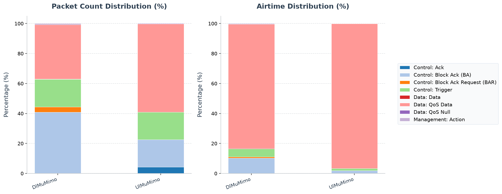

# Walkthrough - HE MU-MIMO (Downlink and Uplink)

This walkthrough shows how 802.11ax MU-MIMO increases capacity by assigning
different spatial streams to several stations on the same frequency resource.
OFDMA separates users in frequency; MU-MIMO reuses that frequency in space.
The example therefore checks both the stream allocation and the resulting
application-level gain over matched single-user or OFDMA controls.

## What the experiment demonstrates

The examples demonstrate both the required MU-MIMO structure and an
application-level aggregate delivery advantage over matched EDCA controls:

- `DlMuMimo` sounds the stations, then sends three users on the same 242-tone
  RU with one stream each at starting stream indices 0, 1, and 2.
- `UlMuMimo` sends Basic Triggers assigning the same 242-tone RU and disjoint
  stream ranges to as many as three stations. The stations answer with
  simultaneous HE TB QoS Data PPDUs and the AP acknowledges the exchange.
- `DlMuMimo80MHz` extends the same mechanism to eight stations and an
  eight-antenna AP.
- The serialized Basic Trigger contains the spatial-stream allocation, TID
  Aggregation Limit, and Preferred AC fields that TShark decodes.

The results below were generated with release INET libraries on 2026-07-15.

## IEEE 802.11 expectations

The relevant normative requirements are:

- Clause 27.3.1.1: DL MU permits an AP to transmit to multiple non-AP STAs and
  UL MU permits it to receive from multiple non-AP STAs simultaneously.
- Clause 27.3.2.5: full-bandwidth DL MU-MIMO uses one RU spanning the PPDU
  bandwidth and signals each user's spatial-stream allocation.
- Clauses 26.7.1 and 26.7.3, including Figure 26-8: DL MU-MIMO obtains channel
  state information using NDP Announcement, sounding NDP, BFRP Trigger, and
  compressed beamforming/CQI feedback.
- Clause 9.3.1.22.2 and Figures 9-93, 9-94, and 9-96: Trigger User Info carries
  RU allocation, starting spatial stream, number of spatial streams, TID
  Aggregation Limit, and Preferred AC.
- Clauses 26.5.2.3 and 27.3.11.12: a Basic Trigger supplies the common HE TB
  duration and per-user RU, MCS, stream, and target-RSSI parameters.
- Clause 27.3.3.2.4: UL MU-MIMO users receive non-overlapping stream ranges,
  with no more than four streams per user and eight in total.
- Clauses 10.3.2.13.3 and 26.4.4.5: QoS Data in an HE TB UL MU exchange can be
  acknowledged immediately with a Multi-STA BlockAck.

The searchable standards-corpus evidence used for this validation includes
`80211ax-2024:chunk:01666`, `01670`, `01673`, `01674`, `05102`, `09778`,
`09796`, and `09805`. The source PDF was not needed.

The observable invariants are therefore:

1. DL sounding precedes an HE MU PPDU containing multiple users on one
   full-bandwidth RU with disjoint spatial-stream ranges.
2. A UL Basic Trigger identifies multiple stations on one full-bandwidth RU
   with disjoint stream ranges, followed by simultaneous HE TB responses.
3. A performance claim compares the same topology, traffic, interval, seed,
   channel, and application payload.

## Configurations and matched controls

- `DlMuMimo`: 20 MHz, three stations, four-antenna AP, DL sounding and
  full-bandwidth MU-MIMO.
- `SuEdcaBaseline`: the matched 20 MHz DL single-user control.
- `DlMuMimo80MHz`: 80 MHz, eight stations, eight-antenna AP.
- `UlMuMimo`: 20 MHz, three saturated uplinks, four-antenna AP, 1.5 ms HE TB
  budget, and full-bandwidth UL MU-MIMO.
- `EdcaBaseline`: the same saturated UL workload using EDCA only.

The focused `uplink.ini` sets the application interval to `0.5 ms` in both UL
configurations. This deliberately keeps all three station queues backlogged:
without simultaneous demand, spatial multiplexing has nothing to combine and
its sounding and Trigger overhead can dominate. The `1.5 ms` HE TB duration is
long enough to amortize Trigger and Block Ack overhead, fits the voice TXOP,
and remains below the standard's `5.484 ms` PPDU limit.

`SuEdcaBaseline80MHz` is not a matched control for `DlMuMimo80MHz`: it has
three stations instead of eight and must not be used for a performance ratio.

## Run reproducible scalar/vector comparisons

Run one configuration and run number at a time:

```sh
mkdir -p results/validation/dl-mu results/validation/dl-su
mkdir -p results/validation/ul-mu results/validation/ul-su

bin/inet -u Cmdenv -c DlMuMimo -r 0 \
    --warmup-period=0.7s \
    --result-dir=results/validation/dl-mu \
    examples/ieee80211ax/multi_user/mu_mimo/downlink.ini

bin/inet -u Cmdenv -c SuEdcaBaseline -r 0 \
    --warmup-period=0.7s \
    --result-dir=results/validation/dl-su \
    examples/ieee80211ax/multi_user/mu_mimo/downlink.ini

bin/inet -u Cmdenv -c UlMuMimo -r 0 \
    --result-dir=results/validation/ul-mu \
    examples/ieee80211ax/multi_user/mu_mimo/uplink.ini

bin/inet -u Cmdenv -c EdcaBaseline -r 0 \
    --result-dir=results/validation/ul-su \
    examples/ieee80211ax/multi_user/mu_mimo/uplink.ini
```

Repeat with `--seed-set=1` and separate result directories.

### Application results from `.sca`

```sh
opp_scavetool query -l \
    -f 'name =~ "packetReceived:count" and module =~ "*.host*app*"' \
    results/validation/dl-mu/DlMuMimo-#0.sca \
    results/validation/dl-su/SuEdcaBaseline-#0.sca

opp_scavetool query -l \
    -f 'name =~ "endToEndDelay:histogram" and module =~ "*.host*app*"' \
    results/validation/dl-mu/DlMuMimo-#0.sca \
    results/validation/dl-su/SuEdcaBaseline-#0.sca

opp_scavetool query -l \
    -f 'name =~ "packetReceived:count" and module =~ "*.server.app*"' \
    results/validation/ul-mu/UlMuMimo-#0.sca \
    results/validation/ul-su/EdcaBaseline-#0.sca

opp_scavetool query -l \
    -f 'name =~ "endToEndDelay:histogram" and module =~ "*.server.app*"' \
    results/validation/ul-mu/UlMuMimo-#0.sca \
    results/validation/ul-su/EdcaBaseline-#0.sca
```

Two deterministic seeds produced:

| Direction | Seed | MU delivered | EDCA delivered | Delivery gain | MU mean delay | EDCA mean delay |
| --- | ---: | ---: | ---: | ---: | ---: | ---: |
| DL | 0 | 14640 | 2796 | 423.6% | 6.31 ms | 16.91 ms |
| DL | 1 | 14640 | 2823 | 418.6% | 6.28 ms | 16.87 ms |
| UL | 0 | 2378 | 1677 | 41.8% | 200.35 ms | 270.69 ms |
| UL | 1 | 2385 | 1715 | 39.1% | 199.72 ms | 268.24 ms |

The five-seed campaign compares 20 MHz DL MU-MIMO over
`0.55–0.88 s` against the OFDMA control. The result vectors report
`38.982 Mbps` for MU-MIMO and `23.568 Mbps` for OFDMA. MU-MIMO uses the
model's calibrated default inter-user CSI leakage of 0.01. The structural
multi-user and disjoint-stream checks in the next section remain essential;
this is not a universal performance ranking.

### Internal HE PHY and scheduler vectors from `.vec`/`.sca`

Application counts alone do not prove MU-MIMO. Query the HE metadata:

```sh
opp_scavetool query -l \
    -f 'module =~ "*.ap.wlan[0].radio" and (name =~ "heRuToneSize:vector" or name =~ "heStaId:vector" or name =~ "heSpatialStreams:vector" or name =~ "heStreamStartIndex:vector")' \
    results/validation/dl-mu/DlMuMimo-#0.vec

opp_scavetool query -l \
    -f 'module =~ "*.ap.wlan[0].mac.hcf.ulCoordinator" and (name =~ "heUlScheduledUsers:*" or name =~ "heUlBasicTriggerSent:*")' \
    results/validation/ul-mu/UlMuMimo-#0.sca

opp_scavetool query -l \
    -f 'type =~ vector and module =~ "*.host*.wlan[0].radio" and (name =~ "heRuToneSize:vector" or name =~ "heStaId:vector" or name =~ "heSpatialStreams:vector" or name =~ "heStreamStartIndex:vector")' \
    results/validation/ul-mu/UlMuMimo-#0.vec
```

For DL seed 0, each AP-radio user vector has 921 records. RU tone size is 242
for every record; STA IDs range from 1 to 3; NSS is always one; and starting
stream indices range from 0 to 2. The aligned records form 307 three-user
full-bandwidth MU-MIMO PPDUs.

For UL seed 0, the AP records 458 Basic Triggers, 1358 scheduled-user
allocations, and a maximum of three users per Trigger. Seed 1 records 438,
1297, and three respectively. Station-radio vectors show 242-tone, one-stream
HE TB transmissions at starting stream indices 0, 1, and 2. Initial BSRP and
occasional single-user allocations account for the small-RU records.

Use CSV export to inspect aligned times and values:

```sh
opp_scavetool export -F CSV-R -o results/validation/dl-he-phy.csv \
    -f 'module =~ "*.ap.wlan[0].radio" and (name =~ "heRuToneSize:vector" or name =~ "heStaId:vector" or name =~ "heSpatialStreams:vector" or name =~ "heStreamStartIndex:vector")' \
    results/validation/dl-mu/DlMuMimo-#0.vec
```

## Record and inspect native IEEE 802.11 captures

Use PCAPng, nanosecond timestamps, and computed checksums/FCS. The files keep a
`.pcap` suffix, but `capinfos` identifies them as PCAPng.

```sh
mkdir -p results/validation/pcap-dl results/validation/pcap-ul

bin/inet -u Cmdenv -c DlMuMimo -r 0 \
    --result-dir=results/validation/pcap-dl \
    '--**.numPcapRecorders=1' \
    '--**.pcapRecorder[*].moduleNamePatterns="wlan[0]"' \
    '--**.pcapRecorder[*].dumpProtocols="ieee80211mac"' \
    '--**.pcapRecorder[*].fileFormat="pcapng"' \
    '--**.pcapRecorder[*].timePrecision=9' \
    '--**.pcapRecorder[*].alwaysFlush=true' \
    '--**.pcapRecorder[*].verbose=false' \
    '--**.checksumMode="computed"' \
    '--**.fcsMode="computed"' \
    examples/ieee80211ax/multi_user/mu_mimo/downlink.ini

bin/inet -u Cmdenv -c UlMuMimo -r 0 \
    --result-dir=results/validation/pcap-ul \
    '--**.numPcapRecorders=1' \
    '--**.pcapRecorder[*].moduleNamePatterns="wlan[0]"' \
    '--**.pcapRecorder[*].dumpProtocols="ieee80211mac"' \
    '--**.pcapRecorder[*].fileFormat="pcapng"' \
    '--**.pcapRecorder[*].timePrecision=9' \
    '--**.pcapRecorder[*].alwaysFlush=true' \
    '--**.pcapRecorder[*].verbose=false' \
    '--**.checksumMode="computed"' \
    '--**.fcsMode="computed"' \
    examples/ieee80211ax/multi_user/mu_mimo/uplink.ini
```

```sh
DL_PCAP='results/validation/pcap-dl/DlMuMimo-#0Lan80211AxDlOfdma.ap.wlan[0].pcap'
UL_PCAP='results/validation/pcap-ul/UlMuMimo-#0Lan80211AxUlOfdma.ap.wlan[0].pcap'

capinfos "$DL_PCAP"
capinfos "$UL_PCAP"
```

The validated AP captures contain 3611 DL packets and 4508 UL packets, use
IEEE 802.11 encapsulation, have nanosecond precision, and are strictly ordered.

### Downlink sounding

```sh
tshark -n -r "$DL_PCAP" \
    -Y 'wlan.trigger.he.trigger_type == 1' \
    -T fields -E header=y -E separator=, -E occurrence=a \
    -e frame.number -e frame.time_epoch \
    -e wlan.trigger.he.user_info.aid12 \
    -e wlan.trigger.he.ru_allocation \
    -e wlan.trigger.he.ul_fec_coding_type \
    -e _ws.col.Info
```

Seed 0 contains seven BFRP Triggers. The first appears at 0.300624062 s for
AIDs 2, 3, and 1; later polls also include all three beamformees. The exchange is
preceded by the NDP Announcement and sounding NDP and followed by compressed
beamforming feedback, matching Figure 26-8. Native MAC captures do not contain
radiotap/HE-SIG-B metadata, so use the AP HE vectors for the DL stream indices.

### Uplink Basic Trigger and simultaneous data

```sh
tshark -n -r "$UL_PCAP" \
    -Y 'wlan.trigger.he.trigger_type == 0' \
    -T fields -E header=y -E separator=, -E occurrence=a \
    -e frame.number -e frame.time_epoch \
    -e wlan.trigger.he.user_info.aid12 \
    -e wlan.trigger.he.ru_allocation \
    -e wlan.trigger.he.ru_starting_spatial_stream \
    -e wlan.trigger.he.ru_number_of_spatial_stream \
    -e wlan.trigger.he.tid_aggregation_limit \
    -e wlan.trigger.he.preferred_ac \
    -e _ws.col.Info
```

The capture contains 458 decoded Basic Triggers. Frame 170 at 0.361001785 s
identifies AIDs 3, 2, and 1, assigns RU allocation 61 (the full 242-tone RU) to
all three, and decodes starting streams 0, 1, and 2. The encoded NSS values are
0, 0, and 0, meaning one spatial stream per user; the TID Aggregation Limit is
one for every user.

Inspect the following frames:

```sh
tshark -n -r "$UL_PCAP" \
    -Y 'frame.number >= 170 && frame.number <= 174' \
    -T fields -E separator=, \
    -e frame.number -e frame.time_epoch -e wlan.fc.type_subtype \
    -e wlan.sa -e wlan.da -e _ws.col.Info
```

Frames 171, 172, and 173 are 1000-byte QoS Data frames from the three stations at
0.362517900-0.362518005 s; frame 174 is the AP's Block Ack response. The capture
therefore corroborates the Trigger structure and actual simultaneous payload
delivery rather than only QoS Null responses.

## 80 MHz completion check

```sh
bin/inet -u Cmdenv -c DlMuMimo80MHz -r 0 \
    --warmup-period=0.7s \
    examples/ieee80211ax/multi_user/mu_mimo/downlink.ini
```

The run reaches the 1 s simulation limit. Its eight receivers deliver 1500
packets each with mean delay of approximately `0.48 ms`.

## How to read the result

MU-MIMO's advantage comes from simultaneous spatial streams, not from a faster
MCS or wider channel. That is why the 20 MHz comparison keeps bandwidth and
traffic fixed and why the vector checks are essential. The `38.982 Mbps`
MU-MIMO result versus `23.568 Mbps` for OFDMA is credible only together with
the observed three users, common 242-tone RU, and non-overlapping stream
indices. Sounding cost, channel correlation, station capability, and a light
load can all reduce or eliminate this advantage in another workload.

## 802.11 Packet Type Statistics


This section provides a statistical overview of the 802.11 frames transmitted over the wireless medium during the simulation. The packet counts were gathered from the Access Point's wireless interface (`ap.wlan[0]`), which captures all uplink, downlink, and management traffic in the BSS without duplication.

Two airtime occupancy percentages are provided:
- **Air Time %**: The percentage of the total transmission airtime of all packets occupied by this frame type.
- **Air Time (Sim Time) %**: The percentage of the total simulation time occupied by the transmission of this frame type (defined as the sum of physical airtimes of this frame type w.r.t. the total simulation time limit).

### Configuration: `DlMuMimo`
Total over-the-air packets captured (Global BSS/AP): **3826**

| Frame Type & Subtype | Count | Percentage | Mean Size | Std Dev | Mean Duration | Std Dev Duration | Freq | Mean RX Sig | Mean TX Pwr | Air Time % | Air Time (Sim Time) % |
|---|---:|---:|---:|---:|---:|---:|---:|---:|---:|---:|---:|
| Control: Block Ack (BA) | 1553 | 40.59% | 32.0 B | 0.0 B | 30.7 us | 0.0 us | 5010 MHz | -65.1 dBm | - | 10.21% | 4.76% |
| Data: QoS Data | 1386 | 36.23% | 283.4 B | 117.9 B | 279.0 us | 64.5 us | 5010 MHz | - | 20.0 dBm | 82.93% | 38.67% |
| Control: Trigger | 707 | 18.48% | 46.2 B | 1.5 B | 35.4 us | 0.5 us | 5010 MHz | - | 20.0 dBm | 5.37% | 2.50% |
| Control: Block Ack Request (BAR) | 136 | 3.55% | 24.0 B | 0.0 B | 28.0 us | 0.0 us | 5010 MHz | - | 20.0 dBm | 0.82% | 0.38% |
| Management: Action | 28 | 0.73% | 35.0 B | 1.2 B | 66.6 us | 1.7 us | 5003 MHz, 5005 MHz, 5007 MHz, 5010 MHz, 5013 MHz, 5015 MHz | -65.1 dBm | 20.0 dBm | 0.40% | 0.19% |
| Control: Ack | 9 | 0.24% | 14.0 B | 0.0 B | 24.7 us | 0.0 us | 5010 MHz | -65.3 dBm | 20.0 dBm | 0.05% | 0.02% |
| Data: Data | 7 | 0.18% | 53.7 B | 4.2 B | 153.4 us | 2.3 us | 5010 MHz | - | 20.0 dBm | 0.23% | 0.11% |

### Configuration: `UlMuMimo`
Total over-the-air packets captured (Global BSS/AP): **4320**

| Frame Type & Subtype | Count | Percentage | Mean Size | Std Dev | Mean Duration | Std Dev Duration | Freq | Mean RX Sig | Mean TX Pwr | Air Time % | Air Time (Sim Time) % |
|---|---:|---:|---:|---:|---:|---:|---:|---:|---:|---:|---:|
| Data: QoS Data | 2544 | 58.89% | 1070.0 B | 0.0 B | 709.3 us | 0.0 us | 5010 MHz | -63.7 dBm | - | 96.52% | 90.22% |
| Control: Trigger | 792 | 18.33% | 46.0 B | 1.5 B | 35.3 us | 0.5 us | 5010 MHz | - | 10.0 dBm | 1.50% | 1.40% |
| Control: Block Ack (BA) | 791 | 18.31% | 57.9 B | 1.2 B | 39.3 us | 0.4 us | 5010 MHz | - | 10.0 dBm | 1.66% | 1.55% |
| Control: Ack | 183 | 4.24% | 14.0 B | 0.0 B | 24.7 us | 0.0 us | 5010 MHz | - | 10.0 dBm | 0.24% | 0.23% |
| Data: QoS Null | 10 | 0.23% | 34.0 B | 0.0 B | 142.6 us | 0.0 us | 5002 MHz, 5003 MHz, 5004 MHz, 5006 MHz, 5010 MHz | -64.0 dBm | - | 0.08% | 0.07% |

### Analysis of Packet Distribution
Across these configurations, **QoS Data** frames constitute the primary payload delivery mechanism, while **Block Ack (BA)** and **Block Ack Request (BAR)** control frames ensure reliable transport via the MAC-level acknowledgment protocol. Management frames, specifically **Beacons**, are transmitted periodically by the Access Point to maintain BSS time synchronization and broadcast network capabilities. The ratio of control/management overhead to actual data frames indicates the relative MAC efficiency of the chosen configurations.
