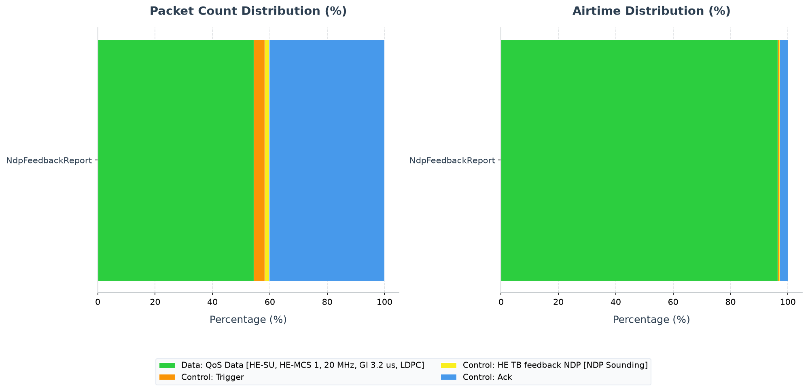

# Walkthrough: HE NDP Feedback Report

This example isolates the Null Data Packet (NDP) Feedback Report procedure in a
single-BSS HE uplink network. The retained AP capture directly decodes 99 NDP
Feedback Report Poll (NFRP) Triggers and shows groups of three simultaneous
radiotap-only, zero-PSDU observations 88 microseconds later. The Trigger-type
and timing invariant passes; station identity and feedback bits remain
unavailable and are explicitly inconclusive.

## Learning objectives and feature primer

After completing this walkthrough, the reader can:

- explain how an NFRP Trigger solicits compact feedback without ordinary data;
- identify Trigger Type 7 and the simultaneous HE TB feedback NDP response;
- understand why an empty PSDU can appear as a radiotap-only capture record;
- reproduce the decisive timeline; and
- separate the passing exchange invariant from undecoded response content.

An access point (AP) sends an NFRP Trigger containing feedback resource
information. Selected non-AP stations respond after a short interframe space
(SIFS) using HE trigger-based (HE TB) feedback NDPs. These responses have PHY
content but no MAC service data unit, so native MAC capture needs explicit
empty-packet recording.

## Scenario description

[omnetpp.ini](omnetpp.ini) includes
[`../../ul_ofdma/omnetpp.ini`](../../ul_ofdma/omnetpp.ini) and adds
`pcapRecorder.recordEmptyPackets=true`. The inherited configuration is
`NdpFeedbackReport extends ScheduledOnly`.

```text
host[0] \
host[1]  ))) AP -- Ethernet -- server
host[2] /
```

The nodes are stationary in a 50 m square; host distances from the AP are
5 m. The 2 s scenario uses 5 GHz/20 MHz HE radios, no external interference,
and periodic 20 ms AP checks while ordinary UL application traffic is also
active. The control exchange, not UDP delivery, is the feature under test.

## Standards and INET model boundary

IEEE Std 802.11-2024 Table 9-47 assigns Trigger Type value 7 to NFRP. Clause
26.5.7 defines the NDP feedback report procedure and HE TB feedback NDP
response; Annex G.5 summarizes the sequence as NFRP Trigger followed by one or
more HE TB feedback NDPs. Corpus chunks are
`80211ax-2024:chunk:01661`, `:09820`, `:09821`, and `:11847`.

INET models preamble-only feedback responses and can record their radiotap
metadata without a PSDU. TShark decodes the Trigger type, but the response
records in this capture contain only a 31-byte radiotap header: they do not
identify station, feedback resource, or feedback bits. Timing/group size are
direct observations; classifying each empty record as a particular station's
valid report is inference.

## Evidence status

| Claim or check | Status | Authoritative evidence | Runs/seeds | Scope or gap |
|---|---|---|---|---|
| Wrapper resolves and empty-packet recording is enabled | `PASS` | include chain, local `[General]`, `.sca` metadata | 0/0 | Configuration provenance |
| AP transmits NFRP Trigger Type 7 | `PASS` | `wlan.trigger.he.trigger_type == 7` | 0/0 | 99 direct AP-capture observations |
| Three simultaneous empty responses follow representative polls | `PASS` | frame timestamps/lengths | 0/0 | Direct timing/count observation |
| Empty records are valid feedback from host 0/1/2 with decoded content | `INCONCLUSIVE` | no MAC identity or feedback bits | 0/0 | Capture-format limit |
| Application traffic runs | `PASS` | application vectors/scalars | 0/0 | Not feature proof |
| Matched NFRP-disabled control | `NOT RUN` | none retained | none | Needed for outcome comparison |

## Configuration matrix

| Configuration | Role | Feature gate/delta | Workload/channel | Runs/seeds | Expected invariant |
|---|---|---|---|---|---|
| `NdpFeedbackReport` | Treatment | capability on; AP enabled; 20 ms check; empty capture on | three UL flows, 20 MHz | 0/0 | type-7 Trigger followed after SIFS by feedback NDP observations |
| `ScheduledOnly` | Negative control | NFRP disabled | matched inherited network | `NOT RUN` | no type-7 Trigger/empty-response groups |
| `FeedbackUnderInterference` | Stress case | host 0 transmit power reduced | otherwise inherited treatment | `NOT RUN` | fewer/changed response observations, with direct receiver evidence |

## Expected invariants and diagnostic map

| Invariant | Evidence and observation point | Failure symptom | Likely subsystem | Next diagnostic |
|---|---|---|---|---|
| Trigger Type is 7 | AP PCAP `wlan.trigger.he.trigger_type` | no type-7 frame | HCF trigger generation/capability negotiation | inspect negotiated capability and `HeHcf` log |
| responses begin after SIFS | AP PCAP timestamps | wrong/missing offset | station response scheduling | narrow event log around one Trigger |
| expected selected stations respond | per-station capture/model telemetry | wrong count/identity | UL plan/PHY reception | co-record station-side response signal and AP reception |
| no acknowledgment follows NDP feedback | timeline | Ack/BA generated for feedback NDP | frame-sequence policy | inspect post-response HCF transition |

## Reproduction

Run from the INET repository root. This command was `NOT RUN` during this
documentation revision:

```sh
bin/inet -u Cmdenv -f examples/ieee80211ax/multi_user/ndp_feedback/omnetpp.ini \
  -c NdpFeedbackReport -r 0 --seed-set=0 \
  --result-dir=examples/ieee80211ax/multi_user/ndp_feedback/results/validation/run0 \
  '--**.numPcapRecorders=1' \
  '--**.pcapRecorder[*].moduleNamePatterns="wlan[0]"' \
  '--**.pcapRecorder[*].dumpProtocols="ieee80211mac"' \
  '--**.checksumMode="computed"' '--**.fcsMode="computed"'
```

The suite-owned packet command below was executed with exit status 0 and
created session `20260725T230505Z`:

```sh
MPLCONFIGDIR=/tmp/matplotlib \
  python3 examples/ieee80211/analysis/analyze_pcap.py \
  --suite examples/ieee80211/analysis/suites/ax.json \
  --generate --subdir multi_user/ndp_feedback --run 0 \
  --allow-failed-evidence
```

## Scalar and vector analysis

Inputs:
`results/scalar-vector/20260725T120411Z/NdpFeedbackReport/NdpFeedbackReport-#0.sca`
and `.vec`.

```sh
opp_scavetool query -l \
  -f 'name =~ "packetSent:count" or name =~ "packetReceived:count" or name =~ "packetSentToPeer:count"' \
  examples/ieee80211ax/multi_user/ndp_feedback/results/scalar-vector/20260725T120411Z/NdpFeedbackReport/NdpFeedbackReport-\#0.sca
```

| Metric or invariant | Source | Window/aggregation | Observation | Interpretation |
|---|---|---|---:|---|
| regular app sends | each `host[*].app[1]` | full run, per app | 341 | ordinary load ran |
| server receives | `server.app[0]` | full run | 1,023 | all regular vector counts represented |
| HCF `packetSentToPeer` | AP and each host HCF | full run | AP 1,122; hosts 742/778/782 | unclassified MAC totals only |

This is single-run evidence. HCF counts do not identify Trigger types or NDP
responses and are not pooled as repetitions. The inherited UL configuration
sets no warm-up period, so the listed scalar counts use the full 0-2 s run;
the application staging (warm-up packets at 0.2 s and regular traffic from
0.3 s) is described rather than silently removed. The NFRP timeline query also
uses the full capture because the feature starts at 0.020036 s.

No plot: the retained scalar totals do not identify NDP feedback responses or
their station identities, so they cannot support a mechanism-focused
comparison.

## PCAP statistics

Capture: AP `wlan[0]`, PCAPng/radiotap, microsecond precision, computed
checksum/FCS session; TShark 4.6.4. SHA-256:
`8e60e2015b3ef805955f08a90ac16952aed066532f5a5bde1a966d13acb64cbc`.

| Configuration | Observation count | Relevant frame/PHY summary | Interpretation limit |
|---|---:|---|---|
| `NdpFeedbackReport` | 2,543 | 99 type-7 NFRP Triggers; 39 radiotap-only records; 1,382 QoS Data; 1,023 Ack | response identity/content unknown |

Counts are capture observations. A radiotap-only record is not an MPDU.

<!-- BEGIN GENERATED: ieee80211ax-pcap-statistics -->
### Generated PCAP plots and tables


Figure provenance: [`packet_statistics.png.json`](packet_statistics.png.json).

This section provides a statistical overview of the 802.11 frames transmitted over the wireless medium during the simulation. The packet counts were gathered from AP wireless-interface observation points. With multiple AP captures, one medium transmission may be observed at more than one AP; counts and airtime therefore represent recorded transmission observations, not de-duplicated application packets.

Capture session `20260725T230505Z` was generated from fresh PCAPng input with `TShark (Wireshark) 4.6.4.`. The selected manifest is `examples/ieee80211/analysis/generated/ax/pcapmanifests/20260725T230505Z.json` (SHA-256 `9bc5a139a0fd90e3b776fcd383ed68c20d2206b20062c282b66c01b520c85cb5`). HE PPDU format, MCS, coding, bandwidth/RU, GI, and NSTS are decoded directly from standards-compliant radiotap HE fields; values not marked known by the recorder are omitted.

Two estimated airtime occupancy percentages are provided. HE-SU and HE-ER-SU use the modeled 36/44 µs preambles; a dissector-expanded A-MPDU is charged one shared preamble. HE MU/TB user-dependent signaling not exposed by radiotap remains approximate.
- **Air Time %**: This frame type's share of the sum of all estimated frame airtimes.
- **Air Time (Sim Time) %**: The sum of this frame type's estimated airtimes divided by the simulation time limit. Concurrent transmissions from multiple capture points are counted separately, so this value can exceed 100%; it is not the union of busy channel time.

#### Compact cross-configuration summary

| Configuration | Observation point / counting unit | Selection/filter | Observations | Dominant decoded frame/PHY evidence | Estimated airtime / sim time | Limits |
|---|---|---|---:|---|---:|---|
| `NdpFeedbackReport` | AP interface(s); capture observations<br>`examples/ieee80211ax/multi_user/ndp_feedback/results/packet-statistics/20260725T230505Z/NdpFeedbackReport/NdpFeedbackReport-#0Lan80211AxUlOfdma.ap.wlan[0].pcap` | `none (all decoded frames)` | 2543 | Data: QoS Data [HE-SU, HE-MCS 1, 20 MHz, GI 3.2 us, LDPC] (1382), Control: Ack (1023), Control: Trigger (99) | 44.49% | Not delivery or de-duplicated transmissions; unknown PHY fields stay unknown |

### Evidence checks

| Status | Requirement | Observed evidence |
|---|---|---|
| **PASS** | NdpFeedbackReport produced protocol-visible wireless observations | 2543 AP/global transmission observations |
| **INCONCLUSIVE** | Trigger Type 7 and matching NDP feedback allocation | The packet-type table is exchange evidence only; use the recorded feature vectors/results |

### Configuration: `NdpFeedbackReport`
Total over-the-air frame/MPDU transmission observations (Global BSS/AP): **2543**

| Color | Frame Type & Subtype | Count | Percentage | Mean Size | Std Dev | Mean Duration | Std Dev Duration | Freq | Mean RX Sig | Mean TX Pwr | Air Time % | Air Time (Sim Time) % |
|:---:|---|---:|---:|---:|---:|---:|---:|---:|---:|---:|---:|---:|
| <svg width="16" height="16"><rect width="16" height="16" rx="3" fill="#2cce3f" /></svg> | Data: QoS Data [HE-SU, HE-MCS 1, 20 MHz, GI 3.2 us, LDPC] | 1382 | 54.35% | 1070.0 B | 0.0 B | 621.3 us | 0.0 us | 5010 MHz | -63.0 dBm | - | 96.50% | 42.93% |
| <hr> | <hr> | <hr> | <hr> | <hr> | <hr> | <hr> | <hr> | <hr> | <hr> | <hr> | <hr> | <hr> |
| <svg width="16" height="16"><rect width="16" height="16" rx="3" fill="#f99406" /></svg> | Control: Trigger | 99 | 3.89% | 34.0 B | 0.0 B | 31.3 us | 0.0 us | 5010 MHz | - | 10.0 dBm | 0.35% | 0.16% |
| <svg width="16" height="16"><rect width="16" height="16" rx="3" fill="#f9ee1f" /></svg> | Control: HE TB feedback NDP [NDP Sounding] | 39 | 1.53% | 0.0 B | 0.0 B | 72.0 us | 0.0 us | 5010 MHz | -75.0 dBm | - | 0.32% | 0.14% |
| <svg width="16" height="16"><rect width="16" height="16" rx="3" fill="#4799eb" /></svg> | Control: Ack | 1023 | 40.23% | 14.0 B | 0.0 B | 24.7 us | 0.0 us | 5010 MHz | - | 10.0 dBm | 2.84% | 1.26% |

#### Representative frame-exchange timeline

| Frame | Simulation time (s) | Transmitter → receiver | Type/PHY | Decisive fields | Role in exchange |
|---:|---:|---|---|---|---|
| `NdpFeedbackReport-#0Lan80211AxUlOfdma.ap.wlan[0].pcap:1` | 0.020036000 | 10:00:00:00:00:00 → ff:ff:ff:ff:ff:ff | Control: Trigger / Legacy/HT/VHT | direction=direct/IBSS, retry=0, seq=-, frag=-, more-frag=0, TID=- | Coordinates the following HE multi-user response. |
| `NdpFeedbackReport-#0Lan80211AxUlOfdma.ap.wlan[0].pcap:5` | 0.040036000 | 10:00:00:00:00:00 → ff:ff:ff:ff:ff:ff | Control: Trigger / Legacy/HT/VHT | direction=direct/IBSS, retry=0, seq=-, frag=-, more-frag=0, TID=- | Coordinates the following HE multi-user response. |
| `NdpFeedbackReport-#0Lan80211AxUlOfdma.ap.wlan[0].pcap:9` | 0.060036000 | 10:00:00:00:00:00 → ff:ff:ff:ff:ff:ff | Control: Trigger / Legacy/HT/VHT | direction=direct/IBSS, retry=0, seq=-, frag=-, more-frag=0, TID=- | Coordinates the following HE multi-user response. |
| `NdpFeedbackReport-#0Lan80211AxUlOfdma.ap.wlan[0].pcap:13` | 0.080036000 | 10:00:00:00:00:00 → ff:ff:ff:ff:ff:ff | Control: Trigger / Legacy/HT/VHT | direction=direct/IBSS, retry=0, seq=-, frag=-, more-frag=0, TID=- | Coordinates the following HE multi-user response. |
| `NdpFeedbackReport-#0Lan80211AxUlOfdma.ap.wlan[0].pcap:17` | 0.100036000 | 10:00:00:00:00:00 → ff:ff:ff:ff:ff:ff | Control: Trigger / Legacy/HT/VHT | direction=direct/IBSS, retry=0, seq=-, frag=-, more-frag=0, TID=- | Coordinates the following HE multi-user response. |
| `NdpFeedbackReport-#0Lan80211AxUlOfdma.ap.wlan[0].pcap:21` | 0.120036000 | 10:00:00:00:00:00 → ff:ff:ff:ff:ff:ff | Control: Trigger / Legacy/HT/VHT | direction=direct/IBSS, retry=0, seq=-, frag=-, more-frag=0, TID=- | Coordinates the following HE multi-user response. |
| `NdpFeedbackReport-#0Lan80211AxUlOfdma.ap.wlan[0].pcap:25` | 0.140036000 | 10:00:00:00:00:00 → ff:ff:ff:ff:ff:ff | Control: Trigger / Legacy/HT/VHT | direction=direct/IBSS, retry=0, seq=-, frag=-, more-frag=0, TID=- | Coordinates the following HE multi-user response. |
| `NdpFeedbackReport-#0Lan80211AxUlOfdma.ap.wlan[0].pcap:29` | 0.160036000 | 10:00:00:00:00:00 → ff:ff:ff:ff:ff:ff | Control: Trigger / Legacy/HT/VHT | direction=direct/IBSS, retry=0, seq=-, frag=-, more-frag=0, TID=- | Coordinates the following HE multi-user response. |
| `NdpFeedbackReport-#0Lan80211AxUlOfdma.ap.wlan[0].pcap:33` | 0.180036000 | 10:00:00:00:00:00 → ff:ff:ff:ff:ff:ff | Control: Trigger / Legacy/HT/VHT | direction=direct/IBSS, retry=0, seq=-, frag=-, more-frag=0, TID=- | Coordinates the following HE multi-user response. |
| `NdpFeedbackReport-#0Lan80211AxUlOfdma.ap.wlan[0].pcap:37` | 0.200036000 | 10:00:00:00:00:00 → ff:ff:ff:ff:ff:ff | Control: Trigger / Legacy/HT/VHT | direction=direct/IBSS, retry=0, seq=-, frag=-, more-frag=0, TID=- | Coordinates the following HE multi-user response. |
| `NdpFeedbackReport-#0Lan80211AxUlOfdma.ap.wlan[0].pcap:38` | 0.201379000 | 0a:aa:00:00:00:01 → 10:00:00:00:00:00 | Data: QoS Data / HE-SU, HE-MCS 1, 20 MHz, NSS 1, GI 3.2 us, LDPC | direction=to DS, retry=1, seq=0, frag=0, more-frag=0, TID=6 | Carries protocol-visible MAC payload in the representative exchange. |
| `NdpFeedbackReport-#0Lan80211AxUlOfdma.ap.wlan[0].pcap:39` | 0.202105000 | 0a:aa:00:00:00:02 → 10:00:00:00:00:00 | Data: QoS Data / HE-SU, HE-MCS 1, 20 MHz, NSS 1, GI 3.2 us, LDPC | direction=to DS, retry=1, seq=0, frag=0, more-frag=0, TID=6 | Carries protocol-visible MAC payload in the representative exchange. |
| `NdpFeedbackReport-#0Lan80211AxUlOfdma.ap.wlan[0].pcap:40` | 0.202153000 | ? → 0a:aa:00:00:00:02 | Control: Ack / Legacy/HT/VHT | direction=direct/IBSS, retry=0, seq=-, frag=-, more-frag=0, TID=- | Acknowledges the preceding unicast frame. |
| `NdpFeedbackReport-#0Lan80211AxUlOfdma.ap.wlan[0].pcap:41` | 0.202894000 | 0a:aa:00:00:00:01 → 10:00:00:00:00:00 | Data: QoS Data / HE-SU, HE-MCS 1, 20 MHz, NSS 1, GI 3.2 us, LDPC | direction=to DS, retry=1, seq=0, frag=0, more-frag=0, TID=6 | Carries protocol-visible MAC payload in the representative exchange. |
| `NdpFeedbackReport-#0Lan80211AxUlOfdma.ap.wlan[0].pcap:42` | 0.203638000 | 0a:aa:00:00:00:01 → 10:00:00:00:00:00 | Data: QoS Data / HE-SU, HE-MCS 1, 20 MHz, NSS 1, GI 3.2 us, LDPC | direction=to DS, retry=1, seq=0, frag=0, more-frag=0, TID=6 | Carries protocol-visible MAC payload in the representative exchange. |
| `NdpFeedbackReport-#0Lan80211AxUlOfdma.ap.wlan[0].pcap:43` | 0.203686000 | ? → 0a:aa:00:00:00:01 | Control: Ack / Legacy/HT/VHT | direction=direct/IBSS, retry=0, seq=-, frag=-, more-frag=0, TID=- | Acknowledges the preceding unicast frame. |

Frame numbers are local to the named capture, not OMNeT++ event numbers. For readability, the table collapses observations with the same timestamp and MAC identity across capture interfaces; aggregate PCAP statistics retain the original observation counts.

### Analysis of Packet Distribution
The capture contains both **Trigger** frames and zero-length HE TB feedback NDP observations, consistent with the NDP Feedback Report Poll exchange defined by IEEE Std 802.11-2024 Clause 26.5.7 and Annex G.5. One NFRP Trigger can allocate multiple feedback resources, so the counts need not be one-to-one. The generic Control-subtype label does not by itself prove Trigger Type 7; verify the Trigger field or simulator NFRP telemetry when conformance detail matters.
<!-- END GENERATED: ieee80211ax-pcap-statistics -->

## Frame exchange analysis

```sh
tshark -n \
  -r 'examples/ieee80211ax/multi_user/ndp_feedback/results/packet-statistics/20260725T230505Z/NdpFeedbackReport/NdpFeedbackReport-#0Lan80211AxUlOfdma.ap.wlan[0].pcap' \
  -Y 'wlan.trigger.he.trigger_type == 7 || frame.len == 31' \
  -T fields -E header=y -E separator='|' -E occurrence=a \
  -e frame.number -e frame.time_epoch -e frame.len -e wlan.sa -e wlan.da \
  -e wlan.trigger.he.trigger_type -e wlan.trigger.he.user_info.aid12 -e _ws.col.Info
```

| Frame | Simulation time | Transmitter → receiver | Type/PHY | Decisive fields | Role in exchange |
|---:|---:|---|---|---|---|
| 1 | 0.020036 s | AP → scheduled STAs | Trigger | Trigger Type 7 | NFRP poll |
| 2 | 0.020124 s | unknown STA → AP observation | radiotap-only | length 31, no PSDU | first simultaneous feedback observation |
| 3 | 0.020124 s | unknown STA → AP observation | radiotap-only | length 31, no PSDU | second observation |
| 4 | 0.020124 s | unknown STA → AP observation | radiotap-only | length 31, no PSDU | third observation |
| 5 | 0.040036 s | AP → scheduled STAs | Trigger | Trigger Type 7 | next 20 ms poll |

Frames 2-4 occur 88 microseconds after frame 1 and at the same timestamp.
This directly establishes the representative ordering and simultaneous
observation group. It does not expose SIFS as a named field, station identity,
or successful feedback-bit interpretation. TShark frame numbers are not
OMNeT++ event numbers.

## Cross-layer findings and verdict

| Claim | Verdict | Configuration evidence | Model telemetry | Packet evidence | Outcome evidence |
|---|---|---|---|---|---|
| NFRP exchange executes | `PASS` | feature requested/enabled | generic HCF totals only | type 7 plus following simultaneous empty observations | n/a |
| responses belong to three specific stations and convey valid feedback | `INCONCLUSIVE` | three capable stations requested | absent | identity/content absent | UDP results irrelevant |

The bounded verdict is `PASS` for protocol-visible Trigger type and response
timing/group structure, and `INCONCLUSIVE` for response identity and content.

## Limitations and inconclusive claims

- Only 39 radiotap-only records are retained despite 99 NFRP Triggers; the
  document does not infer loss, scheduling policy, or capture suppression from
  this mismatch.
- The response PHY/user facts are unknown under the typed fail-closed rule.
- No matched control or stress-run artifacts are retained.
- Scalar/vector and PCAP evidence are from separate sessions.
- A resolving run needs station-side response signals and AP receive outcome
  correlated with the existing type-7 timeline.

## Further experiments

- Run `ScheduledOnly` with empty-packet recording; expect zero type-7 polls and
  zero causally paired empty groups.
- Run `FeedbackUnderInterference`; predict host 0's AP-receive evidence changes
  while other stations' response signals remain.
- Sweep only `ulTriggerCheckInterval`; poll spacing should follow the value,
  while response offset remains protocol-timing constrained.

## Implementation plan

| Item | Evidence-backed plan |
|---|---|
| Demonstrated gap | response identity/content and Trigger-to-response accounting are not observable |
| Intended behavior | expose Clause 26.5.7 scheduled responder and AP reception facts |
| Smallest change surface | NFRP feature plugin plus existing capture provenance; model signals only where zero-PSDU capture cannot carry identity |
| Observability | selected AIDs, station response emission, AP reception/result, timing |
| Validation | treatment/control/stress seed 0, exact type/timing/count invariant, then bounded seeds |
| Compatibility and risks | preserve empty-packet semantics and fail closed on absent PHY fields |
| Architecture and sealing | review required before any `src/inet` change; none authorized here |
| Next handoff | analysis plugin owner, then PHY/HCF owner if runtime telemetry is required |

## Artifact provenance

| Artifact family | Session/path | Configurations/runs | Tool/filter/window | Integrity notes |
|---|---|---|---|---|
| Scalar/vector | `results/scalar-vector/20260725T120411Z/` | run 0/seed 0 | `opp_scavetool`, full run | wrapper/network bound in `.sca` |
| PCAP/log | `results/packet-statistics/20260725T230505Z/` | run 0 | TShark 4.6.4, filter above | manifest and hashes in generated block |
| Standards | `80211ax-2024` corpus | IEEE Std 802.11-2024 | chunks named above | PDF not needed |
