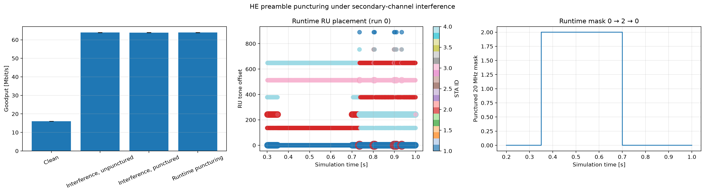

# HE preamble puncturing walkthrough

<!-- BEGIN SCRIPT RESULTS SESSIONS -->
`[script]` results sessions:

- Scalar/vector: `20260725T120411Z`
- PCAP: `20260725T230436Z`
<!-- END SCRIPT RESULTS SESSIONS -->

`[agent]` results sessions: `20260725T120411Z`, `20260725T230436Z`.

This walkthrough teaches how an 802.11ax access point (AP) disables a
20 MHz part of a wider channel and keeps scheduled resource units (RUs) out
of that region. The retained evidence directly shows INET's mask and
allocation telemetry and five-run delivery outcomes; the packet capture
shows HE exchanges but does not export the puncturing mask.

## [agent] Learning objectives and feature primer

After completing this walkthrough, the reader can:

- explain why preamble puncturing preserves usable spectrum around a busy
  secondary subchannel;
- identify INET's punctured-mask and RU-placement vectors;
- distinguish model telemetry from radiotap-decoded PHY facts; and
- reproduce the treatment and diagnose a mask/allocation violation.

Preamble puncturing lets an HE multi-user (HE-MU) transmission omit selected
20 MHz subchannels of an 80 or 160 MHz channel. The scheduler must then place
RUs only in enabled frequency regions. The learning outcome is to trace
configured mask → recorded mask → RU placement → delivery. The validation
outcome is a scoped `PASS` for recorded runtime mask changes and retained
delivery, but only `INCONCLUSIVE` packet-level mask validation.

## [agent] Scenario description

[Lan80211AxHeFeatures.ned](Lan80211AxHeFeatures.ned) extends the common
single-BSS topology with one wired UDP server, one AP, four stationary STAs,
and an optional legacy interferer. [omnetpp.ini](omnetpp.ini) sends downlink
UDP to all four STAs from 0.3 s over an 80 MHz, 5.2 GHz channel. The
interference treatments place a continuous 20 MHz 802.11a transmitter on the
second subchannel; `DynamicPuncturing` activates both jammer and mask during
the middle of the 1 s run.

```text
server -- Ethernet --> AP == 80 MHz HE MU ==> host[0..3]
                         X second 20 MHz <== legacy interferer
```

## [agent] Standards and INET model boundary

IEEE Std 802.11-2024 describes HE PHY preamble puncturing in Clause 27 and
enumerates 80/160 MHz punctured `CH_BANDWIDTH` values in Table 27-1
(`80211ax-2024:chunk:10001`); Table 27-21 carries the corresponding HE-SIG-A
encoding (`80211ax-2024:chunk:10158`). INET represents the requested mask as
an HCF string and records mask and RU tone geometry as model vectors.
Radiotap HE fields authoritatively expose only known MCS/BW/RU facts; the
retained analyzer explicitly reports that subtype counts cannot establish
mask transitions or RU non-overlap.

## [agent] Evidence status

| Claim or check | Status | Authoritative evidence | Runs/seeds | Scope or gap |
|---|---|---|---|---|
| dynamic puncturing changes runtime mask | `PASS` | `hePuncturedSubchannelMask:vector` values 0 and 2 | `DynamicPuncturing` 0--4 | direct model telemetry |
| RU placement can be checked against mask | `PASS` | timestamp-aligned mask, tone offset/size, STA ID vectors | retained campaign | model-level allocation evidence |
| capture directly decodes puncturing mask | `INCONCLUSIVE` | AP PCAP and generated evidence check | `PreamblePuncturing` run 0 | decisive mask absent from table |
| puncturing improves goodput under interference | `INCONCLUSIVE` | five-run goodput CIs | four configs, 0--4 | interference CIs overlap |

## [agent] Configuration matrix

| Configuration | Role | Feature gate/delta | Workload/channel | Runs/seeds | Expected invariant |
|---|---|---|---|---|---|
| `CleanChannelBaseline` | clean reference | no jammer, no mask | downlink; 80 MHz | 0--4 | full-band delivery |
| `LegacyInterferenceWithoutPuncturing` | negative control | jammer, empty mask | matched 80 MHz load | 0--4 | no puncture telemetry |
| `PreamblePuncturingUnderInterference` | treatment | jammer; static `"0100"` mask | matched 80 MHz load | 0--4 | allocations avoid subchannel index 1 |
| `DynamicPuncturing` | transition treatment | mask 0→2→0; jammer 0.3--0.7 s | matched 80 MHz load | 0--4 | mask changes during active interval |

The interference rows inherit `BccBaseline` and then override width, bitrate,
LDPC support, explicit interferer, and offered load. `CleanChannelBaseline`
does not inherit the 0.5 ms interference workload override and its 16 Mbps
goodput is therefore confounded; it is not a capacity control for the other
three rows. Seeds are retained as result attributes, not inferred here.

## [agent] Expected invariants and diagnostic map

| Invariant | Evidence and observation point | Failure symptom | Likely subsystem | Next diagnostic |
|---|---|---|---|---|
| mask follows configured interval | AP `hePuncturedSubchannelMask:vector` | missing 0→2→0 transition | HCF dynamic puncturing | inspect effective times and HCF logs |
| no RU overlaps masked 20 MHz region | aligned tone offset/size and mask vectors | allocation crosses disabled region | HE DL scheduler / RU allocator | export same-timestamp tuples |
| HE frames remain protocol-visible | AP PCAP known HE fields | empty/undecoded capture | recorder / radiotap encoding | inspect `radiotap.he.data_*_known` |

## [agent] Reproduction

Run from the repository root:

```sh
bin/inet -u Cmdenv -f examples/ieee80211ax/packet_extension/omnetpp.ini \
  -c DynamicPuncturing -r 0 \
  --result-dir=examples/ieee80211ax/packet_extension/results/manual/DynamicPuncturing
```

The direct `DynamicPuncturing` command was not executed and remains `NOT RUN`.
The suite-owned `BccBaseline`/`PreamblePuncturing` packet command below was
executed with exit status 0 and created session `20260725T230436Z`:

```sh
python3 examples/ieee80211/analysis/analyze_pcap.py \
  --suite examples/ieee80211/analysis/suites/ax.json \
  --generate --subdir he_features --run 0 --allow-failed-evidence
```

## [agent] Scalar and vector analysis

Inputs:
`results/20260725T120411Z/{configuration}/*.{sca,vec}`.
Figure provenance:
[puncturing-frequency-allocation.png.json](../analysis/figures/he_features/puncturing-frequency-allocation.png.json).

```sh
opp_scavetool query -l \
  -f 'name =~ "hePuncturedSubchannelMask:vector" OR name =~ "heRuToneOffset:vector" OR name =~ "heRuToneSize:vector" OR name =~ "heStaId:vector" OR name =~ "packetReceived:vector(packetBytes)"' \
  examples/ieee80211ax/packet_extension/results/20260725T120411Z/*/*.sca \
  examples/ieee80211ax/packet_extension/results/20260725T120411Z/*/*.vec
```

| Metric | Window/aggregation | Clean | unpunctured interference | punctured interference | dynamic | Interpretation |
|---|---|---:|---:|---:|---:|---|
| aggregate goodput | per-run application bytes, then mean ± 95% t-CI over 5 runs | 16.000 ± 0.000 Mbps | 63.931 ± 0.033 | 63.902 ± 0.043 | 63.921 ± 0.033 | outcome; interference rows overlap |
| puncture mask | event vector | — | empty/0 | configured nonzero | values 0 and 2 | mechanism telemetry |

The plot provenance lists all input hashes. Interpret tone offset, tone size,
STA ID, and mask only at aligned timestamps. Five runs support variability of
goodput; vector samples within a run are not repetitions.
For the runtime treatment, the HCF resolves the mask when scheduling: the AP
records mask 0 before the secondary-channel interferer, mask 2 while it is
active, and mask 0 afterward. The retained PCAP does not expose enough HE PHY
state to establish that transition, so mask timing and RU placement remain
model-vector evidence.

<!-- BEGIN GENERATED: ieee80211-scalar-vector-puncturing -->
### [script] Generated scalar/vector plot and table



Figure provenance: [`../analysis/figures/he_features/puncturing-frequency-allocation.png.json`](../analysis/figures/he_features/puncturing-frequency-allocation.png.json). Run-level metric source: [`../analysis/metrics.json`](../analysis/metrics.json).

Common table provenance:

- Source result filters / modules / units: vector / **.app[*] / packetReceived:vector(packetBytes) / unit=B<br>vector / **.ap.wlan[0].radio / heRuToneOffset:vector<br>vector / **.ap.wlan[0].radio / heRuToneSize:vector<br>vector / **.ap.wlan[0].radio / heStaId:vector<br>vector / **.ap.wlan[0].radio / hePuncturedSubchannelMask:vector
- Window / per-run aggregation / exclusions: [0.3, 0.95) s; goodput=per run with 95% Student-t CI; telemetry=representative run 0
- Independent runs: run-level summaries: n=5; direct observations: no independent-run estimate

| Configuration / observation | Mean or direct value | 95% CI half-width |
|---|---:|---:|
| Clean / goodput mbps | 16 | 0 |
| Interference, punctured / goodput mbps | 63.9015 | 0.0432241 |
| Interference, unpunctured / goodput mbps | 63.9311 | 0.0334812 |
| Runtime puncturing / goodput mbps | 63.9212 | 0.0334812 |
| Runtime puncturing / observed masks | [0, 2] | — |

The table is a presentation view of the session-bound run-level summary; the common provenance applies to every row.
<!-- END GENERATED: ieee80211-scalar-vector-puncturing -->

## [agent] PCAP statistics

Capture point: `Lan80211AxHeFeatures.ap.wlan[0]`

Capture:
`results/20260725T230436Z/PreamblePuncturing/PreamblePuncturing-#0Lan80211AxHeFeatures.ap.wlan[0].pcap`

Scope: legacy PCAP AP observations, simulation timestamps, TShark 4.6.4;
FCS/checksum settings are not retained.

```sh
tshark -n -r \
  'examples/ieee80211ax/packet_extension/results/20260725T230436Z/PreamblePuncturing/PreamblePuncturing-#0Lan80211AxHeFeatures.ap.wlan[0].pcap' \
  -Y 'frame.number <= 8' -T fields -E header=y -E separator='|' \
  -e frame.number -e frame.time_epoch -e wlan.ta -e wlan.ra \
  -e wlan.fc.type_subtype -e radiotap.he.data_1.data_mcs_known \
  -e radiotap.he.data_3.data_mcs \
  -e radiotap.he.data_1.data_bw_ru_allocation_known \
  -e radiotap.he.data_5.data_bw_ru_allocation
```

The generated block below is exhaustive packet-population evidence and is
preserved verbatim; it is subordinate to the mechanism vectors.

<!-- REWRITE-PREFIX-END -->

<!-- BEGIN GENERATED: ieee80211ax-pcap-statistics -->
### [script] Generated PCAP plots and tables


Figure provenance: [`packet_statistics.png.json`](../analysis/figures/he_features/packet_statistics.png.json).

This section provides a statistical overview of the 802.11 frames transmitted over the wireless medium during the simulation. The packet counts were gathered from AP wireless-interface observation points. With multiple AP captures, one medium transmission may be observed at more than one AP; counts and airtime therefore represent recorded transmission observations, not de-duplicated application packets.

Capture session `20260725T230436Z` was generated from fresh PCAPng input with `TShark (Wireshark) 4.6.4.`. The selected manifest is `examples/ieee80211/analysis/generated/ax/pcapmanifests/20260725T230436Z.json` (SHA-256 `8f10d5f0a1625b4fab5cf5e8e5c39883699d96589306b181cbdc4dacfc264a86`). HE PPDU format, MCS, coding, bandwidth/RU, GI, and NSTS are decoded directly from standards-compliant radiotap HE fields; values not marked known by the recorder are omitted.

Two estimated airtime occupancy percentages are provided. HE-SU and HE-ER-SU use the modeled 36/44 µs preambles; a dissector-expanded A-MPDU is charged one shared preamble. HE MU/TB user-dependent signaling not exposed by radiotap remains approximate.
- **Air Time %**: This frame type's share of the sum of all estimated frame airtimes.
- **Air Time (Sim Time) %** (and **Estimated airtime / sim time** in the summary table): The sum of estimated frame airtimes divided by the simulation time limit. Parallel multi-user transmissions (e.g., OFDMA resource units or MU-MIMO spatial streams) and concurrent observations across multiple capture points are summed per transmission/RU, so this cumulative metric can exceed 100%; it is not the union of busy channel time.

#### [script] Compact cross-configuration summary

Observation point: Access Point (AP) wireless interfaces.

| Configuration | Selection/filter | Observations | Dominant decoded frame/PHY evidence | Estimated airtime / sim time | Limits |
|---|---|---:|---|---:|---|
| `BccBaseline` | `none (all decoded frames)` | 2964 | Data: QoS Data [HE-MU, HE-MCS 8, 52-tone RU, GI 3.2 us, BCC, A-MPDU] (700), Control: Block Ack (BA) [HE-TB, HE-MCS 0, 52-tone RU, GI 1.6 us, BCC] (700), Data: QoS Data [HE-SU, HE-MCS 1, 20 MHz, GI 3.2 us, BCC] (354) | 85.57% | Not delivery or de-duplicated transmissions; unknown PHY fields stay unknown |
| `PreamblePuncturing` | `none (all decoded frames)` | 2964 | Data: QoS Data [HE-MU, HE-MCS 6, 106-tone RU, GI 3.2 us, LDPC, A-MPDU] (1050), Control: Block Ack (BA) [HE-TB, HE-MCS 0, 106-tone RU, GI 1.6 us, LDPC] (1050), Data: QoS Data [HE-SU, HE-MCS 1, 80 MHz, GI 3.2 us, LDPC] (354) | 54.41% | Not delivery or de-duplicated transmissions; unknown PHY fields stay unknown |

### [script] Evidence checks

| Status | Requirement | Observed evidence |
|---|---|---|
| **PASS** | BccBaseline produced protocol-visible wireless observations | 2964 AP/global transmission observations |
| **PASS** | PreamblePuncturing produced protocol-visible wireless observations | 2964 AP/global transmission observations |
| **INCONCLUSIVE** | Puncturing mask transitions and RU allocations do not overlap punctured subchannels | Subtype counts cannot establish the puncturing mask; result vectors remain authoritative |

### [script] Configuration: `BccBaseline`
Total over-the-air frame/MPDU transmission observations (Global BSS/AP): **2964**

| Color | Frame Type & Subtype | Count | Percentage | Mean Size | Std Dev | Mean Duration | Std Dev Duration | Freq | Mean RX Sig | Mean TX Pwr | Air Time % | Air Time (Sim Time) % |
|:---:|---|---:|---:|---:|---:|---:|---:|---:|---:|---:|---:|---:|
| <svg width="16" height="16"><rect width="16" height="16" rx="3" fill="#23af25" /></svg> | Data: QoS Data [HE-MU, HE-MCS 8, 106-tone RU, GI 3.2 us, BCC, A-MPDU] | 350 | 11.81% | 1066.0 B | 0.0 B | 259.0 us | 0.0 us | 5050 MHz | - | 20.0 dBm | 10.59% | 9.06% |
| <svg width="16" height="16"><rect width="16" height="16" rx="3" fill="#38cc24" /></svg> | Data: QoS Data [HE-MU, HE-MCS 8, 52-tone RU, GI 3.2 us, BCC, A-MPDU] | 700 | 23.62% | 1066.0 B | 0.0 B | 509.8 us | 0.0 us | 5050 MHz | - | 20.0 dBm | 41.70% | 35.68% |
| <svg width="16" height="16"><rect width="16" height="16" rx="3" fill="#24c219" /></svg> | Data: QoS Data [HE-SU, HE-MCS 1, 20 MHz, GI 3.2 us, BCC] | 354 | 11.94% | 1066.0 B | 0.0 B | 619.1 us | 0.0 us | 5050 MHz | - | 20.0 dBm | 25.61% | 21.92% |
| <hr> | <hr> | <hr> | <hr> | <hr> | <hr> | <hr> | <hr> | <hr> | <hr> | <hr> | <hr> | <hr> |
| <svg width="16" height="16"><rect width="16" height="16" rx="3" fill="#f99406" /></svg> | Control: Trigger | 350 | 11.81% | 55.0 B | 0.0 B | 38.3 us | 0.0 us | 5050 MHz | - | 20.0 dBm | 1.57% | 1.34% |
| <svg width="16" height="16"><rect width="16" height="16" rx="3" fill="#ab6c30" /></svg> | Control: Block Ack Request (BAR) | 69 | 2.33% | 24.0 B | 0.0 B | 28.0 us | 0.0 us | 5050 MHz | - | 20.0 dBm | 0.23% | 0.19% |
| <svg width="16" height="16"><rect width="16" height="16" rx="3" fill="#0946c8" /></svg> | Control: Block Ack (BA) | 69 | 2.33% | 32.0 B | 0.0 B | 30.7 us | 0.0 us | 5050 MHz | -67.0 dBm | - | 0.25% | 0.21% |
| <svg width="16" height="16"><rect width="16" height="16" rx="3" fill="#184baa" /></svg> | Control: Block Ack (BA) [HE-TB, HE-MCS 0, 106-tone RU, GI 1.6 us, BCC] | 350 | 11.81% | 32.0 B | 0.0 B | 108.3 us | 0.0 us | 5045 MHz | -67.0 dBm | - | 4.43% | 3.79% |
| <svg width="16" height="16"><rect width="16" height="16" rx="3" fill="#0842a6" /></svg> | Control: Block Ack (BA) [HE-TB, HE-MCS 0, 52-tone RU, GI 1.6 us, BCC] | 700 | 23.62% | 32.0 B | 0.0 B | 189.6 us | 0.0 us | 5053 MHz, 5057 MHz | -67.0 dBm | - | 15.51% | 13.27% |
| <svg width="16" height="16"><rect width="16" height="16" rx="3" fill="#4799eb" /></svg> | Control: Ack | 4 | 0.13% | 14.0 B | 0.0 B | 24.7 us | 0.0 us | 5050 MHz | -67.0 dBm | - | 0.01% | 0.01% |
| <svg width="16" height="16"><rect width="16" height="16" rx="3" fill="#4799eb" /></svg> | Control: Ack | 8 | 0.27% | 14.0 B | 0.0 B | 24.7 us | 0.0 us | 5050 MHz | -67.0 dBm | 20.0 dBm | 0.02% | 0.02% |
| <hr> | <hr> | <hr> | <hr> | <hr> | <hr> | <hr> | <hr> | <hr> | <hr> | <hr> | <hr> | <hr> |
| <svg width="16" height="16"><rect width="16" height="16" rx="3" fill="#ec1313" /></svg> | Management: Action | 10 | 0.34% | 37.0 B | 0.0 B | 69.3 us | 0.0 us | 5050 MHz | -67.0 dBm | 20.0 dBm | 0.08% | 0.07% |

#### [script] Representative frame-exchange timeline

| Frame | Simulation time (s) | Transmitter → receiver | Type/PHY | Decisive fields | Role in exchange |
|---:|---:|---|---|---|---|
| 1 | 0.200644000 | 10:00:00:00:00:00 → 0a:aa:00:00:00:01 | Data: QoS Data / HE-SU, HE-MCS 1, 20 MHz, NSS 1, GI 3.2 us, BCC | direction=from DS, retry=0, seq=0, frag=0, more-frag=0, TID=6 | Carries protocol-visible MAC payload in the representative exchange. |
| 2 | 0.200692000 | ? → 10:00:00:00:00:00 | Control: Ack / Legacy/HT/VHT | direction=direct/IBSS, retry=0, seq=-, frag=-, more-frag=0, TID=- | Acknowledges the preceding unicast frame. |
| 3 | 0.200744000 | 10:00:00:00:00:00 → 0a:aa:00:00:00:01 | Management: Action / Legacy/HT/VHT | direction=direct/IBSS, retry=0, seq=0, frag=0, more-frag=0, TID=- | Provides frame-order context for the representative exchange. |
| 4 | 0.200789000 | ? → 10:00:00:00:00:00 | Control: Ack / Legacy/HT/VHT | direction=direct/IBSS, retry=0, seq=-, frag=-, more-frag=0, TID=- | Acknowledges the preceding unicast frame. |
| 5 | 0.201467000 | 10:00:00:00:00:00 → 0a:aa:00:00:00:02 | Data: QoS Data / HE-SU, HE-MCS 1, 20 MHz, NSS 1, GI 3.2 us, BCC | direction=from DS, retry=0, seq=0, frag=0, more-frag=0, TID=6 | Carries protocol-visible MAC payload in the representative exchange. |
| 6 | 0.201516000 | ? → 10:00:00:00:00:00 | Control: Ack / Legacy/HT/VHT | direction=direct/IBSS, retry=0, seq=-, frag=-, more-frag=0, TID=- | Acknowledges the preceding unicast frame. |
| 7 | 0.201568000 | 10:00:00:00:00:00 → 0a:aa:00:00:00:02 | Management: Action / Legacy/HT/VHT | direction=direct/IBSS, retry=0, seq=0, frag=0, more-frag=0, TID=- | Provides frame-order context for the representative exchange. |
| 8 | 0.201612000 | ? → 10:00:00:00:00:00 | Control: Ack / Legacy/HT/VHT | direction=direct/IBSS, retry=0, seq=-, frag=-, more-frag=0, TID=- | Acknowledges the preceding unicast frame. |
| 9 | 0.202290000 | 10:00:00:00:00:00 → 0a:aa:00:00:00:03 | Data: QoS Data / HE-SU, HE-MCS 1, 20 MHz, NSS 1, GI 3.2 us, BCC | direction=from DS, retry=0, seq=0, frag=0, more-frag=0, TID=6 | Carries protocol-visible MAC payload in the representative exchange. |
| 10 | 0.202339000 | ? → 10:00:00:00:00:00 | Control: Ack / Legacy/HT/VHT | direction=direct/IBSS, retry=0, seq=-, frag=-, more-frag=0, TID=- | Acknowledges the preceding unicast frame. |
| 11 | 0.202391000 | 10:00:00:00:00:00 → 0a:aa:00:00:00:03 | Management: Action / Legacy/HT/VHT | direction=direct/IBSS, retry=0, seq=0, frag=0, more-frag=0, TID=- | Provides frame-order context for the representative exchange. |
| 12 | 0.202436000 | ? → 10:00:00:00:00:00 | Control: Ack / Legacy/HT/VHT | direction=direct/IBSS, retry=0, seq=-, frag=-, more-frag=0, TID=- | Acknowledges the preceding unicast frame. |
| 13 | 0.203123000 | 10:00:00:00:00:00 → 0a:aa:00:00:00:04 | Data: QoS Data / HE-SU, HE-MCS 1, 20 MHz, NSS 1, GI 3.2 us, BCC | direction=from DS, retry=0, seq=0, frag=0, more-frag=0, TID=6 | Carries protocol-visible MAC payload in the representative exchange. |
| 14 | 0.203171000 | ? → 10:00:00:00:00:00 | Control: Ack / Legacy/HT/VHT | direction=direct/IBSS, retry=0, seq=-, frag=-, more-frag=0, TID=- | Acknowledges the preceding unicast frame. |
| 15 | 0.203223000 | 10:00:00:00:00:00 → 0a:aa:00:00:00:04 | Management: Action / Legacy/HT/VHT | direction=direct/IBSS, retry=0, seq=0, frag=0, more-frag=0, TID=- | Provides frame-order context for the representative exchange. |
| 16 | 0.203268000 | ? → 10:00:00:00:00:00 | Control: Ack / Legacy/HT/VHT | direction=direct/IBSS, retry=0, seq=-, frag=-, more-frag=0, TID=- | Acknowledges the preceding unicast frame. |

Frame numbers are local to capture `BccBaseline-#0Lan80211AxHeFeatures.ap.wlan[0].pcap`, not OMNeT++ event numbers. For readability, the table collapses observations with the same timestamp and MAC identity across capture interfaces; aggregate PCAP statistics retain the original observation counts.

### [script] Configuration: `PreamblePuncturing`
Total over-the-air frame/MPDU transmission observations (Global BSS/AP): **2964**

| Color | Frame Type & Subtype | Count | Percentage | Mean Size | Std Dev | Mean Duration | Std Dev Duration | Freq | Mean RX Sig | Mean TX Pwr | Air Time % | Air Time (Sim Time) % |
|:---:|---|---:|---:|---:|---:|---:|---:|---:|---:|---:|---:|---:|
| <svg width="16" height="16"><rect width="16" height="16" rx="3" fill="#23a429" /></svg> | Data: QoS Data [HE-MU, HE-MCS 6, 106-tone RU, GI 3.2 us, LDPC, A-MPDU] | 1050 | 35.43% | 1066.0 B | 0.0 B | 333.3 us | 0.0 us | 5200 MHz | - | 20.0 dBm | 64.31% | 34.99% |
| <svg width="16" height="16"><rect width="16" height="16" rx="3" fill="#27a52f" /></svg> | Data: QoS Data [HE-SU, HE-MCS 1, 80 MHz, GI 3.2 us, LDPC] | 354 | 11.94% | 1066.0 B | 0.0 B | 175.2 us | 0.0 us | 5200 MHz | - | 20.0 dBm | 11.40% | 6.20% |
| <hr> | <hr> | <hr> | <hr> | <hr> | <hr> | <hr> | <hr> | <hr> | <hr> | <hr> | <hr> | <hr> |
| <svg width="16" height="16"><rect width="16" height="16" rx="3" fill="#f99406" /></svg> | Control: Trigger | 350 | 11.81% | 55.0 B | 0.0 B | 38.3 us | 0.0 us | 5200 MHz | - | 20.0 dBm | 2.47% | 1.34% |
| <svg width="16" height="16"><rect width="16" height="16" rx="3" fill="#ab6c30" /></svg> | Control: Block Ack Request (BAR) | 69 | 2.33% | 24.0 B | 0.0 B | 28.0 us | 0.0 us | 5200 MHz | - | 20.0 dBm | 0.36% | 0.19% |
| <svg width="16" height="16"><rect width="16" height="16" rx="3" fill="#0946c8" /></svg> | Control: Block Ack (BA) | 69 | 2.33% | 32.0 B | 0.0 B | 30.7 us | 0.0 us | 5200 MHz | -67.0 dBm | - | 0.39% | 0.21% |
| <svg width="16" height="16"><rect width="16" height="16" rx="3" fill="#0933be" /></svg> | Control: Block Ack (BA) [HE-TB, HE-MCS 0, 106-tone RU, GI 1.6 us, LDPC] | 1050 | 35.43% | 32.0 B | 0.0 B | 108.3 us | 0.0 us | 5165 MHz, 5176 MHz, 5206 MHz | -67.0 dBm | - | 20.90% | 11.37% |
| <svg width="16" height="16"><rect width="16" height="16" rx="3" fill="#4799eb" /></svg> | Control: Ack | 12 | 0.40% | 14.0 B | 0.0 B | 24.7 us | 0.0 us | 5200 MHz | -67.0 dBm | 20.0 dBm | 0.05% | 0.03% |
| <hr> | <hr> | <hr> | <hr> | <hr> | <hr> | <hr> | <hr> | <hr> | <hr> | <hr> | <hr> | <hr> |
| <svg width="16" height="16"><rect width="16" height="16" rx="3" fill="#ec1313" /></svg> | Management: Action | 10 | 0.34% | 37.0 B | 0.0 B | 69.3 us | 0.0 us | 5200 MHz | -67.0 dBm | 20.0 dBm | 0.13% | 0.07% |

#### [script] Representative frame-exchange timeline

| Frame | Simulation time (s) | Transmitter → receiver | Type/PHY | Decisive fields | Role in exchange |
|---:|---:|---|---|---|---|
| 1 | 0.200196000 | 10:00:00:00:00:00 → 0a:aa:00:00:00:01 | Data: QoS Data / HE-SU, HE-MCS 1, 80 MHz, NSS 1, GI 3.2 us, LDPC | direction=from DS, retry=0, seq=0, frag=0, more-frag=0, TID=6 | Carries protocol-visible MAC payload in the representative exchange. |
| 2 | 0.200240000 | ? → 10:00:00:00:00:00 | Control: Ack / Legacy/HT/VHT | direction=direct/IBSS, retry=0, seq=-, frag=-, more-frag=0, TID=- | Acknowledges the preceding unicast frame. |
| 3 | 0.200292000 | 10:00:00:00:00:00 → 0a:aa:00:00:00:01 | Management: Action / Legacy/HT/VHT | direction=direct/IBSS, retry=0, seq=0, frag=0, more-frag=0, TID=- | Provides frame-order context for the representative exchange. |
| 4 | 0.200337000 | ? → 10:00:00:00:00:00 | Control: Ack / Legacy/HT/VHT | direction=direct/IBSS, retry=0, seq=-, frag=-, more-frag=0, TID=- | Acknowledges the preceding unicast frame. |
| 5 | 0.200567000 | 10:00:00:00:00:00 → 0a:aa:00:00:00:02 | Data: QoS Data / HE-SU, HE-MCS 1, 80 MHz, NSS 1, GI 3.2 us, LDPC | direction=from DS, retry=0, seq=0, frag=0, more-frag=0, TID=6 | Carries protocol-visible MAC payload in the representative exchange. |
| 6 | 0.200612000 | ? → 10:00:00:00:00:00 | Control: Ack / Legacy/HT/VHT | direction=direct/IBSS, retry=0, seq=-, frag=-, more-frag=0, TID=- | Acknowledges the preceding unicast frame. |
| 7 | 0.200664000 | 10:00:00:00:00:00 → 0a:aa:00:00:00:02 | Management: Action / Legacy/HT/VHT | direction=direct/IBSS, retry=0, seq=0, frag=0, more-frag=0, TID=- | Provides frame-order context for the representative exchange. |
| 8 | 0.200708000 | ? → 10:00:00:00:00:00 | Control: Ack / Legacy/HT/VHT | direction=direct/IBSS, retry=0, seq=-, frag=-, more-frag=0, TID=- | Acknowledges the preceding unicast frame. |
| 9 | 0.200938000 | 10:00:00:00:00:00 → 0a:aa:00:00:00:03 | Data: QoS Data / HE-SU, HE-MCS 1, 80 MHz, NSS 1, GI 3.2 us, LDPC | direction=from DS, retry=0, seq=0, frag=0, more-frag=0, TID=6 | Carries protocol-visible MAC payload in the representative exchange. |
| 10 | 0.200983000 | ? → 10:00:00:00:00:00 | Control: Ack / Legacy/HT/VHT | direction=direct/IBSS, retry=0, seq=-, frag=-, more-frag=0, TID=- | Acknowledges the preceding unicast frame. |
| 11 | 0.201035000 | 10:00:00:00:00:00 → 0a:aa:00:00:00:03 | Management: Action / Legacy/HT/VHT | direction=direct/IBSS, retry=0, seq=0, frag=0, more-frag=0, TID=- | Provides frame-order context for the representative exchange. |
| 12 | 0.201080000 | ? → 10:00:00:00:00:00 | Control: Ack / Legacy/HT/VHT | direction=direct/IBSS, retry=0, seq=-, frag=-, more-frag=0, TID=- | Acknowledges the preceding unicast frame. |
| 13 | 0.201319000 | 10:00:00:00:00:00 → 0a:aa:00:00:00:04 | Data: QoS Data / HE-SU, HE-MCS 1, 80 MHz, NSS 1, GI 3.2 us, LDPC | direction=from DS, retry=0, seq=0, frag=0, more-frag=0, TID=6 | Carries protocol-visible MAC payload in the representative exchange. |
| 14 | 0.201363000 | ? → 10:00:00:00:00:00 | Control: Ack / Legacy/HT/VHT | direction=direct/IBSS, retry=0, seq=-, frag=-, more-frag=0, TID=- | Acknowledges the preceding unicast frame. |
| 15 | 0.201415000 | 10:00:00:00:00:00 → 0a:aa:00:00:00:04 | Management: Action / Legacy/HT/VHT | direction=direct/IBSS, retry=0, seq=0, frag=0, more-frag=0, TID=- | Provides frame-order context for the representative exchange. |
| 16 | 0.201460000 | ? → 10:00:00:00:00:00 | Control: Ack / Legacy/HT/VHT | direction=direct/IBSS, retry=0, seq=-, frag=-, more-frag=0, TID=- | Acknowledges the preceding unicast frame. |

Frame numbers are local to capture `PreamblePuncturing-#0Lan80211AxHeFeatures.ap.wlan[0].pcap`, not OMNeT++ event numbers. For readability, the table collapses observations with the same timestamp and MAC identity across capture interfaces; aggregate PCAP statistics retain the original observation counts.

### [script] Analysis of Packet Distribution
`BccBaseline` and `PreamblePuncturing` have identical frame counts in this run. That is not a standards violation and does not mean the PHY configuration was identical: preamble puncturing changes the usable subchannels/RU placement, while a fully served offered load can leave packet totals unchanged. Validate the mask and puncture-aware RU allocation with the vectors documented above; packet totals alone cannot prove them.
<!-- END GENERATED: ieee80211ax-pcap-statistics -->

## [agent] Frame exchange analysis

| Frame | Simulation time | Transmitter → receiver | Type/PHY | Decisive fields | Role in exchange |
|---:|---:|---|---|---|---|
| 1 | 0.200196 s | AP → STA 1 | QoS Data, HE-SU | MCS known=1; MCS=1; BW/RU known=1; code=2 | first warm-up downlink |
| 2 | 0.200240 s | STA 1 → AP | Ack | no HE data fields | acknowledges data |
| 3 | 0.200292 s | AP → STA 1 | Action | management exchange | block-ack setup |
| 4 | 0.200337 s | STA 1 → AP | Ack | no HE data fields | acknowledges action |

This is a representative retained exchange, not a puncturing proof. The
capture authoritatively supplies known HE fields for frame 1, but no exported
mask field ties it to a disabled 20 MHz region. The model vectors remain the
decisive allocation evidence.

## [agent] Cross-layer findings and verdict

| Claim | Verdict | Configuration evidence | Model telemetry | Packet evidence | Outcome evidence |
|---|---|---|---|---|---|
| dynamic mask changes | `PASS` | start 0.35 s, end 0.7 s, mask `"0100"` | recorded masks 0 and 2 | not decoded | delivery continues |
| RUs avoid punctured region | `PASS` | puncture-aware scheduler selected | aligned mask/tone vectors | `INCONCLUSIVE` | not a delivery proof |
| puncturing improves goodput | `INCONCLUSIVE` | matched interference topology | mechanism active | HE traffic visible | 95% CIs overlap |

The scalar/vector and packet sessions are separate. They support adjacent
findings but not event-level packet-to-vector causality. The evidence
demonstrates INET's mask transition and allocation observability, while making
no broad performance claim.
Evidence basis: mask and known packet fields are **direct observations**,
goodput and its intervals are **derived measurements**, and any uncorrelated
mask-to-frame link is an **inference**.

## [agent] Limitations and inconclusive claims

- The retained radiotap export does not expose the puncturing mask.
- `CleanChannelBaseline` has a different offered load and is confounded.
- No co-recorded log ties one scheduler decision to one captured PPDU.
- A minimal resolving run would co-record mask/tone vectors, scheduler
  decision ID, and AP PCAP for one static and one dynamic treatment.

## [agent] Further experiments

- Shift the dynamic interval while holding jammer timing fixed; predict mask
  transitions move but jammer frames do not.
- Try each valid secondary 20 MHz mask and assert no aligned RU overlap.
- Add a matched-load clean 80 MHz control and five paired seeds before making
  a capacity comparison.

## [agent] Implementation plan

| Item | Evidence-backed plan |
|---|---|
| Demonstrated gap | packet artifacts cannot directly expose mask-to-PPDU correlation |
| Intended behavior | make one scheduler decision, mask, RU geometry, and emitted PPDU joinable |
| Smallest change surface | shared AX feature plugin/result correlation first; production telemetry only if that is insufficient |
| Observability | stable decision/PPDU identifier in mask and RU records |
| Validation | static and dynamic control/treatment, one run first then five paired seeds; vectors + PCAP |
| Compatibility and risks | preserve typed-PHY fail-closed decoding and legacy suite output |
| Architecture and sealing | required before any `src/inet` change; no production edit is authorized here |
| Next handoff | HE scheduler/analysis owner and independent Wi-Fi regression reviewer |

## [agent] Artifact provenance

| Artifact family | Session/path | Configurations/runs | Tool/filter/window | Integrity notes |
|---|---|---|---|---|
| scalar/vector | `results/20260725T120411Z` | four comparison configs, 0--4 | figure JSON and named vectors | hashes in JSON; separate from PCAP |
| PCAP/results/log | `results/20260725T230436Z` | `BccBaseline`, `PreamblePuncturing`, run 0 | shared analyzer; TShark 4.6.4 | manifest and hashes in generated block |
