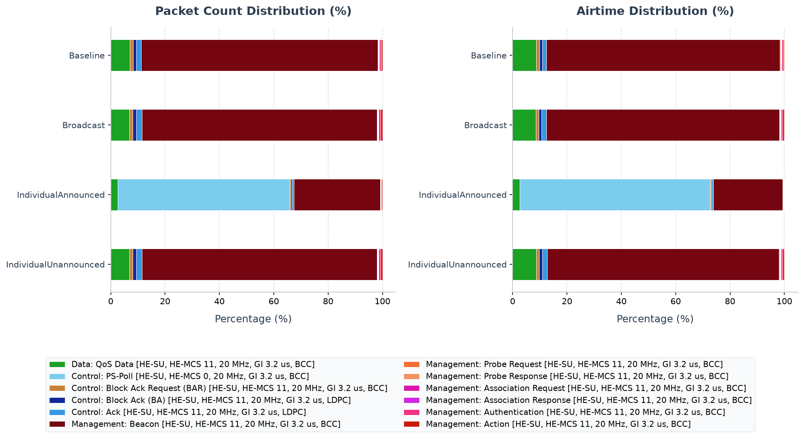

# 802.11ax HE Target Wake Time (TWT) Simulation

This example illustrates the Target Wake Time (TWT) power-saving mechanism introduced in the IEEE 802.11ax (Wi-Fi 6) standard. It demonstrates how TWT agreements are negotiated between an Access Point (AP) and stations (STAs), and how individual and broadcast TWT configurations allow stations to sleep, reducing power consumption.

## Background: HE Target Wake Time (TWT)

In legacy 802.11 power-saving modes (like PS-Poll or APSD), stations wake up periodically to receive Beacons and check if the AP has buffered downlink traffic. In high-density networks, this causes all sleeping stations to wake up simultaneously, leading to high collision rates and increased energy waste.

802.11ax addresses this with **Target Wake Time (TWT)**:
1. **Scheduled Wakeup**: Instead of waking up for every Beacon, the AP and each STA negotiate specific, customized time windows called **TWT sessions** (defined by `wakeInterval` and `wakeDuration`). The STA remains in a deep sleep state outside of these sessions.
2. **Individual TWT**:
   - Negotiated dynamically via TWT Setup frames.
   - **Unannounced TWT**: The STA is not required to announce that it is awake
     before exchanging frames during the service period.
   - **Announced TWT**: The STA indicates that it is awake before the peer sends
     it frames. “Announced” describes presence signaling, not a general rule
     that the STA must remain silent until an AP poll.
3. **Broadcast TWT**:
   - The AP defines and broadcasts a shared TWT schedule (in Beacons or Association responses).
   - Multiple stations join this shared broadcast schedule, allowing the AP to coordinate groups of STAs together (highly useful for Downlink/Uplink MU-OFDMA).

---

## Network Topology

The network [TwtRegression.ned](TwtRegression.ned) consists of:
- **`ap`**: An Access Point located at `(300, 180)`.
- **`sta[0..1]`**: Two wireless stations located at `(250, 150)` and `(250, 210)` on strong links to the AP.
- **`server`**: A wired server connected to the AP.
- **Traffic**: Each station generates 200-byte uplink UDP packets for the wired
  server every `2.011 s`. `sta[0]` starts at `10.021 s` and `sta[1]` at `10.026 s`;
  both stop at `90 s`, and the remaining 10 s drains queued traffic.

```
       [sta[0]]
          |
          | (58m wireless)
          v
       [ ap ] <==== (100G Ethernet) ====> [server]
          ^
          | (58m wireless)
          |
       [sta[1]]
```

The 5 ms offset prevents the two periodic flows from entering the MAC at
exactly the same simulation time. More importantly, `2.011 s` advances each
flow by 11 ms relative to every 100 ms TWT cycle, instead of locking every
packet to one wake/sleep phase as a 2 s interval would. Across the two flows,
the 80 offered packets cover 80 distinct millisecond phases of the cycle. This
makes the latency comparison fair to both individual and shared Broadcast TWT
schedules while retaining the same offered packet count in every case.

---

## Configurations in `omnetpp.ini`

The [omnetpp.ini](omnetpp.ini) file defines seven comparison scenarios:

### 1. `Baseline`
- TWT is disabled: `**.wlan[*].twt.enabled = false`.
- Stations do not sleep and remain awake for the entire duration of the simulation.

### 2. `IndividualUnannounced`
- TWT is enabled: `**.wlan[*].twt.enabled = true`.
- Stations negotiate an **Individual, Unannounced** TWT schedule:
  - `*.sta[*].wlan[*].agent.requestBroadcast = false`
  - `*.sta[*].wlan[*].agent.announced = false`
  - Wake interval is set to `100 ms` and wake duration to `10 ms`.
  - The AP TWT manager uses matching `100 ms` and `10 ms` defaults for the
    schedule it selects.
- **Result**: Stations enter a low-power sleep state outside their wake windows.

### 3. `IndividualUnannounced1ms`

- Extends `IndividualUnannounced` and reduces the wake duration to `1 ms` of
  every `100 ms` interval.
- The requester and AP TWT manager use the same duration, creating the most
  sleep-oriented individual schedule in this comparison.

### 4. `IndividualUnannounced5ms`

- Extends `IndividualUnannounced` and reduces the wake duration to `5 ms` of
  every `100 ms` interval.
- The duration is set on both the requester and the AP TWT manager, retaining
  unannounced individual TWT operation while maximizing the sleep opportunity.

### 5. `IndividualUnannounced50ms`

- Extends `IndividualUnannounced` and increases the wake duration to `50 ms`
  of every `100 ms` interval.
- The duration is set on both the requester and the AP TWT manager because the
  example uses the TWT setup command in which the AP selects the installed
  individual schedule.
- This case isolates the duty-cycle trade-off while retaining unannounced
  individual TWT operation.

### 6. `IndividualAnnounced`
- Extends the `IndividualUnannounced` configuration but sets `announced = true`.
- Announced mode changes presence signaling; it is not a general requirement
  to wait for an AP poll before every exchange.

### 7. `Broadcast`
- Stations join a **Broadcast** TWT schedule created by the AP:
  - `*.ap.wlan[*].mgmt.createBroadcastSchedule = true` and `*.ap.wlan[*].mgmt.broadcastId = 1`
  - The shared schedule explicitly uses a `100 ms` interval, `10 ms` duration,
    and `20 ms` first-wake offset.
  - `*.sta[*].wlan[*].agent.requestBroadcast = true` and `*.sta[*].wlan[*].agent.broadcastId = 1`

---

## Running the Simulation

From the INET project root, use the project launcher.

### Running with Qtenv (GUI)
```sh
bin/inet -u Qtenv -c IndividualUnannounced examples/ieee80211ax/twt/omnetpp.ini
```

### Running with Cmdenv (Command Line)
```sh
bin/inet -u Cmdenv -c Baseline examples/ieee80211ax/twt/omnetpp.ini
bin/inet -u Cmdenv -c IndividualUnannounced examples/ieee80211ax/twt/omnetpp.ini
bin/inet -u Cmdenv -c IndividualUnannounced1ms examples/ieee80211ax/twt/omnetpp.ini
bin/inet -u Cmdenv -c IndividualUnannounced5ms examples/ieee80211ax/twt/omnetpp.ini
bin/inet -u Cmdenv -c IndividualUnannounced50ms examples/ieee80211ax/twt/omnetpp.ini
bin/inet -u Cmdenv -c IndividualAnnounced examples/ieee80211ax/twt/omnetpp.ini
bin/inet -u Cmdenv -c Broadcast examples/ieee80211ax/twt/omnetpp.ini
```

---

## Verifying Results

After running the simulations, use `opp_scavetool` to extract TWT agreement counts and sleep time statistics for each station.

```sh
# Query TWT agreements, schedules, awake time, and sleep time
opp_scavetool query -l -f 'name =~ "twtAgreementCount" or name =~ "twtBroadcastScheduleCount" or name =~ "twtAwakeTime" or name =~ "twtSleepTime"' examples/ieee80211ax/twt/results/*.sca
```

### Expected Output Summary

```
Baseline-#0.sca:
scalar  TwtRegression.ap.wlan[0].twt      twtAgreementCount          0
scalar  TwtRegression.sta[0].wlan[0].twt  twtSleepTime               0

IndividualUnannounced-#0.sca:
scalar  TwtRegression.ap.wlan[0].twt      twtAgreementCount          2
scalar  TwtRegression.sta[0].wlan[0].twt  twtAgreementCount          1
scalar  TwtRegression.sta[0].wlan[0].twt  twtSleepTime               89.3788 s
scalar  TwtRegression.sta[0].wlan[0].twt  twtAwakeTime               10.6212 s

IndividualUnannounced1ms-#0.sca:
scalar  TwtRegression.ap.wlan[0].twt      twtAgreementCount          2
scalar  TwtRegression.sta[0].wlan[0].twt  twtAgreementCount          1
scalar  TwtRegression.sta[0].wlan[0].twt  twtSleepTime               98.5580 s
scalar  TwtRegression.sta[0].wlan[0].twt  twtAwakeTime                1.4420 s

IndividualUnannounced5ms-#0.sca:
scalar  TwtRegression.ap.wlan[0].twt      twtAgreementCount          2
scalar  TwtRegression.sta[0].wlan[0].twt  twtAgreementCount          1
scalar  TwtRegression.sta[0].wlan[0].twt  twtSleepTime               94.4784 s
scalar  TwtRegression.sta[0].wlan[0].twt  twtAwakeTime                5.5216 s

IndividualUnannounced50ms-#0.sca:
scalar  TwtRegression.ap.wlan[0].twt      twtAgreementCount          2
scalar  TwtRegression.sta[0].wlan[0].twt  twtAgreementCount          1
scalar  TwtRegression.sta[0].wlan[0].twt  twtSleepTime               49.6026 s
scalar  TwtRegression.sta[0].wlan[0].twt  twtAwakeTime               50.3974 s

IndividualAnnounced-#0.sca:
scalar  TwtRegression.ap.wlan[0].twt      twtAgreementCount          2
scalar  TwtRegression.sta[0].wlan[0].twt  twtAgreementCount          1
scalar  TwtRegression.sta[0].wlan[0].twt  twtSleepTime               89.3788 s
scalar  TwtRegression.sta[0].wlan[0].twt  twtAwakeTime               10.6212 s

Broadcast-#0.sca:
scalar  TwtRegression.ap.wlan[0].twt      twtBroadcastScheduleCount  1
scalar  TwtRegression.sta[1].wlan[0].twt  twtBroadcastScheduleCount  1
scalar  TwtRegression.sta[0].wlan[0].twt  twtSleepTime               78.8487 s
scalar  TwtRegression.sta[0].wlan[0].twt  twtAwakeTime               21.1513 s
```

---

## PCAP Tshark Packet Exchange Analysis

To record PCAP traces and inspect them with TShark, run the simulation with PCAP recording and checksum computation enabled:

```sh
bin/inet -u Cmdenv -c IndividualUnannounced examples/ieee80211ax/twt/omnetpp.ini --result-dir=examples/ieee80211ax/twt/results --**.numPcapRecorders=1 --**.checksumMode=\"computed\" --**.fcsMode=\"computed\"
```

Use TShark to print the timeline of packet exchanges:

```sh
tshark -n -r examples/ieee80211ax/twt/results/IndividualUnannounced-#0TwtRegression.ap.wlan[0].pcap -c 26
```

The decoded output timeline shows:
1. **Network Entry**: The client stations send Probe Requests, Authenticate, and Associate with the AP (e.g. frames 2, 3, 11, 19).
2. **TWT Negotiation**: After association, client stations send 802.11 Action frames carrying TWT Setup Requests (e.g. frame 23), and the AP responds with Action frames containing TWT Setup Responses (Accept) (e.g. frame 25) confirming the wake schedule.
3. **Power Saving sleep state**: Once negotiated, the client stations remain in deep sleep outside their wake service periods.

---

## Interpretation of Results

The following results are from run `#0` with seed set `20260623`, a `100 s`
simulation limit, and identical offered traffic. Awake, sleep, and energy are
averages over the two STAs. Consumed energy is derived from each STA's `100 J`
initial capacity and `residualEnergyCapacity:last` scalar.

| Configuration | Configured service period | Mean TWT awake time | Mean TWT sleep time | Delivered packets | Mean end-to-end delay | Mean energy per STA (reduction vs. baseline) |
|---|---:|---:|---:|---:|---:|---:|
| `Baseline` | none | not applicable | 0 s | 80/80 (100%) | 0.00009213 s | 0.2007 J (0%) |
| `IndividualUnannounced1ms` | 1/100 ms | 1.457 s | 98.543 s | 80/80 (100%) | 0.04626 s | 0.1018 J (49.3%) |
| `IndividualUnannounced5ms` | 5/100 ms | 5.536 s | 94.464 s | 80/80 (100%) | 0.04626 s | 0.1059 J (47.2%) |
| `IndividualUnannounced` | 10/100 ms | 10.636 s | 89.364 s | 80/80 (100%) | 0.03705 s | 0.1110 J (44.7%) |
| `IndividualUnannounced50ms` | 50/100 ms | 50.406 s | 49.594 s | 80/80 (100%) | 0.01338 s | 0.1508 J (24.9%) |
| `IndividualAnnounced` | 10/100 ms | 10.636 s | 89.364 s | 80/80 (100%) | 0.03712 s | 0.1192 J (40.6%) |
| `Broadcast` | 10/100 ms | 21.236 s | 78.764 s | 80/80 (100%) | 0.27999 s | 0.1211 J (39.6%) |

The 1, 5, 10, and 50 ms unannounced cases form the same two individual
agreements and preserve all offered packets in this run. Reducing the service
period from 10 ms to 1 ms lowers mean STA energy from `0.1110 J` to `0.1018 J`
(about 8.3%), while mean delay rises from `37.05 ms` to `46.26 ms`. The 1 ms
and 5 ms cases have the same measured delay here, but 1 ms uses about 3.9%
less energy. Increasing the service period from 10 ms to 50 ms cuts delay to
`13.38 ms`, at the cost of raising energy to `0.1508 J`. The phase sweep thus
exposes the expected trade-off: longer awake windows give packets more chances
to transmit promptly, while shorter windows provide larger energy savings.

The traffic adjustment removes two synchronization artifacts. With both
applications previously starting at exactly `10 s` and using a 2 s interval,
the baseline's mean delay was `1.2507 s`, while Broadcast delivered only 78 of
80 packets with `1.76525 s` mean delay. Separating the sources by 5 ms and
advancing their TWT phase by 11 ms per packet reduces the baseline to
`0.09213 ms`; Broadcast delivers all 80 packets with `279.99 ms` mean delay.
Broadcast still has a maximum delay of about `0.710 s`. That remaining latency
is associated with the model's shared-schedule wake and release behavior, not
simultaneous application arrivals or repeated sampling of one TWT phase.

Wake duration is represented on the wire in 256 microsecond units. The
configured 1 ms, 5 ms, and 50 ms durations therefore become `1.024 ms`,
`5.120 ms`, and `50.176 ms` in the accepted STA agreements; management setup
and schedule alignment account for the measured awake totals being slightly
higher than the nominal duty cycles.

Announced and unannounced 10 ms agreements have the same awake/sleep totals
and nearly identical delay: `37.12 ms` versus `37.05 ms`. The announced case
first wakes the radio and sends its presence indication before releasing queued
data, so all 80 data packets are delivered without retry observations in the
AP capture. Its 1,992 PS-Poll observations nevertheless consume energy: mean
STA energy is `0.1192 J`, about 7.4% above unannounced TWT but still 40.6% below
the baseline. Four announced runs with seed sets `20260623` through `20260626`
all delivered 80/80 packets with zero HCF data retries; their mean delays ranged
from `37.12 ms` to `42.08 ms`.

Broadcast TWT spends more time awake because beacon synchronization and
shared-schedule maintenance add to the nominal service periods. Its `279.99 ms`
mean delay is also substantially above either 10 ms individual case. That
remaining latency should be interpreted as behavior of the modeled shared
schedule, not simply as a consequence of the nominal 10 ms duty cycle.

These are deterministic single-run results, not confidence intervals or a
general battery-life estimate. Re-run multiple seed sets before drawing
workload-independent conclusions about delivery, latency, or energy.

<!-- BEGIN GENERATED: ieee80211ax-pcap-statistics -->
## 802.11 Packet Type Statistics


This section provides a statistical overview of the 802.11 frames transmitted over the wireless medium during the simulation. The packet counts were gathered from AP wireless-interface observation points. With multiple AP captures, one medium transmission may be observed at more than one AP; counts and airtime therefore represent recorded transmission observations, not de-duplicated application packets.

Capture session `20260719T134107Z` was generated from fresh PCAPng input with `TShark (Wireshark) 4.6.4.`. HE PPDU format, MCS, coding, bandwidth/RU, GI, and NSTS are decoded directly from standards-compliant radiotap HE fields; values not marked known by the recorder are omitted.

Two estimated airtime occupancy percentages are provided. HE-SU and HE-ER-SU use the modeled 36/44 µs preambles; a dissector-expanded A-MPDU is charged one shared preamble. HE MU/TB user-dependent signaling not exposed by radiotap remains approximate.
- **Air Time %**: This frame type's share of the sum of all estimated frame airtimes.
- **Air Time (Sim Time) %**: The sum of this frame type's estimated airtimes divided by the simulation time limit. Concurrent transmissions from multiple capture points are counted separately, so this value can exceed 100%; it is not the union of busy channel time.

### Evidence checks

| Status | Requirement | Observed evidence |
|---|---|---|
| **PASS** | Baseline produced protocol-visible wireless observations | 1148 AP/global transmission observations |
| **PASS** | Broadcast produced protocol-visible wireless observations | 1156 AP/global transmission observations |
| **PASS** | IndividualAnnounced produced protocol-visible wireless observations | 3148 AP/global transmission observations |
| **PASS** | IndividualUnannounced produced protocol-visible wireless observations | 1156 AP/global transmission observations |

### Configuration: `Baseline`
Total over-the-air frame/MPDU transmission observations (Global BSS/AP): **1148**

| Color | Frame Type & Subtype | Count | Percentage | Mean Size | Std Dev | Mean Duration | Std Dev Duration | Freq | Mean RX Sig | Mean TX Pwr | Air Time % | Air Time (Sim Time) % |
|:---:|---|---:|---:|---:|---:|---:|---:|---:|---:|---:|---:|---:|
| <svg width="16" height="16"><rect width="16" height="16" rx="3" fill="#1ba124" /></svg> | Data: QoS Data [HE-SU, HE-MCS 11, 20 MHz, GI 3.2 us, BCC] | 80 | 6.97% | 270.0 B | 0.0 B | 53.7 us | 0.0 us | 5010 MHz | -69.0 dBm | - | 8.77% | 0.00% |
| <hr> | <hr> | <hr> | <hr> | <hr> | <hr> | <hr> | <hr> | <hr> | <hr> | <hr> | <hr> | <hr> |
| <svg width="16" height="16"><rect width="16" height="16" rx="3" fill="#c88037" /></svg> | Control: Block Ack Request (BAR) [HE-SU, HE-MCS 11, 20 MHz, GI 3.2 us, BCC] | 14 | 1.22% | 24.0 B | 0.0 B | 37.6 us | 0.0 us | 5010 MHz | -69.0 dBm | - | 1.07% | 0.00% |
| <svg width="16" height="16"><rect width="16" height="16" rx="3" fill="#11289c" /></svg> | Control: Block Ack (BA) [HE-SU, HE-MCS 11, 20 MHz, GI 3.2 us, LDPC] | 14 | 1.22% | 32.0 B | 0.0 B | 38.1 us | 0.0 us | 5010 MHz | - | 13.0 dBm | 1.09% | 0.00% |
| <svg width="16" height="16"><rect width="16" height="16" rx="3" fill="#3598e3" /></svg> | Control: Ack [HE-SU, HE-MCS 11, 20 MHz, GI 3.2 us, LDPC] | 20 | 1.74% | 14.0 B | 0.0 B | 36.9 us | 0.0 us | 5010 MHz | -69.0 dBm | 13.0 dBm | 1.51% | 0.00% |
| <hr> | <hr> | <hr> | <hr> | <hr> | <hr> | <hr> | <hr> | <hr> | <hr> | <hr> | <hr> | <hr> |
| <svg width="16" height="16"><rect width="16" height="16" rx="3" fill="#750611" /></svg> | Management: Beacon [HE-SU, HE-MCS 11, 20 MHz, GI 3.2 us, BCC] | 1000 | 87.11% | 93.0 B | 0.0 B | 42.1 us | 0.0 us | 5010 MHz | - | 13.0 dBm | 85.95% | 0.04% |
| <svg width="16" height="16"><rect width="16" height="16" rx="3" fill="#f06f33" /></svg> | Management: Probe Request [HE-SU, HE-MCS 11, 20 MHz, GI 3.2 us, BCC] | 2 | 0.17% | 68.0 B | 0.0 B | 40.5 us | 0.0 us | 5010 MHz | -69.0 dBm | - | 0.17% | 0.00% |
| <svg width="16" height="16"><rect width="16" height="16" rx="3" fill="#f39062" /></svg> | Management: Probe Response [HE-SU, HE-MCS 11, 20 MHz, GI 3.2 us, BCC] | 2 | 0.17% | 93.0 B | 0.0 B | 42.1 us | 0.0 us | 5010 MHz | - | 13.0 dBm | 0.17% | 0.00% |
| <svg width="16" height="16"><rect width="16" height="16" rx="3" fill="#d917ac" /></svg> | Management: Association Request [HE-SU, HE-MCS 11, 20 MHz, GI 3.2 us, BCC] | 2 | 0.17% | 76.0 B | 0.0 B | 41.0 us | 0.0 us | 5010 MHz | -69.0 dBm | - | 0.17% | 0.00% |
| <svg width="16" height="16"><rect width="16" height="16" rx="3" fill="#cf28e2" /></svg> | Management: Association Response [HE-SU, HE-MCS 11, 20 MHz, GI 3.2 us, BCC] | 2 | 0.17% | 81.0 B | 0.0 B | 41.3 us | 0.0 us | 5010 MHz | - | 13.0 dBm | 0.17% | 0.00% |
| <svg width="16" height="16"><rect width="16" height="16" rx="3" fill="#f03385" /></svg> | Management: Authentication [HE-SU, HE-MCS 11, 20 MHz, GI 3.2 us, BCC] | 8 | 0.70% | 34.0 B | 0.0 B | 38.2 us | 0.0 us | 5010 MHz | -69.0 dBm | 13.0 dBm | 0.62% | 0.00% |
| <svg width="16" height="16"><rect width="16" height="16" rx="3" fill="#c71b0f" /></svg> | Management: Action [HE-SU, HE-MCS 11, 20 MHz, GI 3.2 us, BCC] | 4 | 0.35% | 37.0 B | 0.0 B | 38.4 us | 0.0 us | 5010 MHz | -69.0 dBm | 13.0 dBm | 0.31% | 0.00% |

#### MPDU observation semantics

| Metric | Value |
|---|---:|
| Total data MPDU transmission observations | 80 |
| Unique `(TA, TID, sequence, fragment)` identities | 80 |
| Repeated identity observations | 0 |
| Observations with Retry bit set | 0 |
| Unique A-MPDU references | 0 |

Repeated observations are retained in airtime totals because every transmission consumes channel time; the unique count is provided only for workload/reliability interpretation.

### Configuration: `Broadcast`
Total over-the-air frame/MPDU transmission observations (Global BSS/AP): **1156**

| Color | Frame Type & Subtype | Count | Percentage | Mean Size | Std Dev | Mean Duration | Std Dev Duration | Freq | Mean RX Sig | Mean TX Pwr | Air Time % | Air Time (Sim Time) % |
|:---:|---|---:|---:|---:|---:|---:|---:|---:|---:|---:|---:|---:|
| <svg width="16" height="16"><rect width="16" height="16" rx="3" fill="#1ba124" /></svg> | Data: QoS Data [HE-SU, HE-MCS 11, 20 MHz, GI 3.2 us, BCC] | 80 | 6.92% | 270.0 B | 0.0 B | 53.7 us | 0.0 us | 5010 MHz | -69.0 dBm | - | 8.51% | 0.00% |
| <hr> | <hr> | <hr> | <hr> | <hr> | <hr> | <hr> | <hr> | <hr> | <hr> | <hr> | <hr> | <hr> |
| <svg width="16" height="16"><rect width="16" height="16" rx="3" fill="#c88037" /></svg> | Control: Block Ack Request (BAR) [HE-SU, HE-MCS 11, 20 MHz, GI 3.2 us, BCC] | 14 | 1.21% | 24.0 B | 0.0 B | 37.6 us | 0.0 us | 5010 MHz | -69.0 dBm | - | 1.04% | 0.00% |
| <svg width="16" height="16"><rect width="16" height="16" rx="3" fill="#11289c" /></svg> | Control: Block Ack (BA) [HE-SU, HE-MCS 11, 20 MHz, GI 3.2 us, LDPC] | 14 | 1.21% | 32.0 B | 0.0 B | 38.1 us | 0.0 us | 5010 MHz | - | 13.0 dBm | 1.06% | 0.00% |
| <svg width="16" height="16"><rect width="16" height="16" rx="3" fill="#3598e3" /></svg> | Control: Ack [HE-SU, HE-MCS 11, 20 MHz, GI 3.2 us, LDPC] | 24 | 2.08% | 14.0 B | 0.0 B | 36.9 us | 0.0 us | 5010 MHz | -69.0 dBm | 13.0 dBm | 1.76% | 0.00% |
| <hr> | <hr> | <hr> | <hr> | <hr> | <hr> | <hr> | <hr> | <hr> | <hr> | <hr> | <hr> | <hr> |
| <svg width="16" height="16"><rect width="16" height="16" rx="3" fill="#750611" /></svg> | Management: Beacon [HE-SU, HE-MCS 11, 20 MHz, GI 3.2 us, BCC] | 1000 | 86.51% | 111.0 B | 0.0 B | 43.3 us | 0.0 us | 5010 MHz | - | 13.0 dBm | 85.76% | 0.04% |
| <svg width="16" height="16"><rect width="16" height="16" rx="3" fill="#f06f33" /></svg> | Management: Probe Request [HE-SU, HE-MCS 11, 20 MHz, GI 3.2 us, BCC] | 2 | 0.17% | 68.0 B | 0.0 B | 40.5 us | 0.0 us | 5010 MHz | -69.0 dBm | - | 0.16% | 0.00% |
| <svg width="16" height="16"><rect width="16" height="16" rx="3" fill="#f39062" /></svg> | Management: Probe Response [HE-SU, HE-MCS 11, 20 MHz, GI 3.2 us, BCC] | 2 | 0.17% | 93.0 B | 0.0 B | 42.1 us | 0.0 us | 5010 MHz | - | 13.0 dBm | 0.17% | 0.00% |
| <svg width="16" height="16"><rect width="16" height="16" rx="3" fill="#d917ac" /></svg> | Management: Association Request [HE-SU, HE-MCS 11, 20 MHz, GI 3.2 us, BCC] | 2 | 0.17% | 76.0 B | 0.0 B | 41.0 us | 0.0 us | 5010 MHz | -69.0 dBm | - | 0.16% | 0.00% |
| <svg width="16" height="16"><rect width="16" height="16" rx="3" fill="#cf28e2" /></svg> | Management: Association Response [HE-SU, HE-MCS 11, 20 MHz, GI 3.2 us, BCC] | 2 | 0.17% | 81.0 B | 0.0 B | 41.3 us | 0.0 us | 5010 MHz | - | 13.0 dBm | 0.16% | 0.00% |
| <svg width="16" height="16"><rect width="16" height="16" rx="3" fill="#f03385" /></svg> | Management: Authentication [HE-SU, HE-MCS 11, 20 MHz, GI 3.2 us, BCC] | 8 | 0.69% | 34.0 B | 0.0 B | 38.2 us | 0.0 us | 5010 MHz | -69.0 dBm | 13.0 dBm | 0.61% | 0.00% |
| <svg width="16" height="16"><rect width="16" height="16" rx="3" fill="#c71b0f" /></svg> | Management: Action [HE-SU, HE-MCS 11, 20 MHz, GI 3.2 us, BCC] | 8 | 0.69% | 42.5 B | 5.5 B | 38.8 us | 0.4 us | 5010 MHz | -69.0 dBm | 13.0 dBm | 0.61% | 0.00% |

#### MPDU observation semantics

| Metric | Value |
|---|---:|
| Total data MPDU transmission observations | 80 |
| Unique `(TA, TID, sequence, fragment)` identities | 80 |
| Repeated identity observations | 0 |
| Observations with Retry bit set | 0 |
| Unique A-MPDU references | 0 |

Repeated observations are retained in airtime totals because every transmission consumes channel time; the unique count is provided only for workload/reliability interpretation.

### Configuration: `IndividualAnnounced`
Total over-the-air frame/MPDU transmission observations (Global BSS/AP): **3148**

| Color | Frame Type & Subtype | Count | Percentage | Mean Size | Std Dev | Mean Duration | Std Dev Duration | Freq | Mean RX Sig | Mean TX Pwr | Air Time % | Air Time (Sim Time) % |
|:---:|---|---:|---:|---:|---:|---:|---:|---:|---:|---:|---:|---:|
| <svg width="16" height="16"><rect width="16" height="16" rx="3" fill="#1ba124" /></svg> | Data: QoS Data [HE-SU, HE-MCS 11, 20 MHz, GI 3.2 us, BCC] | 80 | 2.54% | 270.0 B | 0.0 B | 53.7 us | 0.0 us | 5010 MHz | -69.0 dBm | - | 2.61% | 0.00% |
| <hr> | <hr> | <hr> | <hr> | <hr> | <hr> | <hr> | <hr> | <hr> | <hr> | <hr> | <hr> | <hr> |
| <svg width="16" height="16"><rect width="16" height="16" rx="3" fill="#7cccee" /></svg> | Control: PS-Poll [HE-SU, HE-MCS 0, 20 MHz, GI 3.2 us, BCC] | 1992 | 63.28% | 20.0 B | 0.0 B | 57.9 us | 0.0 us | 5010 MHz | -69.0 dBm | - | 70.05% | 0.12% |
| <svg width="16" height="16"><rect width="16" height="16" rx="3" fill="#c88037" /></svg> | Control: Block Ack Request (BAR) [HE-SU, HE-MCS 11, 20 MHz, GI 3.2 us, BCC] | 14 | 0.44% | 24.0 B | 0.0 B | 37.6 us | 0.0 us | 5010 MHz | -69.0 dBm | - | 0.32% | 0.00% |
| <svg width="16" height="16"><rect width="16" height="16" rx="3" fill="#11289c" /></svg> | Control: Block Ack (BA) [HE-SU, HE-MCS 11, 20 MHz, GI 3.2 us, LDPC] | 14 | 0.44% | 32.0 B | 0.0 B | 38.1 us | 0.0 us | 5010 MHz | - | 13.0 dBm | 0.32% | 0.00% |
| <svg width="16" height="16"><rect width="16" height="16" rx="3" fill="#3598e3" /></svg> | Control: Ack [HE-SU, HE-MCS 11, 20 MHz, GI 3.2 us, LDPC] | 24 | 0.76% | 14.0 B | 0.0 B | 36.9 us | 0.0 us | 5010 MHz | -69.0 dBm | 13.0 dBm | 0.54% | 0.00% |
| <hr> | <hr> | <hr> | <hr> | <hr> | <hr> | <hr> | <hr> | <hr> | <hr> | <hr> | <hr> | <hr> |
| <svg width="16" height="16"><rect width="16" height="16" rx="3" fill="#750611" /></svg> | Management: Beacon [HE-SU, HE-MCS 11, 20 MHz, GI 3.2 us, BCC] | 1000 | 31.77% | 93.0 B | 0.0 B | 42.1 us | 0.0 us | 5010 MHz | - | 13.0 dBm | 25.58% | 0.04% |
| <svg width="16" height="16"><rect width="16" height="16" rx="3" fill="#f06f33" /></svg> | Management: Probe Request [HE-SU, HE-MCS 11, 20 MHz, GI 3.2 us, BCC] | 2 | 0.06% | 68.0 B | 0.0 B | 40.5 us | 0.0 us | 5010 MHz | -69.0 dBm | - | 0.05% | 0.00% |
| <svg width="16" height="16"><rect width="16" height="16" rx="3" fill="#f39062" /></svg> | Management: Probe Response [HE-SU, HE-MCS 11, 20 MHz, GI 3.2 us, BCC] | 2 | 0.06% | 93.0 B | 0.0 B | 42.1 us | 0.0 us | 5010 MHz | - | 13.0 dBm | 0.05% | 0.00% |
| <svg width="16" height="16"><rect width="16" height="16" rx="3" fill="#d917ac" /></svg> | Management: Association Request [HE-SU, HE-MCS 11, 20 MHz, GI 3.2 us, BCC] | 2 | 0.06% | 76.0 B | 0.0 B | 41.0 us | 0.0 us | 5010 MHz | -69.0 dBm | - | 0.05% | 0.00% |
| <svg width="16" height="16"><rect width="16" height="16" rx="3" fill="#cf28e2" /></svg> | Management: Association Response [HE-SU, HE-MCS 11, 20 MHz, GI 3.2 us, BCC] | 2 | 0.06% | 81.0 B | 0.0 B | 41.3 us | 0.0 us | 5010 MHz | - | 13.0 dBm | 0.05% | 0.00% |
| <svg width="16" height="16"><rect width="16" height="16" rx="3" fill="#f03385" /></svg> | Management: Authentication [HE-SU, HE-MCS 11, 20 MHz, GI 3.2 us, BCC] | 8 | 0.25% | 34.0 B | 0.0 B | 38.2 us | 0.0 us | 5010 MHz | -69.0 dBm | 13.0 dBm | 0.19% | 0.00% |
| <svg width="16" height="16"><rect width="16" height="16" rx="3" fill="#c71b0f" /></svg> | Management: Action [HE-SU, HE-MCS 11, 20 MHz, GI 3.2 us, BCC] | 8 | 0.25% | 42.5 B | 5.5 B | 38.8 us | 0.4 us | 5010 MHz | -69.0 dBm | 13.0 dBm | 0.19% | 0.00% |

#### MPDU observation semantics

| Metric | Value |
|---|---:|
| Total data MPDU transmission observations | 80 |
| Unique `(TA, TID, sequence, fragment)` identities | 80 |
| Repeated identity observations | 0 |
| Observations with Retry bit set | 0 |
| Unique A-MPDU references | 0 |

Repeated observations are retained in airtime totals because every transmission consumes channel time; the unique count is provided only for workload/reliability interpretation.

### Configuration: `IndividualUnannounced`
Total over-the-air frame/MPDU transmission observations (Global BSS/AP): **1156**

| Color | Frame Type & Subtype | Count | Percentage | Mean Size | Std Dev | Mean Duration | Std Dev Duration | Freq | Mean RX Sig | Mean TX Pwr | Air Time % | Air Time (Sim Time) % |
|:---:|---|---:|---:|---:|---:|---:|---:|---:|---:|---:|---:|---:|
| <svg width="16" height="16"><rect width="16" height="16" rx="3" fill="#1ba124" /></svg> | Data: QoS Data [HE-SU, HE-MCS 11, 20 MHz, GI 3.2 us, BCC] | 80 | 6.92% | 270.0 B | 0.0 B | 53.7 us | 0.0 us | 5010 MHz | -69.0 dBm | - | 8.72% | 0.00% |
| <hr> | <hr> | <hr> | <hr> | <hr> | <hr> | <hr> | <hr> | <hr> | <hr> | <hr> | <hr> | <hr> |
| <svg width="16" height="16"><rect width="16" height="16" rx="3" fill="#c88037" /></svg> | Control: Block Ack Request (BAR) [HE-SU, HE-MCS 11, 20 MHz, GI 3.2 us, BCC] | 14 | 1.21% | 24.0 B | 0.0 B | 37.6 us | 0.0 us | 5010 MHz | -69.0 dBm | - | 1.07% | 0.00% |
| <svg width="16" height="16"><rect width="16" height="16" rx="3" fill="#11289c" /></svg> | Control: Block Ack (BA) [HE-SU, HE-MCS 11, 20 MHz, GI 3.2 us, LDPC] | 14 | 1.21% | 32.0 B | 0.0 B | 38.1 us | 0.0 us | 5010 MHz | - | 13.0 dBm | 1.08% | 0.00% |
| <svg width="16" height="16"><rect width="16" height="16" rx="3" fill="#3598e3" /></svg> | Control: Ack [HE-SU, HE-MCS 11, 20 MHz, GI 3.2 us, LDPC] | 24 | 2.08% | 14.0 B | 0.0 B | 36.9 us | 0.0 us | 5010 MHz | -69.0 dBm | 13.0 dBm | 1.80% | 0.00% |
| <hr> | <hr> | <hr> | <hr> | <hr> | <hr> | <hr> | <hr> | <hr> | <hr> | <hr> | <hr> | <hr> |
| <svg width="16" height="16"><rect width="16" height="16" rx="3" fill="#750611" /></svg> | Management: Beacon [HE-SU, HE-MCS 11, 20 MHz, GI 3.2 us, BCC] | 1000 | 86.51% | 93.0 B | 0.0 B | 42.1 us | 0.0 us | 5010 MHz | - | 13.0 dBm | 85.42% | 0.04% |
| <svg width="16" height="16"><rect width="16" height="16" rx="3" fill="#f06f33" /></svg> | Management: Probe Request [HE-SU, HE-MCS 11, 20 MHz, GI 3.2 us, BCC] | 2 | 0.17% | 68.0 B | 0.0 B | 40.5 us | 0.0 us | 5010 MHz | -69.0 dBm | - | 0.16% | 0.00% |
| <svg width="16" height="16"><rect width="16" height="16" rx="3" fill="#f39062" /></svg> | Management: Probe Response [HE-SU, HE-MCS 11, 20 MHz, GI 3.2 us, BCC] | 2 | 0.17% | 93.0 B | 0.0 B | 42.1 us | 0.0 us | 5010 MHz | - | 13.0 dBm | 0.17% | 0.00% |
| <svg width="16" height="16"><rect width="16" height="16" rx="3" fill="#d917ac" /></svg> | Management: Association Request [HE-SU, HE-MCS 11, 20 MHz, GI 3.2 us, BCC] | 2 | 0.17% | 76.0 B | 0.0 B | 41.0 us | 0.0 us | 5010 MHz | -69.0 dBm | - | 0.17% | 0.00% |
| <svg width="16" height="16"><rect width="16" height="16" rx="3" fill="#cf28e2" /></svg> | Management: Association Response [HE-SU, HE-MCS 11, 20 MHz, GI 3.2 us, BCC] | 2 | 0.17% | 81.0 B | 0.0 B | 41.3 us | 0.0 us | 5010 MHz | - | 13.0 dBm | 0.17% | 0.00% |
| <svg width="16" height="16"><rect width="16" height="16" rx="3" fill="#f03385" /></svg> | Management: Authentication [HE-SU, HE-MCS 11, 20 MHz, GI 3.2 us, BCC] | 8 | 0.69% | 34.0 B | 0.0 B | 38.2 us | 0.0 us | 5010 MHz | -69.0 dBm | 13.0 dBm | 0.62% | 0.00% |
| <svg width="16" height="16"><rect width="16" height="16" rx="3" fill="#c71b0f" /></svg> | Management: Action [HE-SU, HE-MCS 11, 20 MHz, GI 3.2 us, BCC] | 8 | 0.69% | 42.5 B | 5.5 B | 38.8 us | 0.4 us | 5010 MHz | -69.0 dBm | 13.0 dBm | 0.63% | 0.00% |

#### MPDU observation semantics

| Metric | Value |
|---|---:|
| Total data MPDU transmission observations | 80 |
| Unique `(TA, TID, sequence, fragment)` identities | 80 |
| Repeated identity observations | 0 |
| Observations with Retry bit set | 0 |
| Unique A-MPDU references | 0 |

Repeated observations are retained in airtime totals because every transmission consumes channel time; the unique count is provided only for workload/reliability interpretation.

### Analysis of Packet Distribution
Only `IndividualAnnounced` contains the large **PS-Poll** population. This is consistent with the announced-TWT procedure: the requester signals that it is awake with PS-Poll or an APSD trigger before the responder sends a non-Trigger frame (IEEE Std 802.11-2024, Table 9-347 and Clause 10.46). Unannounced TWT does not require that presence signal. The QoS Data totals are transmitted MPDU observations, not delivered application-packet counts; aggregation and repeated sequence numbers can make them much larger than the workload. Validate TWT delivery with sink scalars and energy with the recorded radio-power vectors.
<!-- END GENERATED: ieee80211ax-pcap-statistics -->
