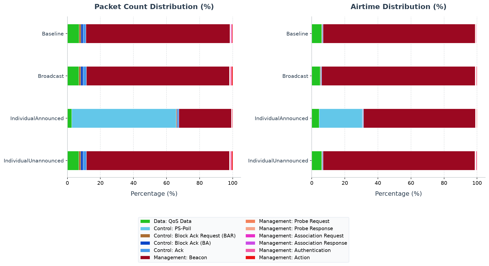

# Target Wake Time Energy Walkthrough

This walkthrough reports integrated station power, radio mode, and delivered
bytes for the energy configurations in [omnetpp.ini](omnetpp.ini), together
with directly observed frames from the retained packet captures.

## Five-run energy evidence

The scalar/vector session
[`20260725T120411Z`](results/scalar-vector/20260725T120411Z) contains
`BaselineEnergy` and `TwtEnergySaving` runs `0` through `4`. Metrics use the
common `10–100 s` window.

| Configuration | Integrated `powerConsumption:vector` per delivered bit | `packetReceived:vector(packetBytes)` | Radio-state evidence |
|---|---:|---:|---|
| `BaselineEnergy` | `2.826326e-6 J/bit` (95% CI effectively zero) | `16000 B` in every run; `0.001422222 Mbps` | `radioMode:vector` records the station mode timeline used alongside power integration. |
| `TwtEnergySaving` | `1.557605e-6 ± 4.045265e-11 J/bit` | `16000 B` in every run; `0.001422222 Mbps` | `radioMode:vector` records wake/sleep mode changes aligned with `powerConsumption:vector`. |

The integrated energy-per-bit reduction is `44.89%`, while
`packetReceived:vector(packetBytes)` records the same delivered byte total and
goodput in both configurations. This is an energy result for these configured
power states and traffic; the result does not by itself characterize other TWT
schedules.

## Reproduce and inspect

```sh
bin/inet -u Cmdenv -c TwtEnergySaving -r 0 examples/ieee80211ax/twt/omnetpp.ini --result-dir=examples/ieee80211ax/twt/results/manual
```

```sh
opp_scavetool query -l \
  -f 'name =~ "radioMode:vector" or name =~ "powerConsumption:vector" or name =~ "packetReceived:vector(packetBytes)"' \
  examples/ieee80211ax/twt/results/manual/*.sca \
  examples/ieee80211ax/twt/results/manual/*.vec
```

Integrate each station's `powerConsumption:vector` only over `10–100 s`, sum
the two station integrals, and divide by the delivered bits from the server
application's `packetReceived:vector(packetBytes)`. Use `radioMode:vector` at
the same timestamps to explain power-level changes.

The retained packet-statistics session
[`20260724T175025Z`](results/packet-statistics/20260724T175025Z) contains AP and
station captures plus matching `.sca`/`.vec` files for `Baseline`, `Broadcast`,
`IndividualAnnounced`, and `IndividualUnannounced`. The exact tables below
record `80` unique data-MPDU identities with no Retry bit in each configuration.
They also directly record `1992` PS-Poll observations for
`IndividualAnnounced`, while the other three tables contain no PS-Poll row.
These are frame observations, not power or application-delivery measurements.

```sh
tshark -n -r 'examples/ieee80211ax/twt/results/packet-statistics/20260724T175025Z/IndividualAnnounced/IndividualAnnounced-#0TwtRegression.ap.wlan[0].pcap' -c 30
```

<!-- REWRITE-PREFIX-END -->


<!-- BEGIN GENERATED: ieee80211ax-pcap-statistics -->
## 802.11 Packet Type Statistics


This section provides a statistical overview of the 802.11 frames transmitted over the wireless medium during the simulation. The packet counts were gathered from AP wireless-interface observation points. With multiple AP captures, one medium transmission may be observed at more than one AP; counts and airtime therefore represent recorded transmission observations, not de-duplicated application packets.

Capture session `20260724T175025Z` was generated from fresh PCAPng input with `TShark (Wireshark) 4.6.4.`. HE PPDU format, MCS, coding, bandwidth/RU, GI, and NSTS are decoded directly from standards-compliant radiotap HE fields; values not marked known by the recorder are omitted.

Two estimated airtime occupancy percentages are provided. HE-SU and HE-ER-SU use the modeled 36/44 µs preambles; a dissector-expanded A-MPDU is charged one shared preamble. HE MU/TB user-dependent signaling not exposed by radiotap remains approximate.
- **Air Time %**: This frame type's share of the sum of all estimated frame airtimes.
- **Air Time (Sim Time) %**: The sum of this frame type's estimated airtimes divided by the simulation time limit. Concurrent transmissions from multiple capture points are counted separately, so this value can exceed 100%; it is not the union of busy channel time.

### Evidence checks

| Status | Requirement | Observed evidence |
|---|---|---|
| **PASS** | Baseline produced protocol-visible wireless observations | 1148 AP/global transmission observations |
| **PASS** | Broadcast produced protocol-visible wireless observations | 1156 AP/global transmission observations |
| **PASS** | IndividualAnnounced produced protocol-visible wireless observations | 3148 AP/global transmission observations |
| **PASS** | IndividualUnannounced produced protocol-visible wireless observations | 1156 AP/global transmission observations |

### Configuration: `Baseline`
Total over-the-air frame/MPDU transmission observations (Global BSS/AP): **1148**

| Color | Frame Type & Subtype | Count | Percentage | Mean Size | Std Dev | Mean Duration | Std Dev Duration | Freq | Mean RX Sig | Mean TX Pwr | Air Time % | Air Time (Sim Time) % |
|:---:|---|---:|---:|---:|---:|---:|---:|---:|---:|---:|---:|---:|
| <svg width="16" height="16"><rect width="16" height="16" rx="3" fill="#22c322" /></svg> | Data: QoS Data | 80 | 6.97% | 270.0 B | 0.0 B | 110.0 us | 0.0 us | 5010 MHz | -69.0 dBm | - | 5.90% | 0.01% |
| <hr> | <hr> | <hr> | <hr> | <hr> | <hr> | <hr> | <hr> | <hr> | <hr> | <hr> | <hr> | <hr> |
| <svg width="16" height="16"><rect width="16" height="16" rx="3" fill="#ab6c30" /></svg> | Control: Block Ack Request (BAR) | 14 | 1.22% | 24.0 B | 0.0 B | 28.0 us | 0.0 us | 5010 MHz | -69.0 dBm | - | 0.26% | 0.00% |
| <svg width="16" height="16"><rect width="16" height="16" rx="3" fill="#0946c8" /></svg> | Control: Block Ack (BA) | 14 | 1.22% | 32.0 B | 0.0 B | 30.7 us | 0.0 us | 5010 MHz | - | 13.0 dBm | 0.29% | 0.00% |
| <svg width="16" height="16"><rect width="16" height="16" rx="3" fill="#4799eb" /></svg> | Control: Ack | 20 | 1.74% | 14.0 B | 0.0 B | 24.7 us | 0.0 us | 5010 MHz | -69.0 dBm | 13.0 dBm | 0.33% | 0.00% |
| <hr> | <hr> | <hr> | <hr> | <hr> | <hr> | <hr> | <hr> | <hr> | <hr> | <hr> | <hr> | <hr> |
| <svg width="16" height="16"><rect width="16" height="16" rx="3" fill="#9b0821" /></svg> | Management: Beacon | 1000 | 87.11% | 88.0 B | 0.0 B | 137.3 us | 0.0 us | 5010 MHz | - | 13.0 dBm | 92.04% | 0.14% |
| <svg width="16" height="16"><rect width="16" height="16" rx="3" fill="#f2805a" /></svg> | Management: Probe Request | 2 | 0.17% | 63.0 B | 0.0 B | 104.0 us | 0.0 us | 5010 MHz | -69.0 dBm | - | 0.14% | 0.00% |
| <svg width="16" height="16"><rect width="16" height="16" rx="3" fill="#f5a489" /></svg> | Management: Probe Response | 2 | 0.17% | 88.0 B | 0.0 B | 137.3 us | 0.0 us | 5010 MHz | - | 13.0 dBm | 0.18% | 0.00% |
| <svg width="16" height="16"><rect width="16" height="16" rx="3" fill="#e830c9" /></svg> | Management: Association Request | 2 | 0.17% | 71.0 B | 0.0 B | 114.7 us | 0.0 us | 5010 MHz | -69.0 dBm | - | 0.15% | 0.00% |
| <svg width="16" height="16"><rect width="16" height="16" rx="3" fill="#cc4ce6" /></svg> | Management: Association Response | 2 | 0.17% | 76.0 B | 0.0 B | 121.3 us | 0.0 us | 5010 MHz | - | 13.0 dBm | 0.16% | 0.00% |
| <svg width="16" height="16"><rect width="16" height="16" rx="3" fill="#f25aa6" /></svg> | Management: Authentication | 8 | 0.70% | 34.0 B | 0.0 B | 65.3 us | 0.0 us | 5010 MHz | -69.0 dBm | 13.0 dBm | 0.35% | 0.00% |
| <svg width="16" height="16"><rect width="16" height="16" rx="3" fill="#ec1313" /></svg> | Management: Action | 4 | 0.35% | 37.0 B | 0.0 B | 69.3 us | 0.0 us | 5010 MHz | -69.0 dBm | 13.0 dBm | 0.19% | 0.00% |

#### MPDU observation semantics

| Metric | Value |
|---|---:|
| Total data MPDU transmission observations | 80 |
| Unique `(TA, TID, sequence, fragment)` identities | 80 |
| Repeated identity observations | 0 |
| Observations with Retry bit set | 0 |
| Unique A-MPDU references | 0 |

Repeated observations are retained in airtime totals because every transmission consumes channel time; the unique count is provided only for workload/reliability interpretation.

### Configuration: `Broadcast`
Total over-the-air frame/MPDU transmission observations (Global BSS/AP): **1156**

| Color | Frame Type & Subtype | Count | Percentage | Mean Size | Std Dev | Mean Duration | Std Dev Duration | Freq | Mean RX Sig | Mean TX Pwr | Air Time % | Air Time (Sim Time) % |
|:---:|---|---:|---:|---:|---:|---:|---:|---:|---:|---:|---:|---:|
| <svg width="16" height="16"><rect width="16" height="16" rx="3" fill="#22c322" /></svg> | Data: QoS Data | 80 | 6.92% | 270.0 B | 0.0 B | 110.0 us | 0.0 us | 5010 MHz | -69.0 dBm | - | 5.07% | 0.01% |
| <hr> | <hr> | <hr> | <hr> | <hr> | <hr> | <hr> | <hr> | <hr> | <hr> | <hr> | <hr> | <hr> |
| <svg width="16" height="16"><rect width="16" height="16" rx="3" fill="#ab6c30" /></svg> | Control: Block Ack Request (BAR) | 14 | 1.21% | 24.0 B | 0.0 B | 28.0 us | 0.0 us | 5010 MHz | -69.0 dBm | - | 0.23% | 0.00% |
| <svg width="16" height="16"><rect width="16" height="16" rx="3" fill="#0946c8" /></svg> | Control: Block Ack (BA) | 14 | 1.21% | 32.0 B | 0.0 B | 30.7 us | 0.0 us | 5010 MHz | - | 13.0 dBm | 0.25% | 0.00% |
| <svg width="16" height="16"><rect width="16" height="16" rx="3" fill="#4799eb" /></svg> | Control: Ack | 24 | 2.08% | 14.0 B | 0.0 B | 24.7 us | 0.0 us | 5010 MHz | -69.0 dBm | 13.0 dBm | 0.34% | 0.00% |
| <hr> | <hr> | <hr> | <hr> | <hr> | <hr> | <hr> | <hr> | <hr> | <hr> | <hr> | <hr> | <hr> |
| <svg width="16" height="16"><rect width="16" height="16" rx="3" fill="#9b0821" /></svg> | Management: Beacon | 1000 | 86.51% | 106.0 B | 0.0 B | 161.3 us | 0.0 us | 5010 MHz | - | 13.0 dBm | 92.91% | 0.16% |
| <svg width="16" height="16"><rect width="16" height="16" rx="3" fill="#f2805a" /></svg> | Management: Probe Request | 2 | 0.17% | 63.0 B | 0.0 B | 104.0 us | 0.0 us | 5010 MHz | -69.0 dBm | - | 0.12% | 0.00% |
| <svg width="16" height="16"><rect width="16" height="16" rx="3" fill="#f5a489" /></svg> | Management: Probe Response | 2 | 0.17% | 88.0 B | 0.0 B | 137.3 us | 0.0 us | 5010 MHz | - | 13.0 dBm | 0.16% | 0.00% |
| <svg width="16" height="16"><rect width="16" height="16" rx="3" fill="#e830c9" /></svg> | Management: Association Request | 2 | 0.17% | 71.0 B | 0.0 B | 114.7 us | 0.0 us | 5010 MHz | -69.0 dBm | - | 0.13% | 0.00% |
| <svg width="16" height="16"><rect width="16" height="16" rx="3" fill="#cc4ce6" /></svg> | Management: Association Response | 2 | 0.17% | 76.0 B | 0.0 B | 121.3 us | 0.0 us | 5010 MHz | - | 13.0 dBm | 0.14% | 0.00% |
| <svg width="16" height="16"><rect width="16" height="16" rx="3" fill="#f25aa6" /></svg> | Management: Authentication | 8 | 0.69% | 34.0 B | 0.0 B | 65.3 us | 0.0 us | 5010 MHz | -69.0 dBm | 13.0 dBm | 0.30% | 0.00% |
| <svg width="16" height="16"><rect width="16" height="16" rx="3" fill="#ec1313" /></svg> | Management: Action | 8 | 0.69% | 42.5 B | 5.5 B | 76.7 us | 7.3 us | 5010 MHz | -69.0 dBm | 13.0 dBm | 0.35% | 0.00% |

#### MPDU observation semantics

| Metric | Value |
|---|---:|
| Total data MPDU transmission observations | 80 |
| Unique `(TA, TID, sequence, fragment)` identities | 80 |
| Repeated identity observations | 0 |
| Observations with Retry bit set | 0 |
| Unique A-MPDU references | 0 |

Repeated observations are retained in airtime totals because every transmission consumes channel time; the unique count is provided only for workload/reliability interpretation.

### Configuration: `IndividualAnnounced`
Total over-the-air frame/MPDU transmission observations (Global BSS/AP): **3148**

| Color | Frame Type & Subtype | Count | Percentage | Mean Size | Std Dev | Mean Duration | Std Dev Duration | Freq | Mean RX Sig | Mean TX Pwr | Air Time % | Air Time (Sim Time) % |
|:---:|---|---:|---:|---:|---:|---:|---:|---:|---:|---:|---:|---:|
| <svg width="16" height="16"><rect width="16" height="16" rx="3" fill="#22c322" /></svg> | Data: QoS Data | 80 | 2.54% | 270.0 B | 0.0 B | 110.0 us | 0.0 us | 5010 MHz | -69.0 dBm | - | 4.34% | 0.01% |
| <hr> | <hr> | <hr> | <hr> | <hr> | <hr> | <hr> | <hr> | <hr> | <hr> | <hr> | <hr> | <hr> |
| <svg width="16" height="16"><rect width="16" height="16" rx="3" fill="#63c7e9" /></svg> | Control: PS-Poll | 1992 | 63.28% | 20.0 B | 0.0 B | 26.7 us | 0.0 us | 5010 MHz | -69.0 dBm | - | 26.20% | 0.05% |
| <svg width="16" height="16"><rect width="16" height="16" rx="3" fill="#ab6c30" /></svg> | Control: Block Ack Request (BAR) | 14 | 0.44% | 24.0 B | 0.0 B | 28.0 us | 0.0 us | 5010 MHz | -69.0 dBm | - | 0.19% | 0.00% |
| <svg width="16" height="16"><rect width="16" height="16" rx="3" fill="#0946c8" /></svg> | Control: Block Ack (BA) | 14 | 0.44% | 32.0 B | 0.0 B | 30.7 us | 0.0 us | 5010 MHz | - | 13.0 dBm | 0.21% | 0.00% |
| <svg width="16" height="16"><rect width="16" height="16" rx="3" fill="#4799eb" /></svg> | Control: Ack | 24 | 0.76% | 14.0 B | 0.0 B | 24.7 us | 0.0 us | 5010 MHz | -69.0 dBm | 13.0 dBm | 0.29% | 0.00% |
| <hr> | <hr> | <hr> | <hr> | <hr> | <hr> | <hr> | <hr> | <hr> | <hr> | <hr> | <hr> | <hr> |
| <svg width="16" height="16"><rect width="16" height="16" rx="3" fill="#9b0821" /></svg> | Management: Beacon | 1000 | 31.77% | 88.0 B | 0.0 B | 137.3 us | 0.0 us | 5010 MHz | - | 13.0 dBm | 67.73% | 0.14% |
| <svg width="16" height="16"><rect width="16" height="16" rx="3" fill="#f2805a" /></svg> | Management: Probe Request | 2 | 0.06% | 63.0 B | 0.0 B | 104.0 us | 0.0 us | 5010 MHz | -69.0 dBm | - | 0.10% | 0.00% |
| <svg width="16" height="16"><rect width="16" height="16" rx="3" fill="#f5a489" /></svg> | Management: Probe Response | 2 | 0.06% | 88.0 B | 0.0 B | 137.3 us | 0.0 us | 5010 MHz | - | 13.0 dBm | 0.14% | 0.00% |
| <svg width="16" height="16"><rect width="16" height="16" rx="3" fill="#e830c9" /></svg> | Management: Association Request | 2 | 0.06% | 71.0 B | 0.0 B | 114.7 us | 0.0 us | 5010 MHz | -69.0 dBm | - | 0.11% | 0.00% |
| <svg width="16" height="16"><rect width="16" height="16" rx="3" fill="#cc4ce6" /></svg> | Management: Association Response | 2 | 0.06% | 76.0 B | 0.0 B | 121.3 us | 0.0 us | 5010 MHz | - | 13.0 dBm | 0.12% | 0.00% |
| <svg width="16" height="16"><rect width="16" height="16" rx="3" fill="#f25aa6" /></svg> | Management: Authentication | 8 | 0.25% | 34.0 B | 0.0 B | 65.3 us | 0.0 us | 5010 MHz | -69.0 dBm | 13.0 dBm | 0.26% | 0.00% |
| <svg width="16" height="16"><rect width="16" height="16" rx="3" fill="#ec1313" /></svg> | Management: Action | 8 | 0.25% | 42.5 B | 5.5 B | 76.7 us | 7.3 us | 5010 MHz | -69.0 dBm | 13.0 dBm | 0.30% | 0.00% |

#### MPDU observation semantics

| Metric | Value |
|---|---:|
| Total data MPDU transmission observations | 80 |
| Unique `(TA, TID, sequence, fragment)` identities | 80 |
| Repeated identity observations | 0 |
| Observations with Retry bit set | 0 |
| Unique A-MPDU references | 0 |

Repeated observations are retained in airtime totals because every transmission consumes channel time; the unique count is provided only for workload/reliability interpretation.

### Configuration: `IndividualUnannounced`
Total over-the-air frame/MPDU transmission observations (Global BSS/AP): **1156**

| Color | Frame Type & Subtype | Count | Percentage | Mean Size | Std Dev | Mean Duration | Std Dev Duration | Freq | Mean RX Sig | Mean TX Pwr | Air Time % | Air Time (Sim Time) % |
|:---:|---|---:|---:|---:|---:|---:|---:|---:|---:|---:|---:|---:|
| <svg width="16" height="16"><rect width="16" height="16" rx="3" fill="#22c322" /></svg> | Data: QoS Data | 80 | 6.92% | 270.0 B | 0.0 B | 110.0 us | 0.0 us | 5010 MHz | -69.0 dBm | - | 5.88% | 0.01% |
| <hr> | <hr> | <hr> | <hr> | <hr> | <hr> | <hr> | <hr> | <hr> | <hr> | <hr> | <hr> | <hr> |
| <svg width="16" height="16"><rect width="16" height="16" rx="3" fill="#ab6c30" /></svg> | Control: Block Ack Request (BAR) | 14 | 1.21% | 24.0 B | 0.0 B | 28.0 us | 0.0 us | 5010 MHz | -69.0 dBm | - | 0.26% | 0.00% |
| <svg width="16" height="16"><rect width="16" height="16" rx="3" fill="#0946c8" /></svg> | Control: Block Ack (BA) | 14 | 1.21% | 32.0 B | 0.0 B | 30.7 us | 0.0 us | 5010 MHz | - | 13.0 dBm | 0.29% | 0.00% |
| <svg width="16" height="16"><rect width="16" height="16" rx="3" fill="#4799eb" /></svg> | Control: Ack | 24 | 2.08% | 14.0 B | 0.0 B | 24.7 us | 0.0 us | 5010 MHz | -69.0 dBm | 13.0 dBm | 0.40% | 0.00% |
| <hr> | <hr> | <hr> | <hr> | <hr> | <hr> | <hr> | <hr> | <hr> | <hr> | <hr> | <hr> | <hr> |
| <svg width="16" height="16"><rect width="16" height="16" rx="3" fill="#9b0821" /></svg> | Management: Beacon | 1000 | 86.51% | 88.0 B | 0.0 B | 137.3 us | 0.0 us | 5010 MHz | - | 13.0 dBm | 91.78% | 0.14% |
| <svg width="16" height="16"><rect width="16" height="16" rx="3" fill="#f2805a" /></svg> | Management: Probe Request | 2 | 0.17% | 63.0 B | 0.0 B | 104.0 us | 0.0 us | 5010 MHz | -69.0 dBm | - | 0.14% | 0.00% |
| <svg width="16" height="16"><rect width="16" height="16" rx="3" fill="#f5a489" /></svg> | Management: Probe Response | 2 | 0.17% | 88.0 B | 0.0 B | 137.3 us | 0.0 us | 5010 MHz | - | 13.0 dBm | 0.18% | 0.00% |
| <svg width="16" height="16"><rect width="16" height="16" rx="3" fill="#e830c9" /></svg> | Management: Association Request | 2 | 0.17% | 71.0 B | 0.0 B | 114.7 us | 0.0 us | 5010 MHz | -69.0 dBm | - | 0.15% | 0.00% |
| <svg width="16" height="16"><rect width="16" height="16" rx="3" fill="#cc4ce6" /></svg> | Management: Association Response | 2 | 0.17% | 76.0 B | 0.0 B | 121.3 us | 0.0 us | 5010 MHz | - | 13.0 dBm | 0.16% | 0.00% |
| <svg width="16" height="16"><rect width="16" height="16" rx="3" fill="#f25aa6" /></svg> | Management: Authentication | 8 | 0.69% | 34.0 B | 0.0 B | 65.3 us | 0.0 us | 5010 MHz | -69.0 dBm | 13.0 dBm | 0.35% | 0.00% |
| <svg width="16" height="16"><rect width="16" height="16" rx="3" fill="#ec1313" /></svg> | Management: Action | 8 | 0.69% | 42.5 B | 5.5 B | 76.7 us | 7.3 us | 5010 MHz | -69.0 dBm | 13.0 dBm | 0.41% | 0.00% |

#### MPDU observation semantics

| Metric | Value |
|---|---:|
| Total data MPDU transmission observations | 80 |
| Unique `(TA, TID, sequence, fragment)` identities | 80 |
| Repeated identity observations | 0 |
| Observations with Retry bit set | 0 |
| Unique A-MPDU references | 0 |

Repeated observations are retained in airtime totals because every transmission consumes channel time; the unique count is provided only for workload/reliability interpretation.

<!-- END GENERATED: ieee80211ax-pcap-statistics -->
