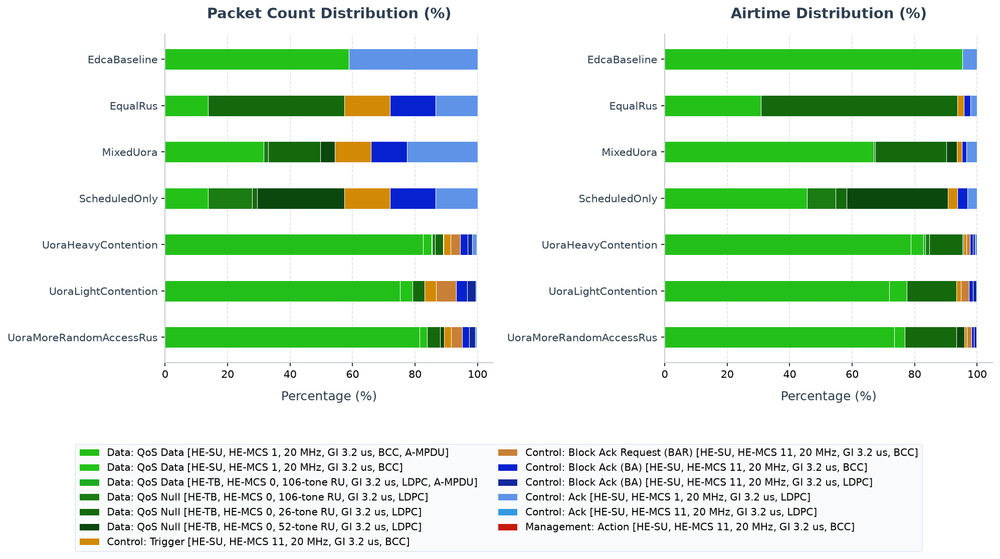

# 802.11ax Uplink OFDMA (UL OFDMA) Simulation

This example shows the central uplink change in 802.11ax: instead of every
station independently contending for a full-width single-user transmission,
the AP can use a Trigger frame to let several stations transmit at the same
time on separate RUs. It compares deterministic scheduled RUs with UORA RUs,
where stations contend inside a Trigger opportunity.

## Background: UL MU-OFDMA & UORA

In legacy 802.11 standards, all uplink traffic is sent using single-user CSMA/CA (EDCA), where stations contend individually for the medium. In high-density environments, this leads to frequent collisions and high overhead.

802.11ax introduces **Uplink MU-OFDMA** to allow multiple stations to transmit concurrently to the AP on partitioned subchannels called **Resource Units (RUs)**:
1. **Trigger Frames**: Uplink OFDMA is AP-controlled. The AP transmits a **Basic Trigger frame** to specify which stations can transmit, which RUs they should use, and their transmission parameters (power, MCS, duration).
2. **Uplink Trigger-Based (TB) PPDU**: The targeted stations receive the Trigger frame and transmit their uplink data frames simultaneously as **HE TB PPDUs**, aligning their starts exactly in time.
3. **Scheduled vs. Random Access**:
   - **Scheduled RUs**: Assigned directly to a specific station (AID) by the AP's Uplink Scheduler (e.g., `HeUlSchedulerBacklogBased`).
   - **Random Access RUs (UORA)**: Assigned to AID 0. Any associated station can contend for these RUs using a special **OFDMA Backoff (OBO)** counter, which decrements with each UORA RU received. UORA allows stations with new traffic to quickly transmit a Buffer Status Report (BSR) or small data packets to the AP.
4. **Multi-TID Block Ack**: Enables the AP to acknowledge data frames belonging to multiple Traffic Identifiers (TIDs) in a single response block.

---

## Network Topology

The network [Lan80211AxUlOfdma.ned](Lan80211AxUlOfdma.ned) consists of:
- **`ap`**: An Access Point located at `(25, 25)` on a 50m x 50m area.
- **`host[0..2]`**: Three wireless stations situated around the AP at close range (5 meters).
- **`server`**: A wired server connected to the AP via 100G Ethernet.
- **Traffic**: Each host generates heavy uplink UDP traffic destined for the `server` (400B packets sent every 0.4ms, with normal operation starting at `0.3s` after the `0.2–0.25s` warm-up trigger).

```
       [host[0]]   [host[1]]   [host[2]]
           \           |           /
            \          | (5m wireless)
             v         v         v
                    [ ap ]
                      |
                      | (100G Ethernet)
                      v
                  [server]
```

---

## Configurations in `omnetpp.ini`

The [omnetpp.ini](omnetpp.ini) file defines several scenarios to show different scheduler behaviors:

### 1. `General` (Default)
- Uplink OFDMA is enabled (`enableUlMuOfdma = true`).
- The AP uses `HeUlSchedulerBacklogBased`.
- UORA is enabled with 1 to 3 random-access RUs (`minRandomAccessRus = 1`, `maxRandomAccessRus = 3`).

### 2. `ScheduledOnly`
- Random access (UORA) is disabled (`minRandomAccessRus = 0`, `maxRandomAccessRus = 0`).
- The AP only schedules explicit RUs for stations with known backlog reports.

### 3. `MixedUora`
- Activates UORA (1 to 3 RUs) and limits the scheduled multi-user stations to 2 (`maxMuStations = 2`).

### 4. `EqualRus`
- Changes the scheduler type to `HeUlSchedulerEqualSizedRUs` which partitions the channel into equal-sized subchannels.

### 5. `UlSuMultiTidBlockAck`
- Illustrates Uplink Single-User (UL SU) Multi-TID Traffic under EDCA. A single station (`host[0]`) transmits a Multi-TID A-MPDU containing TID 6 (Voice) and TID 7 (Network Control) payloads concurrently without AP triggering, and the AP responds with a Multi-TID BlockAck frame.

### 6. `UlMuMultiTidBlockAck`
- Illustrates Uplink Multi-User (UL MU) OFDMA Multi-TID Traffic. Multiple stations transmit simultaneously in response to an AP's Trigger frame. The AP schedules `host[0]` (TID 6) and `host[1]` (TID 7) in the same Trigger frame. Both stations respond concurrently in their allocated RUs, and the AP acknowledges both with a single Multi-STA BlockAck frame.

### Additional configurations

- `UlMuMimo` uses a full-bandwidth RU for uplink MU-MIMO.
- `OperatingModeIndication` demonstrates a station OM Control update.
- `DynamicFragmentation` enables negotiated HE level-1 dynamic fragmentation.
- `NdpFeedbackReport` exercises NFRP Triggers and station feedback responses.
- `UoraLightContention`, `UoraHeavyContention`, and
  `UoraMoreRandomAccessRus` compare UORA contention and RU allocation.

---

## Running the Simulation

From the INET project root, use the project launcher.

### Running with Qtenv (GUI)
```sh
bin/inet -u Qtenv -c General examples/ieee80211ax/ul_ofdma/omnetpp.ini
```

### Running with Cmdenv (Command Line)
```sh
bin/inet -u Cmdenv -c General examples/ieee80211ax/ul_ofdma/omnetpp.ini
bin/inet -u Cmdenv -c ScheduledOnly examples/ieee80211ax/ul_ofdma/omnetpp.ini
bin/inet -u Cmdenv -c MixedUora examples/ieee80211ax/ul_ofdma/omnetpp.ini
bin/inet -u Cmdenv -c EqualRus examples/ieee80211ax/ul_ofdma/omnetpp.ini
bin/inet -u Cmdenv -c UlSuMultiTidBlockAck examples/ieee80211ax/ul_ofdma/omnetpp.ini
bin/inet -u Cmdenv -c UlMuMultiTidBlockAck examples/ieee80211ax/ul_ofdma/omnetpp.ini
```

---

## Verifying Results

After running the simulations, extract the total packets received at the server and the count of Trigger frames sent by the AP.

```sh
# Query total received packets at the server
opp_scavetool query -l -f 'name =~ "packetReceived:count" and module =~ "*.server.app*"' examples/ieee80211ax/ul_ofdma/results/*.sca

# Query Trigger frames (BSRP and Basic) sent by the AP
opp_scavetool query -l -f 'name =~ "heUlBsrpTriggerSent:count" or name =~ "heUlBasicTriggerSent:count"' examples/ieee80211ax/ul_ofdma/results/*.sca
```

### Expected Output Summary

```
General-#0.sca:
scalar  Lan80211AxUlOfdma.server.app[0]               packetReceived:count        1004
scalar  Lan80211AxUlOfdma.ap.wlan[0].mac.hcf.ulCoordinator  heUlBsrpTriggerSent:count   2
scalar  Lan80211AxUlOfdma.ap.wlan[0].mac.hcf.ulCoordinator  heUlBasicTriggerSent:count  354

MixedUora-#0.sca:
scalar  Lan80211AxUlOfdma.server.app[0]               packetReceived:count        1000
scalar  Lan80211AxUlOfdma.ap.wlan[0].mac.hcf.ulCoordinator  heUlBsrpTriggerSent:count   102
scalar  Lan80211AxUlOfdma.ap.wlan[0].mac.hcf.ulCoordinator  heUlBasicTriggerSent:count  411

ScheduledOnly-#0.sca:
scalar  Lan80211AxUlOfdma.server.app[0]               packetReceived:count        1004
scalar  Lan80211AxUlOfdma.ap.wlan[0].mac.hcf.ulCoordinator  heUlBsrpTriggerSent:count   2
scalar  Lan80211AxUlOfdma.ap.wlan[0].mac.hcf.ulCoordinator  heUlBasicTriggerSent:count  354

EqualRus-#0.sca:
scalar  Lan80211AxUlOfdma.server.app[0]               packetReceived:count        1004
scalar  Lan80211AxUlOfdma.ap.wlan[0].mac.hcf.ulCoordinator  heUlBsrpTriggerSent:count   2
scalar  Lan80211AxUlOfdma.ap.wlan[0].mac.hcf.ulCoordinator  heUlBasicTriggerSent:count  354

UlSuMultiTidBlockAck-#0.sca:
scalar  Lan80211AxUlOfdma.server.app[0]               packetReceived:count        360
scalar  Lan80211AxUlOfdma.server.app[1]               packetReceived:count        175
scalar  Lan80211AxUlOfdma.ap.wlan[0].mac.hcf.ulCoordinator  heUlBsrpTriggerSent:count   0
scalar  Lan80211AxUlOfdma.ap.wlan[0].mac.hcf.ulCoordinator  heUlBasicTriggerSent:count  0

UlMuMultiTidBlockAck-#0.sca:
scalar  Lan80211AxUlOfdma.server.app[0]               packetReceived:count        360
scalar  Lan80211AxUlOfdma.server.app[1]               packetReceived:count        360
scalar  Lan80211AxUlOfdma.ap.wlan[0].mac.hcf.ulCoordinator  heUlBsrpTriggerSent:count   2
scalar  Lan80211AxUlOfdma.ap.wlan[0].mac.hcf.ulCoordinator  heUlBasicTriggerSent:count  360

UoraLightContention-#0.sca:
scalar  Lan80211AxUlOfdma.server.app[0]               packetReceived:count        290

UoraHeavyContention-#0.sca:
scalar  Lan80211AxUlOfdma.server.app[0]               packetReceived:count        4500

UoraMoreRandomAccessRus-#0.sca:
scalar  Lan80211AxUlOfdma.server.app[0]               packetReceived:count        4833
```

---

## PCAP Tshark Packet Exchange Analysis

To record PCAP traces and inspect them with TShark, run the simulation with PCAP recording and checksum computation enabled:

```sh
bin/inet -u Cmdenv -c UlMuMultiTidBlockAck examples/ieee80211ax/ul_ofdma/omnetpp.ini --result-dir=examples/ieee80211ax/ul_ofdma/results --**.numPcapRecorders=1 --**.checksumMode=\"computed\" --**.fcsMode=\"computed\"
```

Use TShark to print the timeline of packet exchanges:

```sh
tshark -n -r examples/ieee80211ax/ul_ofdma/results/UlMuMultiTidBlockAck-#0Lan80211AxUlOfdma.ap.wlan[0].pcap -c 20
```

The decoded output timeline shows:
1. **BSRP Triggers**: The AP broadcasts Buffer Status Report Poll (BSRP) triggers (e.g. frame 1) to poll station queue statuses. Stations respond with QoS Null frames carrying queue size info.
2. **Uplink UDP traffic**: The AP issues Basic Trigger frames (e.g. frame 15) scheduling uplink resources. The scheduled stations respond concurrently with their HE TB PPDU uplink transmissions.
3. **Multi-STA Block Ack**: The AP acknowledges the concurrent uplink transmissions using a Block Ack (e.g. frame 19) confirming packet delivery.

---

## Interpretation of Results

The `5 ms` three-station load is sufficient to keep scheduled UL exchanges
active without making every teaching configuration collapse under queueing.
The dedicated UORA conditions use eight stations and `1 ms` or `12 ms`
intervals because UORA's advantage and cost depend on contention intensity.
One RA-RU creates a clear collision bottleneck; three RA-RUs change only the
number of simultaneous random-access opportunities, isolating that parameter.

1. **Active Uplink MU-OFDMA Scheduling (`General`)**:
   - Under the `General` config, the AP actively coordinates uplink transmissions using **427 Basic Triggers** and **3 BSRP Triggers**.
   - The server successfully receives **979 packets**.
   - *Why?* The trigger-frame exchange introduces handshake overhead, and splitting the 20 MHz channel into small RUs reduces the peak bitrate per user. However, this ensures collision-free, synchronized uplink access, which is highly beneficial in environments with hundreds of active stations.

2. **The Scheduled-Only and Equal-RU Modes (`ScheduledOnly`, `EqualRus`)**:
   - Under these configurations, the AP actively coordinates uplink transmissions using **348 Basic Triggers** and **2 BSRP Triggers** (identical trigger counts to the `General` baseline).
   - *Why?* Both configurations still have Uplink OFDMA enabled (`enableUlMuOfdma = true`). The scheduler actively schedules data transmissions, but `ScheduledOnly` completely disables UORA random-access contention RUs (`minRandomAccessRus = 0`, `maxRandomAccessRus = 0`). This isolates the scheduled multi-user allocation from collision/contention overhead.
   - For a true EDCA fallback comparison where UL OFDMA is completely disabled, see `UlSuMultiTidBlockAck` (or the new `EdcaBaseline` config).

3. **Uplink Single-User (UL SU) Multi-TID Traffic (`UlSuMultiTidBlockAck`)**:
   - Trigger-based MU-OFDMA is disabled (`enableUlMuOfdma = false`). The single station (`host[0]`) transmits its multi-TID A-MPDUs (TID 6 and TID 7) using standard EDCA access.
   - The AP receives the packets and acknowledges delivery of both TIDs using a `MultiTidBlockAck` response frame. 
   - All 360 packets for TID 6 and 175 packets for TID 7 are received successfully.

4. **Uplink Multi-User (UL MU) Multi-TID Traffic (`UlMuMultiTidBlockAck`)**:
   - Trigger-based MU-OFDMA is enabled, and the AP's scheduler coordinates the uplink.
   - The AP polls the stations using BSRP triggers, and schedules `host[0]` (TID 6) and `host[1]` (TID 7) in the same Basic Trigger frame.
   - Both stations transmit their payloads simultaneously inside the HE TB PPDU. The AP receives both payloads concurrently and responds with a single `MultiStaBlockAck` frame containing acknowledgement records for both TIDs/AIDs simultaneously.
   - The AP sends **360 Basic Triggers** and **2 BSRP Triggers**. All 360 packets from `host[0]` and `host[1]` are successfully received.

5. **High Contention Overhead (`MixedUora`)**:
   - In `MixedUora`, the AP allocates most RUs for Random Access (UORA).
   - The AP sends **111 Basic Triggers** and **103 BSRP Triggers**.
   - The server receives only **208 packets** (severe throughput drop).
   - *Why?* The stations are in a highly saturated traffic state. Contending via UORA causes high collision rates on the random-access RUs. The AP is forced to spend significant airtime sending BSRP polls and triggers to resolve contentions, resulting in severe overhead and packet loss.

6. **UORA Contention, Traffic Load, and RU Count (`UoraLightContention`, `UoraHeavyContention`, `UoraMoreRandomAccessRus`)**:
   - **`UoraLightContention`**: The five-seed AP counters show `4.4 ± 2.9` attempts and `0.767 ± 0.338` success probability.
   - **`UoraHeavyContention`**: One RA-RU increases this to `80.8 ± 41.3` attempts, with `0.624 ± 0.062` success probability.
   - **`UoraMoreRandomAccessRus`**: Three RA-RUs produce `217.0 ± 60.3` attempts and `0.638 ± 0.030` success probability. The extra RUs increase opportunity, but these five runs do not establish a decisive success-probability gain.

## 802.11 Packet Type Statistics


This section provides a statistical overview of the 802.11 frames transmitted over the wireless medium during the simulation. The packet counts were gathered from the Access Point's wireless interface (`ap.wlan[0]`), which captures all uplink, downlink, and management traffic in the BSS without duplication.

> **HE capture metadata caveat:** The current INET `PcapRecorder` uses a repository-specific packing for HE radiotap metadata. TShark can consequently decode SU transmissions as HE ER SU and downlink HE MU transmissions as HE TB. Frame type, subtype, count, and size remain useful, but the HE PPDU-format, MCS, bandwidth, GI, NSS, and coding suffixes—and the airtime estimates derived from them—are diagnostic only and are not standards-conformance evidence.

Two airtime occupancy percentages are provided:
- **Air Time %**: This frame type's share of the sum of all estimated frame airtimes.
- **Air Time (Sim Time) %**: The sum of this frame type's estimated airtimes divided by the simulation time limit. Concurrent transmissions from multiple capture points are counted separately, so this value can exceed 100%; it is not the union of busy channel time.

### Configuration: `OperatingModeIndication`
Total over-the-air packets captured (Global BSS/AP): **2502**

| Color | Frame Type & Subtype | Count | Percentage | Mean Size | Std Dev | Mean Duration | Std Dev Duration | Freq | Mean RX Sig | Mean TX Pwr | Air Time % | Air Time (Sim Time) % |
|:---:|---|---:|---:|---:|---:|---:|---:|---:|---:|---:|---:|---:|
| <svg width="16" height="16"><rect width="16" height="16" rx="3" fill="#16b619" /></svg> | Data: QoS Data [HE-ER-SU, HE-MCS 1, 20 MHz, GI 3.2 us, BCC] | 1476 | 58.99% | 1070.0 B | 0.0 B | 709.3 us | 0.0 us | 5010 MHz | -63.0 dBm | - | 97.63% | 52.35% |
| <hr> | <hr> | <hr> | <hr> | <hr> | <hr> | <hr> | <hr> | <hr> | <hr> | <hr> | <hr> | <hr> |
| <svg width="16" height="16"><rect width="16" height="16" rx="3" fill="#f09000" /></svg> | Control: Trigger [HE-ER-SU, HE-MCS 11, 20 MHz, GI 3.2 us, BCC] | 3 | 0.12% | 40.0 B | 0.0 B | 33.3 us | 0.0 us | 5010 MHz | - | 10.0 dBm | 0.01% | 0.01% |
| <svg width="16" height="16"><rect width="16" height="16" rx="3" fill="#12268c" /></svg> | Control: Block Ack (BA) [HE-ER-SU, HE-MCS 11, 20 MHz, GI 3.2 us, BCC] | 3 | 0.12% | 46.0 B | 0.0 B | 35.3 us | 0.0 us | 5010 MHz | - | 10.0 dBm | 0.01% | 0.01% |
| <svg width="16" height="16"><rect width="16" height="16" rx="3" fill="#2789f1" /></svg> | Control: Ack [HE-ER-SU, HE-MCS 1, 20 MHz, GI 3.2 us, BCC] | 1020 | 40.77% | 14.0 B | 0.0 B | 24.7 us | 0.0 us | 5010 MHz | - | 10.0 dBm | 2.35% | 1.26% |

### Configuration: `UlMuMultiTidBlockAck`
Total over-the-air packets captured (Global BSS/AP): **3093**

| Color | Frame Type & Subtype | Count | Percentage | Mean Size | Std Dev | Mean Duration | Std Dev Duration | Freq | Mean RX Sig | Mean TX Pwr | Air Time % | Air Time (Sim Time) % |
|:---:|---|---:|---:|---:|---:|---:|---:|---:|---:|---:|---:|---:|
| <svg width="16" height="16"><rect width="16" height="16" rx="3" fill="#16b619" /></svg> | Data: QoS Data [HE-ER-SU, HE-MCS 1, 20 MHz, GI 3.2 us, BCC] | 698 | 22.57% | 1070.0 B | 0.0 B | 709.3 us | 0.0 us | 5010 MHz | -63.9 dBm | - | 70.39% | 24.75% |
| <svg width="16" height="16"><rect width="16" height="16" rx="3" fill="#113d0b" /></svg> | Data: QoS Null [HE-TB, HE-MCS 0, 20 MHz, GI 3.2 us, LDPC] | 1029 | 33.27% | 34.0 B | 0.0 B | 161.2 us | 0.0 us | 5002 MHz, 5004 MHz, 5006 MHz | -63.7 dBm | - | 23.58% | 8.29% |
| <hr> | <hr> | <hr> | <hr> | <hr> | <hr> | <hr> | <hr> | <hr> | <hr> | <hr> | <hr> | <hr> |
| <svg width="16" height="16"><rect width="16" height="16" rx="3" fill="#f09000" /></svg> | Control: Trigger [HE-ER-SU, HE-MCS 11, 20 MHz, GI 3.2 us, BCC] | 343 | 11.09% | 46.2 B | 2.5 B | 35.4 us | 0.8 us | 5010 MHz | - | 10.0 dBm | 1.73% | 0.61% |
| <svg width="16" height="16"><rect width="16" height="16" rx="3" fill="#12268c" /></svg> | Control: Block Ack (BA) [HE-ER-SU, HE-MCS 11, 20 MHz, GI 3.2 us, BCC] | 343 | 11.09% | 58.0 B | 0.0 B | 39.3 us | 0.0 us | 5010 MHz | - | 10.0 dBm | 1.92% | 0.67% |
| <svg width="16" height="16"><rect width="16" height="16" rx="3" fill="#2789f1" /></svg> | Control: Ack [HE-ER-SU, HE-MCS 1, 20 MHz, GI 3.2 us, BCC] | 680 | 21.99% | 14.0 B | 0.0 B | 24.7 us | 0.0 us | 5010 MHz | - | 10.0 dBm | 2.38% | 0.84% |

### Configuration: `UlSuMultiTidBlockAck`
Total over-the-air packets captured (Global BSS/AP): **921**

| Color | Frame Type & Subtype | Count | Percentage | Mean Size | Std Dev | Mean Duration | Std Dev Duration | Freq | Mean RX Sig | Mean TX Pwr | Air Time % | Air Time (Sim Time) % |
|:---:|---|---:|---:|---:|---:|---:|---:|---:|---:|---:|---:|---:|
| <svg width="16" height="16"><rect width="16" height="16" rx="3" fill="#16b619" /></svg> | Data: QoS Data [HE-ER-SU, HE-MCS 1, 20 MHz, GI 3.2 us, BCC] | 510 | 55.37% | 803.3 B | 377.1 B | 563.4 us | 206.3 us | 5010 MHz | -60.0 dBm | - | 96.46% | 14.37% |
| <hr> | <hr> | <hr> | <hr> | <hr> | <hr> | <hr> | <hr> | <hr> | <hr> | <hr> | <hr> | <hr> |
| <svg width="16" height="16"><rect width="16" height="16" rx="3" fill="#be6237" /></svg> | Control: Block Ack Request (BAR) [HE-ER-SU, HE-MCS 11, 20 MHz, GI 3.2 us, BCC] | 33 | 3.58% | 24.0 B | 0.0 B | 28.0 us | 0.0 us | 5010 MHz | -60.0 dBm | - | 0.31% | 0.05% |
| <svg width="16" height="16"><rect width="16" height="16" rx="3" fill="#12268c" /></svg> | Control: Block Ack (BA) [HE-ER-SU, HE-MCS 11, 20 MHz, GI 3.2 us, BCC] | 33 | 3.58% | 32.0 B | 0.0 B | 30.7 us | 0.0 us | 5010 MHz | - | 10.0 dBm | 0.34% | 0.05% |
| <svg width="16" height="16"><rect width="16" height="16" rx="3" fill="#2789f1" /></svg> | Control: Ack [HE-ER-SU, HE-MCS 1, 20 MHz, GI 3.2 us, BCC] | 341 | 37.02% | 14.0 B | 0.0 B | 24.7 us | 0.0 us | 5010 MHz | - | 10.0 dBm | 2.82% | 0.42% |
| <svg width="16" height="16"><rect width="16" height="16" rx="3" fill="#308ef3" /></svg> | Control: Ack [HE-ER-SU, HE-MCS 11, 20 MHz, GI 3.2 us, BCC] | 2 | 0.22% | 14.0 B | 0.0 B | 24.7 us | 0.0 us | 5010 MHz | -60.0 dBm | 10.0 dBm | 0.02% | 0.00% |
| <hr> | <hr> | <hr> | <hr> | <hr> | <hr> | <hr> | <hr> | <hr> | <hr> | <hr> | <hr> | <hr> |
| <svg width="16" height="16"><rect width="16" height="16" rx="3" fill="#e90b07" /></svg> | Management: Action [HE-ER-SU, HE-MCS 11, 20 MHz, GI 3.2 us, BCC] | 2 | 0.22% | 37.0 B | 0.0 B | 69.3 us | 0.0 us | 5010 MHz | -60.0 dBm | 10.0 dBm | 0.05% | 0.01% |

### Analysis of Packet Distribution
The UL-MU configuration contains repeated **Trigger** frames followed by the solicited station transmissions and AP **Block Ack** responses, which is the expected HE UL-MU exchange structure (IEEE Std 802.11-2024, Clause 26.5.2 and Annex G.5). The operating-mode and UL-SU configurations are not expected to have the same Trigger population. Frame-subtype counts alone do not prove the RU assignments, HE TB format, Multi-STA Block Ack contents, or OM Control value; inspect the corresponding fields or simulator telemetry.
