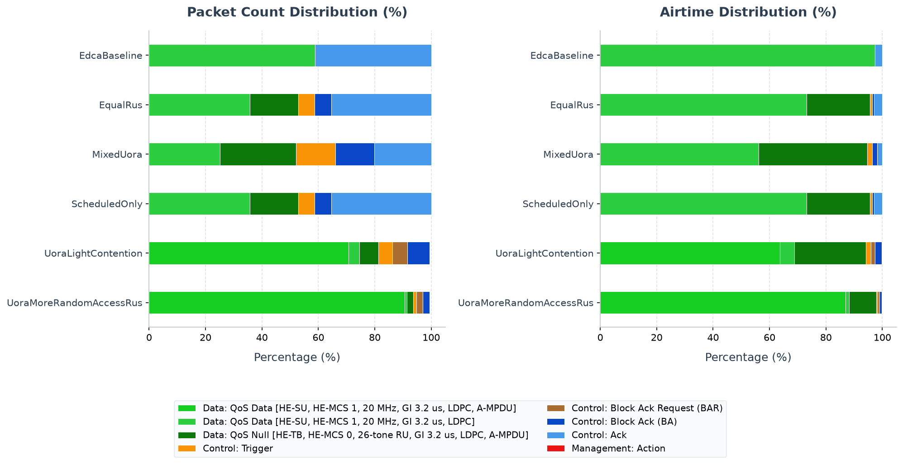

# Walkthrough: 802.11ax Uplink OFDMA and UORA

<!-- BEGIN SCRIPT RESULTS SESSIONS -->
`[script]` results sessions:

- Scalar/vector: `20260725T181500Z`
- PCAP: `20260725T233546Z`
<!-- END SCRIPT RESULTS SESSIONS -->

`[agent]` results sessions: `20260725T181500Z`, `20260725T182100Z`, `20260725T233546Z`.

This example provides scheduled-uplink, mixed-access, and UORA configurations.
The retained evidence includes a five-run UORA comparison and a separate run-0
packet-exchange appendix.

## [agent] Learning objectives and feature primer

After completing this walkthrough, the reader can:

- explain AP-scheduled uplink OFDMA and uplink OFDMA random access (UORA);
- read a Basic Trigger's association-identifier (AID12) entries to distinguish
  scheduled users from random-access RUs (RA-RUs);
- relate UORA attempts/successes and Jain fairness to contention; and
- reproduce a Trigger → simultaneous HE-TB response → Block Ack timeline.

For scheduled uplink, the access point (AP) names stations and resource units
(RUs) in a Basic Trigger. UORA instead advertises RA-RUs with AID12 zero.
Eligible stations decrement an OFDMA backoff counter and may choose the same
RA-RU; simultaneous same-frequency responses make contention visible. INET's
coordinator counters, not frame totals alone, decide whether attempts succeed.

## [agent] Scenario description

The [network](Lan80211AxUlOfdma.ned) extends the common single-BSS topology
with one AP, a wired server, and three or eight fixed stations. The
[configuration](omnetpp.ini) uses 5 GHz, 20 MHz, one stationary close-range
BSS, no external interferer, and a 2 s run. Warm-up traffic begins at 0.2 s to
establish Block Ack; measured uplink begins at 0.3 s.

```text
host[0..N-1] -- HE uplink --> AP === wired LAN === server
                    Trigger <--
```

Three-STA configurations send 1000-byte payloads every 5 ms. Eight-STA UORA
loads use 100-byte payloads every 4 ms (light) or 1 ms (heavy). This stresses
contention and scheduled/random-access capacity, not mobility or coverage.

## [agent] Standards and INET model boundary

IEEE Std 802.11-2024 Clause 26.5.4.1 permits a Basic Trigger to allocate
RA-RUs and requires UORA-capable stations to maintain OFDMA contention-window
and backoff state (`80211ax-2024:chunk:09810`). AID12 zero represents RA-RUs
for associated stations in the observed Trigger encoding. HE trigger-based
uplink responses use HE-TB PPDUs.

INET implements this with `HeHcf`, an AP UL coordinator/scheduler, modeled
UORA counters, and typed radiotap HE observations. The model's attempt/success
counters are authoritative for its classification. Captured same-RU responses
are direct contention evidence, but absence of a decoded response is not by
itself a modeled failure.

## [agent] Evidence status

| Claim or check | Status | Authoritative evidence | Runs/seeds | Scope or gap |
|---|---|---|---|---|
| UORA attempts/successes are recorded | `PASS` | per-STA coordinator scalars | session `20260725T181500Z`, runs/seeds 0–4 | four configurations |
| Five RA-RUs improve heavy-load UORA success | `PASS` | matched run-level counters | heavy 1-RU vs 5-RU, five seeds | 0.8 vs 7.2 mean successes |
| Trigger frames advertise AID12-zero RA-RUs | `PASS` | AP captures | packet sessions, run 0 | one vs five entries |
| Same-RU contention is visible | `PASS` | same-time/same-frequency HE-TB responses | run-0 captures | direct observations |
| Packet frames cause exact scalar outcomes | `INCONCLUSIVE` | separate sessions | — | instrumentation changes trajectory |

The scalar/vector campaign and packet sessions are separate experiments.
PcapRecorder instrumentation changes the event trajectory, so exact run-0
counter values are not expected to match between them. Compare configurations
within a session, and use PCAP for frame-level behavior rather than substituting
its frame counts for the UORA outcome counters.

## [agent] Configuration matrix

The configuration inputs in this table are defined by [the INI file](omnetpp.ini).

| Config | Stations and measured traffic | UL access | Configured RA-RUs |
|---|---|---|---:|
| `EdcaBaseline` | 3, 1000 B / 5 ms | EDCA | 0 |
| `ScheduledOnly` | 3, 1000 B / 5 ms | backlog-scheduled | 0 |
| `EqualRus` | 3, 1000 B / 5 ms | equal-sized scheduled RUs | 0 |
| `MixedUora` | 3, 1000 B / 5 ms | scheduled plus UORA | 1–3 |
| `UoraLightContention` | 8, 100 B / 4 ms | scheduled plus UORA | 1 |
| `UoraHeavyContention` | 8, 100 B / 1 ms | scheduled plus UORA | 1 |
| `UoraMoreRandomAccessRus` | 8, 100 B / 1 ms | scheduled plus UORA | 5 |

The last two rows have the same station count, packet size, packet interval,
measurement window, and scheduler family; their configured RA-RU count differs.
This makes them the matched heavy-load comparison documented below.

## [agent] Expected invariants and diagnostic map

| Invariant | Evidence and observation point | Failure symptom | Likely subsystem | Next diagnostic |
|---|---|---|---|---|
| Basic Trigger advertises configured RA-RUs | AP AID12 fields | wrong zero-entry count | UL scheduler/Trigger encoding | typed Trigger decode and config trace |
| Contending STAs emit HE-TB responses | AP same-time RU observations | no responses despite attempts | UORA backoff/MAC/PHY | STA/AP capture plus coordinator logs |
| Success counters match model decisions | per-STA attempt/success scalars | impossible ratio or empty matches | coordinator signals/recording | narrow scalar query and source trace |
| Heavy 5-RU treatment exceeds heavy 1-RU success | paired run aggregation | no increase across seeds | RU allocation/contention | inspect per-run Trigger opportunities |

## [agent] Reproduction

Run from the INET repository root. This command was **not executed during this
rewrite**; status: `NOT RUN`.

```sh
bin/inet -u Cmdenv -f examples/ieee80211ax/ul_ofdma/omnetpp.ini \
  -c UoraMoreRandomAccessRus -r 0 \
  --result-dir=/tmp/inet-uora-more-ra-rus-r0
```

The scalar/vector session is historical. The suite-owned packet command below
was executed with exit status 0 and created session `20260725T233546Z`:

```sh
MPLCONFIGDIR=/tmp/matplotlib \
  python3 examples/ieee80211/analysis/analyze_pcap.py \
  --suite examples/ieee80211/analysis/suites/ax.json \
  --generate --subdir ul_ofdma --run 0 --allow-failed-evidence
```

## [agent] Scalar and vector analysis

The evidence is the per-STA scalar pair
`heUlRandomAccessAttempt:count` and `heUlRandomAccessSuccess:count` in the 15
`.sca` files under the three eight-STA configuration directories and the five
`.sca` files under `MixedUora`. Success probability is the run total of
successes divided by the run total of attempts.
Fairness is the Jain index over the per-STA success counts—three for
`MixedUora`, eight for the other conditions—and is undefined for an
all-zero-success run. These counters cover the complete `0–2 s` simulation;
the INI file defines application phases but no OMNeT++ `warmup-period`.


| Condition | Mean attempts | Mean success probability | Mean successful transmissions | Success fairness |
|---|---:|---:|---:|---:|
| Mixed, adaptive 1–3 RA-RUs | 68.6 ± 11.7 | 1.000 ± 0.000 | 68.6 ± 11.7 | 0.661 ± 0.003 |
| Light, 1 RA-RU | 213.4 ± 55.6 | 0.078 ± 0.029 | 16.2 ± 5.1 | 0.475 ± 0.181 |
| Heavy, 1 RA-RU | 9.4 ± 5.1 | 0.120 ± 0.157 | 0.8 ± 0.6 | 0.125 over four defined runs |
| Heavy, 5 RA-RUs | 19.2 ± 7.8 | 0.370 ± 0.123 | 7.2 ± 4.0 | 0.543 ± 0.184 |

Means and two-sided 95% Student-t confidence intervals use runs 0–4. The
heavy-contention, one-RA-RU fairness row excludes run 1 because all eight
success counts are zero; the other four defined fairness values are each
0.125. `MixedUora` is a reference, not a matched fourth treatment: it has three
stations, 1000-byte packets every 5 ms, and an adaptive 1–3 RA-RU range. The
other conditions have eight stations and 100-byte packets. Only
`UoraHeavyContention` and `UoraMoreRandomAccessRus` hold station count, offered
load, packet size, scheduler, seeds, and run duration fixed while changing the
RA-RU count.

The plot generator fails closed if any retained run records no attempts, or if
all runs of a condition record zero successes. This makes missing UORA
instrumentation or a completely inactive condition a generation error rather
than an empty-looking chart.

### [agent] Scalar and vector interpretation by configuration

The UORA attempt/success signals have `count` scalar recorders but no
attempt/success vectors. The temporal evidence therefore comes from
`endToEndDelay:vector` at `server.app[0]`. The table below first computes one
mean over delivered packets in `[0.3 s, 2 s)` for each run, then reports the
mean and 95% t interval over the five run means. It is delivery-conditioned:
packets still queued at 2 s do not contribute.

| Configuration | Mean end-to-end delay | Run-0 delivered samples | Run-0 delay range |
|---|---:|---:|---:|
| `MixedUora` | 3.115 ± 0.211 ms | 1018 | 0.666–13.729 ms |
| `UoraLightContention` | 22.615 ± 4.905 ms | 3357 | 0.208–165.869 ms |
| `UoraHeavyContention` | 136.335 ± 37.209 ms | 6920 | 0.233–1211.051 ms |
| `UoraMoreRandomAccessRus` | 126.196 ± 12.746 ms | 7322 | 0.182–1143.597 ms |

- **`MixedUora`:** `maxMuStations=2` lets the scheduler serve one part of the
  three-STA workload while the advertised random-access RU serves the other
  part. Across all five runs, host 0 records no UORA attempts and hosts 1–2
  account for all 68.6 mean successes. The perfect UORA success probability
  therefore describes a lightly contended random-access path, while the Jain
  value near two thirds mechanically reflects the scheduled/UORA role split;
  it is not evidence of unfair total service. The low delay vector is
  consistent with the modest three-STA load.

- **`UoraLightContention`:** fixing one RA-RU while expanding to eight STAs
  creates many eligibility events—213.4 attempts per run—but only 7.8% become
  recorded successes. Successes are spread unevenly across STAs, producing
  0.475 Jain fairness. The 22.6 ms mean delay is well below the heavy-load
  values because 100-byte packets arrive every 4 ms rather than every 1 ms.

- **`UoraHeavyContention`:** only the arrival interval changes from 4 ms to
  1 ms. The heavy backlog keeps the medium busy and sharply reduces the number
  of Basic Trigger opportunities, so the UORA attempt count falls rather than
  rising with offered load. One run has no success and every other run has a
  success at only one STA, explaining both the wide probability interval and
  Jain value 0.125. The delay vector shows the consequence of overload: a
  136 ms five-run mean and a run-0 tail beyond 1.2 s.

- **`UoraMoreRandomAccessRus`:** this is the matched heavy-load treatment.
  Five advertised RA-RUs give eligible stations more choices per Basic Trigger.
  The retained sample records about nine times as many UORA successes as the
  one-RU heavy condition (7.2 versus 0.8), a higher success probability, and
  success across more STAs. Its delivery-conditioned mean delay is only
  modestly lower and the confidence intervals overlap: reserving additional
  random-access RUs also leaves fewer RUs for scheduled service, and the
  workload remains overloaded. The evidence supports increased UORA capacity
  in this sample, not an optimal RA-RU count.

<!-- BEGIN GENERATED: ieee80211-scalar-vector-uora -->
### [script] Generated scalar/vector plot and table


Figure provenance: [`../analysis/figures/ul_ofdma/uora-dashboard.png.json`](../analysis/figures/ul_ofdma/uora-dashboard.png.json). Run-level metric source: [`../analysis/metrics.json`](../analysis/metrics.json).

| Configuration or comparison | Metric | Source result filters / modules / units | Window / per-run aggregation / exclusions | Independent runs (n) | Mean or direct value | 95% CI half-width |
|---|---|---|---|---:|---:|---:|
| Heavy, 1 RA-RU | attempts | scalar / heUlRandomAccessAttempt:count<br>scalar / heUlRandomAccessSuccess:count | [0.3, 2.0) s; fairness=Jain index over runs with at least one successful transmission; all-zero runs are excluded as undefined; observation=one value per run; uncertainty=95% Student-t CI; zero_success_runs={'MixedUora': 0, 'UoraHeavyContention': 1, 'UoraLightContention': 0, 'UoraMoreRandomAccessRus': 0} | 5 | 9.4 | 5.08931 |
| Heavy, 1 RA-RU | success fairness | scalar / heUlRandomAccessAttempt:count<br>scalar / heUlRandomAccessSuccess:count | [0.3, 2.0) s; fairness=Jain index over runs with at least one successful transmission; all-zero runs are excluded as undefined; observation=one value per run; uncertainty=95% Student-t CI; zero_success_runs={'MixedUora': 0, 'UoraHeavyContention': 1, 'UoraLightContention': 0, 'UoraMoreRandomAccessRus': 0} | 4 | 0.125 | 0 |
| Heavy, 1 RA-RU | success probability | scalar / heUlRandomAccessAttempt:count<br>scalar / heUlRandomAccessSuccess:count | [0.3, 2.0) s; fairness=Jain index over runs with at least one successful transmission; all-zero runs are excluded as undefined; observation=one value per run; uncertainty=95% Student-t CI; zero_success_runs={'MixedUora': 0, 'UoraHeavyContention': 1, 'UoraLightContention': 0, 'UoraMoreRandomAccessRus': 0} | 5 | 0.119658 | 0.156692 |
| Heavy, 1 RA-RU | successful transmissions | scalar / heUlRandomAccessAttempt:count<br>scalar / heUlRandomAccessSuccess:count | [0.3, 2.0) s; fairness=Jain index over runs with at least one successful transmission; all-zero runs are excluded as undefined; observation=one value per run; uncertainty=95% Student-t CI; zero_success_runs={'MixedUora': 0, 'UoraHeavyContention': 1, 'UoraLightContention': 0, 'UoraMoreRandomAccessRus': 0} | 5 | 0.8 | 0.555289 |
| Heavy, 1 RA-RU | zero success run count | scalar / heUlRandomAccessAttempt:count<br>scalar / heUlRandomAccessSuccess:count | [0.3, 2.0) s; fairness=Jain index over runs with at least one successful transmission; all-zero runs are excluded as undefined; observation=one value per run; uncertainty=95% Student-t CI; zero_success_runs={'MixedUora': 0, 'UoraHeavyContention': 1, 'UoraLightContention': 0, 'UoraMoreRandomAccessRus': 0} | — | 1 | — |
| Heavy, 5 RA-RUs | attempts | scalar / heUlRandomAccessAttempt:count<br>scalar / heUlRandomAccessSuccess:count | [0.3, 2.0) s; fairness=Jain index over runs with at least one successful transmission; all-zero runs are excluded as undefined; observation=one value per run; uncertainty=95% Student-t CI; zero_success_runs={'MixedUora': 0, 'UoraHeavyContention': 1, 'UoraLightContention': 0, 'UoraMoreRandomAccessRus': 0} | 5 | 19.2 | 7.77405 |
| Heavy, 5 RA-RUs | success fairness | scalar / heUlRandomAccessAttempt:count<br>scalar / heUlRandomAccessSuccess:count | [0.3, 2.0) s; fairness=Jain index over runs with at least one successful transmission; all-zero runs are excluded as undefined; observation=one value per run; uncertainty=95% Student-t CI; zero_success_runs={'MixedUora': 0, 'UoraHeavyContention': 1, 'UoraLightContention': 0, 'UoraMoreRandomAccessRus': 0} | 5 | 0.543333 | 0.184415 |
| Heavy, 5 RA-RUs | success probability | scalar / heUlRandomAccessAttempt:count<br>scalar / heUlRandomAccessSuccess:count | [0.3, 2.0) s; fairness=Jain index over runs with at least one successful transmission; all-zero runs are excluded as undefined; observation=one value per run; uncertainty=95% Student-t CI; zero_success_runs={'MixedUora': 0, 'UoraHeavyContention': 1, 'UoraLightContention': 0, 'UoraMoreRandomAccessRus': 0} | 5 | 0.370399 | 0.122753 |
| Heavy, 5 RA-RUs | successful transmissions | scalar / heUlRandomAccessAttempt:count<br>scalar / heUlRandomAccessSuccess:count | [0.3, 2.0) s; fairness=Jain index over runs with at least one successful transmission; all-zero runs are excluded as undefined; observation=one value per run; uncertainty=95% Student-t CI; zero_success_runs={'MixedUora': 0, 'UoraHeavyContention': 1, 'UoraLightContention': 0, 'UoraMoreRandomAccessRus': 0} | 5 | 7.2 | 3.96556 |
| Heavy, 5 RA-RUs | zero success run count | scalar / heUlRandomAccessAttempt:count<br>scalar / heUlRandomAccessSuccess:count | [0.3, 2.0) s; fairness=Jain index over runs with at least one successful transmission; all-zero runs are excluded as undefined; observation=one value per run; uncertainty=95% Student-t CI; zero_success_runs={'MixedUora': 0, 'UoraHeavyContention': 1, 'UoraLightContention': 0, 'UoraMoreRandomAccessRus': 0} | — | 0 | — |
| Light, 1 RA-RU | attempts | scalar / heUlRandomAccessAttempt:count<br>scalar / heUlRandomAccessSuccess:count | [0.3, 2.0) s; fairness=Jain index over runs with at least one successful transmission; all-zero runs are excluded as undefined; observation=one value per run; uncertainty=95% Student-t CI; zero_success_runs={'MixedUora': 0, 'UoraHeavyContention': 1, 'UoraLightContention': 0, 'UoraMoreRandomAccessRus': 0} | 5 | 213.4 | 55.5539 |
| Light, 1 RA-RU | success fairness | scalar / heUlRandomAccessAttempt:count<br>scalar / heUlRandomAccessSuccess:count | [0.3, 2.0) s; fairness=Jain index over runs with at least one successful transmission; all-zero runs are excluded as undefined; observation=one value per run; uncertainty=95% Student-t CI; zero_success_runs={'MixedUora': 0, 'UoraHeavyContention': 1, 'UoraLightContention': 0, 'UoraMoreRandomAccessRus': 0} | 5 | 0.475238 | 0.181105 |
| Light, 1 RA-RU | success probability | scalar / heUlRandomAccessAttempt:count<br>scalar / heUlRandomAccessSuccess:count | [0.3, 2.0) s; fairness=Jain index over runs with at least one successful transmission; all-zero runs are excluded as undefined; observation=one value per run; uncertainty=95% Student-t CI; zero_success_runs={'MixedUora': 0, 'UoraHeavyContention': 1, 'UoraLightContention': 0, 'UoraMoreRandomAccessRus': 0} | 5 | 0.0775811 | 0.0291306 |
| Light, 1 RA-RU | successful transmissions | scalar / heUlRandomAccessAttempt:count<br>scalar / heUlRandomAccessSuccess:count | [0.3, 2.0) s; fairness=Jain index over runs with at least one successful transmission; all-zero runs are excluded as undefined; observation=one value per run; uncertainty=95% Student-t CI; zero_success_runs={'MixedUora': 0, 'UoraHeavyContention': 1, 'UoraLightContention': 0, 'UoraMoreRandomAccessRus': 0} | 5 | 16.2 | 5.07414 |
| Light, 1 RA-RU | zero success run count | scalar / heUlRandomAccessAttempt:count<br>scalar / heUlRandomAccessSuccess:count | [0.3, 2.0) s; fairness=Jain index over runs with at least one successful transmission; all-zero runs are excluded as undefined; observation=one value per run; uncertainty=95% Student-t CI; zero_success_runs={'MixedUora': 0, 'UoraHeavyContention': 1, 'UoraLightContention': 0, 'UoraMoreRandomAccessRus': 0} | — | 0 | — |
| Mixed, adaptive 1–3 RA-RUs | attempts | scalar / heUlRandomAccessAttempt:count<br>scalar / heUlRandomAccessSuccess:count | [0.3, 2.0) s; fairness=Jain index over runs with at least one successful transmission; all-zero runs are excluded as undefined; observation=one value per run; uncertainty=95% Student-t CI; zero_success_runs={'MixedUora': 0, 'UoraHeavyContention': 1, 'UoraLightContention': 0, 'UoraMoreRandomAccessRus': 0} | 5 | 68.6 | 11.7336 |
| Mixed, adaptive 1–3 RA-RUs | success fairness | scalar / heUlRandomAccessAttempt:count<br>scalar / heUlRandomAccessSuccess:count | [0.3, 2.0) s; fairness=Jain index over runs with at least one successful transmission; all-zero runs are excluded as undefined; observation=one value per run; uncertainty=95% Student-t CI; zero_success_runs={'MixedUora': 0, 'UoraHeavyContention': 1, 'UoraLightContention': 0, 'UoraMoreRandomAccessRus': 0} | 5 | 0.661106 | 0.00273725 |
| Mixed, adaptive 1–3 RA-RUs | success probability | scalar / heUlRandomAccessAttempt:count<br>scalar / heUlRandomAccessSuccess:count | [0.3, 2.0) s; fairness=Jain index over runs with at least one successful transmission; all-zero runs are excluded as undefined; observation=one value per run; uncertainty=95% Student-t CI; zero_success_runs={'MixedUora': 0, 'UoraHeavyContention': 1, 'UoraLightContention': 0, 'UoraMoreRandomAccessRus': 0} | 5 | 1 | 0 |
| Mixed, adaptive 1–3 RA-RUs | successful transmissions | scalar / heUlRandomAccessAttempt:count<br>scalar / heUlRandomAccessSuccess:count | [0.3, 2.0) s; fairness=Jain index over runs with at least one successful transmission; all-zero runs are excluded as undefined; observation=one value per run; uncertainty=95% Student-t CI; zero_success_runs={'MixedUora': 0, 'UoraHeavyContention': 1, 'UoraLightContention': 0, 'UoraMoreRandomAccessRus': 0} | 5 | 68.6 | 11.7336 |
| Mixed, adaptive 1–3 RA-RUs | zero success run count | scalar / heUlRandomAccessAttempt:count<br>scalar / heUlRandomAccessSuccess:count | [0.3, 2.0) s; fairness=Jain index over runs with at least one successful transmission; all-zero runs are excluded as undefined; observation=one value per run; uncertainty=95% Student-t CI; zero_success_runs={'MixedUora': 0, 'UoraHeavyContention': 1, 'UoraLightContention': 0, 'UoraMoreRandomAccessRus': 0} | — | 0 | — |

The table is a presentation view of the session-bound run-level summary. The source and aggregation columns reproduce the bundle-level figure provenance; the authored analysis identifies which source supports each metric and supplies the interpretation.
<!-- END GENERATED: ieee80211-scalar-vector-uora -->

## [agent] PCAP statistics

The captures observe `ap.wlan[0]`. A Basic Trigger's decoded
`wlan.trigger.he.user_info.aid12` values expose advertised random-access RUs:
`AID12=0` is the random-access allocation. HE-TB QoS Null frames at the same
timestamp and frequency are direct evidence of simultaneous transmissions on
one RU, but only the coordinator scalars establish whether INET classified an
attempt as successful.

| Configuration | Basic / BSRP Triggers | AID-0 entries per Basic Trigger | HE-TB QoS Null | Same-time, same-RU groups | QoS Data | BA |
|---|---:|---:|---:|---:|---:|---:|
| `MixedUora` | 378 / 103 | 1 | 960 | 0 groups / 0 frames | 1462 | 480 |
| `UoraLightContention` | 440 / 101 | 1 | 832 | 68 groups / 226 frames | 8459 | 894 |
| `UoraHeavyContention` | 55 / 101 | 1 | 317 | 4 groups / 12 frames | 13437 | 336 |
| `UoraMoreRandomAccessRus` | 50 / 101 | 5 | 323 | 6 groups / 12 frames | 12810 | 341 |

- **`MixedUora`:** the adaptive 1–3 range resolves to one AID-0 RU in every
  run-0 Basic Trigger. Basic Triggers continue from 0.208 s to 1.999 s, and no
  duplicate-RU response group is observed. This agrees with the separate
  scalar campaign's collision-free UORA result, without treating the two
  sessions' exact counts as interchangeable.

- **`UoraLightContention`:** one AID-0 RU is repeatedly exposed through the
  whole data phase (last Basic Trigger at 1.999 s). The 68 duplicate-RU groups
  make contention visible in the capture and explain why numerous scalar
  attempts coexist with a low success probability.

- **`UoraHeavyContention`:** the AP emits only 55 Basic Triggers, ending at
  0.806 s, while the capture is dominated by 13437 QoS Data frames and 7584
  retry-bit observations. For example, frames 621 and 622 at 0.302547 s are
  distinct STA HE-TB responses on 5006 MHz after the same Basic Trigger. The
  single advertised RA-RU is directly oversubscribed; the scalar counter
  supplies the resulting 13 attempts and one success for this packet run.

- **`UoraMoreRandomAccessRus`:** every Basic Trigger carries five AID-0 user
  entries. Only six duplicate-RU groups are observed even though five RUs allow
  more simultaneous choices; the run-0 packet session records 21 attempts and
  eight successes. Basic Triggers occur only through 0.310 s, after which the
  trace is dominated by QoS Data/BAR exchanges. The five-RU treatment changes
  contention capacity, not merely the total frame count.

Reproduce the subtype counts for any of these captures with:

```sh
tshark -n -r "$PCAP" -q \
  -z io,stat,0,'wlan.trigger.he.trigger_type == 0','wlan.trigger.he.trigger_type == 4','wlan.fc.type_subtype == 0x2c && radiotap.he.data_1.ppdu_format == 3','wlan.fc.type_subtype == 0x28 && radiotap.he.data_1.ppdu_format == 0','wlan.fc.type_subtype == 0x18','wlan.fc.type_subtype == 0x19','wlan.fc.retry == 1'
```

For a Trigger/HE-TB/Block-Ack timeline, use:

```sh
tshark -n -r "$PCAP" \
  -Y 'wlan.trigger.he.trigger_type == 0 || (wlan.fc.type_subtype == 0x2c && radiotap.he.data_1.ppdu_format == 3) || wlan.fc.type_subtype == 0x19' \
  -T fields -E separator='|' -E occurrence=a \
  -e frame.number -e frame.time_epoch -e frame.packet_flags_direction \
  -e wlan.fc.type_subtype -e wlan.ta -e wlan.ra \
  -e radiotap.he.data_1.ppdu_format -e radiotap.channel.freq \
  -e wlan.trigger.he.user_info.aid12 -e _ws.col.Info
```

### [agent] Regeneration and inspection

Run one configuration from the repository root:

```sh
bin/inet -u Cmdenv -f examples/ieee80211ax/ul_ofdma/omnetpp.ini \
  -c UoraMoreRandomAccessRus -r 0
```

Query the completed scalar evidence directly:

```sh
opp_scavetool query -l \
  -f 'name =~ "heUlRandomAccessAttempt:count" OR name =~ "heUlRandomAccessSuccess:count"' \
  examples/ieee80211ax/ul_ofdma/results/20260725T181500Z/MixedUora/*.sca \
  examples/ieee80211ax/ul_ofdma/results/20260725T181500Z/UoraLightContention/*.sca \
  examples/ieee80211ax/ul_ofdma/results/20260725T181500Z/UoraHeavyContention/*.sca \
  examples/ieee80211ax/ul_ofdma/results/20260725T181500Z/UoraMoreRandomAccessRus/*.sca
```

Regenerate the four-condition dashboard with:

```sh
python3 examples/ieee80211ax/analysis/run_campaign.py uora -j$(nproc)
MPLCONFIGDIR=/tmp/matplotlib \
  python3 examples/ieee80211ax/analysis/first_tranche.py uora
```

Regenerate the packet appendix:

```sh
MPLCONFIGDIR=/tmp/matplotlib \
  python3 examples/ieee80211/analysis/analyze_pcap.py \
  --suite examples/ieee80211/analysis/suites/ax.json \
  --generate --subdir ul_ofdma --run 0 --update-walkthrough
```

For a direct decode of the retained five-RA-RU capture:

```sh
tshark -n -r \
  'examples/ieee80211ax/ul_ofdma/results/20260725T233546Z/UoraMoreRandomAccessRus/UoraMoreRandomAccessRus-#0Lan80211AxUlOfdma.ap.wlan[0].pcap' \
  -c 20
```

The generated run-0 tables establish observed frame subtypes and radiotap
fields at `ap.wlan[0]`. For example, the `EdcaBaseline` table has no Trigger
row, while `EqualRus`, `MixedUora`, `ScheduledOnly`, `UoraLightContention`, and
`UoraMoreRandomAccessRus` contain Trigger rows. Frame subtype totals alone do
not distinguish scheduled from random access. The Trigger's AID12 fields expose
advertised AID-0 RA-RUs, while the UORA scalar counters above remain the
evidence for attempts and successes.

<!-- BEGIN GENERATED: ieee80211ax-pcap-statistics -->
### [script] Generated PCAP plots and tables


Figure provenance: [`packet_statistics.png.json`](../analysis/figures/ul_ofdma/packet_statistics.png.json).

This section provides a statistical overview of the 802.11 frames transmitted over the wireless medium during the simulation. The packet counts were gathered from AP wireless-interface observation points. With multiple AP captures, one medium transmission may be observed at more than one AP; counts and airtime therefore represent recorded transmission observations, not de-duplicated application packets.

Capture session `20260725T233546Z` was generated from fresh PCAPng input with `TShark (Wireshark) 4.6.4.`. The selected manifest is `examples/ieee80211/analysis/generated/ax/pcapmanifests/20260725T233546Z.json` (SHA-256 `634ac37a601cc1ef7817d988dd0c0dda98e6c7bf66660dcf60747910089dce4d`). HE PPDU format, MCS, coding, bandwidth/RU, GI, and NSTS are decoded directly from standards-compliant radiotap HE fields; values not marked known by the recorder are omitted.

Two estimated airtime occupancy percentages are provided. HE-SU and HE-ER-SU use the modeled 36/44 µs preambles; a dissector-expanded A-MPDU is charged one shared preamble. HE MU/TB user-dependent signaling not exposed by radiotap remains approximate.
- **Air Time %**: This frame type's share of the sum of all estimated frame airtimes.
- **Air Time (Sim Time) %**: The sum of this frame type's estimated airtimes divided by the simulation time limit. Concurrent transmissions from multiple capture points are counted separately, so this value can exceed 100%; it is not the union of busy channel time.

#### [script] Compact cross-configuration summary

| Configuration | Observation point / counting unit | Selection/filter | Observations | Dominant decoded frame/PHY evidence | Estimated airtime / sim time | Limits |
|---|---|---|---:|---|---:|---|
| `EdcaBaseline` | AP interface(s); capture observations<br>`examples/ieee80211ax/ul_ofdma/results/20260725T233546Z/EdcaBaseline/EdcaBaseline-#0Lan80211AxUlOfdma.ap.wlan[0].pcap` | `none (all decoded frames)` | 2483 | Data: QoS Data [HE-SU, HE-MCS 1, 20 MHz, GI 3.2 us, LDPC] (1460), Control: Ack (1023) | 46.62% | Not delivery or de-duplicated transmissions; unknown PHY fields stay unknown |
| `EqualRus` | AP interface(s); capture observations<br>`examples/ieee80211ax/ul_ofdma/results/20260725T233546Z/EqualRus/EqualRus-#0Lan80211AxUlOfdma.ap.wlan[0].pcap` | `none (all decoded frames)` | 2877 | Data: QoS Data [HE-SU, HE-MCS 1, 20 MHz, GI 3.2 us, LDPC] (1029), Control: Ack (1020), Data: QoS Null [HE-TB, HE-MCS 0, 26-tone RU, GI 3.2 us, LDPC, A-MPDU] (492) | 43.66% | Not delivery or de-duplicated transmissions; unknown PHY fields stay unknown |
| `MixedUora` | AP interface(s); capture observations<br>`examples/ieee80211ax/ul_ofdma/results/20260725T233546Z/MixedUora/MixedUora-#0Lan80211AxUlOfdma.ap.wlan[0].pcap` | `none (all decoded frames)` | 5085 | Data: QoS Null [HE-TB, HE-MCS 0, 26-tone RU, GI 3.2 us, LDPC, A-MPDU] (1367), Data: QoS Data [HE-SU, HE-MCS 1, 20 MHz, GI 3.2 us, LDPC] (1281), Control: Ack (1021) | 70.86% | Not delivery or de-duplicated transmissions; unknown PHY fields stay unknown |
| `ScheduledOnly` | AP interface(s); capture observations<br>`examples/ieee80211ax/ul_ofdma/results/20260725T233546Z/ScheduledOnly/ScheduledOnly-#0Lan80211AxUlOfdma.ap.wlan[0].pcap` | `none (all decoded frames)` | 2877 | Data: QoS Data [HE-SU, HE-MCS 1, 20 MHz, GI 3.2 us, LDPC] (1029), Control: Ack (1020), Data: QoS Null [HE-TB, HE-MCS 0, 26-tone RU, GI 3.2 us, LDPC, A-MPDU] (492) | 43.66% | Not delivery or de-duplicated transmissions; unknown PHY fields stay unknown |
| `UoraLightContention` | AP interface(s); capture observations<br>`examples/ieee80211ax/ul_ofdma/results/20260725T233546Z/UoraLightContention/UoraLightContention-#0Lan80211AxUlOfdma.ap.wlan[0].pcap` | `none (all decoded frames)` | 11466 | Data: QoS Data [HE-SU, HE-MCS 1, 20 MHz, GI 3.2 us, LDPC, A-MPDU] (8111), Control: Block Ack (BA) (903), Data: QoS Null [HE-TB, HE-MCS 0, 26-tone RU, GI 3.2 us, LDPC, A-MPDU] (771) | 60.50% | Not delivery or de-duplicated transmissions; unknown PHY fields stay unknown |
| `UoraMoreRandomAccessRus` | AP interface(s); capture observations<br>`examples/ieee80211ax/ul_ofdma/results/20260725T233546Z/UoraMoreRandomAccessRus/UoraMoreRandomAccessRus-#0Lan80211AxUlOfdma.ap.wlan[0].pcap` | `none (all decoded frames)` | 14027 | Data: QoS Data [HE-SU, HE-MCS 1, 20 MHz, GI 3.2 us, LDPC, A-MPDU] (12709), Control: Block Ack (BA) (341), Data: QoS Null [HE-TB, HE-MCS 0, 26-tone RU, GI 3.2 us, LDPC, A-MPDU] (323) | 67.13% | Not delivery or de-duplicated transmissions; unknown PHY fields stay unknown |

### [script] Evidence checks

| Status | Requirement | Observed evidence |
|---|---|---|
| **PASS** | EdcaBaseline produced protocol-visible wireless observations | 2483 AP/global transmission observations |
| **PASS** | EqualRus produced protocol-visible wireless observations | 2877 AP/global transmission observations |
| **PASS** | MixedUora produced protocol-visible wireless observations | 5085 AP/global transmission observations |
| **PASS** | ScheduledOnly produced protocol-visible wireless observations | 2877 AP/global transmission observations |
| **PASS** | UoraLightContention produced protocol-visible wireless observations | 11466 AP/global transmission observations |
| **PASS** | UoraMoreRandomAccessRus produced protocol-visible wireless observations | 14027 AP/global transmission observations |

### [script] Configuration: `EdcaBaseline`
Total over-the-air frame/MPDU transmission observations (Global BSS/AP): **2483**

| Color | Frame Type & Subtype | Count | Percentage | Mean Size | Std Dev | Mean Duration | Std Dev Duration | Freq | Mean RX Sig | Mean TX Pwr | Air Time % | Air Time (Sim Time) % |
|:---:|---|---:|---:|---:|---:|---:|---:|---:|---:|---:|---:|---:|
| <svg width="16" height="16"><rect width="16" height="16" rx="3" fill="#2cce3f" /></svg> | Data: QoS Data [HE-SU, HE-MCS 1, 20 MHz, GI 3.2 us, LDPC] | 1460 | 58.80% | 1070.0 B | 0.0 B | 621.3 us | 0.0 us | 5010 MHz | -62.9 dBm | - | 97.29% | 45.35% |
| <hr> | <hr> | <hr> | <hr> | <hr> | <hr> | <hr> | <hr> | <hr> | <hr> | <hr> | <hr> | <hr> |
| <svg width="16" height="16"><rect width="16" height="16" rx="3" fill="#4799eb" /></svg> | Control: Ack | 1023 | 41.20% | 14.0 B | 0.0 B | 24.7 us | 0.0 us | 5010 MHz | - | 10.0 dBm | 2.71% | 1.26% |

#### [script] Representative frame-exchange timeline

| Frame | Simulation time (s) | Transmitter → receiver | Type/PHY | Decisive fields | Role in exchange |
|---:|---:|---|---|---|---|
| `EdcaBaseline-#0Lan80211AxUlOfdma.ap.wlan[0].pcap:1` | 0.200644000 | 0a:aa:00:00:00:01 → 10:00:00:00:00:00 | Data: QoS Data / HE-SU, HE-MCS 1, 20 MHz, NSS 1, GI 3.2 us, LDPC | direction=to DS, retry=0, seq=0, frag=0, more-frag=0, TID=6 | Carries protocol-visible MAC payload in the representative exchange. |
| `EdcaBaseline-#0Lan80211AxUlOfdma.ap.wlan[0].pcap:2` | 0.201370000 | 0a:aa:00:00:00:02 → 10:00:00:00:00:00 | Data: QoS Data / HE-SU, HE-MCS 1, 20 MHz, NSS 1, GI 3.2 us, LDPC | direction=to DS, retry=1, seq=0, frag=0, more-frag=0, TID=6 | Carries protocol-visible MAC payload in the representative exchange. |
| `EdcaBaseline-#0Lan80211AxUlOfdma.ap.wlan[0].pcap:3` | 0.201418000 | ? → 0a:aa:00:00:00:02 | Control: Ack / Legacy/HT/VHT | direction=direct/IBSS, retry=0, seq=-, frag=-, more-frag=0, TID=- | Acknowledges the preceding unicast frame. |
| `EdcaBaseline-#0Lan80211AxUlOfdma.ap.wlan[0].pcap:4` | 0.202105000 | 0a:aa:00:00:00:03 → 10:00:00:00:00:00 | Data: QoS Data / HE-SU, HE-MCS 1, 20 MHz, NSS 1, GI 3.2 us, LDPC | direction=to DS, retry=1, seq=0, frag=0, more-frag=0, TID=6 | Carries protocol-visible MAC payload in the representative exchange. |
| `EdcaBaseline-#0Lan80211AxUlOfdma.ap.wlan[0].pcap:5` | 0.202153000 | ? → 0a:aa:00:00:00:03 | Control: Ack / Legacy/HT/VHT | direction=direct/IBSS, retry=0, seq=-, frag=-, more-frag=0, TID=- | Acknowledges the preceding unicast frame. |
| `EdcaBaseline-#0Lan80211AxUlOfdma.ap.wlan[0].pcap:6` | 0.202849000 | 0a:aa:00:00:00:01 → 10:00:00:00:00:00 | Data: QoS Data / HE-SU, HE-MCS 1, 20 MHz, NSS 1, GI 3.2 us, LDPC | direction=to DS, retry=1, seq=0, frag=0, more-frag=0, TID=6 | Carries protocol-visible MAC payload in the representative exchange. |
| `EdcaBaseline-#0Lan80211AxUlOfdma.ap.wlan[0].pcap:7` | 0.202897000 | ? → 0a:aa:00:00:00:01 | Control: Ack / Legacy/HT/VHT | direction=direct/IBSS, retry=0, seq=-, frag=-, more-frag=0, TID=- | Acknowledges the preceding unicast frame. |
| `EdcaBaseline-#0Lan80211AxUlOfdma.ap.wlan[0].pcap:8` | 0.300644000 | 0a:aa:00:00:00:01 → 10:00:00:00:00:00 | Data: QoS Data / HE-SU, HE-MCS 1, 20 MHz, NSS 1, GI 3.2 us, LDPC | direction=to DS, retry=0, seq=1, frag=0, more-frag=0, TID=6 | Carries protocol-visible MAC payload in the representative exchange. |
| `EdcaBaseline-#0Lan80211AxUlOfdma.ap.wlan[0].pcap:9` | 0.301370000 | 0a:aa:00:00:00:01 → 10:00:00:00:00:00 | Data: QoS Data / HE-SU, HE-MCS 1, 20 MHz, NSS 1, GI 3.2 us, LDPC | direction=to DS, retry=1, seq=1, frag=0, more-frag=0, TID=6 | Carries protocol-visible MAC payload in the representative exchange. |
| `EdcaBaseline-#0Lan80211AxUlOfdma.ap.wlan[0].pcap:10` | 0.301418000 | ? → 0a:aa:00:00:00:01 | Control: Ack / Legacy/HT/VHT | direction=direct/IBSS, retry=0, seq=-, frag=-, more-frag=0, TID=- | Acknowledges the preceding unicast frame. |
| `EdcaBaseline-#0Lan80211AxUlOfdma.ap.wlan[0].pcap:11` | 0.302105000 | 0a:aa:00:00:00:03 → 10:00:00:00:00:00 | Data: QoS Data / HE-SU, HE-MCS 1, 20 MHz, NSS 1, GI 3.2 us, LDPC | direction=to DS, retry=1, seq=1, frag=0, more-frag=0, TID=6 | Carries protocol-visible MAC payload in the representative exchange. |
| `EdcaBaseline-#0Lan80211AxUlOfdma.ap.wlan[0].pcap:12` | 0.302831000 | 0a:aa:00:00:00:02 → 10:00:00:00:00:00 | Data: QoS Data / HE-SU, HE-MCS 1, 20 MHz, NSS 1, GI 3.2 us, LDPC | direction=to DS, retry=1, seq=1, frag=0, more-frag=0, TID=6 | Carries protocol-visible MAC payload in the representative exchange. |
| `EdcaBaseline-#0Lan80211AxUlOfdma.ap.wlan[0].pcap:13` | 0.302879000 | ? → 0a:aa:00:00:00:02 | Control: Ack / Legacy/HT/VHT | direction=direct/IBSS, retry=0, seq=-, frag=-, more-frag=0, TID=- | Acknowledges the preceding unicast frame. |
| `EdcaBaseline-#0Lan80211AxUlOfdma.ap.wlan[0].pcap:14` | 0.303620000 | 0a:aa:00:00:00:03 → 10:00:00:00:00:00 | Data: QoS Data / HE-SU, HE-MCS 1, 20 MHz, NSS 1, GI 3.2 us, LDPC | direction=to DS, retry=1, seq=1, frag=0, more-frag=0, TID=6 | Carries protocol-visible MAC payload in the representative exchange. |
| `EdcaBaseline-#0Lan80211AxUlOfdma.ap.wlan[0].pcap:15` | 0.303668000 | ? → 0a:aa:00:00:00:03 | Control: Ack / Legacy/HT/VHT | direction=direct/IBSS, retry=0, seq=-, frag=-, more-frag=0, TID=- | Acknowledges the preceding unicast frame. |
| `EdcaBaseline-#0Lan80211AxUlOfdma.ap.wlan[0].pcap:16` | 0.305644000 | 0a:aa:00:00:00:01 → 10:00:00:00:00:00 | Data: QoS Data / HE-SU, HE-MCS 1, 20 MHz, NSS 1, GI 3.2 us, LDPC | direction=to DS, retry=0, seq=2, frag=0, more-frag=0, TID=6 | Carries protocol-visible MAC payload in the representative exchange. |

Frame numbers are local to the named capture, not OMNeT++ event numbers. For readability, the table collapses observations with the same timestamp and MAC identity across capture interfaces; aggregate PCAP statistics retain the original observation counts.

### [script] Configuration: `EqualRus`
Total over-the-air frame/MPDU transmission observations (Global BSS/AP): **2877**

| Color | Frame Type & Subtype | Count | Percentage | Mean Size | Std Dev | Mean Duration | Std Dev Duration | Freq | Mean RX Sig | Mean TX Pwr | Air Time % | Air Time (Sim Time) % |
|:---:|---|---:|---:|---:|---:|---:|---:|---:|---:|---:|---:|---:|
| <svg width="16" height="16"><rect width="16" height="16" rx="3" fill="#2cce3f" /></svg> | Data: QoS Data [HE-SU, HE-MCS 1, 20 MHz, GI 3.2 us, LDPC] | 1029 | 35.77% | 1070.0 B | 0.0 B | 621.3 us | 0.0 us | 5010 MHz | -63.7 dBm | - | 73.22% | 31.97% |
| <svg width="16" height="16"><rect width="16" height="16" rx="3" fill="#0d790b" /></svg> | Data: QoS Null [HE-TB, HE-MCS 0, 26-tone RU, GI 3.2 us, LDPC, A-MPDU] | 492 | 17.10% | 34.0 B | 0.0 B | 398.7 us | 0.0 us | 5002 MHz, 5004 MHz, 5006 MHz | -75.0 dBm | - | 22.46% | 9.81% |
| <hr> | <hr> | <hr> | <hr> | <hr> | <hr> | <hr> | <hr> | <hr> | <hr> | <hr> | <hr> | <hr> |
| <svg width="16" height="16"><rect width="16" height="16" rx="3" fill="#f99406" /></svg> | Control: Trigger | 168 | 5.84% | 46.3 B | 2.9 B | 35.4 us | 1.0 us | 5010 MHz | - | 10.0 dBm | 0.68% | 0.30% |
| <svg width="16" height="16"><rect width="16" height="16" rx="3" fill="#0946c8" /></svg> | Control: Block Ack (BA) | 168 | 5.84% | 58.0 B | 0.0 B | 39.3 us | 0.0 us | 5010 MHz | - | 10.0 dBm | 0.76% | 0.33% |
| <svg width="16" height="16"><rect width="16" height="16" rx="3" fill="#4799eb" /></svg> | Control: Ack | 1020 | 35.45% | 14.0 B | 0.0 B | 24.7 us | 0.0 us | 5010 MHz | - | 10.0 dBm | 2.88% | 1.26% |

#### [script] Representative frame-exchange timeline

| Frame | Simulation time (s) | Transmitter → receiver | Type/PHY | Decisive fields | Role in exchange |
|---:|---:|---|---|---|---|
| `EqualRus-#0Lan80211AxUlOfdma.ap.wlan[0].pcap:1` | 0.001048000 | 10:00:00:00:00:00 → ff:ff:ff:ff:ff:ff | Control: Trigger / Legacy/HT/VHT | direction=direct/IBSS, retry=0, seq=-, frag=-, more-frag=0, TID=- | Coordinates the following HE multi-user response. |
| `EqualRus-#0Lan80211AxUlOfdma.ap.wlan[0].pcap:2` | 0.002064000 | 0a:aa:00:00:00:01 → 10:00:00:00:00:00 | Data: QoS Null / HE-TB, HE-MCS 0, 26-tone RU, NSS 1, GI 3.2 us, LDPC | direction=to DS, retry=0, seq=0, frag=0, more-frag=0, TID=0, A-MPDU=216 | Carries protocol-visible MAC payload in the representative exchange. |
| `EqualRus-#0Lan80211AxUlOfdma.ap.wlan[0].pcap:3` | 0.002064000 | 0a:aa:00:00:00:03 → 10:00:00:00:00:00 | Data: QoS Null / HE-TB, HE-MCS 0, 26-tone RU, NSS 1, GI 3.2 us, LDPC | direction=to DS, retry=0, seq=0, frag=0, more-frag=0, TID=0, A-MPDU=222 | Carries protocol-visible MAC payload in the representative exchange. |
| `EqualRus-#0Lan80211AxUlOfdma.ap.wlan[0].pcap:4` | 0.002064000 | 0a:aa:00:00:00:02 → 10:00:00:00:00:00 | Data: QoS Null / HE-TB, HE-MCS 0, 26-tone RU, NSS 1, GI 3.2 us, LDPC | direction=to DS, retry=0, seq=0, frag=0, more-frag=0, TID=0, A-MPDU=228 | Carries protocol-visible MAC payload in the representative exchange. |
| `EqualRus-#0Lan80211AxUlOfdma.ap.wlan[0].pcap:5` | 0.002133000 | 10:00:00:00:00:00 → ff:ff:ff:ff:ff:ff | Control: Block Ack (BA) / Legacy/HT/VHT | direction=direct/IBSS, retry=0, seq=-, frag=-, more-frag=0, TID=- | Acknowledges a preceding aggregate or scheduled transmission. |
| `EqualRus-#0Lan80211AxUlOfdma.ap.wlan[0].pcap:6` | 0.103048000 | 10:00:00:00:00:00 → ff:ff:ff:ff:ff:ff | Control: Trigger / Legacy/HT/VHT | direction=direct/IBSS, retry=0, seq=-, frag=-, more-frag=0, TID=- | Coordinates the following HE multi-user response. |
| `EqualRus-#0Lan80211AxUlOfdma.ap.wlan[0].pcap:7` | 0.104064000 | 0a:aa:00:00:00:01 → 10:00:00:00:00:00 | Data: QoS Null / HE-TB, HE-MCS 0, 26-tone RU, NSS 1, GI 3.2 us, LDPC | direction=to DS, retry=0, seq=1, frag=0, more-frag=0, TID=0, A-MPDU=387 | Carries protocol-visible MAC payload in the representative exchange. |
| `EqualRus-#0Lan80211AxUlOfdma.ap.wlan[0].pcap:8` | 0.104064000 | 0a:aa:00:00:00:03 → 10:00:00:00:00:00 | Data: QoS Null / HE-TB, HE-MCS 0, 26-tone RU, NSS 1, GI 3.2 us, LDPC | direction=to DS, retry=0, seq=1, frag=0, more-frag=0, TID=0, A-MPDU=393 | Carries protocol-visible MAC payload in the representative exchange. |
| `EqualRus-#0Lan80211AxUlOfdma.ap.wlan[0].pcap:9` | 0.104064000 | 0a:aa:00:00:00:02 → 10:00:00:00:00:00 | Data: QoS Null / HE-TB, HE-MCS 0, 26-tone RU, NSS 1, GI 3.2 us, LDPC | direction=to DS, retry=0, seq=1, frag=0, more-frag=0, TID=0, A-MPDU=399 | Carries protocol-visible MAC payload in the representative exchange. |
| `EqualRus-#0Lan80211AxUlOfdma.ap.wlan[0].pcap:10` | 0.104133000 | 10:00:00:00:00:00 → ff:ff:ff:ff:ff:ff | Control: Block Ack (BA) / Legacy/HT/VHT | direction=direct/IBSS, retry=0, seq=-, frag=-, more-frag=0, TID=- | Acknowledges a preceding aggregate or scheduled transmission. |
| `EqualRus-#0Lan80211AxUlOfdma.ap.wlan[0].pcap:11` | 0.200644000 | 0a:aa:00:00:00:01 → 10:00:00:00:00:00 | Data: QoS Data / HE-SU, HE-MCS 1, 20 MHz, NSS 1, GI 3.2 us, LDPC | direction=to DS, retry=0, seq=0, frag=0, more-frag=0, TID=6 | Carries protocol-visible MAC payload in the representative exchange. |
| `EqualRus-#0Lan80211AxUlOfdma.ap.wlan[0].pcap:12` | 0.201388000 | 0a:aa:00:00:00:03 → 10:00:00:00:00:00 | Data: QoS Data / HE-SU, HE-MCS 1, 20 MHz, NSS 1, GI 3.2 us, LDPC | direction=to DS, retry=1, seq=0, frag=0, more-frag=0, TID=6 | Carries protocol-visible MAC payload in the representative exchange. |
| `EqualRus-#0Lan80211AxUlOfdma.ap.wlan[0].pcap:13` | 0.201436000 | ? → 0a:aa:00:00:00:03 | Control: Ack / Legacy/HT/VHT | direction=direct/IBSS, retry=0, seq=-, frag=-, more-frag=0, TID=- | Acknowledges the preceding unicast frame. |
| `EqualRus-#0Lan80211AxUlOfdma.ap.wlan[0].pcap:14` | 0.202123000 | 0a:aa:00:00:00:02 → 10:00:00:00:00:00 | Data: QoS Data / HE-SU, HE-MCS 1, 20 MHz, NSS 1, GI 3.2 us, LDPC | direction=to DS, retry=1, seq=0, frag=0, more-frag=0, TID=6 | Carries protocol-visible MAC payload in the representative exchange. |
| `EqualRus-#0Lan80211AxUlOfdma.ap.wlan[0].pcap:15` | 0.202171000 | ? → 0a:aa:00:00:00:02 | Control: Ack / Legacy/HT/VHT | direction=direct/IBSS, retry=0, seq=-, frag=-, more-frag=0, TID=- | Acknowledges the preceding unicast frame. |
| `EqualRus-#0Lan80211AxUlOfdma.ap.wlan[0].pcap:16` | 0.202272000 | 10:00:00:00:00:00 → ff:ff:ff:ff:ff:ff | Control: Trigger / Legacy/HT/VHT | direction=direct/IBSS, retry=0, seq=-, frag=-, more-frag=0, TID=- | Coordinates the following HE multi-user response. |

Frame numbers are local to the named capture, not OMNeT++ event numbers. For readability, the table collapses observations with the same timestamp and MAC identity across capture interfaces; aggregate PCAP statistics retain the original observation counts.

### [script] Configuration: `MixedUora`
Total over-the-air frame/MPDU transmission observations (Global BSS/AP): **5085**

| Color | Frame Type & Subtype | Count | Percentage | Mean Size | Std Dev | Mean Duration | Std Dev Duration | Freq | Mean RX Sig | Mean TX Pwr | Air Time % | Air Time (Sim Time) % |
|:---:|---|---:|---:|---:|---:|---:|---:|---:|---:|---:|---:|---:|
| <svg width="16" height="16"><rect width="16" height="16" rx="3" fill="#2cce3f" /></svg> | Data: QoS Data [HE-SU, HE-MCS 1, 20 MHz, GI 3.2 us, LDPC] | 1281 | 25.19% | 1070.0 B | 0.0 B | 621.3 us | 0.0 us | 5010 MHz | -63.3 dBm | - | 56.16% | 39.79% |
| <svg width="16" height="16"><rect width="16" height="16" rx="3" fill="#0d790b" /></svg> | Data: QoS Null [HE-TB, HE-MCS 0, 26-tone RU, GI 3.2 us, LDPC, A-MPDU] | 1367 | 26.88% | 34.0 B | 0.0 B | 398.7 us | 0.0 us | 5002 MHz, 5004 MHz, 5006 MHz | -75.0 dBm | - | 38.45% | 27.25% |
| <hr> | <hr> | <hr> | <hr> | <hr> | <hr> | <hr> | <hr> | <hr> | <hr> | <hr> | <hr> | <hr> |
| <svg width="16" height="16"><rect width="16" height="16" rx="3" fill="#f99406" /></svg> | Control: Trigger | 708 | 13.92% | 49.9 B | 9.5 B | 36.6 us | 3.2 us | 5010 MHz | - | 10.0 dBm | 1.83% | 1.30% |
| <svg width="16" height="16"><rect width="16" height="16" rx="3" fill="#0946c8" /></svg> | Control: Block Ack (BA) | 708 | 13.92% | 47.2 B | 3.6 B | 35.7 us | 1.2 us | 5010 MHz | - | 10.0 dBm | 1.79% | 1.27% |
| <svg width="16" height="16"><rect width="16" height="16" rx="3" fill="#4799eb" /></svg> | Control: Ack | 1021 | 20.08% | 14.0 B | 0.0 B | 24.7 us | 0.0 us | 5010 MHz | - | 10.0 dBm | 1.78% | 1.26% |

#### [script] Representative frame-exchange timeline

| Frame | Simulation time (s) | Transmitter → receiver | Type/PHY | Decisive fields | Role in exchange |
|---:|---:|---|---|---|---|
| `MixedUora-#0Lan80211AxUlOfdma.ap.wlan[0].pcap:1` | 0.001048000 | 10:00:00:00:00:00 → ff:ff:ff:ff:ff:ff | Control: Trigger / Legacy/HT/VHT | direction=direct/IBSS, retry=0, seq=-, frag=-, more-frag=0, TID=- | Coordinates the following HE multi-user response. |
| `MixedUora-#0Lan80211AxUlOfdma.ap.wlan[0].pcap:2` | 0.002064000 | 0a:aa:00:00:00:01 → 10:00:00:00:00:00 | Data: QoS Null / HE-TB, HE-MCS 0, 26-tone RU, NSS 1, GI 3.2 us, LDPC | direction=to DS, retry=0, seq=0, frag=0, more-frag=0, TID=0, A-MPDU=216 | Carries protocol-visible MAC payload in the representative exchange. |
| `MixedUora-#0Lan80211AxUlOfdma.ap.wlan[0].pcap:3` | 0.002064000 | 0a:aa:00:00:00:02 → 10:00:00:00:00:00 | Data: QoS Null / HE-TB, HE-MCS 0, 26-tone RU, NSS 1, GI 3.2 us, LDPC | direction=to DS, retry=0, seq=0, frag=0, more-frag=0, TID=0, A-MPDU=224 | Carries protocol-visible MAC payload in the representative exchange. |
| `MixedUora-#0Lan80211AxUlOfdma.ap.wlan[0].pcap:4` | 0.002129000 | 10:00:00:00:00:00 → ff:ff:ff:ff:ff:ff | Control: Block Ack (BA) / Legacy/HT/VHT | direction=direct/IBSS, retry=0, seq=-, frag=-, more-frag=0, TID=- | Acknowledges a preceding aggregate or scheduled transmission. |
| `MixedUora-#0Lan80211AxUlOfdma.ap.wlan[0].pcap:5` | 0.003048000 | 10:00:00:00:00:00 → ff:ff:ff:ff:ff:ff | Control: Trigger / Legacy/HT/VHT | direction=direct/IBSS, retry=0, seq=-, frag=-, more-frag=0, TID=- | Coordinates the following HE multi-user response. |
| `MixedUora-#0Lan80211AxUlOfdma.ap.wlan[0].pcap:6` | 0.004064000 | 0a:aa:00:00:00:01 → 10:00:00:00:00:00 | Data: QoS Null / HE-TB, HE-MCS 0, 26-tone RU, NSS 1, GI 3.2 us, LDPC | direction=to DS, retry=0, seq=1, frag=0, more-frag=0, TID=0, A-MPDU=344 | Carries protocol-visible MAC payload in the representative exchange. |
| `MixedUora-#0Lan80211AxUlOfdma.ap.wlan[0].pcap:7` | 0.004064000 | 0a:aa:00:00:00:02 → 10:00:00:00:00:00 | Data: QoS Null / HE-TB, HE-MCS 0, 26-tone RU, NSS 1, GI 3.2 us, LDPC | direction=to DS, retry=0, seq=1, frag=0, more-frag=0, TID=0, A-MPDU=352 | Carries protocol-visible MAC payload in the representative exchange. |
| `MixedUora-#0Lan80211AxUlOfdma.ap.wlan[0].pcap:8` | 0.004129000 | 10:00:00:00:00:00 → ff:ff:ff:ff:ff:ff | Control: Block Ack (BA) / Legacy/HT/VHT | direction=direct/IBSS, retry=0, seq=-, frag=-, more-frag=0, TID=- | Acknowledges a preceding aggregate or scheduled transmission. |
| `MixedUora-#0Lan80211AxUlOfdma.ap.wlan[0].pcap:9` | 0.005048000 | 10:00:00:00:00:00 → ff:ff:ff:ff:ff:ff | Control: Trigger / Legacy/HT/VHT | direction=direct/IBSS, retry=0, seq=-, frag=-, more-frag=0, TID=- | Coordinates the following HE multi-user response. |
| `MixedUora-#0Lan80211AxUlOfdma.ap.wlan[0].pcap:10` | 0.006064000 | 0a:aa:00:00:00:01 → 10:00:00:00:00:00 | Data: QoS Null / HE-TB, HE-MCS 0, 26-tone RU, NSS 1, GI 3.2 us, LDPC | direction=to DS, retry=0, seq=2, frag=0, more-frag=0, TID=0, A-MPDU=472 | Carries protocol-visible MAC payload in the representative exchange. |
| `MixedUora-#0Lan80211AxUlOfdma.ap.wlan[0].pcap:11` | 0.006064000 | 0a:aa:00:00:00:02 → 10:00:00:00:00:00 | Data: QoS Null / HE-TB, HE-MCS 0, 26-tone RU, NSS 1, GI 3.2 us, LDPC | direction=to DS, retry=0, seq=2, frag=0, more-frag=0, TID=0, A-MPDU=480 | Carries protocol-visible MAC payload in the representative exchange. |
| `MixedUora-#0Lan80211AxUlOfdma.ap.wlan[0].pcap:12` | 0.006129000 | 10:00:00:00:00:00 → ff:ff:ff:ff:ff:ff | Control: Block Ack (BA) / Legacy/HT/VHT | direction=direct/IBSS, retry=0, seq=-, frag=-, more-frag=0, TID=- | Acknowledges a preceding aggregate or scheduled transmission. |
| `MixedUora-#0Lan80211AxUlOfdma.ap.wlan[0].pcap:13` | 0.007048000 | 10:00:00:00:00:00 → ff:ff:ff:ff:ff:ff | Control: Trigger / Legacy/HT/VHT | direction=direct/IBSS, retry=0, seq=-, frag=-, more-frag=0, TID=- | Coordinates the following HE multi-user response. |
| `MixedUora-#0Lan80211AxUlOfdma.ap.wlan[0].pcap:14` | 0.008064000 | 0a:aa:00:00:00:01 → 10:00:00:00:00:00 | Data: QoS Null / HE-TB, HE-MCS 0, 26-tone RU, NSS 1, GI 3.2 us, LDPC | direction=to DS, retry=0, seq=3, frag=0, more-frag=0, TID=0, A-MPDU=600 | Carries protocol-visible MAC payload in the representative exchange. |
| `MixedUora-#0Lan80211AxUlOfdma.ap.wlan[0].pcap:15` | 0.008064000 | 0a:aa:00:00:00:02 → 10:00:00:00:00:00 | Data: QoS Null / HE-TB, HE-MCS 0, 26-tone RU, NSS 1, GI 3.2 us, LDPC | direction=to DS, retry=0, seq=3, frag=0, more-frag=0, TID=0, A-MPDU=608 | Carries protocol-visible MAC payload in the representative exchange. |
| `MixedUora-#0Lan80211AxUlOfdma.ap.wlan[0].pcap:16` | 0.008129000 | 10:00:00:00:00:00 → ff:ff:ff:ff:ff:ff | Control: Block Ack (BA) / Legacy/HT/VHT | direction=direct/IBSS, retry=0, seq=-, frag=-, more-frag=0, TID=- | Acknowledges a preceding aggregate or scheduled transmission. |

Frame numbers are local to the named capture, not OMNeT++ event numbers. For readability, the table collapses observations with the same timestamp and MAC identity across capture interfaces; aggregate PCAP statistics retain the original observation counts.

### [script] Configuration: `ScheduledOnly`
Total over-the-air frame/MPDU transmission observations (Global BSS/AP): **2877**

| Color | Frame Type & Subtype | Count | Percentage | Mean Size | Std Dev | Mean Duration | Std Dev Duration | Freq | Mean RX Sig | Mean TX Pwr | Air Time % | Air Time (Sim Time) % |
|:---:|---|---:|---:|---:|---:|---:|---:|---:|---:|---:|---:|---:|
| <svg width="16" height="16"><rect width="16" height="16" rx="3" fill="#2cce3f" /></svg> | Data: QoS Data [HE-SU, HE-MCS 1, 20 MHz, GI 3.2 us, LDPC] | 1029 | 35.77% | 1070.0 B | 0.0 B | 621.3 us | 0.0 us | 5010 MHz | -63.7 dBm | - | 73.22% | 31.97% |
| <svg width="16" height="16"><rect width="16" height="16" rx="3" fill="#0d790b" /></svg> | Data: QoS Null [HE-TB, HE-MCS 0, 26-tone RU, GI 3.2 us, LDPC, A-MPDU] | 492 | 17.10% | 34.0 B | 0.0 B | 398.7 us | 0.0 us | 5002 MHz, 5004 MHz, 5006 MHz | -75.0 dBm | - | 22.46% | 9.81% |
| <hr> | <hr> | <hr> | <hr> | <hr> | <hr> | <hr> | <hr> | <hr> | <hr> | <hr> | <hr> | <hr> |
| <svg width="16" height="16"><rect width="16" height="16" rx="3" fill="#f99406" /></svg> | Control: Trigger | 168 | 5.84% | 46.3 B | 2.9 B | 35.4 us | 1.0 us | 5010 MHz | - | 10.0 dBm | 0.68% | 0.30% |
| <svg width="16" height="16"><rect width="16" height="16" rx="3" fill="#0946c8" /></svg> | Control: Block Ack (BA) | 168 | 5.84% | 58.0 B | 0.0 B | 39.3 us | 0.0 us | 5010 MHz | - | 10.0 dBm | 0.76% | 0.33% |
| <svg width="16" height="16"><rect width="16" height="16" rx="3" fill="#4799eb" /></svg> | Control: Ack | 1020 | 35.45% | 14.0 B | 0.0 B | 24.7 us | 0.0 us | 5010 MHz | - | 10.0 dBm | 2.88% | 1.26% |

#### [script] Representative frame-exchange timeline

| Frame | Simulation time (s) | Transmitter → receiver | Type/PHY | Decisive fields | Role in exchange |
|---:|---:|---|---|---|---|
| `ScheduledOnly-#0Lan80211AxUlOfdma.ap.wlan[0].pcap:1` | 0.001048000 | 10:00:00:00:00:00 → ff:ff:ff:ff:ff:ff | Control: Trigger / Legacy/HT/VHT | direction=direct/IBSS, retry=0, seq=-, frag=-, more-frag=0, TID=- | Coordinates the following HE multi-user response. |
| `ScheduledOnly-#0Lan80211AxUlOfdma.ap.wlan[0].pcap:2` | 0.002064000 | 0a:aa:00:00:00:01 → 10:00:00:00:00:00 | Data: QoS Null / HE-TB, HE-MCS 0, 26-tone RU, NSS 1, GI 3.2 us, LDPC | direction=to DS, retry=0, seq=0, frag=0, more-frag=0, TID=0, A-MPDU=216 | Carries protocol-visible MAC payload in the representative exchange. |
| `ScheduledOnly-#0Lan80211AxUlOfdma.ap.wlan[0].pcap:3` | 0.002064000 | 0a:aa:00:00:00:03 → 10:00:00:00:00:00 | Data: QoS Null / HE-TB, HE-MCS 0, 26-tone RU, NSS 1, GI 3.2 us, LDPC | direction=to DS, retry=0, seq=0, frag=0, more-frag=0, TID=0, A-MPDU=222 | Carries protocol-visible MAC payload in the representative exchange. |
| `ScheduledOnly-#0Lan80211AxUlOfdma.ap.wlan[0].pcap:4` | 0.002064000 | 0a:aa:00:00:00:02 → 10:00:00:00:00:00 | Data: QoS Null / HE-TB, HE-MCS 0, 26-tone RU, NSS 1, GI 3.2 us, LDPC | direction=to DS, retry=0, seq=0, frag=0, more-frag=0, TID=0, A-MPDU=228 | Carries protocol-visible MAC payload in the representative exchange. |
| `ScheduledOnly-#0Lan80211AxUlOfdma.ap.wlan[0].pcap:5` | 0.002133000 | 10:00:00:00:00:00 → ff:ff:ff:ff:ff:ff | Control: Block Ack (BA) / Legacy/HT/VHT | direction=direct/IBSS, retry=0, seq=-, frag=-, more-frag=0, TID=- | Acknowledges a preceding aggregate or scheduled transmission. |
| `ScheduledOnly-#0Lan80211AxUlOfdma.ap.wlan[0].pcap:6` | 0.103048000 | 10:00:00:00:00:00 → ff:ff:ff:ff:ff:ff | Control: Trigger / Legacy/HT/VHT | direction=direct/IBSS, retry=0, seq=-, frag=-, more-frag=0, TID=- | Coordinates the following HE multi-user response. |
| `ScheduledOnly-#0Lan80211AxUlOfdma.ap.wlan[0].pcap:7` | 0.104064000 | 0a:aa:00:00:00:01 → 10:00:00:00:00:00 | Data: QoS Null / HE-TB, HE-MCS 0, 26-tone RU, NSS 1, GI 3.2 us, LDPC | direction=to DS, retry=0, seq=1, frag=0, more-frag=0, TID=0, A-MPDU=387 | Carries protocol-visible MAC payload in the representative exchange. |
| `ScheduledOnly-#0Lan80211AxUlOfdma.ap.wlan[0].pcap:8` | 0.104064000 | 0a:aa:00:00:00:03 → 10:00:00:00:00:00 | Data: QoS Null / HE-TB, HE-MCS 0, 26-tone RU, NSS 1, GI 3.2 us, LDPC | direction=to DS, retry=0, seq=1, frag=0, more-frag=0, TID=0, A-MPDU=393 | Carries protocol-visible MAC payload in the representative exchange. |
| `ScheduledOnly-#0Lan80211AxUlOfdma.ap.wlan[0].pcap:9` | 0.104064000 | 0a:aa:00:00:00:02 → 10:00:00:00:00:00 | Data: QoS Null / HE-TB, HE-MCS 0, 26-tone RU, NSS 1, GI 3.2 us, LDPC | direction=to DS, retry=0, seq=1, frag=0, more-frag=0, TID=0, A-MPDU=399 | Carries protocol-visible MAC payload in the representative exchange. |
| `ScheduledOnly-#0Lan80211AxUlOfdma.ap.wlan[0].pcap:10` | 0.104133000 | 10:00:00:00:00:00 → ff:ff:ff:ff:ff:ff | Control: Block Ack (BA) / Legacy/HT/VHT | direction=direct/IBSS, retry=0, seq=-, frag=-, more-frag=0, TID=- | Acknowledges a preceding aggregate or scheduled transmission. |
| `ScheduledOnly-#0Lan80211AxUlOfdma.ap.wlan[0].pcap:11` | 0.200644000 | 0a:aa:00:00:00:01 → 10:00:00:00:00:00 | Data: QoS Data / HE-SU, HE-MCS 1, 20 MHz, NSS 1, GI 3.2 us, LDPC | direction=to DS, retry=0, seq=0, frag=0, more-frag=0, TID=6 | Carries protocol-visible MAC payload in the representative exchange. |
| `ScheduledOnly-#0Lan80211AxUlOfdma.ap.wlan[0].pcap:12` | 0.201388000 | 0a:aa:00:00:00:03 → 10:00:00:00:00:00 | Data: QoS Data / HE-SU, HE-MCS 1, 20 MHz, NSS 1, GI 3.2 us, LDPC | direction=to DS, retry=1, seq=0, frag=0, more-frag=0, TID=6 | Carries protocol-visible MAC payload in the representative exchange. |
| `ScheduledOnly-#0Lan80211AxUlOfdma.ap.wlan[0].pcap:13` | 0.201436000 | ? → 0a:aa:00:00:00:03 | Control: Ack / Legacy/HT/VHT | direction=direct/IBSS, retry=0, seq=-, frag=-, more-frag=0, TID=- | Acknowledges the preceding unicast frame. |
| `ScheduledOnly-#0Lan80211AxUlOfdma.ap.wlan[0].pcap:14` | 0.202123000 | 0a:aa:00:00:00:02 → 10:00:00:00:00:00 | Data: QoS Data / HE-SU, HE-MCS 1, 20 MHz, NSS 1, GI 3.2 us, LDPC | direction=to DS, retry=1, seq=0, frag=0, more-frag=0, TID=6 | Carries protocol-visible MAC payload in the representative exchange. |
| `ScheduledOnly-#0Lan80211AxUlOfdma.ap.wlan[0].pcap:15` | 0.202171000 | ? → 0a:aa:00:00:00:02 | Control: Ack / Legacy/HT/VHT | direction=direct/IBSS, retry=0, seq=-, frag=-, more-frag=0, TID=- | Acknowledges the preceding unicast frame. |
| `ScheduledOnly-#0Lan80211AxUlOfdma.ap.wlan[0].pcap:16` | 0.202272000 | 10:00:00:00:00:00 → ff:ff:ff:ff:ff:ff | Control: Trigger / Legacy/HT/VHT | direction=direct/IBSS, retry=0, seq=-, frag=-, more-frag=0, TID=- | Coordinates the following HE multi-user response. |

Frame numbers are local to the named capture, not OMNeT++ event numbers. For readability, the table collapses observations with the same timestamp and MAC identity across capture interfaces; aggregate PCAP statistics retain the original observation counts.

### [script] Configuration: `UoraLightContention`
Total over-the-air frame/MPDU transmission observations (Global BSS/AP): **11466**

| Color | Frame Type & Subtype | Count | Percentage | Mean Size | Std Dev | Mean Duration | Std Dev Duration | Freq | Mean RX Sig | Mean TX Pwr | Air Time % | Air Time (Sim Time) % |
|:---:|---|---:|---:|---:|---:|---:|---:|---:|---:|---:|---:|---:|
| <svg width="16" height="16"><rect width="16" height="16" rx="3" fill="#17cf23" /></svg> | Data: QoS Data [HE-SU, HE-MCS 1, 20 MHz, GI 3.2 us, LDPC, A-MPDU] | 8111 | 70.74% | 167.2 B | 1.8 B | 95.0 us | 11.3 us | 5010 MHz | -59.2 dBm | - | 63.71% | 38.54% |
| <svg width="16" height="16"><rect width="16" height="16" rx="3" fill="#2cce3f" /></svg> | Data: QoS Data [HE-SU, HE-MCS 1, 20 MHz, GI 3.2 us, LDPC] | 438 | 3.82% | 188.5 B | 127.7 B | 139.1 us | 69.8 us | 5010 MHz | -56.4 dBm | - | 5.04% | 3.05% |
| <svg width="16" height="16"><rect width="16" height="16" rx="3" fill="#0d790b" /></svg> | Data: QoS Null [HE-TB, HE-MCS 0, 26-tone RU, GI 3.2 us, LDPC, A-MPDU] | 771 | 6.72% | 34.0 B | 0.0 B | 398.7 us | 0.0 us | 5002 MHz, 5004 MHz, 5006 MHz | -75.0 dBm | - | 25.40% | 15.37% |
| <hr> | <hr> | <hr> | <hr> | <hr> | <hr> | <hr> | <hr> | <hr> | <hr> | <hr> | <hr> | <hr> |
| <svg width="16" height="16"><rect width="16" height="16" rx="3" fill="#f99406" /></svg> | Control: Trigger | 562 | 4.90% | 50.9 B | 10.4 B | 37.0 us | 3.5 us | 5010 MHz | - | 10.0 dBm | 1.72% | 1.04% |
| <svg width="16" height="16"><rect width="16" height="16" rx="3" fill="#ab6c30" /></svg> | Control: Block Ack Request (BAR) | 622 | 5.42% | 24.0 B | 0.0 B | 28.0 us | 0.0 us | 5010 MHz | -57.5 dBm | - | 1.44% | 0.87% |
| <svg width="16" height="16"><rect width="16" height="16" rx="3" fill="#0946c8" /></svg> | Control: Block Ack (BA) | 903 | 7.88% | 41.0 B | 7.3 B | 33.7 us | 2.4 us | 5010 MHz | - | 10.0 dBm | 2.51% | 1.52% |
| <svg width="16" height="16"><rect width="16" height="16" rx="3" fill="#4799eb" /></svg> | Control: Ack | 26 | 0.23% | 14.0 B | 0.0 B | 24.7 us | 0.0 us | 5010 MHz | - | 10.0 dBm | 0.05% | 0.03% |
| <svg width="16" height="16"><rect width="16" height="16" rx="3" fill="#4799eb" /></svg> | Control: Ack | 16 | 0.14% | 14.0 B | 0.0 B | 24.7 us | 0.0 us | 5010 MHz | -59.2 dBm | 10.0 dBm | 0.03% | 0.02% |
| <hr> | <hr> | <hr> | <hr> | <hr> | <hr> | <hr> | <hr> | <hr> | <hr> | <hr> | <hr> | <hr> |
| <svg width="16" height="16"><rect width="16" height="16" rx="3" fill="#ec1313" /></svg> | Management: Action | 17 | 0.15% | 37.0 B | 0.0 B | 69.3 us | 0.0 us | 5010 MHz | -59.2 dBm | 10.0 dBm | 0.10% | 0.06% |

#### [script] Representative frame-exchange timeline

| Frame | Simulation time (s) | Transmitter → receiver | Type/PHY | Decisive fields | Role in exchange |
|---:|---:|---|---|---|---|
| `UoraLightContention-#0Lan80211AxUlOfdma.ap.wlan[0].pcap:1` | 0.001048000 | 10:00:00:00:00:00 → ff:ff:ff:ff:ff:ff | Control: Trigger / Legacy/HT/VHT | direction=direct/IBSS, retry=0, seq=-, frag=-, more-frag=0, TID=- | Coordinates the following HE multi-user response. |
| `UoraLightContention-#0Lan80211AxUlOfdma.ap.wlan[0].pcap:2` | 0.002064000 | 0a:aa:00:00:00:02 → 10:00:00:00:00:00 | Data: QoS Null / HE-TB, HE-MCS 0, 26-tone RU, NSS 1, GI 3.2 us, LDPC | direction=to DS, retry=0, seq=0, frag=0, more-frag=0, TID=0, A-MPDU=451 | Carries protocol-visible MAC payload in the representative exchange. |
| `UoraLightContention-#0Lan80211AxUlOfdma.ap.wlan[0].pcap:3` | 0.002064000 | 0a:aa:00:00:00:01 → 10:00:00:00:00:00 | Data: QoS Null / HE-TB, HE-MCS 0, 26-tone RU, NSS 1, GI 3.2 us, LDPC | direction=to DS, retry=0, seq=0, frag=0, more-frag=0, TID=0, A-MPDU=457 | Carries protocol-visible MAC payload in the representative exchange. |
| `UoraLightContention-#0Lan80211AxUlOfdma.ap.wlan[0].pcap:4` | 0.002129000 | 10:00:00:00:00:00 → ff:ff:ff:ff:ff:ff | Control: Block Ack (BA) / Legacy/HT/VHT | direction=direct/IBSS, retry=0, seq=-, frag=-, more-frag=0, TID=- | Acknowledges a preceding aggregate or scheduled transmission. |
| `UoraLightContention-#0Lan80211AxUlOfdma.ap.wlan[0].pcap:5` | 0.003048000 | 10:00:00:00:00:00 → ff:ff:ff:ff:ff:ff | Control: Trigger / Legacy/HT/VHT | direction=direct/IBSS, retry=0, seq=-, frag=-, more-frag=0, TID=- | Coordinates the following HE multi-user response. |
| `UoraLightContention-#0Lan80211AxUlOfdma.ap.wlan[0].pcap:6` | 0.004064000 | 0a:aa:00:00:00:02 → 10:00:00:00:00:00 | Data: QoS Null / HE-TB, HE-MCS 0, 26-tone RU, NSS 1, GI 3.2 us, LDPC | direction=to DS, retry=0, seq=1, frag=0, more-frag=0, TID=0, A-MPDU=719 | Carries protocol-visible MAC payload in the representative exchange. |
| `UoraLightContention-#0Lan80211AxUlOfdma.ap.wlan[0].pcap:7` | 0.004064000 | 0a:aa:00:00:00:01 → 10:00:00:00:00:00 | Data: QoS Null / HE-TB, HE-MCS 0, 26-tone RU, NSS 1, GI 3.2 us, LDPC | direction=to DS, retry=0, seq=1, frag=0, more-frag=0, TID=0, A-MPDU=725 | Carries protocol-visible MAC payload in the representative exchange. |
| `UoraLightContention-#0Lan80211AxUlOfdma.ap.wlan[0].pcap:8` | 0.004129000 | 10:00:00:00:00:00 → ff:ff:ff:ff:ff:ff | Control: Block Ack (BA) / Legacy/HT/VHT | direction=direct/IBSS, retry=0, seq=-, frag=-, more-frag=0, TID=- | Acknowledges a preceding aggregate or scheduled transmission. |
| `UoraLightContention-#0Lan80211AxUlOfdma.ap.wlan[0].pcap:9` | 0.005048000 | 10:00:00:00:00:00 → ff:ff:ff:ff:ff:ff | Control: Trigger / Legacy/HT/VHT | direction=direct/IBSS, retry=0, seq=-, frag=-, more-frag=0, TID=- | Coordinates the following HE multi-user response. |
| `UoraLightContention-#0Lan80211AxUlOfdma.ap.wlan[0].pcap:10` | 0.006064000 | 0a:aa:00:00:00:02 → 10:00:00:00:00:00 | Data: QoS Null / HE-TB, HE-MCS 0, 26-tone RU, NSS 1, GI 3.2 us, LDPC | direction=to DS, retry=0, seq=2, frag=0, more-frag=0, TID=0, A-MPDU=987 | Carries protocol-visible MAC payload in the representative exchange. |
| `UoraLightContention-#0Lan80211AxUlOfdma.ap.wlan[0].pcap:11` | 0.006064000 | 0a:aa:00:00:00:01 → 10:00:00:00:00:00 | Data: QoS Null / HE-TB, HE-MCS 0, 26-tone RU, NSS 1, GI 3.2 us, LDPC | direction=to DS, retry=0, seq=2, frag=0, more-frag=0, TID=0, A-MPDU=993 | Carries protocol-visible MAC payload in the representative exchange. |
| `UoraLightContention-#0Lan80211AxUlOfdma.ap.wlan[0].pcap:12` | 0.006129000 | 10:00:00:00:00:00 → ff:ff:ff:ff:ff:ff | Control: Block Ack (BA) / Legacy/HT/VHT | direction=direct/IBSS, retry=0, seq=-, frag=-, more-frag=0, TID=- | Acknowledges a preceding aggregate or scheduled transmission. |
| `UoraLightContention-#0Lan80211AxUlOfdma.ap.wlan[0].pcap:13` | 0.007048000 | 10:00:00:00:00:00 → ff:ff:ff:ff:ff:ff | Control: Trigger / Legacy/HT/VHT | direction=direct/IBSS, retry=0, seq=-, frag=-, more-frag=0, TID=- | Coordinates the following HE multi-user response. |
| `UoraLightContention-#0Lan80211AxUlOfdma.ap.wlan[0].pcap:14` | 0.008064000 | 0a:aa:00:00:00:02 → 10:00:00:00:00:00 | Data: QoS Null / HE-TB, HE-MCS 0, 26-tone RU, NSS 1, GI 3.2 us, LDPC | direction=to DS, retry=0, seq=3, frag=0, more-frag=0, TID=0, A-MPDU=1255 | Carries protocol-visible MAC payload in the representative exchange. |
| `UoraLightContention-#0Lan80211AxUlOfdma.ap.wlan[0].pcap:15` | 0.008064000 | 0a:aa:00:00:00:01 → 10:00:00:00:00:00 | Data: QoS Null / HE-TB, HE-MCS 0, 26-tone RU, NSS 1, GI 3.2 us, LDPC | direction=to DS, retry=0, seq=3, frag=0, more-frag=0, TID=0, A-MPDU=1261 | Carries protocol-visible MAC payload in the representative exchange. |
| `UoraLightContention-#0Lan80211AxUlOfdma.ap.wlan[0].pcap:16` | 0.008129000 | 10:00:00:00:00:00 → ff:ff:ff:ff:ff:ff | Control: Block Ack (BA) / Legacy/HT/VHT | direction=direct/IBSS, retry=0, seq=-, frag=-, more-frag=0, TID=- | Acknowledges a preceding aggregate or scheduled transmission. |

Frame numbers are local to the named capture, not OMNeT++ event numbers. For readability, the table collapses observations with the same timestamp and MAC identity across capture interfaces; aggregate PCAP statistics retain the original observation counts.

### [script] Configuration: `UoraMoreRandomAccessRus`
Total over-the-air frame/MPDU transmission observations (Global BSS/AP): **14027**

| Color | Frame Type & Subtype | Count | Percentage | Mean Size | Std Dev | Mean Duration | Std Dev Duration | Freq | Mean RX Sig | Mean TX Pwr | Air Time % | Air Time (Sim Time) % |
|:---:|---|---:|---:|---:|---:|---:|---:|---:|---:|---:|---:|---:|
| <svg width="16" height="16"><rect width="16" height="16" rx="3" fill="#17cf23" /></svg> | Data: QoS Data [HE-SU, HE-MCS 1, 20 MHz, GI 3.2 us, LDPC, A-MPDU] | 12709 | 90.60% | 166.1 B | 0.7 B | 91.8 us | 6.1 us | 5010 MHz | -57.6 dBm | - | 86.91% | 58.35% |
| <svg width="16" height="16"><rect width="16" height="16" rx="3" fill="#2cce3f" /></svg> | Data: QoS Data [HE-SU, HE-MCS 1, 20 MHz, GI 3.2 us, LDPC] | 101 | 0.72% | 250.2 B | 256.4 B | 172.9 us | 140.3 us | 5010 MHz | -58.3 dBm | - | 1.30% | 0.87% |
| <svg width="16" height="16"><rect width="16" height="16" rx="3" fill="#0d790b" /></svg> | Data: QoS Null [HE-TB, HE-MCS 0, 26-tone RU, GI 3.2 us, LDPC, A-MPDU] | 323 | 2.30% | 34.0 B | 0.0 B | 398.7 us | 0.0 us | 5002 MHz, 5004 MHz, 5006 MHz, 5008 MHz, 5010 MHz, 5012 MHz, 5014 MHz | -75.0 dBm | - | 9.59% | 6.44% |
| <hr> | <hr> | <hr> | <hr> | <hr> | <hr> | <hr> | <hr> | <hr> | <hr> | <hr> | <hr> | <hr> |
| <svg width="16" height="16"><rect width="16" height="16" rx="3" fill="#f99406" /></svg> | Control: Trigger | 151 | 1.08% | 72.0 B | 1.4 B | 44.0 us | 0.5 us | 5010 MHz | - | 10.0 dBm | 0.49% | 0.33% |
| <svg width="16" height="16"><rect width="16" height="16" rx="3" fill="#ab6c30" /></svg> | Control: Block Ack Request (BAR) | 319 | 2.27% | 24.0 B | 0.0 B | 28.0 us | 0.0 us | 5010 MHz | -56.8 dBm | - | 0.67% | 0.45% |
| <svg width="16" height="16"><rect width="16" height="16" rx="3" fill="#0946c8" /></svg> | Control: Block Ack (BA) | 341 | 2.43% | 38.5 B | 7.8 B | 32.8 us | 2.6 us | 5010 MHz | - | 10.0 dBm | 0.83% | 0.56% |
| <svg width="16" height="16"><rect width="16" height="16" rx="3" fill="#4799eb" /></svg> | Control: Ack | 51 | 0.36% | 14.0 B | 0.0 B | 24.7 us | 0.0 us | 5010 MHz | - | 10.0 dBm | 0.09% | 0.06% |
| <svg width="16" height="16"><rect width="16" height="16" rx="3" fill="#4799eb" /></svg> | Control: Ack | 16 | 0.11% | 14.0 B | 0.0 B | 24.7 us | 0.0 us | 5010 MHz | -59.2 dBm | 10.0 dBm | 0.03% | 0.02% |
| <hr> | <hr> | <hr> | <hr> | <hr> | <hr> | <hr> | <hr> | <hr> | <hr> | <hr> | <hr> | <hr> |
| <svg width="16" height="16"><rect width="16" height="16" rx="3" fill="#ec1313" /></svg> | Management: Action | 16 | 0.11% | 37.0 B | 0.0 B | 69.3 us | 0.0 us | 5010 MHz | -59.2 dBm | 10.0 dBm | 0.08% | 0.06% |

#### [script] Representative frame-exchange timeline

| Frame | Simulation time (s) | Transmitter → receiver | Type/PHY | Decisive fields | Role in exchange |
|---:|---:|---|---|---|---|
| `UoraMoreRandomAccessRus-#0Lan80211AxUlOfdma.ap.wlan[0].pcap:1` | 0.001048000 | 10:00:00:00:00:00 → ff:ff:ff:ff:ff:ff | Control: Trigger / Legacy/HT/VHT | direction=direct/IBSS, retry=0, seq=-, frag=-, more-frag=0, TID=- | Coordinates the following HE multi-user response. |
| `UoraMoreRandomAccessRus-#0Lan80211AxUlOfdma.ap.wlan[0].pcap:2` | 0.002064000 | 0a:aa:00:00:00:02 → 10:00:00:00:00:00 | Data: QoS Null / HE-TB, HE-MCS 0, 26-tone RU, NSS 1, GI 3.2 us, LDPC | direction=to DS, retry=0, seq=0, frag=0, more-frag=0, TID=0, A-MPDU=451 | Carries protocol-visible MAC payload in the representative exchange. |
| `UoraMoreRandomAccessRus-#0Lan80211AxUlOfdma.ap.wlan[0].pcap:3` | 0.002064000 | 0a:aa:00:00:00:01 → 10:00:00:00:00:00 | Data: QoS Null / HE-TB, HE-MCS 0, 26-tone RU, NSS 1, GI 3.2 us, LDPC | direction=to DS, retry=0, seq=0, frag=0, more-frag=0, TID=0, A-MPDU=457 | Carries protocol-visible MAC payload in the representative exchange. |
| `UoraMoreRandomAccessRus-#0Lan80211AxUlOfdma.ap.wlan[0].pcap:4` | 0.002129000 | 10:00:00:00:00:00 → ff:ff:ff:ff:ff:ff | Control: Block Ack (BA) / Legacy/HT/VHT | direction=direct/IBSS, retry=0, seq=-, frag=-, more-frag=0, TID=- | Acknowledges a preceding aggregate or scheduled transmission. |
| `UoraMoreRandomAccessRus-#0Lan80211AxUlOfdma.ap.wlan[0].pcap:5` | 0.003048000 | 10:00:00:00:00:00 → ff:ff:ff:ff:ff:ff | Control: Trigger / Legacy/HT/VHT | direction=direct/IBSS, retry=0, seq=-, frag=-, more-frag=0, TID=- | Coordinates the following HE multi-user response. |
| `UoraMoreRandomAccessRus-#0Lan80211AxUlOfdma.ap.wlan[0].pcap:6` | 0.004064000 | 0a:aa:00:00:00:02 → 10:00:00:00:00:00 | Data: QoS Null / HE-TB, HE-MCS 0, 26-tone RU, NSS 1, GI 3.2 us, LDPC | direction=to DS, retry=0, seq=1, frag=0, more-frag=0, TID=0, A-MPDU=719 | Carries protocol-visible MAC payload in the representative exchange. |
| `UoraMoreRandomAccessRus-#0Lan80211AxUlOfdma.ap.wlan[0].pcap:7` | 0.004064000 | 0a:aa:00:00:00:01 → 10:00:00:00:00:00 | Data: QoS Null / HE-TB, HE-MCS 0, 26-tone RU, NSS 1, GI 3.2 us, LDPC | direction=to DS, retry=0, seq=1, frag=0, more-frag=0, TID=0, A-MPDU=725 | Carries protocol-visible MAC payload in the representative exchange. |
| `UoraMoreRandomAccessRus-#0Lan80211AxUlOfdma.ap.wlan[0].pcap:8` | 0.004129000 | 10:00:00:00:00:00 → ff:ff:ff:ff:ff:ff | Control: Block Ack (BA) / Legacy/HT/VHT | direction=direct/IBSS, retry=0, seq=-, frag=-, more-frag=0, TID=- | Acknowledges a preceding aggregate or scheduled transmission. |
| `UoraMoreRandomAccessRus-#0Lan80211AxUlOfdma.ap.wlan[0].pcap:9` | 0.005048000 | 10:00:00:00:00:00 → ff:ff:ff:ff:ff:ff | Control: Trigger / Legacy/HT/VHT | direction=direct/IBSS, retry=0, seq=-, frag=-, more-frag=0, TID=- | Coordinates the following HE multi-user response. |
| `UoraMoreRandomAccessRus-#0Lan80211AxUlOfdma.ap.wlan[0].pcap:10` | 0.006064000 | 0a:aa:00:00:00:02 → 10:00:00:00:00:00 | Data: QoS Null / HE-TB, HE-MCS 0, 26-tone RU, NSS 1, GI 3.2 us, LDPC | direction=to DS, retry=0, seq=2, frag=0, more-frag=0, TID=0, A-MPDU=987 | Carries protocol-visible MAC payload in the representative exchange. |
| `UoraMoreRandomAccessRus-#0Lan80211AxUlOfdma.ap.wlan[0].pcap:11` | 0.006064000 | 0a:aa:00:00:00:01 → 10:00:00:00:00:00 | Data: QoS Null / HE-TB, HE-MCS 0, 26-tone RU, NSS 1, GI 3.2 us, LDPC | direction=to DS, retry=0, seq=2, frag=0, more-frag=0, TID=0, A-MPDU=993 | Carries protocol-visible MAC payload in the representative exchange. |
| `UoraMoreRandomAccessRus-#0Lan80211AxUlOfdma.ap.wlan[0].pcap:12` | 0.006129000 | 10:00:00:00:00:00 → ff:ff:ff:ff:ff:ff | Control: Block Ack (BA) / Legacy/HT/VHT | direction=direct/IBSS, retry=0, seq=-, frag=-, more-frag=0, TID=- | Acknowledges a preceding aggregate or scheduled transmission. |
| `UoraMoreRandomAccessRus-#0Lan80211AxUlOfdma.ap.wlan[0].pcap:13` | 0.007048000 | 10:00:00:00:00:00 → ff:ff:ff:ff:ff:ff | Control: Trigger / Legacy/HT/VHT | direction=direct/IBSS, retry=0, seq=-, frag=-, more-frag=0, TID=- | Coordinates the following HE multi-user response. |
| `UoraMoreRandomAccessRus-#0Lan80211AxUlOfdma.ap.wlan[0].pcap:14` | 0.008064000 | 0a:aa:00:00:00:02 → 10:00:00:00:00:00 | Data: QoS Null / HE-TB, HE-MCS 0, 26-tone RU, NSS 1, GI 3.2 us, LDPC | direction=to DS, retry=0, seq=3, frag=0, more-frag=0, TID=0, A-MPDU=1255 | Carries protocol-visible MAC payload in the representative exchange. |
| `UoraMoreRandomAccessRus-#0Lan80211AxUlOfdma.ap.wlan[0].pcap:15` | 0.008064000 | 0a:aa:00:00:00:01 → 10:00:00:00:00:00 | Data: QoS Null / HE-TB, HE-MCS 0, 26-tone RU, NSS 1, GI 3.2 us, LDPC | direction=to DS, retry=0, seq=3, frag=0, more-frag=0, TID=0, A-MPDU=1261 | Carries protocol-visible MAC payload in the representative exchange. |
| `UoraMoreRandomAccessRus-#0Lan80211AxUlOfdma.ap.wlan[0].pcap:16` | 0.008129000 | 10:00:00:00:00:00 → ff:ff:ff:ff:ff:ff | Control: Block Ack (BA) / Legacy/HT/VHT | direction=direct/IBSS, retry=0, seq=-, frag=-, more-frag=0, TID=- | Acknowledges a preceding aggregate or scheduled transmission. |

Frame numbers are local to the named capture, not OMNeT++ event numbers. For readability, the table collapses observations with the same timestamp and MAC identity across capture interfaces; aggregate PCAP statistics retain the original observation counts.

### [script] Analysis of Packet Distribution
`EdcaBaseline` provides the non-triggered control. The scheduled and mixed-access configurations contain repeated **Trigger** frames, solicited HE-TB observations, and AP **Block Ack** responses, which is the expected HE UL-MU exchange structure (IEEE Std 802.11-2024, Clause 26.5.2 and Annex G.5). The three UORA configurations expose load and RA-RU-count effects, but frame-subtype counts alone cannot distinguish an AID-0 random-access attempt from scheduled access or prove a collision. Use the per-STA `heUlRandomAccessAttempt` and `heUlRandomAccessSuccess` scalars for that decision evidence.
<!-- END GENERATED: ieee80211ax-pcap-statistics -->

## [agent] Frame exchange analysis

```sh
tshark -n -r \
  'examples/ieee80211ax/ul_ofdma/results/20260725T182100Z/UoraHeavyContention/UoraHeavyContention-#0Lan80211AxUlOfdma.ap.wlan[0].pcap' \
  -Y 'frame.number >= 620 && frame.number <= 625' \
  -T fields -E header=y -E separator='|' -E occurrence=a \
  -e frame.number -e frame.time_epoch -e wlan.fc.type_subtype \
  -e wlan.ta -e wlan.ra -e radiotap.he.data_1.ppdu_format \
  -e radiotap.channel.freq -e wlan.trigger.he.user_info.aid12 \
  -e _ws.col.Info
```

| Frame | Simulation time | Transmitter → receiver | Type/PHY | Decisive fields | Role in exchange |
|---:|---:|---|---|---|---|
| 620 | 0.301531 s | AP → broadcast | Basic Trigger | AID12 `5,6,0` | two scheduled RUs plus one RA-RU |
| 621 | 0.302547 s | STA 8 → AP | QoS Null, HE-TB | 5006 MHz | RA-RU response |
| 622 | 0.302547 s | STA 7 → AP | QoS Null, HE-TB | 5006 MHz | same-time, same-RU contention |
| 623 | 0.302547 s | STA 6 → AP | QoS Null, HE-TB | 5004 MHz | scheduled/other RU response |
| 624 | 0.302547 s | STA 5 → AP | QoS Null, HE-TB | 5002 MHz | scheduled/other RU response |
| 625 | 0.302612 s | AP → broadcast | Block Ack | Multi-user response | closes trigger exchange |

Frames 621–622 are direct evidence that two stations selected the same
frequency allocation after one Trigger. The scalar session is separate; it
supplies the model's success classification but cannot be matched to these
frame numbers.

## [agent] Cross-layer findings and verdict

| Claim | Verdict | Configuration evidence | Model telemetry | Packet evidence | Outcome evidence |
|---|---|---|---|---|---|
| One-RA-RU heavy UORA contends | `PASS` | one configured RA-RU | low attempt/success sample | frames 620–625 | high delivery-conditioned delay |
| Five RA-RUs increase heavy UORA capacity | `PASS` | only RA-RU count changes | 7.2 vs 0.8 mean successes | five AID12-zero entries | delay intervals overlap |
| More RA-RUs optimize total service | `INCONCLUSIVE` | five-RU treatment | scheduled service not summarized | fewer duplicate-RU groups | no decisive total-goodput invariant |
| Packet and scalar events correspond exactly | `INCONCLUSIVE` | matched scenario basis | separate session | separate session | instrumentation changes trajectory |

The matched heavy comparison directly supports increased random-access success
in these five seeds, but not an optimal RU split. More RA-RUs consume capacity
that could otherwise be scheduled.

## [agent] Limitations and inconclusive claims

- Scalar/vector and packet evidence are separate sessions.
- Attempt/success counters have scalars but no temporal vectors.
- Delay is delivery-conditioned; queued packets at 2 s are excluded.
- Heavy one-RU fairness excludes one all-zero-success run as undefined.
- Co-record Trigger fields, UORA decisions, and sink delivery for one heavy
  pair to establish event-level causality and total-service impact.

## [agent] Further experiments

- Sweep 1–5 RA-RUs under the same heavy load and report both UORA success and
  total delivered goodput.
- Vary the UORA contention window while keeping one RA-RU.
- Add a scheduled-only eight-STA heavy control to quantify the capacity trade.

## [agent] Implementation plan

| Item | Evidence-backed plan |
|---|---|
| Demonstrated gap | UORA attempts/successes lack timestamped vectors and cannot correlate with PCAP |
| Intended behavior | make each eligibility/attempt/success decision directly testable |
| Smallest change surface | first extend result recording/feature plugin; production signals only if existing telemetry is insufficient |
| Observability | timestamp, STA, Trigger identity, selected RU, collision/success reason |
| Validation | heavy 1-RU vs 5-RU, run 0 first then five seeds |
| Compatibility and risks | added recording may alter trajectories; compare within session |
| Architecture and sealing | required before any future `src/inet` edit |
| Next handoff | simulation investigator to identify existing signal surface |

## [agent] Artifact provenance

| Artifact family | Session/path | Configurations/runs | Tool/filter/window | Integrity notes |
|---|---|---|---|---|
| Scalar/vector | `results/20260725T181500Z` | four UORA configs, runs 0–4 | scalar counters; delay `[0.3,2)` s | hashes retained in figure JSON |
| PCAP | `results/20260725T233546Z` | six configs, run 0 | TShark 4.6.4, AP point | manifest and hashes in generated block |
| Supplemental PCAP | `results/20260725T182100Z` | heavy 1-RU, run 0 | timeline above | separate from generated block |
| Figure | `../analysis/figures/ul_ofdma/uora-dashboard.png` | four configs | one observation/run, 95% t CI | provenance retained |
