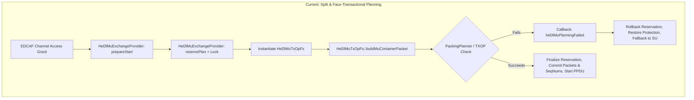
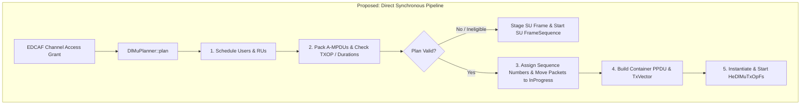

Viewed ieee80211-architectural-requirements.md:1-208
Searched for "HeDlMu"
Searched for "HeUlMu"
Searched for "VhtDlMu"
Viewed HeDlMuExchangeProvider.h:1-211
Viewed HeDlMuExchangeProvider.cc:1-669
Viewed HeDlMuTxOpFs.h:1-145
Viewed HeDlMuTxOpFs.cc:1-250
Viewed HeDlMuTxOpFs.cc:1100-1305
Viewed HeDlMuTxOpFs.cc:950-1100
Viewed HeUlTriggerService.h:1-114
Viewed VhtHcfFeature.h:1-235
Searched for "HeSoundingService"
Viewed HeSoundingService.h:1-114
Viewed HeHcfDl.cc:1-150
Viewed HeHcfDl.cc:151-293
Searched for "tryStart"
Viewed HeTxopCoordinatorService.cc:1-84
Searched for "transactionToken"
Viewed VhtHcfFeature.cc:800-900
Viewed VhtDlMuTxOpFs.cc:1-100
Viewed VhtDlMuTxOpFs.cc:100-200
Viewed VhtDlMuTxOpFs.cc:200-380
Searched for "afterCommitMutation"
Viewed Ieee80211VhtDlMuNegative_1.test:1-100

An analysis of the IEEE 802.11 Multi-User (MU) implementation in INET (`src/inet/linklayer/ieee80211/`) reveals significant opportunities for architectural and code simplification.

The current implementation was designed with extensive **distributed-transaction machinery** (transaction tokens, reservation rollback guards, multi-phase commit states, defensive queue re-scans, deep packet cloning, and speculative state rollback). When evaluated against the two fundamental invariants:
1. **INET is single-threaded** (strict run-to-completion, zero preemption, no concurrency or background mutations), and
2. **MU planning occurs entirely during a single simulation event** (zero simulation time elapses from channel contention grant to transmission handoff; no timers, packet arrivals, or peer updates can interleave),

most of this transactional scaffolding is unnecessary.

---

### 1. Analysis of the Two System Invariants

| Invariant | System Reality in OMNeT++ / INET | Architectural Implication |
| :--- | :--- | :--- |
| **Single-Threaded Execution** | OMNeT++ executes event handlers sequentially on a single thread. No locks, atomics, or thread-safety fences exist or are needed. | No concurrent thread can dequeue packets, alter Block Ack agreements, deassociate a peer, or modify PHY state between any two lines of C++ code in a function. |
| **Single-Event MU Planning** | When EDCAF wins channel access at `simTime() = T`, the decision to transmit MU, scheduler candidate selection, RU allocation, A-MPDU packing, PPDU layout generation, sequence number assignment, and frame sequence creation all happen **synchronously in the same call stack** before yielding control back to the event scheduler. | Simulation time does not advance during planning. No external network events (upper-layer packets, peer frames, timeouts, channel state changes) can occur while the plan is being formed. A plan cannot become "stale" mid-calculation. |

---

### 2. Detailed Breakdown of Current Over-Engineering

#### A. Transaction Correlation Tokens and Exchange IDs
* **Current Implementation**:
  - `HeDlMuExchangeProvider` maintains `nextTransactionToken` and `activeTransactionToken` ([HeDlMuExchangeProvider.h](src/inet/linklayer/ieee80211/mac/coordinationfunction/HeDlMuExchangeProvider.h#L129-L139)).
  - `VhtHcfFeature` maintains `nextDlMuExchangeId`, `lastRetiredDlMuExchangeId`, and `exchangeId` ([VhtHcfFeature.h](src/inet/linklayer/ieee80211/mac/coordinationfunction/VhtHcfFeature.h#L155-L157)).
  - Callbacks such as `heDlMuUserOutcome`, `heDlMuPlanningFailed`, and `vhtDlMuPlanCommitted` take a `uint64_t transactionToken` or `exchangeId` and validate it against the active token, throwing runtime errors if mismatched or duplicate ([HeDlMuExchangeProvider.cc](src/inet/linklayer/ieee80211/mac/coordinationfunction/HeDlMuExchangeProvider.cc#L570-L648)).
* **Why it can be simplified**:
  - In a single-threaded discrete event simulator, an EDCAF instance has at most **one** active frame exchange at any given instant.
  - Planning is completely synchronous; no asynchronous or interleaved planning requests can exist.
  - The frame sequence instance (`HeDlMuTxOpFs`) is directly owned by the coordination function during its multi-event execution on the medium. There are no out-of-order or duplicate completion callbacks.

#### B. Two-Phase Reservation, Rollback Guards, and Multi-Phase Lifecycles
* **Current Implementation**:
  - `HeDlMuExchangeProvider` runs a two-phase protocol: `reservePlan()` -> `ReservationRollbackGuard` -> `finalizeReservation()` -> `heDlMuPlanCommitted()` ([HeDlMuExchangeProvider.cc](src/inet/linklayer/ieee80211/mac/coordinationfunction/HeDlMuExchangeProvider.cc#L427-L523)).
  - It maintains multi-phase state machines: `StartPhase::IDLE`, `COMMITTING`, `ACTIVE` in HE ([HeDlMuExchangeProvider.h](src/inet/linklayer/ieee80211/mac/coordinationfunction/HeDlMuExchangeProvider.h#L117-L121)) and `DlMuPhase::IDLE`, `PREPARED`, `COMMITTING`, `ACTIVE`, `TERMINAL` in VHT ([VhtHcfFeature.h](src/inet/linklayer/ieee80211/mac/coordinationfunction/VhtHcfFeature.h#L141-L147)).
  - If packing fails inside `HeDlMuTxOpFs::buildMuContainerPacket()`, it triggers a synchronous callback `heDlMuPlanningFailed()` which sets `pendingPlanningFailure`, intercepts the commit, rolls back reservations, and switches to single-user fallback ([HeDlMuExchangeProvider.cc](src/inet/linklayer/ieee80211/mac/coordinationfunction/HeDlMuExchangeProvider.cc#L387-L400)).
* **Why it can be simplified**:
  - Because planning is a synchronous computation in a single event, there is no need to "reserve" packets in advance or manage rollback guards.
  - If planning and packing are structured as a **read-only / pure evaluation pipeline**, the algorithm determines complete feasibility (users, RUs, PSDU packing, TXOP limit, duration) *before* mutating any queue, sequence number, or MAC state.
  - If valid, state transitions commit in one clean, irreversible step. If invalid, the coordination function falls back to single-user transmission immediately without any rollback logic.

#### C. Deep Packet Duplication and Sequence Number State Cloning
* **Current Implementation**:
  - In [HeDlMuTxOpFs.cc](src/inet/linklayer/ieee80211/mac/framesequence/HeDlMuTxOpFs.cc#L1057-L1089) and [VhtDlMuTxOpFs.cc](src/inet/linklayer/ieee80211/mac/framesequence/VhtDlMuTxOpFs.cc#L118-L265), every original queue packet is duplicated with `originalPacket->dup()`.
  - Sequence number generator state is cloned with `originatorDataService->cloneSequenceNumberState()`.
  - Mutated headers/trailers and sequence numbers are applied to the cloned copies.
  - After commit, the original packets in the queue have their contents wiped and replaced: `originalPacket->removeAll()`, `insertAtBack(peekAll())`, `copyTags()`, `clearTags()`.
  - `VhtDlMuTxOpFs.cc` even includes fault injection hooks (`beforePacketCommit`, `afterCommitMutation`) and a `try/catch` block that rolls back sequence numbers on exceptions ([VhtDlMuTxOpFs.cc](src/inet/linklayer/ieee80211/mac/framesequence/VhtDlMuTxOpFs.cc#L340-L349)).
* **Why it can be simplified**:
  - Deep cloning packets and copying memory chunks and region tags back and forth is computationally expensive.
  - Since planning is synchronous and deterministic, packet lengths and header fields can be inspected without mutating the packets.
  - Once the transmission plan is validated, sequence numbers can be assigned directly to the original packets, headers updated in place, and packets moved from pending queues to `InProgressFrames`.

#### D. Defensive Queue Re-Validation and Membership Scanning
* **Current Implementation**:
  - In [HeDlMuTxOpFs.cc](src/inet/linklayer/ieee80211/mac/framesequence/HeDlMuTxOpFs.cc#L1202-L1211), right before committing, the code iterates over all selected packets and performs linear searches across the source queue (`sourceQueue->getPacket(i) == packet`), throwing `cRuntimeError("HE DL MU selected packet changed queue membership before commit")`.
  - Similar defensive loops exist in [VhtDlMuTxOpFs.cc](src/inet/linklayer/ieee80211/mac/framesequence/VhtDlMuTxOpFs.cc#L135-L165) throwing `VhtDlMuStalePlan`.
* **Why it can be simplified**:
  - Between the start of the planning method and the commit step in the same C++ call stack, no other code has executed. Queue contents cannot change.
  - All redundant $O(N \cdot M)$ queue membership scans can be removed.

#### E. Protection State Snapshotting and Restoration
* **Current Implementation**:
  - `HeDlMuExchangeProvider` captures protection state ([HeDlMuExchangeProvider.cc](src/inet/linklayer/ieee80211/mac/coordinationfunction/HeDlMuExchangeProvider.cc#L40-L48)), configures protection, and if planning fails mid-flight, calls `restorePendingProtection()`.
* **Why it can be simplified**:
  - Protection is only needed when a transmission actually takes place.
  - Configuring protection only upon successful plan commit removes the need for `HeDlMuProtectionSnapshot`, `captureHeDlMuProtection()`, and `restoreHeDlMuProtection()`.

#### F. Multiple Snapshot Conversions and Redundant Intermediate Structs
* **Current Implementation**:
  - Data currently flows through numerous intermediate struct formats across multiple classes:
    $$\text{Queues} \to \text{PreparationSnapshot} \to \text{ScheduleContext} \to \text{CandidateContext} \to \text{RuAllocation} \to \text{HeDlMuPlan} \to \text{PackingPlanner::Params} \to \text{PackingPlan} \to \text{HeDlMuMember} \to \text{TxVector}$$
  - Each step copies vectors, maps, MAC addresses, and capability structs.
* **Why it can be simplified**:
  - Because planning is synchronous, the scheduler and packing planner can operate on a single consolidated context without multiple layers of snapshot copying.

---

### 3. Root Cause: Inversion of Control between Planning and Execution

The primary architectural flaw causing this complexity is that **planning is currently split between the coordination function and the frame sequence**:

Because `HeDlMuTxOpFs` performs the final duration calculation and A-MPDU packing inside `buildMuContainerPacket()` *after* `HeDlMuTxOpFs` has already been instantiated and the exchange started, it can fail late and must communicate back to `HeDlMuExchangeProvider` via complex failure callbacks and rollback hooks.

---

### 4. Proposed Streamlined Architecture (The Direct Pipeline Model)

By separating **Pure Planning** from **Frame Sequence Execution**, the entire flow becomes linear, synchronous, and stateless:

### 5. Summary of Simplification Opportunities

| Component | Code / Machinery to Eliminate | Simplification Benefit |
| :--- | :--- | :--- |
| **`HeDlMuExchangeProvider`** & **`VhtHcfFeature`** | • `ReservationRollbackGuard` • `nextTransactionToken` / `activeTransactionToken` / `exchangeId` • `StartPhase::COMMITTING` / `DlMuPhase` • `reservePlan()` / `rollbackReservation()` / `finalizeReservation()` • `pendingPlanningFailure` / `restorePendingProtection()` | Removes ~500 lines of transactional state management, maps, and rollback guards. Eliminates stateful lifecycle flags. |
| **`HeDlMuTxOpFs`** & **`VhtDlMuTxOpFs`** | • Deep packet duplication (`originalPacket->dup()`) • Packet tag wiping and re-copying (`removeAll()`, `copyTags()`) • Sequence number state cloning and rollback (`cloneSequenceNumberState()`) • Defensive queue membership verification loops • Mid-construction failure notifications (`notifyPlanningFailure()`, `VhtDlMuStalePlan`) • Fault injection hooks (`beforePacketCommit`, `afterCommitMutation`) | Eliminates heap churn from packet deep-copies. `HeDlMuTxOpFs` becomes a pure execution frame sequence that never aborts during initialization. |
| **Contracts & Callbacks (`IHeDlMuExchangeCallback`, `IVhtDlMuExchangeCallback`)** | • Transaction tokens from all callback signatures • Reservation lookup methods (`getReservedHeDlMuPacket`, `isReservedHeDlMuPacket`) • Planning failure callback methods (`heDlMuPlanningFailed`, `vhtDlMuPlanningFailed`) • Multi-phase commit callbacks (`heDlMuPlanFinalized`, `heDlMuPlanCommitted`) | Reduces callback interfaces to only semantic completion events (`memberTransmitted`, `userOutcome`), fully compliant with INET event observability requirements (`AR-WLAN-OBS-EVENTS`). |
| **Data Structures** | • Redundant nested snapshots (`HeDlMuPreparationSnapshot`, `ScheduleContext`, `CandidateContext`, `Parameters`, `VhtGrantSnapshot`) | Consolidates into a single read-only scheduling/packing context. |

### Conclusion

The 802.11 INET MU implementation can be substantially simplified. Recognizing that **INET is single-threaded** and that **MU planning is an atomic, single-event operation** allows removing all distributed transaction, multi-phase reservation, packet cloning, and defensive queue re-scanning logic. Replacing this with a straightforward **Plan $\to$ Commit $\to$ Transmit** pipeline preserves 100% of IEEE 802.11 normative behavior and INET determinism while reducing code complexity, memory allocations, and execution overhead.