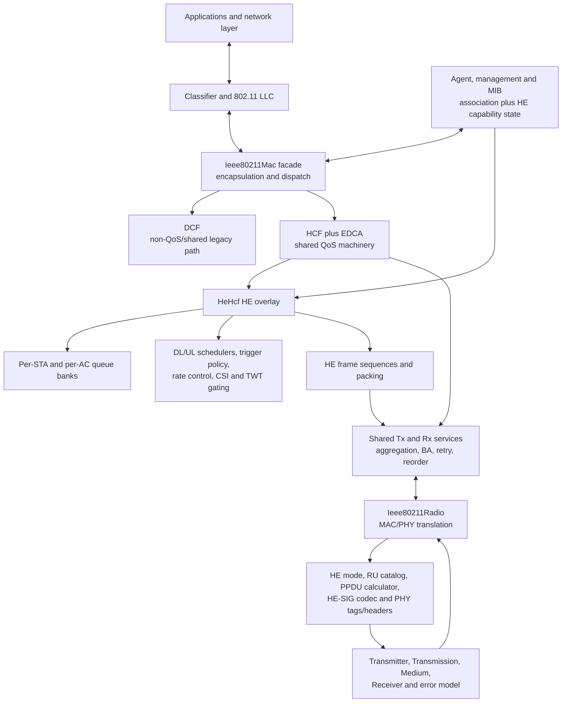
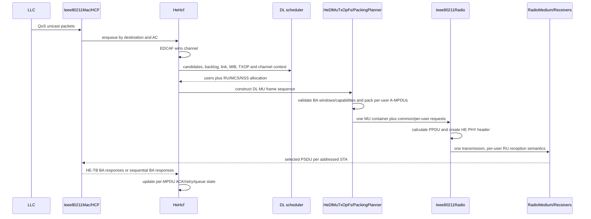

# IEEE 802.11ax (HE) architecture and implementation-quality review

## Review status and scope

This document describes the IEEE 802.11ax implementation in the checked-out
INET source tree as reviewed on 2026-07-20. It covers the module and class
architecture, dependencies, ordinary and multi-user packet flows, differences
from the pre-HE architecture, correctness-critical components, code quality,
example/walkthrough coverage, and unit-test value.

The implementation is a **packet-level, system-simulation model**. It models a
large and useful subset of HE behavior, including SU, ER SU, DL/UL OFDMA,
UORA, MU-MIMO abstractions, HE rate selection, BSR, TWT, BSS coloring and
several HE MAC features. It is not a waveform implementation or an
interoperability/certification stack. In particular, some fields and PHY
decisions are deliberately represented as model metadata or simplified
encodings. Conclusions in this document therefore distinguish:

- IEEE behavior;
- behavior actually implemented by this checkout;
- packet-level modeling decisions; and
- coverage supplied by tests or examples.

The review used static C++/NED/MSG/INI inspection, the generated IEEE corpus,
all 802.11ax `walkthrough.md` files, and the focused HE unit-test slice. It did
not rerun every example campaign or independently reproduce every numerical
result printed in the walkthroughs. Existing user changes under
`examples/ieee80211ax/dense_iot/` were left untouched.

## Executive assessment

The central architectural fact is that 802.11ax is implemented as an
**extension of the existing 802.11 MAC and packet-level radio**, not as a
separate stack. `HeHcf` specializes `Hcf`; HE reuses EDCA contention, access
categories, aggregation, Block Ack, retry/recovery, the MAC facade, and the
radio/medium abstraction. HE-specific schedulers and frame sequences are
selected when their capability and traffic preconditions hold, with a
single-user HCF path as fallback.

This is the right high-level architecture for code reuse, mixed-path behavior,
SU fallback and research extensibility: it avoids duplicating a mature MAC and
makes schedulers replaceable. Normative PHY compatibility remains incomplete.
The main cost is a large cross-layer correctness surface. A scheduling decision is not
correct unless RU geometry, MCS/NSS/coding, PPDU duration, packet packing,
tags, PHY headers, per-user power/SNIR, receiver extraction, and Block Ack
accounting all agree. A defect at any seam can produce plausible but biased
throughput results.

The strongest parts are the explicit RU/PHY calculation layer, pluggable
scheduler interfaces, capability gating, observability, and broad feature
examples. The largest risks are the stateful DL/UL exchange orchestrators,
duplicated or approximate cross-layer representations, simplified PHY error
decisions, and inherited technical debt in the generic HCF/ACK/reassembly
paths. The unit-test inventory is broad, but test value is uneven: several
tests protect meaningful invariants, while self-consistency and round-trip
tests cannot establish standard correctness without independent golden data.

## 1. Layered architecture

### 1.1 System view



The NIC compound module is
[`Ieee80211Interface`](src/inet/linklayer/ieee80211/Ieee80211Interface.ned).
It contains the LLC, classifier, agent, management, MIB, optional TWT manager,
MAC, and radio. The data-plane connections are LLC ↔ MAC ↔ radio; management
and MIB supply control and negotiated state.

The MAC is itself a modular compound/simple-module hybrid. The facade in
[`Ieee80211Mac`](src/inet/linklayer/ieee80211/mac/Ieee80211Mac.ned) owns
upper/lower packet dispatch and delegates coordination to DCF or HCF and
frame movement to shared `Tx`, `Rx`, and distribution-system services.

### 1.2 Layer and component ownership

| Layer | Main components | Responsibility and dependencies |
| --- | --- | --- |
| Node/NIC composition | `WirelessHost`, `AccessPoint`, `Ieee80211Interface` | Instantiates the WLAN interface and connects it to the node/network. The AP also bridges WLAN and Ethernet. |
| Management and state | `Ieee80211MgmtAp*`, `Ieee80211MgmtSta*`, `Ieee80211Mib`, `Ieee80211HeCapabilities`, HE management elements | Association, AID and peer state, local/advertised/negotiated HE capabilities, HE operation parameters. Schedulers and exchange logic consume this state. |
| MAC facade | `Ieee80211Mac`, `Ds`, `Tx`, `Rx` | MAC encapsulation/decapsulation, DCF/HCF dispatch, radio state and packet handoff. Shared by legacy, HT, VHT, HE and EHT paths. |
| Shared channel access | `Hcf`, `Edca`, `Edcaf`, contention, rate-selection, aggregation, fragmentation, ACK/Block Ack, retry/reorder services | Provides QoS contention, TXOP and response machinery. `HeHcf` inherits and extends it rather than replacing it. |
| HE coordination | `HeHcf`, `HeUlCoordinator`, `HeSoundingCoordinator`, `HeMuMimoCsiManager`, `HeTwtGating`, `HePreamblePuncturing` | Decides whether to use UL MU, DL MU or legacy SU; maintains HE exchange state and integrates optional HE features. |
| Queueing and scheduling | `StationQueueBankManager`, `StationQueueBank`, `IIeee80211HeDlScheduler`, `IIeee80211HeUlScheduler`, concrete HE schedulers, `HeMinstrelRateControl` | Keeps AP traffic separable by destination/AC and selects users, RUs, MCS/NSS and airtime. Schedulers receive context; they do not own radio or queues. |
| Frame-exchange construction | `HeDlMuTxOpFs`, `HeDlMuPackingPlanner`, `HeUlMuTxOpFs`, `HeSoundingFs`, `HeFrameSequenceHandler` | Builds and executes HE DL/UL/sounding sequences, packs per-user PSDUs/A-MPDUs, coordinates Trigger/BA responses and hands frames to shared Tx. |
| HE PHY model | `Ieee80211HeMode`, `Ieee80211HeRu`, `Ieee80211HePhyCalculator`, `Ieee80211HeSigCodec` | Defines HE modes, standard RU geometry, legality/timing calculation, and modeled HE-SIG-B RU allocation. |
| Cross-layer representation | `Ieee80211Frame.msg`, `Ieee80211PhyHeader.msg`, `Ieee80211Tag.msg`, serializers | Carries MAC control frames, HE common/per-user requests and indications, PPDU format and RU/user information between MAC and radio. Generated `_m.*` files are outputs, not hand-maintained architecture. |
| Radio and medium | `Ieee80211Radio`, `Ieee80211Transmitter`, `Ieee80211Transmission`, `Ieee80211RadioMedium`, `Ieee80211Receiver`, HE-capable error models | Converts the model packet to one radio transmission, computes propagation/interference and per-user reception, extracts the receiver's payload, and returns MAC packets plus indications. |

### 1.3 Effective feature selection

HE is enabled by a configuration chain, not by one class name alone:

1. `Ieee80211Interface.opMode = "ax"` propagates to the MAC mode set and
   radio/transmitter/receiver mode.
2. `Ieee80211Mac.qosStation = true` instantiates HCF.
3. `mac.hcf.typename = "HeHcf"` selects the HE coordination function.
4. AP and STA MIB parameters advertise HE abilities. Association creates
   per-peer negotiated capability state.
5. Scheduler, rate-control, TWT, spatial-reuse, puncturing and MU-MIMO
   typenames/parameters enable optional behavior.

The DL OFDMA example is a concrete configuration reference:
[`omnetpp.ini`](examples/ieee80211ax/dl_ofdma/omnetpp.ini). Its general
configuration selects `ax`, QoS/HCF, `HeHcf`, Block Ack, and an HE DL
scheduler. Some derived configurations replace the scalar radio-medium pair
with dimensional radio modules; this pairing matters because the analog
representations must be compatible.

## 2. Dependency structure and architectural decisions

### 2.1 Decisions that are architecturally sound

1. **HE is an overlay, not a fork.** `HeHcf extends Hcf`, so legacy channel
   access, QoS mapping, retry, aggregation and SU behavior remain available.
   This reduces duplication and supplies a natural fallback path.

2. **Policy is replaceable.** DL and UL schedulers, the UL trigger policy,
   rate control and several services are interfaces/NED typenames. Researchers
   can change allocation policy without rewriting the MAC exchange engine.

3. **A downlink HE MU PPDU remains one transmission.** The AP builds a model
   MU container with per-user RU payload descriptors. The radio produces one
   `Ieee80211Transmission`, while reception and error evaluation use per-user
   RU parameters. This preserves shared preamble/common airtime and concurrent
   medium occupancy. Uplink MU is different: each STA creates a concurrent HE
   TB transmission correlated with the others by Trigger ID.

4. **Geometry and timing have centralized calculation APIs.** RU allocation,
   HE-SIG mapping and PPDU legality/timing live in dedicated components rather
   than being reimplemented entirely by each scheduler and radio stage. The
   structured PHY validation result is intended to support safe planning
   failure and diagnostics, but invalid MCS values and unsupported positive RU
   tone sizes can still escape through throwing helpers.

5. **Capabilities are explicit gates.** The MIB stores local, advertised and
   negotiated state. Schedulers check channel width, OFDMA, RU, MCS/NSS,
   coding and response capabilities instead of assuming every ax peer is
   homogeneous.

6. **Failure can fall back to SU.** If traffic, Block Ack, capability or final
   PPDU construction preconditions fail, the system can stage a single-user
   frame and return to inherited HCF behavior. This is important for liveness
   and mixed-capability experiments.

7. **Observability is designed in.** HE-specific signals, watches, structured
   tags and verbose rejection reasons make allocation, PPDU and receive
   decisions inspectable in results and walkthroughs.

### 2.2 Important modeling decisions and their costs

| Decision | Benefit | Cost/risk |
| --- | --- | --- |
| Per-STA/per-AC AP queue banks | Gives schedulers stable per-destination backlog and HoL delay; avoids destructive queue scanning. | Adds queue lifecycle and packet-ownership state outside the legacy EDCAF queues. Association changes and SU fallback must preserve age, ordering and ownership. |
| Active Block Ack agreement required for DL MU | Simplifies A-MPDU packing, bitmap acknowledgment and retry integration. | This is an INET precondition, not a general IEEE DL-MU requirement. It can suppress MU service until agreement bootstrap completes and must be documented in experiments. |
| Model MU container with payload descriptors | Makes one PPDU carry many independently addressable PSDUs in the packet API. | The container is not an on-air MAC frame. Protocol-looking metadata can be mistaken for a bit-exact encoding, and the same facts may exist in chunks, tags and PHY objects. |
| Central `HeHcf` orchestration | One place can coordinate contention, queues, MIB, TWT, UL/DL priority, fallback and response accounting. | It creates a high-coupling state machine and a wide regression surface across four implementation files. |
| Packet-level FEC/error behavior | Keeps simulations tractable and permits per-user success decisions. | Does not reproduce codewords, symbol decoding or independent HE-SIG thresholds. Some per-MPDU failure placement is randomized after an aggregate failure. |
| Simplified capability subset | Exposes features that affect this model without copying unused standard fields. | A protocol-shaped capability object is not the complete HE Capability element; default/intersection/validity semantics can accidentally enable, disable or overstate features. |
| Shared generic MAC/radio | Preserves code reuse, mixed-path behavior and SU fallback while avoiding parallel implementations. | Normative PHY compatibility remains incomplete. HE correctness also depends on older HCF, ACK, reassembly, rate-selection and radio code that contains its own technical debt. Cross-mode regression is mandatory. |

## 3. Typical packet flows

### 3.1 Ordinary HE-capable single-user transmit flow

1. LLC sends a `Packet` with protocol/address and optional user-priority tags
   to `Ieee80211Mac::handleUpperPacket()`.
2. `Ieee80211Mac::encapsulate()` adds the 802.11 data/QoS header, DS address
   interpretation, TID, trailer and protocol tag.
3. QoS traffic is handed to HCF. `Hcf::processUpperFrame()` maps TID to an
   access category and enqueues it in the per-STA HE queue when applicable or
   the shared EDCAF queue otherwise.
4. EDCA contends for the channel. After a win, `HeHcf::startFrameSequence()`
   tries a pending UL trigger and a valid DL MU opportunity; if neither is
   usable, it delegates to the inherited SU HCF sequence.
5. HCF applies rate selection, optional protection/aggregation and response
   policy. Shared `Tx` waits the selected IFS, requests radio-transmitter mode
   and sends the MAC packet down.
6. `Ieee80211Radio::encapsulate()` chooses the HE mode/PPDU representation and
   adds the PHY header. The transmitter creates an `Ieee80211Transmission` and
   the radio medium propagates it.

Relevant entry points are
[`Ieee80211Mac.cc`](src/inet/linklayer/ieee80211/mac/Ieee80211Mac.cc),
[`Hcf.cc`](src/inet/linklayer/ieee80211/mac/coordinationfunction/Hcf.cc),
[`HeHcf.cc`](src/inet/linklayer/ieee80211/mac/coordinationfunction/HeHcf.cc),
and
[`Ieee80211Radio.cc`](src/inet/physicallayer/wireless/ieee80211/packetlevel/Ieee80211Radio.cc).

### 3.2 Downlink MU transmit flow



The scheduler sees one candidate per eligible destination, current channel and
TXOP limits, queue/backlog/HoL data, estimates and negotiated capabilities. It
returns a plan; it does not mutate queues. `HeDlMuPackingPlanner` and
`HeDlMuTxOpFs` revalidate the plan, enforce per-user PSDU/A-MPDU and Block Ack
window limits, remove selected MPDUs, and construct a single container with an
`Ieee80211HeMuRuPayloadHeader` for every user.

The radio converts the common/per-user request into an
`Ieee80211HeMuPhyHeader`, uses the shared HE PPDU calculator, and exposes RU,
MCS/NSS, coding, GI, packet extension, puncturing, STA ID and duration to the
transmitter/receiver. A MU-BAR Trigger plus simultaneous HE-TB Block Ack is the
main response path; sequential BAR/BA is an alternative. Completion maps the
per-user/per-MPDU outcomes back into the inherited HCF retry machinery.

### 3.3 Trigger-based uplink flow

1. The AP trigger policy requests a Basic, BSRP or NFRP exchange. The UL
   coordinator and scheduler allocate scheduled and/or random-access RUs.
2. `HeUlMuTxOpFs` sends a Trigger frame and records the Trigger ID and expected
   users/RUs.
3. Each eligible STA receives the Trigger in `HeHcf`, selects a matching
   scheduled or UORA allocation, prepares a single-TID HE-TB response, and
   attaches the requested PHY parameters.
4. STA transmissions start after SIFS. The radio admits parallel HE-TB
   reception for transmissions correlated by the same Trigger ID; RU-aware
   medium/error processing determines each response.
5. The AP matches received responses to the schedule and builds a Multi-STA
   Block Ack. Each STA uses its record to retire acknowledged MPDUs or retain
   failed ones for retry.

The current model deliberately simplifies UORA state and UL aggregation: UORA
uses collapsed rather than fully per-AC OCW state, and Basic Trigger responses
use single-TID A-MPDUs.

### 3.4 Receive flow

1. The radio medium creates a reception and the receiver computes listening,
   interference, SNIR and error decisions. For DL HE MU, it resolves the local
   STA ID and extracts only the matching user's PSDU. A non-addressed receiver
   may receive only the legacy-preamble indication needed for medium/NAV/spatial
   reuse behavior.
2. `Ieee80211Radio::decapsulate()` removes the HE PHY header, transfers PPDU
   and per-user information to `Ieee80211HeMuRxTag`, records per-MPDU outcomes,
   and restores the MAC protocol.
3. `Ieee80211Mac::handleLowerPacket()` handles A-MPDU pieces and asks shared
   `Rx` whether the frame is valid/for this interface. `HeHcf` intercepts HE
   Trigger, Multi-STA Block Ack, BSR, OMI and sounding control frames; ordinary
   data/ACK/BA behavior falls through to HCF.
4. Recipient services deaggregate, duplicate-check, reorder/defragment and
   decapsulate. `Ieee80211Mac::sendUpFrame()` restores upper-layer protocol,
   address, priority and interface indications and sends the MSDU through the
   distribution-system/LLC path.

The receive architecture is where packet-level abstraction is most visible:
HE-SIG fields are not independently decoded at distinct SNIR thresholds, and
an unsuccessful MU aggregate may map the data failure to a randomly chosen
MPDU instead of simulating each delimiter/FCS decoding outcome.

## 4. Architectural differences from pre-802.11ax support

### 4.1 IEEE basis for the comparison

The generated standards corpus was current; no source PDF was needed. Focused
searches covered “HE PHY”, “MU transmission”, “HE PPDU formats”, “HE PPDU
fields”, and “TXVECTOR parameters for HE TB response”. The principal evidence
was IEEE Std 802.11-2024:

- `80211ax-2024:chunk:09983`, Clause 27.1.1: HE's relationship to applicable
  earlier PHYs; DL/UL OFDMA, MU-MIMO, widths, GI/LTF and mandatory/optional MCS
  support;
- `80211ax-2024:chunk:10040`, Clause 27.3.1.1: DL/UL MU, OFDMA/MU-MIMO mixing
  and the contrast with VHT full-band DL MU-MIMO;
- `80211ax-2024:chunk:10075`, Clause 27.3.4: HE SU, HE MU, HE ER SU and HE TB
  formats;
- `80211ax-2024:chunk:10080`, Table 27-12 and Clause 27.3.4: common HE fields
  and HE-SIG-B's presence only in HE MU; and
- `80211ax-2024:chunk:09802`, Clause 26.5.2.3.3: the parameters a non-AP HE-TB
  response derives from a Trigger other than MU-RTS, subject to the clause's
  stated NFRP exceptions.

Normatively, HE builds on mandatory behavior from the applicable earlier PHY,
adds four HE PPDU formats, and makes an AP Trigger the controlling source for
the relevant non-AP HE-TB response parameters under the procedure and
exceptions above. INET follows that shape at packet level, but its `ax` mode
set and several packet representations are not a complete implementation of
that normative compatibility surface.

| Concern | Pre-HE architecture (legacy/HT/VHT) | HE architecture in this checkout |
| --- | --- | --- |
| Channel access | Contention and TXOP are primarily followed by a single-user exchange. | EDCA is retained, but an AP win can launch a centrally planned DL MU or Trigger-based UL MU exchange. |
| Frequency allocation | A transmission uses the channel bandwidth as a whole from the MAC's point of view. | The scheduler assigns 26–1992-tone RUs; PHY/medium/error decisions carry per-user frequency allocation. |
| Queueing | EDCAF queues are primarily AC-oriented. | An ax AP adds per-STA/per-AC queue banks so one scheduler can inspect isolated destination backlogs. |
| Scheduling locus | Rate/aggregation decisions are per frame/TXOP; no OFDMA user allocator. | Replaceable DL/UL schedulers choose users, RUs, MCS/NSS and common-duration-compatible plans. |
| PPDU representation | One PSDU/aggregate maps naturally to one PHY packet. | One model MU container carries several per-user PSDUs/A-MPDUs and is converted into one PPDU with per-user metadata. |
| Uplink | A STA normally contends and transmits independently. | AP Trigger frames coordinate simultaneous HE-TB transmissions; UORA adds contention within random-access RUs. |
| Response handling | ACK/Block Ack is normally associated with one originator/recipient exchange. | DL MU can solicit parallel HE-TB Block Acks; UL concludes with Multi-STA Block Ack and per-user/per-MPDU accounting. |
| PHY parameters | HT/VHT add wider channels, aggregation and MIMO modes but do not require HE RU allocation/HE-SIG-B/TB machinery. | HE adds four PPDU formats, 78.125-kHz subcarrier spacing, RU geometry, HE GI/LTF/coding/PE calculations and HE signaling metadata. |
| Management/state | Generic association plus HT/VHT capabilities. | HE capability/operation subsets and directional MCS/NSS maps gate OFDMA, coding, widths, responses, TWT, puncturing and MU-MIMO. |
| Efficiency features | Existing power save and interference/CCA machinery. | TWT, BSS color/OBSS-PD, dual NAV, BSR, OMI, dynamic fragmentation and NDP feedback extend the control plane. |
| Compatibility | Mode-specific paths share the common MAC/radio. | `HeHcf` explicitly falls back to HCF SU; the same shared services now form a cross-mode regression boundary. |

Architecturally, the largest change is not a new modulation class. It is the
introduction of **a scheduler-controlled, multi-recipient transaction whose
truth is distributed across queues, negotiated state, one common PPDU and
several per-user outcomes**. That change explains most of the new components
and most of the correctness risk.

### 4.2 Important implementation departures

- `opMode="ax"` alone does not select HE MU behavior. QoS defaults off and,
  even with QoS enabled, the default HCF typename remains `Hcf`; configurations
  must explicitly select `HeHcf`.
- The `ax` mode set enumerates an HE-SU-oriented set of 20/40/80/160-MHz modes
  with fixed assumptions. It does not form the full applicable legacy/HT/VHT
  compatibility union and does not model every required band/GI/LTF or the
  correct mandatory/optional MCS classification.
- Ordinary HE SU is structurally represented using inherited HT PHY header and
  VHT preamble objects and is labeled with the HT PHY protocol in the ordinary
  radio path. Explicit HE MU/TB users use the HE PHY header/protocol path. This
  is a major abstraction boundary for captures, serializers and claims about
  HE-SU field fidelity.
- DL MU requires an active QoS Block Ack agreement in INET. BSRP allocation,
  UORA OCW state and HE-TB aggregation are simplified as described in
  `HeHcf.cc`.
- The HE MU serializer is explicitly incomplete at bit level. HE-SIG decoding
  is not assigned independent preamble/header error thresholds, and the medium
  does not model synchronization/CFO/timing errors for simultaneous HE-TB
  users.
- PHY-only scenarios may derive STA ID from the low 11 bits of a MAC address
  when an association ID is unavailable. Normal associated operation should
  use the AID; the fallback must not be mistaken for normative behavior.

## 5. Components requiring extreme correctness

The following components should be reviewed and regression-gated as if a
small error could invalidate an experiment. “Extreme correctness” means that
tests need independent oracles and cross-layer invariants, not merely a clean
run.

| Priority | Component/contract | Why it is critical | Minimum convincing evidence |
| --- | --- | --- | --- |
| P0 | RU catalog, tone indices, allocation and HE-SIG codec | Wrong geometry silently changes bandwidth, overlap, power and user identity. | Standard-derived golden layouts/codes for every width, mixed layout and puncturing case; encode/decode against independent vectors. |
| P0 | HE PPDU legality and timing calculator | Symbol counts, GI/LTF, BCC/LDPC, DCM, PE and common duration directly bias throughput, NAV and collision timing. | Clause/table golden vectors including invalid boundaries, MCS/NSS/RU/FEC combinations and max-duration cases. |
| P0 | Scheduler → packing → radio parameter contract | The plan must survive revalidation and retain identical RU/MCS/NSS/coding/length/duration at every layer. | End-to-end invariant tests that compare scheduler allocation, packed descriptors, PHY header, transmission and RX tag. |
| P0 | Per-user medium, interference, SNIR and error path | OFDMA's main value disappears if users interfere incorrectly, see the wrong bandwidth, or share one global error decision. | Orthogonal-RU isolation, same-RU collision, puncturing, dimensional-channel and per-user PER tests with analytic cases. |
| P0 | Receiver STA-ID/AID resolution and payload extraction | A user must receive exactly its PSDU and non-users must not see data. | Multi-user positive/negative routing tests, duplicate AID/error cases, broadcast/legacy-preamble behavior. |
| P0 | Block Ack windows, sequence numbers, retry and packet ownership | Loss here causes silent duplication, loss, out-of-window transmission, leaks or use-after-free. | Partial BA, wraparound, full window, timeout, planning failure, fallback and multi-MPDU retry tests with queue conservation. |
| P0 | Trigger correlation and parallel HE-TB reception | UL users must be simultaneous only for the same exchange and mapped to the correct RU/AID. | Mixed Trigger IDs, late/early/missing responders, scheduled+RA collision and Multi-STA BA accounting tests. |
| P1 | Capability advertisement and negotiation | Incorrect directional intersection can schedule an unsupported width, MCS/NSS, response or optional feature. | AP↔STA asymmetric matrices, defaults, reassociation/removal and wire/model round trips. |
| P1 | HE PHY/MAC serializers and on-air/model boundary | A symmetric custom serializer can be self-consistent and still wrong; protocol-looking fields may overstate fidelity. | Standard golden octets for fields claimed bit-exact; explicit tests/documentation for model-only fields. |
| P1 | EDCA/NAV/spatial reuse/TWT integration | Incorrect gating changes who may transmit and when, biasing contention and energy results globally. | Event-order tests for NAV/dual NAV, OBSS-PD thresholds and power coupling, sleep/wake boundaries and pending frames. |
| P1 | SU fallback and shared legacy HCF/Tx/Rx | HE failure must not deadlock, reorder or regress non-HE modes. | Cross-mode DCF/HCF/HT/VHT/HE regressions, forced planning failures and mixed-peer scenarios. |
| P1 | Rate adaptation and link-estimate freshness | MCS choice drives both performance and PPDU feasibility. | Deterministic success/failure histories, stale/fresh link data, mobility, capability caps and per-user feedback. |

## 6. Verification coverage and test utility

### 6.1 Current focused unit-test result

The required HE slice was run from the repository root with ccache disabled:

```sh
set -o pipefail
CCACHE_DISABLE=1 inet_run_unit_tests \
  -m release \
  -f '(Ieee80211He|HeDlScheduler).*\.test' \
  2>&1 | tee /tmp/inet-he-unit-tests-release-20260720.log
```

Result: **exit 1; 33 total, 30 pass, 3 unexpected errors**, in 11.643 s.
The log is `/tmp/inet-he-unit-tests-release-20260720.log`.

All three errors are test-fixture compile failures. The mocks in
`Ieee80211HeMuSeqAck_1`, `Ieee80211HeDlMuTxOpFs_1`, and
`Ieee80211HeMuAddbaValidation_1` do not implement the newer pure-virtual
`IAckHandler::isRetransmission(...)` contract in
[`IAckHandler.h`](src/inet/linklayer/ieee80211/mac/contract/IAckHandler.h).
This does not demonstrate a production failure. It does demonstrate a
**regression-coverage failure**: three of the most valuable DL-MU tests are
currently dead and should make the HE regression gate fail.

The audit found 49 relevant tests in total: 33 selected by the prescribed HE
filter and 16 HE/ax/TGax companion tests outside it. Assertions and fixture
logic in all 49 were inspected; only the 33-test slice was executed in this
review.

### 6.2 Component-to-unit-test coverage

| Component family | Relevant tests | Current result/value |
| --- | --- | --- |
| RU geometry and HE-SIG-B | `Ieee80211HeRu_1`, `Ieee80211HeWireSigBEncoding_1`, parts of `Ieee80211HeMuPhyHeaderSerializer_1` | Passing and useful for catalog geometry, central-26 placement, reserved-code rejection, overlap and encode/decode. Still needs a larger independent standard-vector set and malformed-field coverage. |
| PPDU calculation, modes, FEC, PE, DCM | `Ieee80211HeUserPhyParameters_1`, `Ieee80211HeFixesBandSifsInvalidMcs_1`, `Ieee80211HeSuLdpc_1`, `Ieee80211HeLdpcPacketExtension_1`, `Ieee80211HeMode_1` | The first four protect meaningful timing/legality boundaries. `Ieee80211HeMode_1` is mostly a smoke/snapshot test; the fixed mode count is implementation-coupled and not a standards oracle. |
| Radio/transmission/receiver per-user contract | `Ieee80211HePerUserTransmission_1`, `Ieee80211HeMuRadioMedium_1`, `Ieee80211HeMuDimensionalRadioMedium_1`, `Ieee80211HeMuRx_1` | Strong focused coverage that HE metadata becomes one MU transmission, selected-RU reception is represented in scalar/dimensional paths, and receiver-assignment eligibility is checked. Direct helper use means a full AP-to-STA payload-extraction exchange is still needed. |
| RU power/noise/error behavior | `Ieee80211HeMuRuAttenuation_1`, `Ieee80211HeMuRuNoiseIsolation_1`, `Ieee80211HePerUserErrorModel_1` | Mixed. Threshold scaling and parameter sensitivity are covered, but “noise isolation” checks assignment rather than noise/SNIR, attenuation is not end-to-end, and relational PER checks are not calibration against golden curves. |
| DL schedulers | `HeDlScheduler_1`, `HeDlSchedulerQueueAware_1` | High-value coverage of widths, caps, anchor, backlog/HoL policy, path-loss groups, duration alignment and negotiated capabilities. These remain policy-coupled by design. |
| UL scheduler/coordinator/UORA/BSR | `Ieee80211HeUora_1`, `Ieee80211HeBsrBsrpIntegration_1`, `Ieee80211HeErSuBsr_1`; companion `HeUlScheduler_1` | Executed tests provide meaningful deterministic state-machine and integration coverage. `HeUlScheduler_1` is high value but was outside the prescribed filter and was not run here. |
| DL MU packing, sequencing and admission | `Ieee80211HeDlMuTxOpFs_1`, `Ieee80211HeMuSeqAck_1`, `Ieee80211HeMuAddbaValidation_1`, `Ieee80211HeMuBlockAckGating_1` | The gating test passes and protects a subtle protocol invariant. The other three intended high-value tests are compile-broken, leaving TXOP trimming, MU-BAR/timeout progression, BA-window exhaustion, fallback and ADDBA admission without live protection. |
| Block Ack sequence space | `Ieee80211HeBlockAckWindow_1` | High value: duplicates, flow isolation, wraparound, failed/partial BA and retry are covered. It does not replace the dead end-to-end frame-sequence tests. |
| HE management and STA ID | `Ieee80211HeMgmtElements_1`, `Ieee80211HeStaId_1` | High-value field/golden-octet and AID lifecycle coverage, including missing/unique/reuse/broadcast cases. Capability asymmetry and reassociation matrices should be expanded. |
| HE control-frame serialization | `Ieee80211HeUlControlFrames_1`; companions `Ieee80211TriggerFrameSerializer_1`, `Ieee80211MultiTidBlockAck_1`, `Ieee80211TwtFrames_1` | Direct HE test passes. Companions appear useful, especially Trigger golden bytes and TWT/Multi-TID representation, but were not executed by this slice. |
| Spatial reuse and puncturing | `Ieee80211HeSpatialReuse_1`, `Ieee80211HePreamblePuncturing_1` | Useful policy matrices and invalid-pattern checks. More complete allowed-pattern coverage and event-level NAV/power coupling remain desirable. |
| HE rate control | `Ieee80211HeMinstrelRateControl_1` | High value for constraints, EWMA/probing/SNIR reseeding and RU/ER-SU/coding/DCM/NSS rules. Add simulation-level convergence and fairness evidence. |
| MU-MIMO and sounding | `Ieee80211HeMuMimo_1`, `Ieee80211HeSoundingCoordinator_1` | Useful capability/CSI freshness/leakage/serialization and STA-side progression tests. They do not validate an over-the-air sounding-to-data exchange or a physical beamforming oracle. |
| TGax/dimensional channel support | `Tgax*`, `Ieee80211RbirErrorModel_1` companion tests | Source inspection shows valuable profile, path-loss, matrix, RU, MIMO/L-MMSE/RBIR and interference checks. They were outside this execution filter; some bounded statistical assertions may be platform-sensitive. |
| Export/diagnostics | `PcapRecorderRadiotapExtended_1`, MAC/PHY packet-printer companions | Radiotap HE bitfields are a high-value export contract. Printer tests are low-value diagnostic formatting tests and should never be counted as behavioral HE coverage. |

### 6.3 Tests that are weak, misleading or trivial

Passing is not sufficient for usefulness. The following tests need correction
or careful labeling:

- [`Ieee80211OnWireBitCompliance_1.test`](tests/unit/Ieee80211OnWireBitCompliance_1.test)
  contains an HE-SIG-B “golden octet” check that converts a literal vector to
  hex and compares it with the corresponding literal. It never invokes the
  encoder. This assertion is tautological and supplies no codec protection.
- `Ieee80211HeMuRuNoiseIsolation_1` does not calculate noise, SNIR or
  non-interference. It checks RU/STA assignment. Its name overstates its value.
- `Ieee80211HeMuRuAttenuation_1` verifies RU geometry and threshold scaling but
  not an end-to-end frequency-selective receive decision.
- `Ieee80211HePerUserErrorModel_1` checks useful parameter sensitivity through
  inequalities, but it does not validate calibrated PER/BER values against
  independent reference curves.
- `Ieee80211HeMode_1` is a reasonable smoke test, but a fixed total mode count
  and printed snapshots are brittle implementation checks, not protocol
  correctness.
- MAC/PHY packet-printer tests protect diagnostics only. They should not appear
  in a behavioral coverage score.
- Serializer round trips are valuable for symmetry and retention, but a
  serializer and deserializer can share the same mistake. Fields claimed to be
  bit-exact need independent golden octets and negative/reserved-value tests.

### 6.4 Unit-test actions in priority order

1. Repair the three `IAckHandler` mocks and require their successful execution
   before accepting HE MAC changes.
2. Add a second focused filter for `HeUlScheduler`, Trigger, TWT, Multi-TID,
   `Ieee80211OnWireBitCompliance`, Radiotap, `Ieee80211RbirErrorModel` and
   TGax/dimensional tests; the prescribed filter omits them.
3. Replace the tautological HE-SIG-B assertion with an encoder invocation,
   independent expected bytes, decode checks and invalid/reserved cases.
4. Turn attenuation/noise-isolation tests into actual per-RU SNIR/reception
   tests with analytic expected outcomes.
5. Add deterministic end-to-end scenarios for association/ADDBA → DL MU →
   MU-BAR/HE-TB BA, and BSR/Trigger → parallel UL → Multi-STA BA.
6. Add packet-conservation assertions across planning failure, SU fallback,
   partial BA, timeout, wraparound and teardown.

## 7. Example and walkthrough coverage

### 7.1 How to interpret this evidence

The repository contains 16 802.11ax walkthroughs and three 802.11be
walkthroughs. The tables below report **what the current walkthrough documents
configure and observe**. Most include scalar/vector, PCAP/TShark, log or
multi-seed results, which is stronger than a configuration sketch. They are
still demonstrations/analyses rather than automatically asserted regression
tests unless a separate test harness checks the claimed invariant.

No `walkthrough.md` was found under `tutorials/` or `tests/`. Four HE showcases
(`showcases/wireless/heofdma`, `hefeatures`, `bsscoloring`, and `twt`) have HE
configs but no local walkthrough and are listed separately from the 16
walkthrough-backed examples.

### 7.2 Walkthrough-backed 802.11ax features

| Walkthrough | Components/behavior exercised | Evidence quality in the document |
| --- | --- | --- |
| [`dl_ofdma`](examples/ieee80211ax/dl_ofdma/walkthrough.md) | `HeHcf`, per-STA queues, equal-size/backlog/HoL DL schedulers, widths, RU allocation and SU baseline | Behavioral: result tables plus log/PCAP checks. Strong demonstration of scheduling; not an asserted queue/BA conservation test. |
| [`ul_ofdma`](examples/ieee80211ax/ul_ofdma/walkthrough.md) | Scheduled UL OFDMA, equal-RU/backlog scheduling, UORA RA-RUs and EDCA baseline | Behavioral: scalar/PCAP/TShark and five-seed campaign. Good system evidence for UL policies. |
| [`he_bsr`](examples/ieee80211ax/he_bsr/walkthrough.md) | Explicit, stale and implicit BSR; BSRP/Basic Trigger selection; backlog scheduler | Behavioral: queries, PCAP and vector summaries. Useful cross-module evidence. |
| [`he_channel_widths`](examples/ieee80211ax/he_channel_widths/walkthrough.md) | HE SU/MU tones at 20/40/80/160 MHz | Behavioral: scalar summary and PCAP/TShark fields. Width selection is shown; exhaustive geometry is a unit-test responsibility. |
| [`frequency_selective_channel`](examples/ieee80211ax/frequency_selective_channel/walkthrough.md) | Scalar/dimensional RU reception, notch interference, TGax Model B, puncturing and time-varying profiles | Behavioral: broad scenario/result/PCAP catalogue. This is the main example-level per-RU channel evidence. |
| [`he_features`](examples/ieee80211ax/he_features/walkthrough.md) | LDPC, packet extension, puncturing, capability combinations and puncture-aware allocation | Behavioral: comparison configurations and result/PCAP analysis. Useful integration evidence for PHY feature gates. |
| [`he_rate_adaptation`](examples/ieee80211ax/he_rate_adaptation/walkthrough.md) | Fixed MCS versus `HeMinstrelRateControl`, including mobility | Behavioral: packet/MCS vectors, five-run summary and PCAP. Useful convergence demonstration, not a stable algorithm oracle. |
| [`he_er_su`](examples/ieee80211ax/he_er_su/walkthrough.md) | HE SU versus HE ER SU, repeated HE-SIG-A, MCS/RU restrictions and optional DCM | Behavioral: packet/drop queries and matched five-seed table. Good range-extension comparison. |
| [`bss_coloring`](examples/ieee80211ax/bss_coloring/walkthrough.md) | BSS color, OBSS-PD thresholds, collision case and dual NAV | Behavioral: multi-seed goodput/fairness/concurrent-airtime plus PCAP/radio vectors. Important but still a simplified spatial-reuse model. |
| [`twt`](examples/ieee80211ax/twt/walkthrough.md) | Baseline, individual announced/unannounced and broadcast TWT | Behavioral: agreement, awake and sleep scalar summaries. Good lifecycle demonstration; edge-time/event ordering needs tests. |
| [`dense_iot`](examples/ieee80211ax/dense_iot/walkthrough.md) | ax UL/DL/mixed versus ac, OFDMA, UORA, HE Minstrel and individual TWT at dense scale | Behavioral: campaign results/scalars/vectors. Broad architecture stress demonstration; many mechanisms vary, so it is weak for isolating one defect. |
| [`multi_user/mu_mimo`](examples/ieee80211ax/multi_user/mu_mimo/walkthrough.md) | DL/UL MU-MIMO allocations, sounding/CSI metadata, Basic Trigger, 80-MHz and SU/OFDMA controls | Behavioral: scalar/vector metadata and PCAP checks. Validates the packet-level abstraction, not real beamforming fidelity. |
| [`multi_user/ndp_feedback`](examples/ieee80211ax/multi_user/ndp_feedback/walkthrough.md) | NFRP Trigger and HE-TB NDP feedback response | Behavioral: scalar and PCAP observations. Narrow and useful control-flow evidence. |
| [`mac_features/dynamic_fragmentation`](examples/ieee80211ax/mac_features/dynamic_fragmentation/walkthrough.md) | Negotiated dynamic-fragmentation level/policy and static/unfragmented controls | Behavioral: packet/PCAP queries and fragment observations. |
| [`mac_features/operating_mode_indication`](examples/ieee80211ax/mac_features/operating_mode_indication/walkthrough.md) | OM Control capability and OMI for Rx NSS/channel width/UL-MU disable | Behavioral: run/result checks. Needs stronger negative/asymmetric capability tests. |
| [`mac_features/multi_tid_block_ack`](examples/ieee80211ax/mac_features/multi_tid_block_ack/walkthrough.md) | Multi-TID aggregation capability and two-TID BA scenarios | Behavioral: packet/PCAP evidence and comparison. Verify that every claimed operational path is asserted, not only represented/serialized. |

The 802.11be walkthroughs are not counted as ax feature coverage. The EHT
features walkthrough includes an explicit `BaselineAx` comparison, while the
EHT DL-OFDMA and MLO walkthroughs mainly demonstrate EHT evolution and reuse.

### 7.3 Coverage gaps visible from the walkthrough inventory

- No walkthrough isolates capability negotiation asymmetry, reassociation or
  removal while HE traffic is active.
- No walkthrough is a packet-conservation/retry torture test for partial BA,
  wraparound, missed Trigger responses, queue teardown or forced planning
  failure.
- Sounding appears as part of MU-MIMO, but the walkthrough does not establish a
  standard-accurate end-to-end beamforming/feedback oracle.
- Serializer legality, reserved values, exact HE-SIG field bits and FEC symbol
  counts properly belong in tests; walkthrough packet counts cannot validate
  them.
- Shared legacy HCF/DCF/HT/VHT behavior is not covered by the ax walkthrough
  inventory. Cross-mode regression must be supplied by separate tests.

## 8. Code-quality assessment

### 8.1 Rubric

The rating is architectural rather than cosmetic:

- **5 — strong:** cohesive boundary, explicit contract/ownership, defensive
  validation, independent high-value tests;
- **4 — sound:** maintainable design with bounded gaps;
- **3 — mixed:** useful structure but important coupling, validation or test
  limitations;
- **2 — fragile:** correctness-critical, stateful or duplicated logic with
  weak contracts or known defects;
- **1 — unsafe:** should not be relied on for its advertised behavior.

Risk and quality are separate. A well-written numerical component can still be
high risk because one wrong formula invalidates results. Conversely, a low-risk
printer can be mediocre without threatening simulation correctness.

### 8.2 Component quality matrix

| Component family | Rating | Risk | Assessment and flag |
| --- | ---: | --- | --- |
| Interface/NED composition and HE activation | 4 | Medium | Clear replaceable composition and explicit typenames. The fact that `ax` does not itself imply QoS/`HeHcf` is flexible but easy to misconfigure; add configuration-contract tests and clearer top-level presets. |
| HE capabilities, MIB and management negotiation | 3 | Medium-high | Cohesive state ownership and good traceability, but the modeled subset is incomplete and some directional response capabilities are collapsed into symmetric booleans. **Improve before relying on asymmetric peers.** |
| `HeHcf`, queue-bank and DL/UL coordination | 2 | High | Feature-rich and observable, and split across `HeHcf*.cc`, but still a tightly coupled state machine using concrete module lookups/casts, raw packet ownership and broad responsibility. **Priority refactor.** |
| DL/UL scheduler interfaces and coordinators | 3 | Medium-high | Good replaceable-policy architecture and meaningful tests. Release safety is weakened because malformed extension output is guarded largely by assertions; context collection also reaches concrete radio types. **Add shared runtime validation.** |
| DL/UL frame sequences and packing | 2 | High | The design separates planning from execution to a degree, but queue mutation, packet ownership, BA state, timeout and fallback remain difficult to reason about. Three intended core tests are dead. **Priority correctness and ownership work.** |
| HE rate control | 3 | Medium-high | Focused algorithm and strong unit scenarios, but fresh SNIR is lost for a new peer and `updateInterval` has unclear/dead behavior. **Fix first-selection state and temporal contract.** |
| RU catalog and allocation | 4 | Extreme | Dedicated, table-traceable geometry and useful unit coverage. It remains numerically critical and needs exhaustive independent vectors, especially mixed/punctured layouts. |
| HE PPDU calculator | 2 | Extreme | Centralizing legality/timing is excellent, but the current per-PPDU stream grouping is wrong for multi-RU OFDMA and the advertised non-throwing API can throw. **Correct before trusting dense/high-user OFDMA results.** |
| HE-SIG codec and PHY serializer | 2 | Extreme | Explicit codec boundary and comments are strengths. Current HE-SIG-A semantics are wrong in several fields; serializer round trips are insufficient, puncturing input is ignored in one encoding path, and some required container state is not serialized. **Correct with independent golden bits.** |
| HE mode/mode-set representation | 2 | High (for fidelity-dependent studies) | Reuses established abstractions but represents ordinary HE SU with HT/VHT-shaped objects and has an incomplete compatibility/mandatory-mode surface. **Improve or label the abstraction much more explicitly.** |
| Radio/transmitter/medium/receiver | 2 | Extreme | Correct high-level one-PPDU/per-user design, scalar and dimensional support, good indications. High coupling to parallel tags/chunks plus idealized isolation/synchronization and randomized MPDU failure placement limit fidelity. **Treat as a research abstraction, not a conformance PHY.** |
| Optional HE features: TWT, BSS color, BSR, OMI, fragmentation, NDP, MU-MIMO | 3 | Feature-dependent | Broad, modular feature coverage with walkthrough evidence and several focused tests. Semantics are intentionally partial; MU-MIMO is a metadata/leakage abstraction, and full edge-state coverage is absent. **Adequate for controlled studies with documented assumptions, not blanket compliance claims.** |
| HE unit-test layer | 3 | High residual | Breadth is a strength and many tests are genuinely useful. Three critical compile-broken fixtures, a tautology and several overstated names leave material holes. **Regression gate currently unhealthy.** |

### 8.3 Concrete correctness/code-quality findings

#### High severity

1. **The PHY calculator groups spatial streams across the whole OFDMA PPDU
   instead of per MU-MIMO RU.** At
   [`computeHePpduParameters()`](src/inet/physicallayer/wireless/ieee80211/packetlevel/Ieee80211HePhyCalculator.cc#L197),
   the model sums every user's streams. This creates two related problems:

   - it rejects a multi-RU PPDU when the global sum exceeds eight even if every
     individual RU is within its eight-stream MU-MIMO limit; and
   - it derives the common HE-LTF count from that global sum rather than the
     maximum initial per-RU requirement.

   IEEE evidence is `80211ax-2024:chunk:10198`, Clause 27.3.11.10, and
   `80211ax-2024:chunk:10049`, Table 27-8. Selecting an allowed HE-LTF count
   above the minimum is not by itself noncompliant: the clause permits
   `N_HE-LTF` in `{1,2,4,6,8}` at or above the per-RU maximum, subject to
   receiver capability. The model nevertheless overstates airtime and can
   exceed negotiated multi-RU receive capability because it uses neither the
   per-RU maximum nor that capability.

   **Trigger / failure / verify:** request nine separate one-stream 26-tone RUs
   in 20 MHz. The current calculator rejects the legal user geometry. The
   regression should assert a valid PPDU and `numberOfHeLtfSymbols == 1`, then
   add multi-stream-per-RU cases that check the per-RU limit, common maximum and
   negotiated capability.

2. **HE-SIG-A serialization assigns incorrect meanings to several fields.**
   At
   [`Ieee80211HeMuPhyHeaderSerializer::serialize()`](src/inet/physicallayer/wireless/ieee80211/packetlevel/Ieee80211PhyHeaderSerializer.cc#L294),
   the serializer writes user count where HE-SIG-B symbol count is required,
   does not correctly select compressed full-band MU-MIMO signaling, fails to
   encode the computed HE-LTF count, and uses a common coding choice for a field
   whose meaning is LDPC Extra Symbol Segment. The normative references are
   `80211ax-2024:chunk:10159` for B18–B25 and
   `80211ax-2024:chunk:10160` for HE-SIG-A2 B8–B15.

   **Trigger / failure / verify:** serialize a noncompressed two-user 20-MHz
   allocation whose HE-SIG-B symbol count differs from the user count, then a
   compressed full-band MU-MIMO allocation. Current round trips preserve the
   implementation's own wrong meanings. Independent golden bits must check
   symbol count, compression, HE-LTF and LDPC-extra-symbol fields.

3. **High for HE-SU wire/protocol identity; medium for packet-level airtime
   studies: ordinary HE-SU identity is inherited from HT/VHT.** HE mode
   [`createHeader()`](src/inet/physicallayer/wireless/ieee80211/mode/Ieee80211HeMode.h#L112)
   returns `Ieee80211HtPhyHeader`,
   [`createPreamble()`](src/inet/physicallayer/wireless/ieee80211/mode/Ieee80211HeMode.h#L162)
   returns `Ieee80211VhtPhyPreamble`, and the ordinary path selected in
   [`Ieee80211Radio`](src/inet/physicallayer/wireless/ieee80211/packetlevel/Ieee80211Radio.cc#L377)
   tags the packet as HT PHY. HE timing remains available through the mode, but
   serialized/captured protocol identity is HT.

   **Trigger / failure / verify:** encapsulate an ordinary HE-SU packet with no
   MU users and assert header type, protocol tag and exported capture identity.
   Until this is corrected or explicitly bounded, do not use the path to claim
   HE-SU field, preamble-decoding or capture fidelity.

#### Medium severity

4. **The advertised non-throwing PHY validation API can throw.** The result is
   documented in
   [`Ieee80211HePhyCalculator.h`](src/inet/physicallayer/wireless/ieee80211/packetlevel/Ieee80211HePhyCalculator.h#L179),
   but validation beginning in
   [`computeHePpduParameters()`](src/inet/physicallayer/wireless/ieee80211/packetlevel/Ieee80211HePhyCalculator.cc#L88)
   does not contain every throwing helper.

   **Trigger / failure / verify:** pass MCS 12 and then a positive 27-tone RU.
   Both currently throw instead of returning an invalid result. Add explicit
   input bounds/exception containment and assert non-throwing invalid results.

5. **Essential MU container delimiting state is lost through serialization.**
   The payload-header serializer documents omitted runtime-only fields at
   [`Ieee80211PhyHeaderSerializer.cc`](src/inet/physicallayer/wireless/ieee80211/packetlevel/Ieee80211PhyHeaderSerializer.cc#L646),
   including `mpduLength`, while receiver extraction at
   [`Ieee80211Receiver.cc`](src/inet/physicallayer/wireless/ieee80211/packetlevel/Ieee80211Receiver.cc#L211)
   depends on that field and interprets zero as an NDP.

   **Trigger / failure / verify:** serialize and deserialize a payload header
   with `mpduLength = 100 B`; it returns zero and changes extraction semantics.
   Preserve all parsing-critical fields or use an explicitly non-wire container
   that cannot enter the wire serializer.

6. **Response capabilities are negotiated with ambiguous directionality.**
   [`negotiateHeCapabilities()`](src/inet/linklayer/ieee80211/mib/Ieee80211HeCapabilities.h#L142)
   intersects `muBarTriggerRx` and `heTbBlockAckTx` symmetrically, while the AP
   later interprets them as peer abilities in
   [`HeHcfDl.cc`](src/inet/linklayer/ieee80211/mac/coordinationfunction/HeHcfDl.cc#L180).

   **Trigger / failure / verify:** set local AP `muBarTriggerRx=false` and peer
   STA `muBarTriggerRx=true`. The AP-side peer contract should still permit
   MU-BAR transmission if its transmit capability exists; the current
   intersection disables it. Model and test local-TX/peer-RX and
   local-RX/peer-TX separately.

7. **Scheduler extension results rely too heavily on debug assertions.** The
   public extension boundary uses assertions around malformed allocations in
   [`HeUlCoordinator.cc`](src/inet/linklayer/ieee80211/mac/coordinationfunction/HeUlCoordinator.cc#L240)
   and
   [`HeDlMuTxOpFs.cc`](src/inet/linklayer/ieee80211/mac/framesequence/HeDlMuTxOpFs.cc#L704).

   **Trigger / failure / verify:** make a mock scheduler return duplicate RU
   indices, an invalid AID/MCS/NSS, a null queue or zero duration in a release
   build. It must return a structured diagnostic before queue/state mutation,
   not depend on a compiled-out assertion.

8. **A fresh HE-Minstrel peer discards a just-reported SNIR.** The scheduler
   reports SNIR before selection in
   [`HeDlSchedulerBase.cc`](src/inet/linklayer/ieee80211/mac/scheduler/HeDlSchedulerBase.cc#L176),
   but [`reportHeRxSnir()`](src/inet/linklayer/ieee80211/mac/ratecontrol/HeMinstrelRateControl.cc#L218)
   updates only already-created rate entries. All initial rates therefore get
   the same probability; a non-probe selection chooses the highest-throughput
   candidate, while the configured lookaround path may choose a random probe.

   **Trigger / failure / verify:** with `lookaroundRatio=0`, report low SNIR for
   a fresh peer before first selection and compare it with an unreported peer;
   the current choices are identical. Preserve peer-level latest
   SNIR/timestamp and define or remove the unused update-interval behavior.

9. **Puncturing is not encoded in serialized HE signaling.**
   [`encodeHeSigBCommonField()`](src/inet/physicallayer/wireless/ieee80211/packetlevel/Ieee80211HeSigCodec.cc#L187)
   discards its puncturing mask, the
   [`PHY serializer`](src/inet/physicallayer/wireless/ieee80211/packetlevel/Ieee80211PhyHeaderSerializer.cc#L343)
   calls it without a mask, and HE-SIG-A bandwidth encoding is limited to
   unpunctured values derived from RU extent.

   **Trigger / failure / verify:** serialize otherwise identical punctured and
   unpunctured 80/160-MHz headers; they currently produce identical bytes. Add
   paired masked/unmasked golden vectors and invalid-pattern rejection.

10. **The `ax` mode set is not a complete HE compatibility contract.** The
    mode catalog in
    [`Ieee80211ModeSet.cc`](src/inet/physicallayer/wireless/ieee80211/mode/Ieee80211ModeSet.cc#L486)
    omits the full band/GI/LTF/80+80 and applicable mandatory earlier-mode
    surface, and its mandatory MCS labeling does not reflect mandatory MCS 0–7
    versus optional 8–11 (`80211ax-2024:chunk:09983`, Clause 27.1.1).

    **Trigger / failure / verify:** configure an ax receiver and present a
    mandatory applicable earlier-PHY PPDU; generic admission at
    [`Ieee80211Receiver.cc`](src/inet/physicallayer/wireless/ieee80211/packetlevel/Ieee80211Receiver.cc#L432)
    can reject a mode absent from the ax set. Add band × mode compatibility
    tests and separate a compact simulation preset from a standards-accurate
    capability/mode set.

### 8.4 Positive code-quality observations

- HE-specific source often cites the relevant IEEE clause and states modeling
  simplifications directly. This is materially better than leaving users to
  infer fidelity from class names.
- RU, PHY calculation, scheduling policy, frame sequence, MIB and radio stages
  are distinct concepts rather than one monolithic implementation.
- Structured result objects, explicit fallback, detailed rejection messages,
  watches/signals and packet tags make failures diagnosable.
- Scheduler families share base behavior and expose narrow policy differences.
- The recent split of HE HCF behavior across `HeHcf.cc`, `HeHcfDl.cc`,
  `HeHcfUl.cc` and `HeHcfTxRx.cc` improves file-level navigation, even though
  class-level responsibility remains broad.
- Example breadth is unusually good for a packet-level Wi-Fi feature branch.

## 9. Recommended architectural improvements

### Immediate correctness gate

1. Correct per-RU stream grouping/HE-LTF calculation and HE-SIG-A semantics.
2. Repair the three compile-broken DL-MU unit fixtures and add independent
   golden tests that fail on the two PHY defects.
3. Make PHY/scheduler validation genuinely non-throwing and runtime-active in
   release builds.
4. Resolve `mpduLength`/container serialization before relying on byte-level,
   distributed or externally recorded representations.

### Next architectural changes

1. Introduce validated `HeCommonTxVector` and `HeUserTxVector` value objects as
   the single source of truth from scheduler through packing, calculator,
   radio, transmission, receiver and indication. Avoid parallel fields with
   the same meaning in schedule structs, chunks, tags and headers.
2. Make DL/UL planning transactional: create an immutable validated plan and
   selected-packet handles, then perform one explicit queue/in-progress commit
   with complete rollback ownership.
3. Split `HeHcf` responsibility into services for DL exchange, UL
   trigger/UORA, queue banks, capabilities, TWT and sounding/CSI. Keep one
   small coordinator responsible only for ordering those services after EDCA.
4. Replace concrete radio/submodule discovery in scheduler context collection
   with a narrow HE link/PHY context interface.
5. Represent directional capability contracts explicitly and separate
   complete on-air fields from simulation-only feature state.
6. Give model-only container chunks/tags unmistakable names/types and prevent
   their registration as wire headers unless every parsing-critical field is
   serialized.
7. Separate “compact system-simulation ax preset” from a standards-accurate HE
   mode/capability set and document the intended fidelity of each.

### Verification architecture

1. Maintain independent standard-derived vectors for RU layouts, HE-SIG-A/B,
   management elements, Trigger/Multi-STA BA fields and PPDU timing.
2. Add cross-layer TxVector invariants that compare scheduler output, packed
   descriptors, PHY header, transmission and RX tag.
3. Add deterministic end-to-end event/packet checks for DL MU and UL Trigger
   exchanges, including partial loss, late/missing users and queue
   conservation.
4. Gate shared changes with DCF/HCF/HT/VHT/HE compatibility tests, not only HE
   unit tests or fingerprints.
5. Retain walkthrough campaigns for research-level performance and scale, but
   extract their protocol invariants into automated regression checks.

## 10. Final verdict

The current implementation has a credible and extensible architecture for
packet-level Wi-Fi 6 research. Its core decision—extend HCF/EDCA and the shared
radio with HE schedulers, frame sequences and per-user PHY semantics—is sound.
The breadth of implemented features and examples is a major strength.

It should not currently be described as standards-accurate across the whole HE
PHY/MAC surface. Two high-severity PHY defects, an incomplete ordinary-HE-SU
representation, several cross-layer contract risks and three dead critical
tests prevent that conclusion. The code is useful today for controlled
experiments whose assumptions match the model, but experiments using more than
eight users in one OFDMA PPDU, exact HE-SIG or puncturing bytes, HE-SU capture
identity, asymmetric MU-BAR/HE-TB response capabilities, or exact PHY preamble
timing should be blocked or explicitly caveated until the corresponding
defects and tests are addressed.

The most important engineering goal is not adding another HE feature. It is
making the existing multi-user TxVector and packet-ownership contracts single,
validated, transactional and independently testable from scheduler to
receiver.
